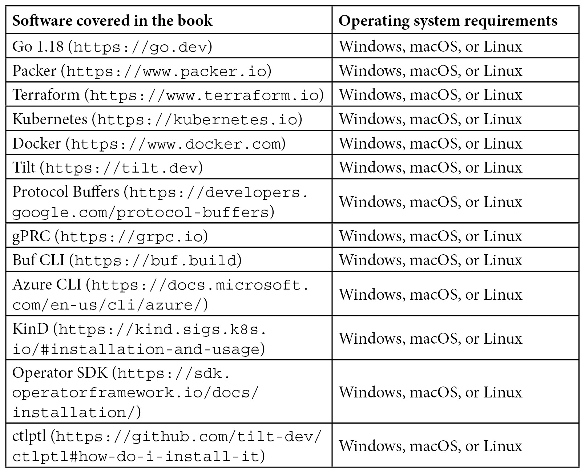

# 前言

当你年纪渐长，我觉得大多数人都会反思自己的生活。他们是如何走到今天的，在哪些地方成功，在哪些地方失败。坦率地说，我可以说我在职业生涯中有过失败。我知道从失败开始一本书是很不寻常的，但我想，为什么要开始一本充满关于我超乎想象成功的谎言的书呢？

我的理想更像是吉米·巴菲特，而不是沃伦·巴菲特。保持对任何事情的兴趣超过几年对我来说是一种挑战，而我认为辛勤工作的表现就是在夏威夷的海滩上喝着皮纳科拉达。唉，我的梦想没有实现。我离这个梦想最近的一次，是为一个总是穿着夏威夷衬衫的老板工作，我觉得这算不上。

这一切“自动化专业知识”都源于我希望尽可能少做工作的需求。当我还是桌面支持技术员时，我需要找到一种方法，在几个小时内完成大量机器的构建，而不是手动安装 Windows 和应用程序。我想把我的时间花在办公室里玩视频游戏、读书，或者四处走走与人交谈。当我做网络工程师时，我希望人们在我舒适地睡在校园交换机机房里的时候，停止给我发送页面。于是，我写了一些工具，让其他人能够切换 VLAN 端口或清除网络端口的安全参数，而无需打电话给我。为什么每周都手动平衡 BGP 流量，反正我可以写一个程序，利用 SFLOW 数据来完成这项工作？

一切进展得很顺利，直到我变得有些雄心壮志，去了 Google。我写了几个工具，帮助自己让工作变得更轻松，比如弄清楚是否是因为正在进行的计划工作或程序导致的值班页面，或者是为数据中心的所有负载均衡器提供配置的程序。那时候，Google 有很多按摩椅和其他设施，我宁愿利用这些，而不是在与亚特兰大超负荷工作的硬件运维技术员通话的同时，在 IRC 频道里敲打为什么我的网络排水管仍然存在。

然而，随后人们开始想要使用我的工具。我的朋友 Adel 会问我，是否能做一些工具来编程设施路由器，或者验证 Force10 路由器是否设置正确。而且他是一个非常好的人，你根本无法拒绝。或者 Kirk 会过来问我们如何自动化边缘路由器的启用，因为他的团队已经超负荷工作了。结果，我没有让我的工作变得更轻松，反而花了更多时间帮别人简化工作！

希望我的失败能帮助你成功（我父亲曾经说过，没有人是完全没用的；他们总可以作为坏榜样）。

本书充满了我在职业生涯中使用过的许多方法论，并且有我认为目前最适合 DevOps 的语言——Go。

David（我的合著者，他稍后会自我介绍）和我来自 DevOps 世界的两个极端。我来自一个几乎不使用商业或标准开源软件的思潮。所有 DevOps 工具都是内部开发的，并且根据特定环境量身定制。David 则来自一个你尽可能多使用开源软件的思潮，比如 Kubernetes、GitHub、Docker、Terraform 等等……这样，你可以利用一系列可用且流行的工具，这些工具可能不是完全符合你需求的，但它们有支持网络和众多选项。雇佣已经熟悉行业标准工具的工程师比雇佣使用自定义工具集的工程师更容易。在这本书中，你将会看到这两种思想和方法的结合。我们认为，现成工具和自定义工具的混合能够为你带来最大的性价比。

我们真诚的希望这本书不仅能为你提供使用 Go 进行 DevOps 所需的指南，还能让你具备编写自己的工具或修改现有工具的能力，利用 Go 的强大功能来扩展任何公司的运营需求。如果没有其他收获，David 和我都会把我们的收入捐赠给“无国界医生”，所以如果你购买了这本书，哪怕没有其他收获，你也将帮助一个很有意义的事业。

但也许有一天你会坐在海滩上，收着工资单，而你的自动化流程正处理日常事务。我会继续为这个目标努力，所以如果你先达成了目标，替我喝一杯。

话虽如此，我想向大家介绍我的尊敬的合著者，David Justice。

正如 John 所提到的，我们来自不同的背景，但我们发现自己在处理相似的问题领域。我的背景是软件开发和软件工程，涉及从移动应用开发、网页开发、数据库优化，到机器学习和分布式系统等各个方面。我的重点从来都不是 DevOps。我可以算是一个偶然的 DevOps 从业者。我的 DevOps 技能是为了提供不断增长的商业价值的必要性所驱动的，这要求我自动化所有与交付新功能和修复缺陷无关的工作。发展 DevOps 技能的另一个动机是我希望能够持续部署代码并安稳地过夜。没有什么能像经营一家初创公司并且是唯一一个需要在凌晨三点解决高优先级问题的人那样，鼓励你去建立弹性系统和自动化流程。

我在这里描述的动机应该为我倾向于选择那些能够迅速应用且在开源社区中有大量支持的解决方案提供依据。如果我能找到一个拥有优质文档的开源解决方案，能够很好地完成我大部分的需求，那么我可以在需要时将其余部分拼接起来（如果深入挖掘，几乎每个解决方案的底层都可能是一些肮脏的 Bash 脚本）。为了让我或我的团队投入大量时间和精力去构建定制工具，我们需要获得相当可观的投资回报。而且，当我想到定制工具时，我也会考虑到持续的维护成本和对新团队成员的培训。指引新团队成员学习像 Terraform 这样的项目是简单的，那里有很好的文档和无数的博客文章，详细描述了每个可能遇到的场景。新团队成员也很有可能已经了解 Terraform，因为他们在前一份工作中就使用过它。这种理由促使我在批准一个构建定制工具的项目时需要有充分的证据。出于这些原因，我花了相当多的时间使用开源的 DevOps 工具，并且我也把自己作为一项业务，尽力在扩展这些工具上做到最好。

在本书中，你将找到使用 Go 和标准库完成任务的各种定制工具。然而，你也会发现几个如何使用现有开源工具来完成那些本来需要大量定制代码才能实现的任务的示例。我相信我们不同的方法为内容增加了价值，并为你提供了理解在发明自己的解决方案或扩展现有解决方案以解决常见 DevOps 任务时所涉及的权衡所需的工具。

正如 John 所说，我也希望这本书能帮助你达到一种类似禅宗的自动化掌控状态，以便你能跟随 John 的步伐，过上像 Jimmy Buffet 而非 Warren Buffet 那样的生活。

# 本书适用对象

本书适用于任何希望使用 Go 来开发自己的 DevOps 工具或与如 Kubernetes、GitHub Actions、HashiCorp Packer 和 Terraform 等 DevOps 工具集成自定义功能的人。你应该有某种编程语言的经验，但不一定是 Go。

# 本书内容

*第一章*，*Go 语言基础*，介绍了 Go 语言的基础知识。

*第二章*，*Go 语言基础*，介绍了 Go 语言的基本特性。

*第三章*，*设置您的开发环境*，解释了如何设置 Go 开发环境。

*第四章*，*文件系统交互*，探讨了如何使用 Go 与本地文件系统进行交互。

*第五章*，*使用常见数据格式*，讲解了如何使用 Go 读取和写入常见的文件格式。

*第六章*，*与远程数据源交互*，探讨了如何使用 Go 与 gRPC 和 REST 服务进行交互。

*第七章*，*编写命令行工具*，展示了如何用 Go 编写命令行工具。

*第八章*，*自动化命令行任务*，介绍了如何利用 Go 的 exec 和 SSH 包来自动化工作。

*第九章*，*使用 OpenTelemetry 进行可观测性*，探讨了如何使用 OpenTelemetry 与 Go 进行更好的仪表化和警报设置。

*第十章*，*使用 GitHub Actions 自动化工作流*，展示了如何使用 GitHub 进行持续集成、发布自动化和使用 Go 进行自定义操作。

*第十一章*，*使用 ChatOps 提高效率*，讲解了如何用 Go 编写 ChatOps 服务，以提供操作性洞察和有效地管理事件。

*第十二章*，*使用 Packer 创建不可变基础设施*，解释了如何自定义 HashiCorp 的 Packer，自动化在 AWS 上创建虚拟机镜像。

*第十三章*，*使用 Terraform 进行基础设施即代码*，展示了如何定义自己的自定义 Terraform 提供程序。

*第十四章*，*在 Kubernetes 中部署和构建应用程序*，探讨了如何编程和扩展 Kubernetes API。

*第十五章*，*云编程*，解释了如何使用 Go 来配置和交互云资源。

*第十六章*，*为混乱设计*，讨论了如何使用速率限制器、集中式工作流引擎和策略来减少爆炸半径。

# 为了充分利用本书

你需要具备一定的编程经验，但不一定是 Go 语言经验。你需要对任何支持的操作系统的命令行工具有基本了解。具有一些 DevOps 经验会更有帮助。



**如果你使用的是这本书的数字版，建议你亲自输入代码或从书籍的 GitHub 仓库获取代码（链接将在下一节提供）。这样可以避免与复制粘贴代码相关的潜在错误。**

本书大量依赖 Docker 和 Docker Compose，帮助你设置在 Linux 上原生运行的集群配置。虽然可以在 Windows 上使用 **Windows Subsystem for Linux**（**WSL**）来进行本书的操作，但作者并未对此进行测试。另外，许多练习也可以在其他符合 POSIX GNU 标准的操作系统上完成。 *第十二章*，使用 Packer 创建不可变基础设施，需要一个运行 Linux 虚拟机的 AWS 账户，*第十三章*，“*基础设施即代码与 Terraform*” 和 *第十五章*，“*编程云端*” 需要一个 Azure 账户。

# 下载示例代码文件

你可以从 GitHub 下载本书的示例代码文件，网址为 [`github.com/PacktPublishing/Go-for-DevOps`](https://github.com/PacktPublishing/Go-for-DevOps)。如果代码有更新，将在 GitHub 仓库中更新。

我们还提供来自我们丰富书籍和视频目录的其他代码包，可以在[`github.com/PacktPublishing/`](https://github.com/PacktPublishing/)查看。快去看看吧！

# 下载彩色图片

我们还提供了一份 PDF 文件，里面有本书中使用的截图和图表的彩色图像。你可以在此下载：`static.packt-cdn.com/downloads/9781801818896_ColorImages.pdf`。

# 使用的约定

本书中使用了许多文本约定。

`文本中的代码`：表示文本中的代码词汇、数据库表名、文件夹名、文件名、文件扩展名、路径名、虚拟网址、用户输入和 Twitter 账号。示例：“在你的用户主目录下设置一个名为 `packer` 的目录。”

代码块的格式如下：

```
packer {
  required_plugins {
    amazon = {
      version = ">= 0.0.1"
```

当我们希望引起你对代码块中特定部分的注意时，相关的行或项目将以粗体显示：

```
source "amazon-ebs" "ubuntu" {
  access_key = "your key"
  secret_key = "your secret"
  ami_name      = "ubuntu-amd64"
  instance_type = "t2.micro"
```

任何命令行输入或输出都写作以下格式：

```
sudo yum install -y yum-utils sudo yum-config-manager --add-repo https://rpm.releases.hashicorp.com/AmazonLinux/hashicorp.repo sudo yum -y install packer
```

**粗体**：表示一个新术语、重要词汇或屏幕上的内容。例如，菜单或对话框中的文字通常会以 **粗体** 显示。示例：“你需要在 GitHub 仓库的 **设置** | **机密** 中找到并点击提供的按钮，**新建仓库机密**。”

提示或重要说明

如下所示。

# 联系我们

我们始终欢迎读者的反馈。

`customercare@packtpub.com`，并在邮件主题中注明书名。

**勘误**：尽管我们已经尽力确保内容的准确性，但难免会出现错误。如果你发现本书中有错误，我们将非常感谢你向我们报告。请访问 [www.packtpub.com/support/errata](http://www.packtpub.com/support/errata) 并填写表单。

`copyright@packt.com` 以及相关链接。

**如果你有兴趣成为作者**：如果你在某个领域有专业知识，并且有兴趣写作或为书籍贡献内容，请访问 [authors.packtpub.com](http://authors.packtpub.com)。

# 分享你的想法

一旦你读完*Go for DevOps*，我们很想听听你的想法！请[点击这里直接进入亚马逊书籍评论页面](https://packt.link/r/1801818894)并分享你的反馈。

你的评价对我们以及技术社区非常重要，它将帮助我们确保提供优质的内容。
