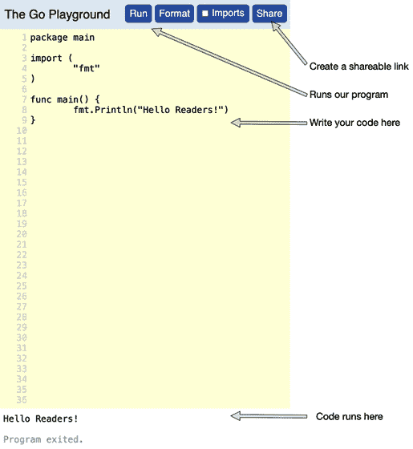
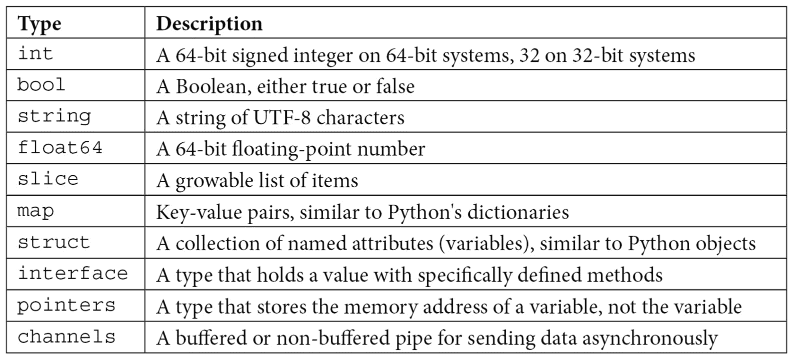
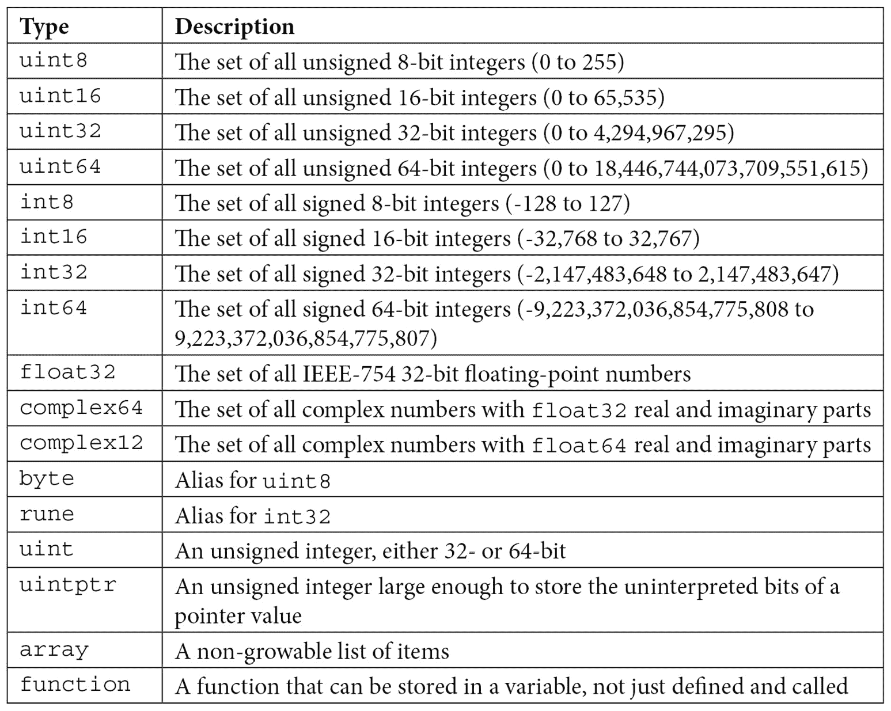
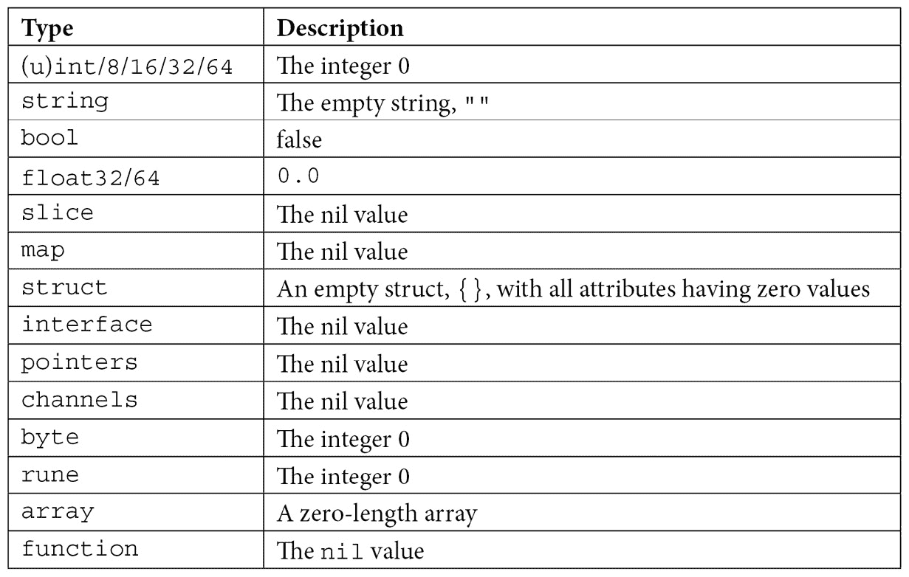

# 第一章：Go 语言基础

**DevOps** 是一个自 2000 年代初以来就存在的概念。它是依赖于编程技能的运维学科的普及，结合了 *由敏捷开发推广的开发心理学*。

**站点可靠性工程** (**SRE**) 现在被认为是 DevOps 的一个子学科，尽管它可能是 DevOps 的前身，并且更加依赖软件技能和 **服务级义务** (**SLO**)/**服务级协议** (**SLA**) 建模。

在我早期在 Google 的工作中，像今天许多 DevOps 团队一样，我们大量使用 Python。我认为 C++ 对许多 SRE 来说太痛苦了，而我们有 Python 大腕 *Guido van Rossum* 和 *Alex Martelli*。

但随着时间的推移，许多使用 Python 的团队开始遇到扩展性问题。这些问题包括从 Python 内存耗尽（需要我们自己实现 `malloc`）到 **全局解释器锁** (**GIL**) 阻止我们真正的多线程处理。在大规模应用中，我们发现缺乏静态类型导致了大量本应在编译时捕获的错误。这与生产环境中的服务多年前遇到的问题相似。

但 Python 带来的问题不仅仅是编译时和服务扩展的问题。仅仅将 Python 版本升级到新版本，就可能导致服务停止工作。Google 机器上运行的 Python 版本经常被升级，并暴露出旧版本中没有的代码 bug。与编译后的二进制文件不同，你不能仅仅回滚到旧版本。

我们中有几位来自不同组织的人，正在寻找不必使用 C++ 的方法来解决这些问题。就我个人的经历来说，我从我们悉尼办公室的同事那里听说了 **Go**（*嘿，Ross!*）。那时 Go 还在 1.0 之前，但他们说它已经显示出很多潜力。我不能说我当时完全相信我们需要的是另一种语言。

然而，大约 6 个月后，我已经完全接受了 Go *一见钟情*。它拥有我们所需的一切，而没有我们不需要的东西。虽然那时还处于 1.0 之前的阶段，所以也有一些不太愉快的变化（比如发现 Russ Cox 在周末更改了 `time` 包，所以我不得不重写一大堆代码）。但是，在我写完第一个服务后，其好处是不可否认的。

接下来的 4 年里，我带领我的部门从完全使用 Python 转变为几乎完全使用 Go。我开始在全球范围内开设 Go 课程，面向运维工程师，重写 Go 的核心库，并做了相当多的推广。仅仅因为 Go 是在 Google 发明的，并不意味着工程师们愿意抛弃他们的 Python 代码并学习新的东西；有很多反对的声音。

现在，Go 已经成为云编排和软件（从 Kubernetes 到 Docker）中的*事实标准*语言。Go 自带了所有你需要的工具，可以显著提高你工具的可靠性和可扩展性。

因为许多云服务都是用 Go 编写的，你可以通过访问它们的包来满足自己的工具需求。这可以使为云编写工具变得更加简单。

在接下来的两章中，我将分享我在全球工程师中教授 Go 语言的 10+ 年经验，为你介绍 Go 语言的基础和要点。大部分内容基于我免费的 Go 基础视频培训课程 [`www.golangbasics.com`](https://www.golangbasics.com)。这本书稍有不同，更为精简。随着你阅读本书，我们将继续扩展你对 Go 语言标准库和第三方包的了解。

本章将涵盖以下主要内容：

+   使用 Go Playground

+   利用 Go 包

+   使用 Go 的变量类型

+   在 Go 中进行循环

+   使用条件语句

+   学习函数

+   定义公共和私有

+   使用数组和切片

+   了解结构体

+   理解 Go 指针

+   理解 Go 接口

现在，让我们把基础知识掌握好，让你上路！

# 技术要求

本章唯一的技术要求是使用**Go Playground**的现代 Web 浏览器。

# 使用 Go Playground

你可以在 [`play.golang.org/`](https://play.golang.org/) 找到的 Go Playground 是一个在线代码编辑器和编译器，允许你在没有在本地安装 Go 的情况下运行 Go 代码。这是我们介绍章节的完美工具，让你可以在线保存你的工作，避免了安装 Go 工具和寻找代码编辑器的初期麻烦。

Go Playground 有四个重要部分：

+   代码编辑窗格

+   控制台窗口

+   **运行**按钮

+   **分享**按钮

代码编辑窗格是页面上黄色部分，允许你输入你的程序的 Go 代码。当你点击**运行**按钮时，代码将被编译并在控制台输出白色部分显示。

下面的屏幕截图展示了 Go Playground 的功能：



图 1.1 – Go Playground 代码编辑器

点击 `play.golang.org` 生成一个可共享的链接，比如 `play.golang.org/p/HmnNoBf0p1z`。这个链接是一个唯一的 URL，你可以收藏并分享给其他人。该链接中的代码不能被修改，但如果再次点击**分享**按钮，将会生成一个带有任何修改的新链接。

后续章节，从 *第四章*，*文件系统交互*，将需要为你的平台安装 Go 工具。

本节向你介绍了 Go Playground，以及如何使用它编写、查看、分享和运行你的 Go 代码。Playground 将在本书中广泛使用，用于分享可运行的代码示例。

现在，让我们开始编写 Go 代码，从 Go 如何定义包开始。

# 使用 Go 包

Go 提供了可以重复使用的代码块，可以通过包导入到其他代码中。Go 中的包等同于其他语言中的库或模块。包是 Go 程序的构建块，将内容划分为可理解的部分。

本节将讲解如何声明和导入包。我们将讨论如何处理包名冲突，探索包相关的规则，并将编写我们的第一个主包。

## 声明包

Go 将程序划分为 **包**，在其他语言中有时称为 *模块* 或 *库*。包位于一个路径上，这个路径看起来像 Unix 类文件系统中的目录路径。

目录中的所有 Go 文件必须属于同一个包。包通常被命名为它所在目录的名称。

在文件的顶部声明包，并且只应当被注释所先行。声明包就像下面这样简单：

```
// Package main is the entrance point for our binary.
// The double slashes provides a comment until the end of the line.
/*
This is a comment that lasts until the closing star slash.
*/
package main
```

`package main` 是特别的。其他所有包名声明的包必须导入到另一个包中才能使用。`package main` 将声明 `func main()`，这是二进制程序运行的起点。

目录中的所有 Go 文件必须具有相同的包头（由编译器强制执行）。这些文件在大多数实际应用中，作用上好像它们是连接在一起的。

假设你有以下的目录结构：

```
mypackage/
  file1.go
  file2.go
```

然后，`file1.go` 和 `file2.go` 应该具有以下内容：

```
package mypackage
```

当 `mypackage` 被另一个包导入时，它将包含 `mypackage` 目录中所有文件中声明的内容。

## 导入包

包大致分为两种类型：

+   **标准库** (**stdlib**) 包

+   所有其他包

标准库包之所以显得特别，是因为它们的路径中不包含一些仓库信息，例如以下内容：

```
"fmt"
"encoding/json"
"archive/zip"
```

所有其他包通常会在路径前面列出仓库信息，如下所示：

```
"github.com/johnsiilver/golib/lru"
"github.com/kylelemons/godebug/pretty"
```

注意

完整的 `stdlib` 包列表可以在以下链接找到：[`golang.org/pkg/`](https://golang.org/pkg/)。

要导入包，我们使用 `import` 关键字。那么，让我们导入标准库中的 `fmt` 包和位于 `github.com/devopsforgo/mypackage` 的 `mypackage` 包：

```
package main
import (
     "fmt"
     "github.com/devopsforgo/mypackage"
)
```

需要注意的是，文件名不是包路径的一部分，只是目录路径的一部分。

## 使用包

一旦你导入了一个包，你可以通过在你想要访问的内容前加上包名和一个点，开始访问该包中声明的函数、类型或变量。

例如，`fmt` 包中有一个名为 `Println()` 的函数，可以用来打印一行到 *stdout*。如果我们想使用它，代码就像下面这样简单：

```
fmt.Println("Hello!")
```

## 包名冲突

假设你有两个名为 `mypackage` 的包。它们的名称相同，因此我们的程序无法判断我们在引用哪个包。你可以将包的导入重命名为任何你想要的名字：

```
import(
     "github.com/devopsforgo/mypackage"
     jpackage "github.com/johnsiilver/mypackage"
)
```

`jpackage` 声明在这个包中，我们将 `github.com/johnsiilver/mypackage` 称为 `jpackage`。

这个功能使我们能够像下面这样使用两个同名的包：

```
mypackage.Print()
jpackage.Send()
```

现在，我们来看一下与包相关的一个重要规则，这个规则能改善编译时间和二进制文件大小。

## 包必须被使用

让我们向你介绍以下规则：*如果你导入了一个包，你必须使用它*。

Go 的作者注意到，谷歌使用的许多其他编程语言常常有未使用的导入包。

这导致了编译时间比实际需要的更长，在某些情况下，二进制文件的大小比要求的要大得多。Python 文件会打包成专有格式以便在生产环境中传输，其中一些未使用的导入会增加几百兆字节的文件大小。

为了避免这些问题，Go 不会编译导入了一个包但没有使用它的程序，如下所示：

```
package main
import (
     "fmt"
     "sync"
)
func main() {
     fmt.Println("Hello, playground")
}
```

上面的代码输出如下内容：

```
./prog.go:5:2: imported and not used: "sync"
```

在某些罕见情况下，你可能需要做一个 *副作用* 导入，即仅仅加载该包就会引发某些事情发生，但你并不直接使用该包。这应该 *总是* 在 `package main` 中完成，并且需要用下划线 (`_`) 前缀：

```
package main
import (
     "fmt"
     _ "sync" //Just an example 
)
func main() {
     fmt.Println("Hello, playground")
}
```

接下来，我们将声明一个主包并讨论编写 Go 程序的基本知识，程序将导入一个包。

## 一个 Go 的 Hello World

让我们写一个简单的 **Hello World** 程序，类似于 Go Playground 中的默认程序。这个示例将演示以下内容：

+   声明一个包

+   从标准库中导入 `fmt` 包，它可以将内容打印到我们的屏幕上

+   声明一个程序的 `main()` 函数

+   使用 `:=` 运算符声明一个字符串变量

+   打印变量到屏幕

让我们看看这是什么样子的：

```
1 package main
2 
3 import "fmt"
4
5 func main() {
6    hello := "Hello World!" fmt.Println(hello) 
7          
8 }
```

在第一行中，我们使用 `package` 关键字声明了我们的包名。任何 Go 二进制文件的入口点都是一个名为 `main` 的包，其中有一个名为 `main()` 的函数。

在第三行，我们导入了 `fmt` 包。`fmt` 包含一些函数，用于做字符串格式化和写入各种输出。

在第五行，我们声明了一个名为 `main` 的函数，它不接收任何参数，也不返回任何值。`main()` 是特殊的，因为当二进制文件运行时，它会从运行 `main()` 函数开始。

Go 使用 `{}` 来标明函数的开始和结束位置（类似于 C 语言）。

第六行使用 `:=` 操作符声明了一个名为 `hello` 的变量。这个操作符表示我们希望在一行代码中创建一个新变量并为其赋值。这是最常见的声明变量的方式，但不是唯一的方式。

由于 Go 是类型化的，`:=` 将根据值来推断变量的类型。在这种情况下，它将是一个字符串，但如果值是 `3`，则会是 `int` 类型，如果是 `2.4`，则会是 `float64` 类型。如果我们想声明一个特定类型，比如 `int8` 或 `float32`，我们需要做一些修改（稍后我们会讨论）。

在第七行，我们调用了 `fmt` 包中的一个名为 `Println` 的函数。`Println()` 将打印 `hello` 变量的内容到 `stdout`，并附加一个换行符（`\n`）。

你会注意到，使用另一个包中声明的函数的方式是使用*包名（不带引号）* + *一个句点* + *函数名*。在这个例子中，就是 `fmt.Println()`。

在这一部分，你已经学会了如何声明一个包、导入一个包、`main` 包的功能是什么，以及如何编写一个基本的 Go 程序并声明变量。在下一部分，我们将深入探讨如何声明和使用变量。

# 使用 Go 的变量类型

现代编程语言是基于称为**类型**的原始数据类型构建的。当你听到某个变量是 *字符串* 或 *整数* 时，你是在谈论变量的类型。

在当今的编程语言中，有两种常见的类型系统：

+   **动态类型**（也称为鸭子类型）

+   **静态类型**

Go 是一种**静态类型**语言。对于许多可能来自 Python、Perl 和 PHP 等语言的开发者来说，这些语言是**动态类型**语言。

在动态类型语言中，你可以创建一个变量并存储任何内容。在这些语言中，类型仅表示存储在变量中的内容。这里是一个 Python 的示例：

```
v = "hello"
v = 8
v = 2.5
```

在这种情况下，`v` 可以存储任何内容，而 `v` 持有的类型在没有使用运行时检查的情况下是未知的（*运行时*意味着它无法在编译时检查）。

在静态类型语言中，变量的类型在创建时就已确定，并且该类型不能更改。在这种语言中，类型既表示变量中*存储的内容*，也表示*可以存储的内容*。这里是 Go 的示例：

```
v := "hello" // also can do: var v string = "hello"
```

`v` 的值不能被设置为除了字符串之外的其他类型。

可能看起来 Python 更优，因为它可以在变量中存储任何内容。但实际上，这种不具特定性的缺点是，Python 必须等到程序运行时才能发现问题（我们称之为**运行时错误**）。与其在软件部署后才发现问题，最好在编译时就能找出问题。

让我们以一个函数示例来加法运算两个数字。

这是 Python 版本的示例：

```
def add(a, b):
     return a+b
```

这是 Go 版本的示例：

```
func add(a int, b int) int {
     return a + b
}
```

在 Python 版本中，我们可以看到 `a` 和 `b` 会被加在一起。但是，`a` 和 `b` 是什么类型呢？结果类型是什么？如果我传递一个整数和一个浮点数，或者一个整数和一个字符串，会发生什么？

在某些情况下，Python 中的两种类型不能相加，这将导致运行时异常，而且你永远无法确定结果类型会是什么。

注意

Python 已经为语言添加了 **类型提示**，以帮助避免这些问题。但实践经验告诉我们，像 JavaScript/Dart/TypeScript/Closure 这样的语言，虽然类型支持有时能提供帮助，但可选的类型支持意味着许多问题会被忽视。

我们的 Go 版本为参数和结果定义了确切的类型。你不能传递整数和浮点数，或者整数和字符串。你只会收到整数作为返回值。这允许我们的编译器在程序编译时发现任何类型错误。在 Python 中，这种错误可能会在任何时间出现，从程序运行的瞬间到 6 个月后，当某个代码路径被执行时才会发现。

注意

几年前，曾经进行过一项关于 *Rosetta Code* 仓库的研究，评估了几种主要编程语言在处理时间、内存使用和运行时故障方面的表现。在运行时故障方面，Go 的故障最少，Python 排名靠后。静态类型系统显然在其中起了作用。

该研究可以在此找到：[`arxiv.org/pdf/1409.0252.pdf`](https://arxiv.org/pdf/1409.0252.pdf)。

## Go 的类型

Go 拥有丰富的类型系统，不仅指定类型可能是整数，还指定了整数的大小。这使得 Go 程序员能够减少变量在内存中的大小，并在进行网络传输时进行编码。

下表显示了 Go 中最常用的类型：



表 1.1 – Go 中常用类型及其描述

我们将主要讨论上述类型；不过，以下表格列出了可以使用的类型的完整列表：



表 1.2 – Go 中可用类型的完整列表

Go 不仅提供这些基本类型；你还可以基于这些基本类型创建新的类型。这些自定义类型会成为自己的类型，并可以附加方法。

声明自定义类型使用 `type` 关键字，并将在讨论 `struct` 类型时讲解。目前，我们将继续讨论声明变量的基本知识。

现在我们已经讨论了变量类型，让我们看看如何创建它们。

## 声明变量

与大多数语言一样，声明变量会分配存储空间，用于存储某种类型的数据。在 Go 中，这些数据是有类型的，因此只能存储该类型的数据。由于 Go 提供了多种声明变量的方式，接下来的部分将讨论这些不同的声明方式。

### 声明变量的长方式

声明变量最具体的方式是使用`var`关键字。你可以在包级（即不在函数内部）和函数内部使用`var`声明变量。让我们来看一些使用`var`声明变量的示例：

```
var i int64
```

这声明了一个`i`变量，它可以保存`int64`类型的值。由于没有赋值，因此它被赋予了整数的*零值*，即`0`：

```
var i int = 3
```

这声明了一个`i`变量，它可以保存`int`类型的值。值`3`被赋给了`i`。

注意，`int`和`int64`类型是不同的。你不能将`int`类型作为`int64`类型使用，反之亦然。然而，你可以进行类型转换以允许这两种类型的互换。稍后会讨论这个话题：

```
var (
     i int
     word = "hello"
)
```

使用`()`，我们将一组声明放在一起。`i`可以保存`int`类型，并且其整数零值是`0`。`word`没有声明类型，但它的类型由右侧等号（`=`）运算符中的字符串值推断出来。

### 更简洁的方式

在前面的示例中，我们使用`var`关键字来创建变量，并使用`=`运算符赋值。如果没有`=`运算符，编译器会为该类型分配*零值*（稍后会详细讲解）。

重要的概念如下：

+   `var`创建了变量，但没有赋值。

+   `=`将一个值赋给变量。

在函数内（而不是在包级别），我们可以通过使用`:=`运算符进行*创建并赋值*。这既创建了一个新变量，又赋值给它：

```
i := 1                       // i is the int type 
word := "hello"              // word is the string type 
f := 3.2                     // f is the float64 type 
```

使用`:=`时需要记住的重要一点是，它意味着*创建并赋值*。如果变量已经存在，不能使用`:=`，而必须使用`=`，它仅仅是进行赋值操作。

## 变量作用域和变量遮蔽

**作用域**是程序中变量可见的部分。在 Go 语言中，我们有以下几种变量作用域：

+   **包级作用域**：可以被整个包访问，在函数外部声明

+   定义函数的`{}` 

+   函数中的语句`{}`（如`for`循环、`if`/`else`）

在下面的程序中，`word`变量在包级声明。它可以被包内定义的任何函数使用：

```
package main
import "fmt"
var word = "hello"
func main() {
	fmt.Println(word)
}
```

在下面的程序中，`word`变量在`main()`函数内定义，只能在定义`main`的`{}`内使用。它在外部是未定义的：

```
package main
import "fmt"
func main() {
	var word string = "hello"
	fmt.Println(word)
}
```

最后，在这个程序中，`i`是语句作用域的。它可以在启动`for`循环的那一行和循环中的`{}`内使用，但在循环外不存在：

```
package main
import "fmt"
func main() {
	for i := 0; i < 10; i++ {
		fmt.Println(i)
	}
}
```

最好的理解方式是，如果你的变量声明在包含`{`的那一行或位于一组`{}`内，那么它只能在这些`{}`内看到。

### 不能在同一作用域中重新声明一个变量

这一规则是，*在同一作用域内不能声明两个同名的变量*。

这意味着在同一作用域内，两个变量不能有相同的名字：

```
func main() {
     var word = "hello"
     var word = "world"
     fmt.Println(word)
}
```

这个程序是无效的，会生成编译错误。一旦声明了`word`变量，你不能在相同的作用域内重新创建它。你可以将其值更改为新的值，但不能创建第二个同名的变量。

要给`word`赋新值，只需从这一行中去掉`var`。`var`表示*在我们只想做赋值的地方创建变量*：

```
func main() {
     var word = "hello"
     word = "world"
     fmt.Println(word)
}
```

接下来，我们将看看在相同作用域内，但在不同代码块中声明两个相同名称的变量时会发生什么。

### 变量遮蔽

**变量遮蔽**发生在一个变量在你的变量作用域内，但不在你的局部作用域内时被重新声明。这导致局部作用域无法访问**外部作用域的变量**：

```
package main
import "fmt"
var word = "hello"
func main() {
	var word = "world"
	fmt.Println("inside main(): ", word)
	printOutter()
}
func printOutter() {
	fmt.Println("the package level 'word' var: ", word)
}
```

如你所见，`word`在包级别声明。但在`main`内部，我们定义了一个新的`word`变量，它遮蔽了包级别的变量。当我们现在引用`word`时，我们使用的是在`main()`中定义的那个。

调用了`printOutter()`，但它没有一个局部遮蔽的`word`变量（即在其`{}`之间声明的变量），因此使用了包级别的`word`变量。

这是该程序的输出：

```
inside main():  world
the package level 'word' var:  hello
```

这是 Go 开发者中比较常见的一个 bug。

### 零值

在一些旧语言中，未赋值的变量声明具有未知的值。这是因为程序创建了一个内存位置来存储该值，但没有向其中放入任何东西。所以，表示该值的位被设置为在你创建变量之前，该内存空间中随机存在的内容。

这已经导致了许多不幸的 bug。因此，在 Go 中，声明一个变量但不进行赋值时，会自动赋一个被称为*零值*的值。以下是 Go 类型的零值列表：



表 1.3 – Go 类型的零值

现在我们了解了什么是零值，让我们来看一下 Go 如何在我们的代码中防止未使用的变量。

## 函数/语句变量必须被使用

这里的规则是，如果你在函数或语句中创建一个变量，它必须被使用。这与包导入的原因差不多；声明一个没有使用的变量几乎总是一个错误。

这种写法可以像导入一样放宽，使用`_`，但这种情况远不如前者常见。这将`someVar`中存储的值赋给了一个什么也不使用的变量：

```
_ = someVar
```

这将`someFunc()`返回的值赋给了什么也不使用的东西：

```
_ = someFunc()
```

这种用法最常见的场景是当一个函数返回多个值，但你只需要其中一个：

```
needed, _ := someFunc()
```

这里，我们创建并赋值给`needed`变量，但第二个值是我们不使用的，所以我们将其丢弃。

本节提供了 Go 的基本类型知识、不同的变量声明方式、变量作用域和遮蔽规则，以及 Go 的*零值*。

# Go 中的循环

大多数语言都有几种不同类型的循环语句：`for`、`while`和`do while`。

Go 语言不同之处在于，只有一种循环类型，即`for`，它可以实现其他语言中所有类型的循环功能。

在这一节中，我们将讨论`for`循环及其多种用法。

## C 风格

循环的最基本形式类似于 C 语言的语法：

```
for i := 0; i < 10; i++ {
     fmt.Println(i)
}
```

这声明了一个`i`变量，它是一个整数，只在这个循环语句中有效。`i := 0;`是循环初始化语句；它只在循环开始前执行一次。`i < 10;`是条件语句；它在每次循环开始时执行，必须评估为`true`，否则循环结束。

`i++`是`post`语句；它会在每次循环结束时执行。`i++`表示将`i`变量增加`1`。Go 语言也有常见的语句，如`i += 1`和`i--`。

## 移除`init`语句

我们不需要`init`语句，如下面的例子所示：

```
var i int
for ;i < 10;i++ {
     fmt.Println(i)
}
fmt.Println("i's final value: ", i)
```

在这里，我们在循环外部声明了`i`。这意味着`i`将在循环结束后仍然可以在外部访问，而不像我们之前的例子那样只能在循环内访问。

## 也可以去掉`post`语句，这样就变成了一个`while`循环

许多语言有`while`循环，用来简单地判断某个语句是否为真。我们可以通过去掉`init`和`post`语句来实现相同的功能：

```
var i int
for i < 10 {
     i++
}
b := true
for b { // This will loop forever
     fmt.Println("hello")
}
```

你可能会问，*我们如何创建一个永远运行的循环？* `for`循环可以解决这个问题。

## 创建一个无限循环

有时候你希望一个**循环**永远运行，或者直到循环内部的某些条件满足。创建一个无限循环只需去掉所有语句：

```
for {
     fmt.Println("Hello World")
}
```

这通常对一些需要永远处理输入流的服务器很有用。

### 循环控制

使用循环时，你有时需要从循环内部控制循环的执行。这可能是因为你想退出循环，或者停止当前迭代并从顶部重新开始。

这是一个循环的示例，我们调用一个名为`doSomething()`的函数，如果循环需要结束，`doSomething()`将返回一个错误。在这个例子中，`doSomething()`做什么并不重要：

```
for {
     if err := doSomething(); err != nil {
          break
     }
     fmt.Println("keep going")
}
```

这里的`break`函数将会跳出循环。`break`也用于跳出其他语句，例如`select`或`switch`，所以重要的是要知道，`break`会跳出它所在的第一个语句。

如果我们希望在某个条件下停止循环并继续执行下一次循环，可以使用`continue`语句：

```
for i := 0; i < 10; i++ {
     if i % 2 == 0 { // Only 0 for even numbers
           continue
     }
     fmt.Println("Odd number: ", i)
}
```

这个循环将打印出从零到九的奇数。`i % 2`表示*i 对 2 取模*。取模操作是将第一个数字除以第二个数字，并返回余数。

### 循环的大括号

这个规则的介绍是：`for`循环的左大括号必须与`for`关键字位于同一行。

在许多编程语言中，关于循环/条件语句的大括号应该放在哪里一直存在争议。而在 Go 语言中，作者通过编译器检查来预防这些争论。在 Go 语言中，你可以这样做：

```
for {
     fmt.Println("hello world")
}
```

然而，下面的写法是错误的，因为`for`循环的左大括号单独占一行：

```
for
{
     fmt.Println("hello world")
}
```

在这一部分，我们学会了使用`for`循环作为 C 风格循环，也作为`while`循环使用。

# 使用条件语句

Go 支持两种类型的条件语句，如下所示：

+   `if`/`else`块

+   `switch`块

标准的`if`语句与其他语言类似，额外增加了一个可选的`init`语句，它是从标准 C 风格的`for`循环语法中借用来的。

`switch`语句提供了一个有时更简洁的替代方案来替代`if`。所以，让我们来深入了解`if`条件语句。

## if 语句

`if`语句以一个在大多数语言中都能识别的熟悉格式开始：

```
if [expression that evaluates to boolean] {
     ...
} 
```

这是一个简单的例子：

```
if x > 2 { 
    fmt.Println("x is greater than 2") 
}
```

如果`x`的值大于`2`，`if`中的`{}`内的语句将被执行。

与大多数语言不同，Go 有能力在进行条件判断之前，在`if`作用域内执行一条语句：

```
if [init statement];[statement that evaluates to boolean] {
     ...
}
```

这是一个简单的例子，类似于`for`循环中的初始化语句：

```
if err := someFunction(); err != nil { 
    fmt.Println(err) 
}
```

在这里，我们初始化了一个名为`err`的变量。它的作用域是`if`块。如果`err`变量不等于`nil`值（一个特殊的值，表示某些类型未被设置——稍后会详细介绍），它将打印出错误。

## else

如果你需要在`if`语句的条件不满足时执行某些操作，可以使用`else`关键字：

```
if condition {
     function1()
}else {
     function2()
}
```

在这个例子中，如果`if`条件为真，`function1`将被执行。否则，`function2`将被执行。

应该注意的是，大多数情况下，`else`的使用可以被省略，以获得更简洁的代码。如果你的`if`条件通过使用`return`关键字从函数返回，你可以省略`else`。

下面是一个例子：

```
if v, err := someFunc(); err != nil {
     return err
}else{
     fmt.Println(v)
     return nil
}
```

这可以简化为以下内容：

```
v, err := someFunc()
if err != nil {
     return err 
}
fmt.Println(v)
return nil
```

有时，你只希望在`if`条件不满足而另一个条件满足时才执行代码。我们接下来来看看这种情况。

### else if

一个`if`块也可以包含`else if`，提供多层次的执行。第一个匹配的`if`或`else if`语句将被执行。

注意，Go 开发者通常选择使用`switch`语句作为这种类型条件语句的更简洁版本。

下面是一个例子：

```
if x > 0 {
     fmt.Println("x is greater than 0")
} else if x < 0 {
     fmt.Println("x is less than 0")
} else{
     fmt.Println("x is equal to 0")
}
```

现在我们已经看到了这个条件语句的基础，接下来我们需要讨论一下大括号风格。

### if/else 的大括号

现在是时候介绍这个规则了：`if`/`else`的左大括号必须与相关的关键字在同一行。如果链中有其他语句，它必须与前一个右大括号在同一行开始。

在许多语言中，关于循环/条件语句的大括号放置位置有很多争论。

在 Go 语言中，作者决定通过编译器检查来预防这些问题。在 Go 中，你不能这样做：

```
if x > 0 
{ // This must go up on the previous line
     fmt.Println("hello")
}
else { // This line must start on the previous line
     fmt.Println("world")
}
```

所以，随着 Go 中关于大括号风格的争论已经解决，让我们来看看替代`if`/`else`的一个选项——`switch`语句。

### switch 语句

`switch`语句比`if`/`else`块更优雅，它在使用上非常灵活。它可以用于精确匹配和多个真假评估。

#### 精确匹配的 switch

以下是一个精确匹配的`switch`：

```
switch [value] {
case [match]:
     [statement]
case [match], [match]:
     [statement]
default:
     [statement]
}
```

`[value]`会与每个`case`语句进行匹配。如果匹配，`case`语句就会执行。与某些语言不同，一旦匹配成功，其他的`case`将不会再被考虑。如果没有匹配，`default`语句就会执行。`default`语句是可选的。

这种语法比`if`/`else`更简洁，适合处理值可以是多个值的情况：

```
switch x {
case 3:
     fmt.Println("x is 3")
case 4, 5:  // executes if x is 4 or 5
     fmt.Println("x is 4 or 5")
default:
     fmt.Println("x is unknown")
}
```

`switch`也可以有一个`init`语句，类似于`if`语句：

```
switch x := someFunc(); x {
case 3:
     fmt.Println("x is 3")
} 
```

#### 真/假评估开关

我们还可以省略`[match]`，这样每个`case`语句就不再是精确匹配，而是一个真/假评估（就像`if`语句一样）：

```
switch {
case x > 0:
     fmt.Println("x is greater than 0")
case x < 0:
     fmt.Println("x is less than 0")
default:
     fmt.Println("x must be 0")
}
```

在本节结束时，你应该能够使用 Go 的条件语句根据某些标准在程序中分支代码执行，并处理没有匹配语句的情况。由于条件语句是软件的标准构建块之一，我们将在接下来的许多章节中使用它们。

# 学习函数

Go 中的**函数**符合现代编程语言的预期。使 Go 函数与众不同的只有少数几个特性：

+   支持多个返回值

+   可变参数

+   命名返回值

基本的函数签名如下：

```
func functionName([varName] [varType], ...) ([return value], [return value], ...){
}
```

让我们创建一个基本的函数，它将两个数字相加并返回结果：

```
func add(x int, y int) int {
     return x + y
}
```

如你所见，这个函数接收两个整数，`x`和`y`，将它们相加并返回结果（这是一个整数）。让我们展示如何调用这个函数并打印它的输出：

```
result := add(2, 2)
fmt.Println(result)
```

我们可以通过使用单一的`int`关键字来简化函数签名，声明`x`和`y`的类型：

```
func add(x, y int) int {
     return x + y
}
```

这与之前的内容是等效的。

## 返回多个值和命名结果

在 Go 中，我们可以**返回多个值**。例如，考虑一个将两个整数相除并返回两个变量（结果和余数）的函数，如下所示：

```
func divide(num, div int) (res, rem int) {
	result = num / div
	remainder = num % div
	return res, rem
}
```

这段代码演示了我们函数中的一些新特性：

+   参数`num`是被除数

+   参数`div`是被除数

+   返回值`res`是除法的结果

+   返回值`rem`是除法的余数

第一个是`res`和`rem`。这些变量会自动创建，并且可以在函数内使用。

注意，我在为这些变量赋值时使用的是`=`而不是`:=`。这是因为这些变量已经存在，我们要做的是赋值（`=`）。`:=`表示**创建并赋值**，它只适用于创建不存在的新变量。你还会注意到，返回类型现在放在括号中。如果你使用多个返回值或命名返回值（或者在此情况中，两者都有），你将需要使用括号。

调用这个函数和之前调用`add()`一样简单，如下所示：

```
result, remainder := divide(3, 2)
fmt.Printf("Result: %d, Remainder %d", result, remainder)
```

严格来说，你不必使用`return`来返回值。然而，使用它会防止一些你最终会遇到的难看的错误。

接下来，我们将看看如何使函数接受可变数量的参数，从而创建像 `fmt.Println()` 这样的函数，你在本章中已经使用过它。

## 变参

`0` 到无限个参数。一个好的例子是计算整数的总和。如果没有变参，你可能会使用一个切片（*可增长的数组类型*，我们稍后会谈到），如下所示：

```
func sum(numbers []int) int {
     sum := 0
     for _, n := range numbers {
          sum += n
     }
     return sum
}
```

尽管这样做是可以的，但使用起来有些繁琐：

```
args := []int{1,2,3,4,5}
fmt.Println(sum(args))
```

我们可以使用变参（`...`）符号完成相同的事情：

```
func sum(numbers ...int) int {
     // Same code
}
```

`numbers` 仍然是 `[]int`，但具有一种更优雅的调用约定：

```
fmt.Println(sum(1,2,3,4,5))
```

注意

你可以将变参与其他参数一起使用，但它必须是函数中的最后一个参数。

## 匿名函数

Go 具有**匿名函数**的概念，即没有名称的函数（也称为**函数闭包**）。

这对于利用一些特殊语句非常有用，这些语句尊重函数边界，例如 `defer` 或 `goroutines`。我们稍后将展示如何在 `goroutines` 中利用这些语句，但现在我们先展示如何执行匿名函数。这是一个人为的示例，仅用于教学概念：

```
func main() {
     result := func(word1, word2 string) string {
          return word1 + " " + word2
     }("hello", "world")
     fmt.Println(result)
}
```

这段代码执行了以下操作：

+   定义一个一次性函数（`func(word1, word2 string) string`）

+   使用 `hello` 和 `world` 参数执行该函数

+   将 `string` 返回值赋给 `result` 变量

+   打印 `result`

现在，我们已经到达了这一部分的结尾，我们学习了如何声明 Go 函数，如何使用多个返回值，如何简化函数调用的变参，以及匿名函数。多个返回值在后续章节中处理错误时非常重要，而匿名函数是我们未来 `defer` 语句和并发使用的关键组件。

在下一部分，我们将探讨公共和私有类型。

# 定义公共和私有

许多现代编程语言在声明常量/变量/函数/方法时提供了一组选项，详细说明了何时可以调用某个方法。

Go 将这些*可见性*选择简化为两种类型：

+   **公共**（已导出）

+   **私有**（未导出）

**公共类型**是可以在包外引用的类型。**私有类型**只能在包内引用。为了使常量/变量/函数/方法为公共，必须以大写字母开头。如果以小写字母开头，它就是私有的。

还有第三种可见性类型我们没有在这里讨论：`internal/`。这些包只能被父目录中的其他包使用。你可以在这里阅读相关内容：[`golang.org/doc/go1.4#internalpackages`](https://golang.org/doc/go1.4#internalpackages)。

让我们声明一个包并创建一些公共和私有方法：

```
package say
import "fmt"
func PrintHello() {
	fmt.Println("Hello")
}
func printWorld() {
	fmt.Println("World")
}
func PrintHelloWorld() {
	PrintHello()
	printWorld()
}
```

我们有三个函数调用，其中两个是公共的（`PrintHello()` 和 `PrintHelloWorld()`），一个是私有的（`printWorld()`）。现在，让我们创建 `package main`，导入 `say` 包，并调用我们的函数：

```
package main
import "github.com/repo/examples/say"
func main() {
	say.PrintHello()
	say.PrintHelloWorld()
}
```

现在，让我们编译并运行它：

```
$ go run main.go
Hello
Hello
World
```

之所以有效，是因为 `PrintHello()` 和 `PrintHelloWorld()` 都是 `PrintHelloWorld()` 调用了私有的 `printWorld()`，但这是合法的，因为它们位于同一个包中。

如果我们尝试将 `say.printWorld()` 添加到 `func main()` 中并运行，我们将得到以下结果：

```
./main.go:8:2: cannot refer to unexported name say.printWorld
```

公共和私有作用域适用于在函数/方法和类型声明外声明的变量。

到这节结束时，你已经掌握了 Go 语言的公共和私有类型。这将在你不希望在公共 API 中暴露类型的代码中非常有用。接下来，我们将学习数组和切片。

# 使用数组和切片

编程语言需要比基本类型更多的类型来存储数据。`array` 类型是底层语言中的核心构建块之一，提供基础的顺序数据类型。对于大多数日常使用，Go 的 `slice` 类型提供了一种灵活的**数组**，它可以根据数据需求增长，并且可以被切分成多个部分，以便共享数据的视图。

在这一节中，我们将讨论数组作为**切片**的构建块，二者的区别以及如何在代码中使用它们。

## 数组

Go 语言中的基础顺序类型是数组（这很重要，但很少使用）。数组的大小是静态的（如果你创建一个可以容纳 10 个 `int` 类型的数组，它将始终容纳恰好 10 个 `int` 类型）。

Go 提供了一个 `array` 类型，方法是在你希望创建数组的类型前加上 `[size]`。例如，`var x [5]int` 或 `x := [5]int{}` 创建一个包含五个整数的数组，索引从 `0` 到 `4`。

向数组赋值像选择索引一样简单。`x[0] = 3` 将 `3` 赋给索引 `0`。检索该值同样简单，只需引用该索引；`fmt.Println(x[0] + 2)` 将输出 `5`。

数组与切片不同，*不是*指针包装类型。将数组作为函数参数传递时会传递一个副本：

```
func changeValueAtZeroIndex(array [2]int) {
     array[0] = 3
     fmt.Println("inside: ", array[0]) // Will print 3
}
func main() {
     x := [2]int{}
     changeValueAtZeroIndex(x)
     fmt.Println(x) // Will print 0
}
```

数组在 Go 语言中存在以下两个问题：

+   数组的类型由大小决定——`[2]int` 与 `[3]int` 是不同的。在需要 `[2]int` 的地方不能使用 `[3]int`。

+   数组的大小是固定的。如果你需要更多空间，必须创建一个新的数组。

虽然了解数组是什么很重要，但在 Go 语言中最常用的顺序类型是切片。

## 切片

理解切片的最简单方法是将其看作是一种构建在数组之上的类型。切片是对数组的*视图*。在切片的视图中改变你能看到的内容会改变底层数组的值。切片的最基本用途像数组一样，但有两个例外：

+   切片不是静态大小的。

+   切片可以增长以容纳新的值。

切片会追踪它的数组，当需要更多空间时，它会创建一个新数组来容纳新值，并将当前数组中的值复制到新数组中。这个过程对用户是不可见的。

创建一个切片与创建数组类似，`var x = []int`或`x := []int{}`。这会创建一个长度为`0`的整数切片（没有空间存储值）。你可以使用`len(x)`来获取切片的大小。

我们可以轻松创建一个具有初始值的切片：`x := []int{8,4,5,6}`。现在，我们的`len(x) == 4`，索引范围从`0`到`3`。

类似于数组，我们可以通过简单地引用索引来更改某个值。`x[2] = 12`会将前面的切片改为`[]int{8,4,12,6}`。

与数组不同，我们可以使用`append`命令向切片中添加新值。`x = append(x, 2)`将导致底层的`x`数组引用被复制到一个新的数组中，并将新的数组视图返回给`x`。新值为`[]int{8,4,12,6,2}`。你也可以通过在`append`中添加多个用逗号分隔的值来追加多个值（例如，`x = append(x, 2, 3, 4, 5)`）。

记住，切片只是数组的*视图*。我们可以创建数组的新有限视图。`y := x[1:3]`创建了数组的一个视图（`y`），返回`[]int{4, 12}`（`1`是包含的，`3`是不包含的，即`[1:3]`）。更改`y[0]`的值会改变`x[1]`。通过`y = append(y, 10)`将一个新值附加到`y`，这会改变`x[3]`，结果是`[]int{8,4,12,10,2}`。

这种用法并不常见（而且容易混淆），但重要的是要理解，切片只是数组的视图。

虽然切片是一个指针封装类型（传递给函数并更改切片中的值也会在调用者中发生变化），切片的视图本身不会发生改变。

```
func doAppend(sl []int) {
     sl = append(sl, 100)
     fmt.Println("inside: ", sl) // inside:  [1 2 3 100]
}
func main() { 
     x := []int{1, 2, 3}
     doAppend(x)
     fmt.Println("outside: ", x) // outside:  [1 2 3]
}
```

在这个例子中，`sl`和`x`变量都使用相同的底层数组（在两者中都发生了变化），但`x`的视图并没有在`doAppend()`中更新。要更新`x`以查看切片的变化，需要传递切片的指针（指针将在后续章节中讲解）或者像这里一样返回新的切片：

```
func doAppend(sl []int) []int {
     return append(sl, 100)
}
func main() {
     x := []int{1, 2, 3}
     x = doAppend(x)
     fmt.Println("outside: ", x) // outside:  [1 2 3 100]
}
```

现在你已经了解了如何创建和添加到切片，接下来我们来看如何提取切片中的值。

## 提取所有值

要从切片中提取值，我们可以使用旧的 C 型`for`循环或更常见的`for`...`range`语法。

旧的 C 风格如下：

```
for i := 0; i < len(someSlice); i++{
     fmt.Printf("slice entry %d: %s\n", i, someSlice[i])
}
```

Go 中更常见的方法是使用`range`：

```
for index, val := range someSlice {
     fmt.Printf("slice entry %d: %s\n", index, val)
}
```

使用`range`时，我们通常只想使用值，而不关心索引。在 Go 中，你必须使用在函数中声明的变量，否则编译器会报错，提示如下：

```
index declared but not used
```

为了只提取值，我们可以使用`_,`（这告诉编译器不要存储输出），如下所示：

```
for _, val := range someSlice {
     fmt.Printf("slice entry: %s\n", val)
}
```

在非常罕见的情况下，您可能只想打印出索引而不是值。这是不常见的，因为它只会从零开始计数到项目数。然而，这可以通过简单地从`for`语句中删除`val`来实现：`for index := range someSlice`。

在本节中，您已经了解了数组是什么，如何创建它们以及它们与切片的关系。此外，您已经掌握了创建切片、向切片添加数据和从切片中提取数据的技能。接下来让我们学习一下关于映射的知识。

## 理解映射

**映射**是用户可以使用的一组键值对，用于存储一些数据并使用键检索它。在某些语言中，这些被称为**字典**（*Python*）或**哈希**（*Perl*）。与数组/切片不同，映射中查找条目只需单个查找而不是迭代整个切片比较值。对于大量项目，这可以节省大量时间。

## 声明映射

有几种声明映射的方法。让我们首先看看使用`make`：

```
var counters = make(map[string]int, 10)
```

刚刚分享的示例创建了一个具有`string`键并存储数据类型为`int`的映射。`10`表示我们要为 10 个条目预设大小。映射可以超过 10 个条目，而`10`可以省略。

另一种声明映射的方法是使用**复合文字**：

```
modelToMake := map[string]string{
     "prius": "toyota",
     "chevelle": "chevy",
}
```

这将创建一个具有`string`键并存储`string`数据的映射。我们还会预先填充两个键值对的条目。您可以省略条目以获得空映射。

## 访问值

您可以按以下方式检索值：

```
carMake := modelToMake["chevelle"]
fmt.Println(carMake) // Prints "chevy"
```

这将把`chevy`的值赋给`carMake`。

但是如果键不在映射中会发生什么呢？在这种情况下，我们将收到数据类型的零值：

```
carMake := modelToMake["outback"]
fmt.Println(carMake)
```

上述代码将打印一个空字符串，这是作为我们映射中值使用的字符串类型的零值。

我们还可以检测值是否在映射中：

```
if carMake, ok := modelToMake["outback"]; ok {
     fmt.Printf("car model \"outback\" has make %q", carMake)
}else{
     fmt.Printf("car model \"outback\" has an unknown make")
}
```

这里我们分配了两个值。第一个（`carMake`）是存储在键中的数据（如果未设置，则为零值），第二个（`ok`）是一个布尔值，指示是否找到了键。

## 添加新值

添加新的键值对或更新键的值，方式是相同的：

```
modelToMake["outback"] = "subaru"
counters["pageHits"] = 10
```

现在我们可以更改键值对，让我们看看如何从映射中提取值。

## 提取所有值

要从映射中提取值，我们可以使用我们用于切片的`for`...`range`语法。与映射相关的有几个关键区别：

+   您将获得映射的键而不是索引。

+   映射具有非确定性顺序。

非确定性顺序意味着迭代数据将返回相同的数据，但顺序不同。

让我们打印出我们的`carMake`映射中的所有值：

```
for key, val := range modelToMake {
     fmt.Printf("car model %q has make %q\n", key, val)
}
```

这将产生以下结果，但可能顺序不同：

```
car model "prius" has make "toyota"
car model "chevelle" has make "chevy"
car model "outback" has make "subaru"
```

注意

与切片类似，如果您不需要键，可以使用`_`。如果只需键，可以省略值`val`变量，例如`for key := range modelToMake`。

在本节中，你已经了解了`map`类型，如何声明它们，如何向其中添加值，最后如何从中提取值。现在让我们深入学习指针。

# 理解 Go 中的指针

`dict`、`list`和`object`类型是引用类型。

在本节中，我们将讲解指针是什么，如何声明它们，以及如何使用它们。

## 内存地址

在之前的章节中，我们讨论了用于存储某种类型数据的变量。例如，如果我们想创建一个名为`x`的变量来存储一个值为`23`的`int`类型，可以写作`var x int = 23`。

在幕后，内存分配器为我们分配了存储值的空间。这个空间通过一个唯一的内存地址来引用，看起来像`0xc000122020`。这有点类似于一个家庭地址；它是数据所在位置的引用。

我们可以通过在变量名之前加上`&`来查看变量存储的内存地址：

```
fmt.Println(&x)
```

这会打印出`0xc000122020`，即`x`存储的内存地址。

这引出了一个重要的概念：函数总是会复制传入的参数。

## 函数参数是副本

当我们调用一个函数并将一个变量作为函数参数传递时，函数内部得到的是该变量的副本。这个概念很重要，因为当你修改变量时，实际上只是在修改函数内的副本。

```
func changeValue(word string) {
     word += "world" 
}
```

在这段代码中，`word`是传入值的副本。`word`会在函数调用结束时不再存在。

```
func main() {
     say := "hello"
     changeValue(say)
     fmt.Println(say)
}
```

这会打印出`"hello"`。将字符串传递并在函数中更改它不起作用，因为在函数内部我们操作的是副本。可以把每次*函数调用*看作是用复印机复制变量。编辑复印机出来的副本不会影响原始的变量。

## 指针来救场

Go 中的指针是存储值地址的类型，而不是值本身。所以，指针存储的是像`0xc000122020`这样的内存地址，而不是直接存储`23`，`23`在内存中的存储位置就是这个地址。

指针类型可以通过在类型名前加上`*`来声明。如果我们想创建一个`intPtr`变量来存储指向`int`的指针，可以这样做：

```
var intPtr *int
```

你不能将`int`存储在`intPtr`中；你只能存储`int`的地址。要获取一个现有`int`的地址，可以在表示`int`的变量前使用`&`符号。

让我们将`intPtr`赋值为之前`x`变量的地址：

```
intPtr = &x
intPtr now stores 0xc000122020\. 
```

现在是大问题，*这有什么用？* 通过指针，我们可以引用内存中的一个值并改变它。我们通过对变量使用`*`操作符来实现这一点。

我们可以通过解引用指针来查看或更改存储在`x`中的值。下面是一个示例：

```
fmt.Println(x)             // Will print 23 
fmt.Println(*intPtr)       // Will print 23, the value at x 
*intPtr = 80               // Changes the value at x to 80 
fmt.Println(x)             // Will print 80 
```

这在函数之间也同样适用。让我们修改`changeValue()`使其与指针一起工作：

```
func changeValue(word *string) {
     // Add "world" to the string pointed to by 'word'
     *word += "world"
}
func main() {
     say := "hello"
     changeValue(&say) // Pass a pointer
     fmt.Println(say) // Prints "helloworld"
}
```

注意，像 `*` 这样的操作符被称为 `*` 表示指针类型，`var intPtr *int`。当用于变量时，`*` 表示解引用，`fmt.Println(*intPtr)`。当用于两个数字之间时，它表示乘法，`y := 10 * 2`。需要时间去记住在某些上下文中符号的含义。

*但是，你不是说每个参数都是副本吗？！*

我确实理解了。当你将指针传递给函数时，会创建指针的副本，但副本仍然持有相同的内存地址。因此，它仍然引用相同的内存。这就像是用复印机复制一张藏宝图；副本仍然指向你能找到宝藏的地方。你们中的一些人可能在想，*但是地图和切片可以修改它们的值，那怎么回事？*

它们是一种特殊类型，叫做 **指针包装** 类型。指针包装类型隐藏了内部的指针。

### 不要过于疯狂地使用指针

虽然在我们的例子中我们使用了基础类型的指针，但通常指针用于长生命周期的对象或存储大量数据的地方，因为复制这些数据非常昂贵。Go 的内存模型使用栈/堆模型。**栈**内存是为函数/方法调用专门创建的。栈上的分配比在**堆**上分配要快得多。

**堆分配**发生在 Go 中，当一个引用或指针无法被确定仅在函数调用栈中生存时。编译器通过**逃逸分析**来确定这一点。

通常，将副本通过参数传递到函数中并返回另一个副本，比使用指针要便宜得多。最后，要小心指针的数量。与 C 语言不同，在 Go 中很少看到指向指针的指针，比如 `**someType`，而且在超过 10 年的 Go 编码经验中，我只见过一次有效的 `***someType` 用法。与电影《盗梦空间》不同，实际上没有理由深入下去。

总结这一部分，你已经理解了指针、如何声明指针、如何在代码中使用它们以及你可能应该在哪里使用它们。你将使用它们在长生命周期的对象或存储大量数据的类型中，因为复制这些数据的成本很高。接下来，让我们探索结构体。

# 了解结构体

`string`、`int` 和 `float64`）被归为一组。这个分组在 Go 中就是一个结构体。

## 声明一个结构体

有两种方法可以声明一个结构体。第一种方法在测试中比较常见，因为它不允许我们重用结构体的定义来创建更多的变量。但是，正如我们稍后在测试中看到的那样，我们在这里也会涵盖它：

```
var record = struct{
     Name string
     Age int
}{
     Name: "John Doak",
     Age: 100, // Yeah, not publishing the real one
}
```

在这里，我们创建了一个包含两个字段的结构体：

+   `Name`（`string`）

+   `Age`（`int`）

然后我们创建了该结构体的一个实例，并设置了这些字段的值。要访问这些字段，我们可以使用点（`.`）操作符：

```
fmt.Printf("%s is %d years old\n", record.Name, record.Age)
```

这将输出 `"John Doak is 100 years old"`。

声明一次性结构体，像我们这里所做的，是很少见的。当结构体用于在 Go 中创建可重用的自定义类型时，它们变得更加有用。接下来我们来看一下如何实现这一点。

## 声明自定义类型

到目前为止，我们创建了一个一次性结构体，这通常不是很有用。在我们讨论更常见的做法之前，让我们先讨论一下如何创建**自定义类型**。

到目前为止，我们已经看到了语言中定义的基本类型和指针包装类型，例如：`string`、`bool`、`map` 和 `slice`。我们可以使用 `type` 关键字基于这些基本类型创建我们自己的类型。让我们创建一个基于 `string` 类型的新类型，叫做 `CarModel`：

```
type CarModel string
```

`CarModel` 现在是一个独立的类型，就像 `string` 一样。虽然 `CarModel` 是基于 `string` 类型的，但它是一个独立的类型。你不能用 `CarModel` 替代 `string`，反之亦然。

创建一个 `CarModel` 变量的方式与创建 `string` 类型变量类似：

```
var myCar CarModel = "Chevelle"
```

或者，通过使用类型转换，如下所示：

```
myCar = CarModel("Chevelle") 
```

因为 `CarModel` 是基于 `string` 的，所以我们可以通过类型转换将 `CarModel` 转换回 `string`：

```
myCarAsString := string(myCar)
```

我们可以基于任何其他类型创建新类型，包括映射、切片和函数。这对于命名或为类型添加自定义方法非常有用（稍后我们会讨论这个问题）。

## 自定义结构体类型

声明结构体最常见的方式是使用 `type` 关键字。让我们再次创建那个记录，但这次通过声明一个类型来使它可重用：

```
type Record struct{
     Name string
     Age int
}
func main() {
     david := Record{Name: "David Justice", Age: 28}
     sarah := Record{Name: "Sarah Murphy", Age: 28}
     fmt.Printf("%+v\n", david)
     fmt.Printf("%+v\n", sarah)
}
```

通过使用 `type`，我们创建了一个名为 `Record` 的新类型，可以重复使用它来创建保存 `Name` 和 `Age` 的变量。

注意

与在一行中定义两个相同类型的变量类似，你也可以在 `struct` 类型中做同样的事，比如 `First, Last string`。

## 向类型添加方法

方法类似于函数，但它与类型绑定在一起，而不是独立的。例如，我们一直在使用 `fmt.Println()` 函数。那个函数独立于任何已声明的变量。

方法是绑定到变量上的函数。它只能用于某种类型的变量。让我们创建一个方法，返回我们之前创建的 `Record` 类型的字符串表示：

```
type Record struct{
     Name string
     Age int
}
// String returns a csv representing our record.
func (r Record) String() string {
     return fmt.Sprintf("%s,%d", r.Name, r.Age)
}
```

注意 `func (r Record)`，它将函数作为方法附加到 `Record` 结构体上。在这个方法内，你可以通过 `r.<field>` 访问 `Record` 的字段，例如 `r.Name` 或 `r.Age`。

这个方法不能在 `Record` 对象之外使用。以下是一个使用它的示例：

```
john := Record{Name: "John Doak", Age: 100}
fmt.Println(john.String())
```

让我们看看如何更改字段的值。

## 更改字段值

结构体的值可以通过使用变量属性后跟 `=` 和新值来更改。以下是一个示例：

```
myRecord.Name = "Peter Griffin"
fmt.Println(myRecord.Name) // Prints: Peter Griffin
```

重要的是要记住，结构体不是引用类型。如果你将一个表示结构体的变量传递给函数并在函数中更改一个字段，这个字段在外部不会发生变化。以下是一个示例：

```
func changeName(r Record) {
     r.Name = "Peter"
     fmt.Println("inside changeName: ", r.Name)
}
func main() {
     rec := Record{Name: "John"}
     changeName(rec)
     fmt.Println("main: ", rec.Name)
}
```

这将输出如下内容：

```
Inside changeName: Peter 
Main: John
```

正如我们在 **指针** 部分所学到的那样，这是因为变量是被复制的，我们在修改的是该副本。对于需要更改字段的结构体类型，我们通常会传递一个指针。让我们再试一次，使用指针：

```
func changeName(r *Record) {
	r.Name = "Peter"
	fmt.Println("inside changeName: ", r.Name)
}
func main() {
	// Create a pointer to a Record
	rec := &Record{Name: "John"}
	changeName(rec)
	fmt.Println("main: ", rec.Name)
}
Inside changeName: Peter
Main: Peter
```

这将输出如下内容：

```
Inside changeName: Peter 
Main: Peter
```

请注意，`.` 是一个 *魔术* 操作符，它适用于 `struct` 或 `*struct`。

当我声明 `rec` 变量时，我没有设置 `age`。未设置的字段会被设为该类型的零值。对于 `Age` 类型（`int`），其零值为 `0`。

## 在方法中更改字段值

与函数不能修改非指针结构体类似，方法也不能修改它。如果我们有一个名为 `IncrAge()` 的方法，用于将记录中的年龄加一，这将不会达到你想要的效果：

```
func (r Record) IncrAge() {
     r.Age++
}
```

上述代码传递了 `Record` 的副本，将副本的 `Age` 加一，然后返回。

要实际增加年龄，只需将 `Record` 变为指针，如下所示：

```
func (r *Record) IncrAge() {
     r.Age++
}
```

这样就能按预期工作。

提示

这里有一条基本规则，能帮助你避免一些常见问题，尤其是当你刚开始学习这门语言时。如果 `struct` 类型应该是指针类型，那么所有的方法都应该是指针方法；如果不应该是指针类型，那么所有方法都应为非指针方法。不要混合使用。

## 构造函数

在许多编程语言中，**构造函数**是特别声明的方法或语法，用于初始化对象的字段，并有时会执行一些内部方法作为设置过程。Go 并没有提供专门的构造代码，而是使用简单的函数，通过 **构造函数模式** 来实现。

构造函数通常被命名为 `New()` 或 `New[Type]()`，当声明公共构造函数时使用。如果包中没有其他类型（并且未来可能也不会有），使用 `New()`。

如果我们想要创建一个构造函数，用来生成前面部分的 `Record`，它可能看起来像这样：

```
func NewRecord(name string, age int) (*Record, error) {
     if name == "" {
          return nil, fmt.Errorf("name cannot be the empty string")
     }
     if age <= 0 {
          return nil, fmt.Errorf("age cannot be <= 0")
     }
     return &Record{Name: name, Age: age}, nil
}
```

这个构造函数接受 `name` 和 `age` 参数，并返回一个指向 `Record` 的指针，且这些字段已被设置。如果我们为这些字段传递无效值，它将返回指针的零值（`nil`）和一个错误。使用这个构造函数的方式如下：

```
     rec, err := NewRecord("John Doak", 100)
     if err != nil {
          return err
     }
```

不用担心这个错误，我们将在本书的后续部分讨论它。

到现在为止，你已经学习了如何使用 `struct`，Go 的基础对象类型。这包括创建结构体、创建自定义结构体、添加方法、修改字段值以及创建构造函数。接下来，让我们看看如何使用 Go 接口来抽象类型。

# 理解 Go 接口

Go 提供了一种名为 **interface** 的类型，用于存储声明了一组方法的任何值。实现该接口的值必须声明并实现这一组方法。该值还可以有接口类型声明之外的其他方法。

如果你是第一次接触接口，理解它们可能会有些混乱。因此，我们将一步步进行讲解。

## 定义一个接口类型

接口最常见的定义方式是使用我们在之前结构体部分讨论过的`type`关键字。以下定义了一个返回表示数据的字符串的接口：

```
type Stringer interface {
          String() string
}
```

注意

`Stringer`是标准库`fmt`包中定义的一个真实类型。实现了`Stringer`的类型将在传递给`fmt`包中的`print`函数时调用它们的`String()`方法。不要让相似的名字让你困惑；`Stringer`是接口类型的名字，它定义了一个名为`String()`的方法（大写字母区分于小写的`string`类型）。该方法返回一个`string`类型，应该提供数据的某种人类可读表示。

现在，我们有了一个新类型叫做`Stringer`。任何具有`String()` `string`方法的变量都可以存储在`Stringer`类型的变量中。以下是一个示例：

```
type Person struct {
     First, Last string
}
func (p Person) String() string {
     return fmt.Sprintf("%s,%s", p.Last, p.First)
}
```

`Person`代表一个人的记录，包括名字和姓氏。我们为其定义了`String() string`方法，因此`Person`实现了`Stringer`接口：

```
type StrList []string
func (s StrList) String() string {
     return strings.Join(s, ",")
}
```

`StrList`是一个字符串切片。它也实现了`Stringer`接口。这里使用的`strings.Join()`函数接受一个字符串切片，并将切片中的每个条目通过逗号连接成一个单一的字符串：

```
// PrintStringer prints the value of a Stringer to stdout.
func PrintStringer(s Stringer) {
     fmt.Println(s.String())
}
```

`PrintStringer()`允许我们打印任何实现了`Stringer`接口类型的`String()`方法的输出。我们上面创建的两个类型都实现了`Stringer`。

让我们看看实际效果：

```
func main() { 
    john := Person{First: "John", Last: "Doak"} 
    var nameList Stringer = StrList{"David", "Sarah"} 
    PrintStringer(john)     // Prints: Doak,John 
    PrintStringer(nameList) // Prints: David,Sarah 
} 
```

如果没有接口，我们将不得不为每个我们想打印的类型编写一个单独的`Print[Type]`函数。接口使我们能够传递能够执行其方法中定义的常见操作的值。

## 接口的重要事项

关于接口，首先要注意的是，值*必须*实现接口中定义的每个方法。你的值可以有接口中未定义的方法，但反过来则不行。

新手 Go 开发者常遇到的另一个问题是，一旦类型存储在接口中，你就无法访问其字段，或者接口中未定义的任何方法。

## 空接口——Go 的通用值

让我们定义一个空接口变量：`var i interface{}`。`i`是一个没有定义任何方法的接口。那么，您可以将什么存储在其中呢？

没错，你可以存储*任何东西*。

`interface{}`是 Go 的通用值容器，可以用来将任何值传递给函数，然后再弄清楚它是什么以及如何处理它。让我们将一些东西放入`i`：

```
i = 3
i = "hello world"
i = 3.4
i = Person{First: "John"}
```

这一切都是合法的，因为这些值的类型都定义了接口所定义的所有方法（但接口没有方法）。这使我们能够在通用容器中传递值。这实际上是`fmt.Printf()`和`fmt.Println()`的工作方式。以下是它们在`fmt`包中的定义：

```
func Println(a ...interface{}) (n int, err error)
func Printf(format string, a ...interface{}) (n int, err error)
```

然而，由于接口没有定义任何方法，`i`在这种形式下并不有用。所以，这非常适合传递值，但不适合使用它们。

关于 1.18 版本中的`interface{}`的注意事项：

Go 1.18 引入了一个别名，替代了空的 `interface{}`，称为 `any`。Go 标准库现在使用 `any` 代替 `interface{}`。然而，1.18 之前的所有包仍然使用 `interface{}`。两者是等价的，可以互换使用。

## 类型断言

接口可以通过 *断言* 将其值转换为另一个接口类型或其原始类型。这与**类型转换**不同，后者是将类型从一种类型转换为另一种类型。在这种情况下，我们是在说 *它已经是这种类型了*。

将 `interface{}` 值转换为我们可以操作的值。

这是两种常见方式中的第一种，使用 `if` 语法，如下所示：

```
if v, ok := i.(string); ok {
     fmt.Println(v)
}
```

`i.(string)` 是在断言 `i` 是一个 `string` 类型的值。如果不是，`ok == false`。如果 `ok == true`，那么 `v` 将是 `string` 类型的值。

更常见的方式是使用 `switch` 语句和另一个 `type` 关键字的用法：

```
switch v := i.(type) {
case int:
     fmt.Printf("i was %d\n", i)
case string:
     fmt.Printf("i was %s\n", i)
case float:
     fmt.Printf("i was %v\n", i)
case Person, *Person:
     fmt.Printf("i was %v\n", i)
default:
     // %T will print i's underlying type out
     fmt.Printf("i was an unsupported type %T\n", i)
}
```

我们的 `default` 语句在没有匹配其他任何 case 时，会打印出 `i` 的底层类型。`%T` 用于打印类型信息。

在这一部分，我们学习了 Go 的 `interface` 类型，了解了它如何用于提供类型抽象，并将接口转换为其具体类型以便使用。

# 总结

在这一章中，你已经学习了 Go 语言的基础知识。这包括变量类型、函数、循环、方法、指针和接口。本章所学的技能为接下来深入探索 Go 语言的高级特性奠定了基础。

接下来，我们将研究 Go 语言的核心功能，例如错误处理、使用并发以及 Go 的测试框架。
