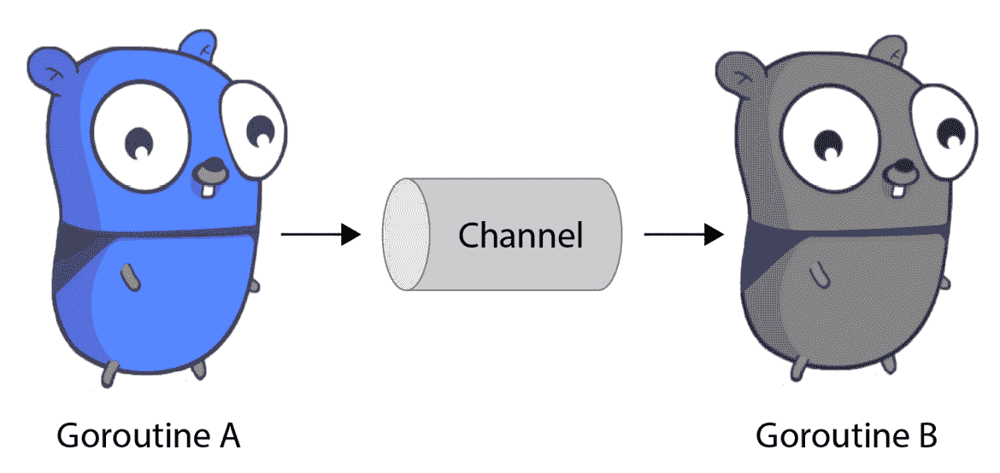

# 第二章：Go 语言基础

在上一章，我们介绍了 Go 语言的基础知识。虽然与其他语言相比，某些语法是新的，但大多数概念对于来自其他语言的程序员来说是熟悉的。

这并不是说 Go 使用这些概念的方式不导致更容易阅读和推理的代码——只是大多数内容与其他语言并无显著不同。

在本章中，我们将讨论使 Go 与其他语言不同的关键部分，从 Go 更具实用性的错误处理，到其核心并发概念 goroutine，再到 Go 语言的最新特性：泛型。

以下是将要讨论的主要主题：

+   在 Go 中处理错误

+   利用 Go 常量

+   使用 `defer`、`panic` 和 `recover`

+   利用 goroutine 实现并发

+   理解 Go 的 `Context` 类型

+   利用 Go 的测试框架

+   泛型——新兴的技术

现在，让我们整理一下基本要点，帮助你顺利开始！

# 在 Go 中处理错误

许多开发者来自于使用 *异常* 处理 *错误* 的语言。Go 采用了不同的方法，将错误视为与其他数据类型一样的对象。这避免了基于异常的模型常见问题，例如异常从栈中逃逸的问题。

Go 语言有一个内建的错误类型，叫做 `error`。`error` 基于 `interface` 类型，具有以下定义：

```
type error interface {
     Error() string
}
```

现在，让我们来看看如何创建一个错误。

## 创建一个错误

创建错误的最常见方法是使用 `errors` 包的 `New()` 方法或 `fmt` 包的 `Errorf()` 方法。当你不需要变量替换时，使用 `errors.New()`，当你需要变量替换时，使用 `fmt.Errorf()`。你可以在以下代码片段中看到这两种方法：

```
err := errors.New("this is an error")
err := fmt.Errorf("user %s had an error: %s", user, msg)
```

在前面的示例中，`err` 将是 `error` 类型。

## 使用错误

使用错误的最常见方式是将其作为函数或方法调用的最后一个返回值。调用者可以测试返回的错误是否为 `nil`，如果是，表示没有错误。

假设我们想要编写一个除法函数，并且希望检测除数是否为零。如果是这样，我们希望返回一个错误，因为计算机无法将一个数除以零。代码可能如下所示：

```
func Divide(num int, div int) (int, error) {
	if div == 0 {
		// We return the zero value of int (0) and an error.
		return 0, errors.New("cannot divide by 0")
	}
	return num / div, nil
}
func main() {
	divideBy := []int{0, 1, 2, 3, 4, 5, 6, 7, 8, 9}
	for _, div := range divideBy {
		res, err := Divide(100, div)
		if err != nil {
			fmt.Printf("100 by %d error: %s\n", div, err)
			continue
		}
		fmt.Printf("100 divided by %d = %d\n", div, res)
	}
}
```

上面的示例使用了 Go 语言的多值返回能力，返回了两个值：**结果** 和 **错误**。

在我们的 `main` 包中，现在可以进行除法运算并检查返回的 `error` 类型，看看它是否为 `nil`。如果是，我们知道发生了错误，应该忽略返回值。如果不是，我们知道操作已成功完成。

## 创建命名错误

有时，你可能希望创建表示特定类型错误的错误——比如网络错误与参数错误。这可以通过使用 `var` 关键字和 `errors.New()` 或 `fmt.Errorf()` 来创建特定类型的错误，以下是示例代码：

```
var (
     ErrNetwork = errors.New("network error")
     ErrInput = errors.New("input error")
)
```

我们可以使用`errors`包的`Is()`函数来检测错误类型，并在`ErrNetwork`上重试，而不在其他错误上重试，如下所示：

```
// The loop is for retrying if we have an ErrNetwork.
for {
     err := someFunc("data")
     if err == nil {
          // Success so exit the loop
          break
     }
     if errors.Is(err, ErrNetwork) {
          log.Println("recoverable network error")
          time.Sleep(1 * time.Second)
          continue
     }
     log.Println("unrecoverable error")
     break // exit loop, as retrying is useless
}
```

`someFunc()`在此未定义。你可以在此查看完整示例：

[`play.golang.org/p/iPwwwmIBcAG`](https://play.golang.org/p/iPwwwmIBcAG)

## 自定义错误

因为`error`类型本质上是一个接口，你可以实现自定义错误。以下是我们可以使用的更深入的网络错误：

```
const (
     UnknownCode = 0
     UnreachableCode = 1
     AuthFailureCode = 2
)
type ErrNetwork struct {
     Code int
     Msg string
}
func (e ErrNetwork) Error() string { 
    return fmt.Sprintf("network error(%d): %s", e.Code, e.msg)
} 
```

我们现在可以返回一个自定义的网络错误，例如身份验证失败，如下所示：

```
return ErrNetwork{
     Code: AuthFailureCode, 
     Msg: "user unrecognized",
}
```

当我们收到一个错误时，我们可以使用`errors.As()`函数检测它是否是网络错误，如下所示：

```
var netErr ErrNetwork
if errors.As(err, &netErr) {
     if netErr.Code == AuthFailureCode {
          log.Println("unrecoverable auth failure: ", err)
          break
     }
     log.Println("recoverable error: %s", netErr)
}
log.Println("unrecoverable error: %s", err)
break
```

你也可以在这里查看：[`play.golang.org/p/gZ5AK8-o4zA`](https://play.golang.org/p/gZ5AK8-o4zA)。

上述代码检测网络错误是否不可恢复，例如身份验证失败。任何其他网络错误都是可恢复的。如果不是网络错误，则是不可恢复的。

## 错误包装

很多时候，会有一个错误链，我们希望使用`net/http`包。在这种情况下，你可能希望将你进行的 REST 调用的相关信息与底层错误一起记录。

我们可以**包装错误**，这样不仅能包含更具体的信息，还能保留底层的错误，以便以后提取。

我们通过`fmt.Errorf()`并使用`%w`来进行变量替换，传入我们的错误类型。假设我们想要从另一个函数`restCall()`调用`someFunc()`并添加更多信息，代码示例如下：

```
func restCall(data) error {
     if err := someFunc(data); err != nil {
          return fmt.Errorf("restCall(%s) had an error: %w", data, err)
     }
     return nil
}
```

使用`restCall()`的人可以通过`errors.As()`检测并提取`ErrNetwork`，就像我们之前做的那样。以下代码片段提供了这个示例：

```
for {
     if err := restCall(data); err != nil {
          var netErr ErrNetwork
          if errors.As(err, &netErr) {
               log.Println("network error: ", err)
               time.Sleep(1 * time.Second)
               continue
          }
          log.Println("unrecoverable: ", err)
     }
}
```

上述代码从被包装的`error`中提取`ErrNetwork`。无论错误被包装了多少层，这都能正常工作。

在本节中，你了解了 Go 如何处理错误，Go 的`error`类型，以及如何创建基本错误、如何创建自定义错误、如何检测特定错误类型以及如何包装/解包错误。因为良好的`error`处理是可靠软件的基础，所以这些知识对你编写的每一个 Go 程序都将非常有用。

# 利用 Go 常量

**常量**提供的是编译时设定的值，且无法更改。与此相对的是变量，它存储可以在运行时设置并且可以改变的值。常量提供的是不能被用户意外修改的类型，并且在软件启动时就分配使用，提供了一些速度优势和比变量声明更安全的特性。

常量可以用来存储以下内容：

+   布尔类型

+   字符

+   整数类型（`int`、`int8`、`uint16` 等）

+   浮动类型（`float32`/`float64`）

+   复杂数据类型

+   字符串

在本节中，我们将讨论如何**声明常量**以及在代码中的常见用法。

## 声明常量

常量是使用`const`关键字声明的，如下代码片段所示：

```
const str = "hello world"
const num = 3
const num64 int64 = 3
```

常量与变量类型不同，它们有两种形式，如下所示：

+   **未类型化常量**

+   **类型化常量**

这看起来有点奇怪，因为常量存储的是一个类型化的值。但如果你没有声明确切的类型（如第三个示例中的`num64`，我们声明它为`int64`类型），则常量可以用于任何具有相同基础类型或类型家族的类型（例如整数）。这被称为**未类型化常量**。

例如，`num`可以用来设置`int8`、`int16`、`int32`、`int64`、`uint8`、`uint16`、`uint32`或`uint64`类型的值。所以，以下代码是有效的：

```
func add(x, y int8) int8 {
     return x + y
}
func main() {
     fmt.Println(add(num, num))  // Print: 6
}
```

虽然我们之前没有讨论过，但这就是我们写出像`add(3,` `3)`这样的代码时发生的情况——`3`实际上是一个未类型化的常量。如果`add`的签名改为`add(x,` `y` `int64)`，`add(3,` `3)`仍然能工作，因为未类型化常量的这一特性。

这适用于任何基于该基本类型的类型。请看下面的示例：

```
type specialStr string
func printSpecial(str specialStr)
     fmt.Println(string(str))
}
func main() { 
    const constHelloWorld = "hello world" 
    var varHelloWorld = "hello world" 
    printSpecial(varHelloWorld) // Won't compile 
    printSpecial(constHelloWorld) // Will compile 
    printSpecial("hello world") // Will compile 
} 
```

从前面的代码，你将会得到以下输出：

```
./prog.go:18:14: cannot use varHelloWorld (type string) as type specialStr in argument to printSpecial
```

这是因为`varHelloWorld`是一个`string`类型，而不是`specialStr`类型。但未类型化常量的独特特性允许`constHelloWorld`满足任何基于`string`的类型。

## 通过常量进行枚举

许多语言提供了**枚举类型**，为一些不可更改的值提供可读的名称。这通常用于整数常量，但你可以对任何类型的常量进行此操作。

对于整数常量，特别是有一个特殊的`iota`关键字，可以用来生成常量。它会为每个在分组中定义的常量递增`1`，如下代码片段所示：

```
const (
     a = iota // 0
     b = iota // 1
     d = iota // 2
)
```

这也可以简化为只让第一个值使用`iota`，后续的值也会自动设置。该值也可以设置为一个公式，其中`iota`使用乘法器或其他数学运算。下面是这两个概念的示例：

```
const (
     a = iota *2 // 0
     b // 2
     d // 4
)
```

使用`iota`进行枚举很棒，只要这些值永远不会被存储在磁盘上或传送到本地或远程的其他进程。如果常量的值是由代码中常量的顺序控制的，那么看一下如果我们在第一个示例中插入`c`会发生什么：

```
const (
     a = iota // 0
     b        // 1
     c        // 2
     d        // 3
)
```

注意到`d`现在的值是`3`了吗？如果代码需要读取已经写入磁盘并需要重新读取的值，这会导致严重的错误。在这些值可能被其他进程使用的情况下，最佳实践是静态定义枚举值。

在 Go 中，枚举值打印出来时可能难以解释。也许你在使用它们作为错误码，并希望在打印*值*到日志或**标准输出**（**stdout**）时打印常量的名称。让我们看看如何能得到更好的输出。

## 打印枚举值

当以枚举名称而不是值来显示一个值时，枚举器的使用会更加简便。当常量是字符串时，如`const toyota = "toyota"`，这可以轻松实现，但对于其他更高效的枚举器类型，如整数，打印该值将仅输出一个数字。

Go 具有内置的代码生成工具。这是一个比我们在这里讨论的内容更广泛的主题（可以在此阅读：[`blog.golang.org/generate`](https://blog.golang.org/generate)）。

然而，我们将借用链接文档中的内容，展示如何利用它来设置枚举器为字符串值，以便自动打印，方法如下：

```
//go:generate stringer -type=Pill
type Pill int
const (
    Placebo Pill = iota
    Aspirin
    Ibuprofen
    Paracetamol
    Acetaminophen = Paracetamol
)
```

注意

这需要安装 Go 的 `stringer` 二进制文件。

`//go:generate stringer -type=Pill` 是一种特殊的语法，表示当运行 `go generate` 命令时，它应调用 `stringer` 工具并传递 `-type=Pill` 标志，这表示读取我们的包代码并生成一个方法，该方法基于类型 `Pill` 将常量反转为字符串。这将被放置在名为 `pill_string.go` 的文件中。

在运行命令之前，`fmt.Println(Aspirin)` 会打印 `1`；之后，它会打印 `Aspirin`。

在本节中，你已经学习了常量如何提供不可变的值以供在代码中使用，如何使用它们创建枚举器，以及如何为枚举器生成文本输出以便更好地记录日志。在下一节中，我们将探讨如何使用 `defer`、`panic` 和 `recover` 方法。

# 使用 defer、panic 和 recover

现代编程语言需要提供某种方法，在一段代码执行完毕时运行某些操作。这在需要保证文件关闭或解锁互斥锁时非常有用。此外，有时程序需要停止执行并退出。这可能是由于无法访问关键资源、安全问题或其他需求导致的。

我们还需要能够从程序提前退出的情况中恢复，这种情况通常由我们无法控制的代码包引起。本节将涵盖 Go 中每种能力及其相互关系。

## defer

`defer` 关键字允许你在包含 `defer` 的函数退出时执行一个函数。如果有多个 `defer` 语句，它们将按从后到前的顺序执行。

这对于调试、解锁互斥锁、递减计数器等非常有用。以下是一个示例：

```
func printStuff() (value string) {
     defer fmt.Println("exiting")
     defer func() {
          value = "we returned this"
     }()
     fmt.Println("I am printing stuff")
     return ""
}
func main() {
     v := printStuff()
     fmt.Println(v)
}
```

这将输出以下内容：

```
I am printing stuff
exiting
we returned this
```

你也可以通过以下链接查看：

[`play.golang.org/p/DaoP9M79E_J`](https://play.golang.org/p/DaoP9M79E_J)

如果你运行这个示例，你会注意到我们的 `defer` 语句在 `printStuff()` 的其余部分执行完后才执行。我们使用一个延迟的匿名函数来设置我们命名的返回值 `value`，然后退出。你将在后续章节中看到 `defer` 被频繁使用。

## panic

`panic` 关键字用于停止程序的执行并退出，同时显示一些文本和堆栈跟踪。

使用 `panic` 只需调用以下内容：

```
panic("ran into some bug")
```

`panic` 用于程序无法或不应该继续执行时。这可能是因为存在安全问题，或者在启动时无法连接到所需的数据源。

在大多数情况下，用户应返回 `error` 而不是 `panic`。

一般来说，只有在 `main` 包中使用 `panic`。

## 恢复

在某些罕见的情况下，程序可能因为不可预见的 bug 或某个包不必要的 panic 而崩溃。在超过 10 年的 Go 编程经验中，我可以数出我需要从 panic 中恢复的次数。

使用 `recover` 来防止在 RPC 调用发生 panic 时导致服务器崩溃，并通知调用者问题。

如果像 RPC 框架一样，你需要捕获正在发生的 panic 或防止潜在的 panic，可以结合 `defer` 关键字使用 `recover` 关键字。以下是一个示例：

```
func someFunc() {
     defer func() {
        if r := recover(); r != nil {
            log.Printf("called recover, panic was: %q", r)
        }
    }()
    panic("oh no!!!")
}
```

你也可以在这里查看：[`play.golang.org/p/J8RfjOe1dMh`](https://play.golang.org/p/J8RfjOe1dMh)。

这与其他语言的异常类型有相似之处，但你不应混淆这两者。Go 并不打算让你以这种方式使用 `panic`/`defer`/`recover`——这样做将会在未来给你带来问题。

现在你已经完成了这一部分，你学习了如何延迟执行函数，如何在 `main` 包中引发 panic，如何从不正常的包中恢复，以及何时应该使用这些功能。让我们进入本章相关的下一个话题：*goroutines*。

# 使用 goroutines 进行并发

在现代计算机时代，**并发** 是关键。在 2005 年之前的几年，计算机使用摩尔定律每 18 个月就将单个 **中央处理单元**（**CPU**）的速度加倍。多 CPU 消费者系统很少见，系统中每个 CPU 只有一个核心。高效利用多核的软体系统稀少。

随着时间的推移，增加单核处理器的速度变得更加昂贵，多核 CPU 已成为常态。每个 CPU 核心支持多个硬件线程，**操作系统**（**OS**）提供的 OS 线程映射到硬件线程，然后在进程之间共享。

编程语言可以利用这些操作系统线程以 *并发* 的方式运行函数，而不是像我们在代码中一直做的那样 *串行* 执行。

启动操作系统线程是一个昂贵的操作，要充分利用线程的时间，需要特别关注你正在做的事情。

Go 在这一点上超越了大多数语言，使用 **goroutines**。Go 构建了一个运行时调度器，将这些 goroutines 映射到操作系统线程，并切换哪个 goroutine 在哪个线程上运行，以优化 CPU 的使用。

这产生了易于使用且成本低廉的并发，减少了开发人员的心理负担。

## 启动一个 goroutine

Go 得名于`go`关键字，它用于启动一个 goroutine。通过在函数调用前加上`go`，您可以使该函数与其余代码并发执行。以下是一个示例，它创建了 10 个 goroutine，每个打印一个数字：

```
for i := 0; i < 10; i++ {     
     go fmt.Println(x) // This happens concurrently
}
fmt.Println("hello")
// This is used to prevent the program from exiting
// before our goroutines above run. We will talk about
// this later in the chapter.
select{} 
```

输出将类似于但不一定与下面显示的顺序相同。`...`表示后面还有更多数字，但为简洁起见已省略。

```
Hello
2
0
5
3
...
fatal error: all goroutines are asleep - deadlock!
```

您可以在这里看到前面的例子：

[`play.golang.org/p/RBD3yuBA3Gd`](https://play.golang.org/p/RBD3yuBA3Gd)

注意

在运行后，您还会注意到此处出现错误。这是因为程序没有运行的 goroutines，这意味着程序实际上已经死了。它被 Go 的死锁检测器杀死。我们将在下一章更加优雅地处理这个问题。

运行此代码将以随机顺序打印出数字。为什么是随机的呢？因为一旦并发运行，您不能确定何时调度函数将执行。在任何给定时刻，将会有 0 到 10 个 goroutines 执行`fmt.Println(x)`，还有另一个执行`fmt.Println("hello")`。没错，`main()`函数本身就是一个 goroutine。

一旦`for`循环结束，`fmt.Println("hello")`将会执行。`hello`可能会在任何数字之前、中间某处或者所有数字之后打印出来。这是因为它们都像赛马一样同时执行。我们知道所有赛马最终都会到达终点，但我们不知道哪匹会第一个到达。

## 同步

在进行**并发编程**时，有一个简单的规则：*您可以同时读取一个变量而无需同步，但单个写入者需要同步。*

这些是 Go 中最常见的同步方法：

+   用于在 goroutines 之间交换数据的`channel`数据类型

+   来自`sync`包的`Mutex`和`RWMutex`用于锁定数据访问

+   用于跟踪访问的`sync`包中的`WaitGroup`

这些可以用来防止多个 goroutines 同时读写变量。如果尝试从多个 goroutines 同时读写同一变量，则结果是未定义的（换句话说，*这是个坏主意*）。

同时读写同一变量被称为**数据竞争**。Go 有一个数据竞争检测器，本书未涵盖这些问题，可以在这里阅读更多信息：[`golang.org/doc/articles/race_detector`](https://golang.org/doc/articles/race_detector)。

## WaitGroups

`WaitGroup`是一个同步计数器，其值从 0 开始，只有正值。它通常用于指示某些任务完成后再执行依赖于这些任务的代码。

`WaitGroup`有几个方法，如下所述：

+   `.Add(int)`: 用于向`WaitGroup`添加某个数字

+   `.Done()`: 从`WaitGroup`减去 1

+   `.Wait()`: 阻塞，直到`WaitGroup`为 0

在我们之前关于 goroutine 的部分，我们有一个示例在运行后*发生了 panic*。这是因为所有的 goroutine 都停止了。我们使用了`select`语句（本章会介绍）来阻塞直到永远，防止程序在 goroutine 运行之前退出，但我们可以使用`WaitGroup`来等待 goroutine 结束并优雅地退出。

我们再做一遍，如下所示：

```
func main() {
     wg := sync.WaitGroup{}
     for i := 0; i < 10; i++ {
          wg.Add(1)
          go func(n int) {
               defer wg.Done()
               fmt.Println(n)
          }(i)
     }
     wg.Wait()
     fmt.Println("All work done")
}
```

你也可以在这里看到这个示例：[`play.golang.org/p/cwA3kC-d3F6`](https://play.golang.org/p/cwA3kC-d3F6)。

本示例使用`WaitGroup`来跟踪尚未完成的 goroutine 数量。我们在启动 goroutine 之前将`wg`加 1（*不要在 goroutine 内部加*）。当 goroutine 退出时，会调用`defer`语句，从计数器中减去 1。

重要提示

`WaitGroup`只能有正值。如果在`WaitGroup`为 0 时调用`.Done()`，将会引发 panic。由于它们的使用方式，创建者知道任何试图使其达到负值的操作都会是一个需要尽早捕获的严重 bug。

`wg.Wait()`等待所有的 goroutine 完成，调用`defer wg.Done()`会使我们的计数器递减直到为 0。此时，`Wait()`停止阻塞，程序退出`main()`函数。

重要提示

如果在函数或方法调用中传递`WaitGroup`，你需要使用`wg := &sync.WaitGroup{}`指针。否则，每个函数操作的是副本，而不是相同的值。如果`WaitGroup`在结构体中使用，则结构体或持有`WaitGroup`的字段必须是指针类型。

## 通道

**通道**提供了一种同步原语，其中数据由一个 goroutine 插入到通道中，并由另一个 goroutine 移除。通道可以是有缓冲区的，这意味着它可以在阻塞之前容纳一定量的数据；也可以是无缓冲区的，在这种情况下，发送方和接收方必须同时存在，数据才能在 goroutine 之间传递。

通道的常见类比是水流通过的管道。水被注入管道，然后从另一端流出。管道可以容纳的水量就是缓冲区的大小。在这里，你可以看到使用通道进行 goroutine 通信的示意图：



图 2.1 – 使用通道进行 goroutine 通信

通道用于将数据从一个 goroutine 传递到另一个 goroutine，其中传递数据的 goroutine 停止使用该数据。这允许你将*控制*从一个 goroutine 传递到另一个 goroutine，每次只允许一个 goroutine 访问。这提供了同步机制。

通道是有类型的，因此只能将该类型的数据发送到通道中。由于通道是类似于`map`和`slice`的指针作用域类型，因此我们使用`make()`来创建它们，如下所示：

```
ch := make(chan string, 1)
```

上述语句创建了一个名为`ch`的通道，该通道持有`string`类型的数据，且具有大小为 1 的缓冲区。如果省略"`,` `1`"，则会创建一个无缓冲区的通道。

## 发送/接收

使用 `<-` 语法发送到通道。要将 `string` 类型发送到前述通道，我们可以这样做：`ch <- "word"`。这试图将 "`word`" 字符串放入 `ch` 通道中。如果通道有可用缓冲区，我们继续在此 goroutine 中执行。如果缓冲区已满，则阻塞，直到缓冲区变得可用或在无缓冲通道的情况下，goroutine 尝试从通道中取出。

接收类似于在通道的对面使用相同的语法。试图从通道中拉取值的 goroutine 将执行此操作：`str := <-ch`。这将通道上的下一个值分配给 `str` 变量。

更常见的情况是在接收变量时使用 `for range` 语法。这使我们可以从通道中取出所有值。使用我们前述的通道的示例可能如下所示：

```
for val := range ch { // Acts like a <-ch
     fmt.Println(val)
}
```

通道可以关闭，这样将不会再向其发送数据。这是使用 `close` 关键字完成的。要关闭前述通道，我们可以执行 `close(ch)`。这应该 *始终* 由发送方执行。关闭通道将导致 `for range` 循环在通道上的所有值都被移除后退出。

让我们使用通道从一个 goroutine 发送单词到另一个 goroutine，如下所示：

```
func main() { 
    ch := make(chan string, 1) 
    go func() { 
        for _, word := range []string{"hello", "world"} { 
            ch <- word
            close(ch) 
        } 
    }() 
    for word := range ch { 
        fmt.Println(word) 
    } 
} 
```

您还可以在此处看到前述示例：

[`go.dev/play/p/9km80Jz6f26`](https://go.dev/play/p/9km80Jz6f26)

重要提示

在通道关闭后，向通道发送值将导致 panic。

从关闭的通道接收将返回通道持有类型的零值。

通道可以是 `nil`。从 `nil` 通道发送或接收可能会永久阻塞。开发人员常常忘记在结构体中初始化通道，这是一个常见的 bug。

## select 语句

`select` 语句类似于 `switch` 语句，但专注于监听多个通道。这使我们能够同时接收和处理多个输入。

下面的示例将监听几个通道，并在收到其中一个通道的值时执行 `case` 语句。在示例 case 中，我们启动一个 goroutine 来处理值，以便我们可以继续执行我们的循环以获取下一个值。如果通道上没有值，则会阻塞直到有值。如果多个通道上有值，则 `select` 使用伪随机方法选择要执行的 case：

```
for {
     select {
     case v := <-inCh1:
          go fmt.Println("received(inCh1): ", v)
     case v := <-inCh2:
          go fmt.Println("received(inCh2): ", v)
     }
}
```

使用 `select` 语句时，有时我们只想检查通道上是否有值，如果没有，我们希望继续执行。在这些情况下，我们可以使用 `default` 语句。如果没有其他 case 语句可以执行（与以前等待通道数据无限期的行为相反），则 `default` 会执行。您可以在以下代码片段中看到此示例：

```
select {
case s := <-ch:
     fmt.Printf("had a string(%s) on the channel\n", s)
default:
     fmt.Println("channel was empty")
}
```

`select` 还有一个我们之前见过但没有解释的用法。`select{}` 没有 `case` 语句和 `default` 语句，因此它会永远阻塞。这通常用于希望永远运行的服务器，防止 `main()` 函数退出，从而停止程序的执行。

## 通道作为事件信号

通道的一个常见用法是用于向另一个 goroutine 发送信号。通常，这是指示退出循环或其他某些执行的信号。

在之前的 `select` 示例中，我们使用了 `for` 循环，循环将永远继续下去，但我们可以使用通道来发出退出信号，如下所示：

```
func printWords(in1, in2 chan string, exit chan struct{}, wg *sync.WaitGroup) {
     defer wg.Done()
     for {
          select{
          case <-exit:
               fmt.Println("exiting")
               return
          case str := <-in1:
               fmt.Println("in1: ", str)
          case str := <-in2:
               fmt.Println("in2: ", str)
          }
     }
}
```

`printWords()` 从三个通道读取输入。如果输入来自 `in1` 或 `in2`，它会打印通道名称和发送的字符串。如果是 `exit` 通道，它会打印退出信息并返回。当返回时，`wg` 将调用 `.Done()`，使其值减 1：

```
func main() { 
    in1 := make(chan string) 
    in2 := make(chan string) 
    wg := &sync.WaitGroup{} 
    exit := make(chan struct{}) 
    wg.Add(1) 
    go printWords(in1, in2, exit, wg) 
    in1 <- "hello" 
    in2 <- "world" 
    close(exit) 

    wg.Wait() 
} 
```

在这里，我们创建了 `printWords()` 所需的所有通道，并将 `printWords` 放入 goroutine 中执行。然后，我们通过输入通道发送输入，一旦输入完成，我们关闭 `exit` 通道以表明没有更多输入需要传递给 `printWords`。`wg.Wait()` 调用会阻止 `main()` 在 `printWords` 退出之前退出。

输出如下：

```
in1:  hello
in2:  world
exiting
```

你还可以通过以下链接查看前面的示例：

[`play.golang.org/p/go7Klf5JNQn`](https://play.golang.org/p/go7Klf5JNQn)

在这个示例中，`exit` 用于向 `printWords()` 发送信号，告诉它我们希望退出 `for` 循环。这得以实现是因为在关闭的通道上接收会返回该通道持有类型的零值。我们使用一个空的 `struct{}` 实例，因为它不占用内存。我们不将返回值存储在变量中，因为重要的是通道关闭时的信号。

## Mutexes

一个名为 `Mutex` 的 `sync` 包。

这用于保护一个变量或一组变量，防止它们被多个 goroutine 同时访问。记住——如果一个 goroutine 尝试在另一个 goroutine 正在读取或写入同一个值时进行写入，变量必须通过同步原语来保护。

在以下示例中，我们将启动 10 个 goroutine 来向 `sum` 值添加数字。由于我们在多个 goroutine 中进行读写操作，必须保护 `sum` 值：

```
type sum struct {
     mu  sync.Mutex
     sum int
}
func (s *sum) get() int {
     s.mu.Lock()
     defer s.mu.Unlock()
     return s.sum
}
func (s *sum) add(n int) {
     s.mu.Lock()
     defer s.mu.Unlock()
     s.sum += n
}
func main() {
     mySum := &sum{}
     wg := sync.WaitGroup{}
     for i := 0; i < 100; i++ {
          wg.Add(1)
          go func(x int) {
               defer wg.Done()
               mySum.add(x)
          }(i)
     }
     wg.Wait()
     fmt.Println("final sum: ", mySum.get())
}
```

你还可以通过以下链接查看此示例：

[`play.golang.org/p/mXUk8PCzBI7`](https://play.golang.org/p/mXUk8PCzBI7)

这段代码使用了一个名为 `mu` 的 Mutex，它是 `sum` 结构体的一部分，用于控制对 `get()` 和 `add()` 方法的访问。由于每次加锁，因此只有一个方法可以同时执行。我们使用 `defer` 语句在函数退出时解锁 Mutex。这可以防止在函数变长时忘记解锁 Mutex。

## RWMutex

与 `sync.Mutex` 一起使用的是 `sync.RWMutex`。它通过提供读写锁来区分自己。可以同时持有任意数量的 `mu.RLock()` 读锁，但只有一个 `mu.Lock()` 写锁，且必须等待所有现有的读锁完成（新的 `Rlock()` 尝试会被阻塞），然后为写入者提供独占访问权限。

当并发读取量较大且写入操作不频繁时，这种方式证明更为高效。然而，标准的 `Mutex` 在通用情况下更为高效，因为它的实现更加简单。

在本节中，你已经掌握了使用 goroutine 进行并发操作的基本技能，了解了什么是同步以及何时需要使用同步，还了解了 Go 的各种同步和信号传递方法。让我们深入理解另一种类型，称为 `context`。

# 理解 Go 的 `Context` 类型

Go 提供了一个名为 `context` 的包，具有以下两个主要用途：

+   在某些事件（例如超时）发生后取消一连串的函数调用

+   在一系列函数调用中传递信息（例如用户信息）

`Context` 对象通常在 `main()` 函数中创建，或者在某些请求（如 RPC）被处理时创建（例如从我们的后台 `Context` 对象中创建 `Context` 对象，如下所示）。

```
import "context" 
func main() { 
     ctx := context.Background()
}
```

`context` 包和 `Context` 类型是一个高级主题，但我想在这里介绍它，因为你会在 Go 生态系统中看到它的使用。

## 使用 `Context` 信号来表示超时

`Context` 通常用于传递计时器状态或终止等待条件——例如，当程序等待网络响应时。

假设我们想要调用一个函数来获取一些数据，但我们不希望等待超过 5 秒钟才能完成调用。我们可以通过 `Context` 来传达这一信号，如下所示：

```
ctx, cancel := context.WithTimeout(context.Background(), 5 * time.Second)
data, err := GatherData(ctx, args)
cancel()
if err != nil {
     return err
}
```

`context.WithTimeout()` 创建一个新的 `Context`，它将在 5 秒后自动取消，并且创建一个可以取消该 `Context` 的函数（`context.CancelFunc`）。

每个 `Context` 都是从另一个 `Context` 派生出来的。在这里，我们从 `context.Background()` 派生我们的 `ctx` 对象。`context.Background()` 是我们的父 `Context`。新的 `context` 对象可以从 `ctx` 派生，形成一个链条，这些新的 `Context` 对象可以有不同的超时时间。

直接通过 `cancel()` 或通过超时或截止日期取消 `Context` 会导致该 `Context` 及其子 `Context` 被一起取消。

上面的代码执行了以下操作：

+   创建一个在 5 秒后取消的 `Context`。

+   调用 `GatherData()` 并传递 `Context`。

+   一旦调用完成，如果 `Context` 还没有被取消，我们就会取消它。

现在，我们需要设置 `GatherData()` 以响应我们的 `Context` 取消请求。

## 在接收时遵守上下文

如果我们正在执行 `GatherData()` 函数，我们需要遵守这个上下文。可以通过几种方式来做到这一点，最基本的是调用 `ctx.Err()`，如下所示：

```
func GatherData(ctx context.Context, args Args) ([]file, error) { 
    if ctx.Err() != nil { 
        return nil, err 
    } 
    localCtx, localCancel := context.WithTimeout(ctx, 2 * time.Second) 
    local, err := getFilesLocal(localCtx, args.local) 
    localCancel() 
    if err != nil { 
        return nil, err 
    } 
    remoteCtx, remoteCancel := context.WithTimeout(ctx, 3 * time.Second) 
    remote, err := getFilesRemote(remoteCtx, args.remote) 
    remoteCancel() 
    if err != nil { 
        return nil, err 
    } 
    return append(local, remote), nil 
} 
```

`GatherData()`检查`ctx.Err()`的值，看是否返回错误。如果是的话，我们知道`Context`已经被取消，直接返回即可。

在这个例子中，我们派生了两个新的`Context`对象，它们共享`ctx`的父级。如果`ctx`被取消，`localCtx`和`remoteCtx`也会被取消。取消`localCtx`或`remoteCtx`不会影响`ctx`。在大多数情况下，传递`ctx`而不是派生新的`Context`对象是常见做法，但我们希望展示如何派生新的`Context`对象。

`Context`还支持`.Done()`方法，如果你需要在`select`语句中检查取消状态，可以使用`.Done()`。`.Done()`返回一个通道，如果该通道关闭，则表示已取消。使用它非常简单，如下所示：

```
select {
case <-ctx.Done():
     return ctx.Err()
case data := <-ch:
     return date, nil
}
```

现在我们已经展示了如何将`Context`添加到你的函数中，让我们来谈谈它是如何在标准库中工作的，以及为什么它与我们展示的例子不同。

## 标准库中的`Context`

`context`包是在**Go 1.7**中新增的，远晚于 Go 标准库的引入。不幸的是，这意味着它不得不被“黑客”加入标准库包中，以避免破坏 Go 1.0 的兼容性承诺。

这是 Go 语言中新增的一个特性，但它也带来了一些丑陋的部分。之前我们向你展示了如何使用`Context`，它应该作为函数的第一个参数`ctx`传入。然而，标准库并未按此方式实现。

在标准库中使用`Context`时，你会看到一个常见的模式，那就是通过方法将其添加进来。这里有一个例子，展示了如何使用`Context`与`http.Client`来获取`www.golang.org`并打印到屏幕上：

```
client := &http.Client{}
req, err := http.NewRequest("GET", "http://www.golang.org", nil)
if err != nil {
        fmt.Println("error: ", err)
        return
}
ctx, cancel := context.WithTimeout(context.Background(), 3 * time.Second)
// Attach it to our request.
req = req.WithContext(ctx)
// Get our resp.
resp, err := client.Do(req)
cancel() 
if err != nil {
        fmt.Println("error: ", err)
        return
}
// Print the page to stdout
io.Copy(os.Stdout, resp.Body)
```

在这段代码中，我们做了以下操作：

+   创建一个`HTTP`客户端

+   创建一个`*http.Request (req)`以获取[www.golang.org](http://www.golang.org)页面。

+   创建`Context`（`ctx`）和`CancelFunc`（`cancel`），其中`Context`会在 3 秒后被取消。

+   将`ctx`附加到`req`，以防止`*http.Request`超时超过 3 秒。

+   使用`cancel()`来取消`Context`的内部 goroutine，该 goroutine 在`client.Do()`调用完成后追踪超时。

到目前为止，我们已经讨论了如何使用`Context`进行取消操作。现在让我们谈谈`Context`的另一个用途——在调用链中传递值。

## 用`Context`传递值

`Context`的另一个主要用途是传递值，目的是传递那些在每次调用时都有用的值，而非作为通用存储。

这两种情况是传递值给`Context`的最佳用途：

+   用户发起调用时的安全信息。

+   如*OpenTelemetry*中使用的数据类型等遥测信息。

在安全信息的情况下，你正在通知系统用户是谁，可能是通过**OpenID Connect**（**OIDC**）信息。这使得调用栈能够进行授权检查。

对于遥测，这允许服务记录与特定调用相关的信息，用于跟踪函数执行时间、数据库延迟、输入和错误。这可以调节用于调试服务问题。我们将在后续章节讨论遥测。

向 `Context` 传递一个值需要小心。存储在 `Context` 中的值是键值对，为了防止多个包之间的键被覆盖，我们需要创建自己的自定义键类型，该类型只能由我们的包实现。通过这种方式，不同包的键将具有不同的类型。实现此功能的代码如下所示：

```
type key int
const claimsKey key = 0 
func NewContext(ctx context.Context, claims Claims)
context.Context {
    return context.WithValue(ctx, claimsKey, claims)
}
func ClaimsFromContext(ctx context.Context) (Claims, bool) 
{
    // ctx.Value returns nil if ctx has no value for the key;
    // the Claims type assertion returns ok=false for nil.
    claims, ok := ctx.Value(userIPKey).(Claims)
    return claims, ok
}
```

这段代码执行以下操作：

+   定义一个名为 `key` 的私有类型，防止其他包实现它

+   定义一个类型为 `key` 的 `claimsKey` 常量。它作为存储 OIDC `IDToken` 声明的值的键

+   `NewContext()` 提供一个函数，将 `Claim` 附加到我们的 `Context` 上

+   `ClaimsFromContext()` 提供一个函数，从 `Context` 中提取 `Claims` 并指示是否找到了 `Claims`

上面的代码可能存在于一个安全包中，因为 `Claims` 代表我们已验证的用户数据。`NewContext()` 允许我们在某些中间件中将此信息添加到上下文中，而 `ClaimsFromContext()` 允许我们在调用链中需要的地方提取该信息。

## 最佳实践

我建议所有公共函数和方法都应有一个初始参数 `ctx context.Context`。这样可以让你为公共函数/方法/接口添加未来兼容性，如果将来需要添加 `Context` 提供的功能，即使现在没有使用它，也能轻松做到。

重要提示

未来兼容方法/函数/接口是指添加当前未使用的参数和返回值，以防止将来某个时间点破坏它们（和用户）——例如，为一个当前无法返回错误的构造函数添加一个返回的 `error`，但将来可能会返回。

也许你不需要处理取消（执行过快或无法取消），但添加遥测功能可能在以后会派上用场。

在本节中，你了解了 Go 的 `Context` 对象及其如何用于发出取消信号并通过调用堆栈传递值。你将会在许多第三方包中看到它的使用。该章节的最后一部分将讨论 *Go 的测试包*。让我们立即深入探讨。

# 使用 Go 的测试框架

**测试** 是任何编程语言中最重要且最不受欢迎的部分之一。测试能让开发者知道某些功能是否按预期工作。我无法计数多少次编写单元测试证明某个函数或方法没有按预期工作。这为我节省了无数的调试时间。

为此，测试需要具备以下特性：

+   易于编写

+   执行速度快

+   简单重构

+   容易理解

为了满足这些需求，Go 通过以下方式处理测试：

+   将测试拆分到独立的文件中

+   提供一个简单的 `testing` 包

+   使用一种名为 **表驱动测试**（**TDTs**）的测试方法论

在本节中，我们将介绍如何编写基本测试、Go 的标准 TDT 方法论、通过接口创建虚拟对象，以及—最后—我使用过的一些第三方包和一些流行但不一定推荐的包。

## 创建一个基本的测试文件

Go 测试包含在以 `_test.go` 结尾的包文件中。这些文件具有相同的包名，你可以根据需要包含任意数量的测试文件。通常的规则是，每个你想要测试的包文件写一个测试文件，以确保一一对应，便于清晰。

每个测试在测试文件中都是一个函数，函数名以 `Test` 为前缀，并且有一个参数 `t *testing.T`，没有返回值。代码如下所示：

```
func TestFuncName(t *testing.T) {
}
```

`t` 是由 `go test` 命令传递的，提供了执行测试所需的工具。常用的方法列举如下：

+   `t.Error()`

+   `t.Errorf()`

+   `t.Fatalf()`

+   `t.Log()`

+   `t.Logf()`

当测试执行时，如果没有调用 `panic`/`Error`/`Errorf`/`Fatal`/`Fatalf`，测试会被视为通过。如果调用了其中任何一个，测试就会失败。使用 `Error`/`Errorf`，测试会继续执行并积累这些错误信息。使用 `Fatal`/`Fatalf`，测试会立即失败。

`Log()`/`Logf()` 调用是信息性的，只有在测试失败时或传递了其他标志时才会显示。

## 创建一个简单的测试

借鉴 `golang.org` 的教程 ([`golang.org/doc/tutorial/add-a-test`](https://golang.org/doc/tutorial/add-a-test))，让我们为一个名为 `Greeter()` 的函数创建一个简单的测试，该函数接受一个名字作为参数并返回 `"Hello [name]"`。代码如下所示：

```
package greetings 
import ( 
"testing" 
)
func TestGreet(t *testing.T) { 
     name := "Bob"
     want := "Hello Bob"
     got, err := Greet(name)
     if got != want || err != nil {
          t.Fatalf("TestGreet(%s): got %q/%v, want %q/nil", name, got, err, want)
     }
}
```

你也可以在这里看到这个例子：[`play.golang.org/p/vjAhW0hfwHq`](https://play.golang.org/p/vjAhW0hfwHq)。

要运行测试，我们只需在包目录中运行 `go test`。如果测试成功，我们应该看到以下内容：

```
=== RUN   TestGreet
--- PASS: TestGreet (0.00s)
PASS
```

为了展示失败的情况，我将 `want` 改成了 `Hello Sarah`，同时保留了名字 `Bob`，如下所示：

```
=== RUN   TestGreet
    prog.go:21: TestGreet(Bob): got "Hello Bob"/<nil>, want "Hello Sarah"/nil
--- FAIL: TestGreet (0.00s)
FAIL
```

包含足够的信息来调试测试非常重要。我喜欢包括以下内容：

+   测试的名称

+   如果是表驱动的，执行的表格行的描述

+   我得到的结果（称为 `got`）

+   我期望的结果（称为 `want`）

现在，让我们来谈谈 Go 的测试首选风格——TDTs。

## 表驱动测试（TDT）

对于非常简单的测试，上述方法可以正常工作，但通常，你需要测试一个函数的多种成功和失败类型，例如以下场景：

+   如果他们传递了一个错误的参数怎么办？

+   如果网络出现问题并返回错误怎么办？

+   如果数据不在磁盘上怎么办？

为每个条件编写一个测试会导致测试文件中出现大量变动，变得难以阅读和理解。TDT 来救场！TDT 使用了我们在*第一章*《Go 语言基础》中讨论过的非命名结构体概念。这是唯一一个常见使用它的地方。

这个概念是创建一个结构体列表，其中每个结构体条目表示我们希望看到的测试条件和结果。我们一次执行一个结构体条目来测试函数。

让我们将之前的测试转换为 TDT。在这种情况下，我们的`Greet()`函数的反应只有两种预期方式，如下所示：

+   我们为`name`传递一个空字符串，导致出现错误。

+   其他任何情况都将返回`"Hello"`和名字。

让我们编写一个处理这两种情况的 TDT，如下所示：

```
func TestGreet(t *testing.T) {
     tests := []struct{
          desc string // What we are testing
          name string // The name we will pass
          want string // What we expect to be returned
          expectErr bool // Do we expect an error
     }{
          {
               desc: "Error: name is an empty string",
               expectErr: true,
               // name and want are "", the zero value for string
          },
          {
               desc: "Success",
               name: "John",
               want: "Hello John",
               // expectErr is set to the zero value, false
          },
     }
     // Executes each test.
     for _, test := range tests {
          got, err := Greet(test.name)
          switch {
          // We did not get an error, but expected one
          case err == nil && test.expectErr:
               t.Errorf("TestGreet(%s): got err == nil, want err != nil", test.desc)
               continue
          // We got an error but did not expect one
          case err != nil && !test.expectErr:
               t.Errorf("TestGreet(%s): got err == %s, want err == nil", test.desc, err)
               continue
          // We got an error we expected, so just go to the next test
          case err != nil:
               continue
          }
          // We did not get the result we expected
          if got != test.want {
               t.Errorf("TestGreet(%s): got result %q, want %q", test.desc, got, test.want)
          }
     }
}
```

这个示例也可以在以下链接找到：[`play.golang.org/p/vYWW-GiyT-M`](https://play.golang.org/p/vYWW-GiyT-M)。

正如你所看到的，TDT 测试比较长，但具有明确的测试参数和清晰的错误输出。

与之前的示例不同，这个测试验证了当`name == ""`时，我们的错误条件会发生。对于这么简单的情况，使用 TDT 有些过度，但在编写针对 Go 中更复杂函数的测试时，它会成为工具箱中强大的工具。

## 使用接口创建假对象

测试通常应该是封闭的，也就是说，测试不应该使用位于机器上本地以外的资源。

如果我们正在测试一个客户端与 REST 服务的连接，它不应该实际调用 REST 服务。应该有集成测试来测试与服务的基本连接性，但这些测试应该是小型且少见的，我们在这里不会讨论这些。

为了测试远程资源的行为，我们使用接口创建所谓的**假对象**。让我们编写一个客户端，通过网络客户端与服务交互，获取用户记录。我们不想测试服务器的逻辑（我们之前测试过的那种逻辑），而是想测试如果 REST 客户端出现错误或从服务端获取到错误记录时会发生什么。

首先，假设我们在一个名为`client`的包中使用一个`Fetch`客户端，如下所示：

```
type Fetch struct{
     // Some internals, like an http.Client
}
func (f *Fetch) Record(name string) (Record, error){
     // Some code to talk to the server
}
```

我们在名为`Greeter()`的函数中使用`Fetch`来获取我们可能会用来更改对某人的响应的信息，如下所示：

```
func Greeter(name string, fetch *client.Fetch) (string, error) { 
    rec, err := fetch.Record(name) 
    if err != nil { 
        return "", err 
    } 
    if rec.Name != name {
          return "", fmt.Errorf("server returned record for %s, not %s", rec.Name, name)
     }
     if rec.Age < 18 {
          return "Greetings young one", nil
     }
     return fmt.Sprintf("Greetings %s", name), nil
}
```

由于`Fetch`是一个与服务通信的具体类型，这很难进行封闭式测试。然而，我们可以将其改为`Fetch`实现的接口，然后使用假对象。首先，让我们添加接口并更改`Greeter`的参数，如下所示：

```
type recorder interface {
     Record(name string) (Record, error)
}
func Greeter(name string, fetch recorder) (string, error) {
```

现在，我们可以传递一个`*client.Fetch`实例，或者传递任何其他实现了`recorder`的东西。让我们创建一个实现了`recorder`的假对象，能够返回对测试有用的结果，如下所示：

```
type fakeRecorder struct {
     data Record
     err bool
}
func (f fakeRecorder) Record(name string) (Record, error) {
     if f.err  {
          return "", errors.New("error")
     }
     return f.data, nil
}
```

现在，让我们将其集成到 TDT 中，像这样：

```
func TestGreeter(t *testing.T) {
     tests := []struct{
          desc string
          name string
          recorder recorder
          want string
          expectErr bool
     }{
          {
               desc: "Error: recorder had some server error",
               name: "John",
               recorder: fakeRecorder{err: true},
               expectErr: true,
          },
          {
               desc: "Error: server returned wrong name",
               name: "John",
               recorder: fakeRecorder{
                    Record: Record{Name: "Bob", Age: 20},
               },
               expectErr: true,
          },
          {
               desc: "Success",
               name: "John",
               recorder: fakeRecorder{
                    Record: Record{Name: "John", Age: 20},
               },
               want: "Greetings John",
          },
     }
     for _, test := range tests {
          got, err := Greeter(test.name)
          switch {
          case err == nil && test.expectErr:
               t.Errorf("TestGreet(%s): got err == nil, want err != nil", test.desc)
               continue
          case err != nil && !test.expectErr:
               t.Errorf("TestGreet(%s): got err == %s, want err == nil", test.desc, err)
               continue
          case err != nil:
               continue
          }
          if got != test.want {
               t.Errorf("TestGreet(%s): got result %q, want %q", test.desc, got, want)
          }
     }
}
```

这个示例可以在这里找到：[`play.golang.org/p/fjj2WrbGlKY`](https://play.golang.org/p/fjj2WrbGlKY)。

现在我们只是模拟从真实客户端`Fetch`获取的响应。在使用`Greeter()`的代码中，他们可以简单地传入真实客户端，而在我们的测试中，我们传入`fakeRecorder`实例。这让我们能够控制测试环境，确保我们的函数以预期的方式处理每种类型的响应。这个测试缺少一个检查当返回`Record`实例且`Age`值设置为`< 18`时的结果。我们将这个作为练习留给你。

## 第三方测试包

当我写测试时，几乎只有一个工具是我常用的：[`pkg.go.dev/github.com/kylelemons/godebug/pretty?utm_source=godoc`](https://pkg.go.dev/github.com/kylelemons/godebug/pretty?utm_source=godoc)。

`pretty`允许我轻松地测试两个复杂的结构体/映射/切片是否等价。像这样在测试中使用它非常简单：

```
if diff := pretty.Compare(want, got); diff != "" {
     t.Errorf("TestSomeFunc(%s): -want/+got:\n%s", diff)
}
```

这个输出以可读的格式显示了缺失的部分（前面加上`-`）和接收到的部分（前面加上`+`）。为了更好地控制比较的内容，包提供了一个可以自定义的`Config`类型。

这段代码更新不频繁，因为它已经能正常工作，但 Kyle 会回应 bug 请求，因此项目仍然在持续维护。

许多 Go 社区的人使用`github.com/stretchr/testify`这个包集，特别是`assert`和`mock`包。

我在这里列出它们是因为它们在 Go 社区中很受欢迎；然而，我会给出以下几点警告：

+   多年来，Go 中使用断言被认为是不好的实践。

+   Go 中的模拟框架通常有一些非常棘手的边缘情况。

Go 的最初作者认为，使用断言对于该语言来说是一种不好的实践且没有必要。当前的 Go 团队已经放宽了这一立场。Go 中的模拟框架通常大量依赖`interface{}`，并且存在一些尖锐的边缘情况。我发现使用模拟对象会导致测试出一些不重要的行为（例如调用顺序或哪些调用被执行了），而不是测试给定输入是否导致预期输出。这对于代码的更改来说，负担较小且不易出错。

原始的模拟框架（[`github.com/golang/mock`](https://github.com/golang/mock)）在 Google 被认为是不安全的，因此其使用受到了限制。

总结这一部分，我们了解了 Go 的`testing`包，如何使用该包编写测试，TDT 方法论，以及我（*John Doak*）对第三方测试包的看法。

现在，既然你已经了解了如何进行测试，我们将着眼于 Go 1.18 版本中新增的一个重要特性——泛型。

# 泛型——新晋的“新秀”

泛型是 Go 1.18 中的一项新特性，它对 Go 的未来可能产生深远影响。泛型提供了一种新的方式，通过引入一个名为`type`的参数，来表示多种类型，从而使得函数可以处理多种类型的数据。

这与标准的`interface{}`不同，后者的操作总是在运行时进行，你必须将`interface{}`转换为具体类型才能进行操作。

泛型是一个新特性，因此我们只能给出一个非常概括的概述。目前，Go 社区和 Go 的开发者们还没有一套经过严格测试的最佳实践。这需要在使用特性时积累经验，而目前我们处于泛型的初期阶段，未来会有更多关于泛型的功能发布。

## 类型参数

类型参数可以添加到函数或`struct`类型中，以支持泛型类型。然而，一个关键的陷阱是它们不能用于方法！这是最被请求的特性；然而，它给语言带来了一些挑战，语言的开发者们目前还不确定如何处理这些问题（或者是否能够处理）。

类型参数在函数名后面用括号定义。我们来看一个基本的例子：

```
func sortIntsI int8 |int16 |int32 |int64 {
```

这样就创建了一个可以排序任何有符号整数类型的函数。`I`是类型参数，并且它被限制为括号中列出的类型。`|`管道符号充当`or`语句，表示`I`可以是`int8`或`int16`类型，依此类推。

一旦`I`被定义，我们就可以在函数参数中将其用作类型。我们的函数将基于`I`的切片类型进行操作。需要注意的是，`I`中的所有值必须是相同的类型；不能是`int8`和`int64`类型的混合。

让我们来看一下如何用一个简单的冒泡排序实现来演示这个过程，如下所示：

```
func sortIntsI int8 |int16 |int32 |int64 {
     sorted := false
     for !sorted {
          sorted = true
          for i := range slice[:len(slice)-1] {
               if slice[i] > slice[i+1] {
                    sorted = false
                    slice[i], slice[i+1] = slice[i+1], slice[i]
               }
          }
     }
}
```

你可以在这里看到这个例子：[`go.dev/play/p/jly7i9hz0YT`](https://go.dev/play/p/jly7i9hz0YT)。

我们现在有一个可以用来排序任何有符号整数类型的函数。如果我们没有泛型，这个函数需要一个`interface{}`类型的参数，并且需要根据切片类型进行类型转换。然后，我们还需要为每种类型编写相应的处理函数。你可以在这里看到一个例子：[`go.dev/play/p/lqVUk9GQFPX`](https://go.dev/play/p/lqVUk9GQFPX)。

另一种选择是使用`reflect`包中的运行时反射，这种方式较慢且笨重。`reflect`是一个高级包，包含许多潜在的陷阱，除非绝对必要，否则应该避免使用。这里是这种方法的一个例子：[`go.dev/play/p/3euBYL9dcsU`](https://go.dev/play/p/3euBYL9dcsU)。

正如你所看到的，泛型版本的实现要简单得多，并且可以显著减少代码量。

让我们来看一下如何通过使用类型约束使代码更易读。

## 使用类型约束

在我们上一个例子中，`int8 |int16 |int32 |int64`是我们的类型约束。它限制了我们可以用于`I`值类型参数的类型，但每次都打出这些类型会显得繁琐，因此我们也可以定义命名的类型约束。

这是引入泛型可能会引起混淆的地方。类型约束是使用`interface`类型来定义的。以下是一个包含我们之前内容的类型约束的例子：

```
type SignedInt interface {
     int8 |int16 |int32 |int64
}
```

我们现在可以在之前的代码中使用它，如下所示：

```
func sortIntsI SignedInt {
```

这减少了我们需要写的样板代码量。重要的是要注意，`SignedInt`是类型约束，而不是类型。`I`是一个已定义的类型参数，充当类型。我经常发现自己写这样的代码：

```
func sortIntsI SignedInt {
```

然而，那个语法是不正确的。这里的`SignedInt`仅仅是约束的定义，而不是一个可以使用的类型。`I`才是泛型函数中使用的类型。

另一个陷阱是`SignedInt`只能用于这里定义的确切基本类型。你可能会创建自己的类型，像这样：

```
type myInt8 int8
```

如果这样做，你不能将其作为`SignedInt`类型约束使用。但不用担心——如果我们希望它能够处理基于带符号整数的任何类型，我们可以将其改为以下内容：

```
type SignedInt interface {
     ~int8 |~int16 |~int32 |~int64
}
```

`~`表示我们希望允许基于此类型的任何类型。

现在，让我们看看如何编写我们的排序函数，以处理不仅仅是带符号整数的情况。

## 我们可以通过约束做得更好

我们在这里做的可以应用于不仅仅是带符号整数。我们可以更改支持的类型，而我们的函数在更大的切片类型集合上仍然可以正常工作。

我们的函数能工作的唯一条件是类型必须能够对共享相同类型的两个变量使用`>`操作。这就是`if slice[i] > slice[i+1]`语句能够工作的原因。

截至本文写作时，当前的 Go 版本没有定义一些计划在未来版本中发布的基本类型约束。这个未来的包，可能会叫做`constraints`，正在这里开发：[`pkg.go.dev/golang.org/x/exp/constraints`](https://pkg.go.dev/golang.org/x/exp/constraints)。

它包括一个像这样的类型约束：

```
type Ordered interface {
     ~int | ~int8 | ~int16 | ~int32 | ~int64 |
          ~uint | ~uint8 | ~uint16 | ~uint32 | ~uint64 | ~uintptr |
          ~float32 | ~float64 |
          ~string
}
```

我们将在这里借用它并更改我们的函数签名，如下所示：

```
func sortSliceO constraints.Ordered {
```

现在，我们的函数可以排序任何可以使用`>`和`<`进行比较的切片类型。可以在这里看到它的工作效果：[`go.dev/play/p/PwrXXLk5rOT`](https://go.dev/play/p/PwrXXLk5rOT)。

## 当前的内建约束

Go 当前有两个内建的约束，如下所示：

+   `comparable`

+   `any`

`comparable`包含所有支持`==`或`!=`操作符的类型。这在编写使用`map`类型的泛型时特别有用。`map`类型的关键总是`comparable`类型。

`any`是`interface{}`的别名。Go 团队已经将 Go 标准库中所有的`interface{}`引用更改为`any`。你可以交替使用它们，并且`any`作为类型约束允许任何类型。

这是一个使用这些约束从`map`类型中提取所有键的函数示例：

```
func ExtractMapKeysK comparable, V any []K {
    var keys = make([]K, 0, len(m))
    for k := range m {
        keys = append(keys, k)
    }
    return keys
}
```

这里它在 playground 中运行，试试看吧：[`go.dev/play/p/h8aKwoTaOLj`](https://go.dev/play/p/h8aKwoTaOLj)。

让我们看看如果我们进行类型约束，并且通过要求方法来约束一个类型（如标准接口）会发生什么。

## 带方法的类型约束

类型约束可以像标准接口一样起作用，它可以要求方法附加到类型上。以下是一个例子：

```
type StringPrinter interface {
     ~string
     Print()
}
```

这个类型约束只能由基于`string`的类型满足，并且该类型必须定义了`Print()`方法。

这里的一个关键要求是我们使用`~string`而不是`string`。标准的`string`类型永远无法拥有`Print()`方法，因此这个类型约束永远无法满足。

这是一个简单的约束使用示例：

```
func PrintStringsS StringPrinter {
     for _, s := range slice {
          s.Print()
     }
}
```

现在，让我们来看看为什么你可能想要向结构体类型添加类型参数。

## 向结构体类型添加类型参数

之前，我们编写了一个名为`SortSlice()`的通用函数来排序切片，但它有一些局限性，因为它只能处理符合`constraints.Ordered`约束的类型的切片。通常，我们可能需要处理包含基于`struct`的类型的切片——例如，像下面这样一个类型：

```
type Record struct {
     First, Last string
}
```

我们的`SortSlice()`函数无法处理`[]Record`，因此我们需要做一些不同的处理来应对这种类型的情况。

对于这个例子，我们想使用 Go 内置的`sort.Sort()`函数。这是一个经过高度优化的排序算法，它根据切片的大小使用多种排序算法。

要使用它，你需要一个实现了`sort.Interface`类型的类型。该`interface`类型定义如下：

```
type Interface interface {
     Len() int
     Less(i, j int) bool
     Swap(i, j int)
}
```

在 Go 泛型之前，你需要为每个你想排序的类型实现一个适配器类型。例如，下面是一个用来排序`[]int`的适配器：

```
type intAdapter struct {
     sl []int
}
func (in intAdapter) Len() int {
     return len(in.sl)
}
func (in intAdapter) Swap(i, j int) {
     in.sl[i], in.sl[j] = in.sl[j], in.sl[i]
}
func (in intAdapter) Less(i, j int) bool {
     return in.sl[i] < in.sl[j]
}
```

你可以这样使用它：

```
ints := []int{5, 3, 7, 1}
sort.Sort(intAdapter{ints})
```

你可以在这里看到它的运行：[`go.dev/play/p/Yl6Al9ylEhd`](https://go.dev/play/p/Yl6Al9ylEhd)。

然后，你需要对每一个其他的有符号类型或你想排序的其他类型做类似的操作。想象一下，如果要为所有的`int8`、`int16`、`int32`和`int64`有符号整型做这些操作，你会怎么做？你还需要为所有你想排序的其他类型做同样的事情。

所以，我们想做的是使用泛型来给我们一个单一的适配器类型，这样我们就可以对任何元素类型的切片进行排序。

让我们在结构体上使用`type`参数，以便创建一个通用适配器，这样我们就可以将任何切片适配到`sort.Interface`类型，如下所示：

```
type sortableSlice[T any] struct { 
    slice []T 
    less func(T, T) bool 
}
func (s sortableSlice[T]) Len() int { 
    return len(s.slice) 
}
func (s sortableSlice[T]) Swap(i, j int) { 
    s.slice[i], s.slice[j] = s.slice[j], s.slice[i] 
}
func (s sortableSlice[T]) Less(i, j int) bool { 
    return s.less(s.slice[i], s.slice[j]) 
} 
```

这与之前的`intAdapter`非常相似，主要有两个区别，具体如下：

+   切片元素是一个`T`类型参数，它可以是任何值。

+   我们添加了一个`less`字段，它是一个函数，当调用`Less()`时执行比较操作。

让我们创建一个能够实现`func(T, T) bool`的函数，适用于我们的`Record`类型。这个函数会首先比较姓氏，然后再比较全名。代码如下所示：

```
func recordLess(a, b Record) bool {
     aCmp := a.Last + a.First
     bCmp := b.Last + b.First
     return aCmp < bCmp
}
```

最后，我们可以使用`sortableSlice`来编写一个通用排序函数，利用现有的`sort.Sort()`函数对我们可以进行比较的任何切片进行排序。以下是我们需要执行的代码：

```
func SortSliceT any bool) {
     sort.Sort(sortableSlice[T]{slice: slice, less: less})
}
```

这是它的实际应用：[`go.dev/play/p/6Gd7DLgVQ_y`](https://go.dev/play/p/6Gd7DLgVQ_y)。

你会注意到，当我们创建 `sortableSlice` 实例时，我们在语法中使用了 `[T]`。这用于告诉 Go `T` 将是什么类型，在本例中就是传递给 `SortSlice` 的泛型 `T` 类型。如果你尝试删除 `[T]`，你会收到以下信息：

```
cannot use generic type sortableSlice[T any] without instantiation
```

我们将在下一节中讨论这个问题。

当然，如果你想在不使用 `sort.Sort()` 函数的情况下进行泛型排序，

这样做可以更少的复杂性。这里是一个使用泛型的快速排序算法的泛型版本：[`go.dev/play/p/gvPl9jHtAS4`](https://go.dev/play/p/gvPl9jHtAS4)。

现在，我们将讨论在 Go 无法推断出泛型函数所使用的类型时，如何调用泛型函数。

## 调用泛型函数时指定类型

到目前为止，所有泛型案例直到 `sortableSlice` 函数都允许 Go 编译器推断出将使用的类型，因此也知道如何处理调用该函数。

但是 Go 并不总是能够推断出它需要使用哪种类型。我们可以在上一节中看到，我们告诉 `sortableSlice` 使用我们定义的 `T` 泛型类型。

让我们创建一个可以与 `SortSlice()` 一起使用的函数，用于在类型为 `constraints.Ordered` 时进行小于比较。代码如下所示：

```
func orderedCmpO constraints.Ordered bool {
     return a < b
}
```

有了这个，我们可以调用 `SortSlice()`，并传入任何包含在 `constraints.Ordered` 中的类型切片，以及我们的新 `orderedCmp` 泛型函数来排序切片。

让我们试试看，具体如下：

```
strings := []string{"hello", "I", "must", "be", "going"}
SortSlice(strings, orderedCmp)
```

哎呀—Go 似乎无法做到这一点，因为我们收到了以下信息：

```
cannot use generic function orderedCmp without instantiation
```

这是因为我们传递的是函数，而不是调用该函数。Go 的推断只会在查看接收到的调用类型时进行。目前它不会在 `SortSlice()` 内部推断 `orderedCmp()` 被调用并传递 `string` 类型。所以，要使用它，我们需要告诉它在调用时将使用哪种类型。

相比之下，`SortSlice()` 不需要这样做，因为它是直接调用的，并且可以从查看传入的参数 `strings` 推断出 `T` 将是 `string` 类型。

通过使用 `[string]`，我们可以为 `orderedCmp` 提供更多信息，从而使其工作，具体如下：

```
SortSlice(strings, orderedCmp[string])
```

现在它知道我们将比较 `string` 类型，它已经准备好工作了，正如你在这里看到的：[`go.dev/play/p/kd6sylV17Jz`](https://go.dev/play/p/kd6sylV17Jz)。

如果我们想非常详细地写出来，我们可以做如下操作：

```
SortSlicestring
```

现在，让我们来看看一些你在尝试使用泛型时可能会遇到的常见陷阱。

## 需要注意的陷阱

当你在玩泛型时，有很多陷阱，其中错误信息并不总是很清楚。所以，让我们谈谈其中的一些，以便你能够避免我曾经犯过的错误。

首先是不可行的类型约束。看看你能否在以下代码中找到问题：

```
type Values interface {
     int8 | int16 | int32 |int64
     string | []byte
}
func PrintV Values {
     fmt.Println(v)
}
func main() {
     Printstring
}
```

如果你运行这个，你会得到以下结果：

```
cannot implement Values (empty type set)
```

这是因为 `Values` 被错误地定义了。我忘记在 `int64` 后加上 `|`。没有这个，约束条件就会说值必须是 `int8`、`int16`、`int32`、`int64`、`string` 或 `[]byte` 类型。这是一个不可能的类型，也就是说没有东西能实现它。你可以在这里看到这个问题：[`go.dev/play/p/Nxsz4HKxdc4`](https://go.dev/play/p/Nxsz4HKxdc4)。

下一个难点是返回实现类型参数的 `struct` 类型时的实例化问题。以下是一个示例：

```
type ValueType interface {
     string | bool | int
}
type Value[T ValueType] struct {
     val T
}
func NewT ValueType Value { 
     return Value[T]{val: v}
}
func (v Value[T]) Value() T {
     return v.val
}
```

尝试编译此代码时，将显示以下消息：

```
cannot use generic type Value[T ValueType] without instantiation
```

一段时间内我没有弄清楚问题出在哪里。结果发现，我还需要在返回值上添加 `type` 参数。下面是修改后的版本：

```
func NewT ValueType Value[T] {
```

有了这个修改，一切正常。尝试这个坏掉的版本（[`go.dev/play/p/EGTr2zd7qZW`](https://go.dev/play/p/EGTr2zd7qZW)）并通过前面提到的修改修复它，以便熟悉操作。

我预期在不久的将来，我们的开发工具会提供更好的错误信息和更好的检测功能。

现在我们已经介绍了泛型的基础知识，接下来讨论一下你应该在什么情况下考虑使用泛型。

## 何时使用泛型

目前唯一的指导原则来自 Go 泛型功能的创造者 Ian Taylor，如下所示：

"*如果你发现自己在多次编写相同代码，唯一的区别只是代码使用了不同的类型，考虑一下是否可以使用类型参数。*"

我发现这转化为以下内容：

*如果你的函数需要对泛型类型进行 `switch` 语句，可能应该使用标准接口而不是泛型。*

在总结泛型时，我想给你留下一点思考：这是一项新的语言特性，关于它的最佳使用方式还没有定论。我能给出的最佳建议是，在使用这一特性时要保持谨慎。

# 总结

在这一章中，你已经学习了 **Go** 语言的核心部分。内容包括错误处理、使用 Go 并发、利用 Go 的测试框架，以及 Go 最新特性泛型的介绍。通过本章学到的技能，对未来的章节至关重要。

现在你应该具备了阅读本书剩余部分中的 Go 代码的能力。此外，本章还给你提供了编写 Go 代码所需的必要技能。我们将利用这些技能操作文件系统中的文件、在远程机器上执行命令，以及构建可以执行各种任务的 RPC 服务。你还将构建聊天机器人以进行 **基于聊天的操作**（**ChatOps**），并编写软件来扩展 Kubernetes。这些学到的东西是真正的基础。

接下来，我们将介绍如何设置你的 Go 环境，以便在本地机器上编译代码。让我们开始吧！
