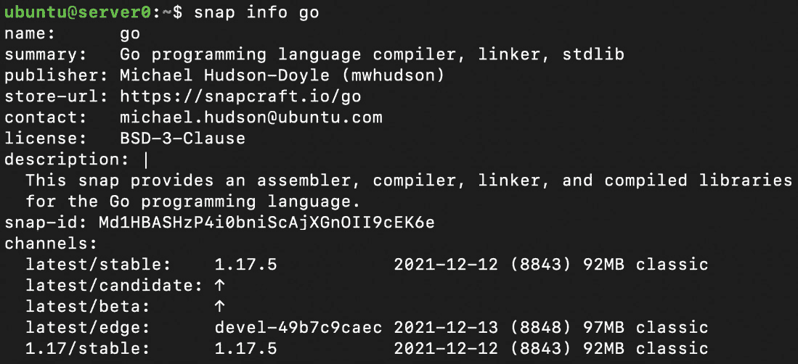

# 第三章：设置你的开发环境

本章我们将讨论如何设置**Go**开发环境，以便在*我们未来的章节*中使用，并为未来开发你自己的 Go 软件做准备。

我们将覆盖以下主要内容：

+   在你的计算机上安装 Go

+   本地构建代码

在我们开始之前，先简要介绍一下你需要了解的技术要求，然后再继续阅读。

# 技术要求

本章节的唯一技术要求如下：

+   一台 Go 工具支持的操作系统的计算机

+   需要互联网连接和网页浏览器来下载 Go 工具

# 在你的计算机上安装 Go

**Go 编译器**和工具集可以在 [`golang.org/dl/`](https://golang.org/dl/) 上找到。在这里，你可以找到适用于 macOS、Windows 和 Linux 平台的多个计算平台的版本。

最常见的平台是**AMD64**架构，适用于任何 x86 系统。对于 macOS，重要的是要注意，如果你使用的是非 Intel CPU 的机器，如 Apple M1，你需要使用**arm64 版本**。

在接下来的章节中，我们将描述如何为主要操作系统安装 Go。你应该跳到你打算安装的操作系统部分。

## 使用安装包安装 macOS

安装 Go 工具集的最简单方法是使用 `.pkg` 安装包。下载页面提供了 `.tar.gz` 构建包和 `.pkg` 安装包。使用 tar 包时，你必须将文件解压到一个位置，并将该位置添加到路径中。这样也意味着你需要手动处理升级。只有在有高级需求时，你才应该选择这种方式。

`.pkg` 文件使得安装和升级变得简单。只需双击 `.pkg` 文件并按照屏幕上的提示进行安装。安装过程中可能需要你输入凭据。

安装完成后，打开 `Applications/Utilities/terminal.app` 终端，并输入 `go version`，应该会显示类似以下内容：

```
$ go version
go version go1.17.5 linux/amd64
```

请注意，**版本输出**将取决于你下载的 Go 版本和你所运行的平台。

## 通过 Homebrew 安装 macOS

许多 macOS 开发者更喜欢使用流行的**Homebrew** ([`brew.sh`](https://brew.sh)) 来安装 Go。如果你是 Homebrew 用户，安装 Go 只需要简单的两步过程，具体内容将在以下章节中进行说明。

### 安装 Xcode

Go 依赖于 Apple 的**Xcode**，需要安装 Xcode 才能正常工作。要查看是否已经安装 Xcode，请输入以下命令：

```
$ xcode-select -p
```

输出应该类似于以下内容：

```
$ /Library/Developer/CommandLineTools
```

如果出现错误，你需要通过访问此链接在 App Store 中安装 Xcode：[`itunes.apple.com/us/app/xcode/id497799835?mt=12&ign-mpt=uo%3D2`](https://itunes.apple.com/us/app/xcode/id497799835?mt=12&ign-mpt=uo%3D2)。

安装完成后，你可以通过以下命令安装单独的命令行工具：

```
$ xcode-select --install
```

现在，让我们来看一下下一步。

### 更新 Homebrew 并安装 Go

使用以下命令更新 Homebrew 并安装最新的 Go 工具：

```
$ brew update
$ brew install golang
```

你可以通过`$ go version`来验证 Go 的版本。

接下来，我们将查看 Windows 上的安装方法。

## 使用 MSI 安装 Windows

Windows 的安装类似于其他 Windows 应用程序的安装，使用**Microsoft Installer**（**MSI**）文件。只需下载 MSI 文件并按照屏幕上的指示进行操作。默认情况下，这将把 Go 工具安装到**Program Files**或**Program Files (x86)**中。

要验证 Go 是否正确安装，请点击*开始*菜单，在搜索框中输入`cmd`，然后命令提示符窗口应该会出现。输入`go version`，它应该会显示已安装的 Go 版本。

接下来，我们将查看 Linux 上的安装方法。

## Linux

Linux 的包管理可能会成为一系列书籍的主题，正如 Linus 所指出的，这是 Linux 作为桌面系统如此惨败的原因之一。

如果你正在使用 Linux 进行开发，可能已经知道如何为你的发行版安装软件包。由于我们不能涵盖 Linux 上所有可能的安装方法，接下来我们将介绍如何通过`apt`、Snap 和`tarball`进行安装。

### 在 Ubuntu 上通过 APT 安装 Linux

**APT**是一个在多个发行版中使用的包管理器。通过 APT 安装 Go 相当简单。

更新并升级 APT 到最新版本，方法如下：

```
$ sudo apt update
$ sudo apt upgrade
```

按照以下步骤安装 Go 包：

```
sudo apt install golang-go
```

现在，在终端中输入`go version`，它应该会显示已安装的 Go 版本。

### 通过 Snap 在 Ubuntu 上安装 Linux

**Snap**是一个通用的包管理器，旨在通过将所有必要的文件包含在包中，使得在多个发行版或版本中安装软件包变得简单。

如果你已经安装了 Snap，你可以直接使用`snap info go`来查找可以安装的 Go 版本：



图 3.1 – 显示 snap info go 命令输出的截图

你可以选择通过输入以下命令安装最新的稳定版本的 Go：

```
sudo snap install go
```

现在，在终端中输入`go version`，它应该会显示已安装的 Go 版本。

请注意，您可能会收到关于 Go 包是使用具有经典限制的 Snap 版本构建的警告。在这种情况下，要通过 Snap 安装，您可能需要添加`--classic`，如下所示：

```
sudo snap install go --classic
```

### 通过 tarball 安装 Linux

为了做到这一点，你需要下载适用于 Linux 和你的平台的包。我们的示例将使用`go1.16.5.linux-amd64.tar.gz`。你会注意到，文件名中包含了 Go 版本（*1.16.5*）、操作系统（Linux）和架构（*AMD64*）。你需要将 Go 的当前版本和你的架构下载到一个目录中。

接下来的这些指令将使用终端。

我们希望将我们的版本安装到`/usr/local/go`并删除任何以前的安装。这可以通过以下方式实现：

```
rm -rf /usr/local/go && tar -C /usr/local -xzf go1.16.5.linux-amd64.tar.gz
```

现在，让我们将目录添加到 `PATH` 中，以便可以找到 Go 工具。这可以通过以下方式实现：

```
export PATH=$PATH:/usr/local/go/bin
```

对于大多数 shell，变化不会立即生效。最简单的方式是打开一个新的 shell 来使 `PATH` 更新。你也可以使用 `source` 命令重新加载 shell 的配置文件，前提是你知道配置文件的名称/路径——例如 `source $HOME/.profile`。

要测试你的 `PATH` 是否已正确更新，请输入 `go version`，应返回如下信息：

```
$ go version
go version go1.16.5 linux/amd64
```

那么在其他平台上安装 Go 呢？

## 其他平台

Go 确实可以安装在其他平台上，比如**FreeBSD**，但这些内容不在本书范围内。请参阅 Go 的*安装文档*了解其他平台的安装方式。

## 关于 Go 编译器版本兼容性的说明

Go 项目由 Go 兼容性承诺管理：[`golang.org/doc/go1compat`](https://golang.org/doc/go1compat)。其核心是，除非有重大语义版本号变更（**1.x.x** 到 **2.x.x**），否则 Go 将保持向后兼容。虽然你可能会听到人们谈论 Go 2.0，但作者们已经明确表示，他们没有计划跳过版本 1。

这意味着为**Go 1.0.0**编写的软件在最新的**Go 1.17.5**版本中可以运行。这对于 Go 社区的稳定性来说是一个重大胜利。本书将使用 Go 1.17.5 版本进行修订。

在本节结束时，你应该已经安装了 Go 工具并测试了该工具是否适用于你选择的操作系统。接下来，我们将讨论如何在你的计算机上构建代码。

# 本地构建代码

当前的 Go 生态系统（Go 1.13 及以后的版本）和工具链允许你在文件系统的任何位置编写 Go 代码。大多数用户选择为其包设置本地 Git 仓库，并在该目录中进行开发。

这是通过 Go 模块实现的，Go 团队将其描述为*“存储在文件树中的 Go 包集合，根目录有一个 go.mod 文件。”* Go 模块通常代表一个 GitHub 仓库，例如 `github.com/user/repository`。

大多数 Go 开发者会使用命令行在文件系统环境中移动，并与 Go 工具链进行交互。在本节中，我们将集中讨论如何使用 Unix 命令来访问文件系统以及使用 Go 编译器工具。Go 编译器命令在各操作系统间是相同的，但文件系统命令可能不同，文件路径也可能不同，例如 Windows 使用 `\` 作为路径分隔符，而不是 `/`。

## 创建模块目录和 go.mod 文件

该目录可以是文件系统中任何你可以访问的地方。`godev/` 是一个不错的目录名，并且将其放在你的主目录中（主目录因操作系统而异）是一个合理的选择，这样便于查找。

在该目录中，我将为我的包创建一个新目录。以这个示例为例，我将创建一个名为 `hello/` 的目录，表示我的 Go 模块：

```
$ cd ~
$ mkdir -p ~/godev/hello
$ cd ~/godev/hello 
```

创建我们的模块，我们只需要创建一个包含模块名的 `go.mod` 文件。模块名通常是 Git 路径，比如 `github.com/johnsiilver/fs`。

如果你有一个 GitHub 仓库，想把这个示例存储在其中，你可以在我们的命令中替换成你的仓库地址：

```
$ go mod init example.com/hello
go: creating new go.mod: module example.com/hello
```

这个 `go.mod` 文件将包含几个值得注意的关键部分：

```
module example.com/hello
go 1.17
```

第一行定义了我们的模块，这是指向 Git 仓库根目录的路径。第二行定义了可以用来编译此模块的 Go 最低版本。根据你使用的功能，模块可能兼容较早版本的 Go，你可以修改此设置来使用较低版本的 Go。

虽然这个示例中没有任何第三方包，但值得注意的是，大多数 `go.mod` 文件都会有一个 *require* 部分，列出你模块所导入的包及其版本。

## 添加依赖时更新模块

当添加第三方包时，你的 `go.mod` 文件需要修改以包含依赖信息。虽然这会是一个繁琐的任务，但 Go 提供了 `go mod tidy` 命令来帮助你自动处理。

运行 `go mod tidy` 会自动检查所有的包导入，并将它们添加到你的 `go.mod` 文件中。记得在添加任何外部依赖后运行此命令。

## 添加 hello world

为了学习如何编译和运行 Go 代码，我们将创建一个 *hello world* 应用程序。在 Go 中，所有的 Go 源文件都以 `.go` 后缀结尾。

在目录中使用你喜欢的文本编辑器创建一个名为 `hello.go` 的文件，并插入以下代码：

```
package main 
import "fmt" 
func main() { 
    fmt.Println("Hello World")
}
```

接下来，让我们运行我们的第一个程序。

## 运行我们的第一个程序

一旦你保存了这个文件，接下来我们来尝试编译并运行这段代码：

```
$ go run hello.go
Hello World
$
```

这将编译我们的源文件并作为二进制运行。你只能在名为 `main` 的包中使用 `go run`。

如果我们想为这个操作系统和架构创建一个二进制文件，我们只需运行以下命令：

```
$ go build hello.go # Builds a program called hello
$ ./hello           # Executes the hello binary
Hello World
```

现在有一个名为 `hello` 的二进制文件，可以在相同类型的任何操作系统/架构上运行。如果我们的包不是叫做 `main`，这将编译该包并报告遇到的任何错误，但不会创建二进制文件。

# 总结

你现在已经创建了你的第一个 Go 模块，初始化了第一个 `go.mod` 文件，创建了一个 Go 程序，使用 `go run` 运行了这个程序，并为你的操作系统构建了 Go 可执行文件。本章让你掌握了创建基础 Go 模块所需的技能，以及使用 Go 命令行工具的基本知识，这些工具用于运行 Go 包和构建 Go 程序。Go 开发者在日常工作中都会用到这些技能。

在下一章，我们将介绍 Go 语言的基础知识，包括包的工作方式、测试以及更多的基本内容。
