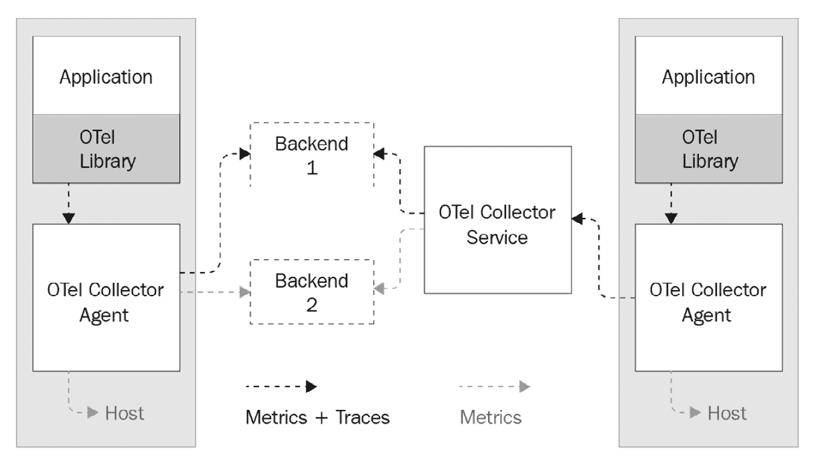
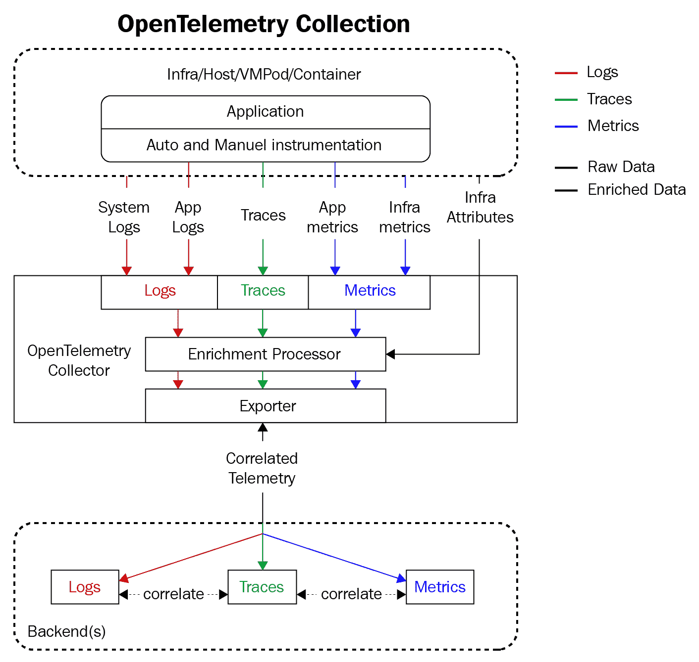
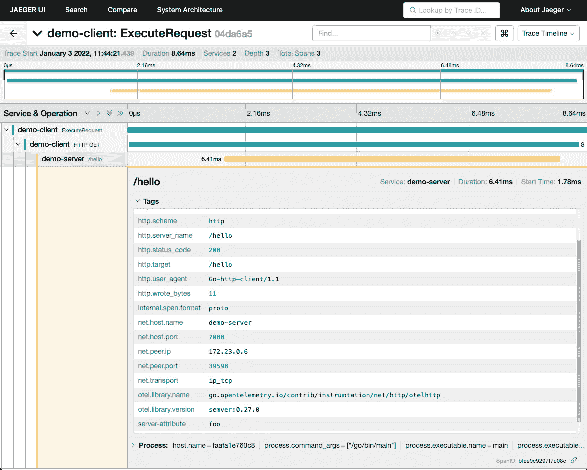
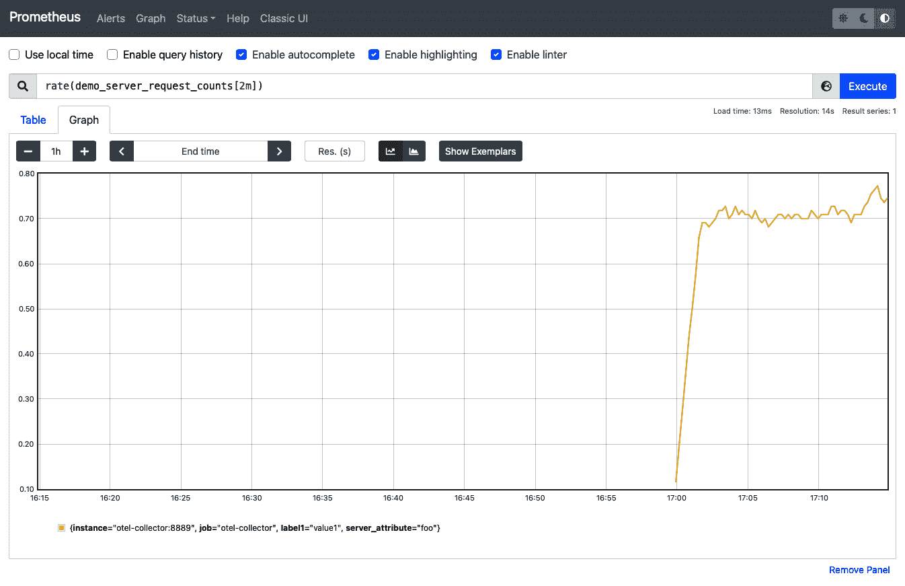
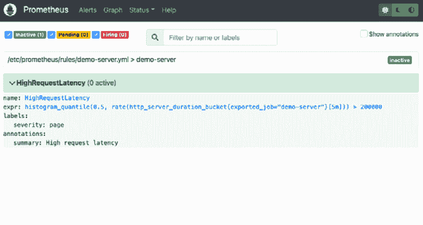
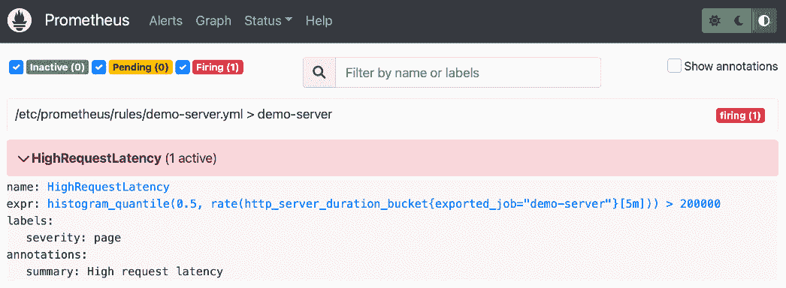

# 第九章：使用 OpenTelemetry 进行可观察性

在清晨，你正安然入睡时，手机突然响起。这不是你为朋友和家人设置的正常铃声，而是你为紧急情况设置的红色警报铃声。被铃声惊醒后，你开始逐渐清醒。你想到公司最近发布了新的应用程序，心中充满了一种不祥的预感。你接起电话，自动语音告知你需要加入一个优先级视频会议，会议中有一个团队正在调试新发布版本的在线问题。你迅速起床并加入了会议。

一旦接到电话，你会看到接诊团队的成员正在等待你。接诊团队告诉你，应用程序正遇到一次影响公司最大客户之一的服务故障，而该客户的损失占公司收入的很大一部分。这个故障已经被客户上报到了公司最高层，连 CEO 都知道这件事。接诊团队无法确定故障的原因，已经请你来帮助缓解问题，并找出故障的根本原因。

你去工作是为了确定根本原因。你打开应用程序的管理仪表盘，却发现没有关于应用程序的任何信息。没有日志，没有追踪，没有指标。应用程序没有发送遥测数据来帮助你调试故障。你基本上对应用程序的运行时行为以及造成故障的原因一无所知。你感到一种无法抗拒的恐惧，害怕如果找不到故障原因，这可能意味着公司将面临终结。

就在这时，我醒了过来。我刚才描述的，正是我经常做的噩梦：醒来时发现系统出现故障，而我没有足够的信息来确定应用程序的运行时状态。

如果无法查看应用程序的运行时状态，你就无法洞察可能导致应用程序异常行为的原因。你无法诊断并迅速缓解问题。在故障发生时，这种情况会让你感到非常无助和恐惧。

可观察性是通过测量应用程序和基础设施的输出，来了解应用程序的内部状态。我们将重点关注应用程序的三种输出：日志、追踪和指标。在这一章中，你将学习如何为应用程序添加监控，生成、收集并导出遥测数据，这样你就再也不会陷入无法了解应用程序运行时行为的境地。我们将使用 OpenTelemetry SDK 来为 Go 客户端和服务器添加监控，使应用程序能将遥测数据发送到 OpenTelemetry Collector 服务。OpenTelemetry Collector 服务将转换并导出这些遥测数据到后端系统，便于可视化、分析和告警。

本章将涵盖以下主题：

+   OpenTelemetry 简介

+   带上下文的日志记录

+   用于分布式追踪的工具化

+   用于指标的工具化

+   针对指标异常的告警

# 技术要求

本章需要 Docker 和 Docker Compose。

让我们从了解 OpenTelemetry、其组件以及 OpenTelemetry 如何使得观察性采取与供应商无关的方式开始。本章中使用的代码源自 [`github.com/open-telemetry/opentelemetry-collector-contrib/tree/main/examples/demo`](https://github.com/open-telemetry/opentelemetry-collector-contrib/tree/main/examples/demo)，并进行了一些更改，以提供额外的清晰度。

本章的代码文件可以从 [`github.com/PacktPublishing/Go-for-DevOps/tree/rev0/chapter/9`](https://github.com/PacktPublishing/Go-for-DevOps/tree/rev0/chapter/9) 下载

# OpenTelemetry 简介

OpenTelemetry 最初是一个将 OpenTracing 和 OpenCensus 项目合并的项目，旨在创建一个单一项目，完成它们共同的使命——为所有提供高质量的遥测数据。OpenTelemetry 是一套与供应商无关的规范、API、SDK 和工具，旨在用于遥测数据的创建和管理。OpenTelemetry 使项目能够收集、转换并导出日志、追踪和指标等遥测数据到所选择的后端系统。

OpenTelemetry 具备以下功能：

+   为最流行的编程语言提供的工具库，支持自动和手动工具化

+   一个可以以多种方式部署的单一采集器二进制文件

+   用于收集、转换和导出遥测数据的管道

+   一套开放标准，防止供应商锁定

在本节中，我们将了解 OpenTelemetry 技术栈以及我们可以用来使复杂系统可观测的组件。

## OpenTelemetry 的参考架构

接下来，让我们看看**OpenTelemetry**（**OTel**）的概念性参考架构图：



图 9.1 – OpenTelemetry 参考架构

上述参考架构图展示了两个应用程序，这些应用程序使用 OTel 库并运行在主机上，同时 OTel Collector 被部署为主机上的代理。OTel Collector 代理收集来自应用程序的跟踪和度量数据以及来自主机的日志数据。左侧主机上的 OTel Collector 正在将遥测数据导出到 Backend 1 和 Backend 2。在右侧，OTel Collector 代理从 OTel 仪表化的应用程序接收遥测数据，收集来自主机的遥测数据，然后将遥测数据转发给作为服务运行的 OTel Collector。作为服务运行的 OTel Collector 将遥测数据导出到 Backend 1 和 Backend 2。此参考架构图示了 OTel Collector 如何既可以作为主机上的代理部署，也可以作为服务部署，用于收集、转换和导出遥测数据。

参考架构图中故意没有显示遥测数据传输所用的网络协议，因为 OTel Collector 能够接收多种遥测输入格式。对于现有应用程序，接受如 Prometheus、Jaeger 和 Fluent Bit 等现有格式，可以使迁移到 OpenTelemetry 更加容易。对于新应用程序，推荐使用 OpenTelemetry 网络协议，它简化了遥测数据摄取的收集器配置。

## OpenTelemetry 组件

OpenTelemetry 由几个组件组成，构成了遥测堆栈。

### OpenTelemetry 规范

OpenTelemetry 规范描述了跨语言实现的期望和要求，并使用以下术语进行说明：

+   **API**：定义了用于生成和关联跟踪、度量和日志的数据类型和操作。

+   **SDK**：定义了在特定语言中实现 API 的方式，包括配置、处理和导出。

+   **数据**：定义了 **OpenTelemetry 行协议**（**OTLP**），这是一个与供应商无关的用于传输遥测数据的协议。

欲了解更多关于规范的信息，请参见 [`opentelemetry.io/docs/reference/specification/`](https://opentelemetry.io/docs/reference/specification/)。

### OpenTelemetry Collector

OTel Collector 是一个与供应商无关的代理，可以接收多种格式的遥测数据，进行转换和处理，并以多种格式导出，以供多个后端（例如 Jaeger、Prometheus、其他开源后端以及许多专有后端）使用。OTel Collector 由以下部分组成：

+   **接收器**：用于收集数据的推送或拉取型处理器

+   **处理器**：负责转换和过滤数据

+   **出口器**：用于导出数据的推送或拉取型处理器

上述每个组件都通过 YAML 配置中描述的管道来启用。要了解更多关于数据收集的信息，请参见 [`opentelemetry.io/docs/concepts/data-collection/`](https://opentelemetry.io/docs/concepts/data-collection/)。

### 语言 SDK 和自动仪表化

OpenTelemetry 中支持的每种语言都提供一个 SDK，帮助应用程序开发人员将他们的应用程序仪表化以发出遥测数据。SDK 还提供一些常见组件，帮助仪表化应用程序。例如，在 Go SDK 中，有用于 HTTP 处理程序的包装器，能够开箱即用地提供仪表化功能。此外，一些语言实现还提供自动仪表化，能够利用特定语言的特性收集遥测数据，而无需手动仪表化应用程序代码。

有关应用程序仪表化的更多信息，请参见 [`opentelemetry.io/docs/concepts/instrumenting-library/`](https://opentelemetry.io/docs/concepts/instrumenting-library/)。

### 遥测的关联性

遥测数据的关联性是任何遥测堆栈的核心特性。遥测数据的关联使我们能够确定跨越应用边界的事件之间的关系，这是构建复杂系统洞察的关键。例如，假设我们有一个由多个相互依赖的微服务组成的系统。每个服务可能运行在多个不同的主机上，并且可能使用不同的编程语言开发。我们需要能够关联一个给定的 HTTP 请求以及随后的所有请求，跨越我们的多个服务。这就是 OpenTelemetry 中遥测关联的作用。我们可以依靠 OpenTelemetry 在这些不同的服务之间建立一个关联 ID，并提供对复杂系统中发生事件的整体视图：



图 9.2 – 关联遥测

在本节中，我们介绍了 OpenTelemetry 堆栈中的主要概念。在接下来的章节中，我们将深入学习日志记录、追踪和度量，以及如何使用 OpenTelemetry 创建一个可观察的系统。

# 带上下文的日志记录

日志记录可能是最熟悉的遥测形式。当你第一次编写程序时，可能就通过打印 `Hello World!` 到 `STDOUT` 来开始记录日志。日志记录是向观察者提供应用程序内部状态数据的最自然的第一步。想想你有多少次在应用程序中添加打印语句来确定变量的值。你在做的就是日志记录。

打印简单的日志语句，例如 `Hello World!`，对初学者可能有帮助，但它并没有提供我们操作复杂系统所需的关键数据。当日志被丰富以提供描述事件的上下文时，日志可以成为遥测数据的强大来源。例如，如果我们的日志条目中包含一个关联 ID，我们可以使用该数据将日志条目与其他可观察性数据关联起来。

应用程序或系统日志通常由带时间戳的文本记录组成。这些记录具有不同的结构，从完全无结构的文本到附带元数据的高度结构化模式都有。日志可以通过多种方式输出——单个文件、旋转文件，甚至输出到`STDOUT`。我们需要能够从多个来源收集日志，转换并提取可消费格式的日志数据，然后将转换后的数据导出以供消费/索引。

在本节中，我们将讨论如何改进日志记录，从纯文本到结构化日志格式的过渡，以及如何使用 OpenTelemetry 消费和导出各种日志格式。我们将使用 Go 语言进行学习，但所介绍的概念适用于任何语言。

## 我们的第一条日志语句

我们从使用标准的 Go 日志开始，输出`Hello World!`：

```
package main
import "log"
func main() {
     log.Println("Hello World!")
}
// Outputs: 2009/11/10 23:00:00 Hello World!
```

上述的`Println`语句在[`go.dev/play/p/XH5JstbL7Ul`](https://go.dev/play/p/XH5JstbL7Ul)中运行时输出`2009/11/10 23:00:00 Hello World!`。观察输出的纯文本结构，并思考需要做什么才能解析文本并提取结构化的输出。解析起来可能是一个相对简单的正则表达式，但随着新数据的加入，解析结构会发生变化，导致解析器出错。此外，输出中几乎没有关于事件或该事件发生时上下文的任何信息。

Go 标准库的日志记录器有几个其他可用的功能，但我们在这里不会深入探讨。如果你有兴趣了解更多，我建议你阅读[`pkg.go.dev/log`](https://pkg.go.dev/log)。在本节的其余部分，我们将专注于结构化和分级日志记录器以及由[`github.com/go-logr/logr`](https://github.com/go-logr/logr)描述的 API。

## 使用 Zap 的结构化和分级日志

结构化日志记录器相比文本日志记录器有几个优势。结构化日志具有定义的键值模式，比纯文本更容易解析。你可以利用这些键值嵌入丰富的信息，例如关联 ID 或其他有用的上下文信息。此外，你可以过滤掉在特定日志上下文中可能不适用的键。

V 级别是控制日志中信息量的简单方法。例如，一个应用程序可能在-1 级别输出极为冗长的调试日志，而在 4 级别时仅输出关键错误。

在 Go 社区中，已有一个运动旨在通过[`github.com/go-logr/logr`](https://github.com/go-logr/logr)标准化结构化和分级日志接口。许多库实现了`logr`项目中描述的 API。为了我们的目的，我们将专注于一个结构化日志库——Zap，它也实现了`logr` API（[`github.com/go-logr/zapr`](https://github.com/go-logr/zapr)）。

让我们来看一下 Zap 日志记录器接口中的关键功能：

```
// Debug will log a Debug level event
func (log *Logger) Debug(msg string, fields ...Field)
// Info will log an Info level event
func (log *Logger) Info(msg string, fields ...Field)
// Error will log an Error level event
func (log *Logger) Error(msg string, fields ...Field)
// With will return a logger that will log the keys and values specified for future log events
func (log *Logger) With(fields ...Field) *Logger
// Named will return a logger with a given name
func (log *Logger) Named(s string) *Logger
```

上述接口提供了一组易于使用且强类型的日志记录原语。让我们看看使用 Zap 进行结构化日志记录的示例：

```
package main
import (
     "time"
     "go.uber.org/zap"
)
func main() {
     logger, _ := zap.NewProduction()
     defer logger.Sync()
     logger = logger.Named("my-app")
     logger.Info
          ("failed to fetch URL",
          zap.String("url", "https://github.com"),
          zap.Int("attempt", 3),
          zap.Duration("backoff", time.Second),
     )
}
// Outputs: {"level":"info","ts":1257894000,"logger":"my
// app","caller":"sandbox4253963123/prog.go:15",
// "msg":"failed to fetch URL",
// "url":"https://github.com","attempt":3,"backoff":1}
```

日志记录器的 JSON 结构化输出通过强类型的键值对提供有用、易于解析的上下文信息。在本章的追踪部分，我们将使用这些额外的键值对来嵌入关联 ID，以便将我们的分布式追踪与日志关联。如果你想尝试一下，可以查看[`go.dev/play/p/EVQPjTdAwX_U`](https://go.dev/play/p/EVQPjTdAwX_U)。

我们不会深入讨论日志输出的位置（如文件系统、`STDOUT`和`STDERR`），而是假设我们希望摄取的应用程序日志将具有文件表示形式。

现在我们在应用程序中生成了结构化日志，可以切换到使用 OpenTelemetry 来摄取、转换和导出日志。

## 使用 OpenTelemetry 摄取、转换和导出日志

在这个使用 OpenTelemetry 来摄取、转换和导出日志的示例中，我们将使用`docker-compose`来设置一个环境，模拟一个 Kubernetes 主机，日志存储在`/var/logs/pods/*/*/*.log`路径下。OTel Collector 将作为在主机上运行的代理。日志将从日志路径中的文件中摄取，路由到`filelog`接收器中的适当操作员，按其特定格式进行解析，解析后的属性将标准化，然后通过`logging`导出器导出到`STDOUT`。

本次演示将使用以下代码：[`github.com/PacktPublishing/Go-for-DevOps/tree/rev0/chapter/9/logging`](https://github.com/PacktPublishing/Go-for-DevOps/tree/rev0/chapter/9/logging)。现在，让我们快速查看一下演示目录的布局：

```
.
├── README.md
├── docker-compose.yml
├── otel-collector-config.yml
└── varlogpods
    ├── containerd_logs
0_000011112222333344445555666677778888
    │   └── logs
    │       └── 0.log
    ├── crio_logs-0_111122223333444455556666777788889999
    │   └── logs
    │       └── 0.log
    ├── docker_logs-0_222233334444555566667777888899990000
    │   └── logs
    │       └── 0.log
    └── otel_otel_888877776666555544443333222211110000
        └── otel-collector
            └── 0.log
```

`docker-compose.yml`文件包含了我们将运行 OTel Collector 的服务定义，并且挂载了 Collector 配置文件和日志文件目录`varlogpods`，以模拟 Collector 在 Kubernetes 主机上的运行。让我们来看看`docker-compose.yml`：

```
version: "3"
services:
  opentelemetry-collector-contrib:
    image: otelcontribcol
    command: ["--config=/etc/otel-collector-config.yml"]
    volumes:
      - ./otel-collector-config.yml:/etc/otel-collector-config.yml
      - ./varlogpods:/var/log/pods
```

要运行此演示，请进入章节的源代码，`cd`进入`logging`目录，然后运行`docker-compose up`。

### OTel Collector 配置

OTel Collector 配置文件包含了代理如何摄取、处理和导出日志的指令。让我们深入了解配置并逐步解析：

```
receivers:
  filelog:
    include:
      - /var/log/pods/*/*/*.log
    exclude:
      # Exclude logs from all containers named otel-collector
      - /var/log/pods/*/otel-collector/*.log
    start_at: beginning
    include_file_path: true
    include_file_name: false
```

`receivers`部分包含一个单一的`filelog`接收器，指定了要包含和排除的目录。`filelog`接收器将从每个日志文件的开头开始，并在操作符中包含文件路径以提取元数据。接下来，让我们继续看看操作符部分：

```
    operators:
      # Find out which format is used by kubernetes
      - type: router
        id: get-format
        routes:
          - output: parser-docker
            expr: '$$body matches "^\\{"'
          - output: parser-crio
            expr: '$$body matches "^[^ Z]+ "'
          - output: parser-containerd
            expr: '$$body matches "^[^ Z]+Z"'
```

filelog 操作符定义了一系列用于处理日志文件的步骤。初始步骤是一个路由操作，它将根据日志文件的主体内容，确定哪个解析器处理操作符输出中指定的日志主体条目。每个解析器操作符将根据日志条目的特定格式，从每个记录中提取时间戳。现在让我们继续看解析器，看看一旦路由完成，解析器如何从每个日志条目中提取信息：

```
      # Parse CRI-O format
      - type: regex_parser
        id: parser-crio
        regex: '^(?P<time>[^ Z]+) (?Pstdout|stderr) (?P<logtag>[^ ]*) (?P<log>.*)$'
        output: extract_metadata_from_filepath
        timestamp:
          parse_from: time
          layout_type: gotime
          layout: '2006-01-02T15:04:05.000000000-07:00'
      # Parse CRI-Containerd format
      - type: regex_parser
        id: parser-containerd
        regex: '^(?P<time>[^ ^Z]+Z) (?Pstdout|stderr) (?P<logtag>[^ ]*) (?P<log>.*)$'
        output: extract_metadata_from_filepath
        timestamp:
          parse_from: time
          layout: '%Y-%m-%dT%H:%M:%S.%LZ'
      # Parse Docker format
      - type: json_parser
        id: parser-docker
        output: extract_metadata_from_filepath
        timestamp:
          parse_from: time
          layout: '%Y-%m-%dT%H:%M:%S.%LZ'
      # Extract metadata from file path
      - type: regex_parser
        id: extract_metadata_from_filepath
        regex: '^.*\/(?P<namespace>[^_]+)_(?P<pod_name>[^_]+)_(?P<uid>[a-f0-9\-]{36})\/(?P<container_name>[^\._]+)\/(?P<restart_count>\d+)\.log$'
        parse_from: $$attributes["file.path"]
      # Move out attributes to Attributes
      - type: metadata
        attributes:
          stream: 'EXPR($.stream)'
          k8s.container.name: 'EXPR($.container_name)'
          k8s.namespace.name: 'EXPR($.namespace)'
          k8s.pod.name: 'EXPR($.pod_name)'
          k8s.container.restart_count: 'EXPR($.restart_count)'
          k8s.pod.uid: 'EXPR($.uid)'
      # Clean up log body
      - type: restructure
        id: clean-up-log-body
        ops:
          - move:
              from: log
              to: $
```

例如，`parser-crio` 操作符将对每个日志条目执行正则表达式，从条目中解析出时间变量，并指定提取字符串的时间格式。将 `parser-crio` 与 `parser-docker` 操作符进行对比，后者使用 JSON 结构化日志格式，每个日志条目中都有一个 `time` 的 JSON 键。`parser-docker` 操作符只提供 JSON 条目的键和字符串的布局。结构化日志不需要正则表达式。每个解析器的输出都传送到 `extract_metadata_from_filepath`，该操作通过正则表达式从文件路径中提取属性。在解析并提取文件路径信息之后，`metadata` 操作会执行，将从解析步骤中收集的属性添加到上下文中，以便将来查询。最后，`restructure` 操作将从每个解析日志条目中提取的日志键移到提取结构的 `Body` 属性中。

让我们来看看 CRI-O 日志格式：

```
2021-02-16T08:59:31.252009327+00:00 stdout F example: 11 Tue Feb 16 08:59:31 UTC 2021
```

现在，让我们来看看 Docker 日志格式：

```
{"log":"example: 12 Tue Feb 16 09:15:12 UTC
2021\n","stream":"stdout","time":"2021-02-16T09:15:12.50286486Z"}
```

在运行示例时，你应该会看到如下输出：

```
opentelemetry-collector-contrib_1  | LogRecord #19
opentelemetry-collector-contrib_1  | Timestamp: 2021-02-16 09:15:17.511829776 +0000 UTC
opentelemetry-collector-contrib_1  | Severity:
opentelemetry-collector-contrib_1  | ShortName:
opentelemetry-collector-contrib_1  | Body: example: 17 Tue Feb 16 09:15:17 UTC 2021
opentelemetry-collector-contrib_1  |
opentelemetry-collector-contrib_1  | Attributes:
opentelemetry-collector-contrib_1  |      -> k8s.container.name: STRING(logs)
opentelemetry-collector-contrib_1  |      -> k8s.container.restart_count: STRING(0)
opentelemetry-collector-contrib_1  |      -> k8s.namespace.name: STRING(docker)
opentelemetry-collector-contrib_1  |      -> k8s.pod.name: STRING(logs-0)
opentelemetry-collector-contrib_1  |      -> k8s.pod.uid: STRING(222233334444555566667777888899990000)
opentelemetry-collector-contrib_1  |      -> stream: STRING(stdout)
opentelemetry-collector-contrib_1  | Trace ID:
opentelemetry-collector-contrib_1  | Span ID:
opentelemetry-collector-contrib_1  | Flags: 0
```

正如你从前面的输出中看到的，OTel 收集器已经从 `metadata` 操作符中提取了时间戳、主体和指定的属性，构建了导出日志数据的标准化结构，并将标准化结构导出到 `STDOUT`。

我们已经完成了日志遥测的摄取、转换和提取目标，但你还应该问自己，我们如何才能与这些遥测数据建立更强的关联性。到目前为止，我们唯一的关联是时间、Pod 和容器。我们很难确定导致该日志条目的 HTTP 请求或其他具体信息。请注意，在前面的输出中，`Trace ID` 和 `Span ID` 是空的。在接下来的部分，我们将讨论追踪，并看看如何在我们的应用程序中建立日志与请求之间更强的关联。

# 用于分布式追踪的仪器化

跟踪用于追踪应用程序中单个活动的进展。例如，一个活动可以是用户在应用程序中发起一个请求。如果一个跟踪仅仅追踪单个进程或系统中一个组件的活动进展，那么它的价值是有限的。然而，如果一个跟踪可以跨多个组件传播，它将变得更加有用。能够在系统中跨组件传播的跟踪被称为**分布式跟踪**。分布式跟踪和活动相关性分析是确定复杂系统中因果关系的强大工具。

跟踪（Trace）由表示应用程序内工作单元的跨度（span）组成。每个跟踪和跨度都可以被唯一标识，每个跨度包含一个上下文，该上下文包括`请求`、`错误`和`持续时间`等度量。一个跟踪包含一个具有单一根跨度的跨度树。例如，假设用户在你公司电商网站上点击结账按钮。根跨度将包含整个请求/响应周期，正如用户点击结账按钮时所感知的那样。对于这个单一根跨度，可能会有许多子跨度，例如查询产品数据、信用卡支付和数据库更新。也许其中还会有一个与根跨度中的某个底层跨度相关的错误。每个跨度都有与之相关的元数据，如名称、开始和结束时间戳、事件和状态。通过创建一个包含这些元数据的跨度树，我们能够深入检查复杂应用程序的状态。

在本节中，我们将学习如何使用 OpenTelemetry 对 Go 应用程序进行仪器化，以发出分布式跟踪遥测数据，并使用 Jaeger（一款用于可视化和查询分布式跟踪的开源工具）来检查这些数据。

## 分布式跟踪的生命周期

在我们深入代码之前，让我们首先讨论分布式跟踪的工作原理。假设我们有两个服务，A 和 B。服务 A 提供网页并从服务 B 请求数据。当服务 A 收到页面请求时，服务启动一个根 span。然后，服务 A 请求服务 B 的一些数据来完成请求。服务 A 将跟踪和 span 上下文编码到请求头中，以发送给服务 B。当服务 B 收到请求时，服务 B 从请求头中提取跟踪和 span 信息，并从请求创建一个子 span。如果服务 B 没有收到跟踪/span 头，则会创建一个新的根 span。服务 B 继续处理请求，根据需要从数据库请求数据创建新的子 span。服务 B 收集完所请求的信息后，响应服务 A 并将其 span 发送给跟踪聚合器。然后服务 A 收到来自服务 B 的响应，并向用户响应页面。活动结束时，服务 A 标记根 span 为完成，并将其 span 发送给跟踪聚合器。跟踪聚合器构建一个树，其中包含来自服务 A 和服务 B 的 span 的共享相关性，从而形成分布式跟踪。

要了解 OpenTelemetry 跟踪规范的更多细节，请参阅 [`opentelemetry.io/docs/reference/specification/overview/#tracing-signal`](https://opentelemetry.io/docs/reference/specification/overview/#tracing-signal)。

### 使用 OpenTelemetry 进行客户端/服务器分布式跟踪

在此示例中，我们将部署并检查一个使用 OpenTelemetry 进行分布式跟踪的客户端/服务器应用程序，并使用 Jaeger 查看分布式跟踪。客户端应用程序定期向服务器发送请求，这些请求将在 Jaeger 中生成跟踪。 [`github.com/PacktPublishing/Go-for-DevOps/tree/rev0/chapter/9/tracing`](https://github.com/PacktPublishing/Go-for-DevOps/tree/rev0/chapter/9/tracing) 目录包含以下内容：

```
.
├── readme.md
├── client
│   ├── Dockerfile
│   ├── go.mod
│   ├── go.sum
│   └── main.go
├── docker-compose.yaml
├── otel-collector-config.yaml
└── server
    ├── Dockerfile
    ├── go.mod
    ├── go.sum
    └── main.go
```

要运行此演示，请转到章节源代码，`cd`到`tracing`目录，运行 `docker-compose up -d`，并打开 `http://localhost:16686` 查看 Jaeger 分布式跟踪。

让我们首先浏览 `docker-compose.yaml` 文件，看看我们正在部署的每个服务：

```
version: "2"
services:
  # Jaeger
  jaeger-all-in-one:
    image: jaegertracing/all-in-one:latest
    ports:
      - "16686:16686"
      - "14268"
      - "14250"
  # Collector
  otel-collector:
    image: ${OTELCOL_IMG}
    command: ["--config=/etc/otel-collector-config.yaml", "${OTELCOL_ARGS}"]
    volumes:
      - ./otel-collector-config.yaml:/etc/otel-collector-config.yaml
    ports:
      - "13133:13133" # health_check extension
    depends_on:
      - jaeger-all-in-one
  demo-client:
    build:
      dockerfile: Dockerfile
      context: ./client
    environment:
      - OTEL_EXPORTER_OTLP_ENDPOINT=otel-collector:4317
      - DEMO_SERVER_ENDPOINT=http://demo-server:7080/hello
    depends_on:
      - demo-server
  demo-server:
    build:
      dockerfile: Dockerfile
      context: ./server
    environment:
      - OTEL_EXPORTER_OTLP_ENDPOINT=otel-collector:4317
    ports:
      - "7080"
    depends_on:
      - otel-collector
```

前面的 `docker-compose.yaml` 文件部署了一个 Jaeger *all-in-one* 实例，一个 OTel 收集器，一个客户端 Go 应用程序，以及一个服务器 Go 应用程序。这些组件略有不同于 OpenTelemetry 演示：[`github.com/open-telemetry/opentelemetry-collector-contrib/tree/main/examples/demo`](https://github.com/open-telemetry/opentelemetry-collector-contrib/tree/main/examples/demo)。

接下来，让我们查看 OTel 收集器的配置，以更好地理解其部署模型和配置行为：

```
receivers:
  otlp:
    protocols:
      grpc:
exporters:
  jaeger:
    endpoint: jaeger-all-in-one:14250
    tls:
      insecure: true
processors:
  batch:
service:
  pipelines:
    traces:
      receivers: [otlp]
      processors: [batch]
      exporters: [jaeger]
```

前述 OTel 收集器配置指定收集器将侦听`14250`端口。

接下来，让我们分解客户端 `main.go` 的重要部分：

```
func main() {
     shutdown := initTraceProvider()
     defer shutdown()

     continuouslySendRequests()
}
```

`func main()` 初始化跟踪提供者，并返回一个关闭函数，该函数将在 `func main()` 退出时延迟执行。`main()` 函数接着调用 `continuouslySendRequests` 向服务器应用发送一个连续的、定期的请求流。接下来，让我们看看 `initTraceProvider` 函数：

```
func initTraceProvider() func() {
	ctx := context.Background()
	cancel = context.CancelFunc
	timeout := 1 * time.Second
	endPointEnv := "OTEL_EXPORTER_OTLP_ ENDPOINT"
	otelAgentAddr, ok := os.LookupEnv(endPointEnv)
	if !ok {
		otelAgentAddr = "0.0.0.0:4317"
	}
	closeTraces := initTracer(ctx, otelAgentAddr)
	return func() {
		ctx, cancel = context.WithTimeout(ctx, time.Second)
		defer cancel()
		// pushes any last exports to the receiver
		closeTraces(doneCtx)
	}
}
```

`initTraceProvider()` 从环境变量中查找 OTLP 跟踪端点，或者默认为 `0.0.0.0:4317`。在设置好跟踪端点地址后，代码调用 `initTracer` 来初始化跟踪器，并返回一个名为 `closeTraces` 的函数，该函数用于关闭跟踪器。最后，`initTraceProvider()` 返回一个可用于刷新和关闭跟踪器的函数。接下来，让我们看看 `initTracer()` 中发生了什么：

```
func initTracer(ctx context.Context, otelAgentAddr string) func(context.Context) {
     traceClient := otlptracegrpc.NewClient(
          otlptracegrpc.WithInsecure(),
          otlptracegrpc.WithEndpoint(otelAgentAddr),
          otlptracegrpc.WithDialOption(grpc.WithBlock()))
     traceExp, err := otlptrace.New(ctx, traceClient)
     handleErr(err, "Failed to create the collector trace exporter")
     res, err := resource.New(
          ctx,
          resource.WithFromEnv(),
          resource.WithProcess(),
          resource.WithTelemetrySDK(),
          resource.WithHost(),
          resource.WithAttributes(
               semconv.ServiceNameKey.String("demo-client"),
          ),
     )
     handleErr(err, "failed to create resource")
     bsp := sdktrace.NewBatchSpanProcessor(traceExp)
     tracerProvider := sdktrace.NewTracerProvider(
          sdktrace.WithSampler(sdktrace.AlwaysSample()),
          sdktrace.WithResource(res),
          sdktrace.WithSpanProcessor(bsp),
     )
     // set global propagator to tracecontext (the default is no-op).
     otel.SetTextMapPropagator(propagation.TraceContext{})
     otel.SetTracerProvider(tracerProvider)
     return func(doneCtx context.Context) {
          if err := traceExp.Shutdown(doneCtx); err != nil {
               otel.Handle(err)
          }
     }
}
```

`initTracer()` 构建了一个连接到 OTLP 端点的 trace 客户端。然后，使用该 trace 客户端构建一个 trace 导出器，该导出器用于批量处理和导出 spans。批量 span 处理器随后用于创建一个跟踪提供者，该提供者被配置为跟踪所有 spans，并且被标识为 `"demo-client"` 资源。跟踪提供者可以配置为以随机方式或使用自定义采样策略进行采样。然后，跟踪提供者被添加到全局 OTel 上下文中。最后，返回一个函数，该函数将关闭并刷新 trace 导出器。

现在我们已经探讨了如何设置跟踪器，接下来让我们继续讨论在 `continuouslySendRequests` 函数中发送和跟踪请求：

```
func continuouslySendRequests() {
     tracer := otel.Tracer("demo-client-tracer")
     for {
          ctx, span := tracer.Start(context.Background(), "ExecuteRequest")
          makeRequest(ctx)
          span.End()
          time.Sleep(time.Duration(1) * time.Second)
     }
}
```

顾名思义，`continuouslySendRequests` 函数从全局 OTel 上下文中创建一个命名的跟踪器，我们在本章早些时候已经初始化了它。`otel.Tracer` 接口只有一个函数，`Start(ctx context.Context, spanName string, opts ...SpanStartOption) (context.Context, Span)`，用于在 `context.Context` 值包中没有现有 span 时启动一个新的 span。`main` 中的 `for` 循环将无限期地创建新的 span，向服务器发出请求，进行一些工作，最后休眠 1 秒：

```
func makeRequest(ctx context.Context) {
     demoServerAddr, ok := os.LookupEnv("DEMO_SERVER_ENDPOINT")
     if !ok {
          demoServerAddr = "http://0.0.0.0:7080/hello"
     }
     // Trace an HTTP client by wrapping the transport
     client := http.Client{
          Transport: otelhttp.NewTransport(http.DefaultTransport),
     }
     // Make sure we pass the context to the request to avoid broken traces.
     req, err := http.NewRequestWithContext(ctx, "GET", demoServerAddr, nil)
     if err != nil {
          handleErr(err, "failed to http request")
     }
     // All requests made with this client will create spans.
     res, err := client.Do(req)
     if err != nil {
          panic(err)
     }
     res.Body.Close()
}
```

`makeRequest()` 对那些使用过 Go `http` 库的人来说应该很熟悉。与未进行 OTel 仪表化的 HTTP 请求相比，有一个显著的区别：`client` 的传输已被包装在 `otelhttp.NewTransport()` 中。`otelhttp` 传输在 `Roundtrip` 实现中使用 `request.Context()` 来提取上下文中的现有 span，然后 `otelhttp.Transport` 将 span 信息添加到 HTTP 头中，以便将 span 数据传播到服务器应用。

现在我们已经涵盖了客户端部分，接下来让我们看看服务器端的 `main.go`。该部分的代码可以在这里找到：[`github.com/PacktPublishing/Go-for-DevOps/blob/rev0/chapter/9/tracing/server/main.go`](https://github.com/PacktPublishing/Go-for-DevOps/blob/rev0/chapter/9/tracing/server/main.go)：

```
func main() { 
    shutdown := initTraceProvider() 
    defer shutdown()
     handler := handleRequestWithRandomSleep()
     wrappedHandler := otelhttp.NewHandler(handler, "/hello")
     http.Handle("/hello", wrappedHandler)
     http.ListenAndServe(":7080", nil)
}
```

`func main.go` 以类似于客户端 `main.go` 的方式调用 `initTraceProvider` 和 `shutdown`。在初始化追踪提供者后，服务器 `main.go` 代码创建了一个 HTTP 服务器，处理端口 `7080` 上的 `"/hello"` 请求。关键部分是 `wrappedHandler := otelhttp.NewHandler(handler, "/hello")`。`wrappedHandler()` 从 HTTP 头中提取跨度上下文，并将从客户端跨度派生的跨度填充到请求的 `context.Context` 中。在 `handleRequestWithRandomSleep()` 中，代码使用传播的跨度上下文继续分布式追踪。让我们来探讨一下 `handleRequestWithRandomSleep()`：

```
func handleRequestWithRandomSleep() http.HandlerFunc {
     commonLabels := []attribute.KeyValue{
          attribute.String("server-attribute", "foo"),
     }
     return func(w http.ResponseWriter, req *http.Request) {
          //  random sleep to simulate latency
          var sleep int64
          switch modulus := time.Now().Unix() % 5; modulus {
          case 0:
               sleep = rng.Int63n(2000)
          case 1:
               sleep = rng.Int63n(15)
          case 2:
               sleep = rng.Int63n(917)
          case 3:
               sleep = rng.Int63n(87)
          case 4:
               sleep = rng.Int63n(1173)
          }
          time.Sleep(time.Duration(sleep) * time.Millisecond)
          ctx := req.Context()
          span := trace.SpanFromContext(ctx)
          span.SetAttributes(commonLabels...)
          w.Write([]byte("Hello World"))
     }
}
```

在 `handleRequestWithRandomSleep()` 中，请求被处理，同时引入了一个随机延迟以模拟延迟。`trace.SpanFromContext(ctx)` 使用由 `wrappedHandler` 填充的跨度，然后在分布式跨度上设置属性。

在 Jaeger 中可查看的结果位于 `http://localhost:16686`，如下所示：



](img/B17626_09_003.jpg)

图 9.3 – Jaeger 客户端/服务器分布式追踪

在前面的截图中，你可以看到客户端和服务器之间的分布式追踪，包括在请求/响应周期中创建的每个跨度。这是一个简单的例子，但你可以想象如何将这个简单的例子扩展到更复杂的系统中，从而提供对难以调试场景的洞察。追踪提供了获取错误以及更细微的性能问题所需的信息。

## 关联追踪与日志

在 *上下文日志记录* 部分，我们讨论了日志条目与活动的关联。如果没有与特定追踪和跨度的关联，你将无法确定哪些日志事件源自特定的活动。请记住，日志条目本身并不包含追踪和跨度数据，这些数据帮助我们构建关联的追踪视图，正如我们在 Jaeger 中所看到的那样。然而，我们可以扩展日志条目以包括这些数据，并启用与特定活动的强关联：

```
func WithCorrelation(span trace.Span, log *zap.Logger) *zap.Logger {
     return log.With(
          zap.String("span_id", convertTraceID(span.SpanContext().SpanID().String())),
          zap.String("trace_id", convertTraceID(span.SpanContext().TraceID().String())),
     )
}
func convertTraceID(id string) string {
     if len(id) < 16 {
          return ""
     }
     if len(id) > 16 {
          id = id[16:]
     }
     intValue, err := strconv.ParseUint(id, 16, 64)
     if err != nil {
          return ""
     }
     return strconv.FormatUint(intValue, 10)
}
```

在前面的代码中，我们使用 `zap` 结构化日志记录器将跨度和追踪 ID 添加到日志记录器中，因此每个由增强了 `WithCorrelation()` 的日志记录器写入的日志条目将与给定的活动保持强关联。

## 向跨度添加日志条目

关联日志与追踪对于构建日志与活动的关联非常有效，但你可以更进一步。你可以将日志事件直接添加到跨度中，而不是仅仅依赖于日志的关联：

```
func SuccessfullyFinishedRequestEvent(span trace.Span, opts ...trace.EventOption) {
     opts = append(opts, trace.WithAttributes(attribute.String("someKey", "someValue")))
     span.AddEvent("successfully finished request operation", opts...)
}
```

`SuccessfullyFinishedRequestEvent()` 将会用一个事件条目装饰跨度，这个事件会作为日志条目出现在 Jaeger 中。如果我们在客户端的 `main.go` 中调用这个函数，在完成请求后，会向客户端请求的跨度添加一个日志事件：


](img/B17626_09_004.jpg)

图 9.4 – Jaeger 客户端/服务器分布式追踪与日志条目

如你所见，日志条目被嵌入到 Jaeger 中可视化的跨度内。将日志条目添加到跨度中为分布式追踪提供了更多上下文，帮助你更容易理解应用程序的运行状况。

在下一节中，我们将通过度量仪表化这个示例，使用 Prometheus 提供应用程序的聚合视图。

# 进行度量仪表化

度量是应用程序在运行时某个特定方面在某一时刻的测量值。每次捕获的结果称为 **度量事件**，它由时间戳、测量值和相关的元数据组成。度量事件用于提供应用程序运行时行为的聚合视图。例如，度量事件可以是每当服务处理请求时，计数器加 1。单个事件本身并不特别有用，但当它们聚合成一段时间内的请求总数时，就能反映出服务在该时间段内处理了多少请求。

OpenTelemetry API 不允许自定义聚合，但提供了一些常见的聚合方法，如求和、计数、最后一个值和直方图，这些方法被 Prometheus 等后端可视化和分析软件所支持。

为了让你更清楚地了解度量何时有用，以下是一些示例场景：

+   提供一个进程中读取或写入的位数的总和

+   提供 CPU 或内存使用情况

+   提供一段时间内的请求数量

+   提供一段时间内的错误数量

+   提供请求持续时间以形成请求处理时间的统计分布

OpenTelemetry 提供三种类型的度量：

+   `counter`：在一段时间内计数一个值，例如请求的数量

+   `measure`：对一段时间内的值进行求和或其他聚合，例如每分钟读取多少字节

+   `observer`：定期捕获某个值，例如每分钟的内存使用情况

在本节中，我们将学习如何使用 OpenTelemetry 对 Go 应用进行仪表化，以发出度量遥测数据，并使用 Prometheus 这一开源工具进行可视化和分析。

## 度量的生命周期

在深入代码之前，让我们先讨论度量是如何定义和使用的。在你可以记录或观察一个度量之前，它必须被定义。例如，请求延迟的直方图可以这样定义：

```
meter := global.Meter("demo-client-meter")
requestLatency := metric.Must(meter).NewFloat64Histogram(
	"demo_client/request_latency",
	metric.WithDescription(
		"The latency of requests processed"
	),
)
requestCount := metric.Must(meter).NewInt64Counter(
	"demo_client/request_counts",
	metric.WithDescription("The number of requests processed"),
)
```

上述代码获取一个名为 `demo-client-meter` 的全局计量器，然后注册一个新的直方图仪表 `demo_client/reqeust_latency` 和一个计数器仪表 `demo_client/request_counts`，这两个仪表都包含了它们所收集内容的描述。为度量提供描述性名称和说明非常重要，因为在后续分析数据时，如果没有清晰的命名，可能会导致混淆。

一旦仪表已定义，就可以用来记录度量数据，具体如下：

```
meter.RecordBatch(
    ctx,
    commonLabels,
    requestLatency.Measurement(latencyMs),
    requestCount.Measurement(1),
)
```

上述代码使用了我们之前定义的全局计量器来记录两个度量值：请求延迟和请求数量的增量。请注意，`ctx`被包括在内，它将包含关联信息，用以将活动与度量值关联起来。

在事件被记录后，它们将根据`MeterProvider`的配置进行导出，接下来我们将探讨这一部分。

## 使用 OpenTelemetry 的客户端/服务器指标

我们将扩展在*为分布式追踪仪表化*部分中描述的相同客户端/服务器应用程序。此部分的代码可以在这里找到：[`github.com/PacktPublishing/Go-for-DevOps/tree/rev0/chapter/9/metrics`](https://github.com/PacktPublishing/Go-for-DevOps/tree/rev0/chapter/9/metrics)。该目录的结构如下：

```
.
├── readme.md
├── client
│   ├── Dockerfile
│   ├── go.mod
│   ├── go.sum
│   └── main.go
├── .env
├── docker-compose.yaml
├── otel-collector-config.yaml
├── prometheus.yaml
└── server
    ├── Dockerfile
    ├── go.mod
    ├── go.sum
    └── main.go
```

上述内容中唯一的新增部分是`prometheus.yaml`文件，内容如下：

```
scrape_configs:
  - job_name: 'otel-collector'
    scrape_interval: 10s
    static_configs:
      - targets: ['otel-collector:8889']
      - targets: ['otel-collector:8888']
```

上述配置告知 Prometheus 抓取 OTel 收集器中的端点以收集指标数据。接下来，让我们看一下需要更新的内容，以将 Prometheus 添加到`docker-compose.yaml`文件中：

```
version: "2"
services:
  # omitted Jaeger config
  # Collector
  otel-collector:
    image: ${OTELCOL_IMG}
    command: ["--config=/etc/otel-collector-config.yaml", "${OTELCOL_ARGS}"]
    volumes:
      - ./otel-collector-config.yaml:/etc/otel-collector-config.yaml
    ports:
      - "8888:8888"   # Prometheus metrics exposed by the collector
      - "8889:8889"   # Prometheus exporter metrics
      - "4317"        # OTLP gRPC receiver
    depends_on:
      - jaeger-all-in-one
  # omitted demo-client and demo-server
  prometheus:
    container_name: prometheus
    image: prom/prometheus:latest
    volumes:
      - ./prometheus.yaml:/etc/prometheus/prometheus.yml
    ports:
      - "9090:9090"
```

如你所见，我们已经为 OTel 收集器添加了一些额外的端口供 Prometheus 抓取，并且 Prometheus 服务已经将`prometheus.yaml`挂载到容器中。接下来，让我们查看更新后的 OTel 收集器配置：

```
receivers:
  otlp:
    protocols:
      grpc:
exporters:
  prometheus:
    endpoint: "0.0.0.0:8889"
    const_labels:
      label1: value1
  logging:
  # omitted jaeger exporter
processors:
  batch:
service:
  pipelines:
    # omitted tracing pipeline
    metrics:
      receivers: [otlp]
      processors: [batch]
      exporters: [logging, prometheus]
```

上述配置省略了在*为分布式追踪仪表化*部分中使用的 Jaeger 配置，为了简洁起见。新增的部分是 Prometheus 的导出器以及指标管道。Prometheus 导出器将暴露端口`8889`，以便 Prometheus 抓取 OTel 收集器收集的指标数据。

接下来，让我们分解客户端`main.go`中的重要部分：

```
func main() {
     shutdown := initTraceAndMetricsProvider()
     defer shutdown()
     continuouslySendRequests()
}
```

我们之前在本章中探讨的追踪版本与此处的唯一区别是，代码现在调用`initTraceAndMetricsProvider`来初始化追踪和指标提供者，而不是调用`initTraceProvider`。接下来，让我们探讨`initTraceAndMetricsProvider()`：

```
func initTraceAndMetricsProvider() func() {
	ctx := context.Background()
	var cancel context.CancelFunc
	timeout := 1 * time.Second
	endpoint := "OTEL_EXPORTER_OTLP_ ENDPOINT"
	otelAgentAddr, ok := os.LookupEnv(endpoint)
	if !ok {
		otelAgentAddr = "0.0.0.0:4317"
	}
	closeMetrics := initMetrics(ctx, otelAgentAddr)
	closeTraces := initTracer(ctx, otelAgentAddr)
	return func() {
		ctx, cancel = context.WithTimeout(ctx, timeout)
		defer cancel()
		closeTraces(doneCtx)
		closeMetrics(doneCtx)
	}
}
```

`initTraceAndMetricsProvider`中的代码建立了 OTel 代理地址，并初始化了指标和追踪提供者。最后，返回一个关闭并刷新指标和追踪的函数。接下来，让我们探讨`initMetrics()`：

```
func initMetrics(ctx context.Context, otelAgentAddr string) func(context.Context) {
     metricClient := otlpmetricgrpc.NewClient(
          otlpmetricgrpc.WithInsecure(),
          otlpmetricgrpc.WithEndpoint(otelAgentAddr))
     metricExp, err := otlpmetric.New(ctx, metricClient)
     handleErr(err, "Failed to create the collector metric exporter")
     pusher := controller.New(
          processor.NewFactory(
               simple.NewWithHistogramDistribution(),
               metricExp,
          ),
          controller.WithExporter(metricExp),
          controller.WithCollectPeriod(2*time.Second),
     )
     global.SetMeterProvider(pusher)
     err = pusher.Start(ctx)
     handleErr(err, "Failed to start metric pusher")
     return func(doneCtx context.Context) {
          // pushes any last exports to the receiver
          if err := pusher.Stop(doneCtx); err != nil {
               otel.Handle(err)
          }
     }
}
```

在`initMetrics()`中，我们创建了一个新的`metricClient`来将指标从客户端以 OTLP 格式传输到 OTel 收集器。设置好`metricClient`后，我们创建`pusher`来管理将指标导出到 OTel 收集器，注册`pusher`为全局的`MeterProvider`，并启动`pusher`以将指标导出到 OTel 收集器。最后，我们创建一个闭包来关闭`pusher`。现在，让我们继续探讨客户端`main.go`中的`continuouslySendRequests()`：

```
func continuouslySendRequests() {
     var (
          meter        = global.Meter("demo-client-meter")
          instruments  = NewClientInstruments(meter)
          commonLabels = []attribute.KeyValue{
               attribute.String("method", "repl"),
               attribute.String("client", "cli"),
          }
          rng = rand.New(rand.NewSource(time.Now().UnixNano()))
     )
     for {
          startTime := time.Now()
          ctx, span := tracer.Start(context.Background(), "ExecuteRequest")
          makeRequest(ctx)
          span.End()
          latencyMs := float64(time.Since(startTime)) / 1e6
          nr := int(rng.Int31n(7))
          for i := 0; i < nr; i++ {
               randLineLength := rng.Int63n(999)
               meter.RecordBatch(
                    ctx,
                    commonLabels,
                    instruments.LineCounts.Measurement(1),
                    instruments.LineLengths.Measurement(
  randLineLength
),
               )
               fmt.Printf("#%d: LineLength: %dBy\n", i, randLineLength)
          }
          meter.RecordBatch(
               ctx,
               commonLabels,
               instruments.RequestLatency.Measurement(
  latencyMs
),
               instruments.RequestCount.Measurement(1),
          )
          fmt.Printf("Latency: %.3fms\n", latencyMs)
          time.Sleep(time.Duration(1) * time.Second)
     }
}
```

我们首先创建一个名为 `demo-client-meter` 的度量计量器，定义用于测量此函数中度量的仪表，并添加一组公共标签到收集到的度量数据中。这些标签使得可以按范围查询度量数据。初始化人工延迟的随机数生成器后，客户端进入 `for` 循环，记录请求的开始时间，向服务器发起请求，并将 `makeRequest` 的持续时间作为延迟（以毫秒为单位）记录下来。在执行 `makeRequest` 后，客户端执行 0 到 7 次的随机迭代以生成一个随机行长度，并在每次迭代中记录一批度量事件，测量执行次数和随机行长度。最后，客户端记录一批度量事件，测量 `makeRequest` 的延迟和一次请求的计数。

那么，我们是如何定义前面代码中使用的仪表的呢？让我们来探索一下 `NewClientInstruments`，并了解如何定义计数器和直方图仪表：

```
func NewClientInstruments(meter metric.Meter) 
ClientInstruments {
     return ClientInstruments{
          RequestLatency: metric.Must(meter).
               NewFloat64Histogram(
                    "demo_client/request_latency",
                    metric.WithDescription("The latency of requests processed"),
               ),
          RequestCount: metric.Must(meter).
               NewInt64Counter(
                    "demo_client/request_counts",
                    metric.WithDescription("The number of requests processed"),
               ),
          LineLengths: metric.Must(meter).
               NewInt64Histogram(
                    "demo_client/line_lengths",
                    metric.WithDescription("The lengths of the various lines in"),
               ),
          LineCounts: metric.Must(meter).
               NewInt64Counter(
                    "demo_client/line_counts",
                    metric.WithDescription("The counts of the lines in"),
               ),
     }
}
```

`NewClientInstruments()` 接受一个计量器并返回一个客户端使用的仪表结构。一个仪表用于记录和聚合测量值。这个函数设置了两个 `Int64Counter` 和 `Int64Histogram` 仪表。每个仪表都以一个描述清晰的名称来定义，以便于在后端度量系统中进行分析。`Int64Counter` 仪表会单调递增，而 `Int64Histogram` 会记录 `int64` 类型的值并在推送到度量后端之前进行预聚合。

现在我们已经涵盖了客户端的部分，让我们来看看服务器的 `main.go`：

```
func main() {
     shutdown := initProvider()
     defer shutdown()
     // create a handler wrapped in OpenTelemetry instrumentation
     handler := handleRequestWithRandomSleep()
     wrappedHandler := otelhttp.NewHandler(handler, "/hello")
     http.Handle("/hello", wrappedHandler)
     http.ListenAndServe(":7080", nil)
}
```

服务器的 `main.go` 以类似于客户端 `main.go` 的方式调用 `initProvider()` 和 `shutdown()`。有趣的度量指标发生在 `handleRequestWithRandomSleep()` 中。接下来，让我们导出 `handleRequestWithRandomSleep()`：

```
func handleRequestWithRandomSleep() http.HandlerFunc {
     var (
          meter        = global.Meter("demo-server-meter")
          instruments  = NewServerInstruments(meter)
          commonLabels = []attribute.KeyValue{
               attribute.String("server-attribute", "foo"),
          }
     )
     return func(w http.ResponseWriter, req *http.Request) {
          var sleep int64
          switch modulus := time.Now().Unix() % 5; modulus {
          case 0:
               sleep = rng.Int63n(2000)
          case 1:
               sleep = rng.Int63n(15)
          case 2:
               sleep = rng.Int63n(917)
          case 3:
               sleep = rng.Int63n(87)
          case 4:
               sleep = rng.Int63n(1173)
          }
          time.Sleep(time.Duration(sleep) * time.Millisecond)
          ctx := req.Context()
          meter.RecordBatch(
               ctx,
               commonLabels,
               instruments.RequestCount.Measurement(1),
          )
          span := trace.SpanFromContext(ctx)
          span.SetAttributes(commonLabels...)
          w.Write([]byte("Hello World"))
     }
}
```

在前面的代码中，`handleRequestWithRandomSleep()` 从全局的 OTel 上下文中创建了一个命名的计量器，类似于客户端示例的方式初始化了服务器的仪表，并定义了一组自定义属性。最后，该函数返回一个处理函数，它引入了一个随机延迟并记录请求计数。

结果可以在 Prometheus 中查看，网址为 `http://localhost:9090/graph?g0.expr=rate(demo_server_request_counts%5B2m%5D)&g0.tab=0&g0.stacked=0&g0.show_exemplars=0&g0.range_input=1h`：



图 9.5 – Prometheus 服务器请求速率

在前面的截图中，你可以看到 Prometheus 中服务器应用程序的平均每秒请求数。在截图的底部，你会看到在 `main.go` 文件中为服务器添加的常用标签和其他关联的元数据。Prometheus 提供了强大的查询语言来分析和对指标进行警报。花点时间探索一下你在 Prometheus UI 中能做些什么。如果你想了解更多关于 Prometheus 的信息，请参见[`prometheus.io/docs/introduction/overview/`](https://prometheus.io/docs/introduction/overview/)。

在本节中，我们学习了如何为 Go 应用程序添加监控代码，将指标导出到 OTel 收集器，配置 Prometheus 从 OTel 收集器抓取指标，并开始分析 Prometheus 中的指标遥测数据。通过这些新获得的技能，你将能够更深入地了解应用程序的运行时特性。

接下来，我们来看看如何在指标显示出可能指示问题的异常时添加警报。

# 对指标异常进行警报

指标提供了我们应用程序和基础设施行为的时间序列测量，但它们在这些测量偏离应用程序预期行为时并不会发出通知。为了能够对应用程序中的异常行为做出反应，我们需要建立关于什么是应用程序正常行为的规则，并且在我们的应用程序偏离这些行为时如何接收通知。

对指标进行警报可以让我们定义行为规范，并指定在我们的应用程序表现出异常行为时应该如何接收通知。例如，如果我们预期应用程序的 HTTP 响应时间在 100 毫秒以内，而我们观察到 5 分钟的时间段内应用程序的响应时间超过了 100 毫秒，那么我们希望能够收到偏离预期行为的通知。

在本节中，我们将学习如何扩展当前的服务配置，加入一个 Alertmanager ([`prometheus.io/docs/alerting/latest/alertmanager/`](https://prometheus.io/docs/alerting/latest/alertmanager/)) 服务，以便在观察到的行为偏离预期规范时提供警报。我们将学习如何定义警报规则，并指定在应用程序出现异常行为时将通知发送到何处。

本节的代码在这里：[`github.com/PacktPublishing/Go-for-DevOps/tree/rev0/chapter/9/alerting`](https://github.com/PacktPublishing/Go-for-DevOps/tree/rev0/chapter/9/alerting)。

## 添加和配置 Alertmanager

我们将从将 Alertmanager 服务添加到 `docker-compose.yaml` 文件开始。让我们看看需要更新哪些内容来将 Prometheus 添加到 `docker-compose.yaml` 文件中：

```
version: "2"
services:
  # omitted previous configurations
  prometheus:
    container_name: prometheus
    image: prom/prometheus:latest
    volumes:
      - ./prometheus.yaml:/etc/prometheus/prometheus.yml
      - ./rules:/etc/prometheus/rules
    ports:
      - "9090:9090"
  alertmanager:
    container_name: alertmanager
    image: prom/alertmanager:latest
    restart: unless-stopped
    ports:
      - "9093:9093"
    volumes:
      - ./alertmanager.yml:/config/alertmanager.yaml
      - alertmanager-data:/data
    command: --config.file=/config/alertmanager.yaml -- log.level=debug
volumes:
  alertmanager-data:
```

如前所述，我们为`prometheus`服务添加了一个`rules`文件夹，一个新的服务`alertmanager`，以及一个名为`alertmanager-data`的卷，用于存储`alertmanager`的数据。我们稍后将在本节中讨论 Prometheus 的`./rules`卷挂载及其内容，但目前知道它包含我们为 Prometheus 定义的警报规则。新的`alertmanager`服务暴露了一个 HTTP 端点`http://localhost:9093`，并挂载了一个`alertmanager.yml`配置文件以及一个数据目录。接下来，让我们探索`alertmanager.yml`文件的内容，看看 Alertmanager 是如何配置的：

```
route:
  receiver: default
  group_by: [ alertname ]
  routes:
    - match:
        exported_job: demo-server
      receiver: demo-server
receivers:
  - name: default
    pagerduty_configs:
      - service_key: "**Primary-Integration-Key**"
  - name: demo-server
    pagerduty_configs:
      - service_key: "**Server-Team-Integration-Key**"
```

Alertmanager 的配置主要由路由（routes）和接收器（receivers）组成。路由描述了根据是否为默认路由或符合某些条件将警报发送到哪里。例如，在前面的 Alertmanager 配置中，我们有一个默认路由和一个专门的路由。默认路由将在警报的`exported_job`属性与值"`demo-server`"不匹配时，将警报发送到默认接收器。如果警报的`exported_job`属性与值`"demo-server"`匹配，则警报将被路由到`demo-server`接收器，该接收器在接收器部分中描述。

在这个 Alertmanager 接收器的示例中，我们使用了 PagerDuty（[`www.pagerduty.com`](https://www.pagerduty.com)），但还有许多其他接收器可以进行配置。例如，你可以为 Slack、Teams、Webhooks 等配置接收器。请注意，每个接收器的`service_key`值需要一个 PagerDuty 集成密钥，设置方法可以参考将 Prometheus 与 PagerDuty 集成的文档（[`www.pagerduty.com/docs/guides/prometheus-integration-guide/`](https://www.pagerduty.com/docs/guides/prometheus-integration-guide/)）。如果你希望使用其他接收器，比如电子邮件，可以按照 Prometheus 的电子邮件配置指南（[`prometheus.io/docs/alerting/latest/configuration/#email_config`](https://prometheus.io/docs/alerting/latest/configuration/#email_config)）随意更改接收器配置为电子邮件。

接下来，我们将查看需要对 Prometheus 配置文件`./prometheus.yaml`进行的更改，以便让 Prometheus 识别 Alertmanager 服务和将警报发送到 Alertmanager 服务的规则：

```
scrape_configs:
  - job_name: 'otel-collector'
    scrape_interval: 10s
    static_configs:
      - targets: ['otel-collector:8889']
      - targets: ['otel-collector:8888']
alerting:
  alertmanagers:
    - scheme: http
      static_configs:
        - targets: [ 'alertmanager:9093' ]
rule_files:
  - /etc/prometheus/rules/*
```

在前面的`./prometheus.yaml`中，我们看到了原始的`scrape_config`和两个新的键，`alerting`和`rule_files`。`alerting`键描述了`alertmanager`服务以发送警报以及连接到这些服务的连接细节。`rule_files`键描述了选择包含警报规则文件的 glob 规则。这些规则可以在 Prometheus 的 UI 中设置，但最佳实践是以声明式代码的方式定义这些规则，这样它们对团队的其他成员来说既清晰又可见，像源代码一样。

接下来，让我们查看`rules`文件，看看我们是如何在`./rules/demo-server.yml`中描述警报规则的：

```
groups:
  - name: demo-server
    rules:
      - alert: HighRequestLatency
        expr: |
          histogram_quantile(0.5, rate(http_server_duration_bucket{exported_job="demo-server"}[5m])) > 200000
        labels:
          severity: page
        annotations:
          summary: High request latency
```

`rule_files` 中的规则按组分类。在前面的示例中，我们看到一个名为 `demo-server` 的组，指定了一个名为 `HighRequestLatency` 的规则。该规则指定了一个表达式，这是一个 Prometheus 查询。前面的查询在平均请求延迟超过 200,000 微秒或 0.2 秒时触发。告警会触发，并标记为 `page` 严重性，并附有 `High request latency` 的注释摘要。

现在，让我们运行以下命令来启动服务：

```
$ docker-compose up -d
```

服务启动后，我们应该能在 Prometheus 的 `http://localhost:9090/alerts` 页面看到如下内容：



图 9.6 – Prometheus 中的 HighRequestLatency 告警

上面的截图显示了在 Prometheus 中注册的告警规则。如您所见，`HighRequestLatency` 告警是通过我们在 `./rules/demo-server` 文件中配置的命令注册的。

大约运行 5 分钟后，您应该能看到如下内容：



图 9.7 – HighRequestLatency 告警触发

在上面的截图中，您可以看到 `HighRequestLatency` 告警被触发。这是 Prometheus 在平均请求延迟超过 0.2 秒时触发告警。告警随后会发送到 Alertmanager，Alertmanager 会将其委派给相应的接收器。接收器将告警发送到配置的服务，可能是 PagerDuty，或者是您配置的其他接收器。您现在已经建立了一个告警流程，当您的应用程序进入异常状态时，能够通知您或团队的其他成员。

在这一节中，您学习了如何配置 Prometheus 告警规则，部署 Alertmanager，并配置 Alertmanager 将告警发送到您选择的通知服务。通过这些知识，您应该能够为应用程序定义规范行为的规则，并在应用程序行为超出这些范围时提醒您或您的团队。

告警是响应应用程序异常行为的关键组成部分。通过适当的指标，您现在可以在应用程序未达到预期时主动响应，而不是在收到客户投诉时才做出反应。

# 摘要

在本章中，我们探讨了 OpenTelemetry 的基础知识，如何对您的应用程序和基础设施进行监控，并如何将这些遥测数据导出到后端可视化和分析工具，如 Jaeger 和 Prometheus。我们还通过集成告警规则扩展了指标的优势，以便在应用程序操作超出预期行为参数时，主动通知我们。通过应用所学知识，您将在支持电话中避免措手不及。您将拥有数据来诊断和解决复杂系统中的问题。更棒的是，您将能在客户提出问题之前就了解这些问题。

我们还建立了一些相对简单的指标、追踪和告警。通过这些知识，您将能够实现自己的追踪、指标和告警，帮助您和您的团队在生产环境中迅速有效地应对故障。

在下一章，我们将讨论如何使用 GitHub Actions 自动化工作流。我们将了解 GitHub Actions 的基础，并在此基础上构建自己的基于 Go 的 GitHub Actions，赋能您使用任何图灵完备语言编写自动化任务。
