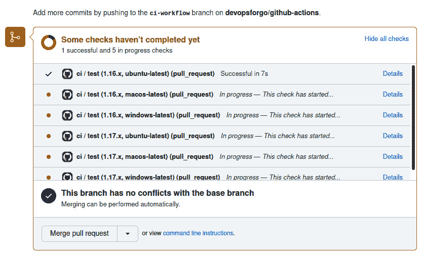
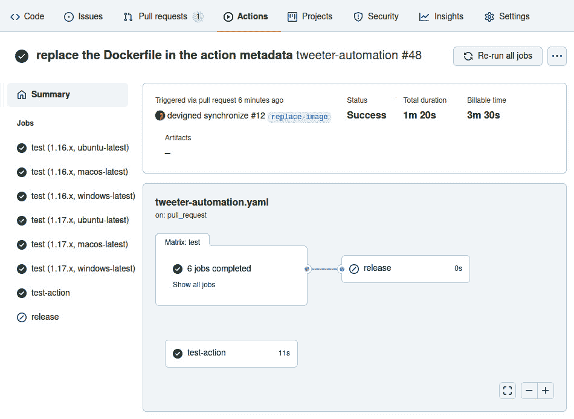

# 第十章：使用 GitHub Actions 自动化工作流

你是否曾参与过一个需要完成例行、单调任务的项目？你是否曾坐下来发布软件，阅读项目的 wiki 页面，却发现需要执行 15 个手动步骤，复制、粘贴并祈祷？当轮到你完成这些任务时，感觉如何？

这样的任务被称为 **繁重工作** —— *缓慢* 和 *困难*。这种工作会降低我们团队的开发速度，而且更为关键的是，随着时间的推移，它会消磨 DevOps 或 **站点可靠性工程** (**SRE**) 团队的士气。繁重任务是手动的，手动任务天生容易出错。如果我们不试图用适当的自动化来替换这些任务，更多的繁重工作将会积累，情况会变得更糟。

作为一名 DevOps 工程师，你是驱动自动化并减少繁重工作的反熵力量。在本章中，我们将学习如何使用 GitHub Actions 来自动化工作流，以减少繁重工作并提高项目速度。

GitHub Actions 提供了一个强大的平台，用于创建可定制的自动化工作流，并且对于任何开源项目都是免费的。GitHub Actions 将强大、可定制的工作流引擎与同样强大的事件模型结合，触发自动化。本章中使用的模式和实践将利用 GitHub Actions，但也可以转移到许多其他开发者工作流自动化工具，如 Jenkins 和 GitLab CI。选择使用 GitHub Actions 的原因是它为开源开发者提供了普遍的访问权限，并且能够接触到广泛的社区贡献的 Actions，极大提升了生产力。

在本章中，你将从学习 GitHub Actions 的基础知识开始。你将运用这些技能构建一个持续集成工作流，用于验证拉取请求。然后，你将扩展该工作流，添加发布自动化以发布 GitHub 版本。最后，你将使用 Go 构建自己的自定义 GitHub Action，并将其发布到 GitHub Marketplace。

本章将涵盖以下主题：

+   了解 GitHub Actions 的基础知识

+   构建持续集成工作流

+   构建发布工作流

+   使用 Go 创建自定义 GitHub Action

+   发布自定义 Go GitHub Action

# 技术要求

在本章中，你需要在计算机上安装 Docker、Git 和 Go 工具。本章的代码位于 [`github.com/PacktPublishing/B18275-09-Automating-Workflows-with-GitHub-Actions-Code-Files`](https://github.com/PacktPublishing/B18275-09-Automating-Workflows-with-GitHub-Actions-Code-Files)。

本章的代码文件可以从 [`github.com/PacktPublishing/Go-for-DevOps/tree/rev0/chapter/10`](https://github.com/PacktPublishing/Go-for-DevOps/tree/rev0/chapter/10) 下载。

让我们开始构建我们的第一个 GitHub Action。

# 了解 GitHub Actions 的基础知识

GitHub Actions 是事件驱动的自动化任务，存在于 GitHub 仓库中。像拉取请求这样的事件可以触发一组任务的执行。一个示例是拉取请求触发一组任务来克隆 Git 仓库并执行 `go test` 来运行 Go 测试。

GitHub Actions 极为灵活，使开发者能够编写各种自动化任务，甚至是一些你通常不会与传统的持续集成/发布管道联系在一起的自动化。Actions 也具有可组合性，使得任务组可以作为已发布的 Action 打包在一起，并与其他 Actions 一起用于工作流。

在本节中，你将了解 GitHub Action 的组成部分：工作流、事件、上下文和表达式、作业、步骤以及动作。在介绍这些组件后，我们将构建并触发我们的第一个 GitHub Action。

## 探索 GitHub Action 的组成部分

理解 GitHub Action 的组成部分、它们之间的关系，以及它们如何交互，是理解如何编写自己的自动化的关键。让我们从探索 Action 的组成部分开始。

### 工作流

工作流是一个以 YAML 编写的自动化文件，存放在 GitHub 仓库的 `./github/workflows/` 文件夹中。一个工作流由一个或多个作业组成，可以按计划或通过事件触发。工作流是 GitHub Action 的最高级别组件。

#### 工作流语法

工作流需要开发者通过 `on` 键指定触发自动化的事件，并通过 `jobs` 键指定自动化触发后执行的作业。通常，`name` 关键字还会指定一个名称，否则，工作流将使用包含工作流 YAML 文件的短名称。例如，在 `./github/workflows/foo.yaml` 中定义的工作流将默认名称为 `foo`。

#### 工作流结构的示例

以下是一个命名工作流的示例，定义了最小的键集。但是，这不是一个有效的工作流，因为我们还没有定义任何触发工作流的事件，也没有定义任何在触发后执行的作业：

```
name: my-workflow # (optional) The name of your workflow; 
                               # defaults to the file name. 
on:                 # Events that will trigger the workflow
jobs:               # Jobs to run when the event is triggered
```

接下来，让我们讨论如何触发工作流。

### 事件

事件是一个触发器，它使工作流开始执行。事件有多种类型：Webhook 事件、定时事件和手动触发事件。

Webhook 事件可以来自仓库中的活动。例如，触发活动包括提交推送、创建拉取请求或创建新问题。来自仓库交互的事件是工作流最常见的触发器。Webhook 事件也可以通过外部系统创建，并通过仓库调度 Webhook 转发到 GitHub。

定时事件类似于 cron 作业。这些事件会在定义的时间表上触发工作流。定时事件是自动化重复性任务的一种方式，例如，在 GitHub 上执行旧问题的维护或运行夜间报告作业。

手动调度事件并非通过仓库活动触发，而是手动触发。例如，一个项目可能与其 Twitter 账户关联，项目维护者可能希望能够发送一条关于新功能的推文，但又不希望共享 Twitter 的认证密钥。一个临时事件将使得自动化可以代表项目发送推文。

#### 事件语法

事件要求开发者为`on:`键指定事件类型。事件类型通常具有子键值对，用于定义其行为。

#### 单个事件示例

可以指定一个事件来触发自动化：

```
# the workflow will be triggered when a commit
# is pushed to any branch
on: push
on: push
```

#### 多个事件示例

可以指定多个事件来触发自动化：

```
# the workflow will execute when a commit is pushed 
# to any branch or pull request is opened
on: [push, pull_request]
```

#### 定时事件示例

定时事件调度使用**便携式操作系统接口**（**POSIX**）的 cron 语法：

```
on: 
  scheduled:
    - cron: '0,1,*,*,*'   # run every day at 01:00:00
```

#### 手动事件示例

手动事件通过用户交互触发，并且可以包括输入字段：

```
# a manually triggered event with a 
# single "message" user input field
on: 
  workflow_dispatch:
    inputs:
      message:
        description: 'message you want to tweet'
        required: true
```

### 上下文和表达式

GitHub Actions 提供了一组丰富的上下文变量、表达式、函数和条件语句，用以增强工作流的表现力。这将不是对所有这些项的详尽研究，但我们将重点介绍最关键的内容。

#### 上下文变量

上下文变量提供了一种访问工作流运行、环境、步骤、密钥等信息的方式。最常见的上下文变量有`github`、`env`、`secrets`和`matrix`。这些变量被视为映射，可以通过变量名和属性名进行索引。例如，`env['foo']`解析为`foo`环境键的值。

`github`上下文变量提供关于工作流运行的信息，包含如工作流正在执行的`ref`等信息。如果你希望在构建时将该信息注入到应用程序中，这非常有用。你可以通过使用`github['ref']`或`github.ref`来访问这些信息。

`env`上下文变量包含为工作流运行指定的环境变量。这些值可以通过索引语法进行访问。

`secrets`上下文变量包含工作流运行中可用的密钥。这些值也可以通过索引语法进行访问。注意，这些值在日志中会被隐藏，因此密钥值不会暴露。

`matrix`上下文变量包含你为当前任务配置的矩阵参数信息。例如，如果你希望在多个操作系统上运行构建并使用多个版本的 Go，`matrix`变量允许你指定每一个操作系统和 Go 版本的列表，这可以用于执行一组并行任务，使用每一种操作系统和 Go 版本的组合。我们将在讨论任务时更详细地介绍这一点。

#### 表达式

表达式的语法是`${{ expression }}`。表达式由变量、字面量、运算符和函数组成。我们来看下面的示例：

```
jobs:
  job_with_secrets:
    if: contains(github.event.pull_request.labels.*.name, 'safe to test')
```

前述任务仅会在拉取请求被标记为`safe to test`时执行。`if`条件将评估`github.event.pull_request.labels.*.name`上下文变量，并确认拉取请求上的标签中是否有一个名为`safe to test`的标签。如果你想确保工作流只在仓库维护者确认拉取请求是安全的后才执行，这非常有用。

表达式也可以用作输入。我们来看下面的示例：

```
env:
  GIT_SHA: ${{ github.sha }}
```

这个 YAML 片段展示了如何将名为`GIT_SHA`的环境变量设置为`github.sha`上下文变量的值。现在，`GIT_SHA`环境变量将对所有在任务内运行的操作可用。使用上下文变量作为输入对于定制在工作流中执行的脚本或操作非常有用。

### 任务

一个任务是执行一组步骤的集合，这些步骤在一个独立的计算实例或运行器上运行。你可以将运行器视为运行任务的虚拟机。任务默认是并行执行的，因此如果工作流定义了多个任务，并且有足够的运行器可用，它们将并行执行。任务有依赖关系的概念，一个任务可以依赖于另一个任务，这样可以确保任务按顺序执行，而不是并行执行。

#### 任务语法

任务要求开发者指定任务的 ID、任务将在其上执行的运行器类型（通过`runs-on:`键），以及任务将执行的一系列步骤（通过`steps:`键）。`runs-on:`键对我们特别重要，因为它用于在不同的**操作系统**（**OS**）平台上执行任务，例如多个版本的 Ubuntu、macOS 和 Windows。

使用`runs-on:`键，可以让任务在指定平台上运行，但这并不能让我们创建一个任务矩阵来在多个平台上并行执行。为了使任务在配置矩阵中执行，必须使用`strategy:`键和表达式。通过配置策略，我们可以构建一个执行相同任务配置的任务矩阵。你将在下面的示例中看到这种配置的例子。

还有许多其他选项可以定制任务的执行以及任务执行的环境，但我们不会深入探讨这些选项。

#### 在多个平台上执行任务

这个示例展示了两个名为`job_one`和`job_two`的任务。在这里，`job_one`是一个矩阵任务，它将在 Ubuntu、macOS 和 Windows 的最新版本上并行运行六个模板化任务，每个任务都会回显`1.17`和`1.16`。在 Ubuntu 18.04 上，`job_two`将与`job_one`并行运行，并回显`"hello world!"`：

```
jobs:
  job_one:
    strategy:
      matrix:
        os: [ubuntu-latest, macos-latest, windows-latest]
        go_version: [1.17, 1.16]
    runs_on: ${{ matrix.os }}
      steps:
        - run: echo "${{ matrix.go_version }}"
  job_two:
    runs_on: ubuntu-18.04
    steps:
      - run: echo "hello world!"
```

### 步骤

步骤是在作业上下文中运行的任务，并在与该作业关联的运行器上下文中执行。步骤可以是一个 shell 命令或一个动作。由于步骤在同一个运行器中执行，它们可以共享数据。例如，如果你在前一个步骤中在运行器的文件系统上创建了一个文件，那么后续步骤将能够访问该文件。你可以将一个步骤看作是在它自己的进程中运行，且任何环境变量的更改都不会传递到下一个步骤。

#### 步骤语法

步骤要求开发者使用 `uses:` 键来指定一个动作，或使用 `run:` 键来指定要运行的 shell 命令。可选的输入允许你使用 `env:` 键自定义环境变量，使用 `working-directory:` 键自定义工作目录，也可以通过使用 `name` 键更改在 GitHub 用户界面中显示的步骤名称。还有许多其他选项可以定制步骤的执行方式，但我们不会深入讨论这些选项。

#### 使用动作安装 Go 的步骤

这个示例展示了一个没有名称的步骤，使用 `actions/setup-go` 的 v2 版本来安装 Go 版本 1.17.0 或更高版本。这个动作可以在 [`github.com/actions/setup-go`](https://github.com/actions/setup-go) 找到。这个示例很好地展示了一个公开可用的动作，你可以用它为你的自动化添加功能。你可以在 [`github.com/marketplace?type=actions`](https://github.com/marketplace?type=actions) 上找到几乎任何任务的动作。在后面的章节中，我们将讨论如何构建你自己的动作并将其发布到 GitHub 市场：

```
steps:
  - uses: actions/setup-go@v2
    with:
      go-version: '¹.17.0'
```

#### 含有多行命令的步骤

在这个示例中，我们扩展了前面的示例，新增了一个 `Run go mod download and test` 步骤，它运行 `go` 工具，而这个工具是通过 `actions/setup-go@v2` 安装的。运行命令的第一行使用 `|` 来表示 YAML 中多行字符串的开始：

```
steps:
  - uses: actions/setup-go@v2
    with:
      go-version: '¹.17.0'
  - name: Run go mod download and test
    run: |
      go mod download
      go test
```

### 动作

一个动作是由一组步骤组合而成的可重用命令，这些步骤可以有输入和输出。例如，`actions/setup-go` 动作用于执行一系列步骤，在运行器上安装 Go 的某个版本。然后，Go 工具链可以在同一作业中的后续步骤中使用。

GitHub Actions 名字起得很恰当，因为动作是 GitHub Actions 的超级功能。动作通常是公开发布的，允许开发者利用现有的方案来快速构建复杂的自动化。动作类似于开源的 Go 库，帮助开发者更快地构建 Go 应用。当我们构建自己的动作时，你会很快看到这个功能的强大之处。

如果你有兴趣查看 `actions/setup-go` 的源代码，请访问 [`github.com/actions/setup-go`](https://github.com/actions/setup-go)。在本章后面，我们将构建自己的 Go 动作并将其发布到 GitHub 市场。

## 如何构建和触发你的第一个 GitHub Action

现在我们大致了解了 Action 的组成部分，接下来让我们创建一个并探索这些组件如何构建、结构化及相互作用。

### 创建并克隆 GitHub 仓库

如果这是你第一次创建和克隆一个代码库，你可以参考以下链接：

+   [`docs.github.com/en/get-started/quickstart/create-a-repo`](https://docs.github.com/en/get-started/quickstart/create-a-repo)

+   [`docs.github.com/en/github/creating-cloning-and-archiving-repositories/cloning-a-repository-from-github/cloning-a-repository`](https://docs.github.com/en/github/creating-cloning-and-archiving-repositories/cloning-a-repository-from-github/cloning-a-repository)

在创建仓库时，我通常会添加 `README.md`、`.gitignore` 和一个**麻省理工学院**（**MIT**）许可证文件。一旦你创建并克隆了仓库，你应该会有一个本地项目目录，如下所示：

```
$ tree . -a -I '\.git' 
.
├── .gitignore
├── LICENSE
└── README.md
```

### 创建你的第一个工作流

记住，工作流文件存放在 `.github/workflows` 目录中。第一步是创建该目录。下一步是在 `.github/workflows` 目录中创建工作流文件：

```
mkdir -p .github/workflows
touch .github/workflows/first.yaml
```

打开 `.github/workflows/first.yaml` 文件，使用你喜欢的编辑器，并添加以下工作流 YAML：

```
name: first-workflow
on: push
jobs:
  echo:
    runs-on: ubuntu-latest
    steps:
      - name: echo step
        run: echo 'hello world!'
```

上述工作流名为 `first-workflow`。它将在最新版本的 Ubuntu 上执行一个名为 `echo` 的单一作业，并执行一个步骤，使用系统默认的 shell 输出 `hello world!`。你还可以通过 `shell:` 键指定你想要使用的 shell。

保存 `.github/workflows/first.yaml`。提交并将工作流推送到 GitHub：

```
git add .
git commit -am 'my first action'
git push origin main
```

通常，你会先创建一个分支，然后打开一个拉取请求（pull request），而不是直接提交和推送到主分支。但对于你的第一个工作流，这是查看结果的最快方法。

当你推送完提交后，你应该能够在浏览器中打开你的 GitHub 仓库并点击**Actions**选项卡。你应该看到你的第一个工作流成功执行的视图。它应当类似如下：


图 10.1 – 所有工作流视图

注意左侧的工作流列表，里面有一个名为**first-workflow**的工作流。我们可以看到，该工作流的第一次运行是针对我们的提交，提交信息为**my first action**。

如果你点击**my first action**的工作流运行记录，你应该能看到如下内容：


图 10.2 – 工作流作业视图

注意左侧的**Jobs**列表中，**echo**作业旁边有一个绿色的勾，表示该作业已成功执行。在右侧，你可以看到执行的详细信息。

你可以点击**echo**作业，查看它的输出以及执行的步骤：


图 10.3 – echo 作业输出视图

注意作业设置，它提供了关于执行作业的 runner 和环境的详细信息。同时，注意到 `echo 'Hello World!'` 这一单一 shell 命令，并将 `"Hello World!"` 字符串输出到控制台日志。最后，作业成功完成，因为 `echo step` 在完成时返回了 `0` 错误码。

在本节中，你已学会了 GitHub Actions 的基础知识，并创建了你的第一个简单自动化。现在，你具备了开始构建更复杂自动化所需的工具，这些自动化将消除我们在本章早些时候讨论的繁琐任务。在接下来的章节中，你将学会如何利用这些技能构建持续集成和发布工作流，之后还将学会如何编写自己用 Go 编写的自定义操作。

# 构建持续集成工作流

在本节中，我们将使用 GitHub Actions 执行持续集成自动化，当拉取请求被打开或代码被推送到仓库时。如果你不熟悉持续集成，它是指将来自多个贡献者的代码变更自动集成到代码仓库中的实践。持续集成自动化任务包括在特定提交时克隆仓库、代码检查、构建和测试代码，并评估测试覆盖率的变化。持续集成自动化的目标是防止代码变更降低项目质量或违反自动化中规定的规则。

在本节中，你将学习如何创建持续集成工作流。在你的持续集成工作流中，你将学会如何在多个操作系统之间并行执行任务。你将把构建工具安装到工作执行器上，用于构建软件项目。你将使用一个操作来克隆项目的源代码。最后，你将通过运行代码检查工具和执行单元测试来确保测试通过并保持代码质量。

## 介绍 tweeter 命令行工具

你不能没有软件项目就创建持续集成工作流。我们将使用一个简单的 Go 命令行工具，名为 **tweeter**。该项目的源代码可以在 [`github.com/PacktPublishing/B18275-08-Automating-Workflows-with-GitHub-Actions-Code-Files`](https://github.com/PacktPublishing/B18275-08-Automating-Workflows-with-GitHub-Actions-Code-Files) 找到。

Tweeter 是一个简单的 Go 命令行工具，它会向 Twitter 发送推文。源代码由两个包组成，`main` 和 `tweeter`。`tweeter` 包包含将由我们的持续集成工作流执行的 Go 测试。

### 克隆并测试 tweeter

从模板创建一个新的仓库：[`github.com/PacktPublishing/B18275-08-Automating-Workflows-with-GitHub-Actions-Code-Files`](https://github.com/PacktPublishing/B18275-08-Automating-Workflows-with-GitHub-Actions-Code-Files)，点击 `{your-account}` 并用你的账户名创建：

```
git clone https://github.com/{your-account}/B18275-08-Automating-Workflows-with-GitHub-Actions-Code-Files
cd B18275-08-Automating-Workflows-with-GitHub-Actions-Code-Files
go test ./...
```

执行` tweeter`命令并带上`-h`参数将提供使用文档：

```
$ go run . -h
Usage of /tmp/go-build3731631588/b001/exe/github-actions:
      --accessToken string         twitter access token
      --accessTokenSecret string   twitter access token secret
      --apiKey string              twitter api key
      --apiKeySecret string        twitter api key secret
      --dryRun                     if true or if env var DRY_RUN=true, then a tweet will not be sent
      --message string             message you'd like to send to twitter
      --version                    output the version of tweeter
pflag: help requested
exit status 2
```

### 不要求使用 Twitter

如果你不倾向于使用社交媒体，tweeter 也允许用户模拟发送推文。当指定`--dryRun`时，消息内容将输出到`STDOUT`，而不是作为推文发送到 Twitter。

接下来，我们将构建一个持续集成工作流来测试 tweeter。

## tweeter 持续集成工作流的目标

在构建持续集成工作流之前，您应考虑希望通过工作流实现什么。对于 tweeter 工作流，我们的目标如下：

+   在推送到`main`分支和格式化为语义版本的标签（例如`v1.2.3`）时触发工作流，进行构建和验证。

+   针对`main`分支的拉取请求必须进行构建和验证。

+   Tweeter 必须同时在 Ubuntu、macOS 和 Windows 上进行构建和验证。

+   Tweeter 必须同时使用 Go 1.16 和 1.17 进行构建和验证。

+   Tweeter 源代码必须通过代码风格检查。

## tweeter 的持续集成工作流

在我们确定了 tweeter 持续集成工作流的目标后，我们可以构建一个工作流来实现这些目标。以下是实现每个目标的持续集成工作流：

```
name: tweeter-automation
on:
  push:
    tags:
      - 'v[0-9]+.[0-9]+.*'
    branches:
      - main
  pull_request:
    branches:
      - main
jobs:
  test:
    strategy:
      matrix:
        go-version: [ 1.16.x, 1.17.x ]
        os: [ ubuntu-latest, macos-latest, windows-latest ]
    runs-on: ${{ matrix.os }}
    steps:
      - name: install go
        uses: actions/setup-go@v2
        with:
          go-version: ${{ matrix.go-version }}
      - uses: actions/checkout@v2
      - name: lint with golangci-lint
        uses: golangci/golangci-lint-action@v2
      - name: run go test
        run: go test ./...
```

上述工作流一开始可能有些复杂。不过，如果我们将工作流分解，行为会变得清晰。

### 触发工作流

tweeter 持续集成工作流的前两个目标如下：

+   推送到`main`分支以及与`v[0-9]+.[0-9]+.*`匹配的标签必须进行构建和验证。

+   针对`main`分支的拉取请求必须进行构建和验证。

通过指定以下事件触发器来实现这些目标：

```
on:
  push:
    tags:
      - 'v[0-9]+.[0-9]+.*'
    branches:
      - main
  pull_request:
    branches:
      - main
```

`push:`触发器将在推送标签匹配`v[0-9]+.[0-9]+.*`时执行工作流——例如，`v1.2.3`会匹配该模式。`push:`触发器也会在向`main`推送提交时执行工作流。`pull_request`触发器将在任何针对`main`分支的拉取请求更改时执行工作流。

请注意，使用`pull_request`触发器将允许我们更新工作流，并在每次推送拉取请求时查看工作流的变化。这是开发工作流时希望的行为，但它也可能使自动化面临恶意行为者的威胁。例如，恶意行为者可以打开新的拉取请求，篡改工作流以窃取其中暴露的机密。为了防止这种情况，有多种缓解措施可以应用，根据项目的安全需求，可以独立或一起使用这些措施：

+   仅允许维护者触发工作流。

+   使用`pull_request_target`事件来触发工作流，这将使用拉取请求基准中定义的工作流，而不管拉取请求中工作流的更改。

+   添加标签保护，以便只有在维护者为拉取请求添加标签时，工作流才会执行。例如，拉取请求可以由维护者进行审查，如果用户和代码更改是安全的，维护者会应用`safe-to-test`标签，从而允许任务继续进行。

接下来，我们将扩展自动化，涵盖多个平台和 Go 版本。

### 进入矩阵

Tweeter 持续集成工作流的接下来的两个目标如下：

+   Tweeter 必须同时在 Ubuntu、macOS 和 Windows 上进行构建和验证。

+   Tweeter 必须同时使用 Go 1.16 和 1.17 进行构建和验证。

这些目标是通过指定以下`matrix`配置来完成的：

```
jobs:
  test:
    strategy:
      matrix:
        go-version: [ 1.16.x, 1.17.x ]
        os: [ ubuntu-latest, macos-latest, windows-latest ]
    runs-on: ${{ matrix.os }}
    steps:
      - name: install go
        uses: actions/setup-go@v2
        with:
          go-version: ${{ matrix.go-version }}
```

`test`任务指定了一个矩阵策略，包含两个维度，`go-version`和`os`。指定了两个 Go 版本和三个操作系统。这个变量组合将创建六个并行任务，`[(ubuntu-latest, 1.16.x)`, `(ubuntu-latest, 1.17.x)`, `(macos-latest, 1.16.x)`, `(macos-latest, 1.17.x)`, `(windows-latest, 1.16.x)`和`(windows-latest, 1.17.x)]`。矩阵的值将被替换到`runs-on:`和`go-version:`中，以执行并行任务，满足在每个平台和 Go 版本组合上运行的目标：



图 10.4 – 显示矩阵构建的拉取请求

在上图中，可以看到每个矩阵任务并行执行。注意，每个任务都指定了任务名称`test`和该任务的矩阵变量。

### 构建、测试和 lint 检查

最后三个目标之间存在构建、测试和 lint 的重叠：

+   Tweeter 必须同时在 Ubuntu、macOS 和 Windows 上进行构建和验证。

+   Tweeter 必须同时使用 Go 1.16 和 1.17 进行构建和验证。

+   Tweeter 的源代码必须通过代码质量检查。

以下步骤将满足这些要求：

```
    steps:
      - name: install go
        uses: actions/setup-go@v2
        with:
          go-version: ${{ matrix.go-version }}
      - uses: actions/checkout@v2
      - name: lint with golangci-lint
        uses: golangci/golangci-lint-action@v2
      - name: run go test
        run: go test ./...
```

在前面的步骤中，发生了以下情况：

1.  Go 通过`actions/setup-go@v2`动作安装，使用矩阵指定的 Go 版本。这个动作对所有 GitHub 用户可用，并通过 GitHub Marketplace 发布。Marketplace 中有许多可以简化工作流编写的动作。

1.  当前`ref`的源代码是通过`actions/checkout@v2`动作在当前工作目录中克隆的。注意，动作没有指定名称。对于常用的动作，通常不提供名称。

1.  Lint 检查使用`golangci/golangci-lint-action@v2`执行，该动作会在代码库的源代码上安装并执行`golangci-lint`工具，满足确保代码通过 lint 质量检查的目标。这个特定的动作包括多个子 lint 工具，能够严格检查常见的 Go 性能和风格错误。

1.  通过运行一个临时的 `go test ./...` 脚本来对代码进行功能验证，该脚本递归地测试仓库中的所有包。请注意，在前面的步骤中，Go 工具已经被安装并可供后续步骤使用。

通过前面的步骤，我们已经实现了持续集成工作流的目标。通过之前的工作流，我们执行了一个并发作业矩阵，安装了构建工具，克隆了源代码，进行了代码检查和测试了变更集。在这个示例中，我们学习了如何为 Go 项目构建一个持续集成工作流，但任何语言和工具集都可以用来创建持续集成工作流。

在下一节中，我们将构建一个发布工作流，自动化构建和发布 tweeter 项目的新版本过程。

# 构建发布工作流

在本节中，我们将把发布新版本的手动繁琐过程转化为 GitHub 工作流自动化，通过将标签推送到仓库来触发。此自动化将导致一个包含构建说明和发布工件的 GitHub 发布，适用于已标记的、语义版本的 tweeter 命令行工具。自动化手动过程，如发布，减少了手动错误的可能性，并提高了项目维护者的生产力。

在本节中，你将学习如何创建发布自动化工作流。你将学习如何在成功完成依赖自动化后触发自动化运行。你将学习如何构建面向多个平台的二进制文件。最后，你将自动化创建 GitHub 发布，包括自动生成的发布说明。

## GitHub 发布

GitHub 发布是基于 Git 标签的仓库可部署软件迭代。发布声明向世界表明该软件的新版本已可用。一个发布包含一个标题、一个可选的描述和一组可选的工件。标题为发布提供一个名称。描述用于提供对发布内容的洞察——例如，发布中包含了哪些新功能或拉取请求，以及哪些 GitHub 贡献者参与了发布。描述采用 GitHub Markdown 格式。发布工件是与发布相关的文件，用户可以下载——例如，一个命令行应用可能会发布已编译的二进制文件，供下载和使用。

### Git 标签

Git 标签是指向 Git 仓库中特定引用的命名指针，通常采用语义版本格式，如 `v1.2.3`。语义版本是一种为标签命名的约定，它提供了关于新版本重要性的某些信息。语义版本标签的格式为 `Major.Minor.Patch`。通过递增各个字段来表达以下行为：

+   `Major`：当发生不兼容的 API 更改时（例如破坏性更改），递增此字段。

+   `Minor`：在向后兼容的方式中添加功能时递增，例如新增功能。

+   `Patch`：在进行向后兼容的 bug 修复时递增。

## 推特的发布自动化

在 *推特的持续集成工作流* 部分中，我们为推特命令行工具创建了 CI 自动化。我们将在 CI 自动化的基础上添加推特的发布自动化。

### 自动化目标

在我们的发布自动化中，我们将完成以下目标：

+   当仓库被标记为语义版本时触发自动化

+   在创建发布之前运行单元测试和验证

+   将发布的语义版本注入推特应用程序

+   构建推特应用程序的跨平台版本

+   从发布中的拉取请求生成发布说明

+   在发布中标记贡献者

+   创建一个包含以下内容的 GitHub 发布：

    +   包含发布语义版本的标题

    +   包含生成的发布说明的描述

    +   由跨平台二进制文件组成的工件

接下来，我们将创建发布自动化以满足这些要求。

### 创建发布自动化

在明确了推特发布自动化的目标后，我们准备好扩展在上一节中构建的现有持续集成工作流，并添加发布作业以实现这些目标。由于发布作业比持续集成工作流要长，因此我们将逐步处理每个部分。

#### 触发自动化

推特发布工作流的第一个目标是当仓库被标记为语义版本时触发自动化：

```
name: tweeter-automation
on:
  push:
    tags:
      - 'v[0-9]+.[0-9]+.*'
    branches:
      - main
  pull_request:
    branches:
      - main
```

上面的 YAML 片段与持续集成工作流保持不变。它将在任何与语义版本匹配的标签（如 `v1.2.3`）上触发工作流。但是，工作流也会在拉取请求和推送时触发。我们希望持续集成工作流在拉取请求和推送时执行，但我们不希望每次都执行发布。我们需要限制发布作业的执行，只在执行 `tag` 推送时触发。

#### 限制发布执行

推特发布工作流的第一个和第二个目标如下：

+   当仓库被标记为语义版本时触发自动化

+   在创建发布之前运行单元测试和验证

让我们确保发布作业仅在仓库被标记时执行：

```
jobs:
  test:
    # continuous integration job omitted for brevity    
  release:
    needs: test
    if: startsWith(github.ref, 'refs/tags/v')
    runs-on: ubuntu-latest
    steps:
```

上述作业定义完成了第一个目标，即只有在推送以 `v` 开头的标签时才执行发布，通过指定 `if` 语句验证 `github.ref` 上下文变量是否以 `refs/tags/v` 开头。确保 `test` 作业在尝试执行 `release` 作业之前成功执行的第二个目标通过指定 `needs: test` 达成。如果没有在 `release` 作业上指定 `needs: test`，两个作业将并行执行，这可能会导致在没有通过验证的情况下创建发布。

#### 工作区和环境设置

为了实现其余的自动化目标，我们需要设置工作区：

```
# Previous config of the release job omitted for brevity 
steps:
  - uses: actions/checkout@v2
  - name: Set RELEASE_VERSION ENV var
    run: echo "RELEASE_VERSION=${GITHUB_REF:10}" >> $GITHUB_ENV
  - name: install go
    uses: actions/setup-go@v2
    with:
      go-version: 1.17.x
```

上面的代码执行以下操作：

+   在与标签相关的 Git 引用处签出源代码

+   创建一个包含标签的 `RELEASE_VERSION` 环境变量，例如 `v1.2.3`

+   安装 Go 1.17 工具

#### 构建跨平台二进制文件并进行版本注入

Tweeter 发布流程的第三和第四个目标如下：

+   将发布的语义版本注入到 Tweeter 应用中。

+   构建 Tweeter 应用的跨平台版本。

让我们从将发布的语义版本注入到编译后的二进制文件开始：

```
steps:
  # Previous steps of the release job omitted for brevity 
  - name: install gox
    run: go install github.com/mitchellh/gox@v1.0.1
  - name: build cross-platform binaries
    env:
      PLATFORMS: darwin/amd64 darwin/arm64 windows/amd64 linux/amd64 linux/arm64
      VERSION_INJECT: github.com/devopsforgo/github-actions/pkg/tweeter.Version
      OUTPUT_PATH_FORMAT: ./bin/${{ env.RELEASE_VERSION }}/{{.OS}}/{{.Arch}}/tweeter
    run: |
      gox -osarch="${PLATFORMS}" -ldflags "-X
${VERSION_INJECT}=${RELEASE_VERSION}" -output
"${OUTPUT_PATH_FORMAT}"
```

上述步骤执行以下操作：

1.  安装 `gox` 命令行工具，以简化 Go 跨平台编译。

1.  为每个指定的平台/架构构建跨平台的二进制文件，同时将 `RELEASE_VERSION` 环境变量注入到 Go 的 `ldflag` 中。`ldflag -X` 会将 `github.com/devopsforgo/github-actions/pkg/tweeter` 包中 `Version` 变量的默认值替换为构建的语义版本标签。`gox` 的输出按 `OUTPUT_PATH_FORMAT` 结构化——例如，输出目录看起来如下：

    ```
    $ tree ./bin/
    ./bin/
    └── v1.0.0
        ├── darwin
        │   ├── amd64
        │   │   └── tweeter
        │   └── arm64
        │       └── tweeter
        └── linux
            └── amd64
                └── tweeter
    ```

使用 Golang 构建应用程序的一个最具吸引力的理由是相对容易构建跨平台的静态链接二进制文件。通过几个步骤，我们可以为 Linux、Windows、macOS 构建针对 AMD64 和 ARM64 以及许多其他平台和架构的 Tweeter 版本。这些小巧的静态链接二进制文件简单易分发，并且可以在各个平台和架构上执行。

通过前面的步骤，发布作业已将发布的语义版本编译成特定平台和架构的静态链接二进制文件。在下一步中，我们将使用语义版本来生成发布说明。

#### 生成发布说明

我们有以下生成发布说明的目标：

+   从发布中的拉取请求生成发布说明

+   在发布中标记贡献者。

+   创建一个包含以下内容的 GitHub 发布：

    +   包含生成的发布说明的描述

有一个好消息！只需稍作配置和标签管理，发布说明的生成就能由 GitHub 自动处理。我们将从往仓库中添加一个新文件 `./.github/release.yml` 开始，内容如下：

```
changelog:
  exclude:
    labels:
      - ignore-for-release
  categories:
    - title: Breaking Changes 
      labels:
        - breaking-change
    - title: New Features 
      labels:
        - enhancement
    - title: Bug Fixes 
      labels:
        - bug-fix
    - title: Other Changes
      labels:
        - "*"
```

上述发布配置将告诉 GitHub 基于应用的标签来筛选和分类拉取请求。例如，标有 `ignore-for-release` 标签的拉取请求将被排除在发布说明之外，但标有 `enhancement` 标签的拉取请求将会被归类到发布说明中的 `新功能` 下面：

```
steps:
  # Previous steps of the release job omitted for brevity 
  - name: generate release notes
    env:
      GITHUB_TOKEN: ${{ secrets.GITHUB_TOKEN }}
    run: |
      gh api -X POST 'repos/{owner}/{repo}/releases/generate-notes' \
        -F commitish=${{ env.RELEASE_VERSION }} \
        -F tag_name=${{ env.RELEASE_VERSION }} \
        > tmp-release-notes.json
```

上一步生成了发布说明。该步骤执行一个 API 调用，向 GitHub API 请求生成给定标签的发布说明。命令将响应的 JSON 内容保存为 `tmp-release-notes.json` 文件。请注意，`gh` 需要 GitHub 令牌才能与 GitHub API 交互。GitHub 密钥被传递到 `GITHUB_TOKEN` 环境变量中，并由 `gh` 用于身份验证。

以下是 `generate-notes` API 调用返回的 JSON 示例：

```
{
  "name": "name of the release",
  "body": "markdown body containing the release notes"
}
```

我们将在下一步中使用 `tmp-release-notes.json` 来创建发布。

#### 创建 GitHub 发布

创建发布自动化的最终目标如下：

+   包含发布语义版本的标题

+   包含生成的发布说明的描述

+   包含跨平台二进制文件的工件

让我们开始创建我们的发布自动化：

```
steps:
  # Previous steps of the release job omitted for brevity 
  - name: gzip the bins
    env:
      DARWIN_BASE: ./bin/${{ env.RELEASE_VERSION }}/darwin
      WIN_BASE: ./bin/${{ env.RELEASE_VERSION }}/windows
      LINUX_BASE: ./bin/${{ env.RELEASE_VERSION }}/linux
    run: |
      tar -czvf "${DARWIN_BASE}/amd64/tweeter_darwin_amd64.tar.gz" -C "${DARWIN_BASE}/amd64" tweeter
      tar -czvf "${DARWIN_BASE}/arm64/tweeter_darwin_arm64.tar.gz" -C "${DARWIN_BASE}/arm64" tweeter
      tar -czvf "${WIN_BASE}/amd64/tweeter_windows_amd64.tar.gz" -C "${WIN_BASE}/amd64" tweeter.exe
      tar -czvf "${LINUX_BASE}/amd64/tweeter_linux_amd64.tar.gz" -C "${LINUX_BASE}/amd64" tweeter
      tar -czvf "${LINUX_BASE}/arm64/tweeter_linux_arm64.tar.gz" -C "${LINUX_BASE}/arm64" tweeter
  - name: create release
    env:
      OUT_BASE: ./bin/${{ env.RELEASE_VERSION }}
      GITHUB_TOKEN: ${{ secrets.GITHUB_TOKEN }}
    run: |
      jq -r .body tmp-release-notes.json > tmp-release-notes.md
      gh release create ${{ env.RELEASE_VERSION }} \
        -t "$(jq -r .name tmp-release-notes.json)" \
        -F tmp-release-notes.md \

"${OUT_BASE}/darwin/amd64/tweeter_darwin_amd64.tar.gz#tweeter_osx_amd64" \
"${OUT_BASE}/darwin/arm64/tweeter_darwin_arm64.tar.gz#tweeter_osx_arm64" \
"${OUT_BASE}/windows/amd64/tweeter_windows_amd64.tar.gz#tweeter_windows_amd64" \
"${OUT_BASE}/linux/amd64/tweeter_linux_amd64.tar.gz#tweeter_linux_amd64" \
"${OUT_BASE}/linux/arm64/tweeter_linux_arm64.tar.gz#tweeter_linux_arm64"
```

前面的步骤执行了以下操作：

+   执行 `tar` 和 `gzip` 命令对二进制文件进行压缩。使用 Go 1.17，推特二进制文件大约为 6.5 MB。经过 `gzip` 压缩后，每个工件小于 4 MB。

+   使用 `gh` 命令行工具创建 GitHub 发布，该工具在所有 GitHub 作业执行器上都可用。`gh` 需要 GitHub 令牌才能与 GitHub API 交互。GitHub 密钥被传递到 `GITHUB_TOKEN` 环境变量中，并由 `gh` 用于身份验证。`gh release create` 会创建一个发布并上传所有在参数后指定的文件。每个上传的文件都会成为发布的一个工件。请注意每个工件文件路径后面的 `#`。`#` 后的文本是工件在 GitHub UI 中显示的名称。我们还使用捕获到的 `tmp-release-notes.json` 和 `jq` 来解析并选择 JSON 内容，以指定标题和发布说明。

此时，我们已经创建了一个面向多个平台和架构的发布版本，满足了我们对自动化的所有目标。让我们开始发布并查看结果。

### 创建推特发布

现在我们已经构建了一个发布作业来自动化推特发布，我们可以对仓库进行标签标记并发布应用程序的版本。为了启动发布自动化，我们将通过执行以下操作来创建并推送 `v0.0.1` 标签到仓库：

```
git tag v0.0.1
git push origin v0.0.1
```

在标签推送后，您应该能够进入 GitHub 仓库的 **Actions** 标签页，并看到标签工作流正在执行。如果您进入工作流页面，应该会看到如下内容：


图 10.5 – 显示依赖测试和发布作业的工作流作业视图

如前图所示，测试已经执行，随后发布作业也已经执行。如果您进入 **release** 作业页面，您应该会看到如下内容：


图 10.6 – 发布作业输出视图

如前图所示，发布任务已成功执行每个步骤，且发布已创建。如果你进入仓库的首页，你应该会看到一个新发布已经创建。如果你点击该发布，你应该会看到如下内容：


图 10.7 – 发布视图，包含资产、发布说明和语义版本标题

在前面的图中，你可以看到名为`v0.0.1`的发布已经自动生成，并附带了分类的发布说明，这些说明链接到拉取请求、贡献者以及每个平台/架构组合的工件。

通过前面的步骤，我们已经达成了发布自动化任务的目标。在测试执行后，我们触发了发布任务，以确保发布在发布之前始终通过我们的验证。我们使用`gox`为每个指定的平台/架构组合构建了静态链接的二进制文件。我们利用 GitHub 发布说明自动生成工具创建了格式美观的发布说明。最后，我们创建了一个发布，其中包含了构建过程中生成的说明和工件。

在这个例子中，我们学习了如何为 Go 项目构建发布自动化任务，但任何语言和工具集都可以类似地用于为任何语言创建发布自动化。

我们不再需要手动发布 tweeter 项目。所需的唯一操作是将标签推送到仓库。我们使用开源操作增强了创建这些自动化的能力。在下一部分，我们将学习如何创建自己的打包操作，以便其他人使用我们编写的操作。

# 使用 Go 创建自定义 GitHub 操作

在本节中，我们将在之前的工作基础上扩展，将 tweeter 命令行转换为 GitHub 操作。这将允许 GitHub 上的任何人使用 tweeter 在他们自己的流水线中发布推文。此外，我们将使用我们的 tweeter 操作在发布新版本时发推，方法是将发布任务扩展为使用我们的新操作。

在本节中，你将学习编写 GitHub 操作的基础知识。你将使用 Go 创建一个自定义 GitHub 操作。然后，你将通过创建一个容器镜像来优化自定义操作的启动时间。

## 自定义操作的基础

自定义操作是将一组相关任务封装起来的单独任务。自定义操作可以作为工作流中的独立任务执行，并且可以与 GitHub 社区共享。

### 操作类型

有三种类型的动作：容器动作、JavaScript 动作和复合动作。基于容器的动作使用 Dockerfile 或容器镜像引用作为入口点，即动作的执行起点，适用于你希望在 JavaScript 或现有动作以外的其他语言中编写动作的情况。基于容器的动作提供了定制执行环境的灵活性，但代价是启动时间。如果容器动作依赖于一个大型容器镜像或一个构建缓慢的 Dockerfile，那么动作的启动时间将受到不利影响。JavaScript 动作可以直接在运行器机器上执行，是动作的本地表现形式。JavaScript 动作启动迅速，并可以利用 GitHub Actions 工具包，这是一个 JavaScript 包集合，使创建动作更加简单。复合动作是一个包含多个步骤的封装动作。它们使得作者能够将一组不同的步骤组合成更高阶的行为。

### 动作元数据

要定义一个动作，你必须在 GitHub 仓库中创建一个 `action.yaml` 文件。如果该动作是要公开共享的，`action.yaml` 文件应当放在仓库的根目录中。如果该动作不打算公开共享，建议将 `action.yaml` 文件放在 `./.github/{name-of-action}/action.yaml` 路径中，其中 `{name-of-action}` 应替换为该动作的名称。例如，如果 Tweeter 动作仅用于内部使用，则动作元数据的路径应为 `./.github/tweeter/action.yaml`：

```
name: Name of the Action
author: @author
description: Description of your action
branding:
  icon: message-circle
  color: blue
inputs:
  sample:
    description: sample description
    required: true
outputs:
  sampleOutput:
    description: some sample output
runs:
  using: docker
  image: Dockerfile
  args:
    - --sample
    - "${{ inputs.sample }}"
```

上述 `action.yaml` 定义了以下内容：

+   将在 GitHub 用户界面中显示的动作名称

+   动作的作者

+   动作的描述

+   将在 GitHub 用户界面中用于该动作的品牌标识

+   输入该动作将接受

+   输出该动作将返回

+   `runs` 部分，描述了动作如何执行

在这个示例中，我们使用了一个 Dockerfile，它将从 Dockerfile 构建一个容器，并使用指定的参数执行容器的入口点。注意如何使用 `inputs.sample` 上下文变量将输入映射为命令行参数。

上述动作可以通过以下步骤执行：

```
jobs:
  sample-job:
    runs-on: ubuntu-latest
    steps:
      - name: Sample action step
        id: sample
        uses: devopsforgo/sample-action@v1
        with:
          sample: 'Hello from the sample!'
      # Use the output from the `sample` step
      - name: Get the sample message
        run: echo "The message is ${{
            steps.sample.outputs.sampleOutput }}"
```

上述示例执行的操作如下：

+   使用示例动作执行一个步骤，假设该动作在 `devopsforgo/sample-action` 仓库中已标记为 `v1`，且该仓库的根目录下有 `action.yaml` 文件，并指定了所需的输入变量 `sample`。

+   回显 `sampleOutput` 变量。

接下来，我们将讨论如何标记动作发布版本。

### 动作发布管理

在我们所有的工作流示例中，Action 的 `uses:` 值始终包含 Action 的版本。例如，在上述示例中，我们使用 `devopsforgo/sample-action@v1` 来指定我们希望使用 `v1` 的 Git 标签版本。通过指定该版本，我们告诉工作流使用该标签指向的 Git 引用。按照约定，Action 的 `v1` 标签可以指向任何符合 `v1.x.x` 语义版本范围的 Git 引用。这意味着 `v1` 标签是一个浮动标签而非静态标签，并且随着新的 `v1.x.x` 版本的发布而推进。回想一下本章早些时候关于语义版本的描述，主版本号的递增表示存在破坏性变更。Action 的作者向用户承诺，任何标记为 `v1` 的版本都不会包含破坏性变更。

用于版本控制的约定可能会在 Action 与同一仓库中的另一个版本化软件项目一起使用时造成摩擦。建议考虑 Action 版本控制的影响，并考虑为 Action 创建一个专门的仓库，而不是将其创建在包含其他版本化项目的仓库中。

## tweeter 自定义 GitHub Action 的目标

在我们的 tweeter 自定义 GitHub Action 中，我们将完成以下任务：

+   构建一个用于构建和运行 tweeter 命令行工具的 Dockerfile。

+   为自定义 Action 创建一个 Action 元数据文件。

+   扩展持续集成任务以测试 Action。

+   创建一个图像发布工作流，用于发布 tweeter 容器镜像。

+   通过使用发布的容器镜像来优化 tweeter 自定义 Action。

接下来，我们将使用 Dockerfile 创建一个自定义 Go Action。

## 创建 tweeter Action

在明确了 tweeter 自定义 Action 的目标后，我们准备创建运行 tweeter 所需的 Dockerfile，定义 Action 的元数据，以映射来自 tweeter 命令行工具的输入和输出，扩展我们的持续集成任务来测试 Action，最后，通过在自定义 Action 中使用预构建的容器镜像来优化 Action 的启动时间。我们将分解每个步骤并创建我们自定义的 Go Action。

### 定义一个 Dockerfile

tweeter 自定义 GitHub Action 的第一个目标是构建一个用于构建和运行 tweeter 命令行工具的 Dockerfile。

让我们从构建一个 Dockerfile 开始，该 Dockerfile 位于 tweeter 仓库的根目录，用于构建容器镜像：

```
FROM golang:1.17 as builder
WORKDIR /workspace
# Copy the Go Modules manifests
COPY go.mod go.mod
COPY go.sum go.sum
# Cache deps before building and copying source
# so that we don't need to re-download as much
# and so that source changes don't invalidate 
# our downloaded layer
RUN go mod download
# Copy the sources
COPY ./ ./
RUN CGO_ENABLED=0 GOOS=linux GOARCH=amd64 \
    go build -a -ldflags '-extldflags "-static"' \
    -o tweeter .
# Copy the action into a thin image
FROM gcr.io/distroless/static:latest
WORKDIR /
COPY --from=builder /workspace/tweeter .
ENTRYPOINT ["/tweeter"]
```

上述 Dockerfile 的功能如下：

1.  使用 `golang:1.17` 镜像作为中间构建容器，包含编译 tweeter 命令行工具所需的 Go 构建工具。使用构建者模式创建一个中间容器，包含构建工具和源代码，这些在最终产品中不会被使用。它为我们提供了一个构建静态链接的 Go 应用程序的临时区域，构建完成后可以将其添加到精简版的容器中。这样，最终的容器只会包含 Go 应用程序，而没有其他内容。

1.  构建过程然后复制 `go.mod` 和 `go.sum`，然后下载 tweeter 应用程序所需的 Go 依赖。

1.  tweeter 应用程序的源代码被复制到构建容器中，并编译为静态链接的二进制文件。

1.  生产镜像是从 `gcr.io/distroless/static:latest` 基础镜像创建的，tweeter 应用程序则从中间构建容器中复制过来。

1.  最后，默认入口点被设置为 tweeter 二进制文件，这将使我们能够运行容器并直接执行 tweeter 应用程序。

要构建并执行上述 Dockerfile，您可以运行以下命令：

```
$ docker build . -t tweeter
# output from the docker build
$ docker run tweeter -h
pflag: help requested
Usage of /tweeter:
      --accessToken string         twitter access token
      # More help text removed for brevity.
```

上述脚本执行以下操作：

+   构建 Dockerfile 并标记为 `tweeter` 名称

+   运行标记的 tweeter 容器镜像，向 tweeter 应用程序传递 `-h` 参数，导致 tweeter 应用程序打印帮助文本

现在我们有了一个有效的 Dockerfile，可以使用它来定义 `action.yaml` 中定义的自定义容器操作。

### 创建操作元数据

tweeter 自定义 GitHub Action 的第二个目标是为自定义操作创建一个操作元数据文件。

现在我们已经定义了 Dockerfile，可以在仓库根目录中的 `action.yaml` 文件中编写自定义操作的操作元数据：

```
name: Tweeter Action
author: DevOps for Go
description: Action to send a tweet via a GitHub Action.
inputs:
  message:
    description: 'message you want to tweet'
    required: true
  apiKey:
    description: 'api key for Twitter api'
    required: true
  apiKeySecret:
    description: 'api key secret for Twitter api'
    required: true
  accessToken:
    description: 'access token for Twitter api'
    required: true
  accessTokenSecret:
    description: 'access token secret for Twitter api'
    required: true
outputs:
  errorMessage:
    description: 'if something went wrong, the error message'
  sentMessage:
    description: 'the message sent to Twitter'
runs:
  using: docker
  image: Dockerfile
  args:
    - --message
    - "${{ inputs.message }}"
    - --apiKey
    - ${{ inputs.apiKey }}
    - --apiKeySecret
    - ${{ inputs.apiKeySecret }}
    - --accessToken
    - ${{ inputs.accessToken }}
    - --accessTokenSecret
    - ${{ inputs.accessTokenSecret }}
```

上述操作元数据执行以下操作：

+   定义操作名称、作者和描述元数据

+   定义操作的预期输入

+   为操作定义输出变量

+   执行 Dockerfile，将操作的输入映射到 tweeter 应用程序的 `args` 中

输入变量如何映射到 tweeter 的 `args` 命令行是显而易见的，因为输入被映射到参数中，但输出变量如何映射则不太清楚。输出变量通过在 Go 应用程序中将变量特别编码到 STDOUT 来映射：

```
func printOutput(key, message string) {
    fmt.Printf("::set-output name=%s::%s\n", key, message)
}
```

上述函数将输出变量的键和值打印到 STDOUT。为了返回 `sentMessage` 输出变量，Go 应用程序调用 `printOutput("sendMessage", message)`。操作运行时将读取 STDOUT，识别编码，并将其填充到 `steps.{action.id}.outputs.sentMessage` 的上下文变量中。

在定义了操作元数据后，我们现在准备通过扩展 tweeter 持续集成工作流，来测试在本地仓库中执行该操作。

### 测试操作

推特自定义 GitHub Action 的第三个目标是将持续集成任务扩展为测试该动作。

编写好`action.yaml`文件后，我们可以添加一个工作流任务来测试该动作：

```
test-action:
  runs-on: ubuntu-latest
  steps:
    - uses: actions/checkout@v2
    - name: test the tweeter action in DRY_RUN
      id: tweeterAction
      env:
        DRY_RUN: true
      uses: ./
      with:
        message: hello world!
        accessToken: fake
        accessTokenSecret: fake
        apiKey: fake
        apiKeySecret: fake
    - run: echo ${{ steps.tweeterAction.outputs.sentMessage
}} from dry run test
```

上面的`test-action`任务执行了以下操作：

+   将代码签出到本地工作区

+   执行本地动作，指定所有必需的输入，并将`DRY_RUN`环境变量设置为`true`，这样该动作就不会尝试发送消息到 Twitter

+   运行`echo`命令，获取从动作中回显的输出

让我们看看触发此工作流时会发生什么：


图 10.8 – 具有新 test-action 任务的工作流运行情况

在上面的截图中，你可以看到`test-action`任务现在是推特自动化的一部分，它将验证这个动作。注意执行任务的运行时为 54 秒。调用命令行应用程序似乎花费了很长时间：


图 10.9 – test-action 任务输出

在上面的截图中，你可以看到推特操作的测试占用了 49 秒，任务的总运行时间为 54 秒。几乎所有的时间都花在了编译推特和构建`docker`镜像上，然后才执行这个动作。在接下来的部分中，我们将通过引用预构建版本的推特容器镜像来优化动作执行时间。

### 创建容器镜像发布工作流

推特自定义 GitHub Action 的第四个目标是创建一个图像发布工作流，用于发布推特容器镜像。

正如我们在上一节中看到的，构建 Dockerfile 所需的时间相当长。没有理由在每次执行操作时都这么做，这可以通过将容器镜像发布到容器注册表中，然后在 Dockerfile 位置使用该注册表镜像来避免：

```
name: release image
on:
  # push events for tags matching image-v for version
(image-v1.0, etc)
  push:
    tags:
      - 'image-v*' 
permissions:
  contents: read
  packages: write
jobs:
  image:
    runs-on: ubuntu-latest
    steps:
      - uses: actions/checkout@v2
      - name: set env
        # refs/tags/image-v1.0.0 substring starting at 1.0.0
        run: echo "RELEASE_VERSION=${GITHUB_REF:17}" >> $GITHUB_ENV
      - name: setup buildx
        uses: docker/setup-buildx-action@v1
      - name: login to GitHub container registry
        uses: docker/login-action@v1
        with:
          registry: ghcr.io
          username: ${{ github.repository_owner }}
          password: ${{ secrets.GITHUB_TOKEN }}
      - name: build and push
        uses: docker/build-push-action@v2
        with:
          push: true
          tags: |
            ghcr.io/devopsforgo/tweeter:${{ env.RELEASE_VERSION }}
            ghcr.io/devopsforgo/tweeter:latest
```

上面的工作流定义执行了以下操作：

+   仅在推送以`image-v`开头的标签时触发

+   请求对`ghcr.io`镜像库的写权限以及对 Git 仓库的读取权限

+   包含单个容器镜像构建和发布镜像的步骤。

+   签出代码库

+   根据标签格式构建`RELEASE_VERSION`环境变量

+   设置`buildx`以构建容器镜像

+   登录到 `ghcr.io`，GitHub 容器注册表

+   构建并推送标记为发布版本和最新版本的容器镜像

有了上述工作流后，我们可以使用以下命令标记代码库，并将容器镜像发布到 GitHub 容器注册表，以便在推特动作中使用：

```
git tag image-v1.0.0
git push origin image-v1.0.0
```

让我们看看我们的图像发布工作流的结果：


图 10.10 – 图像发布任务的工作流视图

上面的截图展示了通过推送 `image-v1.0.0` 标签触发的 `release image` 工作流。以下截图详细说明了每个步骤的结果：


图 10.11 – 图像发布作业输出

上述工作流的结果是，我们现在将容器镜像推送到了 `ghcr.io/devopsforgo/tweeter`，并标记为 `v1.0.0` 和 `latest`。现在，我们可以更新 action 的元数据，使用标记的镜像版本。

### 优化自定义 Go action

本节的最终目标是通过使用已发布的容器镜像来优化 tweeter 自定义 action。

现在我们已经将镜像发布到 `ghcr.io`，我们可以用已发布的镜像引用替换 Dockerfile：

```
# omitted the previous portion of the action.yaml 
runs:
  using: docker
  image: docker://ghcr.io/devopsforgo/tweeter:1.0.0
# omitted the subsequent portion of the action.yaml 
```

上面 `action.yaml` 文件的部分展示了如何将 Dockerfile 替换为已发布的 tweeter 容器镜像。既然 Dockerfile 已被替换，让我们运行工作流，看看性能优化的实际效果：



图 10.12 – 显示测试动作作业速度提升的工作流视图

上面的截图展示了使用预构建容器镜像带来的好处。回想一下，当使用 Dockerfile 时，工作流执行时间为 54 秒。而现在，使用来自注册表的 tweeter 容器镜像，工作流在 11 秒内执行完毕。这是一个显著的优化，应该在可能的情况下使用。

在这一部分，我们学习了如何使用 Go 构建自定义 actions，这使得 DevOps 工程师能够构建复杂的 actions，并将它们打包成易于访问的自动化单元。我们还学习了如何在本地测试和优化这些 actions，确保当自定义 actions 发布时，它们能够按预期工作。

在下一部分，我们将基于编写自定义 actions 的能力，发布一个 action 给整个 GitHub 社区。通过将 action 发布到 GitHub Marketplace，action 可以成为其他 DevOps 工程师编写自动化工具的关键工具。

# 发布自定义 Go GitHub Action

GitHub Actions 的超级力量在于社区以及社区发布到 GitHub Marketplace 的 actions。试想，如果没有社区 actions 可用，我们在前面的章节中需要做多少额外的工作。我们的工作流将不得不从基础开始，编写冗长且繁琐的脚本来完成那些我们现在能够用少量 YAML 表达的任务。

开源软件不仅仅是拥有免费的软件，还包括回馈社区。我们将学习如何通过将 action 发布到 GitHub Marketplace 来回馈 GitHub Actions 社区。这将使整个 GitHub 用户社区都能受益。

在本节中，您将学习如何将自定义动作发布到 GitHub 市场。您将了解发布动作的基本知识。掌握基础知识后，您将学习如何自动化发布动作的版本管理。您将学习如何使用 Twitter 动作发布新版本的公告到 Twitter。最后，您将学习如何将您的动作发布到 GitHub 市场，以便全球其他 GitHub 社区的成员可以使用。

## 发布动作的基础知识

将动作发布到 GitHub 市场需要满足一些要求和最佳实践，这对于我们在上一节中构建的本地动作是不适用的。例如，仓库的 README 将是动作在市场中的落地页，因此您需要提供仓库 README 的描述和使用指导。

以下是将动作发布到 GitHub 市场的要求：

+   该动作必须位于公共 GitHub 仓库中。

+   仓库的根目录中必须有一个名为 `action.yaml` 或 `action.yml` 的单个动作文件。

+   `action.yaml` 中的动作名称必须是 GitHub 市场中唯一的。该名称不得与任何 GitHub 特性、产品或 GitHub 保留的其他名称重叠。

+   公共动作应遵循 `v1` 和 `v1.2.3` 的语义版本规范，以便用户可以指定完整的语义版本，或者仅使用 `v1` 来表示 `v1` 这一大版本系列中的最新版本。

## 发布 Twitter 自定义操作的目标

以下是发布 Twitter 自定义操作的目标：

+   设置一个发布触发的工作流来处理语义版本管理。

+   将 Twitter 动作发布到 GitHub 市场。

## 管理动作的语义版本

发布 Twitter 自定义操作到市场的前两个目标如下：

+   设置一个发布触发的工作流来处理语义版本管理。

+   使用此操作发布新版本的动作到 Twitter。

我们将构建一个工作流来更新大版本标签——例如，`v1`——指向 `v1.x.x` 语义版本系列中的最新发布版本。该工作流还将负责在发布新大版本时创建新的大版本标签：

```
name: Release new tweeter version
on:
  release:
    types: [released]
  workflow_dispatch:
    inputs:
      TAG_NAME:
        description: 'Tag name that the major tag will point to'
        required: true
permissions:
  contents: write
env:
  TAG_NAME: ${{ github.event.inputs.TAG_NAME || github.event.release.tag_name }}
jobs:
  update_tag:
    name: Update the major tag to include the ${{ env.TAG_NAME }} changes
    runs-on: ubuntu-latest
    steps:
      - name: Update the ${{ env.TAG_NAME }} tag
        uses: actions/publish-action@v0.1.0
        with:
          source-tag: ${{ env.TAG_NAME }}
      - uses: actions/checkout@v2
      - name: Tweet about the release
        uses: ./
        with:
          message: Hey folks, we just released the ${{ env.TAG_NAME }} for the tweeter GitHub Action!!
          accessToken: ${{ secrets.ACCESS_TOKEN }}
          accessTokenSecret: ${{ secrets.ACCESS_TOKEN_SECRET }}
          apiKey: ${{ secrets.API_KEY }}
          apiKeySecret: ${{ secrets.API_KEY_SECRET }}
```

上述工作流执行以下操作：

+   在发布版本或手动 UI 提交时触发。这意味着项目维护者可以通过 GitHub UI 来触发工作流，如果需要临时执行的话。

+   声明工作流需要有对仓库的写权限。此权限用于写入标签。

+   声明 `TAG_NAME` 环境变量，该变量可以是临时作业输入或发布的标签。

+   `update_tag`采用`v1.2.3`格式的标签，并将标签的主语义版本更新为该主版本中的最新版本。例如，如果新发布的标签是`v1.2.3`，那么`v1`标签将指向与`v1.2.3`相同的 Git 引用。

+   使用`actions/checkout@v2`克隆源代码。

+   使用嵌入在 GitHub 仓库秘钥中的 Twitter 开发者凭证发布关于新发布的推文。要设置 Twitter 开发者凭证，请参见[`developer.twitter.com/en/portal/dashboard`](https://developer.twitter.com/en/portal/dashboard)并设置账户和应用程序。收集凭证后，您可以将它们添加到**设置**选项卡下的仓库秘钥中，如下截图所示：


图 10.13 – 仓库秘钥

使用上述工作流，在我们应用标签（例如`v1.2.3`）时，仓库也将以相同的 Git `ref`标记为`v1`。标签设置完成后，tweeter 动作将执行，向全球宣布发布。

从前一节回顾，当我们使用语义版本为 tweeter 仓库打上标签时，将触发发布工作流程，从而创建新的发布。然后，此工作流将触发动作版本更新发布工作流，该工作流将以主版本标签动作，并通过 Twitter 宣布动作发布可用。

唯一剩下的事情是将动作发布到 GitHub Marketplace。这只需要在首次发布动作时完成。

## 将 tweeter 动作发布到 GitHub Marketplace

发布 tweeter 自定义动作的最终目标是将 tweeter 动作发布到 GitHub Marketplace。您的 GitHub 动作的首次发布是一个手动过程，可以通过以下指南完成：[`docs.github.com/en/actions/creating-actions/publishing-actions-in-github-marketplace`](https://docs.github.com/en/actions/creating-actions/publishing-actions-in-github-marketplace)。完成这些首次手动步骤后，未来发布时无需重复。

# 摘要

GitHub Actions 是项目维护者自动化繁琐流程的强大系统，提升开发者满意度和项目速度。在本章中，我们选择了 Go 作为 GitHub Actions 的首选语言，因为它具有类型安全性、低内存开销和高速度。我们认为这是编写 GitHub Actions 的最佳选择。然而，这里教授的许多技能也可迁移到其他语言。每个模式，持续集成，发布管道，语义版本控制和动作创建都可以应用于您接触的任何项目中。

本章的关键是理解 GitHub Marketplace 中社区贡献的影响。通过使用、构建和贡献于 Marketplace，工程师可以使他们的自动化更加可组合，并通过社区的贡献，赋能社区成员解决更复杂的问题。

我们学习了 GitHub Actions 的基础知识，重点介绍了它的功能，使我们能够快速投入使用。凭借这些基本技能，我们成功构建了一个持续集成的自动化工作流，用于克隆、构建、静态检查和测试 tweeter 项目。我们进一步扩展了持续集成自动化，创建了一个从 Git 标签触发的发布管道。发布管道将手动任务，如编写发布说明，转变为自动化的一部分。最后，我们创建并发布了一个自定义的 Go GitHub Action，可以供整个社区使用。

我希望在本章结束时，你能自信地掌握创建自动化的能力，从而消除那些困扰你团队日常工作的繁琐任务。记住，如果你能自动化一个每周发生一次且需要一个小时的任务，你就相当于为你的团队成员节省了一整周的工作时间！这些时间很可能能更好地用来为你的业务增值。

在下一章，我们将学习 ChatOps。你将学习如何使用聊天应用程序，如 Slack，当事件发生时触发自动化和警报，为你和你的团队提供一个互动的机器人 DevOps 合作伙伴。
