# 第十一章：使用 ChatOps 提高效率

作为 DevOps 工程师，我们通常是一个由工程师组成的团队的一部分，帮助管理网络、服务基础设施以及面向公众的服务。这意味着需要协调大量活动和沟通，特别是在紧急情况下。

ChatOps 为团队提供了一个集中式的工具界面，可以询问当前状态并与其他 DevOps 工具互动，同时记录这些互动以备后续查看。这可以改善反馈循环和团队间的实时沟通，帮助有效管理事故。

我们的同事 Sarah Murphy 有一句话——*不要和公交司机说话*。作为 Facebook 早期的发布工程师，她负责在其数据中心发布 Facebook。这是一项高压且注重细节的工作，需要她全神贯注。许多工程师想知道他们的功能或补丁是否包含在当前发布中，当然，他们都会问发布工程师。

正如任何做过高影响力发布的工程师所说，你需要专注。成百上千的工程师关于他们特定补丁的状态向你询问并不是理想的情况。这时，ChatOps 就派上了用场。通过实现 ChatOps，可以提供一个集中式平台，在这个平台上，关于发布状态以及当前版本的更新情况可以减少那些成百上千的问题。对 Sarah 来说，这确实起到了作用。

在本章中，我们将深入讨论如何为 Slack 构建 ChatOps 机器人。我们将展示如何使用该机器人查询服务状态。我们还将展示如何使用机器人获取部署信息。最后，我们将展示如何使用机器人来部署我们的软件。

本章将涵盖以下内容：

+   环境架构

+   使用 Ops 服务

+   构建一个基本的聊天机器人

+   创建事件处理程序

+   创建我们的 Slack 应用

# 技术要求

本章的前提条件如下：

+   一个 Slack 用户账户：如果你没有 Slack 账户，可以按照这里的说明创建：[`slack.com/get-started#/createnew`](https://slack.com/get-started#/createnew)。

+   一个 Slack 工作区用于实验：创建 Slack 工作区的说明请参考：[`slack.com/help/articles/206845317-Create-a-Slack-workspace`](https://slack.com/help/articles/206845317-Create-a-Slack-workspace)。

+   创建一个 Slack 应用。

强烈建议你使用自己控制的工作区，而不是公司工作区。公司工作区的设置需要管理员批准。

你还需要创建一个 Slack 应用，但这将在后面的章节中介绍。

本章的代码文件可以从[`github.com/PacktPublishing/Go-for-DevOps/tree/rev0/chapter/11`](https://github.com/PacktPublishing/Go-for-DevOps/tree/rev0/chapter/11)下载

# 环境架构

我们的示例 ChatOps 程序需要与多个服务进行交互，以便向用户提供信息。

为了实现这一点，我们构建了一个更强大的版本的 `Petstore` 应用程序，这是我们在之前章节中构建的版本。这个版本具有以下功能：

+   实现 **创建、读取、更新和删除** (**CRUD**)。

+   基于 gRPC。

+   具有更深入的 Open Telemetry 跟踪，这些跟踪通过 RPC 调用流动并记录事件。

+   可以用于告警的更深层度指标，供 Prometheus 使用。

+   使用跟踪事件替代日志记录。

+   所有错误都会自动添加到跟踪中。

+   客户端可以启用跟踪。

+   跟踪默认会被采样，但可以通过 RPC 更改。

你可以在这里找到这个新的 Petstore：[`github.com/PacktPublishing/Go-for-DevOps/tree/rev0/chapter/11/petstore`](https://github.com/PacktPublishing/Go-for-DevOps/tree/rev0/chapter/11/petstore)。如果你想深入了解架构，可以查看 `README` 文件，但本章并不需要你深入了解。

我们的新 Petstore 功能更强大，将通过结合本章的其他课程，展示 ChatOps 能提供的一些强大功能。

以下是我们的服务架构示意图：

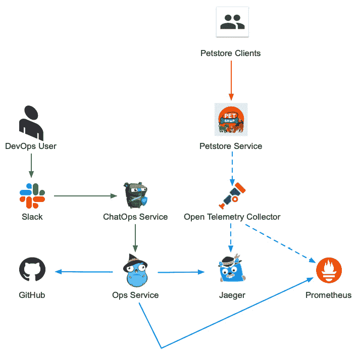

图 11.1 – ChatOps 和 Petstore 架构

归属

由 `gstudioimagen` 创建的贵宾犬矢量图 - [www.freepik.com](http://www.freepik.com)

Gophers by Egon Elbe：[github.com/egonelbre/gophers](http://github.com/egonelbre/gophers)

我们将专注于创建的两个服务是：

+   **Ops 服务**：Ops 服务完成实际工作，如与 Jaeger、Prometheus 交互，运行作业，或执行其他必要任务。这使得我们能够并行运行多个 ChatOps 服务（例如，如果你的公司从 Slack 迁移到 Microsoft Teams，可能就需要这样）。

这种架构的好处是，允许其他团队使用任何他们选择的编程语言编写工具，利用这些功能。

+   `slack-go` 包，可以在 [`github.com/slack-go/slack`](https://github.com/slack-go/slack) 找到。

让我们深入了解 Ops 服务的基本细节。

# 使用 Ops 服务

我们不会对该服务进行详细讲解，因为我们在前几章已经涵盖了 gRPC 的工作原理。由于该服务只是向其他服务发起 gRPC 或 REST 调用，因此让我们讨论一下需要实现的调用。

协议缓冲服务定义如下：

```
service Ops {
     rpc ListTraces(ListTracesReq) returns (ListTracesResp) {};
     rpc ShowTrace(ShowTraceReq) returns (ShowTraceResp) {};
     rpc ChangeSampling(ChangeSamplingReq) returns (ChangeSamplingResp) {};
     rpc DeployedVersion(DeployedVersionReq) returns (DeployedVersionResp) {};
     rpc Alerts(AlertsReq) returns (AlertsResp) {};
}
```

对于我们的示例服务，这些 RPC 目标是单一部署实例，但在生产环境中，这将作用于站点上存在的多个实体。

这使得用户能够快速获取一些信息，例如：

+   查看我们在特定时间段内的跟踪，并可以通过标签（如 `error`）进行过滤。

+   根据跟踪 ID 检索基本跟踪数据和 Jaeger 跟踪的 URL。

+   更改服务中跟踪的采样类型和速率。

+   根据 Prometheus，告诉我们部署了哪个版本。

+   显示 Prometheus 显示的任何触发的警报。

您可以在这里查看如何实现这段代码：[`github.com/PacktPublishing/Go-for-DevOps/tree/rev0/chapter/11/ops`](https://github.com/PacktPublishing/Go-for-DevOps/tree/rev0/chapter/11/ops)。

我们包括了一个 `README` 文件，介绍了基本架构，但它是您的标准 gRPC 服务，通过 gRPC 调用 Petstore 服务/Jaeger，并通过 REST 调用 Prometheus。

现在，让我们开始编写一个新的基础 Slack 机器人。

# 构建一个基础的聊天机器人

Go 有一些客户端，可以与流行的聊天服务（如 Slack）进行交互，既可以作为通用 Slack 客户端，也可以作为专注于 ChatOps 的机器人。

我们发现，最好采用一种将机器人与您想要执行的操作分开的架构。这使得其他语言的工具也能够访问这些功能。

通过将聊天机器人与其他部分分离，您可以专注于单一类型的聊天服务，并使用它的所有功能，而不是仅使用每个聊天服务客户端共享的功能。

因此，我们将使用 `slack-go` 包与 Slack 进行交互。

我们的机器人将非常基础，只需监听是否有人在消息中提到我们的机器人。这被称为 `AppMention` 事件。Slack 支持其他事件，并且有专门针对命令的事件，您可以安装它们。在我们的例子中，我们只希望在有人提到我们的机器人时作出回应，但 `slack-go` 还有许多其他功能我们不会在此探讨。

让我们创建一个名为 `bot` 的包并添加一些导入：

```
package bot
import (
        "log"
        "context"
        "regexp"
        "encoding/json"
        "github.com/slack-go/slack"
        "github.com/slack-go/slack/slackevents"
        "github.com/slack-go/slack/socketmode"
)
```

我们的第三方包的详细信息如下：

+   `slack` 是用来构建基础客户端的。

+   `slackevents` 详细说明了我们可以接收到的各种事件。

+   `socketmode` 提供了一种从防火墙后的机器人连接到 Slack 的方法。

让我们创建一个类型来处理我们接收到的事件：

```
type HandleFunc func(ctx context.Context, m Message)
type register struct{
        r *regexp.Regexp
        h HandleFunc
}
```

`HandleFunc` 接收一条消息，可以用于向频道发送消息并获取关于接收到的消息的信息。

我们还定义了一个注册类型，用于将 `HandleFunc` 注册到 `HandleFunc`。

让我们定义 `Message` 类型：

```
type Message struct {
        User *slack.User
        AppMention *slackevents.AppMentionEvent
        Text string
}
```

这包含了发送消息的 Slack 用户的信息、`AppMention` 事件的信息以及用户发送的清理后的文本（去除 `@User` 文本以及前后空格）。

现在，让我们定义我们的 `Bot` 类型及其构造函数：

```
type Bot struct {
    api *slack.Client
    client *socketmode.Client
    ctx context.Context
    cancel context.CancelFunc
    defaultHandler HandleFunc
    reg []register
}
func New(api *slack.Client, client *socketmode.Client) (*Bot, error) {
    b := &Bot{
            api: api,
            client: client,
            ctx: ctx,
            cancel: cancel,
    }
    return b, nil
}
```

这段代码包含了我们将用于与 Slack 交互的客户端、用于取消我们机器人 goroutine 的上下文、`defaultHandler` 用于处理没有匹配正则表达式的情况，以及我们在接收任何消息时检查的注册列表。

现在我们需要一些方法来启动和停止我们的机器人：

```
func (b *Bot) Start() {
     b.ctx, b.cancel = context.WithCancel(context.Background())
     go b.loop()
     b.client.RunContext(b.ctx)
}
func (b *Bot) Stop() {
     b.cancel()
     b.ctx = nil
     b.cancel = nil
}
```

这只是启动我们的事件循环，并调用 `RunContext` 来监听我们的事件流。我们使用提供的 `context.Bot` 来取消我们的机器人。`Start()` 会阻塞，直到调用 `Stop()`。

我们的下一个方法将允许我们注册我们的正则表达式及其处理程序：

```
func (b *Bot) Register(r *regexp.Regexp, h HandleFunc) { 
    if h == nil { 
        panic("HandleFunc cannot be nil") 
    } 
    if r == nil {
        if b.defaultHandle != nil {
                panic("cannot add two default handles")
        }
        b.defaultHandle = h
        return
    }
    b.reg = append(b.reg, register{r, h})
}
```

在这段代码中，如果我们没有提供正则表达式，则`HandleFunc`作为默认处理程序，在没有匹配正则表达式时使用。你只能拥有一个默认处理程序。当机器人检查消息时，它会按添加顺序匹配正则表达式，第一个匹配的胜出。

现在，让我们来看看我们的事件循环：

```
func (b *Bot) loop() {
    for {
        select {
        case <-b.ctx.Done():
                return
        case evt := <-b.client.Events:
            switch evt.Type {
            case socketmode.EventTypeConnectionError:
                    log.Println("connection failed. Retrying later...")
            case socketmode.EventTypeEventsAPI:
                    data, ok := evt.Data.(slackevents.EventsAPIEvent)
                    if !ok {
                            log.Println("bug: got type(%v) which should be a slackevents.EventsAPIEvent, was %T", evt.Data)
                            continue
                    }
                    b.client.Ack(*evt.Request)
                    go b.appMentioned(data)
            }
        }
    }
}
```

在这里，我们从`socketmode`客户端中提取事件。我们根据事件类型进行切换。对于我们的目的，我们只关心两种类型的事件：

+   连接 WebSocket 时出错

+   `EventTypeEventsAPI`事件

`EventTypeEventsAPI`类型是一个接口，我们将其转换为具体类型`slackevents.EventsAPIEvent`。我们确认接收到事件，并将事件发送到由`appMentioned()`方法处理。

还有其他你可能感兴趣的事件。你可以在这里找到 Slack 支持的官方事件列表：[`api.slack.com/events`](https://api.slack.com/events)。

Go 包事件支持可能会略有不同，可以在这里找到：[`pkg.go.dev/github.com/slack-go/slack/slackevents#pkg-constants`](https://pkg.go.dev/github.com/slack-go/slack/slackevents#pkg-constants)。

现在，让我们构建`appMentioned()`：

```
func (b *Bot) appMentioned(ctx context.Context, data slackevents.EventsAPIEvent) {
    switch data.Type {
    case slackevents.CallbackEvent:
            callback := data.Data.(*slackevents.EventsAPICallbackEvent)
            switch ev := data.InnerEvent.Data.(type) {
            case *slackevents.AppMentionEvent:                
                msg, err := b.makeMsg(ev)
                if err != nil {
                    log.Println(err)
                    return
                }
                for _, reg := range b.reg {
                    if reg.r.MatchString(m.Text){
                            reg.h(ctx, b.api, b.client, m)
                            return
                    }
                }
                if b.defaultHandler != nil {
                    b.defaultHandler(ctx, m)
                }
            }
    default:
        b.client.Debugf("unsupported Events API event received")
    }
```

Slack 事件是嵌套在事件中的事件，因此需要进行一些解码才能获取到你需要的信息。这个代码查看事件数据类型，并利用这些信息来确定解码的类型。

对于`appMentioned()`，它应该始终是`slackevents.CallbackEvent`，该类型将其`.Data`字段解码为`*slackevents.EventsAPICallbackEvent`类型。

它有`.InnerEvent`，可以解码成其他几种事件类型。我们只关心它是否解码为`*slackevents.AppMentionEvent`。

如果是这样，我们调用另一个内部方法`makeMsg()`，该方法返回我们之前定义的消息类型。我们将跳过`makeMsg()`的实现，因为它涉及一些复杂的 JSON 数据转换，JSON 的特性使得它有点繁琐且无趣。你可以直接从链接的代码中提取它。

然后，我们通过正则表达式循环查找匹配项。如果找到匹配项，我们在该消息上调用`HandleFunc`并停止处理。如果没有找到匹配项，则调用`defaultHandler`，如果存在的话。

现在，我们有了一个可以监听何时在消息中提到它的机器人，并将消息分发到处理程序。让我们将其与调用 Ops 服务结合起来。

# 创建事件处理程序

我们在上一部分定义的`HandleFunc`类型处理了我们功能的核心。这也是我们决定如何将一堆文本转换为要运行的命令的地方。

有几种方法可以解释原始文本：

+   通过`regexp`包使用正则表达式

+   通过`strings`包进行字符串操作

+   设计或使用词法分析器和解析器

正则表达式和字符串操作是这种类型的应用程序中最快的方式，因为我们处理的是单行文本。

当你需要处理复杂的输入或多行文本，并且不能容忍错误时，词法分析器和语法分析器非常有用。这是编译器用来将你的文本代码读入指令并最终生成编译二进制文件的方法。Rob Pike 有一个很棒的关于在 Go 中编写词法分析器和语法分析器的讲座，你可以在这里观看：[`www.youtube.com/watch?v=HxaD_trXwRE`](https://www.youtube.com/watch?v=HxaD_trXwRE)。缺点是它们很繁琐且难以训练新人员。如果你需要看几遍这个视频才能理解概念，你并不孤单。

## 案例研究——正则表达式与词法分析器和语法分析器

网络自动化的最大挑战之一是从不同厂商制造的不同设备中获取信息。有些厂商通过**简单网络管理协议**（**SNMP**）提供信息，但对于许多类型的信息或调试，你必须通过 CLI 来获取数据。

在较新的平台上，这可能以 JSON 或 XML 的形式出现。许多平台没有结构化的输出，有时 XML 格式错误到无法使用结构化数据时，反而更容易使用非结构化数据。

在 Google，我们从使用正则表达式（regexes）的写作工具开始。正则表达式被埋在每一个单独的工具中，导致了对相同数据进行多次数据处理的实现。这是巨大的工作浪费，并且给不同的工具引入了不同的 bug。

路由器的输出可能很复杂，因此最终开发了一个专门的正则表达式引擎来处理这些复杂的多行正则表达式，并创建了一个中央存储库，在那里可以找到命令输出的正则表达式。

不幸的是，我们当时在尝试使用一个不适合此任务的工具。那个包非常复杂，开发时需要自己的调试器。更重要的是，它会在没有任何提示的情况下失败，当厂商在新的操作系统版本中稍微改变输出时，它会在字段中输入零值。这在生产中导致了一些不小的问题。

我们最终转向了一个词法分析器和语法分析器，它可以始终检测到输出是否与预期不符。我们不希望它像一个完整的词法分析器和语法分析器那样复杂，所以我们编写了一个包，允许非常有限的正则表达式使用，并验证许多数据字段。

当你必须使用这个包来解释新的数据时，大家对它有一定的爱恨情仇。最棒的地方是它不会在变更时静默失败，执行速度飞快，更新需要的工作量很小，并且内存占用极少。

但要真正理解这些概念需要一些时间，并且编写匹配项需要更长的时间。我在离开 Google 后重新制作了一个公开版本，名为 Half-Pike，你可以在这里找到：[`github.com/johnsiilver/halfpike`](https://github.com/johnsiilver/halfpike)。

对于我们的第一个处理器，我们想要返回一个追踪列表给用户。主要命令是 `list` `traces`，后面跟可选参数。对于选项，我们需要以下内容：

+   `operation=<operation name>`

+   `start=<mm/dd/yyyy-hh:mm>`

+   `end=<mm/dd/yyyy-hh:mm, now>`

+   `limit=<number of items>`

+   `tags=<[tag1,tag2]>`

这些选项允许我们限制查看的追踪范围。也许我们只想查看某个特定时期的追踪，并且只想看到我们标记为`error`的追踪。这让我们能够进行筛选的诊断。

使用这个命令的一个简单示例如下：

```
list traces operation=AddPets() limit=25
```

我们的所有处理程序将通过 gRPC 与 Ops 服务进行通信。我们将创建一个类型，能够保存我们定义的所有`HandleFunc`类型及它们需要的客户端来访问我们的 Ops 服务和 Slack：

```
type Ops struct {
     OpsClient *client.Ops
     API       *slack.Client
     SMClient  *socketmode.Client
}
func (o Ops) write(m bot.Message, s string, i ...interface{}) error {
     _, _, err := o.API.PostMessage(
          m.AppMention.Channel,
          slack.MsgOptionText(fmt.Sprintf(s, i...), false),
     )
     return err
}
```

这定义了我们的基本类型，它将保存单个客户端与我们的 Ops 服务。我们将附加实现`HandleFunc`类型的方法。它还定义了一个`write()`方法，用于将文本写回到 Slack 用户端。

现在，我们需要定义一个包级变量，用于正则表达式，它帮助我们解析选项。我们在包级别定义它，这样我们只需编译一次：

```
var listTracesRE = regexp.MustCompile(`(\S+)=(?:(\S+))`)
type opt struct {
     key string
     val string
}
```

你可以看到我们的正则表达式如何匹配一个以`=`分隔的键值对。`opt`类型用于在我们用正则表达式解析后保存我们的选项键和值。

现在是处理程序，它列出我们通过过滤器指定的追踪：

```
func (o Ops) ListTraces(ctx context.Context, m bot.Message) {
	sp := strings.Split(m.Text, "list traces")
	if len(sp) != 2 {
		o.write(m, "The 'list traces' command is malformed")
		return
	}
	t := strings.TrimSpace(sp[1])
	kvOpts := []opt{}
	matches := listTracesRE.FindAllStringSubmatch(t, -1)
	for _, match := range matches {
		kvOpts = append(
			kvOpts,
			opt{
				strings.TrimSpace(match[1]),
				strings.TrimSpace(match[2]),
			},
		)
	}
```

`ListTraces`实现了我们之前创建的`HandleFunc`类型。我们从用户发送的`Message.Text`中分割出列表追踪文本，并使用`strings.TrimSpace()`去除前后多余的空格。然后，我们使用正则表达式创建所有的选项。

现在，我们需要处理这些选项，以便将它们发送到 Ops 服务器：

```
	options := []client.CallOption{}
	for _, opt := range kvOpts {
		switch opt.key {
		case "operation":
			options = append(
				options,
				client.WithOperation(opt.val),
			)
		case "start":
			t, err := time.Parse(
				`01/02/2006-15:04:05`, opt.val,
			)
			if err != nil {
				o.write(m, "The start option must be in the form `01/02/2006-15:04:05` for UTC")
				return
			}
			options = append(options, client.WithStart(t))
		case "end":
			if opt.val == "now" {
				continue
			}
			t, err := time.Parse(
				`01/02/2006-15:04:05`, opt.val,
			)
			if err != nil {
				o.write(m, "The end option must be in the form `01/02/2006-15:04:05` for UTC")
				return
			}
			options = append(options, client.WithEnd(t))
		case "limit":
			i, err := strconv.Atoi(opt.val)
			if err != nil {
				o.write(m, "The limit option must be an integer")
				return
			}
			if i > 100 {
				o.write(m, "Cannot request more than 100 traces")
				return
			}
			options = append(options, client.WithLimit(int32(i)))
		case "tags":
			tags, err := convertList(opt.val)
			if err != nil {
				o.write(m, "tags: must enclosed in [], like tags=[tag,tag2]")
				return
			}
			options = append(options, client.WithLabels(tags))
		default:
			o.write(m, "don't understand an option type(%s)", opt.key)
			return
		}
	}
```

这段代码循环遍历我们从命令中解析出的选项，并附加调用选项以发送给 Ops 服务。如果有任何错误，我们会写入 Slack，通知他们出现了问题。

最后，让我们调用 gRPC 来请求 Ops 服务：

```
	traces, err := o.OpsClient.ListTraces(ctx, options...)
	if err != nil {
		o.write(m, "Ops server had an error: %s", err)
		return
	}
	b := strings.Builder{}
	b.WriteString("Here are the traces you requested:\n")
	table := tablewriter.NewWriter(&b)
	table.SetHeader([]string{"Start Time(UTC)", "Trace ID"})
	for _, item := range traces {
		table.Append(
			[]string{
				item.Start.Format("01/02/2006 04:05"),
				"http://127.0.0.1:16686/trace/" + item.ID,
			},
		)
	}
	table.Render()
	o.write(m, b.String())
}
```

这段代码使用我们的 Ops 服务客户端获取带有我们传递选项的追踪列表。我们使用一个 ASCII 表格写入包（[github.com/olekukonko/tablewriter](http://github.com/olekukonko/tablewriter)）来输出我们的追踪表格。

但用户如何知道他们可以发送哪些命令呢？这是通过为机器人提供帮助处理程序来解决的。我们将创建一个映射，存储我们各种帮助消息，以及另一个变量，存储所有命令的字母顺序列表：

```
var help = map[string]string{
     "list traces": `
list traces <opt1=val1 op2=val2>
Ex: list traces operation=AddPets() limit=5
...
`,
}
var cmdList string
func init() {
     cmds := []string{}
     for k := range help {
          cmds = append(cmds, k)
     }
     sort.Strings(cmds)
     b := strings.Builder{}
     for _, cmd := range cmds {
          b.WriteString(cmd + "\n")
     }
     b.WriteString("You can get more help by saying `help <cmd>` with a command from above.\n")
     cmdList = b.String()
}
```

我们的帮助文本索引保存在我们的`help`映射中。`init()`在程序初始化时设置一个完整的命令列表`cmdList`。

现在，让我们在一个处理程序中使用这些命令，如果用户向我们的机器人传递了`help`，则提供帮助文本：

```
func (o Ops) Help(ctx context.Context, m bot.Message) {
     sp := strings.Split(m.Text, "help")
     if len(sp) < 2 {
          o.write(m, "%s,\nYou have to give me a command you want help with", m.User.Name)
          return
     }
     cmd := strings.TrimSpace(strings.Join(sp[1:], ""))
     if cmd == "" {
          o.write(m, "Here are all the commands that I can help you with:\n%s", cmdList)
          return
     }
     if v, ok := help[cmd]; ok {
          o.write(m, "I can help you with that:\n%s", v)
          return
     }
     o.write(m, "%s,\nI don't know what %q is to give you help", m.User.Name, cmd)
}
```

这段代码接收用户请求帮助的命令作为输入，并在存在帮助文本时输出。如果用户没有传递命令，它将简单地打印我们支持的命令列表。

如果我们没有处理特定命令的处理程序（可能是他们拼写错误了命令），我们需要一个作为最后手段的处理程序：

```
func (o Ops) lastResort(ctx context.Context, m bot.Message) {
     o.write(m, "%s,\nI don't have anything that handles what you sent.  Try the 'help' command", m.User.Name)
}
```

这只是通知用户我们不知道他们想要什么，因为这是我们不支持的内容。

我们已经有了最基本的处理器集，但仍然需要一种方式将其与机器人注册：

```
func (o Ops) Register(b *bot.Bot) {
     b.Register(regexp.MustCompile(`^\s*help`), o.Help)
     b.Register(regexp.MustCompile(`^\s*list traces`), o.ListTraces)
     b.Register(nil, o.lastResort)
}
```

这会接收一个机器人并注册我们三个使用正则表达式的处理器，用于确定应该使用哪个处理器。

现在，到了我们`main()`函数的时间：

```
func main() { 
    ... // Other setup like slack client init 
    b, err := bot.New(api, client) 
    if err != nil { 
        panic(err) 
    } 
    h := handlers.Ops{
        OpsClient: opsClient, 
        API: api, 
        SMClient: smClient,
    }
    h.Register(b) 
    b.Start() 
} 
```

这会创建我们的 Ops 对象，并注册我们与机器人创建的任何`HandleFunc`类型。你可以在这里找到 ChatOps 机器人的完整代码：[`github.com/PacktPublishing/Go-for-DevOps/tree/rev0/chapter/11/chatbot/`](https://github.com/PacktPublishing/Go-for-DevOps/tree/rev0/chapter/11/chatbot/)。

现在我们已经了解了编写机器人代码的基础，接下来设置我们的 Slack 应用并运行示例代码。

# 创建我们的 Slack 应用

为了让机器人与 Slack 进行交互，我们需要设置一个 Slack 应用：

1.  在浏览器中访问[`api.slack.com/apps`](https://api.slack.com/apps)。

在这里，你需要点击以下按钮：


图 11.2 – 创建新应用按钮

系统接着会显示以下对话框：

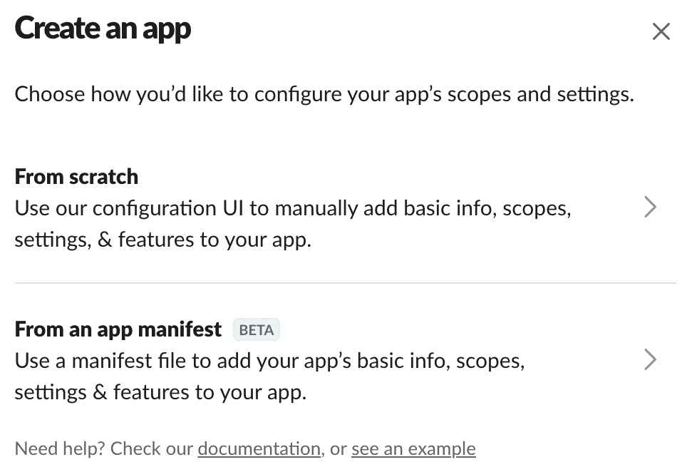

图 11.3 – 创建应用选项

1.  选择**从应用清单创建**选项。系统将展示以下内容：

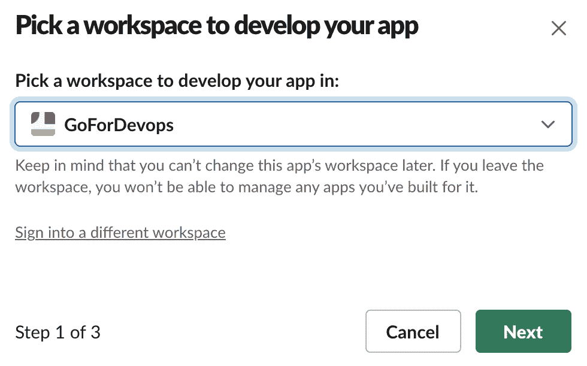

图 11.4 – 选择工作区

1.  选择你在本节开始时创建的工作区，然后点击**创建应用**。点击**下一步**按钮。

1.  从[`github.com/PacktPublishing/Go-for-DevOps/tree/rev0/chapter/11/chatbot/slack.manifest`](https://github.com/PacktPublishing/Go-for-DevOps/tree/rev0/chapter/11/chatbot/slack.manifest)的文件中复制文本，并将其粘贴到以下显示的页面中，格式为 YAML：

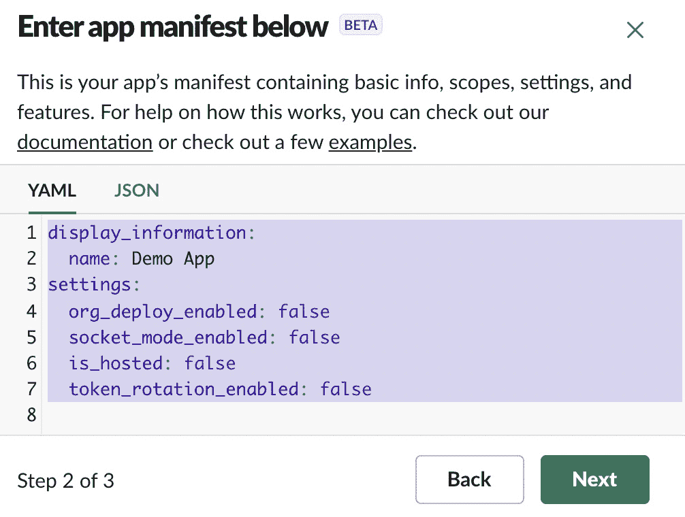

图 11.5 – 应用清单配置

1.  你在前面的图中看到的文本应替换为文件中的文本。点击**下一步**按钮。

系统会显示一个关于机器人权限的摘要，如下所示：

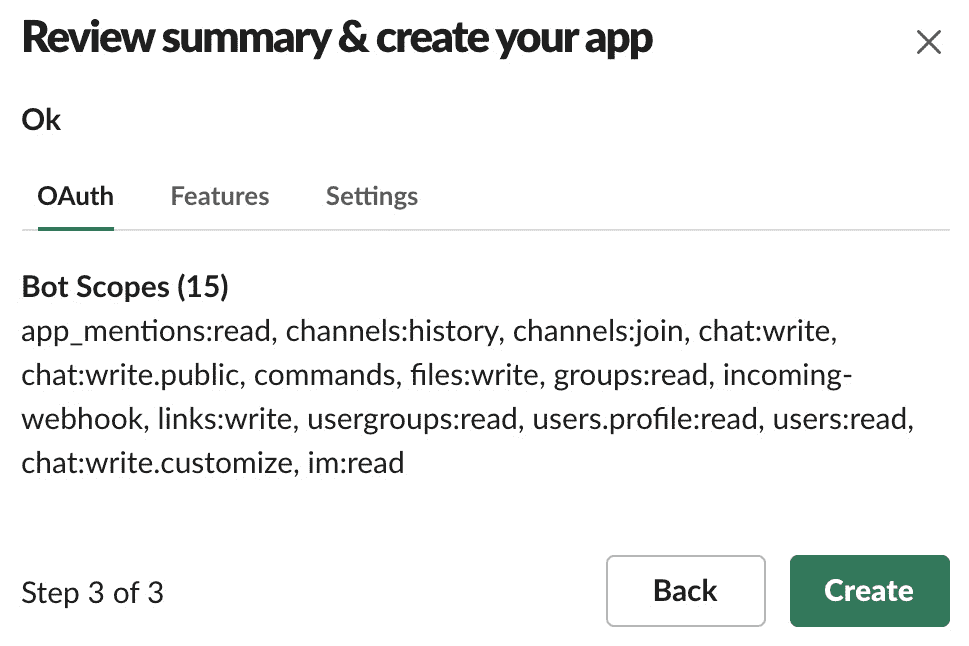

图 11.6 – 机器人创建摘要

1.  点击**创建**按钮。

1.  这将带你进入一个名为**基本信息**的页面。向下滚动页面，直到看到**应用级令牌**，如下图所示：

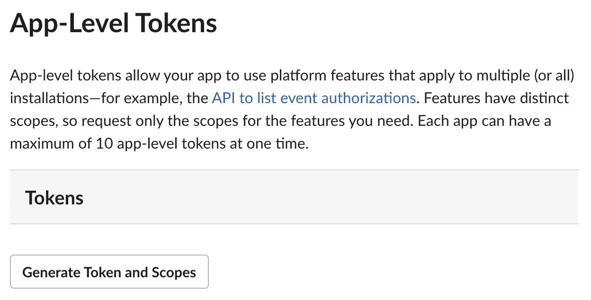

图 11.7 – 应用级令牌列表

1.  点击**生成令牌和作用域**按钮。这将引导你进入以下对话框：

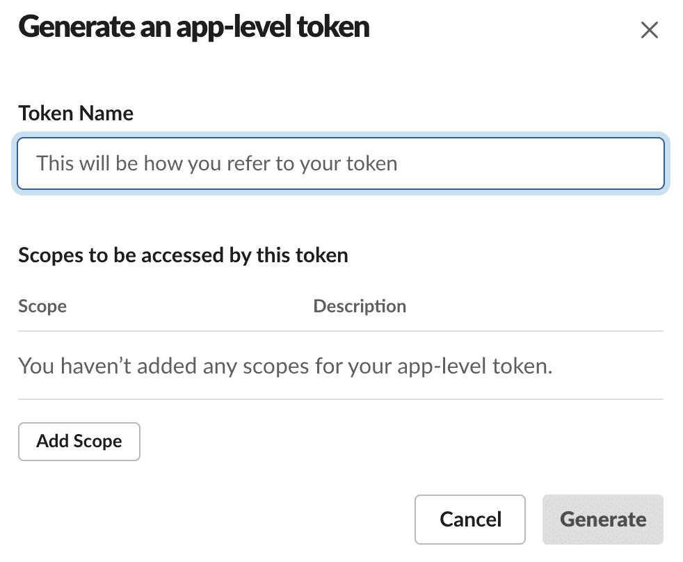

图 11.8 – 应用令牌创建

1.  将令牌名称设置为`petstore-bot`。

1.  在`connections:write`和`authorizations:read`中提供这些作用域。现在，点击**生成**。

1.  在下一个页面，你将获得一个应用级令牌。你需要点击**复制**按钮，并将令牌暂时保存到某个地方。

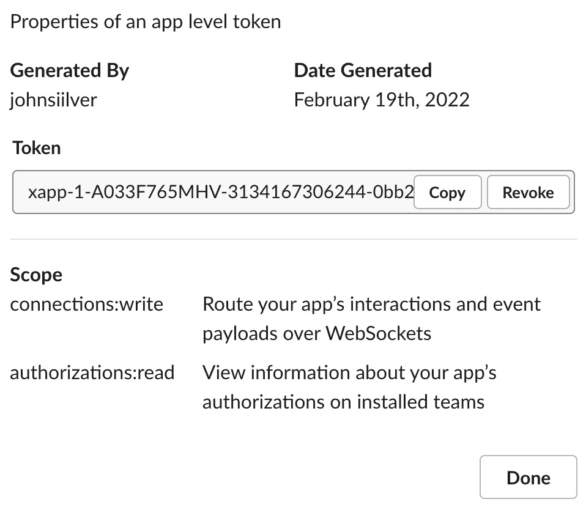

图 11.9 – 应用令牌信息

在生产环境中，你应该将其存储在某种类型的安全密钥库中，如 Azure Key Vault 或 AWS Key Management Service。你需要将其放入一个名为`.env`的文件中，并且绝不能将此文件提交到代码库中。我们将在*运行应用程序*部分中介绍如何制作此文件。

注意

这里的密钥是一个在截图之后被删除的机器人密钥。

1.  点击**完成**按钮。

1.  在左侧菜单栏中，选择**OAuth 和权限**。在下面显示的屏幕中，点击**安装到工作区**：

![图 11.10 – 在你的工作区安装令牌]

](img/B17626_11_010.jpg)

图 11.10 – 在你的工作区安装令牌

1.  会弹出一个对话框，询问要将应用发布到哪个频道。选择你喜欢的任何频道并点击**允许**。

你现在回到**OAuth 和权限**页面，但你会看到你的机器人**身份验证令牌**已列出。点击**复制**按钮，并将其存储在你之前存储应用令牌的位置。

## 运行应用程序

在这里，我们将使用 Docker Compose 启动我们的 Open Telemetry 服务、Jaeger、Prometheus 和我们的 Petstore 应用程序。启动这些服务后，我们将使用 Go 编译并运行实现与 Slack 连接的聊天机器人服务（ChatOps）：

1.  在`Go-for-DevOps`代码库（[`github.com/PacktPublishing/Go-for-DevOps/`](https://github.com/PacktPublishing/Go-for-DevOps/)）中，进入`chapter/11`目录。

1.  启动 Docker 容器：

    ```
    docker-compose up -d
    ```

1.  一旦环境启动，切换到`chapter/11/chatops`目录。

1.  你需要在此目录中创建一个`.env`文件，其中包含以下内容：

    ```
    AUTH_TOKEN=xoxb-[the rest of the token]
    APP_TOKEN=xapp-[the rest of the token]
    ```

这些是我们在设置 Slack 应用程序时生成的。

1.  使用以下命令运行 ChatOps 服务器：

    ```
    go run chatbot.go
    ```

1.  你应该能够看到以下消息输出到标准输出：

    ```
    Bot started
    ```

在后台，有一个演示客户端正在向宠物商店添加宠物并进行宠物搜索（某些搜索可能会导致错误）。服务设置为浮动采样，因此并非每次调用都会生成跟踪。

在另一个终端中，你可以通过使用 CLI 应用程序与宠物商店进行交互。这将允许你添加宠物、删除宠物以及使用过滤器搜索宠物。该客户端可以在以下路径找到：`chapter/11/petstore/client/cli/petstore`。你可以通过运行以下命令找到使用说明：

```
go run go run petstore.go --help
```

可以在`http://127.0.0.1:16686/search`观察到跟踪。

可以在`http://127.0.0.1:9090/graph`查询 Prometheus 指标。

要与我们的 ChatOps 机器人进行交互，你需要打开 Slack 并将机器人添加到一个频道中。你可以通过在频道中提到`@PetStore`来做到这一点。Slack 会询问你是否希望将机器人添加到频道中。

一旦发生这种情况，你可以尝试各种操作。首先，可以向机器人请求帮助，操作如下：

![图 11.11 – 基本帮助命令输出]

](img/B17626_11_011.jpg)

图 11.11 – 基本帮助命令输出

让我们请求一些帮助，看看如何列出一些跟踪：

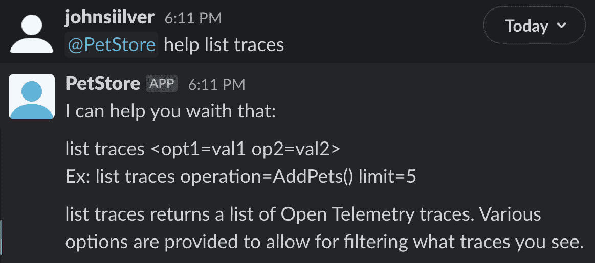

图 11.12 – 列出跟踪命令的帮助输出

那我们不妨请求系统给我们五个最近的追踪记录：

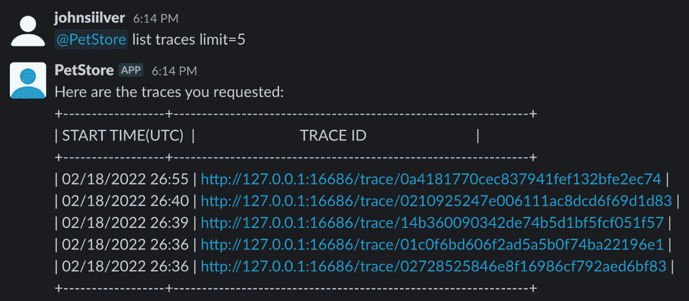

图 11.13 – 列出最后五个追踪记录的命令输出

我们也可以查询某个特定的追踪记录：

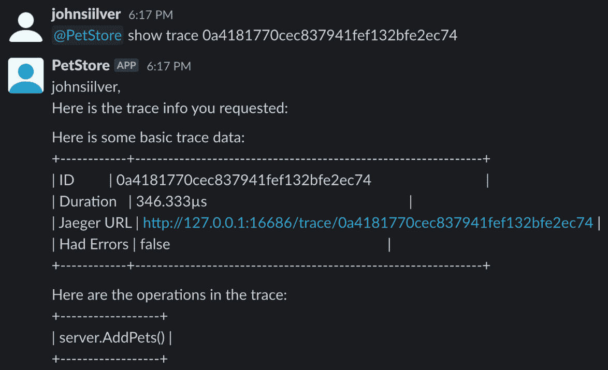

图 11.14 – 显示特定追踪数据的输出

注意

你不能直接粘贴从列出跟踪中复制的追踪 ID。因为这些是超链接；如果你想直接粘贴到 `show trace` 中，需要移除 ID 中的富文本。

机器人还有更多选项供你玩耍。试试看吧。

这个 ChatOps 应用只是冰山一角。你可以将 ChatOps 应用做得比我们这里的更强大。你可以让它显示图表，从服务的 `pprof` 转储中抓取配置文件信息并给你一个链接来查看，部署新版本的应用程序，或者回滚版本。只需将文件拖入 Slack 窗口（例如配置更改），即可将文件推送到服务。像警报这样的重要事件可以通过让 Ops 服务向 ChatOps 服务发送消息的方式广播给值班人员，使用 ChatOps 还能增加对服务运行情况和所执行操作的可观察性。

另外，和必须在笔记本电脑或台式机上运行的工具不同，Slack 和许多其他聊天应用程序都有移动版，因此你可以通过手机与之交互或进行紧急操作，而无需额外的开发成本。

# 摘要

在 *第九章*，*通过 OpenTelemetry 实现可观察性*，我们探讨了如何使用 Open Telemetry 提供对应用程序及其依赖应用程序的可观察性。我们讨论了如何使用两种最流行的后端：Jaeger 和 Prometheus（这两者都是用 Go 语言编写的）来为应用程序设置遥测。在 *第十章*，*使用 GitHub Actions 自动化工作流*，我们展示了如何使用 GitHub Actions 自动化代码部署，并使用 Go 添加自定义操作。最后，在本章中，我们研究了与服务交互的架构。我们使用 Slack 构建了一个交互层，进行诸如过滤追踪记录、获取当前部署版本以及显示警报等操作。

在接下来的章节中，我们将讨论如何使用 Go 语言及其编写的工具来减轻在云端工作的负担。内容将涵盖构建可以部署到虚拟机或其他节点基础设施的标准镜像。我们还将展示如何扩展 Kubernetes，当前市场上最流行的容器编排系统。最后，我们将指导你如何设计 DevOps 工作流和系统，以保护自己免受在基础设施上运行操作时所固有的混乱。
