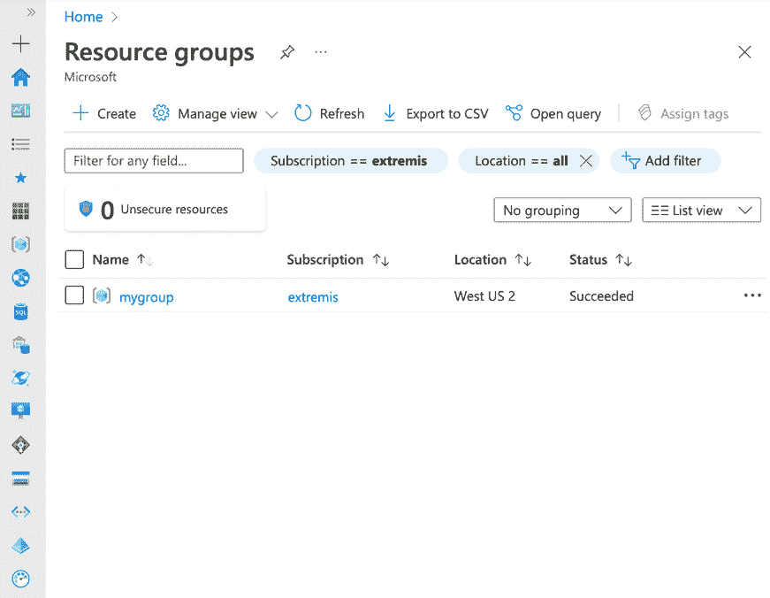
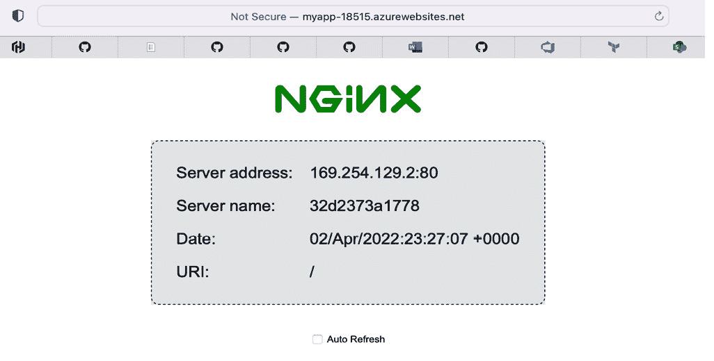

# 第十三章：使用 Terraform 实现基础设施即代码

**基础设施即代码**（**IaC**）是使用机器可读的声明性规范或命令式代码来配置计算基础设施的实践，而不是使用交互式配置工具。随着云计算的兴起，IaC 越来越流行。以前负责维护长期存在的基础设施的基础设施管理员，发现自己在公司采用云基础设施后，既需要在敏捷性上提高，又需要在容量上扩展。

请记住，在这时，软件团队和基础设施团队通常不会紧密合作，直到需要部署软件项目时。IaC 通过建立一套共享的文档，描述了软件项目所需的基础设施，从而为基础设施管理员和软件开发人员架起了桥梁。IaC 规范或代码通常存在于项目内部或与项目并行存放。通过在软件开发人员和基础设施管理员之间建立这种共享上下文，这两个团队能够在软件开发生命周期的早期就开始合作，并为基础设施建立共同的愿景。

在本章中，我们将首先学习 Terraform 如何处理 IaC 及其基本用法。在我们掌握 Terraform 的工作原理之后，我们将讨论 Terraform 提供者，并看看如何通过丰富的提供者生态系统来描述和配置各种资源，而不仅仅是计算基础设施，如虚拟机。最后，我们将学习如何通过构建我们自己的宠物商店 Terraform 提供者来扩展 Terraform。

本章将涵盖以下主题：

+   IaC 简介

+   了解 Terraform 的基础知识

+   了解 Terraform 提供者的基础知识

+   构建宠物商店 Terraform 提供者

# 技术要求

在本章中，你需要具备以下内容：

+   Docker

+   Git

+   Go

+   Terraform CLI：[`learn.hashicorp.com/tutorials/terraform/install-cli`](https://learn.hashicorp.com/tutorials/terraform/install-cli)

+   Azure CLI：[`docs.microsoft.com/en-us/cli/azure/install-azure-cli`](https://docs.microsoft.com/en-us/cli/azure/install-azure-cli)

+   本章的代码：[`github.com/PacktPublishing/Go-for-DevOps/tree/main/chapter/13/petstore-provider`](https://github.com/PacktPublishing/Go-for-DevOps/tree/main/chapter/13/petstore-provider)

让我们从学习一些 Terraform 基础知识开始。

本章的代码文件可以从 [`github.com/PacktPublishing/Go-for-DevOps/tree/rev0/chapter/13/petstore-provider`](https://github.com/PacktPublishing/Go-for-DevOps/tree/rev0/chapter/13/petstore-provider) 下载

# IaC 简介

IaC 不仅促进了基础设施与软件开发团队的合作，还使得项目基础设施的部署变得更加简便和安全。通过定义基础设施并将规范存储在软件项目中，基础设施代码可以像测试软件项目一样进行测试。与测试代码一样，持续测试基础设施代码能够减少缺陷、发现低效之处，并提高对基础设施部署过程的信心。

今天我们已经习惯了这一点，但在许多组织中，与基础设施管理员合作为一个复杂的应用程序构建集群可能需要几周时间。将这一经验压缩成少数几个文件，然后能够在几分钟内部署集群，这一变化具有革命性意义。

市面上有许多 IaC 工具，每个工具在描述和配置基础设施时都有自己独特的方式。虽然它们各有不同，但每个工具都可以通过两个方面来分类：一是作者如何指定代码，二是工具如何处理代码的变更。最重要的分类是基础设施代码如何被指定。具体而言，代码是一种声明式的规范，描述所需的状态（要配置什么），或者代码是用编程语言描述的一系列命令性步骤（如何配置）。第二个分类是工具如何应用基础设施，推送（Push）或拉取（Pull）。拉取式 IaC 工具会监视中央仓库中代码的变化，推送式 IaC 工具则将其更改应用到目标系统中。

IaC 是在编写、交付和运维软件之间架起桥梁的关键实践之一。它是开发与运维交集的关键领域之一。掌握这一实践将使您的团队能够更快、更灵活、更可靠地交付软件。

# 理解 Terraform 的基础知识

**Terraform** ([`www.terraform.io/`](https://www.terraform.io/)) 是一个由 HashiCorp 创建、用 Go 编写的开源 IaC 工具，提供一致的命令行体验来管理各种资源。通过 Terraform，基础设施工程师可以使用声明式的 Terraform 配置文件或命令式代码（[`www.terraform.io/cdktf`](https://www.terraform.io/cdktf)）定义一组层次化资源的期望状态，从而生成 Terraform 配置文件。这些配置文件就是 IaC 中的代码。它们可以用于管理资源的整个生命周期，包括创建、修改和销毁资源，计划并预测资源变更，提供复杂资源拓扑中的依赖关系图，并存储系统的最后观察状态。

Terraform 非常容易上手，并且有一个相对平缓的学习曲线。在本章中，我们不会涵盖 Terraform 的许多功能，但这些功能在你深入使用工具时会非常有用。本章的目标不是让你成为 Terraform 的专家，而是帮助你快速上手并高效使用。

在这一部分，你将学习 Terraform 如何运作的基础知识，以及如何使用 Terraform CLI。我们将从一个简单的示例开始，并讨论执行时发生的事情。到本节结束时，你应该能够熟练地使用 Terraform CLI 定义资源、初始化并应用。

## 使用 Terraform 初始化和应用基础设施规范

在本节的第一部分，我们将讨论资源而不是基础设施组件。讨论资源和组件较为抽象。让我们用一个具体的例子来解释使用 Terraform 的正常操作流程。

对于我们的第一个示例，我们将使用如下所示的目录结构：

```
.
├── main.tf
```

在上面的代码块中，我们有一个目录，里面有一个名为 `main.tf` 的文件。在该文件中，我们将添加以下内容：

```
resource "local_file" "foo" {
    content  = "foo!"
    filename = "${path.module}/foo.txt"
}
```

在上述 Terraform `main.tf` 配置文件中，我们定义了一个名为 `foo` 的 `local_file` 资源，并将其内容设置为 `foo!`，该文件位于 `${path.module}/foo.txt`。`${path.module}` 是模块的文件系统路径，在此例中为 `./foo.txt`。

我们可以简单地运行以下命令来初始化 Terraform 并应用所需的状态：

```
$ terraform init && terraform apply
```

上面的`terraform init`命令将检查`main.tf`的有效性，拉取所需的提供程序，并初始化项目的本地状态。在执行`init`命令后，将执行`apply`命令。我们将这两个命令分为两部分来讨论，首先是`init`，然后是`apply`。`init`命令应输出以下内容：

```
$ terraform init && terraform apply
Initializing the backend...
Initializing provider plugins...
- Finding latest version of hashicorp/local...
- Installing hashicorp/local v2.2.2...
- Installed hashicorp/local v2.2.2 (signed by HashiCorp)
Terraform has created a lock file .terraform.lock.hcl to record the provider
selections it made preceding. Include this file in your version control repository
so that Terraform can guarantee to make the same selections by default when
you run "terraform init" in the future.
Terraform has been successfully initialized!
You may now begin working with Terraform. Try running "terraform plan" to see
any changes that are required for your infrastructure. All Terraform commands
should now work.
If you ever set or change modules or backend configuration for Terraform,
rerun this command to reinitialize your working directory. If you forget, other
commands will detect it and remind you to do so if necessary.
```

如上面的输出所示，Terraform 安装了特定版本的`hashicorp/local`提供程序。然后，Terraform 将该版本保存到本地锁定文件`.terraform.lock.hcl`中，以确保未来使用相同的版本，从而确保可重现的构建。最后，Terraform 提供了使用`terraform plan`查看 Terraform 将如何执行以达到`main.tf`中描述的所需状态的指令。

初始化后，运行`terraform apply`将触发 Terraform 确定当前所需的状态，并与`main.tf`中资源的已知状态进行比较。`terraform apply`会向操作员呈现即将执行的操作计划。经操作员批准计划后，Terraform 执行该计划并保存资源的更新状态。我们来看一下`terraform apply`的输出：

```
Terraform used the selected providers to generate the following execution plan. Resource actions are indicated with the following symbols:
  + create
Terraform will perform the following actions:
  # local_file.foo will be created
  + resource "local_file" "foo" {
      + content              = "foo!"
      + directory_permission = "0777"
      + file_permission      = "0777"
      + filename             = "./foo.txt"
      + id                   = (known after apply)
    }
Plan: 1 to add, 0 to change, 0 to destroy.
Do you want to perform these actions?
  Terraform will perform the actions described preceding.
  Only 'yes' will be accepted to approve.
  Enter a value: yes
local_file.foo: Creating...
local_file.foo: Creation complete after 0s [id=4bf3e335199107182c6f7638efaad377acc7f452]
Apply complete! Resources: 1 added, 0 changed, 0 destroyed.
```

在确认计划并输入`yes`后，Terraform 已应用所需的状态并创建了一个本地文件资源。目录应如下所示：

```
.
├── .terraform
│   └── providers
│       └── registry.terraform.io
│           └── hashicorp
│               └── local
│                   └── 2.2.2
│                       └── darwin_arm64
│                           └── terraform-provider-local_v2.2.2_x5
├── .terraform.lock.hcl
├── foo.txt
├── main.tf
└── terraform.tfstate
```

在上面的目录结构中，我们可以看到 Terraform 用于配置文件的本地提供程序、Terraform 锁文件、`foo.txt`文件和`terraform.tfstate`文件。让我们探索一下`foo.txt`和`terraform.tfstate`文件：

```
$ cat foo.txt
foo!
```

正如我们在`main.tf`中描述的那样，Terraform 已经创建了包含`foo!`内容的`foo.txt`。接下来，让我们看看`terraform.tfstate`：

```
$ cat terraform.tfstate
{
  "version": 4,
  "terraform_version": "1.1.7",
  "serial": 1,
  "lineage": "384e96a1-5878-ed22-5368-9795a3231a00",
  "outputs": {},
  "resources": [
    {
      "mode": "managed",
      "type": "local_file",
      "name": "foo",
      "provider": "provider[\"registry.terraform.io/hashicorp/local\"]",
      "instances": [
        {
          "schema_version": 0,
          "attributes": {
            "content": "foo!",
            "content_base64": null,
            "directory_permission": "0777",
            "file_permission": "0777",
            "filename": "./foo.txt",
            "id": "4bf3e335199107182c6f7638efaad377acc7f452",
            "sensitive_content": null,
            "source": null
          },
          "sensitive_attributes": [],
          "private": "bnVsbA=="
        }
      ]
    }
  ]
}
```

`terraform.tfstate`文件比`foo.txt`更为有趣。`tfstate`文件是 Terraform 存储计划中已应用资源的最后已知状态的地方。这使得 Terraform 能够检查与最后已知状态的差异，并在未来所需状态发生变化时，生成更新资源的计划。

接下来，让我们在`main.tf`中更改所需的状态，并查看再次应用配置时会发生什么。我们将`main.tf`更新为如下：

```
resource "local_file" "foo" {
    content  = "foo changed!"
    filename = "${path.module}/foo.txt"
    file_permissions = "0644"
}
```

请注意，我们已更改了`foo.txt`的内容，并为该资源添加了文件权限。现在，让我们应用所需状态，看看会发生什么：

```
$ terraform apply -auto-approve
local_file.foo: Refreshing state... [id=4bf3e335199107182c6f7638efaad377acc7f452]
Terraform used the selected providers to generate the following execution plan. Resource actions are indicated with the following symbols:
-/+ destroy and then create replacement
Terraform will perform the following actions:
  # local_file.foo must be replaced
-/+ resource "local_file" "foo" {
      ~ content              = "foo!" -> "foo changed!" # forces replacement
      ~ file_permission      = "0777" -> "0644" # forces replacement
      ~ id                   = "4bf3e335199107182c6f7638efaad377acc7f452" -> (known after apply)
        # (2 unchanged attributes hidden)
    }
Plan: 1 to add, 0 to change, 1 to destroy.
local_file.foo: Destroying... [id=4bf3e335199107182c6f7638efaad377acc7f452]
local_file.foo: Destruction complete after 0s
local_file.foo: Creating...
local_file.foo: Creation complete after 0s [id=5d6b2d23a15b5391d798c9c6a6b69f9a57c41aa5]
Apply complete! Resources: 1 added, 0 changed, 1 destroyed.
```

Terraform 能够确定资源已更改的属性，并为达到所需状态创建计划。正如计划输出中所示，`1`个添加，`0`个更改，`1`个销毁，表示本地的`foo.txt`文件将被删除并重新创建，因为文件权限的更改迫使该文件被替换。这个例子说明了，单一属性的更改可能会（但不总是）导致资源的删除和重建。请注意，我们为`apply`命令添加了`-auto-approve`标志。顾名思义，这将不会在应用计划之前提示审批。在使用该标志时，你可能需要小心，因为检查计划确保你期望的操作与计划中描述的操作一致是一个好习惯。

让我们看看`foo.txt`的新内容：

```
$ cat foo.txt
foo changed!
```

如你所见，`foo.txt`的内容已经更新，以反映所需的状态。现在，让我们检查一下目录：

```
.
├── foo.txt
├── main.tf
├── terraform.tfstate
└── terraform.tfstate.backup
```

请注意，创建了一个新文件，`terraform.tfstate.backup`。这是之前`tfstate`文件的副本，以防新的`tfstate`文件损坏或丢失。

默认情况下，`tfstate`文件是存储在本地的。在个人工作时，这完全没问题；然而，在团队合作时，就会变得难以与其他人共享最新的状态。此时，远程状态（[`www.terraform.io/language/state/remote`](https://www.terraform.io/language/state/remote)）变得非常有用。我们在这里不讨论这一功能，但你应该了解它。

最后，我们将销毁我们已创建的资源：

```
$ terraform destroy
local_file.foo: Refreshing state... [id=5d6b2d23a15b5391d798c9c6a6b69f9a57c41aa5]
Terraform used the selected providers to generate the following execution plan. Resource actions are indicated with the following symbols:
  - destroy
Terraform will perform the following actions:
  # local_file.foo will be destroyed
  - resource "local_file" "foo" {
      - content              = "foo changed!" -> null
      - directory_permission = "0777" -> null
      - file_permission      = "0644" -> null
      - filename             = "./foo.txt" -> null
      - id                   = "5d6b2d23a15b5391d798c9c6a6b69f9a57c41aa5" -> null
    }
Plan: 0 to add, 0 to change, 1 to destroy.
Do you really want to destroy all resources?
  Terraform will destroy all your managed infrastructure, as shown above.
  There is no undo. Only 'yes' will be accepted to confirm.
  Enter a value: yes
local_file.foo: Destroying... [id=5d6b2d23a15b5391d798c9c6a6b69f9a57c41aa5]
local_file.foo: Destruction complete after 0s
Destroy complete! Resources: 1 destroyed.
```

运行`terraform destroy`将清理所有在所需状态中描述的资源。如果你检查你的目录，你会发现`foo.txt`文件已被删除。

恭喜！你已经掌握了 Terraform 的基础知识。我们从高层次了解了 Terraform 是如何操作的以及如何使用 Terraform CLI。我们创建了一个简单的本地文件资源，修改了它，并销毁了它。在下一节中，我们将讨论 Terraform 提供商，并探索利用这些提供商所打开的广阔世界。

# 理解 Terraform 提供商的基础知识

从本质上讲，Terraform 是一个平台，用于将表达的期望状态与外部系统进行对比。Terraform 与外部 API 交互的方式是通过名为 **提供商** 的插件。提供商负责描述其公开资源的架构，并实现与外部 API 的 **创建、读取、更新和删除**（**CRUD**）交互。提供商使 Terraform 能够将几乎所有外部 API 的资源表示为 Terraform 资源。

通过其成千上万的社区和验证过的提供商，Terraform 能够管理包括 Redis、Cassandra 和 MongoDB 等数据库，所有主要云服务提供商的云基础设施，Discord 和 SendGrid 等通信和消息服务，以及大量其他提供商。如果你有兴趣，可以在 Terraform 注册表中查看它们的列表 ([`registry.terraform.io/`](https://registry.terraform.io/))。你只需编写、规划并应用，即可实现你所期望的基础设施。

在本节中，我们将基于使用本地提供商的经验，并将我们学到的知识扩展到使用与外部 API 交互的提供商。我们将为一组云资源定义期望的状态并进行配置。

## 定义和配置云资源

假设我们想要将基础设施部署到我们的云服务提供商。此时，我们将通过 `hashicorp/azurerm` 提供商使用 Microsoft Azure。在一个空目录中，让我们从编写一个简单的 `main.tf` 文件开始，如下所示：

```
# Configure the Azure provider
terraform {
  required_providers {
    azurerm = {
      source  = "hashicorp/azurerm"
      version = "~> 3.0"
    }
  }
}
provider "azurerm" {
  features {}
}
resource "azurerm_resource_group" "mygroup" {
  name     = "mygroup"
  location = "southcentralus"
}
```

上述 Terraform 配置文件需要 `hashicorp/azurerm` 提供商，并在 `southcentralus` 区域定义了一个名为 `mygroup` 的资源组（资源组是 Azure 的一个概念，用于将基础设施资源组合在一起）。

要运行本节中的其他示例，你需要一个 Azure 账户。如果你没有 Azure 账户，可以注册一个免费账户，获得 $200 的 Azure 信用： [`azure.microsoft.com/en-us/free/`](https://azure.microsoft.com/en-us/free/)。

一旦你拥有账户，请使用 Azure CLI 登录：

```
$ az login
```

上述命令将使你登录到 Azure 账户，并将默认上下文设置为你的主 Azure 订阅。要查看当前活跃的订阅，可以运行以下命令：

```
$ az account show
{
  "environmentName": "AzureCloud",
  "isDefault": true,
  "managedByTenants": [],
  "name": "mysubscription",
  "state": "Enabled",
  "tenantId": "888bf....db93",
  "user": {
      ...
  }
}
```

上述命令的输出显示了订阅名称和 Azure CLI 当前上下文的其他详细信息。`azurerm` 提供商将使用 Azure CLI 的认证上下文与 Azure API 进行交互。

现在我们已经在 Azure CLI 上完成了身份验证的 Azure 会话，接下来让我们使用`init`和`apply`来创建我们期望的状态。在包含`main.tf`文件的目录下，运行以下命令：

```
$ terraform init && terraform apply
```

`terraform init`将初始化目录，并下载最新的`azurerm`提供程序。通过指定`~> 3.0`版本约束，Terraform 会安装`3.0.x`系列中的最新版本。您应该会看到类似于以下的`init`输出：

```
Initializing the backend...
Initializing provider plugins...
- Finding hashicorp/azurerm versions matching "~> 3.0"...
- Installing hashicorp/azurerm v3.0.2...
- Installed hashicorp/azurerm v3.0.2 (signed by HashiCorp)
Terraform has created a lock file .terraform.lock.hcl to record the provider
selections it made above. Include this file in your version control repository
so that Terraform can guarantee to make the same selections by default when
you run "terraform init" in the future.
Terraform has been successfully initialized!
You may now begin working with Terraform. Try running "terraform plan" to see
any changes that are required for your infrastructure. All Terraform commands
should now work.
If you ever set or change modules or backend configuration for Terraform,
rerun this command to reinitialize your working directory. If you forget, other
commands will detect it and remind you to do so if necessary.
```

这段输出应该在*使用 Terraform 初始化和应用基础设施规范*部分中看过。初始化完成后，您将再次看到创建所需资源的计划。计划获得批准后，所需资源会被创建。输出应该像下面这样：

```
Terraform used the selected providers to generate the following execution plan. Resource actions are indicated with the following symbols:
  + create
Terraform will perform the following actions:
  # azurerm_resource_group.rg will be created
  + resource "azurerm_resource_group" "mygroup" {
      + id       = (known after apply)
      + location = "southcentralus"
      + name     = "mygroup"
    }
Plan: 1 to add, 0 to change, 0 to destroy.
Do you want to perform these actions?
  Terraform will perform the actions described above.
  Only 'yes' will be accepted to approve.
  Enter a value: yes
azurerm_resource_group.mygroup: Creating...
azurerm_resource_group.mygroup: Creation complete after 2s [id=/subscriptions/8ec-...-24a/resourceGroups/mygroup]
```

从上面的输出中可以看到，资源组已经创建。

注意

如果您使用的是免费的 Azure 账户，可能在` southcentralus`区域没有配额。您可能需要使用其他区域，如`centralus`或`northeurope`。要了解更多关于适合您的区域的信息，可以查看 Azure 地理位置指南：[`azure.microsoft.com/en-us/global-infrastructure/geographies/#geographies`](https://azure.microsoft.com/en-us/global-infrastructure/geographies/#geographies)。

打开 Azure 门户并导航到**资源组**视图，您应该能看到以下内容：



图 13.1 – 在 Azure 中创建的资源组

在上面的截图中，我们可以看到我们新创建的 Azure 资源组，`mygroup`。

让我们看看在运行`init`和`apply`后，哪些新文件被添加到了本地目录中：

```
.
├── .terraform
│   └── providers
│       └── registry.terraform.io
│           └── hashicorp
│               └── azurerm
│                   └── 3.0.2
│                       └── darwin_arm64
│                           └── terraform-provider-azurerm_v3.0.2_x5
├── .terraform.lock.hcl
├── main.tf
└── terraform.tfstate
```

与前面的部分类似，我们可以看到 Terraform 的锁定文件和状态文件。然而，在`providers`目录中，我们现在可以看到安装了`azurerm`提供程序。

让我们添加一些资源并应用它们。您可以在 Azure 提供程序文档中找到所有受支持资源的列表（[`registry.terraform.io/providers/hashicorp/azurerm/latest/docs`](https://registry.terraform.io/providers/hashicorp/azurerm/latest/docs)）。我们将更新`main.tf`文件，包含以下资源：

```
resource "azurerm_resource_group" "mygroup" {
  name     = "mygroup"
  location = "southcentralus"
}
resource "azurerm_service_plan" "myplan" {
  name                = "myplan"
  resource_group_name = azurerm_resource_group.mygroup.name
  location            = azurerm_resource_group.mygroup.location
  os_type             = "Linux"
  sku_name            = "S1"
}
resource "random_integer" "ri" {
  min = 10000
  max = 99999
}
resource "azurerm_linux_web_app" "myapp" {
  name                = "myapp-${random_integer.ri.result}"
  resource_group_name = azurerm_resource_group.mygroup.name
  location            = azurerm_service_plan.myplan.location
  service_plan_id     = azurerm_service_plan.myplan.id
  site_config {
      application_stack {
          docker_image = "nginxdemos/hello"
          docker_image_tag = "latest"
      }
  }
}
output "host_name" {
    value = azurerm_linux_web_app.myapp.default_hostname
}
```

添加到前面的`main.tf`文件中的资源包括两个 Azure 资源，一个应用服务计划，一个 Linux Web 应用，以及一个`random_integer`资源。Azure 应用服务计划定义了一个区域性的计算基础设施部署，用于运行基于 Linux 的 Web 应用。Azure Linux Web 应用与 Azure 应用服务计划相关联，并配置为运行一个 hello world NGINX 演示容器镜像。`random_integer`资源需要提供一些随机输入，用于**完全限定域名**（**FQDN**）的配置，供 Linux Web 应用使用。

请注意变量的使用。例如，我们使用`azurerm_resource_group.mygroup.name`为`azure_service_plan`资源中的`resource_group_name`提供值。使用变量有助于最小化配置文件中的字符串字面值数量。这在进行修改时很有帮助，因为你可以在一个地方进行修改，而不是在每个字符串出现的地方修改。

此外，请注意使用输出变量`host_name`。这指示 Terraform 在`terraform apply`完成后输出`host_name`键，值为`azurerm_linux_web_app.myapp.default_hostname`。我们将使用此输出，以便在网站部署后更方便地打开它。

让我们再次运行`terraform apply`，看看会发生什么：

```
$ terraform apply
│
│ Error: Inconsistent dependency lock file
│
│ The following dependency selections recorded in the lock file are inconsistent with the current configuration:
│   - provider registry.terraform.io/hashicorp/random: required by this configuration but no version is selected
│
│ To update the locked dependency selections to match a changed configuration, run:
│   terraform init -upgrade
│
```

哎呀！`terraform apply`返回了一个错误，提示我们在配置中添加了一个新提供者，而上次没有这个。运行`terraform init -upgrade`，`random`模块将被添加：

```
$ terraform init -upgrade
Initializing the backend...
Initializing provider plugins...
- Finding latest version of hashicorp/random...
- Finding hashicorp/azurerm versions matching "~> 3.0"...
- Installing hashicorp/random v3.1.2...
- Installed hashicorp/random v3.1.2 (signed by HashiCorp)
- Using previously-installed hashicorp/azurerm v3.0.2
```

你应该会看到类似上面的输出，显示 Terraform 正在安装最新版本的`hashicorp/random`提供者。让我们看看在添加了提供者后，我们的目录现在是什么样子的：

```
.
├── .terraform
│   └── providers
│       └── registry.terraform.io
│           └── hashicorp
│               ├── azurerm
│               │   └── 3.0.2
│               │       └── darwin_arm64
│               │           └── terraform-provider-azurerm_v3.0.2_x5
│               └── random
│                   └── 3.1.2
│                       └── darwin_arm64
│                           └── terraform-provider-random_v3.1.2_x5
```

如你所见，`random`提供者现在已安装。我们应该可以再次使用`apply`了：

```
$ terraform apply -auto-approve
azurerm_resource_group.mygroup: Refreshing state...
...
Plan: 3 to add, 0 to change, 0 to destroy.
Changes to Outputs:
  + host_name = (known after apply)
random_integer.ri: Creating...
random_integer.ri: Creation complete after 0s [id=18515]
azurerm_service_plan.myplan: Creating...
azurerm_service_plan.myplan: Still creating... [10s elapsed]
azurerm_service_plan.myplan: Creation complete after 12s [id=/subscriptions/8ec-...-24a/resourceGroups/mygroup/providers/Microsoft.Web/serverfarms/myplan]
azurerm_linux_web_app.myapp: Creating...
azurerm_linux_web_app.myapp: Still creating... [10s elapsed]
azurerm_linux_web_app.myapp: Still creating... [20s elapsed]
azurerm_linux_web_app.myapp: Creation complete after 28s [id=/subscriptions/8ec-...-24a/resourceGroups/mygroup/providers/Microsoft.Web/sites/myapp-18515]
Apply complete! Resources: 3 added, 0 changed, 0 destroyed.
Outputs:
host_name = "myapp-18515.azurewebsites.net"
```

我们省略了`terraform apply`的部分输出。需要注意的是，我们正在创建`main.tf`中描述的每个资源，它们已经成功配置，并且`host_name`包含了一个**通用资源标识符**（**URI**），用于访问新部署的 Web 应用。

获取`host_name`的 URI 并在浏览器中打开。你应该会看到如下内容：



图 13.2 – NGINX 运行在 Azure 应用服务中

如果你返回到 Azure 门户，你也会看到在你的资源组内创建的资源。

我希望你能花点时间通过定义和应用其他资源进行实验。一旦你掌握了使用提供者和一些基本语法，Terraform 将变得非常愉快。当你完成资源配置后，只需运行`terraform destroy`，它们将被删除。

在本节中，我们学习了使用提供者来操作云资源的一些基础知识。我们只需要使用几个提供者，但正如本节开头所讨论的那样，世上有成千上万的提供者。你很可能能够找到一个提供者来解决你的问题。然而，也可能有一些你希望用 Terraform 管理的 API 和资源，而没有现成的提供者。在下一节中，我们将为一个虚构的宠物商店构建一个 Terraform 提供者。

# 构建宠物商店 Terraform 提供者

即使 Terraform 提供商注册表 ([`registry.terraform.io/`](https://registry.terraform.io/)) 几乎涵盖了您能想到的每个提供商，但您可能需要的提供商尚未存在。也许您希望使用 Terraform 与公司内部的专有 API 资源进行交互。如果您想管理尚不存在于 Terraform 提供商生态系统中的资源，您将需要为该 API 编写一个提供商。好消息是，编写 Terraform 提供商相对简单。HashiCorp 的负责人提供了出色的文档、SDK 和工具，使构建提供商变得轻而易举。

在之前的章节中，我们学习了 Terraform 的基础知识以及如何使用提供商与本地和外部系统中的资源进行交互。我们能够构建云资源以部署运行在容器中的 Linux Web 应用程序。

在本节中，我们将在前几节的基础上构建，并学习如何构建我们自己的提供商。我们在本节中构建的 Terraform 提供商将暴露宠物资源，并与本地 `docker-compose-h`osted 宠物店服务交互，以模拟外部 API。

您将学习如何定义具有强大模式和验证的自定义资源，创建数据源，并为我们的宠物资源实施 CRUD 交互。最后，我们将讨论通过 Terraform 提供商注册表发布供全球使用的模块。

## 构建自定义提供商的资源

HashiCorp 提供了一套广泛的教程，用于构建自定义提供商 ([`learn.hashicorp.com/collections/terraform/providers`](https://learn.hashicorp.com/collections/terraform/providers))。如果您打算构建自己的自定义提供商，我强烈推荐查阅这些内容。

本节的代码位于 [`github.com/PacktPublishing/Go-for-DevOps/tree/main/chapter/13/petstore-provider`](https://github.com/PacktPublishing/Go-for-DevOps/tree/main/chapter/13/petstore-provider)。我们不会覆盖所有代码，但我们将深入探讨最有趣的部分。我尽力保持只保留最简单的实现；然而，简单并不总是优雅。

此外，我们的宠物店自定义提供商使用的是 Terraform 插件 SDK v2 ([`www.terraform.io/plugin/sdkv2/sdkv2-intro`](https://www.terraform.io/plugin/sdkv2/sdkv2-intro))，而不是新的（在撰写本文时）Terraform 插件框架。我选择这条路线是因为大多数现有的提供商都使用 SDK v2，而 *Terraform 插件框架* ([`www.terraform.io/plugin/framework`](https://www.terraform.io/plugin/framework)) 尚未达到稳定性。如果您对权衡利弊感兴趣，请阅读 HashiCorp 的 *Which SDK Should I Use?* 文章 ([`www.terraform.io/plugin/which-sdk`](https://www.terraform.io/plugin/which-sdk))。

现在我们已经建立了内容和学习的基础，让我们继续进行代码编写。

## 宠物店提供商

我们的宠物商店 Terraform 提供者只是另一个 Go 应用程序。Terraform 和提供者之间的大部分交互都是在 Terraform SDK 层面处理的，很少有东西会干扰到提供者开发者。让我们首先来看一下提供者的目录结构：

```
.
├── Makefile
├── docker-compose.yml
├── examples
│   └── main.tf
├── go.mod
├── go.sum
├── internal
│   ├── client # contains the grpc pet store API client
│   │   └── ...
│   ├── data_source_pet.go
│   ├── provider.go
│   ├── resource_pets.go
│   └── schema.go
└── main.go
```

就像我之前说的，这是一个标准的 Go 应用程序，入口点在`main.go`中。让我们从顶部开始，逐步查看文件。列表中的第一个是 Makefile：

```
HOSTNAME=example.com
NAMESPACE=gofordevops
NAME=petstore
BINARY=terraform-provider-${NAME}
VERSION=0.1.0
GOARCH  := $(shell go env GOARCH)
GOOS := $(shell go env GOOS)
default: install
build:
     go build -o ${BINARY}
install: build
     mkdir -p ~/.terraform.d/plugins/${HOSTNAME}/${NAMESPACE}/${NAME}/${VERSION}/${GOOS}_${GOARCH}
     mv ${BINARY} ~/.terraform.d/plugins/${HOSTNAME}/${NAMESPACE}/${NAME}/${VERSION}/${GOOS}_${GOARCH}
test:
     go test ./... -v
testacc:
     TF_ACC=1 go test ./... -v $(TESTARGS) -timeout 120m
```

上面的 Makefile 提供了一些有用的构建任务和环境配置。例如，`make`或`make install`会根据当前架构构建提供者，并将其放置在`~/.terraform.d/plugins`目录树中，这样我们就可以在本地使用该提供者，而无需将其发布到注册表中。

接下来，我们有`docker-compose.yml`文件。让我们看一下：

```
version: '3.7'
services:
  petstore:
    build:
      context: ../../10/petstore/.
    command:
      - /go/bin/petstore
      - --localDebug
    ports:
      - "6742:6742"
```

`docker-compose.yml`文件运行来自*第十章*的宠物商店服务，*使用 GitHub Actions 自动化工作流*，并在端口`6742`上暴露 gRPC 服务。宠物商店服务将宠物存储在内存中，因此要清除当前存储的宠物，只需重新启动该服务即可。稍后我们将在本节中讨论如何启动和停止服务。

接下来，我们来看`examples/main.tf`。让我们看看定义我们宠物资源的示例：

```
terraform {
  required_providers {
    petstore = {
      version = "0.1.0"
      source  = "example.com/gofordevops/petstore"
    }
  }
}
...
resource "petstore_pet" "thor" {
  name     = "Thor"
  type     = "dog"
  birthday = "2021-04-01T00:00:00Z"
}
resource "petstore_pet" "tron" {
  name     = "Tron"
  type     = "cat"
  birthday = "2020-06-25T00:00:00Z"
}
data "petstore_pet" "all" {
  depends_on = [petstore_pet.thor, petstore_pet.tron]
}
```

在前面的`main.tf`文件中，我们可以看到提供者已注册并配置为使用本地宠物商店服务。我们还可以看到定义了两个`petstore_pet`资源，分别是`Thor`和`Tron`。在这些资源之后，我们定义了一个`petstore_pet`数据源。稍后我们将更详细地介绍文件的各个部分。

我希望你在进入代码之前先看到`main.tf`，因为它会给你一个关于我们希望在提供者实现中实现的接口的概念。我相信看到提供者的使用将帮助你更好地理解提供者的实现。

剩下的源代码全部是 Go 语言编写的，所以与其从上到下查看，我打算跳到`main.go`中的入口点，深入了解实际的实现：

```
package main
import (
     "github.com/hashicorp/terraform-plugin-sdk/v2/helper/schema"
     "github.com/hashicorp/terraform-plugin-sdk/v2/plugin"
     petstore "github.com/PacktPublishing/Go-for-DevOps/chapter/13/petstore-provider/internal"
)
func main() {
     plugin.Serve(&plugin.ServeOpts{
          ProviderFunc: func() *schema.Provider {
               return petstore.Provider()
          },
     })
}
```

好的，`main.go`是足够简单的。在`main`中，我们所做的就是通过 Terraform 插件 SDK v2 启动一个插件服务器，并为其提供我们的宠物商店提供者的实现。接下来，让我们看看`internal/provider.go`中的`petstore.Provider`实现：

```
// Provider is the entry point for defining the Terraform provider, and will create a new Pet Store provider.
func Provider() *schema.Provider {
     return &schema.Provider{
          Schema: map[string]*schema.Schema{
               "host": {
                    Type:        schema.TypeString,
                    Optional:    true,
                    DefaultFunc: schema.EnvDefaultFunc("PETSTORE_HOST", nil),
               },
          },
          ResourcesMap: map[string]*schema.Resource{
               "petstore_pet": resourcePet(),
          },
          DataSourcesMap: map[string]*schema.Resource{
               "petstore_pet": dataSourcePet(),
          },
          ConfigureContextFunc: configure,
     }
}
```

`provider.go` 中只有两个函数。`Provider` 函数创建一个 `*schema.Provider`，该提供者描述了配置提供者的架构、提供者的资源、提供者的数据源以及用于初始化提供者的配置函数。提供者的资源映射通过字符串名称包含资源及其架构。每个结构的架构描述了与 Terraform 交互的领域特定语言，以操作其字段和资源层次结构。我们将在稍后详细查看这些结构的架构。

接下来，让我们来看看 `provider.go` 中的 `configure` 函数：

```
// configure builds a new Pet Store client the provider will use to interact with the Pet Store service
func configure(_ context.Context, data *schema.ResourceData) (interface{}, diag.Diagnostics) {
     // Warning or errors can be collected in a slice type
     var diags diag.Diagnostics
     host, ok := data.Get("host").(string)
     if !ok {
          return nil, diag.Errorf("the host (127.0.0.1:443) must be provided explicitly or via env var PETSTORE_HOST")
     }
     c, err := client.New(host)
     if err != nil {
          return nil, append(diags, diag.Diagnostic{
               Severity: diag.Error,
               Summary:  "Unable to create Pet Store client",
               Detail:   "Unable to connect to the Pet Store service",
          })
     }
     return c, diags
}
```

`configure` 函数负责处理提供者配置。请注意，前面 `Provider` 架构中描述的 `host` 数据通过 `data` 参数提供。这是你将在整个提供者中看到的常见模式。我们使用 `host` 配置数据来构建宠物店服务的客户端。如果无法构建宠物店客户端，我们会将一个 `diag.Diagnostic` 结构附加到 `diag.Diagnostics` 切片中。这些诊断结构会通知 Terraform 提供者中发生的不同严重性的事件。在这种情况下，如果我们无法构建客户端，则会发生错误，并应将此信息反馈给用户。如果一切顺利，我们将返回 `client` 实例和一个空的 `diag.Diagnostics` 切片。

接下来，让我们来查看宠物店数据源。

### 实现宠物店数据源

宠物店数据源比资源实现简单一些，因为数据源是 Terraform 用来从外部 API 拉取数据的方式，并且在这种情况下是只读的。宠物店数据源定义在 `internal/data_source_pet.go` 中。

宠物店数据源有三个主要函数。我们将逐个查看它们。首先从 `dataSourcePet` 函数开始：

```
func dataSourcePet() *schema.Resource {
     return &schema.Resource{
          ReadContext: dataSourcePetRead,
          Schema:      getPetDataSchema(),
     }
}
```

上述函数通过提供一个 `getPetDataSchema` 的数据架构来创建 `*schema.Resource` 数据源。`ReadContext` 期望一个函数，该函数负责翻译输入架构，查询外部 API，并返回与架构中定义的结构匹配的数据给 Terraform。

`getPetDataSchema` 的定义位于 `internal/schema.go` 中，查看它会对理解 `dataSourcePetRead` 中的代码有帮助。我们将把该函数分为两部分，输入部分和计算出的输出部分：

```
func getPetDataSchema() map[string]*schema.Schema {
     return map[string]*schema.Schema{
          "pet_id": {
               Type:     schema.TypeString,
               Optional: true,
          },
          "name": {
               Type:             schema.TypeString,
               Optional:         true,
               ValidateDiagFunc: validateName(),
          },
          "type": {
               Type:             schema.TypeString,
               Optional:         true,
               ValidateDiagFunc: validateType(),
          },
          "birthday": {
               Type:             schema.TypeString,
               Optional:         true,
               ValidateDiagFunc: validateBirthday(),
          },
```

上述架构描述了宠物店宠物数据源的数据结构。每个顶级键都标记为可选，并将用于过滤数据源。例如，`name` 键指定它是可选的，类型为 `string`，并且应通过 `validateName` 函数进行验证。我们将在后续部分详细讨论验证。

以下是数据源输出的架构：

```
          "pets": {
               Type:     schema.TypeList,
               Computed: true,
               Elem: &schema.Resource{
                    Schema: map[string]*schema.Schema{
                         "id": {
                              Type:     schema.TypeString,
                              Computed: true,
                         },
                         "name": {
                              Type:     schema.TypeString,
                              Computed: true,
                         },
                         "type": {
                              Type:     schema.TypeString,
                              Computed: true,
                         },
                         "birthday": {
                              Type:     schema.TypeString,
                              Computed: true,
                         },
                    },
               },
          },
     }
}
```

`pets` 键包含所有 `Computed` 值，这意味着每个值都是只读的。它们表示查询的列表结果。

现在我们对使用的数据模式有了更好的理解，让我们继续实现 `dataSourcePetRead`：

```
// dataSourcePetRead finds pets in the pet store given an ID
func dataSourcePetRead(ctx context.Context, data *schema.ResourceData, meta interface{}) diag.Diagnostics {
     psClient, err := clientFromMeta(meta)
     if err != nil {
          return diag.FromErr(err)
     }
     pets, err := findPetsInStore(ctx, psClient, findPetsRequest{
          Name:     data.Get("name").(string),
          Birthday: data.Get("birthday").(string),
          Type:     PetType(data.Get("type").(string)),
          ID:       data.Get("pet_id").(string),
     })
     if err != nil {
          return diag.FromErr(err)
     }
     // always run
     data.SetId(strconv.FormatInt(time.Now().Unix(), 10))
     if err := data.Set("pets", flattenPets(pets)); err != nil {
          return diag.FromErr(err)
     }
     return nil
}
```

在 `dataSourcePetRead` 中，我们为宠物店服务实例化了一个客户端，从提供的数据模式中填充过滤条件，然后将 `pets` 键在 `data` 参数中设置为从宠物店服务返回的宠物数据，格式为模式中指定的键值格式。`flattenPets` 函数负责将我们从宠物店服务接收到的 protobuf 结构转换为模式所期望的格式。如果你对实现感兴趣，它并不是特别优雅，但很简单。

我故意没有提到 `data.SetId` 函数。我们将它的值设置为一个每次都会从宠物店服务中获取数据的值。当该数据的 ID 改变时，Terraform 会识别数据发生了变化。这确保了每次执行该函数时，ID 都会发生变化。

在 `configure` 函数中，我们创建了宠物店客户端，那么我们是如何在数据源中访问该客户端的呢？我们可以在 `clientFromMeta` 函数中找到答案：

```
// clientFromMeta casts meta into a Pet Store client or returns an error
func clientFromMeta(meta interface{}) (*client.Client, error) {
     psClient, ok := meta.(*client.Client)
     if !ok {
          return nil, errors.New("meta does not contain a Pet Store client")
     }
     return psClient, nil
}
```

`clientFromMeta` 函数接收传入 `ReadContext` 函数的 `meta interface{}` 参数，并将其转换为宠物店客户端。`meta` 变量包含在 `configure` 函数中返回的变量。这一点可能不像我们希望的那样直观，但它是有效的。

使用之前描述的代码和来自 `internal/data_source_pet.go` 的一些帮助函数，我们实现了一个过滤的数据源，连接到宠物店 API，可以在 Terraform 配置文件中使用。

接下来，让我们来看一下我们是如何处理宠物资源的 CRUD 操作的。

### 实现宠物资源

宠物资源的实现遵循了与宠物店数据源类似的许多模式，但对于宠物资源，我们还需要实现创建、更新和删除操作，而不仅仅是读取操作。除非另有说明，我们在讲解宠物资源实现时，代码都位于 `internal/resource_pet.go` 中。

我们先从检查 `resourcePet` 函数开始，该函数是在创建提供程序模式时被调用的：

```
func resourcePet() *schema.Resource {
     return &schema.Resource{
          CreateContext: resourcePetCreate,
          ReadContext:   resourcePetRead,
          UpdateContext: resourcePetUpdate,
          DeleteContext: resourcePetDelete,
          Schema:        getPetResourceSchema(),
          Importer: &schema.ResourceImporter{
               StateContext: schema.ImportStatePassthroughContext,
          },
     }
}
```

和宠物店数据源一样，宠物资源也定义了每个 CRUD 操作的处理程序以及一个模式。在讨论 CRUD 操作之前，我们先来看一下模式，它位于 `internal/schema.go` 中：

```
func getPetResourceSchema() map[string]*schema.Schema {
     return map[string]*schema.Schema{
          "id": {
               Type:     schema.TypeString,
               Optional: true,
               Computed: true,
          },
          "name": {
               Type:             schema.TypeString,
               Required:         true,
               ValidateDiagFunc: validateName(),
          },
          "type": {
               Type:             schema.TypeString,
               Required:         true,
               ValidateDiagFunc: validateType(),
          },
          "birthday": {
               Type:             schema.TypeString,
               Required:         true,
               ValidateDiagFunc: validateBirthday(),
          },
     }
}
```

这里定义的模式比数据源模式更简单，因为我们没有定义查询过滤条件。请注意，`id` 键是计算得出的，但其他键都不是。`id` 值由宠物店服务生成，不需要由用户指定。

由于这些值是由用户以字符串形式指定的，因此验证变得更加重要。为了提供更好的用户体验，我们希望在值无效时向用户提供反馈。让我们来看一下如何通过`validateType`函数验证`type`字段：

```
func validateType() schema.SchemaValidateDiagFunc {
     return validateDiagFunc(validation.StringInSlice([]string{
          string(DogPetType),
          string(CatPetType),
          string(ReptilePetType),
          string(BirdPetType),
     }, true))
}
```

`validateType`函数返回一个通过每个有效的枚举值构造的验证。这防止用户输入宠物类型的字符串值，而该类型在宠物商店中不受支持。其余的验证采取了类似的方法来验证输入值的范围。

现在我们已经探讨了模式，准备开始探索 CRUD 操作。让我们从`read`操作开始：

```
// resourcePetRead finds a pet in the pet store by ID and populate the resource data
func resourcePetRead(ctx context.Context, data *schema.ResourceData, meta interface{}) diag.Diagnostics {
     psClient, err := clientFromMeta(meta)
     if err != nil {
          return diag.FromErr(err)
     }
     pets, err := findPetsInStore(ctx, psClient, findPetsRequest{ID: data.Id()})
     if err != nil {
          return diag.FromErr(err)
     }
     if len(pets) == 0 {
          return nil
     }
     return setDataFromPet(pets[0], data)
}
```

`resourcePetRead`函数从`meta`参数获取宠物商店客户端，然后通过 ID 在商店中查找宠物。如果找到宠物，`data`参数将使用来自宠物的数据进行更新。

这足够简单。接下来，让我们看一下创建操作：

```
// resourcePetCreate creates a pet in the pet store
func resourcePetCreate(ctx context.Context, data *schema.ResourceData, meta interface{}) diag.Diagnostics {
     psClient, err := clientFromMeta(meta)
     if err != nil {
          return diag.FromErr(err)
     }
     pet := &client.Pet{Pet: &pb.Pet{}}
     diags := fillPetFromData(pet, data)
     ids, err := psClient.AddPets(ctx, []*pb.Pet{pet.Pet})
     if err != nil {
          return append(diags, diag.FromErr(err)...)
     }
     data.SetId(ids[0])
     return diags
}
```

`resourcePetCreate`函数遵循类似的模式。不同之处在于宠物是从`data`参数中的字段构造的，然后调用宠物商店 API 将宠物添加到商店。最后，设置新宠物的 ID。

接下来，让我们看一下更新操作：

```
// resourcePetUpdate updates a pet in the pet store by ID
func resourcePetUpdate(ctx context.Context, data *schema.ResourceData, meta interface{}) diag.Diagnostics {
     psClient, err := clientFromMeta(meta)
     if err != nil {
          return diag.FromErr(err)
     }
     pets, err := findPetsInStore(ctx, psClient, findPetsRequest{ID: data.Id()})
     if err != nil {
          return diag.FromErr(err)
     }
     if len(pets) == 0 {
          return diag.Diagnostics{
               {
                    Severity: diag.Error,
                    Summary:  "no pet was found",
                    Detail:   "no pet was found when trying to update the pet by ID",
               },
          }
     }
     pet := pets[0]
     diags := fillPetFromData(pet, data)
     if diags.HasError() {
          return diags
     }
     if err := psClient.UpdatePets(ctx, []*pb.Pet{pet.Pet}); err != nil {
          return append(diags, diag.FromErr(err)...)
     }
     return diags
}
```

`resourcePetUpdate`函数结合了读取和创建的部分。首先，我们需要检查宠物是否在商店中，并获取宠物数据。如果没有找到宠物，则返回错误。如果找到宠物，则更新宠物的字段，并调用宠物商店客户端上的`UpdatePets`。

删除操作相对简单，因此我在这里不再深入讨论。如果你愿意，你可以查看`resourcePetDelete`自己了解。

到目前为止，我们已经实现了宠物资源，并准备好查看我们的 Terraform 提供者如何运作。

### 运行宠物商店提供者

现在我们已经有了一个完整实现的宠物商店提供者，接下来有趣的部分就是运行它。从宠物商店提供者的根目录，运行以下命令。请确保 Docker 已经在运行：

```
$ docker-compose up -d
$ make
$ cd examples
$ terraform init && terraform apply
```

上述命令将使用`docker-compose`启动宠物商店服务，构建并安装提供者，将其移动到示例目录，最后使用`init`和`apply`来创建包含宠物的期望状态。

当`init`执行时，你应该看到如下内容：

```
Initializing the backend...
Initializing provider plugins...
- Finding example.com/gofordevops/petstore versions matching "0.1.0"...
- Installing example.com/gofordevops/petstore v0.1.0...
- Installed example.com/gofordevops/petstore v0.1.0 (unauthenticated)
```

耶！提供者已安装，Terraform 已准备好应用我们的资源。

在 Terraform 应用了资源后，你应该看到如下输出：

```
Apply complete! Resources: 2 added, 0 changed, 0 destroyed.
Outputs:
all_pets = {
  "birthday" = tostring(null)
  "id" = "1648955761"
  "name" = tostring(null)
  "pet_id" = tostring(null)
  "pets" = tolist([
    {
      "birthday" = "2020-06-25T00:00:00Z"
      "id" = "495b1c94-6f67-46f2-9d4d-e84cc182d523"
      "name" = "Tron"
      "type" = "cat"
    },
    {
      "birthday" = "2021-04-01T00:00:00Z"
      "id" = "36e65cb2-18ea-4aec-a410-7bad64d7b00d"
      "name" = "Thor"
      "type" = "dog"
    },
  ])
  "type" = tostring(null)
}
thor = {
  "36e65cb2-18ea-4aec-a410-7bad64d7b00d" = {
    "birthday" = "2021-04-01T00:00:00Z"
    "id" = "36e65cb2-18ea-4aec-a410-7bad64d7b00d"
    "name" = "Thor"
    "type" = "dog"
  }
}
```

从之前的输出中，我们可以看到我们的两个资源，`Tron`和`Thor`，都已添加，并且在没有过滤器的情况下查询的数据源返回了每只宠物。最后，我们可以看到返回了`thor`输出，包含了`Thor`的数据。

我们再看看`examples/main.tf`，看看`thor`输出来自哪里：

```
variable "pet_name" {
  type    = string
  default = "Thor"
}
data "petstore_pet" "all" {
  depends_on = [petstore_pet.thor, petstore_pet.tron]
}
# Only returns Thor by name
output "thor" {
  value = {
    for pet in data.petstore_pet.all.pets :
    pet.id => pet
    if pet.name == var.pet_name
  }
}
```

在之前的 `main.tf` 文件中，我们定义了一个值为 `Thor` 的 `pet_name` 变量。然后，我们查询了宠物商店数据源，没有提供过滤器，而是依赖文件中两个资源的完成。最后，我们输出了一个键为 `thor` 的值，这个查询仅在 `pet.name` 等于 `var.pet_name` 时才会匹配。这样，我们就过滤出了名为 `Thor` 的宠物数据。

现在，你可以使用到目前为止学到的任何 Terraform 技能来操作宠物商店资源。实际上，实现这一切的代码并不多。

## 发布自定义提供者

任何人都可以通过使用 GitHub 账户登录来将提供者发布到 Terraform 注册表。HashiCorp 提供了出色的文档，指导如何发布提供者。我们在本书中不会逐步讲解这个过程，因为《发布并将提供者发布到 Terraform 注册表》([`learn.hashicorp.com/tutorials/terraform/provider-release-publish`](https://learn.hashicorp.com/tutorials/terraform/provider-release-publish)) 的文档如果你已经走到这一步，应该足够帮助你构建自己的 Terraform 提供者。

# 总结

在本章中，我们了解了基础设施即代码（IaC）的历史以及利用这一实践将软件开发与运维结合的优势，通过设置共享的上下文来表达并持续测试基础设施。我们了解了 Terraform 在 IaC 工具生态系统中的位置，以及如何使用它来描述期望的基础设施状态、修改现有基础设施、部署云基础设施，最后，创建我们自己的资源以自动化外部 API。你现在应该准备好了所需的工具，以改进自己的软件项目。

在下一章，我们将学习如何使用 Go 将应用部署到 Kubernetes，并基于此知识了解如何通过 Go 扩展它。我们将使 Kubernetes 用户能够将宠物作为自定义 Kubernetes 资源进行协调。
