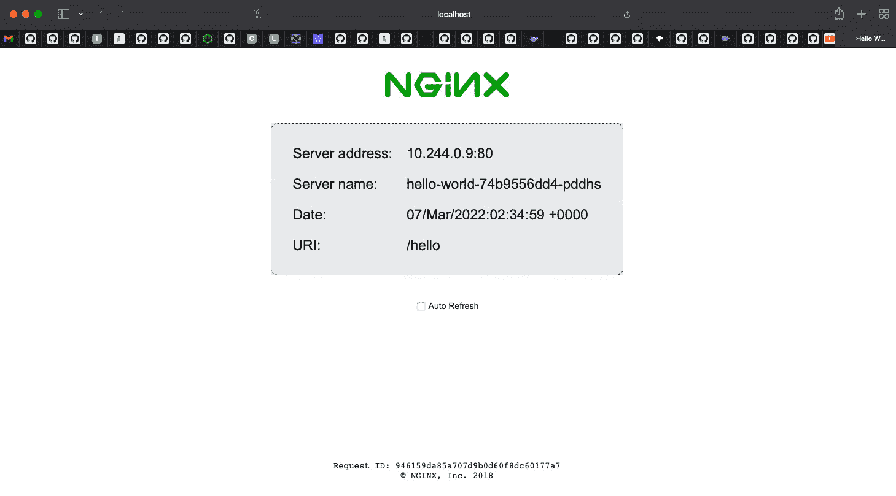
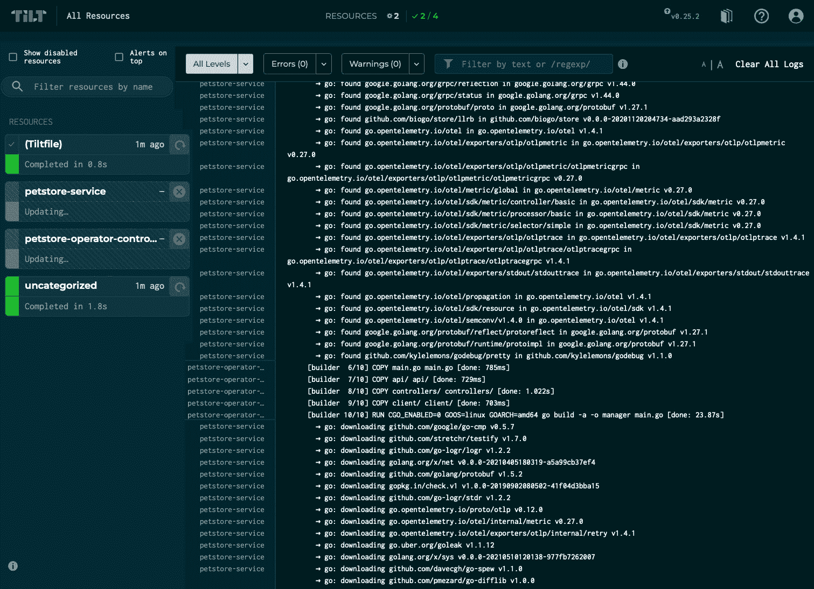

# 第十四章：在 Kubernetes 中部署和构建应用程序

很难夸大 Kubernetes 对 DevOps 世界的影响。自从 2014 年由 Google 开源以来，Kubernetes 在这几年中经历了迅猛的流行。在此期间，Kubernetes 已经成为编排云原生容器工作负载的主要解决方案，将其与 Apache Mesos 和 Docker Swarm 等编排工具区分开来。通过在异构环境上提供统一的 API，Kubernetes 已经成为跨云和混合环境部署应用程序的通用工具。

那么，Kubernetes 究竟是什么？根据它的文档，*"Kubernetes 是一个可移植、可扩展的开源平台，用于管理容器化的工作负载和服务，既支持声明式配置也支持自动化"*（[`kubernetes.io/docs/concepts/overview/what-is-kubernetes/`](https://kubernetes.io/docs/concepts/overview/what-is-kubernetes/)）。这有很多内容需要解读。我会用不同的方式总结这一声明。Kubernetes 是一组 API 和抽象层，使得运行容器化应用程序变得更加容易。它提供了诸如服务发现、负载均衡、存储抽象与编排、自动化发布与回滚、自愈功能，以及密钥、证书和配置管理等服务。此外，如果 Kubernetes 没有直接提供你所需要的某些特定功能，可能在围绕 Kubernetes 核心构建的充满活力的开源生态系统中就有解决方案可用。Kubernetes 生态系统是一个庞大的工具集，可以帮助你实现运营目标，而无需重新发明轮子。

上述所有功能都通过 Kubernetes API 暴露出来，且具有无限的可编程性。

本章不会深入探讨 Kubernetes 的各个方面。要深入全面地探索 Kubernetes 需要多本书的内容。好消息是，关于 Kubernetes 有许多很棒的书籍：[`www.packtpub.com/catalogsearch/result?q=kubernetes`](https://www.packtpub.com/catalogsearch/result?q=kubernetes)。此外，Kubernetes 的社区驱动文档（[`kubernetes.io/docs/home/`](https://kubernetes.io/docs/home/)）是一个宝贵的资源，可以帮助你更深入地了解 Kubernetes。

本章的目标是为你使用 Go 编程 Kubernetes 提供一个起点。我们将从创建一个简单的 Go 程序开始，将 Kubernetes 资源部署到本地 Kubernetes 集群中，运行一个负载均衡的 HTTP 服务。然后，我们将学习如何通过自定义资源扩展 Kubernetes API，展示如何利用 Kubernetes 协同管理任何外部资源。我们将构建自定义的宠物资源，这些资源将存储在集群中运行的宠物商店服务中，以此说明管理外部资源的概念。通过本章学习，你将掌握有效使用 Kubernetes API 的知识，并理解 Kubernetes 的一些核心设计原则。

本章将涵盖以下主题：

+   与 Kubernetes API 交互

+   使用 Go 部署一个负载均衡的 HTTP 应用

+   使用自定义资源和操作员扩展 Kubernetes

+   构建一个宠物商店操作员

# 技术要求

本章将需要以下工具：

+   Docker: [`docs.docker.com/get-docker/`](https://docs.docker.com/get-docker/)

+   KinD: [`kind.sigs.k8s.io/#installation-and-usage`](https://kind.sigs.k8s.io/#installation-and-usage)

+   operator-sdk: [`sdk.operatorframework.io/docs/installation/`](https://sdk.operatorframework.io/docs/installation/)

+   Tilt.dev: [`docs.tilt.dev/install.html`](https://docs.tilt.dev/install.html)

+   ctlptl: [`github.com/tilt-dev/ctlptl#how-do-i-install-it`](https://github.com/tilt-dev/ctlptl#how-do-i-install-it)

本章的代码文件可以从 [`github.com/PacktPublishing/Go-for-DevOps/tree/rev0/chapter/14`](https://github.com/PacktPublishing/Go-for-DevOps/tree/rev0/chapter/14) 下载

# 与 Kubernetes API 交互

在介绍中，我们将 Kubernetes API 当作一个整体进行讨论，尽管从某种意义上讲，它确实可以被这样理解。然而，我们一直在讨论的 Kubernetes API 实际上是由 Kubernetes 核心部分——控制平面 API 服务器提供的多个 API 的聚合。API 服务器暴露了一个 HTTP API，公开了聚合后的 API，并允许查询和操作如 Pods、Deployments、Services 和 Namespaces 等 API 对象。

在本节中，我们将学习如何使用 KinD 创建一个本地集群。我们将使用本地集群通过 `kubectl` 操作一个命名空间资源。我们将研究 Kubernetes 资源的基本结构，并查看如何通过它们的 Group、Version、Kind、Name，通常还有 Namespace，来定位单个资源。最后，我们将讨论身份验证和 `kubeconfig` 文件。本节将为我们通过 Go 在更低层次上与 Kubernetes API 进行交互做准备。

## 创建一个 KinD 集群

在开始与 Kubernetes API 交互之前，让我们使用**KinD**构建一个本地 Kubernetes 集群。这是一个工具，允许我们通过 Docker 在本地创建 Kubernetes 集群，而不是作为主机上的服务运行。要创建集群，请运行以下命令：

```
$ kind create cluster
```

上述命令将创建一个名为`kind`的集群。它将构建一个 Kubernetes 控制平面，并将`kubectl`的当前上下文设置为指向新创建的集群。

你可以通过运行以下命令列出`kind`创建的集群：

```
$ kind get clusters
kind
```

从`get clusters`的输出中可以看到，创建了一个名为`kind`的新集群。

## 使用 kubectl 与 API 交互

Kubernetes 提供了一个命令行工具用于与 API 交互，即`kubectl`。`kubectl`提供了一些很好的开发者体验功能，但其主要用途是执行`kubectl`操作：

```
$ kubectl create namespace petstore
```

上述命令创建了一个名为`petstore`的命名空间：

```
$ cat <<EOF | kubectl create -f -
apiVersion: v1
kind: Namespace
metadata:
  name: petstore
EOF
```

上述命令通过内联 YAML 文档创建了相同的命名空间。接下来，让我们使用`kubectl`获取该命名空间的 YAML 文件：

```
$ kubectl get namespace petstore -o yaml
apiVersion: v1
kind: Namespace
metadata:
  creationTimestamp: "2022-03-06T15:55:09Z"
  labels:
    kubernetes.io/metadata.name: petstore
  name: petstore
  resourceVersion: "2162"
  uid: cddb2eb8-9c46-4089-9c99-e31259dfcd1c
spec:
  finalizers:
  - kubernetes
status:
  phase: Active
```

上述命令获取了`petstore`命名空间并以`.yaml`格式输出了整个资源。请特别注意顶级键`apiVersion`、`kind`、`metadata`、`spec`和`status`。这些键中的值和结构在 Kubernetes 中的所有资源中都是通用的。

### 分组版本种类（GVK）命名空间名称

在 Kubernetes API 中，你可以通过其分组、种类、版本、名称以及通常的命名空间的组合来标识任何资源。我说“通常的命名空间”是因为并非所有资源都属于命名空间。命名空间是存在于命名空间之外的资源的一个例子（还有其他低级资源，如节点和持久卷）。然而，大多数其他资源，如 Pods、Services 和 Deployments，存在于命名空间中。在前一部分中提到的命名空间示例中，分组被省略了，因为它位于 Kubernetes 核心 API 中，并由 API 服务器假定。实际上，`petstore`命名空间的标识符是`apiVersion: v1`、`kind: Namespace`和`metadata.name: petstore`。

内化组、版本、种类、命名空间和名称的概念。这对于理解如何与 Kubernetes API 交互至关重要。

### `spec`和`status`部分

Kubernetes 中的每个资源都有`spec`和`status`部分。资源的`spec`部分是描述资源期望状态的结构。Kubernetes 的任务是将系统的状态调整为该期望状态。在某些情况下，`spec`会描述外部系统的期望状态。例如，`spec`可以描述一个负载均衡器，包括期望的外部 IP。该资源的调和器将负责创建网络接口并设置路由，以确保 IP 路由到该特定的网络接口。

`status`部分是资源的一个结构，描述了资源的当前状态。它应该由 Kubernetes 进行修改，而不是由用户修改。例如，Deployment 的`status`包含给定 Deployment 的就绪副本数量。Deployment 的`spec`将包含所需的副本数。Kubernetes 的任务是朝着所需状态推进，并用资源的当前状态更新`status`。

随着本章的深入，我们将更多地了解`spec`和`status`。

### 身份验证

到目前为止，我们只是假设能够访问 Kubernetes 集群，但实际上这一点是由`kind`处理的，它能为`kubectl`设置默认上下文。`kubectl`的默认上下文存储在你的主目录中。你可以通过运行以下命令查看已设置的上下文：

```
$ cat ~/.kube/config
apiVersion: v1
clusters:
- cluster:
    certificate-authority-data:
    server: https://127.0.0.1:55451
  name: kind-kind
contexts:
- context:
    cluster: kind-kind
    user: kind-kind
  name: kind-kind
current-context: kind-kind
kind: Config
preferences: {}
users:
- name: kind-kind
  user:
    client-certificate-data:
    client-key-data:
```

在上面的输出中，我省略了证书数据，以便提供更简洁的配置视图。它包含了我们建立与本地集群实例的安全连接所需的所有信息。请注意服务的地址、集群的名称以及用户的名称。

通过运行以下命令，我们可以获得`kind`集群的`kubeconfig`：

```
$ kind get kubeconfig --name kind > .tmp-kubeconfig
```

如果你`cat`该文件的内容，你会看到`~/.kube/config`中有一个非常相似的结构。`kubeconfig`文件是一个便捷的方式，用来封装与 API 服务器进行身份验证所需的信息，并与 Kubernetes 生态系统中的许多工具一起使用。例如，你可以通过以下命令覆盖`kubectl`的上下文，使用不同的`kubeconfig`：

```
$ KUBECONFIG=./.tmp-kubeconfig kubectl get namespaces
```

上述命令将列出`kind`集群中的所有命名空间，但它将使用我们刚刚创建的本地`kubeconfig`文件。

有多种工具可以用来管理你所使用的集群。其中一个很棒的例子是 Ahmet Alp Balkan 的`kubectx`（[`ahmet.im/blog/kubectx/`](https://ahmet.im/blog/kubectx/)），它可以帮助你流畅地管理多个集群。正如我之前提到的，充满活力的开源生态系统提供了各种各样的工具，让你使用 Kubernetes 的体验更加愉快。

最后，让我们清理`petstore`命名空间并删除我们的`kind`集群：

```
$ kubectl delete namespace petstore
$ kind delete cluster --name kind
```

在这一部分，我们学习了与 Kubernetes API 交互的基础知识以及 Kubernetes 资源的基本结构。我们能够创建本地的 Kubernetes 体验，并且已经准备好使用 Go 来构建与 Kubernetes 交互的应用程序。

在下一部分，我们将利用我们所学的 Kubernetes API 知识，构建一个 Go 应用程序，用于部署一个负载均衡的 HTTP 应用。

# 使用 Go 部署一个负载均衡的 HTTP 应用程序

现在我们对 Kubernetes API 及其暴露的资源有了更深入的了解，可以开始从`kubectl`转向使用 Go。

在本节中，我们将使用 Go 完成许多在上一节中使用`kubectl`做的相同操作。我们将使用默认上下文进行身份验证，并创建一个命名空间。然而，我们不会停在那里。我们将向集群部署一个负载均衡的 HTTP 应用程序，并在向服务发送请求时，查看日志如何流式输出到 STDOUT。

本节的代码可以在[`github.com/PacktPublishing/Go-for-DevOps/tree/rev0/chapter/14/workloads`](https://github.com/PacktPublishing/Go-for-DevOps/tree/rev0/chapter/14/workloads)找到。我们接下来要讲解的示例可以通过以下命令执行：

```
$ kind create cluster --name workloads --config kind-config.yaml
$ kubectl apply -f https://raw.githubusercontent.com/kubernetes/ingress-nginx/main/deploy/static/provider/kind/deploy.yaml
$ kubectl wait --namespace ingress-nginx \
  --for=condition=ready pod \
  --selector=app.kubernetes.io/component=controller \
  --timeout=90s
$ go run .
```

前面的命令将创建一个名为`workloads`的 KinD 集群，并使用一个配置文件来启用集群的主机网络入口。我们将使用入口来公开运行在集群中的服务，地址是`localhost:port`。然后，命令将部署 NGINX 入口控制器，并等待它准备就绪。最后，我们运行 Go 程序来部署我们的应用程序。在服务部署并运行后，打开浏览器并访问`http://localhost:8080/hello`。你应该会看到如下内容：



图 14.1 – 部署的 NGINX hello world

你应该能够看到请求日志流输出到 STDOUT。它们应该如下所示：

```
10.244.0.7 - - [07/Mar/2022:02:34:59 +0000] "GET /hello HTTP/1.1" 200 7252 "-" "Mozilla/5.0 (Macintosh; Intel Mac OS X 10_15_7) AppleWebKit/605.1.15 (KHTML, like Gecko) Version/15.3 Safari/605.1.15" "172.22.0.1"
```

如果你刷新页面，你应该看到服务器名称变化，表明请求正在跨部署中的两个 Pod 副本进行负载均衡。按*Ctrl* + *C*来终止 Go 程序。

要销毁集群，请运行以下命令：

```
$ kind delete cluster --name workloads
```

前面的命令将删除名为`workloads`的`kind`集群。接下来，让我们探索这个 Go 应用程序，了解刚刚发生了什么。

## 一切从`main`开始

让我们直接进入代码，看看这个 Go 程序到底在做什么：

```
func main() {
     ctx, cancel := context.WithCancel(context.Background())
     defer cancel()
     clientSet := getClientSet()
     nsFoo := createNamespace(ctx, clientSet, "foo")
     defer func() {
          deleteNamespace(ctx, clientSet, nsFoo)
     }()
     deployNginx(ctx, clientSet, nsFoo, "hello-world")
     fmt.Printf("You can now see your running service: http://localhost:8080/hello\n\n")
     listenToPodLogs(ctx, clientSet, nsFoo, "hello-world")
     // wait for ctrl-c to exit the program
     waitForExitSignal()
}
```

在前面的代码中，我们建立了一个从背景上下文派生的上下文。在这个场景中，这基本上没有什么效果，但如果你需要取消一个正在运行时间过长的请求，它将是一个非常强大的工具。接下来，我们创建了`clientSet`，它是一个强类型的客户端，用来与 Kubernetes API 进行交互。然后我们在`createNamespace`、`deployNginx`和`listenToPodLogs`中使用了`clientSet`。最后，我们等待一个信号来终止程序。就这样！

接下来，让我们深入探讨每个函数，从`getClientSet`开始。

## 创建 ClientSet

让我们看看`getClientSet`：

```
func getClientSet() *kubernetes.Clientset {
	var kubeconfig *string
	if home := homedir.HomeDir(); home != "" {
		kubeconfig = flag.String(
			"kubeconfig",
			filepath.Join(home, ".kube", "config"),
			"(optional) absolute path to the kubeconfig file",
		)
	} else {
		kubeconfig = flag.String(
			"kubeconfig",
			"",
			"absolute path to the kubeconfig file",
		)
	}
	flag.Parse()
	// use the current context in kubeconfig
	config, err := clientcmd.BuildConfigFromFlags(
		"",
		*kubeconfig,
	)
	panicIfError(err)

	// create the clientSet
	cs, err := kubernetes.NewForConfig(config)
	panicIfError(err)
	return cs
}
```

在前面的代码中，你可以看到我们构建了标志绑定，用来使用现有的`~/.kube/config`上下文，或者通过绝对文件路径接受`kubeconfig`文件。然后，我们使用这个标志或默认值构建配置。接着，这个配置被用来创建`*kubernetes.ClientSet`。正如我们在`kubectl`部分所学到的，`kubeconfig`包含了我们连接和认证服务器所需的所有信息。现在我们有了一个客户端，准备与 Kubernetes 集群进行交互。

接下来，让我们看看 `ClientSet` 的实际操作。

## 创建一个命名空间

现在我们有了一个 `ClientSet`，可以用它来创建我们需要部署的资源，以运行负载均衡的 HTTP 应用程序。我们来看看 `createNamespace`：

```
func createNamespace(
	ctx context.Context,
	clientSet *kubernetes.Clientset,
	name string,
) *corev1.Namespace {
	fmt.Printf("Creating namespace %q.\n\n", name)
	ns := &corev1.Namespace{
		ObjectMeta: metav1.ObjectMeta{
			Name: name,
		},
	}
	ns, err := clientSet.CoreV1().
		Namespaces().
		Create(ctx, ns, metav1.CreateOptions{})
	panicIfError(err)
	return ns
}
```

在上述代码中，我们构建了一个 `corev1.Namespace` 结构体，在 `ObjectMeta` 字段中提供名称。如果你还记得我们之前使用 `kubectl` 创建命名空间的 YAML 示例，这个字段对应的是 `metadata.name`。Kubernetes 资源的 Go 结构与它们的 YAML 表现非常接近。最后，我们使用 `clientSet` 通过 Kubernetes API 服务器创建命名空间并返回命名空间。`metav1.CreateOptions` 包含一些选项，用于更改 `create` 操作的行为，但我们在本书中不会探讨这个结构。

我们现在已经创建了用于部署应用程序的命名空间。接下来，让我们看看如何部署应用程序。

## 将应用程序部署到命名空间中

现在我们已经创建了 `clientSet` 和命名空间，准备好部署将代表我们应用程序的资源。我们来看看 `deployNginx` 函数：

```
func deployNginx(
	ctx context.Context,
	clientSet *kubernetes.Clientset,
	ns *corev1.Namespace,
	name string,
) {
	deployment := createNginxDeployment(
		ctx,
		clientSet,
		ns,
		name,
	)
	waitForReadyReplicas(ctx, clientSet, deployment)
	createNginxService(ctx, clientSet, ns, name)
	createNginxIngress(ctx, clientSet, ns, name)
}
```

在上述代码中，我们创建了 NGINX 部署资源，并等待部署的副本准备就绪。部署就绪后，代码创建了服务资源，以便在部署中的 pods 之间进行负载均衡。最后，我们创建了 ingress 资源，以便在本地主机端口上公开该服务。

接下来，让我们查看这些函数，了解它们在做什么。

## 创建 NGINX 部署

部署应用程序的第一个函数是 `createNginxDeployment`：

```
func createNginxDeployment(
	ctx context.Context,
	clientSet *kubernetes.Clientset,
	ns *corev1.Namespace,
	name string,
) *appv1.Deployment {
	var (
		matchLabel = map[string]string{"app": "nginx"}
		objMeta    = metav1.ObjectMeta{
			Name:      name,
			Namespace: ns.Name,
			Labels:    matchLabel,
		}
            [...]
	)
	deployment := &appv1.Deployment{
		ObjectMeta: objMeta,
		Spec: appv1.DeploymentSpec{
			Replicas: to.Int32Ptr(2),
			Selector: &metav1.LabelSelector{
				MatchLabels: matchLabel,
			},
			Template: template,
		},
	}
	deployment, err := clientSet.
		AppsV1().
		Deployments(ns.Name).
		Create(ctx, deployment, metav1.CreateOptions{})
	panicIfError(err)
	return deployment
}
```

上述代码初始化了 `matchLabel`，它是一个键值对，将用于将 Deployment 与 Service 连接。我们还为 Deployment 资源初始化了 `ObjectMeta`，使用命名空间和 `matchLabel`。接下来，我们构建了一个包含规范的 Deployment 结构，期望有两个副本，使用我们之前构建的 `matchLabel` 的 `LabelSelector`，并且有一个 Pod 模板，运行一个容器，使用 `nginxdemos/hello:latest` 镜像，并在容器上暴露端口 `80`。最后，我们创建了部署，指定了命名空间和我们构建的 Deployment 结构。

现在我们已经创建了 Deployment，让我们看看如何等待 Deployment 中的 pods 变为就绪状态。

## 等待准备就绪的副本与期望副本匹配

当创建一个 Deployment 时，需要为每个副本创建 pod，并使其开始运行，才能处理请求。我们编写的 Kubernetes 或 API 请求并没有要求我们等待这些 pods。这只是为了提供一些用户反馈，并展示资源状态部分的用法。我们来看看如何等待 Deployment 的状态与期望的状态匹配：

```
func waitForReadyReplicas(
	ctx context.Context,
	clientSet *kubernetes.Clientset,
	deployment *appv1.Deployment,
) {
	fmt.Printf("Waiting for ready replicas in: %q\n", deployment.Name)
	for {
		expectedReplicas := *deployment.Spec.Replicas
		readyReplicas := getReadyReplicasForDeployment(
			ctx,
			clientSet,
			deployment,
		)
		if readyReplicas == expectedReplicas {
			fmt.Printf("replicas are ready!\n\n")
			return
		}
		fmt.Printf("replicas are not ready yet. %d/%d\n",
			readyReplicas, expectedReplicas)
		time.Sleep(1 * time.Second)
	}
}
func getReadyReplicasForDeployment(
	ctx context.Context,
	clientSet *kubernetes.Clientset,
	deployment *appv1.Deployment,
) int32 {
	dep, err := clientSet.
		AppsV1().
		Deployments(deployment.Namespace).
		Get(ctx, deployment.Name, metav1.GetOptions{})
	panicIfError(err)
	return dep.Status.ReadyReplicas
}
```

在前面的代码中，我们通过循环检查期望的副本数是否与就绪副本数匹配，若匹配则返回。如果不匹配，则等待一秒钟再试。这个代码并不非常健壮，但它展示了 Kubernetes 操作的目标导向性质。

现在我们已经有了一个正在运行的部署，我们可以构建一个 Service，以在部署中的 Pods 之间进行负载均衡。

## 创建用于负载均衡的 Service

部署中的两个 Pod 副本现在在`80`端口运行 NGINX 演示，但每个副本都有自己的接口。我们可以将流量定向到每个副本，但更方便的方法是定向到一个地址并进行负载均衡请求。让我们创建一个 Service 资源来实现这一点：

```
func createNginxService(
	ctx context.Context,
	clientSet *kubernetes.Clientset,
	ns *corev1.Namespace,
	name string,
) {
	var (
		matchLabel = map[string]string{"app": "nginx"}
		objMeta    = metav1.ObjectMeta{
			Name:      name,
			Namespace: ns.Name,
			Labels:    matchLabel,
		}
	)
	service := &corev1.Service{
		ObjectMeta: objMeta,
		Spec: corev1.ServiceSpec{
			Selector: matchLabel,
			Ports: []corev1.ServicePort{
				{
					Port:     80,
					Protocol: corev1.ProtocolTCP,
					Name:     "http",
				},
			},
		},
	}
	service, err := clientSet.
		CoreV1().
		Services(ns.Name).
		Create(ctx, service, metav1.CreateOptions{})
	panicIfError(err)
}
```

在前面的代码中，我们初始化了与部署中相同的`matchLabel`和`ObjectMeta`。然而，我们并没有创建一个 Deployment 资源，而是创建了一个 Service 资源结构，指定了要匹配的 Selector 和要暴露的**传输控制协议**（**TCP**）端口。Selector 标签是确保负载均衡器的后端池中包含正确 Pods 的关键。最后，我们像其他 Kubernetes 资源一样创建了 Service。

我们只剩下一步了。我们需要通过入口来暴露我们的服务，这样我们就可以通过本地机器上的端口将流量发送到集群中。

## 创建入口以在本地主机端口暴露我们的应用程序

此时，我们无法通过`localhost:port`访问我们的服务。我们可以通过`kubectl`将流量转发到集群中，但这个部分留给你自己探索。接下来我们将创建一个入口并在本地主机网络上打开一个端口。让我们来看一下如何创建入口资源：

```
func createNginxIngress(
	ctx context.Context,
	clientSet *kubernetes.Clientset,
	ns *corev1.Namespace,
	name string,
) {
	var (
		prefix  = netv1.PathTypePrefix
		objMeta = metav1.ObjectMeta{
			Name:      name,
			Namespace: ns.Name,
		}
		ingressPath = netv1.HTTPIngressPath{
			PathType: &prefix,
			Path:     "/hello",
			Backend: netv1.IngressBackend{
				Service: &netv1.IngressServiceBackend{
					Name: name,
					Port: netv1.ServiceBackendPort{
						Name: "http",
					},
				},
			},
		}
	ingress := &netv1.Ingress{
		ObjectMeta: objMeta,
		Spec: netv1.IngressSpec{
			Rules: rules,
		},
	}
	ingress, err := clientSet.
		NetworkingV1().
		Ingresses(ns.Name).
		Create(ctx, ingress, metav1.CreateOptions{})
	panicIfError(err)
}
```

在前面的代码中，我们初始化了一个前缀，与之前相同的`objMeta`，以及`ingressPath`，它将路径前缀`/hello`映射到我们创建的服务名和端口名。是的，Kubernetes 为我们做了将网络连接起来的“魔法”！接下来，我们按照之前结构的方式构建 Ingress 结构，并使用`clientSet`创建入口。通过这最后一步，我们使用 Go 和 Kubernetes API 部署了整个应用程序堆栈。

接下来，让我们回到`main.go`，看看如何使用 Kubernetes 流式传输 Pods 的日志，展示程序运行时的 HTTP 请求。

## 为 NGINX 应用程序流式传输 Pod 日志

Kubernetes API 提供了许多出色的功能来运行工作负载。其中最基础和最有用的功能之一就是能够访问正在运行的 Pods 的日志。让我们来看一下如何将多个运行中的 Pods 的日志流式传输到 STDOUT：

```
func listenToPodLogs(
	ctx context.Context,
	clientSet *kubernetes.Clientset,
	ns *corev1.Namespace,
	containerName string,
) {
	// list all the pods in namespace foo
	podList := listPods(ctx, clientSet, ns)
	for _, pod := range podList.Items {
		podName := pod.Name
		go func() {
			opts := &corev1.PodLogOptions{
				Container: containerName,
				Follow:    true,
			}
			podLogs, err := clientSet.
				CoreV1().
				Pods(ns.Name).
				GetLogs(podName, opts).
				Stream(ctx)
			panicIfError(err)
			_, _ = os.Stdout.ReadFrom(podLogs)
		}()
	}
}
func listPods(
	ctx context.Context,
	clientSet *kubernetes.Clientset,
	ns *corev1.Namespace,
) *corev1.PodList {
	podList, err := clientSet.
		CoreV1().
		Pods(ns.Name).
		List(ctx, metav1.ListOptions{})
	panicIfError(err)
	/* omitted some logging for brevity */
	return podList
}
```

在前面的代码中，`listenToPodLogs` 列出了给定命名空间中的 pods，然后为每个 pod 启动了 `go func`。在 `go func` 中，我们使用 Kubernetes API 请求一个 `podLogs` 的流，它返回一个 `io.ReadCloser`，可以从 pod 中实时读取日志。然后我们告诉 STDOUT 从这个管道中读取，日志就会被输出到我们的 STDOUT。

如果你认为从正在运行的工作负载中获取日志会比这更困难，我想你不会是唯一一个这样想的人。Kubernetes 确实非常复杂，但由于一切都以 API 的形式暴露出来，这使得该平台极其灵活和可编程。

我们已经探索了除了 `waitForExitSignal` 的所有功能，这个功能相对简单，并没有为此处讲述的 Kubernetes 相关内容增添什么。如果你想了解它，可以参考源代码仓库。

通过这个使用 Kubernetes API 来以 Go 编程方式部署应用的示例，我希望你能从中获得一种力量感，去学习、构建，并且在与 Kubernetes API 交互时感到相对舒适。Kubernetes API 的内容远不止这些，而且它还在不断发展。事实上，在接下来的部分，我们将开始讨论如何通过自定义资源扩展 Kubernetes API。

# 扩展 Kubernetes 与自定义资源和操作符

在前面的部分，我们已经了解到 Kubernetes API 不仅仅是一个单一的 API，而是由一系列聚合的 API 组成，这些 API 由名为 **操作符** 和 **控制器** 的协作服务支持。操作符是对 Kubernetes 的扩展，它们利用自定义资源通过控制器来管理系统和应用。控制器是操作符的组件，执行某种资源的控制循环。自定义资源的控制循环是一个迭代过程，它观察资源的期望状态，并可能通过多个循环来推动系统状态朝着期望的状态发展。

之前的句子比较抽象。我喜欢换个方式总结。Kubernetes 是一个自动化平台。自动化是一系列步骤和决策树，驱动实现最终目标。我喜欢以类似的方式看待操作符。我认为编写操作符就像是将一份操作手册——人类完成操作活动的步骤——转化为让计算机执行的自动化。操作符和控制器就像是将操作知识结晶成代码，在 Kubernetes 中运行。

自定义资源可以表示任何内容。它们可以是与 Kubernetes 资源相关的事物，也可以是完全与 Kubernetes 无关的外部事物。举个例子，关于集群工作负载的自定义资源，在*第九章*，*使用 OpenTelemetry 进行可观察性*中，我们讨论了 OTel 收集器并通过其容器镜像在 `docker-compose` 中部署它，但我们也可以使用 Kubernetes 操作器来做同样的事情，在 Kubernetes 集群中运行它。OTel 操作器暴露了一个自定义资源，像下面这样：

```
apiVersion: opentelemetry.io/v1alpha1
kind: OpenTelemetryCollector
metadata:
  name: simplest
spec:
  config: |
    receivers:
      otlp:
        protocols:
          grpc:
          http:
    processors:
    exporters:
      logging:
    service:
      pipelines:
        traces:
          receivers: [otlp]
          processors: []
          exporters: [logging]
```

在前面的代码块中，我们看到一个自定义资源，描述了来自 [`github.com/open-telemetry/opentelemetry-operator`](https://github.com/open-telemetry/opentelemetry-operator) 的 OTel 收集器。这个自定义资源以特定领域的语言描述了 OpenTelemetry 操作器应该如何配置和运行 OpenTelemetry 收集器。然而，一个自定义资源也可以像我们在下一部分看到的那样，轻松表示一个自定义的 `Pet` 资源，用于表示宠物店中的宠物。

你还记得如何识别前述资源的组、版本、类型、命名空间和名称吗？答案是 `group: opentelemetry.io`、`version: v1alpha1`、`kind: OpenTelemetryCollector`、`namespace: default` 和 `name: simplest`。

在这一部分，我想强调的是，如果有人去除掉 Pods、节点、存储、网络以及 Kubernetes 容器工作负载调度的其他部分，只剩下 Kubernetes API 服务器，它仍然会是一个极其有用的软件。在这一部分，我们将介绍一些关于操作器、**自定义资源定义**（**CRDs**）、控制器以及 Kubernetes API 服务器强大功能的背景知识。我们无法深入覆盖所有内容，但这次概览将有助于我们实现第一个操作器，并希望能激励你深入学习如何扩展 Kubernetes API。

## 自定义资源定义

CRDs 是可以应用于 Kubernetes 集群的资源，用于为自定义资源创建新的 RESTful 资源路径。让我们来看一下 Kubernetes 文档中关于 CronJob 的示例：[`kubernetes.io/docs/tasks/extend-kubernetes/custom-resources/custom-resource-definitions/#create-a-customresourcedefinition`](https://kubernetes.io/docs/tasks/extend-kubernetes/custom-resources/custom-resource-definitions/#create-a-customresourcedefinition)。

```
apiVersion: apiextensions.k8s.io/v1
kind: CustomResourceDefinition
metadata:
  # name must be in the form: <plural>.<group>
  name: crontabs.stable.example.com
spec:
  # group name to use for REST API: /apis/<group>/<version>
  group: stable.example.com
  # list of versions supported by this CustomResourceDefinition
  versions:
    - name: v1
      # Each version can be enabled/disabled by Served flag.
      served: true
      # only one version must be marked as the storage version.
      storage: true
      schema:
        openAPIV3Schema:
          type: object
          properties:
            spec:
              type: object
              properties:
                cronSpec:
                  type: string
                image:
                  type: string
                replicas:
                  type: integer
  # either Namespaced or Cluster
  scope: Namespaced
  names:
    plural: crontabs
    singular: crontab
    kind: CronTab
    shortNames:
    - ct
```

正如你从之前的 YAML 中看到的，CRD 被指定为 Kubernetes 中的任何资源。CRD 资源有`group`、`version`、`kind`和`name`，但在`spec`中，你可以看到描述新资源类型的元数据，并使用 OpenAPI V3 来描述模式。同样，注意到 spec 包含了自定义资源的 group、version 和 kind。如 YAML 结构所示，自定义资源可以在任何给定时间提供多个版本，但只能有一个版本标记为存储版本。

在下一节中，我们将讨论 Kubernetes 如何能够仅存储一个版本但提供多个版本。

### 自定义资源版本管理和转换

如前节所述，Kubernetes 仅存储资源的一个版本。资源的新版本通常在资源的模式发生变化时引入——例如，添加了一个新字段或对模式进行了其他变更。在这种情况下，Kubernetes 需要某种方法来在资源版本之间进行转换。Kubernetes 的做法是使用转换 Webhook。这意味着你可以注册一个 Webhook，将资源的存储版本转换为请求的版本。这形成了一个中心和分支模型，其中中心是存储版本，分支是其他受支持的版本。你可以在 Kubernetes 文档中看到一个示例：[`kubernetes.io/docs/tasks/extend-kubernetes/custom-resources/custom-resource-definition-versioning/#configure-customresourcedefinition-to-use-conversion-webhooks`](https://kubernetes.io/docs/tasks/extend-kubernetes/custom-resources/custom-resource-definition-versioning/#configure-customresourcedefinition-to-use-conversion-webhooks)。

稍微消化一下这个概念。这是任何 API 平台都应该提供的强大功能。拥有一种标准化的方法来将一个 API 版本转换为另一个版本，使得在微服务环境中更容易平滑地采用组件。

### 结构化模式、验证和默认值

正如我们在前面的 CronJob CRD 规格示例中看到的，我们可以使用 OpenAPI 来描述资源的强类型模式。这对于为需要与 API 交互的编程语言生成 API 客户端非常有益。此外，我们还可以描述各种验证，以确保资源的结构和值的各个方面。例如，我们可以描述哪些字段是必需的，值的有效范围，字符串的有效模式，以及结构和值的许多其他方面。此外，我们还可以为字段提供默认值并在模式中指定它们。

除了架构之外，API 服务器还暴露了验证和变更的 Webhooks，这些 Webhooks 可以填补架构失败的空白——例如，如果你想基于某些超出架构范围的逻辑来验证或更改资源。这些 Webhooks 可以被用来改善开发者在使用自定义资源时的体验，比起接受可能无效的资源，或者默认某些难以计算的值，从而避免用户需要提供这些值。

## 控制器

协调的核心是控制器，它为特定资源类型执行控制循环。控制器监视 Kubernetes API 中的资源类型，并注意到资源发生了变化。控制器接收到资源的新版本，观察期望的状态，观察它控制的系统的当前状态，并试图推进系统状态朝着资源中表达的期望状态发生变化。控制器并不是根据资源版本之间的差异来操作，而是根据当前的期望状态进行操作。我注意到，对于新接触控制器开发的人来说，通常会倾向于只考虑基于两个资源版本之间的差异来行动，但这并不推荐。

通常，控制器能够并发地协调多个资源，但永远不会并发地协调相同的资源。这简化了协调模型的实现。

此外，大多数控制器一次只会有一个领导者。例如，如果有两个操作符实例在运行，只有一个会成为领导者，另一个则处于空闲状态，等待当另一个进程崩溃时成为领导者。

## 站在巨人的肩膀上

我相信这听起来非常复杂，实际上也确实如此。然而，我们可以幸运地依赖一些开创性的项目，这些项目使得构建操作符、控制器和 CRD 变得更加容易。Kubernetes 操作符有着一个充满活力且日益壮大的生态系统。

在下一节中，我们将依赖的项目包括 `controller-runtime` ([`github.com/kubernetes-sigs/controller-runtime`](https://github.com/kubernetes-sigs/controller-runtime))，`kubebuilder` ([`github.com/kubernetes-sigs/kubebuilder`](https://github.com/kubernetes-sigs/kubebuilder)) 和 `operator-sdk` ([`github.com/operator-framework/operator-sdk`](https://github.com/operator-framework/operator-sdk))。`controller-runtime` 提供了一组 Go 库，使得构建控制器更加简单，且在 `kubebuilder` 和 `operator-sdk` 中都有使用。`kubebuilder` 是一个用于构建 Kubernetes API 的框架，提供了一套工具，可以轻松生成 API 结构、控制器和 Kubernetes API 相关的清单。`operator-sdk` 是操作员框架 ([`github.com/operator-framework`](https://github.com/operator-framework)) 的一个组件，它扩展自 `kubebuilder`，并试图解决操作员开发者面临的生命周期、发布和其他更高层次的问题。

如果你对一个雄心勃勃的项目感兴趣，想要扩展 Kubernetes API 来创建声明式集群基础设施，并使 Kubernetes 能够构建新的 Kubernetes 集群，我鼓励你查看 Cluster API ([`github.com/kubernetes-sigs/cluster-api`](https://github.com/kubernetes-sigs/cluster-api))。

我希望本节内容让你对 Kubernetes API 的强大功能感到惊叹，并激发你想要进一步学习的兴趣。我相信我们已经涵盖了扩展 Kubernetes API 的基础知识，因此我们可以毫不费力地着手构建自己的协调器。在接下来的章节中，我们将使用 `operator-sdk` 来构建一个 `Pet` 资源和操作员，以协调宠物商店服务中的宠物。

# 构建一个宠物商店操作员

本节中，我们将基于上一节中关于 CRD、操作员和控制器的背景信息，来实现我们自己的操作员。该操作员将只有一个 CRD，`Pet`，并且只有一个控制器来协调这些 `Pet` 资源。`Pet` 的期望状态将与我们在前几章中使用的宠物商店服务进行协调。

正如我们在上一节中讨论的，这将是一个使用 Kubernetes 控制循环来协调一个与 Kubernetes 中其他资源无依赖关系的资源状态的示例。记住，你可以在 CRD 中建模任何内容，并使用 Kubernetes 作为构建任何类型资源的强大 API 的工具。

在本节中，你将学习如何从头开始构建一个操作符。你将定义一个新的 CRD 和控制器。你将研究构建工具和不同的代码生成工具，用于消除大部分的模板代码。你将把控制器和宠物商店服务部署到本地的`kind`集群，并学习如何使用`Tilt.dev`实现更快的内循环开发周期。此仓库的代码位于[`github.com/PacktPublishing/Go-for-DevOps/tree/rev0/chapter/14/petstore-operator`](https://github.com/PacktPublishing/Go-for-DevOps/tree/rev0/chapter/14/petstore-operator)。

## 初始化新操作符

在本节中，我们将使用`operator-sdk`命令行工具初始化新的操作符。这将用于为我们的操作符搭建项目结构：

```
$ operator-sdk init --domain example.com --repo github.com/Go-for-DevOps/chapter/14/petstore-operator
Writing kustomize manifests for you to edit...
Writing scaffold for you to edit...
Get controller runtime:
$ go get sigs.k8s.io/controller-runtime@v0.11.0
Update dependencies:
$ go mod tidy
Next: define a resource with:
$ operator-sdk create api
```

通过执行前面的命令，`operator-sdk`将使用一个示例域来搭建一个新的操作符项目，这将形成我们未来 CRD 的组名后缀。`–repo`标志基于书本代码的仓库，但你应该希望它反映你项目的仓库路径，或者省略它并让它使用默认值。让我们在搭建之后看看仓库中有什么：

```
$ ls -al
total 368
-rw-------  1 david  staff    776 Feb 27 10:15 Dockerfile
-rw-------  1 david  staff   9884 Feb 27 10:16 Makefile
-rw-------  1 david  staff    261 Feb 27 10:16 PROJECT
drwx------  8 david  staff    256 Feb 27 10:16 config/
-rw-------  1 david  staff   3258 Feb 27 10:16 go.mod
-rw-r--r--  1 david  staff  94793 Feb 27 10:16 go.sum
drwx------  3 david  staff     96 Feb 27 10:15 hack/
-rw-------  1 david  staff   2791 Feb 27 10:15 main.go
```

前面的列表展示了项目的顶层结构。Dockerfile 包含构建控制器镜像的命令。Makefile 包含各种有用的任务；然而，在本教程中我们不会多加使用它。`PROJECT`文件包含关于操作符的元数据。`config`目录包含描述和部署操作符及 CRD 到 Kubernetes 所需的清单。`hack`目录包含一个模板许可头，将被添加到生成的文件中，它是放置有用的开发或构建脚本的好地方。其余的文件只是常规的 Go 应用程序代码。

现在我们对为我们搭建的结构有了大致了解，可以继续生成我们的`Pet`资源和控制器：

```
$ operator-sdk create api --group petstore --version v1alpha1 --kind Pet --resource --controller
Writing kustomize manifests for you to edit...
Writing scaffold for you to edit...
api/v1alpha1/pet_types.go
controllers/pet_controller.go
Update dependencies:
$ go mod tidy
Running make:
$ make generate
go: creating new go.mod: module tmp
# ... lots of go mod output ...
Next: implement your new API and generate the manifests (e.g. CRDs,CRs) with:
$ make manifests
```

通过执行前面的命令，我已经指示`operator-sdk`在`petstore`组中创建一个新的 API，使用`Pet`种类的`v1alpha1`版本，并生成该类型的 CRD 和控制器。请注意，命令创建了`api/v1alpha1/pet_types.go`和`controllers/pet_controller.go`，然后运行了`make generate`和`make manifests`。很快，我们将看到`code`注释在这两个 Go 文件中导致`make generate`和`make manifests`生成 CRD 清单以及 Kubernetes 的**基于角色的授权控制**（**RBAC**）用于控制器。操作符的 RBAC 条目将赋予控制器对新生成的资源执行 CRUD 操作的权限。CRD 清单将包含我们新创建资源的架构。

接下来，让我们快速查看已更改的文件：

```
$ git status
M  PROJECT
A  api/v1alpha1/groupversion_info.go
A  api/v1alpha1/pet_types.go
A  api/v1alpha1/zz_generated.deepcopy.go
A  config/crd/bases/petstore.example.com_pets.yaml
A  config/crd/kustomization.yaml
A  config/crd/kustomizeconfig.yaml
A  config/crd/patches/cainjection_in_pets.yaml
A  config/crd/patches/webhook_in_pets.yaml
A  config/rbac/pet_editor_role.yaml
A  config/rbac/pet_viewer_role.yaml
A  config/samples/kustomization.yaml
A  config/samples/petstore_v1alpha1_pet.yaml
A  controllers/pet_controller.go
A  controllers/suite_test.go
M  go.mod
M  main.go
```

正如我们所见，文件进行了相当多的更改。我不会深入讨论每一项更改。最值得注意的是生成了`config/crd/bases/petstore.example.com_pets.yaml`，它包含了我们的`Pet`资源的 CRD。在运维项目中，通常将 API 中的资源描述放在`api/`目录下，Kubernetes 清单文件放在`config/`目录下，控制器放在`controllers/`目录下。

接下来，让我们看看在`api/v1alpha1/pet_types.go`中生成了什么内容：

```
// EDIT THIS FILE!  THIS IS SCAFFOLDING FOR YOU TO OWN!
// NOTE: json tags are required.  Any new fields you add must have json tags for the fields to be serialized.
// PetSpec defines the desired state of Pet
type PetSpec struct {
     // INSERT ADDITIONAL SPEC FIELDS - desired state of cluster
     // Important: Run "make" to regenerate code after modifying this file
     // Foo is an example field of Pet. Edit pet_types.go to remove/update
     Foo string `json:"foo,omitempty"`
}
// PetStatus defines the observed state of Pet
type PetStatus struct {
     // INSERT ADDITIONAL STATUS FIELD - define observed state of cluster
     // Important: Run "make" to regenerate code after modifying this file
}
```

上面的代码展示了`pet_types.go`文件中的一个代码片段。`create api`命令生成了一个包含`spec`和`status`的`Pet`资源。`PetSpec`包含一个名为`Foo`的字段，该字段会序列化为键`foo`，并且在创建或更新资源时是可选的。`status`目前为空。

请注意文件中的注释。它们指示我们在这里添加新字段到类型中，并在完成后运行`make`，以确保`config/`目录下的 CRD 清单文件得到更新。

现在，让我们来看一下文件的其余部分：

```
//+kubebuilder:object:root=true
//+kubebuilder:subresource:status
// Pet is the Schema for the pets API
type Pet struct {
     metav1.TypeMeta   `json:",inline"`
     metav1.ObjectMeta `json:"metadata,omitempty"`
     Spec   PetSpec   `json:"spec,omitempty"`
     Status PetStatus `json:"status,omitempty"`
}
//+kubebuilder:object:root=true
// PetList contains a list of Pet
type PetList struct {
     metav1.TypeMeta `json:",inline"`
     metav1.ListMeta `json:"metadata,omitempty"`
     Items           []Pet `json:"items"`
}
func init() {
     SchemeBuilder.Register(&Pet{}, &PetList{})
}
```

在这里，我们可以看到`Pet`和`PetList`的定义，它们都会在接下来的架构构建器中注册。请注意`//+kubebuilder build`注释。这些构建注释指示`kubebuilder`如何生成 CRD 清单文件。

请注意，`Pet`已经定义了带有`json`标签的`spec`和`status`，这些标签我们在之前处理过的其他 Kubernetes 资源中也见过。`Pet`还包括`TypeMeta`，它提供了 Kubernetes 的组版本种类信息，以及`ObjectMeta`，它包含了资源的名称、命名空间和其他元数据。

使用这些结构，我们已经拥有一个功能完全的自定义资源。然而，当前的资源并没有表示我们希望用来表示宠物资源的字段，因此需要更新以更好地表示我们的宠物结构。

接下来，让我们看看在`controllers/pet_controller.go`中为`PetReconciler`生成了什么内容，`PetReconciler`是运行对宠物资源进行对账的控制循环的控制器：

```
type PetReconciler struct {
     client.Client
     Scheme *runtime.Scheme
}
//+kubebuilder:rbac:groups=petstore.example.com,resources=pets,verbs=get;list;watch;create;update;patch;delete
//+kubebuilder:rbac:groups=petstore.example.com,resources=pets/status,verbs=get;update;patch
//+kubebuilder:rbac:groups=petstore.example.com,resources=pets/finalizers,verbs=update
func (r *PetReconciler) Reconcile(ctx context.Context, req ctrl.Request) (ctrl.Result, error) {
     _ = log.FromContext(ctx)
     return ctrl.Result{}, nil
}
func (r *PetReconciler) SetupWithManager(mgr ctrl.Manager) error {
     return ctrl.NewControllerManagedBy(mgr).
          For(&petstorev1alpha1.Pet{}).
          Complete(r)
}
```

在上面的代码中，我们可以看到一个`PetReconciler`类型，它嵌入了一个`client.Client`，这是一个通用的 Kubernetes API 客户端，还有一个`*runtime.Scheme`，它包含已注册的已知类型和架构。如果我们继续往下看，可以看到一系列`//+kubebuilder:rbac build`注释，它们指示代码生成器为控制器创建 RBAC 权限，以便它能够操作`Pet`资源。接下来，我们可以看到`Reconcile func`，它会在每次资源发生更改且需要与宠物商店对账时被调用。最后，我们可以看到`SetupWithManager`函数，它从`main.go`中被调用，以启动控制器并告知它和管理器控制器将会对哪个资源进行对账。

我们已经覆盖了脚手架过程中的重要变化。接下来我们可以继续实现我们的`Pet`资源，以反映宠物商店中的领域模型。我们在宠物商店中的`pet`实体有三个可变的必填属性，分别是`Name`、`Type`和`Birthday`，以及一个只读属性`ID`。我们需要将这些属性添加到我们的`Pet`资源中，以便暴露给 API：

```
// PetType is the type of the pet. For example, a dog.
// +kubebuilder:validation:Enum=dog;cat;bird;reptile
type PetType string
const (
    DogPetType     PetType = "dog"
    CatPetType     PetType = "cat"
    BirdPetType    PetType = "bird"
    ReptilePetType PetType = "reptile"
)
// PetSpec defines the desired state of Pet
type PetSpec struct {
     // Name is the name of the pet
     Name string `json:"name"`
     // Type is the type of pet Type PetType `json:"type"`
     // Birthday is the date the pet was born
     Birthday metav1.Time `json:"birthday"`
}
// PetStatus defines the observed state of Pet
type PetStatus struct {
    // ID is the unique ID for the pet
    ID string `json:"id,omitempty"`
}
```

以上是我对`Pet`所做的代码修改，目的是反映宠物商店服务的领域模型。请注意`PetType`类型前面的`// +kubebuilder:validation:Enum`注解。这是告诉 CRD 清单生成器，模式应当添加验证，确保`PetSpec`中的`Type`字段只能提供这些字符串。此外，注意`spec`中的每个字段都没有`omitempty` JSON 标签。这将告诉 CRD 清单生成器，这些字段是必填的。

`Pet`的状态只有一个`ID`字段，这个字段可以为空。它将存储从宠物商店服务返回的唯一标识符。

现在我们已经定义了我们的`Pet`，让我们在控制器循环中协调`pet`和宠物商店：

```
// Reconcile moves the current state of the pet to be the desired state described in the pet.spec.
func (r *PetReconciler) Reconcile(ctx context.Context, req ctrl.Request) (result ctrl.Result, errResult error) {
     logger := log.FromContext(ctx)
     pet := &petstorev1.Pet{}
     if err := r.Get(ctx, req.NamespacedName, pet); err != nil {
          if apierrors.IsNotFound(err) {
               logger.Info("object was not found")
               return reconcile.Result{}, nil
          }
          logger.Error(err, "failed to fetch pet from API server")
          // this will cause this pet resource to be requeued
          return ctrl.Result{}, err
     }
     helper, err := patch.NewHelper(pet, r.Client)
     if err != nil {
          return ctrl.Result{}, errors.Wrap(err, "failed to create patch helper")
     }
     defer func() {
          // patch the resource
          if err := helper.Patch(ctx, pet); err != nil {
               errResult = err
          }
     }()
     if pet.DeletionTimestamp.IsZero() {
          // the pet is not marked for delete
          return r.ReconcileNormal(ctx, pet)
     }
     // pet has been marked for delete
     return r.ReconcileDelete(ctx, pet)
}
```

上述代码已被添加到对`pet`资源的协调中。当我们从 API 服务器接收到变化时，我们并没有获得很多信息。我们只会得到变化的宠物的`NamespacedName`。`NamespacedName`包含了发生变化的宠物的命名空间和名称。记住，`PetReconciler`嵌入了一个`client.Client`。它为我们提供了访问 Kubernetes API 服务器的权限。我们使用`Get`方法请求需要协调的宠物。如果没有找到该宠物，我们会返回一个空的协调结果和`nil`错误。这通知控制器等待另一次变化发生。如果请求过程中发生了错误，我们会返回空的协调结果和错误。如果错误不为`nil`，协调器会再次尝试并进行指数退避。

如果我们能够成功获取宠物信息，我们将创建一个补丁助手，这将允许我们在协调循环过程中追踪`Pet`资源的变化，并在协调循环结束时将资源变化补丁回传给 Kubernetes API 服务器。`defer`确保我们会在`Reconcile`函数的最后进行补丁操作。

如果宠物没有设置删除时间戳，那么我们知道 Kubernetes 并未标记该资源为删除状态，因此我们调用`ReconcileNormal`，在这个过程中我们会尝试将期望的状态持久化到宠物商店中。否则，我们会调用`ReconcileDelete`将宠物从宠物商店中删除。

接下来我们来看一下`ReconcileNormal`，并理解当我们遇到非删除的宠物资源状态变化时应该做什么：

```
func (r *PetReconciler) ReconcileNormal(ctx context.Context, pet *petstorev1.Pet) (ctrl.Result, error) {
     controllerutil.AddFinalizer(pet, PetFinalizer)
     psc, err := getPetstoreClient()
     if err != nil {
          return ctrl.Result{}, errors.Wrap(err, "unable to construct petstore client")
     }

     psPet, err := findPetInStore(ctx, psc, pet)
     if err != nil {
          return ctrl.Result{}, errors.Wrap(err, "failed trying to find pet in pet store")
     }
     if psPet == nil {
          // no pet was found, create a pet in the store
          err := createPetInStore(ctx, pet, psc)
          return ctrl.Result{}, err
     }
     // pet was found, update the pet in the store
     if err := updatePetInStore(ctx, psc, pet, psPet.Pet); err != nil {
          return ctrl.Result{}, err
     }
     return ctrl.Result{}, nil
}
```

在`ReconcileNormal`中，我们始终确保`PetFinalizer`已经被添加到资源中。Finalizer 是 Kubernetes 知道何时可以垃圾回收资源的一种方式。如果资源上仍然有 finalizer，Kubernetes 将不会删除该资源。在控制器中，当资源具有需要在删除之前清理的外部资源时，finalizer 非常有用。在这种情况下，我们需要在 Kubernetes `Pet`资源被删除之前从宠物商店中移除`Pet`。如果我们不这么做，可能会在宠物商店中留下从未被删除的宠物。

在设置 finalizer 之后，我们构建一个宠物商店客户端。我们在这里不做更多细节说明，但可以简单说，它构建了一个用于宠物商店服务的 gRPC 客户端。通过宠物商店客户端，我们查询商店中的宠物。如果找不到该宠物，我们会在商店中创建一个；否则，我们会更新商店中的宠物，以反映 Kubernetes `Pet`资源中指定的期望状态。

让我们快速看一下`createPetInStore`函数：

```
func createPetInStore(ctx context.Context, pet *petstorev1.Pet, psc *psclient.Client) error {
     pbPet := &pb.Pet{
          Name:     pet.Spec.Name,
          Type:     petTypeToProtoPetType(pet.Spec.Type),
          Birthday: timeToPbDate(pet.Spec.Birthday),
     }
     ids, err := psc.AddPets(ctx, []*pb.Pet{pbPet})
     if err != nil {
          return errors.Wrap(err, "failed to create new pet")
     }
     pet.Status.ID = ids[0]
     return nil
}
```

当我们在宠物商店创建宠物时，我们会在 gRPC 客户端上调用`AddPets`，传递 Kubernetes `Pet`资源的期望状态，并在 Kubernetes `Pet`资源的状态中记录`ID`。

让我们继续看`updatePetInStore`函数：

```
func updatePetInStore(ctx context.Context, psc *psclient.Client, pet *petstorev1.Pet, pbPet *pb.Pet) error {
     pbPet.Name = pet.Spec.Name
     pbPet.Type = petTypeToProtoPetType(pet.Spec.Type)
     pbPet.Birthday = timeToPbDate(pet.Spec.Birthday)
     if err := psc.UpdatePets(ctx, []*pb.Pet{pbPet}); err != nil {
          return errors.Wrap(err, "failed to update the pet in the store")
     }
     return nil
}
```

当我们更新商店中的宠物时，我们会使用获取的商店宠物，并使用 Kubernetes `Pet`资源中的期望状态更新字段。

如果在流程的任何一点遇到错误，我们会将错误传递到`Reconcile`，在那里它会触发重新排队的对账循环，并且会进行指数回退。`ReconcileNormal`中的操作是幂等的。它们可以重复运行，以达到相同的状态，并且在面对错误时会重试。对账循环对于失败通常是非常具有弹性的。

这就是`ReconcileNormal`的全部内容。让我们看看在`ReconcileDelete`中发生了什么：

```
// ReconcileDelete deletes the pet from the petstore and removes the finalizer.
func (r *PetReconciler) ReconcileDelete(ctx context.Context, pet *petstorev1.Pet) (ctrl.Result, error) {
     psc, err := getPetstoreClient()
     if err != nil {
          return ctrl.Result{}, errors.Wrap(err, "unable to construct petstore client")
     }
     if pet.Status.ID != "" {
          if err := psc.DeletePets(ctx, []string{pet.Status.ID}); err != nil {
               return ctrl.Result{}, errors.Wrap(err, "failed to delete pet")
          }
     }
     // remove finalizer, so K8s can garbage collect the resource.
     controllerutil.RemoveFinalizer(pet, PetFinalizer)
     return ctrl.Result{}, nil
}
```

在上面的代码块中的`ReconcileDelete`中，我们获取一个宠物商店客户端来与宠物商店交互。如果`pet.Status.ID`不为空，我们尝试从宠物商店删除该宠物。如果该操作成功，我们将移除 finalizer，通知 Kubernetes 它可以删除该资源。

你已经扩展了 Kubernetes 并创建了你的第一个 CRD 和控制器！让我们试运行一下。

要启动项目并查看你的 Kubernetes 运算符在运行中，执行以下命令：

```
$ ctlptl create cluster kind --name kind-petstore --registry=ctlptl-registry
$ tilt up
```

前面的命令将创建一个`kind`集群和本地的`Tilt.dev`。一旦你完成，你应该会看到类似如下的内容：



图 14.2 – Tilt 的所有资源 Web 视图

等待左侧面板上的每个服务变为绿色。一旦它们变绿，意味着宠物商店操作员和服务已经成功部署。如果你点击左侧列出的其中一个服务，它将显示该组件的日志输出。`petstore-operator-controller-manager`是你的 Kubernetes 控制器。接下来，我们将一些宠物应用到 Kubernetes 集群中，看看会发生什么。

让我们首先看看我们要应用的宠物样本。样本位于`config/samples/petstore_v1alpha1_pet.yaml`：

```
---
apiVersion: petstore.example.com/v1alpha1
kind: Pet
metadata:
  name: pet-sample1
spec:
  name: Thor
  type: dog
  birthday: 2021-04-01T00:00:00Z
---
apiVersion: petstore.example.com/v1alpha1
kind: Pet
metadata:
  name: pet-sample2
spec:
  name: Tron
  type: cat
  birthday: 2020-06-25T00:00:00Z
```

我们有两个宠物，`Thor`和`Tron`。我们可以通过以下命令应用它们：

```
$ kubectl apply -f config/samples/petstore_v1alpha1_pet.yaml
```

这应该已经回复了它们被创建的消息，接下来你应该可以通过运行以下命令来获取它们：

```
$ kubectl get pets
NAME          AGE
pet-sample1   2m17s
pet-sample2   2m17s
```

我们可以看到我们定义了两个宠物。让我们确保它们有 ID。运行以下命令：

```
$ kubectl get pets -o yaml
apiVersion: petstore.example.com/v1alpha1
kind: Pet
metadata:
  finalizers:
  - pet.petstore.example.com
  name: pet-sample2
  namespace: default
spec:
  birthday: "2020-06-25T00:00:00Z"
  name: Tron
  type: cat
status:
  id: 23743da5-34fe-46f6-bed8-1f5bdbaabbe6
```

我已省略了前面代码中的一些噪声内容，但这大致是你应该看到的。Tron 有一个由宠物商店服务生成的 ID；它被应用到 Kubernetes 的`Pet`资源状态中。

现在，让我们通过将`Thor`的名称更改为`Thorbert`来测试我们的同步循环：

```
$ kubectl edit pets pet-sample1
```

这将打开你的默认编辑器。你可以去更改`Thor`的值为`Thorbert`，以触发一个新的同步循环。

你应该能在浏览器中看到类似的输出，并且 Tilt 中会有宠物商店操作员的日志。

```
[manager] 1.6466368389433222e+09     INFO     controller.pet     finding pets in store     {"reconciler group": "petstore.example.com", "reconciler kind": "Pet", "name": "pet-sample1", "namespace": "default", "pet": "Thorbert", "id": "cef9499f-6214-4227-b217-265fd8f196e6"}
```

正如你从前面的代码中看到的，`Thor`现在已经更改为`Thorbert`。

最后，让我们通过运行以下命令来删除这些宠物：

```
$ kubectl delete pets --all
pet.petstore.example.com "pet-sample1" deleted
pet.petstore.example.com "pet-sample2" deleted
```

删除资源后，你应该能够在 Tilt 中查看日志输出，反映`delete`操作已成功。

在本节中，你学习了如何从零开始构建操作员，扩展 Kubernetes API 并创建一个自定义资源，该资源能够将状态同步到外部服务，并在此过程中使用了一些非常有用的工具。

# 总结

在本章中，我们学习了如何使用 Go 部署和操作 Kubernetes 中的资源。我们在此基础上扩展了 Kubernetes，创建了自定义的`Pet`资源，并学会了如何持续同步宠物的期望状态与宠物商店的状态。我们学到了如何扩展 Kubernetes 以表示任何外部资源，并且它提供了一个强大的平台来描述几乎任何领域。

你应该能够将本章中学到的内容应用于自动化与 Kubernetes 资源的交互，并通过 Kubernetes API 将 Kubernetes 扩展到原生暴露你自己的资源。我敢打赌，你能想到你公司里的一些服务和资源，你希望能够通过简单地将一些 YAML 应用到 Kubernetes 集群中来管理它们。你现在已经具备了解决这些问题的知识。

在下一章，我们将学习如何使用 Go 编程来管理云端资源。我们将学习如何通过 Go 客户端库与云服务提供商的 API 进行交互，以便修改云资源，并在资源配置完成后，如何使用这些云服务和基础设施。
