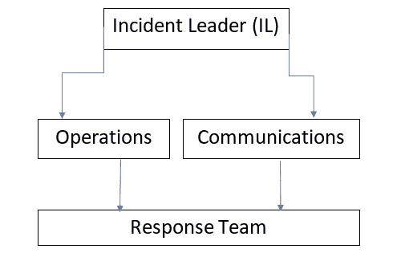

# 第一章：介绍 DevOps 原则

遵循原则，但不被其束缚。

– 李小龙

**DevOps** 有许多定义，其中大多数侧重于文化和程序。如果您已经购买了这本书，作为您进入 DevOps 领域的一部分旅程，您可能至少听说过其中的 100 种定义。由于这本书更多地关注 DevOps 的实践和实际操作，我们会尽量将这些抽象概念和定义保持在最低限度，或者尽可能通过行动而非言语来解释它们。

然而，由于这是一本关于 DevOps 的书，我必须对此做出回应：

*DevOps 是一系列旨在设定一种支持自动化重复工作和持续交付产品的文化的原则和实践，同时融合软件开发和 IT 运维方面的* *产品交付。*

不错。可能不完整，但这就是事物的本质，也许这正是使这个定义适当的原因。任何 DevOps 工程师都会告诉你，工作永远不完美。它的原则在许多方面与日本哲学中的 **Ikigai（生死志）** 相似。它赋予工程师一个目标；一个改进系统的途径，这给他们带来了和剑客磨练技艺或艺术家绘画杰作时相同的兴奋感。满足，但同时又不满足。禅。

除了哲学性的沉思，我相信 DevOps 原则对任何现代软件团队都是至关重要的。在这些团队中工作，最好从原则入手，因为它们有助于解释 DevOps 中使用的工具如何形成、软件团队为何以这种方式构建以及如何促进 DevOps 原则。如果我必须用一个词总结：时间。

在本章中，您将学习定义 DevOps 作为一种理念和思维方式的基本原则。将其视为一种思想练习和技术练习同样重要。本章将为您提供所需的背景，以便理解为什么 DevOps 原则和工具存在以及它们背后的基本哲学。

在本章中，我们将涵盖以下主题：

+   探索自动化

+   理解日志记录与监控

+   事件和事件响应

+   理解高可用性

+   深入探讨基础设施即代码

# 探索自动化

我们将从为什么**自动化**在生活中普遍需要开始，然后逐步过渡到一个更具体的定义，这与 DevOps 和其他技术团队活动相关。自动化是为懒人而生，但许多人没有意识到，要真正变得懒惰，你必须付出多少努力和学习。要实现自动化，它需要一种思维方式、一种态度、一种对现状的挫败感。

## 自动化及其与世界的关系

在 Tim Ferris 的书籍《*每周工作四小时*》中，他专门有一章讲述了自动化工作流程，强调了自动化原则有助于清理生活、去除或自动化不必要的任务或干扰。DevOps 希望在你的职业生涯中做类似的事情。自动化是释放我们时间做其他事情的基础。

人类一直试图进一步自动化的一个领域就是交通工具。我们从步行、骑马、汽车、飞机，到自驾版本的这些交通工具演变而来。这背后的原因与 DevOps 成为一种流行文化的原因相同：节省时间。

## 从运维工程师的角度来看自动化是如何演变的

你可能听过那个关于构建工程师的著名故事，他将自己的工作完全自动化到了秒（如果你没查过，值得一读）。他做的是自动化任何需要他在服务器环境中关注超过 90 秒的任务（如果你问我，这家伙有很扎实的 DevOps 原则）。这些任务包括：如果他迟到，自动发送短信给妻子；根据客户数据库管理员发送的特定电子邮件自动回滚数据库服务器；以及通过安全外壳连接到咖啡机，自动为他冲咖啡，进一步证明了我的观点：大多数事情都可以自动化。

如果你不想，你不需要将工作区或生活自动化到这种程度，但这里有一个你应该从中学到的教训：使用自动化来节省时间，避免自己被麻烦困扰，因为 a) 你的时间很宝贵，b) 如果你正确设置一次，自动化任务每次都能完美完成。

让我们跟随一位年轻的软件工程师 John 的人生历程。假设 John 是一名 Flask 开发者。John 刚刚加入了他的第一个大软件团队，他们正在生产一个已经上线的项目，且有开发和测试环境。John 在整个编程过程中只接触过 `localhost:5000`，对其他的内容一无所知（很多初级程序员也是如此）。John 知道使用 Git 进行版本控制，并且知道你推送到上面的源代码会……传到某个地方。然后它会出现在应用程序中。以下是 John 探索这一过程的经历（然后因此感到无聊）：

+   John 获得了对代码仓库的访问权限，并在本地设置了代码。虽然这不是他从未做过的事情，但他开始贡献代码。

+   一个月后，负责管理 John 所在项目部署的运维人员离开了。John 被问是否能接管部署工作，直到他们找到替代人选。John 年轻且天真，同意了。

+   两个月后，仍然没有替代者，约翰已经弄明白了部署服务器，如 Nginx 或 Apache，是如何工作的，如何将代码复制到服务器环境并以能连接到公共互联网的方式部署它（结果证明，它其实就是伪装的`localhost`，谁知道呢？）。他甚至可能已经被允许独立修改 DNS 记录。

+   四个月后，约翰感到疲惫，他花了一半的时间将代码拉到服务器、解决合并冲突、重启服务器和调试服务器。服务器就像一群山羊，而他只是那只喂养许多嘴巴的手。对他来说，推动新功能并完成预先分配的任务变得越来越困难。这时他开始怀疑是否有更好的方法。

+   他学习了 Bash 脚本和运行手册。他了解到，可以在代码更新时，向代码库和服务器添加触发器来执行某些任务。他还了解了当常见错误开始频繁出现时，可以运行的操作手册。

+   六个月后，约翰几乎自动化了应用程序的每个部署和维护环节。它自动运行了。这个过程让约翰成为了一个更好的程序员，因为他现在在编写代码时，会考虑到部署和自动化的挑战。

+   八个月后，约翰没有任何事情可做。他已经自动化了所有相关任务，不再需要那个 HR 从未回应过的 Ops 人员。他现在是一名 DevOps 工程师。

+   他的经理问他为什么工作日志看起来很空。约翰告诉他，DevOps 任务是根据难度和复杂度来衡量的，而不是工作小时数。经理感到困惑。

+   现在，在这个阶段，会发生两种情况中的一种：要么经理听取建议，约翰将企业引导向 DevOps 思想，使其转型为现代 IT 公司（尽管有些 IT 公司已经过时，虽然听起来有点奇怪），要么他离开，去到一个欣赏他才华的地方，如果他正确地推销自己，离开会很容易。

这可能看起来像是幻想，但它正是许多 DevOps 工程师在无能的火焰中锻造出来的方式。然而，这个故事更像是对整体公司的一种类比，讨论它们是否会转变为使用 DevOps 原则。那些转变的公司变得更加灵活，能够交付新功能，并将资源用于有意义的事情，而不仅仅是用于维持现状。

自动化源自一种不想一次又一次地做相同的事情（通常会做得更差）的愿望。这个概念是 DevOps 的核心，因为那些进行自动化的人意识到在重复性任务中保持一致性是多么重要，并且它是节省时间甚至可能挽救生命的关键。

但为了让任务能够可靠地以相同的方式反复执行，必须对其进行观察，以确保它保持在正确的轨道上。这就是日志记录和监控的作用所在。

# 理解日志记录和监控

转到一个更具体的话题，DevOps 的一个核心原则是记录和监控实例、端点、服务，以及你能追踪和追踪的其他内容。这是必要的，因为无论你做什么，无论你的代码有多干净，服务器配置有多好，总会有某些事情失败、出错，或者莫名其妙地完全停止工作。这是必然的。这是生活的一个事实。事实上，这就是墨菲定律：

任何可能出错的事情都会在最糟糕的时刻出错。

熟悉这个事实对 DevOps 工程师来说非常重要。一旦你意识到这一点，你就能处理它。日志记录和监控的作用在于，当事情*确实*出错时，你需要合适的数据来应对这个事件，有时甚至是自动响应。

本节的其余部分围绕日志记录、监控和警报展开。这些方面中的每一个在确保 DevOps 工作负载顺利进行方面都扮演着重要角色。

## 日志记录

如果你没有技术背景或是刚接触日志记录原则，可以这样理解日志记录：

*每天放学后，一个男孩会去找一个卖火柴的老太太，给她钱买一盒火柴。但是，他并不拿回火柴盒。一天，男孩照常走着，看到老太太快要开口说话了，于是他说：“我知道你可能在想，为什么我给你钱买火柴盒，却不拿火柴盒。你想让我告诉你原因吗？”老太太回答：“不，我只是想告诉你，火柴的价格已经* *涨了。”*

在这个例子中，老太太是日志记录者，男孩是查看日志的人。老太太并不关心原因，她只是收集数据，当数据发生变化时，她收集变化后的数据。男孩每天检查日志，按部就班，直到日志发生变化。一旦日志发生变化，男孩根据自己的判断决定是否采取相应的措施。

在后续章节中，你将学习如何分析日志（通常使用 Python），以及如何对日志作出合适的响应。但目前，你需要知道的是，良好的账务管理/日志记录已经帮助建立了帝国，因为历史和我们从中学到的教训非常重要。它们给我们提供了视角和应对未来事件所需的适当教训。

## 监控

当你看到这一节的标题《理解日志记录和监控》时，你可能会想，二者有什么区别？嗯，这是合理的。我花了一段时间才弄明白。我认为，这归结为几个方面：

1.  **监控**关注的是特定的指标（通常由日志生成），以及该指标是否超过某个阈值。然而，**日志记录**仅仅是收集数据，而没有从中产生任何洞察或信息。

1.  监控是主动的，专注于当前正在监控的实例或对象的状态，而日志记录是被动的，更多关注于大量历史数据的收集。

在许多方面，这就像事务型数据库与数据仓库之间的区别。一个处理当前数据，而另一个则是存储历史数据以发现趋势。两者几乎是不可分割的，因此通常会一起讨论。现在你已经记录和监控了所有数据，可能会问自己，这些数据的意义何在？接下来的部分将帮助解答这个问题。

## 警报

你无法谈论日志记录和监控而不提及警报的概念。**日志度量**通过监控服务进行监控。该服务查看从日志中产生的数据，并将其与为该度量设定的阈值进行比较。如果阈值在持续、定义的时间段内被突破，就会触发**警报**或警钟。

大多数时候，这些警报或警钟要么连接到通知系统，能够通知相关人员警报状态的提升，要么连接到响应系统，可以自动触发对事件的响应。

现在你已经了解了通过日志记录和监控获得的观察力和洞察力的力量，是时候学习如何运用这种力量了。让我们来看看当我们通过日志记录和监控发现重要且令人担忧的洞察时，我们应该采取什么行动。

# 事件和响应

我再一次提一下墨菲定律，因为我认为这句话非常重要：

任何可能出错的事情都会在最糟糕的时刻出错。

处理**事件和响应**涉及大量工作或没有工作。这取决于你有多准备，以及事件或问题的独特性。事件和响应涵盖了从自动化、成本控制到网络安全的广泛内容。

DevOps 工程师如何响应事件取决于许多因素。在处理客户和顾客时，当需要响应时，使用**服务级别目标**（**SLO**）。然而，这通常是在生产环境中，并且需要定义**服务级别指标**（**SLI**）。这还涉及创建错误预算，以确定何时添加新功能以及何时进行系统维护。较低优先级的开发环境用于对潜在的生产案例和事件响应策略的有效性进行压力测试。这些目标将在*理解高* *可用性*部分中进一步探讨。

如果你在 DevOps 的**网站可靠性工程**（**SRE**）方面工作，那么事件将是你的主要工作内容。这个角色的工作描述中有很大一部分包括建立正确的指标，以便你可以响应情况。如今，许多 SRE 团队都设置了全球范围内的活跃人员，可以根据其活跃时区监控站点。对事件本身的响应由**事件响应团队**完成，我将在下一节详细介绍。

事件响应的另一部分是理解事件的原因，恢复所需的时间以及未来可能做得更好的地方。这由**事后分析**来完成，通常帮助创建一份清晰、公正的报告，可以帮助应对未来的事件。事件响应团队负责创建此文档。

## 如何应对事件（生活和 DevOps 中）

事件总是会发生，负责处理这些事件的人需要处理它们。消防员必须对抗火灾，医生必须治疗病人，DevOps 工程师必须处理管理和部署其管理的站点可能发生的各种事件。

现在，在生活中，你如何处理影响你的生活或工作的事件？我在 Ian Stuart Abernathy 的书《心理力量》中读到了一个方法，后来发现在我所遇到的 DevOps 课程和专家中随处可见：**具体（Specific）、可衡量（Measurable）、可实现（Achievable）、现实（Realistic）和时限（Time-bound）**（**SMART**）。如果一个问题的解决方案必须遵循所有这些原则，那么它将有很大的成功机会。你可以将这些应用到自己的生活和 DevOps 旅程中。毕竟，这都是问题解决的一部分。

简要定义 SMART 原则，我们逐个来看每个组成部分：

+   具体性：确切地知道正在发生什么

+   可衡量性：衡量其影响

+   可实现性：考虑你为缓解目标是什么

+   现实性：对你的期望和你能做到的事情要实际

+   有时效性：时间非常宝贵，不要浪费

以下是一些 DevOps 工程师可能需要处理的常见事件：

+   生产网站或应用程序崩溃了

+   有一大批流量激增，表明可能是分布式拒绝服务攻击

+   有一大批流量激增，表明有大量新用户需要扩展资源

+   在代码流水线中构建最新代码时出现错误

+   有人删除了生产数据库（是真的，这种事情可能发生）

处理事件首先需要根据可以提供的响应类型以及是否已预见并为此类事件做准备来划分事件。如果响应是手动的，那么时间就不是一个因素。通常，这种情况发生在事件不影响工作负载但仍然需要处理时，比如潜在的异常或数据泄露。相关方需要被告知，以便他们可以就此事做出知情决定。自动响应适用于那些你知道会时不时发生的常见错误或事件，并且有适当的响应措施。例如，如果你需要增加计算能力或增加更多服务器来应对流量增加，或者如果某个指标出现异常需要重启实例（这在 Kubernetes 中时常发生）。

我们处理这些事件的目的是为了为我们管理的任何应用程序或网站提供最大可用性。追求最大可用性的做法将在下一节的站点可靠性工程中介绍。

## 站点可靠性工程

因此，**站点可靠性工程**（**SRE**）被许多人视为一种 DevOps 形式，而被其他人视为与 DevOps 分开的概念。我将这一部分放在这里，因为无论你对这个话题有什么看法，作为 DevOps 工程师，你将不得不面对站点可靠性、如何保持其稳定性以及如何维持客户信任的相关概念。

作为一个概念，SRE 比整个 DevOps 思想更加僵化和不灵活。它是过去数据中心技术员的进化，他们几乎一生都在数据中心工作，维护服务器机架和配置，以确保他们的服务器持续提供所需的产品。那就是他们的工作：不是创造新东西，而是找到方法来维持旧的基础设施。

SRE（站点可靠性工程）类似于此，但工程师已不再身处数据中心，而是坐在办公室或自己家中的远程工作桌前。他们仍然生活在离数据中心或管理的资源所在云区域相对较近的地方，但与他们的前辈相比有几个不同之处：

1.  他们的团队可能分散在各个地区，而不是集中在一个地方。

1.  他们现在的重点是我们所称的*预测性维护*，即他们不会等到问题发生才做出响应。

## 事件响应团队

这种新的 SRE 趋势也促成了事件响应团队的产生，这些团队可以迅速从 DevOps 团队内部组建，来监控和处理事件。在处理事件的同时，它们还会与利益相关者进行沟通，确保他们了解情况，并找出事件的根本原因。这些团队还会生成报告，帮助 DevOps 团队应对和缓解未来可能发生的类似情况。在一个几分钟的停机可能会导致数百万美元损失和损害的世界里，事件响应团队已经成为任何 DevOps 工程师世界中的重要组成部分。

通常，事件响应团队由以下成员组成：

+   **事件指挥官**（**IC**）：事件指挥官负责领导事件响应，并负责事件后的响应计划

+   **沟通领导**（**CL**）：沟通领导是团队中负责向利益相关者沟通事件及事件缓解进展的公共成员

+   **运营领导**（**OL**）：有时与事件指挥官同义，OL 通过查看日志、错误和指标来领导事件的技术解决，并找到使网站或应用恢复上线的方法

+   **团队成员**：由各自领导协调的 CL 和 OL 下的团队成员，以执行他们所需要的任务

图 1.1 – 一个典型的事件响应团队结构

如你在*图 1.1*中看到的，事件响应团队的结构相当简单，通常在发生此类事件时非常有效地缓解问题。但是事件发生之后会发生什么呢？另一个事件？这也是一种可能性，事实上，它之所以成为可能，正是我们需要从当前事件中获得洞察的原因。我们通过死后分析来实现这一点。

## 死后分析

事件发生了。它影响了业务价值和应用用户，然后它消失或解决了。但谁能说它不会再发生？在它有机会再次发生之前，能做些什么来缓解它？死后分析就是所有这些问题的答案。任何优秀的 DevOps 团队都会在事件发生后进行死后分析。这项死后分析将由处理该事件的事件响应团队主导。

死后分析听起来有些令人毛骨悚然，但它们是恢复过程和工作负载与 DevOps 团队改进的关键部分。它们让 DevOps 团队了解发生的事件以及它是如何发生的，并且对响应团队做出的回应进行剖析。像这样的练习为未来更快的响应时间、学习经验和团队成长打下了坚实的基础。

在事后总结中，常常强调的一个方面是必须无责怪性地进行，也就是说，不能将事件发生的责任归咎于个人。如果发生了事件，应该修改的是过程，而不是人。这样的方法能够创造一个开放的环境，确保事后总结的结果是事实性的、客观的，并且不带偏见。

那么，你可能会问自己，为什么要经历这一切？原因通常是合同性的和强制性的。在现代技术环境中，这些事情是必要的，也是预期的，目的是为最终用户提供价值和可用性。那么让我们来准确理解一下什么是可用性。

# 理解高可用性

我不会再说一次“墨菲定律”，但要明白它在这里同样适用。事情会出错，它们会崩溃。永远不要忘记这一点。DevOps 作为一个概念和文化之所以如此受欢迎，其中一个原因就是它的方法能够提供一个高度可用的产品，几乎没有停机时间、维护时间，也几乎不受应用程序崩溃错误的影响。

DevOps 能够在其高可用性使命中取得成功的一个原因是，它能够理解失败、应对失败并从失败中恢复。以下是亚马逊首席技术官 Werner Vogel 的名言：

一切都会失败，而且是时时刻刻都在失败。

事实上，这正是 AWS 为 DevOps 运维提供的最佳实践指南、教程和文档的基础，这一点是正确的。有时，事情会因为某个错误而失败；有时，它们会因为完全超出我们控制范围的情况而失败；还有时，事情失败是没有任何原因的。但关键是，事情会失败，而当它们失败时，DevOps 工程师需要处理这些失败。此外，他们还需要尽可能快地处理这些问题，并且尽量减少对客户的干扰。

对于那些可能从未参与过大型项目的人，或者至少没有站在执行者面前的人，我有个小建议：*要求具体信息*。这是 DevOps、敏捷以及任何其他功能性战略的基本原则，对于项目所有利益相关者和参与者之间的任何工作关系都至关重要。如果你告诉别人你具体需要什么，并且给出衡量这些需求的指标，那么生产出来的结果就会更容易。因此，在 DevOps 中，有一些指标和测量方式有助于界定服务的可用性要求以及维护这些服务的协议。

有许多与高可用性相关的缩略语、指标和指标。在本节中将对这些内容进行探讨，它们将有助于准确界定工作负载中高可用性的含义。

## SLIs、SLOs 和 SLAs

服务协议、服务条款、合同以及许多其他类型的协议都是为了让两方达成协议并且必须遵守。你需要合同的场景包括一方支付另一方服务费用、双方交换服务、当一方同意另一方制定的用户协议时（你读过这样的协议吗？），以及许多其他原因。

让我们逐一解析这些内容：

+   **服务级别指标**（**SLIs**）：这些是可以用来数值化定义产品提供的服务水平的指标。例如，如果你运营一个网站，你可以使用正常运行时间（网站可用服务的时间量）作为 SLI。

+   **服务级别目标**（**SLOs**）：这些为前述的 SLI 提供了一个具体的数值。这个数值是 DevOps 团队必须为客户达到的目标。回到前面的 SLI 定义示例：如果正常运行时间是 SLI，那么一个月正常运行 99%的时间就是 SLO。通常一个月有 30 天，即 720 小时，因此该网站在该月应该有至少 712.8 小时的正常运行时间，允许的停机时间为 7.2 小时。

+   **服务级别协议**（**SLAs**）：这些是执行 SLO 的合同。在 SLA 中，会为某个 SLI 定义一个 SLO（希望你现在理解了），该 SLO 必须由 DevOps 团队实现。如果这个 SLA 没有得到满足，那么与 DevOps 团队签订合同的那一方有权获得某些赔偿。以这个示例为结尾，如果该网站的 SLA 有一个 99%的正常运行时间的 SLO，那么这是协议中定义的，DevOps 团队需要满足这个指标。然而，大多数 SLA 都有多个 SLO。

简单来说，SLI（通过测量）-> SLO（通过定义）-> SLA。

AWS 团队喜欢展示的一个显著示例是亚马逊**安全存储服务**（**S3**）的 11 个 9（99.999999999%）的耐用性（其他云对象存储服务也提供类似的服务）。这意味着每个 S3 桶每 10,000 年才会丢失一个对象。它的标准层 SLA 也有 99.9%的可用性。这相当于在 30 天的日历月内停机 44 分钟。

现在，这三个缩写与可用性相关，但属于附属关系。接下来的两个缩写将更加专注于合同和目标层面上的可用性实际含义。

## RTO 和 RPO

这两个缩写比其他三个更侧重于可用性。**恢复时间目标**（**RTOs**）和**恢复点目标**（**RPOs**）被用作衡量可用性的标准。如果一个应用程序未能在其 RTO 或 RPO 范围内运行，则未能履行其可用性保证。RTO 和 RPO 主要关注在灾难发生后恢复操作。世界上有一些金融、医疗等关键系统，如果它们的底层系统停机几分钟，就无法正常运作。考虑到*一切都会失败*的格言，这种灾难或失败并不不现实。

当服务需要保持持续运行时，会设置一个 RTO。RTO 中的时间指的是服务在恢复并重新上线之前，能够容忍的最大离线时间。RTO 的完成在 SLA 中定义为系统下线后重新可用的最大时间。为了遵守 DevOps 的 SLA，他们必须在该时间框架内恢复系统。

现在，你可能会觉得这很简单：只是把东西关了再开，没错吧？实际上，在许多情况下，这样做确实可以解决问题，但记住，这不仅仅是完成工作，而是在规定的时间内完成工作。

在大多数情况下，当服务器宕机时，重新启动服务器就能解决问题。但这个过程需要多长时间呢？如果你的 RTO 是五分钟，而你花了六分钟来重启服务器，那么你就违反了 RTO（在许多关键的企业系统中，RTO 甚至更短）。这就是为什么，当你初次定义 RTO 时，应该做两件事：提出比实际需求更多的时间，并考虑自动化。

现代的服务水平协议（SLA）达到 99%（每月 7 小时）甚至 99.9%（每月 44 分钟），是通过消除人为干预（特别是犹豫）来实现的。服务通过持续监控其健康状况自动恢复，因此当某个实例出现不健康的迹象时，可以进行修复或替换。这个概念促成了 Kubernetes 的流行，它在生产环境中拥有市场上最好的恢复和健康检查概念。

RPO 与数据相关，定义了一个特定的日期或时间（点），可以从中恢复数据库或实例中的数据。RPO 是当前时间与备份或恢复点之间最大可容忍的时间差。例如，一个较小的内部应用程序中的用户数据库可以有一天的 RPO。但一个关键业务应用程序的 RPO 可能只有几分钟（如果有的话）。

RPO 通过不断备份和复制数据库来保持。你使用的大多数应用中的数据库并非主数据库，而是**只读副本**，通常放置在不同的地理区域。这减轻了主数据库的负载，使其可以专门用于写操作。如果数据库出现故障，通常可以通过将一个只读副本提升为新的主数据库来迅速恢复。只读副本将包含所有必要的数据，因此一致性通常不是问题。在数据中心发生灾难时，类似的备份和恢复选项对于恢复系统功能变得至关重要。

基于这些目标和协议，我们可以提出一些能够影响团队行为的度量标准，就像我们接下来的话题一样。

## 错误预算

在遵循 DevOps 原则的团队中，错误预算成为团队未来发展方向的一个重要部分。错误预算通过以下公式计算：*错误预算 = 1 - SLA（**以小数形式表示）*

这基本上意味着*错误预算是 SLA 剩余的百分比*。因此，如果 SLA 为 99%，则错误预算为 1%。它是我们的停机时间与正常运行时间之比。在这种情况下，每月的错误预算大约为 7.2 小时。根据此预算，我们可以根据团队目标定义团队的进展：

+   如果团队的目标是可靠性，那么目标应该是收紧错误预算。这样做将有助于团队提供更高的 SLO，并获得客户更多的信任。如果将 SLO 从 99%收紧到 99.9%，则表示容忍的停机时间从 7.2 小时减少到 44 分钟，因此你需要确保能够履行这一承诺。反过来，如果无法履行这样的 SLO，就不应该在任何协议中做出承诺。

+   如果团队的目标是开发新特性，那么绝不应以降低 SLO 为代价。如果每个月消耗大量错误预算，则团队应当从开发新特性转向提高系统的可靠性。

所有这些统计数据的存在是为了帮助我们拥有可用于保持高可用性的度量标准。但我们并不是直接使用它们，而是将它们配置为自动使用。

## 如何实现高可用性的自动化？

现在你已经了解了游戏规则，你需要弄清楚如何在这些规则内工作并履行对客户的承诺。为了实现这一目标，你只需要完成 SLA 中设定的事项。对于小规模的工作来说，这并不特别困难，但我们不是来做小事的。

有一些每个 DevOps 工程师都需要了解的基本知识，以实现高可用性：

+   使用虚拟机上的期望状态配置以防止状态漂移

+   如何在灾难发生时正确备份数据并快速恢复

+   如何实现最小停机时间的服务器和实例恢复自动化

+   如何正确监控工作负载，察觉错误或中断的迹象

+   如何成功，即使你失败了

听起来很简单，不是吗？嗯，从某种角度来看确实如此。所有这些事情是相互关联的，编织在 DevOps 的框架中，彼此依赖。从失败中恢复成功是生活中最重要的技能之一，不仅仅是在 DevOps 中。

DevOps 社区通过开发工具，使得在代码中维持工作负载的必要状态，这一失败并恢复到成功状态的概念得到了更进一步的深化。

# 深入了解基础设施即代码

最后，在一本关于 Python 的书中，我们进入了有关代码的章节。到目前为止，我已经给了你很多关于需要完成什么的说明，但要完成我们想要的东西，尤其是在这本书中，我们必须拥有一种方法、一种工具、一种武器，即代码。

现在，“代码”这个词吓坏了许多科技行业的人，甚至是开发者。对自己所使用的每一项工作的基础感到害怕，确实有些奇怪。但有时候，这就是现实。如果你，亲爱的读者，是这样的人，首先，购买这本书本身就是一件勇敢的事情，其次，你所做的只是在拒绝自己解决世界上所有问题的机会。说真的。

现在，原因在于，代码几乎在每种情况下都是首选武器。它是所有自动化问题、监控问题、响应问题、合同问题，甚至可能是我不了解的其他问题的解决方案。并且很多时候，只需要少量代码。

重要提示

记住这一点：业余爱好者不写代码，新手写很多代码，专家写代码的方式让人觉得他们根本没写什么代码，所以在本书中，你会看到很多代码。

让我进一步解释。为了维持 DevOps 所需的服务一致性，你需要某种恒定的东西；一种资源可以回退并用来维持自己标准的东西。你可以为此编写代码。

除此之外，你还需要能够自动化重复性任务和那些需要比人类反应更快的任务。你需要释放自己的时间，同时又不浪费客户的时间。你可以为此编写代码。

你还需要灵活，并且能够在环境变化的情况下动态创建资源，同时具备无缝切换到备份、容错和备用方案的能力。你可以为此编写代码。

**基础设施即代码** (**IaC**) 对于最后这一部分尤其有用。事实上，你可以利用它来封装并制定其他两者的内容。IaC 是协调者。它为云服务提供了一个比喻性的*购物清单*，列出了它想要的内容以及所需的配置，作为交换，它获得了按照编码要求配置的精确环境。

IaC 是一个 *得到你想要的* 系统，这一点需要提醒，因为与所有涉及计算机的事情一样，它将 *完全* 按照你的要求去做，这意味着你需要在使用这些框架时非常具体和精确。

让我们来看一个小示例，用来展示使用一些简单的伪代码（没有那些烦人的语法）来演示 IaC 背后的概念。

## 伪代码

本章不会涉及到实际的 IaC 代码（你可以在专门讲解 IaC 的章节找到相关内容），我只会简要概述 IaC 背后的概念，并使用一些伪代码定义。这些将帮助你理解单个 IaC 定义在资源安全中的工作原理。

一个创建虚拟机的伪代码示例——将其拆解成最简单的部分，看起来应该是如下所示：

+   `模块名称`（通常是对正在部署服务的描述）

    +   `虚拟机名称`（例如 `VM1`）

    +   `分配的资源`（规格或虚拟机类型）（例如 1GB 内存）

    +   内部网络和 IP 地址（在`VPC1`中）

    +   标签（例如 `"Department": "Accounting"`）

这个示例将创建一个名为 `VM1` 的虚拟机，配备 1GB 内存，并放置在一个名为 `VPC1` 的 VPC 或等效网络中，标签键为 `Department`，值为 `Accounting`。一旦启动，事情将按预期发生。哦，我需要 2GB 内存，怎么办？

很简单，只需更改你的代码：

+   `模块名称`（通常是对正在部署服务的描述）

    +   `虚拟机名称`（例如 `VM1`）

    +   `分配的资源`（规格或虚拟机类型）（现在是 2GB 内存）

    +   内部网络和 IP 地址（在`VPC1`中）

    +   标签（例如 `"Department": "Accounting"`）

就是这么简单。你可以看到为什么它这么受欢迎。它足够稳定可靠，同时又足够灵活，可以重用。现在，以下是一些其他提示，可以帮助你理解大多数 IaC 模板是如何工作的：

+   如果你重命名了虚拟机，它会使用新名称重新部署

+   如果你重命名了模块，大多数模板默认会拆除并停用旧模块中的虚拟机，并从头创建一个新的虚拟机

+   更改网络或 VPC 会逻辑上将虚拟机移至另一个网络，并遵循该网络的网络规则

+   大多数模板允许你循环或迭代多个虚拟机

IaC，哇，真是一个好概念。这是一个非常有趣且非常流行的解决方案，用于解决常见问题。它可以解决很多 DevOps 中的头痛问题，并应该成为每个 DevOps 工程师的武器库中的一部分。

# 总结

DevOps 的概念令人兴奋、广阔，并且充满创意的空间。它是一个几乎完全由你掌控的领域。有效的 DevOps 需要有效的结构，并且要能适应这些结构以应对挑战，正如我们在 *探索* *自动化* 章节中学到的那样。

但请记住，*凡是可能出错的事情都会出错*，所以要为成功做好规划，但也要准备好面对失败这一常见的情况。在失败的情况下——正如我们在监控和事件响应部分所学到的——恢复的能力是关键，而且恢复的速度往往也非常重要。如果要从中恢复的事件是新的，它必须被报告并理解，这样才能在未来减少此类事件的发生。

最后，正如我们在*深入了解基础设施即代码*中所提到的，代码是你的朋友。对待朋友要友善，和它们一起玩。你将在本书中学到如何做到这一点。
