# 2

# 说到 Python

语言是世界和平的关键。如果我们都能说彼此的语言，也许战争的祸害将永远结束。

– 蝙蝠侠

Python 编程语言是基于一套原则构建的，这些原则旨在简化编程。与其他编程语言相比，这种简化的代价是牺牲了许多速度和性能，但也因此产生了一种易于访问和构建的流行语言，拥有庞大的内置函数库。所有这些都使得 Python 非常多才多艺，能够在多种情况下使用，堪称编程界的瑞士军刀。如果你愿意，可以说它是 **DevOps** 这样的多样化学科的完美工具。

初学者推荐 Python 作为学习语言，因为它相对简单，容易上手，并且在行业中使用广泛（如果不是，为什么我要写这本书呢？）。Python 还是一个非常适合爱好者的灵活编程语言，原因和之前一样，还有它在操作系统自动化、物联网、机器学习以及其他特定兴趣领域中的库支持。在专业领域，Python 面临着很多市场竞争，但这在很大程度上是因为——在那个层次上——较小的差异、遗留系统和可用技能都很重要。

而且这完全没问题。我们不需要 Python 占据整个市场份额——那样会非常无聊且不符合创新的直觉。事实上，我鼓励你在回到 Python 之前，尝试其他语言及其概念，因为那样能帮助你发现 Python 带给你的许多便利，并帮助你更好地理解 Python 提供的抽象。

Python 是简单的语言，它也是简洁的语言。通常，你可以用一行 Python 代码完成其他语言中需要 10 行的代码。

我所陈述的所有理由并不是 Python 在开发和 DevOps 中如此受欢迎的唯一原因。事实上，Python 流行的最重要原因之一是：

*{}*

对，就是那个。那不是打印错误。它代表了 JSON/字典格式，用于在几乎所有现代主要系统上跨越互联网传递数据。Python 处理它比任何其他语言都要好，并且使得操作起来比其他语言更简单。基础的 Python 库通常足以充分释放 JSON 的潜力，而在许多其他语言中，可能需要额外的库或自定义函数。

现在，你可能会问：“我不能安装那些库吗？这有什么大不了的？”嗯，理解其中的重要性来自于与这类数据打交道，并且理解并非每一种编程语言都会特别强调这两个括号的重要性，以及它们在现代 DevOps/云计算中可能带来的问题。

在本章中，我将提供 Python 的基础复习，并给你一些在 DevOps 领域实用的 Python 知识。这里不会涵盖所有 Python 编程语言的内容，因为那是一个庞大的话题，并且不是本书的重点。我们将只关注 Python 编程语言中对我们工作有用的部分。

所以，让我们列出我们在这里将要涵盖的内容：

+   通过其创造者的哲学思想来理解 Python 的基础

+   Python 如何支持 DevOps 实践

+   一些支持这些观点的例子

# Python 101

Python 是——正如我之前所说——一种很容易上手的语言。它的设计旨在让普通人也能阅读，而且其代码逻辑也容易理解。正是因为这个事实，从安装 Python 到在操作系统中配置它，可能是所有主要编程语言中最顺利的安装过程。入门的门槛几乎为零。

所以，如果你想声明一个变量和做其他基本操作，从下图开始并搞清楚：

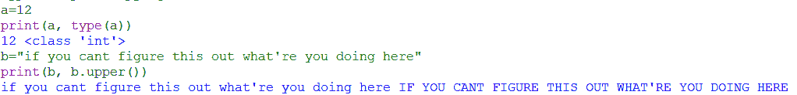

图 2.1 – 声明和操作变量

本节将专注于 Python 的哲学，因为这将是你在 DevOps 中使用 Python 旅程中的关键。理解了这些基本哲学后，你将明白为什么 Python 和 DevOps 是如此完美的搭配。

事实上，我们可以在`import this`中找到这种相似性，你会看到 19 行“Python 之禅”。你说是奇数行？这是一个有趣的故事。

所以，如果你以前没见过，我将把它列出来，以便后代留存：

*美丽总比丑陋* *更好。*

*显式优于隐式。*

*简单优于复杂。*

*复杂优于复杂化。*

*平坦优于嵌套。*

*稀疏总比密集* *更好。*

*可读性很重要。*

*特例不足以打破* *规则。*

*尽管实用性* *胜过纯粹性。*

*错误不应该* *默默地通过。*

*除非* *明确禁止。*

*面对模糊时，拒绝* *猜测的诱惑。*

*应该有一种——最好只有一种——明显的方式* *去做这件事。*

*虽然那条路一开始可能不明显，除非* *你是荷兰人。*

*现在比永远* *更好。*

*尽管“永远”通常比***现在就*做*更好。*

*如果实现很难解释，那就是* *一个坏主意。*

*如果实现容易解释，那可能是* *一个好主意。*

*命名空间是一个非常棒的主意——让我们做更多* *这样的事情！*

(*Tim Peters, 1999，《Python 之禅》，* [`peps.python.org/pep-0020/#the-zen-of-python`](https://peps.python.org/pep-0020/#the-zen-of-python))

我现在给你讲这些，是为了举例说明这些原则是如何成为成熟的 Python 语言的一部分的。我将以一对一对的形式来做这件事。除了最后一条。这些规则及其实现将为你提供编写良好 Python 代码所需的适当界限。

## 美丑/显式隐式

让我们从美开始。人们说美在于观者的眼中。这也是为什么，当你看到缩进不当的代码时，你就开始理解正确缩进代码的美感。下面是用 JavaScript 和 Python 正确写的相同代码：

+   JavaScript:

    ```
    const value = 5; for (let i = 0; i <= value; i++) {console.log(i);}
    ```

+   Python:

    ```
    value = 5
    for i in range(value+1):
    print(i)
    ```

顺便说一下，JavaScript 代码是有效的。它和 Python 代码做的是一样的事情。如果你愿意，你可以把所有的 JavaScript 脚本写在一行中（而且在构建 JS 前端时，有时为了节省空间你确实会这么做）。但是，哪一个你能读得更好？哪一个将信息更好地呈现给你？Python 强制使用这种语法，去掉了分号，取而代之的是通过缩进来分隔代码行，这使得代码在客观上更 *优美*。

但是，有些东西缺失了。你可能理解了代码是清晰和简洁的，但你可能不理解代码。这时我们必须在代码的定义及其变量的定义上变得显式。Python 鼓励在每个代码块中使用注释，并且在给变量赋值时采用明确的结构。`snake_case` 用于变量，且大写蛇形命名法（UPPER_SNAKE_CASE）用于常量。让我们按照这些指导原则重新编写我们的 Python 代码：

```
""" Initial constant that doesn't change """INITIAL_VALUE = 5""" Loop through the range of the constant """for current_value in range(INITIAL_VALUE+1):""" Print current loop value """print(current_value)
```

你不需要为每一行都这样做；我只是比平常更明确一些，为了以后参考。但这是定义变量和注释的基本方式。不再使用那种 *i*、*j* 和 *k* 的做法。要友善，并且要定义清晰。

定义简化事物，这就是我们在下一节将要讨论的内容。

## 简单-复杂-复杂化

必须尽可能保持简洁。这是规则，因为……那样更容易。然而，保持简洁是困难的。有时几乎不可能。随着应用或解决方案的规模变大，复杂性也会增加。我们不希望的是让代码变得复杂化。

复杂和复杂化有什么区别？当代码是为了可持续地动态且可理解地处理所有可能的场景时，它是复杂的。当（在一个复杂的解决方案中）代码是以一种根据静态、非常具体的参数（硬编码）来处理所有可能的情况的方式编写时，它就是复杂化的，且即使是写代码的人，也会觉得它很难理解。

在我的职业生涯中，我看过很多这样的代码；我刚开始时也写过很多。这是一个学习过程，如果你没有培养好的习惯，你就会陷入坏习惯，或者会退回到为更复杂问题找到一个更简单的解决方案。

曾经，在回顾一个旧的`JSONResponse`函数时，我感到困惑，忍不住想，为什么有人会以这种方式编写代码，直到我发现编写此代码的人并没有之前的网页开发经验，而是一名数据工程师。于是，他们回归了自己对简洁性的理解：使用数据科学库，即便是用于后端开发。

现在，这大大拖慢了应用程序的速度，当然，必须进行重构，但是——因为本书中我们不指责任何个人——我们不能怪罪开发者。我们必须责怪他们依赖的习惯和他们追求的简洁性，这最终导致了复杂的代码，而稍微复杂一点但简洁的解决方案本可以生成更好的代码。

## 平坦—嵌套/稀疏—密集

特别是关于“平坦优于嵌套”的部分，是那些著名的单行 Python 代码背后的原因。简单的代码不应该需要跨越 20 到 30 行，尤其是当它能在几行内完成时。在许多语言中，做不到几行代码，但在 Python 中可以。

让我们测试一下这个概念，打印这个数组的每个值：`my_list = [1,2,3,4,5]`：

| **平坦稀疏** | **嵌套密集** |
| --- | --- |
| `print(*my_list)` | `for element in` `my_list: print(element)` |

表格 2.1 – 平坦稀疏与嵌套密集

这是一个非常小的例子，但它是 Python 语言中许多类似例子中的一个。我建议你浏览 Python 自带的库列表；这是一份非常有趣的读物，能够帮助你产生很多想法。

很多时候，这种平坦稀疏的概念大大减少了编写代码的量。反过来，这使得代码变得更具可读性，仅仅是因为减少了阅读代码所需的时间。

让我们深入探讨可读性和概念的纯粹性。

## 可读性—特例—实用性—纯粹性—错误

Python 旨在成为一种普通人也能在某种程度上阅读和理解的语言。它不需要任何特别的语法，甚至那些单行代码也能轻松理解。可读性很重要，没有任何特殊情况足够特殊到违反这一原则。我已经通过前面的例子表达了这两种哲学，所以在这里无需重复。

实用性优于纯粹性是一个相当简单的概念。通常，过于严格地遵循最佳实践只会浪费时间。有时候，最好的做法是先做，再解释。但是，在这种情况下，确保你的大胆做法不会导致系统崩溃。在这种情况下，**try-catch 错误处理**是你最好的朋友。当你需要时，它还可以帮助你安静地传递错误。

两者之间的平衡——进展与验证——会产生经过验证和测试的代码，但也会产生实际交付给最终用户的代码。这种平衡对任何成功的项目至关重要。在实际工作中，你必须务实，但你也必须意识到其他人在行动和估算时可能不那么务实。

在任何方向采取行动，无论是务实还是纯粹，都需要有一个方向感。它需要决定某个事情或某种方法，并坚持下去。

## 模糊性/单向/荷兰式

任何曾经和客户合作过的人都知道，模糊的需求是多么令人沮丧和气馁。“*做这个，做那个，我们需要这个*”——你只会听到这些，没有来自对方的理解，也没有尊重过程如何运作。他们心中有一个目标，而不在乎你怎么去达成。对于机器来说，这没问题（我们也会学到一些机器的做法），但是对于人类的工作（尤其是编码工作）来说，这不是方法。你需要清楚地知道需求是什么，才能精准地去完成。

很多时候，即使是客户自己也不知道他们到底想要什么；他们有一个模糊的想法，想要去实现，但除此之外没有更多的内容。这种模糊性需要在项目开始时解决，并且绝对不应扩展到代码中。一旦某些东西被定义，就有一种方法可以做到最快、最安全或最方便（具体取决于需求）。这就是你需要找到的方式。

但是，如何找到这种方式呢？对于非荷兰人来说并不显而易见（这是对荷兰程序员 Guido Van Rossum 的一个提及，他是 Python 的原作者）。所以，如果你是荷兰人，那就没问题。如果你不是，阅读这个故事（它比普通的代码更符合这些原则）：

*三位朋友被困在一艘没有食物和水的船上。这些朋友身上只有一盏看似空的灯。一个朋友决定擦拭这盏灯，结果召唤出了一位神灵。神灵为每个朋友实现了一个愿望，因为他们是一起召唤* *他的。*

*第一个朋友许下了他的愿望：“我希望被送到我的妻子和孩子那里。”愿望得到了满足，朋友消失了，被送回了他的家人身边。第二个朋友希望被送回他家乡的房子里，这个愿望同样得到了实现。第三个朋友是个孤独的人，他没有地方去，也没有人可以去找，于是当轮到他时，他说：“我希望我的朋友们* *在我身边。”*

这个故事很老了，但大多数人理解它的方式是，朋友们被第三个朋友的愿望强行带回船上：这是一个经典的*小心你许下的愿望*的故事。然而，一个工程师可以从这个故事中得出其他可能的情境。也许第三个愿望带回了不止这两个人（如果他有超过两个朋友的话）；也许没有带回任何人（如果另外两个人不算朋友，那将是个悲伤的转折），或者它甚至可能引发一场关于什么是朋友的争论。

但大多数编程语言就像精灵。它完全按照你说的去做。如果你表达模糊，留给它解释的空间可能会让你付出代价，所以要小心，只许愿你真正想要的东西。人们（比如我们之前的客户）就像人类一样。有时他们知道自己想要什么，有时却不清楚。但为了成功，他们需要精确地知道自己想要什么，既要在目标的背景下（回家），也要在约束规则的背景下（如果他们怀疑第三个朋友的意图，他们本可以让他先走）。这真是个难题，不是吗？

这里的关键——而这也是 DevOps 和**敏捷方法论**所提倡的——就是持续改进。不断寻找那个最佳的方法。如果情况发生变化，就调整方法以适应新的情境。这种策略在编码、DevOps、机器学习以及几乎所有技术领域中都至关重要。迭代方法论有助于将即使是最模糊的目标转化为一个大胆的使命声明，并能够提供统一的方向。

荷兰人是非常直接的民族；只有他们能发明出像 Python 一样直截了当的语言。说到直截了当，你现在应该阅读下一部分了……或者永远不读，如果你现在没时间（看到我在这里做了什么了吗？）。

## 现在或永远

这是另一对原则，更多是关于写作方法，而不是写作本身。*现在*比*永远*更好，但*永远*又比*现在*更好，这种说法看起来有些自相矛盾，但它们描述了编写代码和通过代码传递价值的本质。

*现在*并不意味着*此刻*。它是指不久的将来，而在这个不久的将来，我们写的代码已经交付了价值。这与永远不发布代码，或在不现实的长期时间框架内发布代码不同，后者可能导致编写的代码变得无关紧要。正如史蒂夫·乔布斯曾经说过的：

*真正的* *艺术家发布作品*。

然而，*现在*也从来不是一个好时机。过早发布某个东西，既没有考虑过它，也没有理解和规划，这可能会导致灾难。这里的基本教训是：三思而后行。如果你跳进了火山口，显然你没有做好应尽的准备。

*现在*被视为不合时宜的原因之一是，因为现在没有什么好主意。现在永远没有什么好主意；你得等大脑想出一个来。你用力过猛，试图推动一些难以解释的东西——那就是一个坏主意。这就解释了为什么体育经理在交易截止日期时做出许多愚蠢的交易。

## 难-坏/易-好

如果你很难解释某件事，那很可能是个坏主意。没有太多可以解释的——这就是常识。一个复杂的愿景其实根本算不上愿景。它需要被简化、提炼，并且形成大多数人能理解的东西（或者至少是朝着这个方向努力）。

一个复杂的想法其实只是一个还未简化到最有用、最简单组件的想法。正如老话所说，20%的努力通常能产生 80%的结果。要创造出好的想法，我们只需要集中精力去实现那 20%的部分。

## 命名空间

孤独的 zen，`lib1` 和 `lib2`，它们都包含一个名为 `example` 的方法。如何解决这个问题，使得这两个方法都能被导入到一个 Python 文件中？你只需要将其中一个或两个方法的名称更改为唯一的命名空间：

+   不带命名空间的代码：

    ```
    from lib1 import example
    from lib2 import example
     This is bound to cause conflicts """
    ```

+   带命名空间的代码：

    ```
    from lib1 import example as ex1
    from lib2 import example as ex2
    #This won't cause conflicts
    ```

这确实是个很棒的主意。

通过这些原理，你可以看到 Python 如何演变成今天的样子，以及它如何与其他编程语言区分开来。这些变化也帮助 Python 成为与 DevOps 原理一致的语言。那么，让我们现在来看一下 Python 和 DevOps 原理之间的结合，以及它们如何互相促进。

# Python 为 DevOps 提供的功能

在上一节中，我们重点讲解了 Python 的基本原理。现在，我们将探讨遵循这些原理对 DevOps 实践和 DevOps 工程师的意义。DevOps 和 Python 背后的原理有更多相似之处而非差异。它们都强调灵活性、自动化和简洁性。这使得 Python 和 DevOps 在 DevOps 领域中成为完美的组合。即使是那些可能没有最强编码能力的 DevOps 专业人士，Python 也易于学习和使用，并且几乎与所有工具和平台都可以集成，因为几乎所有这些平台都有原生的 Python 支持和库。

我之前提到过，Python 在 DevOps 中如此普及的原因是它能比几乎任何其他语言更好地处理存在于大括号 (*{}*) 之间的数据。Python 为 DevOps 提供的功能众多，未来章节中会进一步详细讲解。现在，我们将简要概述其中的一些功能。

## 操作系统

Python 有原生库，可以与它当前运行的任何服务器的操作系统交互。这些库允许程序化访问各种操作系统进程。当你在云端处理虚拟机时（例如使用**Amazon EC2**），这尤其有用。你可以做以下事情：

+   在操作系统中设置环境变量

+   获取文件或目录的信息

+   操作、创建或删除文件和目录

+   终止或创建进程和线程

+   创建临时文件和文件位置

+   运行 Bash 脚本

操作系统很不错，但它们在理想资源使用情况下，保持在期望状态可能会变得困难。对于这个挑战，我们有一个常见的解决方案——容器化。

## 容器化

**容器**是使用**Docker**库创建的。容器的创建、销毁和修改可以通过 Python 自动化和编排。它提供了一种程序化的方式来维护和修改容器状态。一些应用包括：

+   与 Docker API 交互，执行命令，比如获取操作系统中现有的 Docker 容器或镜像列表

+   从 Docker 镜像列表自动生成**Docker Compose 文件**

+   构建 Docker 镜像

+   使用**Kubernetes 库**编排容器

+   测试和验证 Docker 镜像

你可能会想，容器的意义何在？可能是因为你从未厌倦过关于操作系统和框架的不断讨论，以及哪些更优（事实上，你甚至可能鼓励过这种废话）。但容器的存在，是为了那些厌倦了这种辩论，想要为所有特定操作需求提供隔离环境的人。所以他们用容器创建了一个，且有人聪明地将它们称为微服务。

## 微服务

有时，容器和**微服务**可以互换使用，但在现代 DevOps 中，这不一定是这样。是的，正是容器让微服务成为可能，但在这些容器上编写微服务的整体代码是高效的，它在性能上最大化了投入产出比。以下是 Python 在微服务中使用的一些原因：

+   Python 容器中强大的本地库支持 —— 如**json**、**asyncio**和**subprocess**等库

+   出色的本地代码模块，简化了对数据的某些迭代和操作性操作，如 `collection` 模块

+   能够正确地本地处理通常用于微服务的半结构化和多样化的 JSON 数据

为了使这些微服务能够有效且一致地相互交互，我们需要一些重复，一些一致的重复。我要找的词是……自动化……不，那是机器人……签名……不，那是等这本书成为畅销书后的事……自动化，对，正是这个词。自动化。

**自动化**可能是 Python 对于 DevOps 工程师的主要卖点，因为它拥有令人难以置信的**自动化库**和支持功能。大多数从系统管理员转型为 DevOps 的人员更喜欢他们宝贵的**Bash 脚本**，这种脚本在某些环境中确实有其用武之地，但 Python 更加强大、更加灵活，而且得到了社区和行业中大多数公司的更好支持。在这种情况下，Python 在自动化方面的一些应用包括：

+   各种针对云端部署的**软件开发工具包**（**SDKs**），包括**AWS**、**Azure**、**Google Cloud**和其他云服务提供商

+   支持自动构建和测试应用程序

+   支持监控应用程序并发送通知

+   支持从网页、数据库及其他各种数据源中解析和抓取必要的数据

既然我们已经谈过了，让我们做点实际的事情。轻轻跑步，结合 Python 和 DevOps。

# 一些简单的 Python DevOps 任务

迄今为止，我向你们传授了 DevOps 和 Python 的优点，但到目前为止，我展示的却很少有两者如何协同工作的内容。现在，我们进入这一部分。在这里，我将展示几个如何使用 Python 自动化一些 DevOps 常规任务的例子，这些任务是一些工程师可能每天都要执行的。这两个例子来自 AWS，尽管它们同样适用于其他大云平台，并且如果你拥有正确的 API，也可以应用于大多数数据中心服务器。

本章及所有后续章节的代码都存储在这个仓库中：[`github.com/PacktPublishing/Hands-On-Python-for-DevOps`](https://github.com/PacktPublishing/Hands-On-Python-for-DevOps)

## 自动关闭服务器

经常会遇到某些服务器只需要在工作时间运行，工作时间过后则需要关闭的情况。现在，这种特定场景有很多前提条件，包括使用的平台、服务器运行的账户以及如何衡量工作时间……但是，对于这个场景，我们只是简单地在 AWS 账户中通过一个运行 Python 脚本并利用 **boto3 库**的 **AWS Lambda** 函数微服务来关闭我们的 EC2 服务器。听起来很复杂吗？让我们分解一下。

在我的 AWS 账户中，我有两个正在运行的 EC2 实例。它们每秒钟的运行都会让我花费一些钱。然而，在工作时间我需要它们。它们是这样的：

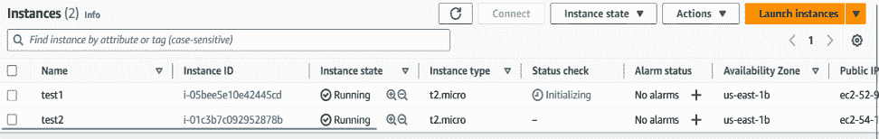

图 2.2 – 运行中的实例

起了个有创意的名字，我知道。但是它们确实在运行，并且总有一天，我希望它们不再运行。为了实现这一点，我需要找到某种方法来停止它们。我可以一个一个地停止它们，但那样很麻烦。如果这两个实例变成了 1000 个实例，我还会这样做吗？不会。那么，我们需要找到另一种方法。

我们可以尝试**命令行界面**（**CLI**），但这是一本编码书，而不是 CLI 书，所以我们不这么做。不过，如果你有兴趣，也可以尝试。让我们看看我们的老朋友 Python，并且也可以使用一个服务，允许你随时调用的函数，称为 AWS Lambda。下面是创建 Lambda 函数并用它来启动和停止 EC2 实例的步骤：

1.  让我们创建一个名为`stopper`的函数，使用最新的 Python 运行时（本书中使用的是 3.10）：

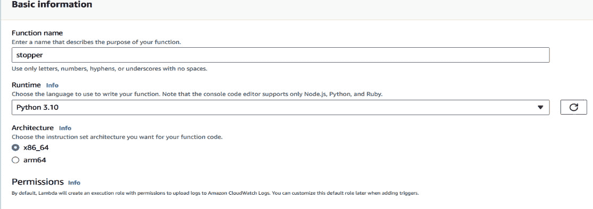

图 2.3 – 创建 Lambda 函数

1.  接下来，你需要为 Lambda 函数创建一个执行角色，或者为其分配一个现有的角色。这一点稍后会很重要。不过现在，你可以选择你偏好的方式。默认情况下，点击 `boto3` 库，它非常适合资源交互。

1.  在我们能够启动或停止任何实例之前，我们需要列出它们。你需要先加载并转储返回函数一次，以处理`datetime`数据类型。现在，让我们先初始化 EC2 的 `boto3` 客户端，尝试列出当前可用的所有实例：

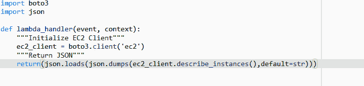

图 2.4 – 描述实例的初始代码

运行此代码进行测试时，你会遇到类似于以下的异常：

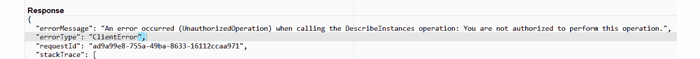

图 2.5 – 授权异常

这是因为 Lambda 函数也有一个**身份与访问管理**（**IAM**）角色，而这个角色没有描述实例所需的权限。因此，我们需要设置可能需要的权限。

1.  如下图所示，在**配置**|**权限**下，你将找到分配给 Lambda 函数的角色：

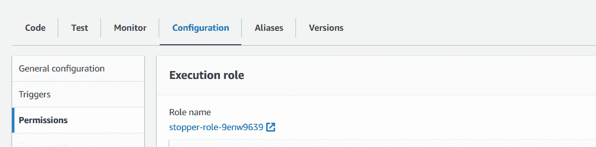

图 2.6 – 查找权限角色

1.  在角色页面，转到**添加权限**，然后选择**附加策略**：

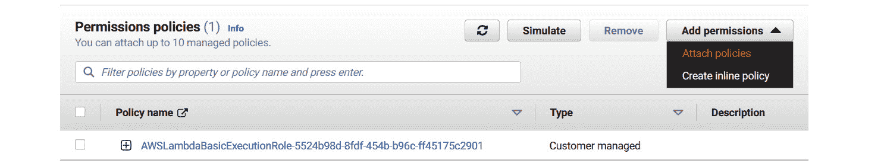

图 2.7 – 附加权限

让我们赋予 Lambda 函数对 EC2 服务的完全访问权限，因为我们还需要它来停止实例。如果你觉得这权限过大，也可以创建自定义角色：


图 2.8 – 附加适当的权限

1.  让我们重新运行一次，看看结果：


图 2.9 – 成功运行的代码

你将看到实例的展示，以及关于它们是否正在运行的信息。

1.  现在，让我们进入关闭正在运行的实例的部分。添加代码以在实例中进行筛选，找出正在运行的实例，并获取它们的 ID 列表，稍后我们将使用这些 ID 来引用我们希望停止的实例：

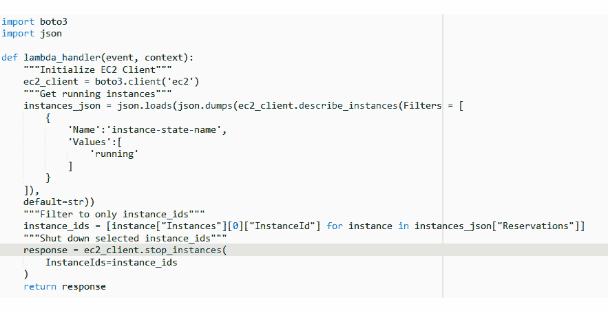

图 2.10 – 添加停止实例的代码

足够简单易懂，尤其是如果我们遵循可读性和明确性原则的话。

实例现在处于关闭状态，很快就会停止：


图 2.11 – 关闭实例

1.  现在我们已经做了一次，让我们通过使用名为 EventBridge 的服务进一步自动化它，EventBridge 可以每天触发该函数。前往**Amazon EventBridge**并创建 EventBridge 定时事件：

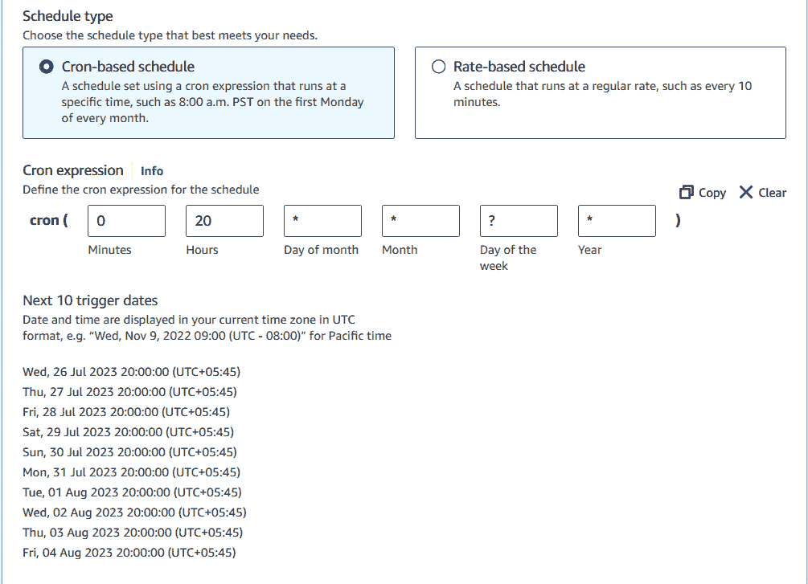

图 2.12 – 在 EventBridge 上设置定时任务

1.  选择我们的 Lambda 函数作为事件目标：

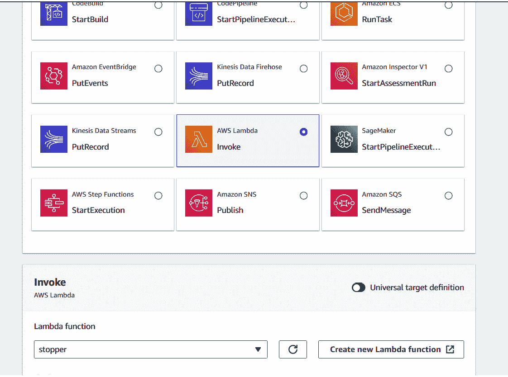

图 2.13 – 为 EventBridge 选择 Lambda 进行调用

现在，你可以创建 EventBridge 定时事件，该事件将在每天晚上 8 点触发，列出并关闭你的 EC2 实例。

所以，按照这些步骤，你现在拥有了必要的工具，可以根据你想要的定时计划安排实例的关闭。

## 自动拉取 Docker 镜像列表

拉取 Docker 镜像可能会很繁琐，尤其是当需要拉取多个镜像时。那么，现在我们将看看如何使用 Python 库同时拉取多个 Docker 镜像：

1.  首先，使用以下命令在虚拟环境中安装 Docker Python 库：

    ```
    pip install docker
    ```

1.  然后，编写一个名为`docker_pull.py`的脚本，循环遍历镜像名称列表，并通过利用 Docker 库拉取它们：

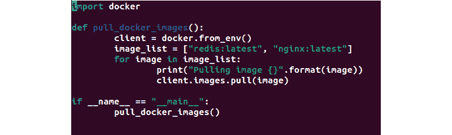

图 2.14 – 拉取 Docker 镜像的代码

1.  完成此操作后，使用以下命令运行文件：

    ```
    docker images command to check out the Docker containers that you may have locally:
    ```

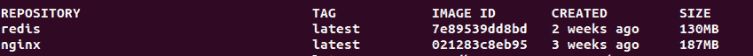

图 2.15 – Docker 镜像列表

所以，这为你提供了一种相当巧妙的方式，以你想要的标签获取 Docker 容器。

# 摘要

Python 不仅仅是写代码；它是一种编码哲学——这哲学使得 Python 在 DevOps 工程师中变得极为流行。Python 的 Zen（哲学）影响了语言的开发方式，至今我们仍能在 Python 和 DevOps 中看到这种影响。Python 的哲学为 DevOps 领域提供了符合其哲学的编程语言。

Python 有很多用途，可以促进许多 DevOps 任务的完成。所以，希望本章能为你提供一些关于 Python 为何是 DevOps 好伴侣的见解。在下一章，你将看到这种伴侣关系的实际应用，并学习如何以真正实践的方式运用你的知识。
