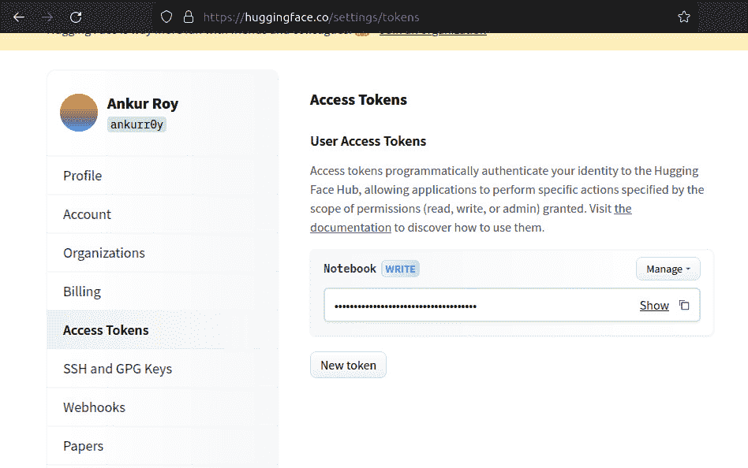
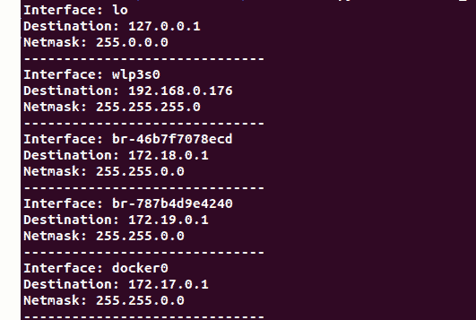

# 立即开始在 Python 中使用 DevOps 的最简单方式

事情不会自己发生。它们是被创造出来的。

—— 约翰·F·肯尼迪

在过去的几章中，你可能一直在思考，所有这些原则和理念倒是不错，但我想亲自动手！如果你想这样做，那这一章就适合你。在本章中，你将学习如何使用 Python 及其库来为你的工作负载服务。

现在，我并不是建议你从当前使用的工具转向基于 Python 的替代品。事实上，我们即将讨论的大多数工具和技术，旨在支持现有的基础设施和方法，而不是替代它们。

本章旨在让你充分了解 Python 编程语言为 DevOps 提供的各种可能性，以及如何将其集成到你现有的系统和基础设施中。

在本章中，我们将学习在 API 调用的不同方面中，如何使用 Python 的一些简单实现：

+   进行 API 调用以及不同的 API 调用方式

+   Python 如何帮助分析、构建和优化你工作负载的网络资源

# 技术要求

如果你想充分利用本章内容，有几个技术要求可能需要满足：

+   一个 GitHub 账户

+   一个 Replit 账户（与 GitHub 单点登录）

+   一个 Hugging Face 账户

+   一个 Google 账户

+   任何带有互联网连接和命令行界面的计算设备

+   能够容忍我的写作风格

好吧，如果你能拿到这些，那你就准备好开始本章的旅程了。我们开始吧。

# 引入 API 调用

要定义 API 调用，让我们从 **应用程序编程接口**（**API**）开始。API 是一种软件接口，提供了你应用程序访问其他应用程序功能和过程的能力。可以这样理解：当用户尝试从一个应用程序获取信息时，他们是通过 **用户界面**（**UI**）来实现的。API 对于软件有类似的功能，所以你可以把 API 看作是软件的 UI。

现在，API 调用是出于多种原因进行的：

+   你不想为一个大功能自己编写底层逻辑（相信我，很多时候你并不想）。

+   API 提供了你通常无法访问的资源（例如，通过云提供商的 API 创建虚拟机）

+   你只是想把一些信息引入到你的应用程序中（公共 API 非常适合这个用途）

你用于编码的任何库，技术上来说都是一个 API。你把这个库拉进来，然后调用它为你的应用执行某个功能。所以，你可以理解为什么 API 的定义有时会令人困惑。但重点是：更多的东西是 API，而不是不是 API。你在应用或网站中看到的一切，都是通过 API 实现的。

那么，让我们深入探讨一些如何在 DevOps 中利用 API 获得好处的例子。

## 练习 1 – 调用 Hugging Face Transformer API

我选择这个练习是因为它是免费的，它将向你介绍许多 API 背后的核心工具和概念，并且 **Hugging Face API** 相当流行，你将亲身体验这些 API。我们将使用的 API 具体是一个将文本提示转换为图像的 transformer。这是一个很棒的 API，可以帮助你了解和学习 API 的工作原理。对于这节课，我使用的是 Google Colab 笔记本，它是由 Google 托管的 Jupyter Notebook。它非常有用，当你想为某些代码部分重新创建运行时环境时，可以使用它。它就像是一个你可以分成更小部分的测试区域。如果你愿意，我们可以创建一个笔记本来进一步探索 Hugging Face API：

1.  要打开 Colab 笔记本，你可以访问 [colab.research.google.com](http://colab.research.google.com)，然后创建一个新的笔记本。最终结果应该是这样：


图 3.1 – 使用 Google Colab 创建的初始笔记本

1.  我们需要做的第一件事是安装正确的库。这些库包含了我们调用 API 所需的函数和模块。如果你愿意，你可以直接在笔记本中安装它们。我们将安装 `huggingface_hub` 和 `transformers[agents]` 库。以下是安装命令：

    ```
    !pip install huggingface_hub transformers[agents]
    ```

    当你将此命令输入到单元格中并按下播放按钮时，它将在你的运行环境中安装所需的库：


图 3.2 – 安装所需的库

1.  下一步是使用 API 密钥登录 `huggingface_hub`。

    这就是 API 密钥的概念来源。API 密钥就像是软件的登录凭证。大多数公司只有通过购买 API 密钥才允许完全访问其 API。像 Hugging Face 这样的许多开源项目也使用 API 密钥来推广和跟踪用户交互，有时还会为用户提供高级版本，如果他们需要的话。

1.  要获取 Hugging Face API 密钥，首先必须访问 [huggingface.co](http://huggingface.co) 网站并注册账户，或者如果你已经注册过，直接登录。完成后，进入个人资料页面，点击 **设置** 标签，然后进入 **访问令牌** 标签。在这里，你可以生成一个访问令牌进行使用：



图 3.3 – 为 Hugging Face API 生成访问令牌

1.  你可以复制这个令牌，并在下一部分代码中使用它。在这里，你导入 Hugging Face 登录模块以调用登录 API，并输入你的密钥来使用 API：

    ```
    from huggingface_hub import login
    login("<your_key_here>")
    ```

    如果你正确加载了它，你会看到此消息。如果是这样，恭喜你，成功调用了登录 API：


图 3.4 – 成功登录并初始化

现在来到有趣的部分。我们将使用 Hugging Face Transformer API 将一行文本转换成图像。但首先，我们必须使用`HfAgent` API 导入一个 Hugging Face 代理（看到模式了吗？）：

```
from transformers import HfAgentagent = HfAgent("https://api-inference.huggingface.co/models/ bigcode/starcoderbase")
```

我们在这里使用`starcoderbase`模型。一旦你运行它并获取了代理，你只需简单地输入提示即可生成一幅图像：

```
agent.run("Draw me a picture of `prompt`", prompt="rainbow butterflies")
```

但请记住，如果你不想等待半个小时来获取你的图像，可以转到**runtime**标签并选择 GPU 运行时：


图 3.5 – 选择 GPU 以加快图像处理速度

1.  最终产品将让你感到震惊和满意。你将得到如下内容：


图 3.6 – 你的最终结果（很漂亮，不是吗？）

因此，我们完成了这个练习，并成功调用了一个 API，给我们带来了一个视觉上令人满意的结论。还有什么比这更让人期待的呢？现在，如果其他人也能见证你的劳动成果就好了！

好了，这就是调用 API 的全部意义所在。API 旨在供目标受众使用，因此现在，我们将看看如何分发我们的 API。

## 练习 2 – 创建和发布一个供消费的 API

部署应用程序是 DevOps 工程师可能会遇到的最频繁的任务之一。拥有一个良好且快速的部署非常重要，但在此之前，首先要有一个部署。在许多方面，部署较小和较大的应用程序是相似的。它们之间主要的不同之处在于你必须为保持较大应用程序的可用性而采取的措施。我们在本节不会讨论这一点。我们将尝试为加法 API 准备一个 API，就像我说的那样，让我们保持简单并开始在一个新的**Replit Repl**中进行编码。

1.  在[replit.com](http://replit.com)注册一个账号。你可以为几乎每个应用程序框架和代码库创建小型虚拟环境。注册后，你可以通过点击**创建** **Repl**按钮来创建一个**Repl**，这是一个小型虚拟服务器：


图 3.7 – 创建 Repl 的按钮

1.  一旦完成，搜索并创建一个带有**Flask**模板的 Repl。名称不重要：


图 3.8 – 初始化 Flask Repl

这将为您提供一个包含预初始化和安装了基本 Flask 库的样板 Flask 代码的 IDE：


图 3.9 – 初始 Flask 框架

1.  关于前述的图，当你点击`"/"`时已经定义。因此，如果你在新标签页中打开该网址，你将会得到如下内容：


图 3.10 – 初始 Flask 网页

这个函数只是返回一个网页上的字符串。通常，API 是以 JSON 格式编写的。所以，我们将它转换为 JSON 格式。在 Flask 中，这是非常简单的。你只需在返回类型中传递一个字典变量：


图 3.11 – 在 Flask 中编写简单的 JSON API

完成后，你将得到一个 JSON 格式的返回值：


图 3.12 – JSON API 结果

1.  这个 API 目前只返回静态值。要让它接受用户输入，只需在 URL 中添加`request`参数。让我们修改应用程序，使其接受两个参数，`num1`和`num2`，它们将被加在一起，并在 JSON 返回值中显示它们的和：


图 3.13 – Flask API 代码，用于将两个数字相加

最终结果需要一个 URL，格式为`<your_url_here>/?num1=<number>&num2=<number>`。结果将类似于以下内容：


图 3.14 – Flask API 调用以将两个数字相加

所以，现在你已经学会了如何在 Python 中创建一个 API 来将两个数字相加并部署该 API。这是一个非常大的进步。编程世界中唯一会呈指数级复杂化的事情就是业务逻辑。安全性和网络同样重要，但它们通常遵循一定的公式。只要你能将你的逻辑部署到最终用户，你就可以了。

现在，你已经掌握了 API 的技巧，接下来我们将深入探讨如何将 API 交付给最终用户。我们将讨论网络。网络是 DevOps 和应用程序开发中不可或缺的一部分，以至于有时候它根本没有被提及。那么，接下来让我们看看一些我们可以在网络方面使用 Python 的有用方法。

# 网络

不，这不是在说如何扩展你的 LinkedIn 人脉，尽管我也推荐你去做这个。计算机网络对于当前每个应用程序的正常运行至关重要，因为它们是将持续价值交付给用户并保持他们与环境连接的唯一方式。如今，几乎每个设备都连接到网络，这也是为什么理解设备的网络和网络的网络（有个名字叫互联网，你听说过吗？）非常重要的原因。

接下来，我将演示两个如何使用 Python 进行网络分析和数据收集的例子。

## 练习 1 – 使用 Scapy 捕获数据包并可视化数据包大小随时间的变化

**Scapy**是一个 Python 库，可用于复制、模拟和操作通过计算机网络发送的数据包。Scapy 是任何开发者或 DevOps 专业人士工具箱中的一款非常有用的工具。

在这个练习中，我们将使用 Scapy 收集数据包列表，并获取它们的时间戳和数据包大小。然后，我们将这些信息映射到我们使用**matplotlib 库**制作的图表上。您可以使用前面提到的 Google Colab 来进行这个练习。那么，让我们初始化笔记本并开始编写代码：

1.  首先，我们需要安装 `matplotlib` 和 `scapy` 库：

    ```
    !pip install scapy matplotlib
    ```

1.  现在，让我们编写代码，使用 Scapy 的 `sniff` 模块获取时间戳上数据包大小的列表：

    ```
    from scapy.all import sniff
    # Lists to store packet sizes and timestamps
    packet_sizes = []
    timestamps = []
    #Handle packets and get the necessary data
    def packet_handler(packet):
    print(packet)
    packet_sizes.append(len(packet))
    timestamps.append(packet.time)
    # Start packet sniffing on the default network interface
    sniff(prn=packet_handler, count=100)
    ```

    您将获得最近通过您的网络的 `100` 个数据包的长度列表，并附带时间戳和流量类型。如果您参考以下示意图，数据包大小存储在 `packet_sizes` 数组中，数据包的时间戳存储在 `timestamps` 变量中：


图 3.15 – 在您的计算设备中嗅探数据包

1.  现在让我们编写代码，使用 `matplotlib` 绘制随时间变化的数据包大小：

    ```
    # Create a plot
    plt.figure(figsize=(16, 8))
    plt.plot(timestamps, packet_sizes, marker='o')
    plt.xlabel("Time")
    plt.ylabel("Packet Size")
    plt.title("Packet Size over Time")
    plt.grid(True)
    plt.show()
    ```

    这将给我们一个图表，*x* 轴为时间，*y* 轴为数据包大小：


图 3.16 – 随时间变化的数据包大小图表

上面的图表显示了网络活动模式，看起来涉及多个相关的数据包。所以，您可以看到网络分析库已经开始派上用场了。

所以，现在我们已经追踪了我们的网络活动，并通过 Python 生成了数据洞察。让我们看看另一个网络实现，这次重点关注您的设备（或您运行工作负载的设备）所拥有的路由规则。

## 练习 2 – 为您的设备生成路由表

路由表定义了某些网络流量在您的设备中所经过的路径。这些表几乎存在于每个设备中，并且定义了设备访问计算机网络的路径。您可以使用**netifaces Python 库**来生成路由表，显示设备中所有可用的路径和目的地。在这种情况下，netifaces 库用于收集操作系统的网络接口（因此得名 *netifaces*）。然后，您将解析这些信息并以表格形式展示。您仍然可以使用 Google Colab 来完成此操作，尽管为了获得更有趣的结果，您可以尝试在本地运行代码。

1.  让我们开始为您的设备生成路由表的步骤。如果您一直跟随到现在，您已经知道第一步是安装库：

    ```
    !pip install netifaces
    ```

1.  接下来，编写代码来生成路由表：

    ```
    #import library
    import netifaces
    #begin function
    def generate_routing_table():
    routing_table = []
    #Loop through network interfaces
    for interface in netifaces.interfaces():
         #initialize current address of interface
    Interface_addresses =netifaces.ifaddresses(interface)
    #Check for, then loop through the addresses
    if netifaces.AF_INET in addresses:
    for entry in  	interface_addresses[netifaces.AF_INET]:
    	#Create routing entry wherefound
    if 'netmask' in entry and 'addr' in 	entry:
    routing_entry = {
    'interface': interface,
    'destination': entry['addr'],
    'netmask': entry['netmask']
    }
    #Append route to routing table
    routing_table.append(routing_entry)
    return routing_table
    #Call function
    routing_table = generate_routing_table()
    #Display routing table
    for entry in routing_table:
    print(f"Interface: {entry['interface']}")
    print(f"Destination: {entry['destination']}")
    print(f"Netmask: {entry['netmask']}")
    print("-" * 30)
    ```

    这段代码很多，但相当容易理解。它还为您提供了有关网络流量从网络接口到哪里去的详细信息。如果您按照我建议的在 Colab 上试过，您会得到类似这样的结果：


图 3.17 – Colab 上的路由表

如果你在个人计算机上操作，可能会得到如下所示的结果：



图 3.18 – 个人计算机上的路由表

这里增加了一些额外的负担。

但这就是要点，这只是你可以使用 Python 来促进 DevOps 网络部分的一些方法。

# 总结

在这一章中，你学到了一些关于本书动手部分的内容。你了解了 API 和计算机网络，这几乎意味着在 Python DevOps 实现方面，你已经走了一半的路。

在这一章中，你不仅了解了这些重要的 DevOps 概念，还学到了如何在你的 DevOps 流程中实现它们。如果对你有帮助，你可以直接将这段代码应用到你的 DevOps 工作负载中。

你所学到的这些基础知识将帮助你在几乎任何你可能遇到的 DevOps 工作负载中进行增强、监控和故障诊断。在下一章中，我们将讨论如何在 DevOps 工作负载中创建资源，以及 Python 在这一过程中如何提供帮助和发挥作用。
