# 第四章：提供资源

生活是混乱的，危险的，充满了惊喜。建筑物应该反映这一点。

– 弗兰克·盖里（著名建筑师）

**DevOps** 是资源的游戏。是将你拥有的资源放到正确位置的游戏。听起来很容易，但实际上并非如此。资源的获取基于 DevOps 工程师收到的多个标准和要求。如果你想要最优地提供资源，那么你必须理解背后的逻辑和推理，以及底层基础设施使用策略背后的战略。

如果你想要以简单的英语来表达这一切：只拿你所需的。

所以，这将是本章的一个基本概念之一：权益调整。**权益调整**是找到你的应用程序或工作负载的最佳资源大小的艺术。很多时候只是试错（通常是你自己的，但如果可能的话，是别人的），相信我说这一点，现代 DevOps 景观中，以编程方式进行比手动方式要容易得多。

但说起来容易做起来难，因为有时你的资源承载的负载远大于你配置的资源的大小，特别是如果你的应用程序变得流行起来。你成为了自己成功的受害者。或者你配置了最大容量的资源，但那种容量只是偶尔需要，而你不可能及时增加你的资源。

这引出了本章的第二个基本概念：扩展。**扩展**你的资源的增减是 DevOps 的重要方面之一，而删除资源与提供资源同样重要。这几乎总是以编程方式完成的，我们将看看 Python 如何帮助我们做到这一点的几种方式。

如果你掌握了这些概念以及如何有效地使用它们，你可以为你和你的组织节省大量的时间、金钱和资源。此外，你将能够以满足组织和客户需求的方式应对需求激增。

在本章中，我们将探讨以下内容：

+   如何使用 Python 配置虚拟资源

+   如何使用各种云的 Python SDK，并通过它们来提供资源

+   扩展工作原理，扩展的类型以及选择正确的扩展类型

+   如何使用资源的容器化可以帮助权益调整和更容易的提供资源（以及 Python 在其中的角色）

# 技术要求

这里是完成本章练习所需满足的要求列表：

+   安装 Python，并安装了 boto3、Kubernetes 和 Docker 库

+   一个 AWS 账户

+   熟悉如何使用 Jupyter Notebook

+   如果你使用 Windows，使用**Windows Subsystem for Linux**（**WSL**）来本地使用 Docker

+   一个 GitHub 账户，以及 Git 和仓库的基本知识

+   本书代码库的访问地址：[`github.com/PacktPublishing/Hands-On-Python-for-DevOps`](https://github.com/PacktPublishing/Hands-On-Python-for-DevOps)

+   对虚拟化和 Kubernetes 的基本理解

# Python SDK（以及为什么大家都在使用它们）

从头开始讲。**SDKs**（即 **软件开发工具包**）是由平台发布的官方编程库和 **CLI**，它们允许开发者开发能够利用该平台的工具和应用程序。这些 SDK 通常使用非常流行的语言编写，以覆盖尽可能多的开发者。

三大云平台（大多数 DevOps 工作都在这些平台上完成）在其 SDK 中共享以下编程语言：**Java**、**.NET**、**C++**、**Go**、**JavaScript**/**TypeScript**/**Node.js** 和 **Python**。如果你从事这些工作——而你从事其中一项的可能性远大于不从事——你需要选择一门编程语言。

那么，问题就变成了，为什么是 Python？而且，为什么我们要在本书的四个章节后才提出这个问题？我来告诉你。Python 恰好是那种松散和结构化之间的平衡，它是实现许多 DevOps 原则所必需的。

严格类型化的语言，如 Java、.NET 和 C++，对于开发来说是不错的选择，但对于现代 DevOps 工作负载所需的灵活性，它们将产生糟糕的结果。话虽如此，大多数云平台都是建立在这些语言上的。但在这些语言上进行操作完全是另一回事。把这些语言看作是提供坚固性的骨架，而把 Python 看作是提供灵活性的关节——它们应该存在于任何需要灵活性的地方。

然后，在另一个极端，你会看到那组 JavaScript 三重奏。即使这些语言得到了主要云平台的大量支持，它们有时仍然不适合这个用途，原因在于它们固有的局限性和语法怪癖。这些语言本来并不是为了这样原生工作，而且它们是单线程的，难以并发操作。

在这一领域，Python 的主要竞争对手，有时也是合作伙伴的是 Go。让我告诉你，Go 很棒。大多数云端工具，比如 **Docker** 和 **Kubernetes**，都是用 Go 编写的，而那些不是用 Go 编写的，通常是用 Python 编写的。但是，Go 真的可以与 Python 一较高下，它在 DevOps 中的实用性不容小觑。我之所以这么说，是因为在本章中，我将处理很多用 Go 编写的框架，比如 **Terraform** 和 Docker。

了解了所有这些信息后，让我们终于将注意力重新集中到 Python 上。Python 是非常宽松的。它具有不需要严格数据类型的变量赋值，这对于松耦合的服务非常有用，而松耦合服务是一种非常常见的架构选择。它拥有一个庞大的社区，几乎总是现代基础设施提供商首先提供的 SDK。如本节前面所提到的，Python 本质上可以与任何用任何语言编写的框架建立共生关系。如果有一个流行的框架或工具，它的 Python 版本很可能会得到良好的维护并及时更新。

这是快速了解 Python SDK 的重要性和受欢迎程度，现在，我们将看到一个示例，展示 Python SDK 如何用于配置资源。

## 使用 Python 的 boto3 库创建 AWS EC2 实例

**Boto3** – 这是你如果在 AWS 和 Python 中工作过，可能经常听到的名字。它是包含几乎所有当前可用的 AWS 服务的 SDK，适用于 Python。

在这个示例中，我们将使用 Boto3 在脚本中创建一个 EC2 实例，供你在 AWS 账户中使用。这听起来很简单，但为了实现这一目标，你仍然需要遵循很多步骤，所以让我们开始吧。首先，我们将登录到 AWS 账户并搜索 Sagemaker 服务。让我们深入了解：

1.  对于这个练习，我们需要一个干净的环境，既能编写 Python 代码，又能在终端中配置权限。为此，在我的 AWS 账户中，我将创建另一个我们稍后会用到的东西：一个**Sagemaker**笔记本。Sagemaker 笔记本是一个在 AWS 服务器上运行的 Jupyter 笔记本服务：

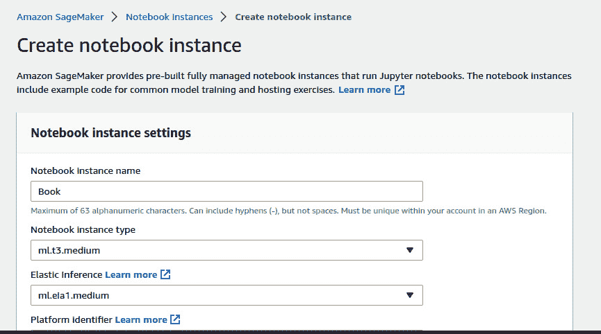

图 4.1 – 在 Amazon Sagemaker 中创建笔记本实例的控制台

如果你查看顶部的面包屑导航，你会看到路径是**Amazon Sagemaker** -> **Notebook 实例** -> **创建** **Notebook 实例**。

1.  任何较小的笔记本都可以。我们将在这个练习中使用**ml.t3.medium**：


图 4.2 – 已创建的笔记本

一旦你的笔记本启动并运行，点击**打开 Jupyter**，进入你的**Jupyter IDE**。现在，实例本身将具有一些 AWS 权限，因为它是 AWS 创建的，但还不足以程序化地配置 EC2。然而，它将预装 boto3 和**AWS CLI**。

重要提示

如果你没有安装它们，可以通过`pip`安装`boto3`，并通过 AWS 官网[(https://docs.aws.amazon.com/cli/latest/userguide/getting-started-install.html)](https://docs.aws.amazon.com/cli/latest/userguide/getting-started-install.html)安装 AWS CLI，官网提供了适用于所有操作系统的安装程序。

1.  现在，让我们尝试使用 Sagemaker 预先分配的现有角色来配置 EC2：

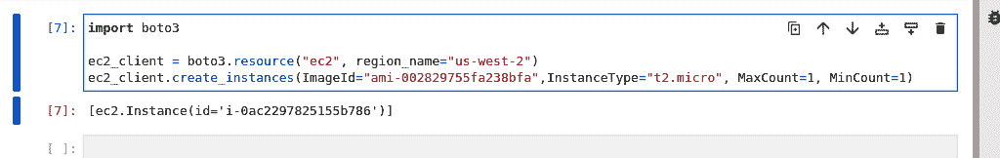

图 4.3 – 调用 boto3 API 的代码

它成功了。但是，正如你在这里看到的，Sagemaker 实例已经预先配置了一个具有 EC2 访问权限的角色。如果情况不是这样，你将不得不授予角色一些权限或使用 AWS CLI 将角色配置文件附加到实例上。但它起作用了，这太棒了。你可以在 AWS 控制台上查看你的 EC2 实例。

但是，在这里需要注意几点：

+   你总是需要定义一个 `ImageID`（AWS 有一个公共目录）。我使用的是 AWS 的专有 Linux 版本。

+   您需要定义实例大小以及要创建的实例的最大和最小数量。

现在，这很简单易懂，不是吗？好的。现在我们可以继续讨论使资源配置如此必要的概念。缩放和自动缩放是 DevOps 中至关重要的概念，它们都只是资源配置的问题。

# 缩放和自动缩放

**缩放** 是根据需求增加或减少工作负载或资源的大小的行为。**自动缩放** 是根据某种触发器自动执行此操作。

在工作负载和应用程序的情况下经常会发生这种情况，你可能会成为自己成功的受害者。你的应用程序成功越多，由于用户或服务的需求而对其造成的压力就越大。要管理这种压力通常需要限制对你的应用程序的访问。如果你不想被请求压倒，你应该这样做，相信我，因为肯定会有人试图做到这一点。但你也应该在你的基础设施中有能力让它随着用户基数的增长而自然增长。

这就是缩放发挥作用的地方。缩放可以通过垂直方式（向设备添加更大的计算能力）或水平方式（添加更多计算机）来进行。在执行一项强大的操作时，垂直缩放是理想的选择，在处理更多请求时，你将需要水平缩放。大多数 DevOps 工作负载需要后者而不是前者。

现在，我们将探讨基于你需要处理的工作负载的参与程度而不同的缩放类型。我们将从手动缩放开始，逐步升级到更自动化的方法。

## 使用 Python 进行手动缩放

在我们深入讨论自动缩放之前，让我们看看一些常规的缩放（当然要使用 Python）。我们将使用 Python 的 SDK 手动垂直缩放一个实例。我只是使用我的常规本地 IDE。但你可以使用任何组合的 Python、AWS CLI 和 AWS 账户来执行此操作。所以，让我们进入使用 Python 脚本手动缩放 EC2 实例的步骤：

1.  这是创建 EC2 实例的代码（这也将在书的存储库中发布）：

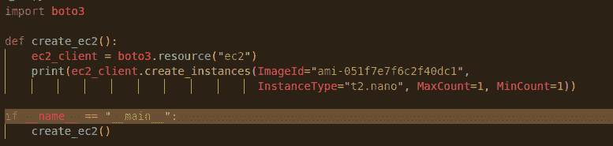

图 4.4 – 创建 EC2 实例的功能

当你运行它时，你会得到实例 ID（你在下一部分中需要用到它）：


图 4.5 – 创建具有唯一 ID 的 EC2 实例

你会看到，在 AWS EC2 控制台上已创建具有相同实例大小和 ID 的实例：


图 4.6 – 运行中的 EC2 实例

1.  现在，垂直扩展作用于同一个实例，但实例大小在运行时无法更改，所以我们需要先停止该实例：

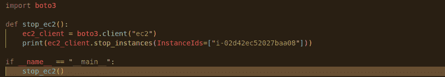

图 4.7 – 停止 EC2 实例的功能

这段代码在运行时会停止实例。确认实例已停止，并注意实例的大小仍然是**t2.nano**：


图 4.8 – 停止的 EC2 实例

1.  现在，让我们编写代码，将实例修改为`t2.micro`实例：

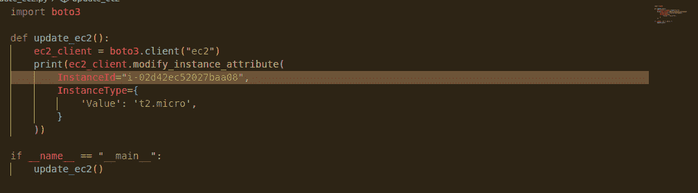

图 4.9 – 更新 EC2 实例的代码

运行这段代码后，你会发现控制台上显示的实例现在是**t2.micro**实例：


图 4.10 – 更新后的 EC2 实例大小

1.  因此，一旦你重新启动实例，它将具备额外的计算能力。

你可能已经注意到，这是一个缓慢的过程。而垂直扩展 – 在很多情况下 – 都是一个停机的缓慢过程。尽管这种做法有其应用场景（尤其是在需要使用更强大单机的情况下），但这并不是常态。通常，水平自动扩展更适合你的使用场景，因为它关联的停机时间较少。接下来我们会深入探讨这个问题。

## 基于触发器的 Python 自动扩展

自动扩展需要根据某些度量标准或统计数据自动增加可用的计算资源。为了实现自动扩展，我们需要设计一个机制，当某个度量标准或阈值达到时，它会触发我们的 SDK 调用。

请理解，从单一云平台的角度来看这个例子，可能会觉得它有点不切实际，因为大多数云平台都内置了自动扩展。关键在于如何微调这个自动扩展。我将创建一个**自动扩展组**，并使用 Python 脚本定义扩展的阈值。然后，我将修改这些阈值，修改后我会告诉你为什么这么做的意义。

让我们编写一个基本脚本，创建一个自动扩展组，并使用 CPU 利用率策略设置阈值。我们将从启动配置、自动扩展组到实例扩展的规则一步步来：

1.  首先，我们编写代码，创建一个启动配置，所有自动扩展组中的机器都会遵循这个配置：

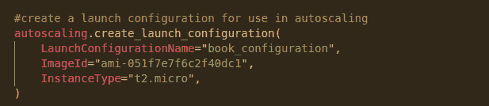

图 4.11 – 创建启动配置的代码

1.  接下来，我们创建自动伸缩组，该组使用我们之前创建的启动配置：

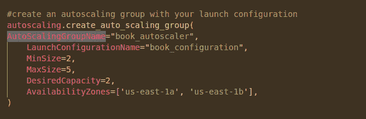

图 4.12 – 创建自动伸缩组的代码

1.  最后，我们将创建一个策略，如果 CPU 利用率超过 70%，则向上扩展该组：

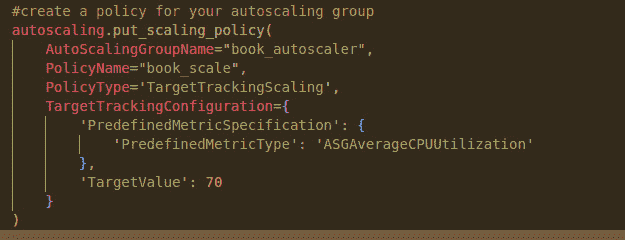

图 4.13 – 创建伸缩策略的代码

运行这些操作将为你提供一个具有这些规格的基本虚拟机自动伸缩组。现在，你可能会问，Python 在这个自动伸缩中起什么作用。好吧，为此，你首先需要查看这些虚拟机生成的指标。

如果你查看虚拟机生成的指标，你将能够找到它们的 CPU 利用率指标，并且这些指标可以被导出。利用这些指标，你可以计算一段时间内 CPU 的平均利用率（据说是编程语言 Python 帮助的），然后使用这些数据来找到更好的自动伸缩目标。要修改目标，你可以简单地使用与之前相同的代码，只需更改指标值：

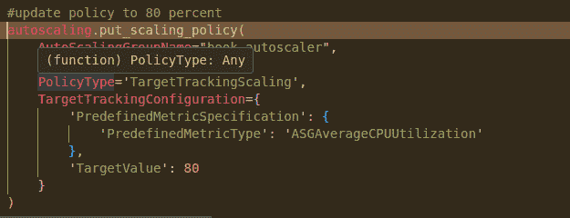

图 4.14 – 修改后的伸缩策略代码

你的数据分析结果甚至可能揭示出，比 CPU 利用率更适合你工作负载的指标。你也可以在这里修改它。

这种类型的伸缩非常有用，很多情况下你肯定会用到它们。然而，这并不是实现伸缩和虚拟化的唯一方式。在下一节中，我们将探讨容器及其在伸缩和虚拟化领域中的角色和目的。

# 容器以及 Python 在容器中的角色

**容器**是小型的软件包，作为独特的运行时，包含运行应用程序某个小部分或有时整个应用程序所需的所有资源。

容器本身是用 Go 语言编写的，容器编排服务 Kubernetes 也是如此。除非应用程序代码本身是用 Python 编写的，否则这些部分不需要 Python。Python 的作用是作为各种容器化服务之间的胶水。可以说，它是在编排中的编排。

现在，我们将了解 Python 在整个容器体系中的角色。Python，一如既往，拥有许多支持容器和 Kubernetes 使用的库，我们将探索其中一些库，以及如何利用 Python 简化与这些重要基础设施元素相关的 DevOps 工作。

## 使用 Python 简化 Docker 管理

保持 Docker 镜像整齐有序是很有挑战的。这就是为什么他们发明了 Kubernetes。但 Kubernetes 本身也很复杂。这留下了两个空白：

+   首先，当有多个 Docker 镜像，但不需要完全使用 Kubernetes 进行编排时

+   第二，当 Kubernetes API 需要频繁调用或集群需要频繁更新时

对于这两种用途，Python 都是一个有用的工具。记住，这只是辅助支持，而不是重构。我们是辅助角色。

所以，在这一节中，我们将通过一个例子来展示如何使用 Python 管理多个容器。

我们将编写一个脚本来获取特定的 Docker 镜像并为其创建一个容器。这个脚本可以重复运行，完成相同的操作。如果容器出现故障，你也可以使用`restart`命令。现在让我们看一下拉取 Docker 镜像并启动容器的代码：

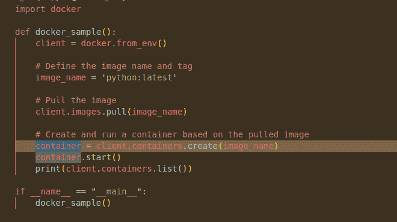

图 4.15 – 拉取 Docker 镜像并启动容器的代码

这很简单，但这正是关键所在。它的简洁性为进一步改进提供了基础。

即使我们保持简单，有时容器的使用也变得复杂，这就是 Kubernetes 发挥作用的地方。使用 Kubernetes 也会带来一些挑战，这些挑战可以通过 Python 进行简化和管理。

## 使用 Python 管理 Kubernetes

在你使用容器的过程中，总有一天 Kubernetes 会成为你需要的解决方案。这时，Python 也能提供帮助。Python 可以简化许多 Kubernetes 管理任务，而且由于大多数 Kubernetes 工作负载运行在云端，这些 SDK 也会非常有用。

我只会提供一个例子，即操作 Kubernetes 命名空间。为了安全起见，我们不希望因为计算资源问题而崩溃，尤其是当你对 Kubernetes 还不熟悉时。

**命名空间**是 Kubernetes 集群中的抽象，用于根据特定标准划分计算资源。标准可以是环境（开发、生产等）、网络限制，或基于可用的资源配额来定义命名空间。

你可以使用 Python 来创建和修改命名空间，并操作其中的资源。让我们来看一下初始化 Kubernetes 集群并使用 Python 管理它的步骤：

1.  首先，你需要通过以下命令使用`pip`安装 Kubernetes：

    ```
    pip install kubernetes
    ```

1.  接下来，让我们写一个脚本，在我们的集群中创建几个命名空间。我们可以稍后为这些命名空间添加资源：

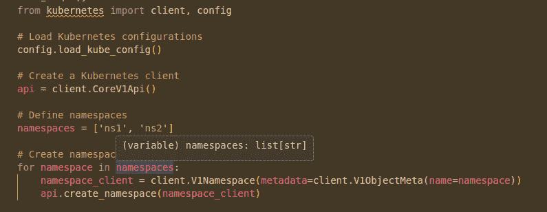

图 4.16 – 从列表创建 Kubernetes 命名空间的代码

1.  现在，让我们为这些命名空间写一个策略，并将其实施到 Kubernetes 中：

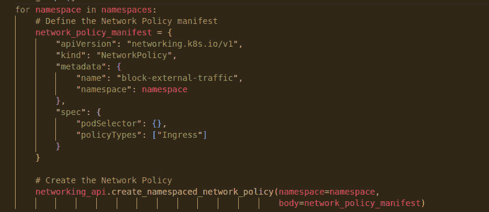

图 4.17 – 为命名空间创建实施策略

这将为两个命名空间创建策略，阻止来自命名空间外部的外部流量。正如你所看到的，我们使用迭代器对两个命名空间实施了相同格式的策略。这只是使用 Python 在 Kubernetes 中进行自动化的众多方式之一。

最终，你可以将这些步骤自动化到一个程度，只需列出并可视化你的 Kubernetes 集群，按几个按钮就能根据需求调整。其他所有事情，集群将自动处理。

# 总结

本章让我们在使用 Python 的过程中进行了相当一番探索。我们搞清楚了 SDK 如何工作，它们的优势是什么，以及为什么 Python 在 SDK 使用的世界里如此有用。你几乎可以在应用之上再构建应用，我亲眼见过。

我们还学习了扩展性问题，以及如何因为需要在可用性和成本之间找到平衡而变得麻烦。这里，我们也发现了 Python 及其强大的 SDK 和数据处理能力的作用，帮助我们实现了这种平衡。

容器也得到了 Python 库的强力支持，这些库可以帮助填补 Docker 与 Kubernetes 之间的空白。我们了解了 Python 在管理这些服务中的辅助作用。

所以，总结来说，在这一章你学到了许多关于 Python SDK 的内容，包括如何使用它们进行自动扩展、调整大小以及管理容器。在下一章，我们将更详细地探讨如何使用 Python 操控和与已经配置好的资源进行交互。

# 第二部分：Python 在 DevOps 中的示例实现

本部分将涵盖一些常见 DevOps 用例的 Python 示例实现。

本部分包含以下章节：

+   *第五章*，*资源操作*

+   *第六章*，*使用 Python 进行安全性与 DevSecOps*

+   *第七章*，*自动化任务*

+   *第八章*，*理解事件驱动架构*

+   *第九章*，*使用 Python 进行 CI/CD 流水线*
