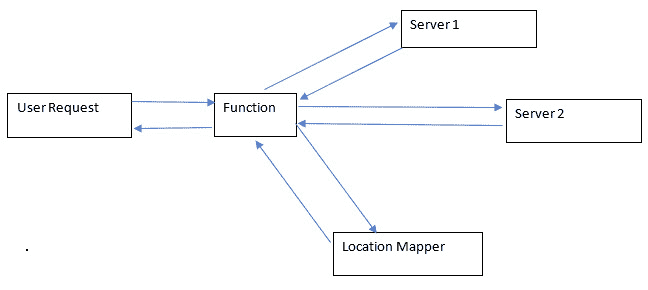

# 5

# 操作资源

在这枚戒指中，他倾注了自己的残忍、恶意和支配一切生命的意志。一枚戒指，统治所有人。

– 加拉德瑞尔（《魔戒》）

在上一章中，我们讨论了如何创建资源。我们讨论了使用自动化每次都能正确配置资源的规格。那么，对于已有资源怎么办呢？

在一些实际场景中，你可能需要处理一些你没有从零开始创建的项目或工作负载，或者需要非常小心地调整它们。你也可能会与一些你控制权较小的资源打交道，比如在云中由云服务商管理的托管资源。

操作自己创建的资源很容易，但这些遗留资源和控制较少的资源是**DevOps**工程师的挑战。征服这些挑战需要学习如何操作资源，使其更符合 DevOps 理念。这可能涉及资源、代码、架构过程的改变，或者只是更好地理解工作负载，我们可以运用 DevOps 理念，使资源得到更好的配置和更好的性能。

说到性能，未来性能的最佳指标之一就是过去的性能。如果资源的使用情况能为我们提供一个模式，我们就可以利用这个模式来更好地预测资源的配置，并简化我们的工作负载。此外，任何关于使用模式的洞察，尤其是 DevOps 团队和应用团队如何处理资源并响应事件的方式，都是未来参考的有用信息。

采取预测性的方法非常有用，但这些预测必须建立在坚实的数据基础上。如果我们要进行预测和适应，必须根据某种逻辑来进行。这种逻辑必须被理解（这个世界上有些人做事只是因为别人告诉他们应该这么做，他们有用，但不能适应变化）才能采取有效的行动。

本章的主要目标是帮助你学习如何查看已有资源，并充分利用它们。这意味着了解资源如何扩展和缩减，以及这些资源的历史和历史组成部分。

本章将涵盖以下主题：

+   使用 Python 作为事件触发器来调整资源以适应需求

+   分析实时和历史数据，并将其应用于未来的工作负载

+   逐步重构一个遗留应用

# 技术要求

完成本章，你将需要以下内容：

+   一个 GitHub 账户

+   Python

+   一个 AWS 账户

# 基于事件的资源调整

资源就是金钱。字面意思。在 DevOps 的世界里，常规做法是，你使用的资源越多，花费的金钱也就越多。这一点很简单，对吧？但是问题在于，当这些资源的回报不足以覆盖其成本时，问题就出现了。这种情况发生的主要原因之一是，资源的消耗是按照固定的速率进行的，即使它们并不需要。为了实现最优的资源消耗，出现了一种新方法：资源只有在实际使用时才会消耗，之后会根据需要适当缩减，直到下次使用。假设你正在进行购物狂欢。你并不清楚自己究竟会花多少钱，只是大致知道会在物品上花费多少。你很可能会超出自己预设的预算，除此之外，你可能还不一定对自己买的每一件商品感到满意。

DevOps 很像这种情况——它涉及到商品（资源）、你在这些商品上花费多少以及你能从中获得多少价值。保持购物/开销预算的一种常见方式是做一个漂亮的电子表格，记录下每一项支出。在这里，DevOps 也有相似之处，尽管在 DevOps 中，通常你会得到资源提供商提供的确切报价，并且你能比买菜更容易找到更好的交易——相信我。

现在，购物部分的最后一步是根据你所遇到的情况调整你购买的商品，对吧？如果你的朋友是素食主义者，你就做素食。如果他们得了糖尿病，菜单上就不再有糖分。如果你自己一个人，你可以买一桶冰淇淋，没有人会评判你。这正是我们希望在基于事件的调整中实现的目标。你可以根据接收到的事件类型来调整所提供的资源。你可以观察当前的事件，并相应地调整你的资源。

我们将通过几个例子来展示这个概念——一个涉及到本地化内容的全球分发，另一个涉及到对网站的新功能进行小范围用户测试。

## 基于边缘位置的资源共享

我们在全球应用中面临的最困难的挑战之一就是资源的加载时间。如果用户距离最近的数据中心太远，可能会导致他们使用应用时出现显著的延迟和卡顿。因此，大多数有大规模应用的公司都会在人口密集区域/网络流量高的区域设置数据中心和边缘缓存。**边缘**或**边缘位置**只是一个离目标用户更近的数据中心，使得他们的加载时间更快。**边缘缓存**是存储在边缘位置的用户和网站数据（如 cookie），用于加速该用户的访问。这有助于用户快速访问能够提供最快响应的数据中心。

然而，现在的问题是，我们如何将这些用户引导到能够为他们提供最低延迟的适当数据中心或缓存？为了做到这一点，我们必须找到一种获取用户设备位置数据并将该数据用于重定向用户到最近数据中心的方法。

为了实现这一点，我们可以编写一个函数，从网页流量请求中提取特定的头部信息。让我们看看这段代码：

```
''' the request variable is a json that contains the request headers and body'''def process_request(request):'''get all headers'''headers  = request["headers"]''' we're using country in this example, but this is any arbitrary header you 	choose to pass '''request_country = headers["country"]''' throw to a function that maps each available server to a country '''server = server_map(request_country)''' return value from correct server as prescribed by server map '''return server_response(server, request)
```

这段代码的作用是挑选出国家头部，你需要自己定义（这是件好事，因为你可以自定义它），然后将网页请求引导到适当的服务器。请求和响应之间的这个小层能够对连接质量产生奇效。你可以在随后的图中看到这一点：



图 5.1 – 用于服务器位置映射的功能

现在我们已经学会了如何将用户重定向到自定义位置，让我们看看如何将功能重定向到一组自定义用户。

## 在一小部分用户上测试功能

当一个应用程序需要实现新功能，应用程序团队希望在实时环境中测试该功能时，就需要一种机制将一小部分用户分类到将接收该新功能的组中。从这个组中获得的分析数据将用于根据特定标准评估该功能及其效果。反向操作——移除功能——也是这样进行的。如果你还记得 YouTube 删除他们不喜欢按钮上的数字时发生的情况，一些用户因为他们缓存的网站版本仍然保留了数周。即使如此，浏览器扩展程序也出现了，从 YouTube API 中提取正在观看的视频的不喜欢数字（直到 YouTube 完全从他们的 API 中删除这个功能）。

现在，你可能会想知道，鉴于这个功能可能已经在推出之前经过了一次又一次的测试，为什么还需要进行这样的测试呢？好吧，事实是这样的：

+   **也许并不是**: 你会惊讶地发现，有多少公司愿意为一小部分用户推出新事物，而不经过用户验收测试。更令人惊讶的是，有时这并不是一种坏策略（但如果你要这样做，我建议你用我接下来要给你的示例）。

+   **用户会弄乱事情**: 这是用户的本性，他们会以测试人员无法理解的方式搞砸事情。你无法完全理解人类的本性和其背后的混乱，而你所做的任何发明都必须经过其考验。采用更加受控的方法需要将你的工作扔给一小部分混乱，希望它能够经受住考验。

这种测试方法通常被称为**A/B 测试方法**。

既然这些都解决了，我们就可以开始实施了。这个实现与边缘位置的实现非常相似，并且涉及到一个在这一方面非常相似的代理。

我们将以两种方式对用户进行子集划分：随机划分和基于某些标准划分。首先，让我们看看用于随机分配用户请求的代码（20% 分配到一台服务器，80% 分配到另一台服务器）：

```
''' get request from user '''def process_request(request):''' get a random number between 1 and 10 '''num = random.randrange(1,10)''' conditionally return site containing special feature '''if num<=2:return special_response(request)else:return regular_response(request)
```

如果你愿意，可以选择一个不那么随意的范围。只需记得以不同的方式追踪这两个响应之间的统计数据，以获得正确的洞察。另一种选择是**功能标志**，但这需要根据特定标准将用户划分为子集，这正是我们在接下来的代码块中要讨论的内容。如果你不想区分用户或无法区分，只是想要活动数据，那么前一种方法是不错的选择。

```
''' get request from user '''def process_request(request):'''get request header with feature flag '''header = request["header"]feature = header["feature"]''' Check if feature flag is turned on, i.e. if it is True or False '''if feature:return featured_response(request)else:return normal_response(request)
```

在这里，我们可以看到启用了功能标志的用户获得了特色响应（如果他们的功能标志开启，他们会收到的独特响应）。这些特色响应与常规响应不同。功能标志的激活可以是对数据库的随机编辑，或者是提供给用户的选择加入优惠。再次强调，这两个资源的数据需要区分开来，以确保最大效果。

说到数据（我一直在说），现在我们拥有了来自使用功能标志的用户和未使用功能标志的用户的所有分析和操作数据，以及所有这些事件的发生，我们必须对这些数据做些事情——我们需要分析它并生成洞察。

# 数据分析

我发现——作为一个成年人——我越来越变得对自己更有责任感。然而，这种责任以及我现在的这个人，来自我过去的一系列事件。错误、成功和介于其中的一切，塑造了我和我对生活的态度。

我的许多生活方法也恰好是我对 DevOps 的方法——这就是事情的演变过程。通过我在生活（和 DevOps）中的经验，我发现了两件事：你必须为现在的自己而活，而这个人是由你的过去定义的，但又不完全是过去的那个人。

你的工作负载遵循类似的模式。它基于你的历史，但不能完全被认为是以前的样子。代码可能已经改变，基础设施也不同，甚至实施它的人员很可能已经发生变化。然而，尽管如此，过去的经验中仍有值得学习的教训。重要的教训。

在本书的早期部分（准确地说是*第一章*，《引入 DevOps 原则》），我强调了**监控**和**日志记录**的必要性，并表示这些是处理事件和维护工作负载历史性能的绝佳工具。现在，我们将开始探索如何利用这些历史性能为我们提供可用的洞察。

我们将讨论几种分析技术：**实时数据**分析和**历史数据**分析。每一种都有其挑战。每一种都可以作为解决相当常见的 DevOps 问题的模板。

## 实时数据分析

实时或流式数据是系统当前不断处理的数据。它是系统接收或返回的数据。一个系统依赖于它所吸收和生成的数据（*输入* -> *处理* -> *输出*）。系统是由这些数据塑造的，有时，在关键系统中，它需要由这些数据来塑造。要根据最近的数据做出战术决策，收集实时数据并对其进行即时分析是必需的。

大多数云服务和监控系统都提供了存储和分析实时数据的默认方式。通常情况下，它们非常有效。它们可以存储数据，并在一定程度上生成数据的洞察。然而，有时需要采用自定义方法，这就是 Python 的优势所在。不是因为速度，而是因为方便性和预构建的分析库，Python（即使只有其默认库）也可以对系统输出的几乎任何类型的数据进行数据分析和转换。

所以，让我们来看一个示例，使用 Python 的内建**marshal 库**解码一个**字节字符串**：

```
import marshal''' function to decode bytes '''def decode_bytes(data):''' Load binary data into readable data with marshal '''result = marshal.loads(data)''' Return raw data '''return result
```

字节字符串常用于**网络通信**和**密码学**（这两者通常涉及实时数据），将其转换为其他语言可能需要添加库并可能创建自定义数据类型。而使用 Python 时没有这样的需求。

但这通常适用于较小的数据量和最近的数据，有时甚至是最近的毫秒级数据。对于真正的历史分析，你需要数百万行数据。你还需要能够分析这些数据的工具。在这方面，Python 更加出色。

## 历史数据分析

实时数据可以帮助我们进行调整；它们是战术性的。但要真正具备战略眼光——考虑全局并着眼长远——你需要历史数据和分析历史数据的方法。过去包含了大量数据；这些数据中蕴含了模式，而这些模式正是优化工作负载的关键所在。

历史数据分析需要将数据转换为程序可以大规模读取的格式。一旦数据被格式化，它就可以输入到一个算法中，处理成数据工程师可能需要的有用信息。

处理历史数据通常意味着处理一致且数据量大的数据。然而，其中一个潜在的变量是数据是否一致。通常，当记录数据的软件被更换或升级时，数据的某些方面也会发生变化。调和旧的和新的历史数据是 DevOps 工程师在处理数据时可能面临的挑战之一。

接下来，工程师可能面临的挑战是如何以人类或机器都能读取的格式展示数据。对于人类来说，这通常是某种文档或可视化。对于机器来说，则是某种可以读取的数据格式。

无论如何，所有这些数据都需要进行大规模的数据分析。你可以通过使用 Python 的**多进程库**来加速这一过程，通过利用多个 CPU 核心并行批处理大量数据。让我们通过代码来深入了解如何使用多个 CPU 核心：

```
import multiprocessing''' Get list and return sum '''def get_sum(numerical_array):''' return sum of array '''return sum(numerical_array)'''method that calls sum method to get total sum for 1 million records '''def get_total_sum(full_array):''' Initialize 4 processors '''pool = multiprocessing.Pool(processes=4)''' List of sums in 10,000 number blocks '''sum_list = []''' Get 10,000 values at a time for sum out of 1,000,000''''for i in range(0, count(full_array)/10000):sum_array = full_array[i*10000:(i+1)*10000]'''Make an array of 10,000 length arrays '''sum_list.append(sum_array)''' Get final array of sums of  each 10,000 value array '''final_array_list = pool.map(get_sum, sum_list)''' Get one final sum of all these elements '''return sum(final_array_list)
```

在这段代码中，一个包含 100 万个值的数组被分割成 100 个包含 10,000 个值的小数组，每个小数组的总和用于计算该数组的总值。这个过程通过多进程库在四个不同的处理器上同时进行。将这个庞大的任务拆分成较小的任务，可以优化资源用于数据处理。

好吧，这一切听起来都不错。但数据从哪里来呢？通常是你的应用程序。好吧，既然数据要好，应用程序就得好，对吧？是的，但这并不总是如此。让我们看看当一些应用程序停滞不前并变得过时时会发生什么。

# 重构旧应用程序

一个干净的白板是世上最方便的东西之一。我将给你看两张纸，你可以告诉我你想在其中哪一张上画画：


图 5.2 – 新应用程序与旧应用程序的对比图

如果你选择了正确的道路，恭喜你——你现在是一名 DevOps 工程师！别太过深究这张图，它只是我随便拼凑的些东西。

你看，DevOps 工程师很少会直接工作在自己的代码上。即便是开发者，现在也很少能完全自己编写代码了。根据我的经验，我在任何非个人项目中，最多只有一两次真正从零开始做项目。对于那些刚刚起步的人来说，可能只处理过自己编写的项目或者一些找到的模板项目。然而，在实际工作中，这种情况是非常罕见的。

即使你在一个干净的白板上工作，除非你已经用自己定制的操作系统编写了汇编代码，否则你的工作负载仍然依赖于大量的依赖项（如果你真是这样做的，你得多无聊啊？）。

你所使用的 99%的工具都是由别人开发的——有时是数百或数千个不同技能水平、能力和观点的人的工作成果。你走的是由众多架构师（有时没有路线图/文档的情况下）所铺就的道路。

你看，最初，这很简单——你从代码的最新版本开始，将它托管在`localhost`上，瞧，瞬间你成为了你世界的主宰。但随之而来的是，你会意识到每个人都这么做，大家都急于保持那种控制感，即使是在专业环境中，也不顾其对工作质量的后果。这就导致了你会看到关键基础设施已经 5 年没有更新，关键服务仍然运行在已停产的产品上，而且团队既不愿意*也*无法（不是任意一个，而是都）做出改进。这就是如何陷入技术债务的原因（技术术语，指糟糕的规划能力）。

要摆脱技术债务，你有三种选择：优化、重构或重新启动。这意味着你有三种选择（不仅仅是在 DevOps 中，实际上在人生中也是如此）：接受你的错误、改善它们，或重新开始。你想做什么（以及你能做什么）取决于你和你的具体情况。我们将一起探讨这三种选择，帮助你找出最适合你工作负载的方案。

## 优化

你的第一个选择是**优化**。你可以查看当前的状态，确保它运行得尽可能高效，消耗最小的资源，同时保持所有功能完好并对用户可用。很多时候（尤其是在**网站可靠性工程**（**SRE**）领域——一个你几乎只处理遗留应用的领域），优化你的遗留应用可能是唯一的选择，尤其是当你在处理一个关键应用时，无法改变其中一个方面而不需要同时改变许多其他方面——你可以称之为一个单体应用。这些限制就是为什么许多公司希望摆脱单体架构。

在优化遗留应用的情况下，我们的选择非常有限。但这并不意味着我们什么都不能做。DevOps 中最重要的概念之一是**期望状态配置**（**DSC**），其重要性就在于维护这些系统。

在 DSC 中，虚拟机会被配置为必须维持某些设定。会不时检查这些设定的状态。如果状态发生了显著变化，那么它将被重置，恢复到原本的期望状态。

这一切都发生在幕后，并不会真正影响应用本身。这可能是处理无法重构或容器化到 Docker 容器中的应用的最佳方式。

## 重构

如果你在处理的代码质量尚可，或者你的项目团队相对可靠（这需要一些假设，但请耐心），那么你可能仅仅在处理一个已经过时并需要更新和调整的工作负载，或者是一个不再能满足所有需求的工作负载。在这些情况下，**重构**提供了一个健康的折衷方案，连接旧与新。

重构你的代码库可能包括一些简单的操作，比如升级依赖项、编写新组件，或移除不必要的组件。也可能涉及一个漫长且艰难的过程，比如将网站的前端和后端分离。

让我们来看一下最著名的重构方法：strangler fig。在自然界中，strangler fig 是一种植物，它以树木为基础生长，最终将树木勒死并取而代之。strangler fig 对于遗留应用的工作原理也类似。

以下是进行 strangler fig 重构的步骤：

1.  **分离数据库**：如果数据库服务器还没有与应用服务器分离，现在就分离。这将有助于两者的可扩展性。

1.  **将第三方 API 调用转化为函数/微服务**：如果调用了任何你没有直接维护的第三方 API，将它们拆分成可以在重构后的应用中调用的函数。将它们与其余的后端部分分开。

1.  **将后端和前端分离**：将处理数据的后端部分和处理用户交互的前端部分分开。这些部分需要通过一个称为**前端代理后端**的缓冲区进行通信，后者是前端与 API 交互的中介。

1.  **将非关键的后端功能拆分为微服务**：将那些仅处理数据且不与数据库交互的服务拆分为更小的微服务，这样它们就能独立且更具规模地处理数据。

1.  **创建数据库连接机制，并将其余的后端拆分为微服务**：最后，应用的核心通过**数据库连接字符串**实现松耦合，这使得只要有正确的凭证，数据就能从任何地方进行操作。

听起来有点棘手，对吧？确实如此。但它也有回报……有时候。重构应用——无论其效果如何——是你实践学习构建和维护应用的最有效方式之一。但它确实是一个心力消耗的过程。你不希望能从前人的错误中解脱出来，重新开始一张白纸吗？如果是的话，那么接下来的部分将非常适合你的计划。

## 重启

有时候——希望这个时机能在开发过程的早期——你需要将已有的东西完全抛弃，重新开始。如我之前所说，白纸化是最容易的起点。如果你认为你的应用已经无法挽救，且无法从中挽回任何有价值的东西，那么你可以从头开始构建应用。

很多时候，因为栈的不兼容，或者旧组件没有任何价值，迁移组件在旧应用程序和新应用程序之间并不合适。在这些情况下，最有价值的是旧应用程序生成的数据，并将这些数据迁移到可以与新应用程序互动的数据库中。

如果你正在开发一个新应用程序，老实说，按你的方式做吧。但有一些建议：

+   做出长期的决策，而不仅仅是基于你现在的想法。

+   做出以质量为优先的决策，但也要明白，错误总是不可避免的。

+   不要对每件事做出反应；过于反应性地处理问题 100%会导致应用程序变得更差。如果可以的话，不要对任何事情做出反应，要主动出击。

+   将质量、可读性和可维护性放在首位。不要认为以后会回头处理某些事情。这种想法会在以后给你（或者更糟的是，给别人）带来许多额外的工作。

重新启动一个应用程序并从头开始构建是一个具有吸引力的概念。然而，别重启太多次，因为你最终什么都做不成。你最多只能重启一个项目这么多次，直到你意识到，或许是你的方法本身出了问题。

# 总结

本章有一些你可能没有预见到的绕道。这是一个关于简化、寻找更好方式完成工作，以及优化资源利用以完成工作的章节。

你学会了如何更快速、更定制化地向用户传递内容，同时收集他们的数据以便进行分析。你还学习了数据收集过程的方法和格式，以及 Python 在处理这些数据中所扮演的重要角色。

你还了解了应用程序、应用程序浪费是如何产生的，以及这种浪费如何在未来几年影响你的工作负载和继任者。你也学习了一些方法，可以缓解、绕过或消除这个问题。

总之，你现在已经明白了，资源的利用效率不仅仅是为了资源本身，更是为了节省你自己的时间。我希望你能从这一章的内容中反思，应用到你的 DevOps 工作负载和你的购物清单中。

在下一章中，我们将讨论一个我特别喜欢的话题：自动化。我们将找到一些方法，使我们的生活更轻松，减少那些我们不该被打扰的事情。
