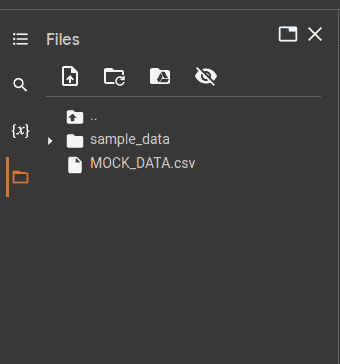

# 6

# 使用 Python 进行安全和 DevSecOps

外面的世界一片混乱，四处都是无序和困惑…

– Randy Newman

（如果你知道这首歌的其他部分，真棒。）

你最常用的密码是什么？你从不重复使用密码吗？在这种情况下，别对我撒谎，也别对自己撒谎，以免你被锁定在账户之外。我在这里提到密码，因为这是打开关于安全话题对话的最佳方式，密码也是最容易理解安全的方式。它们提供了一种安全的方式来区分账户和用户，并为每个用户设置独立的访问权限。本章将讨论的内容会稍微复杂一些（只是稍微复杂），但基本原理是一样的：我们讨论的是如何保护访问权限，确保只有正确的人才能访问。

在**DevSecOps**（一个专注于安全的**DevOps**分支）中，目标是在任何安全漏洞发生之前、期间和之后都能采取安全措施。这要求使用最佳实践来保护访问密钥和其他凭证，确保基础设施（如容器）的安全，以及在发生安全事件后同样采取相应的最佳实践。

安全是应用团队中每个成员的责任，这个责任要求团队成员使用不会妥协安全的工具和技术，并能促进安全流程的自动化，从而减少人为错误。

恰巧我们知道一个非常好的工具来实现这一点，不是吗？没错，**Python**在促进和支持安全性与加密方面非常强大，而且它灵活易用，即使是没有太多编程经验的安全工程师也能轻松上手。Python 的瑞士军刀特性让它能够在本章中无缝整合到任何地方。

那么，让我们来看看本章将要探索的内容：

+   我们将学习如何使用 Python 来保护和混淆敏感代码、API 密钥和密码。

+   我们将了解容器验证是什么，以及 Python 如何在需要时帮助我们再次检查这个过程。

+   我们将了解 Python 提供的工具，如何利用这些工具促进事件监控和响应。

# 技术要求

以下是一些要求，帮助你跟上本章活动的进度：

+   一个 GitHub 帐户，用于克隆包含示例代码的代码库

+   一个 AWS 帐户

+   一个 Google Cloud 帐户

+   Google Colab

+   任何安装了 Python 的环境

+   宽容我的讽刺语气

你可以访问本书的代码库：[`github.com/PacktPublishing/Hands-On-Python-for-DevOps`](https://github.com/PacktPublishing/Hands-On-Python-for-DevOps)

# 保护 API 密钥和密码

API 密钥和密码之所以有价值，是因为大多数东西之所以有价值，是因为它们需要付出金钱，而且它们所保护的数据也非常珍贵。如果你看过任何一部盗窃电影（如果你没看过，我推荐*Heat*，这是一部非常好的电影），你就会知道，盗窃团队总是需要获得某种访问代码、签名或保险箱密码。这是因为，秘密代码、密码或加密在整个人类文明中作为访问敏感信息的障碍的概念是永恒的。密码在计算机出现之前已经存在了数万年。

在网络领域，一个盗窃团队也会尝试类似的策略。他们会试图从那些可能拥有密码和凭证的人那里提取信息，以便获取敏感数据。有时，这些信息本身并不一定是敏感的，有时人们只是因为无聊或者喜欢社会工程学（我听说有些人上瘾于操控别人，这让人感到相当可怕）。无论如何，你的信息安全始终受到攻击，无论是在服务器端还是用户端。因此，对于这类攻击的预防措施和机制是必要的。

现在，我们进入 Python 部分。我们可以尝试几种方法，通过 Python 来实现这个概念。我们可以创建环境变量和秘密，将敏感变量存储在单独的文件夹中或操作系统（**OS**）配置中。我们还可以使用 Python（独立使用或与其他工具或 API 一起使用）来提取和模糊化**个人身份信息**（**PII**）。

## 存储环境变量

环境变量的存储不仅是为了将凭证与应用代码分离，以防止硬编码，还为了确保应用程序可以在不同的系统上使用不同的凭证运行，只需将这些凭证配置到操作系统或文件中即可。

这将我们引入了两种存储和检索环境变量的方法：我们可以将它们存储为文件或在操作系统中定义的变量。当然，你也可以在云端密钥管理器中或使用硬件设备来完成，但这些概念与我们正在讨论的类似。

对于第一种方式（文件），你可以通过以下方式创建并读取`.env`文件：

1.  这些文件是存储环境变量的标准，并且在几乎所有的`.gitignore`文件中都会被忽略。要读取这些文件，我们首先需要安装 Python 的`python-dotenv`库：

    ```
    pip install python-dotenv
    ```

1.  在此之后，我们可以创建一个`.env`文件，并将变量和秘密存储其中。我们根据它们所在的行来分隔这些秘密。以下是一个`.env`文件的几行示例：

    ```
    API_KEY = <insert_key_here>
    API_SECRET_KEY = <insert_secret_key_here>
    ```

    记住，*大写字母*是用于常量的。这种方法有助于将常量集中在一个地方，这样你就不必担心在代码中的多个位置更改它们，也不用担心某个地方漏掉了某个修改。

1.  现在，让我们编写代码，让程序能够访问环境变量：

    ```
    from dotenv import load_dotenv
    import os
    #load .env file
    load_dotenv()
    #load API keys into variables
    api_key = os.getenv("API_KEY")
    api_secret_key = os.getenv("API_SECRET_KEY")
    ```

    运行此代码后，你将获得 API 密钥和密钥，在各自的变量中。

接下来，让我们尝试相同的操作，但直接从我们自己的操作系统中导出并使用环境变量：

1.  在 Linux 中——这种服务器最为普遍——我们可以像在之前的例子中那样，使用以下命令设置环境变量：

    ```
    export API_KEY = <insert_key_here>
    API_KEY and API_SECRET_KEY in your OS.
    ```

1.  现在的问题是如何访问这些值：

    ```
    import os
    # Get the API key and secret access key from the environment
    api_key = os.environ.get("API_KEY")
    api_secret_key = os.environ.get("API_SECRET_KEY")
    ```

    你会发现我们仍然在使用之前代码中的 `os` 库。对于较少数量的环境变量，这种方法相对更简单，也许比 `.env` 文件更安全。但是，当环境变量数量很大时，`.env` 文件在聚合和使用管理方面会更加方便。

这些方法教会了你如何处理你自己负责的敏感信息，并且这些信息是你自己添加到代码库中的。然而，终有一天，你会遇到需要处理他人敏感数据的情况。这些数据需要保护，你必须确保它不会落入不法之手。关键是什么？让这些数据对除你以外的任何用途都变得无用。接下来我们将讨论如何模糊处理个人身份信息（PII）。

## 提取并模糊处理个人身份信息（PII）

一个人的敏感个人信息是他们拥有的最有价值的东西之一：无论是在财务上、社交上，还是亲密关系上。泄露这些信息的安全性可能会对个人造成极大的伤害，涉及这三方面的各类损失。人们的隐私至关重要，我们必须采取一切可能的措施来保护它，尤其是当他们将部分信息托付给我们提供的服务时。

那么，开始这个工作的最佳方法是什么呢？有很多现成的服务，例如 Amazon Macie 或 Google Cloud 的 **DLP**（即 **数据丢失预防**）服务，这些服务非常方便，但你可能无法理解它们的内部运作，因为它们是基于某些机器学习算法进行训练的，这些算法几乎不需要用户输入（如果有的话），就能自动对各种个人信息进行删除和模糊处理。

但假设有一条信息不被这些服务覆盖，或者由于合规原因你无法使用它们。那么，你就需要从头开始创建自己的解决方案。在这种情况下，Python 就是你的好帮手。你可以使用 Python 读取文件，找到包含敏感信息的位置（基于某些标准），并以一种隐藏或模糊处理这些信息的方式修改它们。这种技术与通过数据挖掘找到重要模式来提取数据的方式相同，只不过在这种情况下，我们不是提取数据，而是确保如果一些恶意行为者尝试提取数据，他们无法恢复任何重要信息。

为了演示这个，我们将使用一个非常简单的**正则表达式**（**regex**）模式来查找文本中的电话号码，并将其替换为某种形式的遮掩。我们可以尝试一个稍微复杂一点的正则表达式，但本质上还是相同的概念。如果你是正则表达式的新手，我建议你从简单的开始，慢慢发现正则表达式的魔力。真的，你会觉得自己像个巫师。

现在不需要再做过多的姿态展示了；让我们开始进入正题。首先，我们需要一个正则表达式来捕获电话号码的模式。除非你真的想深入了解正则表达式，否则不要自己尝试写一个。对于大多数使用场景，你可以在互联网上找到一个适合的现成正则表达式。在大多数情况下，你可以直接使用它，而在一些非常特定的情况下，你可能需要进行一些调整。所以，覆盖电话号码模式（包括带有国家代码和不带国家代码的）正则表达式可以这样写：`\d{3}-\d{3}-\d{4}'`。

这对你来说可能看起来像一堆无意义的字符，但它有效，你应该相信这一点（可能有人为了让它完全正确而几乎疯掉）。这个正则表达式适用于带有和不带有国家代码的电话号码（尽管你也可以写一个适用于两者的正则表达式）。现在，让我们在一个包含电话号码的小段文本中实现这个正则表达式：

```
#initial textimport retext = "The first number is 901-895-7906\. The second number is: 081-548-3262"#pattern for searchsearch_pattern = r'\d{3}-\d{3}-\d{4}'#replacement for patternreplacement_text = "<phone_number>"#text replacementnew_text = re.sub(search_pattern, replacement_text, text)#output given: "The first number is <phone_number>. The second number is: <phone_number>"print(new_text)
```

好了，就这样；这段代码使用正则表达式模式找到电话号码，并通过替换电话号码来进行模糊处理。

这是迄今为止最简单且最容易获取正则表达式的方法，但你可以让它变得更加复杂。你可以用它来模糊处理社会保障号码、护照号码，以及几乎任何符合预定义模式的东西。

到目前为止，我们只在最简单的文本级别上进行了安全性处理。现在，我们需要关注基础设施的安全性。为此，我们可以看看容器镜像，因为它们非常普遍，而且验证它们非常重要。让我们看看如何验证这些镜像。

# 使用二进制授权验证和验证容器镜像

目前为止我已经花了很多时间谈论容器，这可能已经让你意识到容器可能有些重要了。当然，容器是应用程序中运行一个服务所需的所有资源需求和库的封装体。容器之间的隔离导致了每个容器中运行的服务所需的库之间的冲突消除，有效地为整体大系统或应用程序中的每个服务创建了一个隔离的系统。

然而，这也带来了双重漏洞：在某些情况下会增加复杂性和更大的威胁向量。管理所有这些容器和其中复杂的底层库（因此需要 Kubernetes）可能是一项艰巨的任务。不正确地管理这些复杂系统可能会导致系统中的结构性和信息性漏洞的产生。同时，如果多个集群暴露在面向公众的环境中，或者以某种方式可以被访问以赋予未经授权的用户对系统的特权访问，那么对一个容器的威胁可能会威胁到系统中存在的所有容器，以及所有您的信息。

Python 的 Docker 库确保您可以以自动化方式处理镜像的每一层。Python 还可以使用多种第三方镜像验证工具。我们将探讨其中一种工具与 Google 的二进制授权 API 和 Kubernetes 工作流。因此，让我们看看如何使用二进制授权验证合规性镜像！

**合规性** 是一个有趣的主题，其中很大一部分取决于看客的眼光。合规性的定义取决于您希望多么严格。在 Kubernetes - 特别是在**Google Kubernetes Engine**中 - 必须有某种保证或规定，以确保已使用正确的镜像。这个机制被称为**二进制授权**。

二进制授权允许检查在 Kubernetes 集群中部署的 Docker 容器是否符合某些标准。授权可以通过使用合规性策略或认证者来完成。合规性策略创建规则，只允许满足某些标准的镜像。添加认证者意味着在您的项目中添加一个个体用户，可以证明将要使用的镜像是正确的。在二进制授权中，您可以使用这两者中的一个或两者都使用，以授权您的 Kubernetes 集群中的镜像。让我们看看如何做到这一点：

1.  现在我们将编写一个脚本来创建一个认证者，并将该认证者分配给 Kubernetes 引擎。首先，我们必须安装容器和二进制授权的客户端库：

    ```
    pip install google-cloud-binary-authorization google-cloud-container
    ```

1.  现在，让我们为集群的二进制授权编写脚本：

    ```
    from google.cloud import binaryauthorization_v1
    def sample_create_attestor():
        client = binaryauthorization_v1.BinauthzManagementServiceV1Client()
        attestor = binaryauthorization_v1.Attestor()
        attestor.name = <Enter_attestor_name>
        request = binaryauthorization_v1.CreateAttestorRequest(
            parent=<Enter_parent_value_of_attestor>,
            attestor_id=<Enter_attestor_id>,
            attestor=attestor,
        )
        client.create_attestor(request=request)
    ```

    这将创建一个能对您的集群请求进行认证的认证者。

1.  现在，我们需要将二进制授权添加到已创建或即将创建的集群中：

    ```
    from google.cloud import container_v1
    def sample_update_cluster():
        client = container_v1.ClusterManagerClient()
        request = container_v1.UpdateClusterRequest(
    "desired_node_pool_id": <Node_pool_to_update>,
    "update": {
    "desired_binary_authorization": {
    "enabled": True,
    "evaluation_mode": 2
    }
    }
        )
        client.update_cluster(request=request)
    ```

    这个脚本将更新 Kubernetes 集群，使其开始使用我们的二进制授权方法。这可以解决你基础设施内部的事件。

现在，我们将探讨一些可以帮助你应对基础设施之外的事件的内容。

# 事件监控与响应

那么，如何定义一个事件呢？让我问你这个问题：如果一只熊袭击了你，你会怎么做？听起来很傻吗？这些问题是不是太多了？嗯，这个问题实际上是一种直接理解事件以及如何反应的方式。

熊正在袭击你，它比你大得多，嗯，你肯定不希望它抓到你。在这种情况下，熊的攻击就是事件，熊本身只是事件的一个载体。事件的结果取决于响应，而要有好的响应，你需要冷静（你需要*监控*局势，明白了吗？）。无论如何，事件响应的报告都会以某种方式出现。然而，如果你想成为那个写报告的人，你必须正确处理事件。

实际的安全事件并不像那样残酷（至少不在身体上）。别担心。但它们的工作方式类似。事件发生时，安全性在某种程度上受到威胁，存在用于利用漏洞的工具，而一旦漏洞被利用，就必须冷静处理并尽可能进行缓解。一旦完成并恢复了秩序，事件响应需要被记录并分发给相关方。

现在，Python 的作用就体现出来了。为了应对可能针对虚拟机群的安全威胁，Python 可以帮助运行所谓的**运行手册**，它是一系列命令，可以用来重置系统或让系统响应某种威胁。另一种使用 Python 的方式是查看事件发生时的监控数据，并将其与常规数据进行对比，从中寻找可以预测并提前应对未来事件的模式。

## 执行运行手册

当我们谈论事件响应时，最常见的响应方式之一就是重启受影响的资源。这种方法大约在 97%的情况下有效。说真的。但有时人们也不愿意这么做。对我来说，当我的笔记本蓝牙出现故障时，我不得不重启它。虽然这不合逻辑，也让我莫名其妙地烦恼，但它确实能解决问题（不像我在网上找到的 500 种重新启动蓝牙的办法，最终我还是选择重启）。

我们要聪明一点，集中精力解决那个 97%的部分，同时，我们也会提供一个蓝图，让你能够运行更复杂的代码和过程，按照你的需要进行编写。这个文档特别适配了 AWS，但类似的集群管理和操作也可以在所有主要云平台以及大多数本地操作中找到。

在这个练习中，我们使用**AWS EventBridge**触发一个步骤函数，随后在触发事件的目标 EC2 实例上运行命令，从内部重启该实例。再次强调，我们保持命令简单，但如果你需要，也可以做得更复杂。那么，让我们开始吧：

1.  让我们从一个正在运行的实例开始。我将我的命名为`test1`。很有创意吧，我知道。


图 6.1 – 正在运行的实例

假设我们在一个场景中，这个实例有大量的网络流量通过。如果流量降到某个水平以下，就会表示实例出现故障。此时，可以通过一个简单的运行手册文档来解决这个故障，重启实例。

1.  现在让我们在**AWS Lambda**中创建该命令的结构。但首先，我们需要发送的命令，它可以在**Systems Manager**中找到。打开**Systems Manager**，然后在侧边栏底部转到**Documents**标签页：


图 6.2 – AWS Systems Manager

1.  在文档中，搜索`AWS-RestartEC2Instance`文档。这是默认文档，你可以基于它创建许多其他虚拟机操作文档：


图 6.3 – 执行 EC2 重启的文档

这是一个简单的基础文档，可以作为你执行任何脚本操作的基础。大多数其他云服务提供商也有类似的文档。


图 6.4 – 详细的 AWS-RestartEC2Instance 文档

如果我们仔细观察一下，可以看到这个文档会根据实例 ID 停止并重新启动一个特定的实例，而实例 ID 就是我们需要提供的内容。

1.  现在，让我们编写一个 EventBridge 事件，该事件将在五分钟内网络流量下降时触发一个 Lambda 函数。为此，首先转到 Amazon CloudWatch 并创建一个在我们的条件下触发的报警。转到**CloudWatch** | **Alarms** | **Create alarm**。


图 6.5 – Cloudwatch Alarms 控制台

我们现在可以为我们的`test 1`实例创建一个单独的报警，它将以图形形式显示，帮助你了解当前指标的变化情况：


图 6.6 – 创建报警指标

1.  接下来，让我们为警报的触发条件设置网络输入低于**20,000**字节，且持续五分钟：


图 6.7 – 设置警报的阈值

1.  在提示你输入警报名称的字段中命名警报为 `test1-alarm`，然后就可以开始了。

    现在，我们可以查看 **详情** 标签中的警报，找到 EventBridge 规则，我们需要用它来设置 EventBridge 触发器：


图 6.8 – 警报配置详情

1.  然后，进入 AWS 部分的 **Amazon EventBridge**，接着到 **规则** 标签页，在那里你将创建一个新事件。在第一页，选择 **带有事件模式的规则**，然后继续到下一页。在这里，你将粘贴从警报中获取的 EventBridge 规则：


图 6.9 – 事件桥的模式创建

1.  现在你有了模式，点击 **下一步**，然后在另一个标签页中打开 AWS Lambda。在这里，我们将编写 Python 代码来执行 EC2 实例的重启操作。

    在 AWS Lambda 中，选择 Python 执行环境并保持所有默认设置不变。然后，添加以下代码：

    ```
    import json
    import boto3
    client = boto3.client('ssm')
    def lambda_handler(event, context):
        instance_id = event["instanceids"]
        client.send_command(InstanceIds = [instance_id], DocumentName = "AWS-RestartEC2Instance")
        return "Command to restart has been sent."
    ```

    这段代码将发送播放手册文档的命令来重启 EC2 实例。

    现在，让我们选择 **Lambda 函数** 作为 EventBridge 的目标：


图 6.10 – 目标 Lambda 函数

1.  不断点击 **下一步**，直到创建 EventBridge 规则。当警报被触发时，该规则将触发并运行 Lambda 函数。这将重启实例，并持续进行，直到网络输入恢复到可接受的水平。

现在，在这个例子中，我们看到一个基于即时反应和执行的应用程序。如果你的系统受到某种攻击，目的是压垮它或利用你无法修补的漏洞，这种方式是有效的。然而，攻击通常不是单独发生的。它们是有针对性的并且频繁发生，不断尝试寻找某种漏洞以攻击你的工作负载。为了帮助理解潜在的攻击模式，并了解你的工作负载如何应对变化，你可以使用监控日志的模式分析。

## 监控日志的模式分析

监控日志可以为你提供应用程序表现的洞察，并且如果在时间线中检测到一些异常模式，可以帮助你发现问题。例如，**分布式拒绝服务**（**DDoS**）攻击通常会在应用程序中形成无法解释的高 CPU 使用模式。它基本上使应用程序遭受虚假的负载，这会影响到应用程序中的实际负载。

因此，为了检测这些攻击，我们必须有一个能够历史性地分析工作负载并潜在地发现这些攻击的算法。为了找到这些模式，Python 有一些很棒的数据科学库。

服务器日志的公共数据集很难找到，但它们可以相对容易地重新创建。对于这个示例，我将使用公共数据集模拟服务**Mockaroo**。它允许你免费创建一个包含 1,000 行的数据集。我将只创建包含 CPU 利用率和时间戳的数据集。


图 6.11 – 生成模拟数据集

一旦数据生成，我们会看到它没有根据时间排序，因此这是我们将在脚本中添加的额外步骤。我们将使用 Google Colab 来编写我们的脚本。那么，让我们开始吧：

1.  首先，安装 `pandas` 和 `matplotlib` 库。它们通常已经存在，但这一步对于其他笔记本应用很有帮助：


图 6.12 – 安装命令

1.  接下来，将 Mockaroo 创建的 CSV 文件上传到 Colab。为此，点击侧边面板中的文件夹图标，然后点击其中的第一个图标上传数据：



图 6.13 – 上传模拟数据

你会看到这里我已经上传了我的数据。

1.  现在，下一步是使用 pandas 读取数据，创建数据框并按时间排序，因为 CSV 中的模拟数据并未预先按顺序排列。


图 6.14 – CPU 利用率表格

1.  现在，为了发现数据中的模式，我们可以开始通过可视化数据。让我们将数据作为线性图进行可视化，以时间戳作为 x 轴，CPU 利用率作为 y 轴：


图 6.15 – 绘制 CPU 利用率的代码

现在，图表看起来有些随机，因为数据是随机生成的，因此该图表不一定代表实际图表的样子。


图 6.16 – 绘制 CPU 利用率随时间变化的图表

所以，这看起来很随机，但没关系，因为它只是为了代表一个随时间变化的条形图。让我们稍微调整一下数据集，制造一些异常。

1.  所以，我们将修改数据集，使其中间有一个恒定的利用率：


图 6.17 – 修改数据集的图表

这有点荒谬，但我相信它说明了持续正常运行的重要性。大多数系统在稳定时，并不会有这种利用率。如果你的服务正在产生这种数据，这要么表示成功的突然暴涨，要么是一次 DDoS 攻击。大多数情况下，是后者。所以，如果你在监控数据中发现这种激增，值得进行调查。

# 总结

在这一章中，你希望学到了一些关于安全的知识。我也希望你已经弄清楚了如何搭建基础设施，使得你所使用的所有访问密钥都能得到保障。

除此之外，你还学习了一些方法（成千上万种方法中的一部分），可以用来帮助保护你的基础设施。你可能还获得了一些洞见，了解到如何利用数据来驱动事件响应，并更好地理解某些事件及其特性。

所以，朋友们，我希望你们喜欢这一章，毕竟这是关于安全的内容。我尽力向你们解释了几个概念，希望你们至少觉得它有趣。但现在，是时候翻过这一页，进入下一章，我们将讨论我最喜欢的话题之一：**自动化**。
