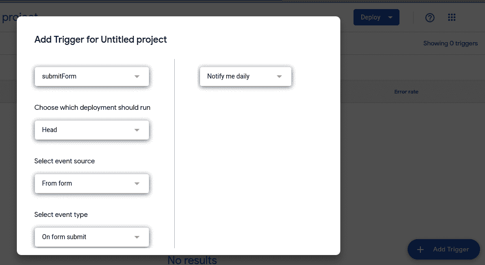

# 第七章：自动化任务

未来的目标是实现完全失业。这样我们就可以去玩了。

– 亚瑟·C·克拉克

这可能会是我最喜欢的章节。说真的，一旦你品尝过自动化的甜美甘露，你就不会再回头了。嗯，我猜我有点超前了。我将从时间的概念开始。控制你命运、生活方式以及你做什么的唯一方法，就是控制你自己的时间，通过选择你要做的事。为了做到这一点，你需要选择如何使用你的时间。

所有的人类进步都与以一种方式做事情相关，这种方式需要越来越少的工人，并且持续减少努力，以便将更多的努力应用到其他地方。所有这些都定义了自动化的概念。它就是发明减少在乏味工作中时间投入的方法，以便你可以继续前进，做更多令人兴奋或有趣的事情。

人类发明农业是为了不必花太多时间去打猎和采集食物。他们可以自己种植；食物在很多方面自己就能生长（有人说是自动化的），而一点点的改良让我们今天吃到的食物得以诞生。农业的创造使得食物生产过程实现了自动化，进而推动了城镇的发展、地产的拥有以及大部分人类文明的诞生。

在工业革命期间，制造过程的自动化使得廉价的大规模生产商品几乎进入了每个家庭。创造出质量高、工作完美且完全相同的商品是一项革命性的成就。这意味着创造某样东西所需的劳动大大减少，从而可以将这些劳动力集中到其他地方。蒸汽机、电力和汽车的发明也在多个领域减少了劳动，同时在许多其他领域节省了时间。

*环游世界八十天*是*儒勒·凡尔纳*所著的一本小说，象征着人类创新在缩短全球旅行时间方面的巨大进步。在那本小说发布后的不到一百年里，人类征服了所有形式的陆地旅行，使得这本书显得微不足道。接下来被提出的问题是，如何让人类大脑变得更快、更自动化。这就是计算机登场的地方。计算机将人类大脑转变为世界上最有效的工具。它们自动化了我们许多繁琐的思维工作，让人类大脑有更多的空闲时间去做更轻松的任务。

然而，这一过程是一个永无止境的循环。总有办法变得更好，做得更快，并且不会再占用更多的注意力。在 DevOps 领域，我们已将其作为核心原则之一，因为在技术领域中，创新、创造力和提出新想法被高度重视。你不能停留在昨天的地方。你必须自动化并继续前进。

这就是本章的内容。本章将涉及*用 Python 自动化枯燥工作*（这是*Al Sweigart*的另一本优秀的 Python 书籍），并让你最大限度地利用你的思维和创造力。你不想陷入反复上传、手动运行相同脚本或手动修复那些虽然只需要 5 秒钟但登录却需要 10 分钟的重复服务器问题的因果循环中。这些问题的答案就是自动化。

在本章中，你将学到以下内容：

+   服务器内外的自动化维护

+   通过托管服务及其他方式自动化容器创建

+   使用 Google 表单自动启动播放本

# 自动化服务器维护和修补

我曾经有一个朋友，他的工作大多数日子里只是等待一个网站宕机，检查它为什么宕机，并执行他被指派的两项命令之一来将其恢复。我还有另一个朋友，他的工作是每次 NGINX 服务器宕机时手动重启它。我曾遇到一个人，他的工作基本上就是从一个地方下载 CSV 文件，把它们放到另一个地方，然后点击一个启动按钮。现在，对于一些人来说，这听起来可能是个不错的工作（对我来说也不算差），但问题在于，这对那个员工的雇主和员工自己来说都是浪费时间。对双方而言没有成长或改进，在我的生活经验中，这简直就是浪费人类的生命。

在接下来的示例中，我们将看到如何基于一系列常用命令来维护多个实例集群，然后在发现操作系统类型后，找到一种方法来修补操作系统。我们将借助 Python 来完成这一切。

## 示例 1：同时对多个实例集群进行集群维护

维护服务器涉及大量工作——很多重复的工作。这也是最初服务器维护实现自动化的原因。它最小化了人为错误，并确保每次都按相同方式进行。服务器集群的工作原理类似。只需对所有服务器使用自动化脚本，因为它们是原始服务器的副本。那么，如何处理具有不同需求的多个实例集群呢？在这里，Python 可以提供帮助。你需要做的就是将每个集群与正确的维护脚本关联起来。这可以让你在多个云环境中管理多个集群。所以，话不多说，让我们看看如何做到这一点：

1.  让我们首先编写 AWS 实例的代码，找出正在运行的实例：

    ```
    import boto3
    ec2_client = boto3.client('ec2')
    response = ec2.describe_instances(Filters=[{'Name': 'instance-state-name', 'Values': ['running']}])
    aws_instances = response['Reservations']
    ```

    这将为我们提供一个来自 EC2 的实例列表。你可以使用多个标识符来定义你的集群。你甚至可以使用预定义的系统管理集群。

1.  现在我们为 Google Cloud Compute Engine 实例做同样的事情：

    ```
    from google.cloud import compute_v1
    instance_client = compute_v1.InstancesClient()
    request = compute_v1.AggregatedListInstancesRequest()
    request.project = "ID of GCP project that you are using"
    gcp_instances= instance_client.aggregated_list(request=request, filter="status:RUNNING")
    ```

    在**Google Cloud Platform**（**GCP**）代码中，由于需要指定 GCP 项目 ID，并且必须定义请求 API 及其本身，因此存在一些差异。

1.  现在，让我们找一个命令来在这些实例中运行。它可以是任何占位符命令。你可以之后用你想要的命令来替代它：

    ```
    command = "sudo reboot"
    #for AWS
    ssm.send_command(InstanceIds=aws_instances, DocumentName="<Whatever you want to name it>",
        Comment='Run a command on an EC2 instance',
        Parameters={
            'commands': [command]
        }
    )
    #for Google Cloud
    import os
    import subprocess
    from google.oauth2 import service_account
    from googleapiclient import discovery
    # Load the service account credentials
    service_account_file = '<file_name_here>.json'
    credentials = service_account.Credentials.from_service_account_file(
        service_account_file, scopes=['https://www.googleapis.com/auth/cloud-platform']
    )
    # Create a Compute Engine API client
    compute = discovery.build('compute', 'v1', credentials=credentials)
    # Get the public IP address of the VM instance
    request = compute.instances().get(project="<your_project>",instance="your_instance_name")
    response = request.execute()
    public_ip = response['networkInterfaces'][0]['accessConfigs'][0]['natIP']
    # SSH into the VM instance and run the command
    ssh_command = f'gcloud compute ssh {instance_name} --zone {zone} --command "{command}"'
    try:
        subprocess.run(ssh_command, shell=True, check=True)
    except subprocess.CalledProcessError:
        print("Error executing SSH command.")
    ```

    由于 API 的开发方式不同，之前的 GCP 和 AWS 代码有所不同。然而，它们都会产生在服务器上执行 SSH 命令的结果。

    因此，如果我们遍历之前通过函数生成的列表，并用命令更新它们，我们就可以对整个实例集群进行批量更改或更新。

这种方法适用于通用的服务器集群，我们假设所有操作系统（OS）都是相同的，或者它们运行相同的命令。但是如果我们处于一个操作系统可能不同的环境中呢？那我们该如何使用命令呢？在接下来的部分，我们将探索这一可能性。

## 示例 2：为关键更新集中管理操作系统补丁

操作系统就像任何品牌一样。至少在大多数技术社区中，它就像可口可乐和百事可乐——只是如果可口可乐或百事可乐是你的好斗宠物，时常需要你的关注并且需要维护的话就另当别论了。我想表达的是，你喜欢的口味是个人偏好。但如果你要共享一个冰箱，可能会有一些你不熟悉的口味。所以，冰箱需要适应所有口味。当我们处理服务器时，这种“冰箱分类”变得更加困难（而且重要），因为服务器可能有类似的多样性。要正确修补操作系统，我们首先必须了解我们正在使用的操作系统。然后，我们需要应用正确的命令，以确保该操作系统的补丁正确安装。这正是 Python 的用武之地。它有能够同时完成这两项工作的库，结合起来可以成为强大的工具。

让我们从修补单个操作系统的过程开始。在这个案例中，我们将使用`apt`包管理器：

```
import subprocessupdate_command = "sudo apt update && sudo apt upgrade -y"subprocess.run(update_command, shell=True)
```

正如你在代码中看到的，这仅仅是通过 Python 的`subprocess`模块运行一个`update`命令，这再次强调了 Python 与其运行的操作系统之间的紧密联系。

但这只是针对 Debian Linux 实例的情况。如果该实例是 Red Hat 或 CentOS 呢？如果脚本需要同时支持这两者该怎么办？那我们只需要添加一个额外的库：`platform`。这个库将为我们提供区分平台所需的知识，并且使我们能够在一个脚本中编写所有补丁代码：

```
import subprocessimport platformdef update_os():    system = platform.system().lower()    if system == 'linux' or system == 'linux2':        if 'debian' in platform.linux_distribution()[0].lower() or 'ubuntu' in platform.linux_distribution()[0].lower():            update_command = "sudo apt update && sudo apt upgrade -y"        else:            update_command = "sudo dnf update -y" 	subprocess.run(update_command, shell=True)    elif system == 'windows':        update_command = 'powershell -Command "Start-Service -Name wuauserv; Get-WindowsUpdate; Install-WindowsUpdate;"'        subprocess.run(update_command, shell=True)if __name__ == "__main__":    update_os()
```

上面的代码适用于 Debian 发行版、最新的 RedHat 发行版（旧版使用 `yum` 命令），以及 Windows PowerShell。脚本会根据你当前使用的操作系统，运行相应的更新。由于命令是可以修改的，你可以更改它并使更新符合你的需求。你还可以添加像 Darwin（适用于 macOS）或其他不常见的 Linux 发行版等操作系统。

你现在可能在想“*修补操作系统会破坏我的服务器*。” 有道理，尤其是对于旧的依赖关系，这种情况发生得很频繁。对于许多 Linux 服务器来说，操作系统的最新版本可能需要几年时间才能成为正式的服务器版本。如果你觉得这很麻烦，那么或许你应该试试容器。对于自动化爱好者来说，这里有很多机会。

# 自动化容器创建

**容器**——在许多人眼中——是魔法。你可以将一个小型应用程序或大型应用程序的一部分所需的所有内容放入一个专门为其服务的环境中，使其能够独立运行。这就像创造一个独立的星球，让北极熊永远生活在其本土环境中，免受全球变暖的恐惧。通过这种方式，容器令人惊叹，因为它们可以帮助保持几乎已灭绝的技术，且这些技术能够在适合它们的环境中得以持续运行。这的确是魔法。但施法过程相当繁琐，这也是我们为什么要自动化操作的原因。

## 示例 1：基于需求列表创建容器

容器在初始化和停止之间会根据容器内文件和配置的状态变化而变化。从这个变化的容器中捕获镜像，将得到一个在初始层之上添加了几个层的镜像。这也是创建自定义容器的一种方式。当我们找到的容器大致符合我们的需求，但并不完全符合时，这种方法非常有用。我们可以添加几个步骤（以及几个层），使容器完全符合我们的要求。然后，我们可以将其转换为镜像，随后可以复制到其他容器中。所有这些操作都可以通过 Python 来完成（大惊喜，不是吗？）：

1.  让我们再次从一些简单的代码开始，基于镜像启动一个容器：

    ```
    import docker
    client = docker.from_env()
    container = client.containers.run('ubuntu:latest', detach=True, command='/bin/bash')
    container_id = container.id
    print("Container ID:" + container_id)
    ```

    这组命令将启动一个包含最新版本 Ubuntu 的容器。它还会给我们容器的 ID，这在下一步中非常重要。这将是我们的起点。

1.  现在，让我们进一步完善它：

    ```
    #you can put in any command you want as long as it works
    new_command = "ls"
    new_image = client.containers.get(container_id).commit()
    new_image_tag = "<whatever_you_want>:latest"
    new_container = client.containers.run(new_image_tag, detach=True, command=new_command)
    ```

    现在，我们有了一个新容器，它在 Ubuntu 中所有其他内容的基础上添加了新命令。这个容器与原始容器不同，但它是基于原始容器构建的。

1.  接下来，我们需要将这个镜像导出以便以后使用：

    ```
    image = client.images.get("<whatever_you_want>:latest")
    image.save("<insert_file_path_here>")
    ```

    这将把你的镜像保存在所需的文件路径中。将所有代码合并后，我们得到如下内容：

    ```
    import docker
    #Step 1: Intialize and run a container
    client = docker.from_env()
    container = client.containers.run('ubuntu:latest', detach=True, command='/bin/bash')
    container_id = container.id
    print("Container ID:" + container_id)
    #Step 2: Add a layer
    #you can put in any command you want as long as it works
    new_command = "ls"
    new_image = client.containers.get(container_id).commit()
    new_image_tag = "<whatever_you_want>:latest"
    new_container = client.containers.run(new_image_tag, detach=True, command=new_command)
    #Step 3: Export layered container as an image
    image = client.images.get("<whatever_you_want>:latest")
    image.save("<insert_file_path_here>")
    ```

    完整的代码给我们呈现了完整的图景，展示了所有这些可以在短短几步之内完成。添加层次意味着添加更多的命令。如果你愿意，你甚至可以从一个什么都没有的空模板开始。

如果你正在创建单独定制的图像，这一切都很好，但容器的另一个复杂方面是将多个容器编排在一起以执行某个任务。这需要大量的工作，也正是因此 Kubernetes 应运而生。Kubernetes 集群——尽管它们简化了容器编排很多——仍然可能非常复杂。这是容器自动化的另一个领域，Python 在其中可以发挥作用。

## 示例 2：启动 Kubernetes 集群

我先来讲一个个人经历：当我第一次接触 Kubernetes 时，它对我来说可能是世界上最难的事情。我来自开发背景，而像容器编排这样的东西当时对我来说完全是外来的。Kubernetes 是因为微服务的流行而应运而生的，它的目的是让大型项目中那些大小不一的小项目能够更轻松地管理。当我终于弄明白它的时候，我意识到 Kubernetes 是多么重要。然而，这并没有让我不再困惑。所以，我再次求助于编码，结果发现有许多资源适合像我这样的人。再次强调，Python 是一个大帮手。

创建 Kubernetes 集群通常需要在云服务中使用它。对于这个练习，我们将编写代码来设置 Google Cloud 和 Microsoft Azure 中的集群：

```
from google.cloud import container_v1# Specify your project ID and cluster detailsproject_id = "<YOUR_PROJECT_ID>"zone = "<PREFERRED_ZONE>"cluster_name = "<YOUR_CLUSTER>"node_pool_name = 'default-pool'node_count = 1     client = container_v1.ClusterManagerClient()    # Create a GKE cluster    cluster = container_v1.Cluster(        name=cluster_name,        initial_node_count=node_count,        node_config=container_v1.NodeConfig(            machine_type='n1-standard-2',        ),    )    operation = client.create_cluster(project_id, zone, cluster)
```

该操作将在你的 Google Cloud 项目中创建一个 Kubernetes 集群。现在，让我们看看如何在 Azure 中执行这个操作：

```
from azure.mgmt.containerservice.models import ManagedCluster, ManagedClusterAgentPoolProfileresource_group = '<RESOURCE_GROUP_HERE>'cluster_name = '<CLUSTER_NAME_HERE>'location = '<LOCATION_HERE>' agent_pool_profile = ManagedClusterAgentPoolProfile(    name='agentpool',    count=3,    vm_size='Standard_DS2_v2',) aks_cluster = ManagedCluster(location=location, kubernetes_version='1.21.0', agent_pool_profiles = [agent_pool_profile])aks_client.managed_clusters.begin_create_or_update(resource_group, cluster_name, aks_cluster).result()
```

这个创建代码也相当标准；它只是术语的不同。这可能不是为这个功能编写代码的最有效方式（这将在基础设施即代码（Infrastructure as Code）中进一步展开），但它完成了任务。

到目前为止，我们所看到的许多内容对外行来说都是一堆胡言乱语，而外行人有时是最频繁操作资源的人。所以让我们来看一个过程，它可以作为自动化更复杂流程的蓝图，使外行人更多地参与到资源创建的过程中。

# 基于参数自动启动 playbook

大多数时候，即使是最基本的自动化任务也可能变得难以理解。如果你需要自动化或触发多个任务，复杂性就会开始增加。并不是每个人都能理解它们，而且也不应该是每个人的工作去理解它们。这就是为什么即使是许多现代服务器也有用户界面，使得信息处理对许多人来说更加容易。

然而，在许多情况下，即使这种抽象层级也不足够。可能需要创建一个工具，让用户可以简单地输入他们的内容，而服务器自动处理复杂的工作流和资源的创建。简而言之，你可以制作带有参数的剧本，根据那些希望创建资源但不想处理其中复杂细节的人（在大多数地方，这些比较随意的人叫做客户）所提供的概述来创建资源。让我们看看如何做到这一点：

1.  我们将从制作一个 Google 表单开始（是的，没错）。前往 [forms.google.com](http://forms.google.com) 并点击大大的加号（+）按钮。


图 7.1 – 实例选择

这是一个简单的 Google 表单，用于选择两种不同大小的 EC2 实例。

1.  现在，我们将编写一个 Google Apps Script 脚本和一个 AWS Lambda 函数：

    ```
    import boto3
    ec2 = boto3.client('ec2')
    def lambda_handler(event, context):
        instance_size = event['instance_size']
        response = ec2.run_instances(
            ImageId='<INSERT_AMI_HERE>',
            InstanceType=instance_size,
            MinCount=1,
            MaxCount=1,
            SecurityGroupIds=['<INSERT_SECURITY_GROUP_HERE'],
            SubnetId='<INSERT_SUBNET_HERE>'
        )
        return response
    ```

    这个 Lambda 函数接收一个输入，包含要创建的 EC2 实例的大小，然后创建该实例。我们可以使用 Lambda URL 或 API 网关为其定义一个端点。

1.  一旦这个函数和端点创建完成，你可以从 Apps Script 调用该端点，并根据表单中的触发器和输入进行处理。在表单编辑器中，点击右上角的三个点，并选择**脚本编辑器**：


图 7.2 – 访问脚本编辑器

1.  现在，你可以编写本质上是 JavaScript 的 API 脚本：

    ```
    function submitForm(e) {
    var responses = e.values;
    var size = responses[0];
    var apiUrl = '<YOUR_LAMBDA_URL>';
    var requestData = {
    'instance_size': size,
    };
    var requestBody = JSON.stringify(requestData);
    var options = {
    'method': 'get',
    'contentType': 'application/json',
    'payload': requestBody,
    };
    var response = UrlFetchApp.fetch(apiUrl, options);
    }
    ```

    这将运行 Lambda 函数，不过需要最后一步通过添加触发器来触发它。在 Apps Script 项目的左侧窗格中，点击**触发器**选项。


图 7.3 – 使用 Apps Script 调用 Lambda

1.  在右下角，点击**添加触发器**，这将打开一个表单，用于创建触发器，在那里你可以定义所有必要的参数：



图 7.4 – 添加一个触发器，用于在表单提交时触发…

在这里，我们可以添加事件的来源、功能，并选择事件类型。

这样，我们就创建了一个工作流，当表单数据提交时触发一个函数，并使用该函数提供的数据来触发一个 API URL。

就这样，这就是一种将所有幕后操作（发生在 Lambda 函数中的）与简单 Google 表单连接起来的方法。

# 总结

在这一章中，我们讨论了自动化的美妙及其实现手段。我们学习了如何自动化虚拟机维护和容器操作。我们甚至学习了如何在此基础上添加一层自动化，允许那些对相关领域了解较少的人参与到我们的过程当中。自动化是件好事。人们常常会有相反的看法，并且害怕很多任务的自动化，但自动化的目的是确保人们的生活变得更加轻松。生活不应当充满无聊的重复任务，它应该是为了探索。自动化是释放时间进行探索的关键。你通过控制时间来控制你的生活。自动化让你做到了这一点。

在下一章中，我们将讨论推动自动化乃至大多数 DevOps 基础设施的事件。我们将深入了解事件驱动架构及其有利的应用场景，当然，*还会讨论* Python 如何提供帮助。
