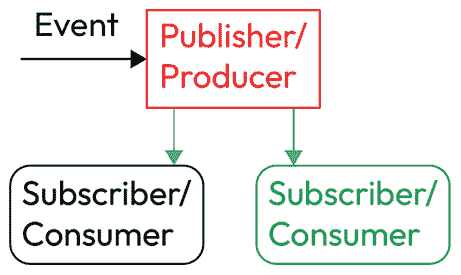
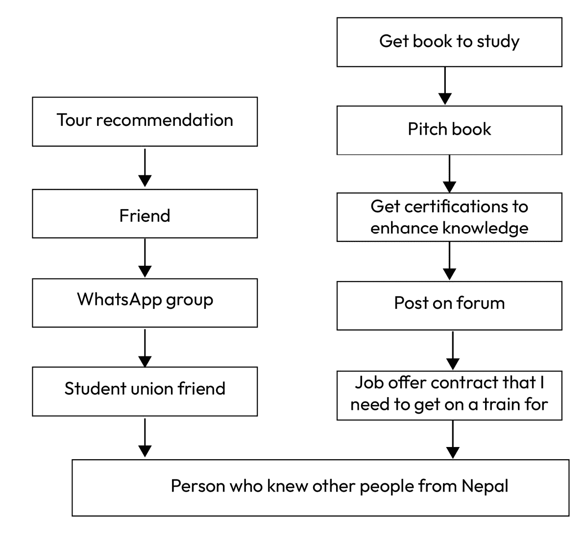
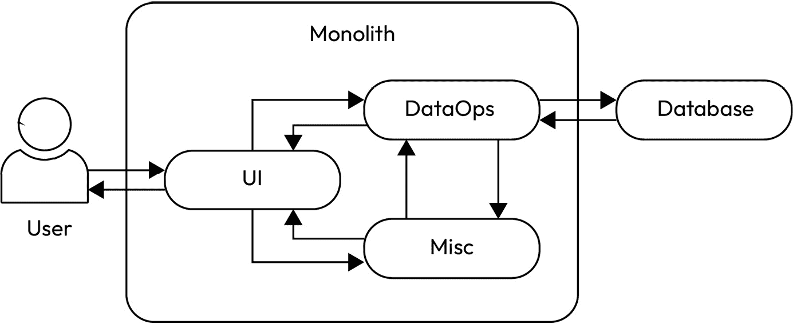
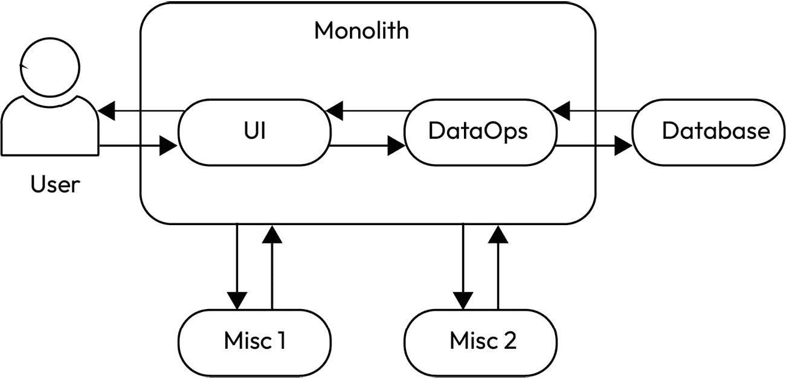
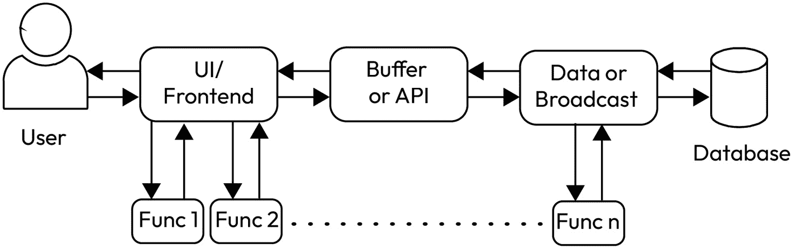

# 理解事件驱动架构

Al freir de los huevos lo vera.（“在煎蛋时会看到的。”）

– 米格尔·德·塞万提斯（《堂吉诃德》）

在任何应用中，一切都可以被划分为**事件**。事件是通过与外部行为者（另一个应用程序或用户）的某种交互，或通过其他事件触发的。一个应用程序本质上是触发多个事件序列以执行某种功能。例如，Google Drive 就是一个应用，它的功能就是存储。当然，这是一个过于简化的描述，存储、组织和提供文件的过程中有很多内容，但这就是其基本含义。它是基于一系列事件进行工作的，每个事件都来自于某个特定的来源。

现在，不同的事件需要系统中的不同技术、框架和库来完美地相互作用。当这种和谐自然地实现时，它是一种美丽的景象。然而，这几乎从来都不是这样。总会有某种瓶颈，或者需要制作某个自定义部分，而这几乎总是与来自事件的数据有关。你可以拥有适合你系统的完美工具，但如果它不能处理接收到的事件，那么它是没用的。那么，当所有聪明人意识到这一点时，他们得出了什么结论？他们意识到没有完美的系统，也没有完美的事件。所需要的是一个不与任何数据处理紧密绑定的系统，一个能够容忍一些人为错误的系统。不是一个不精确的系统，而是一个能够适应它所处现实情况的系统：一个松耦合的系统。

这类系统是为了能够从多个来源获取事件，并以尽可能简单的方式进行处理输出。它们将每一个事件和事件处理器分解为各自的组件。这些组件基于它们接收到的输入和它们产生的输出与其他组件进行交互。如果可以避免的话，任何组件都不应完全依赖于另一个组件。这样的系统可能看起来效率不高，但当目标是确保在不可靠的世界中实现可靠性时，它就变得非常有吸引力。

所以，现在我已经完成了惯常的独白，让我们看看如何打破那个不必要的巨型模块。在本章中，你将学习以下内容：

+   **发布者/订阅者**（**Pub/Sub**）架构的基本概念和使用

+   **松耦合架构**的基本概念，以及为什么 Python 已经非常适合它

+   将单体应用分解为更小松散组件的有效行业标准

这里还会涉及一些 Python 以及其他一些内容。事实上，这正是我现在要深入探讨的内容。

# 技术要求

以下内容可能有助于你充分受益于本章：

+   已安装 `confluent-kafka` 库的 Python

+   一个 AWS 账户

+   打开思维（比喻地讲，不是字面上的；如果你非要字面理解，也没问题，但我不推荐这样做）

# 引入 Pub/Sub 并使用 confluent-kafka 库在 Python 中应用 Kafka

在我们深入探讨现代 Pub/Sub 模型之前，让我们先了解一些使这一领域成为可能的技术：**Apache Kafka**，继 Franz 和 *Kafka on the Shore* 之后的第三大著名 Kafka。最初为 LinkedIn（一个伟大的网站）设计，2011 年初开源。其背后的概念非常简单：有一个信息和事件的日志，任何数量的系统都可以消费该日志中的数据，并且数据可以发布到该日志中供这些系统消费。听起来很简单吧？现在是，但要想出这个想法也不是一件容易的事。但正是这个系统支撑着我们今天所看到的大多数现代数据基础设施。你曾收到过手机上的通知吗？那是因为这个库。你曾用手机或信用卡进行过无接触支付吗？很可能背后有 Kafka。你曾收到过 YouTube 视频的通知吗？肯定是 Kafka。

在大多数使用原生 Kafka 的情况下，信息的分发者称为 **生产者**，而接收该信息的则称为 **消费者**。在大多数现代术语中，尤其是在大多数云服务中，它们分别被称为 **发布者** 和 **订阅者**。



图 8.1 – 使用 Pub/Sub 模型的事件处理

在我们深入探讨 Kafka 和 Python 在 DevOps 中的应用之前，我们首先需要看一下使用 `confluent-kafka` 库在 Python 中应用 Kafka 的示例：

1.  让我们首先使用 `pip` 安装这个库：

    ```
    pip install confluent-kafka
    ```

1.  如前所述，Kafka 分为生产者和消费者。那么，首先让我们写一段代码来创建一个生产者：

    ```
    from confluent_kafka import Producer
    import socket
    conf = {'bootstrap.servers': '<host_name>:9092',
            'client.id': socket.gethostname()}
    producer = Producer(conf)
    ```

1.  这段代码将配置一个生产者。将 `host_name` 替换为一个 Apache Kafka 集群的名称（可以是在线或本地的）。接下来，我们需要使用配置好的生产者来发送一些数据。让我们现在看一下这段代码：

    ```
    producer.produce(topic, key="key", value="value")
    ```

    这里，`topic` 是发布者或生产者将其内容分发到的地方，供消费。`key` 和 `value` 元素是生产者将分发的键和值。

1.  现在，让我们为消费者添加一些代码，消费者将接收生产者发送的消息：

    ```
    from confluent_kafka import Consumer
    conf = {'bootstrap.servers': '<host_name>:9092',
            'group.id': '<group_id_here>',
            'auto.offset.reset': 'smallest'}
    consumer = Consumer(conf)
    ```

    消费者现在在与生产者发送消息相同的主机上监听。因此，当生产者生产一条消息时，消费者就能消费它。当消费者订阅了一个主题时，该消费者会在特定时间间隔内不断监听该消息。一旦消息到达，它将开始解析消息并将其发送到适当的位置。

1.  为了让消费者持续监听生产者的消息，我们可以将其放入一个循环中：

    ```
    while True:
    msg = consumer.poll(timeout=1.0)
    if msg is None: continue
    break
    #If msg is not None, it will break the loop and the message will be processed
    ```

这只是理解这些发布/订阅机制如何工作的方式。在实际应用中，这会变得更容易，因为某种执行这个机制的工具已经为你提供了。然而，如果你想了解如何创建自定义的发布/订阅结构，或者只是想一般性地了解发布/订阅结构，这是一个很好的学习方法。

这里应该有的关键收获是：这就是世界的运作方式。就像这样。你手机上大部分的内容就是这样传递的。你手机上发出的内容也大多是通过这种方式传递的。在更基础的层面上，这同样成立，正如我们在下一节中将看到的那样。

# 理解事件和后果的重要性

好吧，现在你已经知道了这个秘密。一切都是推送和拉取。人们只是把数据抛出去，希望它能碰到某个东西。如果你也意识到，这就是增长和发展的最有效方法，那么恭喜你。如果没有，那我们接下来要进入一个小故事时间。

我目前住在瑞典的乌普萨拉，曾经很长一段时间，我以为我在这里是唯一一个来自尼泊尔的人。现在，乌普萨拉按瑞典的标准算是一个大城市，来自世界各地的很多学生也住在这里。但即使尼泊尔人住在这里，我又怎么知道他们呢？即使在这个时代，这么具体的事情也很难找到。但随后，一系列极为巧合的事件（有些人甚至会说是“命运的安排”吧？）发生了，它们把我带到了其他来自尼泊尔的人身边。只有当我回顾这些事件时，我才意识到它们是多么令人瞩目。

我最近刚收到了一份工作邀请（就是我现在的工作），要去斯德哥尔摩，并且正在搭乘去斯德哥尔摩的火车来细化细节。在火车上，我遇到了一个朋友，他是我在乌普萨拉学生会合作项目中的合作者。事实上，我们前几天才见面讨论这些项目。我看到他坐在那，便坐到了他旁边，发现他还和另外两个朋友在一起。其中一个是我第二天就要提交的项目的助教。那挺酷的，但这甚至不是我在火车上遇到的最重要的事。另一位朋友和我开始聊天，经过他，我得到了一个在乌普萨拉生活的尼泊尔人的电话号码。真是命运！通过那个人，我实际上找到了将近十个住在和我同一个小镇的人，他们和我一样也走上了同样的旅程。

所以，事情是这样的：我跳到了故事的结尾，因为，从某种意义上说，这就是我们生活的方式，试图完成某些事情，走到故事的结尾，然后开始一个新的故事。这是我们阅读的方式，是我们消费内容的方式，基本上，也是我们社交的方式。但是，随着时间的推移，我反思了这个故事，回想起一系列将我带到那个时刻的事件，所以让我们倒回去（我保证，这个故事有一个令人满意的结局，并不仅仅是我在炫耀我的运气）：

+   我遇到了那位朋友，他把我介绍给了他在学生会开发团队的朋友。

+   我加入那个团队是为了在乌普萨拉结交一些新朋友，但得到这个信息是因为我加入了一个 WhatsApp 群组，那个群组是根据我另一个学长的推荐加入的。

+   在我们还没有加入学院之前，我就和他成为了朋友，因为我们最终一起参加了一个学生组织的旅行（如果你想了解更多有趣的内容，可以查一下乌普萨拉的学生社团）。

+   我参加那个旅行是因为在我第一天参加乌普萨拉的迎新活动时，得到了推荐。

但这是导致这一事件的事件树的理性一半，另一半更有趣：

+   我坐在那列火车上，因为我要去签工作合同。

+   我获得那份工作的邀请，是因为我在 Google 论坛上发布了自己拥有所有 11 个 Google Cloud 认证的动态，而我现在工作的公司恰好注意到了。

+   我发布那条动态是因为我获得了所有 11 个认证。我是在离开瑞典的前一天获得最后一个认证的。如果我只获得了 10 个，我就不会发布那条动态了。

+   我获得那些认证，主要是作为我希望通过这本书传递的知识的一种补充。

+   我收到出版社的这本书邀请是在我申请时通过他们其他书籍中的一个链接找到的，这本书是一本关于 Google Cloud 考试的书。

所以，间接地，写这本书帮助我获得了现在的工作，并最终让我在乌普萨拉找到了更多的尼泊尔人。如果你懒得了解这些，让我用图示给你展示：



图 8.2 – 驱动我生活一部分的事件

我们生活中的事件会导致最非凡的情况，这只是从整个故事中出现的一个事件。在这一过程中发生了许多其他值得注意的事情，这让我意识到我们行动的真正后果是无法预测的，但大多数时候，这些后果比我们可能规划的要好得多，或者至少更令人兴奋。

自我放纵？可能吧。但这就是 DevOps 的魔力。遵循严格的结构和固有的先入为主的观念会导致恐惧并阻碍成长。它们隐藏并掩盖了自发性所带来的机会。没有空间去发现、探索和失败。是的，失败，因为在像单体架构这样紧凑的系统中，失败可能是灾难性的。而在松耦合的架构中，失败仅仅是一次成长的机会。你可以不断调整组件并反复迭代，直到达到最佳的版本。你可能会看我的故事，并说这其中有很多是运气和巧合——例如，在火车上碰到正好需要的人，或者恰巧我的论坛帖子被看到——但运气不过是持续尝试的结果。人们有时会幸运一次或两次，但那些不怕失败并顺其自然的人通常会变得更加幸运。上帝不喜欢懦夫。

现在，我们来转到一个稍微少一点哲学意味的话题，松耦合架构是一种框架，你可以用它来实现这种在工作负载中基于事件的有意义的系统。最初，这一段应该是下一节的内容，但它却自然而然地发展成了这样（这就是自发性，不是吗？）。那么，接下来我们就来深入挖掘，看看我们能发现什么。

# 探索松耦合架构

好的，在一个封闭的环境中，松耦合架构看起来像是个糟糕的主意。你把组件分散得太远，以至于信息从一个地方到另一个地方的传递没有任何规律可言。你无法为所有的数据找到一致的时间，确保它们能汇聚到一个地方，进而让你想要的事情最终发生。

然而，松耦合架构在实际环境中之所以如此有效，有一些因素是不可忽视的。这些因素既有哲学上的，也有架构上的。首先，无论你如何设计一个系统，它总会在某个时间、某个地方出现故障。松耦合架构允许系统优雅地失败，并能够以不影响系统其他组件和用户的方式从失败中恢复。由于每个组件都是独立的，故障通常可以通过失败的单个组件来定位（很多时候，克隆组件会成功）。这个故障可以被记录、检测，并且可以通知相关方，而不会对系统造成任何中断。失败的组件不会干扰活动，也不被视为坏事。事实上，失败教会了我们系统的弱点和不足之处，这些不足可以迅速被解决，因为你只需处理那个孤立的组件。

下一个因素来自于可用性。松散耦合的架构提供了为每个单独的用途复制的小组件。现在，你可能会说，这本身就是一个限制，因为即使你可以将资源在用户之间进行划分，仍然无法提供足够的资源供每个人使用。在过去，这确实是事实，但随着现代应用程序在云端运行，支持松散架构的服务可以进行无限制的资源配置。你可以有效地处理资源的数量，因为能够运行这种架构的服务的规模几乎是无限的。这导致了一个环境，在这种环境中，基于使用情况进行配置的架构成为最优架构。更紧密耦合的架构可能适合资源有限的情况，但对于资源灵活且负载不确定的场景来说，情况则不同。

最后，将松散耦合架构置于领先地位的最后一个因素是懒惰。是的，懒惰。我发现，在我的生活中，导致我懒惰的主要原因不是因为我不想做某事，而是因为我的大脑被关于某件我可能想做的事情的无用信息淹没。真正让我有所进展的是，当我不再试图以无效和无用的方式去弄清楚这些琐事，而是开始去做事情并在过程中搞明白它们时。基本上，这就是松散耦合架构之所以有效的原因。需要担心的事情更少，工作也更容易。你不需要在开始实现系统之前担心每一个细节，而是可以直接开始实现，优化的事情可以稍后再考虑。这对像我这样几乎在所有事情上都采用这种方法的人来说是完美的，对于一些全球最大的公司来说也是一样。如果你听说过丰田方式，它基本上遵循相同的原则：犯错并从中学习，变得更好。你可以去查阅一下；我鼓励你这么做。但总的来说，这种架构适合懒惰的、务实的开发者，他们只是在努力前进。

在过去的几段中，你已经忍受了我哲学性的漫谈，现在我们进入更实际的部分，我将展示一些东西并尝试强化我之前讨论的内容。所以，这就是我们现在要探讨的内容。我们将创建一个基本的应用程序（其实只是一个 lambda 函数），当图片上传到 S3 存储桶时触发，获取该图片并将其调整为标准大小，删除原始图片，并用调整后的图片替换它：

```
import osimport tempfileimport boto3from PIL import Images3 = boto3.client('s3')def lambda_handler(event, context):    # Get the name of the bucket and the image name when upload is triggered.    bucket = event['Records'][0]['s3']['bucket']['name']    key = event['Records'][0]['s3']['object']['key']    new_width = 300 #width of image    new_height = 200 #height of image    with tempfile.TemporaryDirectory() as tmpdir:        # Download the original image from S3 into a pre-defined temporary directory        download_path = os.path.join(tmpdir, 'original.jpg')       #download the S3 file into the temporay path        s3.download_file(bucket, key, download_path)        with Image.open(download_path) as image:            image = image.resize((new_width, new_height))            # Save the resized image in its own path            resized_path = os.path.join(tmpdir, 'resized.jpg')            image.save(resized_path)        # Upload the resized image back to the S3 bucket and delete the original       s3.delete_object(Bucket=bucket, Key=key)       s3.upload_file(resized_path, bucket, key)    return {        'statusCode': 200,        'body': 'You don't really need this because its not for people!'    }
```

这是一个非常简单的代码，执行一个简单却重要的功能。图像转换的触发器可以放在 lambda 函数或 S3 存储桶本身。如果你曾使用过那种在线服务，将 PDF 转换成 Microsoft Word 文档或将 WAV 文件转换成 MP3 文件，它们基本上就是基于这个概念运行的。即使界面非常简单，它们也能非常有效且相当受欢迎。

或许在阅读本书之前，你可能曾误以为构建这些服务可能很困难。但在我们生活的这个世界里，它们并不难。一旦我们打开了这些视野，一切就变得更加清晰，而最清晰的一点就是能够从旧的低效方式转变为更新、更简单的方式。让我们来看看这一过渡的路径。

# 用“缠绕无花果”杀死你的单体应用

如果你反对“杀死”任何东西（我能理解），你只需在心里把这些词换成更令人愉快的词汇（例如“沉睡”或“小憩”）。但这里提到的**缠绕无花果**，正是因为它是**数字化转型**和/或应用现代化过程中最显著的方法之一。你可能听过“数字化转型”这个词，并且立刻把它当作一个时髦词抛之脑后，这也不无道理，因为大多数时候人们提到这个词时，确实就是一个空洞的流行语。但请睁开眼睛和耳朵，暂时抛开成见，理解这个词的真正含义：它是在将旧事物转变为新事物。基本上，它是在不改变或增加功能的情况下，从内部改变你的系统。它是将单体应用拆解为松耦合架构。

首先，让我们来看一下单体应用的潜在结构：



图 8.3 – 一个基本的单体应用

这非常粗糙，但基本上大多数单体应用的结构就是这样。它们有一个用户界面，用户界面与两种不同类型的操作进行交互：对数据库的操作和通用数据操作（图中的**杂项**）。即便如此，这个单体应用也比普通的单体应用要更为分层，因为我们给它分配了一个独立的数据库。数据库有时也可能直接存在于单体应用内部。

打破这个单体应用并不仅仅是使其解耦，而是确保每个组件能够作为独立的实体存在，以便它在其他项目中或在同一项目中的不同方式下可能派上用场。但为了继续拆解这个单体应用，我们可以通过首先从单体应用中移除那些不需要与用户或数据库交互的杂项功能来实现。



图 8.4 – 从单体应用中移除杂项 API

所以，这个图表表明，单体应用与杂项功能之间的分离将这些功能划分为独立的组件。这是无服务器架构的基础。其核心思想是将每个功能作为单独的端点，仅在特定用例下进行调用。这一阶段有助于将简单的事情处理掉，并且帮助执行转型的人实际开始理解其中的概念。如果这些随机功能只是某个可以随时调用并根据需求进行修改的端点，管理起来会容易得多。

现在，拆分单体应用的下一步是用户界面与执行数据操作的后端部分的划分。这涉及将一个前端的 API 或后端置于它们之间。



图 8.5 – 完全解耦的架构

在将单体应用拆分之后，最终的结构看起来像*图 8.5*。它有点像我的后果图，但不那么愚蠢。这里有很多活动的部分，但车子里也有很多活动的部件；这正是它们能运作的原因。更重要的是，让我们从本章强调的两个方面来看待这个问题：可用性和故障：

+   如果用户界面由于某种原因停止加载，它将会回退到不同的区域。这个区域将具有相同的功能；如果它离用户更远，可能会更慢，但仍能完成工作。

+   前端的 API 或后端可以接收来自多个用户界面的调用，并可以访问多个可以访问数据库的服务器。

+   后端可以仅仅是用来连接数据库进行操作。除查询之外，那里不需要其他任何东西。

+   由于存在层次结构，数据库本身变得更加安全，并且更容易提高其可用性。

+   这些杂项功能只是可以根据开发团队的需要随时添加或移除的端点。

好吧，这确实是一个相当复杂的过程，对吧？但是它是一个能够带来成果的过程，帮助让你的应用或工作负载变得更加可持续并具备未来适应性。它并不适用于每一个工作负载，但它非常适合帮助旧系统更好地使用现代技术。

# 总结

在本章中，你了解了事件驱动架构，它是现代应用开发的一个重要组成部分。你也希望了解了行动及其后果，以及积极行动对开发和你生活的重要性。最后，你学会了如何通过“入侵式重构”方法，利用 strangler fig 来将旧应用程序现代化，转向这一新的理念。

在下一章，你将更加深入地使用 Python，并了解 Python 在**CI/CD**（即**持续集成/持续交付**）中所能发挥的作用。这是一个有趣的话题，将帮助你将本章中学习的 Python 技能和概念付诸实践。
