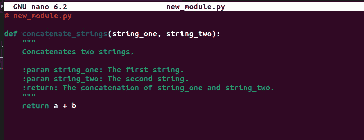

# 9

# 使用 Python 进行 CI/CD 流水线

我在职业生涯中错过了超过 9,000 次投篮。我输掉了将近 300 场比赛。有 26 次我被信任去投决胜球，但未中。我在生活中屡战屡败。这就是为什么我成功的原因。

– 迈克尔·乔丹

在过去，当我还是个年轻的大学毕业生（大约两年前），在被教如何制作网站之后，最经常提到的术语是**持续集成/持续交付**（**CI/CD**）。CI/CD 是我大学课程中没有教授的内容。大多数大学课程都没有；这不足以成为一个学术练习。但是，如果你是一名 DevOps 工程师，这就是你的全部工作。这是你的职责。而 Python 是提升工作效率的绝佳工具。

我经常将 Python 描述为一个伟大的促进者，即一种使所有其他工具更好的工具。这是我们将在本章进一步探讨的概念。Python 是一种非常善待犯错者的语言；相信我，我犯过很多错误。它具有许多功能，可以减少您错误的影响。它还有错误消息，可以简化和有效地追踪错误。如果我们从开发者的角度来讨论实际应用程序开发，每个人都有自己的观点，这在一定程度上是有效的。但正如我在本书中所说的那样，Python 在能够为 DevOps 工程师提供的功能方面显著领先。

因此，当我们探索如何为客户提供旅程时，这就是我们将要学习的内容：

+   CI/CD 的哲学和概念及其在创造过程中的演变

+   使用 Python 进行的基本 CI/CD 任务，可以帮助您理解 CI/CD，它为项目带来了什么，以及其实施的重要性

+   如何使用 Python 开发和增强开发团队内部的协作能力，利用其灵活的特性

+   如何使用 Python 增强和自动化最神圣的 DevOps 传统：回滚

要完成这些任务，您需要准备好一些工具。在我们开始之前，有一些事情是必须设置的。

# 技术要求

在这一章中，我们有一个简短的清单，列出了您需要的一切：

+   用于书籍库的 GitHub 账户

+   一个 Todoist 账户

+   一个 Microsoft 账户

+   一个 AWS 账户

+   能够容忍大量的讽刺和糟糕的幽默感

我们当然也有一个相应的 GitHub 代码库，在这里您可以参考本书中的编码内容：[`github.com/PacktPublishing/Hands-On-Python-for-DevOps/.`](https://github.com/PacktPublishing/Hands-On-Python-for-DevOps/)

# CI/CD 的起源和哲学

人们常问我一个问题：“你是从开发者做起的，怎么会走到今天这一步？”我在本书的几个章节中已经在一定程度上回答过这个问题，但简而言之，我是因为必要性才走到了这里。如今，开发应用程序的人从一开始就被教会如何做，而不清楚背后的所有理论，只知道如何使用它。这样做没问题；你不需要深入了解，除非你愿意，但请知道，过去并非如此。曾经有人必须弄明白所有这些事情（事实上，是几个不同的人）。我认为我的个人经历更能反映出那些弄清楚这些事情的人，而不是你典型的现代 DevOps 学员。所以，我将以三个场景的简短对话回顾这段旅程，场景里我将对着虚空大喊（我们可以称之为 DevOps Doug，听起来很有趣）。我们从持续集成（CI）开始。

## 场景 1 – 持续集成

那是一个深夜，我正在家里做我常规的 200 个俯卧撑和 300 个仰卧起坐时，突然意识到我真的很擅长写代码。这本不应该是一个启示，回想起来其实很明显，但在做出这个发现之后，我决定——作为一个慷慨的人——我想将我的编码天赋与世界分享，于是我打电话给我的老朋友 Doug，请他帮忙。

*Me*: 你好，我需要帮助。我有这么多代码，我想和我的朋友们分享。

*Doug*: 这个很简单。你只需创建、克隆、初始化、拉取、修改，然后推送 Git 仓库。听起来很简单，对吧？

*Me*: 什么是仓库？为什么我不能直接把代码发给他们，然后他们修改后再发回给我？

*Doug*: 嗯……

于是开始了长时间的讨论和大量的阐述，关于什么是版本控制、仓库如何工作、为什么要使用分支以及什么是拉取请求。如果我开始详细讲解这些内容，我得再写一本书。

*Doug*: 这样回答了你所有的问题吗？

*Me*: 是的，我理解它，我也明白它为什么有用，但为什么它是现在这种方式？

*Doug*: 做得更多，你就能学得更多。

旅程继续，就像集成一样，但要长得多，有时也非常无聊。我们跳过那些无聊的部分。

所以，我开始学得更多，并意识到版本控制有多么重要。我还意识到，实际上很少有年轻开发者能真正花时间去完全理解它。有些人甚至因此放弃了。但持续集成（CI）的目的很明确。它清楚地记录了代码修改的历史，并提供了小幅度的改进，这些改进在其他改进的基础上逐步叠加，形成了一系列可以查看、版本化并理解的小改动历史。它增加了组织性和理解，这些都是在提高速度之前你需要首先具备的东西。

随着我不断发展，我的技能也在发展，我的好奇心也在进化。我开始想，“这真的对项目中的其他人有帮助吗？”于是我问了他们，他们确认了确实有帮助。我觉得继续问下去不太礼貌（而且他们可能也没有进一步研究），于是我开始在网上寻找更高级的资料。接下来的这段关于持续交付的对话，倒是挺有意思的。

## 场景 2 – 持续交付

在 Doug 把我推下 DevOps 的河流一段时间后，我发现自己遇到了一个障碍。如果这是个实际的障碍，我完全不在乎，每天做 400 个仰卧起坐和 649 个（没错，正好是这么多）引体向上，我完全能应对。但这个障碍存在于计算机的世界中，它有一个收费站，拒绝任何不符合要求的代码。厌倦了我的代码被自动拒绝，我决定去和收费站的工作人员谈谈，结果，我发现那竟然是我的老朋友 Doug。

*我*： Doug，你是怎么到这儿的？

*Doug*： 我一直都在这里。

*我*： (显得有些困惑) 好吧... 那么，每次我推送我的代码时，它就会更新应用程序的测试版本吗？

*Doug*： 没错，前提是你的代码通过了测试并成功部署。否则，它会恢复到项目的旧版本，并告诉你出了什么问题。

*我*： 好吧，你不能只相信我说的嘛？

*Doug*： 我很乐意，但上次我们这么做的时候，一只斑马从服务器房间里飞出来，开始咬人。斑马可凶了。

*我*： 怎么会有一只斑马……

*Doug*： 这不是重点。重点是，这个系统不仅仅是为了启动东西，好吗？它存在是因为它为每个人简化并确保了流程。一旦开发者推送了代码，对他们来说就结束了。如果这段代码出错，他们会继续处理。DevOps 的人只是为了让这个过程尽可能简单。

*我*： 好的，这个设置简单吗？

*Doug*： 不行。

这是我学习所有测试和安全原则、如何推送代码、创建审批工作流等一系列内容的蒙太奇部分，这些内容你在本书中已经看到过了。这绝对不是一段容易的旅程，但它是值得的。

*我*： 好吧，这没关系，对吧？

*Doug*： 定义 *全部*。

*我*： (叹气) 好的，还有什么剩下的吗？

*Doug*： 多做一点，你就会学得更多。

因此，这段旅程继续着，每次都揭示出更多的问题。说实话，挺无聊的。但我很快意识到，这样其实是有原因的……

好吧，当真相揭示给我时，我意识到这实际上就是正确的方式。通过反复试验找到什么有效，什么无效的方式。一个基于现实问题及其解决方案的方法。一个更加务实的方式，它让混乱中有了秩序。但我也意识到，过度的秩序也是问题（如果是政府做的，我们叫它官僚主义）。有很多必要的步骤，但每当有变动时，总会产生一些不必要的步骤。这个过程需要自我适应。一个有趣的概念。而且它需要在创造价值的同时进行自我调整。但要创新，你必须自动化。而这就是持续部署的故事。

## 场景 3 – 持续部署

有一天，我坐在办公室里，按照平常的流程喝着咖啡，回复着几封邮件，推送着一些代码，突然间我感到脊背一凉，仿佛有人要进来颠覆我的生活...

*道格*: 嘿！

*我*: 道格！你怎么进来的？那扇门锁着呢。

*道格*: 我是你想象中的人物，你永远逃不掉。我在这，你在干什么？

*我*: （把那个令人不安的想法推到一边）好吧，算了。我已经创建了这个可爱的流水线，把代码推送进去。我已经为此工作了三个月。现在我要把它发布到生产环境中。

*道格*: 你一整周都没发布版本？你到底在干什么？

*我*: 我的工作...？

*道格*: 哦，我明白了。那就糟糕了。孩子，听清楚了。如果你做的工作是“做工作”，那就说明你做得不好。

*我*: 那我该做什么工作呢？

*道格*: 不是你的。

*我*: 😐

*道格*: 你的工作是自动化你的工作，确保尽可能少地依赖人工判断。你必须成为一个艺术家，努力用尽可能少的笔触画出你的杰作。你现在已经进入了持续部署的领域。

*我*: 如果我不断部署，那什么时候才算是开发？

*道格*: 诀窍是：你不部署你的应用。你需要创建一个持续部署它的部署。

*我*: 什么？那我要是弄错了怎么办？

*道格*: 这就是另一个诀窍：不要害怕犯错。这就是 DevOps 和 CI/CD 流程成功的原因；你可以快速识别错误，回滚并重构。你不会因为失败而被束缚。

*我*: 我明白了，但这些是我们真正的用户啊...

*道格*：没有比经验更好的老师了。如果你想学到任何有意义的东西，就必须将你的产品交给用户。他们会遇到一些小问题吗？当然，但几乎每个应用程序都会有这种情况，对吧？当你持续部署时，当你拥有了那条流水线，你就有了改变它并帮助用户的能力。不是明天，不是下周，而是现在。这就是 CD 和 CD 之间的区别（是的，我知道这很混乱）。持续交付某物和交付给客户是两件不同的事，其中一件远比另一件更有价值。

*我*：这没道理，但我会试试的，没问题。

*道格*：做得更多，你就能学到更多。

就这样，和道格的这次交流结束了。虽然很有启发性，但像往常一样，给我留下了比答案更多的问题。从那以后他再也没出现过，但我知道他在那儿，什么时候我最不需要他时，他就会出现，带我穿越 *道格宇宙*，踏上另一段疯狂的旅程...

那真是道格关于 DevOps 的一番长篇大论，不是吗？但这本质上就是两种 CD 的区别——它们之间的哲学差异，就像半自动步枪和自动步枪的区别。每一种都有其用途。它们可以被看作是彼此的延伸，而且它们都有自己的位置。

既然我们已经把所有这些理论搞清楚了（这很好，因为这个领域仍在发展和演变），我们可以进入有趣的部分了。让我们做一些任务，帮助我们更清晰地了解如何使用 Python 来实现这些雄心勃勃的目标。我们就做一个简单的，几乎不需要任何设置就能完成的任务。因为就像某人曾告诉我（我记不清是谁了）：“*做得更多，你就能* *学到更多*。”

# Python CI/CD 基础 – 自动化一个基本任务

DevOps 的一个重要但常被忽视的部分是，整个过程强迫你生产的文档的彻底性。这些文档不必庞大；它们不必详细到让人困惑，使人们在阅读或编写文档时三思而后行。它必须清晰、简洁且直截了当。最重要的是，它必须存在。说真的，最后这一点比你想象的还要稀缺。

那么，我们如何使用 Python 来促进文档生成过程呢？好吧，我们可以使用一个叫做 `pip` 的小库：

```
pip install sphinx
```

完成此步骤后，进入项目的根目录并使用以下命令初始化 Sphinx：

```
sphinx-quickstart
```

系统会为你提供一些设置选项。你现在可以将这些设置保留为默认值，以便获取示例文档。稍后你可以在 `conf.py` 文件中更改这些设置。


图 9.1 – Sphinx 快速启动菜单

这将创建一个初始的目录结构，可以以 HTML 或 LaTeX 等多种文档格式构建。


图 9.2 – 完成 Sphinx 设置

现在，让我们写一点 Python 代码，和 Sphinx 生成器一起使用。



图 9.3 – 待文档化的初始代码

你会注意到代码注释中的细节。这些细节是 Sphinx 在创建文档时参考的内容。这就是开源项目如此重视代码注释的原因。如果你在库中遇到这些注释，你现在知道为什么了。接下来，运行以下命令来构建 HTML 文件作为文档：

```
make html
```

这将生成一个文档 HTML 文件，你可以托管它，它看起来大致是这样的：


图 9.4 – 文档 HTML 页面

当然，这个过程是手动完成的。但通过正确的文档化实践，它可以通过运行上述命令的工作流来实现自动化。

无论你是经验丰富的 DevOps 工程师，还是新手，你都知道，DevOps 工程师必须做的一件事（在这一部分中已经介绍过）就是与开发人员合作，要求他们做一些能够让自动化流程和其他 DevOps 流程更加顺畅的事情。获得开发人员信任的一个方法是通过某种方式让他们的工作变得更轻松，以此证明你的价值，同时，做一个好同事。你可以通过礼貌待人，咖啡喝完后再做一杯，为他们开门……以及在下一部分中提到的，帮他们简化生活的方式来做到这一点。

# 与开发人员和基础设施团队合作交付你的产品

作为一个 DevOps 工程师意味着你需要成为团队中的终极合作者。这也意味着你必须与团队中的几乎每个人保持社交关系，并且让他们对你有好感。老实说，这并不难；只要笑一笑他们尴尬的笑话，聊上几句闲话，你就会突然成为大家的朋友。如果你愿意，带领大家一起合作并不难。然而，有时确实很难让他们的努力与自己的协调一致。这就是我们为什么需要协作工具的原因。除了普通的 GitHub，我们还有各种各样的工具来支持你使用的开发模式。Jira、Slack、Zoom、Google Chat、Teams……我可以一直说下去。经常发生的情况是，很多团队使用多个协作工具。所以，问题就变成了，如何让这些协作工具彼此协作呢？

工具本身提供了许多连接器，但有时它们的功能需要通过一些代码和 API 调用来实现。我们现在将使用 Python 来连接两个非常常见的生产力工具：Todoist 和 Microsoft To Do。你可能听说过或者使用过其中一个或两个工具。

Todoist 是一个简单的待办事项应用程序。它没有什么特别的，它与其他类似的应用程序（如 Jira 或 Trello）非常相似。Microsoft To Do 也是如此，只不过它集成到了 Microsoft 365 中。

首先，我们从 Todoist API 中提取任务列表。为此，我们需要创建一个 Todoist 账户，并通过 UI 添加一些任务：


图 9.5 – Todoist 仪表板

这里只是一些带有截止日期的任务。现在，让我们获取 API 令牌来调用这个 API。在你的账户的 `todoist` 库下：

```
pip install todoist_api_python
```

接下来，编写一个脚本，将你的 API 令牌集成并列出所有任务。


图 9.6 – 获取 Todoist 任务的代码

很简单，稍微加点语法糖，你就能得到如下的任务列表：


图 9.7 – 从 Todoist API 提取的数据

这只是一个小示例，但你可以看到内容、描述和到期日期，这些正是我们关注的重点。现在，我们将尝试用 Microsoft To Do 做同样的事情。为此，我们只需要调用 API 端点。Python 中也有一个用于 Microsoft To Do 的库，但它仍处于实验阶段。

你需要从 Microsoft 获取一个授权令牌，可以通过调用 API 来获得，示例如下：[`learn.microsoft.com/en-us/graph/auth-v2-user?context=graph%2Fapi%2F1.0&view=graph-rest-1.0&tabs=curl`](https://learn.microsoft.com/en-us/graph/auth-v2-user?context=graph%2Fapi%2F1.0&view=graph-rest-1.0&tabs=curl)。我没有包括这个过程，因为它已经很清晰地在这里描述了。如果你希望自动生成令牌，可以稍后将其集成到代码中。现在，让我们修改代码，使用我们从 Todoist 获取的内容、描述和到期日期：

```
from todoist_api_python.api import TodoistAPIimport jsonfrom datetime import datetime, timezoneimport requests#API tokensapi = TodoistAPI("<your_api_token_here>")access_token = "<Your_Microsoft_token_here>"#Endpoint for your default task listTODO_API_ENDPOINT = YOUR_TODO_ENDPOINThttps://graph.microsoft.com/v1.0/me/todo/lists/@default/tasks#Function to create task in Microsoft Tododef create_todo_task(title,date):    headers = {'Authorization': 'Bearer '+access_token,        'Content-Type': 'application/json'}    payload = {'title': title,        'dueDateTime': date}    response = requests.post(TODO_API_ENDPOINT, headers=headers, json=payload)    return response.json() if response.status_code == 201 else Nonetry:     #Get task in JSON form     tasks = json.dumps(api.get_tasks(),default=lambda o: o.__dict__,sort_keys=True, indent=4)    #Parse tasks    for task in tasks:        title = task["content"]        date = task["due"]["date"].replace(tzinfo=timezone.utc).astimezone(tz=None)        #Create tasks based on information        create_todo_task(title, date)except Exception as error:    print(error)
```

就这么简单。我们可以使用这段代码将任务从 Todoist 转移到 Microsoft To Do。我们甚至可以利用我们前几章中的**基于微服务的架构**（例如在*第八章*，*理解事件驱动架构*中）来使用 Webhook 和事件，使这个过程更加高效。说到事件，在很多服务器中，最常见的事件之一就是故障发生。在故障发生时，需要一个回滚策略。我们来看看 Python 如何帮助实现这一点。

# 执行回滚

我在本书中多次提到：犯错误是可以的。因为大多数错误都是可以恢复的。有些错误不能恢复，但如果你保持清醒，它们其实很容易被识别。在 DevOps 中，这同样适用。你可以撤销你的错误。通常，问题变成了你能多快、多安静、多有效地做到这一点。这正是**回滚**所做的。它们有助于识别和修正问题。

回滚可以手动执行，也可以自动执行。有时手动回滚太慢，且需要人们实际上意识到某个事件或错误，这在团队比如休假时可能需要很长时间才能发现。在这种情况下——以及许多其他情况——基于指标的自动回滚是必要的。正如我们所知道的，Python 在这方面做得非常好。

部署回滚有很多种方式：蓝绿部署（50% 的流量在旧实例上，50% 在新实例上），金丝雀部署（极少数用户会获得新特性以便在生产环境中进行测试），以及其他各种方法。我的一个最喜欢的方式是**红黑部署**。在这种部署方式中，应用程序有两个实例：当前实例（红色）和未来实例（黑色）。你将终端从红色切换到黑色。如果这样不行，你可以将其切回到红色。听起来简单吧？无论如何，这里有一个示意图：


图 9.8 – 红黑部署示意图

所以，记住，*红对黑，你没事，黑对红，你完蛋*。哦，等一下，那是珊瑚蛇的说法。但这里的概念其实很简单。这是一种可以很容易处理的故障转移类型。大多数 DNS 服务都内建了这种功能。但这并不意味着它不能从编码的角度来处理。我们尝试以这种方式处理它的原因，是为了给自己更多的控制权，并为未来可能的变更（比如一次性故障转移多个站点）留出空间。那么，让我们从编码角度尝试一下，使用 AWS Route 53 上的 Lambda 微服务执行故障转移：

```
import boto3def  lambda_handler(event, context):     domain_name = '<your_domain_name_here>'    default_endpoint = '<your_endpoint_here>'    # Initialize the Route 53 client    client = boto3.client('route53')    # Get the hosted zone ID for the domain    response = client.list_hosted_zones_by_name(DNSName=domain_name)    hosted_zone_id = response['HostedZoneId']    # Update the Route 53 record set to point to the default endpoint    changes= {        'Changes': [            {                'Action': 'UPSERT',                'ResourceRecordSet': {                    'Name': domain_name,                    'Type': 'A',                    'TTL': 300,                    'ResourceRecords': [{'Value': default_endpoint}]                }            }        ]    }       client.change_resource_record_sets(        HostedZoneId=hosted_zone_id,        ChangeBatch=changes    )        return {        'statusCode': 200,        'body': "Nothing, really, no one's gonna see this}"    }
```

好吧，这就是代码。将它放到一个 Lambda 函数中，并设置适当的触发条件，当你需要时就可以随时重置为默认值。当然，你也可以使用常规的 Route 53 来做这件事，但这种方法提供了更多修改的选项。修改是 CI/CD 过程中的一个非常重要的部分，因为没有什么是永恒不变的。

# 总结

那么，让我们总结一下你在本章中学到的内容。你已经了解了 DevOps 的哲学和方法论，它就像一条源源不断的河流，始终在变化之中。你还学到了在进行 CI/CD 工作时，你必须采用类似的哲学。在下一节中，你学习了一个可以在 Python 中执行的基本 CI/CD 任务。接下来的部分，你学会了如何通过简化开发人员的日常任务并确保他们拥有所有必要的便利和生产力工具，来帮助开发人员。随后，我们还学习了如何执行回滚，并介绍了一种非常独特的简单回滚技术。

如果你能坚持看到现在，感谢你。你已经阅读了本书的九章，而我依然能够吸引你的注意力。我想我一定做得还不错，对吧？也许？好吧，我们来展望下一章——其实是下一节——因为我们将变得更加雄心勃勃。我们将探讨一些大公司如何在日常工作中使用 Python。听起来很刺激吧！

# 第三部分：让我们更进一步，构建更大

在本部分中，我们将提升我们的 DevOps 和 Python 技能与知识，探索一些关于该主题的高级概念。

本部分包含以下章节：

+   *第十章*，*全球一些最大公司的常见 DevOps 使用案例*

+   *第十一章*，*MLOps 和 DataOps*

+   *第十二章*，*Python 如何与 IaC 概念集成*

+   *第十三章*，*提升 DevOps 技能的工具*
