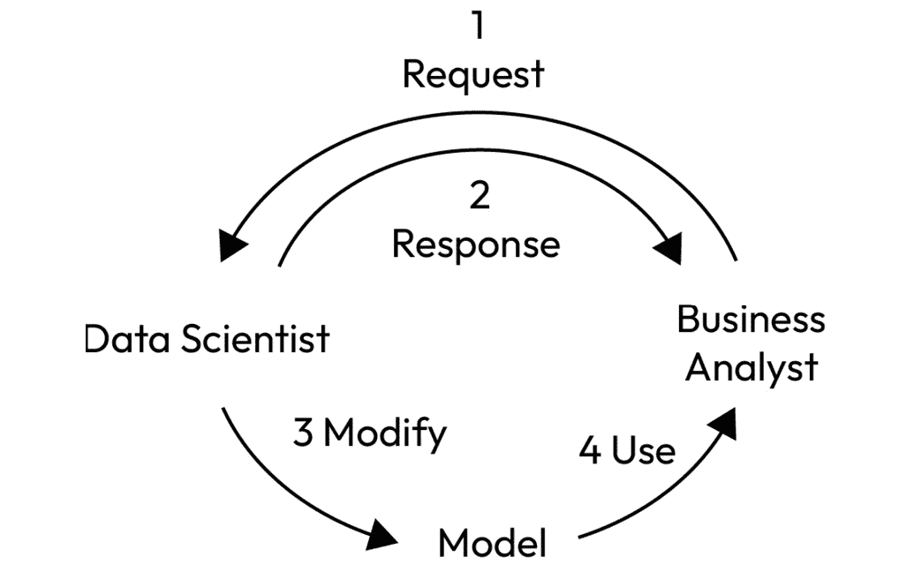
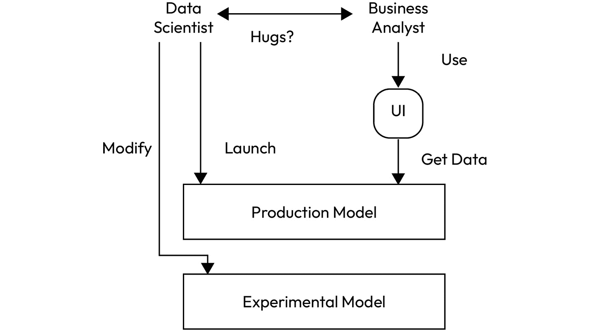
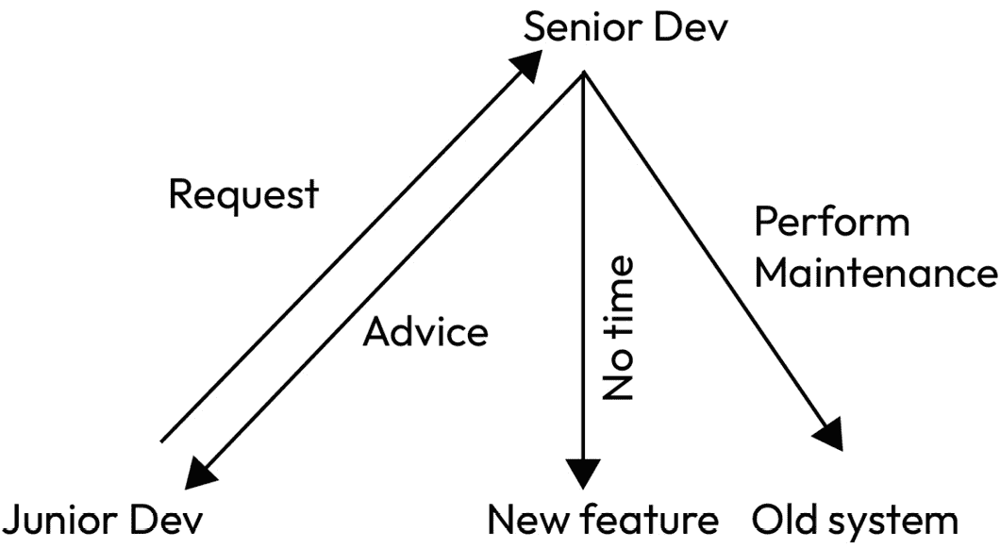
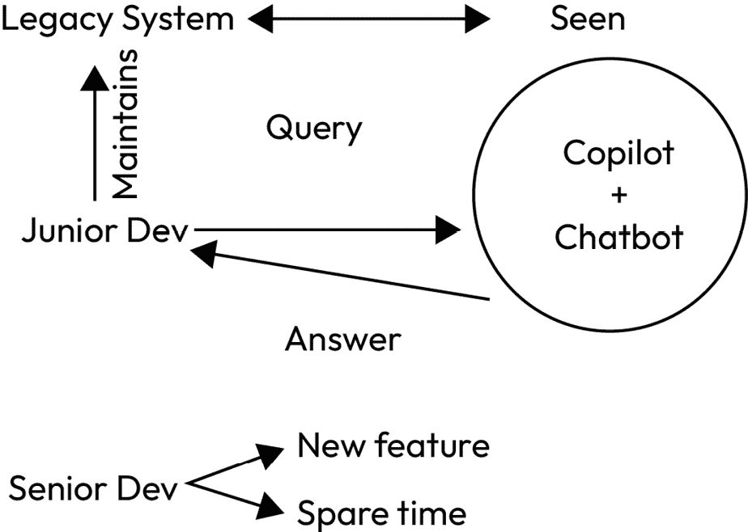
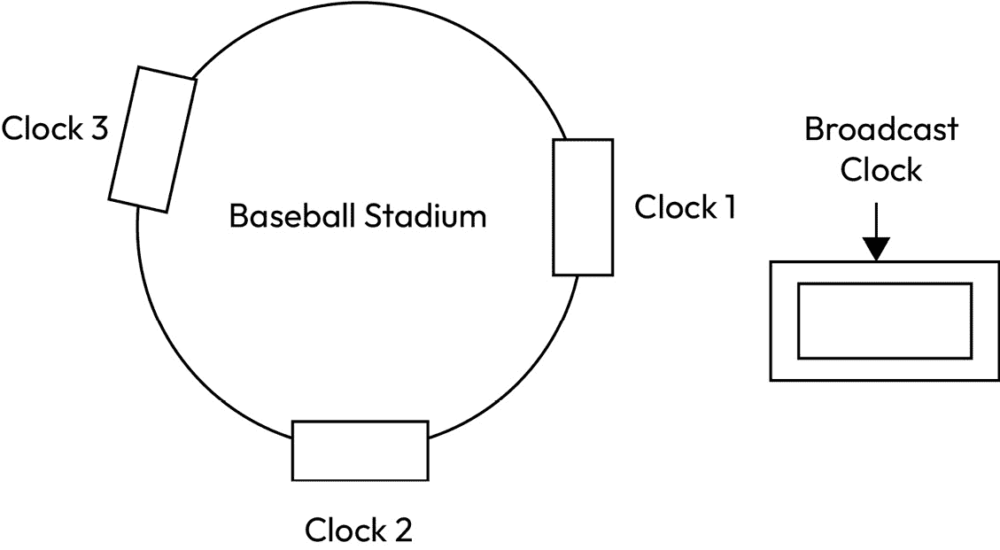
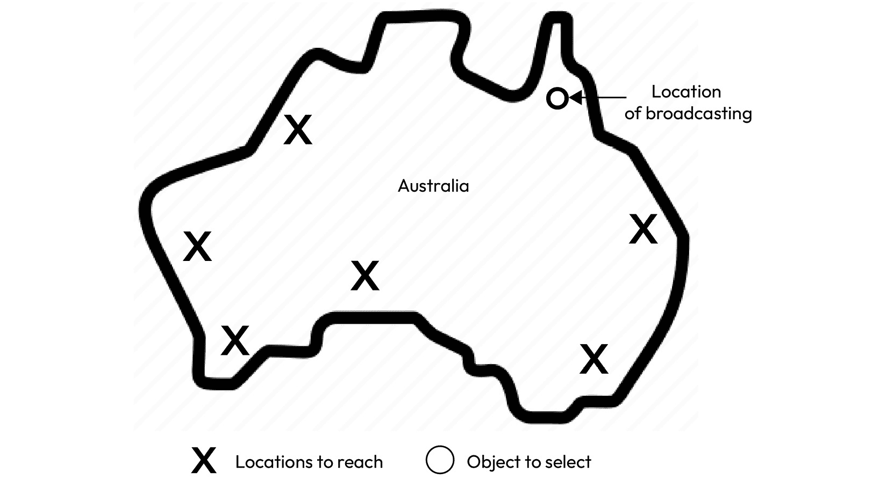
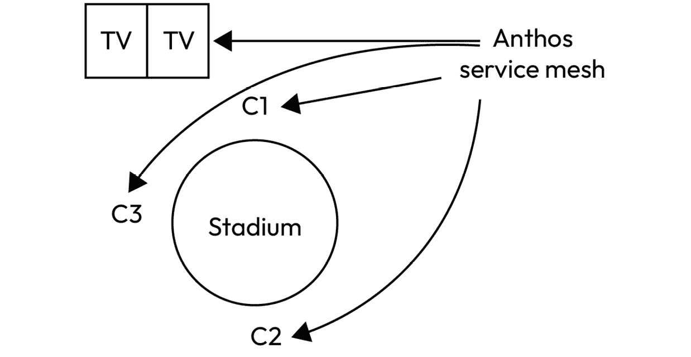
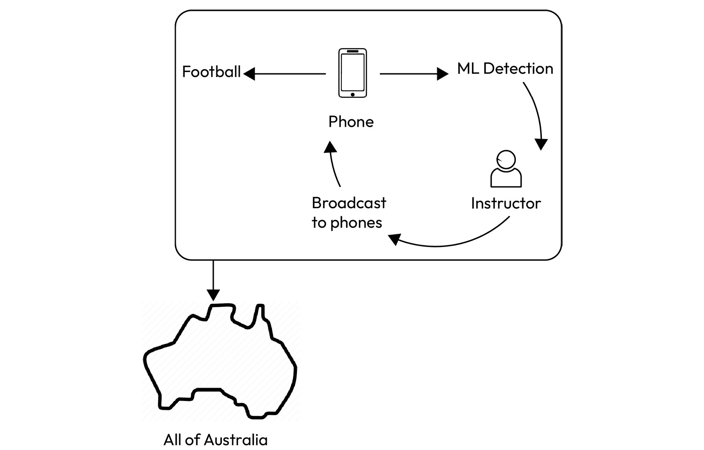

# 一些全球最大公司的常见 DevOps 用例

看到个人和组织实现他们原本可能认为超出自己能力范围的目标，我感到非常满意。

– Don W. Wilson

在本书中，我要求你对我和我写的内容充满信任。我还要求你对**DevOps**过程以及它最终带来的成果有更大的信任。随着新章节的开始，我想现在是时候让我付诸实践，展示一下背后的工作原理。

本章内容全部基于公开信息，这些信息要么由实施该用例的公司提供，要么由为其提供咨询的公司提供。它们可以在各大云公司客户成功案例页面上公开查找。这些商业信息被自愿公开，目的是作为示范，帮助其他企业和行业中的人们改善自己的工作负载。

我将使用这些用例作为示范，展示你如何运用 DevOps，并如何使用 Python 来支持它们的应用。我不想在这一部分使用假设的情况，因为那样会显得不真诚。然而，我使用这些案例的方式是为了展示如何使用 Python 来复制这些用例，而不是它们是否实际使用了 Python。它们可能用过，但这并不重要。

本章的主要动机是向你展示，DevOps 的理念在实际场景中已经得到了应用，创造了真正的客户价值。这也为你在 DevOps 学习旅程和本书过程中所学的技能提供了依据。

所以，废话不多说，在这一章中，你将了解以下内容：

+   一个**亚马逊网络服务**（**AWS**）的用例，帮助弥合了业务分析师与数据工程师之间的鸿沟

+   一个 Azure 用例，节省了大量编码时间，并帮助提高了部署效率

+   两个**谷歌云平台**（**GCP**）的用例，涉及运动联盟找到解决方案，使他们的联盟更具可访问性

# AWS 用例 – 三星电子

三星在很多方面都使用了云和 DevOps 原则。鉴于三星的庞大规模，这一点是显而易见的。因此，我没有对它们进行正式介绍，因为，嗯，你知道三星是什么。我们将讨论的特定案例非常有趣：它涉及到让普通的业务分析师参与**机器学习**（**ML**），同时也让那些懂得编写 ML 算法和应用的人员最大限度地发挥他们的能力。这是一种双管齐下的方法，充分发挥两者的能力，增强它们之间的反馈并促进合作。下图展示了三星原始的数据分析工作流程：

图 10.1 – 三星原始的数据分析工作流

那么，让我们来分析三星所面临的情况，以及他们用来解决问题的方法。

## 场景

三星的分析团队由两个不同的部分组成：业务分析师和数据科学家。业务分析师从理解人类行为的角度，分析三星消费电子产品提供的问题和数据，进而改善产品和预测客户行为。

为此，他们需要数据，海量的数据，并且需要能够处理这些数据的能力。这时，数据科学家发挥了作用；他们将分析师的直觉转化为可以解决的案例，从而提供具体的数据。他们创建了数据分析和机器学习算法，提供业务分析师可以用来为产品提供推荐和建议的洞察力，同时还会向数据科学团队提供反馈。

然而，这种合作关系并不像大家想象的那样顺利；由于多种因素，两个团队之间存在差距，主要原因是尽管两个团队相互依赖，但在工作方式上存在差异。

除此之外，数据科学家们还需要在不同的数据集上执行重复性的任务，以确保向业务分析师提供正确的输出。这导致数据科学家没有时间去尝试其他机器学习算法和他们可能想要实现的各种技术，也使得业务分析师在他们负责的数据上失去了显著的控制权，这意味着他们无法全面了解数据，无法进行有效的分析。

需求变成了找到一种方法来协调数据和算法，使得业务分析师可以使用常见的算法，同时数据科学家也能对其进行调整。这将创造一个环境，使得数据科学家不必等待业务分析师，反之亦然，从而为双方释放出时间和资源。

## 头脑风暴

现在，你可能会问，如果你对这个过程不熟悉，在现代社会中，业务分析师如果不会写代码，他们是做什么的呢？嗯，这比你想象的要普遍得多。分析师的工作并不是编写代码或解析数据（尽管这通常是他们会做的事情）；他们的工作是分析摆在他们面前的信息，并利用这些信息提供某种推荐、洞察或解决方案。

问题的核心在于，两个团队之间存在着沟通和理解的鸿沟，而要弥补这一差距没有重大人员变动几乎是不可能的。而这种人员变动通常不符合公司的最佳利益。

您需要确保一个团队不依赖于另一个团队，并能根据他们收到的信息而不是信息来源的人操作（松耦合，记住？）。因此，一个理想的解决方案是找到一种方法，让两个团队能够同时处理相同的数据，而不需要通过不必要的沟通来阻碍彼此，这正是他们找到的解决方案。

## 解决方案

图 10.2 - 三星的新数据分析工作流程

解决方案基本上是这样的：会有一个数据的单一来源，数据分析师和数据科学家都可以从中工作；数据科学家会为分析师提供访问用户界面的权限，以执行他们想要的数据操作。科学家们随后会调整这些操作和算法，试图在不需要分析师联系他们获取当前运行算法版本结果的情况下获得更好的结果。这本质上就像是为数据分析师内部使用创建的应用程序，由数据科学家构建。

存在不同的技能和思维方式是有其原因的，这就是为什么团队中需要有不同角色和视角的原因。在这种情况下唯一需要做的事情就是确保所有这些角色都处于可以成功的位置。通过为这两种角色提供一个平台和工作流程，使他们感到舒适，找到了一种合理的方式让整个团队能够最优化地工作。三星通过使数据集中化，并使两个团队都能访问数据，而且两个团队都不需要依赖彼此来取得进展，同时找到了一种方式使彼此能够互补和支持。

接下来，我们将看一个使用案例，在这个案例中，公司不得不处理具有类似技能水平但经验不同的人员，并同时应对业务需求和生产力。

# Azure 使用案例 - Intertech

在搜索使用案例和场景时，我完全爱上了 Intertech 通过 DevOps 转型的力量所做的事情。它使用 Azure 的事实并不像它如何使用 Azure 和 GitHub 服务来现代化和革新其管道那样重要。这个使用案例就是 DevOps 应该为公司带来的价值。它还解决了本书后面部分（我们现在所在的部分）将变得非常相关的内容：生成式 AI。让我们来看一看旧 Intertech 工作流程：

图 10.3 - 旧 Intertech 工作流程

这个图表展示了一种沉没成本谬论，这种谬论会导致生产力的严重损失。它代表了 Intertech 在运作上效率低下，浪费了大量本不该处理的任务上的核心人员。所以，我们来看看 Intertech 是如何应对这个问题的。

我们先从 Intertech 说起。他们是一家 IT 运营公司，支持土耳其一些最大商业客户的基础设施和运营需求。现在，你可以想象，这种运营在很多层面上会相当难以管理。问题并不大；实际上，它们是微小的割伤和针刺，但这些往往是最令人烦恼的痛苦。它们既令人恼火又分散注意力，如果你让它们存在，它们会偷走你的注意力。在这一部分，我们将讨论心理和身体上的痛苦，以及 Intertech 的优秀员工如何努力减少这些痛苦。

## 场景

Intertech 致力于为土耳其一些最大公司创建和维护解决方案。请记住这两个词：创建和维护。这是开发任何软件解决方案的两个基本部分，但它们是完全不同的。创建某物意味着赋予它生命；你在给它“生命”，这是痛苦且漫长的，但它是美好的。维护某物就像是给你刚出生的孩子换尿布。这是令人讨厌的，但你得对它负责，而这个孩子是不会自己照顾自己的，无论它多么独立或成熟（大多数孩子并非如此）。记住这个类比，它会贯穿接下来的各个小节。多年以后，如果我在为这本书写第二版的时候依旧在给它“换尿布”，我也会记住这一点。

所以，Intertech 面临的困难是：在开发新项目的同时，如何维持旧项目。而维持旧项目的任务虽然琐碎，却需要大量的人力、工时和精力，这些本可以用来探索新的价值传递方式。解决问题的思维循环，从最初的问题到最终找到解决方案，通常需要宝贵的时间和智力努力，而这些努力往往远低于解决问题者的能力。基本上，它迫使聪明的人去做一些愚蠢的任务。

那么，在思考这个问题的解决方案时，我们首先应该想到什么呢？也许有一种方法可以在不需要过多思考和研究的情况下找到解决方案。当然，这种方法不适用于那些需要真正集中精力的关键任务，但适用于那些琐碎的任务，比如需要搜索一堆术语然后找到合适的 Stack Overflow 页面，再将其复制粘贴到解决方案中，最后运行几次确认其有效性。也许有一种工具可以整合所有这些信息，为简单的日常问题生成一个简洁的解决方案，从而为我们节省时间。也许这种工具的名字与*人工智能*有些相似？好吧，没有什么能和人工智能押韵。AI，就是我所说的。

## 头脑风暴

好吧，到现在你大概已经知道我想说什么了，那么让我分享一下我个人的经验，讲讲我通常如何在日常生活中使用生成性 AI。这是一个非常有用的工具，像你们这些读这本书的人都会证明这一点，除非你是坚决反对 AI 的人，或者你脑袋里储存了所有世界上的信息。如果你是后者，联系我告诉我*黑道家族*结局到底发生了什么。

我使用生成性 AI 来制定解决方案的步骤，并将其框架化，以便我可以根据我给出的上下文进行理解和修改，或者根据它尚未训练过的内容进行修改。这比每次需要解决问题时都去查找教程容易多了，而当教程不完整时，还得去找另一个教程。通过像 ChatGPT 这样的生成性 AI，局面发生了变化；现在我可以不耐烦，而生成性 AI 则能耐心地处理我的请求。这非常棒，因为说实话，思考是很累人的，特别是当你不得不一次又一次地思考同样的事情时。它会让你的大脑麻木，降低生产力。Intertech 的人们得出了相同的结论。

如果你想继续使用孩子的类比，这就像有一股神奇的力量，它会自动给孩子换尿布，并把尿布围绕在孩子身上，只等你把别针别上去。所以，从这个角度来看，如果有一个重复的任务出现，并且任务足够简单，它就会通过各种方式妨碍生产力。在这种情况下，生成性 AI 可以来拯救我们。任何使用过它的人都知道 ChatGPT 在这方面有多么有用。实际上，凭我的个人经验，ChatGPT 对我最有帮助的事情就是解释我粘贴进去的代码行。因为我无法像 AI 那样迅速收集信息，这通常会比 ChatGPT 所需的几秒钟更长。因此，既然我们已经证明了生成性 AI 解决方案的有效性，让我们来看看 Intertech——他们也得出了类似的结论——是如何将这些概念融入到他们的 DevOps 和 Azure 工作负载及任务中的。

## 解决方案

Intertech 创建的解决方案围绕着 GitHub Copilot 和 Azure OpenAI 集成展开。Copilot 在经过某个特定代码库的训练后，只要给出正确的提示，它就能简单地编写所需的脚本。Intertech 将 Copilot 集成到开发人员使用的**集成开发环境**（**IDE**）中，这样开发人员写一两行代码后，Copilot 就会推测他们的意图并完成大部分剩余代码。开发人员只需验证几个测试，瞧，一套高效的代码交付系统就完成了，节省了时间和思考力。下图展示了该解决方案：

图 10.4 – 具有生成式 AI 的新 Intertech 工作流程

图中的解决方案可以分解为以下步骤：

1.  当初级开发人员对遗留系统进行维护时，他们使用已经在该系统的代码库上进行训练的 Copilot 实例。

1.  这使得他们能够以易于阅读的形式查询并找到他们在代码库中寻找的答案。

1.  Copilot 还帮助自动完成代码，并保持与代码库其余部分风格的一致性。

1.  高级开发人员在大多数情况下不参与这一过程，这样他们可以专注于较新的项目和系统。

由于大多数维护工作都由高级开发人员完成，因为他们曾参与过旧项目，这些开发人员（由于经验丰富，他们的时间更为宝贵）需要亲自处理许多问题以解决它们。即便这些问题交给了初级开发人员，他们仍然会向高级开发人员请教大量建议，这虽然并非负面行为，但仍在一定程度上阻碍了高级开发人员。

为了减少初级开发人员对高级开发人员的依赖，公司将 Azure OpenAI 聊天机器人集成到了他们的 IDE 中。这些聊天机器人能够从代码和项目文档中抓取并推断出信息，并解答大多数初级开发人员的疑问。这样不仅减少了高级人员在代码维护上的时间消耗，还通过个性化的“保姆”引导初级开发人员完成代码库。一个惊人的结果是，公司内部的邮件数量减少了 50%，这是一个值得注意的数字。难道你不想要减少 50% 的邮件，同时保持甚至提高生产力吗？更不用说，不用参加会议、避免重复做老事所释放出来的时间。这种价值乘数效应能将公司推向更高的水平。

说到价值，到目前为止我们所看到的价值都是基于事实表和计算机代码，但在下一部分，我们将看到 DevOps 如何在更具物理感知的环境中创造价值，以体育为例。

# Google Cloud 用例 – MLB 与 AFL

如果你有一件事要了解我，那就是我非常喜欢体育。我热爱体育，喜欢学习新运动，就像我热衷于跟随多年来一直关注的老运动一样。

我已经跟随**美国职业棒球大联盟**（**MLB**）多年，在这期间，棒球一直是数据分析的运动。现代大多数球队在选拔球员时都受到数据分析的驱动，球员的表现通过对他们比赛中收集的多个指标进行统计分析来衡量。你可能看过电影*《点球成金》*（或者读过迈克尔·刘易斯的书），它讲述了统计方法在选择棒球球员中的应用，以及这些方法如何帮助奥克兰运动家队在 90 年代末和 2000 年代初取得成功。

在 MLB 中，引入分析数据的结果之一是对比赛本身以及完成一场比赛所需时间的分析。为了简化比赛流程，MLB 引入了投球计时器，给球员仅有 15 秒的时间来投球。如下图所示，计时器需要在整个场馆内同步，并且与电视直播中的计时器保持同步。这种同步性为 MLB 实施其最新规则带来了独特的挑战：

图 10.5 – 原始 MLB 比赛计时系统

我还想看看其他可能以某种方式使用数据分析和 Google Cloud 并将其集成到他们联盟基础设施中的体育联赛（或许采用了不同于 MLB 的方法）。在我的搜索中，我找到了一个完美的例子，就是**澳大利亚足球联赛**（**AFL**）。以下图展示了 AFL 的教练员广播情况：

图 10.6 – AFL 教练员的广播情况

当我开始研究时，我几乎对澳大利亚规则足球（也叫做澳式足球）或 AFL 一无所知，除了知道大决赛当天是澳大利亚的公共假期。然而，在我的研究中，我确实发现了一点，那就是这两家公司都在使用先进的数据分析来寻找改善比赛观赏方式的方法，并分析是否有可能使比赛玩法和球员表现更加出色。

鉴于我对体育和所有围绕体育的“极客”内容充满热情，这一小节对我来说似乎是不可避免的。那么，让我们深入探讨，看看在这些用例中我们可以发现哪些 DevOps 和数据洞察。

## 场景

让我们从棒球开始；我喜欢棒球。它是坚忍不拔之人的运动；它是时间静止的运动。如果你有 23 个小时的空闲时间，请务必看看 Ken Burns 的《棒球》纪录片系列；你不会后悔的。但整体而言，棒球和尤其是 MLB 在过去几年中遭遇了一些挫折。休斯顿太空人有涉及作弊的丑闻，由于比赛时间过长，现场观众和电视观众的参与度下降。为了解决这些问题，同时保持比赛的完整性，MLB 转向了数据。他们利用各队单独使用的分析工具，并决定将其转向整个联盟。他们从整个赛季（包括 2430 场常规赛和季后赛）的所有比赛中收集与比赛、观众参与度相关的统计数据，并决定创建基础设施解决方案，以加强他们将要实施的解决方案。他们在这方面使用了 Google Cloud：既用于数据分析，也用于解决方案的实施。

澳大利亚足球规则是澳大利亚的头号运动。在这片下方的土地上，它是观众最多、影响最大的运动。它也是澳大利亚最具身体对抗性的运动，作为一个经常观看体育比赛和从事数据科学的人来说，一个体育运动在人类之间的身体接触越频繁，分析起来就越困难。在这里，数据需要在更加物理的层面上进行分解，关注于人体本身。这种方法使得澳式足球联盟能够开发出一套利用机器学习与人工教练相结合的系统，为那些依然对这项运动充满激情的弱势群体和不同能力的人提供训练方案。

这两个体育联盟面临了两个截然不同的问题，都需要完全不同的解决方法，但它们都在 Google Cloud 上采用了 DevOps 原则来解决。让我们看看它们是如何做到的。

## 集思广益

MLB 的问题影响了比赛及观众的观赛体验。人们讨厌浪费时间，也讨厌慢节奏的比赛。任何看过 NBA 季后赛最后两分钟比赛的人都知道这一点。MLB 通过观察每局所花的时间以及这些局中最耗时的部分来解决这个问题。他们发现投手投球前的准备时间和封杀时间延缓了比赛进程。这促成了投球计时器的诞生，一个记录投手在两次投球之间可以等待的时间的计时器。他们认为，投球之间的时间是比赛变慢的主要原因，并相信投球计时器能解决这个问题。该方案结合了 GCP 和 DevOps 原则，结合 GCP 服务和本地计时硬件来实现。作为一个球迷，我对此也非常感激。我们将在下一节讨论解决方案的完整内容。

AFL 的问题在于青少年参与度以及某些人在尝试参与这项运动时的身体局限性。澳大利亚还是一个面积广大的国家，人口分布非常广泛，这意味着需要接受澳式橄榄球训练的人们，尤其是偏远地区的人，需要远程进行训练和指导。目标便是尽可能覆盖更多人，并尽可能多地收集数据，以确保其准确性，同时还要能接触到在某些沟通形式上有障碍的人群。这个问题需要设备之间的通信方式，并且要求使用机器学习算法，特别是用于跟踪运动员在运动中使用的球，以便进行训练。

所以，考虑到这些问题，以及我们可能采取的解决方法，我们现在可以开始提出一些解决方案，帮助这些组织实现他们的目标。让我们看看他们究竟做了什么来达成这些目标。

## 解决方案

MLB 问题的解决方案涉及使用 Google Cloud 的 Anthos 服务网格将所有投球计时器协调在一起。集中式但分布式的计时器增强了比赛的完整性和这些新规则的执行。

MLB 的问题在于同步性。目标是将遍布整个体育场的比赛计时器同步，以协调它们的时间。在这里，Google 使用了其 Anthos 服务网格（如以下图所示），作为云端设备与棒球场地上本地设备之间的连接器。这使得投手的计时器可以在任何地方都清晰且准确，无延迟地显示，确保新系统的公平性。

图 10.7 – Anthos 同步游戏时钟用于 MLB

引入比赛计时器使得平均棒球比赛时间缩短了 24 分钟。这是非常重要的，我认为这是我在如此非技术性场景中看到的 DevOps 思想最具意义的应用。让我们来做一下计算：每场比赛减少了 24 分钟，这使得比赛的平均观众人数从 26,843 增加到 29,295，取得了显著的成效。那么，究竟节省了多少时间呢？好吧，这是 24 分钟 x 29,295 人 x 2,430 场常规赛比赛。总共节省了 1,708,484,400 分钟，约等于 28,474,740 小时，1,186,447.5 天，或者 3,250 年。这是相当可观的节省，而球迷们也感受到了这一点，这就是为什么观众人数上升的原因。所有这一切都得益于能够协调松散耦合的基础设施。

AFL 问题的解决方法要求交付能够在网络不稳定时进行运动追踪的 ML 模型。这意味着任何使用的 ML 模型都必须使用移动设备端的计算能力，并且足够轻量，以免影响设备的正常运行。谷歌的开发团队曾帮助印度 **印度超级联赛** (**IPL**) 提供过类似的教学解决方案。因此，他们最终得出的解决方案是一款名为 Footy Skills 的应用。

图 10.8 – AFL 教练指导广播系统

该应用使用了两个 ML 模型：一个用于根据大小、形状和颜色检测澳式橄榄球，另一个用于确定其空间深度和位置。它们还增加了一些功能，帮助听力和视觉受损的运动员以及使用轮椅的运动员参与比赛。

# 总结

这一章确实是一段奇妙的旅程。即使在我写的这本书中一些奇怪的内容面前，它依然独具特色。但我可以诚实地说，写这一章是一次愉快的经历，因为在写作过程中，我有机会研究了许多独特的解决方案。

我们从 AWS 解决方案开始，这展示了当你将人们放置在一个能够发挥他们技能并与其他技能结合而不是相互冲突的位置时，会发生什么。它还展示了 DevOps 解决方案如何不仅仅促进技术发展，也促进了这些技术背后的人才。

在 Azure 的应用案例中，我们了解了 AI 和 ML 与 DevOps 相结合如何提高从事创造性工作的团队的生产力。我们看到生成式 AI 如何被用来帮助开发者，减少关键人员需要完成的琐碎和重复性工作，并腾出时间和沟通渠道，使团队更加高效。

在第一个 GCP 使用案例中，大联盟棒球（MLB）需要一种方法来证明改变已经存在超过一个世纪的棒球规则是合理的。他们使用了可靠的数据和确凿的事实来做到这一点。这些事实通过收集整个赛季的棒球数据来提供。随后，他们利用这些数据和其他松耦合的协同技术来实现他们改变规则的愿景。通过数据和技术协调，他们创造了一个对他们有利且深受球迷喜爱的规则：这是一个几乎闻所未闻的壮举。

在第二个 GCP 使用案例中，澳大利亚足球联盟（AFL）通过将机器学习模型与 DevOps 原则结合，直接部署到遍布澳大利亚的设备上，从而扩展了其可用性和包容性，使得澳大利亚最偏远地区的人们也能接触到优秀的教练和教学，帮助他们提升体育水平。这为 AFL 提供了一个宝贵的增长和拓展平台，尤其是在他们的粉丝和未来球员之间。

总结来说，这些 DevOps 技术在现实生活中非常有用。许多解决方案如果没有 Python 也无法实现，特别是那些涉及机器学习和人工智能的解决方案。而这只是 DevOps 能带给你高度的起点。在下一章中，我们将更深入地探讨 DevOps 的数据科学方面，Python 与数据的结合，以及 **MLOps**。
