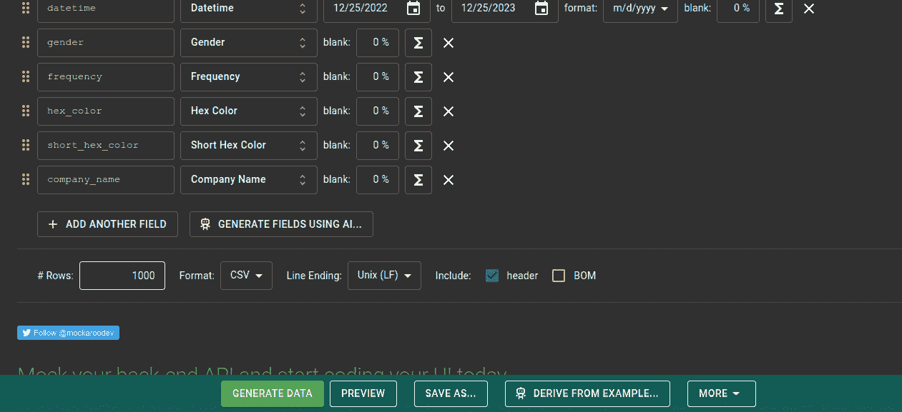
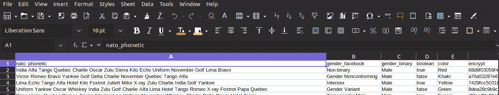
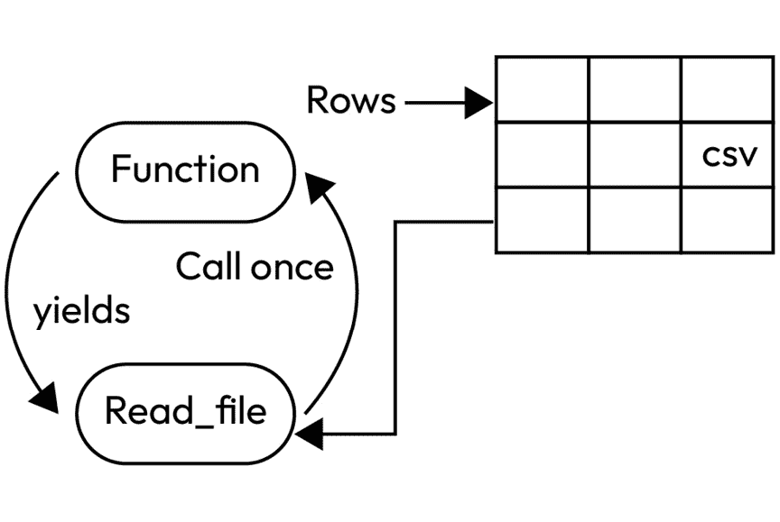
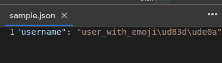
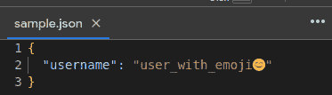
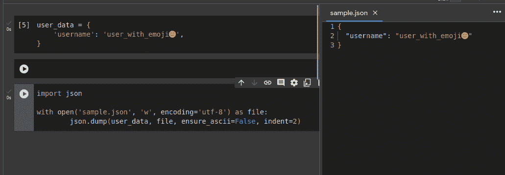
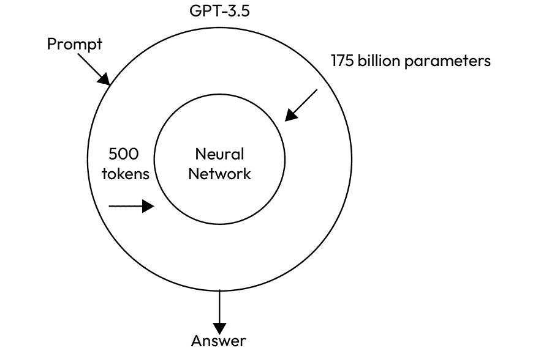

# MLOps 和 DataOps

未来很快将成为过去

– 乔治·卡林

我本来打算使用一些生成性 AI 来编写本章节的内容，但那样的话，内容会更像是自传而非技术书籍，因为生成性 AI 就变成了共同作者。我会尽量做一个非常客观的观察者，并公正地处理这个热门话题。我希望这能让我在未来可能由 AI 主宰的世界中占据一个有利位置。在过去的一个世纪里，机器学习和 AI 领域取得如此巨大的进展有很多原因：诺姆·乔姆斯基、艾伦·图灵、计算机本身的发明、科幻小说，以及人类对宇宙中新生命的永恒渴望。但在过去的几年里，这些概念作为可行产品和服务的交付，离不开 DevOps 的支持。毕竟，你觉得**ChatGPT**是怎么在大约五秒钟内，瞬间回答你四段问题，并且每分钟为一百万多人做到这一点的呢？

现在，本书中的所有章节和概念都让我们回到一个事实，那就是 DevOps 的核心是提供价值并使事情能够正常运行。当 DevOps 的焦点转向数据时，这一点并没有改变。在这种情况下，Python 变得更加有用，因为它是数据操作员的语言。如今，大多数人和数据开发环境默认使用 Python，因为它提供了进行数据处理和分析所需的工具。大多数高效的**DataOps**工作负载都会在某种程度上使用 Python。很多人会在运行脚本和任何需要编写的支持性操作脚本中都使用 Python。我们还将讨论**MLOps**以及帮助交付和优化机器学习模型和算法的操作。所有这些内容将在你阅读完*技术* *要求*部分后，在本章节中进行讲解。

总结一下，在本章节中，你将学到以下内容：

+   当涉及到 DataOps/MLOps 时，与常规 DevOps 的做法相比，存在着哪些不同？

+   处理各种不同数据挑战的做法

+   ChatGPT 交付到你电脑屏幕背后的操作

# 技术要求

以下是一些帮助你跟上本章活动的要求：

+   一个 GitHub 帐户，并能够访问本书的 Git 仓库（[`github.com/PacktPublishing/Hands-On-Python-for-DevOps`](https://github.com/PacktPublishing/Hands-On-Python-for-DevOps)）

+   使用 Google Colab 所需的 Google 帐户

+   某处可用的 Python 环境

+   一杯你最喜欢的饮品

# MLOps 和 DataOps 与常规 DevOps 的区别

我们在任何技术行业中经常会遇到的一个问题是：数据角色和非数据角色之间的区别是什么？软件工程师和数据工程师、数据分析师和会计师，或者 DJ 和音乐作曲家之间的区别是什么？这是雇主经常提问的问题；人们猜测是否有一种是另一种的子集，或者它们是否完全不同。即使在瑞典语中，*dator*表示“计算机”，科学被翻译为*vetenskap*，而计算机科学则被称为*datavetenskap*，因此在某个时候，设计并更新瑞典语言的实体认为这两者之间几乎没有什么区别。

我们现在通过几个常见的 DevOps 用例来解释这些内容，这些用例可以应用到数据操作（DataOps）和机器学习操作（MLOps）这两个更具体的领域。在 DataOps 中，我们将介绍一个简单的方法，这个方法帮助我在使用 JSON 文件时，节省了很多 Python 中的数据连接操作。在 MLOps 中，我们将重点关注 GPU 方面，这是 MLOps 工程师可能需要处理的主要硬件。

## DataOps 用例——JSON 连接

这是一个非常简单的小技巧，但它并不像你想象的那样为人所知。我真心认为，如果我能通过这一部分帮助到一个正在处理数据的人，那么我就算成功了。JSON 的操作是数据操作中非常重要的一个方面，尤其在 NoSQL 用例中非常显著，但在其他一些场景中也很常见。自然地操作 JSON 给 Python 带来了相较于许多其他编程语言的重大优势。它最有用的应用之一就是管道（`|`）操作符。这个小操作符可以用于执行连接、联合，甚至是数字的按位操作。它是 Python 使这些小数据操作变得更加易用的许多方式之一。

所以，我们将从仅仅一个连接 JSON 的函数开始：

```
a = {"one":1, "two":2}b = {"one":"one", "two":2, "three":3}print(a|b)
```

就这样。这就是代码，下面是代码的输出：


图 11.1 – JSON 连接的输出

你会看到第二个 JSON 的键值会覆盖第一个 JSON 中的值，如果它们有相同的公共值，那么它们会保持不变，任何额外的值会被合并到整体 JSON 中。所以，记住这一点，每当你遇到 JSON 合并的问题时（而且这个问题可能会很常见），你就可以使用这个小技巧。现在，我们来看看另一个技巧，它肯定能帮助所有游戏硬件爱好者。它也会帮助其他人，但我特别提到硬件爱好者，因为他们拍了最多的 YouTube 视频，我希望能得到一些曝光。

## MLOps 用例——超频 GPU

在这个 AI 艺术的现代时代，最高水平的图像生成可能需要大量的处理能力。对于任何类型的图形渲染，只有在没有其他选择的情况下才会使用 CPU，并且通常不建议用于较大的渲染。对于机器学习的 TensorFlow 算法，Google 的专有 TPU 是常见的选择。但同样，对于任何涉及图像生成或处理的任务，拥有一块好的 GPU 是非常有用的。如果出现了需要 GPU 额外能量才能完成任务的罕见情况，超频可能是必需的。

很多时候，GPU 处理器都有自己的驱动程序，而这些驱动程序也带有各自的命令行工具。在使用超频或其他 GPU 功能之前和之后执行这些命令可能会很麻烦。相反，通过使用 Python 内建的`subprocess`模块，我们可以自动超频或执行任何其他 GPU 相关的任务。对于这个例子，我们将使用 NVIDIA 的命令行工具，它可能是目前最流行的 GPU 品牌。NVIDIA 有一个命令行工具叫做**nvidia-smi**，它也包含了一个超频功能，这正是我们要调用的工具。现在，让我们写出能够帮助我们超频 GPU 的代码块：

```
import subprocessdef overclock_gpu():    # Set the new clock frequency for memory and graphics    new_clock_memory= <your_clock_frequency_in_MHz>    new_clock_graphics= <your_clock_frequency_in_MHz>    # Run NVIDIA command to overclock GPU    command = "nvidia-smi –i 0 --applications-clocks {new_clock_memory},{new_clock_graphics}"    subprocess.run(command, shell=True)if __name__ == "__main__":    overclock_gpu()
```

运行上面的代码后，将会对设备上设置的任何 NVIDIA GPU 进行超频。这将使得图像处理和生成等过程变得更快。这在对这些资源有更高需求时很有用，并且无法将这些需求转移到其他资源上时。所以下面的代码可以根据某些条件临时对 GPU 进行超频。一旦超频完成，你可以通过运行以下命令（无论是在脚本中还是外部）将其恢复到默认设置：

```
nvidia-smi –- reset-applications-clocks
```

这就是如何使用 Python 操作 GPU 的方式。这个部分的内容大多是学习如何操作数据及其相关方面。然而，数据本身也因为多种原因可能变得难以处理。一个主要的原因可能是数据的数量，可能会非常庞大。接下来的部分将会讲述如何找到应对来自各种来源的数据的方法，避免被大量数据压倒。

# 处理速度、体积和种类

在任何关于如何处理数据的教程中，通常都会简单介绍**三维（three Vs）**（**速度（velocity）**、**体积（volume）**和**种类（variety）**）。这三种方式描述了数据复杂性的扩展方式。在处理数据时，每种方式都会提出独特的问题，而你需要处理的大量数据可能是这三者的组合。速度指的是数据在一段时间内的流入速度，体积是数据的数量，种类则是呈现的数据的多样性。

因此，这一部分将根据三个 V 进行划分，每个小节中都将为可能出现的共同问题提供解决方案。这样一来，您将了解 Python 如何帮助处理如此大量的数据。让我们从容量开始，因为这是最简单的，而且当谈到**大数据**时，可能是人们首先想到的。

## 容量

数据的量是一件相当简单的事情。它表示一定量的数据，其中大多数（如果不是全部）将是相同类型的数据。如果我们要处理大量数据，将需要理解数据的时间敏感性以及我们手头的资源。通常处理的数据量根据数据是基于宽度还是长度而不同（即一行数据是否有很多字段或者数据行数非常多）。这两种情况需要不同的解决方案，有时甚至需要专门的数据库。还有可能数据集根本不是数字和字母，而是音频或视频文件。在本节中，我们将使用一个示例，在拥有包含大量字段/列的数据库或数据文件时会非常有用。

要开始，我们需要一个大容量数据集，因此我们将使用一个名为**Mockaroo**的应用程序，该应用程序允许您使用生成式 AI 生成数据字段和样本数据（在本章非常合适）。让我们转到 Mockaroo 网站，为我们的样本数据生成几个字段：



图 11.2 – Mockaroo 模式

我们用 Mockaroo 生成的数据集如下所示：



图 11.3 – Mockaroo 创建的样本 CSV

上述图示仅显示了其一小部分；它是 1,000 行中有 20 个非常大字段。让我们编写脚本来解析它：

```
import csvdef read_large_csv(file_path):    with open(file_path, 'r') as csv_file:        csv_reader = csv.reader(csv_file)        next(csv_reader, None)        for row in csv_reader:            yield rowcsv_file_path = 'MOCK_DATA.csv'for row in read_large_csv(csv_file_path):    print(row)
```

脚本在读取 CSV 文件方面可能看起来有点多余，但之所以这样是为了确保 CSV 中的所有行不会同时加载到操作系统的内存中。这种方法将减少数据内存的负荷，是在内存无法容纳大量数据的系统中读取大量数据的绝佳方式。其原理是读取一行数据，然后释放内存中的数据再读取其他行。这是在读取高容量数据时有效管理内存的方式，从而使读取速度更快、更顺畅，正如本图所示：



图 11.4 – 生成器背后的工作流程

现在，这已经足够简单了，但是当每次只有一行数据时，但是持续不断，例如流数据时会发生什么？所有这些都需要在其传入时进行实时处理。我们该如何实现这一点？让我们找出答案。

## 速度

处理数据速度是一个值得数十亿美元投资的问题。即使在今天，最大的在线视频流平台也在努力持续地发送直播数据。当然，造成这一现象的原因有很多，但事实是，许多解决方案没有正确的预算和质量组合，因此无法始终保持一致。不过，我们可以做到非常接近。

在这个练习中，我们将使用很多人称之为数据流的未来，甚至可能是现在的技术：**Apache Flink**。这是一个由 Apache 软件基金会开发的流式和批处理框架，旨在实现平滑快速的数据流。与许多由 Apache 软件基金会管理的框架不同，它是专门为基金会维护而创建的，而不是由某公司创建并开源以便于维护的项目。

Flink 本身不提供任何数据存储解决方案，它的工作是将传入的数据处理后存储到指定位置。它提供 Java、Python 和 Scala 的 API，并且支持所有云平台。

要开始使用 Python，你需要通过以下命令安装 `pyflink`：

```
pip install apache-flink
```

如果你还没有安装 pandas，请同时安装：

```
pip install pandas
```

好的，现在让我们编写一些代码，将来自一堆 JSON 行的数据流转存到 CSV 表格中。这只是一个展示 Flink 工作流的示例程序，但它确实有效地实现了这个目的：

```
from pyflink.common import Rowfrom pyflink.datastream import StreamExecutionEnvironmentfrom pyflink.table import StreamTableEnvironment, DataTypesfrom pyflink.table.descriptors import FileSystem, Json, Schemaimport pandas as pd#Function to usedef flink_input(input_data):    # Set up the Flink environment    env = StreamExecutionEnvironment.get_execution_environment()    t_env = StreamTableEnvironment.create(env)    # Define the CSV file to output to along with temporary table name    t_env.connect(FileSystem().path('output.csv')) \        .with_format(Json().fail_on_missing_field(True)) \        .with_schema(Schema().field('data', DataTypes.STRING())) \        .create_temporary_table('output_table')    # Convert multiple JSON values into PyFlink CSV rows    input_rows = [Row(json.dumps(json_obj)) for json_obj in input_data]    df = pd.DataFrame([r[0] for r in input_rows], columns=['data'])    # Insert the rows into the output table which in turn inserts them into the CSV file    t_env.from_pandas(df).insert_into('output_table')    # Execute the Flink job    env.execute('CSVJob')input_data = [{'key1': 'value1'}, {'key2': 'value2'}, {'key3': 'value3'}]flink_input(input_data)
```

在这段代码中，你会看到 JSON 行通过临时表插入到 CSV 中，临时表作为插入数据的过渡。当插入临时表时，它也会将数据插入到 CSV 文件中。

这对 Flink 功能的解释相当简单，它的工作是处理基本相同的上下文，但同时处理数百万条流数据。所以，代码的扩展版本看起来相似，本质上执行相同的功能，唯一不同的是，它将在更多数据上执行这些操作。Flink 可以执行许多其他操作，数量庞大（这也是它如此受欢迎的原因之一），它们都遵循类似的模式，并可以与大多数现有的数据源集成。

现在，我们将处理数据中的一个常见复杂问题，事实上，这是一个总是需要以某种形式处理的问题。下一节讲的是多样性。

## 多样性

多样性是有趣的，可能也是大多数数据工作者面临的最复杂的负担。数据可以以各种形状和大小出现，并且通常以最出人意料的方式出现。许多黑客尝试通过将有效的 SQL 查询作为表单字段添加，从而发起 SQL 注入攻击，如果数据输入正确匹配，这些查询就会被执行。一个优质的质量保证测试员总是尝试各种测试，试图通过使用他们不应能输入到某些字段中的数据类型，来让很多应用程序陷入困境。但通常——当普通人有机会使用键盘时——会发生的是，人们会以某种方式意外地打破系统中的许多安全措施，从而暴露出之前未知的系统漏洞或问题。

所以，现在我们将进入一个可能会发生这种情况的示例，这在许多较为宽松的 NoSQL 数据库中尤为明显，这些数据库可能没有内建所有标准的数据格式化功能。我们将尝试在 JSON 文件中插入表情符号。表情符号通常使用 `UTF-8` 格式表示，但这种格式虽然在网页上很常见，通常在使用更不常规格式的数据库时，仍需要手动设置。

我们将使用 Google Colab 来进行这个练习，因为它对于像这样的简洁概念验证更加高效。让我们从添加一个包含表情符号的 JSON 变量开始：

```
user_data = {'username': 'user_with_emoji😊',}
```

接下来，我们将首先不使用任何 `UTF-8` 格式，将其插入到一个文件中：

```
import jsonwith open('sample.json', 'w') as file:json.dump(user_data, file)
```

这将生成如下格式的示例 JSON：



图 11.5 – 使用非 UTF-8 格式存储表情符号

这个 JSON 在转换回网页时，将需要额外的解析步骤，这可能会减慢网页的加载速度。为了避免这种情况，我们可以找到一种方法，以表情符号输入的方式存储它。代码的最终输出将看起来更正确，如下所示：



图 11.6 – 使用 UTF-8 格式存储表情符号

这样就好多了，从长远来看，也会更加可持续。在 Google Colab 中的整体代码看起来如下：



图 11.7 – 用于基于 UTF-8 存储表情符号的 Colab 笔记本

这些只是一些简单的示例，帮助你入门如何优化大数据工作。我们已经讨论了很多关于数据的内容，也提到了机器学习的一些内容。但现在让我们把这一切总结一下，讨论一下最热门的话题：ChatGPT。接下来，我们将讨论 ChatGPT 背后的 DevOps 是如何工作的，以及当前类似的开源系统是如何广泛可用的。

# ChatGPT 背后的操作

ChatGPT – 在我写这本书的过程中 – 从一个热门话题变成了生活中的一部分，有时几乎成为了信息工具的第二天性。它处理数据的方式以及它的本质一直是引发大量争议的话题。但我经常被我的一些不在行业内的朋友问到的是，它是怎么工作的？他们看到它几乎无缝地提供信息，无论用户的任何需求是什么，并且在聊天中将这些信息作为历史记录保留下来，以便以后回答问题。它还做得非常迅速。所以，大家都想知道它是怎么做到的。

让我们从 ChatGPT 是什么开始：它是一个**大型语言模型**（**LLM**），这是一个非常大的神经网络，几乎接近于通用语言理解（即理解问题或查询并返回适当的解决方案的能力）。虽然 ChatGPT 目前是最大的热点，但这项技术实际上已经存在了几年，最初主要用于更具领域特定的聊天机器人。然而，最新的 LLM 已经被开发得可以讨论几乎任何话题，并在某些领域有轻微的知识专长。即便如此，ChatGPT 背后的概念非常简单：你给它提供的更多数据，它能容纳得更多，它就会变得更好。

当前的免费商业模型 GPT-3.5 由大约 1750 亿个参数组成，分布在 96 个神经网络层中。它是通过将超过 5000 亿个单词作为标记（数字）输入，并使用神经网络以模拟人类语言的方式找出这些标记之间的关联来实现的。用于这些标记的参考集就是互联网。就是这么简单，它将互联网的所有文本和数据拿来，利用这些来重建人类的互动和创造力。现在，你们中的大多数人可能已经看过 GPT-3/3.5 能做什么，而 GPT-4 则进一步提升了这个概念，使用了总计 1.7 万亿的数据点。正如我们在下图中所看到的，这就是向神经网络添加一些参数，直到它生成一个连贯的输出：



图 11.8 – ChatGPT 的工作流程

如图所示，你输入提示并获得由训练好的神经网络生成的答案。就是这么简单。现在，你可能会想，发生了什么呢？这个问题的答案非常有趣，但可以归结为一句简洁的话：我们不知道。

事实上，神经网络是一个谜，因为它们是围绕我们自己的神经元构建和建模的，因此它们不是由人类训练的；它们自我训练，以实现最佳的成功，类似于人类在通过考试时会找到最适合自己的学习方法。因此，我们并不真正知道这些神经网络的核心是什么；我们只知道我们可以训练它们，让它们变得擅长于对话。

你也可以在家里训练一个类似的模型。一些公司已经开发出了更压缩版本的 LLM，可以部署在较小的服务器上，比如 Meta 的 **LLaMA**。但即便如此，你也可以在任何你偏好的云服务提供商和像 Hugging Face 这样的开源网站上找到源源不断的生成型 AI 模型，随时使用并尝试，以帮助你更好地理解。

# 总结

DataOps 或 MLOps 工程师的旅程其实就是一个 DevOps 工程师，他对数据和机器学习概念有所了解。就这么简单。但正如我们在这一章中看到的，这些概念的应用确实非常有用。

首先，我们讨论了 DevOps 和这些相关领域之间的异同，以及它们如何相互连接。通过这一点，我们成功地展示了一些实际的用例，这些用例在将 Python 与 DataOps 和 MLOps 配合使用时非常有用。

接下来，我们讨论了如何处理所谓的大数据。我们分析了哪些因素使得数据如此庞大，并且通过每个用例逐一解决这些方面。

最后，我们讨论了 ChatGPT 以及它如何在全球范围内为用户提供所有服务。我们讨论了它复杂性背后的简单性和神秘感，以及加速生成型 AI 发展的开源大型语言模型（LLMs）的新时代。

在下一章中，我们将深入探讨 DevOps 工具箱中或许最强大的工具——**基础设施即代码**（**IaC**），以及 Python 在这一领域中的应用。
