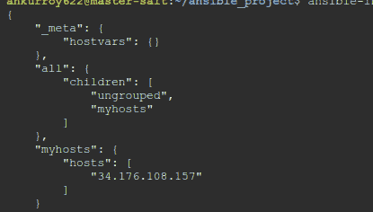

# Python 如何与 IaC 概念集成

你永远不要在没有登顶之前测量山的高度。到达山顶时，你会发现它其实并不高。

—— 达格·哈马舍尔德

因此，在我们接近这一倒数第二章时，我们将讨论**基础设施即代码**（**IaC**）这一话题。它的确是一个热门话题，已经在 IT 界掀起了风暴。这是对如今应用程序和工作负载资源比以往任何时候都要多的现实的回应，剩下要做的就是以最优化的方式排列它们。当然，你可能会发现手动完成一次就能成功。但如果要一遍又一遍地做，而且还保证不会出错？那简直是无稽之谈，是对人力的浪费。

基于这些观察，IaC 的概念应运而生。它提出，如果资源的创建、配置和更新以代码的形式进行标准化，并且常量和变量按有序的方式排列，那么你就可以标准化资源的复制，使得备份、故障转移、重新部署以及许多其他操作变得更加容易。

当然，IaC（基础设施即代码）也有其反对者，因为所有好的技术都会有批评者。他们认为它过于快速、强大，可能会导致云账单飙升，并且部署的资源可能变得难以解开，且不易于自定义。

这是一个有趣的观点，但当我看到 IaC 时，我想到了亚当·斯密在《国富论》中的开篇，他谈到劳动分工如何比任何其他因素更能提高生产力。IaC 概念也做到了这一点，其中劳动（资源）与构建它们的方案分离，使得它们可以一遍又一遍地重复生产。

Python 作为一种语言对于 IaC 非常友好，可能是仅次于 Go 的第二种语言。Python 中有许多本地的 IaC 库和栈（我们将在后面讲解），此外，还有与非 Python 编写的 IaC 工具交互的模块和 API。Python 的灵活性以及 IaC 所需的松散但严格的复制需求，使得 Python 在快速发展的 IaC 趋势中占据了如此重要的位置。

本章将帮助你理解 IaC 中的一个概念，这个概念被认为是 DevOps 的独特之处，是为了解决 DevOps 工作负载中对自动化和标准化的持续需求而创造的。它将帮助你理解为什么 DevOps 和编码需要如此紧密地联系在一起。这就是为什么，在本章中，你将学习以下内容：

+   **SaltStack**的基础知识，以及它是如何用 Python 构建的，还包括如何在代码和命令行级别评估 SaltStack 模块

+   **Ansible**的基础知识，以及如何创建你自己的自动化 Ansible 模块

+   如何使用 Python 与其他 IaC 工具（如 Terraform）进行交互，在已经构建的自动化之上添加更多自动化功能

# 技术要求

为了将本章的内容推进到逻辑上的结论，您需要满足一些技术要求：

+   安装 Python 和 **Salt 库** 以及 Ansible

+   安装 NPM 和 NodeJS 与 `cdktf`

+   安装 Terraform CLI

+   一个 AWS 账户和一个 GCP 账户

+   用于获取本书仓库的 GitHub 账户 ([`github.com/PacktPublishing/Hands-On-Python-for-DevOps`](https://github.com/PacktPublishing/Hands-On-Python-for-DevOps))

+   大量的耐心和理解

# 使用 Python 的 Salt 库进行自动化和定制

我们谈论所有这些我们想要构建的炫酷架构和框架，谈论我们想要使用的各种工具，所有这些工作流程，它们很有趣，非常令人兴奋，但许多 DevOps 的核心还是服务器管理；即 DevOps 的运营部分。它在今天的世界中依然重要，且随着人们的使用，它将永远保持相关。

现代的服务器管理要求根据所托管应用的需求创建现代的、定制化的环境。它还要求具备大量的自动化特性，以便维护并根据当前的情况保持优化状态。

收音机从未被电视取代，电视也很可能不会完全被流媒体取代。一切都会变化、进化或减少，但本质和使用它所需的技能始终会以某种方式保持相关。这就是为什么服务器管理工具永远存在，并且它们会不断发展的原因。

这就是 Salt 库（与 SaltStack 互换使用）的用途。它本质上由一个中央服务器组成，可以用来向所有连接到它的服务器发送命令。要求是 minion（待管理的服务器）必须配置为接收来自主服务器（负责管理的服务器）的命令。这是一个相当简单的概念，通过使用最精良的 Python 代码来实现。

那么，让我们开始吧。我们将从安装 Salt 服务器和 minion 开始，然后，我们将看看如何根据需要自定义构成 Salt 的 Python 代码。

Salt 库的架构如我们所说，包括一个主服务器和多个 minion。所以，让我们从创建与这个配置相匹配的服务器开始：

1.  我们将在 GCP 中创建一个主服务器和一个 minion，并在 AWS 中创建一个 minion，以展示跨云功能。在本练习中，我们使用 Ubuntu 作为主要的**操作系统**（**OS**），但其他操作系统同样适用。我们将在 GCP 中创建一个 minion 和一个 Salt 主实例：


图 12.1 – GCP 中的 Salt 实例

1.  我们还将在 AWS 中添加一个 minion 实例：


图 12.2 – AWS 中的 Salt 实例

1.  现在，我们可以通过 SSH 连接到 `salt-master` 实例并安装 Salt 主库：

    ```
    salt-master --version to run a check on the installation and get the version, similar to the following:
    ```


图 12.3 – Salt master 版本

1.  接下来，在两个 minion 实例中使用以下命令安装 Salt minion 库：

    ```
    salt-minion --version in order to verify installation and get the version, similar to the following:
    ```


图 12.4 – Salt minion 版本

1.  接下来，返回到 Salt master 并运行以下命令：

    ```
    sudo nano /etc/salt/master
    ```

1.  完成后，我们将在底部插入以下行，以处理 master 与 minion 之间的接口：

    ```
    interface: 0.0.0.0
    publish_port: 4505
    ret_port: 4506
    auto_accept: True
    ```

1.  接下来，我们将运行`sudo systemctl start salt-master`来初始化 Salt master 系统模块，然后运行`sudo systemctl status salt-master`命令来获取 Salt master 的状态。当我们运行该命令时，得到的结果如下：


图 12.5 – 运行 Salt master 服务器

这是正在运行的 Salt master；现在，我们需要配置我们的 minions。

配置 minions 的步骤与配置 master 类似，但有一些不同之处，我们将在这里探讨：

1.  在每个 minion 上，运行`sudo nano /etc/salt/minion`，然后在`nano`文件中输入以下内容：

    ```
    master: <salt_master_ip>
    ```

    将`salt_master_ip`替换为你的 Salt master 服务器的 IP 地址。

1.  然后，运行`sudo systemctl start salt-minion`，这将初始化 minion。接着，运行`sudo systemctl status salt-minion`来检查 minion 是否在运行：


图 12.6 – 运行 Salt minion

1.  现在，在 Salt master 上，你可以运行一个小示例命令，如下所示：

    ```
    sudo salt '*' test.ping
    ```

这就是基本的内容。现在，让我们深入看一下 Python 代码的细节。

让我们拆解一个特定的 Salt 模块，以便学习其背后的细节：

1.  每个 Salt 模块都是一个可以调用的 Python 函数。我们以文档中的一个模块为例，在这里是网络连接模块：


图 12.7 – 来自文档的 Salt 模块

这是很棒的文档！它显示了该功能及其 CLI 版本。

1.  让我们来看一下这个功能：

    ```
    connect function takes a hostname compulsorily and it takes a port number optionally. It also includes **kwargs, which is just a large number of arguments such as proto and timeout that the function may have. The following command connects to a DNS instance:

    ```

    connect 函数。代码中的等效内容如下所示：

    ```
    connect("google-public-dns-a.google.com", port = 53, proto = "udp", timeout = 3)
    ```

    这两个命令是等效的，但你可以看到从命令行运行它们的实用性，因为这些命令在命令行中执行比作为函数调用要更为方便。这对于许多命令行工具都适用，也是它们存在的原因之一。

    ```

    ```

接下来，我们将了解 Ansible，它的执行思想与 Salt 类似，但采用了略微不同的方法，同时仍然使用 Python。

# Ansible 是如何工作的，以及其背后的 Python 代码

本节的大部分内容将会是你在上一节看到的相似内容，类似的工具、相似的实现等等。但像 SaltStack 一样，这也是基础设施即代码（IaC）领域中一个重要且常见的工具，这就是为什么它值得我们这么详细介绍的原因。Ansible 功能强大，学习曲线可能没有 SaltStack 那么陡峭，而且它对那些喜欢清晰打包好的代码且不需要太多修改的用户来说更为友好。哦，另外它是用 Python 编写的。

Ansible 由 IBM 在其 Red Hat 品牌下运行和维护（我喜欢现在技术公司为其更为“前卫”的产品命名一些*DC Vertigo*风格的品牌，这真的使我所说的它是艺术的观点更加成立）。它旨在通过 SSH 密钥对访问服务器，从而维护和管理服务器。这简化了一些操作，例如当你控制一台服务器时，所有相关的服务器都在同一个**虚拟私有** **云**（**VPC**）中。

Ansible 在可以控制的操作系统方面更加灵活，但在本练习中，我们将使用旧而可靠的 Ubuntu。所有这些背景介绍结束后，让我们进入 Ansible 的细节，给你一个它如何工作的简单示例。

我们将重用在 Salt 实验中使用的相同实例，所以让我们从主实例开始：

1.  让我们首先通过 `pip` 在系统上安装 Ansible：

    ```
    pip as well, though that is not a frequent occurrence. Let’s run this command and install Ansible:
    ```


图 12.8 - Ansible 安装成功

1.  完成后，创建一个目录作为通用的 Ansible 配置目录，并进入该目录：

    ```
    mkdir ansible_project
    cd ansible_project
    ```

1.  接下来的步骤是创建一个 `inventory.ini` 文件，它将起到与 SaltStack 中主 IP 相反的作用，将被控制的服务器的 IP 地址放入控制服务器中。

1.  运行 `sudo nano inventory.ini`，这将创建一个清单文件，并在其中列出你希望运行的 IP 地址：

    ```
    [myhosts]
    <IP_1>
    <IP_2>
    ```

1.  现在，你可以运行 `ansible-inventory -i inventory.ini --list` 命令，这将给你以下主机列表：



图 12.9 - Ansible 清单

1.  接下来，你可以通过以下命令对这些主机进行 ping 测试，以检查连接状态：

    ```
    ansible myhosts -m ping -i inventory.ini
    ```

1.  现在，你可以通过集中命令服务器运行 playbooks 和 runbooks，甚至可以通过更改清单列表来将主机分组到不同的舰队中。

这些就是 Ansible 的基础；现在，让我们深入了解一下并查看 Ansible CLI 背后的 Python，正如我们在 SaltStack 中所做的那样。我们将通过创建一个自定义模块来使用 Ansible。这次我们会保持本地操作，但这基本上就是你如何通过 Ansible 运行自定义操作的方法。

现在，让我们创建一个由我们自定义的 Ansible 模块：

1.  在你已安装 Ansible 的环境中，创建一个 `hello_ansible.py` 文件，并将以下代码添加到文件中：

    ```
    from ansible.module_utils.basic import AnsibleModule
    def join_strings(string_1, string_2):
        return string_1+string_2
    def main():
        module_args = dict(
            string_1=dict(type='str', required=True),
            string_2=dict(type='str', required=True),
        )
        result = dict(changed=False, message="" )
        module = AnsibleModule(
            argument_spec=module_args,
            supports_check_mode=True
        )
        string_1 = module.params['string_1']
        string_2 = module.params['string_2']
        result["message"] = string_1 + " " + string_2
        module.exit_json(**result)
    if __name__ == '__main__':
        main()
    ```

    这给我们提供了将要执行的 Python 代码，现在我们需要将 Python 代码的权限更改为可执行的。我们可以使用以下命令来实现这一点：

    ```
    chmod +x hello_ansible.py
    ```

1.  接下来，我们需要制作一个剧本来在本地运行该函数，为此，我们可以创建一个名为`hello.yml`的剧本，并向其中添加一些代码：

    ```
    ---
    - hosts: localhost
      gather_facts: false
      tasks:
        - name: Hello World
          add_numbers:
            string_1: Hello
            string_2: Ansible
          register: result
        - debug:
            var: result
    ```

1.  现在，执行 YAML 文件：

    ```
    ansible-playbook -M . hello.yml
    ```

    这将为你提供一个字符串形式的结果，如下所示：


图 12.10 – 我们的 Ansible 模块的结果

这就是如何创建一个自定义的 Ansible 模块。这个模块将返回你输入的两个字符串的和，可能是你使用模块时能够做的最基本的操作。但其他一切都是相同的，即使是更复杂的操作。只需将代码中的`join_strings`替换为你选择的函数，并添加执行该函数所需的变量，最后返回结果值。例如，它可以是一个重新启动服务器或运行特定 CLI 命令的函数；几乎可以是你在使用的操作系统中可以执行的任何命令行操作。

现在，即便如此，这在可用资源及其使用方式方面仍然略显不足。它适用于更传统的系统，但对于需要非常规架构的系统，像 Terraform 这样的工具更为合适。接下来，我们将讨论如何使用 Terraform 与 Python 结合，进一步实现 IaC 自动化。

# 使用 Python 自动化 IaC 的自动化

基础设施即代码（IaC）已经变得越来越受欢迎，且以人们从未想象过的方式发展。当前最流行的 IaC 框架无疑是 Terraform。Terraform 不仅适用于服务器及其他更为稳定的资源，它同样适用于 API 和更松散的基础设施。基本上，任何可以在主要云平台中使用的资源，都有一个 Terraform API 可以使用。Terraform 在许多方面都是终极自动化工具，并且可以通过 Python 进一步实现自动化。

Terraform 当然是用 Go 语言编写的，这非常好，因为 Go 是 Python 的一个非常好的补充。两者各有所长，一个弥补另一个的不足。Go 适合单一实现，而 Python 在扩大该实现的有效性方面非常出色。基本上，Go 是子弹，Python 是枪，这是一个有效的组合。我们将在本节中充分利用这一组合。

Terraform 的创建者 HashiCorp 已经创建了允许 Python 与 Terraform 交互的 API。这些 API 被打包在`cdktf`库中，并由 HashiCorp 在多种语言中发布。让我们看看安装和运行`cdktf`库所需的步骤：

1.  你首先需要安装 NPM、NodeJS 和 Terraform CLI，才能安装`cdktf-cli`：

    ```
    npm install -g cdktf-cli
    ```

1.  接下来，你可以使用`cdktf`创建一个 Python 环境：

    ```
    cdktf init --template=python
    ```

1.  这将创建一个新的 Python 模板，之后可以用来运行 Terraform 模板。在模板中，你可以在`stacks`文件夹中找到`main.py`文件。在该文件夹中，你可以添加以下脚本：

    ```
    from constructs import Construct
    from cdktf import App, TerraformStack
    from imports.aws import AwsProvider, S3Bucket
    class MyStack(TerraformStack):
        def __init__(self, scope: Construct, ns: str):
            super().__init__(scope, ns)
            AwsProvider(self, 'Aws', region='us-east-1')
            S3Bucket(
                self,
                '<Terraform_Function_Name>',
                bucket=<'Bucket_Name_Here>',
                acl='private'
            )
    app = App()
    MyStack(app, "python-cdktf")
    app.synth()
    ```

1.  这段代码足够简单，易于理解；它的工作方式与 IaC 模块完全相同，在你执行程序时创建一个名称为指定名称的 S3 存储桶。要执行程序，运行以下命令：

    ```
    cdktf deploy
    ```

1.  如果你想撤销程序并仅删除你创建的资源，你只需运行以下命令：

    ```
    cdktf destroy
    ```

这基本上就是你需要做的所有事情。Terraform 的 AWS、Google Cloud 和 Azure 模块通常会随着安装一起提供，使用`cdktf`安装时，相应的 Python 库也会包含在内。你可以在 HashiCorp 的 GitHub 和官方网站上找到这些库的文档以及它们的功能。HashiCorp 对其产品能做什么非常明确，尽管有时将所有这些信息整理到一个地方可能会有些困难。所以，通过这些参考资料，你几乎可以创建任何你想要的资源；一切都取决于你的想象力。

# 总结

所以，这就是本章的内容，虽然比你可能习惯的章节要严肃一些，但这确实是严肃的事情。IaC 是一个值得认真对待的概念；它非常强大，可以解决许多需要应用 DevOps 原则的问题。

我们最初查看了使用 Python 在 SaltStack 中应用 IaC 的非常基础的案例。它虽然相当基础，但对于简单项目来说非常有效。我们通过深入了解 SaltStack 的内部原理，理解了它 Python 模块背后的逻辑。

之后，我们查看了稍微灵活一些的 Ansible，发现了它所提供的所有便利功能以及自定义的可能性。

最后，我们看了 Terraform 和`cdktf`，它与 Python Terraform 及资源模块一起使用，用于执行 Terraform 的资源创建。

所有这些内容希望能够帮助你获得一个新的视角，了解 IaC，并理解它在 DevOps 中的重要性以及它与 Python 的集成。

总结来说，IaC 是强大的、广阔的，且值得学习。在下一章中，我们将把你在这里和前几章学到的所有内容提升到一个更高的层次。
