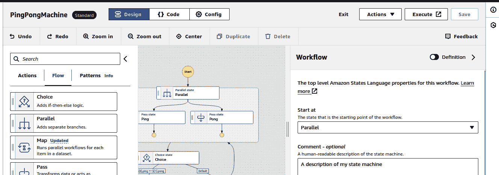

# 13

# 将你的 DevOps 提升到新水平的工具

我所做的就是劝说你们所有人，无论老幼，不要只顾自己的人身安全或财产，而是主要关心灵魂的最大改善。

– 苏格拉底

好的，我们到了，最后一章，我们共同旅程的最后一站。过程非常愉快；希望你学到了些东西——我在教授你并试图帮助你进行你的旅程时也经历了许多快乐。整本书对我来说也是一段旅程。现在我们将以一些工具结束，本章将帮助你进一步推进你自己的 DevOps 和 Python 之旅。

将本章视为一个尾声：快速浏览本书中发生的一切，并回顾所有你所学到的知识，并将其放入实际的背景中。在《指环王》中，当战争结束时，我们看到所有角色都有自己生活继续的结局。这也是我写本章的目标，给你留下些能够激发你好奇心的东西，鼓励你进一步走上 DevOps 的道路，并自己去了解你能够实现什么。

说到个人感受，我可以说，在写这本书的过程中，我也在许多方面发生了变化。我在书中提到的协作概念帮助我与所有使这本书成为可能的优秀人士进行了很好的合作。它帮助我在某种程度上成长，并推动了我的能力的边界，让我明白了作为一名作者的责任。

我们所进行的旅程会改变我们，通常是变得更好。它们迫使我们面对自己是谁，以及我们想做什么。我在写这本书的过程中所进行的旅程让我更加欣赏我之前拥有的知识以及在本书研究过程中获得的知识。它让我成为了一名职业作家，虽然这本书不会像它对我一样成为你生活中的重要部分，但我希望它也能帮助你在自己的旅程中有所推进。

所以，最后一次，在本章中，你将学习以下内容：

+   允许你将更复杂的自动化变为现实的高级自动化工具

+   用于结合监控和数据分析工作负载并运用两项技能的高级监控工具

+   当事件和警报真的失控时的高级事件响应策略

# 技术要求

要跟随本章，你将需要以下内容：

+   在[grafana.com](http://grafana.com)上的 Grafana 账户

+   一个 AWS 账户，能够使用 AWS Step Functions 和 Compute Engine

+   一个 GitHub 账户，用于使用本书代码库中的代码 ([`github.com/PacktPublishing/Hands-On-Python-for-DevOps`](https://github.com/PacktPublishing/Hands-On-Python-for-DevOps))

+   启用了 Google Kubernetes API 的 Google Cloud Platform 项目

+   你在学习过程中达到这一阶段所获得的成就感

# 高级自动化工具

在本书中，我强调了自动化的价值，它对于 DevOps 领域的重要性以及提高整体生产力的作用。只要小心使用并理解你的使用场景，自动化是很难过度的。在本书中，我们已经扩展了我们的工具箱，让我们可以在多个场景中自动化任务。我们甚至弄清楚了如何自动化那些自动化任务。但现在，让我们看看一个可能会将这个过程推进到更高层次的工具。它也恰好是我个人的最爱之一。

**AWS Step Functions** 是我总是非常兴奋地讨论和使用的工具。每当我寻找自动化工作流工具的金标准时，我总是想到它。我看到的任何其他表现良好的自动化工具，都具有与 Step Functions 非常相似的功能和可用性。当然，其他主要云服务也有可以替代的等效服务，并且在那些环境中也能很好地工作，但我更喜欢 Step Functions 的用户体验，并且它是最容易在这个工作流中解释的工具。

让我们来看一下 Step Functions 中的一些步骤（以及步骤中的步骤）：

1.  登录到你的 AWS 账户，在控制台中搜索 `Step Functions`。

1.  进入 **Step Functions** 页面，在右上角点击 **Create** **state machine**。

图 13.1 – 创建状态机

Step Functions 工作流由动作组成，动作是服务的调用，完全基于它们的 API 参数；还有流程，流程决定数据的流向。

我们将演示的示例函数完全由流程组成，因为使用动作仅需要调用 API，你可以在任何需要的地方应用它们。以下是该流程的示意图：

图 13.2 – 状态机图

这是直接从 Step Functions 控制台导出的，你可以在这里看到：

图 13.3 – 状态机控制台

它也已经以代码格式导出，并放置在本书的 GitHub 仓库中以供使用。

我们可以像这样分解图中的内容 *图 13.2*：

1.  并行状态运行两个不同的功能，**Ping** 和 **Pong**。

1.  它们都产生介于用户输入的起始值和结束值之间的随机数。

1.  完成后，会比较这两个数字，看看哪一个大于另一个。

1.  如果 **Ping** 大于 **Pong**，状态机会停止执行；否则，它将执行并行状态。

1.  一旦保存了状态机，你可以访问它并使用 **Start** **execution** 按钮运行它。

图 13.4 – 在状态机上启动执行

1.  你会被问到在此状态机中希望输入什么。在这种情况下，我们将选择起始数字为 `5`，结束数字为 `100`。

图 13.5 – 启动状态机所需的参数

1.  该机器将继续直到 **Ping** 和 **Pong** 给出相等的值，对于像这样的较小数字，约需两秒钟。

1.  Step Functions 记录了它通过的所有状态以及结果：

图 13.6 – 状态机中发生的事件

这个特定的应用看起来相当普通，但它是一个很好的概念验证，展示了如何使用 Step Functions 来创建工作流。一个实际应用的例子可以是我们以前用过的简单例子：删除 S3 存储桶中的所有对象。AWS 的用户界面中没有清晰的方式一次性删除所有对象；你需要一个一个地删除。但通过 Step Functions（它与每个 AWS 服务都集成），你可以选择并行列出并删除 S3 存储桶中的所有对象。如果你愿意的话。现在，我们将转向监控这些应用，了解如何进一步优化它们。

# 高级监控工具

监控的目的一直是确保你所说的工作项仍然在正常运行。而实际情况往往是，它们不会正常工作。这可能是你的错，也可能不是；故障的概念会妨碍解决问题。对工作负载进行适当的监控为更容易地解决问题提供了途径。

最简单的工作负载可以进行监控，并且对于接收到的信息的反应可以实现自动化，这样大部分时间你甚至无需参与处理问题。对于更复杂的工作负载，保持监控仍然很重要，以便能够快速响应任何情况，并且实时获得更多关于情况的信息。

通常情况下，随着你的解决方案变得越来越复杂，它开始使用更多的工具。更多的工具和服务意味着需要更多的监控，而且监控的复杂度也会增加。如果你的监控来自多个地方，它会变得相当麻烦。因此，一个好的解决方案是将监控集中在一个可以存储和管理所有数据的中心位置。

这时，**Grafana** 就派上用场了，它是我想要谈论的工具，因为它不仅提供了极为广泛的监控选项，还提供了令人惊叹的部署选项，允许你对 Grafana 实例进行管理或定制，这意味着它是针对两类人群的解决方案：那些偏好自制解决方案的人和那些偏好现成解决方案的人。

当我第一次开始研究 Grafana 时，我正在写一篇关于如何通过一个云的监控服务来监控多个计算实例的博客。我发现，虽然这相对简单，但仍然存在一些尴尬的问题。大多数时候，选择一个云平台往往会在其他服务上带来一些复杂问题。很多这些问题都被 Grafana 解决了，并且得益于它所投入的所有精力与工作。

那么，让我们深入了解使用 Grafana 的免费账户等级：

1.  首先，创建一个 Grafana 账户。它是完全免费的，并且提供了很多单点登录（SSO）选项，这是我非常喜欢的。

图 13.7 – Grafana 注册

1.  然后，它会要求你输入个人监控子域名的 URL 以及部署实例的区域。设置好这些后，你就可以开始了。

1.  或者，你也可以从这里下载并安装 Grafana 到自定义服务器：[`grafana.com/grafana/download?edition=oss`](https://grafana.com/grafana/download?edition=oss)。它几乎提供了所有操作系统的安装说明。

1.  让我们来看看我们的仪表盘：

图 13.8 – Grafana 仪表盘

如你所见，Grafana 为我们提供了许多监控选项、集成和数据源。在这个练习中，我们将使用一个非常普遍的数据源，几乎任何人都能访问：Google 表格。

1.  在控制台的搜索标签页中，搜索`Google Sheets`。接着，你需要安装插件。它位于最右侧的蓝色按钮：

图 13.9 – Google 表格连接器

1.  然后，等待插件安装完成，并从同一页面添加新的数据源。

图 13.10 – 激活 Google 表格连接器

1.  然后，Grafana 会要求你为要访问的 Google 表格实例创建身份验证凭据，并会提供适当的操作说明。

图 13.11 – Grafana 在其仪表盘上提供的说明

在这种情况下，从安全角度来看，JWT 令牌选项可能是最好的。你不希望随便放置 API 密钥，因此请按以下步骤操作：

1.  按照给出的步骤创建一个服务账户，并将该服务账户的电子邮件地址授权访问你的示例 Google 表格。

1.  一旦你上传了 JWT 密钥，你就可以访问该服务账户可以访问的所有内容。我使用了一个包含一些示例网页流量数据的 Google 表格，但你可以使用任何你想要的表格进行此操作。

该仪表盘的缓存时间已设置为零秒，这意味着它会在 Google 表格中的信息发生变化时自动刷新。

图 13.12 – 可添加到仪表盘的样本探索

然后你可以将此探索添加到新的监控仪表盘中。如*图 13.12*所示，你可以选择**添加**按钮，然后选择**添加到** **仪表盘**选项。

图 13.13 – 创建带有面板的新仪表盘

1.  这将创建一个包含你的数据表的新仪表盘。现在我们可以在其上添加一些数据可视化。在新的仪表盘中，点击**添加**，然后选择**可视化**。你会看到一个类似于 Google Sheets 表格的面板，在这里你可以添加像这样的图表：

图 13.14 – 通过可视化生成的条形图

你可以看到我们有一个高度可自定义的图表，包含所有以可视化形式呈现的信息。

一旦你完成了可视化，返回到你新创建的仪表盘。你的最终可视化将像这样：

图 13.15 – 最终的 Grafana 仪表盘

同样，这会随着数据的变化而改变。

到目前为止，我们已经看到了处理事件和自动化的事件。那么，当发生一个无法通过重置来解决的事件时会发生什么呢？当你处于不利的局面，被迫进行损害控制时又会怎样呢？好吧，我们将在下一部分找到答案。

# 高级事件响应策略

事件响应应该简单且有条理，应该解决最初导致事件发生的问题。但是，再次强调，不管我们如何努力，它永远不会那么简单。有时候你正在处理一个你不太熟悉的系统。有时候你所在的团队经验不足，无法提供有意义的帮助。这些情况由于时间和人员的限制是不可避免的，并且在很大程度上超出了我们的控制范围。在这种情况下，我们只能利用现有的资源应对。

但有一种情况非常常见，会造成广泛的损害，以至于对事件的响应不再是关于恢复损害，而是关于从已经造成的损害中恢复。这种情况通常发生在任何形式的事件长时间没有被报告或监控时。当发生数据泄露，或者系统中存在未知/未发现的错误时，这种情况尤其常见。

那么，当你遇到这种情况时，你该怎么办？首先，不要慌张。但也不要想“不要慌张”——那会让你更慌！以逻辑的方式面对问题。我现在会给你一些关于如何处理这种情况的见解。这是基于我过去面对的情况，以及我从各个地方学到的解决问题的经验。我认为这是一种很好的解决很多问题的方法，无论是 IT 问题还是其他问题。那么，接下来我们就开始吧。

*步骤* *0：阅读*

*因为：你没有* *做过够多。*

说真的，很多错误仅仅通过阅读错误信息或者故障的输出就能解决。相信你所看到的，它会给你回报；问题的解决方案就在你眼前。好吧，至少是解决方案的第一步。但如果你想走到那里，你需要阅读并理解解决这个问题的过程。你不能在没有了解所有细节的情况下就跳到第一步。

*步骤 1：如果是一个单一的问题，* *谷歌它*

*因为：你不是* *一个人。*

这是非常严肃的建议。90%你遇到的错误都可以通过谷歌搜索解决。这是因为别人可能也遇到过你面临的问题，他们可能也已经得到了正确的解决方案。你很有可能在*Stack Overflow*论坛、GitHub 仓库的评论、一个不太知名的 YouTube 视频或者类似的地方找到解决方案。你可能会想：“这不可能这么简单——我怎么可能仅仅通过谷歌就能解决我最大的难题。”马上停下这种想法！我曾经看到有人花了整整两个小时尝试一个迁移桥，我们在看完一个 YouTube 教程后五分钟就搞定了。事情就是这样——别浪费时间，寻找快速、知情的解决方案。它们能处理那些小问题，信我，大多数问题都是小问题。

*步骤 2：如果是多个问题，就多次谷歌（或者，现在可以* *用 ChatGPT）*

*因为：一个大问题是几个小问题* *合成的一个。*

这是真的：任何问题都可以分解成最小的组成部分，并在那个层面上解决。这是基本的逻辑；如果你有一个大问题，把它转化成更小的问题，然后去谷歌一下。如果它是一个真的大问题，或者将问题分解的过程琐碎且会占用你大量时间，你现在可以使用 ChatGPT 来解决；它在这方面相当不错。将大量无用的文字转化成更小、更有用的版本，可能是 ChatGPT 最擅长的事情。好好利用它，充分利用这些你手头的强大工具。

*步骤 3：遵循归纳和演绎的方法* *。*

*因为：它能解决你所遇到的任何日常问题* *。*

解决方案和解决问题与产生想法截然不同。想法像是来自上帝的闪电，它们是我们系统中的幽灵，从最奇怪的地方冒出来。抓住一个想法并将其付诸实践是一种虚无的体验，就像是一次宗教启示。解决方案不是这样的。它们简单、基础，且—如果你懂得如何解决问题—更容易处理。其逻辑可以用两个词来概括：归纳和演绎。

我解决过的每一个重大问题，只要我能接触到样本环境，我都会用这种逻辑来解决。这是我在《禅与摩托车维修艺术》一书中学到的理念，书中的叙述者通过这两种方法解决最平凡的问题，并将这些概念与量子物理和禅宗相联系。这些概念并不复杂，但所有问题的解决都可以在它们的框架内定义。

归纳是重现导致问题的元素，以准确了解问题发生的位置。在事件管理中，这对于在样本应用程序中重现事件并通过分解步骤找出问题所在非常有用。

演绎是从结果出发，回溯到开始。这种方法适用于错误的逻辑无法重现，或者事件已经发生，但不知道如何发生。在这种情况下，你从最终结果开始，推理出可能导致这些结果的原因。

因此，将这些结果总结成图表，你可以这样来看待它们：

图 13.16 – 解决任何 IT 问题的步骤

这就是你解决所有问题的方法。试着在几个问题上应用看看，看看你能走多远。如果你想了解创意的形成过程，嗯，它们是相当随机的，但它们可以通过类似这些方法的手段被明确并转化为行动点。现在，你已经学会了一切。明智地使用你的知识吧。

# 总结

好的，这不仅仅是本章的结束，也是整本书的结束。作为这本书的读者，你的旅程结束了，而我作为首次作者的旅程也结束了。这是一次不小的历程。总体来说，谈到这一章，它比许多其他章节更加抽象，代码内容也相对较少，但那是因为我已经意识到一件事：所有这些系统归根结底都是代码。你接触到的每一件事，都一定是以某种方式被编码过的；关键在于你是否能够理解并操控背后的逻辑。

在关于步骤函数的部分，你学习了一个非常有用的自动化工具，但你也学到，这是一种以视觉化方式使用编码逻辑，并将这种方式整合进许多强大工具和服务的手段。

在高级监控部分，我们学习了一个强大的监控和可视化工具——Grafana，以及集中监控的重要性，通过集中管理，避免了从多个位置查看数据并解析数据的繁琐过程，而是有一个统一的位置来管理所有工作负载。

最后，你了解了我解决问题的方法，确实是一种有效的方式，如果我自己说的话。希望你能有机会在自己的工作负载中应用这个方法。这是一种元代码，一种不依赖于任何平台或技术，但能够在所有平台上有效工作的算法。

所以，我必须向你告别了。我们已经走到了尽头，但请将其视为开始的结束，因为接下来发生的才是最重要的部分。这将定义你是谁以及你将做什么。现在是时候将所有这些知识应用到你自己日常事务中了。*记住：力量掌握在你手中；是时候* *使用它*。
