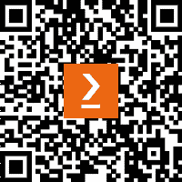

# 前言

“*精益敏捷之道：通过价值流管理释放企业潜力*”一书源于首席作者塞西尔·‘加里’·鲁普与尊敬的同事理查德·克纳斯特、史蒂夫·佩雷拉和艾尔·沙洛韦的合作努力。他们的目标是为 IT 专家、商业专业人士以及各行业和组织的领域专家提供一本关于现代精益敏捷和价值流管理实践的全面指南。

他们的旅程始于 Packt 出版社邀请加里编写一本关于现代精益敏捷实践的新书。加里之所以对这一主题感兴趣，源于他对这一领域的长期关注，而这种兴趣又受到他过去作为从业者和顾问的经验的推动。此外，最近的培训项目，包括为一家跨国客户为 600 名 IT 专家提供的在线课程，也加深了他探索这一领域的热情。之后，加里邀请了他的三位同事加入他。

作者团队的合作努力确保了本书内容的丰富性和多样性，丰富了讨论的层次，拓宽了书籍的范围和相关性。值得注意的是，作者们并非传统意义上的学者，而是那些与客户在实际场景中紧密合作的专业人士，他们直面挑战，促进高效的工作流程。

本书的主要目标是介绍精益与敏捷原则和实践的整合，认识到精益源于制造业的演变，敏捷源于软件行业的演变。精益原则侧重于消除浪费和简化流程，以更高效、更高质量地交付价值。同时，敏捷方法优先考虑迭代开发和持续反馈，以增强对客户需求的响应能力。

精益与敏捷概念的整合，通常称为‘*精益敏捷*’，充分发挥了两种方法的优势。它确保了高质量、高效率的交付，并具备适应不断变化的市场动态的能力，从而推动持续的竞争优势。

其核心理念是，组织必须在整个企业范围内全面拥抱精益敏捷的原则和实践。这涉及到优化生产力、吞吐量和效率，同时保持足够的灵活性，以适应不断变化的业务需求、市场动态和客户需求。

这种方法的核心是价值流管理（VSM）的概念，作者主张通过 VSM 推动组织价值流的持续改进。价值流组织了组织内的端到端业务流程，作为一个更有效的框架来向客户交付价值。VSM 概念帮助组织打破跨职能和部门的障碍，这些障碍往往会阻碍高效交付。通过聚焦于面向产品的活动和流程，价值流强调通过开发和交付以客户为中心的产品和服务来交付价值的重要性。

与他们认为方法必须先于工具的信念一致，作者提出了一种九步 VSM 方法论，旨在帮助组织高效识别和优先考虑价值流改进。在该方法论的核心是价值流映射，这是一种关键技术，用于可视化和分析业务流程，找出提升效率和减少浪费的机会。

在本书中，作者介绍了先进的概念，专注于评估价值流改进，覆盖从早期开发到成熟阶段的广泛领域，特点是标准化活动、高吞吐量、质量和高效流动。此外，他们还提出了基本精益敏捷解决方案团队（BLAST）框架，旨在通过精益流和敏捷迭代增量开发实践，协作整合多个团队的工作。本书还介绍了企业业务敏捷系统（BASE）概念，旨在通过跨企业整合工作，持续并按节奏地产生以客户为中心的新产品价值增量。

在数字技术主导的时代，有效的信息使用已经彻底改变了组织的竞争力。作者介绍了商业角色信息行动（BRIA）过程，作为寻找做出明智和及时决策所需信息的一种方式。超越理论，BRIA 提供了利用数字化进步改进业务流程、系统、产品和服务的实际策略。

本书分为四个部分，系统地从基础概念到组织转型的高级策略逐步展开。每个部分都提供了可操作的见解和指导，帮助实现无缝采纳和持续实践。然而，那些时间有限并需要直接了解要点的读者，应首先阅读*第四部分*（*第 10、11 和 12 章*），因为这些总结性章节讨论了数据和信息管理、精益敏捷与 VSM 的实施以及跨领域主题。

在您开始这段学习旅程时，请记住合作和集体智慧在推动有意义的变革中的重要性。作者的目标不仅是传播信息，更是赋能个人和组织，让他们能够自信且胜任地接受 Lean-Agile 原则。

虽然作者故意保持中立，面对众多推动 Lean-Agile 和价值流管理概念的方法论和框架，但他们的重点是倡导推动企业变革的基础性原则和实践，这些实践对于持续、以客户为中心和基于价值的改进至关重要。

最重要的是，本书中介绍的方法、工具和框架旨在简化并支持 Lean-Agile 的采纳，即使是在已经投资于其他 Lean-Agile 框架的组织中也能适用。作者通过去除杂乱无章的内容，提炼出易于实践实施和持续成功的概念。

您被邀请与作者一起踏上这段发现之旅——迈向 Lean-Agile 精通与价值流管理的征程，在这个过程中，追求卓越和创新无边无际。欢迎来到 *《Lean-Agile 方法：通过价值流管理释放企业潜力》*。

# 本书适合谁阅读

本书适合那些努力优化价值交付并最小化成本的商业和技术专业人士。无论您是 VSM 管理者、产品交付团队成员、DevOps 工程师还是 IT 专家，本书提供了经过验证的方法，帮助您有效地识别并实施改进机会。产品负责人希望优先处理待办事项，企业高管也能从中获得如何展示信息技术投资回报的帮助。

# 联系我们

我们始终欢迎读者的反馈。

**一般反馈**：如果您对本书的任何方面有疑问，请通过电子邮件联系 customercare@packtpub.com，并在邮件主题中注明书名。

**勘误**：尽管我们已尽一切努力确保内容的准确性，但错误仍然会发生。如果您在本书中发现错误，我们将非常感激您能向我们报告。请访问 [www.packtpub.com/support/errata](http://www.packtpub.com/support/errata) 并填写表格。

**盗版**：如果您在互联网上发现我们的作品的任何非法复制品，我们将非常感激您能提供相关位置地址或网站名称。请通过 copyright@packtpub.com 与我们联系并提供相关链接。

**如果您有兴趣成为作者**：如果您在某个领域有专长并且有意撰写或贡献书籍，请访问 [authors.packtpub.com](http://authors.packtpub.com)。

# 分享您的想法

阅读完*精益-敏捷之道*后，我们希望听到您的想法！请[点击这里直接前往 Amazon 评论页面](https://packt.link/r/1835461875)并分享您的反馈。

您的评论对我们和技术社区非常重要，能帮助我们确保提供优质的内容。

# 下载本书的免费 PDF 副本

感谢购买本书！

您喜欢在旅途中阅读，但无法随身携带纸质书籍吗？

您的电子书购买是否与您选择的设备不兼容？

不用担心，现在每本 Packt 书籍都附带免费的无 DRM PDF 版本。

在任何地方、任何时间、任何设备上阅读。搜索、复制并将您最喜爱的技术书籍中的代码直接粘贴到您的应用程序中。

好处不止于此，您还可以独家获得折扣、新闻通讯以及每日发送到您邮箱的精彩免费内容。

按照这些简单步骤，您将能够享受所有好处：

1.  扫描二维码或访问以下链接

[`packt.link/free-ebook/978-1-83546-187-7`](https://packt.link/free-ebook/978-1-83546-187-7)

1.  提交您的购买证明

1.  就是这样！我们将把您的免费 PDF 和其他福利直接发送到您的电子邮件。

# 第一部分：构建精益-敏捷基础：掌握基础知识

在本书的*第一部分*中，我们深入探讨了在**数字时代**竞争的挑战。今天的商业和技术专业人士必须在日益复杂的环境中航行，同时不断为客户和业务交付价值，以保持其相关性。

为应对快速变化的市场动态和内部组织挑战，专业人士必须积极参与持续学习、流程优化和团队合作，以实现卓越的成果。这一旅程不仅仅是关于生存，更是关于领先、推动创新，并在竞争激烈的舞台上设定新标杆。

在本节中，我们解释了为什么掌握精益和敏捷原则及实践背后的概念对提高组织高效交付以客户为中心的价值、通过数字化解决方案提升业务流程和产品是必要的。

接下来，我们将深入探讨精益和敏捷实践的基础知识。在*第二章*中，您将了解基于敏捷的实践如何通过迭代和增量开发方法来解决复杂的业务问题，支持战略和战术规划，并通过流程、业务系统、文档、产品和服务持续交付新价值。

在*第三章*中，您将了解精益实践如何帮助优化生产力、效率和质量，并加速您交付以客户为中心的价值的能力。拥抱这些精益-敏捷原则可以帮助您在数字化革命的前沿。

通过吸收以下章节的洞察，你将提升你的专业技能和能力，使自己成为变革前沿的真正领导者：

+   *第一章**，驾驭精益敏捷转型*

+   *第二章**，运用敏捷解决复杂的业务问题*

+   *第三章**，建立精益流程以提高生产力*
