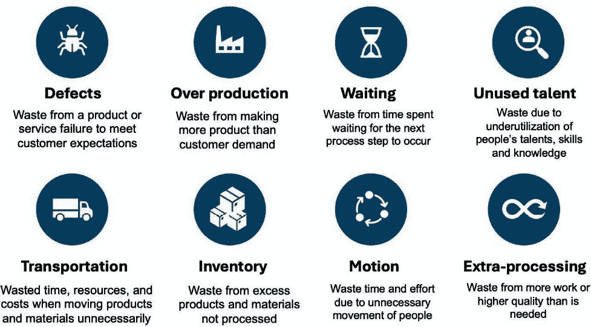
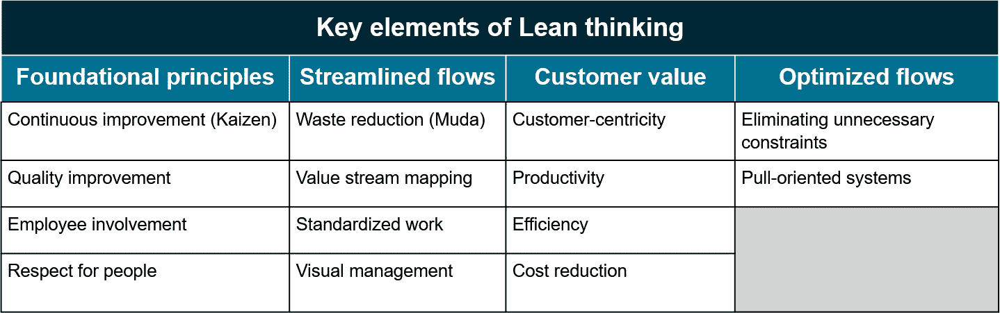
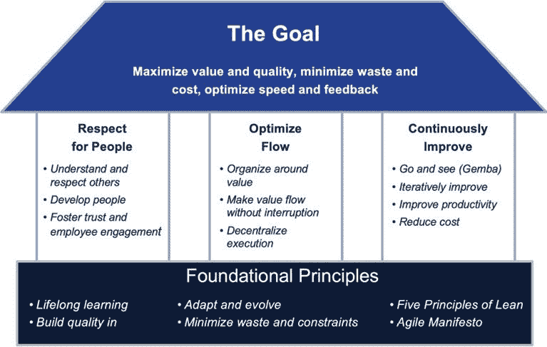
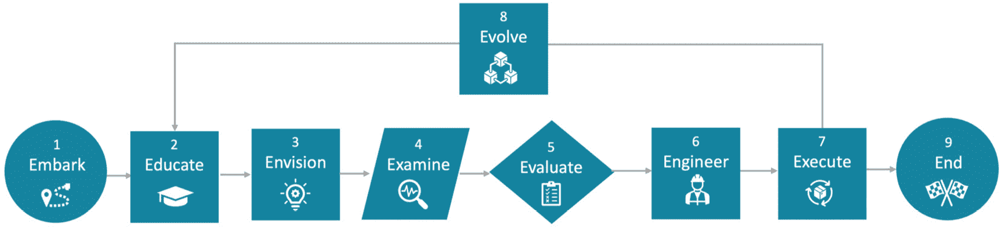

# 引导精益-敏捷转型

“掌握原则的人可以成功选择自己的方法，而忽视原则只试图方法的人，注定会遇到困难。”

- 哈林顿·埃默森

想象一个世界，在这个世界里，企业投入数百万资金进行业务转型和数字解决方案，但仍然难以满足客户需求并提升产品。这一令人遗憾的现实今天依然屡见不鲜。欢迎来到本书，我们将在这里揭示如何掌握精益和敏捷实践的秘密，以提高高效交付以客户为中心的价值的能力，同时通过数字化解决方案增强商业流程和产品。

**精益**原则提高生产力和效率，而**敏捷**方法论帮助管理变革、解决问题、进行规划并推动产品开发。本章将探讨为什么精益和敏捷是交付高价值产品和服务的关键互补方法。我们还将强调**价值流管理**（**VSM**）在从客户视角交付价值中的核心作用。

精益和敏捷不仅限于软件开发。组织可以将精益-敏捷的概念应用于优化业务流程、产品开发生命周期和各种类型价值流的流动。同样，数字化增强可以改进业务流程、产品特性、功能和价值流动。通过掌握这些概念，你将能够引导变革实践，并见证它们在实际场景中的影响。

本章将涵盖以下主题：

+   绘制数字前沿

+   探索精益原则

+   拥抱敏捷方法论

+   将精益与敏捷结合

+   解锁 VSM 的价值

+   利用信息技术进行精益-敏捷转型

# 绘制数字前沿

本书的*第一部分*介绍了当今商业环境，强调了所有公司、政府机构和非营利组织必须关注的议题。我们的全球经济正在经历由数字技术和数字化产品推动的快速且具有颠覆性的变革。本部分简要介绍了数字化背景下的精益、敏捷和 VSM 实践背后的概念。

## 理解数字经济的格局

数字经济的概念不仅仅是一个趋势，它是一个全新的商业范式。*数字* *经济*这一术语在 1990 年代开始使用，并成为唐·塔普斯科特 1995 年出版的《数字经济：*承诺*与*风险*在*网络智能*时代的碰撞》一书的主题。随着数字计算技术和互联网的发展，它们已显著改变了企业的运作方式，尤其是在电子商务和电子商业领域。如今，数字经济与传统经济之间的界限日益模糊，这使得区分两者变得愈加困难。

数字经济建立在无数日常的在线交换之上。这些交换涉及到各种各样的参与者——从具有不同角色和职责的个人，到各种实体，如公司、政府机构、学校和慈善组织。它们的互动遍及众多数字平台，从大型服务器到个人设备，如笔记本电脑、智能手机和可穿戴设备。

颠覆性技术具有广泛的影响。**Airbnb**、**Amazon** 和 **Uber** 等公司不仅挑战了传统规范，它们重新定义了人们的责任、必需的技能、知识和就业机会。应对这一巨大变化不仅仅需要理解技术——它要求具备数字优先的思维方式。那些利用这些连接的人，将能够在商业和客户之间的数据驱动关系成为常态时，保持竞争力。

## 在数字经济中拥抱精益-敏捷和 VSM

精益-敏捷原则为保持灵活性和适应不断变化的环境提供了坚实的框架，同时确保保持高效和生产力。这些原则支撑着企业快速适应、优化运营并在快速变化的数字世界中持续提供价值的能力。

VSM 补充了精益和敏捷，提供了一种整体视角，用于识别、评估和提升从端到端的价值流。

将精益、敏捷和价值流映射（VSM）实践相结合是应对和在数字经济中脱颖而出的“秘诀”。这些方法不仅是生存工具，它们是构建可持续、具有竞争力且不断发展的企业的支撑框架。

让我们从介绍精益思维开始我们的探索。

# 探索精益思维的特点

精益的目标是通过最小化浪费和非增值成本，同时优化交付速度和产出，最大化客户价值、质量和效率。消除浪费是精益原则的标志，如*图 1.1*所示：

图 1.1 – 精益的经典八大浪费

精益的核心理念很简单：组织应避免投资于那些产生多余工作、特性或能力的项目，而这些工作、特性或能力既不被客户需要，也不具备价值。如果不这样做，外部或内部客户可能会寻求其他的产品或服务。关键在于如何确定客户需要什么，以及他们期望的质量水平，同时去除任何与他们目标不符的元素。精益实践者将这些多余部分称为**浪费**。

精益企业的核心目标是通过最小化浪费，持续地以最低的成本最大化客户价值。其目标并不是通过减少员工数量来实现这些目标，而是优化员工的利用率。重点是避免和消除现有的浪费性活动和流程，简化工作流程，确保资源被有效分配，以提高生产力并为客户提供卓越的价值。

*图 1.2* 展示了四个聚焦领域和精益思维的 14 个要素，正如在*图 1.2* 中所示。

图 1.2 – 精益思维的关键要素

## 基本原则

基本原则聚焦领域侧重于通过持续改进（**Kaizen**）和质量改进等实践，培养一种持续提升的文化，同时促进员工积极参与并尊重员工。

## 流程简化

流程精简聚焦领域强调通过减少浪费（**Muda**）来优化流程，并运用如 VSM（价值流图）和价值流映射等工具来识别和消除低效。此外，精益倡导工作程序的标准化，并利用可视化管理技术来提升运营的清晰度和效率。

## 客户价值

客户价值聚焦领域围绕将组织努力与客户需求对齐，以提高客户的整体满意度和忠诚度。其过程涉及优化生产力、效率和成本降低策略，以提供最大化客户价值的产品和服务。

## 优化流程

优化流程聚焦领域倡导实施拉动式生产控制系统，根据上游需求信号启动新的工作，从而最小化浪费，增强对客户需求的响应能力。

在确立了精益思维的关键要素之后，我们将进一步探讨为什么它们如此关键。

## 优先采用精益方法论 – 重新定义卓越运营

在一些缺乏纪律的组织中，我们常常会陷入一个陷阱，认为一切都是优先事项，这导致了冲突、不断的应急处理和员工倦怠。然而，精益组织通过不断评估对客户增加价值有最大影响的变化，突破了所有这些杂乱无章的问题。通过消除约束和浪费，充分利用现有资源，精益组织保持聚焦于真正重要的事项，这有助于维持竞争优势，避免了将一切视为优先事项所带来的所有问题。

在精益组织中，操作卓越不仅是目标，而且是贯穿整个组织每个方面的指导原则。与传统管理结构不同，在这些组织中，可能容忍或忽视的低效率被优先考虑连续改进、减少浪费和客户价值创造作为他们运作的核心原则。通过系统地采纳精益实践和原则，这些组织实现了流程的精简、员工的赋权和无止境创新的文化。从敏捷团队或车间到董事会，精益组织通过对效率、质量和客户满意度的坚定承诺使自己与众不同。

这是一本关于整合精益和敏捷实践的书籍。现在我们已经对精益企业的基本目标和要素有了高层次的理解，让我们探索敏捷原则和实践，看看它们与精益的对比。

# 拥抱敏捷方法论

虽然精益原则侧重于提升效率和生产力，敏捷实践则是开发新解决方案和应对业务挑战的有效方法。敏捷优先考虑增强业务敏捷性，使组织能够接纳变化以保持价值和竞争力。

敏捷方法引入了促进积极变革、培养创造力和促进创新的方法和工具，使您能够解决复杂问题。与精益的持续流哲学不同，敏捷主张采用*迭代增量*的时间盒方法，赋予团队在快速开发周期中创造新价值的能力，使工作与客户不断变化的需求和动态的业务环境保持一致。

本书提供了关于如何利用敏捷的迭代开发和增量交付思维加速问题解决和创新的可行见解，通过磨练必要技能来促进您的职业生涯。让我们从掌握敏捷核心概念开始，为您的职业之旅赋予力量。

## 理解敏捷的起源

要理解敏捷方法论，了解它们的起源至关重要。虽然精益原则起源于汽车制造业，尤其是丰田，但敏捷则起源于软件行业。这种鲜明对比揭示了它们实现效率和交付价值的独特方法。

精益原则可以追溯到二战后的日本，当时丰田面对有限资源和全球冲突的余波。为了在这些限制条件下蓬勃发展，丰田开发了精益实践，专注于优化流程和节约资源，以最小的浪费交付最大的价值，为高效的生产系统奠定了基础。

相比之下，敏捷方法论起源于动态的 software development 领域。工程师和开发人员面临一个根本性问题——传统的线性顺序和计划驱动的项目管理方法无法应对软件项目的不可预测性。敏捷引入了一种迭代开发范式，通过快速交付，鼓励产品的小规模增量，以应对不断变化的需求，并确保客户满意和产品卓越。

## 扩展敏捷——超越软件开发

尽管敏捷的起源可能源于软件开发，但其原则已被证明在各行各业和商业领域中具有高度的适应性和益处。敏捷的迭代和增量开发方法已被广泛应用于医疗保健、制造业、市场营销、教育等领域，为团队提供了卓越的机会。

因此，寻求可持续竞争优势的组织应认识到，敏捷思维不仅仅局限于软件开发，它增强了团队合作，推动了各个业务领域的持续改进。敏捷从一个专门的软件开发方法，发展为一种多用途的解决问题和创新方法，突显了其持久的相关性和影响力。它为团队提供了一套宝贵的技能，使他们能够保持竞争力并推动成功。

在这个基础上，让我们进一步探讨敏捷工作流如何与精益的拉动导向概念有所不同。

## 迭代交付增量价值

敏捷方法论优先考虑迭代式的价值创造，避免了预测需求的前期工作，这些需求往往很快变得无关紧要，成为一种昂贵的浪费形式。相反，敏捷倡导持续开发小而有价值的产品增量，积极与客户和利益相关者合作，促进灵活性、适应性和响应性。这种方法与精益的拉动导向方法形成对比，精益侧重于通过持续流动来优化流程和减少浪费。敏捷采用时间盒式的迭代，通常持续 1 到 4 周，在这个过程中，工作会根据优先级和准备情况从产品待办列表中拉取，从而实现有针对性的开发工作。与精益的持续流动不同，敏捷通过根据个人的能力和技能分配工作，确保了一个既协作又有结构的环境。一些敏捷团队整合了像看板这样的精益元素，以进一步优化工作流，突显了两种方法论的灵活性。

理解这些基础概念以及敏捷的历史背景，能够帮助你更有效地探索其实践和应用。接下来，我们将讨论如何在多个小团队之间组织工作的重要性。

## 利用小型协作团队的力量

精益敏捷方法强烈倡导使用小团队，通常由三到七名成员组成，最多不超过 9 人。这种对小团队的重视跨越了各个业务领域，包括价值流的组织，原因有多方面。

首先，小团队更明确地专注于他们的目标，拥有更强的使命感，使得他们能够有效地将工作与共同目标对齐。小团队以其敏捷性而著称，能够迅速做出决策并高效运作，从而适应市场变化或不断变化的客户需求。

此外，小团队促进了成员之间更好的沟通，从而形成了开放、透明且高效的沟通渠道。小团队通常拥有更为积极的员工，他们主动采取行动并推动创新。在小团队内，合作和相互支持得到促进，成员之间容易建立信任，并在需要时相互帮助。

此外，小团队可以在特定领域进行专门化，同时确保它们具备所有必要的内部技能，保持自给自足。这增强了责任感，因为每个人的贡献都是可见的，避免了偏袒或官僚主义的障碍。如果你需要更多人手，可以增加更多小团队，并教会他们如何同步和整合各自的工作。我们将在*第八章*中更详细地讨论这一主题，*实施基本的精益敏捷解决方案* *团队（BLAST）*。

我们已经完成了精益和敏捷概念作为独立的生产力提升和组织灵活性策略的简要介绍。在接下来的部分中，我们将开始将它们结合起来，作为互补的实践。

# 将精益与敏捷结合

当你在本书中探索精益与敏捷的复杂性时，你会渐渐体会到，每种方法论都为提升生产力和组织灵活性提供了一套独特的原则、实践和优势。在各行各业中，精益的强项在于其减少浪费和优化流程的能力。相反，敏捷采用迭代开发和增量交付流程，强调适应性、灵活性和以客户为中心。

但这就是有趣的地方。当你将这两种方法结合时，真正的魔力便展现出来，正如下一节所描述的那样。

#### 生活在精益敏捷的体系中

到目前为止，我们已经单独探讨了精益和敏捷的原则与实践。现在，是时候将它们结合起来了。为了做到这一点，我们需要掌握定义精益敏捷企业的特征。

为了启动我们的介绍，我们将探讨我们**精益敏捷之家**，如*图 1.3*所示。该图展示了传统**精益之家**的演变版本。

图 1.3 – 精益敏捷之家

这一当代适应不仅扩展了精益的基础原则，还提供了一个可视化的精益敏捷管理模型，用于展示组织中的精益敏捷方法。

起源于丰田并且对其成为全球汽车领导者至关重要，*精益之屋*最初象征着对优化运营流程、提高效率和效果的坚定承诺。我们的更新模型，*精益敏捷之屋*，保留了这一承诺，同时融入了敏捷方法，强调通过迭代变化逐步为客户创造新的价值。

让我们来考虑一下精益敏捷之屋的每一个方面。

## 建立坚实的基础

我们精益敏捷框架的基础代表了实现商业成功的关键推动因素，包括以下内容：

+   **终身学习**：在精益敏捷框架中，终身学习对保持竞争力至关重要，它优先考虑个人和组织的持续发展。通过投入资源进行学习，团队可以适应市场需求，获得新技能，并推动创新。

+   **内建质量**：质量是精益敏捷框架中的核心，始终专注于提供卓越的产品和服务。将质量嵌入到每个开发环节中，可以最小化错误或缺陷，提高满意度，并建立可靠的声誉。

+   **适应与进化**：在快速变化的环境中，适应和进化对生存至关重要。精益敏捷框架鼓励通过监控趋势、响应反馈和创新，使组织保持领先并保持韧性。

+   **最小化浪费与约束**：精益敏捷团队识别并消除浪费，以提高效率和生产力。通过简化流程、减少复杂性和优化资源，团队可以更快地为客户创造价值，提高质量，降低成本。

+   **精益五大原则**：提供一个优化框架，精益原则指导过程改进和消除浪费。五大原则被视为提高工作效率的秘诀，包括：

    1.  定义价值

    1.  绘制价值流

    1.  创造流动

    1.  建立拉动系统

    1.  追求完美

+   **敏捷** **宣言**：标志着软件开发领域的巨大变革，敏捷宣言提倡灵活性、协作和以客户为中心。在精益敏捷的框架下，它作为迭代开发、适应性规划和问题解决的指导哲学，超越了软件领域，适用于任何需要敏捷性和创新的领域。

接下来，我们将看一下支撑我们精益敏捷框架的三个支柱。

## 支撑我们精益敏捷框架的支柱

虽然基础提供了支撑我们精益敏捷框架的力量，但我们还需要一个框架来增强组织的功能性。我们的精益敏捷框架由三个主要支柱构成，目的是实现这一目标。

### 支柱 1 – 尊重人

在精益敏捷企业中，尊重他人不仅仅是一个崇高的理想；它是推动组织走向卓越的关键力量。尊重个人和团队至关重要，因为如果他们感到不满，他们可能会脱离、离开，甚至破坏组织的努力。这个事实强调了在精益敏捷环境中培养尊重和认可文化的重要性，以确保持续的生产力和成功。

营造一个重视并尊重每个人贡献的工作环境是文化变革的关键。它专注于创造一个积极、安全、以绩效为导向的文化，在这里，信任和尊重是基础。

以下三个领域在展现对精益敏捷组织内人员的尊重方面至关重要：

+   **理解并尊重他人**：精益和敏捷都强调理解和尊重他人，并促进协作环境的建立。拥抱多样化的技能可以丰富团队，而反对者则会破坏价值并妨碍绩效。精益敏捷优先考虑终身学习、质量和减少浪费，以保持竞争力，这些都由持续改进和以客户为中心的原则引导。

+   **发展** **人才**：在精益和敏捷中，发展人才有助于持续改进和适应性。赋能个体提升了问题解决能力、创新力和价值交付能力，使他们能够迅速应对变化，并在动态环境中取得成功。个体对自己的发展负责，受到持续学习和个人成长原则的鼓励，符合敏捷的协作和迭代性质。

+   **培养信任和员工参与**：信任和参与在精益敏捷中至关重要，有助于团队合作和创新。有效的协作和变革接受度提升了生产力和满意度，而参与度高的员工则推动了组织目标和持续改进。这种赋权文化是精益敏捷的核心，使自组织团队能够为客户提供高价值。

总之，应该显而易见的是，尊重的价值远不止于礼貌。它作为精益敏捷组织中的战略核心价值，培养了一个鼓励并期待持续改进与协作的环境。将尊重作为核心价值是任何希望在当今快速变化的世界中茁壮成长的组织的必备条件。

### 支柱二 – 优化流程

高效的流程对任何致力于有效且持续向客户交付价值的精益敏捷组织至关重要。在本小节中，我们将探讨优化组织流程的三大关键策略。通过围绕价值进行组织、确保流程不间断以及分散执行，组织可以简化流程、减少浪费并提高整体效率。

+   **围绕** **价值** **组织**：围绕价值组织运作意味着根据价值流对生产资源进行调整，绘制工作流程，并识别改进领域，以简化流程并提升效率。

+   **确保** **价值** **流动** **不断** **中断**：采用面向拉动的生产控制系统可以防止过量工作和瓶颈，通过识别和消除约束，确保价值流动的稳定，消除障碍并避免不必要的在制品工作。

+   **分散执行**：分散决策权使团队能够迅速响应客户需求和市场变化，促进敏捷性和适应性，保持价值流动的高效。

总结来说，优化流动对于精益敏捷组织高效持续地向客户交付价值至关重要。通过围绕价值组织，确保流动不断，并将执行权下放，组织能够简化流程，减少浪费，提升整体效率。拥抱这些原则使组织能够在当今动态竞争的商业环境中适应并蓬勃发展。

### 第三支柱 – 持续改进（Kaizen）

精益敏捷哲学的核心是致力于持续改进，称为**Kaizen**。本节探讨了持续、迭代和增量发展的原则，这些原则是推动组织成长和成功的核心。通过拥抱*“亲自去看”*（**Gemba**）的概念，进行迭代改进，并在降低成本的同时提升生产力，组织能够持续演变，适应不断变化的客户需求和市场需求。

+   **亲自去看（Gemba）**：Gemba，或称“亲自去看”，强调亲自观察工作环境、识别低效之处并与一线工人合作，以优化工作流程和提升生产力的重要性。

+   **迭代和增量改进**：精益敏捷哲学倡导迭代改进，鼓励基于反馈和实验的小范围增量变化，以便快速适应变化的需求并推动持续的创新和价值交付。

+   **提高生产力并降低成本**：精益敏捷组织优先通过流程优化、消除浪费和减少非增值成本措施来提高生产力和效率，从而加速高质量产品和服务的交付，同时最大化资源配置并保持竞争力。

总之，通过“前往现场”（Gemba）原则、迭代改进以及通过消除浪费提升生产力的承诺，持续改进是精益敏捷哲学的核心。通过拥抱这些原则，组织可以发展和适应，以满足客户和市场日益变化的需求，推动可持续增长和今天动态商业环境中的成功。

## 在精益敏捷目标中寻找庇护

精益敏捷之屋的屋顶体现了组织采用精益敏捷实践的核心目标：最大化客户价值，确保高质量的产品和服务，最小化浪费和非增值成本，优化速度和反馈：

+   组织通过理解客户需求、优化产品和服务、并提供卓越的客户体验，来优先考虑价值创造，从而增强客户忠诚度和市场竞争力。

+   质量至关重要，涵盖了可靠性、性能和客户满意度，培养了信任并与竞争对手形成差异化。

+   通过简化运营和资源分配来最小化浪费和成本，从而提高效率和创新，维持竞争力。

+   速度和反馈优化使组织能够迅速交付价值，适应市场变化，并保持竞争优势。

总结来说，精益敏捷之屋的屋顶代表了组织的总体目标，推动可持续增长和客户满意度。这些目标为后续的精益实践奠定了基础，并与敏捷价值观紧密对接，我们将在下一章进一步探讨这些价值观。

在接下来的部分，我们将探讨构建精益敏捷之家所依据的业务和产品改进原则。

## 综合现代管理原则

在探讨现代领导力原则时，本书的作者谦虚地认识到，这些思想并非出自我们自己的发明，而是汲取了尊敬前辈的智慧和创新。以下是这些精益敏捷领导力原则的示例，虽然不是详尽无遗：

+   **敏捷**和**精益**的影响：受到敏捷和精益哲学的启发，我们倡导适应性、协作、透明性和持续改进。这些原则体现了敏捷和精益的思维方式，优先响应变化，重视个体，优化价值流动，培养学习和高效的文化。

+   **团队间协作方法**：斯坦利·麦克里斯特尔将军的团队间协作方法强调去中心化和授权，这与我们的使命驱动自主原则相契合。这种方法赋予团队明确的使命和决策权，促进了全组织范围内的协作和响应能力。  

+   **流动经济学**：Don Reinertsen 的流动经济学和批量尺寸减少的见解与我们优化价值流动和拥抱复杂性的关注相契合。通过优先考虑流动效率和经济权衡，领导者可以增强组织的竞争力。3

+   **流动框架**：Mik Kersten 的流动框架指导在数字化变革中的流动管理，将视角从项目导向转向产品导向。通过应用这一框架，领导者能够应对数字化挑战，优化组织中的价值流动。4

+   **领导者-领导者模型**：David Marquet 将一个士气低落的船员团队转变为一个充满活力、积极的作战力量。他用“领导者-领导者”模型替代了传统的“领导者-追随者”结构，赋予船员更多的自主权。船员学会了主动思考和行动，决定所需的任务和最佳方法，而不是等待详细的指示。5

+   **知识创造**：野中郁次郎对知识创造的关注与我们的共享愿景原则相契合。通过促进开放性和知识共享，领导者可以在组织内推动创新和适应。6

+   **系统管理**：W. Edwards Deming 强调的积极系统管理与我们的适应性赋权原则相契合。领导者在赋能团队的同时，还需引导整个系统，推动积极的问题解决和持续改进。7

+   **拥抱复杂性**：这一原则承认现代挑战的复杂性，与思想领袖的见解相契合。领导者鼓励创造性地解决问题，避免过于简化的解决方案。

总结来说，这些精益-敏捷领导原则提供了一种全面的方法，体现了敏捷和精益的核心理念，并通过领导力先驱的见解得到了丰富。通过实施这些原则，领导者可以巧妙地应对当今商业环境的复杂性，赋能团队，并推动持续改进。这为他们的组织在一个互联且快速变化的世界中取得成功奠定了基础。我们的精益-敏捷领导原则反映了领导思维的协同演进，受到了伟大思想家的贡献和对卓越的共同追求的影响。

## 集成实践以提高效果

本小节简要介绍了结合精益和敏捷的重要性，突出了这两种实践之间的内在协同效应。尽管每种方法论在自身领域都很强大，但它们的结合提升了组织的效能和应变能力。关键不在于用一种方法替代另一种，而在于利用两者的优势，创造一个和谐且高效的组织文化。

## 介绍 BLAST 和 BASE 框架用于精益-敏捷转型

在本书后面，我们将介绍两个关键战略：BLAST 和 BASE，来提升你对如何在团队和企业级别集成精益和敏捷实践的理解。

*第八章**,* *实施* *基础* *Lean-Agile* *解决方案* *团队* *(BLAST)*，描述了一个旨在帮助组织协调涉及产品或服务交付、规划或解决复杂业务问题的多个团队活动的框架。

这些团队可能根据情况需求同时采用精益或敏捷实践，但 BLAST 框架的真正核心在于建立多个团队之间的协作结构。在这里，团队们学会了无缝合作，推动持续改进，以增强组织产品、服务和业务系统产生的价值。

*第九章*，*为企业定义业务敏捷系统（BASE），* 是一个在企业级别集成精益和敏捷实践的概念模型和模式语言，使组织能够整合、协调和同步整个企业的工作。通过采用 BASE，企业可以促进产品生命周期内的持续改进，以敏捷和创新的方式交付以客户为中心的解决方案。

BASE 并不增加新的角色或责任。相反，它提供了一个框架，以对齐产品开发、交付和支持活动，以满足客户的需求。其目标是简化，创建一个产品生命周期模型，基本保持组织现有的角色和功能。然而，BASE 框架整合了精益和敏捷原则，以可预测的模式持续交付新的价值。

自从我们介绍了 *框架* 和 *模式语言* 这两个术语后，让我们在精益和敏捷原则与实践的背景下定义它们。

### 定义精益敏捷框架

Lean-Agile 框架提供了一套结构化和全面的指南、原则和实践，为组织内的工作、决策和流程组织提供了基础。它通常提供了一个高层次的结构，帮助定义角色、责任和工作流程。

例如，Lean-Agile 框架，如**Scaled** **Agile** **Framework** (**SAFe**), **Disciplined Agile** (**DA**), **Scrum@Scale** (**S@S**), **NEXUS**, 或 **Large-Scale Scrum** (**LeSS**)，提供了一种结构化的方法，可在较大企业范围内扩展敏捷实践。像 BASE 和 BLAST 一样，这些框架建立了一个共同的语言和结构化方法，帮助团队以协同的方式工作，同时遵循精益和敏捷原则。

然而，BASE 和 BLAST 在将多个精益和敏捷团队的工作对齐方面有所不同，它们能够持续交付符合组织独特商业实践、角色、责任、知识领域和术语的新价值增量。

### 定义精益敏捷模式语言

在我们的精益敏捷方法中，模式语言提供了一系列精心挑选的成熟实践，用于解决特定上下文中的反复出现的挑战。它提供了可调整的模式，每个模式都包含旨在解决已识别问题并利用相关益处的实践。

这些特定于上下文的模式可以根据项目、团队或组织的需求进行定制，同时保持与精益和敏捷原则的一致性。

例如，BASE 和 BLAST 提供了通过产品和服务交付价值增量的结构化方法，遵循最小可行增量（MVIs）和最小可行发布（MVRs）的节奏。这些方法可以根据组织的独特行业和业务需求进行调整。

总结来说，尽管精益敏捷框架提供了自上而下的组织结构和可扩展性，模式语言则提供了自下而上的灵活性和上下文感知的解决方案。在精益敏捷中，两者都极为宝贵，框架提供结构和指导，模式语言则提供适应性。

现在，让我们将焦点转向优先考虑改进活动。组织必须战略性地分配有限的资源，聚焦于具有最大影响力的活动，这是我们将在下一小节探讨的内容。

## 使用价值流管理（VSM）避免局部优化

VSM 提供了一种战略性方法，通过全面了解组织的产品交付过程，避免局部改进。专注于局部解决方案的问题在于，它们可能无法解决组织的实际制约因素，且可能产生的影响极为有限。通过识别并优先考虑各个领域的提升机会，您可以避免局部优化的常见陷阱，并显著提高交付给客户的价值。

VSM 提供了一个强大的框架，用于检查产品生命周期的各个方面，从概念到交付。它与 BASE 模型原则一致，能够进行彻底的工作流检查、瓶颈识别和价值创造评估。实施 VSM 促进了跨职能协作和知情决策，为有意义的改进铺平了道路。

在我们深入了解实施 BASE 的机制之前（见*第九章*），*第四章*《通过价值流管理（VSM）推动改进》将深入探讨 VSM 的实际实施策略。你将获得一份逐步指南，帮助你有效利用该方法论，包括识别价值流、绘制价值流图，并找出需要改进的领域。在本章结束时，你将掌握必要的工具和知识，做出有利于优化组织价值交付能力的明智决策。

现在我们已经理解了将精益和敏捷原则融合以实现面向客户的价值改进的重要性，接下来我们将探索交付节奏。

## 创建持续价值交付的节奏

在*第九章*《为企业定义业务敏捷系统（BASE）》中，我们将学习如何实现一个节奏，以确保通过产品和服务定期交付新的价值增量。这些增量，称为**最小可价值增量**（**MVIs**），可能包含增强组织流动性或解决关键业务问题的改进，从而最小化浪费。

产品增强和其他面向业务的交付成果可以在单个 MVI 中打包并部署，或者多个并行的 MVI 可以同时进行——作为 MVRs 进行部署，每个 MVR 针对不同的产品和业务需求。这种灵活性区分了**BASE 框架**，它允许独立发布的 MVI 互不依赖。

MVI 的概念源于对“最小可销售产品”理念的扩展，这一术语由 Mark Denne 和 Jane Cleland-Huang 在其 2003 年出版的《数字化软件》一书中首次提出。这里使用*有价值*而非*可销售*一词，因为并非所有增量都会进行市场销售——许多增量用于内部——这一概念同样适用于企业和政府组织。

在 BASE 概念模型中，MVI 涵盖了一系列交付成果，包括产品、增强功能和对业务功能及价值流的改进。每个 MVI 都需要一个产品负责人或价值经理，基于价值考量评估和指导发布优先级，并收集各方利益相关者的意见。

在下一节，在本书的*第二部分*中，我们将探讨 VSM 如何提供制定基于价值的决策所需的方法和工具。

# 使用价值流管理（VSM）释放价值

在本节中，我们将简要介绍 VSM 背后的概念，这是一种精益导向的实践，是促进持续和高度影响力改进的基石，旨在提升组织中面向客户的价值交付。

## VSM 的不断发展

根据 Flint Brenton 在《Forbes 创新》文章中提出的现代 VSM 定义，它被描述为一种敏捷业务实践，旨在评估软件开发和交付工作及资源的价值。8 需要认识到，VSM 自 2000 年代初以来就一直是价值流改进的关键组成部分，最初起源于非 IT 领域。在本书中，你将学习如何应用 VSM 方法和工具来提升软件开发，并优化你所在组织中的任何价值流。

## 描述 VSM 方法论

现代 VSM 实践背后的概念最初是为了支持软件以外的其他领域而发展出来的。例如，你可以找到有关如何将 VSM 应用于供应链管理、制造业、医疗保健、行政管理以及创建精益办公环境的书籍。

在*第四章*《通过价值流管理（VSM）推动改进》中，我们将介绍一套常见的 VSM 步骤，用于识别和优先排序你的价值流改进机会。这些步骤在*图 1.4*中展示：

图 1.4 – 九步 VSM 方法论

这九个步骤可以应用于任何价值流评估，无论是哪种业务领域、行业、政府或非营利环境。VSM 过程真正具有普遍性。

因此，无论你是在 IT 领域还是其他业务领域，都可以应用这些步骤。在接下来的子章节中，你将了解在本书中可以在哪里进一步了解 VSM 的多功能性。

## 揭示 VSM 的多功能性

VSM 的多功能性不仅仅局限于软件开发或 IT 领域，它还为提升各类组织中的价值流提供了宝贵的支持。理解 VSM 实践对于评估高影响力的改进机会和将 IT 与更广泛的组织改进对齐至关重要。

在*第三章*《建立精益流程以提高生产力》中，你将探索面向精益的生产控制系统、废料减少和约束管理策略，以改善组织价值流的流程。此外，*第三章*还强调了在集成精益-敏捷实践中选择适当指标的重要性。这些洞察为*第二部分*《关注我们的价值流*》铺平了道路，特别是为*第四章*《通过价值流管理（VSM）推动改进*》，深入探讨评估价值流改进及其对客户和企业的影响，帮助你获得有助于职业发展的实践技能。

虽然 *第四章* 为我们提供了对 VSM 基础概念的基本理解，但还有很多内容值得学习。例如，在 *第六章*《价值流优化的导航》中，我们将学习如何从项目思维转向产品思维，并如何利用数字化改进来支持我们的业务转型。而在 *第七章*《连接价值流网络》中，我们将探讨它们在优化组织内价值交付能力中的作用。通过诸如绘制客户旅程和完善运营等主题，*第七章* 展示了如何通过对齐价值流网络来提升整体组织的效率和效能。

现在，既然你已经理解了 VSM 的广度和范围，我们来讨论一些核心原则。

## 通过 VSM 提升专业技能

获取关于价值流图（VSM）的知识能够增强你的专业工具包，涵盖创建价值流图、利用度量标准进行价值评估和生产力提升，以及建立专门的 VSM 改进团队等技能。

VSM 在识别组织价值流中的低效和改进机会方面至关重要。通过可视化价值流动，VSM 方法和工具帮助识别瓶颈和与以客户为中心目标不对齐的领域。除了可视化，关键的度量标准，如周期时间、交付时间、吞吐量、在制品（WIP）、换线时间和缺陷率，对于优先考虑改进机会至关重要。

最后，组建熟练且公正的 VSM 团队对于推动价值流中的持续改进以及最大化改进影响至关重要。

这些团队充当变革催化剂，引导组织朝着增强客户中心性和价值交付的方向发展。此外，它们是维持组织转型的关键。

# 利用 IT 进行精益敏捷转型

利用 IT 是推动全组织精益敏捷改进的关键。数字化改进在提升业务流程、产品和服务方面发挥着重要作用。通过关注 IT，组织可以变得更加精简，提高整个运营的生产力和效率。

此外，IT 组织通过提供必要的信息支持业务敏捷性，以便快速适应和发展，支持新兴的业务重点、变化的市场动态以及不断变化的客户需求。从本质上讲，IT 作为组织转型的催化剂，使企业能够在当今动态的市场环境中保持竞争力并迅速做出响应。

但我们如何确定所需的具体信息及其来源，并确定我们 IT 投资优先级的定位呢？我们将在 *第五章**,* *VSM 实施路线图* 中介绍这一主题。接下来，我们将通过简短的介绍开始。

## 投资于 IT 价值流改进

鉴于数字化改进对产品、服务和关键业务流程的重大影响，投资于 IT 价值流的改进至关重要。为了提升 IT 价值流中的生产力和效率，必须投资于合适的工具和技能。

在精益中，VSM 一直被视为识别和优先排序价值流改进投资的可靠方法。如今，IT 社区已经采纳这些概念，推动其基于 DevOps 的软件交付管道的改进。

现代 IT VSM 方法和工具为优化价值流过程、IT 基础设施、工具和软件产品提供了战略框架。*第五章*，*VSM 实施路线图*，深入探讨了**价值流管理联盟**（**VSMC**）在这一努力中的角色，以及其 VSM 实施路线图，该路线图在推动精益敏捷和 VSM 概念在 DevOps 社区中的发展中至关重要。

DevOps 强调精益导向的流动策略，通过促进协作并整合开发和运维团队的工作，提高价值交付。为了更深入的理解，Gary Rupp 的书籍《*Driving DevOps with Value Stream* *Management*》进一步探讨了 DevOps 的重要性，强调了它对精益原则的依赖。

使用现代 VSM 工具，基于 DevOps 的软件交付管道得到了增强，提供了可见性，帮助识别瓶颈并促进协作。这种增强的可见性结合分析能力，帮助 IT 部门通过对齐*他们的活动以支持*其他价值流改进倡议，推动整个组织的价值提升。

## 评估信息需求和流程

现在我们了解了 DevOps 流水线与集成 VSM 工具如何帮助提高 IT 的生产力和效率，并提供可视化来与组织的优先事项对齐。然而，为了进一步达成这一目标，我们还必须能够理解如何在精益敏捷企业中改善决策制定。*第十章**，增强精益敏捷组织的决策制定*，提供了关于如何评估对推动业务价值具有最大影响的问题和信息的指导。本章的核心重点是教授 BRIA 过程（即 Business、Role、Information、Action 的缩写），这是一个商业智能框架，能够帮助您定义关键信息需求。BRIA 协助组织各级别的个体评估关键问题，以确定创建知情决策和采取适当行动所需的必要数据。

这样就结束了 *第一章*，*导航精益敏捷转型*。通过阅读本章，您已经对本书中接下来的内容有了宝贵的见解。我们真诚地希望您在专业学习旅程中将本书既引人入胜又有价值。

# 总结

在本章中，我们深入探讨了精益、敏捷和 VSM 的基础原则。我们探索了它们在增强产品开发、管理转型变化以及推动持续改进方面的集体力量，特别是在数字化不断发展的背景下。透过这些视角，我们揭示了精益如何增强生产力，敏捷如何帮助应对复杂挑战，以及 VSM 如何提供一种结构化方法来确定和解决关键改进机会，确保所有努力始终与客户视角保持一致。

当我们深入研究 *第二章*，*以敏捷解决复杂商业问题* 时，我们将更深入地探讨敏捷在响应变化中的组织角色。我们将探索 Scrum 等框架的复杂性，并强调跨价值流的团队间协作的重要性。这一即将到来的章节承诺为实现最佳结果而在整个产品生命周期中的团队和谐提供深入见解。

# 问题

此部分提供给那些希望评估本章提供的信息理解和保留的人士。这里有 9 个问题。答案在随后的子部分中提供。不重视全书中的确切措辞，而是更重视回忆概念及其应用的重要性。

让我们开始：

1.  选择四个精益的标志中至少两个

    +   基础精益原则

    +   简化操作

    +   提供客户价值

    +   优化资源

1.  真假：精益和敏捷实践是否共享共同目标？

1.  另一个描述主流敏捷框架（如 Scrum 和 BLAST）迭代和增量交付过程的词是什么？

1.  什么是基本精益敏捷解决方案团队（BLAST）？

1.  企业商业敏捷系统（BASE）是什么？

1.  本书如何比较敏捷和精益实践的相对优势？

1.  识别用于识别和优先排序价值流改进机会的九个 VSM 步骤。

1.  价值流映射概念源自何处，最初是如何称呼的？

1.  为什么 BRIA 概念如此重要？

# 答案

1.  精益的两个标志性特点是：基础精益原则和交付客户价值。

1.  正确：精益和敏捷实践有许多共同的目标，例如交付以客户为中心的价值、持续改进、使信息可视化、响应能力和尊重人。

1.  时间框架（Timeboxed）是描述主流敏捷框架（如 Scrum 和 BLAST）迭代和增量交付过程的另一个词。

1.  基本精益敏捷解决方案团队（BLAST）是一种框架和模式语言，旨在帮助组织协调多个参与产品交付的团队活动。

1.  企业商业敏捷系统（BASE）是一个概念模型和模式语言，旨在帮助组织协调多个参与产品交付的团队活动。

1.  本书将敏捷和精益实践的相对优势进行如下比较：

    1.  精益的优势在于能够减少浪费、优化流程，并在各个行业中提高效率。

    1.  敏捷方法应用了一种迭代开发和增量交付的过程，强调多个团队在产品交付中的活动。

1.  以下九个 VSM 步骤用于识别和优先排序价值流改进机会：

    1.  启程

    1.  教育

    1.  展望

    1.  检查

    1.  评估

    1.  工程

    1.  执行

    1.  发展

    1.  结束

1.  VSM 概念起源于精益生产，并最初在丰田被称为“*物料与信息流映射*”，即方法最初诞生的地方。

1.  BRIA 是一个商业智能框架，帮助你定义关键的信息需求。它的重要性在于，它帮助组织内的各个层级的人们评估他们必须在一瞬间能够回答的问题，需要什么信息来回答这些问题，需要做出哪些决策，最后，需要采取什么行动。

# 进一步阅读

1.  Tapscott, D.（1995）。《数字经济：网络智能时代的承诺与风险》（第 1 版）。麦格劳希尔出版社。

1.  McChrystal, G. S.（2015）。《团队的团队：复杂世界中的新规则》。Portfolio 出版社。

1.  Reinertsen, D. G.（2009）。《产品开发流的原则：第二代精益产品开发》。Celeritas 出版社。

1.  Kersten, M. (2018). 《从项目到产品：如何在数字化颠覆时代利用 Flow 框架生存和发展》。IT Revolution 出版社。

1.  Marquet, L. D. (2013). 《扭转船头！：将追随者转变为领导者的真实故事》。Portfolio 出版社。

1.  Nonaka, I., & Takeuchi, H. (1995). 《知识创造型公司：日本公司如何创造创新动态》。牛津大学出版社。

1.  Deming, W. E. (2000). 《走出危机》。MIT 出版社。

1.  Brenton, F. (2019 年 7 月 8 日). 《什么是价值流管理？企业领导力入门指南》。Forbes 创新文章。获取自 [`www.forbes.com/sites/forbestechcouncil/2019/07/08/what-is-value-stream-management-a-primer-for-enterprise-leadership/?sh=417c93d27b67`](https://www.forbes.com/sites/forbestechcouncil/2019/07/08/what-is-value-stream-management-a-primer-for-enterprise-leadership/?sh=417c93d27b67)

1.  Rupp, C. G. (2022). 《通过价值流管理推动 DevOps》。Packt 出版公司。

1.  Denne, M., & Cleland-Huang, J. (2003). 《按数字开发软件：低风险，高回报的开发模式》。Pearson 出版社。上萨德尔河，NJ。
