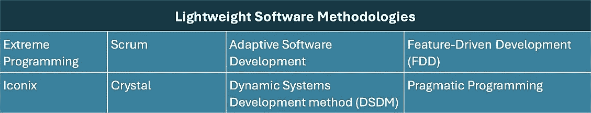
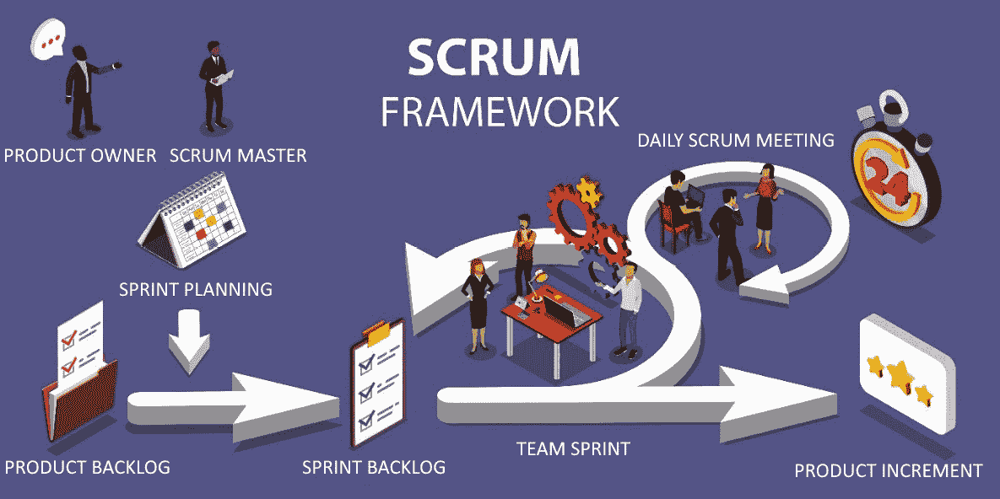

# 通过敏捷性解决复杂的商业问题

“敏捷性是适应和应对变化的能力……敏捷型组织将变化视为机遇，而非威胁。”

– 吉姆·海史密斯

在当今快节奏的商业世界中，理解并掌握敏捷性不仅仅是一种竞争优势——它是必须具备的能力。您和您所支持的团队面对着一系列复杂的商业问题。传统的商业管理方法往往无法应对这些挑战，迫切需要更加敏捷和协作的方法。本章深入探讨了敏捷性的本质，强调其基础原则，并展示其在解决复杂商业问题中的关键作用。

本章介绍了组织敏捷性的核心概念、敏捷方法论背后的机制、实施小型团队的重要性，以及在跨团队协作中管理的关键见解。通过本章的学习，您将超越理论概念的理解，掌握推动敏捷性和协作的知识，助力您的职业发展。

在您职业生涯的广泛背景下，以及不断变化的商业环境中，敏捷性是现代成功的基础。采纳这些概念将提升您的职业发展，使您和您的团队能够开创创新，促进适应性，并灵活应对当今数字化和商业环境的复杂性。

本章涵盖以下主题：

+   体现组织的敏捷性

+   采纳敏捷框架促进协作

+   通过 Scrum 提高团队效率

+   通过 Scrum 促进有效的协作

+   采纳**团队中的团队**（**ToT**）方法

# 技术要求

Scrum 是本章所教实践的敏捷框架参考。虽然不是必须的，但对敏捷实践和框架（如 Scrum）有基本了解，将有助于您理解所提供的信息。为了进一步学习，我们推荐塞西尔·鲁普的书籍《*Scaling* *Scrum Across* *Modern* *Enterprises*：*Implement* *Scrum* *and* *Lean-Agile* *Techniques* *Across* *Complex* *Products, Portfolios, and Programs in* *Large Organizations*》。

# 体现组织的敏捷性

在快速变化和不可预测的商业环境中，组织被迫迅速适应和发展。体现组织敏捷性不再仅仅是一个竞争优势——它是生存和持续成功的基本要求。在本节中，我们将探讨组织敏捷性真正意味着什么，它的好处，以及它对商业各个方面的变革性影响。

## 理解商业敏捷性的基础

从本质上讲，敏捷是建立在一套原则、实践和行为框架上的，这些框架使组织能够有效地应对复杂环境。它不仅仅是快速反应，而是理解和预见市场动态，以便做出明智的决策。

这种适应能力的核心是拥抱容错实验。这种做法鼓励组织通过试错来推动创新，理解偶尔的失误可以提供关键的洞见，但通过小规模和频繁的变更迭代来最小化风险。测试、学习和迭代的自由成为真正敏捷的驱动力。

超越流行语，敏捷是一种结构化方法，依赖于清晰的沟通、协作、持续学习和适应性。本章将探讨构成组织敏捷性的基础要素，使企业能够在不断变化的环境中预见并灵活应对。

## 应用敏捷原则

原则是基本的真理或信念。然而，敏捷原则不仅仅是建议。要付诸实践，我们需要建立一种新思维，强调与客户的合作、应对变化的意愿，并专注于快速交付真实价值。

商业敏捷性基于一些原则，使组织能够迅速有效地响应外部环境的变化。以下是支持商业敏捷性的几个基本原则：

+   **以客户为中心**：优先考虑客户需求和反馈，确保产品和服务始终与其不断变化的需求保持一致。

+   **适应性**：培养迅速改变方向的意愿和能力，以应对新信息或变化的环境。

+   **持续改进**：通过迭代反馈循环，始终寻找提升流程、产品和服务的方法。

+   **授权**：信任并授权团队和个人做出决策，同时培养责任感和主人翁精神。

+   **协作**：促进跨职能团队合作和开放沟通，确保对齐并共同解决问题。

+   **简化**：尽可能简化流程，但不能过于简单，去除不必要的官僚主义和复杂性。

+   **价值驱动的决策**：专注于能为组织和客户带来最大价值的活动。

+   **透明度**：保持开放的沟通渠道，并提供对流程、决策和绩效指标的可见性。

+   **快速反馈循环**：实施快速获取产品、服务和流程反馈的做法，以便做出快速调整。

+   **创新与实验**：鼓励创新文化，敢于承担合理风险，并从失败中汲取经验教训。

+   **学习心态**：投资于持续的学习和发展，保持对技术能力、市场趋势和不断变化的客户需求的更新。

+   **韧性**：培养克服挫折的能力，适应新挑战或商业环境中的变化。

通过在团队和整个组织中灌输这些原则，你可以为一个适应性强、反应迅速的企业铺平道路，使其始终与市场需求保持一致。

随着你深入本章，你将学习如何将敏捷原则转化为战略优势。通过认识到敏捷性如何加强公司在市场中的竞争地位，你将具备塑造决策的能力，从而提升竞争力。

## 响应敏捷性

从本质上讲，敏捷方法强调响应性。它们确保组织保持灵活，迅速调整以应对市场动态、商业战略和新机会。敏捷的核心是其迭代和增量方法，能够迅速应对持续的客户需求、竞争和市场影响。

我们将在接下来的子章节中探讨什么是响应性。

### 支持精益实践

敏捷性和精益思维是相辅相成的。精益关注去除低效并优化生产力。稍后，你将了解到价值流管理（VSM）是一种精益方法，用于评估和优先考虑提议变革的潜在影响。

然而，识别和消除浪费只是开始。一旦精益方法通过突显低效设定了方向，通常是敏捷团队以其适应性、迭代方法介入，设计并实施真正实现精益目标的解决方案。

让我们更仔细地看看敏捷团队如何支持精益改进目标：

+   **交付以客户为中心的价值**：敏捷团队优化和调整解决方案，确保它们始终与不断变化的客户需求对接，强调持续的利益相关者反馈

+   **消除浪费**：虽然精益方法识别浪费，敏捷团队设计适应性解决方案来弥补空白，提升生产力，并在每次迭代中消除低效。

+   **简化** **工作流**：敏捷团队通过提高工作流效率，推动精益计划，利用协作和迭代反馈不断优化流程

+   **对齐生产与需求**：尽管精益方法设定了平衡，敏捷团队确保解决方案灵活地调整，以应对市场需求的变化和优先级的调整

+   **减少在制品（WIP）**：敏捷团队解决过多的在制品问题，专注于优先级任务，将项目分解为短周期冲刺，确保对齐的价值交付

简言之，虽然精益流程改进机会帮助指导工作，通过突出浪费和约束消除的领域，但是敏捷团队以其灵活和协作的方法将这些策略付诸实施。他们是问题解决者、创新者和把精益目标转化为可行结果的建设者。

### 离开传统的舒适区

本节讨论了传统项目管理方法，通常称为瀑布模型。你可能已经了解这些信息，所以可以跳过这一部分。但是，如果你对传统项目管理实践不熟悉，理解这些信息对于掌握敏捷实践的差异至关重要。此外，在许多情况下，瀑布模型仍然更适合于管理大型或复杂项目，这些项目不适合进行渐进式变更。

所谓的瀑布模型是传统开发方法的核心。以其顺序和计划驱动的工作流程为特征，这种模型在各种行业中，特别是在精确性、可预测性和稳定性至关重要且可能的行业中，一直是主流。

换句话说，当产品生命周期的基本活动被充分理解，变异性较小，并且可以事先计划时，瀑布模型的线性顺序和计划驱动的项目管理方法在大型和复杂的建设活动中表现良好。例如，瀑布模型在设计、开发、测试和部署过程被充分理解且不太可能发生显著变化的大型和复杂建设活动中运作良好。

因此，让我们快速了解定义传统项目管理方法的基本特征。

### 瀑布模型的关键特征

下面是瀑布模型的一些关键特点：

+   **合同约束**：在这种模型下启动的项目受到预定义约束的严格约束，包括范围、预算、进度、效益、质量和风险。通常，这些具体内容会在正式的章程或合同协议中仔细详述。

+   **线性顺序工作流**：一个阶段完成后，紧接着进行下一个阶段，确保系统化、逐步进行。

+   **面向计划**：在学习之前通常会强调计划，几乎没有中途调整的余地。

+   **正式变更管理**：由于目标是事先计划，通常不欢迎变更，并且重大变更可能不可行，比如在建设中增加新楼层。是的，这是可能的，但通常不切实际。

+   **过度详细的文档**：详细的文档不仅受到鼓励，而且通常被认为是必要的，提供每个阶段的全面记录。

+   **重量级流程**：开发模型建立在严格的、常常笨重的流程之上，具有严格的指南和标准。

### 瀑布模型的优势

下面是瀑布模型的一些优点：

+   **项目界定明确**：当需求和流程清晰时，瀑布模型表现最佳。因此，当客户的需求、架构考虑、设计和方法已经明确且预计不会发生重大变化时，瀑布模型非常适用。例如，它通常适用于建造船只、建筑物、公用事业和大型基础设施项目。

### 瀑布模型的局限性

瀑布模型的一些局限性是敏捷实践旨在解决的问题：

+   **对变更的缺乏灵活性**：瀑布模型的线性方式使得一旦项目启动，加入变更变得困难，而敏捷方法的 IID（迭代增量开发）方式则更加灵活。

+   **延迟的反馈和测试**：瀑布模型中的软件测试是在所有开发完成后进行的，这导致问题的发现较晚，而敏捷方法则强调持续测试。

+   **更长的上市时间**：瀑布模型的阶段性结构通常导致产品交付速度较慢，与敏捷方法的快速迭代、增量价值发布形成对比。

+   **有限的客户参与**：在瀑布模型中，客户在需求阶段之后的参与非常有限，而敏捷方法则强调定期的客户合作。

+   **资源低效**：瀑布模型可能会导致在等待其他阶段时的延迟，而敏捷和精益方法则确保持续的客户参与和更好的资源利用。

在快速变化的行业中，商业需求、市场前景和客户需求不断发展，瀑布模型往往难以跟上节奏。其僵化性常常与动态环境的需求发生冲突。在这种情况下，一个能够适应变化的开发模型对于业务系统和流程的演变至关重要。

重要提示

我们强调瀑布模型局限性的目的并不是贬低它的效能，而是强调尽管它有其适用的场景，但现代商业挑战常常需要更具适应性的方式。

接下来的章节将探讨敏捷实践，重点阐明它们如何更有效地应对这些动态需求。

#### 向敏捷转型

传统瀑布模型的不足之处，尤其是在动态的商业环境中，导致了“轻量级”开发方法的崛起。这些方法源自软件行业，由一些不满瀑布模型僵化的工程师提出。这些工程师在频繁变化的需求和不切实际的截止日期压力下，设想了一种更具包容性和响应性的开发方式。

更为人熟知的轻量级软件开发方法列在*图 2.1*中：

图 2.1 – 轻量级软件开发方法

虽然每种轻量级方法都是独特的，但它们共享以下特征：

+   **小团队**：这些方法倡导具有自治、自主和完整多样技能集的团队来执行其分配的任务

+   **迭代开发周期**：作为基础原则，这些开发和交付周期通常很短，跨度为一到四周

+   **增量增强**：与试图进行“大爆炸”交付相反，重点转向分解工作并逐步实施新的能力、功能和功能，每个新迭代都有所增加

+   **产品焦点**：摆脱项目的短命特性，敏捷的重点是在软件产品的经济可行生命周期内持续增强和支持

+   **客户中心性**：对客户需求和优先事项的响应，以及承诺将每个增量与客户反馈对齐，是基于敏捷的实践的特点

+   **接纳变化**：变化不仅仅是被容忍的；它被接纳，确保适应性始终处于开发过程的核心位置

重要说明

需要强调的是，尽管这些方法被视为“轻量级”，但这并不是对其健壮性或有效性的评论。相反，这是对其简化流程的承认，使团队能够在面对不断变化的需求时轻松转向。

现在您了解了敏捷方法在大多数软件开发项目中超越瀑布模型的进展，让我们快速讨论一下仍然存在一些关于最佳方法的争论的领域：**商业现成软件**（**COTS**）。

## 管理 COTS 实施：敏捷与大爆炸

许多业务和 IT 高管认为，企业级商业现成软件无法通过敏捷的迭代和增量开发实践有效部署，因为它们要求整个解决方案从一开始就完全运行。因此，他们可能认为瀑布或大爆炸方法更适合一次性交付完整的业务解决方案。

尽管我们理解这些顾虑，但我们认为瀑布或大爆炸（即一次性）方法并不一定提供显著优势。例如，如果您的组织已经拥有明确定义的竞争流程、合规控制以及财务和报告要求，那么在新系统中复制这些可能比预期更复杂和具有挑战性。

COTS 软件通过提供预构建、经过测试的解决方案，减少开发时间和成本，从而带来经济效益。然而，真正实现竞争优势通常需要超出现成解决方案的内容。实施 COTS 通常涉及大量的定制化、集成和数据迁移，以满足特定的业务需求。你的业务流程、信息需求和报告需求与 COTS 软件的能力之间的差异越大，就需要越多的定制化。

### 处理合规性问题

**合规性**是许多组织的关键关注点，涵盖了如监管、财务、运营、法律和公司要求等领域。例如，上市公司必须遵守**萨班斯-奥克斯利法案**（**SOX**）的要求，该法案要求实施主要和次要控制措施来降低风险。由于没有统一的 SOX 控制标准——不同公司根据规模、行业和风险类型有所不同——组织必须根据自身情况定制其方法。SOX 还要求每年报告，证明财务报告准确且安全，这推动了商用现成软件（COTS）实施的定制化需求。

在处理合规性问题时，敏捷和“大爆炸”方法各有其优缺点：

+   **敏捷**：提供灵活性和持续反馈，有利于适应不断变化的合规性要求。然而，敏捷方法可能难以应对严格的文档要求和像 SOX 这样严格法规所需的全面控制。此外，推出定制化的流程、控制和报告可能既费时又复杂。

+   **大爆炸**：确保全面实施业务流程定制、数据管理、报告和合规控制，这有助于简化满足商业和监管要求的过程。然而，这种方法涉及更高的风险和更长的开发周期，可能使审计更加复杂，增加重大问题的可能性。延长的时间表和不断积累的成本可能会延迟部署，并增加在过程中发现问题的风险。

最终，无论是瀑布法还是大爆炸法，都不会更快地提供一个完整的可用解决方案。然而，由于问题、错误和缺陷的迟发现，瀑布法和大爆炸法都带来更大的风险和潜在延迟。因此，我们建议使用敏捷实践，支持在整个开发生命周期中逐步推出新功能，提供持续的改进和适应性。即使你的发布部署需要推迟，以整合必要的业务流程和控制，你也会知道，当它准备好时，你将拥有一个更强大的解决方案。

现在我们已经理解了敏捷的价值观和原则所建立的早期基础，接下来让我们看看商业开发环境是如何发生变化的。

#### 转向以产品为导向的思维方式

敏捷方法不仅仅是对开发实践的一点调整；它代表了企业在产品和服务交付方式上的全局性变化。它们从管理项目转向在我们的产品和服务的经济生命周期中专注于价值交付。

让我们更仔细地看看这些概念是如何展开的。

在快速发展的数字化环境中，传统的项目组织方式——有限的时间线和明确的终点——已不再适合那些追求可持续发展和持续创新的企业。

在他的开创性著作《从项目到产品》中，Mik Kersten 强调了从以项目为中心的思维方式转向以产品为中心的思维方式的必要性。与项目不同，项目通常优先考虑短期目标并倾向于独立运作，而以产品为中心的方法是全局性的，强调持续的价值交付和迭代改进。组织通过专注于产品并培养更为集成、响应和适应的 IT 生态系统，能够更好地将 IT 工作与业务成果对齐。

这一转变促进了一个文化，使得团队不仅仅是将项目推进到结束，而是全身心投入于他们所建设的产品的长期成功与演变。这一变化不仅仅是术语的变化，它代表了组织文化、战略和执行方式的深刻转型，使得企业在面对技术变革时更加敏捷和具有韧性。

我们必须注意到，Kersten 的书强调了过程效率和流程，这些是精益理念的核心。然而，敏捷则优先考虑适应性和以客户为中心的迭代，这两种开发方法对于现代产品开发都是至关重要的。

让我们来看看以产品为导向的理念在敏捷开发中的应用。

+   **迭代和增量开发**：这种方法拥抱周期性的开发过程，在一系列迭代增量中推出新的产品和服务功能。

+   **快速价值交付**：由于其迭代特性，敏捷确保新的价值能够更快地到达客户，增强了响应性和适应性。

+   **重新思考瀑布模型**：敏捷并没有完全抛弃传统瀑布模型的各个步骤，而是重新构想了它。通过将瀑布模型的生命周期步骤融入到反复的计划-执行-检查-调整（PDCA）循环中，敏捷将传统的单次流转转变为频繁、迭代和增量的开发周期。

重要提示

敏捷的本质是适应性。它使组织能够保持对不断变化的需求和优先事项的敏感，确保它们不仅仅是响应变更请求，而是主动地引导开发过程，以应对客户需求和优先事项。

现在我们已经定义了敏捷的特征和原则，让我们来看看将敏捷推向软件开发实践前沿的事件——《敏捷软件开发宣言》，以及成为小团队级别的事实标准的敏捷方法论——Scrum。

# 拥抱敏捷框架以促进协作

在这一部分，我们将重新审视将敏捷方法带入主流的事件——“*敏捷软件开发宣言*”——以及随后出现的轻量级软件开发方法论：Scrum 框架。我们将从重新审视敏捷宣言开始，以了解它在塑造现代敏捷思维中的作用。

## 重新发现敏捷宣言

在犹他州雪山山脉的雪鸟滑雪度假村，2001 年 2 月 11 日至 13 日之间发生了一次具有里程碑意义的事件。来自软件开发行业各个领域的 17 位著名思想领袖齐聚一堂。它们的目标是什么？弥合他们的方法论，发现一种统一的软件开发方法。从这个峰会诞生了《敏捷软件开发宣言》。它已经成为定义什么是敏捷软件开发组织的标准描述。

宣言（来源：[`agilemanifesto.org/`](https://agilemanifesto.org/)）内容如下。我们通过实践和帮助他人实践，发现了更好的软件开发方式。通过这项工作，我们开始重视：

+   个人和互动高于流程和工具

+   工作软件高于全面文档

+   客户合作高于合同谈判

+   响应变化高于遵循计划

“虽然我们承认右侧的组成部分有价值，但我们认为左侧的内容更为重要。”

宣言还概述了敏捷宣言背后的原则。但由于我们在本章早些时候提供了敏捷原则的现代列表，因此这里不再列出 12 条原则。如果你想了解更多，可以在这里查看：[`agilemanifesto.org/principles.html`](https://agilemanifesto.org/principles.html)。

重要提示

这份宣言不仅仅是一个声明。它提供了寻求打破传统、文档繁重的软件开发过程束缚的先驱们的集体智慧。它标志着一种以协作、适应性和提供实际价值为基础的方法的诞生。

因此，时间流逝，随着时间的推移，人们不可避免地从经验中学习，并质疑那些已经成为教条的东西。这一说法无疑适用于敏捷宣言。虽然它仍然经常被引用，但一些批评者认为我们需要对原有的思维进行修正。在接下来的部分中，你将发现一些批评意见以及关于今天敏捷意义的新思考。

## 超越敏捷宣言

《敏捷宣言》一直是敏捷运动的基础，推动着软件开发和项目管理的变革。二十多年后，技术世界发生了巨大的变化，敏捷实践应用的背景也发生了变化。这导致了关于宣言中列出的价值观和原则当前相关性的辩论和讨论。因此，让我们探讨一些当前的思考和敏捷运动的发展。

#### 拓展敏捷的视野

最初设计用于软件开发的敏捷方法论已经扩展到其他业务领域，甚至包括硬件开发。随着这种扩展，人们意识到，尽管《敏捷宣言》中的一些原则在精神上具有普遍性，但可能需要重新思考，以适应软件开发之外的其他领域。例如，将“可工作的软件”作为成功的主要衡量标准，在非软件领域需要进行不同的转译。

这一问题是我们开发 BASE 概念模型和模式语言的主要驱动力，我们将在*第九章*中介绍该模型，定义企业的商业敏捷系统（BASE）。

#### 协调持续交付与敏捷

《敏捷宣言》一直强调客户合作和适应变化的能力。这些都是由人为驱动的努力。然而，随着技术和用户期望的指数级增长，推动持续交付和通过先进工具、集成和自动化实现简化操作的需求变得不可忽视。

对无缝软件交付的现代需求极大地重塑了我们对敏捷性的理解。通过 DevOps 实践和工具增强的持续集成和持续交付（CI/CD）管道，引入了频繁的工作集成、流畅的信息流以及对自动化的高度依赖。

这种现代方法加速了软件开发工作，并要求思维方式的转变。敏捷不仅仅是迭代周期和反馈循环；它现在涉及将这些周期深度集成到持续交付过程中，确保敏捷性渗透到软件开发生命周期的每个阶段。

这种转变的表现可以在 DevOps 和 VSM 的兴起中看到。这些现代范式倡导整体价值交付，并挑战传统的分隔迭代开发的边界。

将敏捷迭代的节奏与持续交付的一致性结合起来，呈现出一种动态的融合，重新定义了企业如何进行产品开发。

我们将在本书后续章节中讨论将精益和敏捷节奏相结合的方法，首先从*第八章*《实施基础精益敏捷解决方案团队（BLAST）》开始。现在，重要的是要理解，我们可以有多个团队在产品生命周期内协同工作。这种对产品开发的重视深刻地影响了作为一个以价值为中心的敏捷企业运作的本质，与管理基于约束的项目有所不同。

#### 扩展数字化视野

在关于向产品导向思维转型的章节中，我们讨论了强调产品而非项目的重要性。然而，这个话题不仅限于管理软件交付产品。

当我们从以项目为中心转向以产品为中心的思维方式时，我们必须认识到，产品包括各种类型的产品和服务，其中许多是作为解决方案集成的。例如，*物联网（IoT）*就是一个很好的例子。此外，我们需要意识到，软件产品可以支持组织的价值流改进，无论是面向内部还是外部。今天，从有形产品到流程和服务，都可以通过数字工具得到提升。

在*第四章*《通过价值流管理（VSM）推动改进》中，我们将强调全面组织改进战略的重要性，这种战略不仅限于软件。你还将学习如何进行以产品为导向、基于价值的改进评估。

鉴于资源的限制，制定战略以最大化投资回报至关重要。这可能并不总是与软件相关。然而，软件和数字解决方案常常是转变流程或提升有形产品或服务的催化剂。

鉴于所有组织都面临资源有限的问题，我们必须评估在哪些地方能够获得投资的最大回报，这可能与软件无关。尽管如此，在许多情况下，软件和数字服务可以促进流程的变革以及实体产品或服务的提升。我们将在*第四章*中介绍的通用 VSM 方法和工具，以及在*第十章*《在精益敏捷企业中提升决策能力》中你将学到的商业智能战略，将帮助你做出这类商业评估和投资决策。

#### 拥抱业务敏捷性的崛起

敏捷转型已超越了 IT 部门。现在，组织视敏捷为一项全公司范围的能力。这引发了关于敏捷宣言的价值观是否足以解决更广泛的组织问题（如战略、治理和文化）讨论。商业敏捷性涵盖了一个更全面的视角，考虑到市场适应性、组织灵活性和文化敏捷性。尽管敏捷宣言提供了坚实的基础，但一些人认为它可能不够全面，无法应对这一更广泛的范围。

#### 重温个人的角色

敏捷宣言重视“*个人* *和* *互动* *重于* *流程* *和* *工具*。”然而，随着促进敏捷实践的数字工具和平台的崛起（如 Jira、Trello 或 Slack），关于人际互动与工具在提升协作中的作用之间的平衡仍然存在争议。虽然工具帮助我们可视化和简化流程，但敏捷的本质仍然在人类合作中。找到合适的平衡是一个持续的挑战。

#### 适应全球化的分布式团队

敏捷宣言强调面对面的沟通。然而，当今商业的全球化特点常常意味着分布式团队跨时区工作。新冠疫情进一步放大了远程工作的趋势。这引发了有关敏捷宣言原则在这种分布式、远程工作环境中的适用性的问题。在这种新背景下，实现有效的敏捷性需要结合数字工具、修订的沟通策略以及信任建设。

总结来说，虽然敏捷宣言仍然是一个基础性文件，但敏捷运动的发展需要持续反思和调整。宣言中提出的原则提供了一个指引，但敏捷之旅是动态的，受到技术、商业和全球环境变化的影响。

到这一点，你应该对实现商业敏捷性有了相对全面的理解，包括过去和现在。现在，让我们讨论敏捷的领先框架——Scrum，以及它如何支持商业敏捷。

重要说明

本章以 Scrum 作为参考的敏捷框架，适用于个体团队环境。我们还将介绍团队间（ToT）概念，适用于那些需要多个团队合作并整合工作的更大规模开发和问题解决需求。

## 绘制 Scrum 在敏捷实践中的崛起

在各种轻量级软件开发方法论中，Scrum 凭借其简单性、灵活性和已验证的成功经验，成为小型团队的主要方法。例如，Digital.ai 发布的*2022 年第 16 届敏捷状态报告*强调了 Scrum 的流行程度。报告指出，“*Scrum 继续领跑，*从*第 14 次调查中的 58%*增长到*当前调查中的 87%*。”虽然**Scaled Agile Framework® (SAFe®)**依然是企业最受欢迎的选择，但只有 26%的受访者表示使用该框架，与去年相比下降了超过 50%。不过，由于调查中的规模敏捷问题有所变化，这可能是导致该下降的主要原因。

官方的 Scrum 指南（[`scrumguides.org/`](https://scrumguides.org/)）将 Scrum 定义为“*一个轻量级框架，帮助个人、团队和组织通过适应性解决方案应对复杂挑战，从而获得价值*。”

Scrum 之所以能够在小型团队中保持领先地位，源于其简洁性、灵活性以及在推动协作和适应性方面的显著成功。其迭代方法和持续反馈的重视，使其在快速响应并交付有价值的产品或解决方案时，对复杂问题表现出极高的有效性。

随着本章的深入，我们将回顾 Scrum 是如何运作的。现在，了解 Scrum 是通过 Sprint 实施一个迭代和增量的敏捷模型将会有所帮助。每个 Sprint 或开发迭代都从一个可以测试的工作假设开始。随着 Sprint 的进行，团队根据观察和实验逐步调整。

我们将在下一个小节快速了解指导 Sprint 工作流程的 Scrum 事件，见*图 2.2*。

## 理解 Scrum Sprint 周期

以下图表详细描述了指导 Scrum 工作流程的事件：

图 2.2 – Scrum 框架

工作从创建**产品待办列表（Product Backlog）**开始，产品待办列表由**产品负责人（Product Owner）**管理，并结合各方利益相关者的意见，包括**Scrum 团队**和客户。在**产品待办列表精炼（Product Backlog Refinement）**过程中，Scrum 团队明确待办事项及其优先级。Sprint 从**Sprint 计划（Sprint Planning）**开始，团队从产品待办列表中选择优先级最高的工作项，形成**Sprint 待办列表（Sprint Backlog）**。Sprint 是**时间框定**的开发周期，意味着无论 Scrum 团队是否达成 Sprint 目标，周期的时长都是固定的。

开发人员根据自己的工作能力从 Sprint 待办事项中拉取任务。理想情况下，任何团队成员都可以处理任何任务，但有时需要特定的专业技能。每日 Scrum 是一个每日、时限为 15 分钟的会议，用于检查 Sprint 目标的进展，并根据需要调整 Sprint 待办事项，及时调整即将计划的工作。整个 Scrum 团队负责在每个 Sprint 中创建一个有价值、有用且可能可发布的*增量*。每个迭代结束时会有两个事件：Sprint 评审，检查增量的完成情况，以及 Sprint 回顾，团队反思如何改进质量和效率。Scrum Master 负责团队的有效性，帮助其改善实践和沟通，并消除障碍。

现在我们已经介绍了 Scrum 的基础内容，让我们回顾一下为什么它有效。

## 应用 Scrum 的基本原则

这些是支撑 Scrum 的两个主要概念：

+   **经验主义**：Scrum 基于一个原则，即知识来源于实践经验和迭代实验，通过观察做出决策。

+   **精益思维**：Scrum 指南承认精益思维对 Scrum 的影响，尽管它没有明确指出精益的基本原则，如消除浪费或改善价值流。然而，Scrum 分享了多个精益概念，如关注从客户角度增加价值、在短周期内交付、提供即时反馈、尊重人并持续改进。

为了优化价值交付，将 Scrum 与精益的全面概念结合至关重要。为实现这一目标，BASE 和 BLAST 框架整合了多个精益敏捷团队的工作，以支持产品和价值流的改进，简化工作、物料和信息流，识别并减轻约束，围绕特定产品和服务中心化工作，消除浪费的过程。

## 适应 Scrum 的有意灵活性

Scrum 的创始人 Ken Schwaber 和 Jeff Sutherland 很快指出，Scrum 是一个故意不完全的框架。它并不规定具体的工作方式或限制其适用的工作类型，而是保持通用设计，适用于各种领域。换句话说，Scrum 提供了一个基础框架来提升敏捷性，无论挑战是在商业、科学还是技术问题解决上。

Scrum 的灵活性带来了以下好处：

+   **广泛适用性**：Scrum 的多功能特性确保它适用于各种问题或业务领域，使团队能够灵活应对各种挑战。

+   **方法自由**：开发团队在 Scrum 框架内享有自主权。他们拥有完成任务所需的技能和知识，可以选择最适合其独特工作需求的方法和工具。

+   **框架遵循**：虽然 Scrum 赋予了自主性，但它也强调纪律。每个 Scrum 团队都在框架设定的边界内运作。这些指南如同指路明灯，引导 Scrum 团队的互动，确保和谐的关系。

本质上，Scrum 提供了一个灵活却结构化的环境，在操作自由度和框架一致性之间找到了平衡。需要注意的是，每次 Sprint 迭代的核心是由小团队完成工作的。接下来我们将讨论这一点。

# 通过 Scrum 放大团队效能

无论你是新手还是资深专业人士，理解小团队的动态都能重新定义你处理工作的方式。小团队固有的优势促进了清晰的沟通、信任和快速的决策，这些都是当今商业世界中至关重要的工具。Scrum 框架利用这些优势，提出了与工作模式完美契合的角色和工件。

在这一部分，你将发现如何利用小团队的优势来提升你的职业生涯，增强适应性、协作性和实际成果。

## 掌握小团队的艺术

当得到授权并具备自主性时，小团队能够成为强大的问题解决引擎。它们的规模有限，能带来灵活性、成员之间紧密的理解以及有利于创造力和创新的环境。

通常，Scrum 中理想的小团队由不超过 10 名成员组成。这个规模在多样化技能与可管理的沟通渠道之间找到了平衡。在这样的团队中，每个人的声音都能被听到，从而促进更丰富的头脑风暴和协作决策。

小团队更适合应对复杂的挑战，具备创新和适应性。接下来的小节中，我们将讨论它们如何促进协作与创新的环境。

## 培养协作和创新文化

培养敏捷文化至关重要。通过营造一个每个人都投入结果、创新受到奖励、协作成第二天性的小环境，团队不仅仅是其成员的总和，而是进化成一个紧密的整体，以无与伦比的专注力推动解决方案。

管理基于敏捷的小团队需要不同于传统层级和部门结构的方式。此外，追求更高敏捷性的需求促使我们不断进化我们的管理和领导策略，培养一个强调集体责任、突破性思维和无缝协作的强大文化。每个人的角色和责任也必须发生变化。幸运的是，Scrum 在这方面提供了一些指导。

## 定义团队角色和责任

在 Scrum 中，重点不是放在严格定义的角色和职责上，而是放在明确的责任上。Scrum 团队由以下三项定义的责任组成：

+   **开发人员**：开发人员执行任务以实现 Sprint 目标，在每个 Sprint 中创建有价值的可交付增量。他们带来多样的技能集，专门针对自己的领域，确保团队保持自给自足的状态。

+   **产品负责人**：作为业务与其消费者之间的桥梁，产品负责人与利益相关者合作，最大化 Scrum 团队工作成果所带来的产品价值。

+   **Scrum Master**：Scrum Master 是团队的凝聚力，负责 Scrum 团队的有效性。他们解决障碍，提供 Scrum 指导，并通过在 Sprint 期间防止外部干扰，确保团队保持专注。

Scrum 中的三种角色被最小化定义，以确保责任清晰，并促进团队内的高效沟通。这种简洁性也延续到了其他定义的 Scrum 概念，例如之前提到的 Scrum 工件。

这部分讲解了如何利用小团队作为问题解决引擎的内容。现在，我们将转向协作的重要性。

# 通过 Scrum 促进有效协作

在现代职业世界的动态生态系统中，协作和适应力不仅是值得赞赏的技能，更是必需的。这不仅仅是和同事相处得好，而是要将多个拥有不同专业和目标的团队，组织成一个能够持续交付价值的有凝聚力的整体。

此外，Scrum 的原则和事件为提升这些协作工作提供了路线图。通过理解并应用 Scrum 的经验性支柱——*透明性*、*检查*和*适应*——并熟悉其事件，你将能够促进更好的团队合作，简化流程，预见挑战，并迅速适应变化。

接下来，我们将讨论更广泛的协作挑战，并提出 Scrum 作为潜在的解决方案。

## 鼓励跨团队协作

大型组织通常参与多个跨越不同价值流的项目，并需要来自多个团队的支持。虽然每个团队可能有其职责领域或专业领域，但最佳的整体目标是通过这些单位之间的有效协作来实现的。这种跨团队的互动不仅仅是为了促进操作；它们在提升组织敏捷性方面至关重要。

理解跨团队相互依赖关系的复杂性对于业务敏捷性至关重要。这需要采用战略方法来同步多样的工作流程、整合任务并管理依赖关系。

在本章的后续内容中，我们将讨论支持多条工作流的 Scrum-of-Scrum（SoS）和团队中的团队（ToT）结构。它们提供了一个结构化但灵活的框架，以增强这一协作方法，并促进多个团队之间的和谐同步。随着我们深入探讨，我们将详细阐述这些概念，提供关于整体团队整合的见解。

然而，首先要做的是：接下来的两个小节将深入探讨 Scrum 经验主义的基础原则及其五个事件。在你熟悉这些概念时，思考它们在跨团队协作中的相关性和适用性。合理使用这些工具和技术，能够成为你追求组织敏捷性和职业成长的重要资产。

## 探索 Scrum 经验主义的三大支柱

采纳 Scrum 的细微差别需要深入了解其基础原则。在这一小节中，我们将剖析 Scrum 的经验主义支柱：支撑 Scrum 之屋的三大不可或缺的支柱——*透明性*、*检查*和*适应性*：

+   **透明性**：透明性要求团队的策略、目标和结果完全清晰。通过使用 JIRA 等工具和可视化图表，每个过程步骤对团队和利益相关者都是清晰的，确保决策基于 Scrum 的实际状态。

+   **检查**：检查包括对团队朝着 Sprint 目标前进的进度进行持续和详细的评估。通过 Scrum 的结构化事件，偏差能够迅速被发现，从而使结果与期望保持一致。

+   **适应性**：如果结果未达到预期，立即采取纠正措施至关重要。Scrum 团队致力于持续适应，及时调整以应对检查中发现的见解。

通过理解这三大支柱如何相互作用，你将更好地掌握如何有效地实施 Scrum 事件，不仅提升项目结果，还能改善团队动态。那么，接下来让我们看看这些原则如何相互交织，指导团队做出明智的决策，促进持续成长，并支持跨越五个 Scrum 事件的积极适应。

# 采纳团队中的团队（TOT）方法

在今天的商业环境中，单一团队，无论其能力如何，往往会面临复杂的问题，这些问题需要更广泛的集体方法来解决。本节突出了协作的重要性，从认识到单一团队的局限性到战略性地协调多个团队。用 Scrum 术语来说，这些整合的团队概念被称为 Scrum-of-Scrums（SoS）。

SoS 是一个自然从 Scrum 框架中演化出来的概念，随着组织试图将其敏捷实践扩展到更大的群体或团队。SoS 的起源并不归因于单个个人，而是作为多个 Scrum 团队协调和有效沟通的一种方式出现的。在本书中，我们将使用一个更为通用的术语——团队中的团队（ToT）。

ToT 方法在扩展的敏捷框架®中被普及为敏捷发布列车（ART），其详细描述超出了本书的范围。然而，想要深入了解的人可以查阅理查德·克纳斯特和迪恩·莱芬韦尔的《SAFe®精华》。5

通过探索 ToT 概念以及如斯坦利·麦克里斯特尔将军等领导者的见解，我们的目标是为您提供在大型复杂环境中进行管理和领导所需的理解。这些知识为提升企业敏捷性、促进团队间的协同作用以及确保凝聚力和价值驱动的成果奠定了基础。

无论一个团队多么高效，它在单独行动时都有其局限性，特别是面对大规模复杂性时。认识到这一限制是创建全面协作方法的第一步。

面对大规模复杂性时，您将学会认识到仅仅依赖单个团队的局限性，并理解需要跨多个团队进行广泛协作，以应对这些多方面的挑战。

协调多个团队的共同努力需要技巧。这不是微观管理，而是和谐统一。定期的节奏和同步、共享工具与平台，以及培养开放沟通的文化，确保这个庞大机器的多个齿轮得以对齐。

最后，您将增强 ToT 在引导协作工作、同步工作、确保团队间和谐及推动集体持续交付价值的能力。

在管理产品生命周期中的所有活动时，除了非常小的公司，单一敏捷团队无法完成所有任务。这时，ToT 的概念变得尤为宝贵。这不仅是资源的扩展，更是协作、同步以及共享结果责任的扩展。

+   **集成工作流**：团队之中的团队方法促进了互联的价值交付，其中每个团队的产出为其他团队提供输入，确保成功是协作性的，而不仅仅是顺序集成。

+   **管理依赖关系**：多团队环境中存在依赖关系。识别并积极应对这些依赖至关重要。这种方法提供了一个全局视角，帮助预见并处理依赖关系，避免错位和延迟。

+   **同步交付**：一个凝聚力强的最终产品不仅仅依赖于各个里程碑，更需要团队间的努力对齐。像**SoS**、SAFe® **大规模敏捷开发**（**LeSS**）和**NEXUS**等扩展的 Scrum 框架能够促进这种对齐，确保一个统一的解决方案，达成整体目标。

+   **促进协作**：ToT 心态不仅仅是任务的整合；它还培养了共同的目标、相互尊重和集体驱动的意识，使团队作为一个紧密的整体存在。

总结来说，随着组织努力应对更重大挑战并满足多样化的客户需求，ToT 概念不仅仅是一个后勤上的必要性，它更是一个战略性的迫切任务。通过促进集成工作流，处理依赖关系，协调各方努力，以及培养协作精神，组织能够利用团队的集体力量，将复杂的挑战转化为开创性的解决方案。

## 采纳 ToT 理念中的见解

在处理如 Scaled Agile Framework（SAFe®）、LeSS、SoS 等敏捷扩展框架时，ToT 方法至关重要。这些框架专门解决了在多个团队共同开发大规模产品或服务的情况下，如何在大型企业中扩展敏捷的挑战。

这些竞争框架的开发者积极寻求从增值的角度来区分他们的方法，但我们仍然能在其中找到一些共同点。以下是一些例子：

+   **适应复杂性**：这强调了在复杂环境中，层级结构和传统管理方法的不足。ToT 概念提供了一种既灵活又集成的结构，能够在快速变化的情况下加快决策速度。

+   **共享使命**：这是一个至关重要的原则，每个人都理解使命，并能够访问他们执行任务所需的信息。在敏捷团队的背景下，这意味着每个团队都理解更广泛的产品愿景，以及他们的工作如何支持更大、更整体的愿景。

+   **赋能执行**：各个团队拥有自主权，能够做出决策。他们不仅仅是在执行一系列预定义的任务，而是根据现场情况动态调整应对策略。

+   **ToT 联络员**：引入 ToT 联络员角色，以改善沟通并管理跨团队的挑战和依赖关系。

这四个指南有助于协调、整合多个小团队的工作，同时将敏捷原则和实践扩展到多团队环境中。

本书的范围不包括评估这些不同的扩展敏捷实践方法和框架。然而，对于那些想深入了解的人，可以参考 Cecil Rupp 的书籍《*在现代企业中扩展 Scrum*》。

# 总结

在本章《*用敏捷解决复杂的商业问题*》中，我们探讨了敏捷在解决复杂商业挑战中的变革性力量。我们审视了组织敏捷的本质，它对不断变化的环境的动态响应，以及它与精益实践的关系，旨在提升效率。《敏捷宣言》提供了塑造敏捷发展轨迹的基础价值观，而 Scrum 框架则强调了其在迭代项目管理中的优势，强调使用小团队作为问题解决引擎，以及透明度和持续反馈的重要性。

协作是一个关键主题，强调了在分布式环境中大规模努力的价值，并结合了 ToT 哲学的见解。这些经验教训使你能够利用敏捷解决业务问题，同时全面了解敏捷和 Scrum 方法。展望*第三章*，建立精益流以提高生产力，我们将深入探讨精益导向的实践、为组织环境量身定制的敏捷方法以及跟踪业务成果的度量标准。加入我们，继续学习如何既精益又敏捷。

# 问题

请回答以下问题来测试你对本章的知识：

1.  你能回忆起敏捷的核心原则有多少条？

1.  列举敏捷团队如何支持精益导向的组织。

1.  Scrum 的两个主要概念是什么？

1.  Scrum 团队的三个主要职责是什么？

1.  Scrum 的三个工件是什么？

1.  对还是错：Scrum 的创始人 Ken Schwaber 和 Jeff Sutherland 迅速指出，Scrum 是一个有意不完整的框架。

1.  Scrum 经验主义的三大支柱是什么？

1.  Scrum 的五个基本事件是什么？

1.  为什么 ToT（思维转变）的概念在基于敏捷的实践中如此重要？

1.  竞争中的各种规模化敏捷框架有哪些共同点？

# 答案

1.  敏捷的核心原则包括以客户为中心、适应性、持续改进、授权、协作、简洁、价值驱动决策、透明度、快速反馈循环、创新和实验、学习心态和韧性。

1.  敏捷团队可以通过以下方式支持精益组织：

    +   **交付以客户为中心的价值**：敏捷团队不断完善和调整解决方案，确保它们始终与不断变化的客户需求保持一致，强调持续的利益相关者反馈。

    +   **消除浪费**：当精益识别出浪费时，敏捷团队设计适应性解决方案来弥补差距，提高生产力，并在每个迭代中消除低效。

    +   **简化工作流程**：敏捷团队通过使工作流程更高效，推动精益行动，利用协作和迭代反馈不断优化流程。

    +   **对齐生产与需求**：尽管精益方法设定了平衡，敏捷团队确保解决方案灵活地定制，以应对市场需求的变化和优先级的调整。

    +   **减少在制品（WIP）**：敏捷团队通过精益方法强调的过多 WIP 进行反制，专注于优先级任务，并将项目分解为冲刺，以实现对实际价值交付的对齐。

1.  Scrum 的两个主要概念是：

    +   **经验主义**：Scrum 基于这样一个原则：知识来自实践经验和迭代实验，决策基于每个 Sprint 过程中的观察。

    +   **精益思维**：尽管 Scrum 增强了敏捷性并加速了交付，但它本身并未涵盖精益价值流原则的完整广度。

1.  Scrum 团队的三个核心职责是：

    +   **开发人员**：开发人员执行任务以实现 Sprint 目标，带来多样化的技能集，针对特定领域量身定制，确保团队保持自给自足。

    +   **产品负责人**：产品负责人是业务和消费者之间的桥梁，与利益相关者合作定义需求，确保高效地持续交付以客户为中心的价值。

    +   **Scrum Master**：Scrum Master 是团队的凝聚力，解决障碍，确保团队保持专注，防止外部干扰在 Sprint 期间影响团队。

1.  Scrum 的三个主要工件是：

    +   **产品待办事项清单**：一份动态且优先级排序的清单，列出了完成产品、服务或其他交付物所需的所有工作，由产品负责人管理。

    +   **Sprint 待办事项清单**：Product Backlog 的一个子集，包含由开发人员为即将到来的 Sprint 精心挑选的任务。

    +   **增量**：代表实现 Sprint 目标的实际进展，进而表示一个可用的部分，帮助实现更高层次的产品目标。

1.  确实如此。Scrum 的创始人 Ken Schwaber 和 Jeff Sutherland 快速指出，Scrum 是一个故意不完整的框架。开发人员可以在其专业领域内自由使用所需的技能、方法和工具。

1.  Scrum 实证主义的三大支柱是：

    +   **透明性**：透明性要求团队的策略、目标和结果必须完全清晰。

    +   **检查**：检查是对团队进展的持续和详细评估，确保向 Sprint 目标的推进。

    +   **适应**：如果结果未能达到预期，则需要立即采取纠正措施。

1.  Scrum 的五个基本事件是：

    +   **Sprints**：Sprints 是时限性的迭代开发周期，持续 1 至 4 周。它们为团队的工作流程建立了一个一致的节奏或韵律。

    +   **Sprint 计划**：作为每个 Sprint 的启动，Scrum 团队共同定义 Sprint 目标，确保对目标有全面的理解。团队还会规划出实现 Sprint 目标和完成标准所需的具体任务和分配。

    +   **每日 Scrum**：每日 Scrum 是一个 15 分钟的短会，团队成员更新彼此过去一天的进展，分享未来 24 小时的计划，并突出任何阻碍进展的问题。

    +   **回顾**：这是 Sprint 结束时的一次反思活动，提供团队分析其过程和方法的机会。

    +   **评审**：展示团队在已结束 Sprint 中所取得的成果。利益相关者，包括客户和最终用户，提供反馈，使团队能够评估工作成效，并收集进一步改进的建议。

# 深入阅读

1.  Cecil ‘Gary’ Rupp, 2021\. 《通过价值流管理推动 DevOps：利用经过验证的 VSM 方法提高 IT 价值流交付，在数字经济中竞争》。PACKT 出版社，伯明翰，英国。

1.  Cecil Rupp, 2020\. 《在现代企业中扩展 Scrum：在大型组织中实施 Scrum 和精益敏捷技术，涵盖复杂的产品、组合和项目》。PACKT 出版社，伯明翰，英国

1.  Kersten, M.（2018）。《从项目到产品：如何在数字化颠覆时代通过流动框架生存并蓬勃发展》。IT Revolution Press。

1.  Rupp, C., & Beal, H.（2021）。《通过价值流管理推动 DevOps：利用经过验证的 VSM 方法提高 IT 价值流交付，在数字经济中竞争》。Packt 出版社。

1.  Knaster, Richard, 和 Dean Leffingwell. 《SAFe® 5.0 精要：通过规模化敏捷框架实现业务敏捷性》. Addison-Wesley Professional，2020。
