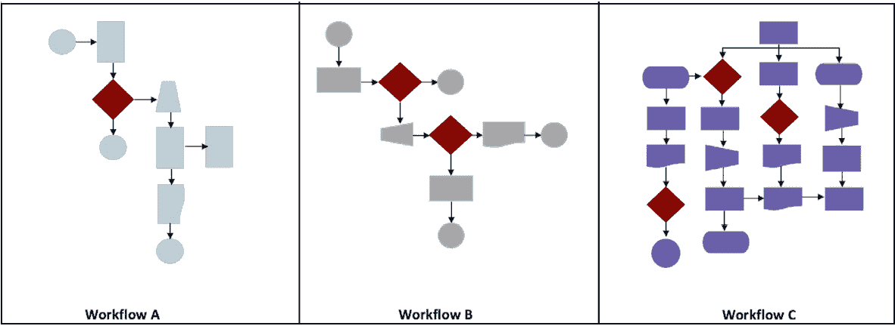
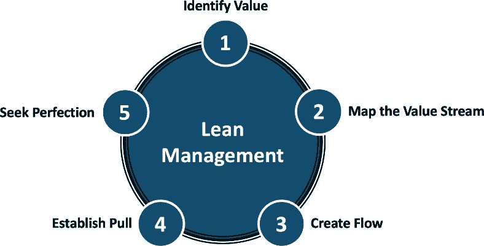
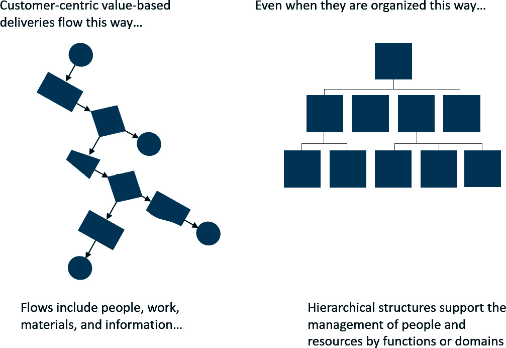
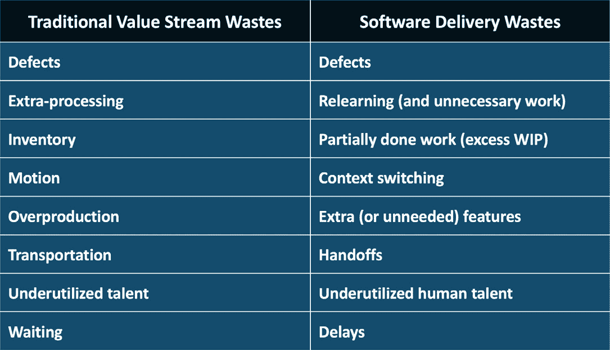
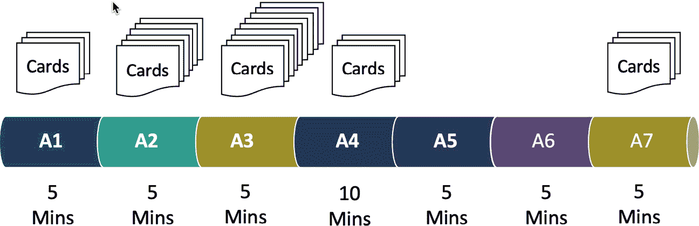
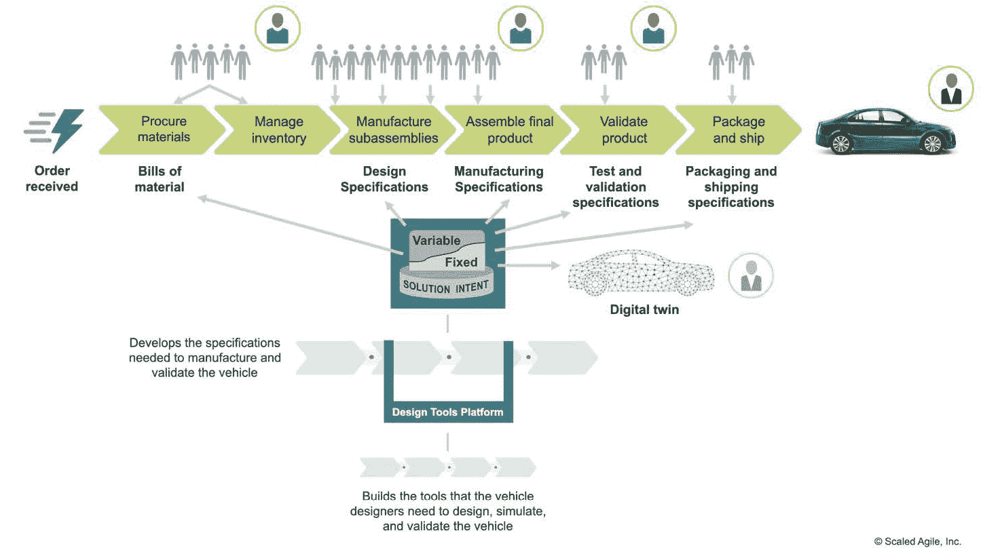
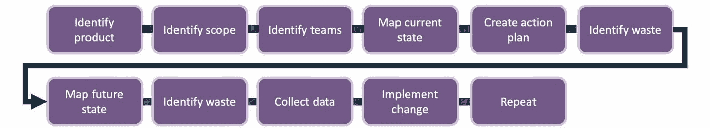
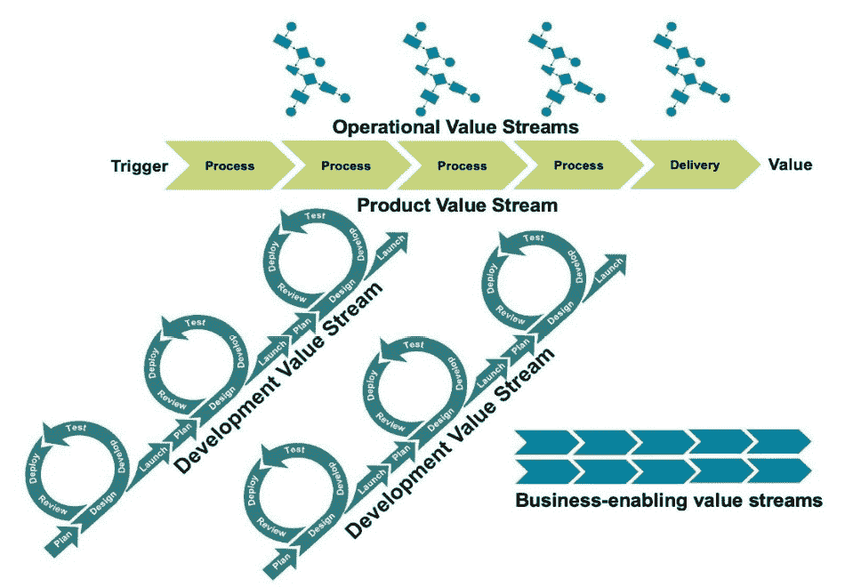

# 建立精益流程以提高生产力

“流是通过过程向客户交付价值的移动。在知识工作中，我们存在的全部理由就是向客户交付价值。因此，我们的整个流程应该围绕优化流程而定位。”

– 《可操作的敏捷度量标准以预测》中的丹尼尔·瓦坎蒂

在今天的市场上，55%的购物者优先考虑质量和产品价值，但最终决策的基础仍然是找到一个好的交易。例如，75%的婴儿潮一代，71%的 X 一代，68%的 Z 一代和 67%的千禧一代优先考虑价格而不是质量和价值（First Insight，2022）。因此，企业必须重新调整其产品交付策略，以在价格、特性和质量上竞争。本章解释了组织如何通过利用精益原则来应对这一挑战。

精益原则提供了一个实际的解决方案，帮助组织在顾客将经济性置于首位的市场中竞争。本章介绍了精益原则、基本实践、实施策略和关键术语，包括价值流、约束、拉动系统、浪费和指标。我们将深入探讨精益如何通过优化流程、消除约束和简化价值交付来提高效率。您将了解到，效率不仅仅是消除浪费，它还包括最大化价值交付的速度和成本效益。

我们将在本章中涵盖以下主题：

+   解锁精益效率

+   识别浪费的约束条件

+   简化价值交付

+   为竞争优势安装精益策略

+   推动持续改进

# 技术要求

对精益原则和实践有基础的认识是很好但不是必需的。那些希望更深入地探讨精益思维主题的人可以在本章末尾的*进一步阅读*部分找到塞西尔·鲁普的 12 和艾尔·沙洛威的书籍中获取更多信息。

# 解锁精益效率

在今天快速发展的商业环境中，效率不仅仅是一个流行语 – 它是成功组织的生命线。随着竞争对手总是一步之遥，顾客要求更多的同时付出更少，压力是巨大的。这一部分并非描述一幅可怕的画面；它是为了揭示通向精益效率的前进之路。通过本节结束时，您将掌握通过精心简化操作来提供无与伦比价值的基础精益实践。

当我们开始讨论时，通过系统思维的视角和在改善流程的背景下审视精益概念是有帮助的。例如，看看*图 3**.1*，并问问自己哪种工作流程代表了最精益的工作流程：

图 3.1 – 工作流程比较

**工作流程 A** 包含五个活动和一个决策点。**工作流程 B** 也包含五个活动，但有两个决策点。最后，**工作流程 C** 包含 15 个活动和三个决策点。乍一看，合理地假设**工作流程 A** 提供了最简洁的活动流程。但是，在本章的最后，您会意识到答案并不总是那么简单。但是，目前假设三者都生产相同的产品或服务，我们将选择**工作流程 A**，因为它具有最少的活动和决策点。

有了精益流程的最基本概念后，让我们继续讨论为什么公司需要精益而不仅仅是敏捷。和谐敏捷和精益- 最佳效率的双支柱。

在当今竞争激烈的市场中，组织仅仅敏捷是不够的；他们必须也拥抱精益思维。精益背后的核心理念是从客户的角度开始每一项努力，旨在通过提供的产品和服务交付无与伦比的价值。真正具有精益取向的公司不停止追求改进，而是在探索的永恒旅程中，不断尝试新的方法来完善他们的运营。最终目标？通过消除浪费来提供最大的价值。

精益价值流的概念完美地捕捉了这一意图。它概述了一个完整的、以价值为焦点的活动序列，从一个想法或客户请求开始，直到交付该价值。然而，精益哲学不仅仅是关于流程，它是关于对企业的整体方法。通过持续评估和改进**五大要素**：**人力**、**物料**、**机器**、**方法**和**资金**，精益从业者可以协调这些元素，为客户和企业取得最佳结果。简单地说，精益是通过更少的资源做更多更好。

*图 3.2* 展示了精益思维的五大原则，这些原则源自**丰田生产系统（TPS）**。这些原则的目标是优化整个价值流的产品和服务流动，并持续改进。

图 3.2 – 精益管理

这些原则后来由詹姆斯·P·沃马克（James P. Womack）、丹尼尔·T·琼斯（Daniel T. Jones）和丹尼尔·鲁斯（Daniel Roos）在他们 1990 年的书籍《改变世界的机器》中阐述和在西方世界中推广，进一步在他们 1996 年的书籍《精益思维》中详细说明。这些精益思维原则已经被广泛应用于制造业以外的领域，如软件和硬件，并在各行各业中提高效率和效果。

第一个原则是通过从客户的角度识别改进价值的机会，作为我们决策的北极星。接下来，我们绘制出交付价值的价值流及其活动。当我们绘制当前状态并探索改进选项时，我们始终专注于最小化浪费，改进工作、物料、信息和人员的流动，以最有效、最迅速地交付价值。精益通过实施拉动控制系统，如看板，来减少过剩库存、瓶颈和延迟的潜在问题。最后，精益组织始终追求完美，持续不断地改进。那些做得好的人在竞争中将拥有显著的优势。

## 协调价值流

价值流的核心在于它们能够代表从初始概念或客户需求转化为交付价值的完整端到端过程和活动。这一连续的序列超越了传统的部门壁垒，整合了跨职能的努力。具有讽刺意味的是，虽然许多公司为了行政管理而坚持层级化的组织结构，但真正的挑战在于确保这些层级结构不会无意中为解决方案开发创造出隔离。

传统官僚系统中常见的组织孤岛，阻碍了价值的自由流动。因此，高层管理者必须认识到这些隔阂，并主动打破它们。他们应当微调控制和激励机制，消除障碍，将人员和资源配置到更细化的产品线层面，以提升价值流的流动。

*图 3**.3* 显示了左侧的精益生产流程和右侧的传统层级化组织结构：

图 3.3 – 层级化组织中的精益流

传统上，公司通常试图在一个部门内管理业务流，并通过跨职能的流程和业务系统来管理工作、信息和物料流。这个方法的问题在于组织依然维持了孤岛式的业务管理方式。更有效的方法是识别并专注于增值活动，打破部门边界或分工的限制。这正是价值流概念的核心，如*图 3**.3*中左侧的精益流程图所示。

要实施精益导向的价值流并不需要将组织颠倒过来。然而，在价值交付工作进行的地方，跨价值流管理人员会更容易一些。我们将在全书中多次回顾这一话题。目前，理解组织可以在维持传统层级化管理结构的同时，依然在不同部门内外运营价值流这一点至关重要。

这一方法的一个例子可以在**丰田**看到，丰田是精益原则的发源地。虽然丰田采用了一个独特的层级结构，从全球总部到地理区域，再到产品线部门层层传递，但其核心意图始终不变：分散决策。这种分散决策使得决策更加灵活，可以更有效地应对当地产品和地区的细微差异。然而，在日常运营中，焦点依然放在将工作管理作为持续优化的价值传递流。请记住，提升这些流的路径需要考虑五个 M——人、机器、材料、方法和指标。

接下来，我们将触及精益原则和实践背后的哲学。

## 理解精益哲学

精益的核心不仅仅是一种方法论——它是一种哲学。起源于日本制造业，特别是丰田，精益已经超越了其根源，成为一种普遍适用的提升各行各业和商业领域效率的方法。该哲学的核心是不断追求以最少的浪费提供最大价值。从客户的角度来看，任何不增加价值的东西都被视为浪费，因此都可能成为被消除的对象。我们将在下一节中详细讨论各种浪费的类型，*识别浪费与约束*。但首先，让我们先了解一下“**价值**”这一术语的含义。

## 提供价值——精益的核心

在深入探讨效率之前，让我们先了解一下精益导向的价值观念。在精益的术语中，价值是指客户愿意为之支付的任何东西。例如，它可能是产品的特性和质量、服务的响应性，或软件的用户友好性。

现在，反思一下：我们日常运营中有多少是真正对这种感知的价值做出贡献的？你可能会意识到，许多流程虽然从组织角度看是不可或缺的，但并不直接提升客户价值。另一方面，许多现有功能是必要的，但它们仍然可以通过精益的高效视角来消除其中的浪费元素。因此，让我们在接下来的子章节中讨论这一点。

## 创建运营效率——精益之道

精益的魔力在于它能够识别和最小化浪费，从而使操作流程更加顺畅。在精益术语中，浪费分为八种类型：**缺陷**、**过度生产**、**等待**、**未充分利用的人才**、**运输**、**过剩库存**、**动作**和**额外加工**。通过识别和解决这些浪费，企业可以显著提升其运营效率。

例如，考虑一下在公司环境中常见的一个简单流程——文件审批。传统的方法可能涉及多个交接、手动签名和较长的等待时间。通过应用精益原则，我们可以转向数字审批、简化审批人数量，甚至质疑某些审批环节的必要性。结果是什么？审批更快，等待时间更短，减少了不必要的运动浪费，最重要的是，加速了价值的传递。

再次强调，我们将在下一节详细讨论如何识别和消除浪费。但首先，我们有几个其他问题需要解决，首先从满足客户需求的含义开始。

## 有效满足客户需求

在本章开头的统计数据中，我们提到，大多数购物者，从婴儿潮一代到 Z 世代，都将价格放在质量和价值之上。这是一个明确的信号，表明尽管质量不可或缺，但效率（通常转化为成本效益）不能被忽视。通过精益实践塑造的高效运营，可以降低成本，从而使企业能够在不牺牲质量的情况下提供具有竞争力的价格。

记住，今天的客户有着丰富的选择。如果他们能够以更低的价格（得益于运营效率）获得相同质量的产品或服务，他们更可能选择更具成本效益的选项。此外，运营效率还意味着更快的交付时间、更迅速的响应以及更及时的创新——这些都是满足并超越客户期望的关键。

精益导向的效率并非偶然发生。它需要整个组织不断的勤奋和努力，以识别、优先排序并执行消除浪费的策略。这是精益的人的元素。

## 重视人的因素

虽然工具、技术和方法论在精益实践中占有重要地位，但人的因素至关重要。正是那些身处一线、参与日常工作的人员，往往最先发现效率低下的问题。精益赋予这些人员表达观察和推动变革的能力。通过营造一个每个团队成员都是潜在效率提升者的环境，组织可以挖掘出大量来自一线的洞察。

此外，运营效率并不是一个一次性的里程碑，而是一个持续的过程。市场、客户偏好和技术始终在变化。今天高效的做法，明天可能会成为瓶颈。因此，真正的技能不仅仅在于实施精益实践，而是在于保持精益思维——一种持续改进和不断追求增加价值的精神。

这完成了我们关于解锁精益效率含义的讨论。在我们继续学习如何识别浪费之前，让我们总结一下到目前为止的收获。

## 拥抱运营转型

精益效率并非指用更少的资源做更多的事，而是做对客户和组织有利的事。这关乎过程的战略性对齐，确保每一步、每个行动和每个决策都能将业务推进向其目标。通过理解和实施所讨论的原则，你为运营转型奠定了基础——一个价值不仅被交付，而且在每个环节都得到放大的转型过程。

现在，我们将继续学习不同形式的浪费，这些浪费妨碍了我们为客户提供最大价值的能力。

# 识别浪费和制约因素

企业的成功——无论是商业、政府还是非营利组织——不仅取决于你能多好地增加价值，还取决于你能多有效地防止价值流失。如果不加以控制，低效会削弱组织的竞争优势，导致资源浪费、错失机会和盈利能力下降。在这一节中，我们将深入探讨识别浪费性制约因素的艺术与科学，并有效地消除它们，使你能够在职业生涯中成为运营卓越的倡导者。

## 查看浪费的谱系

浪费可能表现为明显的形式，例如制造产品中的缺陷，或以更微妙的方式表现，例如流程中不必要的审批步骤。要全面解决低效问题，首先必须擅长识别各种形式的浪费。精益导向的浪费一般分类如*图 3.4*所示，包括传统类别和软件类别：

图 3.4 – 浪费类型

如前所述，并在*图 3.4*中的*传统价值流浪费*列中所示，精益实践历来将浪费划分为八种主要形式。让我们更详细地看看这些内容：

1.  **缺陷**：缺陷和质量差会导致返工和修正，消耗宝贵资源，并可能损害客户信任。

1.  **过度生产**：生产超过需求的产品会占用资源和资本，导致不必要的存储、增加成本和潜在的过时。

1.  **等待**：流程之间的延迟时间表明低效，并可能增加整体生产时间。等待可能是上游瓶颈、不足的供应、依赖关系、过多的在制品（WIP）、缺乏自动化流程等的标志。

1.  **未充分利用的人才**：未能充分利用员工的技能和知识会导致创新和创意被忽视、技能和专业知识被低估、学习机会和生产力下降。

1.  **运输**：不必要的产品或材料搬运增加了成本，并可能增加损坏或丢失的风险。

1.  **库存过剩**：持有过多的库存会占用资本、消耗空间，并可能导致腐烂或过时，所有这些都会增加我们的成本。

1.  **动作浪费**：工人的冗余或不必要动作可能导致低效，并增加受伤的风险。

1.  **额外处理**：在一个流程中增加不必要的步骤或过度设计一个产品，可能会消耗资源，却无法为最终客户创造价值。

虽然这些分类源自制造业，但其本质具有普遍的适用性。无论你是在软件开发、金融服务还是医疗保健行业，这些浪费类别都能为评估流程和识别低效提供一种结构化的视角。尽管如此，将浪费列表根据工作领域的差异进行调整，仍然是非常有价值的，正如我们在下面的子章节中为软件相关浪费所做的那样。

## 按领域调整浪费元素

我们已经提到了适用于各个行业的传统八种浪费类型。然而，将它们细化到具体的上下文中可以增强其相关性。例如，在数字服务公司中，“库存过剩”可能指的是未使用的软件许可证，造成不必要的开支。类似地，“动作浪费”可能体现在项目中的频繁交接，导致延误和可能的沟通断裂。

那么，让我们看看精益浪费的概念如何转化到软件开发中：

1.  **缺陷**：在软件领域，缺陷会导致程序出现漏洞，降低用户体验，并增加维护工作量。

1.  **重新学习（也是不必要的工作）**：由于知识记忆不牢固或文档不全，重新做任务或回顾已经解决的问题会浪费时间并延迟进展。

1.  **部分完成的工作（过多的 WIP）**：过多的 WIP 可能会掩盖项目的实际状态，降低敏捷性，并延迟价值的实现。

1.  **上下文切换**：在任务或项目之间不断切换焦点会降低效率，迫使重新学习，并可能导致更多错误或遗漏细节。

1.  **额外/不必要的功能**：开发不必要的功能会消耗资源，复杂化用户体验，并使产品变得过于复杂和难以使用，从客户的角度来看，这些都是不增值的。

1.  **交接**：在团队或个人之间传递工作可能导致沟通断裂、潜在的瓶颈和延迟，并使责任变得模糊。

1.  **人才未充分利用**：未能充分发挥软件专业人员的潜力可能导致错失创新解决方案，并降低士气。

1.  **延迟**：等待决策、反馈或依赖项可能会阻碍进展、延迟发布，并使团队感到沮丧。

通过分类和理解这些浪费形式，你将能够有效地识别并解决各个产品线和服务中的低效问题。但现在，我们需要继续讨论一个可能是最关键的问题，那就是制约因素。

## 制约因素——沉默的价值障碍

虽然浪费可以看作是那些不增值的行动或步骤，但瓶颈则是主动阻碍价值交付的障碍。瓶颈可能是由于过长的周期时间或设置时间，导致生产线出现瓶颈，或者是无法处理所需交易量的软件服务器，甚至可能是妨碍快速决策的组织政策。

识别这些瓶颈至关重要。**约束理论**（**ToC**），是由埃利亚胡·莫谢·戈德拉特（Eliyahu Moshe Goldratt）提出的一种管理范式，详细阐述于他的著作《目标》中，该理论认为在任何复杂系统中，通常存在一个主要的限制因素，它定义了系统的能力。让我们看看*图 3.5*，以了解识别瓶颈的价值：

图 3.5 – ToC 示例

*图 3.5*描绘了一个由七个活动组成的价值流，每个活动都需要 5 分钟，唯一的例外是一个中心活动（**A4**），它需要 10 分钟。这一较长的活动形成了瓶颈，导致前面的步骤工作堆积。与此同时，后续活动缺少工作，正在等待来自瓶颈步骤的输入。

此时，我们可能还不清楚为何完成活动 4 需要 10 分钟。例如，这可能是由于长时间的设置、工作持续时间、检查过程，或是等待信息、材料或资源导致的延迟。然而，通过识别并解决这一瓶颈，我们可以显著提升系统的性能。

消除瓶颈对于优化工作流和最大化价值至关重要。通过根据瓶颈优先消除浪费，组织可以首先解决最有影响力的瓶颈，从而确保流程更加顺畅，效率更高。

在你的职业生涯中，理解瓶颈概念是无价的。它不仅使你能够提升所在领域的运营流畅性，还将你定位为一位具备全局思维的战略性问题解决者。

## 绘制价值流图

在上一小节中，*图 3.5*提供了一个非常简单的价值流图示。通常，我们现实中的价值流要复杂得多，而且我们需要捕捉更多关于材料和信息流的数据。

*图 3.6*，或者在*附录 A：机器车间价值流示例*中的放大版本，展示了一个制造线的价值流图。由于本书的重点不是教授价值流绘制实践，我们不会在这里花时间讲解这张图。相反，我们会专注于绘制过程本身。

然而，对于那些希望深入了解价值流图绘制机制的人，作者塞西尔·鲁普（Cecil Rupp）在他之前的著作《通过价值流管理推动 DevOps》中对这一话题进行了详细探讨。*进一步阅读*部分还包括了几本关于此主题的知名书籍。5,6,7,8,9,10

在*图 3.6*中，文字可读性并不关键；该图旨在提供一个汽车制造生产线流动的图示：

图 3.6 – 制造业价值流图示例

**价值流图** 是一种源自精益生产的可视化工具，用于分析和设计将材料和信息流转至消费者所需的过程。其目标是识别流程中的浪费和改进空间。

*图 3.7* 提供了绘制价值流图所涉及工作的快速概述：

图 3.7 – 价值流图和改进过程

以下是与精益实践一致的映射过程的简明总结：

1.  **确定产品/服务**：首先选择一个要绘制图表的产品或服务。这应当是对你的业务至关重要的产品，或是一个已知存在问题或低效的流程。

1.  **定义范围和边界**：明确定义你要绘制流程图的起始点和终止点。这可以是从下单开始到交货完成，或者从原材料到成品的过程。

1.  **组建跨职能团队**：组建一个包含各职能部门代表的团队，以便从多个角度全面理解流程。

1.  **绘制当前状态图**：从绘制流程的当前状态开始，而不是你认为它应该如何运作。记录完成产品或服务所需的步骤、流动和信息。这通常包括产品或服务在流程中流动时所涉及的操作、库存、等待时间和信息流。

1.  **收集数据**：对于每个步骤，收集如周期时间、等待时间、缺陷率、库存水平以及任何其他可以指示流程表现的指标。这些定量数据对识别瓶颈和浪费至关重要。

1.  **识别浪费**：在图中区分出从客户角度看有价值的步骤和没有价值的步骤（浪费）。非增值步骤是改进的目标。

1.  **绘制未来状态图**：根据当前状态图和收集的数据，设计一个未来状态图，展示在去除或减少浪费后，流程应如何运作。重点是创建一个高效的流程，尽量减少等待时间并减少非增值步骤。

1.  **制定行动计划**：制定从当前状态过渡到未来状态的计划，包括分配任务、设定截止日期，并确定实施变更所需的资源。

1.  **实施变更**：执行行动计划，对流程进行必要的变更，并确保所有团队成员都接受新流程的培训。

1.  **审视并持续改进**：在实施变革后，监控过程以确保改进得以持续。定期重新审视价值流图，以识别进一步改进的领域。对下一个价值流重复这一过程。

在 *第四章**，通过价值流管理（VSM）推动改进* 中，我们将更深入地探讨如何识别和优先考虑最有影响力的改进机会。

通过将一个过程的所有步骤可视化并将其与信息和材料流动相连接，价值流图使你能够看到浪费的源头和任何低效之处。凭借这些洞察，团队可以协作采取有针对性的方式，用更少的工作为客户创造更多的价值，这就是精益的精髓。

## 放大 IT 的影响力——推动运营效率和战略价值

为什么这一切对你在 IT 领域的职业生涯至关重要？在今天这个利润微薄、竞争者无情的市场中，达到运营效率是至关重要的。通过巧妙地识别并减少低效，你将提升组织迅速且经济地交付价值的能力。作为 IT 从业者，你的位置使你能够在产品、服务、流程和价值流中推动和实施数字化改进。

这些好处直接反映在最终收益上。减少浪费意味着不把资源浪费在那些无法增加价值的活动上。通过解决瓶颈，确保及时有效地交付产品或服务，迎接市场需求的挑战。这种专业知识不仅提升了盈利能力；还提升了客户满意度和品牌声誉。

此外，今天的组织正在寻找那些不仅仅执行任务，还能从根本上思考如何增强价值交付的专业人才。通过掌握浪费识别和瓶颈识别的技能，你将自己定位为不可或缺的资产，能够推动战略性改进，并培育持续提升的文化。

## 优先考虑效率——精益成功的组织命令

无论是来自浪费还是瓶颈，低效都是组织面临的普遍挑战。然而，它们是可以被解决和缓解的。通过本节中详细介绍的精益原则和实践，组织可以系统地解决这些低效问题，从而确保价值流动更加顺畅。随着商业环境的竞争加剧，掌握效率变得至关重要。这不仅使组织能够有效地交付价值，还能保持盈利能力。通过采用精益，组织实际上是在为其持续的成功进行投资，并强化其对卓越运营的承诺。

这完成了我们关于识别浪费和瓶颈的章节。在接下来的章节中，我们将重点讨论简化价值流动的方式。

# 简化价值交付

在本书中，我们注意到，在当今快节奏的商业环境中，及时和具有成本效益的价值交付至关重要。本节深入探讨了优化价值流的方式，提供了关于如何调整流程和技术以平衡时间和成本的见解，确保组织能够巧妙地满足甚至超越市场需求。

## 价值流分类

每个组织的核心是其对交付价值的承诺，而价值流则是实现这一目标的主要通道。这些是端到端的序列，在这些序列中，工作、材料和信息协同作用，顺畅地流动，通过产品、服务或其他有形成果提供以客户为中心的价值。

价值流

价值流是组织设计、开发并交付产品或服务给客户的一系列步骤和活动。价值流描绘了材料和信息的流动，从一开始，通常是从供应商或原材料开始，直到最终产品交付给客户。

从历史上看，软件行业的先驱者们，如詹姆斯·马丁在其开创性著作《伟大的转型》中，按商业实体中流行的业务流程对多种不同的价值流类型进行了分类。然而，当代的商业转型专家简化了价值流类型的分类，将其分为两到三个大类别——**运营**、**开发**和**支持**：

1.  **运营价值流**：这些类型的价值流直接为外部客户创造价值。无论是通过有形的产品、服务还是具体的结果，运营流涵盖了从接单、处理、履行到制造、售后客户支持等众多职能。

1.  **开发价值流**：这些价值流关注解决问题和创造价值，定义、设计、测试并演化新的解决方案。这些类型的价值流为内部和外部客户创造产品和服务。此类别的价值流包括产品管理、研发和 IT 服务。对于 IT 领域的人来说，**持续集成/持续交付**（**CI/CD**）和 DevSecOps 流水线属于开发价值流的一部分。

1.  **支持价值流**：虽然它们可能不是直接为客户创造价值的贡献者，但支持流是那些为组织内部的核心价值流提供重要支持的无名英雄。支持价值流中的步骤和活动使得运营和开发价值流能够高效、有效地运作，尽管它们不直接贡献于交付给客户的产品或服务。这些流涵盖了各种内部职能，如人力资源、财务、IT、采购、法律服务和供应链管理。

各种思想领袖和组织对这些价值流类别的解释略有不同。例如，SAFe 确定了运营和开发流，而 PMI 则将其扩展为包括支持价值流。类似地，像马丁和奥斯特林这样的专家区分了核心价值流——直接为客户创造价值——与支持价值流——这些是使核心价值流有效和高效运作所必需的。

你现在知道了什么是价值流。那么，我们可以开始着手改善它们，从交付速度、质量和成本之间的平衡开始。

## 平衡速度和成本

每个组织都面临一个关键的平衡挑战：如何在不妥协质量或增加成本的情况下快速交付产品或服务。当我们考虑到不断变化的客户期望和持续创新的压力时，这个问题变得更加重要。没有准确性的速度可能导致错误、返工和损害品牌形象。相反，耗时的细致方法可能导致错失市场机会，降低竞争力。

掌握这种平衡从理解和优化支撑价值创造和交付的过程开始。例如，考虑软件开发的业务领域。快速应用开发技术优先考虑速度，但如果我们没有充分考虑关键需求、架构和可用性问题，有时会导致部署后问题。相比之下，传统的瀑布模型可能会确保彻底的产品规划工作，但它们可能会延迟市场时间，并且无法提供足够的灵活性来应对不断变化的客户、业务和市场需求。

关键在于通过采用混合方法，持续优化方法论，以提高速度的同时控制成本。例如，在一个精益敏捷企业中，价值流有助于确保可预测和高效的产出，而基于敏捷的团队则评估并实施最能增加价值的改进。

精益敏捷组织寻求在效率和变革之间找到平衡。这种优化需要深入理解行业、预测市场需求的能力，并且熟练掌握利用工具和技术来帮助高效交付。我们必须确保我们正在进行的变更在交付更多价值、以最低实际成本的方面具有最大的潜在影响。

敏捷实践不仅限于帮助我们演进产品。我们还必须考虑如何最好地改进我们的价值流活动和跨职能的业务流程，这些流程为业务创造价值并支持业务发展。这些改进对交付的速度和成本影响最大。因此，我们需要敏捷团队也致力于解决这些问题。此外，在接下来的小节中，你会发现，这通常意味着我们要将敏捷业务团队集中于修复低效。

## 通过最小化低效来提高效率

这可能听起来很直观，但更高生产力的旅程往往始于识别和纠正低效。这类似于铺设一条更平坦的道路，以确保更快的行驶。通过消除流程中的障碍（低效），你确保了更迅速、更低成本的价值交付。

在这里，再次强调，评估我们约束的所在是识别低效的关键指标。低效可以表现为多种形式：冗余的流程、过时的技术、沟通障碍，甚至是技能不匹配。识别这些痛点是提升我们业务价值创造和信息流动的第一步。

精益实践创造效率的另一种方式是通过消除价值流中的延迟。这些延迟往往是由于多任务处理造成的，这会产生额外的工作。尽管我们可能认为自己能做到多任务处理，但人类实际上一次只能处理一个思维或一系列动作。

底线是，通过改善流程和减少浪费，我们变得更加高效。随后，应用精益原则、自动化重复任务、优化沟通渠道以及确保持续的技能提升，能大大减少这些低效，为简化的价值交付铺平道路。

在我们离开这一部分之前，让我们快速看看你在评估和消除低效方面的职业专注，如何对你的职业生涯产生积极影响。

## 在职业领域开辟一个细分市场

随着你的职业发展，你确保快速、成本效益高的价值交付的能力可以使你脱颖而出。组织可能通过技术和产品创新实现跨越式发展。但当他们拥有高效的运营时，才能维持竞争优势。通过掌握优化流程和最小化低效的技巧，你不仅仅是在为当前的项目或产品做出贡献，而是在影响着一种卓越运营的文化。

擅长这种优化的专业人士往往会发现自己担任战略角色，推动组织政策并引领创新。这是一项与领导层、投资者和客户都产生共鸣的技能。在每一秒钟都至关重要、每一分钱都被仔细审查的世界里，精通优化价值交付可以成为你获得职业认可和组织成功的通行证。

精益价值交付的追求是永无止境的。市场动态变化，技术不断进步，客户偏好也在不断变化。在这些变化中，你能够持续高效地交付价值，将成为稳固的基石。在你的职业生涯中，记住每个过程都可以优化，每种方法论都可以改进，每个低效的环节都可以最小化。

这就是我们关于精简价值交付的讨论的全部内容。本节已经为你提供了实现这一目标的见解和工具。接受它们，优化它们，并加以应用。结果是什么？一个更强大的职业形象，一个在日益增加的挑战面前，依旧坚韧、高效且有盈利的组织。

在接下来的部分，我们将介绍帮助你在行业中获得和保持竞争优势的精益策略。

# 安装精益策略以获得竞争优势

在动态变化的全球市场中，目标不仅仅是生存，而是要蓬勃发展并引领潮流。事实上，如果我们不制定步伐，我们将无法长久生存，充其量只能作为一个小众玩家生存下去。

运营效率是追求这一目标的组织和专业人士的基石。在商业竞争的背景下，效率不仅仅是减少浪费，它还意味着持续、及时地交付价值。精益策略提供了一套框架，帮助企业保持竞争力并具有适应性。

## 优先考虑价值流

在精益-敏捷的框架中，焦点转向确保通过我们的产品和服务优化交付的价值，这些价值是由我们的客户定义的。这种优化贯穿他们的经济生命周期，超越了传统的、通常是碎片化的基于项目的方法。与项目导向的流程中常见的间歇性断断续续不同，精益-敏捷强调持续的流动，顺畅地整合了运营、开发和支持的价值流。

在前一节《精简价值交付》中，特别是在《分类价值流》小节中，我们介绍了三种标准的价值流类型：运营、开发和支持。我们将添加第四种价值流类型，称为**“产品”**。毕竟，无论是精益还是敏捷，都强调我们所做的一切，实际上我们的生存，都是基于通过我们的产品和服务满足客户需求。

为了更清晰地了解这一点，让我们来看看*图 3.8*：

图 3.8 – 端到端客户价值流动

*图 3.8* 展示了一个产品价值流，定义了从概念到逐步交付新价值所需的端到端工作流程。喂养产品价值流的，是多个运营和开发价值流。业务支持价值流（通常称为支持价值流）与产品价值流并不直接连接。然而，它们对于维持业务是必要的（例如，人力资源、法律、财务、市场营销）。

那么，为什么我们要添加产品价值流呢？经典的价值流定义是从概念到交付的一整套活动，协同地将输入转化为输出，最终为客户提供价值。这听起来很复杂，但基本上它意味着一个价值流涵盖了公司为通过其产品和服务向客户提供价值所做的几乎所有事情。

然而，这个定义的问题在于，它并没有使我们容易地将工作拆解成易于理解的小块，以便更好地管理业务。为了克服这个问题，各种思想领袖开始围绕运营、开发和支持（业务支持）功能来组织价值流。但这样一来，我们失去了一个观念：我们所做的一切必须支持那些为我们的工作提供资金的客户。毕竟，他们是我们组织能够存在的原因。

在一个大型的数十亿美元组织中，可能有数百个甚至上千个潜在的价值流。然而，产生收入的价值流数量仅限于它们向客户提供的主要产品和服务。

在以下小节中，我们将更详细地审视从概念到交付过程中，提供客户价值所需的许多关键活动。具体来说，我们将探讨为什么有这么多潜在的价值流，以及如何组织它们。

## 解密组织的价值流

首先，所有组织都致力于支持特定的市场、客户类型及其需求。组织的聚焦和一致性对成功至关重要，并需要广泛的工作来不断提供以客户为中心的新增价值。

在一个迭代的产品生命周期中，我们从定义公司、客户、产品和投资组合策略的活动开始。还需要进行市场和产品研究的其他活动。我们通常需要开发合作伙伴关系和供应链来支持我们的制造、交付和支持服务。我们需要进行活动来推广和销售我们的产品。此外，我们还需要设计、开发、测试和部署我们的新产品或增强型产品和服务。我们还需要其他活动来支持我们商品和服务的持续生产。更重要的是，我们还需要其他活动来管理订单履行和提供客户支持。

最后，必须知道，面向客户的价值流也必须支持跨多个开发生命周期的产品演变。因此，前一段中提到的所有活动都是迭代性的，以增量的方式交付新的价值。但现在先记住这个想法，稍后我们会在*第九章*《为企业定义商业敏捷系统（BASE）》中再讨论。

现在，让我们更深入地了解这种已经渗透到几乎所有行业的范式转变。

## 精益范式——效率与价值的结合

从历史上看，精益最初起源于制造业，旨在减少浪费并简化操作。随着时间的推移，其原则已渗透到多个行业，包括航空航天、银行和金融服务、建筑、消费电子、教育、食品和饮料、医疗保健、信息技术、制药、公共部门和政府，以及零售业。

从本质上看，精益不仅仅是一种方法论；它是一种以价值交付为中心的思维方式。通过消除不增加价值的过程（即浪费），并专注于从客户角度出发的真正增值部分，精益确保每一项组织努力都能提高客户满意度。

例如，在一家 IT 服务公司，如果客户反馈表明系统的稳定性和安全性比最新的创新功能更为重要，那么精益导向的方法将把重点放在严格的测试和强大的安全协议上，这可能需要新的工具、测试脚本和自动化。这确保交付的产品符合客户的主要需求，减少潜在的系统漏洞和高昂的后期修复成本。

随着这种范式的转变，带来了竞争优势。让我们看看为什么。

## 通过精益打造竞争优势

商业竞争不仅仅是关于谁提供某种服务或产品；更重要的是谁能以最佳、最快的方式，并与客户期望相一致地提供它。利用精益方法可以成为你通过以下四个方面获得竞争优势的基石：

1.  **以客户为中心**：通过从客户的角度聚焦于价值，精益确保组织始终与市场需求变化保持同步，迅速调整并提供客户真正需要的产品或服务。

1.  **优化操作**：精益方法鼓励简化操作，减少周期时间，并确保更快速的市场响应。在零售或技术等行业，这可能意味着市场领导地位与过时之间的差异。

1.  **成本效益**：通过消除浪费的过程，精益不仅确保了时间的高效利用，还能节省成本。这些节省下来的成本可以战略性地再投资于创新，或传递给客户，进一步增强竞争力。

1.  **创新催化剂**：精益不仅仅是做对的事情；它还意味着做正确的事情。通过将资源从不增值的任务中释放出来，组织可以将更多的投资用于研发，推动创新并保持市场领先。

精益不仅仅是一个运营工具；它是一个战略资产。通过理解和吸收精益方法如何增强竞争优势，你可以将自己定位为组织中的宝贵资产。

在从运营管理到战略规划等各个角色中，能够部署超越客户期望的精益驱动解决方案，可以让你脱颖而出。试想一下，领导一个项目，不仅能够按时完成目标，而且提前完成，预算内，并且带有市场尚未提出的创新。这就是精益带来的卓越能力。

此外，随着全球企业越来越多地采纳精益思维，精通其原则和应用的专业人士将会发现自己需求日益增加，从单纯的角色承担者转变为战略性影响者。精益的魅力在于其原则是普遍适用的。无论你是在医疗、金融、科技还是制造业，精益对高效价值交付的关注始终是一个不变的竞争差异化因素。

## 为市场领导力铺路

这结束了我们关于提升竞争优势的精益战略的讨论。我们了解到，在当今时代，未来的市场领导者正在通过今天高效地交付无与伦比的价值来定义自己。精益战略提供了实现这一目标的蓝图。通过将组织流程与客户价值对齐，优化运营，并持续创新，精益确保企业不仅仅是在跑步，而是在引领这场比赛。

作为专业人士，拥抱精益的原则将为你提供一套强有力的战略前瞻性和运营卓越的结合工具。这是一个确保你不仅能为组织的竞争力贡献力量，还能在一个重视效率、创新和价值的市场中为自己开辟一个独特定位的工具箱。

现在，让我们继续讨论精益如何推动持续改进。

# 驱动持续改进——通过精益原则促进持久的提升

在不断发展的商业环境中，保持竞争力不仅仅需要一次性的过程优化。虽然敏捷回顾的战术方法强调快速、具体于冲刺的改进，精益则提供了更广泛的战略视角。精益原则优先考虑那些最具影响力的改进，无论它们所需的时间、成本或努力如何。因此，精益改进计划可能需要通过组织的投资组合管理流程进行审批。

这与敏捷强调团队或团队之间在即将到来的冲刺的限制内能够立即实现的内容形成了对比。未言明的是，敏捷团队因此在可以做出的变更范围上是有限的。

然而，要在不断变化的市场动态、消费者偏好和技术进步中茁壮成长，组织和专业人士必须理解并利用精益对持续改进的承诺，以实现最具影响力的改进。

## 始终专注于有影响力的精益改进

精益不是一次性的干预，而是追求持续运营卓越的过程。精益的核心是毫不妥协地消除浪费，并坚持专注于那些承诺带来最大影响的改进。通过提升效率、降低成本和加快交付，精益确保组织不断朝着最佳运营状态迈进。

之前的表述并不意味着精益实践者无法进行相对低成本和快速的改进。以制造业为例，他们会不断监控生产流程，识别瓶颈，并采取纠正措施。因此，生产过程中不会仅仅完成一个批次就结束，而是会进行分析、反馈和调整，以确保每个生产周期中的最大效率和价值。

但通常，最有影响力的变化需要时间、预算和资源，这些超出了价值流团队的权限。在这种情况下，我们依赖价值流图（VSM）方法来识别、优先排序并寻求预算批准，以推动建议中的变革举措。我们将在*第四章*中深入讨论这一主题，标题为《通过价值流管理（VSM）推动改进》。

无论规模大小，目标都是不断优化流程、系统、设备和工具，确保产品质量最高、生产效率高，并能及时响应市场需求。此外，如果设计和实施得当，这些类型的改进几乎总能降低我们的成本。

但最终推动这些努力的仍然是人，而这种类型的奉献精神和思维方式需要文化的改变。

## 培养持续改进的文化

虽然精益工具和技术至关重要，但真正的魔力在于当一个组织的文化拥抱持续改进时的展开。以下是专业人士如何培养这种文化的方法：

+   **促进开放沟通**：鼓励团队表达他们的观察、挑战和建议。一个欢迎反馈的环境会成为产生改进创意的沃土。

+   **庆祝小的胜利**：即使是微小的进步也要予以认可和奖励。这不仅能够提升士气，还能强化一种信念——每一项进步，无论多么微小，都在为更大的目标做出贡献。

+   **投资于培训**：为团队提供最新的精益技术和工具。团队成员的能力越强，他们就越能发现改进的机会。

+   **嵌入式审查机制**：定期审查确保持续改进的动力始终在正轨上。这些会议应聚焦于评估过去的行动、分析其结果并规划前进的道路。价值流管理是确保这些审查成为主流的正确方法。

+   **以身作则**：领导者不仅要支持，还要体现持续改进的精神。当团队成员看到他们的领导积极参与这一过程时，他们也会受到启发，全身心地参与其中。

既然你知道基于精益的持续改进需要文化变革，那么你如何才能帮助实现这一目标呢？这是下一小节的主题。

## 制定实现持续效率和盈利的路线图

对于专业人士来说，理解并倡导持续改进不仅仅是一种过程提升策略；它还是一种职业提升工具。当你领导并参与精简运营、减少浪费、提升价值交付的项目时，你将自己定位为组织中宝贵的人力资源。而且，你与组织的目标保持一致，推动高效地交付客户价值的同时，也提升了盈利能力。

想象一下，看到你优化的某个流程成功降低了 10%的生产成本，或者你提出的某个改进显著提高了产品质量和客户满意度，那种自豪感。它们不仅仅是操作上的胜利，它们是职业生涯的里程碑，展示了你对组织的价值。

此外，在一个企业不断竞逐超越竞争对手的世界里，成为持续改进的旗手能够确保你的组织始终领先一步。今天的效率指标成为明天的基准。通过不断提高标准，你确保组织不仅仅跟上行业标准，而是引领行业标准。

## 倡导持续改进的变革力量

本章《建立精益流程以提高生产力》到此结束。你已经了解到，持续改进不仅仅是精益的原则，它还是一种商业迫切需求和职业信条。在瞬息万变的市场中，停留在过去的成就上不仅仅是停滞不前，它还是倒退。未来属于那些不断迭代、创新和不懈改进的人。作为专业人士，将这种理念内化不仅能推动组织卓越，还能为个人成功铺平道路。拥抱精益的迭代脉搏，培养持续改进的文化，并亲眼见证持续改进的变革力量。

# 总结

在这一章节中，你深入探讨了精益方法论及其变革力量。认识到大多数消费者，跨越不同代际，尽管重视质量，但仍优先考虑成本节省，因此组织必须在质量与高效交付之间找到微妙的平衡。你了解到精益方法是一种强大的工具，能够帮助在细致地消除浪费和瓶颈的过程中，确保产品能够高效、经济地到达客户手中，同时不降低价值。

这些课程具有至关重要的意义，尤其是在竞争激烈的市场环境中，客户的偏好在质量和成本效率之间摇摆不定。运用精益的力量不仅能增强一个组织的盈利能力，还能将你置于行业领导者的前沿，帮助你理解并满足客户的细致需求。凭借本章节的策略和洞察力，你将能够转变运营流程，确保价值传递不仅仅是一个过程，而是随着时间推移而完美的艺术形式。

我们现在将进入*第四章*，*通过价值流管理推动改进*。在这一章节中，你将学习如何将价值流管理（VSM）作为一种方法论应用，以持续推动最具影响力的组织改进。对于商业企业而言，这意味着提高效率、质量和客户对接，从而获得竞争优势。而对于非营利组织和政府机构，目标类似，但期望的商业结果则侧重于降低社会和生活质量福利接受者及公民服务的成本。

# 问题

请回答以下问题，检验你对本章节的理解：

1.  五个 M 是什么？我们为什么要关注它们？

1.  传统精益管理方法中识别出的八种浪费类型是什么？

1.  对错题：传统精益浪费类别能否适用于制造业以外的其他行业？

1.  为什么识别我们生产系统中的瓶颈很重要？

1.  价值流最常见的三种分类类型是什么？

1.  列举一些精益实践已经证明其价值的行业。

1.  价值流的经典定义是什么？在应用该定义时，我们需要关注的是什么问题？

1.  我们需要关注的四个领域是什么，以驱动竞争优势？

1.  精益和敏捷实践在持续改进的关注点上有何不同？

1.  谁负责培养持续改进的文化？

# 答案

1.  五个 M 是：人（Man）、机器（Machine）、材料（Materials）、方法（Methods）和度量（Metrics），它们为增强价值流提供了路径。

1.  八种浪费类型是：缺陷、过度生产、等待、未使用的人才、运输、库存、动作和额外加工。

1.  True。最初用于制造业的传统精益浪费类别可以有效应用于其他行业。这些类别帮助识别和消除各种流程中的低效率。

1.  识别生产系统中的约束是非常重要的：最大化吞吐量，优化资源利用率，改善流程流动性，集中改进力量，增强质量，提高客户满意度，降低成本并改进战略规划。

1.  价值流的三种最常见类型是：运营、开发和支持。

1.  一些已证明精益实践价值的行业包括制造业和软件开发。

1.  价值流的经典定义是从概念到交付的端到端活动集合，协同将输入转化为输出，最终为客户提供价值。这个定义的问题在于它并没有简化如何将工作分解为合理的小块，以符合业务运作的需求。为了解决这个问题，各种思想领袖开始围绕运营、开发和支持功能组织价值流。但是，在这样做的过程中，我们失去了支持付费客户的一切活动的概念。

1.  利用精益实现竞争优势的四个领域是以客户为中心、优化运营、成本效率和作为创新的催化剂。

# 进一步阅读

1.  Cecil ‘Gary’ Rupp, 2021\. 通过价值流管理推动 DevOps：利用成熟的 VSM 方法论改善 IT 价值流交付，以在数字经济中竞争。PACKT 出版社，英国伯明翰。

1.  Cecil Rupp, 2020\. 在现代企业中推广 Scrum：在大型组织中实施 Scrum 和 Lean-Agile 技术，涵盖复杂产品、组合和项目。PACKT 出版社，英国伯明翰。

1.  Eliyahu Goldratt, 1984, 1986, 1992, 2004, 2014\. 《目标：持续改进的过程》。North River Press。美国马萨诸塞州格雷特巴灵顿。

1.  Cecil ‘Gary’ Rupp, 2021\. 通过价值流管理推动 DevOps：利用成熟的 VSM 方法论改善 IT 价值流交付，以在数字经济中竞争。PACKT 出版社，英国伯明翰。

1.  Martin, K., & Osterling, M. (2013). 价值流映射：如何可视化工作并对齐组织变革的领导力（第 1 版）。McGraw Hill Education。

1.  Rother, M., & Shook, J. (2003). 学习如何看见：通过价值流映射创造价值和消除浪费（第 1 版）。精益企业研究所。

1.  Brunt, D., & Lovejoy, M. (2010). 看到整个价值流（第 2 版）。精益企业研究所。

1.  Tapping, D., & Schuker, T. (2001). 价值流管理（T. Luyster, 译）（第 1 版）。Productivity Press，纽约。

1.  Tapping, D. (2003). 用于精益办公室的价值流映射：在行政领域规划、映射和持续精益改进的八个步骤（T. Schuker, 译）（第 1 版）。Productivity Press，纽约。

1.  Tapping, D., Kozlowski, S., Archbold, L., & Sperl, T. (2008). 《精益医疗的价值流管理》（第 1 版）。MCS Media 公司，密歇根州切尔西。

1.  James Martin, 1995\. 《伟大的转型》。运用企业工程的七项学科来对齐人、技术和战略。美国管理协会（AMA）。纽约，NY。

# 第二部分：关注我们的价值流：根据增值影响优先改善

*第二部分*揭示了提升您对精益敏捷原则理解和实施的关键洞察和实际策略，具体包括以下章节：

+   *第四章**，《通过价值流管理推动改进》* 描述了其在当今竞争激烈的商业环境中的重要性。它将 VSM 定位为组织卓越的持续旅程。通过采用 VSM，组织可以系统地提升流程和成果，培养持续改进的文化，这对于应对现代商业世界的复杂性至关重要。

+   *第五章**，《VSM 实施路线图介绍》* 探讨了价值流管理联盟（VSMC）通过其实施路线图提供的实际方法。通过掌握这份路线图，您将获得启动变革所需的工具和知识，确保在当今动态的市场环境中保持竞争力和灵活性。

+   *第六章**，《价值流优化导航》* 介绍了互联网络，这是优化组织内部价值流的重要组成部分。它强调了从项目思维转向产品思维的重要性，并利用数字化提升保持竞争力。通过理解和优化价值流网络，组织可以提高生产力、效率和适应性，以满足客户不断变化的需求。

+   *第七章**，《连接价值流网络》* 探讨了价值流网络的概念，作为一种全方位的方法来捕捉和分析组织内部工作的流动。本章深入讨论了如何在网络内组织价值流，理解客户旅程作为外部接触点，以及绘制价值流网络。通过强调从项目导向思维转向生命周期导向、以产品为中心的视角，您将获得优化基于价值的流动和通过无缝协调与对齐提升业务成果的洞察。

在这四章中，您将学习到实际的策略、洞察和工具，帮助您应对精益敏捷原则的细微差别，赋能您在组织中推动有意义的变革。无论您是一个寻求提升技能的年轻专业人士，还是一个渴望获得竞争优势的资深高管，*第二部分*的书籍都能为您提供宝贵的指导，帮助您走向精益敏捷的精通之路。
