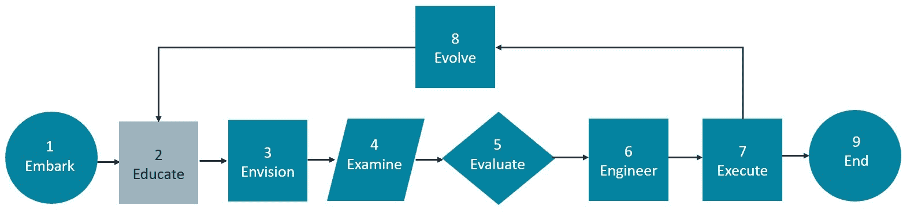
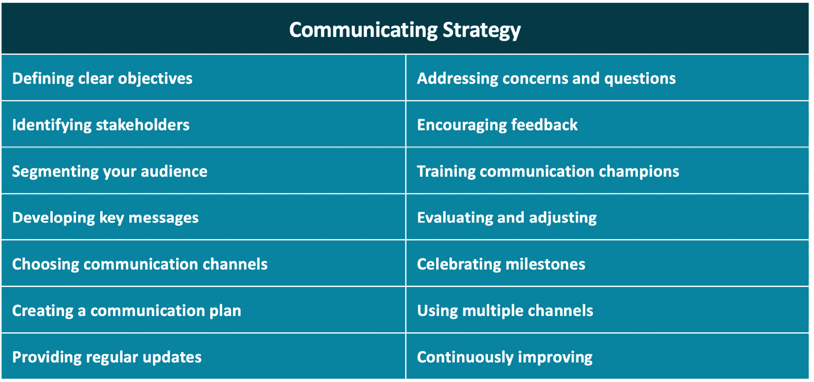
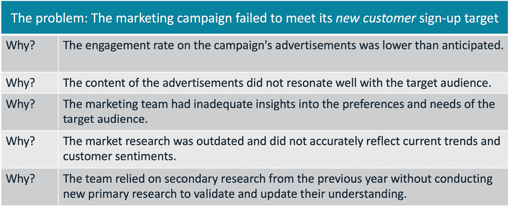

# 第四章：通过价值流管理推动改进

“完美无法达到，但如果我们追求完美，我们可以抓住卓越。” —— 文斯·隆巴迪，美国橄榄球名教练之一

在一个商业效率和价值创造不仅是目标，而是全球竞争格局中生存战略的时代，理解和实施 **价值流管理（VSM）** 至关重要。当你的组织采纳 VSM 时，持续的转型之旅将推动你的组织更接近那个永远难以捉摸的完美目标。无论你担任什么角色，VSM 在促进个人和组织持续成长方面都具有巨大的意义。

那么，为什么这种不断追求卓越如此重要呢？如果没有 VSM 的迭代和适应性方法，组织将面临停滞和衰退的风险。忽视持续改进和战略优先排序的原则，可能导致低效、资源错配、员工倦怠，并最终降低质量和客户满意度。将 VSM 作为一种持续的演化路径，可以确保每一步都朝着更高的价值、效率、质量和客户对齐迈进。

本章作为开始 VSM 转型之旅的实用指南。在深入细节之前，澄清一些潜在的误解是至关重要的。VSM 不是一个新概念，也不仅仅是一套工具。最初由精益实践者开发，VSM 是一种方法论，采用价值流映射概念、分析和 **改善（Kaizen）**（为了更好的改变）规划。VSM 的目标是识别并优先改进机会，最终以最短的可持续交付时间为客户提供最高质量的最大价值。

接受这一持续改进过程能够使你与众不同，成为领导者和创新者，推动你迈向卓越运营、增加利润和提升客户满意度。

本章涵盖的主题包括以下内容：

+   为价值流精通奠定基础

+   使用 E9 方法论定义 VSM 过程

+   采用 VSM 平台

# 为价值流精通奠定基础

本章中，我们将向你介绍 VSM 原则和实践，这些原则和实践为精益敏捷改进奠定基础。VSM 是一种强大的方法论，不仅限于软件产品开发和交付活动；其原则和实践在任何工作流或流程中都具有普遍适用性。

此外，VSM 在将软件交付能力的投资与其他企业变革举措对齐方面起着至关重要的作用，确保优先事项与企业目标和客户需求保持一致。我们将探讨 VSM 如何作为一种持续且压力较小的业务转型战略，讨论其目的和目标。

VSM 使组织能够优化流程，并采用精益方法消除约束、延迟和浪费等低效因素，从而提升价值创造和竞争力。除了私营部门，政府机构和非营利组织也面临与商业同行相同的变化力量，推动它们加速精益敏捷转型。业务（或使命）敏捷性、数字化颠覆、全球化、日益增加的网络威胁、老化的遗留系统以及对技术的日益依赖等因素，都是政府机构和私营企业同样关心的问题。

VSM 的核心在于持续评估价值流绩效，优先进行有影响力的改进，以加速以客户为中心的交付、提升质量并降低成本。我们的**九步 VSM 方法论**将这一方法付诸实践，促进持续的业务演变并保持竞争优势。我们独特的 VSM 方法结合了敏捷原则和实践，以提高组织的灵活性，详细内容将在以下小节中讨论。

## 采用精益敏捷概念

VSM 基于精益原则，是通过价值流映射和持续改进（Kaizen）规划技术驱动生产力的有效方法，促进基于价值的不断改进。敏捷原则增强了 VSM，通过跨职能团队、协作和问责机制扩展了其效果，同时还采用了迭代开发和增量交付方法。

在实践中，VSM 战略性地优化流程，以最大化价值交付并最小化浪费，确保组织在整个产品生命周期中保持以客户为中心的焦点。此外，VSM 工具提供了清晰的流程快照，增强了透明度，并支持实时分析。

消除浪费是 VSM 的核心，旨在提高效率，改善工作流程、质量和成本效益。此外，解决阻碍流程的瓶颈加速了产品交付并消除了浪费。

VSM 在战略决策中发挥指导作用，始终将客户需求置于首位。VSM 与客户需求保持一致，提升净推荐值（NPS），体现其对客户中心理念的承诺。强调持续改进，VSM 提倡持续评估，以灵活应对不断变化的业务需求、市场动态和客户需求。最终，VSM 体现了一种以价值为驱动的思维方式，塑造了组织为实现持续成功而采取的方法。

## 了解价值流的分类

跨价值流组织工作对于开发以产品为中心的工作流至关重要。**价值流**关注精简操作、最大化吞吐量、避免瓶颈和消除浪费。价值流中的**流程**（如产品开发、订单录入和销售）将输入转化为增值输出。**活动**汇总信息以进行绩效报告，而**任务**则定义工作内容和交付成果。*图 4.1* 展示了价值流的工作分类法，这对于有针对性的改进和提升效率至关重要。

图 4.1 – 价值流工作分类法

这一定义对于价值流分析和优化至关重要。**流程**概述了价值创造的流动，而**活动**有助于监控和决策。通过绘制流程和活动，可以识别低效环节，确保每一步都能创造价值。在**任务**层面建立标准化工作流程，保持一致的表现和质量。这种理解使得可以进行有针对性的改进，提升效率和效果。

现在你已经理解了 VSM 的基础工作原理，我们将在以下小节中探讨 VSM 原则在推动组织卓越和价值交付中的战略意义。

## 应用 VSM 原则

VSM 提供了更深入的见解，帮助我们了解跨互联价值流的流程。通过系统化的方法，它能够精确识别、优先排序并解决最具影响力的改进机会，从而确保为最佳价值交付提供全面的战略。

最大化价值的重点不仅仅是在单个过程或价值流的效率上，还包括识别和解决可能妨碍价值交付的流程瓶颈，确保在整个产品生命周期中持续提供价值。

价值流的主要目的

作者理查德·克纳斯特（Richard Knaster）表示：“*虽然价值流是精益方法的重要组成部分，但通常有人误认为其主要目标是提高效率。这并不令人意外，因为消除浪费是精益方法中讨论得最多的方面。然而，事实远非如此。每个价值流的目标是以尽可能高的质量和客户满意度，在最短的* *可持续交付周期*内交付最大价值*。”

借鉴精益和敏捷的基础洞察，以下一套指导原则有助于推动任何以价值为驱动的组织的业务成果：

+   **整体系统优化**：通过系统思维，端到端的过程和活动常常被评估，以通过产品和服务创造、改进并交付新的客户价值。

+   **以客户为中心**：客户是决定价值的最终裁判，他们为产品组合的价值流创造和维护的解决方案定夺价值。支持与客户的愿望、需求和优先事项一致的举措。确保客户体验在组织的行动和态度中始终是首要任务。

+   **价值流** **洞察**：绘制端到端的客户旅程，揭示整个组织中的瓶颈和浪费。客户旅程图提升了理解，改善了用户体验，统一了团队，指导了决策，增加了满意度，发现了机会，优化了资源，并通过主动解决问题提高了客户的留存率。

+   **需求驱动**：精细调整组织流程，以迅速响应客户需求，优化库存，并提供高质量的价值。

+   **流动优化**：专注于简化价值交付，解决瓶颈、延迟和过多的**在制品**（**WIP**），以减少成本高昂的约束，并加速产出。

+   **浪费** **消除**：学会发现并解决明显和隐性的低效问题，以培育精益的、以价值为驱动的环境。

+   **追求完美**：采纳持续改进的思维方式，在每次迭代的回顾与敏捷团队的检查和适应活动中，不断向最佳操作前进。

+   **组织** **对齐**：促进组织各个层级之间的尊重与共同目标，确保全员共同致力于卓越的价值交付。

虽然这些原则是 VSM 的基础，但它们的真正力量在于当战略性地实施时，可以改善价值交付和市场反应时间。然而，如果我们没有在整体交付系统的影响背景下考虑改进机会，就可能低效地使用时间和资源。换句话说，我们必须通过运用系统思维来避免代价高昂且无效的*局部优化*。

在接下来的章节中，我们将探讨局部优化的挑战——在没有系统思维的情况下行动及其影响。

## 使用 VSM 优化价值流

VSM 是一种综合方法，旨在通过识别和优先改进、消除浪费和克服瓶颈来增强基于价值的组织流动。其核心目标是通过系统地解决低效问题、提高质量、加速交付并降低成本，加速客户价值的交付。这一转型方法依赖于指标和度量来评估进展，促进持续改进，并支持数据驱动的决策制定与瓶颈识别。

在介绍我们的九步 VSM 方法之前，我们首先需要理解如何运用系统思维，避免局部优化。

## 避免局部优化的陷阱

本地优化发生在组织优先考虑单个改进机会时，而不考虑更广泛的系统。它通常源于不规范的实践，其中所有事项在资源分配中被视为平等，或者高管允许个人主导优先级，而没有采用**系统思维**方法。本地优化忽视了从客户导向和增值的角度看，浪费和制约因素，导致对整体表现产生意想不到的负面影响。相比之下，系统思维方法旨在通过理解系统的互联部分和反馈回路来优化整个系统。

不幸的是，组织通常将注意力集中在改进单个部门或价值流活动上，这可能不会在更广泛的交付过程中产生显著的改进。例如，针对特定活动或设备提高吞吐量的过程改进，如果该活动或设备不是系统中的瓶颈，可能不会产生什么益处。在这种情况下，资源被浪费，瓶颈形成，过多的 WIP 积累，妨碍了整个价值流的流动。VSM 实践者强调对业务流程的全面评估，以确保与客户期望对齐，并避免误导性的努力。

绘制客户价值流，特别是在孤立的组织中，有助于识别对交付价值和减少组织浪费至关重要的流。VSM 强调将组织目标以价值流的形式展现出来，以促进对齐并减少协调成本。现在，让我们来探索 E9 VSM 方法论。

# 使用 E9 方法论定义 VSM 过程

VSM 提供了一种全面的方法，帮助可视化操作并增强价值交付，优先优化整个价值流，以便始终如一地关注客户价值。*图 4.2*展示了**E9 VSM 过程**，提供了一种持续改进价值流的全面方法。

虽然 E9 以线性方式呈现，但该方法像一个平行活动网络，步骤之间存在反馈和迭代。此外，**结束**状态活动考虑了产品最终退役及生命周期管理规划的重要性。

图 4.2 – E9 VSM 过程

E9 是我们 VSM 改进方法的九个步骤的助记符：**开始**、**教育**、**设想**、**检查**、**评估**、**工程化**、**执行**、**演化**和**结束**。让我们更详细地了解这九个 VSM 步骤及其在当代商业实践中的意义。

1.  **开始**：以承诺和清晰的目标开始 VSM 之旅。

1.  **教育**：指导团队理解精益敏捷和 VSM 原则。

1.  **设想**：定义与战略目标对齐的未来状态愿景。

1.  **检查**：绘制当前状态的价值流过程和指标。

1.  **评估**：诊断流程，识别低效和浪费。

1.  **工程**：制定策略并开发 Kaizen 计划，以实现所期望的改进。

1.  **执行**：遵循 Kaizen 计划来实施商定的变更。

1.  **演变**：通过反复迭代来优化流程并维持改进效果。

1.  **结束**：为产品或服务实施有效的生命周期结束支持程序。

E9 VSM 方法，虽然针对特定情况进行了调整，但自 2000 年代初以来，已在制造、医疗保健、销售、服务、技术和精益办公环境等多个行业中证明了其有效性，提升了这些行业的全球竞争力。值得注意的例子包括 Don Tapping 等人关于 VSM 的系列书籍 5,6,7。

在数字创新的时代，利用技术改进产品、服务和流程的必要性不容低估。

在打下这一基础后，让我们进一步探讨价值流优化的重要性。

## 1. 启动—开始旅程

*图 4.3，启动* 是 E9 VSM 方法的第一阶段，明确承诺和目的，启动这段旅程。它从确保获得领导支持和组建 VSM 团队开始。

图 4.3 – 启动：开始旅程

VSM（价值流管理）计划的开始不仅仅是一个代表某一时刻的图标，而是代表了一系列必要的活动，这些活动旨在明确那些能够证明所投入的时间和资源合理的目标与任务，确保获得高层支持，并且确定将引导这一工作的 VSM 团队。这些活动将在接下来的子章节中进行描述。

### 确定 VSM 的商业合理性

实施 VSM 计划可以为组织带来显著的收益。然而，确保获得高层支持和资金需要一个结构良好且有说服力的商业案例。虽然我们无法提供专门为您的组织量身定制的商业合理性，但我们已在*图 4.4*中整理了支持 VSM 计划的商业理由表，列出了为什么高层应考虑支持和资助此计划。

图 4.4 – 支持 VSM 计划的商业理由表

展示强有力的**投资回报率**（**ROI**）以及与战略优先事项的对齐，能够增加获得高层支持和资金的机会。如果采用逐步融资策略，先验证其效益，再进入下一个最优先的领域，可以更快速地启动并逐步推进。保持最初向高层请求的资金较小，建立信任和信心，并在适当时扩大规模。正如敏捷实践者所知，最好的前进道路是通过迭代和渐进式的变更，而不是“大爆炸”式的变革。

现在，我们已经简要探讨了启动 VSM 项目的好处，接下来让我们讨论如何获得领导层的支持与赞助。

### 建立领导支持与赞助

要说服高管为 VSM 项目提供资金支持，你需要在高管层中找一个人来担任赞助人并资助该项目。通常需要收集支持数据、汇编并展示案例研究、制定实施计划，并明确改进的关键领域。

VSM 为组织管理变革提供了一种战略方法。尽管精益（Lean）和敏捷（Agile）实践者都倡导持续改进，但要实现这一愿景，需要高管的支持、积极参与和资金投入。说服这些领导者投资改进工作需要一种结构化的方法，并提供有力的论据来说明项目的好处。

在接下来的子章节中，我们将探讨如何获得高管和利益相关者的支持。

### 与战略和运营目标对齐

为了引起高管的兴趣，最好将你的 VSM 项目与组织的战略目标对齐，如*图 4.5*所示。

图 4.5 – 获得高管赞助

讨论 VSM 如何成为实现他们关键目标的推动力。高管们更可能支持那些直接贡献于最终成果的项目。此外，识别你组织中影响 VSM 项目批准与支持的关键利益相关者。这些人可能包括高级高管、部门负责人、有影响力的经理以及其他内部或外部的利益相关者。

### 传达潜在利益并争取支持

准备一个具有说服力的陈述，概述 VSM 的潜在影响，量身定制以适应你组织的需求，正如前面讨论的那样。运用数据、度量标准和实际案例研究，展示 VSM 如何带来变革性的改变。解答高管们最可能提出的基本问题：“它能为我们带来什么财务利益？”

提供成功实施后可能带来的成本节约、收入增长或其他财务利益的估算。高管们更倾向于支持具有明确投资回报率（ROI）的项目。然而，在构建案例时，要始终注意当地的优化措施，因为它们可能会阻碍你实现预期的 ROI。

与关键利益相关者进行集中讨论，解答他们的问题和顾虑。根据他们的需求调整你的信息，展示你对他们关注点的深刻理解，以增强你的说服力。

最后，应确定能够向高管推广 VSM 项目的内部倡导者或支持者。这些倡导者是组织内有影响力的人物，热衷于 VSM 的好处。他们的信任与承诺能在争取项目支持方面产生重大影响。

### 建立信任和承诺。

为了争取 VSM 倡议的支持，需让同行参与决策，包括人员和资源、时间表及范围的安排。分享来自已受益于 VSM 的组织的客户成功故事。**价值流管理联盟**（**VSMC**）提供了许多资源，供你的利益相关者和赞助商阅读，以获得更多信息并建立信任。

提议一个试点项目可以有效地展示倡议的成效并缓解顾虑。坚持不懈和主动的风险管理进一步获得高层支持和资金。我们可以通过从较小但高回报的 VSM 项目入手，锁定组织中的早期采用者，来建立这些成功的基础。最终，随着利益变得显而易见，流程逐渐深入人心，甚至那些落后的成员也会支持并参与未来的 VSM 项目。最终，VSM 将成为一种生活方式，并成为组织文化的核心部分。

在从组织获得资金支持后，是时候建立 VSM 团队来领导以下小节所述的工作了。

### 确定 VSM 团队。

VSM 团队的组成可能会根据组织的规模、行业和目标等因素有所不同。然而，一些特定的关键角色和特质通常对于成功的 VSM 倡议至关重要：

+   **高层赞助人**：一位高级领导者，支持 VSM 倡议，确保资源到位，并确保与战略目标的一致性。

+   **VSM 领导/经理**：负责整个倡议，具备精益-敏捷实践和业务流程改进的专业知识。

+   **价值流架构师**：设计并调整业务战略、流程和能力，以实现目标，充当业务与 IT 利益相关者之间的桥梁。

+   **流程** **负责人**：管理特定的价值流流程，实施变革，监控绩效，并意识到他们在需要协作以实现共同目标的复杂业务系统中的角色。

+   **数据分析师**：收集、分析并解释与价值流表现相关的数据，为改进提供见解。

+   **跨职能** **团队** **成员**：带来多样化的专业知识，以解决价值流中的低效问题。

+   **精益-敏捷** **教练**：引导团队有效地应用精益和敏捷原则。

+   **变革管理专家**：管理对变革的抵制，确保新流程的采纳。

+   **沟通** **专家**：促进利益相关者之间的有效沟通。

并非每个组织都能为每个角色安排专门的人员，因此团队成员通常承担多个职责。此外，VSM 团队的规模和组成会随着计划在不同产品线或价值流中推进而发展。团队的演变需要考虑特定行业、它们的独特需求和挑战。例如，生产过程、供应链管理、机器人技术、自动化和质量控制等方面的专业知识在制造业中至关重要。

获得赞助、资金并组建团队后，我们的 VSM 方法进入教育、沟通和变革管理阶段——这是克服变革阻力的关键，接下来的小节将描述这一过程。

## 2. 教育 - 培训、沟通和管理变革以实现成功

在*VSM 第二步*，*图 4.6 - 教育*中，我们讨论了实现 VSM 计划成功的关键组成部分。对精益-敏捷和 VSM 原则的全面培训是为即将到来的变革做准备的必要条件。

图 4.6 - 教育：培训、沟通和管理变革以实现成功

然而，单单教育是不够的。有效的沟通同样至关重要，能够传达变革背后的原因及其好处，解决利益相关者的顾虑或恐惧。此外，变革管理实践在管理阻力和确保组织顺利过渡到 VSM 中起着重要作用。

### 教育团队理解精益-敏捷和 VSM 原则

教育团队理解精益-敏捷和 VSM 原则对成功至关重要，有助于在整个组织中实现一致性和理解。首先介绍精益-敏捷的关键概念，如持续改进和以客户为中心。类似地，让团队熟悉 VSM 的原则，强调端到端的价值流提升。

如*图 4.7*所示，商务培训课程可以是非正式的。较小的培训课程通常更受欢迎，并且更有效地吸引参与者并保持兴趣。

图 4.7 - 商务培训课程

这些培训课程提供了共同的语言和思维方式，促进了跨职能边界的合作。让我们从精益-敏捷原则开始，探讨培训的范围。

### 教授精益-敏捷原则和实践

教授精益-敏捷原则对 VSM 之旅的成功至关重要。精益-敏捷方法优先考虑适应性、效率和以客户为中心，强调通过减少浪费并及时交付价值来推动持续改进。

*第八章**，实施基础精益-敏捷解决方案团队（BLASTs）*，将描述团队如何在日常工作和解决问题的活动之间切换。换句话说，我们将深入探讨团队成员如何在精益和敏捷的工作模式之间无缝过渡。

但让我们在这里快速介绍这些概念。精益原则，包括客户价值、价值流图绘制和持续改进，对于通过我们的产品和服务持续高效地交付客户价值至关重要。在敏捷中，重点是工作项的细化、迭代计划和增量开发周期（也称为**时间限制** **开发** **周期**）。这些实践促进了协作与创新，使得组织能够更好地响应客户需求。通过理解这些原则，团队能够有效地拥抱 VSM 的概念和实践。

### 教授 VSM 概念

教授 VSM 概念对于旨在提升端到端客户价值流的组织至关重要。作为精益-敏捷方法论的核心组成部分，VSM 专注于高效交付客户价值。企业培训应优先进行全面的 VSM 九步法教学，涵盖其细微差别。

虽然 VSM 建立在基础精益概念之上，但培训必须超越这些内容。培训应从定义每个 VSM 步骤的目的开始，并强调确定理想化客户价值流的重要性，作为组织绩效改进的指导原则。

培训应专注于跨整个客户价值流进行价值流图绘制，以确保采取全面的方法并防止局部优化。通过差距分析，参与者可以识别和优先考虑具有影响力的改进措施，涵盖从低资源到高成本的举措，后者需要提交提案并获得批准。

最终，VSM 培训的目的是使团队具备有效应用 VSM 原则的知识和技能，从而推动组织价值流的实质性改进。

#### 辅导策略

培训和辅导对于 VSM 项目的成功至关重要，确保 VSM 团队掌握必要的技能和知识。企业 VSM 培训计划应包括沉浸式工作坊、认证支持以及实践体验学习。这些方法使团队能够深入理解 VSM 的原则和实践，增强他们在可视化、分析和改进价值流方面的能力。

然而，仅有知识是不够的，应用才是关键。辅导在这方面发挥着至关重要的作用。商业辅导要求具备积极倾听、同理心和提供建设性反馈的能力。

有效的提问技巧能促进被辅导者的批判性思维和自我发现。教练还会引导个人制定可行的计划，并对其执行所期望的变革负责。通过不断改进教练技能并营造协作氛围，教练能够促进自我意识、个人成长以及在商业环境中的表现提升。培训和辅导对在组织内推广 VSM 实践、推动有意义的变革和改进至关重要。

#### 沟通变革

在实施任何项目、计划或 VSM 倡议时，确保有一个明确的沟通策略至关重要。这一策略确保所有相关方，从员工到利益相关者，都能充分了解并准备好迎接即将到来的变化。为了有效定制你的沟通策略，考虑你倡议的独特需求并相应调整。记住，改进现有计划通常比从头开始要容易。

让我们快速了解一下支持沟通策略所涉及的工作范围。

1.  **明确目标**：为你的沟通策略设定具体的目标。

1.  **识别相关方**：识别所有对你的沟通工作有兴趣的方。

1.  **细分你的** **受众**：根据相关标准将目标受众划分为不同的群体，以便更有效地定制你的沟通内容。

1.  **制定关键消息**：制定简洁、有影响力的消息，确保与目标一致并支持目标。

1.  **选择** **沟通** **渠道**：选择最有效的平台和媒介来接触你的受众。

1.  **创建沟通计划**：构建一个全面的策略，明确任务、时间表和责任。

1.  **提供** **定期更新**：通过及时的进度报告让相关人员保持知情。

1.  **解决问题和疑问**：保持迅速行动的倾向。及时且透明地回应询问和问题。

1.  **鼓励** **反馈**：征求相关人员的意见，以提高沟通的有效性。

1.  **培养沟通倡导者**：赋予个人权力，使其能够为你的信息辩护并有效传达。

1.  **评估和调整**：评估沟通策略的表现并进行必要的修改。

1.  **庆祝里程碑**：庆祝小小的胜利能提升团队士气和动力。公开表彰成就，促进感激、参与和生产力。

1.  **使用** **多种渠道**：尝试不同的沟通方式，例如电子邮件、社交媒体、短视频、新闻简报和面对面的会议，来有效地接触并吸引更广泛的受众。

1.  **持续改进**：根据反馈调整和优化你的方法，确保清晰性、参与度以及与组织目标的一致性。

*图 4.8* 总结了沟通策略的要素，用以制定全面的沟通计划。

图 4.8 – 沟通策略

通过遵循这些步骤，您可以确保您的沟通工作有效传达即将发生的变更的重要性，并在整个过程中与利益相关者保持互动。

既然我们已经涵盖了有效沟通的要点，现在让我们将重点转向变更管理策略。变更管理对于应对变革过程中的复杂性和最大化实现预期成果的机会至关重要。

#### 实施变更管理策略和最佳实践

变更管理对于引导组织顺利过渡、减少干扰和阻力至关重要。其目标包括解决员工担忧、最大化采纳、减少干扰、确保一致性和优化利益实现。

以下是实现这些目标的有效方法：

+   **解决担忧**：识别并迅速解决员工的担忧，以减少阻力并为变更创造支持性环境

+   **最大化采纳**：确保员工理解变更的原因，并积极参与其实施，培养员工的主人翁精神和承诺

+   **减少干扰**：仔细规划和排序变更，以最大限度地减少对正在进行的操作和工作流的干扰

+   **确保一致性**：保持沟通和信息传递的一致性，确保所有员工都能及时准确地接收到关于变更的信息

+   **优化** **利益** **实现**：专注于迅速和有效地实现变更的预期利益，以达到组织目标

尽管有结构良好的沟通和变更管理策略，仍可能存在对变革的抵制。采取积极的措施，包括识别抵制来源并与抵制的个人或团体互动，对于解决问题并促进与拟议变革的对齐至关重要。

现在，让我们深入探讨如何在我们的 VSM 计划中管理变更的实际过程。

### 变更管理

了解变更管理的关键框架对于有效地应对组织过渡至关重要。以下是两个经过验证的基本变更模型：

+   **约翰·科特的八步过程**：创造紧迫感是启动变更的关键第一步。他在其经典著作《领导变革》中列出了更多步骤，包括建立联盟和愿景、消除障碍、创造短期胜利、在变革的基础上继续发展，以及将变革嵌入新的结构中。这个八步过程要求耐心，特别是在初期关键步骤中，需要领导者高度参与。

+   **海厄特的** **ADKAR** **过程**：Jeff Hiatt 提出的 Prosci ADKAR 五步模型包括**意识**、**愿望**、**知识**、**能力**和**强化**（**ADKAR**），并贯穿于各个阶段：准备、设计、实施和可持续性。

这两种变革管理框架提供了一种结构化的方法，确保平稳过渡并最大化成功结果的可能性。*第十一章**《实施组织转型战略》*将进一步讨论这两种变革管理过程。理解它们将为有效的 VSM 变革管理举措奠定基础。

以下小节将讨论利益相关者的参与，这是 VSM 举措中成功变革管理的关键组成部分。

#### 在 VSM 举措中吸引利益相关者

利益相关者的参与对任何 VSM 举措的成功至关重要。利益相关者包括员工、客户、供应商以及受举措影响的其他人。为了有效地吸引利益相关者，你需要做到以下几点：

+   确定并绘制关键利益相关者的图谱，考虑他们的利益和潜在贡献

+   根据每个利益相关者群体的具体需求和优先事项调整沟通方式

+   在规划和决策阶段尽早让利益相关者参与，以促进他们的归属感和承诺

+   定期更新进展情况，鼓励反馈并公开解决问题

+   将利益相关者的意见纳入变革评估中，以提供更有效的解决方案

成功的利益相关者参与有助于建立强大的关系，确保与举措目标的一致性，并促进实现预期结果。接下来，我们将探讨 VSM 过程中的“设想”步骤。

## 3. 设想 - 设计理想的未来状态

传统的 VSM 方法论通常提倡在设想未来状态之前，先创建当前状态的价值流图。然而，这种做法可能无意中加剧现有低效问题。相反，我们建议首先设想为向客户交付产品或服务并在其生命周期内提供支持所需的端到端活动。通过这样做，重点是识别最有效的交付路径，最大限度地减少约束和浪费。这个步骤在*图 4.9*中展示。

图 4.9 - 设想：设计理想的未来状态

在这一阶段，避免陷入过于详细的价值流映射和绩效指标中。目标是创建一个理想化的价值流图，避免不必要的复杂性和低效。

通过从一开始就优先考虑简洁性和效率，我们可以更好地识别改进机会，并优化价值交付流程，从而形成理想化的价值流图。

### 定义理想化的客户价值流

定义**理想化的客户价值流**为转型设定了方向。首先，构想出完美的价值流——没有约束和浪费。与团队和利益相关者一起，想象出最优的客户体验，并思考如何使流程持续地提供这一体验。聚焦于高层次的理想能够激励团队，并为改进计划提供明确的方向。

### 设置战略目标和对齐

战略目标如同变革的北极星。因此，在制定理想化的价值流后，与战略目标对齐是下一个步骤。识别组织目标，从提升效率到扩大市场覆盖， 并将其与理想价值流的组成部分联系起来。这种对齐将你的 VSM 计划与更大的目标挂钩，推动成功与转型。

### 为价值流制定愿景和使命

愿景和使命声明对战略规划至关重要。在与高层赞助商合作时，定义一个简明的使命声明，概述价值流优化的具体目标和方法。接着，制定一个愿景声明，深入探讨 VSM 计划的更广泛目标，并将其与组织的使命和价值观对齐。这些声明能够激励团队，并提供共同的目标感。

### 建立度量标准和成功标准

衡量进展是价值流管理（VSM）的核心部分。在定义并对齐理想价值流与战略目标后，建立度量标准和成功标准作为基准。识别与战略目标相关的**关键绩效指标**（**KPIs**），如交付时间、周期时间和客户满意度。定期回顾这些 KPI，以追踪进展并识别改进空间。

我们可以通过优先考虑简化和效率来识别改进机会并简化价值交付过程。这种方法能够形成理想化的价值流图，为转型奠定基础。

掌握价值流映射技术的实际知识虽然有用，但并非分析组织价值流和交付能力的当前与未来状态的必需条件。然而，我们在步骤 2 中提供的概述应为你提供了基本的知识，帮助你理解关键概念。对于那些希望深入了解价值流映射机制的人，作者塞西尔·鲁普在其前作《通过价值流管理驱动 DevOps》中有广泛讨论这一主题。3 作者史蒂夫·佩雷拉也在其《流程工程》一书中详细指导读者这一实践。*进一步阅读*部分还列出了几本关于此主题的知名书籍。4,5,6,7,8,9

## 4. 审视——评估当前状态并识别低效环节

在设计理想状态后，下一步是*审查* - 如*图 4.10*所示，这涉及到审视当前情况，并全面分析现有的流程和指标。通过这项工作，我们可以诊断低效和浪费，为战略性改进铺平道路。

图 4.10 - 审查：评估当前状态并识别低效

本阶段评估组织当前的流程和指标。将这些信息与理想化的价值流进行对比，帮助发现改进机会，并直观展示改进如何影响价值流的流动。

在这里，你将发现当前状态映射的重要性，并探索用于映射价值流的工具和技术。此外，我们还涵盖了收集流程数据和指标的方法，以帮助你理解组织的工作流。

我们将讨论进行根本原因分析，以揭示潜在问题，并探讨优先改进领域的策略。以下部分提供了评估组织当前状态所需的知识和工具，为有意义的 VSM 改进奠定基础。

### 审查当前状态的流程和指标

值流图的过程传统上包括几个关键步骤，如*图 4.11*所示，指导着对价值流的审查和评估。

图 4.11 - 评估：通过值流图评估低效和浪费

值流图是一种精益改进技术，旨在定义并展示从请求到客户价值交付的整个产品或服务过程中相互关联的步骤。

理解价值流如何为软件开发创造价值可能非常复杂。与精益制造工厂中能明显看到的低效不同，软件开发中的低效并不那么显眼。例如，工厂车间上方的天桥可以让你观察制造价值流，看看生产线是否变慢或停滞。

值流图是数字和知识型工作价值流的“天桥”，尽管它在展示任何类型价值流的流动效率指标时也非常有用。它可以帮助你看到整个价值流，识别瓶颈和延迟。然而，低效带来的影响是相同的：增加浪费和成本、生产力下降、工人超负荷、不确定性增加，以及质量下降。

价值流映射从产品或服务消费开始，向上游延伸，涵盖供应商流程和物料流动。确认支持客户体验的关键活动，并消除不必要的活动。收集每个过程的绩效指标，以建立基准，并识别诸如过度生产和缺陷等浪费。

随后，分析各个过程，以识别瓶颈和低效，并制定改进计划。创建未来状态图以概述优化后的流程。制定实施计划，获取支持，并执行变更。持续监控确保绩效与预期一致，同时识别进一步的改进机会。

这些步骤提供了全面的评估，为 VSM 中的有意义改进奠定基础。它们在精益实践者中被广泛采用，用于弥合当前状态与理想未来状态之间的差距。值得注意的是，价值流映射过程从交付开始，向上游延伸，这是我们将在下一小节中探讨的实践，旨在理解其背后的原理。

### 探索反向价值流映射——从客户开始，向后追溯

从价值流映射的“终点”——客户——开始，虽然看起来不常规，但这一战略性做法是有道理的。通过从客户的角度出发进行价值流映射，可以识别哪些步骤增加了价值，哪些则没有。此外，这种做法还保持了对定义每个前序（上游）步骤必须交付的输出的关注，以支持当前正在调查的活动。这种以客户为中心的方法确保了价值流改进直接惠及最终用户。

当我们逆向追溯（上游）价值流，仔细审查每个过程时，我们自然会发现低效和浪费。对活动的这种关键审视使我们能够精细调整流程，犹如调校高性能引擎。

此外，这种反向价值流映射方法促进了持续改进的文化，这是精益-敏捷原则的基石。通过不断寻求改进，我们保持了高效、精简的价值流，始终如一地提供卓越的客户价值。

尽管这种方法不常规，但反向价值流图（reverse value stream mapping）通过同时考虑产品和客户交付流，确保了效率、质量和更好的协作。

## 5. 评估 – 评估低效和浪费

随着我们深入通用 VSM 方法论，我们到达了*VSM 第 5 步，评估*，这一点在*图 4.12*中得到了突出显示。这个关键阶段对于优化价值流至关重要，目标是提高效率、质量和客户满意度。

图 4.12 - 评估：评估低效和浪费

### 评估当前状态图中的低效环节

在开始改进工作之前，全面了解现有流程至关重要。当前状态图以视觉方式呈现了目标改进的价值流中的价值创造过程。在这个评估阶段，我们会仔细审查这些图表。

这个评估过程包括仔细审查价值流中的每个步骤、输入和输出。通过倒推，我们质疑每个任务的必要性，旨在识别潜在的低效和浪费。

例如，我们分析前期任务是否交付了所需的输入，或者是否造成了瓶颈。我们调查工作是否过多或过少，并评估所提供的材料和信息的质量。

这个详细的评估揭示了价值流中低效和浪费的根本原因，为有针对性的改进工作奠定基础。这些低效可能表现为不必要的步骤、延误、冗余和过度生产。

### 识别瓶颈和限制

正如你在*第三章*《建立精益流以提高生产力》中学到的那样，精益中的浪费概念包括八类非增值工作。这些传统的浪费类别是**运输**、**库存**、**运动**、**等待**、**过度生产**、**过度加工**、**缺陷**和**人才未充分利用**。我们常常发现我们的瓶颈和限制源于这八类浪费。这些瓶颈阻碍了工作流，导致延误、混乱和成本增加。

值流图的目的是揭示那些破坏顺畅工作流程的瓶颈和限制因素。识别并解决这些瓶颈变得至关重要，以便优先考虑改进工作。定位那些工作积压的具体流程点，可以集中精力缓解这些瓶颈，确保工作流的平衡。

### 进行根本原因分析

**根本** **原因** **分析**提供了解决问题的工具，帮助我们识别问题的实际原因，而不仅仅是解决表面症状。通常，一个问题会有多个原因，但关键是避免假设和逻辑陷阱，从效果追溯到与原始问题相关的根本原因。

**五个** **为什么**是一种经过验证的问题解决技术，用于探索因果关系。丰田公司开发并完善了这一过程，作为其问题解决训练的关键组成部分。被誉为**丰田生产系统**（**TPS**）之父的大野耐一，在他的书《丰田生产方式：超越大规模生产》中解释了五个为什么的技术。他说：“*通过重复问五次为什么，问题的本质和解决方案会变得清晰明了。*”*图 4.13*展示了这一技术如何揭示问题的根本原因。

图 4.13 – 失败的市场营销活动的五个为什么问题解决法

五个为什么过程通常包括以下步骤：

1.  **识别** **问题**：明确界定需要解决的不良结果。

1.  **问，“为什么？”**：询问问题为何发生，并记录第一个答案。

1.  **重复**：对于每一个答案，持续询问“为什么？”，以深入了解更具体的原因。

1.  **追寻** **根本原因**：理想情况下，在问五个为什么之后，揭示根本原因或原因。

1.  **开发** **解决方案**：进行头脑风暴并实施解决方案，以消除或减轻已识别的根本原因。

其他根本原因分析技术，如**鱼骨图**（石川图或因果图）、**故障模式与影响分析**（**FMEA**）以及**帕累托分析**，在不同的情境和行业中通常会被使用。选择哪种技术取决于问题的复杂性以及发生的具体背景。

### 优先考虑改进领域

价值流中的所有低效和瓶颈并不具有相同的影响。因此，评估阶段的最后一步是优先考虑改进领域。通过考虑严重性、对价值流的整体影响以及资源需求等因素，我们可以制定结构化计划来应对这些低效。请记住，作为一般规则，我们首先解决约束问题。但过度的成本和质量问题也可能决定更高的优先级。优先排序确保了努力和资源将集中于对影响最大的地方。

总结来说，*评估*阶段对于启动有意义的改进至关重要。通过仔细审视当前状态图、识别瓶颈、进行根本原因分析，并优先考虑改进领域，组织可以为精简优化的价值流奠定基础，从而有效地为客户提供价值。

我们现在准备进入*步骤 6，工程师*，在这个步骤中，我们将专注于改进的战略和战术方面，规划和优化将成为核心。

## 6\. 工程师 – 策略和规划改进

在我们通过 VSM 方法学的初始阶段，识别出最具影响力的改进领域后，我们现在从规划过渡到行动。

本小节将探讨工程策略和计划在改善组织价值流中的关键方面。该过程涉及系统化方法来识别、规划并实施变革，从而提高效率、减少浪费，并最终为客户提供更多价值。工程师步骤的位置在*图 4.14*中有所突出。

图 4.14 - 工程师：策略和规划改进

鉴于 VSM 项目可能会揭示出复杂且潜在成本较高的变更机会，因此在公司决策和资金流程中进行有效导航至关重要。精益 Kaizen 计划（或路线图）和预测是必要的，以证明投资的合理性，并且必须在预定的时间范围内展示切实的投资回报。

换句话说，仅仅设计出优越的产品和过程是不够的，如果我们没有在关键的机会窗口内抓住市场的注意力和需求。如果我们错过了这个窗口，竞争对手将会介入填补空白，我们的努力将付诸东流。

### 制定期望改进的策略和计划

制定改进策略和计划对于成功的价值流优化至关重要。这个阶段通过识别改进领域、定义明确的目标以及确立清晰的方向，为有影响力的转型奠定基础。一个结构良好的计划能够引导组织完成优化旅程，并确保改进目标的实现。为了有效地进行这一过程，我们已列出了建议的 VSM 变更计划要素，如*图 4.15*所示。

图 4.15 – VSM 变更计划元素

为了评估这些规划要素的有效性及其与目标的一致性，我们采用**SMART**方法，如下一个小节所探讨的那样。

### 设定改进目标

设定改进目标是任何价值流改进工作的基础。这些目标应该是**SMART**，即**具体的**、**可衡量的**、**可实现的**、**相关的**和**有时限的**。*图 4.16* 详细说明了 SMART 首字母缩略词中的每个改进目标。一个明确陈述的问题对于达成共同理解非常重要，它有助于明确需要实现的目标，并作为衡量进展和成功的基准。

图 4.16 – SMART 改进目标

VSM 改进计划不应仅仅停留在文字描述上，因为这将使审阅者很难完全理解提议的改动如何影响客户价值流的整体流动。因此，就像我们在记录当前价值流中的工作流动时所做的那样，我们需要创建一个未来状态的价值流图，展示工作、信息和物料在新环境中的流动方式。

### 制定未来状态价值流图

制定未来状态价值流图对于可视化改进路径至关重要。该图代表了在实施改进后，价值流的理想状态。它是你改进工作努力的蓝图。

未来状态的价值流图与之前讨论的理想化价值流图有所不同。理想化图设置了改进的目标，而未来状态图则专注于在时间和资源约束下可以实现的内容。它具体说明了工作、信息、物料流动，以及通过已完成的变更所带来的预期改进措施。

好消息是，未来状态的价值流图与当前状态图非常相似。由于我们已经在*第三章**《建立精益流以提高生产力*中讨论了价值流映射的话题，我们不会在本章中重新审视该过程。

### 识别潜在的改进和解决方案

识别潜在的改进和解决方案涉及到一个创造性的过程，即分析当前的价值流状态。像价值流映射和根本原因分析这样的技术有助于揭示优化机会，而头脑风暴会议和团队协作则为识别出的问题产生创新解决方案。

然而，在实施所有已识别的改进时，我们经常面临财务和资源的限制，尤其是在较大的价值流中。因此，评估提议的变更对我们以盈利方式为客户交付价值的影响至关重要。**约束理论**通过关注任何干扰工作流程的因素，尤其是那些阻碍我们实现**TAKT**时间的因素，帮助我们优先考虑机会——TAKT 时间是一个以客户为中心的度量标准，代表着在可用能力下满足客户需求的节奏。

工具、设备、材料、培训和信息访问的改进可以降低成本、提高质量，并提升客户满意度。平衡这些因素能够通过我们的产品和服务最大化价值交付。

如果在修复约束和消除高成本浪费之间有一个固定预算，你会如何决定？在他的书《*产品开发流的原则*》中，唐·雷因特森描述了一个经济模型，用于优先排序任务，这个模型叫做**加权最短工作优先**（**WSJF**）。10

### 使用 WSJF 确定改进优先级

WSJF 已在精益敏捷框架中流行开来，例如**规模化敏捷框架**（**SAFe**®），用于确定优先级。应用 WSJF 可确保资金分配到在最短时间内交付最大价值的任务，从而提供最佳的经济回报。

WSJF 是通过*相对的* **延迟成本**（**CoD**）除以相对工作持续时间来估算的。使用修改过的斐波那契数列（1,2,3,5,8,13,20）作为相对数值代替金钱简化了计算，并避免了虚假的准确感。大多数敏捷实践者都知道如何使用相对估算，这也是其中一个好处。工作规模提供了一个好的代理指标，因为很难确定一个改进项或功能的实现需要多长时间。

CoD 代表因延迟或未按时完成某项任务而导致的经济损失。CoD 包含三个参数：用户业务价值、时间紧迫性和风险减少/机会启用。将 CoD 除以任务规模可得出 WSJF。具有最高 WSJF 的任务是最需要做的任务。WSJF 方便地忽略了沉没成本，这是精益经济学的基本原则。

*图 4.17* 提供了一个表格和计算 WSJF 的指导方针。

图 4.17 – 使用 WSJF 确定优先级的表格

在接下来的子章节中，我们将概述 Kaizen（变革）计划的典型组成部分。

### 规划持续改进

实施一个跟踪最高 WSJF 改进提案的看板系统是一个好习惯。**Kaizen** 是一个日语术语，粗略地翻译为“变革为了更好”，强调持续改进的文化。

Kaizen 计划是持续改进哲学的核心，应该包含以下关键要素，以确保有条理、可操作的进展，朝着稳定的增量提升迈进：

+   **目标**：明确界定过程改进、减少浪费和提高生产力的具体、可衡量的目标

+   **范围和时间表**：详细说明计划的范围，涵盖相关流程或领域，并在考虑项目复杂性的情况下，制定现实的实施时间表

+   **团队组成**：组建一个跨职能团队，代表所有参与改进过程的相关部门

+   **当前状态分析**：进行全面分析，包括数据收集、工作流映射以及识别瓶颈或低效问题

+   **根本原因分析**：使用五个为什么或鱼骨图等技术来识别根本原因，对于制定有效的解决方案至关重要

+   **解决方案开发与规划**：头脑风暴并选择解决方案，制定一个行动计划，分配责任和资源

+   **预算** **和** **审批**：建立清晰的预算和审批流程，与组织的财务策略对齐，并获得关键利益相关者的批准

+   **实施与监控**：执行行动计划，密切监控时间表的遵守情况和解决方案的有效性

+   **评审和标准化**：评估结果与目标的对比，标准化成功实践，并记录教训以供未来参考

+   **持续改进周期**：建立定期审查流程和识别进一步改进的周期，以便实施

一个结构良好的 Kaizen 计划培育持续提升的文化，推动长期的运营卓越。

在进行持续改进时，区分 Scrum **回顾**实践和 Kaizen 计划非常重要。Scrum 侧重于在冲刺回顾中进行小规模、快速、渐进的变革，而 Kaizen 计划则擅长为敏捷团队规模化较大、更加复杂的变革。Kaizen 计划提供全面的评估和结构化的审批流程，能够与**精益** **投资组合管理**（**LPM**）战略很好地对接，优先执行和投资大规模项目。

一旦路线图确定，我们进入*第 7 步，执行*，在这里实施 Kaizen 计划，标志着我们优化价值流的愿景的实际实现。让我们深入探讨这些关键阶段，在这里，转型从构思转向实施，推动价值流的实际和深远变化。

## 7. 执行 – 实施变革和调整

如果我们没有成功执行已经制定的计划，那么到目前为止的所有工作都是没有意义的。这里，行动比言语更有分量。在这里，我们探讨了在组织内实施变革的实际步骤，确保您的改进计划与目标一致，并推动积极的结果。如*图 4.18*所示，我们在此执行我们的计划，将其付诸实践。

图 4.18 - 执行：实施变革和调整

并非一切都能按计划顺利进行。因此，我们强调适应性的重要性，使您能够根据需要调整计划，确保改进计划的成功执行。本节为您提供了制定和执行价值流改进的知识和工具，帮助您的组织朝着更高效的价值交付方向发展。

### 实施变革和改进计划

您精心制定的改进计划是您的路线图，概述了提升组织效率和价值交付的路径。有效的执行始于对计划的详细理解。确保您的团队理解目标、里程碑和所需的具体行动。在运用敏捷的自组织和跨职能概念时，VSM 团队会自我分配任务。然而，VSM 团队负责人，通常是价值经理角色，应定期审查计划，确保与目标一致，并根据需要进行调整。

### 监控进展和绩效

监控进展和绩效对于保持改进计划的顺利进行至关重要。您的计划应包括以度量标准和 KPI 形式记录的目标，这些目标应与您的目标一致。定期衡量与这些度量标准的进展情况。透明的进展报告和沟通能够让利益相关者保持参与并知情，促进问责制和持续改进的文化。

### 应对变革的阻力

由于改进对组织运作和员工工作方式的影响范围和潜力，需要精心管理变革。对变革的抗拒是自然的，但可以有效解决。倾听顾虑，表示理解，传达变革背后的理由，并为开放对话创造安全空间。通过承认并解决抗拒，你可以更好地引导向成功迈进。

### 导航敏捷转型

导航敏捷转型的复杂性不仅仅是选择一种方法论；它需要仔细考虑多个经常被忽视或执行不当的关键方面。包括以下内容：

+   **采纳速度**：评估你一次性引入的变革程度。过快的采纳速度可能会阻碍转型过程。

+   **采纳深度**：确定你整合精益敏捷实践的深度。表面化的采纳可能无法带来预期的转型。

+   **采纳范围**：评估你所应用的精益敏捷实践和原则的广度。没有优先顺序地覆盖广泛的范围可能会稀释焦点和影响。

+   **适应目标**：根据团队的技能和组织文化量身定制精益敏捷方法。统一的方法往往无法引起共鸣。

+   **新采用者的支持**：提供全面的支持材料，帮助新接触精益和敏捷实践的人群顺利度过学习曲线。

未能充分解决这些方面可能会导致抗拒、效果降低，并且在实现成功时需要更多的动力。

### 根据需要调整 Kaizen 计划

古希腊哲学家赫拉克利特曾说：“变化是生活中唯一不变的。”尽管有良好的规划，意外的挑战很可能会发生。因此，具有行动偏好并调整计划至关重要，因为灵活性是必不可少的。持续审查你的举措，收集反馈，并融入经验教训，确保朝着目标稳步前进。

在执行阶段的过程中，我们的价值流改进愿景逐渐成型。通过实施计划、监控进度、解决抗拒并保持适应性，我们推动组织向更高效率和价值交付迈进。

记住，执行是将战略转化为实际成果的桥梁。然而，我们的商业世界将继续发展。在下一节中，我们将探讨持续优化价值流活动的迭代过程。

## 8. 演变——通过优化价值流活动进行演变

在*演变*阶段（*图 4.19*），我们专注于定期评估和优化价值流，以保持效率和有效性。本节讨论如何维持改进并确保与不断变化的组织目标保持一致。

图 4.19 - 演化：通过优化价值流活动进行演化

### 持续评估价值流

持续评估对价值流中过程的演化至关重要。它包括定期评估每个组件对整体目标的贡献，并识别随着时间推移可能出现的瓶颈或浪费。组织可以通过利用实时数据分析和绩效指标主动调整，防止小问题升级为重大问题。

支持软件开发生命周期的现代价值流管理平台已经采纳了这一概念。一旦连接，这些平台提供端到端和实时的可视性、度量和分析，涵盖支持组织软件应用程序开发、测试、交付和支持的所有活动和工具。

这种积极主动的方法确保了价值流在时间的推移中保持效率和有效性，同时与组织不断发展的目标保持一致。我们必须不断探索策略，以便在适应不断变化的商业环境和客户期望时保持敏捷，同时优化效率和价值交付。

### 收集来自利益相关者的反馈

如果涉及数字工具，所有价值流改进举措都需要来自团队成员、利益相关者和客户的反馈。来自与日常流程互动的客户和员工的反馈应引导流程改进。

结构化的反馈机制，如调查、焦点小组和反馈回路，可以为价值流的效率和有效性提供宝贵的洞见。这些信息对于识别需要关注的领域至关重要，同时也可以突出创新的机会。但如果我们不分析数据并采取行动，这些信息都毫无意义。

### 迭代改进过程

过程演化的核心在于迭代，通过持续的周期实施增量变化，推动随着时间推移显著的改进。虽然一些改进可能需要大量资源，但组织通常有机会进行较小、更易于管理的变化。这些变化可以迅速评估和实施，促进快速适应和高效的文化。然而，始终要注意通过拉动控制系统（如看板）来管理流程，以免产生瓶颈和其他形式的浪费。

重要的是回顾我们之前讨论的局部优化问题。此外，如果提议的变更需要时间、资源和超出团队权限的资金，它应当由企业的投资组合管理职能进行考虑。

在团队层面的敏捷实践中，迭代周期和增量改进是独立的，但又是互补的。迭代周期涉及开发过程的定期重复，使团队能迅速响应变化。增量改进则是每个迭代结束时做出的具体进展，逐步构建完整的产品。

尽管我们的关注点在 VSM 举措上，但来自敏捷方法论的迭代和增量开发的概念在“演化”步骤中至关重要，确保了不断的改进，以维持我们企业的竞争力和适应性。

### 持续改进的维持

可持续性确保了改进的持续性，防止企业在市场动态变化和客户偏好变化中恶化。建立持续改进的文化使每个团队成员都能识别并实施对工作流程的改进。

标准化成功的改进并将其融入典型工作流程，确保它们成为组织的一部分，从而提高长期的效率和价值交付。标准化是精益中的一个基本概念，没有支持这些标准的机制，改进可能会迅速退化，而个人可能会恢复到旧习惯或低效的做法。

总之，VSM 中的“演化”步骤促进了组织内部持续改进的文化。其通过定期评估、反馈、迭代和维持改进的系统化方法，确保了价值流的韧性、响应性和战略一致性。这一演化过程使得组织在提供客户价值时能够保持敏捷和竞争力。

接下来，我们将深入探讨*VSM 第 9 步，结束*，重点关注产品或服务的退役或**生命周期终点**。

## 9. 结束 – 退役产品

我们已经进入了 VSM 方法论的最后阶段。如*图 4.20*所示，在这一阶段，我们的重点转向了产品生命周期结束的关键环节，这是与任何其他阶段同样重要且需要细心关注的一个环节。

图 4.20 - 结束：退休产品

在本节中，我们将指导您完成识别产品或服务何时达到生命周期终点（EOL）、规划其价值流的结束、管理产品和服务的退役，以及确保客户满意度的主要步骤。本节旨在帮助您战略性地应对这一阶段，在操作考虑与以客户为中心的实践之间保持平衡。

### 识别产品或服务何时达到其**生命周期终点**（EOL）

确定产品或服务何时达到 EOL 对于有效的价值流管理（VSM）至关重要。这一认知依赖于销售下降、维护成本上升、市场变化、技术过时及其他可持续性因素。积极识别这些因素有助于为产品逐步淘汰进行战略规划，而非仅仅应对市场压力作出反应。

平衡的方法对于有效监控和解读这些信号至关重要，正如以下示例所示：

+   **分析** **定量** **数据**：通过数据分析定期评估销售数字、利润率、维护成本、技术债务和客户满意度，揭示下降的趋势和增加的成本，表明产品的生命周期结束（EOL）。

+   **观察市场演变**：追踪行业趋势、技术进步和竞争者行动，通常可以提供有关市场变化的良好洞察，这些变化可能使产品过时。

+   **收集并分析客户反馈**：通过客户调查、焦点小组和社交媒体收集反馈，帮助识别满意度和可用性问题，提供关于销售下降或客户保持挑战的客观数据。

+   **竞争分析**：定期审查竞争对手的产品和策略，有助于了解自己产品在市场中的定位，并揭示是否值得继续对产品进行投资。

这些策略强调了精益敏捷（Lean-Agile）和价值流管理（VSM）实践的全面性，突出组织全员参与的重要性。它们强调，管理价值流需要从产品的开始到生命周期结束（EOL）的细致监督，在有效管理每个阶段时不可走捷径。

### 规划价值流的结束

一旦确认产品的生命周期结束（EOL），下一步就是规划有序地退休其价值流。这一退役过程涉及多个活动：

+   **与** **利益相关者** **讨论** **EOL** **提案**：产品退役是一个战略决策，可能会影响许多其他部门，包括销售、营销、法律、财务、客户成功和人力资源。它应涉及你组织的关键利益相关者，尤其是高层管理人员，某些情况下还包括董事会成员、合作伙伴和关键客户。

+   **制定 EOL 产品路线图**：你可以制定一份路线图，战略性地思考并规划你的产品通过 EOL 过程的计划，包括替代产品或服务的计划。不要忘记解决与淘汰旧产品相关的数据安全、环境和其他处置问题。

+   **获得 EOL 计划的批准**：一旦你根据证据建立了商业案例，就可以将数据支持的提案提交给高层管理人员，以终止你的产品。

+   **传达你的 EOL 计划**：讨论产品生命周期结束如何影响销售和市场推广材料及客户演示，帮助这些团队识别替代方案，引导潜在客户未来的方向。

+   **重新分配** **人员** **和** **资源**：既然你已经有了淘汰产品或服务的计划，就可以开始准备如何重新部署已释放的人员、资源和预算。处理得当，你会发现自己有额外的能力去让新的产品或服务更加成功。

+   **记录经验教训和最佳实践**：产品生命周期的最后阶段（EOL）为反思和学习提供了宝贵的机会。这个回顾通常涉及记录经验教训和最佳实践，收集来自跨职能团队的意见，进行回顾并将文档转化为动态知识库，以便在组织内分享并纳入未来的工作中。

# 采用 VSM 平台

**VSM 平台**（**VSMP**）对于优化端到端软件产品交付、改善业务结果和 IT 运营至关重要。在 DevOps 环境中，VSMP 支持过程集成和自动化，同时提供数据驱动决策的分析。它帮助实现以客户为中心的方法，优先考虑改善客户体验的功能，同时促进团队对齐与协作。

传统的 VSM 方法涉及手动映射当前和未来状态的活动，而现代 VSMP 软件通过支持实时监控，特别是在基于 DevOps 的软件交付流水线中，彻底改变了这一过程。这些解决方案利用图形表示、数据分析和人工智能来增强决策和效率。

组织可能需要调整现有的工具、系统和应用程序，以有效捕捉、可视化和分析价值流。技术的整合增强了 VSMP 的效果，提供了强大的优化工具。

VSMP 连接到你现有的软件开发、测试和支持工具，并从软件产品交付的各个阶段导入数据，从概念到价值交付。它们帮助软件工程领导者识别并量化优化成本、操作模型、技术和流程来提高软件产品性能的机会。现代的 VSMP 使用**人工智能**（**AI**）和**机器学习**（**ML**）驱动的分析，为自动化洞察提供支持，帮助识别约束、诊断瓶颈并改善流程。

VSMP 的主要组件包括以下内容：

+   **可视化和映射**：可视化和映射价值流，清晰理解工作流程

+   **分析** **和** **报告**：收集和分析数据，洞察绩效并生成可定制的报告

+   **集成与协作**：无缝连接其他工具和系统，以实现数据和工作流同步，并促进团队协作

+   **工作流** **自动化**：通过自动化任务和提高效率来简化流程

+   **持续** **改进**：实施反馈机制以进行持续改进

+   **定制化** **和灵活性**：适应独特的组织需求和变化的要求

在下一章中，您将通过掌握 VSM 实施路线图来构建基础。您将理解 VSM 如何在持续且战略性地应用时，成为您组织文化的不可或缺的一部分，促进持续改进的文化。您将学习如何识别和优先排序价值流，构想理想状态，并在一个随着时间推移而演变和适应的框架内执行有效策略。通过拥抱 VSM 的持续改进，您将使自己和您的组织在当今动态的商业环境中脱颖而出，成为运营卓越追求中的领导者和创新者。

# 总结

在本章中，您已经了解到，VSM 不仅仅是一种精益改进方法论。它是一个持续的转型旅程，推动您的组织走向卓越运营。VSM 在促进个人和组织成长方面的意义巨大，成为各个层级专业人士的关键所在。这是一个基于信息化决策的旅程，改善过程和成果，涉及每一个团队成员在追求持续改进和卓越的过程中。

这些课程之所以重要，是因为没有 VSM 的迭代和适应性方法，组织会面临停滞和衰退的风险。忽视持续改进原则和战略优先级可能导致低效、资源错配、员工倦怠，以及质量和客户满意度下降。将 VSM 作为持续转型的路径，确保每一步都朝着更高效、更高质量，并与客户需求保持一致。

接下来是 *第五章**，介绍 VSM 实施路线图*。本章介绍了价值流管理联盟（VSMC）实施价值流管理实践的方法。虽然本章讨论了精益 VSM 模型，但 VSMC 推广了适用于精益敏捷企业及其软件交付的 VSM 方法和工具。

# 问题

本部分为那些希望评估理解和记忆本章提供的信息的读者提供。共有 10 个问题，答案将在下一小节中提供。回忆原文内容的确切措辞并不重要，更重要的是回忆概念及其应用。

1.  VSM 在基础原则中概述的主要目标是什么？

1.  VSM 在改进组织流程方面与传统精益实践有何不同？

1.  在 VSM 项目中定义理想的客户价值流的主要目标是什么？

1.  为什么在 VSM 项目中制定度量和成功标准至关重要？

1.  从产品或服务交付给客户的点开始价值流映射为什么很重要？

1.  如何通过优先改进区域使 VSM 项目受益？

1.  为什么在 VSM 项目执行阶段适应性至关重要？

1.  如何处理对变革的抵抗对于成功执行 VSM 改进有何影响？

1.  为什么在 VSM 的 Evolve 步骤中连续评估至关重要？

1.  在产品生命周期结束时记录所学和最佳实践的重要性是什么？

# 答案

1.  Value Stream Management（VSM）的主要目标包括优化组织中端到端的价值流动，消除浪费，克服生产力，消除约束，并通过解决低效率、提高质量、加速交付和降低成本，加快向客户交付价值。

1.  价值流管理在改进组织流程方面与传统精益实践有何不同，通过采用强调整个客户旅程的整体视角，确保每个运营方面都对支持客户有效，并防止局部优化风险的方法，整合精益和敏捷原则推动深刻的组织增强。

1.  在 VSM 项目中定义理想的客户价值流的主要目标是设想可能的最清晰的交付路径，设定一个远见的基准，旨在实现没有约束或浪费、客户不重视的流动。

1.  在 VSM 项目中，制定度量和成功标准至关重要，因为它们作为进展的基准，有助于衡量 VSM 努力对战略目标的影响，并确保持续改进以实现理想状态的价值流。

1.  从产品或服务交付给客户的点开始进行价值流映射非常重要，因为价值流中的每一步都围绕着满足和超越客户需求和期望，专注于优化客户满意度。

1.  通过优先改进区域确保 VSM 项目得益于确保资源和工作投入到具有最大正面影响的地方，使改进过程更加高效和有效。

1.  在 VSM 项目执行阶段，适应性至关重要，因为可能会出现意想不到的挑战，需要调整计划以保持在动态环境中朝着目标前进的进展。

1.  解决变革抗拒对成功执行至关重要，因为这涉及到倾听关切、传达变革的好处，并支持个人适应新流程，从而顺利克服抗拒。

1.  在价值流管理（VSM）的“发展”步骤中，持续评估至关重要，因为它允许定期评估价值流对目标的贡献，识别新出现的低效或浪费，并与不断发展的组织目标对齐。

1.  在产品生命周期结束时记录经验教训和最佳实践非常重要，因为它为未来的项目提供了宝贵的见解，有助于避免过去的错误并复制成功，促进组织内部持续改进和创新。

# 进一步阅读

1.  Knaster, Richard. 《数字时代的价值流管理》，2021 年。

1.  Kotter, J. P.（2012）。《领导变革》。波士顿：哈佛商业评论出版社

1.  Cecil ‘Gary’ Rupp，2021 年。《通过价值流管理推动 DevOps：使用经过验证的 VSM 方法论改善 IT 价值流交付，以在数字经济中竞争》。PACKT 出版社，伯明翰，英国。

1.  Martin, K., & Osterling, M.（2013）。《价值流映射：如何可视化工作并对齐领导力以实现组织变革（第 1 版）》麦格劳-希尔教育出版社。

1.  Rother, M., & Shook, J.（2003）。《学会看：通过价值流映射创造价值并消除浪费》（第 1 版）。精益企业研究所。

1.  Brunt, D., & Lovejoy, M.（2010）。《看见整个价值流（第 2 版）》精益企业研究所。

1.  Tapping, D., & Schuker, T.（2001）。《价值流管理》（T. Luyster 译）（第 1 版）。生产力出版社，纽约。

1.  Tapping, D.（2003）。《精益办公室中的价值流映射：规划、映射和维持行政领域的精益改进的八个步骤》（T. Schuker 译）（第 1 版）。生产力出版社，纽约。

1.  Tapping, D., Kozlowski, S., Archbold, L., & Sperl, T.（2008）。《精益医疗中的价值流管理（第 1 版）》MCS Media, Inc.，切尔西，密歇根州。

1.  Reinertsen, D. G.（2009）。《产品开发流程的原则》。Celeritas 出版社。
