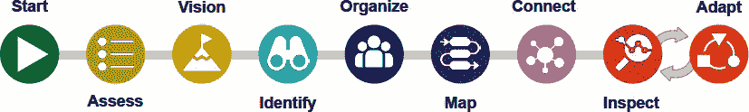
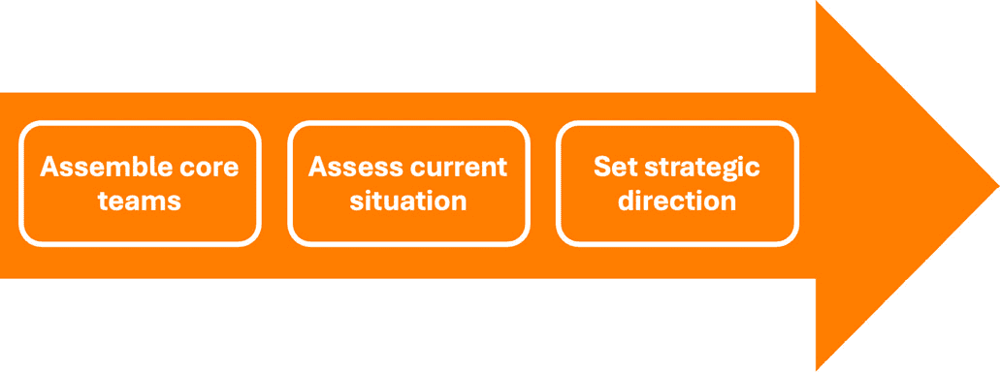
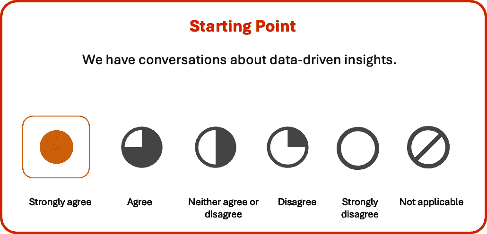
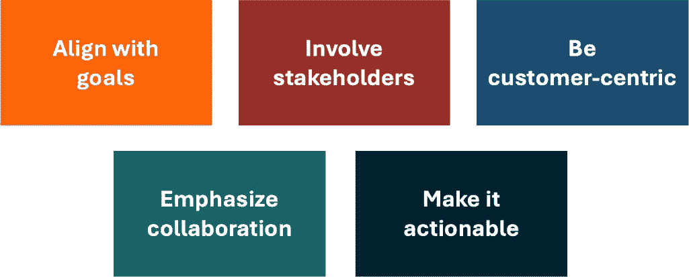
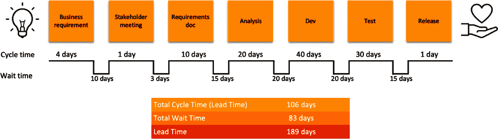
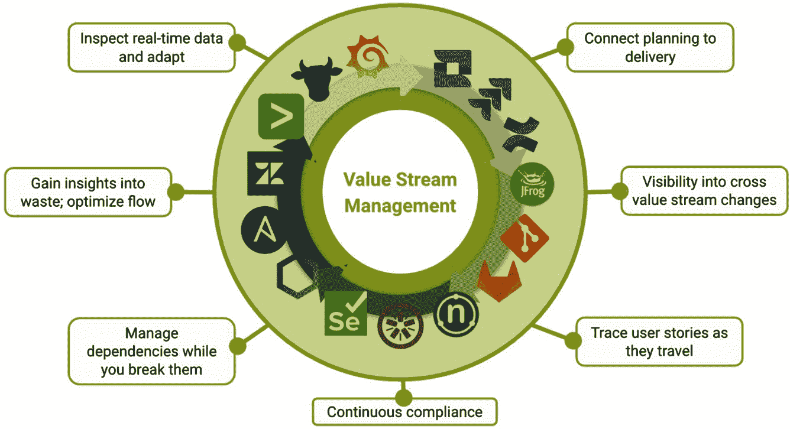
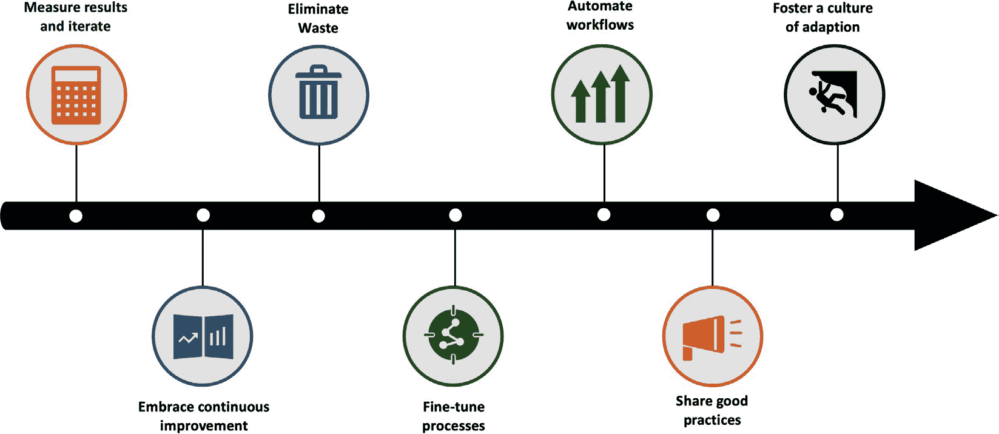
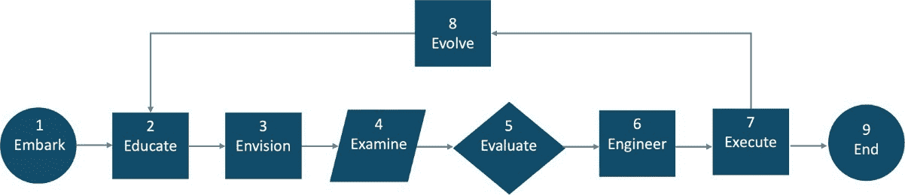
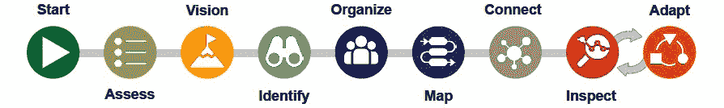

# 介绍 VSM 实施路线图

采纳价值流管理不仅仅是一个步骤，而是向持续改进迈进的旅程，以创造一个不断发展的、洞察驱动的文化。

– 改编自 VSM 联盟

在 *第四章* 中，我们介绍了 VSM 作为一种使用精益方法优先排序机会的工具。本章探讨了 **VSM 实施路线图**，该路线图来自 **价值流管理联盟**（**VSMC**）1。VSMC 推广适用于精益敏捷企业的价值流方法和工具，特别是在数字技术深度应用的组织中。他们促进了战略投资和端到端运营的优化，避免了孤立决策的情况。这个路线图使得 VSM 方法能够广泛应用于组织中，同时结合精益和敏捷的概念，确保技术部门支持组织的价值流改进活动。

VSM 实施路线图包括以下步骤：**启动**、**评估**、**愿景**、**识别**、**组织**、**映射**、**连接**、**检查**和**适应**。它结合了精益和敏捷实践，与我们书中的基本原则——*精益敏捷之道*相一致。

VSM 实施路线图跨越行业边界，确保进行全面的端到端价值流评估，这对于实现显著的流动改进并避免常见的**局部优化**至关重要，而这种局部优化通常发生在忽视系统思维时。

掌握 VSM 实施路线图可以使您的组织系统性地优化价值流，理解其复杂性，并在企业内实施变革。

本章涉及以下主题：

+   介绍 VSM 实施路线图

+   探索 VSM 实施路线图的九个步骤

+   比较 VSM 方法论与 VSM 实施路线图

# 揭示 VSM 实施路线图

在解释 VSM 实施路线图的目的和关键步骤之前，了解 VSM 的历史是有帮助的，因为它为这一现代实施方法铺平了道路。

## 从历史中学习

价值流的概念有着深厚的历史背景，许多贡献者影响了其发展。虽然我们已经走了很长一段路，但这段历史依然具有相关性，因为它帮助我们理解当今 VSM 实施路线图的必要性。所以，在我们继续之前，让我们回顾一些精益思维和实践演变过程中最具影响力的历史事件。

+   **丰田**的**早期****应用**：丰田被认为是早期应用价值流概念的企业，使用了生产过程的视觉展示图，即**物料和信息流图**。然而，对于这些概念和工具首次在丰田应用的时间点存在争议（Baudin 2013）。2

+   **沃马克和琼斯**：詹姆斯·沃马克和丹尼尔·琼斯在《*从精益生产到精益企业*》一文中提出了“价值流”这一术语。3 他们强调，价值流定义了精益企业，并涵盖了交付最大客户价值所需的所有活动。

+   **詹姆斯·马丁的见解**：詹姆斯·马丁，计算机行业的杰出人物，在他所称的“*企业工程*”（Martin 1994）这一整体性实践中定义了价值流。4 马丁反对将自动化应用于设计不良的商业流程，这些流程通常与层级管理结构相对应，往往导致职能和组织工作流中的孤岛效应和低效。

+   **VSM 书籍的出现**：在 2000 年代初，关于 VSM 的书籍开始出现，其中《*价值流管理：供应链中的战略与卓越*》（Hines 等人，2000）是最早之一。5 本书将 VSM 描述为提升客户体验的实践，并列出了七种价值流映射工具。

+   **精炼** **与** **映射**：随后的一些书籍，包括迈克·罗瑟和约翰·舒克的《*学习看见*》以及大卫·布伦特、吉姆·沃马克、丹·琼斯和马修·洛夫乔伊的《*看见整个价值流*》，在精炼价值流映射技术方面发挥了重要作用。6,7 这些出版物开始引入精益指标，以帮助发现影响组织端到端价值流的约束和浪费。

+   **VSM** **作为** **一种** **方法论**：唐·塔平及其合著者的书籍进一步将 VSM 作为一种使用精益原则和价值流映射进行持续改进的方法论。8

+   **广泛** **采纳**：随着时间的推移，价值流改进理念的应用逐步扩展到各个行业。凯伦·马丁和迈克·奥斯特林的《价值流映射：如何可视化工作并使领导层实现组织转型》（Martin, Osterling 2013）一书显著地推广了这些思想。9

+   **范围和内部价值流**：马丁和奥斯特林进一步强调了在价值流映射中设置边界和限制，以帮助组织保持专注，并推广了面向支持的价值流理念，用于映射人力资源、IT、财务和销售等内部活动的过程。

还有一些其他重要的贡献者在持续推动现代 VSM 实践的发展。然而，这一历史视角提供了足够的背景，以便理解为什么现代 VSM 实践必须融合精益-敏捷概念，以及为何要创建 VSM 实施路线图的主要原因。此外，Scaled Agile Framework（SAFe）在推动价值流概念走出制造领域，并在敏捷框架中得到广泛应用方面发挥了重要作用。

## 检视 VSM 路线图的需求

到目前为止，我们所学到的是，价值流体现了精益理念，旨在解决与传统管理商业流程的孤立化操作模式相关的问题，这些模式通常适应层级化的组织结构。过多时候，这些层级结构导致了严重的低效，政治斗争争夺人员、资金和其他资源，缺乏以客户为中心的关注，无法全面评估投资，更不用说从客户中心的视角进行评估。

相比之下，价值流侧重于从客户的角度理解组织如何创造价值，超越组织边界和自我利益。实质上，价值流定义了一个无缝的工作、材料、信息和资源流动，有效地传递价值，而不受组织边界的限制。价值流的目标是消除浪费和瓶颈，这些通常导致产品延误、成本增加和质量下降。

在*第四章*中，我们探讨了价值流图（VSM）作为一种方法论的出现，旨在帮助组织评估其在价值流中的最关键改进点。作为一种方法论，VSM 遵循以下通用模式：

+   教授精益-敏捷概念

+   确定并优先排序价值流

+   定义理想化的价值状态以进行基准测试

+   通过 Gemba 走访，利用当前状态的价值流图揭示浪费和瓶颈

+   通过未来状态的价值流，直观地展示拟议的价值流改进

+   制定 Kaizen 改进计划，记录推荐的变更，包括对当前状态、期望未来状态的评估、差距分析、ROI 论证、优先级排序和替代建议。

+   执行 Kaizen 计划以实现既定目标和指标

+   建立持续改进和转型的文化

+   当产品或服务达到其经济可行的生命周期终点时，停止该产品或服务的持续改进过程

这一全面的方法确保组织识别改进机会，并作为其转型业务文化的一个组成部分，执行和维持这些改进。然而，随着敏捷方法论的出现，重新思考 VSM 方法论如何融入精益和敏捷实践变得至关重要。这是下一节的主题。

## 探索 VSM 实施路线图

拥抱精益-敏捷思维，VSMC 的 VSM 方法旨在通过持续改进和客户关注来增强价值交付。

*图 5.1* 展示了 VSM 实施路线图，这是一个指导组织采纳 VSM 工作方式的高层次步骤系列。每个步骤为下一个步骤奠定基础，推动采用 VSM 主导方法的组织不断优化客户体验，并展示了 VSMC 实施路线图，这对 VSM 方法论至关重要。在识别和优先考虑持续改进的同时，VSM 路线图整合了来自敏捷的**检查**和**适应**概念。检查和适应使得基于新的学习和市场变化进行持续进展回顾和调整策略成为可能。路线图的每一步都将我们引向卓越的客户价值交付和满意度。其包含以下步骤：

图 5.1 – VSM 实施路线图

尽管路线图呈现了实施步骤的线性流向，但实际上，每个步骤可能会根据反馈和学习进行迭代。以下列表列出了每个步骤的目的。

1.  **开始**：通过设定变革和承诺的步骤，启动 VSM，并使使命与精益敏捷（Lean-Agile）原则对齐。

1.  **评估**：评估当前的运营环境（文化、能力和背景），基准现有表现，并建立改进的商业案例。

1.  **愿景**：一个令人信服的未来愿景能够激励和推动人们采取行动，为价值创造设定明确和战略的方向，并可视化将推动成功的成果。

1.  **识别**：选择一个需要改进的价值流。关注客户价值以识别组织的价值流。这对于以项目为中心的组织来说可能具有挑战性，因为长周期产品（与短期项目不同）揭示了价值流，任何交付产品或服务的过程都构成一个价值流。

    目标改进的第一个价值流通常是满足四个标准交集的价值流：强大的领导支持、高度可见的价值流、现有的敏捷团队以及一个重大的挑战或机会。

1.  **组织**：围绕产品或服务系统地组织人员、资源和工作流程，优化跨职能部门和整个系统的价值流动。

1.  **映射**：组建价值流图（VSM）团队，以识别并理解当前涉及为客户交付价值的步骤和活动。映射有助于识别瓶颈、延迟以及价值流中的改进领域。

1.  **连接**：整合并连接价值流中的人员、流程和工具，促进沟通与团队合作。当工作项可以在整个价值流中追踪时，延迟、返工和浪费将变得可见。这些见解推动改进，而反馈则为决策提供依据。

1.  **检查**：通过分析数据、设定改进目标、定义关键指标并利用自动化数据收集系统进行准确跟踪来监控绩效。只有通过从数字价值流中提供数据和洞察，才能持续地检查、管理和改进流动和价值实现。

1.  **调整**：一旦你拥有足够的数据和洞察来指导行动，就该实施变革了。鼓励持续的、迭代的改进，以适应变化，并积极追求卓越。

通过遵循其结构化方法，VSMC 路线图简化了运营，并不断将其与为客户提供卓越价值的总体目标对齐。每个步骤都承诺贯彻精益敏捷的思维模式，确保企业在追求运营卓越的过程中保持敏捷、响应迅速并以客户为中心。

我们将进一步探讨每个路线图步骤。

# 实施价值流管理

根据 VSMC，实施价值流管理（VSM）不仅仅是提升运营效率。它体现了效率、响应性和战略远见。因此，这一视角是理解他们 VSM 实施路线图细节的基础。以下部分将详细概述九个路线图步骤。

## 1. 开始——启动价值流管理

你的 VSM 实施之旅始于当前状态，无论你的数字化流程成熟度如何。每个企业的核心都是价值流和为满足客户需求或服务市民（在政府情境下）而设计的价值流网络。无论盈利导向如何，组织都在不断创新、开发和交付产品或服务。

每当有创新的火花或提出的变更时，它都要经过设计、开发和交付，客户才能体验到其价值。许多组织早已采用敏捷方法、DevOps 实践或精益原则。其他组织可能正在经历如重组、并购等结构性变化。这些因素不会阻止企业采用并推动 VSM 方法论和工具的使用，反而会加强变革的商业案例。然而，领导者必须警惕持续变革带来的疲劳感。要清晰地阐明 VSM 实施的目的和愿景，并帮助知识工作者理解他们的工作如何为组织的总体目标和任务做出贡献。一个明确的目的能为变革提供背后的“为什么”，并激励人们与组织共同走过这段旅程，积极参与其成功。

采纳 VSM 的典型障碍是缺乏高级领导的支持和资源有限。具有前瞻性的个人应该带着调整方向的意图行动，而不是等待许可，过程中应将领导者一同带入。积极的个人认识到，当低效被消除时，通常可以缓解资源的感知限制，从而释放系统内的容量。尽管如此，这种积极的姿态并不意味着高层管理人员可以回避其在组织转型中的职责。

跳到游行队伍前面并不意味着你是领导者。真正的领导力不仅仅是站在前面。它需要远见、同理心以及激励和引导他人朝着共同目标前进的能力。一个真正的领导者会倾听、合作并以身作则，而不是单纯寻求聚光灯。

领导者通过动手实践和对组织内部运作的深入了解，获得了引导公司前进的信誉和权威。这种参与不仅限于领导变革，而是成为转型的重要组成部分，确保 VSM 的实施是一个共同的旅程。

虽然强调领导层参与的重要性，但我们并不提倡领导者亲自指挥所有任务或单独做出每个决策的情景。这种集中化可能导致不利后果，包括决策瓶颈、缺乏信息的选择和与组织实际动态相矛盾的偏见。

有效的领导者理解授权的价值，并信任团队处理战术性、日常的决策。当组织制定出可见的活动和定义进展的关键指标时，委托决策变得更加容易。这种方式赋予了员工权力，培养了责任文化，并确保组织的方向由多样化的见解和专业知识塑造，从而促进了更强大、更有韧性的 VSM 实施。

VSM 实施路线图中的“**开始**”步骤涉及以下主要活动，如*图 5.2*所示：

图 5.2 – VSM 启动活动

这些关键活动为有效实施 VSM 奠定基础并设定方向：

+   **组建** **核心团队**：为 VSM 创建一个基础团队应该集合具备广泛专业知识的个人。推荐两种类型的团队：

    +   **VSM** **SME 团队** – 一个小型的、专门化的 VSM **领域** **专家**（**SME**）团队，他们在组织的各个 VSM 项目中提供支持、教育和指导。他们负责推动 VSM 方法论并监督 VSMC 路线图活动的实施。

    +   **价值流改进团队**（**VSIT**） – 该团队成员积极参与改进目标价值流。他们具备关键领域知识，并在实施后续章节中提出的概念时发挥重要作用，具体包括在*第九章*中定义企业业务敏捷系统（*BASE*），包括建立支持**最小有价值增量**（**MVI**）目标的节奏。VSIT 的组成是动态的，并且每个 MVI 可能有所不同。

+   **评估** **当前** **情况**：此步骤要求对当前情况进行初步评估。理想情况下，应该有高层的立即支持，但如果无法获得，目标是产生动力，并为 VSM 之旅争取支持和所需资源。

+   **设定战略方向**：此步骤的重点是概述 VSM 计划的战略目标和任务。这意味着考虑其如何支持公司更广泛的战略目标、提升客户价值、提高运营效率并增强整体业务表现。

这三项‘**开始**’活动为组织提供了多个好处。首先，通过组建专门的团队，它们为启动成功的 VSM（价值流管理）计划奠定了核心资源。其次，它们提供了对组织当前状况的快速评估，弥合了现有状态与实现更广泛业务战略所需的战略目标之间的差距。它的另一个好处是提供了实现去中心化决策和执行所需的对齐和方向，利用团队的集体智慧。

完成这三项关键活动后，VSM 和 VSIT 团队将进入 VSM 的第二步，‘**评估**’。

## 2. 评估 – 评估并确定当前的绩效基准

**评估**，VSM 实施路线图中的第二步，建立在‘**开始**’步骤的基础上，涉及对现有 VSM 能力的全面评估，以建立绩效基准，并识别改进领域。

VSMC 开发了与实施路线图步骤对齐的 VSM 评估。该评估旨在为当前状态设定基准，并在 VSM 实施过程中进行持续的再评估。这个评估阶段源于 VSMC 的合作努力，强调了在 VSM 之旅开始时对当前状态进行基准测量的重要性，并保持持续的进展监控。

VSMC 的评估工具采用了**李克特**量表问卷，如*图 5.3*所示，促使受访者根据从**强烈同意**到**强烈不同意**及**不适用**的范围，对其当前状态进行评分。

图 5.3 – 李克特量表评估

该评估工具专为咨询师和企业实践者设计，帮助识别重点领域、为未来的衡量设定基准，并与行业基准进行绩效对比。

作为一种在线自助工具，评估邀请团队回答标准化问题 – **VSM** **评估** ([vsmconsortium.org/vsm-assessment](https://www.vsmconsortium.org/))。此工具有助于内部基准测试，并允许与其他团队和组织进行对比。评估从评估组织的愿景和领导力支持开始，这些是成功采用 VSM 的关键驱动因素。

通过利用此工具，团队可以系统地发现其方法中的优势与劣势，提供清晰且可量化的 VSM 旅程衡量标准，并找到前进的路径，将其价值流实践提升至世界级标准。

完成了全面的‘**评估**’阶段，在此阶段中，我们对当前流程进行了评估，现在我们将进入‘**愿景**’阶段。在这一阶段，我们的关注点从理解当前价值流状态转向定义我们期望的未来状态愿景。

## 3\. 愿景 – 创建统一的愿景和目标

在**愿景**阶段，组织必须定义并阐明一个长期的愿景和目标，以引导其转型之旅。这个愿景必须被深入理解并广泛传播，在组织内部成为新的常态。简单来说，这就是我们在这里工作的方式。这不仅仅是应对现有系统，而是要转变组织思维方式，并培养新的习惯。*图 5.4*展示了愿景阶段的核心要素：

图 5.4 – 制定共享愿景

愿景强化了组织对定义无缝流动的有价值的客户成果的承诺。这是一个组织设想未来、摒弃浪费和不必要约束的过程，深入了解客户体验，并迅速采取行动，每一个洞察都推动实际的改进。

与此愿景相关的目标与提升组织效能密切相关，尤其是在**数字盈利领域**中尤为重要。这些目标包括对客户需求的高度响应、工作过程的透明度、赋能价值流的自主性，以及在市场中获得竞争优势。通过衡量改进，这些目标为追踪和优化交付速度、客户影响、成本效率和市场领导力奠定了基础。

愿景步骤的目标旨在通过强调敏捷性、透明度和对市场动态的适应性，提高组织的效率。其目的是迅速响应客户需求，确保清晰有效的流程，并使价值流直接影响财务成功。目标必须具有雄心壮志，并能通过领先指标进行衡量。*第四章*中讨论的 SMART 标准为跟踪业务目标和指标提供了一个结构化的方法。

领先指标使得跟踪组织在迅速实施变革、有效满足客户需求、有效管理成本以及在市场中维持竞争优势的能力成为可能。

执行领导者必须承担设定战略方向的角色，并赋予团队战略洞察力，积极参与转型。这是一个合作努力，设定了如改善客户体验、减少流程浪费、缩短反馈周期和与财务模型对齐等目标。在*第九章*中，我们将讨论如何使用 OKRs（目标与关键结果）帮助高层设定清晰的期望。

每个目标都与可量化的结果相关联，如提高客户参与度、更快的价值交付、改善决策制定和正向财务回报。通过将愿景细化为可衡量的目标，团队可以追求渐进的进展，使愿景成为一个具体可达的现实。

拥有清晰的愿景为将愿望转化为可衡量的成果奠定了基础，推动组织在 VSM 旅程中朝着共同方向前进。

## 4. 识别——揭示价值流

**识别**步骤的目标是定义和描述组织内的价值流。在一个通常由层级化组织结构和基于项目的思维主导的环境中看到价值流可能会遇到挑战。与项目不同，项目是临时的且有限的，而价值流代表了从开始到交付及其之后的产品或服务生命周期。它们是将一个想法转化为对客户有价值的成果所需的一系列活动。

例如，在一个销售产品的电子商务系统中，核心价值流包括对组织使命至关重要的活动，而支持性价值流包括促进核心价值流活动的平台和 CI/CD 管道。我们将在*第三部分*中进一步探讨流的分类方法。

识别过程包括识别各种产品、服务、平台及其各自的内部或外部客户。每个价值流都有一个起点，从那里产生一个想法，并有一个终点，将价值交付给客户。绘制这些价值流图，理解它们如何交汇和相互支持，并识别依赖关系，是至关重要的。

目标是朝着改进的方向逐步迈进。组织可以通过从小规模实验开始并从中学习，系统地解开其价值流的复杂性。主要的关注点是识别和命名增值步骤，识别它们服务的客户，并绘制出从开始到结束的整个旅程。采用这种方法，即便是最复杂的系统也能够随着时间的推移有效地被导航和优化。

你可能会注意到，VSM（价值流管理）实施路线图包含了精益和敏捷元素。在这个背景下，我们利用**迭代和增量开发**过程来识别组织内的精益改进机会。在‘**检查**’和‘**适应**’阶段，我们将重新审视迭代和增量改进的概念。然而，随着我们进入下一步——‘**组织**’，仍然有许多内容需要覆盖。

## 5. 组织——简化跨职能协作

**组织**步骤承认从传统的孤立结构转向更加集成的方法，其中技术团队与业务紧密对齐。从 DevOps 到更广泛地包括财务、人力资源、销售、市场营销、产品管理和**治理、风险与合规**（**GRC**）的转变，突出了这一变化。

瓶颈带来的问题非常严重。团队之间的交接可能会导致错误、延误或失去机会。此外，组织层级和脱节可能导致与业务目标不一致，从而导致交付速度变慢和客户满意度下降。

因此，核心价值流必须视为涵盖从概念到客户实现的整个过程，而不是人为地将业务与技术分开。某些角色，如投资组合经理，可能不会专门负责单一的价值流，因为它们具有跨越性的特点。同样，像发布和云工程师这样的专业角色可能会跨多个流进行操作，可能存在于一个平台或支持团队中。

许多人，无论是组织内部还是外部的人，可能都关心我们提供的产品和服务。然而，最终的利益相关者是客户，价值流应当自主运作以服务客户。

尽管角色位于价值链中的特定点，但所有角色应该关注各自流中的价值流动和实现，而不仅仅是它们对流程的贡献。

‘组织’步骤的以下考虑因素至关重要：

+   **识别 VSM 和跨职能团队**：确认必要的角色并组建能够跨职能边界操作以改进价值流的团队。

+   **角色和责任的定义**：界定每个团队及其成员负责的内容，确保每个角色都致力于增强提供给客户的价值。

+   **沟通**：建立健全的沟通机制，促进所有团队之间的无缝互动和信息共享。

+   **培训** **和** **支持**：为团队提供全面的培训和资源，使其能够有效履行其 VSM 角色。

+   **监控** **和** **调整**：持续监控价值流的表现，随时调整团队组织和动态，确保最佳运行和价值交付。

通过拥抱这些原则，组织可以创建一个促进效率、对齐和以客户为中心的统一环境，摆脱孤立运营，向完全集成的数字价值流迈进。

我们已准备好与已经组建的 VSM 团队一起推动前进，以促进跨职能 VSIT 团队的培训、辅导和指导。*第六步*，“**绘制**”，将审视价值流映射过程，使团队能够精确定位改进的领域。

## 6\. 绘图 - 可视化流程效率和机会

制作价值流**地图**是分析和改进价值流的关键步骤。该过程通常包括以下步骤：

+   **组建您的绘图团队**：此初始步骤涉及聚集一个跨职能团队，其成员在组织步骤中已经确定。该团队将协作创建价值流地图，汇集各自的多样化专业知识和观点。

+   **定义** **范围**：必须清晰定义绘图练习的范围，确定要绘制的价值流的边界。这包括设置起始点和结束点，通常从最初的客户请求到最终产品交付。

+   **创建当前状态地图**：从价值交付向最初的客户请求逆向工作，团队以可视化方式呈现价值流的当前状态，包括流程中的每个独特过程。该地图作为识别浪费、瓶颈和潜在改进区域的基准。

+   **收集** **过程** **数据**：在这个阶段，团队为价值流中的每个过程收集相关数据。重要的指标包括周期时间、从最初客户请求到增值时间、在制品、等待时间以及其他指标，以了解流程和延迟。

+   **分析地图**：最后一步是彻底分析当前状态图。鼓励团队成员分享对潜在变化或优化的见解和观点。这种协作性回顾旨在生成对价值流的共同理解，并促进关于下一步改进的共识。

通过这些步骤，映射过程捕捉了价值流的当前状态，并为持续改进提供了跳板。通过引入跨职能团队，映射练习确保了各个角度的考虑，从而导致了更加全面和有效的改进方法。

VSMC 对价值流映射的方法与现代精益实践一致，如 *图 5**.5* 所示：

图 5.5 – 示例价值流图

在映射价值流后，我们将讨论下一个阶段——‘**连接**’。在这一阶段，我们将整合价值流中的人员、流程和工具，增强有效沟通，推动协作，并通过数据驱动的洞察支持决策。

## 7. 连接 – 协调人员、流程和工具

鉴于我们在数字时代竞争的迫切需求，**连接**对于将 DevOps 工具链整合进价值流至关重要。工具链涵盖了一个想法的整个生命周期，从组合管理开始，经过产品待办事项、**持续集成/持续部署**（**CI/CD**）、发布和环境管理，最终到服务台。这套全面的工具对于跟踪从想法到实现的价值至关重要，并能深度分析客户体验。

现代的 DevOps、CI/CD 和 VSM 工具及平台可能非常昂贵。然而，如 *图 5**.6* 所示，可定义的好处可能非常可观：

图 5.6 – 通过 VSM 工具和平台连接所提供的能力

‘**连接**’活动旨在通过整合沟通、技术和反馈，创建一个无缝且高效的工作流程。现代 VSM 工具和平台提供了支持连接阶段的集成、可视化和分析能力。

以下是连接活动的简要概述：

+   **定义沟通协议**：此活动涉及建立明确的指导方针，确保团队成员之间的信息交换方式一致且有效，确保沟通在所有价值流层级中保持一致。

+   **整合技术和工具**：此步骤将各种技术解决方案和工具结合成一个有机的系统，以支持价值流，提升团队协同工作和高效工作的能力。

+   **自动化数据收集**：这一活动旨在减少人工工作、最小化错误，并为分析和决策提供一致且可靠的数据流。

+   **启用实时可视化**：这包括设置能够提供即时洞察价值流性能的系统，便于迅速识别问题和改进机会。

+   **建立反馈循环**：创建反馈循环支持持续学习和改进，使价值流能够根据团队经验和收集的数据进行适应和演化。

这些活动中的每一项都在连接数字价值流的各个元素中发挥着至关重要的作用，确保流程尽可能高效和响应迅速。

跟踪整个价值流中的工作项是由*图 5.6* 中显示的工具提供的强大功能。它们揭示了延迟、返工以及沿途发生的任何浪费。收集到的洞察能够通过使这些元素可见来为改进提供信息，而反馈推动了基于数据的决策。

总结来说，连接人员、流程和工具创建了一个有凝聚力、透明的工作流，其中每个行动和结果都可以追溯到其源头。这确保了团队保持一致，从实时数据中学习，并不断调整以优化价值流。这个连接阶段不仅仅是一个步骤，更是支撑高效和持续改进文化的持续实践。

## 8. 检查——使用计划-执行-研究-行动（PDSA）循环来改进价值流

价值流源自精益，但 W. Edwards Deming 的计划-执行-研究-行动（PDSA）指导为其奠定了重要基础。因此，我们推荐使用他所推广的 **PDSA 循环** 来改善我们对价值流的理解，也就不足为奇了。

PDSA 不仅仅是简单的“检查与调整”。它采用基于证据的决策方法，避免推测，优先采用经验主义，并使用经过验证的理论。这一过程使我们超越了传统方法中固有的先入为主的观念。

+   **计划**：在我们做任何事情之前，我们需要一个假设和一个计划。规划的时间框架可以从几分钟到几天不等。计划设定了我们认为会发生的预期。这测试了我们对情况的理解以及它的有效性。它提供了一个基准，以查看我们对当前情况的理解有多好。

+   **执行**：这是我们执行计划活动的阶段。然而，如果证据表明事情并未按预期进行，我们会调整计划，以反映我们对当前情况的新理解。戴明的 PDSA 循环在计划的时间框架内应用持续学习。

+   **研究**：我们使用快速反馈来判断发生的事情（或“做”）是否符合我们预期的（我们的“计划”）。这个反馈循环可以是持续的，或者在计划的增量结束时进行。通过查看计划和执行之间的差距，我们可以调整方向并挑战我们的理解。换句话说，我们进行研究以确保我们以正确的方式构建正确的产品，同时确保我们的思考也是正确的。

    这个过程被称为**双环学习**。**单环学习**是指在你正在做的事情上变得更好。双环学习挑战“你正在做的事情”，看看是否有更好的工作方式，或者你正在做的事情是否正确。任何不能有效改变其实践的过程都会限制双环学习。

    **三环学习**是学习如何学习。三环学习教会我们如何挑战我们的假设。Chris Argyris 关于双环学习的文章可以在 [`infed.org/mobi/chris-argyris-theories-of-action-double-loop-learning-and-organizational-learning/`](https://infed.org/mobi/chris-argyris-theories-of-action-double-loop-learning-and-organizational-learning/) 中找到更多详细内容。

+   **行动**：在“研究”阶段之后，我们的重点转向按照我们的计划生产我们所构建的内容，同时提升我们对所使用模型的理解。

VSMC 主张沿着两个主要维度检查价值：

+   **流动**：确保工作从构想到交付的过程顺畅流动，代表着为客户持续交付价值

+   **价值**：实现期望的业务成果，使客户体验到预期的价值

这些维度帮助组织评估价值流的健康状况和客户体验，以评估效率和效果。

“**检查**”阶段使我们能够专注于分析和增强价值流的表现。这包括一系列战略性行动，旨在理解和改进价值流过程的各个方面。以下是推动此阶段的关键活动：

+   **定义** **相关** **指标**：定义价值流的核心绩效指标，如交付时间、周期时间、产量、正在进行的工作和缺陷率。

+   **利用自动化数据收集**：利用 DevOps 工具中的实时数据分析性能，了解工作的真实进展。例如，开发人员在看板系统中将工作标记为“**完成**”，但来自故事的完成工作可能会在其他团队的发布队列中停留数月。DevOps 工具和数据提供了更准确的视图，将度量基于端到端过程。

+   **监控性能**：通过分析来自 DevOps 工具的实时数据和洞察，持续关注你价值流的表现，以防止服务中断。团队必须不断监控系统的各项属性，如安全性、可靠性、性能、可扩展性等。

+   **分析** **数据**：检查收集到的数据，以评估流程的有效性并找出需要改进的地方，包括产品和服务的业务成果。

+   **设定** **实验性** **改进** **目标**：基于透彻的数据分析，制定针对性的实验性改进目标，以提升价值流表现。

维持工作流的顺畅并实现预期的业务成果需要一种警觉且积极主动的管理和精炼方法。数字价值流中丰富的数据和洞察提供了团队所需的机制，以维持一个持续检查和适应的循环。

## 9. 适应——沟通、界定范围并规划干预措施。

适应阶段代表着 VSMC 的 VSM 实施路线图的高潮，洞察和数据汇聚在一起，推动可操作的变革。在这一阶段，焦点转向实施和迭代来自**检查**阶段的变革。这个阶段的特点是七个关键行动，每个行动都旨在发展和精炼价值流：

+   **拥抱持续改进**：承诺不断改进，始终寻找增强价值流的方法。

+   **消除** **浪费**：识别并去除低效环节，以简化流程并最大化价值。

+   **衡量** **结果并** **迭代**：评估变更的结果，并进行迭代调整，确保持续进展。

+   **微调流程**：调整和优化现有流程，以提高效果和效率。

+   **自动化工作流**：实施自动化，以减少人工努力并提高一致性和速度。

+   **分享** **最佳** **实践**：在企业的价值流中培养并应用成功的模式和技巧。

+   **培养适应文化**：培养一个在组织内广泛拥抱灵活性和变革的环境，推动改进。

这些适应活动不是孤立的努力。它们代表了一种协调一致的适应方法，这对于 VSM 生命周期至关重要。检查和适应步骤本质上是相互关联的，彼此相互作用，形成一个反映敏捷原则的持续循环，通过这种敏捷方法，协作团队确保价值流是优化的、具有韧性的，并且能够响应变化。

“**适应**”阶段还涉及利用你的价值流图作为沟通工具，以概述、界定和协调必要的变更。这是一个战略阶段，你在此阶段中制定并记录关于变更潜在影响的假设，并开发一个清晰、结构化的路线图，详细说明立即行动、下一步和未来考虑事项。

必须承认，价值链中的每一次变化都可能带来意外的后果。价值流并非孤立存在；系统思维方法对全面理解和有效管理至关重要。

*图 5**.7* 展示了一种结构化的方法，用于制定和完善适应假设，确保与预期愿景的一致性，同时庆祝沿途所取得的里程碑：

图 5.7 – VSM 适应阶段

随着变化的发生，价值流图成为一个活文档，突出改进并重新定义当前状态。这正是敏捷适应的迭代特性发挥作用的地方，提供了持续改进和一个永续的开发与改进循环。

在我们的数字时代，VSM 检查步骤帮助 VSIT 团队发现利用数字化进步改进挑战组织常规方法的领域。一旦收集到洞察和数据，实施变更至关重要，这正是 VSM 适应步骤的主要重点。

价值流映射能够引起对改进的关注，并重新定义当前状态。必须认识到，一旦采取了行动，图表应当随之演化，以避免未来的误解和不一致。

# 比较 VSM 方法论和 VSM 实施路线图

乍一看，E9 VSM 方法论和 VSMC 的实施路线图似乎有相似的流程、目标和目的。它们都包含九个步骤，有些步骤的名称也类似。但它们的关注领域不同。*图 5**.8* 和 *图 5**.9* 比较了这两者，并阐明了我们将在本节中探讨的关键差异：

VSM 方法论已有二十多年的历史，在我们的 E9 VSM 模型中，包含了一套结构化的九个步骤，如 *图 5**.8* 中所示：

图 5.8 – VSM 方法论

VSMC 的实施路线图已近三年，并巧合地由九个步骤组成，如本章所述并在 *图 5**.9* 中展示：

图 5.9 – VSMC 实施路线图

虽然两个路线图在流程、目标和宗旨上有相似之处，但也存在关键的区别。VSM 方法论是一种经过验证的精益导向方法，旨在推动任何类型价值流中的生产力、效率和质量改进。相反，VSMC 实施路线图则通过现代化 VSM 方法来支持竞争力，并在数字时代提供增值服务。此外，VSMC 的路线图融入了敏捷的迭代概念，用于检查和适应。

这并不是选择一种方法而放弃另一种方法的问题。两者的目的都是为了提升价值流，但它们有着不同的角色：

+   **VSM 方法论**帮助组织识别和优先考虑跨组织边界的价值流改进。具体来说，它使协作团队能够评估和评估跨职能和跨部门的变革机会，确保改进能够以现有资源提供最具影响力的以客户为中心的价值。

+   **VSM 实施路线图**结合了敏捷的检查和适应步骤，以提高敏捷性。这个路线图还使 IT 组织的活动保持一致，推动组织各个产品和流程的数字化提升。它专注于创建 IT 基础设施，以支持数字化改进并增强竞争力。

这些方法相辅相成，确保价值流改进团队能够有效地解决更广泛的组织改进和 IT 特定的数字化提升问题。

尽管 IT 组织可以独立改进其开发和交付服务，但它们必须与更广泛的组织改进需求保持一致。VSM 路线图帮助识别数字化改进至关重要的领域，确保 IT 有效支持组织的端到端价值流，涵盖核心产品和服务。

# 摘要

在本章中，你已经深入了解了 VSMC 实施路线图，这是一种 VSMC 提供的全面方法，用于有效实施 VSM 原则和实践。本章为你启动组织的业务转型之旅提供了实用的路径，无论你是一个正在发展未来技能的年轻专业人士，还是一个追求竞争优势的高管。

你在这里学到的经验教训非常重要，因为它们为你提供了实现变革所需的知识和工具。VSM 实施路线图有助于系统地优化价值流，确保全面的评估，从而实现无与伦比的改进。它超越了行业界限，避免了“局部优化”的陷阱。

在下一章中，我们将探讨如何在利用数字化提升的同时，从管理项目转向管理产品。

# 问题

本节内容供希望评估本章提供信息理解和记忆的读者使用，共有 10 个问题。答案在接下来的子章节中给出。回忆原文内容的准确措辞并非必要，重要的是回忆概念及其应用。

1.  在 VSMC 实施路线图的“**开始**”步骤中，有哪些三项关键行动，它们如何促进 VSM 举措的成功？

1.  VSM 评估工具如何在 VSM 实施路线图中的“评估”阶段提供帮助？

1.  *VSM Step 3*中的“愿景”阶段的主要目标是什么，它如何影响组织转型？

1.  在*VSM Step* *4*“识别”的背景下，“核心价值流”和“支持性价值流”有何区别？

1.  在有效实施*VSM* *Step* *5*“组织”时，有哪些关键考虑因素有助于简化跨职能协作？

1.  根据《VSM 实施路线图》，价值流图绘制过程涉及的五个步骤是什么？

1.  在*VSM* *Step* *7*“连接”中，涉及哪些主要活动，以协调人员、流程和工具的整合？

1.  在*VSM Step* *8*“检查”中支撑的三大经验主义支柱是什么，它们如何帮助提升价值流绩效？

1.  VSM“适应”阶段的七项关键行动是什么，它们旨在完善价值流？

1.  传统 VSM 方法论与 VSM 实施路线图之间的主要区别是什么？

# 答案

1.  第 1 步“**开始**”中涉及的三项关键行动是组建核心团队、评估当前局势、设定战略方向，这三者共同奠定基础资源，提供快速的组织评估，并将 VSM 举措与更广泛的战略目标对齐。

1.  在第 2 步“**评估**”中使用的比较敏捷 VSM 评估工具，有助于全面评估组织当前的 VSM 能力，进行基准对比，识别改进领域，并引导团队优化价值流实践。

1.  第 3 步“**愿景**”的主要目标是定义一个长期愿景和目标，改变组织的思维方式，培养新习惯，并与可衡量的目标对齐，以提高效率和竞争力，尤其是在数字化和盈利领域。

1.  在第 4 步“**识别**”的背景下，核心价值流直接交付组织的核心产品和服务，而支持性价值流则使这些核心职能得以支持，例如开发平台或客户关系管理系统。

1.  有效实施 VSM 第 5 步“**组织**”要求识别 VSM 和跨职能团队，定义角色和责任，建立沟通渠道，提供培训和支持，并持续监控和调整，以确保价值流的最佳运行和交付。

1.  在第 6 步“**映射**”中，价值流映射过程的五个步骤是组建映射团队、定义范围、收集流程数据、创建当前状态图并分析图表以识别改进机会。

1.  第 7 步“**连接**”的主要活动包括定义沟通协议、整合技术与工具、自动化数据采集、启用实时可视化并建立反馈循环，以创建无缝、高效且响应迅速的数字价值流工作流程。

1.  实证主义的三个支柱在第 8 步“**检查**”中分别是透明性、检查和适应，通过促进信任、鼓励持续反馈并基于事实和证据做出决策，帮助提升价值流表现，指导基于事实和证据的决策，推动持续改进。

1.  第 9 步“**适应**”的七个关键行动是衡量结果并迭代、接受持续改进、消除浪费、优化流程、自动化工作流程、分享最佳实践，并培育适应文化以不断发展和完善价值流。

1.  VSM 方法与 VSMC 实施路线图的主要区别在于后者采用了现代化的方法来提升在数字时代的竞争力。VSMC 的路线图融合了精益和敏捷理念，关注 IT 基础设施和数字化增强。而 VSM 方法依然对广泛的组织改进和跨部门变革具有重要价值。

# 进一步阅读

1.  [`www.vsmconsortium.org/`](https://www.vsmconsortium.org/)

1.  Baudin, Michel. “‘价值流图’从哪里来？” Michel Baudin’s Blog. 2013 年 10 月 25 日\. [`michelbaudin.com/2013/10/25/where-do-value-stream-maps-come-from/`](https://michelbaudin.com/2013/10/25/where-do-value-stream-maps-come-from/).

1.  Womack, James P., 和 Daniel T. Jones. “从精益生产到精益企业。” 《哈佛商业评论》 72 (1994): 93-103.

1.  Martin, James. 1995\. 《伟大的转型：利用企业工程的七个学科对齐人员、技术和战略》. 纽约: Amacom.

1.  Hines, Peter, Rich, N., Bicheno, J., Brunt, D., Taylor, D., Butterworth, C. 和 Sullivan, J. (2000). 《价值流管理：供应链中的战略与卓越》. Financial Times/Prentice Hall.

1.  Rother, Mike, 和 John Shook. 1999\. 《学习看见：价值流映射以创造价值并消除浪费》. Lean Enterprise Institute.

1.  Brunt, David, Matthew Lovejoy, Dan Jones, 和 Jim Womack. 2003\. 《看见整个价值流》. Lean Enterprise Institute.

1.  塔平、唐、汤姆·卢伊斯特和汤姆·舒克. 2002 年. 《价值流管理：规划、图示和维持精益改进的八个步骤》. 纽约：生产力出版社。

1.  马丁、卡伦和迈克·奥斯特林. 2013 年. 《价值流图示：如何可视化工作并使领导力与组织转型对齐》. 纽约：麦格劳-希尔出版公司。
