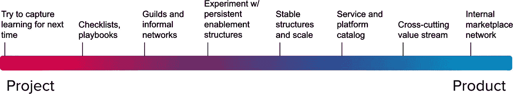

# 导航价值流优化

悲观主义者抱怨风向；乐观主义者期待风向改变；现实主义者调整帆。

- 威廉·亚瑟·沃德

在快速发展的商业管理世界中，一个关键因素常常决定成功的领导者与其他人的区别：那就是导航和优化工作流的能力，并在组织内交付价值。例如，假设你的组织就像一艘设计精良的船，拥有一支积极的船员，并且有一个明确的目的地——为客户交付价值。一切看似完美，但正如我们所知，商业的水流和风向并非总是可预测的。

本章将探讨如何从管理项目转向管理产品，同时利用数字化增强。借用之前的航海隐喻，我们将说明如何在价值流的道路上航行，就像在不断变化的风和水流中航行一样。

价值流不断变化；没有什么是静止不变的。然而，在今天的环境中，有两种转变保持不变，成为精益企业的关键：

1.  **从项目转向产品**：为了保持竞争力并以客户为中心，我们必须将焦点从管理短期项目转向在其经济可行的生命周期内持续发展我们的业务流程、产品和服务。

1.  **利用数字化增强**：采用数字化增强是有效改善流程、产品和服务的关键

引入价值流运营模型至关重要，这为适应性提供了坚实的基础，并提供了跨组织的价值创造与交付的整体视角。这些新型运营模型将人员、流程、信息和技术整合，以优化工作流。从项目转向产品并拥抱客户至上，可以实现可持续的价值创造与交付。

通过理解优化价值流如何推动组织转型，你可以改善满足客户需求的解决方案，促进敏捷性，并获得竞争优势。你将掌握提升生产力、效率、适应性和价值交付的策略。

本章涵盖以下主题：

+   从项目转向产品

+   理解价值流运营模型

+   识别并克服精简工作流的障碍

+   在价值流中平衡创新与效率

+   优化价值流以提升绩效

# 从项目转向产品

在数字知识工作的演变过程中，从基于项目的模型到以产品为中心的模型发生了一个关键的转变，这一转变改变了组织如何交付价值以及如何响应市场需求。Mik Kersten 的著作《从项目到产品》引起了人们对这一变化的广泛关注，提供了一个结构化的框架和实践指导，巩固了这一概念。基于敏捷和 DevOps 社区的讨论，Kersten 的工作加强了产品为中心的思维方式的重要性，这一点已经被敏捷方法论和 DevOps 运动所阐明。

传统上，以项目为中心的范式通常与**瀑布式** **开发** **模型**相关，强调的是具有特定范围、预算和时间表的离散性、临时性努力。然而，这一模型被证明效率低下，不必要地拖延项目进度，导致编码错误和缺陷的积累，最终使得这些问题越来越难以解决。此外，它往往导致孤立的工作，只关注预定的交付成果和项目里程碑，而非解决最终用户需求或促进持续改进。

向以产品为中心的现代转型代表了数字领域战略和执行上的根本变化。与项目不同，产品被视为具有生命的实体，随着客户需求和市场趋势不断演变。这一转变与精益、敏捷和 DevOps 实践相一致，强调长期价值创造、跨职能协作以及对客户体验和反馈循环的持续关注。

这一转型促进了一个更具适应性和反应能力的组织文化，在这种文化中，团队能够迅速进行迭代和创新。以产品为中心的模型培养了团队的所有权感和责任感，因为团队在整个产品生命周期中都持续参与其中，从而带来更高的质量成果，并与业务目标更好地对齐。

引入以产品为导向的方法需要组织内部思维方式、流程和管理结构的根本转变。它与数字知识工作的需求更为契合，其中敏捷性、反应能力和持续改进是维持竞争优势的关键，尤其是在快速发展的数字市场中。

*图 6.1*对比了项目模型与产品模型在各个维度上的差异，突出了从传统的以交付为中心的方法向现代的以客户为中心的方法的转变。产品运营模型强调持续改进、适应性和客户满意度，代表了组织在数字知识工作方法上的重要转变：

图 6.1 – 项目与产品运营模型比较

在实际操作中，从项目到产品的转变很少是一个二元切换，它可以在不同的时间、不同的方式和程度上发生。为了更好地与以产品为中心的运营模式和原则对接，考虑行为和运营模式在一个谱系上的差异是很有帮助的，如*图 6.2*所示。

图 6.2 – 从项目到产品的谱系

在谱系的一端，行为与传统的项目管理范式对接；在另一端，行为则反映了现代的以产品为中心的理念。这个谱系最好呈现为一个渐变，因为组织可能处于不同的阶段，在采用新的实践和心态的过程中，从以项目为导向的行为转变为以产品为导向的行为。

## 评估项目中心行为

在以项目为中心的环境中，团队展现出一些独特的行为，塑造了他们的工作和协作方式：

+   **固定范围强调**：团队优先交付在预定约束下的具体输出，极为关注遵守原计划、预算和时间表。

+   **临时团队**：人员分配到项目中，项目完成后即解散。团队的组成在每个项目之间经常变化，可能导致知识延续性和团队动态的中断。

+   **变革抗拒**：变革常常被视为对项目范围、预算和时间表的威胁，从而导致僵化的变更控制流程，可能减缓适应的速度。

+   **成功指标**：成功是通过项目对预定规格、截止日期和预算的遵守情况来衡量的，而不是长期价值或客户满意度。

+   **孤岛式工作流程**：工作往往在部门或职能孤岛中进行，跨职能协作有限，通常会导致交接延迟并降低效率。

现在我们已经建立了对项目中心行为的共同理解，接下来我们将探讨这些行为如何在组织向以产品为中心的开发战略过渡时演变。

## 过渡行为

当组织向以产品为中心的开发战略过渡时，它们会表现出过渡性的行为，特点是优先级平衡、灵活的团队结构、对变化的开放态度、不断演化的成功指标和集成化的工作流程。让我们更详细地探讨这些行为。

+   **平衡优先级**：组织开始平衡交付特定项目产出的需求与理解对客户价值和战略目标的更广泛影响。

+   **灵活的团队结构**：更加注重稳定的跨职能团队，尽管它们仍然可能是项目驱动的。团队开始围绕能力和产品进行组建。

+   **对** **变化**的**开放性**：变化的管理更加灵活，越来越多的理解表明，适应变化可以带来更好的结果。迭代方法，如敏捷，可能有助于此。

+   **发展中的成功度量**：虽然传统的项目度量仍然很重要，但越来越多地关注如客户反馈和市场影响等度量。

+   **集成的** **工作流程**：开始打破壁垒，增加跨职能和工作阶段协作的重视。

在我们从以项目为中心向以产品为中心的行为过渡过程中，接下来我们将探讨向产品为中心的方法的变革性转变。在这里，团队优先考虑持续的价值交付，拥抱变化，并促进无缝的协作。

## 对比以产品为中心的行为

随着组织向以产品为中心的行为过渡，它们优先考虑持续的价值交付，拥抱变化，并促进无缝协作。例如，它们专注于实现由持续的、全面的产品焦点所要求的流程，如下所述。

+   **客户和市场聚焦**：团队主要专注于为客户持续交付价值，并响应市场变化。范围灵活，并根据反馈和洞察不断演变。

+   **持久的** **跨职能** **团队**：团队是稳定的、长期的，并围绕产品或服务进行组织。他们具备交付端到端价值所需的所有技能。

+   **拥抱变化**：变化被视为学习和改进的机会。团队基于现实世界的反馈迅速适应，采用如持续交付和部署等方法。

+   **基于价值的成功度量**：成功通过产品对市场的影响、客户满意度以及长期交付业务成果的能力来衡量。

+   **无缝** **协作**：工作流程高度集成，强调在组织内各级和各职能之间的透明度、沟通和协作。

以产品为基础的组织处于不断发展的状态，从刚性的项目结构和行为转向更加动态、以产品为导向的模型，这些模型优先考虑敏捷性、客户价值和可持续增长。

让我们从宏观和微观两个层面来考察流程，以便更好地强调持续的、全面的产品焦点所要求的流程。

# 理解组织和个人层面的流程

在这一小节中，我们探讨如何通过识别流程中的制约因素，并采用约束理论、精益流动和度量等原则，系统性地解决这些挑战，从而实现更加高效和有效的工作流程与价值创造。解决这些挑战帮助我们以更少的资源取得更多成果，保持高质量标准，提供更高的客户价值，促进员工满意度，并加快交付。

在我们探索简化价值流的过程中，我们必须审视两个不同层次的流动：**宏观** **层面**，涵盖组织的集体工作流程，以及**微观** **层面**，侧重于个人员工的工作体验。

让我们仔细看看这些层面，以全面了解如何优化流动能够提升效率和满意度：

+   **宏观** **层面** **(集体流动)**：这个视角包括整个组织的工作流程，确保凝聚力和高效性。就像接力赛一样，这些流动涉及一个同步的跨组织流动，使工作能够在规划、开发、测试和部署的常规阶段迅速且高效地推进。这种宏观方法反映了精益流动原则如何在利用敏捷的迭代和增量规划过程的同时，提高生产力和效率，并促进价值流动中的适应性和演化。宏观层面有效地代表了我们价值流动的一个视角。

+   **微观层面（个人流动）**：在个人层面，流动与员工的工作体验相关。它涉及不间断的时间、深度专注的工作而不至于过度疲劳、对自己专业领域的专注，以及对认可的需求。个人流动通过挑战与技能之间的平衡来体现，这对在工作中获得快乐和满足至关重要，如*图 6.3*所示。

无论是宏观层面还是微观层面，流动都在关键的相互依赖中。提升组织内的流动应包括以下努力：

+   减少延迟

+   降低摩擦

+   增强参与度

+   提升绩效

在寻求改进时，人们常常倾向于关注宏观或微观方面。然而，必须同时考虑这两个方面，才能建立高效能的系统。在处理宏观层面时，必须衡量其对个体的影响，反之亦然。

在进一步探索优化价值流时，我们的下一步是识别流动中的障碍。这些挑战会阻碍工作，造成混乱，并降低生产力。通过识别最常见的流动中断类型，我们可以了解为何无意中形成了价值流。识别并消除这些障碍是必要的，因为它们会在流动未经过专门设计来避免时持续存在。

## 识别简化工作流程的障碍

使价值流动不受干扰是优化流动的第一步，因为当工作流程缺乏专门设计以解决这些问题时，障碍会持续存在。*图 6.3*描绘了典型的挑战，突出了它们如何阻碍产品和服务的高效交付：

图 6.3 – 价值路径常常穿越一片充满挑战的迷宫

以下是流动中典型的障碍清单：

+   **缺乏明确性**：这会导致混乱和误导，浪费努力和资源，因为团队成员可能不理解目标或流程。

+   **不明确的审批**：不明确的审批会导致价值流中的延误和瓶颈，打乱了流程的顺畅流动。

+   **频繁的交接**：这会通过增加误沟通、延误和错误的可能性来打乱流程，导致低效并延长整体流程时间。

+   **瓶颈** **和** **排队**：任务排队等待先前活动完成，减缓了进度，降低了整体效率并增加了交付时间。

+   **依赖关系**：你可能会遇到一个情况，其中一个团队的工作被阻塞，而另一个团队的相关工作已完成。这些交接通常发生在责任、知识、协作和快速反馈存在空白时。

+   **过多的** **在制品** **（WIP）**：过多的 WIP 导致优先级和资源被重新调整，任务频繁切换，运营费用增加。它降低了生产力和吞吐量，并增加了新功能的等待时间。

+   **返工**：这是一种时间和资源的浪费，因为已完成的工作由于错误或需求变化需要重新做。

+   **技术债务**：推迟修复或解决已识别问题的成本，随着时间的推移，累计的捷径或不完整的解决方案需要后期修正，导致维护成本增加，敏捷性降低。

+   **升级** **和** **中断**：这些干扰了计划中的工作，常常需要立即处理，打乱了工作流程，导致项目延迟。

在下一个小节中，我们将探讨如何将工作与价值流对齐以克服这些障碍。

## 从流程的角度看待组织

消除传统层级结构带来的约束，提高了生产力和效率，使得跨职能部门的工作流程更加顺畅。梅尔文·康威博士在《Datamation》上的文章《*委员会如何发明？*》讨论了组织和技术设计之间的关系。他的结论是：“*设计系统的组织（在这里使用的广义上）被限制在生产出与这些组织的沟通结构相似的设计。*” 简而言之，一个系统的架构反映了设计它的组织的沟通结构。

康威定律在实践中是什么意思？“*假设 ABC 保险公司的技术部门有三个主要工作组：一个专注于保险索赔，一个负责承保，第三个负责精算分析。康威定律预测你的系统设计将反映你的组织结构和沟通路径。反过来，这将为这三种能力提供独立的软件模块。每个模块可能有独特的架构、设计、基础设施和系统集成协议。团队结构对架构的影响通常被忽视。团队的组织设计应该与期望的技术架构保持一致，而不是反过来*。”3

在传统的层级和基于领域的结构中，工作往往与这些孤立的团队和部门对齐。这妨碍了对价值在组织内部流动的可见性，使得识别瓶颈和低效成为挑战。此外，克服这些孤岛所需的额外跨部门和跨职能的流程会产生**额外的处理浪费**，意味着做更多的工作或增加更多的组件，以满足客户需求。*图 6.4* 展示了传统的层级组织结构：

图 6.4 – 孤立的组织结构

传统的组织结构通常基于职能或领域，这导致了孤立的流程，阻碍了工作流，并在职能和部门操作中增加了复杂性。因此，组织通常需要额外的流程和系统来促进跨部门的工作流。

为了打破这些传统结构并采纳价值流的视角，组织可以简化流程、增强协作并提高效率。然而，这意味着忽视传统层级模型的教条，将其作为唯一的工作组织方式。在许多情况下，根据组织的产品和服务流对资源进行对齐会更加合理，逆向思考，从你希望实现的客户成果出发。我们将在客户旅程的背景下展示一个例子。

组织必须摒弃传统结构，明确朝着价值创造的方向前进。这需要审视跨越部门界限的价值流动。组织的结构刚性通常会阻碍价值顺畅传递所需的流动性，因为工作流常常被隔离和孤立的实践所阻碍。为了解决这个问题，首先要概念化你的价值流，然后将其叠加到传统的层级模型上。

在*图 6.5*中，突出显示的线条显示了价值如何在传统层级中流动。如你所见，单一的职能或部门无法独立交付产品或服务：

图 6.5 – 重叠的价值流动

该图展示了跨职能部门（如产品管理、架构、专业团队、开发、客户成功、市场营销、法律等）的实际工作流程。

当你在组织中绘制工作流程时，会发现显著的浪费和低效。然而，当我们扁平化这种层级并将流动可视化为从概念到价值交付的路径时，价值流将顺畅无阻。

*图 6.6*强调了简化跨业务功能流动的重要性。毕竟，直线始终是通往目标的最短路径：

图 6.6 – 有限的可见性使得约束保持隐藏

在*第八章*，《实施基础精益-敏捷解决方案团队（BLAST）》中，我们深入探讨了解决**模糊前端**的策略，在信息不足的情况下，我们必须主动构建产品积压。同时，许多下游问题源于上游未解决的看不见的问题。价值流的效率不仅由其下游的自动化、集成和同步决定。它的有效性还依赖于新工作持续涌入并得到充分细化。如果没有这一点，我们的精简价值流可能会变得未充分利用。

#### 价值流 – 在软件交付中拥抱持续改进

在软件开发中，采用价值流思维和组织结构有助于持续改进。*图 6.7*展示了一个简化的软件交付价值流，从概念到支持：

图 6.7 – 软件开发生命周期

如*图 6.7*所示的软件开发生命周期是单一价值流中工作流动的简化表示。利用价值流的总体目标是实现对交付客户价值的离散工作流程的全面理解和最终设计。这种视角有助于识别系统级别的潜在流程瓶颈，促进更明智的决策，优化资源，并避免局部优化。在*第七章*中，我们将进一步定义组织层级中相互关联的价值流网络。

通过识别和优化价值流，团队可以解决低效问题并优先考虑客户满意度。这突显了价值流在提升软件交付实践中的重要性，为深入探讨优化软件开发工作流程以获得更好结果奠定基础。

一旦超越了将贡献者聚集在一起进行有限工作努力的传统项目模型，提升绩效就成为一种常规且至关重要的追求。产品和服务交付的价值流为运用精益敏捷实践来改善绩效提供了有效的结构。此外，产品和服务的组合通过一个价值流网络进行交付，这些价值流可以被有效地映射、衡量并有意设计以实现最佳绩效。

对于长期存在且不断发展的产品和服务的投资，需要通过这些价值流持续地衡量和完善其绩效。它提倡使用衡量效率、质量和客户满足度的指标，以推动持续改进。这一策略在从传统项目方法转向精益产品软件开发方法的过程中尤为重要，后者更加注重持续向客户交付价值，而非仅仅完成单一项目。

## 创建价值路径——理解和识别价值流

在一个组织内部，存在着一个复杂的价值流网络，每一个都充当着向内部和外部客户传递价值的重要渠道。识别这些价值流至关重要，但对于那些对这一概念不熟悉或正在向价值导向框架转型的组织来说，这可能是一个复杂的任务。

为了揭示这些价值流，从客户成果入手，理解哪些成果代表了组织的成功。客户成果不仅仅是客户满意度的概念，它识别了所提供的具体价值，例如某个功能的使用、获取新客户或完成销售。

考虑销售过程，这是一个内部价值流，反映了客户在评估其业务或用户需求、审视竞争对手的产品，并做出明智购买决策时的旅程。这个过程经历了可变的交付时间，受到客户产品评价、竞争性价值分析和购买流程等因素的影响。尽管本质上是操作性的，面向销售的价值流依然具有适应性，并且通过将敏捷方法应用于组织的 CRM 工具、销售流程、售前角色、竞争和客户信息的可获取性以及产品功能等方面，保持开放和持续改进。

在前一小节中，我们强调了将价值流叠加到组织结构中的重要性，这有助于更好地理解工作流。但我们如何定义价值流呢？发现价值流的过程是从客户成果出发，逆向追溯到实现该成果的过程和决策。这一逆向过程通常会揭示出流程的源头，可能是客户需求、利益相关者的需求，或是来自其他价值流的输出。

通过首先定义客户需求来启动我们的价值流设计，确保我们在整个过程中始终与客户的需求保持一致。当我们逆向绘制客户交付的旅程，沿着价值流向上回溯到最初的订单时，我们不断询问每个价值流阶段必须交付的信息以及其他产品或服务组件。这种迭代的方法一步一步引导我们，最终带领我们回到最初的客户订单或请求的起点。它为我们触发价值流动提供了一个以客户为中心的基础。

在优化我们的软件交付流程时，我们通过**软件开发生命周期**（**SDLC**）的每个阶段逆向操作。我们的目标是确保每个阶段都与以客户为中心的价值流设计原则无缝集成和对齐。为此，我们结合了价值流的关键要素：人员、流程、信息和技术。当我们从支持部门逆向回溯到概念或最初的订单/请求时——我们将定义那些有助于构建强大且高效的软件开发过程的关键组件。

这种逆向探索价值流的流程并不仅限于软件交付流程。所有价值流都需要以这种方式进行评估，以便做出明智的改进。理想情况下，软件交付团队应参与这些评估，评估软件增强功能如何改进目标价值流。

一旦识别出价值流，它们就成为组织可以优化的具体元素，从而改进价值交付。它们是可操作的途径，企业可以通过这些途径控制客户互动，将其转化为可靠且令人满意的体验，从而推动组织的成功。

通过绘制这些价值流，组织不仅能够洞察其运营现状，还为有针对性的改进奠定了基础，从而优化价值流动。拥抱这种方法可以促进持续改进，增强每个流并放大客户价值。

## 绘制通往价值的路径——识别价值流

在一个组织中识别价值流就像是在复杂的景观中绘制一条路线。它从确定目的地开始——我们称之为目标成果。这是价值被客户感知和实现的高峰。为了到达这一高峰，必须考虑所提供的产品或服务以及客户与这些产品或服务互动的旅程。

*图 6.8* 显示了三个潜在的起始点：目标成果、特定产品/服务或客户旅程：

图 6.8 - 识别价值流

要真正映射出价值流，我们必须深入探讨那些剖析我们产品和服务交付机制的问题。提出一些关键问题是至关重要的：如何传递价值？我们如何衡量它？什么触发了新一轮交付的开始？关键的价值流指标是什么？交付后我们如何衡量成功？通过回答这些问题，价值流开始显现，揭示的不仅仅是价值的流动，还有那些可能妨碍其进展的障碍、摩擦点和挑战。

考虑你的目标、计划和目标框架为这次探索提供了背景。这个背景至关重要——它为价值流提供了视角，将其与单纯的流程区分开来，赋予了它朝向交付结果的有目的的方向。

产品和服务充当承载价值的载体，其选择可以作为理解相关价值流的切入点。无论是查看一个全面的产品目录，还是聚焦于一个特定的产品，目标始终是映射从客户到其创造源头的路径。

客户旅程涵盖了客户从初次意识到购买后的互动与体验。映射这一旅程揭示了组织与客户互动的触点，影响他们的体验，并提供增强价值交付的机会。通过追溯这些触点，我们揭示了潜在的价值流。

当这些元素——目标结果、产品与服务以及客户旅程——一同被考虑时，一个更加清晰的画面开始形成。流动变得可见，从创造源头到客户互动的点。正是在这些流中，我们可以进行导航、优化和创新，确保性能改进之旅尽可能顺畅且富有成效。

在接下来的子章节中，你将获得关于价值流映射中涉及的关键角色和职责的宝贵见解。我们将特别探讨在移动应用项目的背景下，每个关键参与者如何贡献于映射工作的成功，他们的集体专业知识如何被运用来优化价值流并提升运营效率。

# 流程映射

**价值流** **映射**（**VS 映射**）是业务流程改进中的一项战略性练习，对于可视化物料和信息流动以及在产品或服务的创建与交付过程中起着至关重要的作用。角色与职责的清晰性对于 VSM 的成功至关重要，如 *图 6.9* 所示，图中概述了移动应用项目中 VSM 工作的关键参与者。

图 6.9 – 价值流映射中的角色

在下面的价值流映射角色列表中，我们介绍了参与价值流映射的关键角色。每个角色在可视化和改善材料、信息及工作流动方面起着独特作用，尤其是在产品或服务的创建和交付过程中。这些角色是任何跨职能、端到端改进工作流和价值交付的关键贡献者：

+   **VSM** **促进者**：促进者是价值流映射（VSM）计划的核心，负责引导团队完成映射过程。此人确保映射活动按步骤进行，鼓励参与，并确保所有声音都被听到并记录。促进者可能是分配来支持价值流的价值流负责人，或者是精益导向的价值流映射实践的外部专家。

+   **执行** **赞助人**：执行赞助人为 VSM 计划提供指示和授权。他们的角色是确保资源的提供、克服组织的抵抗，并授权团队获得执行映射和随后的改进计划所需的权力。

+   **产品** **负责人、** **UI/UX** **设计师、** **开发者、** **质量** **保证** **（QA）、** **和** **测试人员**：这些职能角色提供他们的视角，作为贡献者来确认和量化工作流中发生的事情，它是如何表现的，在哪里存在问题和机会。

每个工作流的步骤，从最终结果开始，逆向回溯至起点，都被映射、分析并优化，以确保价值流尽可能精简高效，最小化浪费，最大化客户价值。

通过 VSM，充分发挥这些角色的集体专业知识，分析和理解端到端流程，识别低效之处，并改进价值流。这一协作努力在创造不仅能满足客户期望，同时又有助于提升组织竞争力和运营卓越性方面起着至关重要的作用。

## 检查效率和效果

在我们映射和检查价值流时，必须同时考虑价值流的效率和效果，如*图 6.10*所示。这些结果可能涉及多个方面，如简化的工作流、改善的客户体验、价值交付、财务绩效以及对组织结果的影响。

图 6.10 – 工作流与价值实现对比

一方面，我们关注**效率**，即关注内部流程的表现。诸如流动速率、交付频率、价值流中的浪费以及正在进行的工作类型等输出，是衡量价值流健康状况的关键指标。这些指标对于评估内部流程的运行状况以及价值通过价值流的交付效率至关重要。

转向**效能**时，重点转向业务结果，特别是在客户体验方面。在这里，结果是最重要的。例如：客户积极使用平台功能、新客户的获取速度、客户对其体验的直接反馈，以及价值流的财务健康状况，都是衡量组织如何有效地为客户和利益相关者提供价值的重要指标。

重要的是保持简化工作流与加速业务结果之间的平衡。仅仅在内部效率上做得好是不够的；组织还必须确保这种效率转化为客户能感受到并欣赏的现实世界效能。这种平衡是一个蓬勃发展的价值流的基石，最终也是成功业务的基础。

#### 在价值流中平衡创新与效率

*图 6.11* 展示了分类和影响组织价值流的一个关键维度：创新与运营效率之间的平衡。它强调了认识到每个价值流在这个光谱上的位置的重要性，从专注于颠覆性创新到承诺稳定和效率：

图 6.11 – 绩效聚焦的光谱

### 对效能和创新的追求

在光谱的一端，如*图 6.12*左侧所示，我们有交付独特且新颖的产品和服务的价值流，这些产品和服务将组织的产品与竞争对手的产品区分开来。这里是创新和颠覆的诞生地：

图 6.12 – 可以绘制流以将它们置于相对的背景中

这些是组织积极寻求开辟新天地的领域，通常具有新的能力、实验和探索新实践的特点。这里的重点是通过创新创造价值，并拥抱变化，以保持领先于市场趋势。

### 对效率和稳定性的追求

相反，在光谱的另一端，我们发现诸如账单、基础设施服务、薪资和人力资源等流程。这些是成熟的、高度商品化的实践，优先考虑效率、稳定性和可预测性。在这些领域，目标是精细化和优化，通过运营成本效率减少变异并提高利润率。这些价值流是成熟、发展良好的领域，其中一致性和安全性至关重要，重点是通过标准化最大化盈利能力。在极端情况下，它们可能已如此商品化和标准化，以至于作为外包能力最为有利。

### 价值流的动态特性

这里特别值得注意的是，价值流并非静态的。它们可能随着时间的推移在这个光谱上发生位置变化，可能是通过故意的战略重新定位，或者是响应不断变化的市场和内部条件。认识到价值流可以在关注创新和效率之间转换，为战略管理和有意识的变革开辟了新的可能性。

### 组织维度的影响

这个光谱具有深远的影响，涉及创造力、探索、运营管理和资源分配。它影响着领导力的方式、对技术的投资以及流程开发的方向。理解一个价值流在这一连续体上的位置对于将组织努力与更广泛的战略目标对齐至关重要。

#### 情境化绩效焦点

从本质上讲，这种可视化是一种战略工具，帮助领导者理解并引导其组织内部价值流的演变。它为如何营造一个创新得以蓬勃发展的环境提供了洞察，同时不会牺牲长期成功所需的运营卓越。

使用 FinOps 和账单作为该光谱上的代表点，有助于情境化价值流的多样性。虽然 FinOps 可能位于创新端——持续适应和演变，而账单通常位于运营效率端——强调可靠性和成本效益。

利用这个光谱，你可以讨论将一个价值流推进到某个极端可能意味着什么，以及哪些目标和行为可能促成这一变化。在接下来的章节中，我们将讨论如何通过目标、指标和衡量标准推动这一变化。此外，在接下来的章节中，我们还将展示这种对学习的深度承诺。在这里，工作流程更加实验性，光谱构成了将组织作为网络进行映射的基础，并且有助于理解你的价值流网络图的战略性和战术性影响。

#### 在价值流中取得平衡——从学习到结果

在探索组织内的战略动态时，可以考虑一个从**学习流（探索）**到**结果流（利用）**的连续体，如*图 6.13*所示：

图 6.13 – 从学习流到结果流的光谱

在这一连续体的左端是创新和有效性的领域，其特点是对学习的深度承诺。在这里，工作流程更具实验性、探索性，且往往具有颠覆性。这是一个随着时间的推移培养和孵化想法的环境，获得突破性创新的接受被视为一个理想的结果。重点是创造长期价值，而非立即的回报。这种方法可能更耗时，并且不太注重即时效率，但其转型性成果的潜力足以证明在学习和实验上的投入是值得的。

在光谱的右侧，重点变成了效率和可持续交付——即成果的流动。在这里，强调的是交付速度、可预测性和一致性。在这个端点运作的价值流通常管理着一堆大部分是统一任务的积压，这些任务需要以高效和高效的方式处理。主要目标是降低成本并优化流程，以最大化输出。此外，提高利润的能力更为受限，因为在不引入新的创新或颠覆性方法的情况下，现有流程的优化有其极限。

## 精炼流程——进展问题

另一个需要考虑的关键点是，*图 6.11*到*6.13*强调了一个基本原则：流动在这个二维框架中所处的坐标直接取决于它所做的事情、优先级和衡量标准。然而，这些图并没有展示在考虑优先级和衡量标准结果后，流动可能会发生的变化。要改变一个流动，团队需要调整其优先级和衡量标准。因此，我们不仅能看到当前的活动流动，还能通过定义驱动行为变化的目标变更，看到未来状态的流动。

引用《目标》一书的作者、**约束理论**的创始人艾利亚胡·M·戈德拉特（Eliyahu M. Goldratt）的教义，可以说“*一个组织选择衡量的元素必然与其成就对齐*。”他常被引用的话是：“*告诉我你如何衡量我，我就告诉你我如何表现*。”换句话说，你的结果是你上游衡量的下游效应。这是因为衡量行为不仅仅是记录数据——它聚焦了注意力和资源，决定了组织将实际执行什么。

因此，有了这些信息，我们可以回答关于指标和衡量标准价值的问题：

+   为什么指标和衡量标准很重要？

    理解度量和衡量对组织定位的影响不仅仅是一个学术练习；它对任何业务领域的实际进展至关重要。之所以重要，是因为我们优先考虑的度量标准就是引领我们共同努力的舵，它们塑造了我们的决策过程，影响了资源分配，并最终定义了我们的成功标准。

+   我们如何更频繁地发布？

    为了提高发布的频率，我们应该关注发布机制的效率。通过衡量交付时间以及自动化过程与手动干预的比例，我们可以识别瓶颈。追踪约束的影响和团队之间的交接可以揭示低效之处，并为创新提供空间。

+   我们如何改变工作方式？

    有效改变工作方式需要改变衡量标准。通过设定新的绩效指标，我们影响行为并重塑运营模型。团队的关注点自然会转向这些新的度量标准，推动他们调整方法并创新实践。

+   如果我们想要改变[变量]怎么办？

    如果在特定领域希望进行更改，该领域在问题中标注为“[变量]”，首先要识别能够触发该领域变更的相关度量标准。衡量当前状态，为理想状态设定目标，并监控与这些度量标准的进展。这种结构化的变革方法可以催化行为、工作流，最终促使结果的变化。

通过重新审视我们衡量的内容，我们不仅仅是在仪表盘上更改数字；我们还激发了一种变革文化，这种文化渗透到我们组织实践的各个层面，改变了我们的运营、创新和增长方式。因此，衡量行为不仅仅是一个反思工具，而是一个塑造工具——它塑造了我们走向理想目标的路径。

现在让我们来介绍优化价值流的五个步骤。

## 优化价值流

在*第四章*中介绍的 E9 VSM 方法提供了一种稳健的方法来进行 VSM 参与。但是为了本章的目的，我们可以简化它。例如，*图 6.14*呈现了价值流管理的简化视图，概括了优化业务流程的基本步骤：

图 6.14 – 价值流管理流程

五个关键步骤的目标是：

+   **明确** **你的** **目标**：建立一个清晰的目标，确保你的价值流努力旨在实现这一目标。这将为所有后续的行动和决策指明方向。

+   **识别流和贡献者**：确定与目标对齐的具体价值流，并识别影响价值流的贡献者。

+   **评估** **当前** **状态**：评估你当前价值流的状况，以了解你与目标之间的差距。

+   **发现** **并** **衡量** **关键** **瓶颈**：识别并量化制约你价值流的瓶颈。了解这些瓶颈对于优先改进工作至关重要。

+   **利用** **能力** **解决** **瓶颈**：利用现有的能力来解决瓶颈，从而提升你的价值流的绩效和效率。

这种价值流管理方法有助于制定一个集中的、有效的流程改进策略，确保努力与预期结果保持一致。但我们仍然需要牢记，为什么要执行这五个步骤来精简价值交付。

## 精简价值交付

穿越价值流管理的复杂性需要聚焦于几个关键因素，这些因素确保价值能顺畅且动态地流向客户：

+   **交付聚焦**：核心重点在于可持续的价值交付。这不仅仅是规划或勾画价值流，而是将其高效地操作化和执行。

+   **支持** **价值** **流的** **拓扑结构**：一个明确定义的团队拓扑结构是成功价值流的基础。多个团队在网络中的互动促成了一个全面的、互联的系统，推动了价值交付的前进。

+   **设定新目标**：转变绩效焦点需要设定新的目标和基准。通过改变衡量标准和期望，价值流中的行为和结果会朝着预期的变化方向转变。

+   **可视化组织内的流动**：理解并观察价值流动不仅在局部区域，而是跨越整个组织结构至关重要。这样广阔的视角对于价值流管理的整体方法至关重要，确保组织各个部分都对价值流的推进做出贡献。

现在我们已经探讨了检查、完善和优化价值流操作的各种策略，接下来要定义的最后一个维度是我们的价值流在组织中的位置——即演变。

# 管理价值流的演变

在本节中，我们展示了如何绘制价值流动的动态，并探讨了优化其性能的策略。通过绘制价值流，组织能够清晰地了解改进的机会。

具体来说，我们继续研究客户接近度和操作焦点这两个维度。通过这个二维的价值流网络，我们揭示了组织活动的复杂相互作用。这个网络视图使领导者能够确定每个价值流相对于其战略重要性和操作重点的位置。

我们还探讨了价值流在客户可见性和运营重点方面的变化，从以客户为中心、面向前端的元素（如移动银行）到高效但客户可见性较低的流程（如账单）。这种映射不仅仅是静态表示；它是一个动态模型，反映了价值流的流动性。

最后，我们将研究一个领域的变化如何通过网络传播，影响相邻的流。无论是创新的**金融运营**（**FinOps**）的引入，平台的自动化，还是故意战略性地重新定位价值流，每个连接点都代表着一个决策点，在这里必须平衡创新和效率之间的关系。理解这些相互联系的动态，对于战略灵活性、将内部流程与组织目标对齐，以及为客户和组织提供价值至关重要。

我们将从讨论价值流映射如何帮助组织将以客户为中心的创新与运营效率对齐开始，引导战略决策，确保运营的一致性和高效性。

## 同步核心和支持性工作流

在本小节中，我们继续使用移动应用案例，展示外部面向的核心价值流过程如何转化为支持内部客户的支持价值流。在这里，我们会发现，依据需要操作或开发支持的活动，可以创建许多支持价值流来协助核心流程。

*图 6.15* 展示了我们组织工作流中核心流与支持流之间的相互作用。它描绘了标准开发价值流过程中工作的流动。虚线提供了关于在哪些地方可以提高效率以及在哪些地方可能会有工作分散的可见性。

图 6.15 – 核心流与支持流

核心流直接与外部客户互动，交付定义我们市场存在的最终产品或服务。这些流通过移动应用流程图展示，包括**规划**、**设计**、**开发**、**测试**、**交付**和**启用**阶段。核心流与最终用户的接近度是一个基本概念，它表明交付成果与客户的需求和期望密切对接。

相反，支持流主要在内部运作，提供支持核心流所需的关键能力。这些支持流，如**设计平台**和**安全平台**，经历类似的流程，确保它们开发的能力是强大的，并与核心流的总体目标对齐。这些平台经历**规划**到**启用**的各个阶段，确保对内部服务提供有结构化且彻底的处理。

例如，设计平台可能提供增强**开发**阶段的工具和框架，而安全平台则为移动应用的**测试**和**交付**阶段提供至关重要的安全协议和基础设施。这种共生关系对于内部客户满意度以及保持流畅的工作流程至关重要。

核心流和支持流之间的整合凸显了组织对内部协同的关注，最终目标是实现外部客户交付的高效性和有效性。通过将内部能力与外部需求对接，组织确保了满足内外部客户的需求，促进了一个强大、灵活且敏捷的运营模式。

在下一个小节中，我们将进入一个未来时代，在这个时代里，我们的工作日叙事将从反应转向创造。精益-敏捷团队发展成由自治、精通和目标驱动的生态系统，更加注重持续的、以客户为中心的交付。

## 从职能转向流对齐的协同效应

在这个数字时代，成功不仅仅是完成任务；它现在是通过交付的价值来衡量的。CI/CD 和 DevOps 平台使团队及其成员成为精益-敏捷的贡献者和创造者。随着我们向前迈进，我们的使命不仅仅是软件产品开发，而是为客户和团队创造体验，将敏捷性、创新性和以客户为中心的理念无缝地融入到我们的组织 DNA 中。

#### 授权转型：与平台团队一起协调变革

在从传统 IT 职能到精简价值流的变革过程中，推动变革的关键因素之一是**平台团队**的出现。这些专业化的团队代表了组织如何看待软件开发的范式转变。他们充当效率的架构师，将工具、服务和能力编织在一起，帮助开发团队在依赖关系和低效的动荡海洋中航行。

在上述背景下，平台团队指的是组织内部专门负责开发和维护共享平台、工具和能力的团队，这些平台、工具和能力使其他开发团队能够更加高效和有效地工作。平台团队负责创建一系列服务和资源，从而简化和优化组织中其他价值流团队的开发过程。

平台团队：

软件交付组织中的专业化团队，负责开发和维护支持高效开发、部署和操作应用程序的基础设施、工具和服务。

平台团队的主要特点包括以下几点：

+   **自服务**：平台团队提供自服务访问其工具和资源，使其他团队能够在无需大量人工干预或支持的情况下使用它们。

+   **工具** **和** **能力**：他们提供一系列工具、库和基础设施组件，帮助开发团队自动化任务、遵循最佳实践并加速开发周期。

+   **响应性**：平台团队响应内部客户（其他开发团队）的需求，并与他们密切合作，理解他们的要求和痛点。

+   **标准化**：他们在组织内部建立并维护标准化的实践和模式，确保一致性并减少复杂性。

+   **可扩展性**：平台团队设计他们的服务交付解决方案，以支持可扩展性，适应各种开发团队和项目的需求。

+   **持续改进**：他们根据反馈和不断变化的技术环境，持续演化和改进他们的产品。

从本质上讲，平台团队充当使能者，提供基础设施和工具，使其他团队能够专注于其核心目标，如开发软件产品，同时最小化常见的运营挑战和依赖关系。这种方法促进了敏捷性，加速了开发，并提高了组织的整体效率。

随着精益敏捷团队和个人在变化的浪潮中航行，他们见证了一场深刻的变革。这一过程的特点是，从一个因依赖关系而沉重的结构，过渡到一个倡导流动性和自治的结构。让我们来看一下这种转型的进程。

#### 通过精简努力来管理依赖关系

改进工作往往始于安装使用 Scrum 的敏捷软件开发团队，这些团队常常纠缠于复杂子系统的网络中。他们的工作日常被相互依赖的拉锯战打断，进步的追求与低效的惯性相对抗。

那是一个充满颠覆的时代，进步在层级约束的障碍面前踉跄而行。软件开发团队整合工具、系统和过程自动化，以解决企业内普遍存在的问题，并发现这些能力在其自己的 IT 领域中同样具有重要价值。

#### 通过平台赋能提升团队能力

从比喻角度来看，变革的风带来了平台团队的概念，类似于架设桥梁的建筑师，跨越混乱的深渊。这些平台作为自服务的使能者，提供了将管道交付障碍转化为通道的工具和能力。曾经被依赖关系的不可预测潮汐所困扰的流水线对接团队，现在找到了节奏，一种与持续交付共鸣的和谐流动。

流水线对接团队：

软件开发中的跨职能团队围绕特定的价值流或客户旅程进行组织，负责某一特定方面的产品或服务的端到端交付和持续改进，确保与业务目标和客户需求的一致性。

*图 6**.16* 展示了我们从孤立的、基于职能的操作转变为以客户为中心的价值流的过渡。它突出了从通常跨多个系统运作的敏捷团队结构，到流对齐团队的转型。这些流对齐团队在标准化的自助开发环境中工作，便于与价值流的无缝集成。

图 6.16 – 从职能到流的转变

为了更好地理解*图 6**.16*中详细描述的结构演变，让我们来分析这一转型团队拓扑框架中的不同角色和关系：

+   **Scrum** **团队**：传统上，Scrum 团队专注于特定功能或产品，通常在孤岛式的环境中工作。它们管理复杂的子系统，如与复杂子系统团队的关联所示，突出它们在处理复杂系统细节方面的角色。

+   **复杂** **子系统** **团队**：这些团队是专注于复杂系统组件的专家，要求具备深入的知识和专业技能。由于它们与 Scrum 团队紧密相关，表明它们提供专业支持，强调了传统结构的分层性质。然而，通常它们会支持多个 Scrum 团队，并因此常常处于超负荷、被打断和分心的状态，这会导致工作流的延迟。

复杂子系统团队：

专注于复杂技术子系统的软件开发专业团队，要求具备深厚的专业知识，负责设计、维护和优化复杂的组件或服务，这些组件或服务与系统的其他部分进行集成。

+   **流对齐团队**：作为从*职能到流*演变的推动力，这些团队与端到端的价值流对齐，确保工作流直接贡献于客户价值。它们在由支持平台提供的自助能力推动的持续交付框架中运作。这样的松耦合和按需支持使得工作流能够更加连续地进行。

+   **平台团队**：负责平台的开发和维护，该团队为流对齐的团队提供自助工具。例如，为内部流对齐团队开发和提供平台，作为内部客户的供应商，旨在提供一致且不中断的工作流，弥补可能会破坏客户价值交付的空白。

本节突出了软件开发中的重大范式转变，从传统 Scrum 团队需要在紧密耦合的群体之间进行极度协调的孤立方式，转变为更加集成和流动的价值流导向。它阐明了平台团队和平台在帮助流对齐团队提供持续客户价值方面的关键作用，绕过了曾经阻碍进展的复杂子系统和依赖关系。这一演变标志着从早期框架的碎片化职能向统一的、以客户为中心的价值流模型的过渡。

延续流对齐范式，我们现在更深入地探讨软件组织如何培养一个以客户为中心的、持续交付的环境。

#### 培养持续交付和以客户为中心的思维

在培养持续交付和以客户为中心的过程中，我们必须将日常任务从被动反应转变为主动创造。这种转变使我们的团队逐步成长为具有强大自主性、掌控力和目标感的动态生态系统。这一演变不仅提升了我们的软件交付过程，还重新塑造了我们的成功标准，使其与我们为客户创造的真正价值对齐。

在建立流对齐平台后，我们的工作日发生了深刻的变化，逐步从被动应对转向根植于主动创造的模式。团队不再仅仅是个人的集合，而是转变为由我们基本原则引导的蓬勃发展的生态系统。我们的焦点变得更加清晰，不仅仅关注交付的过程，更注重交付的艺术——持续性、一致性，以及对客户不断变化需求的深刻理解。

在这个新时代，成功的衡量标准不再仅仅是任务的完成，而是所交付的价值。支撑我们团队的平台不仅仅是工具；它们是愿景的推动者，在这个愿景中，每个团队成员都成为贡献者和创造者，每个产品都是组织在效率、稳定性和客户满意度方面承诺的见证。

随着我们不断重新调整、重新校准并重新构思我们的运营模式，我们不仅在构建产品——我们在打造体验，无论是为客户还是为我们的团队。这就是我们组织 DNA 的新蓝图，它将敏捷性的织物与创新和客户中心思想的线条编织在一起。

# 总结

本章深入探讨了在组织内定义和优化价值流的复杂性，这对在快速变化的商业环境中保持竞争力和客户关注至关重要。它强调了当今企业所需的两个重要转变：从项目导向转向产品导向，以及利用数字技术提升流程和产品。它介绍了价值流运营模型的概念，提供了一个全面的价值创造和交付视角，整合了组织中的人员、流程、信息和能力。

我们讨论了组织和个人流动性的追求，识别了优化工作流程的障碍，并强调了从流动的角度看待组织，以促进效率和生产力。我们提到传统的组织结构，通常是孤立的，可能会妨碍工作流程，并建议采用价值流视角来增强协作和效率。我们探讨了映射价值流在软件交付中的持续改进的重要性，识别和解决低效和瓶颈。我们还讨论了如何平衡创新与效率，强调组织在这两者之间战略性地导航的必要性。

此外，本章提出了优化价值流的策略，包括明确目标、识别贡献者、评估当前状态、发现并解决关键瓶颈，同时利用能力提升价值流绩效。在下一章中，我们将探讨在二维平面上绘制价值流网络的概念，这将帮助我们全面理解整个过程与客户旅程的关系。

# 问题

本节提供给那些希望评估本章所提供信息的理解和记忆的读者。有三个问题。回忆原文的准确措辞并不重要，重要的是回忆这些概念及其应用。

1.  在价值流映射和分析的背景下，如何将内部流程与客户旅程的各个阶段对齐，有助于更有效的客户互动和产品开发？

1.  在移动应用项目的**价值流映射**（**VSM**）中，关键角色是什么？它们如何推动项目整体成功？

1.  在价值流运营中，平衡效率与效能的重要性是什么？这种平衡如何影响组织的成功？

# 回答

1.  在价值流映射与分析的背景下，将内部流程与客户旅程对齐对于有效的客户参与和产品开发至关重要。这种对齐确保了客户体验的每一个环节，从最初的好奇心到购买后的评价，都能得到相应的内部价值流支持，如营销活动和产品开发。通过将这些价值流映射到客户旅程中，组织能够有效地引导客户完成每个步骤，确保无缝且富有吸引力的生命周期体验。

1.  在针对移动应用项目的价值流映射中，关键角色包括引导员、执行赞助人、设计团队、开发团队、质量保证团队和产品团队。引导员负责指导映射过程，确保各方参与。执行赞助人提供资源和支持。设计团队确保以用户为中心，并与客户需求对接，而开发团队则负责构建产品。质量保证团队在各个阶段评估质量。产品团队则确保项目与业务目标的一致性。

1.  在价值流操作中平衡效率与效果的意义对于将内部能力转化为客户利益至关重要。效率优化内部流程，通过工作流速率和交付频率来衡量，而效果则关注客户的结果，如平台使用情况、客户获取率和反馈。这种平衡确保了内部优化能够提升客户体验，推动持续的成功和竞争优势。

# 进一步阅读

1.  Kersten, M. (2018). 《从项目到产品：如何在数字颠覆时代利用流动框架生存与发展》. IT Revolution Press.

1.  Conway, M. E. (1968). 《委员会如何发明？》Datamation, 14(4), 28–31.

1.  Knaster, Richard. 《数字时代的价值流管理》. 2021.
