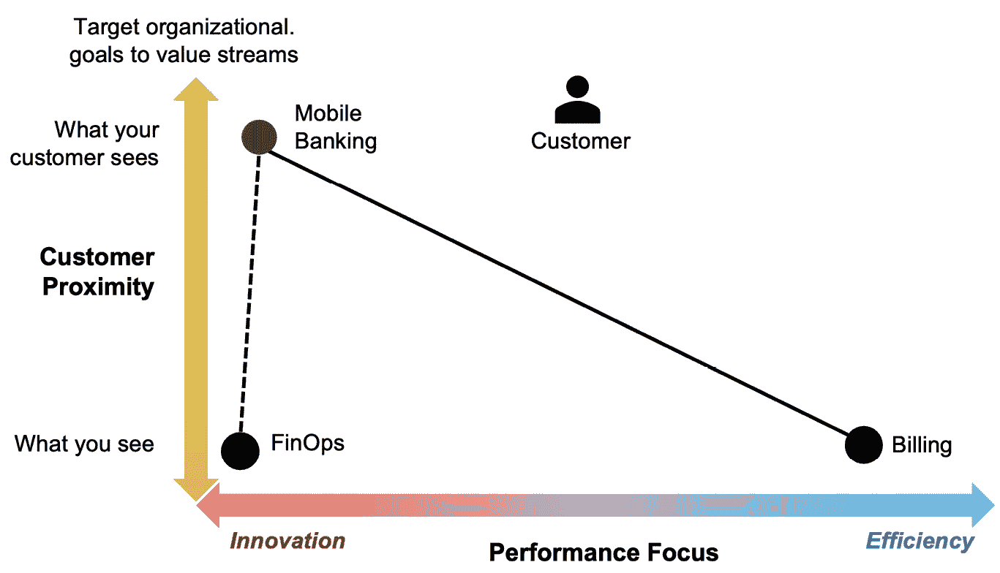

# 7

# 连接价值流网络

“今天的成功不仅仅是生存变化，而是引领变化。” – 彼得·德鲁克

想象一下你的组织是一个庞大的通信网络，协调从初步构想到最终成果的工作、信息和资源，从请求到交付。作为商业和 IT 专业人士，你的成功取决于如何高效地管理这些复杂的流程，以支持客户旅程并推动业务成果。你如何确保这些流程在整个组织中顺畅运行？

管理这些不同工作的部分需要的不仅仅是单一的价值流——它需要跨多个与客户需求对齐的价值流的协调努力。

**价值流网络**（**VSNs**）是你组织内部互联的路径，战略性地对齐以交付整体价值。VSNs 展示了工作项如何在多个价值流中流动，同时支持服务于我们的业务、利益相关者和客户需求的更广泛网络。

工作和信息在这个网络中的无缝流动，最大化了通过产品和服务交付的价值。然而，这些相互连接的部分可能带来复杂性、约束和潜在的浪费，需要有效管理。网络创造价值的能力取决于保持可靠、可扩展和高效的运营。

即使单个价值流经过优化，它们的相互连接和不断演变也会带来复杂性。本章将介绍管理这些复杂性的策略。

一个 VSN 在一定程度上可以在没有可视化和衡量的情况下运作。然而，若没有价值流网络的可视化表示，组织将难以改善工作流程，并可能冒着本地优化带来不良副作用的风险。

本章涵盖以下主题：

+   管理和优化价值流网络

+   可视化组织工作流程

+   指导价值流战略和投资

+   发展价值流网络

# 管理和优化价值流网络

价值流网络，正如米克·科斯顿在他的书《从项目到产品》中定义的那样，指的是一种全面的方法，捕捉并分析工作在组织内的流动。价值流网络通过展示人员、流程、信息和技术如何整合以优化客户价值交付，提供了组织的整体视图。这种方法帮助从基于项目的思维方式转变为以产品为中心、以客户为核心的视角。

**价值流网络**（**VSNs**）促进了团队和流程之间的协作，确保整个组织中高效的价值交付。它们的核心作用是促进从创意到交付的价值进程，包括各种团队之间的互动、交接和依赖关系。例如，当你在线订购一件产品时，从设计、开发到履行和市场营销的多个团队将协作，确保产品顺利交付。

价值流网络具有动态响应性，会根据软件更新、市场变化和预算调整不断演变，因此需要持续的适应性才能保持有效性。借鉴类似图论的原理，图论研究网络中点（节点）之间的连接（边），它们在团队之间穿行，提供超越传统层级组织图的见解。

理解价值流网络对于掌握推动组织效率和价值交付的复杂网络至关重要。它超越了组织结构图，提供了对想法如何转化为实际成果的更深刻理解。

在价值流网络中整合多个价值流服务于几个关键目标：

+   **端到端可见性和协调**：组织能够全面了解工作和信息如何在不同部门、职能和流程中流动，从而提高朝着共同商业目标的协调性

+   **价值交付优化**：通过识别和消除低效，组织优化了向客户交付价值的速度和效率

+   **跨职能协作**：价值流网络促进不同团队之间的协作，打破部门壁垒，改善问题解决能力和创新

+   **持续改进**：支持持续改进文化，组织分析流程、收集见解并实施变化，以提高绩效并适应市场需求

+   **以客户为中心**：整合价值流有助于组织将活动与客户需求对齐，从而提高客户满意度和忠诚度

虽然通常与软件开发中的精益敏捷方法学相关联，但价值流网络（VSN）原则广泛适用于采用精益价值流概念的各个行业：

+   **制造业**：优化物料流和生产过程

+   **医疗保健**：简化患者护理和支付方流程，以获得更好的结果

+   **供应链管理**：增强库存管理和响应能力

+   **服务行业**：改善客户服务流程和客户满意度

+   **政府和非营利部门**：提高服务交付和资源配置效率

本质上，价值流网络推动运营效率，促进协作，培养持续改进，并在软件开发以外的多个领域增强以客户为中心的文化。

## 组织价值流网络

在本小节中，我们将探讨价值流网络如何在组织内应用。我们将不再将网络视为一个无形的网络，而是将其锚定于一个或多个客户旅程，突出其与客户的紧密关系，并描绘其活动的重点是发展还是运营。此外，我们还可以模拟并假设每个流以及整个网络中测量、运营模式和战略变更的效果。

采用价值流网络模型进行软件交付包括所有生产软件所需的任务，以及将人员、流程、信息和技术作为支持软件开发生命周期及所有价值流流动的使能能力进行整合。该模型涵盖了从最初的想法或客户请求到开发、测试、部署和持续支持的整个端到端过程。

但价值流网络不仅仅是连接软件开发活动。当你浏览本章内容时，你会发现连接所有价值流以支持我们客户的旅程的重要性。反过来，我们将软件交付流对齐，以协助改善所有运营、开发和支持价值流。价值流管理为我们提供了识别和优先考虑改进活动的方法和工具。

在深入了解网络之前，让我们先回顾一下价值流模型，作为流动和价值交付的参考。我们将从*图 7.1*开始，它展示了价值流网络的可视化。

图 7.1 – 价值流网络的可视化

价值流网络代表了一种超越传统组织结构的变革性范式。例如，这一整体模型整合了人员、流程、信息和技术，这些元素在一个互联的虚拟组织中产生能力，以优化整体流动，如图所示。

这些网络提供了组织工作流程的全景视图，促进了持续改进和无缝的价值交付给客户。通过定义它们，我们能更好地规划、讨论并诊断绩效改进的机会。在接下来的部分中，我们将进一步探讨价值流网络的基本原则及其在当代软件交付过程中的应用。

## 定义客户旅程

客户旅程已成为从客户的角度考虑价值交付的流行方法，并且在过去几十年中，成为产品管理的宝贵参考。客户旅程可以被绘制、衡量并用于推动以客户和结果为中心的对话。它们为技术领导者提供了与业务领导者在共同基础上进行互动的优秀参考点。与其将网络映射限制于严格的内部或孤立范围，这样的背景更具价值。

业务的存在是为了为客户创造价值，而客户旅程为团队和组织提供了一个共同的基础，让他们开始接受价值流的概念。它提供了一种外向的、以客户为中心的视角，以及一个理解从客户（或业务结果）反向到想法或请求的价值交付的可视化工具。

认识到客户旅程与价值流之间的区别至关重要。客户旅程，如*图 7.2*所示，通常超出了组织的控制范围。它发生在组织的边界处，客户与产品和服务互动的地方。其路径主要由客户决定，这可能限制了组织完全影响或优化它的能力。

图 7.2 – 典型客户旅程的示意图

例如，考虑两个客户：一个客户通过朋友推荐产品并立即购买；另一个客户通过广告发现了我们公司的产品或服务，调查了其他选择，被其他需求分心，直到时机、需求和成本匹配时才会回来购买。如果通过价值流的视角来看这两种情况，它们的路径和特征将会有显著不同。这两种情形的交付时间也会大不相同。此外，对于客户互动，现有的机制不足以衡量在制品、增值时间、完成度或准确度等指标。客户旅程通常通过情感、购买概率、获取成本、转化率、订单规模等来衡量。

相比之下，组织对其价值流的运作有显著的控制权。虽然他们不能直接决定客户的行为，但可以通过实施标准化和自动化来促进流动的改进。关键指标如交付时间、增值时间、吞吐量、质量和在制品等都是必不可少的。组织能够比引导客户旅程更有效地指导工作流通过价值流。

客户旅程为理解价值流提供了基础，因为没有客户旅程，价值流就没有明确的方向或焦点，也无法与网络中的其他流连接。有了客户旅程作为流动的支点，我们可以将价值流与客户旅程的关键接触点连接起来，展示它们如何推动并支持客户旅程。

例如，营销活动价值流有助于客户的发现和知识积累，可能最终导致销售，而销售和购买过程——通过易于使用的系统（如结账或购物车）简化——则代表着独立的价值流，最终促成购买。这意味着，当我们在客户旅程中遇到问题时，可以直接追溯到相关的价值流。现在，让我们讨论如何可视化我们价值流与客户的接近程度。

## 可视化价值流与客户的接近度

*图 7**.3* 展示了价值流分类的一个基本方面：各个流与客户的接近度。例如，在图表的顶部是移动应用程序，它们直接接触并使外部客户受益。在光谱的低端，账单被列为一个主要使组织受益的价值流，通过启用移动银行应用程序。你也可以将这个光谱视为从外部到内部的焦点，其中接近客户的程度定义了流在此维度上的位置。

图 7.3 – 可视化价值流与客户的接近度

在光谱的低端是像账单这样的功能——一个对组织至关重要但对客户而言是不可见的内部过程。这些内部价值流同样重要，因为它们支持外部服务。然而，它们的目的更多地是内部聚焦，处理那些使组织运转顺畅的操作，如对账和采购流程。

将价值流展示为一个光谱，可以清楚地看到哪些环节最关注最终用户的互动和满意度，例如移动银行应用程序，而哪些则具有内部运营的焦点，如账单，它们确保了支持面向客户的服务所需的效率和稳定性。

*图 7**.4* 展示了网络如何开始为客户旅程服务：

图 7.4 – 将客户旅程作为锚点

产品使用阶段直接与产品开发价值流相联系。之后，审查和推荐阶段可以通过其他支持性价值流得到加强。主要的价值流，产品开发，可能会有如此大的影响力，以至于它推动客户完成整个旅程。然而，其他支持性价值流在帮助每个阶段之间的过渡方面也发挥着至关重要的作用，使客户更顺畅地从一个阶段过渡到下一个阶段。

在我们探索客户体验与价值流之间的关系时，下一部分将深入探讨客户旅程的概念。理解这一动态框架对于有效地利用价值流来引导和提升客户旅程至关重要。

在接下来的部分，我们将进一步探讨组织面临的紧迫挑战，强调需要采取战略性方法来简化价值流网络。

### 将价值流与客户旅程相连接

给定客户的旅程是一个个性化的路径，通常超出了组织的直接控制。它从一种内在的需求或欲望开始，激发好奇心，从而发现某个产品或服务。随着客户经历销售、购买、使用和评论等各个阶段，他们遵循的路径本质上是个人化的、由自己主导的。客户旅程可以被视为一系列相互关联的体验，每个体验都可能受到组织内不同价值流的影响。

*图 7.5* 描绘了一个企业 **软件即服务** (**SaaS**) 客户旅程。它从营销活动中的曝光开始，让客户意识到一个产品，从而使他们在有限的使用范围内试用产品，选择购买，并继续他们的客户体验。该图展示了客户旅程的每个阶段如何通过包括规划、设计、构建、验证和发布活动的价值流来支持，从而确保无缝且引人入胜的客户体验。

图 7.5 – 将价值流与客户旅程连接

这个旅程的可视化为理解价值流如何运作以及如何直接影响精益敏捷组织中的客户成果奠定了基础。通过跨价值流协调工作，我们为优化和改进创造了重要机会。通过标准化和自动化，组织可以塑造这些价值流，从而有效地支持客户旅程。

在旅程的开始，营销活动价值流在促使客户从最初的好奇心到产品使用、销售和支持过程中发挥着关键作用。通过让客户试用某个产品或服务，它为潜在的销售奠定了基础。旅程随后转向更具战术性的价值流，如销售流程，在这里，直观的结账系统或购物车等精简的系统促进了购买阶段的顺利进行。

产品开发价值流变得尤为关键，因为它与客户旅程的使用阶段相对应。在这个阶段，产品的质量和特性成为焦点，直接影响客户的体验和满意度。随后的阶段，如审查和推荐，可能通过其他支持性价值流进行增强，这些价值流专注于客户参与和忠诚度。

最终，尽管产品开发的主要价值流使客户能够完成他们的旅程，但支持性价值流的重要性不可低估。它们是穿插在客户体验中的纽带，确保每一次过渡都无缝，每一次互动都富有意义。这些价值流共同构成了一个范围，不仅定义了客户的旅程，还丰富了这一过程。

### 在价值流网络中利用流动

价值不仅仅是一个抽象概念；它通过我们的产品和服务以实际的利益形式呈现出来。一旦价值被量化或定性，它就可以被传递，而其创造和传递受到通过改善支持性价值流的影响。*图 7.6* 直观地揭示了支撑我们业务运作的价值流的互联特性，从运营层面一直到客户交付。

图 7.6 – 价值流网络示例

在这个图形中，客户成功专员扮演着至关重要的角色，确保客户能够通过公司的产品或服务实现他们期望的结果。他们提供入职支持、持续帮助和主动参与，建立牢固的关系，倡导客户需求，并提供培训以最大化产品价值。这个人帮助推动客户满意度、客户保持和长期成功。

这个可视化表示说明了每个价值流——无论其重点是运营还是开发——如何相互作用并为向客户交付的整体价值做出贡献。这是一个价值创造的网络，其中每一项工作、材料、信息和资源流动都被协调以支持和增强其他流。

在*图 7.6*中，我们可以看到每个互相依赖的价值流，根据它们与外部客户的接近度（纵轴）和它们的绩效重点（横轴）进行绘制。我们可以看到这些流之间的相互依赖关系，它们要么产生，要么消耗由其他流交付的能力和服务。通过放大每个流，我们可以看到执行的单个活动和参与交付特定产品、服务或能力的团队。为了固定这个价值创造和交付的整体可视化，我们可以看到每个组件与客户旅程的连接。

尽管可以用这种方式将整个组织可视化，但如果将与当前目标无关的方面也包括在内，其价值会逐渐减小，因此重要的是将网络映射与当前最重要的目标相关联。例如，如果目标是提高某一特定产品的销售，我们可以可视化客户旅程以增加销售，并理解该产品在旅程中的连接点。我们可以向上游查看促成此旅程的营销流，以及深入到网络中，了解支持产品开发和交付的内部流。

回到*图 7.6*，我们可以看到目前在推动建议方面的投资不足，而这可能对销售产生重大影响。这张图作为一个实际模型，帮助我们理解组织内部价值流的运作方式。在接下来的部分中，我们将深入探讨如何根据当前客户需求优化和调整这些价值流。随着我们将网络视图整合到 VSM 的组织战略中，我们为在更大规模和更广泛的影响下更深刻地应用流动原则铺平了道路。这不仅能提升组织绩效的具体方面，还能让我们保持对组织内整体流动的全面视角。

在接下来的子部分中，我们将探讨组织面临的紧迫挑战，强调采取战略方法来简化价值流网络的必要性。

### 解决组织挑战

大多数组织面临着在提高效率和质量的同时，还需要管理日益增长的改进机会待办事项。这些挑战是相互关联的，解决这些问题需要一种战略性的方法，核心在于优化运营流程。

在接下来的列表中，我们将探讨相关的工作内容：

+   **利用现有资源实现更多**：企业需要在扩大规模和竞争的过程中，用现有资源取得更好的成果。这意味着要简化流程、消除浪费，并利用技术提升交付最大价值的能力。通过从客户成果出发，绘制价值流网络，我们可以重新设计流程，强调对价值创造最为关键的环节，同时减少非增值活动、问题依赖和浪费。

+   **提高质量标准**：在追求效率的过程中，质量不能妥协。组织必须找到提升质量控制流程的方法，比如通过构建质量体系，确保交付的产品或服务能够达到或超越客户的期望。通过绘制依赖关系图，并将全流程活动映射到组织中的成果，我们可以深入了解哪些努力会对交付质量产生最大的影响。我们可以放大细节，也可以缩小视野，看到相互关联的影响。

+   **提升价值传递**：这里的目标是为客户提供更多的价值，这可以通过创新解决方案、更好的服务或更快速的支持来实现。企业必须不断发展，以满足并预见客户需求。通过将客户旅程融入我们的网络图中，我们可以更精准地将努力和投资与客户价值的最大影响关联起来，无论这些影响是上游的还是下游的，以及它们与客户的距离。

+   **培养人才满意度**：保持员工满意是维持创造性、创新性和高效工作的关键。这需要创造一个支持并鼓励员工成长与满足的工作环境。通过为组织提供一个全面的价值创造和交付的表现，我们可以确保贡献者能够看到他们的工作如何增值，将他们的努力与业务目标联系起来，并理解他们的工作在客户结果中的作用。

+   **加速吞吐量**：对速度的需求始终存在。组织必须优化其工作流，以更快地交付产品和服务，同时不牺牲质量。可视化相互依赖的工作流有助于理解为何某些流被低估或过度利用，以及瓶颈所在的约束。我们可以识别关键的集中能力，并确保它们在长期内保持最佳性能。

采用系统化的方法解决流动性问题至关重要。通过识别流程中的约束并采用如**约束理论**、**精益流**和**精益指标**等原则，企业可以系统地解决这些问题，创造更加高效和有效的工作流，推动价值创造和交付。将这种互联的工作置于价值、客户和业务结果的背景中，有助于企业更专注于对组织及其长期成功至关重要的事项。

## 可视化组织工作流

可视化并绘制不同层次的组织结构图使我们能够从不同角度考虑组织架构和工作流。在本节中，我们将更深入地探讨这些关系。

我们将从回顾*图 7.7*开始，在图中我们可以看到，价值流网络代表了顶部的宏观视角，中间是团队拓扑结构，底部是组织的价值链能力。*团队拓扑*是一个将软件交付团队分为四种类型的框架：与流对齐的团队、支持型团队、复杂子系统团队和平台团队。该方法帮助组织为实现最佳流动性、清晰性和协作，优化团队结构，以交付软件解决方案。

*图 7.7*展示了组织的交付结构，从整体的端到端流程到价值链能力和组件的具体互联。这种多层次的方法有助于澄清价值流网络中涉及的不同详细程度，让我们能够选择最适合目标和受众的细节层级：

图 7.7 – 可视化组织流程

这个可视化图表强调了认识到组织工作流程中不同层级的重要性。这种多维度的方法对于领导者和团队有效地导航和优化组织的价值流网络至关重要。

我们将在接下来的子章节中深入探讨这个图表。

### 价值流网络（顶部层级）

在顶部层级，我们可以看到价值流网络的全景，概述了工作在组织内部如何交付的*宏观*视角。这是最广泛的视图，重点是价值流如何从始至终地整体连接，而不深入到单个组件或技术依赖的细节中。

### 团队拓扑（中间层级）

移动到可视化的中间层，我们遇到了团队拓扑，这是一个概述组织内部团队如何构建以及如何互动的模型。这个层级从端到端的流动中放大，展示了团队拓扑，例如**流对齐团队**与**复杂子系统团队**并肩工作，并由提供基础服务的**平台团队**支持。

团队拓扑，正如 Matthew Skelton 和 Manuel Pais 在他们 2019 年出版的《*Team Topologies: Organizing Business and Technology Teams for Fast Flow*》一书中所定义的，是组织设计和软件交付中的概念。这些拓扑描述了团队如何在组织内部进行结构化和互动，以优化工作流程、减少瓶颈，并增强协作。Skelton 和 Pais 提供了有关如何组织各种团队类型（例如，流对齐团队、复杂子系统团队和平台团队）以支持组织目标并促进高效价值交付的宝贵见解。

除了结构之外，他们还定义了三种互动模式——**协作**、**X 即服务**和**促进**——使团队之间的连接变得明确定义为操作模型。在 VSM（价值流管理）的背景下，**操作模型**可以被视为一个蓝图，概述了组织如何向客户交付价值、管理资源并实现其战略目标。

通过明确团队之间的互动方式，我们可以避免许多孤岛操作的陷阱，在这些操作中，价值流“接力赛”的交接（接力棒）可能会掉落、延迟或出错。

### 价值链能力（底层）

在底层（或微观）级别，图表深入探讨了构成并有助于交付价值的能力和组件的具体细节。这个层次的细节是识别和审查单个特性和功能的地方，目的是了解它们如何为客户旅程作出贡献，从最初的概念到最终的交付和支持。

## 指导价值流战略和投资

**Wardley 地图**中的*图 7.8*提供了一个视觉工具，帮助组织理解其商业环境并据此制定战略。它帮助我们回答“我们应该在哪里投资？”以及在较小程度上，“我们如何交付？”的问题。

这张地图由两个主要组成部分构成：

+   **价值链（y 轴）**：这展示了满足用户需求所需的组件，从面向用户的可见组件到隐藏的基础设施。组件是指任何一个系统（或价值链）中的元素或部分，它有助于将产品或服务交付给最终用户。

+   **演进（x 轴）**：这表示每个组件的演进阶段，从起源（新颖且不确定）到商品化（普及且明确）。价值链是包括产品或服务生命周期的一系列活动，从起源到生产，再到最终顾客的购买。

在我们的应用场景中，我们正在评估是否应该投资基于 AI 的图像处理工具，以改进我们的价值流。

图 7.8 – Wardley 帮助回答应该投资在哪里以及如何交付

这张地图将帮助我们的组织回答战略性问题，例如：

+   我们应该集中精力开发或外包哪些组件？

+   哪些组件已经成熟，应该商品化？

+   我们应该在哪些方面进行创新投资？

+   我们如何预测竞争格局的变化？

通过可视化这些元素及其关系，组织可以更好地做出关于资源分配、创新和竞争定位的决策。这是一个非常有价值的战略规划工具，特别是在技术和商业环境中。

通过将组织的互联能力与客户需求进行映射，这一框架提供了一个全面的概览，平衡了创新的重要性与商品化的不可避免性。

在我们的 Wardley 地图的核心是支持客户需求的关键元素，如在线图像处理和照片存储，并根据价值链和演进轴进行标绘。价值链轴展示了价值是否对客户可见，而演进轴则显示了从独特的起源到标准化商品的演变过程。

### 战略投资决策

随着能力向商品化演进，组织必须决定在哪里分配资源，以推动创新并保持竞争力。我们的地图建议在**人工智能**（**AI**）图像处理方面进行战略性投资，红色矩形框突出显示了增强客户旅程或提升平台能力的效率和惯性的潜在点。

Wardley 图表通过将关键能力和活动沿着从创意到商品产品的演化轴进行映射，帮助识别潜在的投资机会。评估每个组件与行业标准的成熟度，征询利益相关者的意见，并定期更新位置，以反映行业、技术和客户需求的变化。这个过程提供了一个清晰的组织能力可视化，有助于战略规划，并识别创新和增长的领域。

### 协调战略架构

服务的组合，如计算或在线存储，不仅通过其与客户的关系来展示，而且通过它们与其他能力和组件的相互依赖来展示其架构背景。通过绘制这些服务的关系图，组织可以审视其投资策略，识别出优势和机会。

### 对齐战略和运营

尽管 Wardley 地图对于确定投资方向非常有价值，但它并未展示能力是如何被生产和消费的。价值流网络定义了每个能力如何在不同的价值流中被生产和消费，并识别它们的交汇点。

*图 7**.9*展示了价值流和价值链可视化的整合，阐明了我们基于价值的投资的“什么”、“为什么”和“如何”。这些结合的可视化不仅展示了我们投资应该指向何处，还提供了关于投资的目的和执行的洞察。

图 7.9 – 结合价值流和价值链可视化

在这个图形中，我们可以看到网络中各个价值流所使用的不同能力。为了与我们的目标对齐，我们可以从生产者和消费者的角度定义这些能力，并在能力和价值流之间建立直接的联系。

在了解了 Wardley 地图如何与价值流网络结合以提供战略方向后，接下来是深入探讨我们组织工作流程的细节，视觉化我们组织过程中宏观和微观视角的细节。

# 发展价值流网络

随着组织的发展，它们越来越寻求全面理解其运营动态以及如何影响这些动态。结合**客户接近度**和**绩效关注度**这两个维度，可以帮助领导者确定每个价值流相对于其对客户的可见度和其绩效的位置，如*图 7**.10*所示。

例如，像移动银行这样的价值流对客户是可见的，并且需要关注客户满意度的指标，如净推荐值（NPS）和客户参与度。这些是业务面向客户的元素，创新和对客户需求的响应至关重要。

图 7.10 – 平衡效率和创新绩效关注

相反，像账单处理这样的后台流程对客户是不可见的，它们属于绩效关注的效率范围。这些活动的衡量标准是运营卓越，衡量指标包括成本、标准化、可预测性和一致性。这些流程的战略考虑因素可能包括外包给外部供应商的潜力、简化操作或通过自动化来降低成本。

这种动态模型提供了关于如何在一个领域的变化——例如引入 FinOps 或平台自动化——如何在网络中产生涟漪效应，影响相邻的流的见解。将新能力集成到一个价值流中，例如移动银行，会引发适应性的问题。例如，移动银行应如何适应引入自动化的 FinOps 平台？这对客户体验可能产生哪些影响，又会带来哪些新的效率或创新？

行为和战略的影响是深远的。每一个连接，每一个图中的节点，都是一个决策点——一个必须仔细管理创新与效率、面向客户的行动与后台流程之间平衡的地方，以保持有效的价值流网络。理解这些连接以及内部流程与整体组织目标的对接，对于战略敏捷性至关重要。

价值流网络是动态的；它体现了变动的潜力，反映了组织的战略灵活性。**亚马逊网络服务**（**AWS**）的演变就是这一动态的一个引人注目的例子。最初作为支持亚马逊运营的内部基础设施项目，AWS 从内部能力转变为外部价值流。这一变化强调了随着时间推移衡量和评估价值流各个方面的重要性，以及与机会对接并实现新价值的必要性。

组织必须了解它们的价值流处于什么位置，以及如何随着时间的推移进行改进。此类战略举措带来了许多好处，从为客户提供价值、优化内部流程到保持竞争优势。通过理解和管理这一演进路径，组织可以开启新的机会，并以以前不可能的方式创造价值。

这种类型的演变对我们的价值流网络有影响，因为它们也必须过渡。我们将在下一小节中探讨这个概念。

## 通过绩效关注改善价值流

选择通过持续创新来改进可能会导致现有价值流的重组，这应该是一个深思熟虑的演变过程，而非彻底的颠覆。这种方法可以减少浪费和政治风险，并能利用现有的专业知识和能力。

*图 7.11* 展示了通过性能聚焦适应价值流的过程，突出了从创新到效率聚焦的转变。

图 7.11 – 通过性能聚焦适应价值流

对于许多组织而言，颠覆性创新—从零开始，摆脱旧有的限制—具有很强的吸引力。然而，这种方法通常需要大量投资，并伴随着一系列风险。相反，通过逐步调整现有流程（如账单流程）的运作，组织可以演变它们的价值流，达到不同的、通常更具创新性的成果，而不必放弃那些一直以来为其提供良好服务的基础系统和流程。

这种转变涉及到一个有意识的决定，即从既定的衡量标准和行为模式转向新的目标。例如，一个传统上侧重于效率的账单系统，可能开始融入更多创新的方法，如采用新技术或修改工作流程，以提升客户体验、自动化或性能。这些变化可以带来一个更加动态和响应迅速的账单流程，同时保留现有系统的核心优势，如可靠性和可预测性。

这一转型是关于适应新环境和挑战，同时保持那些已经证明成功的要素。需要明确的是，这是运营模式的演变，而非技术或能力的变化。因此，领导者需要专注于理解和定义衡量成功的新指标。通过重新定义这些指标，组织能够鼓励在既定价值流框架内推动创新的行为。

总结来说，通过有意地调整现有的价值流，组织可以找到一个折中的方法，既能实现持续创新，又能实现颠覆性创新。反过来，这使得服务和流程的演变既具有创新性，又扎根于过去经过验证的基础之上。

## 想象价值流的动态

*图 7.12* 再次展示了一个二维画布，让我们可以将各个流与它们的接触点活动进行对比。

图 7.12 – 简化的互联价值流网络

具体而言，这张图描绘了一个简化的互联价值流网络，并阐明了这些连接的关键性。

这些网络的核心是面向客户的产品，如移动银行，它们可能会得到与之相关的流（如贷款资格服务）的支持。这些流距离客户的近远（外部焦点）取决于它们对客户体验的直接影响。

更深入地探讨，当考虑到现代技术（如人工智能）在**客户关系管理**（**CRM**）中的引入时，这一网络的动态特性变得显而易见。为了有效利用人工智能，CRM 流可能需要转向创新，优先考虑反映这一新焦点的指标。这样的转变自然会推动团队内的不同行为，将 CRM 流拉向创新端的谱系。

作为另一个例子，我们可能需要评估我们内部开发人员的体验，他们可以从使用平台或学习环境（如**道场**）中受益。**道场**是一种结构化且协作的学习方式，鼓励在实际环境中进行实验、技能发展和问题解决。为了在整个组织中有效地推广这一方法，我们可能会决定将我们的价值流朝着提高效率的方向发展，衡量标准化程度和为开发人员提供的一致体验的水平。

了解每个价值流可以涵盖多个团队和职能，突显了组织工作流程的复杂性。这些流动的变化不是任意的，而是为了推动进化、利用诸如人工智能（AI）等机会来增强客户接触，或在这种规模上创造效率的战略性选择。

从这个角度看，组织可以开始看到变革的杠杆以及战略决策的潜在影响。通过操控定义每个流成功的指标，领导者可以引导团队实现预期的结果，无论是创新、效率，还是两者的结合。这种方法使得组织的价值交付机制能够有意识地设计，确保它们在面对内部迫切需求和市场要求时仍保持敏捷和响应性。

这些流的演进是战略重新定位的舞蹈，每一个动作都有可能催生进一步的转型。正是这种流动性使得组织能够在一个既需要稳固可靠性又要求不断创新的环境中适应并繁荣。然而，过渡价值流的过程往往需要重新组织组织资源，以支持这些转型。因此，我们需要一种方式来比较我们网络中的价值流。我们将在下一小节中探讨这种方式。

## 评估价值流网络

我们可以在矩阵中评估我们的价值流网络，以定义关键特征，从而帮助我们确定价值流需求。*图 7.13* 展示了一个矩阵视图，简化了通过关键属性比较我们网络中价值流的过程，这些属性包括价值流需求、履行特征、网络位置（从前台到后台）及其主要功能（开发性或运营性）。

在你的图表和表格中，确保列出、排序并注释你的流。如果你有雄心壮志，你还可以为每个价值流添加具体的度量标准或目标，以提供有关性能能力和目标的更多细节。你还可以定义依赖关系，指示共同的杠杆点或挑战点。

现在，我们有了一个可视化我们的价值流网络属性的方法，让我们继续学习如何利用价值流映射来揭示和解决我们的瓶颈问题。

图 7.13 – 比较价值流属性

## 价值流映射揭示隐藏的瓶颈

使用价值流映射时，我们的目标不仅仅是追踪工作流程和衡量绩效；我们还希望识别出导致低效的隐藏瓶颈。这些关键的瓶颈通常是依赖关系成为问题的地方，揭示了影响价值流动的过程中的关键区域。

*图 7.14* 总结了这一全面分析。它展示了一个从初始请求到部署的详细时间线，描绘了每个步骤的持续时间以及中间的延迟。这样的透明度对于识别我们可以提高效率的地方以及找出生产系统中的瓶颈至关重要。

图 7.14 – 价值流映射

在这张价值流图中进一步分析，可以识别出显著的延迟：环境设置过程的活跃时间消耗了该价值流中约 71% 的总活跃时间。通过深入分析环境设置过程的活动，我们可以更好地理解所执行的工作。将这一过程拆解为具体活动，可以帮助我们找出延迟的根本原因，并制定有针对性的改进策略。

*图 7.14* 还揭示了依赖关系如何在我们的组织框架中形成错综复杂的网络。例如，环境设置过程是涉及数据和 DevOps 团队的一系列协作活动的一部分，同时也包括数据克隆和环境验证等关键活动。识别这些相互依赖关系能够揭示影响我们工作流程的复杂交互，这些交互可能是临时性的或由中断驱动的，而非流畅的价值流。

利用这张图，并深入挖掘活动中的流瓶颈，我们可以开始看到价值流之外的网络及其更深层的能力。

价值流图充当了一种透镜，通过它，跨部门工作流的相互关联性变得显而易见，网络结构逐渐显现。这些相互依赖性通常反映了优化的潜力。例如，手动流程可以被自动化，转化为更加简化的自助服务工作流，从而提升价值流的效率。

然而，并非所有通过价值流图识别出的工作流都代表着成熟的价值流。该图可能包括处于不同成熟度和自动化阶段的潜在价值流。识别这些阶段使得组织能够战略性地优先考虑开发工作，聚焦在那些具有最大潜力进行改进和自动化的领域，以提升效率和价值。

价值流图不仅仅是识别当前的工作流。它充当诊断工具，使我们能够剖析并理解组织流程的结构。这些图示工作帮助我们找到可以产生最大影响的地方，将问题和机会转化为可衡量的结果。因此，既然我们知道可以利用价值流图揭示我们的瓶颈，接下来我们来探讨如何消除这些瓶颈，以简化我们的价值流。

## 简化产品和平台价值流

*图 7**.15*展示了一个战略性的组织框架，区分了产品开发与平台价值流，从而在以技术为核心的商业模型中实现高效的解耦和去中心化：

图 7.15 – 对齐网络视图的流

核心思想是引入**共享平台**，作为解耦团队依赖关系的一种方式，从而使团队能够更加独立地运作。

在这个例子中，产品价值流明确了服务于**企业对企业**（**B2B**）和**企业对消费者**（**B2C**）市场的线性顺序，突出了那些增加价值并推动产品向市场发布的关键阶段。平台价值流则是提供必要基础服务的支撑结构，支持产品开发。它们协同工作，推动自助服务模式，提高敏捷性，缩短市场时间。

现在，让我们从工作流和价值实现的总体概念转向具体内容，深入探讨这些概念如何在组织的产品和平台价值流中得以体现：

+   **产品价值流**：*图 7**.15*展示了两条路径：B2B 应用程序 G 和 B2C 应用程序 R。这些价值流代表了将产品推向市场所需的步骤，分别面向商业客户和个人消费者。每个步骤都在增加价值并使产品更接近市场准备状态。

+   **平台价值流**：这些支持以产品为中心的流程。它们提供设计、计费、集成、数据管理和合规等基本服务，促进产品价值流的顺畅运作。

产品价值流无缝使用平台价值流的强大基础设施。这种关系使产品团队能够高效使用基本服务，加快开发速度并简化从概念到客户的路径。

到目前为止，你应该清楚，本书始终专注于为客户提供最大价值。在下一节中，我们将探讨如何在我们的价值流中建立一个以客户为中心的文化。

## 培养以客户为中心的方法

流程对齐团队作为共享平台提供的内部客户，而平台团队则提供自助服务能力，以增强操作流程和产品开发。因此，平台团队需要采用客户服务的心态，提升服务质量，促进卓越和持续改进的文化。

流程对齐团队与平台团队之间的关系对我们的共享服务模型至关重要。作为内部客户，流程对齐团队利用平台的能力来改进其运营和产品开发。

在许多组织中，有一种倾向是强制使用特定的内部软件开发工具和平台。然而，为了避免产生反效果，高管管理和平台团队必须致力于通过提供竞争力的服务和能力来支持与流程对齐的团队。

与其将平台采用视为义务，重要的是以客户服务的心态来对待。平台团队应该像为外部客户提供服务一样交付他们的能力，确保服务水平可以与或超过外部替代方案。或者，组织可以考虑将此服务外包给专门的平台支持公司。无论哪种情况，只要有客户存在，就存在客户旅程，必须注意支持。

通过像对待面向外部市场的产品一样用心对待内部可交付物，平台团队可以提升组织的服务质量。这激励流程对齐团队与平台的服务互动，有助于整体价值流网络的健康发展，并建立卓越和持续改进的文化。

# 总结

我们已经到达本章的结尾，在这里我们探讨了如何在二维画布上分析价值流网络。让我们快速回顾一下我们讨论过的内容。

我们了解到，通过详细描述和评估价值流，我们可以更好地设计它们并与领导者和贡献者进行更有效的沟通，帮助他们参与改进之旅。本章概述了价值流的复杂战略框架，展示了它们如何将人员、流程、信息和技术整合为能力，以交付客户价值。

本章强调了优化这些组件以提升生产力、效率和适应性的必要性。它强调了价值流网络中的敏捷性，确保组织能够应对客户需求并在变化的商业环境中保持竞争优势。

现在，我们转到*第三部分*，*实现精益敏捷和价值流管理（VSM）精通*。接下来的章节将深入探讨如何在团队与团队以及企业层面实际应用精益敏捷和价值流管理原则。*第八章*介绍了**基础精益敏捷解决方案团队**（**BLASTs**）的实施，提供了协调多个团队工作的见解。*第九章*讨论了定义**企业业务敏捷系统**（**BASE**），提出了将面向价值的敏捷性嵌入整个企业的蓝图。

BLAST 和 BASE 将展示如何将书中前两部分的概念付诸实践，弥合理论与实践之间的差距，以实现业务变革的实践。具体而言，你将学习如何让多个精益敏捷团队在企业级模型中协作，进行持续的业务转型，同时专注于通过我们的产品和服务提供以客户为中心的价值。

# 问题

本节内容提供给那些希望评估自己对本章提供的信息的理解和记忆的读者。共有四个问题，答案将在后续部分提供。回忆原文的确切措辞并不重要，关键在于你能回忆起概念及其应用：

1.  在软件开发生命周期中整合价值流网络原则的主要目标是什么？这种整合如何提高每个阶段的效率和效果？

1.  价值流网络如何帮助解决常见的组织挑战，例如在有限资源下做更多的事情、提高质量、交付更多价值、保持人才满意度和加快速度？

1.  使用二维网络模型（包括客户可见度和运营焦点轴）绘制价值流，如何帮助组织领导者在战略决策中以及保持有效的价值流网络方面提供帮助？

1.  如何在组织的战略框架中进行流对齐的概念，能够促进产品和服务的开发与交付？

# 答案

1.  将价值流网络原则融入软件开发生命周期的主要目标是优化从概念到交付的价值流动，同时支持客户旅程。这通过减少浪费、最大化资源利用率、提高效能来提升效率。通过关注人员、流程、信息和技术之间的相互作用，这种方法促进了无缝且适应性强的工作流程，推动持续改进的文化，帮助组织保持敏捷性和竞争优势。

1.  价值流网络通过创建一种结构化的方法来简化流程，从而帮助解决组织挑战，促进高效的价值交付。这种方法通过优化工作流程、通过持续反馈循环改善质量，并通过紧密对齐输出与客户期望来提升客户价值，从而实现“以更少做更多”的目标。

1.  使用二维网络模型绘制价值流图，其中轴表示客户可见度和运营焦点，为组织领导者提供了一种战略决策工具，以保持有效的价值流网络。

1.  流动对齐通过澄清产品和平台的价值流，增强了产品和服务的开发与交付。产品价值流专注于特定市场细分的活动，确保每一步都能增加价值。平台价值流则提供诸如设计、运营支持和数据集成等关键服务。

# 进一步阅读

1.  Kersten, M. (2018). 《从项目到产品：如何在数字化颠覆时代通过流动框架生存并蓬勃发展》。IT Revolution Press。

1.  Skelton, M., & Pais, M. (2019). 《团队拓扑：为快速流动组织商业和技术团队》。

1.  [`itrevolution.com/articles/the-three-team-interaction-modes`](https://itrevolution.com/articles/the-three-team-interaction-modes)

1.  [`learnwardleymapping.com/`](https://learnwardleymapping.com/)

# 第三部分：实现精益敏捷和价值流管理（VSM）精通：面向产品导向型业务转型

在本书的*第三部分*，我们深入探讨了两个框架，帮助组织应对在有效交付价值的同时，保持精益（Lean）和敏捷（Agile）实践的双重挑战。基于*第八章*和*第九章*的见解，您将学习如何在局部或解决方案层面、以及在企业层面整合精益敏捷工作实践，从而为我们的外部客户创造价值。

+   *第八章*，*实施基础精益-敏捷解决方案团队（BLAST）*，介绍了 BLAST 框架，通过将精益高效性与敏捷适应性结合，促进多个小团队在协作解决特定问题时开发点解决方案。它强调了领域专家在提升各种流程、产品和系统中的关键作用，这些专家通常在精益导向和敏捷导向的团队之间协作工作。

+   *第九章*，*为企业定义业务敏捷系统（BASE）*，介绍了 BASE 概念模型，该模型组织、同步并整合了企业内部的工作，以确保向外部客户成功交付基于价值的产品和服务。它使组织能够通过将投资与战略目标对齐，并建立一致的产品和服务交付节奏，从而应对不断变化的市场需求。

在*第三部分*中，我们将探讨组织如何实现精益-敏捷和价值流管理（VSM）精通，以推动以产品为驱动的业务变革。这些章节为如何利用 BLAST 框架将组织演变为企业的业务敏捷系统（BASE）提供了可操作的洞察和实用的指导。
