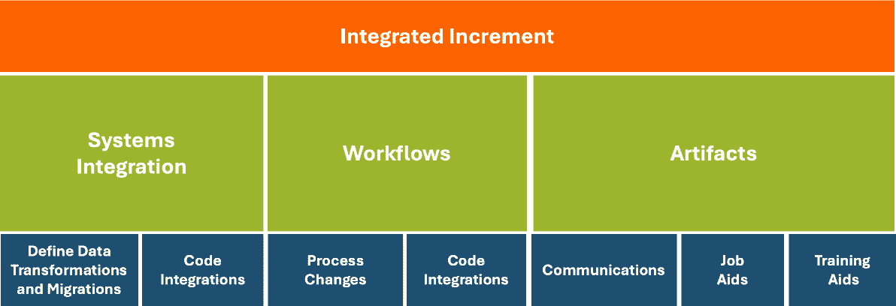

# 实施基础精益-敏捷解决方案团队（BLAST）

今日的成功要求具备持续创新的敏捷性和速度，并且拥有高效和自律的能力，以持续交付价值。整合精益和敏捷方法论是实现这一平衡的关键。

——微软首席执行官 Satya Nadella

世界变化的速度比我们想象的要快，而且随着**人工智能**（**AI**）、**机器学习**（**ML**）和机器人技术的崛起，变化的步伐只会加快。自动化和数字化已成为常态，使得个人能够更加高效和快速地完成工作。

因此，在数字时代中，竞争和生存需要感知并回应市场变化和新兴机遇。认识到这一紧迫性，**基础精益-敏捷解决方案团队**（**BLAST**）框架是你将精益效率与敏捷适应性相结合的权威指南。

虽然精益和敏捷有着不同的基础，但将它们结合起来创造了无与伦比的优势。例如，基于敏捷的软件交付组织通过实施高度集成和自动化的 DevOps 管道，显著改善了其价值流。DevOps 转型滞后的公司面临着过时的风险，这突显了一个硬道理：仅仅依靠敏捷或精益是不够的。未来的领导者将是那些能够熟练整合这两种方法论的人，不仅在软件交付中，而是在整个组织中。精益通过帮助消除浪费，使你能够释放更多的能力来提升产品和服务，最终提高利润。

BLAST 通过协调多个小团队产生持续流动的工作，扩展了传统的敏捷方法（如 Scrum），同时无缝地融合了敏捷的迭代和增量方法，用于开发新产品和服务或解决复杂的商业和技术问题。

在本章中，我们通过使用 BLAST，详细介绍了结合精益和敏捷方法的机制。BLAST 的 17 个步骤（见*图 8.1*）展示了从概念到实现的全面方法，促进了未来准备型组织的敏捷性和精益效率。本章涉及的主题包括以下内容：

+   利用 BLAST

+   实施基础精益-敏捷解决方案团队（BLAST）

+   整合精益-敏捷开发理念

+   优化开发节奏和价值交付

+   接纳精益-敏捷管理实践

+   追溯 BLAST 的历史

# 技术要求

理解本章内容没有技术先决条件。然而，你可能会发现回顾*第二章*《用敏捷解决复杂商业问题》和*第三章*《建立精益流以提高生产力》中的概念会有帮助。

# 利用 BLAST

如果问题总是小而可控的，一个组织可以简单地雇佣一个或两个小型的敏捷团队，比如 Scrum，来解决其业务问题或开发需求。然而，情况并非总是如此，特别是在大型组织中。此外，许多支持业务流程、系统、产品或面向服务的解决方案所需的人员，其运营角色更适合于*精益流动实践*。

按照敏捷的**迭代与增量开发**（**IID**）模型，BLAST 中的其他团队协作，在时间盒内的多个迭代周期中实施解决方案，这些迭代周期持续时间不同，但始终遵循固定的节奏。

BLAST 团队的生命周期因工作范围而异。例如，旨在实现涉及跨业务系统数据集成的业务流程的 BLAST 可能是相对短期的，通常为数周至数月。相反，支持持续业务流程或商业产品和服务开发活动的 BLAST 团队通常会跨越其经济可行的生命周期，通常是以年为单位来衡量的。

在价值流的背景下，BLAST 实施了团队协作概念，以在单一价值流或多个价值流之间同步工作，后者更加常见。尽管 BLAST 中的一些团队和个人在日常工作中遵循精益流动原则和实践，但其他团队则遵循敏捷的迭代和增量模式，采用如**Scrum**、**看板**或**极限编程**（**XP**）等方法。

我们还必须考虑混合情况，其中一个团队同时采用精益和敏捷实践。这在现代软件交付组织中常见，特别是那些已实施**持续集成/持续交付**（**CI/CD**）和 DevOps 工具链来整合、简化和自动化其流程的组织。在现代软件交付管道中，BLAST 团队以双重模式运作，利用精益的流动来处理日常操作工作，同时使用敏捷的时间盒模型来进行规划、解决方案开发和交付。最后，某些来自精益导向运营团队的领域专家可能会根据需要或临时情况支持敏捷导向开发团队的工作。

尽管采用了不同的工作模式，BLAST 引导团队以协调的方式进行协作，确保他们在价值流之间的一致性。无论如何，精益敏捷方法强调**客户体验**（**CX**）的持续改进，并在参与规划和执行的人员中培养以价值为导向的思维模式。总之，BLAST 为跨多个团队的解决方案开发提供了清晰的战略和结构，确保他们的共同努力为组织目标做出贡献。

在下一节中，我们将深入探讨 BLAST 的机制，探索它在增强跨团队协作卓越性方面的作用。

# 实施基本精益敏捷解决方案团队（BLAST）

Scrum 框架的一个标志是其简单性，包含三个支柱、三个角色、五个事件和三个工件。这种简单性使得 Scrum 成为理想的敏捷框架，适合个体小型团队。

要在整个企业中正确地推广敏捷方法，我们需要增加团队的数量，而不是每个团队内人员的数量。虽然各个团队可以保留 Scrum 的简单性来支持他们的工作，但当跨多个团队整合和协调工作时，复杂性就会产生。这就是 BLAST 框架变得至关重要的地方——用于管理这些复杂性，如*图 8.1*所示。

图 8.1 – BLAST 框架

在本章内容中，继续参考*图 8.1*，它描绘了在 BLAST 框架内多个精益敏捷团队进行工作的流程。

作者们在 BLAST 框架中努力保持简洁，但组织多个团队在精益和敏捷模式下的工作需要更多的努力。与使用“事件”术语的 Scrum 不同，BLAST 使用“步骤”这一术语，暗示着行动和进展。在本章中，您会发现 BLAST 框架帮助团队跨越十七个步骤，在四个**核心工作领域**内协调多个精益敏捷团队的工作，并辅以三个支持**角色**和三个交付**工件**。我们已经在*第一章*中阐述了精益敏捷房屋的目标、基础原则和三个支柱，因此在此不再赘述。

## 分类 BLAST 工作活动

如前所述，BLAST 的十七（17）个活动被分为四个主要类别：

+   **解决方案发现**

+   **MVI 规划**

+   **工作流协调**

+   **客户反馈**

这种分组的目的是将 BLAST 开发周期拆分为逻辑工作组件，以便在多团队环境中便于我们迭代和增量地交付价值。同样重要的是，BLAST 实施了一个闭环且以客户为中心的流程，确保工作平稳、持续地进行，同时保持灵活性和适应性。

以客户为中心意味着将客户体验优先考虑在每个人的行动和态度中。这是一个全公司范围的战略，需要的不仅仅是考虑客户的需求。以客户为中心的企业提供完整的产品解决方案，这些解决方案是基于对客户需求的深刻理解而设计的。这种方法改善了员工的协同，使客户的满意度得以提升，最终推动商业企业的收入和盈利能力增长。非营利组织和政府则通过更好地为受益人和公民服务来履行其使命。

随后的子章节描述了这四个类别中的每个活动，划定了工作流程，以确保精益和敏捷原则的顺利整合。我们将从形成 BLAST 以客户为中心的基础的活动开始，这些活动涉及解决方案的发现。

## 定义 BLAST 增量

BLAST 的核心目标是创建**最小可用增量**（**MVIs**）。然而，MVIs 并不总是会在可用时立即发布。通常，多个 MVIs 会被捆绑在一起，形成 MVRs。这些 MVRs 可能来源于一个 BLAST，也可能来自多个 BLAST。当这种情况发生时，创建 MVIs 的顺序可能取决于它们是否与其他 MVIs 一起捆绑，以形成 MVR 或集成增量。从概念上讲，集成增量是将 MVIs 捆绑在一起，以组装一个完整的解决方案或产品发布的组件。MVRs 在 BASE 规划活动中被指定，因为它们是产品管理定义的发布的一部分。

## 解决方案发现（步骤 1 和 2）

以客户为中心的企业将客户的价值、需求和期望视为规划和执行中的最重要因素。这一理念应当指导每一个商业决策。

以下基础步骤启动了 BLAST 团队的价值流改进：

1.  **客户旅程**：我们方法的核心是深入了解客户的需求和价值。客户旅程涵盖了每一次互动和接触点，从最初的认知到购买、使用及更远的阶段，可能还会导致客户的推荐或复购。实现积极的用户体验和客户满意度需要通过直接的客户互动，持续评估和改进我们的价值主张。

1.  **业务价值待办事项**：业务价值是通过将客户需求转化为可执行的、优先级排序的工作项来创造的，这些工作项提供了全面的解决方案。业务价值待办事项的开始是识别潜在的工作项，作为原始的想法和概念。通过细化，这些想法会被审查，以充分了解涉及的工作范围，并根据在可用时间和资源内增加最具客户价值的工作项来优先排序。业务价值待办事项捕捉了这种理解。

BLAST 超越了理论，并支持使用有助于深入理解客户价值和需求的实践。产品不仅仅是其特性的总和；全产品方法考虑了客户旅程中的一切，从购买到使用和支持。

在建立以客户为中心的基础之后，BLAST 团队继续处理**MVI 规划**，为价值驱动的交付奠定基础并做出承诺。

## MVI 规划（步骤 3 和 4）

本小节探讨了团队如何协作规划和细化目标，制定工作策略，并确保快速的价值交付与反馈。最终，我们需要就团队的短期目标达成一致，以便管理和消除依赖关系、整合需求并优化工作流：

1.  **MVI 细化**：价值经理（产品负责人）与开发人员合作，细化需求、架构和设计，以创造合适的产品、服务或信息资产，为客户提供价值。这个细化过程聚焦于三个关键领域：将史诗拆解成故事级别的细节，解决架构和设计问题，确定实现所需特性和功能的低层次任务。

    史诗（Epics）只是尚未细化成可执行的用户故事和技术故事的大型故事。相较之下，故事（Stories）足够详细，可以构建实现需求所需的特性和功能。

1.  **BLAST 规划**：交付客户价值需要将工作拆解成可用、可操作的增量，通常需要多个跨职能团队的协作。这一关键活动涉及团队协调每个任务的责任人和完成时间，并确保他们的努力能够同步与整合。团队致力于持续和频繁的按节奏交付，与价值经理/产品负责人以及其他利益相关者协作，发布产品和服务。

掌握 BLAST 规划的细微差别，确保团队的工作直接与客户需求对接，并推动可见的商业成果。通过将战术计划与战略目标对齐，并作出明确承诺，团队能够实现高质量的商业成果，提升在组织中的信誉和影响力。

随着 BLAST 团队从规划转向行动，他们进入了 BLAST 运作模式的核心。在下一小节的 **工作流协调** 中，我们将学习团队如何将计划付诸实践，如何无缝整合工作流，并确保他们能够有效适应执行中的挑战。

## 工作流协调（步骤 5 至 11）

BLAST 强调，强有力的执行必须与 MVI 规划目标保持一致。对于 BLAST 团队来说，理解并执行执行、集成和协调的步骤，确保在规定的时间框架内有效实现规划的工作。

现代集成的 DevOps 工具链实现了自动化配置、构建、测试和部署，将产品开发过程提前到交付周期的前端。敏捷的迭代和增量节奏与精益流程无缝结合，促进了规划和发布周期的顺利进行。自动化确保每个产品开发步骤都得到简化，减少了人为错误并提升了价值流。

以下部分介绍了七个步骤，涵盖两种流动操作模型，用于执行和整合精益-敏捷工作流，具体描述如下：

1.  **承诺积压**：在回顾了需求、设计和验收标准之后，团队承诺完成他们已审阅并接受的下一阶段工作的范围。需要特别注意的是，这些承诺应由客户需求驱动，而非外部影响或团队及其他利益相关者的偏好。灵活性至关重要；承诺不应由孤立或传统的项目管理行为所驱动。

注意

在没有足够的细化和提前规划的情况下，不能做出承诺。开发团队必须确信他们已经充分定义了需求和验收标准，以理解他们需要构建的内容。在理解这一点并清楚了解他们的能力后，团队可以做出明智的交付承诺。

1.  **精益团队**：这些团队执行重复性工作，其中生产力、质量和效率是关键关注点，或者他们希望最小化工作流中的延迟，通常选择流动轨道。换句话说，他们主要采用精益导向的实践，专注于确保工作、人员、信息和物资在业务环境中的顺畅流动。

1.  **Kaizen**：在精益团队中，Kaizen 活动是集中于改进流程、工作流程和成果的活动。这些活动汇集跨职能团队成员，分析需要改进的具体领域，识别低效或瓶颈，并共同集思广益，提出解决方案。

    通过定期参与 Kaizen 活动，BLAST 团队培养了持续改进的文化，使他们能够迭代地优化实践、简化工作流程并提高绩效。这种迭代方法使团队能够快速适应不断变化的需求和市场条件，从而提高开发过程中的效率、质量和客户满意度。

1.  **敏捷团队**：这些团队致力于解决复杂的业务问题、规划新增量或开发或改进流程、产品和服务，通常选择时限开发轨道。例如，敏捷实践的时限开发方法（如 Scrum）允许团队迭代地试验不同的概念，并逐步部署新特性和能力。

1.  **回顾会议**：基于敏捷的团队必须在遇到问题或障碍阻碍已承诺工作的完成时迅速调整。如果问题出现，团队应有行动偏向，尽快解决问题，以避免问题的积累变得更加复杂和具有挑战性。根据所采用的敏捷方法，Scrum Master、价值经理或类似角色可以帮助团队解决障碍。

1.  **BLAST 迭代**：当一些团队采用时间限制的方法，而其他团队则遵循持续流动的方法时，协调和整合多个团队的工作是具有挑战性的。BLAST 通过共享待办事项、BLAST 规划讨论以及将工作分解为可操作的工作项，促进跨团队的整合。此外，定期实施跨团队评审和回顾有助于团队对齐活动，发现改进合作和工作的方式。

1.  **MVI 输出**：在成熟的软件交付组织中，适当的团队结构和跨团队的工作协议可以减少协调工作的需求。然而，作为 MVI 部署的完整产品发布可能涉及来自不同业务领域的团队共同协作，以协调整个价值链的交付。例如，研发、法律、产品与市场管理、销售、架构、财务、开发、支持和合作伙伴管理等组织都为成功的 MVR 发布作出贡献。

## 客户反馈（步骤 12 到 17）

该阶段包含了旨在以价值导向的方式对齐我们未来努力的关键客户反馈环路。该部分将深入探讨 BLAST 框架中的第 12 到第 17 步，它们使我们能够不断发展和改进，以满足客户需求：

1.  **集成增量**：此步骤是 MVI 的阶段性活动。继工作流协调阶段之后，该阶段输出一系列与当前业务增量计划中的 MVR 相关的 MVI，这些 MVI 构成了更大版本的一部分，尽管它们通常是相互关联的。这些跨业务职能生成的 MVI 输出按需到达，并可能在不同的时间间隔发布。例如，营销促销通常会在产品发布之前很久就开始。MVI 在 MVR 内的协调和同步发布遵循增量发布流程。

1.  **评审**：在没有适当的评审来验证输出是否满足在业务价值待办事项中指定的要求之前，不应将 MVI 发布给预期客户。例如，客户和用户是评判您产品和服务价值的最终裁决者。然而，管理层和其他利益相关者需要确认过程和系统更新能够实现那些证明其投资合理性的业务和合规要求。

1.  **反馈与调整**：如果所提供的价值未能达成目标，且我们未能捕获反馈并采取适当的行动，那么集成增量评审将无效。这项活动确保了在交付的产品和服务中，错误（开发中的缺陷）和缺陷（对需求的理解错误）被妥善记录，并反馈给 MVI 精炼过程，重新进入业务价值待办事项列表，进行优先级调整。如果跳过此步骤，直接发布产品或将其立即重新投入开发流程，肯定会给组织带来更多问题。

1.  **需求分析**：这项活动是 BLAST 等同于 Scrum 团队级回顾的活动。各个团队会在每个 BLAST 迭代结束时召开会议，评估他们的表现并确定未来 BLAST 循环中可以改进的方面。由于 BLAST 是团队间的概念，每个团队应指派一名代表，最好由其具有资格的人员将他们的发现带到与其他团队的联合会议。在这些会议中，代表们共同解决集成、同步和依赖问题，以提升未来的 BLAST 循环。团队代表随后将他们的 ToT 评估建议分享给团队，以实施改进。对于复杂问题，可能需要多个迭代才能实现预期结果。

1.  **已部署的集成增量**：这是我们发布的 MVI 在集成增量评审中表明其价值符合客户期望时的路径。MVI 和 MVR 通常由多个面向客户的解决方案组件组成，组织必须确保每个组件都已完全部署。

    例如，我们不能通过我们的**增值经销商**（**VARs**）发布供转售的产品，除非完全部署所需的通讯、推广、培训、产品信息和支持材料，以确保合作伙伴的成功。从所提供的示例中，可以清楚地看出，集成增量可能由来自多个 BLAST 的组件组成，经过协调以提供一个连贯且全面的解决方案。

1.  **客户体验**：在将新产品或服务部署到客户后，CX 项目对于确保客户持续的满意度和忠诚度至关重要。这些项目应涵盖各种举措，以收集反馈，及时解决问题，并不断提升客户体验。

    相关 CX 方法的示例如下：

    +   调查和反馈表

    +   净推荐值（NPS）

    +   客户旅程映射

    +   用户测试

    +   社交媒体监测

    +   客户支持分析

    +   焦点小组

有效的客户体验（CX）计划的关键组成部分包括客户访谈和情感分析，以深入了解客户满意度和偏好。此外，积极的客户支持和互动策略对于解决问题和提供个性化帮助至关重要。定期监控客户互动有助于发现改进的领域，促进长期关系，推动忠诚度，并最大化我们的产品或服务在市场上的成功。

这就是我们对 BLAST 框架的讲解。你可能会发现它与其他敏捷框架，特别是 Scrum，有相似之处。但 BLAST 的目标是将两种基本管理哲学——精益和敏捷原则及实践——有机整合在一起。正如往常一样，细节至关重要。因此，让我们在本章剩余的部分了解 BLAST 实施的具体细节，从如何将精益和敏捷实践融入多团队环境的讨论开始。

# 集成精益-敏捷开发概念

BLAST 集成了精益和敏捷方法，这是一种旨在赋能多个团队在复杂的业务挑战中有效协作的策略。BLAST 的一个基本特征是其双重性质：精益用于日常操作效率，敏捷用于促进创新产品的变化。

在许多组织中，团队成员主要被期望在精益框架内运作，正如在*第三章*《建立精益流程以提高生产力》中讨论的那样，这与组织专注于价值交付的目标相一致。对精益原则的重视构成了 BLAST 框架的基础元素。然而，BLAST 还包含敏捷元素，能够推动基于节奏的业务和产品规划，促进新产品、服务或其他业务支撑性文档的开发。

BLAST 是一种变革性的方法，旨在克服可能阻碍组织充分实现精益-敏捷潜力的限制性信念和实践。尽管 BLAST 有明确定义的流程和活动，旨在提升团队协作和效率，但其方法应不断调整，以最适合您的独特环境。

在接下来的小节中，我们将探讨如何对齐多个团队共同开发特定解决方案的工作。

## 为协作卓越对齐团队

**BLAST 基于一个关键原则：** *当团队围绕共同目标对齐，以支持组织的价值流时，他们能够高效且具有成本效益地协作交付最大价值*。

当团队对齐时，可以赋予更多的自主权，超越简单的协调，并且以更少的努力 consistently 得到更好的结果。团队有着共同的目标，即提升交付能力，并且参与的团队天然地理解不断改进产品、服务、业务系统和流程的重要性。他们意识到，实质性的改进来自于优化流动、消除浪费，并专注于关键的提升机会。

BLAST 的一个关键方面是无缝集成工作，确保快速反馈。相比之下，缺乏和谐与目标对齐会导致操作碎片化、增加开销和浪费资源。对齐的核心是致力于以客户为中心，强调通过创新的产品和服务交付无与伦比的价值。

## 结合 Lean 和 Agile 实践

虽然 BLAST 根植于 Lean 流程的原则，但它并没有忽视 Agile IID 方法所提供的优势。它突出了小型、可适应的团队在持续交付价值中的作用。支持组织的价值流，BLAST 团队秉承 Lean 价值观，专注于保持价值的持续流动、最小化低效，并迅速适应变化。

虽然 Lean 支持持续提高质量、生产力和效率，但加入 Agile 方法确保团队在当今全球化经济中保持灵活性。通过整合迭代周期和响应性，BLAST 确保团队能够快速响应不断变化的客户需求和市场条件。Lean 的高效性和 Agile 的适应性共同使组织能够满足客户需求，同时不断改进和创新。此外，BLAST 的 Lean 定向提供了有助于组织整体 VSM（价值流映射）计划的改进洞察。

简而言之，BLAST 通过运用 Lean 的流动导向理念，使团队能够实现最大效率和生产力，而其他人则选择 Agile 的迭代和增量方法来解决问题、进行业务规划和开发。此外，某些团队成员，尤其是领域和技术专家，可能需要在协助多个团队工作时支持这两种方法。

然而，尽管我们认识到这些结合方法的优势，我们也必须解决决策权应该归属哪里的问题。下一小节讨论了如何通过对齐价值观来帮助融合传统与现代管理方法。

## 定义 BLAST 角色

请注意，BLAST 不包括正式的 *事件* 概念。我们接近的概念是 BLAST 中定义的 17 个 *步骤*。然而，由于 BLAST 是一种 Lean-Agile 方法论，更合适的做法是将每个步骤视为 BLAST 定向价值流中的一个定义活动。理解这一点后，让我们看看 BLAST 如何定义其角色。

在 BLAST 中，我们明确了角色和责任，目标不是替代其他敏捷或精益敏捷领域的术语，而是提供更高的精确度。一个这样的角色是*价值经理*，功能上等同于 Scrum 中的*产品负责人*。另一个是*价值教练*，取代了*Scrum 大师*。但更重要的是，我们不想改变你所在行业或业务领域中使用的常见术语。因此，这些角色旨在作为抽象概念，定义在精益敏捷企业中赋予个人的责任。重命名这些角色不是强制性的，但它带来更大的清晰度。理解这一点后，我们来探讨价值经理的角色。

### 定义价值经理的角色

在 BLAST 中，为了支持精益敏捷实践在企业中的持续性，替代传统的产品负责人角色，我们引入了**价值经理**。这种重命名不是为了取代 Scrum 术语，而是为了从精益敏捷的背景中澄清这一点。价值经理强调以各种形式交付价值，最小化与 Scrum 产品负责人相关的任何误解。例如，在大型组织中，我们有时观察到软件被开发出来却没有得到适当的支持，因为创造潜在客户价值的预算与运营和支持交付的软件产品的预算是分开的。

价值经理平衡利益相关者和客户的需求，清晰地阐明待办事项，以引导团队朝着高优先级任务迈进。这个名称准确地捕捉了该角色的本质，同时避免了 Scrum 相关的仅关注产品导向待办事项的陷阱。相比之下，价值经理的角色是从增值的角度评估和优先处理所有工作。

在 BLAST 中，执行价值经理角色的方式多种多样，组织可以自由使用独特的术语来表达该角色的责任。理想情况下，价值经理是公司内的高层职位，为首席执行官和股东提供支持和指导，确保决策与公司最佳利益保持一致，并提供最大的客户价值。他们参与合规工作、财务报告、风险管理以及他们所支持产品线中的利益相关者关系，推动道德领导力和公司治理。

现在，让我们继续了解**开发者**在 BLAST 框架中的角色。

### 定义开发者的角色

在 BLAST 中，开发者是创造价值的核心人物，他们在交付的流程、系统、产品和服务中创造价值。但他们不仅是孤立的人才——他们是一个有共同使命的紧密团队。换句话说，他们是精益敏捷环境中的价值流团队成员。

因此，在 BLAST 中，适用于商业、政府或非营利性部门，“开发人员”一词并不限于特定角色；它指的是支持组织精益敏捷价值流的任何人。让我们看看他们的一些定义特征：

+   **统一的愿景**

+   **自给自足**

+   **采用 ToT 结构**

+   **明确** **定义的角色**

+   **跨职能**

+   **避免依赖**

+   **以价值为导向**

无论是解决复杂的商业挑战，设计技术解决方案，制作业务文档，还是为各种客户（内部或外部）交付产品和服务，这些活动都属于开发人员的范畴。认识到并重视这种多样性，对于最大化团队潜力和产出至关重要。

现在，让我们继续定义 BLAST 中**价值教练**的角色。

### 定义价值教练的角色

价值教练是 BLAST 中的关键人物，主要负责引导团队朝着目标前进，促进有效沟通，并确保遵循最佳实践。

通常，开发团队可能会专注于个别任务而忽视更大的目标。持续改进可能会被搁置，个体承诺可能会被忽视。价值教练确保团队始终与其核心目标保持一致，并不断发展。

BLAST 框架中的价值教练角色涵盖了一系列对团队动态和整体进展至关重要的职责，包括以下内容：

+   促进团队成长

+   支持改进

+   促进外部沟通

+   鼓励精益敏捷思维

+   服务型领导风格

这完成了我们对 BLAST 团队角色和职责的讨论。我们的目标不是强制执行不符合你们行业、领域实践或组织偏好的术语、角色和职责。BLAST 是一个帮助协调多个精益敏捷团队工作的框架，用以创造解决方案。它并非旨在建立僵化的规则和程序。相反，其目的是提供有关角色和职责的清晰指导，改善精益敏捷工作环境的运作，并给予你在独特业务背景下发挥作用的自由。

在下一部分，我们将探讨 BLAST 框架中的团队间协作。

## 促进团队间的协作

在各种规模化的敏捷框架中，团队大使或联络人作为团队之间的沟通点，促进协调与对齐。1 例如，Scrum of Scrums、Scrum at Scale、Nexus 和 SAFe® 都有角色或其他机制来履行联络人角色。

在 BLAST 框架中，我们支持协作团队的概念；然而，我们避免为这些角色指定具体的名称。我们认为每种情况都是独特的，需要量身定制的解决方案。此外，这些职位通常是动态的，个人会根据需求临时被召唤。

例如，来自会计部门的一名或多名员工可能被召集到软件开发团队，作为领域专家，帮助确保金融应用程序符合财务法规。在这种情况下，任务是临时且兼职的。

我们之前谈到过精益敏捷组织中管理的相关性，那么让我们回到这个话题，再花点时间审视其角色。

## 平衡决策方式

传统的管理理念往往倾向于自上而下的方法，通过集中的决策制定来引导组织。换句话说，老板告诉我们该做什么。然而，这种方法容易被视为专制，管理层可能忽视了只有团队才能获得的信息。

相比之下，敏捷实践采取更具参与性、从下至上的方法，在这种方法中，团队成员的见解和贡献更为重要。然而，组织内去中心化的决策制定需要更多的协作，团队可能会遇到协调挑战，尤其是当多个团队的观点、目标和任务不同的时候。如果我们将视野局限于这两种管理极端，有人可能会认为，自上而下的战略可以提供更清晰的战略意图，而去中心化的方式则能提高员工在工作中的参与度和一致性。

精益通过考虑高层管理和中层管理在支持多个团队之间互动的过程中所扮演的角色，提供了一种更加平衡的方法。例如，在精益组织中，高层管理人员是组织战略的架构师，协调愿景并提供统一的力量，使公司各级保持一致。中层管理者在精益组织中也扮演着关键角色，因为他们直接支持价值流。在 BLAST 中，这些人是我们的价值经理和价值教练。他们通常被称为“粘合剂”，将公司各个层级连接起来，弥合高层管理与基层员工之间的鸿沟。

因此，精益组织通常结合了自上而下和自下而上的范式优势，提供了一种平衡的方式，从而带来更好的商业成果。这种平衡的方式，我们称之为中上而下管理策略，能够提供所需的高层次视角，同时赋能团队在这一背景下决定如何工作。

在下一个小节中，我们将深入探讨基于敏捷的小团队环境下的去中心化决策制定。

### 促进去中心化

敏捷实践的广泛接受推动了采用更简化的组织结构的运动。敏捷组织结构促进了自我组织的跨职能团队，这些团队不再需要传统的项目经理来推动跨部门的工作。因此，敏捷团队需要的每日任务指引较少，更依赖于自我管理，并通过 Scrum Master、产品负责人和敏捷教练等角色提供支持。

以下列表定义了去中心化的关键特征：

+   **更扁平的结构**：敏捷组织通常倾向于更扁平的结构，采用自我管理的团队，这些团队不需要每日的任务指引。

+   **分散决策**：唐·雷恩特森（Don Reinertsen）在他的著作《产品开发流原则：第二代精益产品开发》中强调了“平衡集中化和去中心化”这一点。2，3 每一个必须升级处理的决策，都可能导致价值流延迟，并且当决策者距离信息源过远时，决策质量可能较差。BLAST 与雷恩特森及**规模化敏捷框架**®（**SAFe**®）4，5 一致认为，领导者应当做出并传达战略决策——那些不频繁、长期且具有显著规模经济效益的决策；所有其他决策应当去中心化。6，7

+   **服务型领导**：敏捷强调的是促进和教练，而非传统的层级权威。服务型领导通过培养责任感和自主性文化，赋予个人和团队卓越的能力。让我们来看一下两种常见角色：敏捷教练和 Scrum Master。

    +   **敏捷教练**规划和执行，促进活动，建立最佳实践，向领导层提供建议，并打破团队之间的障碍。

    +   **Scrum Master**确保团队理解 Scrum，促进 Scrum 活动，支持产品负责人提出的目标，消除团队的障碍，并保护团队免受干扰。

+   **持续反馈循环**：**计划-执行-研究-行动**（**PDSA**）循环最初由谢沃特（Shewhart）定义，并由德明（Deming）普及，是一种有效的获取快速反馈并在解决方案开发过程中控制不必要变异的方法。8 9，这个循环通过持续和一致的反馈流促进改进和发展。更频繁且较短的 PDSA 循环可以带来更快的学习。

敏捷的去中心化决策模型在小团队环境中表现良好，因为工作范围有限。然而，随着工作范围的扩大，涉及多个团队，或敏捷成为整个企业的目标时，去中心化模型就显得力不从心。幸运的是，正是在这一点上，精益管理实践提供了一个更具说服力的管理模型。在我们讨论这一主题之前，先仔细看看为什么大型组织在实施扁平化结构和去中心化决策时遇到困难。

### 管理跨团队互动

在规模化 Scrum 方法论中，协调多个团队工作的一种常见方法是实施团队-团队结构，通过代表们促进团队成员与其他利益相关者之间的大部分沟通。然而，即使是这种方法也可能变得令人不堪重负。这也是精益组织保留中层和高层管理职位的原因之一，确保沟通保持有效且可管理。

## 拥抱精益领导

拥有扁平化和去中心化的组织结构在一定程度上是有益的。然而，正如前一小节所解释的，团队成员与利益相关者之间的潜在接口数量可能会变得难以管理。简而言之，需要更多的人来促进沟通和协调。

在精益方法的动态环境中，组织努力将已建立的等级结构与进步的领导实践相融合。**丰田生产方式**（**TPS**）是精益管理原则的一个典型例子。

在 TPS 中，传统的管理等级制度依然保持完好，确保从前线主管到高层管理者有清晰的指挥链。然而，这种方法并不是僵化的“命令与控制”。相反，精益领导强调以身作则，采纳服务型领导，并将操作结构扁平化以支持价值流。重点从权威转向合作、持续改进和员工授权。10、11、12

### 采用带有变化的传统等级制度

在精益组织中，管理等级制度仍然存在，作为支持高效运营的框架。TPS 模型就是这一点的典型例子，具有明确的管理层级，确保无缝协调。TPS 将等级管理与去中心化的权力和授权实践结合起来，创造出一种平衡而有效的组织结构。这种方法将清晰的指挥结构与前线员工授权结合在一起，培养了持续改进和合作的文化。

### 实施关键管理结构和原则

为成功地将层级管理与去中心化和授权实践相结合，像 TPS 那样的精益组织发展了一个全面的方法。该方法包括保持清晰的指挥结构，同时授权一线工人并促进持续改进。以下关键结构和原则概述了 TPS 如何实现这一平衡，确保效率和创新在组织内和谐共存。

+   **层级管理**：

    +   **明确的指挥链**：TPS 保持传统的层级结构，以确保决策过程中的秩序和清晰，从一线主管到高层管理人员

    +   **高管的角色**：高管制定战略方向，并促进持续改进和创新的文化

+   **去中心化** **与授权**：

    +   **现场走访**：领导者进行现场走访，亲自观察操作，保持与实时挑战的连接，并促进持续改进

    +   **授权一线工人**：管理层鼓励员工识别并解决问题，通过如*jidoka*（带有人性化的自动化）等原则确保质量

+   **中层管理作为促进者**：

    +   **桥梁角色**：中层管理者将战略目标转化为具体的操作活动，支持团队提供资源和指导

    +   **仆人式领导**：中层管理者作为仆人式领导，消除障碍，支持团队向运营卓越努力。

+   **团队结构**：

    +   **跨职能团队**：小型的跨职能团队，跨越各个职能部门和价值流，协作解决问题并实施改进

    +   **持续改进（Kaizen）**：团队定期参与 Kaizen 评估活动，以提高流程并消除浪费

+   **以身作则**：

    +   **到工作现场去**：在精益管理中，领导力通过在问题解决和持续改进过程中积极参与，以身作则。诸如“现场走访”（Gemba walks）等实践，领导者亲自到工作现场观察操作并与员工直接互动，通过这种方式促进了对工作的第一手理解与合作。

+   **聚焦决策**：

    +   **战略对齐**：尽管各个层级的反馈至关重要，但战略决策通常会与层级结构对齐，以确保与组织的广泛目标、预算和时间表的一致性。这个过程也是协作性的。

+   **中上而下管理**：

    +   **角色**：在精益方法中，中层管理者扮演着至关重要的角色。他们向上看，理解组织的战略愿景，同时向下和横向关注价值流，识别如何实现这一愿景。

    +   **责任**：他们的主要责任是创造一个能够有效实现战略愿景的环境。

通过结合这些管理结构和原则，我们可以实施一个平衡的管理框架，既支持效率，又支持创新。这种框架创造了一个动态环境，其中层级结构与基于价值的交付流和小团队并存，促进了敏捷性和持续改进。

现在我们已经对精益管理有了基础了解，接下来我们将探讨如何管理 BLAST 团队。

## 为精益领导力进行现场管理

BLAST 采用了精益导向的**中上而下管理**方法。虽然精益组织保留了层级管理结构，但经理们不会将自己隔离在办公室里，而是会到工作现场去理解工作环境的实际情况。他们不是为了找错，而是为了更好地理解问题以及如何帮助解决问题。这一做法被称为**现场管理**，即经理和领导亲自到实际工作场所观察流程，直接与执行工作的人员互动。

在虚拟或远程工作环境中，领导者可以通过数字化工作场所巡查和在线协作讨论来实现现场管理的精髓，确保他们与工作中的实时挑战和细节保持联系。

通过鼓励领导者融入工作环境，组织促进了管理层与一线团队之间的直接双向理解。这种亲身参与确保了领导者能够了解并深刻连接到日常的挑战和改进价值交付的机会。同时，这也培养了一种互相尊重的文化，让团队感受到他们的贡献得到了真正的认可和重视。在 BLAST 环境中，执行人员、经理和团队领导优先关注价值交付，并致力于消除由孤岛式组织结构造成的障碍。

## 管理多层次评审和沟通

对于精益敏捷型组织，产品负责人——在 BLAST 中被称为**价值经理**——负责领导规划工作。在精益敏捷型组织中，价值通过改进流程、基础设施、工具和设备、系统、产品以及服务来获得。因此，价值经理的角色在范围和复杂性上都是多方面的。

这个角色还需要战略眼光，以确保工作项目在组织的开发管道中保持持续且相关的流动。这不仅仅是响应客户的即时需求，而是与公司战略、目标以及投资组合管理的深度对齐，特别是在新情况需要技能、软件、工具和设备变化时。

在这种情况下，采用多层次的规划方法至关重要。这包括将年度战略规划周期与频繁的季度产品组合和产品管理规划会议结合起来。此外，还需要通过定期的产品设计和规划活动来补充，从而形成一个统一且响应迅速的团队规划方法，能够适应软件和产品开发团队面临的动态需求。

对于希望利用精益敏捷实践来获取竞争优势的组织来说，理解并有效实施多层次的规划节奏确保了开发工作始终与战略目标保持一致，最大化效率并推动创新。有效的精益敏捷规划增强了组织的敏捷性，支持持续的竞争成功。

现在，让我们讨论一下 Lean-Agile 组织中团队层级的规划如何发生变化。

### 改进每日会议

你是否曾经发现自己在一次每日 Scrum 会议中，能感觉到能量明显低落，人们的眼睛在重复的信息中变得迷离？你是否观察到团队成员在做多任务处理，甚至更糟的是，不关注同事的更新，陷入了脱节？如果是这样，你并不孤单。这种情况比你想象的更常见，并且有多种原因。

例如，团队成员通常会通过其他沟通渠道和会议获得足够的更新，因此不需要再次在每日 Scrum 中讨论。讨论可能会过于详细，焦点从快速更新转向更适合后续讨论的问题解决会议。或者，会议中是否有太多与会人员？根据我们的经验，任何超过七到九人的 Scrum 会议都会变得笨拙，导致与会者失去参与感和满意度。

认识到这些挑战是改善每日会议的第一步，确保会议能够达到预期目的——检查 sprint 目标的进展，协调当天的工作，调整即将进行的工作，并解决障碍。团队可以使用任何结构或技术来进行每日 Scrum。然而，团队不应等到这些每日会议才进行调整。团队应当在需要时共同适应或重新规划工作。让我们来看看如何改进：

+   **优化每日 Scrum 过程**：考虑将每日 Scrum 的频率减少到每周两到三次。这一改变可以防止会议变得单调乏味，并使其更加动态和有价值。随着团队对敏捷实践的熟悉，他们通常会通过频繁的沟通和协作来保持项目进展，从而使得每日会议变得不那么重要。

+   **使用看板板**：将看板板融入每日站会流程中，能够有效地展示团队的工作流程、工作状态以及价值流动。看板板高效地解答了每日会议中的三个关键问题，使团队能够更多地专注于协调当天的工作和解决阻碍。该方法与精益原则高度契合，强调去除浪费（在此案例中为不必要的讨论）并保持流畅的工作流。

+   **使用通用语言**：由于不同组织对最佳实践、术语以及与培训和认证相关的成本的看法不同，一些组织可能会抵制在大规模上采用特定的方法论和术语。例如，通常所称的每日站会，可能会被称为同步会议，或根据团队的需要调整名称。即便没有使用具体的术语，你仍然可以实施敏捷实践——如果使用特定术语会妨碍采纳及其支持的价值流，我们鼓励并支持这种灵活性。

使用精益敏捷原则来根据你的环境调整每日站会，从而提高其效果及其他敏捷事件的效果。实践的演变需要对敏捷方法有成熟的理解，强调适应性和持续改进。

### 在精益敏捷环境中进行迭代回顾

在精益敏捷开发环境中，*冲刺回顾*的概念经历了转变。在 BLAST 方法中，我们更倾向使用*迭代*而非*冲刺*一词，尽管在本书中我们常常交替使用这两个术语。一个原因是，*迭代*这一术语不依赖于团队的开发方法。此外，*冲刺*这一术语往往带有一种短跑但快速比赛的意味，而这并非我们的意图。相反，我们在每次迭代中的目标是以可持续的节奏交付新的增量价值。我们还使用*集成增量*而非增量一词，以强调增量是从功能角度跨团队全面集成的，旨在充分支持新版本的发布。

时间盒（Timeboxes）确定了我们约定的交付新增值的节奏。节拍器是一个更合适的类比，因为迭代设定了我们的工作节奏和交付节奏。因此，*集成增量*这一术语更准确地传达了时间盒的目的：通过新的产品或价值流增强，产生一个以客户为中心的新增值。

在每个解决方案开发周期结束时，BLAST 集成增量的审查是一项结构化活动，客户、用户和其他相关方评估集成增量的完整性，准备发布。例如，集成增量可能聚焦于两个不同信息系统的开发工作，这些系统同时支持对现有业务流程的变更。集成增量还可能包括转换和迁移的数据、SQL 查询、定制报告、工作帮助工具、培训材料以及相关的沟通内容。

*图 8.2* 说明了集成增量的概念。

图 8.2 – 集成增量组件

增量发布的数量和完成系统集成工作的总体时间表是次要问题。相反，MVR 规划和 BLAST 规划的主要关注点是在完成一个或多个 MVI 的过程中实现增量目标。增量目标提供了一个清晰的描述，说明从客户的角度来看应该实现的最低业务价值，详细列出发布所需的所有组件，以及定义完成标准的接受标准。换句话说，MVI 方法优先考虑在每个开发周期中交付切实可行、有用并可部署的价值。

此外，MVR 可能包括多个 MVI，并遵循相同的 BLAST 发布节奏。我们将在本章后续内容中探讨 MVI 和 MVR 的相关性，并在*第九章*中再次讨论，*为企业定义业务敏捷系统（BASE）*。

现在，我们将继续讨论在精益敏捷环境中使用团队回顾的方式。

### 通过价值流管理增强回顾

在精益敏捷组织中，Sprint 回顾的方式发生了重大转变。在非增值活动上投入时间、金钱和资源可能会产生不利影响。虽然是出于良好意图，但导致局部优化的回顾可能会损害 BLAST 的表现，造成内部纷争、指责、应急处理和员工疲劳。这种情况通常发生在未考虑其系统性影响的情况下，强行要求变更或交付目标。因此，在 BLAST 中，我们将回顾与基于 VSM 的改进策略对齐，以关注最具影响力的改进。

Scrum 回顾会议关注开发团队可以在即将到来的冲刺中直接影响的内容，旨在团队的本地权限和范围内进行即时的、迭代的改进。这种方法在团队规模较小、范围仅限于团队可控的情况下非常有效。然而，在大型的、多团队的环境中，单个团队的改进可能会导致局部优化，忽视了更广泛系统需求。因此，总结一下，基于团队的回顾会议有助于提高团队的效能和适应性，但由于缺乏对整个价值流的可视性和控制权，它们在进行更广泛的系统性变化时能力有限。

相比之下，精益的 VSM 实践要求更广泛的视角，审视从概念或需求到客户交付的整个价值流。这有助于识别和优先考虑对整体流动、生产力、效率和吞吐量产生重大影响的改进。这些改进直接促进了收入的增加、成本的减少和质量的提升。

如果没有系统思维，优化可能会改善特定团队或流程，但却忽略了能够惠及整个价值流的更具影响力的变化。如果改动没有解决当前的瓶颈，那么大量的时间、精力和资源可能会被浪费，却对客户或组织几乎没有可见的好处。因此，VSM 从业者总是寻找那些阻碍流程的约束。

让我们回顾一下在*第三章*中最初介绍的一个图例，作为约束理论的例子（见*图 8.3*）。

图 8.3 - 约束理论示例

如前所述，*图 8.3* 展示了一个价值流，包含七个活动，每个活动耗时 5 分钟，唯一的例外是一个核心活动（A4），需要 10 分钟。这一较长时间的活动造成了瓶颈，导致前面步骤的工作积压。同时，后续活动缺少工作，等待来自瓶颈步骤的输入。关键问题是，解决 A4 活动中的瓶颈是主要任务。如果另一个团队花费时间、金钱和精力将其周期时间缩短到 30 秒，这将毫无意义，因为 A4 仍然是瓶颈。即使他们进行了改进，其他六个活动也无法支持修订后的价值流活动的流量。

因此，精益敏捷组织中的回顾会议必须进行调整，以纳入更广泛的 VSM 视角。这种整体视角有助于更全面地理解如何将价值交付给客户。通过将 VSM 思维整合到回顾会议中，团队能够在短期内进行改进，并为更广泛的系统性变化做出贡献，从而提高组织价值交付的整体效能和效率。

在这一部分中，我们解释了在多团队环境中，回顾和沟通如何以不同的方式运作。

## BLAST 成果中的价值交付优先级

BLAST 通过其三个标志性**成果**：**最小可行产品**（**MVP**，由 Eric Ries 定义）、*最小有价值增量*（*MVI*）和*最小有价值发布*（*MVR*）突出其专注于通过提供实际价值来实现显著区别。这些成果是开发过程中的战略性里程碑，确保向顾客交付实际价值，同时与更广泛的组织目标保持一致。让我们逐一了解这些概念。

### 最小可行产品（MVP）

BLAST 中的 MVP 是一种经过验证的方法，强调整合价值流团队之间的协作，以创建新产品或服务的早期版本，使团队能够验证提议的概念或市场机会。这个 MVP 是可以随时间建立和交付的最小和有形的表示。MVP 使用迭代过程，使团队能够评估产品的可行性，并根据快速反馈进行调整。在他的开创性著作《精益创业》中，Eric Ries 描述了 MVP 作为验证是否存在顾客需要的产品以及如果有的话需要哪些特性的方法。在他的后续著作《创业方式》中，Ries 澄清了 MVP 不仅仅是探索产品，而是关于整个产品的所有假设，包括其营销、交付和支持。13, 14

### 最小有价值增量（MVI）

这涉及在产品生命周期内交付新的价值增量，从概念到生命周期结束。它们经常整合多个价值流团队的努力，以推出以顾客为中心的产品或服务。这包括对策略的调整、融资的获得、市场需求的确定、设计、开发和测试，以及部署、推广、销售和支持。MVI 确保每个步骤都增加了价值并与顾客需求保持一致。

MVP 和 MVI 的关键原则是专注于快速交付高价值功能。然而，MVI 的定义要素是它们代表了顾客期望满足其需求的最小价值，以非常细粒度的切片交付。这种粒度确保每个增量足够小，可以快速开发和部署，从而实现频繁反馈和持续改进。这个概念与 Lean 理念一致，旨在消除顾客不重视的活动中的浪费和限制。

MVI 在业务价值待办事项列表中被识别、优先排序和精炼。参与的 BLAST 团队按优先级从待办事项列表中拉取工作。优先级的设定基于客户需求，并确保为支持未来基于价值的交付所需的必要元素按正确的顺序排列。拉取低优先级 MVI 的团队会进行某种形式的局部优化，这可能是由于偏好或技能所致，从而妨碍了组织高效交付整个增量价值的能力。另一方面，我们不能指望营销团队去处理软件开发任务。在 BLAST 中，团队从单一的业务价值待办事项列表中拉取工作项。但在待办事项列表中进行分段是必要的，以便协调跨价值流的不同工作，以支持每个发布周期的工作。

### 最小有价值发布（MVR）

虽然 MVI 可能为客户提供功能，但在某些情况下，将多个 MVI 捆绑在一起可能更具优势。这种捆绑可以服务于多个目的：降低发布的整体交易成本，从市场营销角度创造更显著的功能影响，或者使客户更容易吸收新功能，而不会因不断出现的新特性和功能而感到不堪重负。

当交易成本，无论是对于客户还是发布公司来说，都很高时，将多个 MVI 捆绑在一起可能是必要的。此外，如果需要更大的影响力，可能需要将多个 MVI 捆绑成一个集成解决方案。因此，BLAST 实施了 MVR 概念，以协调新功能、特性和流程的发布，并确保按照计划的节奏进行发布。关于这一点如何运作的更多细节将在下一章中探讨，*第九章*，*为企业定义业务敏捷系统（BASE）*。

BLAST 的一个显著优势，无论是在 MVP、MVI 还是 MVR 的工作中，都是它所创建的对齐，使得快速反馈循环成为可能且成本低廉。简而言之，BLAST 的 MVP 和 MVI 确保了价值交付始终处于最前沿，弥合了开发愿景与实际客户利益之间的鸿沟。

这部分结束了我们对 BLAST 三个构件：MVP、MVI 和 MVR 的讨论。同时也结束了对 BLAST 框架基础概念和基本要素的回顾，简而言之，它包括在四个核心工作领域中的十七个步骤中，协调多个精益敏捷团队的工作，涉及三种支持角色和三个交付构件。这些构件是 BLAST 团队通过 BASE 框架为企业向客户增量交付价值所产生的交付物，我们将在下一章中讨论*第九章*，*为企业定义业务敏捷系统（BASE）*。但本章还有更多内容需要讨论，我们将继续探讨支持基于价值的交付所需的节奏和步调。

# 优化开发节奏与价值交付

精益和敏捷环境中的节奏并不是新概念。敏捷使用迭代增量开发（IID）模型来建立快速开发和交付节奏，以 Scrum 中的 Sprint 为例。而精益则专注于价值流动，生产目标是建立与 takt 时间相匹配的节奏。德语中的 *takt* 意为脉搏或节拍，旨在将生产能力与客户需求对齐。

这时，我们开始看到 Scrum 与精益理念中的节奏之间的差异。例如，Scrum 指南建议 Sprint 长度固定为一个月或更短，强调在选择的周期长度上保持一致性。相反，精益流程可能会有显著变化，根据开发工作的规模和复杂性，可能会更短或更长。例如，现代 CI/CD 流程中的任务可能会以秒、分钟或小时为单位，而精益生产线上的大型飞机或船只的生产周期则可能以月到年为单位测量。此外，在精益环境中，takt 时间会根据客户需求动态变化。

在精益敏捷环境中同步节奏的概念成为一个关键问题，本节将向你展示如何解决这一问题。作为初步提示，精益敏捷组织会在规划层面建立跨周期的节奏。

## 强调在精益敏捷节奏中以客户为中心

Scrum 和 BLAST 都强调客户至上的重要性。正如 Scrum 从一个按优先级排列的产品待办列表开始，包含用户故事和功能，BLAST 则融入了一个强调客户旅程的业务价值待办列表，将客户需求和感知置于核心位置。

《Scrum 指南》和 SAFe® 精要

《Scrum 指南》可以在 [scrumguides.org/scrum-guide.html](http://scrumguides.org/scrum-guide.html) 查阅更多关于 Sprint 及其事件的信息，因此我们无需在这里重复。此外，你可能会发现 *SAFe Distilled 5.0: Achieving Business Agility with the Scaled Agile Framework*（由 Richard Knaster 和 Dean Leffingwell 编写）是一个极具价值的资源，适用于在多团队、规模化环境中应用 Scrum。它还包括了 Scrum 事件与精益理念的详细概述。

虽然 Scrum 通过独立的 Sprint 周期运作，并通过演示和回顾反馈每个周期的成果，但 BLAST 采用了更为连续的方法。作为一个闭环系统，BLAST 持续评估客户需求，指导产品待办事项和优先级的迭代更新，贯穿产品经济可行的生命周期，确保持续与价值交付保持一致。这种共同的关注点强调了一个共享的信念：理解客户需求至关重要。

敏捷的迭代方法体现在 BLAST 对持续交付周期的坚持上。尽管 BLAST 的时间限制团队（Timeboxed Teams）在类似 Scrum 的迭代周期中工作，但存在一个关键区别。尽管 Scrum 引入了精益原则以减少浪费，但它并未完全涵盖精益流的概念。事实上，可以轻易地认为 Scrum 实施的是批量处理，因为冲刺待办事项在每次冲刺的开始和结束时以批量方式进出。

相比之下，精益流概念强调的是平稳、连续的价值交付，力求减少延迟和摩擦。BLAST 确保价值的高效交付，并缓解传统开发中的常见瓶颈。这种对流的坚持加强了 BLAST 在整合精益和敏捷实践方面的全面方法。

在下一节中，我们将更仔细地探讨开发和生产周期作为各自独立但同样重要的节奏，如何在精益-敏捷工作环境中发挥作用。

## 在现代软件开发中采纳精益流程

正如本小节引言所述，Scrum 指南明确规定冲刺是一个固定时长的事件，最长为一个月。15 这一推荐的时长没有变化。变化的是软件开发的速度，得益于 CI/CD 和 DevOps 管道支持的集成工具链与自动化能力，以及**基于微服务的架构**。

例如，*Google DORA 加速 DevOps 状态报告 2023*突显了不同性能层次之间在部署能力上的巨大差距。DevOps 领域的顶级表现者实现了按需部署频率，保持变更交付时间少于一天，变更失败率为 5%，且能够在一小时内恢复服务。相比之下，低绩效者的部署周期为每周到每月一次，面临令人惊讶的 64%的失败率，并且部署恢复时间可能长达六个月。16 这一差距突显了顶级开发者和低层开发者之间的差异，前者熟悉最新的软件开发方法、测试自动化以及集成工具链，而后者可能尚未完全采纳这些进展。

尽管软件开发的速度和效率发生了深刻的变革，但我们仍需重新校准对敏捷中冲刺目的的理解。最初设想时，Scrum 的冲刺并没有直接映射到精益导向的产品交付流程中的端到端开发周期。相反，它们在为团队提供一个一致的节奏方面起到了基础性作用，使团队能够优先安排、规划、执行和反思他们的工作。这种节奏确保团队能够定期将工作与业务需求对齐，根据反馈进行必要的调整，并交付增量价值。

因此，尽管精益强调高效的流程，特别是通过集成系统、工具和工作流自动化得到增强，敏捷则强调迭代和增量规划与执行周期的价值。因此，在 BLAST 框架中，冲刺作为规划和执行周期的固有性质保持不变，即使整体交付速度和流程效率有所提升。

正如我们探讨软件开发不断变化的动态一样，很明显，节奏和流程是现代精益-敏捷实践的核心。有了这个基础，我们现在可以充分探讨拥抱这些节奏和韵律的重要性，以利用精益-敏捷企业的力量。

## 寻求一种新的价值交付模型

在精益-敏捷企业中，价值交付依赖于跨越从总体战略工作到日常运营的多个韵律。下一小节将更深入地探讨规划和执行周期，突出它们在成功的精益-敏捷企业中的重要性。

为了全面理解精益-敏捷的产品交付方法，我们需要一个模型，来展示从想法的起始到其作为过程、产品或服务的实际化的进展。稍后我们将在本节中介绍这个模型。在介绍该模型之前，让我们先介绍一些基本概念。

一个集成的精益-敏捷交付过程根植于企业战略，并受到市场需求和客户洞察的塑造。最初，我们可能会被商业和产品想法所淹没，但许多想法可能永远无法实现。同时，现代 DevOps 流水线通过集成工具链和自动化增强了软件开发和交付能力。因此，定义需求和交付它们之间的差距只会扩大。好消息是，BLAST 方法阐明了实现高效软件交付生态系统的机制。

从概念上讲，我们可以用漏斗的隐喻来说明产品、服务或支持业务的过程、系统和工件的*起始阶段*可能充满了多种潜在的探索方向。然而，时间、资源、风险和市场动态等因素将逐渐缩小这些选择。最初，我们并不知道需要交付哪些产品和服务，也不清楚所需的能力、功能和特点。这个阶段一切仍然模糊不清。认识到这种不确定性对于确保我们 DevOps 流水线的持续、有效供应至关重要。

为了有效管理需求的流动，我们利用不同的*规划视野*。这些视野帮助我们构建需求评估和细化的方式。长期规划视野侧重于与公司战略和市场需求对齐，确立高层次的目标和任务。中期规划视野将这些目标转化为具体的工作项，并在待办事项中进行优先排序。短期规划视野确保团队有明确的、可操作的任务，准备好进行开发。这种结构化的方法确保了随着想法通过筛选器的推进，它们会不断被细化，并与战略目标对齐，从而提高我们的交付效率。

然而，通过一系列规划视野来定义价值，并不仅仅是支持现代软件交付能力。高层管理者常常面临各种投资建议来支持业务，但通常缺乏足够的财务和人力资源来满足所有需求。因此，组织需要一个规划过程来恰当地审核、优先排序并资助那些能带来最大价值的项目。本节的重点是定义支持这些审核和细化活动的规划流程。在这里，您将学习如何实施推动企业全面发展的多维节奏。在精益敏捷的背景下，我们称这些节奏为**节奏**。

我们已经注意到，在规划的初期阶段，业务和产品需求是模糊的。这个问题非常重要，以至于我们给它起了个名字：**模糊的前端**。

### 驯服模糊的前端

**模糊的前端**（**FFE**），是 Smith 和 Reinertsen 在他们的著作《*半时间开发产品*》中提出的一个术语，描述了需求发现和细化的初始阶段，这一阶段通常不透明，且对软件开发提出了独特的挑战。17 这一阶段可能充满不确定性，需要持续的探索，而且无法轻易自动化。需求的识别、分析和优先级排序与 1998 年 Smith 和 Reinertsen 出版书籍时一样具有挑战性。

我们将在本章的其余部分频繁回顾这一概念。现在，让我们把注意力重新集中到节奏这一话题上。我们已经简要提及过这个问题，但我们将探讨这些节奏如何在各个规划视野中延伸，影响业务领域的方方面面。

## 精通精益敏捷的规划与交付节奏

本小节阐述了在精益敏捷企业中规划节奏的战略重要性。尽管迭代规划在今天这个以持续流动和快速交付为特点的精益敏捷环境中似乎已经过时，但这些节奏对于寻求建立和保持竞争优势的组织依然至关重要。

频繁的基于节奏的规划确保组织能够迅速响应市场需求，通过不断补充开发管道，提供面向客户的产品、服务提升以及业务流程和系统改进。此外，这种规划促进了多个团队之间的同步，推动对齐和跨职能协调，包括团队之间的依赖关系和集成的管理。

在你阅读本小节时，参考 *图 8.4* 获取更多关于迭代规划增量的细节，这些增量支持现代 Lean-Agile 软件交付管道，采用高度集成和自动化的 CI/CD 和 DevOps 工具链。这些规划过程和时间框架概念同样适用于评估所有商业投资机会。

图 8.4 – 现代软件产品生命周期模型

### 精简待办事项精炼

我们之前介绍了 *模糊前端* 概念，它是成功进行产品需求分析的关键因素。这个启动阶段代表了初步需求捕获过程，这一过程抵制通过自动化或系统工程进行简化。在软件开发组织中，如果这个阶段没有得到有效解决，可能导致待办事项中缺乏支持高效和加速的 DevOps 软件开发管道所需的工作，从而使这些工作线无法得到支持。

组织通过 *企业战略* 和 *产品组合管理* 活动来解决模糊的前端问题，以制定高层次的目标和任务。然而，战略不仅限于高层管理。产品管理的职责是具有战略层面的责任，将高层管理人员的产品愿景转化为具体的工作项，通常以史诗的形式呈现。他们的工作启动了 *待办事项* *精炼* 过程。

如在 *MVI 规划（第 3 和第 4 步）* 部分所述，史诗（Epic）是一个大型工作项，可以被拆解为多个较小的需求集合，通常以用户故事和技术故事的形式呈现。史诗可能跨越多个迭代或冲刺，包含一个重要的特性或需求，一旦完成，能够为业务带来显著的价值。

价值经理和产品负责人支持 *BLAST 增量规划* 过程，确保史诗被拆解为故事、精炼并优先排序以进行交付。他们还与 BLAST 团队合作，在集成增量过程中进行规划并提供指导。

开发人员负责协助精炼过程，并定义构建和交付解决方案组件所需的任务。故意的设计和架构活动必须在待办事项精炼和 BLAST 增量规划阶段的早期开始。

在 BLAST 中，待办事项列表的完善概念超越了 Scrum 实践，因为在高效的 Lean-Agile 组织中，提前启动这一过程更加重要。此外，在大型企业或复杂解决方案中，管理需求通常在实际开发之前很久就开始了。

### 管理创意和创新

使用之前在*图 8.4*中说明的漏斗概念，我们将完善过程设想为从一组广泛的潜在价值流过程、产品想法和基础设施开发选项开始，然后通过连续的规划增量逐步缩小范围。

然而，漏斗中的许多想法由于成本和优先级的考虑将被舍弃或推迟。这并不一定意味着它们是糟糕的想法；相反，它们可能在当前的时间框架内不相关。我们可以将我们的漏斗想象成有泄漏的地方，某些想法和概念会逃脱我们的即时注意。为了确保这些想法不会丢失，我们还可以想象漏斗下面有一个排水盘，捕捉这些想法以便在以后参考。

管理这些创新想法以供未来参考需要一个结构化的方法。这就是*InnovationOps 数据库*概念的作用，它作为构建和管理一个集中系统的基础，旨在跟踪组织内与创新相关的项目、活动和数据。虽然 InnovationOps 是创新管理中的一个关键方面，但其实施的详细讨论超出了本书的范围。

### 促进 BLAST 增量期间的协作与规划

在 BLAST 集成增量的规划和执行阶段，关键参与者如**价值经理**（**产品负责人**）、**UI/UX 开发人员**和**首席开发人员**会进行深入的合作。他们处理包括可用性、设计、基础设施和架构等方面的关键任务。这种合作还扩展到定义用户故事和验收标准，并开发 UI 原型供评审人员在开发开始前进行评估。这个准备阶段至关重要，因为这些完善工作对于为即将到来的团队规划会议奠定坚实的基础至关重要。

当开发团队接管时，他们的规划活动通常是简洁的，通常仅持续几个小时。这种精简的规划只有在初步的产品规划增量工作充分完成的情况下才是可行的。在已经掌握了详细的完善信息后，开发团队可以专注于确定即将到来的 BLAST 增量的具体任务和工作量，分配任务，并明确构建要求和验收标准。这是一个简单的原则：来自业务价值待办事项列表的项目，如果尚未完善，就不能安排进入即将到来的 BLAST 增量的待办事项列表。

这一系统化方法确保了我们的开发管道始终保持充足的、定义明确、可立即工作的条目，从而防止了在持续流动的客户价值中出现延误。通过在集成增量之前精炼待办事项清单，我们赋能团队保持精益敏捷成功的动力，推动满足并超越竞争市场需求的可持续交付周期。

在*图 8.4*中，有一条注释指出，模糊前端是难以预测、估算和自动化的。自从唐·赖恩特森在 1985 年发表的文章《闪电战产品开发：将开发时间缩短一半》中提出这一术语以来，情况并没有太大变化。然而，借助人工智能，一些进展正在解决这些问题。

### 拥抱人工智能进行发现

需求发现过程正在借助人工智能和机器学习不断演变。虽然基于人工智能的决策引入了不确定性，但利用算法分析数据并预测结果能够提高效率。找到利用人工智能力量与保持人类监督之间的平衡至关重要。

以下是一些人工智能如何被用来解决软件开发中需求分析挑战的例子：

+   自然语言处理（NLP）

+   自动化需求提取

+   一致性和冲突检查

+   优先级排序和影响分析

+   预测分析

+   需求验证

这些人工智能应用提升了软件开发中需求分析的准确性、效率和有效性。然而，某些人工智能模型的“黑箱”特性引发了关于透明度、可解释性和责任归属的问题。组织必须小心应对这一局面，在拥抱人工智能潜力的同时，降低风险。最终，人类直觉与人工智能驱动的洞察力的协同作用将塑造需求收集和创新的未来。

我们已经覆盖了有效将战略和创意转化为可操作工作项所需的规划节奏。现在，让我们更清晰地了解涉及的时间和精力。

## 探索规划视野

在产品开发和持续改进过程中，组织始终面临着如何应对需求分析中模糊的前期阶段这一挑战。当创意浮现并逐渐成型时，它们自然从抽象概念转变为具体计划。如果没有结构化的方法，这一过渡可能变得混乱，导致努力方向不一致和错失机会。

重要提示

为规划视野加入敏捷视角至关重要。对于成熟的流程、系统、产品和服务，新客户和业务需求可能迅速出现，并具有较高的优先级。如果这些变更符合已批准的战略和投资组合，产品管理职能可以通过将它们纳入商业价值待办事项清单来加速处理。

为了应对这一挑战，必须采用一种利用规划节奏的方法，如*图 8.5*所示。该方法不仅简化了开发过程，还确保了价值流改进举措始终关注最终用户真正关心的事项，且团队在正确的时间构建正确的产品。

图 8.5 – 企业规划视野

*图 8.5* 展示了一个扩展的、时间框定的视图，基于*图 8.4*中介绍的漏斗概念。此图表明了一个清晰的规划顺序，增强了组织交付产品和服务的能力。

解决了这一问题后，让我们来看看*图 8.5*中展示的规划视野：

+   **产品路线图与投资组合投资**（长期，1-3 年及以上）：高层管理人员维护产品路线图，概述实现组织战略目标所需的未来投资（产品和服务）。同时，投资组合管理确定支持这些产品和服务所需的投资。

+   **商业价值评估（中期规划，当前财政年度内）**：将战略转化为可操作的计划，产品和营销经理进行研究，并与行业专家、客户及开发团队合作。他们的目标是识别、定义并优先排序商业价值待办事项中的产品和服务。

注意事项

商业和技术架构师通过提供流程、系统、基础设施和架构需求的初步评估来支持这一阶段。

+   **增量计划（短期规划，8-12 周内）**：进入战术实施阶段，价值经理（产品负责人）在设计和开发团队的输入下，与利益相关者和客户一起完善待办事项中的工作项。

+   **团队计划（1-4 周内）**：随着需求在待办事项中得到精炼和优先排序，开发团队需要时间评估需求并定义任务以构建工作项。

+   **每日计划**：在 BLAST 解决方案构建期间，根据需要安排频繁的会议，以检查与目标的进展，并解决任何阻碍进展的挑战。将这些会议的时间限制为不超过 15 分钟，避免将其变成工作会议。工作会议应单独举行。

回顾*图 8.5*，我们可以看到这些节奏的相互关联性。每个节奏在产品和服务开发中都扮演着至关重要的角色。

以下小节讨论了集成增量及其在同步多个精益敏捷团队和跨不同业务领域的多个 BLAST 中的重要性。在深入下一章 *第九章* —— *为企业定义商业敏捷系统（BASE）* 之前，这些概念是需要理解的关键内容。

## 促进规模化协作——团队之团队方法

在 Lean-Agile 企业中，业务运作的规模和复杂性可能会带来确保团队间无缝协作和对齐的挑战。团队之团队的概念旨在通过创建一个结构化的 ToT 协作机制来解决这个问题。

这种方法的核心是来自各个团队的代表。之前我们提到过几种实施类似角色的规模化 Scrum 方法，例如 Scrum of Scrums™中的大使（Ambassador）和 Nexus™框架中的 NITs。不管你选择称呼它们为什么，这些代表会定期聚集在一起，连接不同的团队，形成一个确保全企业协作的合作实体。这个 ToT（团队之团队）沟通结构有助于管理依赖关系、无缝集成，并保持所有相关团队的同步。这个结构的好处包括：

+   **解决依赖关系**：随着团队在相互关联的任务上工作，涉及依赖关系、集成和同步的问题不可避免地会出现。团队之团队结构中的代表确保这些问题能早期被识别并有效管理，从而避免瓶颈并确保顺利交付。

+   **确保 ToTs 的集成**：集成点在大规模项目中至关重要。BLAST 的 ToT 规划和回顾会议应该安排有资格的代表参与，以解决业务和技术集成问题。

+   **对齐/协调努力**：当多个团队朝着共同目标努力时，协调变得至关重要。团队之团队方法确保同步的努力，各团队了解彼此的进展、挑战和即将到来的里程碑。协调通常是昂贵且容易出错的。BLAST 框架实施了一个共享的业务价值积压，以改进跨 BLAST 工作项对齐和优先级排序。

+   **共享学习和最佳实践**：代表们可以分享他们团队的学习成果、遇到的挑战以及采用的最佳实践。这种集体智慧提高了效率，并促进了持续改进的文化。

+   **风险缓解**：在团队之团队层面讨论挑战和潜在风险，可以主动解决问题，确保各个团队不会面临意外的障碍。

+   **频繁沟通**：团队成员和利益相关者之间的定期且清晰的沟通对于目标对齐、进展共享和及时解决问题至关重要。

+   **持续改进**：团队应定期审视他们的流程和结果，以识别改进机会并实施必要的变更，以提高效率和效果。

BLAST 并未为这些代表定义精确的角色或责任集。这是因为代表的数量和技能会根据所涉及的领域、技能以及讨论的业务背景在精益敏捷组织中不断变化。

为了澄清它们的角色，你可以选择称这些 BLAST 代表为 *BLAST 协调员*，或者简单地称其为 *协调员*；它们的协作工作会议为 *BLAST 会议*；它们的社交网络为 *BLAST 中心*。然而，选择权在于你。可以根据你的喜好自由地称呼这些代表和他们的会议。简而言之，BLAST 实现了 *协调员*、*会议* 和 *中心*。

在下一小节中，我们将更详细地讨论 BLAST 协调员解决的几种常见问题类型。

### 确保项目的无缝交付

在本章以及后续章节中，我们频繁提到在团队合作环境中，团队和个人必须解决由跨团队任务管理所带来的依赖关系、集成和同步问题。让我们花点时间来定义这些问题在 BLAST 或多 BLAST 工作环境中的表现形式：

+   **跨团队任务**：以某种方式相互关联或依赖的任务

+   **依赖关系**：一种任务依赖于另一个任务完成的情况

+   **集成问题**：将不同组件或系统结合以协同工作时出现的挑战

+   **同步问题**：协调任务的时间安排和顺序以确保它们无缝协作时出现的问题

通过专注于这些关键领域，BLAST 团队可以提升协作，减少障碍，并推动成功的项目结果，最终实现他们的战略目标。BLAST 协调员方法作为一个桥梁，确保各个团队虽然保持独立性和专注，但更高层次的协作机制使整个企业保持一致、集成，并协调前进。

我们将在后续章节讨论 BLAST 角色。但首先，我们需要理解 BLAST 中增量的概念及其如何支持流程、业务系统、产品或服务的生命周期。

## 理解生命周期管理中的增量

在 *图 8.1* 中，*增量* 这个术语，更准确地说是 *增量规划*，作为产品生命周期管理的基石凸显出来。通常持续 8-12 周，这一时期涉及价值经理（或产品负责人）与利益相关者积极合作，优化需求，以便在近期提升业务流程、系统、产品和服务。

然而，价值经理的角色不仅仅是确保交付客户所需的内容。他们还通过精益的视角评估价值，旨在消除浪费、去除制约因素并提升流程。

正如我们在下一节中将要学习的，产品所有者的角色不仅仅是嵌入所需的特性；快速而高效地交付这些特性同样至关重要。这需要对组织的价值流进行改进。在这种情况下，我们更倾向于将该角色视为*价值交付经理*或*价值经理*，而不仅仅是产品所有者。

在精益方法中，增量的意义不仅限于产品开发导向的价值流。新的业务和客户价值的发布通常需要跨多个领域和价值流的协调努力，这凸显了这一概念的综合性。

这部分结束了我们对精益敏捷节奏实施的讨论。接下来，我们将讨论精益敏捷管理实践。

# 拥抱精益敏捷管理实践

管理，在敏捷环境中常被误解，在精益敏捷工作环境中扮演着多重角色，具体包括以下内容：

+   **改善工作环境**：为团队创造有利的成长环境

+   **资源分配**：确保团队拥有必要的人员、资源和信息

+   **人员发展**：提供职业指导和自我提升

+   **协作**：与同事协调以确保跨职能效率

+   **对股东的受托责任**：管理层还负有对公司股东履行受托责任的义务，确保决策和行动与长期价值创造和可持续增长一致。

在精益敏捷工作环境中，管理的主要视角是认同团队成员在任务中积极参与的知识与专业技能。信任团队和个人至关重要，但也需要保持一定的监督，以防止潜在问题的发生。

## 支持精益敏捷管理

W. 爱德华兹·戴明恰当地说过：“*系统必须被管理，它不会自我管理*。”在一个组织中，管理是背骨，连接战略愿景与现场的实际执行。管理在将组织目标与实际执行对齐方面扮演着核心角色，这一概念被称为中上行管理。

中层管理通常被视为精益敏捷转型的障碍，但它们可以成为积极变革的催化剂。中层管理的独特位置使他们能够将总体战略转化为可操作的活动，这使他们在转型和精益敏捷方法的持续成功中发挥着至关重要的作用。他们传达战略愿景，同时也融合来自前线操作的见解。

在 BLAST 的转型模型中，中层管理不仅仅是监督变革，还积极参与其中，成为领导力动态演变的先驱。

所有管理者必须接受并支持精益敏捷实践。管理层必须花时间了解员工面临的问题，并确保采取尊重、包容和合作为核心的方式。

## 利用中层管理推动组织敏捷性

Scrum 由 Jeff Sutherland、John Scumniotales 和 Jeff McKenna 于 1993 年首次在 **Easel Corporation** 提出，灵感来自 Takeuchi 和 Nonaka 于 1986 年发布的 HBR 文章《新新产品开发游戏》，该文将新的开发策略与橄榄球比赛做了对比。18

*Middle-Up-Down Management*（中上到下管理）的基础原则在 Nonaka 1988 年的著作《迈向中上到下管理：加速信息创造》中进行了详细阐述。19 这一管理方法将信息的系统处理——这是已建立组织的特点——与敏捷实体中的动态信息创造相结合。其核心是中层管理在指导与业务目标对齐的组织转型中的作用。

明确地说，BLAST 中的精益敏捷（Lean-Agile）方面承认并拥抱了精益管理的核心思想。在精益哲学中，管理被视为一种重要的积极力量，而不是进步的阻碍者。这就结束了关于拥抱精益敏捷管理实践的部分。在我们结束本章之前，让我们了解一下 BLAST 的历史。

# BLAST 的历史追溯

BLAST 于 2008 年在 Al Shalloway 与一位有效使用 Scrum 但无法快速交付的客户合作时构思出来。虽然各团队在同一产品上工作，但他们是独立运作的，并且每两周才进行一次集成。这导致了较长的最终集成时间。

通过将工作视为一个单一的价值流，而不是分散的基于敏捷的团队，迅速发现，采用一个共同的待办事项清单能够实现团队之间的对齐，并促进每个冲刺后的全面集成。BLAST 方法消除了大量协调的需求，加快了集成过程，并为团队提供了快速反馈。

这个现实世界的例子展示了 BLAST 如何改变团队运作，并显著提高效率和交付速度。今天，这种方法也更好地适应了通过 CI/CD 和 DevOps 工具链实现的高效软件交付。

注意：

BLAST 和 BASE 这两个术语由作者 Al Shalloway 和 Gary Rupp 于 2022 年 5 月的联合工作会议中创造。

本章到此结束。在继续之前，让我们总结一下你所学到的内容。

# 概述

本章介绍了 BLAST 作为一个框架，并指导如何将精益的高效性与敏捷的适应性相结合。我们讨论了随着业务需求不断变化的必要性，并探讨了 BLAST 如何增强敏捷方法论，提供了一种从概念到实现的可操作方法。我们回顾了如何利用 BLAST 的复杂性，以及它与 Scrum 模型的异同，同时也了解了其角色和工件。

理解和实施 BLAST 对那些希望保持竞争力的组织至关重要。它确保了及时的价值交付，并将成本降至最低。

展望未来，在*第九章*《为企业定义业务敏捷系统（BASE）》中，我们将过渡到精益-敏捷实践中的产品生命周期。重点将放在 MVP、MVI 和 MVR 的开发上。BASE 框架定义了一个系统化的事件周期，确保通过持续的过程改进和产品增强实现迭代和增量的价值交付。你还将学习到 BASE 如何促进跨价值流的团队合作。

# 问题

本节适用于那些希望评估自己对本章内容理解和记忆的人。这里有 10 个问题，答案将在后续章节中提供。回忆原文的具体用语并非关键，更重要的是回忆概念及其应用。

1.  精益管理的三个方面是什么？

1.  精益管理中的管理概念在敏捷实践中有哪些典型表现？

1.  定义 BLAST 框架以客户为中心的基础的两个步骤是什么？

1.  在 BLAST 框架中，定义规划、完善和承诺活动的三个步骤是什么？

1.  包括六个步骤的三个 BLAST 概念，涉及 BLAST 框架中精益-敏捷工作流整合的内容是什么？

1.  包含六个步骤的三个 BLAST 概念，用于评估和增强产品交付成果的是哪些？

1.  什么是模糊前端，为什么你需要关注它？

1.  BLAST 框架中定义的三种主要角色是什么？

1.  BLAST 框架中的三个工件是什么？

1.  对错：BLAST 框架有 17 个事件。

# 答案

1.  精益管理的三个方面是：传统层级结构可能仍然存在、以身作则和专注决策。

1.  在敏捷实践中，典型的管理概念包括扁平化结构、分散决策、服务型领导和持续反馈循环。

1.  定义 BLAST 框架以客户为中心的基础的步骤是：客户中心化（第 1 步）和业务价值待办事项（第 2 步）。

1.  定义规划、完善和承诺活动的 BLAST 框架步骤包括 MVR 完善（第 3 步）、BLAST 规划（第 4 步）和承诺待办事项（第 5 步）。

1.  BLAST 框架中的精益-敏捷工作流整合概念包括流动团队和时间限定团队（第 6 和第 7 步）、每日回顾和工作流轨迹的回顾与完善（第 9 和第 10 步），以及 BLAST 整合（第 10 和第 11 步）。

1.  用于评估和增强产品交付成果的三个 BLAST 框架概念步骤包括集成增量和集成增量回顾（第 12 和第 13 步）、反馈与调整（第 14 步）以及 BLAST 对 CX 的改进（第 15 到第 17 步）。

1.  模糊前端之所以重要，原因如下：

    由 Preston Smith 和 Donald Reinertsen 于 1991 年推广的模糊前端，指的是在确定需要构建的内容时的模糊阶段。除了比我们可能希望的更多时间，随着想法的出现和形成，从抽象概念到具体计划的自然演变。在没有结构化方法的情况下，这一过渡可能会变得混乱，导致工作方向不一致和错失机会。

1.  三个 BLAST 框架角色分别是价值经理、开发者和教练。

1.  三个 BLAST 框架工件是**最小可行产品**（**MVP**）、**最小有价值增量**（**MVI**）和**最小有价值发布**（**MVR**）。

1.  错误。然而，这个问题有点难度。BLAST 并不包括事件的概念。相反，BLAST 有 17 个步骤。与使用“事件”一词的 Scrum 不同，BLAST 使用“步骤”一词来表示行动和进展。

# 进一步阅读

1.  1Knaster, R., & Leffingwell, D.（2020）。《SAFe Distilled 5.0：通过精益敏捷框架实现业务敏捷性》。Addison-Wesley Professional。

1.  2Reinertsen, Donald G.《产品开发流程原则：第二代精益产品开发》。Celeritas Publishing，2009 年。

1.  3Reinertsen, Donald G.《产品开发流程原则：第二代精益产品开发》。Celeritas Publishing，2009 年。

1.  4https://scaledagileframework.com/decentralize-decision-making/。2024 年 4 月。。2024 年 4 月。

1.  5 SAFe® 和 Scaled Agile Framework 是 Scaled Agile, Inc. 的注册商标。

1.  6https://scaledagileframework.com/decentralize-decision-making/。2024 年 4 月。。2024 年 4 月。

1.  7SAFe® 和 Scaled Agile Framework 是 Scaled Agile, Inc. 的注册商标。

1.  Shewhart, W. A.（1931）。《制造产品质量的经济控制》。纽约：D. Van Nostrand 公司。

1.  9Deming, W. E.（1986）。《走出危机》。剑桥，MA：MIT Press

1.  10Liker, J. K., & Morgan, J. M.（2006）。《服务中的丰田方式：精益产品开发的案例》。管理学会视角，20（2），5-20

1.  11Liker, Jeffrey K.（2004）。《丰田方式：世界上最伟大的制造商的 14 条管理原则》。纽约：麦格劳-希尔。

1.  12 丰田生产系统：“丰田方式”和劳资关系。（2006）

1.  13Ries, E.（2009 年 9 月 8 日）。《最小可行产品：指南》。Startuplessonslearned.com。2023 年 10 月 31 日检索，自 https://www.startuplessonslearned.com/2009/08/ minimum-viable-product-guide.html

1.  [14Ries, E.（2010）。精益创业：当今企业家如何利用持续创新创造出极为成功的企业（第 1 版）。Crown Business，Crown Publishing Group 的一个印记，Rando House 公司，纽约。]

    注意：如果你想了解更多关于 Scrum 和精益思维的内容，可以在以下注释中找到 Cecil Rupp 的书籍链接。此外，Al Shalloway 的 AMPLIO 在线书籍提供了关于 BLAST 的详细信息，网址为[`successengineering.works/books/.`](https://successengineering.works/books/)

1.  [15Schwaber, K., & Sutherland, J.（无日期）。2020 年 Scrum 指南™。SCRUM 指南。从 2023 年 10 月 10 日获得，网址为[`www.scrum.org/resources/scrum-guide。`](https://www.scrum.org/resources/scrum-guide) ]

1.  [16DevOps 研究与评估（DORA）。(2023)。加速 DevOps 状态报告。Google Cloud。从[`cloud.google.com/devops/state-of-devops`](https://cloud.google.com/devops/state-of-devops)获取。](B21818_08.xhtml#endnote-016-backlink)

1.  17P. Smith 和 D. Reinertsen，《在一半时间内开发产品》，纽约，NY：约翰·威立与儿子出版社，1998 年。

1.  18 竹内弘高（H. Takeuchi）与野中郁次郎（I. Nonaka）。(1986)。全新的产品开发游戏。《哈佛商业评论》，64(1)，1–10。

1.  19 野中郁次郎（I. Nonaka）。(1988)。面向中上管理：加速信息创造。《斯隆管理评论》，29(3)，9-18。
