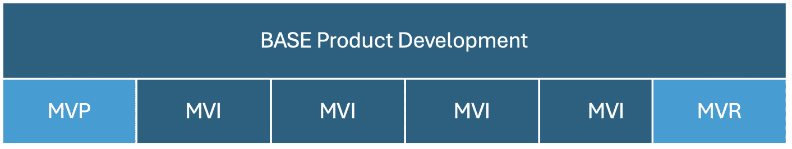
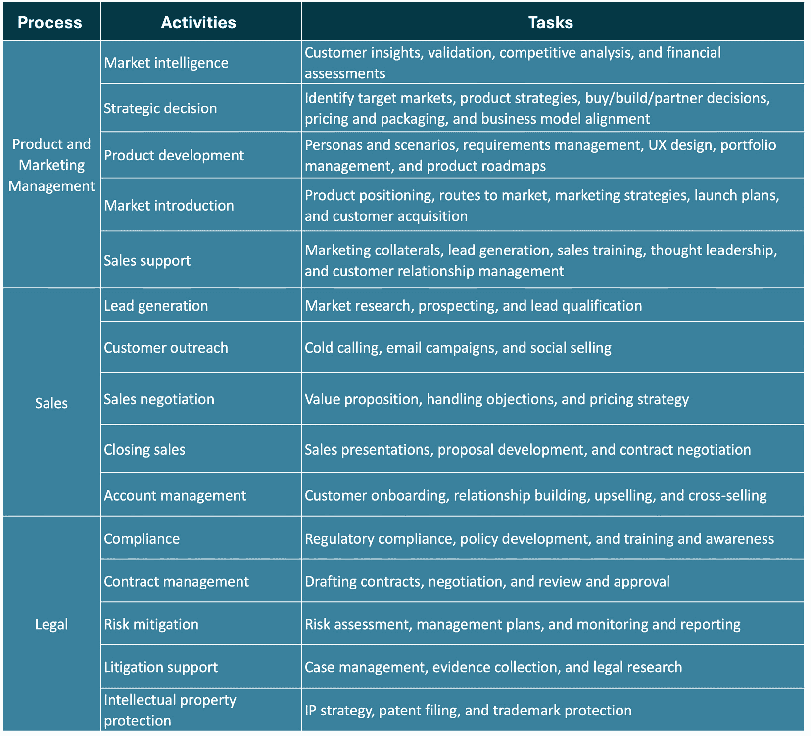

# 定义企业敏捷系统（BASE）

“敏捷性是适应和响应变化的能力……敏捷的组织将变化视为机会，而非威胁。”

–吉姆·海史密斯

无论你是在商业企业、非营利组织还是政府机构工作，保持竞争力和相关性都需要具备快速适应和创新的能力，以满足并超越客户的期望。那么，组织如何才能在不断变化的环境中不仅生存下来，还能蓬勃发展呢？本章介绍了**企业敏捷系统**（**BASE**），这是一个旨在将不确定性转化为机会的模型。BASE 通过协调公司各方面的资源，推动持续改进，从而提升业务流程、系统、产品和服务。

根据企业敏捷研究所的定义，**商业敏捷性**是“*一组赋予企业自由、灵活性和韧性以实现其目标的组织能力、行为和工作方式*。”同样，**SAFe**®定义商业敏捷性为“*通过迅速响应市场变化和新兴机会，利用创新的、数字化的业务解决方案在数字时代中竞争并蓬勃发展*。”

我们的世界正在迅速变化，这要求企业采用创新的方法进行产品开发。在 BASE 模型中，Lean 的流动导向实践提高了生产力、效率和质量，而 Agile 的时间框架实践则帮助组织实施以假设为驱动的创新、价值交付和数字化转型方法。BASE 通过协调多个**基本精益敏捷解决方案团队**（**BLASTs**）的活动，按节奏交付新的价值增量。这一方法涉及信息收集、决策制定和实验的持续循环，旨在以现有资源优化结果。

本章将介绍如何通过 BASE 概念模型促进企业范围的协作，并优先进行以客户为中心的价值交付。BASE 还实施了一种整体方法来交付*集成增量*，协调跨业务职能和价值流的努力。它具有一个**良性循环**，模型中的每个积极事件都会加强下一个事件，推动持续改进。本章描述了 BASE 如何塑造企业以客户为中心的价值交付方法，并包括以下主题：

+   理解 BASE 概念模型

+   建立以客户为中心的基础

+   在产品生命周期中交付价值

# 技术要求

理解本章内容不需要技术要求。然而，读者应该理解在*第八章*中提出的概念，*实施基础精益敏捷解决方案团队（BLASTs）*，因为这些团队为增量实施新价值提供了结构和资源。Al Shalloway 的在线书籍（可在[`successengineering.works/books/`](https://successengineering.works/books/)中找到）也提供了有关 BASE 开发的详细信息，包括对 BLAST 框架的描述。

# 理解 BASE 概念模型

BASE 提供了一种精心设计的精益敏捷**操作模型**，旨在促进企业业务敏捷性。操作模型是一个全面的框架，定义了组织如何运作以为其客户提供价值并实现战略目标。它包括组织的结构、流程、系统和文化，详细说明了资源、技术和工作流程的协调，以支持其目标。

BASE 模型支持产品生命周期的动态特性——产品从概念到市场发布再到生命周期结束的各个阶段是不断变化且常常不可预测的。这种动态性可能由许多因素引起，如不断变化的客户需求、技术进步、市场竞争、监管变化以及在开发过程中收到的客户反馈。BASE 的目标是持续不断地提供新的客户价值，前提是继续支持该产品或服务在经济上是可行的。

一个 BASE 解决方案通常从**最小可行产品**（**MVP**）开始。组织应通过开发 MVP 来探索新的产品或服务概念，设计、构建并测试一组有限的预定功能、特性和能力，然后与客户和市场进行测试。MVP 有助于评估产品的潜力，并通过来自一个或多个目标市场的客户群体的快速反馈来评估其可行性。

BASE 实施了价值流，传递新的业务价值增量，从初始的 MVP 开始，接着是系列的**最小可行增量**（**MVIs**），如*图 9.1*所示。每个 MVI 都通过迭代和增量的方式改善业务流程、信息系统、产品或服务，随着时间的推移，为客户提供更多的利益。这将导致更高的感知价值，并且通常能在市场中提供竞争优势。

图 9.1 – BASE 价值流中的产品开发

正如前段所述，MVI 也可以专注于实施业务流程、系统或其他业务支持工件的变更，这些变更竞争机构有限的资源；因此，业务优先事项必须与产品和服务增强一起作为业务价值积压的一部分进行评估。这就是为什么我们更倾向于将负责管理业务价值积压的人称为“价值经理”而不是“产品负责人”。

如*第八章*所述，*实施基本精益敏捷解决方案团队（BLASTs）*，MVIs 经常不能提供完整解决方案，或者由于成本考虑不值得单独部署。此外，引入部分特性、功能或不完整流程可能会对客户满意度产生负面影响。因此，BASE 概念模型还包括**最小可行发布**（**MVR**）的概念，以便定期同步推出新的功能、特性和流程。

*Figure 9**.2*展示了 BASE 概念模型，作为企业改进的良性循环，以客户为核心。客户及其购买旅程支持并资助我们的业务，确立了指导我们决策和业务运营的要求。我们业务的成功取决于我们迅速满足他们的需求或愿望的能力，同时有效控制成本。

图 9.2 – BASE 的企业改进良性循环

当我们逐步深入这一部分时，我们将从描述 BASE 框架的外环开始，代表 BASE 四大原则，然后更详细地讨论每个原则。接下来，我们将描述从组合管理到企业战略的八大 BASE 核心流程，并总结 BASE 核心内部（价值流管理、价值流改进、产品负责人和价值经理以及客户旅程）。

但在我们开始审视 BASE 概念模型内定义的原则和流程之前，让我们首先了解为什么我们将这个模型称为持续企业改进的良性循环的原因。

## 定义持续改进的良性循环

**持续企业改进的良性循环**是一个自我强化的循环，其中每一个积极的行动都会导致进一步的增强和利益。在这种情况下，它意味着业务的一个领域的改进推动了整个企业的进一步改进，从而创造持续增强和价值创造的循环。

例如，一个组织投资分析其目标市场中的客户体验，并在营销方面吸引更多能够重视其产品和服务的客户。随着客户群体的增长，产品开发预算也增加，从而进一步投入到以客户为中心的产品改进以及相关的促销和销售策略，最终实现更高的收入和增长。这个循环过程在我们产品和服务的生命周期内不断进行。在这个例子中，请注意我们如何始终将客户放在中心，以确保我们的投资方向始终符合客户需求。

这个永无止境的循环带来了不断增加的益处，从而增强了下一个环节的正向效果。每个核心的良性循环活动都会影响价值流交付以客户为中心的价值的能力。因此，跳过任何一个良性循环活动都会影响组织通过创造产品和服务的价值流交付价值的能力。BASE 企业确保其战略和治理应用精益和敏捷的思维方式、原则和实践，以实现业务敏捷性。这使得企业能够快速且安全地应对变化。BASE 同样建立在两个核心原则之上。

### 基本核心原则

在进一步探讨良性循环之前，必须掌握两个核心且互为支撑的原则，这些原则为 BASE 模型提供指导：**第一性原理**和**系统思维**。它们为组织中的决策和问题解决提供了实践性的洞见：

+   **第一性原理**：这些是世界的基本机制，构成了逻辑推理和决策的基础。它们通过仔细观察和严格评估被发现。

    在精益敏捷实践中，第一性原理涉及专注于通过消除浪费和持续改进流程来为客户提供最大价值。忽视第一性原理可能会导致负面后果，例如效率低下和机会被忽视。秉承科学的思维方式，第一性原理要求我们质疑假设，基于证据发展理论，并通过验证来测试假设。

+   **系统思维**：这促使我们在考虑变革时，全面考虑整个系统，因为问题往往源自系统各组件之间的互动和接口，而非单一行为。因此，仅仅关注系统中的个别组件或问题通常是无效的。

    跨团队挑战通常源自外部因素、人员以及我们业务中的解决方案开发环境中的流程。至关重要的是，在这些元素之间培养协作，以便共同解决这些问题，而不是孤立地处理。此外，当管理层优先改善系统而非归咎于个人时，创造一个心理安全的环境将变得更加可行。

以下是支撑 BASE 概念模型并指导其实施的基本原理：

1.  **满足客户需求并与组织目标对齐**：成功通过为双方交付价值来实现。BASE 确保在整个企业中交付的各项计划优先考虑客户定义的价值。如果忽视这一核心原则，成功将受到威胁。此外，BASE 中的每个良性循环活动都整合了客户反馈，以指导决策并推动增量改进。

1.  **将工作分配给小型、协作的团队，任务是交付以客户为中心的有价值增量**：多个 BLAST 团队通过协调努力开发 MVP 和一系列 MVI，为 BASE 的价值创造活动做出贡献。关于 BLAST 的信息在上一章中已有涉及。

1.  **利用数字技术扩展我们的流程、产品和服务**：数字优化为提升运营效率、效果和竞争力提供了前所未有的机会。通过优先考虑数字优化，组织承诺探索、采用和创新数字解决方案。这一承诺提升了表现，为客户交付了更高的价值，并帮助企业保持可持续的竞争优势。

了解这些背景后，让我们对 BASE 良性循环及其重要流程进行高层次的概述。我们将从 BASE 的四个基本原则开始。

## 理解 BASE 的四个基本原则

*图 9.1*中的 BASE 图表的外圈展示了支撑组织 Lean-Agile 环境的四个基本原则。它们包括**战略与执行**、**Lean-Agile 文化**、**假设驱动开发**和**业务敏捷性**：

+   将执行与战略对齐确保组织专注于实现其使命和愿景。

+   建立 Lean-Agile 文化使组织能够同时管理竞争的生产和开发目标，同时保持运营效率，提高产出和质量，以适应和发展于动态商业环境中。

+   使用 MVP、MVI 和 MVR 的假设驱动开发建立了产出新增值的节奏。

+   最后，企业的业务敏捷性指的是组织快速有效地适应商业环境变化的能力。

让我们仔细看看这四个基本原则。

### 对齐战略与执行

**战略与执行对齐**确保组织目标能够转化为可执行的计划，从而实现高效进展，并保持对使命和愿景的专注。它对于成功至关重要，确保员工的日常活动和决策与战略目标对齐，形成一致的方式以实现商业目标。

这种一致性弥合了战略规划与执行之间的差距，要求在所有层级清晰传达公司的愿景、使命和目标。适当的一致性有助于员工理解他们的角色如何为更广泛的目标做出贡献。然而，许多公司在这方面存在困难，导致资源浪费和优先级冲突。研究表明，只有少数高级管理人员和一线主管能够将举措与公司优先事项联系起来。

为实现一致性，组织应专注于清晰的沟通，以确保战略在所有组织层级都能被理解。通过实施支持战略目标的角色来对工作进行对齐。培养一种员工对战略贡献负责的文化。定期根据业务结果和市场变化审查并调整战略。利用绩效管理系统，如**目标和关键结果**（**OKRs**）和**关键绩效** **指标**（**KPIs**），追踪目标的进展。

专注于这些领域加强了战略意图与日常运营之间的联系，改善了战略执行，并增强了员工参与度。这个持续的过程使组织能够适应市场变化，超越竞争对手，实现长期目标。

### 培养精益敏捷文化

精益敏捷文化培养了持续改进和适应能力的思维方式，使团队能够快速响应变化，并高效地交付高质量的价值。它代表了一种变革性的组织管理方法，根植于精益思维和敏捷方法论的原则。此外，它优先考虑客户价值交付、减少浪费，并培养协作性强、适应性强的工作环境。在其核心，精益敏捷文化通过去中心化决策赋能团队，促进创新和快速实验。

精益敏捷文化的特点是以客户为中心，持续对齐与客户需求和偏好的努力。通过持续反馈循环实施迭代改进，进行渐进式增强。

去中心化决策赋予团队自主权，以推动创新和快速解决问题。透明度和开放的沟通建立了组织内的信任和一致性。跨职能协作打破了孤岛，促进了信息和创意的流动。

精益敏捷文化倾向于渐进式变革，偏好小规模、频繁的更新，而非大规模、风险较高的彻底改革。精益敏捷文化中的领导者充当促进者和教练，而非传统的指挥与控制型经理。他们支持团队授权和资源供应，同时倡导持续学习和改进。这种领导风格促进了一种环境，在这种环境中，适应性和成长成为组织文化的核心组成部分。

精益敏捷文化增强了组织的韧性和响应能力，提高了在复杂商业环境中应对挑战的能力。它使得产品和服务的上市时间更短，通过持续创新增加竞争优势，并确保持续交付卓越的客户价值。

通过采纳精益敏捷文化，组织能够在快速变化的市场、不断演变的客户期望和激烈的竞争面前蓬勃发展。这种方法不仅简化了运营流程，还培养了一支积极参与、富有创新精神并与公司战略目标保持一致的员工队伍。总之，精益敏捷文化代表了组织思维和实践中的一种强大范式转变。它为公司提供了在当今动态商业环境中脱颖而出的工具和思维方式，确保了持续的增长和客户满意度。

### 实施假设驱动开发

**假设驱动开发**（**HDD**）是一种将科学方法与敏捷实践相结合的强大产品开发方法。在其核心，它强调在投入大量资源进行开发之前，先要制定并测试关于用户需求、行为和产品特征的假设。假设驱动开发是一个结构化的过程，其中关于产品特性或用户需求的假设会经过严格测试。这个过程从识别关键假设并将其转化为明确、可衡量的陈述开始。定义度量标准来衡量成功，并设计和执行原型或 A/B 测试等实验以收集数据。通过分析这些实验的结果，确认或推翻最初的假设。根据这些发现，做出是否扩展成功解决方案或改进并重新测试的决策。这种迭代方法确保了在产品开发过程中持续学习和基于数据的决策。这种方法使团队能够做出数据驱动的决策，降低风险，并创建真正满足用户需求的产品。

在 HDD 和 BASE 的背景下，三个关键概念在实施这种迭代和实验性方法中发挥着至关重要的作用：

+   **最小可行产品（MVP）**：MVP 是许多精益创业方法论的基石，并在假设驱动开发（HDD）中扮演重要角色。MVP 代表了一个产品的最小版本，足以有效地验证其价值主张的核心假设。它包含足够的功能，以便从早期采用者或潜在客户那里收集有意义的反馈。MVP 的主要目标是验证或否定关于产品市场契合度、用户需求和潜在成功的关键假设，同时最大限度地减少时间和资源的投入。通过发布 MVP，团队可以迅速从实际使用中学习，并相应调整他们的产品策略。

+   **最小可用增量（MVI）**：MVI 侧重于向用户交付增量价值，并支持所有业务开发需求，涵盖业务流程、系统、工件以及产品和服务的改进。MVI 代表一个小的、离散的功能或改进，能够为用户或业务提供实际的价值。

    与通常在产品开发初期使用的 MVP 不同，MVI 在整个产品开发生命周期中使用，持续交付价值并收集反馈。MVI 允许团队将较大的功能或改进拆解成较小的、可管理的部分，这些部分可以更快速地开发、测试，并有可能更快地发布。

    这种方法支持持续集成和交付实践，使团队能够更迅速地响应不断变化的需求或用户反馈。最后，MVI 可以单独发布，也可以作为 MVR 的一部分发布。

+   **最小可行发布（MVR）**：MVR 将迭代方法扩展到发布层面，使组织能够交付实际价值，同时最大限度地减少浪费。MVR 代表可以打包成发布版本的最小功能集或改进，同时仍能为用户或利益相关者提供有意义的价值。

    MVR 允许团队更频繁地发布版本，在定期的间隔内收集反馈并验证假设。这种方法有助于降低大规模、不频繁发布所带来的风险，并使组织能够更迅速地响应市场变化或用户需求。

通过将这三个概念——MVP、MVI 和 MVR——融入假设驱动的开发过程中，团队可以创建一个高度适应性强且高效的产品开发周期。这种方法通过 MVP 进行快速的假设测试和验证，通过 MVI 持续交付价值，通过 MVR 定期发布有意义的版本。

这种组合支持实验、学习和持续改进的文化。它使团队能够做出数据驱动的决策，降低开发不符合用户需求的功能或产品的风险，并通过专注于验证过的高价值开发来优化资源配置。此外，这种方法促进了开发工作和业务目标之间的更紧密对齐。通过持续以小的、可衡量的增量交付价值，团队可以更有效地向利益相关者展示进展，并在需要时快速调整方向。在快速变化的市场中或处理新兴技术时，这种敏捷性尤为重要，因为用户需求和市场条件可能会迅速变化。

*图 9.3* 比较了 MVP 和 MVI 在八个方面的差异，因为这些概念有时会被刚接触这些术语的人混淆。

图 9.3 – 比较 MVP 和 MVI

总结来说，假设驱动的开发模式，在 MVP（最小可行产品）、MVI（最小可行创新）和 MVR（最小可行结果）的支持下，为现代产品开发提供了一个强有力的模型。它将科学探究的严谨性与敏捷方法论的灵活性相结合，使组织能够更有效地创新、减少风险，并持续为用户和利益相关者创造价值。

### 提升商业敏捷性

在当今快速变化的商业环境中，快速应对市场变化、客户需求和竞争压力的能力至关重要。这一能力，即商业敏捷性，是 BASE 中的关键原则，对于组织的成功至关重要。

简单来说，我们将商业敏捷性定义为组织在不确定性和波动中适应和蓬勃发展的能力。它强调在所有业务方面的灵活性、面对挑战时的韧性，以及在战略、运营和客户互动中的适应性。

为了培养商业敏捷性，组织应实施以下关键实践：

+   采用分散决策方式

+   利用快速实验和学习

+   专注于以客户为中心的决策

+   实践持续改进

+   使用价值流管理和映射

这些实践使组织能够预见并主动应对新兴的挑战和机遇，在不断变化的商业环境中始终保持领先。

在 BASE 中拥抱商业敏捷性还使组织能够实现以下目标：

+   快速抓住新机会

+   以自信应对不确定性

+   培养创新和适应性文化

+   增强战略对齐并改善迭代产品开发

这些好处使组织不仅能够生存下来，还能够在现代商业复杂性和挑战中茁壮成长。作为 BASE 的重要原则，商业敏捷性还使组织能够有效应对市场变化，实时调整战略和运营，更加动态地与客户互动，并推动持续创新。

总之，商业敏捷性作为 BASE 的基石，赋予组织所需的工具和思维方式，帮助它们在当今不断变化的商业环境中充满信心和韧性地前行。通过采纳精益敏捷实践并培养适应性文化，组织可以为在日益复杂和竞争激烈的世界中持续成功打下基础。

这部分内容完成了我们对第一原理、系统思维以及 BASE 四大核心原则的讨论。接下来，我们将探索 BASE 概念模型中的八个流程，用于协调整个企业的工作。

## 八大 BASE 商业流程

BASE 模型概述了八个主要过程，这些过程定义了企业交付新整合增量价值的产品交付战略，并且以可预测的节奏进行。这些过程适用于任何类型的组织，包括商业企业、非营利组织或政府机构。BASE 模型并未告诉你你的公司需要做什么样的工作来交付外部客户所需的产品和服务。它也没有给出如何一步步运用 Lean-Agile 方法打败竞争对手的指导。那些艰难的工作由你和你的组织来确定。然而，作者提供了以下示例，说明你的公司可能会采用哪些常见的业务流程和活动来在你的领域中超越其他竞争者：

1.  投资组合管理

1.  规划增量

1.  精炼增量

1.  整合增量

1.  整合评审

1.  客户关怀

1.  客户体验

1.  企业战略

在阅读接下来的章节时，请参阅附录 9.1 - 业务流程、活动和任务。在该附录中，您将找到与每个 BASE 业务流程相关的常见活动和任务的清单。

### 企业战略

在 BASE 模型中，企业战略包括定义和传达组织愿景、使命、目标、任务和优先级的过程。活动包括评估组织能够交付的产品和服务、目标客户以及组织如何独特且有利可图地交付价值。

首席执行官负责制定和完善企业战略及治理政策。首席执行官制定治理政策，以确保组织的问责制、道德行为和战略一致性，从而促进信任和可持续成功。此外，首席执行官还需要对业务单元的活动与企业目标和任务的一致性负责，并做出关键的商业决策。OKRs 的设立是实现这一对齐的关键工具。

理想情况下，执行团队应当根据每个 BASE 增量的节奏来传达新的 OKRs。**目标与关键结果**（**OKRs**）是一种用于组织设定和跟踪目标及其成果的框架。OKRs 通过设定清晰、可衡量的目标（目标）并明确关键结果（关键结果），来指示达成这些目标的进展。目标通常是具有挑战性和定性的，而关键结果则是具体的、量化的并有时间限制，为成功提供了明确的衡量标准。

对于 OKRs，典型的推荐是为每个组织层级（如公司、部门、科室）设定 3-5 个目标，每个目标有 3-5 个关键结果。这有助于保持重点的可管理性，并确保每个目标得到足够的关注。OKRs 通常每季度设定并审查一次，从而进行定期评估和调整，同时与长期的年度目标保持一致。

在 BASE 中，OKR 框架鼓励组织内的对齐、聚焦和参与，确保所有价值流和职能团队成员朝着共同的战略目标努力，并定期跟踪他们的进展。

### 投资组合管理

精益敏捷投资组合投资于六个基本的**业务推动因素**：*人员*、*流程*、*信息*、*技术*、*产品*和*基础设施*。在 BASE 中，投资组合管理职能负责监督这些投资以及其他重要举措，以实现组织的战略目标并最大化投资组合价值。首席执行官和业务线（LoB）高管确定每个投资组合的资金水平，并就通过高级投资组合领导者和企业高管之间的合作制定的投资主题达成一致。这些投资主题指导每个投资组合如何投资其价值流并推动整体企业战略。

高级投资组合领导者通过投资主题决定开发价值流的资金，优先排序战略性举措，分配资源，并监控投资组合绩效。与产品管理和其他业务负责人合作，投资组合识别出重要举措，以推动投资组合从当前状态向未来状态转型，并与投资主题对齐。

商业战略、OKRs、KPIs 以及来自 MVPs、MVIs 和 MVRs 的反馈，都是投资组合管理中数据驱动决策的工具。敏捷团队通过定量指标和定性信息提供反馈，使自上而下和自下而上的协作决策成为可能。

BASE 模型中的投资组合管理涵盖了一系列活动，旨在战略性地分配资源、优先排序举措，并最大化组织内投资所带来的价值。关键活动包括：

+   战略性投资优先级、资源分配和预算编制

+   制定与企业战略对齐的投资主题，并监控和管理投资组合绩效

+   与产品管理和业务负责人合作，识别并优先排序战略性举措，以选择项目

+   沟通投资组合战略、目标和关键结果（OKRs），并与本地团队合作，协调其价值流的关键绩效指标（KPIs）

+   促进自上而下和自下而上的决策协作，包括整合使用 BLAST 的团队反馈，支持 MVPs、MVIs 和 MVRs

在考虑了投资组合管理因素后，我们的良性循环的下一步是规划新的增量价值，以支持投资组合的发展。

### 规划增量

该阶段包括对各个领域的工作进行精心规划和优先级排序，涉及的领域包括组合管理、产品和营销管理、生产、销售、分销、服务和合作伙伴管理。价值经理促进此过程，收集来自客户、利益相关者、领域专家、管理层和团队成员的意见，共同评估优先级。

虽然共识是理想的，但并非总是可行。在这种情况下，价值经理会基于现有信息做出明智决策。BASE 模型通过建立一致的节奏来减少风险，使每个增量的不确定性得到降低。

在精益敏捷企业中，通过集成增量交付价值至关重要，这一过程通过 BLAST 框架和 BASE 概念模型来协调活动。具体来说，企业内的多个团队合作，组装必要的组件，形成集成增量，如 MVP、MVI 或 MVR，以交付成功的基于价值的发布。

无论是改善价值流、业务流程、系统、工件，还是产品和服务，业务价值积压在 BLAST 和 BASE 中都是至关重要的。该积压涉及多个职能和价值流，需要客户、利益相关者、专家和高管的输入，以进行优先级排序。

最佳的 BLAST 团队规模通常为三到九人，确保在解决跨团队依赖性和同步问题时能够有效协作。类似的考虑也适用于 BLAST 中参与团队的数量，应该限制在三到九个团队之间，以便促进高效的跨团队沟通和在 BLAST 代表子团队之间的同步管理。每个 BLAST 的具体目标是根据特定的业务需求和所需集成增量的复杂性量身定制的。

每个 BLAST 都有一位指定的价值经理，负责管理其业务价值积压（Business Value Backlog）和工作项优先级。在多 BLAST 场景中，主导价值经理负责监督跨 BLAST 的优先级，协调与产品或组合管理的合作，产生期望的集成增量。

BASE 模型在每个周期启动新的规划增量，价值经理负责组织周期前的规划会议。BLAST 团队定义任务和活动，并解决团队间的依赖关系。在每个 BASE 周期中，传统的精益和敏捷度量标准会被监控，以追踪进展、保持可见性，并确保及时解决问题。同时，主导价值经理与产品经理、营销经理和组合经理合作，规划即将到来的增量。

精细化增量

集成增量的细化是一个持续的活动，与规划增量过程并行进行。根据所需的粒度，集成增量可以包括 MVP（最小可行产品）、一个或多个 MVIs（最小可行解决方案）、产品特性和功能，以及用户和技术故事。集成增量的生产可能会得到多个价值流和不同业务领域的支持。

价值经理主导需求细化过程，并与 BLAST 团队及其代表合作，以更好地理解和记录需求与验收标准。我们建议 BLAST 团队使用传统的基于敏捷的用户和技术故事以及验收标准格式来记录需求。

在做出上述推荐后，让我们快速看一下传统的基于敏捷的格式，用于定义史诗、用户故事、技术故事和验收标准。

传统上，组织在非常高层次上开始定义需求，通常以史诗的形式进行定义。虽然史诗通常与基于敏捷的软件开发相关联，但史诗的概念也可以轻松应用于其他需求评估，例如流程、产品和服务的改进。

在如 Scrum 和 Kanban 等敏捷方法中，史诗、特性、功能、故事和验收标准的典型分解及其相互关系结构如下：

+   **史诗**：这些是大规模的倡议或需求，最初定义了广泛的业务目标或客户需求。史诗通常被称为大故事，但在组织信息时并没有试图对其进行格式化，只是为了保持逻辑的思路。

+   **特性和功能**：这些代表了从史诗中衍生出的独立组件或用户能力，侧重于特定的面向客户的功能（特性）或内部操作（功能）。

+   **用户故事**：用户故事将特性或功能拆解成更小、可操作的工作单元，从最终用户的角度出发，详细说明交付业务价值的具体任务。传统格式如下：

    **作为[***某种类型的用户***]，我想要[***采取行动/实现目标或获得结果***]，以便[***基于价值的利益或结果***]。**

    让我们来细分一下：

    +   **作为[某种类型的用户]**：这一部分明确了用户的身份。用户可能是客户、管理员、访客或其他相关角色。

    +   **我想要[采取行动/实现目标或获得结果]**：在这里，我们表达了用户想要做的事情。它可以是用户需要采取的特定行动，或者是他们希望实现的目标。

    +   **以便[基于价值的利益或结果]**：最后，我们解释实现这个用户需求的目的。用户通过这一行动将获得什么样的利益或结果？

+   **技术故事**：技术故事类似于用户故事，但它们专注于支持特性或功能实现所需的技术任务或活动。它们从技术角度出发，概述了系统或基础设施中需要进行的具体操作或改进。传统格式如下：

    **作为一个[***角色/人物/用户类型***]，我想要[***目标或行动***]，以便[***目标/行动的预期结果***]。**

    让我们分解一下：

    +   **作为一个[角色/人物/用户类型]**：就像在常规用户故事中一样，我们首先识别出用户是谁。然而，在技术故事中，这个用户可能是开发人员、系统管理员或任何其他技术相关人员。

    +   **我想要[目标或行动]**：接下来，我们表达技术用户想要实现的目标。这可能与编码、配置、基础设施、部署或其他任何技术任务相关。

    +   **因此 [目标/行动的预期结果]**：最后，我们解释满足此技术需求的目的。完成此技术任务后，能带来什么好处或结果？

+   **验收标准**：这些是用户故事必须满足的具体条件，才能被认为是完整的并准备接受利益相关者的验收，确保它们符合功能和非功能性要求。传统格式如下：

    **给定：[背景或前提条件]，当：[动作或事件]，然后：[结果或结果]**

    让我们分解一下：

    +   **给定**：*这是* *设定背景（例如，处于产品详情页且已选择商品）*

    +   **当**：*这是* *描述行动（例如，点击“**结账”按钮）。*

    +   **然后**：*这是* *概述预期结果（例如，查看* *订单摘要）*

如果未定义验收标准，后果自负。两件事可以确定发生。首先，你将无法了解会影响工作项成功实施的完整使用标准。其次，你的客户可能会因为未交付完整或有效的解决方案而提出问题。是的，在敏捷开发中，我们总是可以将新的标准加入到我们的业务价值待办事项中。但从效率角度来看，为什么不提前捕捉这些需求呢？现在我们知道了如何完善需求，接下来让我们看看这些需求是如何从史诗进展到验收标准的。

#### 史诗的进展

定义和完善需求的典型过程是从更广泛的史诗到更详细的特性/功能、故事和验收标准，格式如下：

1.  史诗最初被识别出来，以全面概述主要的业务目标或客户需求。

1.  特性和功能源自史诗，将更广泛的范围分解为可管理的组件，并与特定的业务目标或技术要求对齐。

1.  用户故事和技术故事分别基于功能或特性创建，详细说明用户需要执行的具体场景或任务，以实现预期的功能。

1.  验收标准与用户故事一起或在定义用户故事后制定，明确可衡量的条件，确保每个用户故事满足利益相关者的期望和功能需求。

有了这种进展思路，我们现在可以继续了解如何根据价值优先对待办事项进行排序的技术。

#### 优先排序业务价值待办事项

在本小节中，我们将简要介绍两种常见的工作项优先级排序策略：**加权最短作业优先**（**WSJF**）和 **MoSCoW**。WSJF 方法根据经济价值和紧急程度对待办事项进行优先级排序，强调最大化回报并最小化延迟成本。相比之下，MoSCoW 方法将需求分为必须有、应该有、可以有和不会有，重点关注关键需求和项目限制条件下的优先排序。

我们将从 WSJF 开始。

**加权最短作业优先（WSJF）优先级排序**

在 *第四章* 中，我们探讨了加权最短作业优先（WSJF）如何作为一个强大的优先级排序工具，在敏捷和精益环境中发挥作用。通过基于**延迟成本**（**CoD**）和工作持续时间计算得分，WSJF 帮助团队确定应优先处理哪些待办事项，以实现最大经济效益。该方法确保优先处理高价值任务，这些任务能够迅速交付成果，并且如果延迟会产生显著成本。WSJF 与精益原则相符，关注最大化价值，忽略沉没成本，并持续优化经济决策。它是寻求高效待办事项管理和优先级排序策略的组织的重要指南。

**MoSCoW 优先级法**

MoSCoW 方法是一种广泛应用于敏捷和 Scrum 方法论的优先级排序技术，用于根据待办事项的重要性和紧急程度进行管理。MoSCoW 是 *Must have*、*Should have*、*Could have* 和 *Won’t have (this time)* 的缩写。该方法将待办事项分为四个 MoSCoW 类别，以指导团队确定哪些是需要立即交付的，哪些可以推迟：

+   **Must have**：必须交付的关键需求，必须在当前迭代中完成，以满足项目目标或关键利益相关者的需求。

+   **Should have**：重要需求，虽然当前迭代中并非关键，但如果可能，应该包括在内，以增强产品的价值。

+   **Could have**：理想的需求，虽然对于当前交付并非必要，但如果时间和资源允许，可以考虑添加这些需求。

+   **不会有**：那些在当前阶段明确排除在范围之外的事项。如果这些事项是可取的，但并非优先事项，它们可以推迟到未来的版本或项目中。

通过使用 MoSCoW 方法，敏捷团队可以协作地对待办事项进行优先级排序，确保业务优先级与开发工作之间的一致性。这种方法有助于在保持灵活性的同时，最大化早期交付关键功能，并能够在项目生命周期中适应变化的需求。

### 集成增量

我们之前已经解释过，集成增量的概念帮助我们定义了个别团队和 BLAST 团队必须交付的工作，这些增量有三种形式：MVP、MVI 和 MVR。这个 BASE 过程是我们构建、测试和交付集成增量的地方。

这不是一个单一的过程描述。例如，市场营销团队交付集成增量的组成部分，以推广新产品或服务，这与软件开发团队在同一增量中为软件应用程序构建功能增强所产生的交付物是截然不同的。然而，这些开发和运营活动需要协调，以支持新的 MVR。此外，可能会有其他 MVI 正在通过类似的集成增量构建周期并行进行，以满足 MVR 的所有需求。

随着今天流程自动化和集成能力的发展——回顾我们之前关于 CI/CD 和 DevOps 工具链的讨论——许多开发活动将使用精益的流程原则进行操作。然而，敏捷的迭代和增量发布周期为增量计划、构建、评审和交付设定了节奏。

在我们离开本节之前，让我们看看一些常见的业务流程、活动和任务，这些内容可能会为单个 BASE 循环中产出的交付物做出贡献。

#### 组建 BLAST 团队以交付集成增量

回顾我们之前讨论过的 BASE 模型如何为持续的业务改进建立一个良性循环，组织中的每个部分都在任何给定的 BASE 循环中发挥作用，正如*附录 9.1*、*表 9.1: 业务流程、活动*、*和任务*中所示。

在 BASE 概念模型中，组织利用 BLAST 团队有效执行各种关键的业务流程，这些流程对其运营和价值流至关重要。高管们可以建立多个量身定制的 BLAST 团队，以支持跨不同业务职能和价值流的各种业务流程。例如，在企业战略和投资组合管理领域，专门的 BLAST 团队可能专注于愿景发展、战略规划、绩效管理和风险缓解，这些都与特定的价值流相一致。同样，产品和市场管理职能也可以组建 BLAST 团队，管理市场情报、战略决策、产品开发、市场引入和销售支持等活动，这些活动推动了各自价值流中的价值创造。

在 BASE 模型中，这些 BLAST 团队的主要目标是在一个 BASE 周期内（即其良性循环的一个循环）交付整合后的价值增量，呈现为 MVP、MVI 和 MVR。有些 MVI 可能会独立发布，而其他则会贡献于更大的 MVR。BASE 模型的灵活性使组织能够根据其规模和复杂性调整每个周期内发布的整合增量数量。较大的组织通常需要多个 BLAST 团队来有效管理和协调这些流程，确保持续改进并与以客户为中心的目标保持一致。

最终，贵组织必须定义为支持交付新的价值增量而必要的业务流程、活动和任务。它将确定为支持这些交付而设置的 BLAST 团队的最佳配置，以整合增量的形式进行交付。最后，贵组织将决定如何以及何时通过其 MVP、MVI 和 MVR 发布每个价值组件，在每个 BASE 周期中。

随着每个整合增量的构建，它将 undergo 审查以确保质量和完整性。这些活动将在下一个核心流程“整合审查”中详细说明。

### 整合审查

来自各个 BLAST 团队的整合增量需要同步，以支持新的发布。此核心 BASE 过程阶段包括在发布前对整合增量的排序，例如，在产品销售和分发之前协调市场推广和销售培训。

SME、客户和利益相关者必须在此阶段审查这些增量。他们评估整合增量的目标、用户故事、技术要求和验收标准是否已达到。

任何识别出的 问题都通过 BLAST 框架中的*反馈与调整*分支进行处理。缺陷或错误将返回至*业务价值积压*进行完善和优先级排序。如果问题紧急并且在当前 BASE 周期内可行，它们将被立即解决；否则，它们将被安排在未来的 BASE 周期中处理。

在这一阶段，经过成功审查并确认可以发布的集成增量会与其他集成增量同步部署，或根据需要按需部署。一旦接受，内部和外部客户的部署产品和服务必须得到支持，这一主题将在下一部分的客户关怀中讨论。

### 客户关怀

有效的**客户关怀**是 BASE 模型中的关键过程组，确保企业能够在各种产品类型和行业中持续满足客户需求和期望。实施卓越的客户支持计划涉及多个关键实践：

1.  **以客户为中心的方法：** 优先理解和预测客户需求，提供主动支持和个性化体验。

1.  **多渠道支持：** 通过多种渠道（例如电话、电子邮件、聊天、社交媒体）提供支持，以适应不同客户的偏好并确保可访问性。

1.  **及时响应服务：** 实现快速响应客户咨询和问题的解决，目标是提高客户满意度和留存率。

1.  **知识管理：** 维护集中式知识库，帮助支持人员获取准确的信息和解决方案，确保服务交付的一致性。

1.  **持续改进：** 定期收集客户反馈，识别改进领域，优化支持流程，并提升整体服务质量。

1.  **培训与发展：** 投资培训项目，赋能支持团队，提升他们处理客户互动的能力与同理心。

1.  **与产品开发的集成：** 促进客户支持与产品开发团队之间的合作，解决反复出现的问题，优先处理功能需求，并提升产品的可用性。

1.  **指标与分析：** 利用客户满意度评分、响应时间和解决率等指标来衡量表现，并推动持续的服务改进。

通过将这些实践融入 BASE 模型的客户关怀过程中，企业可以建立强大的客户关系，提升客户留存率，并在竞争激烈的市场中脱颖而出。此外，每次产品或服务发布都会影响有效的客户关怀流程，因此需要持续的投资和流程改进，以保持高效的客户支持能力。接下来，我们的 BASE 过程组将讨论如何衡量客户体验（CX）并根据我们的发现采取行动。

### 客户体验

**客户体验（CX）**体现了以优先考虑和提升客户在与企业或品牌互动过程中满意度、愉悦感和忠诚度为核心的理念。这强调灵活性、快速迭代和客户反馈，以优化所有接触点的消费者体验。通过采纳精益敏捷原则，组织旨在更加回应客户需求和市场变化，从而提升客户满意度和忠诚度。

BASE 模型中的精益敏捷客户体验要求将大型复杂的客户体验项目拆解为可以融入 BASE 迭代的小块。在这些 BASE 节奏中，跨职能团队协作评估客户体验的变化。这些变化可以是从精细化网站用户界面到简化客户服务流程的任何内容。在每次迭代后，团队会审查结果并收集利益相关者的反馈，包括真实客户的意见，以便为下一轮产品或服务改进提供依据。这一迭代循环有助于确保组织不断适应并调整战略，以有效满足客户期望。

以下五项关键的客户体验（CX）活动在许多组织中是常见的：

1.  进行客户旅程映射，以理解并改善端到端的客户体验。

1.  实施**用户界面**（**UI**）/**用户体验**（**UX**）设计原则，以增强产品和服务的互动性、可用性和可及性。

1.  优化客户服务流程和渠道，以提供及时有效的支持。

1.  个性化营销和沟通策略，以更好地与个人客户需求和偏好产生共鸣。

1.  监测并分析与客户满意度、忠诚度和留存相关的关键指标。

一些组织可能会添加以下额外活动来提升其客户体验项目：

+   根据数据分析和客户反馈获取的洞察，持续迭代并改进客户体验（CX）项目。

+   跨部门协作，确保客户体验（CX）工作与组织目标和战略的一致性。

+   实施技术解决方案，如**客户关系管理**（**CRM**）系统和数据分析工具，以提升客户体验能力。

+   培训并赋能员工，在每一个接触点提供卓越的客户体验。

这些活动对于旨在为客户在各个接触点和互动中创造积极且难忘体验的组织至关重要。此外，精益敏捷客户体验有助于培养持续学习和适应的文化。通过不断测试新想法并通过 MVP、MVI 和 MVR 收集反馈，企业可以迅速了解什么有效，什么无效，大大降低风险。这种方法有助于优化产品供应，并提升整体服务交付，使公司更具竞争力，并更加以客户为中心。

这完成了我们关于八大核心 BASE 商业流程的讨论。现在，我们将进入 BASE 概念模型的核心，重点是将客户置于首位。

# 建立以客户为中心的基础

精益和敏捷的从业者都强调了交付以客户为中心的价值的重要性。因此，像 BASE 这样的精益敏捷概念模型必须同样将客户置于我们所做一切的中心。

*图 9.4*，BASE 的核心，提供了这些概念的图示视角。BASE 有意将对客户旅程的改善置于我们企业改进活动的中心。我们还展示了拥有价值经理和产品负责人协同推动这些努力的重要性。

图 9.4 – BASE 概念模型的核心

为了进一步强调协调工作以支持客户对价值的看法的重要性，*价值经理* 代表了客户在 BASE 中的声音，标志着他们在监督价值流和产品改进方面的角色，并促进有效的团队沟通。

虽然 *产品负责人* 角色仍然可以在 BASE 中应用，但我们建议避免在这两个角色之间拆分职能，因为这样可能会产生利益冲突，例如价值流改善与产品提升之间的冲突。然而，如果你选择产品负责人这一职称，确保该角色的个人能够全面监督所有的价值创造方面。

*价值流管理* 活动是 BASE 模型的核心。在任何组织中，常常面临大量任务和相互冲突的优先事项，这可能使资源超负荷，导致管理无效。没有整体视角或优先级系统，往往会导致应急处理、冲突和未达成的期望。

VSM 方法和工具在这个背景下起着至关重要的作用，通过使得最具影响力的变革能够经过严格评估，从而提高组织的生产力和效率。通过系统性地看待产品交付活动，VSM 确保资源得到最优分配，并且每个 BASE 循环的迭代都能从提高效率、生产力和适应性的过程中受益。

现在，让我们进入本章的最后一部分，在这里我们讨论采取生命周期视角进行产品开发的重要性。

# 在产品生命周期中交付价值

BASE 模型体现了通过强调跨产品生命周期的价值交付，引导组织应对现代商业环境复杂性的本质。当我们深入探讨基础理论的实际应用时，我们将探索构成 BASE 良性循环的复杂过程。这一探索提供了一个全面的视角，展示了组织如何系统地创建、交付和提升整个产品生命周期中的价值。

BASE 模型的核心是培养创新文化、客户中心主义和持续改进。它为组织提供了一种结构化的方法，将运营和客户参与与商业战略对齐，最大化价值创造，并保持竞争优势。BASE 的特色在于它致力于利用常识和易于理解的商业实践，避免创造不必要的角色或强加违反直觉的商业活动。尽管精益和敏捷实践在许多组织中仍处于新兴阶段或尚未完全成熟，但其基本理念已被证明是有效和稳健的。

本节剖析了战略决策、客户洞察和运营卓越之间的相互作用。理解这些元素的融合，使组织能够制定稳健的、以客户为导向的战略，从而在产品生命周期的每个阶段推动价值创造。

从构思到交付及其后，每个产品生命周期阶段都面临独特的挑战和机遇。BASE 模型为组织提供了在这些复杂性中灵活且精准地导航的原则和实践。读者将获得可操作的见解和实用的战略，以优化产品生命周期中的价值创造，帮助自己在当今动态的商业环境中获得长期成功。

## 利用以客户为中心的战略增长

BASE 的以客户为中心的方法的核心在于认识到客户满意度和忠诚度对组织成功至关重要。虽然理论上任何核心流程都可以作为进入 BASE 模型的切入点，但在本讨论中，我们从客户关怀开始，作为成功客户参与的入口点。这个职能充当了组织与客户之间互动的前线。

### 提升在 BASE 中的客户参与度

在精益敏捷型组织中，对以客户为中心的承诺不仅是一种理念，更是指导每个业务层面的原则。客户关怀作为客户互动的前沿，远远超出了单纯的售后服务。它包括一整套活动，以确保持续的客户满意度和忠诚度。这些活动包括提供及时的支持和帮助，积极征求反馈，解决客户问题，以及发现产品或服务改进的机会。通过保持畅通的沟通渠道并展示真正致力于满足客户需求的承诺，组织可以培养牢固的关系并促进长期忠诚度。

### 支持在 BASE 中的客户参与

通过整个循环，客户关怀涵盖了一系列活动，包括交付、支持、维护和修复，所有这些都旨在超越客户的期望。通过在购买后积极与客户互动，组织可以获得有价值的反馈，识别痛点，并了解新兴趋势和客户期望。

在客户关怀基础上构建的是客户体验过程，它超越了基本的服务提供，主动与客户互动，并理解客户与组织的产品和服务的整体体验。这涉及诸如外展计划、奖励方案和旨在捕捉客户偏好、满意度和改进领域的对话式 AI 技术等各种举措。此外，客户旅程映射等活动提供了一种结构化的方法，帮助组织理解端到端的客户体验，使其能够识别令人愉悦的时刻、挫败感以及优化的机会。

企业战略整合了来自客户关怀和客户体验的洞察，塑造组织的未来方向。这个战略过程涉及关于产品扩展、服务提升和市场扩展举措的关键决策。通过将企业战略与客户需求和偏好对齐，组织可以确保其投资和举措在每个交付周期中都能最大化客户价值，并推动可持续增长。

除了客户体验（CX）、客户关怀和战略之外，BASE 模型中的其余核心过程侧重于构建和交付集成增量。工作的范围取决于许多必须解决的商业因素。随着改进机会的识别，价值经理与 BLAST 团队、利益相关者、领域专家（SMEs）和职能领域负责人合作，优先处理当前的举措。

在 BASE 中利用以客户为中心的战略增长，要求深入理解客户的需求、偏好和行为。通过优先考虑客户洞察并将其融入战略决策过程中，组织可以建立竞争优势，促进客户忠诚度，并在当今动态的商业环境中实现长期成功。

在接下来的小节中，我们将深入探讨 BASE 模型中客户参与的运营方面。从购买后的互动到主动外展举措，我们将探索组织如何与客户建立有意义的联系。

## 持续改进价值交付

价值流在 BASE 模型中起着关键作用，作为价值构思、创造和交付给客户的基本路径。这些流包括跨越整个产品开发生命周期的相互关联的活动和过程，从构想到交付和支持。

### 保持产品聚焦

在较大的组织中，运营、开发和支持的价值流可能会扩展到数百甚至数千个，每个都包含一系列的活动。然而，在 BASE 模型下，我们的目标是简化。因此，我们将每个 BASE 周期集中在提升一个面向产品的价值流，这一流将特定类型的产品或服务交付给我们的外部客户。

本质上，不要忽视大局。在初期规划时，保持对需要改进的产品或服务的专注。保持 BASE 流程的高层次定义，让 BLAST 团队深入探讨如何提升价值交付。如果你的组织涵盖多个产品线——不仅仅是通过型号或款式的不同，而是涉及真正不同的产品或服务——每一条产品线都应当经过一个独立的 BASE 周期，以推动流程、产品和相关服务的改进。

确实，较大的组织可能会按产品线同时运行多个 BASE 周期。这一策略简化了流程，并保持对各个产品线需求的专注。否则，考虑一下在多个产品间进行业务流程、系统、产品和服务改进所面临的挑战——这远非简单之事。

通过管理和优化这些面向产品的价值流，组织可以简化操作，加速上市时间，并在当今竞争激烈的商业环境中获得竞争优势。

### 按客户影响的优先顺序消除浪费

优化价值流的一个关键方面是识别并消除一切可能的浪费。此过程包括进行彻底的价值流映射，以找出工作流程中的低效、瓶颈和冗余之处。

有时，质量或成本问题可能会驱动改进优先级的决策。但通常，你的约束条件会引导你发现最有影响力的改进机会。回想一下我们讨论的局部优化。解决那些不影响吞吐量的浪费可能对流程流动没有什么影响，甚至没有影响。

*图 9.5* 提供了一个有用的类比：想象一下这辆高性能的绿色兰博基尼的车主。他们已经在这辆快车上投入了大量资金，但他们的速度却受到周围交通的限制。任何试图超越这个限制的举动，都有可能带来不良后果。换句话说，在瓶颈和延误被消除之前，他们的投资都在浪费。

图 9.5 – 堵在交通中

通过精简流程、减少不必要的交接和最小化等待时间，组织可以减少周期时间、提高生产力、并增强整体运营效率。这使得组织能够更快速地为客户交付价值，降低成本，并最大化资源利用率。

### 使用指标来指导决策

有效的价值流管理需要持续监控和衡量关键绩效指标，以跟踪进展并识别改进领域。通过建立明确的绩效基准和指标，组织可以评估其价值流的有效性，并根据数据做出决策，以优化绩效并增强价值交付。这种迭代的价值流管理方法使组织能够根据市场动态、客户需求和业务要求的变化进行调整和发展，确保在快速变化的商业环境中保持敏捷和响应能力。

此外，优化价值流需要一种跨职能的协作方法，涉及整个组织的利益相关者。通过打破部门之间的壁垒并促进不同部门和团队之间的协作，组织可以简化沟通、改善协调，并增强朝着共同目标的对齐。这种协作方法加速了价值交付，促进了持续改进和创新的文化，在这种文化中，员工有权识别和实施流程改进，从而推动组织成功。

优化价值流对于寻求推动可持续增长和竞争优势的组织至关重要。在当今充满活力的商业环境中，通过简化运营、减少浪费以及促进协作，组织可以提高向客户高效、有效地传递价值的能力，从而为长期的成功和市场中的韧性奠定基础。

接下来，我们将深入探讨关于实施持续改进的结尾部分。在这里，我们将重点关注价值经理的关键角色、BLAST 框架的采用以及持续反馈循环在推动 BASE 内部创新中的重要性。

### 实施持续改进

在 BASE 模型中，推动持续改进是支撑组织在快速变化的商业环境中适应、创新和繁荣的基本原则。其核心是价值经理，价值经理在协调工作以确保价值交付与组织目标和客户需求对齐方面起着至关重要的作用。

价值经理负责监督价值流活动，促进跨职能协作，并优化流程以提高效率和效果。他们与价值流团队密切合作，定义目标、建立绩效指标并识别改进机会。通过提供指导、支持和资源，价值经理赋能团队交付满足客户期望并推动业务成果的高质量 MVP 和 MVI。

组织内的精益-敏捷团队利用 BLAST 框架高效交付新的集成增量。该框架结合了精益的流程导向和敏捷的迭代增量开发模式，使团队能够简化工作流，加快价值交付，并保持专注于提升客户价值。

在 BASE 模型中，持续反馈和迭代学习同样至关重要。精益-敏捷团队定期从客户、利益相关者和最终用户那里获取反馈，收集洞见、发现改进机会并验证假设。这个反馈循环使团队能够在产品和流程上进行迭代，优化策略，并随着时间的推移更有效地交付价值。

通过拥抱实验、创新和持续学习的文化，组织能够营造一个动态和适应性强的环境，使持续改进成为组织 DNA 的一部分。

最终，在 BASE 模型中推动持续改进不仅仅是优化流程或交付更好的产品；它培养了一种持续学习、适应和创新的思维方式。赋能价值经理、利用 BLAST 框架，并拥抱持续反馈和学习，使组织具备了长期成功和可持续增长的能力。

本章内容至此结束，*第九章*的内容也告一段落。在*第四部分*，*推动可持续转型*中，我们将探讨可持续数字化转型的可行策略，简化复杂性、渐进式发展并实施切实的变革。但首先，让我们回顾一下。

# 总结

在*第九章*中，你深入探讨了企业商业敏捷系统（Business Agility System for the Enterprise），也就是 BASE 概念模型（或简称 BASE）。本章揭示了产品生命周期的关键概念，展示了在持续交付客户价值过程中固有的动态性。你已了解了“良性循环”这一中心要素，它代表着推动改进的持续自我强化循环。通过探索 BASE 模型，你学习了其以客户为中心的基础，投资组合与战略对齐的重要性，以及如何在产品生命周期中交付价值。

本章的洞见至关重要，因为它为你提供了企业如何具备敏捷性、响应能力并始终以客户为中心的全面理解。掌握 BASE 模型使你能够同步多个团队，确保产品开发和交付的顺利进行。通过内化协作、战略对齐和客户关注的原则，你可以引导组织朝着持续的成功发展，并确保它始终能够适应市场和客户需求的不断变化。

在*第四部分*，*推动可持续转型*中，我们介绍了精益-敏捷高层管理策略。

# 附录 9.1 - 商业流程、活动和任务

# 问题

本节面向那些希望评估自己对本章提供信息的理解和记忆的读者。这里有三个问题，答案将在下一节提供。回忆原文的确切表述并不重要，重要的是能够回忆起概念及其应用。问题如下：

1.  组成 BASE 基础的四个原则是什么？如 *图 9.1 – Base* *产品开发* 所示。

1.  OKR 框架在 BASE 模型的企业战略方法中扮演什么角色？

1.  BASE 模型如何通过强调持续价值交付，促进客户导向和产品生命周期的持续改进？

# 答案

1.  BASE 模型的四个原则是战略与执行、精益敏捷文化、假设驱动开发和业务敏捷性。

1.  OKR 框架在 BASE 模型中的作用是将业务单元的活动与公司目标和战略对齐。它帮助定义和跟踪明确的可衡量目标及其关键结果，确保全组织的焦点、对齐和参与。

1.  BASE 模型通过强调持续价值交付，促进了以客户为中心的产品生命周期持续改进。它从客户关怀作为关键切入点开始，通过主动的客户互动、反馈整合和产品/服务的提升计划，确保持续的客户满意度。

# 延伸阅读

1.  [`scaledagileframework.com/business-agility/`](https://scaledagileframework.com/business-agility/)

# 第四部分：推动可持续转型：实现精益敏捷精通的策略

欢迎来到本书的最后一部分。在前面的章节中，我们探讨了与精益敏捷方法和价值流管理相关的各种原则、实践和框架。如果你感到信息量有些庞大，不必担心。在本节中，我们将所有内容整合为可操作的策略。

在本节中，我们的目标是将你所获得的知识提炼为可操作的策略，帮助实施和维持数字化增强的精益敏捷转型。这些策略旨在促进更容易的采用，并培养支持持续改进的习惯。我们将强调渐进演变的重要性，而非突然变化，同时确保与业务目标、战略和客户需求保持一致。

将本书的最后一部分视为一个实用工具包，用于将理论知识转化为切实可行的实施方法。我们的重点是构建一个灵活的商业方法论，能够无缝适应现代企业的动态需求，涵盖商业行业、非营利组织和政府机构。我们的最终目标是建立可持续的实践，推动持续的商业转型。

*第十章*是这一部分的入门章节，介绍了提升精益敏捷组织决策能力的方法。你将会接触到 BRIA 和 QIDA 的概念，这些概念有助于定义关键的商业问题，从数据中提取可操作的洞察。这凸显了信息作为组织适应能力的生命线，强调了有效管理在推动各个运营领域改进中的重要作用。

接下来是 *第十一章*，我们从理论过渡到实践，为实施精益敏捷和价值流管理（VSM）策略提供了一个务实的路线图，帮助实现持续的组织转型。

最后， *第十二章*在深入探讨五个跨领域主题之前，全面回顾了前面几章内容，提供了精益敏捷精通的连贯性和一致性。我们以三个真实案例故事结束，展示了本书中介绍的精益敏捷和 VSM 概念的成功应用。

*第四部分*不仅仅是吸收信息；它关乎采取果断的行动，推动演变，培养领导力来支持变革。本部分为领导者和团队提供精益敏捷的思维方式，确保他们的组织能够在数字时代产生持久且积极的影响。在这些页面中，包含了为那些准备创新、简化操作并领导变革的读者设计的路线图——你的旅程即将开始。

*第四部分*中的章节如下：

+   *第十章*，*提升精益敏捷组织中的决策能力*

+   *第十一章*，*组织转型的实施策略*

+   *第十二章*，*构建精益敏捷与 VSM 的精通*
