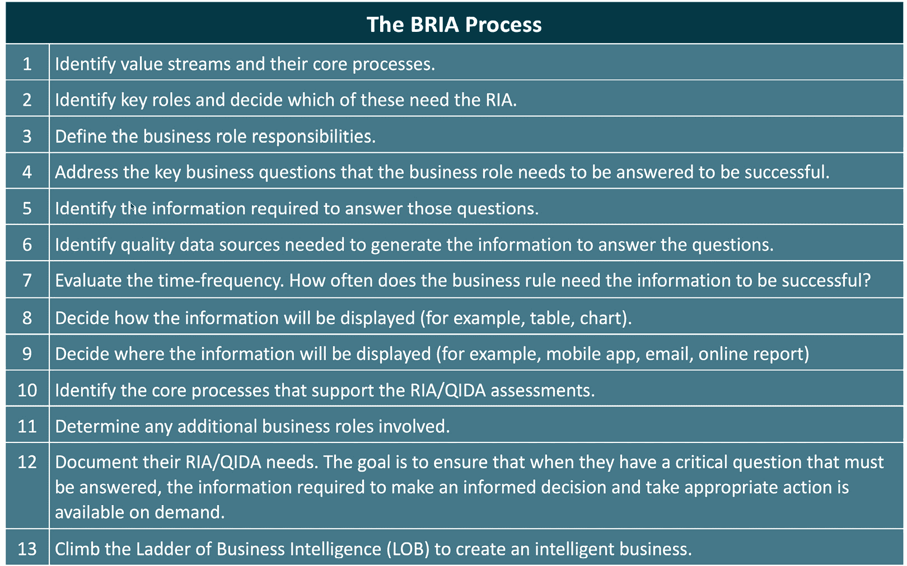
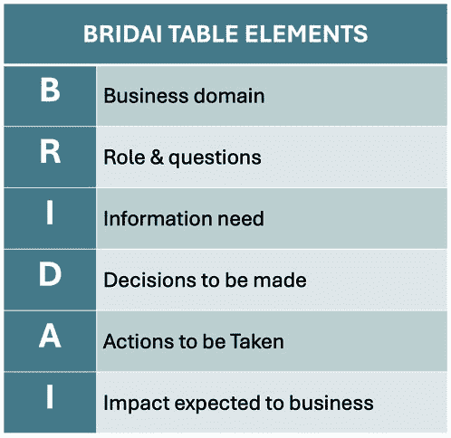

# 10

# 提升精益敏捷组织中的决策能力

“在今天这个数据驱动的世界里，成功属于那些能够将信息转化为洞察，并将洞察转化为行动的人。”

- 微软 CEO 萨提亚·纳德拉（Satya Nadella）

在我们这个数字时代，数据的汪洋大海中充满了信息的漩涡，带来了巨大的商业挑战。比喻来说，航行这些水域就像是抓住机会，避免危险。我们是否了解在这片浩瀚的海洋中自己的市场位置？我们是否配备了正确的信息来引导前进的方向？如果没有，我们需要什么数据来进行适当的航向调整？

本章为实现组织成功的关键旅程提供了一个路线图，执行者和员工在此旅程中的体验各不相同。执行者处于战略层面，制定航线，引导组织在竞争激烈的海洋中航行。而员工则处于战术层面，负责管理日常运营，确保所有系统的平稳和高效运行。这两种视角都是至关重要的，确保组织的每个方面的价值流都朝着实现企业目标的方向协同工作。

然而，组织面临着一个独特的悖论：尽管数据丰富，往往却难以在需要时找到正确的数据来发现可操作的洞察。数据的泛滥往往掩盖了做出及时和明智决策所需的洞察力。本章通过指导你如何将大量数据提炼为可操作的、相关的信息，解决了这一挑战。

到本章结束时，你将掌握将原始数据转化为可操作洞察的策略，这些洞察将引导决策，塑造组织价值流的效率和发展轨迹。

本章中，你将学习这些实践如何协同工作，提供以客户为中心的价值。涉及的主题包括以下内容：

+   理解数据的真正潜力

+   利用 BRIA 组织业务目标

+   通过 QIDA 促进明智的决策

+   举办 BRIA 工作坊以实现战略对齐

+   利用基于 AI 的工具支持 BRIA 工作坊

# 技术要求

本章讨论的概念不需要你在数据管理方面有专业知识，也能理解它们在定义数据和信息需求中的作用。然而，**数据库管理系统** (**DBMS**) 专家对于将这些概念应用到你组织的业务系统中至关重要。DBMS 专家可以参考本章末尾的*进一步阅读*部分，了解来自 Packt 的关于数据管理的相关书籍。最后，想要更深入了解本章中涉及的 BRIA/QIDA 概念的读者，应阅读詹姆斯·E·凯茨、萨姆·S·吉尔和娜塔莉·泽图尼的《商业智能阶梯》（*Climbing the Ladder of Business Intelligence*）一书。

# 理解数据的真正潜力

在今天这个数据浩瀚的时代，驾驭这些数据海洋可能令人不知所措，无论你是深潜于数据的 IT 专家，还是仅在表面浅尝辄止的高级运营领导。在当今数据丰富的世界里，IT 领导者、从业者以及技术领域外的人都面临着一个共同的挑战：知道在最需要的时候从哪里找到所需的信息。

无论你是信息的消费者还是生产者，你必须理解如何区分事实、数据和信息之间的细微差别。认识到提出正确问题以筛选数据、有效挖掘高价值洞察力的力量，变得尤为重要。掌握这些原则能帮助你与他人合作，确保商业战略以数据为依据，从而使你能更显著地为组织的成功做出贡献。

随着你深入本章，你将领悟到一个困境：数据过多可能会减缓决策，而数据过少则降低了做出明智决策的能力。你将学会通过将数据与特定业务目标紧密对接，聚焦于提出正确的问题，从而对数据进行策划和精炼——强调质量而非数量，通过以下方法：

+   **商业角色智能分析** (**BRIA**) 过程

+   **问题、信息、决策、行动** (**QIDA**) 概念

那么，让我们从当前统计数据入手，了解这一挑战的规模。

## 解决数据挑战和机会

在我们的数字时代，世界充斥着似乎无穷无尽的数据流。从网页上的点击到涵盖商业和财务交易的实时分析，每一秒钟都诞生大量的数据。这既是一个机会，也是一种挑战：面对如此巨量的数据，我们如何释放它的真正潜力？

Zippia 最近的报告揭示了一些发人深省的见解：2

+   每天产生惊人的 2.5 quintillion 字节数据

+   然而，企业仅利用和分析了其数据的 37%至 40%

+   尽管 97.2%的企业在大数据和人工智能上投入巨大，但令人震惊的是，60%到 73%的数据仍然未被触及和分析

这些统计数字凸显了一个悖论：虽然数据泛滥，但它的有意义使用却严重不足。对于大多数组织来说，浩瀚的数据海洋仍然未被探索，其中隐藏着宝贵的洞察力。因此，我们应该意识到，我们需要开始弄清楚如何最有效地发现和利用这些数据。

## 为数据利用制定路线

数据的真正潜力不在于它的数量，而在于它的适用性。更明确地说，这关乎知道哪些问题对你的组织成功至关重要，哪些数据是回答这些问题所需的。你可以在哪里找到这些数据？又如何将原始数据转化为可操作的洞察力，从而推动决策制定？让我们将这个过程分为三个部分：

1.  **提炼数据**：假设你的数据是石油。石油桶的数量比起提炼过程的质量和效率来讲并不那么重要，因为正是这些品质使得石油能够转化为有价值的东西，比如汽油、柴油或沥青，然后再分发给顾客。

1.  **提出正确的问题**：每个战略性举措都应从提出正确的问题开始。你需要知道什么？这些问题就像指引你前进的指南针，指向那些重要的数据。

1.  **知识管理**：一旦你找到了正确的问题，就必须知道在哪里找到答案。这涉及深入数据库，识别模式，并区分相关、无关和冗余的数据。

完成从问题到可操作洞察的旅程，正是实现数据真正潜力的本质。在这个不断变化的数字化环境中，能够脱颖而出的组织将掌握这一导航技能，将海量数据转化为信息，从而影响我们的商业决策，并让我们采取恰当的行动。通过不断优化流程，优先考虑正确的问题，并有效地利用数据，企业可以为其战略目标绘制出一条航道，确保每个决策都建立在最相关、可操作的洞察基础上。

当你向前推进时，记住数据是你的盟友——一种工具，当被恰当地使用时，可以为持续增长和创新铺平道路。那么，现在，让我们继续了解如何将原始数据转化为可操作的洞察。

## 转化数据为洞察

捕获和评估数据仅仅是更大旅程的第一步。真正的精通体现在数据的转化上——特别是将原始数据转化为富有信息的洞察。通过分析工具、方法论，甚至是直觉判断的结合，可以将这些原始材料雕塑成可操作的洞察，释放数据在指导决策和制定战略方面的深远潜力。

本章邀请你超越数据的广泛范围，关注其本质。这意味着要区分哪些数据能够增加价值，哪些数据只是让人感到压倒，却没有产生积极影响。对于有抱负的专业人士而言，关键在于确保组织战略能够触及数据的核心，提取出与业务目标相契合并推动其发展的洞察。

理解和掌握数据的真正潜力不仅仅是职业能力的问题；它是一个游戏规则的改变者。然而，捕获和评估数据仅仅是更为全面的旅程的第一步。通过结合分析工具、方法论，甚至有时是直觉判断，才能将原始数据转化为洞察。

BRIA 的概念为商业智能领域铺平了道路，成为定义信息需求的一个标志。BRIA 的概念很简单。数据需求由我们工作的商业类型或业务领域以及我们的角色和职责来定义。因此，商业和角色影响我们所需的信息类型，以便采取适当且及时的行动。

在你阅读本章时，请参考图 10.1，BRIA 过程。这张路线图将帮助你的组织穿越数据的汪洋大海，发现所需的见解，以做出知情的、接近实时的决策，并采取更有效的行动。

图 10.1 – BRIA 过程

但 BRIA 只是有效数据管理策略的一部分。它的精炼和后续扩展版本 QIDA 将 BRIA 更进一步，因为我们逐渐认识到，驱动决策和行动的是我们需要能够回答的问题。同时，我们不能忘记，数据需求因角色和职责的不同而变化。因此，BRIA 和 QIDA 的结合见解通过智能商业模型，在 BRIDAI 表格和工作坊中得以实施。**BRIDAI** 是 **Business, Role, Information, Decision, Action, Impact**（商业、角色、信息、决策、行动、影响）的缩写。这个缩写表明了 BRIDAI 表格中的列，稍后将在图 10.2 - BRIDAI 表格元素以及本章附录中的示例中展示。

随着我们深入本章，我们将解构并探索这些相互关联的过程及其对现代商业的深远影响。我们将从定义 BRIA 背后的概念开始。

# 组织业务目标

在动态的商业环境中，你常常会发现需要将组织的努力与与个人或组织角色相关的数据驱动见解对齐。本节介绍了 BRIA 框架，这是一种量身定制的方法，旨在无缝连接你角色的任务与更广泛的业务目标。

具体来说，我们将重点讨论 BRIA 的结构和应用，强调这一方法如何引导组织将其信息需求与宏观业务目标对齐。无论你是在 C 层，担任管理职务，还是直接参与价值流，这种对齐都是适用的。

通过接受这些见解，你不仅能理解 BRIA 基于执行和价值流工作坊的理论方面，还能掌握其实际应用。当你整合这些学习时，你将更有能力清晰自信地塑造和影响商业战略，确保你采取的每一步都建立在数据驱动的智慧基础上。

在接下来的小节中，我们将描述 BRIA 过程，如*图 10.1*所示，并最早在 James E. Cates、Sam S. Gill 和 Natalie Zeituny 编写的《爬升商业智能阶梯》一书中提到。

## 创建智能化企业

创建*智能企业*的本质在于其能够提出——更重要的是——回答智能的问题。换句话说，我们在商业智能的背景下应用批判性思维和提问，以解答组织面临的最具挑战性的问题。具体而言，我们实施一种系统的方法，将数据转化为可操作的洞察。这些洞察还会针对组织中的特定角色进行定制。这确保了每个决策者都能获得所需的精确信息。这个智能化企业的旅程，称为 BRIA，展开如下：

从*图 10.1*所示的列表顶部开始，我们明确组织的核心流程和价值流。这些是保持业务运行的关键操作，构成了所有其他行动和决策的支柱。一旦这些流程明确无误，焦点转向关键角色——那些执行信息请求的角色。并非所有角色都需要深入分析，因此辨别哪些角色需要进行分析至关重要——或者至少从最高优先级的业务领域和在精益敏捷组织中对决策产生最大影响的角色开始进行 BRIA 评估。

一如既往，在价值流层面，优先考虑消除约束、降低成本和提高质量。相对而言，销售和市场营销将侧重于识别合适的客户、他们的需求以及他们的旅程。而首席执行官和各部门主管将优先考虑他们需要的信息，以便制定和推动战略，同时确保遵守法律和财务约束。

确定了这些关键角色后，他们的名字和所属组织将被明确界定——例如，财务部的 John、客户支持部的 Mary，或者履约部门的 Jose。但仅仅给出一个角色和业务职能的名称是不够的。为了真正赋能每个角色，揭示他们在履行职责时需要解答的关键问题至关重要。换句话说，他们每天需要知道什么？哪些信息可以推动他们的决策进入新的层次？

这些问题引出了下一阶段：确定提供这些答案所需的准确信息。为了获得这些信息，你需要可靠且高质量的数据来源。识别这些来源可以确保所得到的信息是准确且相关的。数据通常需要被组合或转换才能成为有用的信息。这个过程叫做数据转换，涉及清理、检查并准备数据以供不同用途。

然而，探索并不仅仅止于寻找正确的数据。同样重要的是要了解每个角色的责任范围。他们需要这些信息的频率是多少？是每天查看一次，还是通过仪表盘浏览，还是每周报告，或是每月分析？

接下来是展示方式。在我们这个技术驱动的时代，信息呈现方式常常影响信息传达的效果。无论信息是通过电子邮件传递、在移动设备上显示，还是集成到应用程序、仪表板或报告中，都必须适应该角色的偏好和责任。

接下来的考虑回到最初识别的核心流程。关键是理解角色与这些流程的互动方式。就此角色而言，与核心流程相关的输入和输出有哪些独特之处？另外，识别与正在分析的角色交叉的其他业务角色，能为组织的数据生态系统提供全面视角。

最后，或许最为关键的是，需要确定该角色在组织结构中的当前定位，并设想它理想的位置。从价值流的角度思考。如果该角色最初是在传统的层级结构中定义的，但他们的责任支持特定的价值流，那么他们的重点和责任将发生变化。反过来，这一知识有助于理解责任变化的潜力，并确保信息需求同步演变。

BRIA 过程提供了一条经过验证的路线图，用于创建智能商业环境。对于 IT 专家来说，这是一个了解数据与决策之间复杂关系的窗口，而对于高层管理人员而言，它提供了一个战略性视角，可以无缝地将数据与商业目标对齐。

现在，你已经理解了 RIA 的基础概念，我们可以评估该框架是如何通过 QIDA 进行扩展的。

# 促进明智决策

深入探究商业智能常常让人感到 daunting，但 BRIA 框架结合 QIDA 方法，为我们提供了清晰的潜水装备。QIDA 对 BRIA 的扩展使各个层级的专业人员——从 C-Suite 到管理层，再到嵌入价值流的操作人员——能够识别出带来明智决策和有目标行动的关键问题。如果没有这种结构化的探询，可能会像逆流而上，面对海量数据却无法获得做出明智决策和采取适时行动所需的精准洞察。

所以，让我们深入探讨一下 QIDA 如何优化 BRIA 商业智能模型。

## 驶入现代数据洪流

企业如今被大量数据所淹没，这主要源于快速的技术进步、数字化交易的兴起、连接设备的激增以及日益增长的在线用户群。数字时代催生了许多工具和平台，它们追踪、衡量和存储各种各样的度量标准。

从 Zippia 的*《2023 年 22 个惊人的大数据统计》*中可以看出，我们现在能够监控商业运营和消费者行为的粒度是前所未有的。例如，以下是 Zippia 报告中的三个相关发现，这些发现清楚地表明，我们已经非常擅长捕获数据，但大部分数据无法访问，或者至少没有被使用：2

+   *“全球 90%的数据是在过去两年内创建的。”*

+   *“平均公司没有将 60-73%的数据用于分析。这意味着几乎四分之三的公司收集的数据没有经过分析，* *因此也没有被使用。”*

+   *“95%的企业认为管理非结构化数据是他们面临的一个问题。”*

在线互动、社交媒体活动、电子商务交易，甚至设备间通信每天都会产生大量数据。此外，企业为了更具数据驱动性，已经采用了能够捕捉和存储这些数据的系统，希望从中提取洞察和竞争优势。然而，BRIA 评估可能会发现，我们并不需要所有的数据；相反，我们需要在合适的时间获取正确的数据来回答最紧迫的问题。换句话说，若没有正确的框架和策略，我们的高层和员工往往面临的困境并非数据匮乏，而是数据过剩所带来的困扰。

## 管理数据过载

尽管现代企业应用程序赋能组织积累大量信息，但它们也带来了一个困境：数据过剩可能导致信息过载，掩盖清晰的决策。克服这一困境需要采取结构化、战略性的方法来提取有意义的洞察。

进入 QIDA，它是一个旨在利用事实商业智能的操作流程。其基础前提在于将原始数据转化为实时、按需信息。通过 QIDA，重点转移到利用数据来回答特定问题——这种问题能够推动行动，并在回答时提供正确的信息，从而推动期望的商业成果。

QIDA 的顺序步骤可以分解如下：

1.  **问题**：需要快速回答的关键问题是什么？

1.  **信息**：为了回答我们的关键问题，数据应如何组织、衍生、计算、格式化和展示？

1.  **决策**：利用衍生信息做出明智决策

1.  **行动**：拥有准确及时的信息是采取正确行动以解决当前问题的必要条件

考虑以下制药行业的例子，展示 QIDA 评估如何进行，但为了简化起见，故意将其指定为一个高层次的案例：

+   **问题**：在制药行业，关键问题可能包括：新药的测试标准是什么？审查会议安排在什么时候？初步测试结果是什么？

+   **信息**：为了解决这些关键问题，数据必须有效地组织：测试标准和结果应输入到集中管理工具中，会议日程应保存在共享日历上，并应创建汇总报告以便快速参考。

+   **决策**：利用这些组织好的信息，可以做出明智的决策。例如，可以根据初步结果调整测试标准，或决定修改药物释放时间表。

+   **行动**：准确及时的信息能够促使正确的行动，例如实施药物释放计划的变更以最小化延误，或重新安排会议以确保所有利益相关者都能参与。

## 制作可操作的情报

在我们之前的例子中，制药公司已经确定需要收集事实并组织数据。然而，信息的出现依赖于对特定分析的完成时间、审查期和批准流程的了解，这些对决定产品发布至关重要。最关键的是知道所有决策标准已满足，并按下最终决策的按钮。

这一方法的核心理念是并非所有问题都是平等的。琐碎的问题影响甚微，而关键问题则能重塑组织的轨迹。简而言之，信息的接收者（按角色划分）最好专注于识别自己最关键的 3 到 5 个问题，而不是试图想出所有可能的问题。从精益敏捷的角度来看，我们总是可以在业务需求出现或发展时，再回来添加更多问题。

此外，**事实**、**数据**和**信息**之间的区别至关重要。事实是独立的，代表现实世界中的事件或测量。将这些事实组织起来，比如在结构化的数据库或工作表中，就形成了数据。但当这些数据被定制以回答特定问题时，它便发展成了可操作的信息。

在制作可操作的情报的过程中，知识也扮演着至关重要的角色，帮助理解和解读已组织的数据。虽然事实和数据提供了基础，但知识则包含了对这些信息重要性的理解。例如，了解完成时间表、审查期和批准流程需要了解行业标准和监管要求。这些知识对于做出有关产品发布的明智决策至关重要，确保所有必要的标准都已满足。因此，知识弥合了原始数据与可操作信息之间的鸿沟，使组织能够有效利用数据进行决策。

我们的目标是通过 QIDA 增强的 BRIA 战略，引导组织在追求可操作信息的过程中。在不被大量数据淹没的情况下，我们帮助企业挖掘宝贵的见解，解决他们最关键的问题。毕竟，在信息过载的时代，获胜的不是收集最多事实和数据的组织，而是能够最有效地利用这些信息的组织。

这一段话值得重复：*信息比基础事实或数据更为重要*。同样重要的是应用所获得的知识，做出知情决策，并基于获得的见解采取适当的行动。

以下内容阐明了不同的区分：

+   **事实**：独立记录的事件或现实世界的测量数据，未加组织

+   **数据**：有组织的事实，但没有特定目的的分类

+   **信息**：经组织并常常转化为解答特定问题的数据

+   **知识**：对组织数据的理解和解读，结合行业专业知识、监管理解和情境意识，从中提取可操作的见解

这结束了我们关于通过应用 QIDA 概念来促进知情决策和行动的讨论。简而言之，问题驱动了对信息的需求，而信息反过来使得决策和基于用户知识采取适当行动成为可能。此外，本节还说明了如何利用 QIDA 概念的力量，将庞大的数据储备转化为高效可操作的智能渠道。掌握这一概念，你将更好地规划一条成功应对挑战并朝着商业与生活目标前进的道路。

接下来的部分是本章的核心内容：如何开展基于 BRIA 的研讨会。

# 进行 BRIA 研讨会以实现战略一致性

BRIA 研讨会引导工作以促进商业智能，帮助专业人士制定正确的路线，实现商业战略、目标和任务。基于图 10.2 中展示的 BRIDAI 格式，这些研讨会对于高层和操作层面的决策至关重要。

图 10.2 – BRIDAI 表格元素

正如你从表格中可以推断的那样，*BRIDAI* 是一个首字母缩略词，定义了结合 BRIA/QIDA 过程中的工作内容。我们选择一个支持的领域，识别关键角色以及这些角色需要回答的问题。从这里，我们确定他们所需的信息，以支持他们做出决策。最终，BRIA 研讨会的目的是获取正确的信息，以做出知情决策，并采取响应性行动，以实现预期或期望的结果。*附录 10.1* 至 *10.2* 中提供了六个已完成的 BRIDAI 表格示例。

下一小节将介绍支持 BRIA/QIDA 过程的 BRIA 研讨会环节。

## 定义 BRIA/QIDA 工作坊会议

选择进行 BRIA/QIDA 评估的组织应计划举办一系列涵盖三种不同类型会议的工作坊：

1.  **第一部分工作坊**：揭示业务成果问题

1.  **第二部分工作坊**：与高层和领域专家进行引导式讨论

1.  **第三部分工作坊**：创建 BRIDAI 表格、行动项目和任务分配

BRIA 工作坊从高层开始，确保每个人都与组织目标对齐，并确保高层管理人员拥有正确的数据，以便根据企业目标评估绩效。随着执行层 BRIA 工作坊的进展，后续工作坊将重点关注运营层面的决策制定，进而有更多面向业务操作的工作坊，涉及领域和价值流层面。换句话说，这三种会议类型分别发生在高层、运营层和领域层。

让我们来探讨这三种会议类型。

### 定义第一部分工作坊

工作坊从高层管理人员主持的 BRIA 工作坊开始，明确所需的业务成果，并定义为实现这些成果而至关重要的角色、问题、信息和决策。虽然这些工作坊也会在运营层面进行，但区别在于由中层经理或团队负责人主持这些 BRIA 讨论。

### 定义第二部分工作坊

本节为领域专家和数据库管理系统(DBMS)专家提供了一个平台，帮助他们探讨和理解完成第一部分中所述信息的先决条件。他们深入探索，提出问题并澄清信息需求的复杂性。作为此活动的一部分，他们评估是否已经拥有所需的数据或信息，并确定这些信息存放的位置。如果没有，他们将评估哪些系统应被用来捕捉并将数据转化为可操作的信息。他们还会探讨如何让信息变得既可用又可见的最佳方法。

BRIA 工作小组可能需要召开额外的会议，以充分处理所有细节。

### 定义第三部分工作坊

本节的目标是识别行动项目，确定优先级，设定时间表，并分配任务以扩展目标数据库和应用程序。此外，如果需要流程改进以实现预期结果，团队还将进行规划并分配相关任务。

现在您已经知道哪些工作坊是支持 BRIA/QIDA 评估所必需的，接下来我们将探讨工作坊准备的主题。

## 准备举办 BRIA 工作坊

本节进一步探讨了 BRIA/QIDA 框架及 BRIA 工作坊的实施。每个工作坊聚焦于特定的业务领域，必须为所有参与者识别并描述这些领域。**执行赞助人**和领域专家的积极参与至关重要。此外，BRIA 工作坊分为高层、领域和价值流层次，以优化成果。

由于 BRIA 研讨会需要大量的时间和资源投入，确保获得强有力的支持至关重要。这不可避免地需要一位或多位 C-Suite 高管或 **业务线** (**LOB**) 高管站出来作为执行赞助人，支持、鼓励并资助该工作。

通常，由经验丰富的 **业务分析师** (**BA**) 主导 BRIA 研讨会，DBMS 专家的专业支持至关重要。这些 DBMS 专家必须对聚焦领域的特定业务系统非常熟悉。对于涉及多个业务部门和价值流团队的大型领域，可能需要一个协调员来帮助安排和协调研讨会活动。

以下步骤定义了 BRIA 流程。

### 确定 BRIA 评估的范围

以下活动对于帮助识别定义 BRIA/QIDA 评估范围的业务领域和价值流是必要的，并且必须在进行第一次研讨会之前完成：

+   执行赞助人决定哪些业务领域和价值流需要支持。虽然可以识别多个领域，但优先考虑与组织战略目标对齐的领域。

+   BA 确定在其领域内参与 BRIA 研讨会所需的关键高管。

+   研讨会负责人与相关高管进行沟通，确保他们能够解释领域目标、角色与责任、关键问题——最好每位高管不超过三到五个问题，以及预期的行动和结果。

+   高管负责识别其领域专家，参与 BRIA 研讨会。

+   指定的 BRIA 研讨会负责人安排随后的会议并发送相关的邀请。

### 准备第一阶段 BRIA 研讨会

第一阶段 BRIA/QIDA 研讨会的目的是讨论并澄清组织关键高管必须能够立即回答的业务问题，以便成功运营业务。准备活动包括：

+   决策者做好准备，讨论之前识别出的业务问题。

+   使用白板（数字或实体）来促进对领域目标、角色和责任、关键问题以及随之而来的决策和行动的讨论。

+   领域专家分析讨论内容并提出澄清性问题，为第二阶段做好准备。

让我们继续介绍第二阶段准备活动。

### 准备第二阶段 BRIA 研讨会

第二阶段是业务领域和技术专家与高管一起讨论决策需求并识别相关数据源的阶段，应包括以下活动：

+   领域专家、BA 和 DBMS 专家与高管一起参与，深入完善他们的理解并探讨决策需求的细微差别。

+   小组还分析了高层领导的问题和信息需求，帮助识别潜在的数据来源和可用性。一旦第二阶段工作坊完成，就可以准备进入第三阶段。

### 准备第三阶段 BRIA 工作坊

第三阶段工作坊是我们创建 BRIDAI 表格的阶段，活动包括以下内容：

+   BRIA 工作坊负责人向高层领导及其团队展示完整的 BRIDAI 表格。该表格描绘了业务领域、角色/问题、信息、决策、行动和影响。这个蓝图有助于制定有影响力的商业智能战略。

+   在本阶段结束后，将会有一份优先级排序的行动清单，融入到 BRIA 工作计划中。业务分析师（BA）将所有的见解整合成 BRIDAI 表格，并在最终会议中与领域团队及高层领导展示，制定行动计划、时间表和责任分配。

虽然前面的讨论集中在执行层级的 BRIA 工作坊，但这些步骤对于部门或价值流层级的工作坊仍然适用。关键区别在于问题的来源，问题现在来自区域经理或团队负责人视角。

需要记住的是，本书围绕精益-敏捷实践展开。其核心理念是，运营和提升我们业务所需的洞察力深藏于执行工作的人员之中。因此，每个 BRIA 工作坊都应积极寻求团队成员和员工在相关领域的反馈。

这标志着我们对 BRIA 工作坊的介绍部分结束。随着你深入本章，你将获得足够的专业知识来熟练地引导这些工作坊，促进高层领导与前线团队之间的合作，最终推动组织的成功。接下来，我们将深入探讨如何为成功的 BRIA 工作坊做准备。

## 组建 BRIA 团队

一旦执行赞助人批准 BRIA 工作坊，就可以开始组建 BRIA 团队。某些组织可能会成立执行指导委员会，以监督更大规模的信息改进活动，例如安装新的信息系统以支持业务流程或价值流改进。无论你是否喜欢，预算、范围、资源约束以及对投资回报率（ROI）的关注总是需要一定程度的执行监督。

### 选择工作坊负责人

执行赞助人或其代表指派一个工作坊负责人，理想的选择是具备数据库管理系统（DBMS）背景的人员。确定并加入后，负责人与执行赞助人合作，识别需要增强数据管理能力的关键业务领域。如在*第四章*《通过价值流管理（VSM）推动改进》中所详细描述，来自 VSM 团队负责人的洞察，关于已识别的改进机会和优先事项，在这里可能非常宝贵。

### 分配工作坊资源

在准备过程中，确定关键业务系统和必要的 DBMS 专家至关重要。根据我们 BLAST 框架中讨论的概念（参见*第八章*），BRIA 团队的参与者将来自组织的各个领域和职能组。让执行赞助人选择了解目标领域运营的领域专家。

DBMS 专家在其中扮演着至关重要的角色。最终，他们的工作是设计系统更新并编写 SQL 查询，以满足 BRIA 研讨会中识别出的新的数据管理需求。

同样，领域专家同样重要，因为他们提供了宝贵的见解，从工作流程动态到需要改进的领域。虽然较大的团队可以参加 BRIA 研讨会，但参与者超过 20 人时，效率将迅速下降。关于最佳团队规模的研究推荐，解决问题时团队人数为 4 到 6 人，做决策时为 7 人，头脑风暴时为 10 到 20 人。

现在，让我们讨论三种类型的 BRIA 研讨会会议。

## 安排和开展 BRIA 研讨会

在明确了参与者的角色后，研讨会负责人或项目经理设置日程安排。在第一部分中，执行人员将使用线性格式概述领域目标、角色、职责和关键问题，具体内容将在接下来的*《开展第一部分 BRIA 研讨会》*小节中详细介绍。在会议前会分享一份 BRIDAI 表格，允许预先录制针对性的问题。

本次会议至少持续 30 分钟。第二部分持续 50 分钟到 2 小时，深入探讨数据需求、集成和转换，这些都是执行查询所必需的。在第三部分中，团队将回顾 BRIDAI 表格，并从线性水平表格过渡到简洁的垂直表格格式。

这就完成了 BRIA 研讨会的准备工作。接下来的小节将深入探讨开展第一部分研讨会的详细内容，目标是识别角色的关键业务问题。

### 开展第一部分 BRIA 研讨会

第一部分 BRIA 研讨会的目的是识别关键的业务问题，我们也可以称其为业务结果问题。换句话说，所有的问题都是为了通过知情决策获取所需的信息，从而创造出预期的业务结果。

BRIA 研讨会的主持人将花一些时间进行介绍，并解释 BRIA、BRIDAI 和 QIDA 概念（建议时间框：30 分钟）。

理想情况下，为了节省时间，执行赞助人将带着他们希望始终能够回答的三到五个关键业务问题，以及他们认为回答这些问题所需的信息类型来参加 BRIA 研讨会。如果执行人员不知道需要什么信息，他们可以仅带上他们希望能够回答的问题。他们还应该能够讨论每个问题可能涉及的决策和行动类型。

针对高管量身定制的 BRIA 研讨会首次会议，重点提取对组织战略目标和运营至关重要的最紧迫问题。通常，公司的执行赞助商或指定的主持人会在白板上列出这些问题——每个角色不超过五个——可以是实体白板或电子白板——采用线性格式。该格式结合了 BRIA 和 QIDA 格式，对于问题及其相关信息的分类至关重要。然后，参与者深入探讨每个问题，花大约 10 分钟向大组阐明他们提出问题的理由。对*问题、信息、决策*和（可选）*行动*（**QIDA**）的彻底解释，对于全面理解这些问题的重要性至关重要。该会议为团队提供了清晰的框架，确保每个人都与公司的战略愿景和战术目标保持一致。

第一阶段要求主要决策者走上前，描述他们对业务的前三到五个问题，这些问题让他们夜不能寐。在白板上，主要决策者展示他们所负责的业务领域、具体角色和责任、他们必须随时能够回答的关键问题，以及他们需要做出的潜在决策和采取的行动。团队成员倾听高管解释这些信息与其运营的相关性。

#### 第一阶段（建议时间：50 分钟）

1.  执行赞助商或主持人将在实体或电子白板上以线性格式写下五个问题。（如图 10.3 所示，使用执行团队——样本 BRIA-QIDA 模型——线性格式。）

1.  执行赞助商应花费最多 10 分钟向整个小组描述他们问题背后的 QIDA 推理。

1.  继续使用 BRIA-QIDA 格式（即线性列表格式）展示在研讨会过程中捕获的信息。

1.  线性格式中的 BRIA-QIDA 表格包括以下列：业务、角色、关键问题、决策、行动、原因、信息、数据来源、是否存在（Y/N）。

### 进行第二阶段 BRIA 研讨会

第二阶段 BRIA 研讨会的目的是邀请其他领域的专家，以便主持人能够促进合作性的思想交流，讨论为支持已识别的业务问题所需的信息和数据转化。我们还需要确认现有的数据和信息是否已经存在，并且是否以正确的形式提供。因此，第二阶段是合作和创意生成的主战场。

各种头脑风暴技巧有助于简化这一引导过程：

+   **思维导图**提供了一个概念的视觉探索。从中心点开始，向外延伸，捕捉相关的子主题或关键思想。

+   **德尔菲法**是一种收集专家意见的方法，同时保持参与者的匿名性。这种迭代方法依赖于小组动态，适用于达成共识。

+   **名义小组法**（**NGM**）是一种逐步的头脑风暴技巧，参与者首先写下想法，然后逐一分享，促进协作讨论。最终，小组会对这些想法进行优先排序，从而做出集体决策。

#### 第 2 阶段 – （建议时间限制：50 分钟）

在第 2 阶段，执行团队成员提出问题，以细化他们对这些信息的理解。他们必须了解指导高层决策的动机和逻辑。此外，团队开始对信息需求进行更详细的讨论，并讨论所需信息是否存在及其位置。

1.  转向小组讨论环节，深入评估已识别的数据和信息需求的关键问题、潜在的数据来源和数据可用性。（使用执行团队 – 示例 BRIA-QIDA 模型 – 线性格式。）

1.  为了完成捕捉特定业务角色信息的行，参与者可以使用头脑风暴技巧，如思维导图、德尔菲法或 NGM。

1.  每个问题分配 10 分钟的时间，总共一个 50 分钟或两个 30 分钟的环节。

1.  对于较大的小组，可以按兴趣分组，包括来自组织的不同业务领域的 SMEs。

这些技巧确保每个参与者都能有效地贡献讨论，无论其职位或专业知识如何。

**第 3 阶段 – （建议时间限制：** **50 分钟）**

### 进行第 3 阶段 BRIA 工作坊

第 3 阶段工作坊的目的是为每个业务角色创建全面的 BRIA-QIDA 信息展示（见图 10.3），以横向格式呈现，称为 BRIDAI 表格。这些表格充当定义组织最关键业务问题、识别相关数据和信息需求，以及确定支持业务决策的适当行动的蓝图。此练习的目标是确保最重要的信息可以在适当的背景下，随时随地即时获取。

与第 3 阶段工作坊相关的主要活动包括以下内容：

+   在工作坊之前，BRIA 工作坊主持人总结 BRIDAI 表格中的发现，并在小组讨论中进行讨论，或者在第 3 阶段工作坊之前通过电子邮件将其发送给所有工作坊参与者。

+   BRIA 工作坊的参与者可以根据需要向 BRIA 表格中添加列。换句话说，团队可以扩展 BRIA-QIDA 格式。例如，他们可能会添加部分内容来捕捉问题/信息背景、数据表和字段、指标，以及任何必要的数据转换。

+   BRIA 研讨会的主持人将信息传递给公司的 DBMS 和应用程序专家，创建原型，并在演示和审批会议中进行展示。

在第三节中，BRIA 研讨会的主持人以 BRIDAI 表格格式呈现信息，如*图 10.3*所示。此外，参考*附录 10.1*至*10.2*，查看更多完成的 BRIDAI 表格示例。此格式提供了一个清晰简明的行动计划，帮助构建企业高管和团队成员所需的商业智能，做出明智决策，采取支持组织战略目标的适当行动，并快速响应操作问题。

在讨论结束后，研讨会的主要产出是完成的 BRIDAI 表格。BRIDAI 格式鼓励团队一次只专注于一个业务角色，确保对信息需求和行动项进行深入调查，以使信息可用。

让我们通过一个例子来看，如何在一个业务职能或领域中的提问能引发其他领域的跟进问题。我们为这个例子创建了一个线性 BRIDAI 表格，如*图 10.3*所示。在这种情况下，CFO 需要评估是否有足够的资金来覆盖下一阶段的成本。然而，要回答这个问题，他们需要来自负责组织销售和市场职能的高管的输入。

| **角色** | **关键问题** | **决策、行动** **及其原因** | **信息** | **数据源** | **数据源** **是否存在？** |
| --- | --- | --- | --- | --- | --- |
| CFO | 下一季度我可以依赖多少来自销售的新收入？以往的预测准确吗？我们是否有足够的收入来支付我们的开支？我应该告诉股东和投资者在即将到来的财报中预计什么？ | 决定是保持现金还是采取短期贷款来履行我们的债务义务进行现金流分析确保组织的财务稳定性和流动性确保他们拥有回答股东和投资者问题的数据并满足合规要求。 | 下一季度的销售预测预测我们能够完成的销售的概率与实际销售表现的历史记录 | 财务管理软件或企业财务管理（EFM）系统 Salesforce – 来自 CRM 的机会和预测 | 1) 是 2) 是 |
| 销售副总裁 | 我当前团队的预计销售额是多少？我是否需要更多的销售人员？我们是否有足够的时间来招聘和培养销售人员？新发布的产品销售能否弥补招聘更多销售人员带来的成本增加和利润下降？ | 招聘决定，何时招聘，如何招聘使用内部或外部招聘渠道招聘成本与时间和招聘考虑因素 | 销售漏斗预测与目标配额销售人员达成能力销售团队容量 | 1) 来自 CRM 的总销售收入 2) 销售团队的历史业绩与 CRM 的预测对比 | 1) 是 2) 否 |
| 市场副总裁 | 下一次发布需要理解哪些收入机会和人口统计学洞察，包括总可服务市场（TAM）？ | 决定市场是否支持公司收入目标进行市场调研和竞争分析制定有效的市场扩展策略，利用优势，规避风险，抓住增长机会 | 市场趋势、客户偏好、竞争分析、销售预测和营销策略的数据。 | 1) 市场调研调查 2) 行业分析师的研究 3) 来自 CRM 的销售预测 4) 内部工具和数据用于竞争分析和 SWOT 分析 | 1) 是 2) 是 3) 是 4) 待定 |

图 10.3 – 示例 BRIDAI 表格，线性 QIDA 格式

这些 BRIDAI 格式的表格概括了来自三个领域——财务、销售和市场——的一系列研讨会的结果，并提供了一个可操作的路线图。它代表了组织的智能需求，指导决策和行动，以实现战略目标。这个表格特别有价值，因为它可以不断更新和调整。此外，参与者可以在表格中添加更多列，以获得更深入的洞察，例如具体的数据来源、指标或转型需求。

因此，BRIDAI 表格不仅仅是一个研讨会的成果；它们作为活文档推动公司前进。此外，这项工作将直接影响 IT 部门的活动，正如下一个小节所讨论的那样。

### 将洞察力转化为 IT 战略

在通过 BRIA 研讨会制定了方向后，接下来是实施这些洞察，确保我们的组织充分准备，开始迈向可操作的决策过程。我们不能过分强调 IT 部门在将 BRIA 过程中识别的洞察转化为实际行动中的关键作用。

就像一支经验丰富的船员准备启航一样，IT 现在接管了舵，将 BRIA 衍生的洞察转化为可操作的 IT 战略和解决方案。这些变化可能包括新的数据字段、用户定义字段（UDF）、数据转换，甚至引入全新的信息系统。

无论你是制定战略方向的高管、负责运营的经理，还是执行任务的团队成员，都必须了解这些 IT 决策如何直接影响信息流和组织的整体绩效。归根结底，这关乎确保组织朝着其目标稳步前进，充分了解并高效依赖其 IT 系统。

在下一节中，我们将探讨一个具体的例子，说明人工智能工具和技术如何发展以支持 BRIA 工作坊活动。

# 利用基于人工智能的工具支持 BRIA 工作坊

本章中提出的“商业智能阶梯”（LOBI 现在是 LOBAI——商业与人工智能阶梯）概念的创始人是 James E. Cates。他拥有一个令人印象深刻的背景，包括：

+   IBM Watson Group 的联合创始人及其底层技术的创始人

+   曾任 IBM 全球软件研发负责人

+   曾任 Brocade、Silicon Graphics、Synopsys 和 Altera 的首席信息官

拥有这样的背景，你可能会想象他正在尝试运用现代基于人工智能的技术来支持创建*智能企业*的方法，猜得没错。他是**Quarrio**的联合创始人，并与另一位联合创始人 Earl Sacerdoti 一起，指导这家公司通过技术支持 LOBAI 战略，Earl Sacerdoti 同样拥有令人印象深刻的资历：

+   **斯坦福研究院**（**SRI**）前人工智能副主任，他曾参与苹果 Siri 技术的开发

+   美国人工智能协会的联合创始人

+   联合创立了 Symantec 并开发了他们的第一款产品；在公司 IPO 之前负责底线管理

这是人工智能社区中使信息立即可用、相关且准确的一种方法。在他们的方法中，Quarrio 的软件集成了**自然语言理解**（**NLU**）功能，并且其用户界面看似提供了类似于**生成预训练变换器**（**GPT**）和**大语言模型**（**LLM**）工具（如 ChatGPT）的功能。然而，它们的底层机制以明显不同的方式运作。

例如，ChatGPT 依赖于深度学习**神经网络**结构，利用**机器学习**方法在大量和多样化的数字数据及语言资源中进行预训练。随后，它会进行微调，以适应与信息检索相关的特定任务。在机器学习领域，一个普遍的目标是开发能够从数据中学习并做出预测的算法。这可以被称为**自下而上的方法**，即机器通过在大量数据中寻找模式来创建模式识别和预测。

相比之下，Quarrio 采用了多层**语义语法**方法，也称为**符号**方法来进行信息检索。这种方法通过指示计算系统理解词汇和短语的语义（即单词和短语的含义）及自然语言（如英语）的语法规则，区别于像 ChatGPT 等模型的概率模式识别。

Quarrio 的方法解决了自然语言理解（NLU）系统中的一个根本性挑战，通常被称为“AI 困难”问题，Quarrio 正在应对这个问题。Quarrio 的软件采用**自上而下的方法**，利用语法模拟精确地解释用户请求并生成 SQL 查询，这与 GPT 等大型语言模型所采用的依赖统计推理的概率方法不同。这种对准确性和精确性的强调在受监管行业或要求这些特性至关重要的职能中尤为宝贵，确保结果符合严格的监管标准。

这种区别至关重要；与依赖概率推测来解释用户查询的方法不同，Quarrio 利用用户的自然语言输入动态生成 SQL 查询。这种方法确保查询从受信任的数据源中检索并显示与用户请求直接相关的信息。输出遵循**确定性模式**，意味着每次都能生成一致且可预测的结果，这在需要高可靠性和可追溯性的环境中至关重要。

此外，输出的确定性特性允许通过审计跟踪和其他方法进行彻底验证。这确保了信息检索过程中的一致性和准确性。此外，用户和数据库管理系统（DBMS）专家可以选择启用或禁用一个功能，以查看用户的句子是如何被解释的，以及系统生成的 SQL 查询。这一功能增强了系统的透明度，并向用户保证结果的准确性。

然而，象 Quarrio 这样的符号工具面临的一个重大挑战是歧义性，因为不同的行业、领域，甚至个别用户可能在特定上下文中对相同或相似的语言术语有不同的解释。为了解决这个问题，Quarrio 采用了*多层次语法架构*，旨在纳入这些差异，并开发了一个配置工具，使非技术用户能够将语言术语和业务概念映射到其在领域数据存储中的特定用途。这一策略确保了术语到概念的准确映射，并有效地进行信息检索。最终，检索到的信息的精度完全依赖于组织的数据及其领域特定语义映射的存储库。

这并不意味着 GPT/LLM 技术比符号化方法更准确；事实上，正好相反。基于 GPT/LLM 的工具依赖于统计推理，本质上是概率性的。这意味着它们充其量可以实现高水平的准确性，但永远无法做到完全精确，也无法预测地返回相同的结果。

此外，基于 GPT 的工具已知会经历**幻觉**现象，即它们生成无意义、不相关甚至误导性的回答。这种现象可能由多种因素引起，包括缺乏上下文、用户语言的模糊性、训练数据中的偏见，以及模型对语义含义的理解限制。

用户通常无法检测到基于 GPT 的 AI 工具何时发生*幻觉*，除非错误非常明显，而且这些系统的黑箱性质使得理解其生成响应的过程变得复杂。因此，尽管 GPT 工具在处理一般查询时很有用，但在没有外部检查的情况下，基于 GPT 的工具不应被用于关键决策或自动化重要的业务流程。

相比之下，Quarrio 的确定性方法基于清晰的语义映射和语法规则，确保了可靠且可追溯的输出，使其在医疗、金融和法律等需要精确性和可追溯性的领域中值得信赖，因为这些领域中的错误可能带来严重后果。

虽然 Quarrio 的工具目前已经推向市场，但它们仍处于商业化的早期阶段，尚未经过广泛的市场测试。为了完全披露，其中一位作者 Gary Rupp 为 Quarrio 的执行团队提供了咨询支持。

# 总结

本章深入探讨了组织持续收集的大量数据，强调了在海量数据中找到关键业务信息的挑战。它阐明了明确界定负责数据检索的高层管理人员信息需求的重要性，同时也介绍了 BRIA 过程中蕴含的 QIDA 概念，以弥合团队成员对日常操作进行微调的需求。

本章探讨了我们所处的数字时代，这一时代以庞大的数据量为特征，我们很容易在其中迷失方向。本章作为导航图，指引了两条关键的旅程。首先，它概述了战略目标和盈利标志对于高层管理人员的重要性，强调了他们在引导组织方向中的作用。其次，它强调了运营团队在确保价值流与公司目标协调一致方面的重要性。

这些洞察至关重要，因为组织通常难以从庞大的数据集中提取可操作的见解，这妨碍了明智决策的制定。本章提供了将大量数据提炼并转化为可操作信息的方法，帮助你提升组织价值流的效率和发展方向。

在此基础上，下一章《实施组织转型策略》为寻求在整个组织中实施精益敏捷实践的高管和价值流管理团队提供了一个实际指南。在那里，你将通过探索实施精益敏捷和价值流管理实践的实际策略，进一步深入了解如何创建一个可持续的持续改进文化。

# 附录

## 附录 10.1 – 价值流经理 BRIDAI 结果

这个 BRIDAI 表格为一位价值流经理提供了一个示例，该经理负责支持商业产品开发的价值流。

具体来说，此表格为价值流经理提供了一个框架，帮助他们基于数据做出关于商业产品开发的决策。所列的数据来源是经理可能使用的常见工具和数据库，尽管具体的软件/工具可能因组织不同而有所变化。

| **角色** | **关键问题** | **决策、行动、** **和原因** | **信息** | **数据来源** | **数据来源** **存在吗？** |
| --- | --- | --- | --- | --- | --- |
| 价值流经理 | 开发过程中的哪些阶段导致了延迟？ | 向瓶颈阶段分配更多资源，以优化流程。 | 1) 各阶段的时间消耗明细 2) 每个阶段的资源分配情况 | 1) 项目管理软件 2) 资源分配工具 | 1) 是 2) 是 |
|  | 过程中的质量问题是否已被识别？ | 调查并解决已识别的质量问题。 | 1) 每个阶段的质量报告 2) 来自质量保证团队的反馈 | 1) 质量保证报告工具 2) 反馈系统 | 1) 是 2) 是 |
|  | 当前开发与客户需求的对齐程度如何？ | 根据客户反馈和需求修改产品特性。 | 1) 客户反馈和评论 2) 市场调研报告 | 1) 客户反馈系统 2) 市场调研数据库 | 1) 是 2) 是 |
|  | 是否有足够的资源满足开发时间表？ | 如果预期资源不足，则雇用或重新分配资源。 | 1) 当前团队规模和角色 2) 未来阶段的资源需求预测 | 1) 人力资源软件 2) 项目管理软件 | 1) 是 2) 是 |
|  | 当前支出与预算相比如何？ | 如果超过预算，重新评估分配或请求更多资金。 | 1) 详细的支出明细 2) 价值流的预算分配 | 1) 会计软件 2) 预算规划工具 | 1) 是 2) 是 |

### 附录 10.2 – 首席执行官的 BRIDAI 结果

这是一个针对首席执行官的 BRIDAI 表格，适用于负责监督商业产品开发的公司。

此表格为首席执行官提供了他们所需的关键数据驱动见解，使他们能够全面了解公司业绩和增长情况。它确保他们拥有必要的信息，以便在任何时候都能使公司朝着战略目标前进。

| **角色** | **关键问题** | **决策、行动和原因** | **信息** | **数据来源** | **数据来源是否存在？** |
| --- | --- | --- | --- | --- | --- |
| CEO | 我们的财务表现与目标相比如何？ | 根据表现差距调整运营或财务策略。 | 1) 当前财务报表 2) 年度目标与关键绩效指标（KPI）3) 与过去表现的比较 | 1) 财务管理软件 2) 战略规划文件 | 1) 是 2) 是 |
|  | 我们的产品是否与市场需求和趋势相符？ | 重新评估产品战略或投资于研发新产品。 | 1) 市场调研数据 2) 竞争分析报告 3) 销售和客户反馈 | 1) 市场调研数据库 2) 销售分析平台 | 1) 是 2) 是 |
|  | 我们的员工满意度和留存率如何？ | 实施人力资源举措或战略以改善公司文化。 | 1) 员工反馈与调查 2) 离职率及原因 | 1) 人力资源软件 2) 员工反馈系统 | 1) 是 2) 是 |
|  | 是否有新兴的风险或威胁影响我们的业务？ | 制定缓解计划或多元化业务战略。 | 1) 风险评估报告 2) 行业新闻与警报 | 1) 风险管理工具 2) 行业新闻平台 | 1) 是 2) 是 |
|  | 我们在实现长期目标方面进展如何？ | 根据目标进展调整资源或优先事项。 | 1) 战略目标跟踪 2) 公司范围内的举措报告 | 1) 目标跟踪软件 2) 年度报告文件 | 1) 是 2) 是 |

### 附录 10.3 – CFO 的 BRIDAI 表格

这里是为一家公司首席财务官（CFO）准备的 BRIDAI 表格，关注点包括现金流、财务规划、税务、财务报告以及 SOX 合规性。

该表格为首席财务官（CFO）提供了一个结构化的方式来处理关键财务问题，确保上市公司始终保持财务健康、合规性和报告标准。

| **角色** | **关键问题** | **决策、行动和原因** | **信息** | **数据来源** | **数据来源是否存在？** |
| --- | --- | --- | --- | --- | --- |
| CFO | 我们当前的现金流是否足够覆盖运营成本？ | 优先处理支出，考虑融资选择，或在必要时削减成本。 | 1) 当前现金流报表 2) 即将到来的运营支出 | 1) 会计软件 2) 部门预算 | 1) 是 2) 是 |
|  | 我们是否达到了财务预算和目标？ | 调整预算和财务策略，必要时修订预算。 | 1) 当前财务报表 2) 设定的财务目标 3) 与过去表现的比较 | 1) 财务建模软件 2) 历史财务记录 | 1) 是 2) 是 |
|  | 是否存在潜在的 SOX 合规问题？ | 实施纠正措施或增强控制，确保合规。 | 1) 内部审计报告 2) 外部审计反馈 3) SOX 合规检查清单 | 1) SOX 合规软件 2) 外部审计师反馈 | 1) 是 2) 是 |
|  | 我们的税务策略在减少负债方面有多有效？ | 考虑替代税务策略或咨询税务顾问。 | 1) 当前的税务负担 2) 潜在的节税途径 3) 税务对比分析 | 1) 税务软件 2) 税务咨询 3) 国际税务数据库 | 1) 是 2) 是 3) 是 |
|  | 我们的财务报告准确并符合财务标准吗？ | 确保数据完整性，并在需要时采取任何纠正措施。 | 1) 财务报告和财务报表 2) 验证和核实记录 | 1) 财务报告系统 2) 内部和外部审计结果 | 1) 是 2) 是 |

### 附录 10.4 – CIO 的 BRIDAI 表格

这是一个为 CIO 的角色和职责量身定制的 BRIDAI 表格示例。

该表格作为 CIO 的综合指南，帮助其始终确保公司 IT 战略和系统满足当前需求，具有前瞻性，并与公司更广泛的目标保持一致：

| **角色** | **关键问题** | **决策、行动** **及原因** | **信息** | **数据来源** | **数据来源** **是否存在？** |
| --- | --- | --- | --- | --- | --- |
| CIO | 我们当前的 IT 系统是否与公司的目标一致？ | 如果当前技术无法满足业务需求，则考虑系统升级或替换。 | 1) IT 系统能力 2) 公司目标和战略目标 | 1) IT 系统文档 2) 公司战略计划 | 1) 是 2) 是 |
|  | 新兴技术如何有利于我们的业务流程？ | 投资于研发或与合作伙伴合作以利用新技术。 | 1) 新兴技术的分析 2) 潜在的利益和投资回报 | 1) 技术市场研究 2) 投资回报预测工具 | 1) 是 2) 是 |
|  | 我们的 IT 基础设施是否安全并符合行业标准？ | 加强安全措施或考虑技术更新以确保合规性。 | 1) 安全审计报告 2) 与行业标准的合规检查清单 | 1) 安全评估工具 2) 行业标准文档 | 1) 是 2) 是 |
|  | 我们如何为未来的 IT 人才需求做准备？ | 如果需要，开发培训项目、招聘新人才或与第三方签约。 | 1) 当前的 IT 人才能力 2) 未来技术需求和所需技能的预测 | 1) 人力资源人才评估工具 2) IT 行业趋势分析 | 1) 是 2) 是 |
|  | 我们是否最大化了 IT 投资的投资回报率？ | 重新分配预算或资源到高投资回报领域，或重新评估当前的技术投资。 | 1) 当前 IT 开支和投资 2) 从这些投资中实现的回报和收益 | 1) IT 财务跟踪工具 2) 实施技术解决方案的绩效指标和关键绩效指标（KPI） | 1) 是 2) 是 |

### 附录 10.5 – 销售副总裁/首席销售官 BRIDAI 表格

这是一个为销售副总裁/首席销售官量身定制的 BRIDAI 表格，涵盖了他们的职责。

该表格将为市场营销副总裁/总监提供一个结构化的方式，持续监控和调整销售策略，确保销售部门在最高效率下运营，并有效应对市场动态：

| **角色** | **关键问题** | **决策、行动，** **及其原因** | **信息** | **数据来源** | **数据来源** **存在吗？** |
| --- | --- | --- | --- | --- | --- |
| 市场销售副总裁/总监 | 我们如何追踪季度/年度销售目标的完成情况？ | 根据达成目标的进度调整销售策略或重新分配资源。 | 1) 当前销售数据 2) 季度/年度销售目标 | 1) 销售追踪软件 2) 年度销售计划 | 1) 是 2) 是 |
|  | 哪些产品/服务的销售表现不佳？ | 集中营销精力，或重新评估这些特定产品/服务的销售方式。 | 1) 按产品/服务的销售数据 2) 每个产品/服务的市场需求 | 1) 产品具体的销售报告 2) 市场研究数据 | 1) 是 2) 是 |
|  | 我们从主要客户那里获得了哪些关于产品/服务的反馈？ | 将反馈融入产品开发或解决特定问题。 | 1) 客户反馈报告 2) 销售会议中的见解 | 1) 客户关系管理（CRM）系统 2) 会议记录/会议纪要 | 1) 是 2) 是 |
|  | 我们的销售团队是否配备了成功所需的正确工具和培训？ | 如果现有资源不足，则投资于新工具或培训项目。 | 1) 按团队的销售业绩 2) 销售人员对工具和培训的反馈 | 1) 销售业绩跟踪软件 2) 内部调查或反馈收集工具 | 1) 是 2) 是 |
|  | 我们的促销活动与实际销售结果之间有什么关联？ | 根据促销活动的效果调整促销策略。 | 1) 促销期间/促销后销售数据 2) 促销和活动的详细信息 | 1) 销售分析工具（活动前、期间和后）2) 营销和促销详细信息/记录 | 1) 是 2) 是 |

### 附录 10.6 – 市场营销副总裁/总监 BRIDAI 表格

这是一个为市场营销副总裁/总监量身定制的 BRIDAI 表格，考虑到他们的职责。

该表格为市场营销副总裁/总监提供了制定战略决策、优化活动并带领团队与公司更广泛目标保持一致的洞察力：

| **角色** | **关键问题** | **决策、行动，** **及其原因** | **信息** | **数据来源** | **数据来源** **存在吗？** |
| --- | --- | --- | --- | --- | --- |
| 市场营销副总裁/总监 | 我们品牌在市场中的认知度如何变化？ | 根据当前品牌认知调整品牌策略或活动。 | 1) 品牌情感分析 2) 来自客户和利益相关者的反馈 | 1) 社交媒体监控工具 2) 客户反馈调查 | 1) 是 2) 是 |
|  | 我们的市场营销活动是否产生了积极的投资回报率（ROI）？ | 评估活动的效果；考虑调整策略或重新分配预算。 | 1) 每个活动的 ROI2) 与活动相关的 KPI | 1) 市场营销分析软件 2) 专门针对活动的跟踪工具 | 1) 是 2) 是 |
|  | 我们的市场营销目标完成情况如何？ | 调整当前策略或实施新战术，以实现目标。 | 1) 与设定目标的进展情况 2) 市场营销活动的绩效指标 | 1) 市场营销绩效仪表板 2) 目标跟踪平台 | 1) 是 2) 是 |
|  | 市场动态和竞争者活动如何影响我们的市场份额？ | 优化市场营销计划和定位，以有效地竞争并维持/增长市场份额。 | 1) 市场份额分析 2) 竞争者活动和业绩报告 | 1) 市场研究报告 2) 竞争情报工具 | 1) 是 2) 是 |
|  | 我们如何有效利用市场营销预算，是否有资金可以重新分配以实现更好的效果？ | 优化预算分配，将资金投入到潜力较大或回报更高的领域。 | 1) 预算支出与结果对比 2) 各种市场营销渠道/工作绩效指标 | 1) 财务管理系统显示预算分配和支出情况 2) 来自分析工具的绩效指标 | 1) 是 2) 是 |
|  | 内部团队对市场营销支持或合作有什么反馈或建议？ | 改善部门间合作，并使市场营销工作与公司整体目标对齐。 | 1) 来自销售、产品和其他团队的反馈 2) 合作指标（如果有） | 1) 跨部门会议/反馈会议 2) 具有反馈功能的合作工具 | 1) 是 2) 可能 |

# 问题

本节内容是为了帮助那些想要评估本章信息理解与记忆的人。共有 10 个问题，答案可以在以下小节中找到。回忆原文的准确措辞并不重要，更重要的是你能回忆起概念及其应用。

1.  Zippia 报告中关于企业数据使用的悖论是什么？

1.  BRIA 和 QIDA 模型如何有助于将数据转化为可操作的洞察？

1.  BRIA 框架在对齐组织目标中的主要关注点是什么？

1.  BRIA 流程如何促进智能商业环境的创建？

1.  QIDA 对 BRIA 框架的扩展如何帮助专业人士做出明智决策并采取有目的的行动？

1.  在 QIDA 增强版 BRIA 策略中，事实、数据和信息之间的关键区别是什么？

1.  举办 BRIA 工作坊的主要目标是什么？它们如何与商业战略对齐？

1.  BRIA 工作坊过程中的关键阶段及其重要性是什么？

1.  BRIA 研讨会如何有助于制定全面的商业智能战略？

1.  IT 部门在 BRIA 研讨会之后扮演什么角色，为什么这一角色至关重要？

# 答案

1.  Zippia 的报告揭示，尽管企业每天产生 2.5 quintillion 字节的数据，并在大数据和人工智能方面进行大量投资，但其中 60%-73% 的数据未被分析，凸显了数据可用性与有效利用之间的差距。

1.  BRIA 过程定义了研讨会方法，而 QIDA 概念强调关键问题驱动决策和行动。二者共同作用，通过线性（BRIA-QIDA）和垂直（BRIDAI）表格将数据分析与业务需求对齐，将原始数据转化为可操作的洞察。

1.  BRIA 过程使组织的信息需求与业务目标在各个角色之间对齐，确保决策者拥有必要的数据驱动洞察力，有效地塑造和影响战略。

1.  BRIA 过程识别核心流程和价值流，定义关键角色，并确定每个角色的特定信息需求，确保量身定制、相关的洞察力支持知情决策。

1.  QIDA 通过识别关键问题并收集相关数据，构建商业智能的方法，最终促成知情决策和有目的的行动。

1.  事实是基本的记录事件，数据将这些事实组织起来，当数据被分析以回答特定问题时，就会生成信息，使其可以用于决策。

1.  BRIA 研讨会将专业角色与业务领域对齐，确保各个层级的数据驱动决策，使用 BRIDAI 格式将角色与业务战略联系起来。

1.  BRIA 研讨会过程包括准备阶段、第一阶段（讨论业务问题）、第二阶段（与领域专家互动）和第三阶段（呈现 BRIDAI 表格），确保从需求到行动的系统性对齐。

1.  BRIA 研讨会邀请关键决策者参与识别核心流程、定义角色，并整理信息需求，制定 BRIDAI 表格，作为制定有影响力商业智能战略的蓝图。

1.  IT 部门将 BRIA 得到的洞察转化为可执行的 IT 战略和解决方案，确保 IT 基础设施支持信息流动，并与战略方向对齐。

# 进一步阅读

1.  Cates, J. E., Gill, S. S., & Zeituny, N. (2007). 《攀登商业智能之梯：启用直觉，理解知识信息、数据与事实》（第 1 版，第 85-86 页，第 169 页）。Mitchell Levy。 [`www.abebooks.com/9781600050435/Climbing-Ladder-Business-Intelligence-Happy-1600050433/plp`](https://www.abebooks.com/9781600050435/Climbing-Ladder-Business-Intelligence-Happy-1600050433/plp)

1.  McCain, A. (223, 1 月 16 日). 26 个惊人的大数据统计[2023]：市场规模、趋势和事实。Zippia - 职业专家。2023 年 10 月 5 日检索，来自[`www.zippia.com/advice/big-data-statistics/`](http://www.zippia.com/advice/big-data-statistics/)

1.  Stone, M., & Shellenbarger, S. (2018, 7 月 3 日). 谁应该在会议桌上？选择会议参与者的技巧。Atlassian 工作生活博客文章。2013 年 10 月 6 日检索，来自[`www.atlassian.com/blog/teamwork/who-should-be-at-the-table-tips-for-selecting-your-meeting-attendees`](https://www.atlassian.com/blog/teamwork/who-should-be-at-the-table-tips-for-selecting-your-meeting-attendees)
