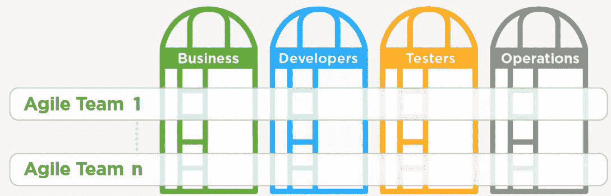
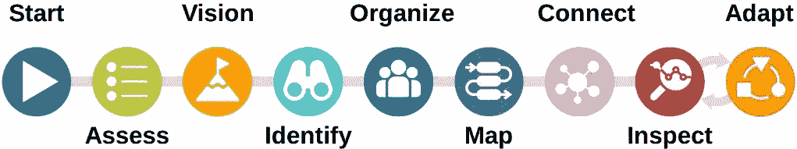
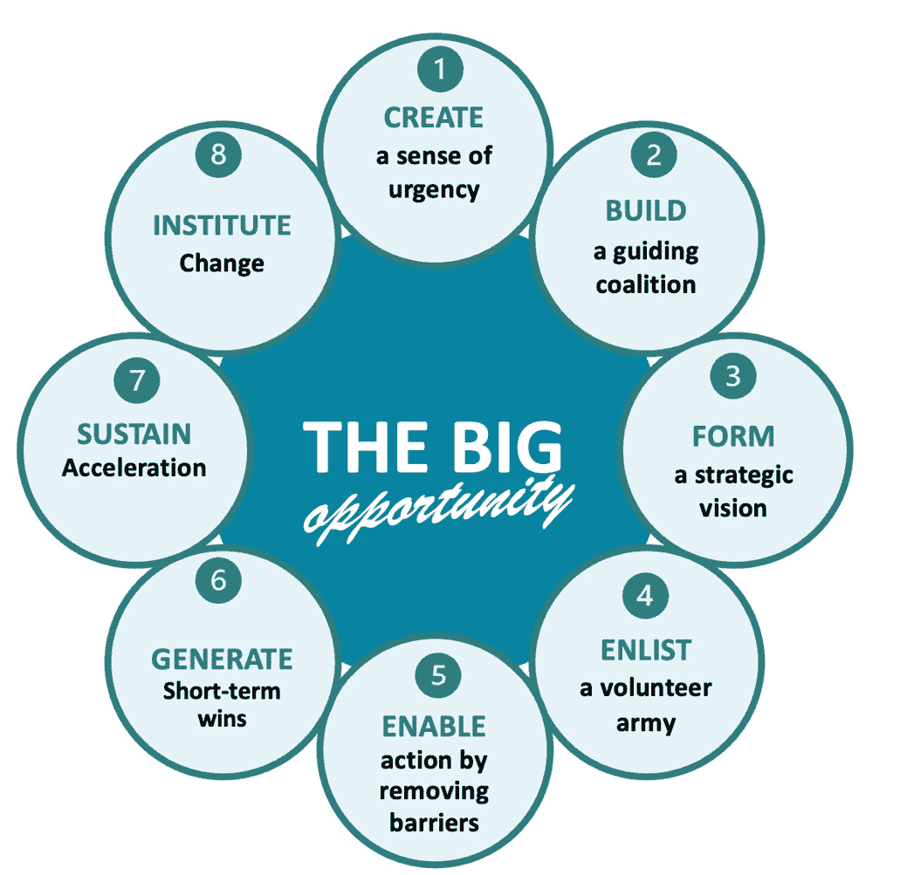
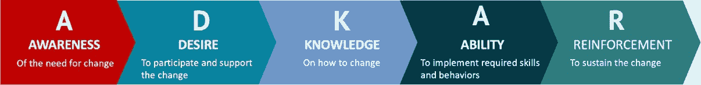

# 第十一章：实施组织转型策略

“变化的速度在短期内不会放慢。事实上，未来几十年大多数行业的竞争可能会更加激烈。”

– 约翰·P·科特尔

本章探讨了现代化商业转型的革命性方法。它为企业高层领导提供了多种实践方法，帮助他们采纳、实施并持续推进持续改进。可以将本章视为高层管理者的入门指南，为那些时间有限、无法深入了解细节的读者提供了精炼而全面的 Lean-Agile 实施策略概述。在这里，您将学到可操作的策略，推动创新、提升效率，释放组织的全部潜力，确保在这个前所未有、快速变化并且数字化的商业环境中保持竞争力。

理解如何为变革性变化构建路线图至关重要。这包括利用经过验证的变革管理框架，实施**价值** **流** **管理**（**VSM**）方法和工具，培养持续学习的文化，利用指标追踪进展和商业成果，并建立跨职能的 Lean-Agile 团队（以及团队的团队）。

本章将涵盖以下主题：

+   简化复杂性：应对 Lean-Agile 实施挑战

+   Lean 与 Agile：硬币的两面

+   建立跨职能团队并鼓励协作

+   利用数据和分析进行决策

+   采纳变革管理框架

## 简化复杂性——应对 Lean-Agile 实施挑战

本书的一个常见主题是，通过采纳 Lean-Agile 原则和方法，组织的敏捷性和运营卓越之旅是可以实现的。然而，这条道路往往充满了复杂性，特别是在将这一新范式应用于企业环境时，人员可能会对变革产生抵触情绪。

简化复杂性的艺术是有效实施 Lean-Agile 的核心。通过消除组织的壁垒，我们通过价值流优化工作和信息流。通过识别和消除不为我们的产品或服务创造价值的活动，我们随着时间的推移不断提升。这就是 Lean-Agile 企业中的 Lean 部分。

但这只是故事的一半。组织还必须愿意并能够持续适应和发展，以应对业务需求、市场动态和客户需求的变化。通过将变革的复杂性拆分成较小的增量，并不断探索新的改进方式，我们在每次新的增量交付中变得更加优秀。这就是基于 Agile 的实践精髓。

让我们快速了解 Lean-Agile 实践在最基本层面上包含的内容。

## 应用 Lean-Agile 实践——简化流程并增强灵活性

精益敏捷实践的基本原则非常简单。首先，组织人员、流程、技术和信息，以促进无缝的产品交付流，消除在层级结构中常见的组织孤岛。其次，识别并消除那些从客户角度看不增加价值的活动中的浪费。这可以降低成本、提高质量并增加吞吐量。同样，消除瓶颈也至关重要；一个组织的进展速度受到最慢活动的制约。试图在系统中强行增加工作会增加成本、导致瓶颈、延迟和隐藏缺陷。最后，应实施小型跨职能团队，以解决业务问题、规划并迭代式地开发解决方案。例如，利用小型跨职能团队来解决你的瓶颈和其他浪费。遵循这些实践，组织可以变得既精益又敏捷。

虽然精益敏捷实践相对容易理解和学习，但其复杂性在于如何在不破坏组织的前提下改变组织的文化和思维方式。因此，接下来我们将探讨如何定制精益敏捷实践，以促进组织转型。

## 为组织转型定制精益敏捷实践

精益敏捷转型的一个主要问题是提出的方法与组织现有的层级或扁平结构及传统实践之间可能存在的不匹配。层级结构促进了业务活动的孤立，而扁平化组织往往缺乏协调工作和信息流的结构。这两种极端都不是理想的状态。

如果没有经过深思熟虑且敏感于上下文的方法，公司可能会陷入昂贵且复杂的实施过程中，这种过程更可能导致破坏而非改进。这一现实突显了定制化适应精益敏捷实践（或框架）的重要性，以便与组织独特的 DNA 相匹配。

无论你选择哪种精益敏捷框架，都没有现成的解决方案适合你的组织。定制方法和工具的使用始终至关重要。你可能会发现，按需混合和匹配不同的实践，能够更好地满足你的需求。虽然供应商会乐于推广他们的知识库、实践和培训，但这些可能超出你的需求范围，并且仍未能直接满足你的实际情况。同时，你的高层管理团队负责寻找实施、培训、辅导和教练的具成本效益的解决方案。这需要高层管理者的全力参与。

在应对精益敏捷（Lean-Agile）实施挑战时，至关重要的是要承认并尊重现有组织环境的多样性。每个企业都有其历史、文化和既定流程，在设计转型战略时必须考虑到这些因素。

高层管理者必须深入理解其运营，以避免常见的陷阱，如角色不对称和过时的企业级流程。本书强调了 GEMBA Walks 的重要性，即亲自前往工作现场，直接观察工作是如何进行的以及存在的问题。与做实际工作的人员交谈至关重要，因为他们最了解问题和机会。

所获得的洞察为精益-敏捷实践的实施提供了指南，确保它们满足组织变革的需求，同时推动最高的效率和价值交付。因此，简化复杂性并不是照本宣科地应用精益-敏捷原则；而是要用组织的语言来解读这些原则。这是一个战略性的练习，通过定制框架、工具和实践，确保它们适应组织并推动其前进。

精益-敏捷因此成为支撑组织不断追求卓越和增长的战略资产。它被认为是“*战略性的*”，因为精益-敏捷的掌握对实现战略目标和任务贡献巨大，并且通常是公司价值主张的核心。

# 精益和敏捷——硬币的两面

精益和敏捷是互补但又不同的焦点领域，适用于你的运营模型，且应相互平衡，以确保进展顺利和性能稳定。我们在*第六章*讨论了价值流的开发与运营谱系，在*第七章*中，我们深入理解了价值流作为人员、流程、信息和技术的互联网络。

由于专注于适应性和快速交付，敏捷技术侧重于开发面，力求在增加效果的同时应对相关的不确定性和不一致性。相反，精益技术则强调减少浪费，实施拉式生产控制策略，并在可能的情况下进行标准化。两者相辅相成，推动可持续的价值交付。挑战在于智能地利用价值流概念，在适当的地方应用精益原则来提升生产力和质量，同时使用敏捷的迭代和增量开发方法来推动变革。

作为领导者，你的挑战是确保价值流被定义，并且工作与当前任务保持一致。对于日常运营工作，目标是创造高效且可持续的商业实践，以高质量满足客户需求。然而，其他价值流必须利用敏捷的 IID 实践，创造新的解决方案来改善商业流程、系统、产品和服务。此外，你还需要确保你的主题专家（SME）有时间通过其专业知识支持开发团队。

现代数字技术能够跨越传统开发边界进行整合、自动化和同步工作，极大加快了交付速度。例如，IT 的 CI/CD 和 DevOps 流水线将软件开发周期从几个月缩短至几天，甚至更短。在这些情况下，敏捷实践为规划和分析奠定了基础，而实际的开发活动则以精益导向的流程运行。

## 培养持续学习和改进的文化

领导者应创建一种重视持续学习和改进的组织文化。这包括鼓励实验，容忍失败（但要小范围失败）作为学习机会，并定期提供培训和发展资源。这种文化支持精益敏捷的原则和实践，赋能员工发现低效并提出创新的解决方案。

在当前的商业环境中，唯一不变的就是变化。为了让组织繁荣并保持竞争力，它们必须拥抱持续学习和改进的文化。这种文化不是日常运营的自然副产品；它需要被培育和滋养。领导者在将这种新文化融入公司结构中发挥着关键作用。以下是一些领导者可以采取的措施：

+   **实施** **精益敏捷** **原则**：采用强调客户价值、效率和员工赋能的精益敏捷方法。这些原则自然地鼓励持续改进和学习。

+   **以身作则**：领导力从高层开始。领导者不仅要支持持续学习，还要积极参与其中。通过亲自参与学习活动，领导者为所有员工树立了榜样。

+   **将** **学习** **嵌入** **战略**：使持续学习成为公司战略目标的组成部分。这要求明确传达学习的价值及其对实现商业目标的直接影响。

+   **建立心理安全感**：通过创造一个安全的空间来鼓励员工实验，在这个空间里，真正的努力和真诚的失败不会被斥责，而是被视为创新的垫脚石。奖励努力和学习，而不仅仅是成功的结果。

+   **小范围且尽早失败**：认识到敏捷的迭代和增量开发方法的关键好处之一就是风险减少，使得团队可以小范围、快速且尽早地失败，并利用失败进行调整和学习。

+   **拥抱实验**：与其惩罚失败，不如分析失败的根本原因。这样可以将失败转化为组织的宝贵经验，并避免将来重复同样的错误。

+   **提供** **培训** **和** **发展** **资源**：投资多样化的培训项目，满足不同学习风格和职业路径的需求。确保员工有时间和资源参与这些学习机会。

+   **鼓励** **知识** **共享**：营造知识共享的文化。内部消息、wiki、定期的“午餐与学习”会议和协作项目等工具可以促进这种交流。

+   **授权员工**：赋予员工自主权，识别低效环节并提出解决方案。当员工感到自己的意见受到重视时，他们更有可能积极贡献。

+   **频繁的反馈周期**：整合定期的反馈机制，使员工能够了解自己的表现，并明确改进的方向。

+   **认可** **并** **奖励**：公开表彰那些体现持续学习和改进精神的个人和团队。奖励可以是内在的，例如认同，也可以是外在的，例如奖金。

+   **利用** **技术** **增强** **学习**：利用商业和内部培训平台，为员工提供便捷的教育资源访问途径。

+   **持续** **反思** **并** **调整**：鼓励定期对个人和组织的做法进行反思，并根据所学的内容愿意进行调整。

将这些原则融入到组织的 DNA 中，领导者将培养出一支技术娴熟且具有适应能力的团队，并营造出一个持续改进成为常态的环境。这个环境支持精益敏捷原则，为一个响应快速且具有韧性的组织提供支持。它会形成一个良性循环，学习带来改进，改进则为学习开辟了新的途径，确保组织在不可预测的世界中生存并繁荣。

# 建立跨职能团队并鼓励协作

传统组织结构的孤岛效应可能会妨碍复杂业务流程的有效实施。领导者可以通过培养跨职能团队来推动变革，将不同的技能和观点汇聚在一起，在价值流中交付集成增量的特定组件。回顾*第八章*（BLAST）和*第九章*（BASE），集成增量的形式包括**最小可行产品**（**MVPs**）、**最小有价值增量**（**MVIs**）和**最小有价值发布**（**MVRs**）。通过 BLAST 团队和团队的团队鼓励协作，增强了问题解决和创新能力，使组织更具适应变化的能力。

传统的组织结构通常将专业知识划分到不同的部门中，形成了我们常说的**部门壁垒**。这些壁垒可能会阻碍沟通和工作流，影响组织有效执行复杂商业流程的能力。更糟的是，部门可能因管理跨部门工作流的低效而变得臃肿，并且脱离了组织的主要目标——即通过产品和服务为客户创造价值。

为了应对这一问题，领导者可以支持成立跨职能团队，这是由来自组织各个领域的专家和不同视角的人员组成的协作小组。建设跨职能团队是一项战略性举措，推动了以整体方式解决商业问题的方式。通过整合不同的技能集，这些团队能更好地从多个角度看待问题，从而得出更加稳健的解决方案。这种思维的多样性在问题解决和创新中尤为重要，因为它鼓励跳出框架思考，并将不同领域的创意进行综合。

鼓励团队内外的合作至关重要。可以通过共享目标、联合项目和团队建设活动等多种方式促进合作。此外，协作工具和平台能够促进团队成员之间更有效的沟通和创意分享，无论他们的物理位置如何。

跨职能团队的一个关键优势是它们能够使组织更具适应变化的能力。由于这些团队对组织各职能有全面的理解，它们能够预见到变化对整个组织的影响，并帮助更顺利地进行过渡。此外，因为它们不局限于单一部门的视角，跨职能团队通常能更好地执行变革举措，更加理解组织中每个部分如何融入更大的整体。

图 11.1 – 敏捷团队是跨职能的，旨在打破部门壁垒

对于那些希望推动变革的领导者来说，投资培养专门的跨职能团队是一项强有力的策略。这需要致力于重塑组织文化，重视并奖励跨部门合作。通过这样做，他们为一个更加创新、更加凝聚、更加一致且更好准备应对现代商业环境挑战的组织奠定了基础。

在前几章中，我们提到过小团队是最佳选择。让我们更深入地探讨这个话题。

## 揭穿“大团队更高效”的迷思

当组织试图组建较大的团队时，它们常常遇到各种挑战，这些挑战可能妨碍生产力和效能：

一个常见的问题是沟通过载。在较大的团队中，确保成员之间的有效沟通变得越来越困难。随着更多声音的加入，重要信息可能会被遗漏，导致误解和延误。

另一个挑战是协调困难。管理一个大团队的活动和决策过程可能变得繁琐。决策变得更慢，达成共识需要更多时间。此外，安排能容纳所有成员空闲时间的会议也越来越具有挑战性。

社会懒散也是较大团队中的一个问题。个体可能觉得自己对贡献不那么负责，从而导致努力和生产力下降。有些团队成员可能依赖其他人来分担工作量，进一步加剧了这一问题。

尽管思维多样性很有价值，但较大的团队可能难以在共同愿景或方法上达成一致。平衡多元化的观点与凝聚力的决策过程对于维持生产力和效能至关重要。

此外，较大的团队可能自然形成小团体或子团队，阻碍整体的协作并造成孤岛效应。这可能限制团队不同部分之间的信息流动，妨碍进展。

在领导大团队时，也会出现领导力挑战。需要强大的管理技能来确保每个人都能被听到、保持动力并参与其中。在一个更大的团队环境中，维持团队士气变得更加复杂。

资源分配是考虑较大团队时的另一个问题。将预算、时间和人力等资源在一个大团队中进行分配可能会很棘手。优先处理项目和管理依赖关系变得至关重要，以避免低效。

总结来说，尽管较大的团队可能带来多样的专业技能，但它们需要仔细的管理来减少挑战并保持有效性。团队规模与协作动态之间的平衡对优化团队表现至关重要。

在多个小团队之间导航协作与整合的复杂性是成功执行大规模项目、程序和价值流的关键。接下来我们将讨论这个话题。

## 解决小团队环境中的协作与整合挑战

在小团队环境中，协作和活动同步对于成功执行大项目或计划至关重要。然而，整合多个小团队的工作可能会带来显著的挑战。在这里，我们将讨论这些挑战，并探索有效克服这些挑战的策略：

+   **协作**：多个小团队之间的有效协作需要清晰的沟通渠道、共享的目标和努力的对齐。每个团队必须理解其在更大项目或计划中的角色，并朝着共同目标协作。定期的评审、会议事件和协作工具可以促进团队之间的沟通与协调。协作并不总是直觉性的，因此应该有意识地进行促进和支持。

+   **活动同步**：跨多个小团队同步活动涉及对时间线、里程碑和交付物进行对齐，以确保顺利推进并避免瓶颈。建立统一的活动节奏，例如 BLAST 集成增量规划会议和回顾会，能够帮助团队同步努力并保持动力。此外，定期的跨团队会议和站立会议可以为识别依赖关系和及时解决问题提供机会。这种协调的好处是管理和消除团队、产品和能力之间依赖关系的关键因素。

+   **团队之间的协作与规划会议**：虽然多个团队可以在一次会议中汇聚，但这不应该是常规做法，原因是之前提到的大团队设置中的沟通和参与挑战。直言不讳地说，大型会议应该限于信息传递，而不是规划或工作会议。在大多数情况下，每个团队应指定一名代表参加 BLAST 团队间的工作或规划会议。团队代表组成一个小组，与其分配的团队并行工作。这就是为什么 BLAST 不应有超过九个团队：确保 BLAST 代表能够在小团队会议中有效协作。如果需要更多团队，应设置额外的 BLAST 会议。指定的代表可以根据会议所需的技能和知识而有所不同。

+   **工作整合**：整合多个小团队的工作需要仔细规划和协调，以确保各自的贡献无缝地结合，达到工作或产品交付目标。这包括在团队之间建立接口和集成点，定义清晰的工作整合标准和指南，并进行定期的集成测试以验证互操作性。

+   **管理** **依赖关系**：管理多个小团队之间的依赖关系对于避免延误和确保项目里程碑的达成至关重要。团队必须在项目生命周期早期识别并优先处理依赖关系，建立追踪和解决依赖关系的机制，并在团队之间透明地沟通依赖关系。定期的依赖关系管理会议和依赖关系映射练习可以帮助团队主动解决依赖问题，最小化其对项目进度的影响。

通过积极应对这些协作和整合挑战，组织可以有效地利用多个小团队的集体能力，交付新的、集成的价值增量。总之，良好的协作、活动的同步、工作的整合以及依赖关系的管理是小团队环境中成功的关键支柱，使组织能够实现其战略目标并推动业务增长。接下来，我们将探讨如何通过整合数据和分析，成为掌握精益敏捷原则和有效价值流管理（VSM）的基石。

# 利用数据和分析进行决策制定

在上一章《*增强精益敏捷企业中的决策制定*》中，我们讨论了组织在海量数据面前感到不知所措的普遍问题。我们提出了**BRIA-QIDA**（**业务角色信息行动与问题信息决策行动**）方法，帮助组织评估做出明智决策和及时执行行动所需的信息。现在，让我们来看一下促进这一数据洪流转化为可操作洞察的工具和平台。

在大数据时代，利用分析进行战略决策至关重要。领导者应该投资于数据分析平台，这些平台能实时提供运营流程、客户行为和市场趋势的洞察。数据驱动的决策使组织能够更加灵活、响应迅速并保持竞争力。高层管理人员应支持 BRIA 工作坊，以确保开发出能即时获取所需信息、解答最紧迫业务问题的能力。

利用数据和分析是掌握精益敏捷原则和有效的价值流管理实践的基础。在当前的技术环境中，数据集庞大且多样化，如何利用这些信息成为了一个重要的竞争优势。

在精益敏捷环境中，响应性和适应性至关重要，数据分析平台能够快速提供可操作的洞察。这些洞察对于理解客户需求和行为至关重要，使组织能够优化价值交付。通过密切监控和分析绩效指标，可以通过持续改进来减少浪费——这是精益原则的核心。

对于 VSM，数据分析有助于全面了解价值流，识别瓶颈和低效环节。实时数据源源不断地传入 VSM 工具，使团队能够追踪从概念到客户的价值流动，确保过程中的每个步骤都能对最终结果产生积极影响。为了成功实现这一方法，数据需要易于访问、有序、质量高、一致且相关。仅仅将工具连接到价值流管理平台并依赖数据中涌现的洞察是不够的。在 2023 年《价值流管理联盟报告》的*价值流管理现状*中，只有 4%的受访者将数据连接到 VSM 平台，这是实施路线图中所有步骤中的最低比例。

领导者应该投资于强大的分析平台，并培养数据驱动决策的文化，使数据驱动决策成为常态。高管和员工都需要及时获得做出明智决策和采取适当行动所需的信息。团队应当被赋能，利用数据洞察来指导工作，尝试新想法，并根据反馈和市场变化迅速调整方向。

这种以数据为中心的方法与敏捷原则中的“频繁交付可工作解决方案”一致。它确保决策不再依赖直觉或过时的报告，而是基于反映真实情况的当前、相关数据。

总结而言，将数据和分析融入精益敏捷和 VSM 的决策过程中，可以带来以下好处：

+   通过消除浪费，提高效率和生产力

+   通过快速响应客户需求和行为，提高客户满意度

+   通过理解并响应趋势，增强市场适应性

+   通过预见和缓解潜在问题，改善风险管理，防止问题升级

+   通过做出符合组织目标和客户价值的明智战略决策，增加投资回报率

对于那些力争走在行业前沿的组织来说，数据和分析的掌握不仅是战略资产，更是必不可少的。

## 实施 VSM 以对齐 IT 开发活动

回顾一下，价值流管理作为一种方法论，旨在识别改进机会，优先处理那些能够产生最大附加值的工作，并制定和执行改善计划（Kaizen Plan）以实现我们的优先目标。在*第四章*《通过价值流管理（VSM）推动改进》中，我们介绍了为此目的而采用的九步 VSM 方法论。接着，在*第五章*《介绍 VSM 实施路线图》中，我们讨论了**价值流管理联盟**（**VSMC**）在实施 VSM 以使 IT 与组织的价值流改进保持一致时所采用的方法。

在追求组织敏捷性和运营改进的过程中，VSMC 的研究强调了两个维度：**流程**和**价值实现**。VSM 针对这两者进行了定制优化。为了建立有效的 VSM 能力，创建了 VSM 实施路线图，旨在引导领导者和从业者完成在组织内部实施 VSM 并持续这一实践的过程。*第五章*详细介绍了路线图的各个步骤，下面我们简要总结一下。如*图* *11.2*所示，VSM 路线图从假设任何当前状态都是一个可行的起点开始，然后逐步列出每个活动，旨在建立、构建、部署并维护价值流改进活动。

图 11.2 – VSM 实施路线图

VSM 路线图概述了在组织内部有效实施 VSM 的步骤和策略，以提高效率和价值交付。该路线图为寻求精简流程并最大化运营价值的高层管理人员和经理提供了指导。虽然它可以应用于任何价值流改进计划，但它特别为支持知识工作和 IT 而开发。

通过遵循 VSM 实施路线图，组织可以识别并消除浪费，优化其价值流的流程，并增强整体敏捷性。我们来回顾一下每个步骤：

| **步骤** | **描述** |
| --- | --- |
| 开始 | 从你所在的位置开始，迈出正确的第一步。理解基本概念。 |
| 评估 | 了解你的当前状态、范围和背景。 |
| 愿景 | 设定一个引人注目的目标愿景，以建立认同感并激发清晰的热情。 |
| 确定 | 确定你的相关价值流——任何交付产品或服务的活动。 |
| 组织 | 将负责每个步骤的人员按价值流组织起来。 |
| 映射 | 列出每个活动及其表现，从交付的价值开始反向工作。 |
| 连接 | 汇集数据，揭示你价值流中的流程洞察。 |
| 检查 | 审查性能洞察和潜在改进。 |
| 适应 | 利用洞察设计并进行实验，以优化流程和价值。 |

总体而言，VSM 实施路线图提供了一种全面且清晰的方法，用于实施价值流管理，符合精益和敏捷方法论的原则。它为高管和经理提供了一条明确的路径，帮助他们推动持续改进并最大化交付给客户的价值。通过利用实施路线图，你可以建立一个坚实的基础和有效的过程，从而顺利采用 VSM 工具，而不会在这一过程中遇到过多挑战。

## 实施 VSM 工具

现代 VSM 工具通过可视化贯穿软件交付价值流的端到端活动中的工作流，并衡量每个交付周期的成功，支持基于 DevOps 的软件交付过程。换句话说，VSM 工具帮助可视化和分析将产品或服务交付给客户所需的材料（例如，代码和其他资产）和信息流。通过识别瓶颈、浪费和改进机会，这些工具支持精益和敏捷计划，帮助基于客户价值做出更好的决策和优先级设置。

通过“假设分析”，VSM 工具在优化将产品或服务交付给客户的过程中起着重要作用。这些工具在可视化和分析价值流方面发挥着至关重要的作用。通过绘制产品开发生命周期中的每一个步骤，VSM 工具使团队能够识别并理解每一个行动的价值，发现瓶颈、冗余任务以及可能存在的任何浪费——无论是过度生产、等待时间、不必要的运输、过度处理、库存过剩、不必要的搬动，还是缺陷。

在与精益-敏捷计划和方法论结合使用时，实施 VSM 工具尤为有益。具体来说，VSM 工具通过提供有关实际工作如何与这些原则对齐以及如何促进组织整体目标的清晰洞察，增强了精益-敏捷解决方案交付活动。

这些基于数据的洞察力能够支持更好的决策和优先级设置。通过理解价值的创造与流失，团队可以做出符合客户价值的明智选择。优先级的设定不再仅仅是根据谁的声音最大，而更多地是基于什么能为消费者和企业带来最大利益的客观衡量。

在软件交付中，像其他任何价值流一样，各种指标被用来确定交付管道的业务价值和效率：

+   **交付** **时间**：从客户请求到最终产品交付的总时间。这是衡量整个过程效率的标准。

+   **周期** **时间**：这是衡量在价值流中完成一个活动所需的时间，有助于建立每个阶段性能的衡量标准。

+   **吞吐量**：系统在一定时间内能够交付的工作单位数。这个指标可以反映团队或过程的能力。

+   **等待** **时间**：在价值流的各个阶段之间实际花费的等待时间。

+   **在制品** **(WIP)**：已开始但尚未完成的工作量。高 WIP 水平可能表明瓶颈问题和团队容量超负荷。大量的 WIP 还往往会掩盖错误和缺陷，在过程中积累更多的技术债务。

+   **缺陷率**：交付物中的错误频率。这个指标可以用来衡量输出质量以及质量控制过程的有效性。

+   **价值流效率**：过程时间与交付时间的比例，表示整体周期时间中有多少时间是用于增加价值的。低价值流效率意味着价值流步骤中存在显著的浪费和延迟。

+   **反馈回路速度**：信息或问题传达给开发团队采取行动的时间，以软件工程中通过持续集成和部署管道进行的代码部署、测试和改进的快速迭代周期为例。

成功实施 VSM 工具使得组织可以将注意力从单纯的忙碌转向高效生产。它有助于创建一个持续改进的文化，在这个文化中，决策是基于数据和客户价值，而不是基于错误的假设或惯性。通过采用 VSM 工具，公司可以朝着以最有效、最高效且以客户为中心的方式交付产品和服务迈出必要的步伐。

VSM 工具对于那些旨在通过软件开发过程优化价值交付的组织至关重要。VSM 工具使这些组织能够围绕共同目标对齐，识别瓶颈并提高效率。通过在组织内部建立明确的价值流，VSM 工具有助于衡量关键**DORA**指标，如部署频率、变更的交付时间、恢复时间的平均值以及变更失败率，这些都是评估绩效并实施敏捷和 DevOps 方法的关键。

市场上的 VSM 工具种类繁多，通常提供连接不同团队和工具、可视化工作流、衡量绩效指标以及使组织结构与客户需求对齐的功能。这些工具有助于打破部门之间的壁垒，创建共享的工作流理解，并自动收集绩效数据，以推动持续改进。

本书的作者提议将 VSM 工具的概念扩展到有效地“*仪表化*”所有组织的价值流。这个概念不同于工作流系统，后者源于业务流程重组和改进领域，旨在实例化标准化流程。工作流系统促进了一种专注于控制过程和信息流的思维模式，而 VSM 则超越了这一功能。VSM 不仅促进了过程和信息流的控制，还帮助识别改进领域，并在接近实时的情况下试验潜在的价值流优化。

现在，让我们从讨论如何利用数据转向探讨支持我们精益敏捷和 VSM 实施的变革框架。

## 通过流量指标提升软件交付

**流动指标**，由 Mik Kersten 博士在 Flow 框架中提出，是一组关键的业务层面指标，旨在阐明软件交付过程。它们通过聚焦产品价值流中的价值流动，帮助将业务目标与 IT 操作连接起来。关键的流动指标包括：

1.  **流动速度**：量化在特定时间内完成的工作项数量，提供关于团队交付速度和能力的洞察。

1.  **流动效率**：反映在工作项上花费的活跃时间与总时间的比例，突出了操作效率。

1.  **流动时间**：衡量从工作开始到完成的全面时长，包括活跃工作和等待时间。

1.  **流动负载**：指在任何给定时刻正在进行的工作项的总数量，揭示潜在的瓶颈和工作负载问题。

尽管**流动分布**并不严格算作单一指标，但它同样至关重要，因为这些度量展示了正在进行的工作项（例如功能、缺陷）的组成，确保价值流动的平衡。

这些指标对于旨在完善软件交付流程并与业务目标对接的组织至关重要。它们为业务和 IT 领导者提供了统一的语言，以推动信息化决策和持续改进。

虽然流动指标和传统的精益导向指标都力求提高效率和价值交付，但它们在焦点和应用上有所不同：

+   **焦点和范围**：流动指标是专为软件开发设计的，重点关注价值流动，旨在弥合业务与 IT 之间的差距。相反，传统的精益指标源自制造业，针对减少浪费和跨行业的流程改进。

+   **关键指标**：流动指标侧重于如流动速度、效率、时间、负载和分布等指标，专门针对软件交付环境量身定制。传统的精益指标包括周期时间、交付时间、产量、在制品（WIP）和首件合格率（FPY），这些指标在各行各业和不同领域广泛适用。

+   **应用**：流动指标主要用于软件开发中，将 IT 与业务目标对齐，并增强价值交付。传统的精益指标应用于制造业及其他领域，优化流程并减少浪费。

+   **测量方法**：流动指标强调端到端的价值流动，整合活动和空闲时间，以优先考虑业务价值的交付。相对而言，传统的精益指标则聚焦于特定的过程步骤，以提高效率和减少浪费。

总结来说，尽管这两种度量框架的目标都是优化效率和价值交付，但流动指标更加针对软件环境，强调持续的价值流动。传统的精益指标则更为广泛，聚焦于跨行业的流程优化和浪费减少。

# 采用变更管理框架

如果变革管理不当，组织变革可能会令人迷茫并造成负面干扰。领导者应避免使用未经验证或临时的流程，而应转向已建立的变革管理框架，引导组织度过变革的动荡期。科特尔的 8 步变革领导流程和**ADKAR**变革模型是最著名且经过验证的两种框架。它们支持规划、实施和维持变革，以下小节将简要讨论这两个框架。

## 科特尔的 8 步变革领导流程

约翰·科特尔（John Kotter），哈佛商学院名誉教授、科特尔国际管理咨询公司创始人，撰写了关于领导力和变革的众多书籍和文章，其中包括具有深远影响的著作《*变革领导*》。他的开创性作品提出了 8 步变革领导流程，旨在帮助组织克服重大变革常伴随的抗拒情绪，并促进接受和参与。科特尔对如何管理和适应变革产生了深远的影响，强调紧迫感、愿景、沟通以及将变革融入组织文化的重要性。科特尔的贡献使他成为组织行为学和领导力研究领域的领先声音之一。

*图* *11.3* 展示了科特尔的变革模型，并附有每个元素的简要说明。

图 11.3 – 科特尔的八步变革模型

1.  **创造紧迫感**：通过传达变革的需求来激励人们行动，这种需求需要打动人们的理性和感性。这一需求必须足够引人注目，以便让人们走出舒适区，打破现状的惯性。这需要公开讨论当前面临的风险和变革带来的机遇。为了使变革成功，必须激发和整合人们的力量，确保变革成为现实。

1.  **建立指导联盟**：组建一个由组织内有效人员组成的志愿团队，指导、协调和沟通变革活动。团队成员必须拥有支持协作变革所需的权力、精力和影响力。

1.  **制定战略愿景**：制定一个愿景，指导变革努力，并制定战略举措以实现这一愿景。明确未来状态与过去的区别，并通过与愿景直接相关的举措争取认同，使变革成为现实。

1.  **招募志愿者军队**：只有当许多人围绕共同的挑战或机遇而团结起来，重大的变革才能发生。招募那些愿意积极参与并希望有所作为的人。这些志愿者必须愿意合作，共同实现目标。

1.  **通过消除障碍来促进行动**：识别并消除阻碍变革努力的障碍，无论是组织结构、技能不足、传统政策与做法，还是其他任何阻止员工执行愿景的因素。

1.  **产生** **短期** **胜利**：尽快规划、定义并执行清晰且明确的成功机会。短期胜利证明了付出的努力是值得的，能够让反对者闭嘴，同时激励支持者。确保这些胜利是真实的，并且能够被识别、收集和广泛传播——早期且经常地进行，以追踪进展并激励人们坚持下去，防止回归传统思维和行为。

1.  **保持加速**：利用早期胜利所获得的信誉，逐步解决更大、更困难的变革。每次胜利后，分析成功的因素和需要改进的地方，然后设定更具雄心的目标。毫不松懈地推动变革，直到愿景成为现实，始终保持行动的倾向。

1.  **建立** **变革**：将变革根植于文化中，确保它们成为常态并替代旧习惯。沟通并庆祝新行为和态度如何提升了绩效并带来了胜利。运用系统思维评估系统和流程，避免昂贵且无效的局部优化，确保管理实践能够强化新的行为、心态和工作方式。

变革举措常常失败，因为它们没有关注到人类因素，例如组织中的个人如何看待变革。因此，成功实施 Kotter 的过程需要关注变革的人的一面。通过遵循这八个步骤，领导者可以自信地引导组织度过变革的波涛汹涌，并且变得更加坚韧，为未来做好准备。

## ADKAR® 变革模型

**ADKAR** **模型**由 Prosci 的创始人 Jeff Hiatt 于 1994 年开发，是 Prosci 方法的基石，这是一种全面的变革管理方法。Hiatt 曾是贝尔实验室的工程师和项目经理，在研究了 700 多家组织的变革管理实践后，设计了这个模型。ADKAR 是**Awareness**（意识）、**Desire**（愿望）、**Knowledge**（知识）、**Ability**（能力）和**Reinforcement**（强化）的首字母缩写，旨在解决变革中的人类因素，已被广泛采用。Hiatt 对变革管理的贡献不仅限于 ADKAR 模型，还反映了他在该领域的广泛研究和写作。

ADKAR 代表了一种自下而上的方法，专注于个人需要经历的过渡，以确保变革的成功。*图 11.4 – Prosci ADKAR 变革模型* 提供了每个组成部分的高层次概述，接下来是每个元素的简要描述。

图 11.4 – Prosci ADKAR 变革模型

+   **意识**：确保员工理解变革的必要性。这意味着需要沟通变革的性质及其背后的理由。

+   **愿望**：激发员工参与和支持变革的愿望。这涉及到在情感层面与员工互动，并关注他们的动机。

+   **知识**：提供必要的培训和教育，使员工能够实现变革。这可以通过研讨会、讲座或实地培训进行。

+   **能力**：为员工提供实施变革所需的工具、资源和支持。这包括时间、预算以及日常工作流程的调整。

+   **强化**：采取措施确保变革得以巩固。这包括持续的支持、表彰成功，并将变革嵌入到组织文化中。

ADKAR 模型以其简洁性和有效性著称，它帮助领导者诊断变革过程中存在的差距，并在员工适应的不同阶段提供有针对性的干预。这是一个可以应用于个人变革和企业组织变革管理的工具。

ADKAR 与 Kotter 模型提供了两种不同的组织变革管理方法。Kotter 聚焦于变革的*战略*层面，优先考虑领导层的支持及推动有效变革管理所需的步骤。其过程从建立紧迫感开始，接着是创建引导联盟、制定愿景和战略、传达变革愿景、授权广泛行动、创造短期胜利、巩固成果、推动更多变革，最后将新方法固守在文化中。

相对而言，ADKAR 强调的是个体在变革过程中的历程，突出了意识、愿望、知识、能力和强化等关键阶段。

此外，Kotter 的方法是战略性和自上而下的，而 ADKAR 则是自下而上的方法，更加以个人为中心，侧重于个人的变革准备和支持。领导者可以独立使用这些框架，或将其结合起来，引导变革计划，确保变革过程深思熟虑、顺利执行并最终取得成功。

# 总结

在*第十一章*中，我们通过精益敏捷原则和实践，提出了成功的组织转型的高层策略。该执行摘要提供了可操作的见解，推动创新、提高效率，并在当今动态的商业环境中保持竞争力。具体而言，本章专注于将精益敏捷原则作为持续的业务转型策略的实际方法，确保你拥有有效领导组织变革所需的工具和知识。

关键收获包括构建变革转型的路线图，利用变革管理框架，实施价值流管理方法，培养持续学习的文化，使用指标来跟踪进展，并建立跨职能的协作敏捷团队。

这些见解对于寻求简化流程并推动可持续组织增长的高层管理者至关重要。在本章总结之前，最后一个思考：本章提供了前几章所涵盖信息和概念的高级概述，作为本书中关键概念的回顾。然而，作为一名高管，您需要关注那些章节中的细节，以便有效推动向精益-敏捷组织的转型。

在下一章中，我们将把本书中学到的关键概念和经验教训整合成一系列跨领域的主题，并提供有关如何在组织内有效实施这些策略的实践指导。

# 问题

本部分适用于那些希望评估自己对本章提供信息的理解和记忆的人。这里有五个问题，答案将在下一部分提供。回忆原文的确切措辞并不重要，重要的是回忆出概念及其应用。

1.  本章讨论的两个已建立的变革管理框架是什么？

1.  科特尔的变革领导模型的八个步骤是什么？

1.  ADKAR 变革模型代表什么，其组成部分是什么？

1.  科特尔的组织变革管理方法与 ADKAR 模型有何不同？

1.  关于通过精益-敏捷原则和实践进行组织转型，*第十一章*的关键收获有哪些？

# 答案

1.  文档中讨论的两个已建立的变革管理框架是科特尔的 8 步法和 ADKAR 变革模型。

1.  科特尔的 8 步法包括以下八个步骤：

    1）创造紧迫感

    2）建立指导联盟

    3）形成战略愿景

    4）招募志愿者团队

    5）通过消除障碍来启用行动

    6）产生短期胜利

    7）保持加速

    8）实施变革

1.  ADKAR 变革模型代表意识、愿望、知识、能力和强化。

1.  科特尔的 8 步法与 ADKAR 模型的区别如下：科特尔的方法是一个自上而下的战略方法，专注于领导层的支持以及推动有效变革管理所需的步骤。相比之下，ADKAR 模型更加关注个体，侧重于个人在变革过程中的旅程，并突出了意识、愿望、知识、能力和强化等关键阶段。

1.  关于组织变革的**第十一章**中的一些关键要点包括：为变革构建路线图，利用变革管理框架，实施价值流管理方法，培养持续学习的文化，使用度量标准跟踪进展，并建立跨职能的协作敏捷团队。
