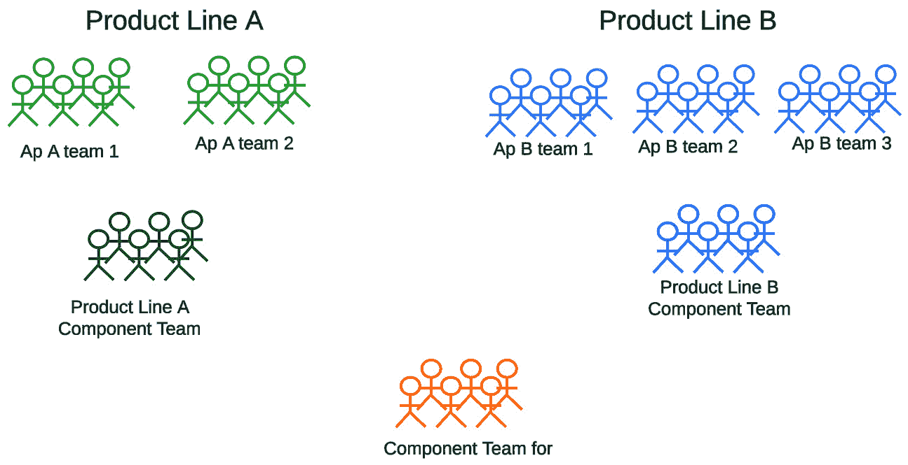
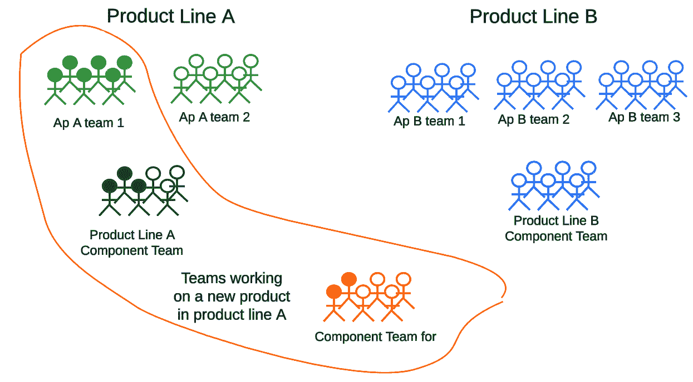

# 12

# 构建精益敏捷与 VSM 精通

广泛采用精益管理将使美国更具竞争力。

《工业周刊》，2023 年 9 月 1

恭喜！您已经掌握了通过持续的商业转型，利用精益敏捷和**价值流管理**（**VSM**）实践来推动竞争优势的丰富知识。然而，我们的旅程并未结束。现在是巩固学习并开始应用所学知识，踏上精益敏捷精通之路的时刻。

本章的目标是赋予您对精益敏捷（Lean-Agile）和 VSM 实践的全面理解，并在实际场景中应用这些实践。通过整合您的学习并提供实践指导，我们的目标是为您提供推动组织内转型变革所需的工具和策略。

在这里，我们将回顾书中各部分的关键学习内容，并提供可操作的策略，以将这些实践嵌入到您的组织中，促进持续的商业转型，提升竞争力和以客户为中心的思维。具体而言，您将深入了解精益、敏捷和 VSM 原则如何协同工作，以推动以价值为中心的客户交付和可持续的组织卓越。

在当今竞争激烈、变化不断的商业环境中，掌握精益敏捷（Lean-Agile）和价值流管理（VSM）实践对于保持竞争力至关重要。本章将涵盖以下主题：

+   解决劳动份额下降的问题

+   回顾主要概念和关键要点

+   连接主题与现实世界的例子

+   应用现实世界的实例

+   赋能变革：为组织卓越而行动的号召

# 解决劳动份额下降的问题

你知道美国国内制造商品的市场份额在过去 20 年持续下降吗？根据 CPA 国内市场份额指数，2022 年达到了 66%的历史最低点。一个关键问题是美国 GDP 中劳动份额下降了三分之二。经济学家指出有三大因素导致这一下降：

1.  **低生产率增长**：低迷的生产率增长显著影响劳动份额，约占下降的一半。2

1.  **收入不平等**：平均工资与中位数工资之间的差距不断扩大，导致劳动份额下降，占总体差距的 19%。3

1.  **技术进步**：由于偏向性的技术变革，劳动与资本的影响不均，这也起到了作用。资本深化（资本相对于劳动的增加）是一个贡献机制。4

这一令人担忧的趋势凸显了组织迫切需要回归精益生产实践的基础。此外，他们还必须将源自软件行业的敏捷实践融入其中，以适应并通过跨产品、服务和支持业务的系统的数字化创新不断进化。这些策略共同帮助组织有效应对全球经济的复杂性，并保持竞争力。

这是一个大胆的声明，也是一个艰巨的任务。那么，让我们来探讨一下负责任的精益敏捷企业和社会如何合作，解决这些至关重要的挑战。

## 通过精益敏捷实践促进企业责任

亨利·福特以其对员工公平工资重要性的深刻理解而闻名，他认识到员工需要有能力购买他们所创造的产品，否则他就无法为自己的汽车找到客户。这一开明管理原则至今仍至关重要，尤其在如今的商业环境中，企业必须对更广泛的社会问题承担责任，比如收入不足和技术变革。精益敏捷实践为应对这些挑战并推动商业成功提供了框架。

### 解决收入不平等问题

精益敏捷企业的领导者和股东应当认识到，他们有责任根据员工的技能和专长支付公平的工资。公平的薪酬不仅是道德义务，也是战略必要。通过确保员工得到公平补偿，公司帮助推动一个充满潜在客户的强大经济体，这些客户有经济能力购买他们的产品和服务。此外，通过确保员工得到公平补偿，企业可以培养出更有动力和忠诚的员工队伍，从而最终实现更加稳定和繁荣的结果。这种方法认识到，正是那些为公司成功做出贡献的人，也是公司的客户，持续支撑着其产品和服务的市场。

### 应对技术进步

虽然精益敏捷型企业可以利用技术来提高效率和价值交付，但社会必须关注技术进步带来的更广泛影响。确保技术不会以牺牲经济为代价取代劳动者是一个集体性挑战。企业、政策制定者和社区需要共同努力，创造出平衡技术进步、工作安全和经济稳定的解决方案。这种合作努力将有助于减少自动化带来的风险，并确保技术进步造福每一个人。

精益实践与技术提升的结合帮助企业消除低效，减少不必要的库存，最小化缺陷，并赋能员工参与问题解决和决策过程。此外，敏捷实践的适应性确保这些改进成为持续的过程。这一全面的方法确保组织在实现战略目标的同时为社会做出积极贡献，最终为公司和客户创造可持续的繁荣未来。持续性的关键在于理解技术，包括 AI，并非替代人类，而是帮助人类。人们通过购买驱动我们的经济，因此我们需要将技术视为一种手段，通过解放资源来推动经济发展，推出我们尚未想到的新产品和服务。

在讨论了美国 GDP 中劳动份额下降三分之二，并探讨了精益敏捷企业如何应对这一挑战后，让我们以总结你所学的内容来结束本书，包括跨领域的主题。我们还将提供三个实际案例，展示精益敏捷实践如何改善商业运作。

# 回顾主要概念和关键要点

本节将快速总结本书四个部分和十二章的关键内容。我们将从前三章开始，这些章节构成了*第一部分*。

## 第一部分：总结精益敏捷基础

在*第一部分*中，我们探讨了精益敏捷和价值流管理（VSM）的基础内容。强调了在快速变化的数字化环境中，不仅要生存下来，还要引领潮流的重要性。精益、敏捷和 VSM 实践被突出强调为优化价值流、完善流程和促进协作的关键。

### 引导数字化转型

*第一章*，*引导精益敏捷转型*，介绍了精益敏捷方法论，强调了它们在当今数字化环境中的重要性。关键见解包括以下几点：

+   精益敏捷掌握的必要性

+   基本原则和实际应用

+   通过精益敏捷实践提升组织绩效

### 解决复杂的商业问题

*第二章*，*通过敏捷解决复杂商业问题*，深入探讨了敏捷方法论。涉及的关键点如下：

+   敏捷的迭代式和增量式开发

+   协作技巧和 Scrum 方法论

+   打破组织壁垒的团队协作模式

+   持续改进和流程精简的策略

### 建立高效流动

*第三章*，*建立精益流动以提升生产力*，考察了精益原则，重点关注以下内容：

+   提升生产力、优化效率和消除浪费

+   实施策略和标准术语

+   将精益原则嵌入组织文化，以实现可持续增长

这总结了*第一部分*《实施精益敏捷基础》的内容。接下来，我们将探讨*第二部分*《价值流改进》的关键点。

## 第二部分：有洞察力的价值流改进方法

本书的*第二部分*聚焦于价值流管理（VSM）及其在提升组织内精益敏捷原则方面的作用。它提供了优化流程、推动改进和培养持续改进文化的实用策略。本部分为你提供了推动有意义变革和实现精益敏捷精通的工具。

### 运用九步 VSM 方法论推动改进

*第四章*，《通过价值流管理推动改进》，介绍了 VSM 通过九步 VSM 方法论的变革潜力。本章强调了持续改进的思维方式，这对于在当今竞争激烈的环境中蓬勃发展至关重要。关键见解包括以下内容：

+   评估改进机会的九步 VSM 方法论

+   VSM 作为一种战略方法，推动持续改进

+   识别和优先排序价值流的实用策略

+   通过卓越运营利用 VSM 实现可持续成功的路线图

通过采用这种方法论，你获得了一个框架，系统地评估改进机会并执行有效的计划，从而减少停滞和衰退的风险。

### 实施 VSM 路线图

*第五章*，《VSM 实施路线图介绍》，探讨了**价值流管理联盟**（**VSMC**）实施 VSM 原则的实用方法。基于*第四章*，它呈现了一个九步框架：开始、评估、愿景、识别、组织、绘制、连接、检查和适应。关键见解包括以下内容：

+   通过将 IT 努力与持续的价值流改进机会对齐，推动变革的综合框架

+   整合精益和敏捷实践以优化价值流的路线图

+   确保 IT 与战略目标和以客户为中心的价值交付保持一致

这条路线图提供了结构化的指导，帮助在复杂的业务转型中充满信心和敏捷地前行。

### 实现精简的价值流

*第六章*，《价值流优化的导航》，深入探讨了价值流优化的复杂性。它探讨了运营动态的宏观和微观层面，突出了在组织内部追求无缝流动的目标。主要内容包括以下几点：

+   精益流动原则的重要性和敏捷的迭代规划

+   解决破坏精简工作流程的挑战

+   从传统的层级结构转向价值流视角

+   优化流程以提高运营效率

本章强调了有意设计工作流程和战略资源对齐在促进合作和持续改进中的重要性。

### 通过价值流网络增强组织的流动性

*第七章*，*连接价值流网络*，考察了组织内部从创始到客户交付的相互连接流。借鉴 Mik Kersten 的《从项目到产品》一书中的洞察，我们强调了生命周期、产品导向思维的必要性，并且强调了将我们的努力与客户需求对齐的重要性。关键洞察包括以下内容：

+   理解工作项之间的相互关联流

+   将人员、流程、信息和能力整合以优化价值交付

+   从以项目为中心转向以产品为中心并聚焦客户的视角

+   将价值流与客户旅程对接，以便更好的组织和可视化

+   强调持续管理和完善的重要性，以确保持续改进和适应性

通过掌握*第二部分*中概述的原则，你将能够驾驭价值流优化的复杂性，并推动你的组织在当今竞争激烈的环境中实现持续成功和创新。现在，让我们回顾一下*第三部分*中涉及的主题。

## 第三部分：协调精益敏捷团队进行企业价值交付

本书的*第三部分*探讨了组织如何通过 BLAST 框架和 BASE 概念模型推动持续的价值交付。BLAST 框架协调多个精益敏捷团队在解决方案导向任务中的协作，而 BASE 概念模型则通过组织多个 BLAST 团队，以增量方式在企业层面交付价值。本部分介绍了将这些方法整合以促进持续商业转型并提高整体组织效率的策略。

### 实施 BLAST 框架

*第八章*，*实施基础精益敏捷解决方案团队（BLAST）*，介绍了一种综合方法，旨在整合多个合作团队在大型项目中的工作。它强调了现代商业中可操作的方法论的需求，将精益效率与敏捷适应性相结合。关键洞察包括以下内容：

+   BLAST 框架将多个精益和敏捷团队在大型项目和程序中的工作整合在一起

+   它将精益效率与敏捷的迭代开发相协调

+   一些 BLAST 团队遵循流动轨道，而另一些则遵循敏捷的时间盒轨道

+   在具体情境下，团队可能会同时采用精益和敏捷轨道，例如 IT 部门利用敏捷的时间盒方法来管理计划和工作节奏，同时利用精益的流动概念，通过集成和自动化的 CI/CD 与 DevOps 管道来改进流程。

+   BLAST 实施四个核心流程、十七个步骤、企业节奏、三个角色和三个工件。

总结来说，*第八章*深入探讨了通过 BLAST 框架的精益敏捷整合，提供了有关在持续流动环境中协调多个小团队的宝贵见解。

### 通过 BASE 实现企业卓越。

*第九章*，*定义企业业务敏捷系统（BASE）*，探讨了 BASE 概念模型。BASE 不是一个规范性的精益敏捷框架或方法论，而是规定了一系列周期性的通用流程和活动，帮助组织协调多个 BLAST 的工作，以在可预测的节奏上交付新的集成增量。BASE 不解释如何执行工作，因为组织必须确定什么能增加价值以及如何以最低的实际成本实现最大化价值。主要见解包括以下内容：

+   BASE 模型强调通过反馈循环促进协作和持续改进。

+   它专注于“产品或服务生命周期”，以持续交付新的客户价值。

+   BASE 模型的目的是定义一个围绕客户为中心实践的“持续企业改进的良性循环”。

+   BASE 规定了精益敏捷企业的四个原则和八个核心流程。

+   BASE 将客户旅程置于其焦点中心，产品负责人和价值经理代表他们的客户利益。

+   BASE 采用价值流管理实践，帮助加速价值交付。

+   专注于交付集成增量（即 MVP、MVI 和 MVR）确保组织专注于产生足够的价值以满足客户需求，同时最小化浪费。

总结来说，*第九章*强调了以客户为中心的实践的重要性，并在 BASE 框架内保持“良性循环”，以快速适应市场变化并交付增量价值。

### 总结组织卓越：实施 BLAST 和 BASE 框架。

本书第三部分中介绍的 BLAST 框架和 BASE 概念模型对于推动快速创新、最高效率和持续价值交付至关重要。BLAST 框架促进了适应性迭代，以创建集成增量，同时消除浪费和限制，而 BASE 框架专注于以客户为中心的价值交付，并精确地导航产品生命周期。两者结合为组织提供了在当今动态商业环境中蓬勃发展的工具和方法。

## 第四部分：反思精益敏捷的掌握。

在本节中，我们回顾了*第十章*，《在精益敏捷企业中提升决策能力》和*第十一章*，《实施组织变革策略》中涵盖的要点。*第十二章*是你当前阅读的章节，因此不需要再回顾。

首先，我们将回顾在当今数字化和以利润为驱动的经济中优化决策过程的先进概念，探讨 BRIA 和 QIDA 概念如何赋能组织，提供更敏锐的洞察力和战略选择。接下来，我们将重新审视实施精益敏捷和 VSM 实践的指导方针，揭开复杂方法论的面纱，并为有效采用提供清晰的路径。这些章节一起提供了在现代商业环境中推动持续改进和变革的整体视角。让我们回顾一下*第十章*的关键内容。

### 穿越数据海洋，掌握决策。

*第十章*，*在精益敏捷企业中提升决策能力*，重点揭示了那些关键的商业问题，这些问题能够释放数据，从而推动有意义的洞察力。关键要点包括：

+   本章介绍了**商业角色智能分析**（**BRIA**）和**问题–信息–决策–行动**（**QIDA**）流程，帮助优化数据并使其与商业目标对齐。

+   数字时代因大量数据的可用性，既带来了机遇也带来了挑战。

+   强调了尽管数据充足，但组织常常难以从中提取出可操作的洞察。

+   BRIA 流程有助于提炼并利用庞大的数据储备，将其转化为可操作的信息。

+   本章强调了将原始数据转化为有形的洞察力，以改进商业决策并提高价值流效率。

### 简化组织变革。

*第十一章*，*实施组织变革策略*，为高层管理人员提供了支持和维持精益敏捷和 VSM 实践采用的实际策略。关键要点包括：

+   行业快速变化的步伐要求采用现代方法以推动创新和竞争力。

+   强调了简化流程、消除浪费以及适应不断变化的业务需求的重要性。

+   强调了培养持续学习和改进文化的必要性，推动实验精神，并为员工发展提供资源。

+   建立跨职能团队可以增强协作与解决问题的能力，特别是关注较小团队的优势。

+   数据驱动的决策对于掌握精益敏捷（Lean-Agile）和价值流映射（VSM）原则与实践、识别客户需求以及提高效率至关重要。

+   实施 VSM 工具对于可视化工作流程、识别瓶颈和优化价值交付至关重要。

+   科特尔的 8 步变革过程和 ADKAR 变革模型作为管理组织变革的成熟框架被引入。

现在我们已经回顾了前几章中呈现的关键点和洞察力，接下来让我们将注意力转向本书的交叉主题以及现实世界的案例。

# 将交叉主题与现实世界的案例连接起来

本书深入探讨了精益敏捷精通的深度——我们今天所知道的，揭示了指导组织转型的基本原则。本节探讨了作为核心主题的内容，它们将精益敏捷的概念无缝地联系在一起，为推动组织成功提供了连贯性和洞察力。

在这里呈现的交叉主题丰富了我们对精益敏捷和价值流管理（VSM）实践的理解，提供了宝贵的视角，帮助我们了解成功的组织如何应用这些概念推动业务改进。我们将分析它们如何通过*敏捷性*、*适应性*、*持续改进*、*以客户为中心*以及*打破壁垒*连接，并探讨它们对组织卓越性的深远影响。

从这个角度出发，我们将评估它们的意义，获得洞察力，揭示出帮助组织在变化和不确定性中蓬勃发展的路径。一旦打下了坚实的基础，我们将过渡到探索现实世界中的案例，了解这些原则和实践如何帮助多个组织重新塑造它们在各自行业中的竞争力。

## 审视交叉主题

在本小节中，我们将探讨贯穿全书的基本概念或原则，这些原则作为交叉主题提供了精益敏捷精通整体话题的连贯性和连续性。识别和理解这些交叉主题对于探索章节间涌现的联系和模式至关重要。通过这一理解，我们将以下交叉主题应用于本书中阐述的原则和实践：

+   **强调敏捷性和适应性**：每一章都强调了在当今动态商业环境中敏捷性和适应性的重要性。无论是驾驭数字化转型、解决复杂的商业问题、建立精益流程、通过 VSM 推动改进，还是实施如 BLAST 和 BASE 等框架，敏捷性被突出为成功的关键能力。

+   **精益与敏捷实践的整合**：精益和敏捷实践的整合是全书贯穿的主题之一。无论是探讨精益敏捷原则，讨论 VSM 方法论在提升生产力方面的作用，还是实施如 BLAST 和 BASE 等框架，精益的高效性与敏捷的适应性融合，被强调为最大化价值交付和卓越运营的关键策略。

+   **持续改进**：在本书的各章中，持续改进被反复强调。改进来源于精益（Lean）在生产力和效率上的提升，敏捷（Agile）在适应市场变化方面的灵活性，价值流图（VSM）在以客户价值为驱动的改进优先级上，以及如 BLAST 和 BASE 等框架，它们将精益和敏捷实践在企业层面整合，促进基于价值的产品和服务发布。持续的提升、迭代问题解决以及追求卓越运营的重要性一贯被强调。

+   **以客户为中心**：聚焦于交付最大客户价值是另一个跨章节的主题。所有组织，无论其规模或行业，最终都通过其产品和服务为付费客户创造价值。无论是通过采纳精益敏捷理念、VSM 方法论和工具，还是采用如 BLAST 和 BASE 等框架，重点都是通过优先考虑以客户为中心的价值交付，将组织的努力与客户需求对齐，从而打造卓越的企业。

+   **打破壁垒，优化价值流**：本书各章一致强调价值流优化。无论是通过精益和敏捷原则减少浪费并专注于核心，还是通过 VSM 优先级改进，或通过如 BLAST 和 BASE 等框架高效协调组织资源以实现持续的价值交付，打破壁垒、将工作、信息、材料和流程组织成流畅的价值流是一个至关重要的任务。这种整体方法旨在提升运营效率、简化流程并最大化价值交付。

总体来看，这些跨章节的主题突显了在推动组织成功、促进创新和持续交付价值过程中，整合精益、敏捷、VSM 以及如 BLAST 和 BASE 等框架的必要性。

### 分析影响

回顾敏捷性与适应性、精益与敏捷实践的整合、持续改进、以客户为中心以及打破壁垒的主题，我们看到这些概念如何丰富了对精益敏捷和 VSM 实践的理解。它们在本书的核心中扮演了重要角色，强调了敏捷性、适应性以及以客户为中心的重要性，从而实现卓越的运营。

### 评估意义

重复出现的跨领域主题在组织转型的背景下具有重要意义。它们通过突出拥抱变革、促进协作、优先考虑客户价值和优化价值流的必要性，影响着改进流程和效率的战略与概念。这些主题为寻求应对数字化转型、推动改进并实现持久竞争优势的组织提供了指导原则。

### 总结见解

总结而言，跨领域主题的分析强调了敏捷性、适应性、以客户为中心以及持续改进在精益-敏捷和 VSM 实践中的关键作用。通过理解并利用这些主题，组织能够更好地应对当今商业环境的复杂性，推动可持续转型，并持续为客户创造价值。从这一主题分析中获得的见解为实际应用提供了宝贵的指导，强调了整合精益、敏捷、VSM 以及 BLAST 和 BASE 等框架来推动组织卓越的重要性。

现在你已经有了坚实的知识基础，接下来让我们看看一些实际案例，展示组织如何应用精益-敏捷和 VSM 原则与实践来提升其业务表现。

# 审视实际案例研究

在本节中，我们提供了三个实际案例，展示了精益-敏捷实践和原则的跨领域主题如何带来组织层面的重大改进。我们将从 Amadeus 内建立的精益-敏捷卓越中心开始，Amadeus 是全球旅游行业领先的技术提供商。

## Amadeus 精益-敏捷卓越中心（LACE）案例研究

**Amadeus** **精益-敏捷卓越中心**（**LACE**）团队引领着公司组织转型，体现了在当今动态商业环境中对卓越和适应性的坚定承诺。LACE 团队以催化变革和促进可持续文化转型为坚定使命，成为 Amadeus 公司内部企业敏捷性的先锋。

### 促进组织转型

LACE 使命的核心是不断追求高绩效和可持续性，通过持久的文化变革和企业敏捷性倡议中的领导力来实现这一目标。LACE 团队的职责范围从评估和推动转型，到培训和辅导组织采用精益-敏捷实践，他们是组织进化的基石。团队与**人力与文化**（**P&C**）的紧密合作确保了全球精益-敏捷实践的统一，从而保障了组织向敏捷性和效率转型的顺利进行。

### 推动持续改进

LACE 的成功通过一系列关键绩效指标来衡量，包括员工净推荐值、可预测性、质量和市场时间。这些指标作为组织健康和有效性的晴雨表，反映了精益敏捷实践对 Amadeus 运营和成果的实际影响。

### 跨地点协作

LACE 团队跨多个地点合作，包括法国索非亚-安提波利斯、印度班加罗尔和德国巴德洪堡，团队成员是致力于推动变革的专业人员。凭借多样化的才能和专业知识，团队无缝合作，交付具有影响力的成果，支持组织的敏捷转型之路。

### 促进有效沟通

LACE 团队参与一系列活动，包括每周会议和参加企业敏捷事件，如 PI 规划和 ART 同步会议。通过利用 Yammer 和 SharePoint 等沟通平台，团队促进协作和知识共享，推动精益敏捷原则和实践的广泛应用。

### 倡导关键的组织主题

在其所有努力中，Amadeus LACE 展示了五个对组织成功至关重要的主题：强调敏捷性和适应性、整合精益和敏捷实践、承诺持续改进、保持坚定的客户中心化，以及打破孤岛，简化价值流。这些主题支撑了 LACE 的战略举措，并指导其朝着推动变革性变革和卓越运营的方向努力。

## 将跨领域主题应用于 Amadeus

+   **强调敏捷性和适应性**：精益敏捷卓越中心（LACE）的建立提供了灵活性，以应对动态的市场环境和不断变化的组织需求。通过采用 SAFe® 和敏捷发布列车等方法论，LACE 展示了其在推动组织变革中对敏捷性和适应性的承诺。

+   **整合精益和敏捷实践**：将精益原则（如减少浪费和优化价值流）与敏捷方法（如 Scrum 和 DevOps）无缝结合，促进了高效性与适应性的平衡，确保了全组织的一致性和价值交付的优化。

+   **追求持续改进**：持续改进是组织在 LACE 设置和转型过程中的核心主题。通过优先发展技能、进行实验和学习，组织培养了一种创新和敏捷的文化，使其能够在应对新兴挑战和市场变化时不断发展和适应。

+   **优先考虑以客户为中心**：组织通过将转型目标与战略业务成果和客户需求对齐，实现了对客户中心化的承诺。通过将人力资源、财务和其他业务职能纳入 LACE 团队，组织优先考虑直接影响客户满意度和长期价值创造的举措。

+   **打破孤岛以简化价值流**：通过采用中心-辐射的 LACE 模型，涉及来自各个业务单元的代表，组织促进了跨部门的对齐、透明度和知识共享。这种简化的价值流管理方法提高了运营效率，消除了浪费，并最大化了价值交付，最终改善了客户满意度和组织效能。

## Leonardo Worldwide VSM 案例研究

我们现在提供第二个案例研究——一家公司软件技术公司，**Leonardo Worldwide**，支持旅游行业。在这个案例中，公司提供内容管理和分发软件。

### 一家旅游科技行业领导者迈向敏捷高效

该案例研究描述了一项在更大、长期转型中的绩效提升努力，转型过程中遇到了无法提供令人信服的业务结果的困境。公司需要一种方式来改善优先级排序并加速执行，以便更快地学习、构建和重构。高层管理人员无法看到延误进度的原因，也无法理解个体贡献如何影响转型努力。作为一项实验，他们旨在大幅提升一个持续了八个月的过程，以满足关键客户请求，这带来了严重的客户流失风险和机会成本。利用 Leonardo Worldwide 的旅游技术平台能力，转型团队努力将企业特性请求流程从 8 个月缩短到 3 个月，仅需几小时的精益价值流映射。

### 遇到的挑战

Leonardo Worldwide 帮助酒店和旅游渠道获取、管理和分发内容。Leonardo 内部的转型即将结束其计划中的 1.5 年转型之旅，但许多里程碑仍然遥不可及。公司的市场响应时间指标不足以满足需求，导致员工士气受影响。

当前的运营模式代表了敏捷周期与瀑布式流程的结合。因此，质量保证、运营、市场营销和支持在规划过程中介入得太晚。存在大量会议、交接和涉及简单手工工作的活动。公司已经制定了理想世界的流程文档，但现实情况比文档中描述的复杂了两倍。

认识到大规模变革既令人生畏又容易失败，执行团队和转型团队决定从小处着手，选择了**精益价值流图**（**LVSM**）方法作为触发意识、可视化和变革的催化剂。

### 采用 VSM 方法的精益 IT

公司启动了一个精益 IT 项目，采用价值流图来审视和优化其企业合作伙伴集成流程。简单、精益的价值流图——在几个小时内完成——被用来识别并消除不增值的活动，简化工作流程，并最终减少交付周期。

### 实施

团队通过白板和标记笔开始了这一过程，经过几个小时的逐步改进，逐渐过渡到使用 Excel 和 Google Sheets 等常见企业生产力软件来开发动态仪表盘，从而实现了差距可视化、进展追踪和成功分享。

他们选择了轻量化的方法，避免使用商业化的 VSM 工具。认识到即使是简单的电子表格也可能带来意想不到的复杂性并妨碍进展，他们利用现有的、易于获取的工作表和文档创建与协作工具。这使得他们能够在结构与简洁之间保持微妙的平衡。

为了确保高层领导的支持并使各方工作保持一致，转型团队有策略地与那些关键绩效指标直接受到影响的业务领导进行互动。此外，他们还邀请了其他对流程有疑虑的利益相关者参与，促使剩余的怀疑者也逐步支持这一变革。

尽管他们积极参与了转型讨论，但许多参与者与自己工作领域以外的同事日常互动较少。这导致他们发现了其他部门对工作流程和信息流动的重大贡献。

### 实现的成果

VSM 和精益 IT 原则的应用使得 Leonardo 在其 SDLC 过程中取得了显著的改善。让我们在组织的关键绩效指标背景下探讨这些改进：

+   **缩短交付周期**：精简后的流程使交付周期从平均 8 个月和最坏情况的 12 个月减少到一个稳定的三个月周期，并提供了充足的缓冲。这一变化标志着典型交付时间减少了 62.5%，而最坏情况下的交付周期减少了 75%。

+   **提高效率**：团队将流程从 23 个顺序步骤（涉及大量交接）压缩为仅 6 个阶段，涉及并行活动。他们将流程审查者的数量从 12 人减少到 2 人——一个主要审批人和一个备份审批人，明确了角色和职责。此外，优化工作流程使得团队规模从 12 名成员缩减为仅 4 名，从而可以同时执行三个并行任务。

+   **节省成本和新增收入**：该团队展示了在三年内，每年节省 150k 全部成本的成效。此外，每年执行三次额外的变更请求周期，为公司带来了额外的 72 万美元收入增长机会。

### 将跨领域主题应用于 Leonardo Worldwide

现在让我们从本章中之前识别出的跨领域主题的角度，看看转型团队的成果：

+   **强调敏捷性和适应性**：在 VSM 案例中，Leonardo 认识到 IT 运营中敏捷性和适应性的重要性，这使得其能够迅速应对不断变化的需求和改进机会。这一重点促使公司采纳了可以根据要求和业务需求快速调整或扩展的灵活流程。

+   **整合精益与敏捷实践**：精益和敏捷实践的整合，使 Leonardo 通过结合精益在衡量价值流方面的效率与敏捷在管理方面的迭代方法，提升了软件开发生命周期。该全方位策略确保了工作流的无缝衔接，并改善了团队之间的协作。

+   **追求持续改进**：Leonardo Worldwide 在价值流图（Value Stream Mapping）方面的旅程始终坚持持续改进的理念，系统地识别并消除软件开发生命周期（SDLC）过程中的浪费。这一持续追求运营卓越的努力，显著缩短了交付时间，提高了参与者满意度，并带来了更多的收入机会。

+   **优先考虑以客户为中心**：通过采用精益敏捷（Lean-Agile）IT 方法，Leonardo 强调以客户为中心，确保软件开发过程中的每个阶段都与通过最大化增值时间为客户交付最大价值相一致。这一聚焦使得服务交付更加高效，产品更加贴合客户需求和期望，同时提升了整体效率。

+   **打破壁垒以简化价值流**：Leonardo 通过打破价值流步骤，明确识别成本高昂的交接环节，解决了组织内的壁垒问题。这些交接环节常常妨碍高效的工作流和信息交换。通过价值流图，公司识别并消除了痛点瓶颈，优化了交接流程，推动了协作文化，确保了部门间价值交付的简化与高效。

### 结论与洞察

在首次的价值流转型会议后，团队成员们都感到精力充沛，并且对目标和接下来的步骤有了清晰的认识，留下了充足的能量来推动后续的改进工作。参与者们对过程的复杂性感到惊讶，并强调了广泛存在的浪费、延迟以及不足的可视性和衡量。

这个案例展示了在复杂企业 IT 环境中成功应用价值流映射的实例，突显了精益敏捷方法在提升软件开发流程中的多功能性和有效性。此外，它还强调了在当今动态商业环境中，采用持续改进思维的战略价值，展示了不仅是减少周期时间、提高运营效率等具体效益，还包括更广泛的组织优势。

## BLAST 案例研究

**基础精益敏捷解决方案团队**（**BLAST**）框架彻底改变了多个精益和敏捷团队在开发解决方案时的协作方式。BLAST 的诞生源于解决 Al Shalloway 的一位客户面临的挑战，当时他们最初尝试采用 Scaled Scrum 方法来协调多个团队在大型软件开发项目中的工作。

然而，缺乏精益导向的概念，他们在纪律性、同步性和工作整合方面遇到了困难。从精益敏捷的角度来看，他们缺乏节奏感和流动感。类比来说，可以想象一台内燃机的各个气缸并没有同步工作，这时发动机会发生失火，甚至可能卡死。

BLAST 提供了一种结构化但灵活的方法，强调团队积压的对齐，以促进一个凝聚的环境，从而减少延迟并提升工作流程效率。

### 概述：利用对齐促进多团队协作

BLAST 是一种基于价值流的方法，通过将业务价值积压的对齐来促进多个团队之间的协作。与外部协调相比，这种对齐是一种更具成本效益的团队协调方式，有助于形成更大团队的凝聚感，并最小化团队之间工作流程的延迟。

产品开发中的主要挑战之一是工作流程中的延迟。这些延迟妨碍了及时反馈，而及时反馈对减少返工和其他非计划任务至关重要。为了解决这一挑战，基础精益敏捷团队采用了**最小价值增量**（**MVIs**）、协调积压和共享目标的组合。这些元素确保了拥有不同技能和责任的团队之间的有效协作。

此外，BLAST 还实现了精益导向的价值流和流动的概念。通过整合工作流程、过程自动化和集成，以及标准精益实践，BLAST 显著加速了通过组织的产品和服务传递以客户为中心的价值。这种方法不仅提高了质量、生产力和效率，还确保了始终如一地聚焦于满足客户的需求和期望。

BLAST 的起源可以追溯到由 Al Shalloway 领导的一次关键性的两天咨询合作。下一节将深入探讨 BLAST 在与一家擅长大规模 Scrum 方法论的公司合作时，其诞生的背景及相关情况，该公司在实现高效价值交付方面遇到了一些挑战。

### 发现 BLAST 的起源

BLAST 起源于由 Al Shalloway 领导的两天咨询合作，涉及一家精通 Scrum 方法论的公司，该公司采用两周的 sprint，并使用类似 Al 最初提出的**最小有价值增量**（**MVIs**）的实践。换句话说，产品团队的目标是将完整的价值增量作为完整的功能或解决方案进行发布。尽管接受了来自知名的领先 Scrum 顾问的培训，客户的产品和组件团队在通过其产品高效交付价值时仍遇到了困难。

他们的开发组织大约有 150 名成员，组织为约 20 个团队，涵盖 2-3 个产品线，每个产品线下有 2-3 个产品。此外，他们的人员刚刚被重组为应用团队、支持应用团队的组件团队以及支持所有应用的组件团队（参见*图 12.1*，这是团队定位的示例）。

图 12.1 – 团队组成与结构

各团队发现自己陷入了一个困境：每个团队都能完成他们的 sprint，但在及时发布软件解决方案方面却遇到了困难。经过仔细检查，他们发现团队们都在努力完成各自的任务。因此，他们对这些新增强功能的显著延迟感到困惑，因为这些增强功能本应作为集成解决方案共同交付。

在一次迅速的价值流映射会议之后，这一实践在基于 Scrum 的方法论中并不常见，他们的问题显现出来。尽管每个团队都能胜任各自的任务，但跨越两次 sprint 的长期产品增强项目导致了大量时间和精力用于组件集成。问题的根本原因在于，每个团队从产品待办列表中拉取工作时，选择了最适合他们技能、资源和可用性的任务。

不幸的是，这种方法导致了跨团队的工作整合碎片化，因为每个团队专注于实施不同的功能，并未有效地协调彼此的工作。结果是，多个功能的部分组件在一次 sprint 中交付，而非完整的以客户为中心的功能。显然，他们需要一种更有效的方式来规划、协调和整合工作，以便向客户交付价值。

顺便提一下，值得指出的是，客户可能需要重新评估其对组件团队的依赖，而不是功能团队。**功能团队**以其跨职能和跨组件的特点著称，负责构建并提供端到端的客户功能或功能切片。相反，**组件团队**是专注于特定组件的专业团队，例如 UI、后端开发、前端开发、API、QA 和测试。

许多组织根据现有的技能或基于领域的组织结构选择组件团队。然而，一般来说，功能团队通常效果最好，能够促进跨连续集成/持续交付（CI/CD）和 DevOps 基础的软件交付流水线的流程生成。

但让我们回到关于 BLAST 框架起源的故事。缺乏客户反馈只是问题的一部分。缺乏明确的产品价值增量意味着，团队之间的任何误解无法在迭代结束时被发现，因为完整的功能尚未完全实现。

*图 12.2* 说明了这种组件团队开发方法在多个团队之间造成的脱节。

图 12.2 – 产品团队工作的脱节

每个团队根据自己组件团队中现有的技能和资源，选择最容易实现的工作，从产品待办事项中拉取任务。因此，不同部分的功能需求被拉取，而不考虑优先级。因此，在每个迭代结束时，几乎无法实现真正的集成，因为没有完整的解决方案可以发布。当每个团队完成自己的工作后，他们尝试将整个系统集成，却发现了错误和不正确的假设，导致需要大量的未计划工作。

此外，管道中的新项目意味着一个项目的任何延误都会对其他多个项目产生负面影响。这会导致更多的延误和额外的未计划工作。

这种客户情况成为了一个案例研究，说明了尽管有优秀的个人在团队层面工作，但却未能将他们的努力转化为跨多个团队交付高质量组件的解决方案。尽管团队之间有真实的协调努力，结果却创造了一种低效的微观管理和互相指责的文化。相反，所需要的是团队学会自然地协同工作。

解决这一问题的关键是团队要自主地拉取所需任务，以协调的方式完成功能。

产品团队正是在遵循一个最初设计用于支持一个或两个 Scrum 团队在单一积压工作项下协作的过程中，才陷入了这种情况。在这个模型中，Scrum 团队保持合理的自主性、跨职能性和自我管理能力。然而，当多个团队被要求从同一产品积压工作项中拉取任务时，他们拉取的方式加速了各个团队之间的价值交付，但并未促进所有团队共同交付增值的解决方案。

最终的关键是，单个团队的交付并不是重点；目标是向客户交付价值。使用单一团队的方法来协调多个焦点不同的团队，往往不会成功。

### 利用 BLAST 框架实现团队协同和价值交付

BLAST 框架使得多个团队能够协作，共同交付增值的解决方案。在 BLAST 模型中，一些团队使用 Lean 导向的实践，以高效、快速并且高质量的可重复方式交付产品和服务。与此同时，其他团队则采用 Agile 的迭代式和增量式开发模型来解决复杂问题，规划新的增量和发布，开发新的产品和服务增强功能，并改进业务流程和系统。

BLAST 框架还促进了与领域专家的协作，领域专家支持以 Agile 为基础的团队，在需求收集、测试和反馈方面提供他们的专业知识。

这种协作的一个典型例子就是现代的 DevOps 软件开发团队。DevOps 基于持续集成 / 持续交付（CI/CD）管道的概念，这些概念最初是为了支持软件开发过程而开发的。CI/CD 和 DevOps 管道都利用技术集成、自动化和同步软件开发、交付和支持过程，贯穿始终。虽然这种方法与 Lean 导向的开发模型高度契合，但新工作以敏捷的 **迭代式和增量式开发**（**IID**）方法的节奏进入管道，收集需求、规划功能发布、完善积压工作项，并向客户发布新的增强功能。

在我们现代的软件交付模型中，DevOps 团队与领域专家、利益相关者和客户合作，支持他们的解决方案交付工作。这些领域专家通常也在 Lean 导向的工作环境中工作，以最大化他们在各自工作领域中交付价值的能力。实际上，他们会临时借调到以 Agile 为基础的团队，按需提供支持。

与敏捷性和适应性原则保持一致，BLAST 框架强调团队协作共享积压工作项的重要性，以便共同确定优先开发的特性。这种方法促进了团队之间的凝聚力，使他们能够专注于产品的相互关联方面，完成需要整合的特性组件，并及时收集客户反馈。

这表明，团队应在共享的待办事项列表上进行协作，将功能整合起来，确定它们的集体优先事项。通过这种方式，团队可以专注于产品的相互关联部分，确保完成集成所需的功能组件，并促使及时的客户反馈。此外，这种方法还可以减少将集成工作拖延到后续冲刺中的数量。这种合作方式自动创造对齐，从而减少了协调团队的需求。其效果是降低成本，同时提高效率。

因此，基于这一理解，让我们审视五个跨领域的精益敏捷主题，以便为这个客户找到更好的方法，快速、高效且高质量地交付高价值的产品和服务。

### 通过跨领域的精益敏捷主题最大化价值交付

在精益敏捷实践领域，最大化价值交付的目标是首要任务。在这一过程中，嵌入了我们在《精益敏捷精通》一书中详细讨论的五个跨领域主题。这些主题不仅引导着 BLAST 框架的原则，还成为了有效实施精益敏捷的支柱。

当我们观察这些主题应用于这个客户的情况时，我们可以明显看到它们如何与 BLAST 的框架相互交织，推动其效率和成功，最终为客户交付价值。让我们深入探讨每个主题，揭示它们在 BLAST 框架内塑造精益敏捷实践的意义：

+   **精益与敏捷实践的融合**：通过协调拉取工作项，最小化了团队之间的工作流延迟，从而减少了工作负担

+   **持续改进**：协作努力使得团队能够持续优化其对齐和协调方式

+   **以客户为中心**：团队将注意力从个人责任转移到优先考虑客户价值

+   **通过精简的价值流打破孤岛**：团队不再孤立操作，而是通过协作更高效地向客户交付价值

本质上，BLAST 诞生了！一个有趣的观察是，是什么促使客户认识到必要的行动路线，并且为什么早些时候他们并没有意识到这一点。

一个原因是，Scrum 缺乏关于知识工作第一原理的深入理论。知识工作的第一原理之一是理解信息如何在团队或组织内被处理和利用，以实现其目标。相反，Scrum 依赖于预定的实践，如冲刺、跨职能团队、事件和价值观。Scrum 的口号是，团队是自我管理的，专注于什么对团队最有利。

因此，这种方法导致了客户的产品和组件团队内部的局部优化，导致了高昂的集成成本。积极的一面是，当团队领导者意识到这一点对他们不利时，他们看到了将自己视为“一个大团队”的一部分的价值。

向他们展示一张价值流图，说明他们的工作流程及通过共同待办事项实现对齐的好处，为改变他们的方法提供了所需的见解。

以下列表突出了 BLAST 的扩展方法：

+   BLAST 强调对齐，确保团队在努力上保持同步。

+   BLAST 倡导在团队内部和跨团队之间明确界定协议，以避免混乱并促进有效协作。

+   BLAST 鼓励在产品待办事项中使用最小有价值增量（MVI），并概述下一步发布的有价值增量。明确界定可发布增量有助于在团队之间创建对齐。

+   BLAST 适应各种团队结构，包括 Scrum、Kanban 或任何其他类型，只要它们遵循协调节奏。

总结来说，BLAST 框架作为一种强有力的方法，最大化了精益敏捷实践中的价值交付。通过我们的《精益敏捷掌握》一书，我们探索了支撑 BLAST 有效性的五个跨领域主题，每个主题都为其成功地为客户交付价值做出了贡献。当我们反思这些主题如何与 BLAST 的框架交织时，可以清楚地看到它们如何推动框架内的效率和效果。

BLAST 的起源源于一个关键时刻，当时客户意识到需要改变方法，揭示了传统 Scrum 方法论的局限性。通过强调对齐、促进清晰的协议、定义最小有价值增量，并适应多样化的精益和敏捷团队结构，BLAST 为那些寻求有效扩展敏捷实践的组织提供了全面的解决方案。这凸显了大规模敏捷的演变，并将 BLAST 区别为精益敏捷实施的先锋。

### 总结与 BLAST 对齐的成功

BLAST 的采用迅速且成功，得益于高层管理者能够认识到从协调团队到围绕特性待办事项进行对齐的转变。这种协调的方法促进了团队之间的对齐，并避免了以前遇到的挑战。

这部分包含了现实世界的案例研究，现在我们可以开始总结这一章以及整本书的内容。

# 授权变革以实现卓越的运营

## 反思关键要点

当我们结束这一章的旅程时，是时候总结我们所获得的宝贵见解了。每一章都提供了旨在促进当今快节奏商业世界中组织卓越的实用策略。

我们从理解掌握精益-敏捷和价值流管理（VSM）原则的重要性开始，这对于驾驭数字化转型和解决复杂的商业问题至关重要。这些基础章节为有效实施精益-敏捷实践奠定了基础。

展望未来，我们深入探讨了价值流管理（VSM），研究了 9 步 VSM 方法论和 VSM 实施路线图等方法。这些洞察为我们推动持续改进和简化组织工作流程中的价值交付提供了支持。

此外，我们还探讨了在数字时代实施持久精益-敏捷实践并提升决策能力的高层战略。通过采纳如 BLAST 框架和 BASE 概念模型等框架，组织可以推动持续的价值交付，促进可持续增长和创新。

总之，达到组织卓越是一段永无止境的旅程。现在轮到你踏上这段旅程，赋能变革，推动组织卓越。

## 总结主要收获

在探索实现精益-敏捷掌握的意义过程中，我们揭示了大量旨在推动组织卓越的洞察。让我们总结这次学习旅程中的主要收获：

+   **掌握精益-敏捷和 VSM 原则**：理解核心原则，简化流程并促进持续改进

+   **驾驭数字化转型**：拥抱敏捷，在数字化环境中应对不断变化，蓬勃发展

+   **通过敏捷解决复杂的商业问题**：通过迭代开发、增量交付和跨团队协作，推动生产力和创新

+   **建立高效的工作流程**：通过消除浪费和制约因素，聚焦流程优化来提高生产力

+   **进行价值流改进**：通过战略方法（如 9 步 VSM 方法论）推动有意义且基于价值的变革

+   **推动持续的价值交付**：通过将精益效率与敏捷适应性相结合，获得持久的竞争优势

+   **提升数字时代的决策能力**：将大量数据转化为可操作的洞察，以指导战略决策

+   **简化精益-敏捷实施**：通过接受变革与协作，简化采纳流程并推动可持续增长

通过采纳本书中概述的原则、策略和实践，你可以推动有意义的变革，促进创新，并推动你的组织朝着无与伦比的成功迈进。

## 号召行动

现在，拥有了宝贵的洞察力和实用策略，是时候付诸行动了。拥抱精益敏捷和价值流管理（VSM）的原则，在组织内推动变革性变化。不断实验，直到找到简化流程、提升生产力并培养持续改进文化的最佳方案。与他人分享你的经验和见解，贡献于学习与协作的社区。在协作的精益敏捷商业环境中，你和你的团队可以帮助推动组织朝着卓越迈进，适应当今动态变化的商业世界。

展望未来，组织需要注意这一行动号召。高层管理者必须通过倡导运营效率文化来领导，同时保持敏捷性和创新性。团队必须无缝协作，打破壁垒，确保共同目标的对齐。各级员工必须树立终身学习的心态，适应变化，推动积极的变革。

# 问题

本节内容为那些希望评估本章所提供信息的理解和记忆的读者准备。共有五个问题，答案将在下一节提供。记住原文的确切措辞并不重要，重要的是你能回忆起概念及其应用。

1.  为什么敏捷性和适应性的跨领域主题是一个重要的概念？

1.  为什么精益和敏捷实践的整合是一个重要的概念？

1.  为什么持续改进是精益敏捷实践中一个重要的概念？

1.  为什么以客户为中心是精益敏捷实践中的一个重要概念？

1.  为什么打破壁垒以简化价值流是一个重要的精益敏捷概念？

# 答案

1.  敏捷性和适应性的跨领域主题对数字化转型和复杂商业问题至关重要。

1.  精益和敏捷实践的整合突出了精益效率与敏捷适应性的融合，以最大化价值交付和运营卓越。

1.  作为一个概念，持续改进强调持续的改进和迭代式问题解决，以提升生产力、效率和灵活性。

1.  以客户为中心的理念聚焦于通过将组织努力与客户需求对齐，来为客户提供最大价值。

1.  打破壁垒促进了价值流的优化，通过减少浪费、高效协调资源和更有效地组织工作。

# 进一步阅读

1.  1Berger, D. (2023 年 6 月 15 日). 广泛采用精益将使美国更具竞争力。行业周刊。取自 https://www.industryweek.com/operations/continuousimprovement/article/21267990/widespread-lean-adoption-would-makethe-us-more-competitive

1.  2 繁荣美国联盟（CPA）报告：繁荣美国联盟（CPA）（2023 年）。美国生产商在 2023 年第一季度重新夺回了大量国内市场份额，中国失去市场份额。来源：CPA 报告

1.  3Wang 等人（2019 年）报告：Wang, Y., Ash, J., Zhuang, Y., Zhibin, L., Zeng, Z., Hajbabaie, A., Hajibabai, L., & Tajalli, M.（2019 年）。在智慧城市背景下理解与联网车辆相关的机遇（报告编号 WA-RD 885.1）。华盛顿州交通部门。来源：报告

1.  4 欧洲欧洲图书馆元数据质量工作组报告：欧洲欧洲图书馆元数据质量工作组（2015 年）。元数据质量工作组报告及建议。欧洲欧洲图书馆。来源：报告
