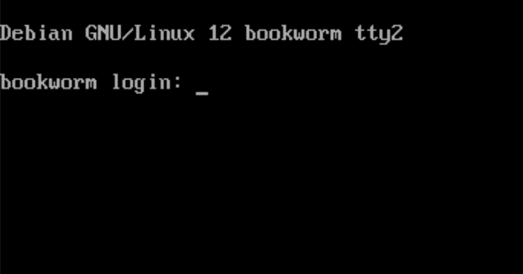

# 命令行基础知识

在本章中，我们将直接深入学习 Linux 命令行。我们将解释它的强大之处，以及如何对每个系统管理员和 DevOps 人员都至关重要。更重要的是，我们将开始教授你最有用的命令及其有效使用方式。在此过程中，我们还将添加其他核心 Linux 概念，因为这些概念对理解本章是必需的。

在本章中，我们将涵盖以下主要内容：

+   什么是命令行及其工作原理

+   为什么熟练掌握命令行如此重要

+   Linux 系统管理的基本命令

不可能在单一章节中介绍所有命令和工具。接下来我们选择了您需要了解的最基本工具。管理 Linux 系统是一个独立的书籍主题。恰好 Packt 出版社确实有几本相关出版物。

# 技术要求

强烈建议准备好并安装 Linux 系统以供使用。我们建议使用虚拟机或可以安全地从头开始重新安装的笔记本电脑。这将使您能够按照书中的示例并执行我们给出的任何练习。

我们不会涵盖安装过程。每个发行版可能都有自己的安装程序，可以是图形化的或文本的（取决于发行版及其选择的变体）。您需要记下或记住您的用户名（方便地称为用户名或登录名）和密码。如果您有物理访问权限但不知道登录名或密码，或两者都不知道，有方法可以进入系统，但这些超出了本书的范围。

我们书中的主要发行版是 Debian。然而，只要不是 Alpine，你在上一章中涵盖的任何主要发行版都应该可以使用。

# Linux 命令行 - shell

Linux 系统管理员的自然环境是命令行。但是，你永远不会听到有人这样称呼它。正确的名称是**shell**，从现在开始我们在书中就这样称呼它。

**Shell** 是一个接受用户输入（主要是键盘输入，但也有其他方式，甚至可以使用鼠标指针）的程序，解释这些输入，如果是有效的命令则执行它，并向用户提供结果或错误信息，如果命令不能正确执行。

有几种访问 shell 的方法：

+   登录到终端（*图 2.1** 中的截图）

注意

你还会看到术语 **console**。终端和控制台是有区别的。**控制台** 是一个物理设备，让用户与计算机交互。它是物理输入（现在通常是键盘）和输出（现在通常是显示器，但最初输出是打印出来的）。**终端** 是一个控制台模拟器，一个程序，让用户执行相同的任务。

+   在图形界面中打开一个终端窗口（如果你有的话）

+   通过安全连接远程登录到另一台设备（手机、平板或你的电脑）

Shell 是一个非常强大的环境。一开始通过输入命令做所有事情可能看起来有些繁琐，但很快你会发现，任务越复杂，通过 shell 完成起来比图形界面更容易。每个有经验的 Linux 系统管理员都知道如何在 shell 中完成任务，以及如何通过它来管理系统，我敢打赌他们更倾向于使用 shell 而非任何 GUI。

## 了解你的 shell

Shell 是一个程序，因此并不是只有一个 shell。相反，有许多流行程度不同的 shell，它们各自呈现出不同的处理方式。

到目前为止，大多数 Linux 发行版中最流行且默认的 shell 是 **Bash**（**Bourne Again Shell**）。还有其他一些你可能需要了解的 shell：

+   **sh**：原始的 Steve Bourne shell。它是*最初的* shell，也是我们所知道的第一个编写出来的 shell。虽然它缺少许多用户从其他更现代的 shell 中获得的交互功能，*sh* 以其快速的脚本执行速度和小巧的体积而闻名。

+   **ksh**：作为 Bourne shell 的演变版本开发而来，它是其前身的超集。因此，所有为 *sh* 编写的脚本都能在 *ksh* 中运行。

+   **csh**：C shell。这个名字来自于它的语法，它与 C 编程语言的语法非常相似。

+   **zsh**：Z shell。对于 macOS 用户来说，它应该非常熟悉，因为它是该操作系统的默认 shell。它是一个完全现代化的 shell，提供了许多你所期待的功能：命令历史、算术运算、命令补全等。

我们不会用太多的 shell 变种和历史来困扰你。如果你对 Bash 的起源感兴趣，可以参考这篇维基百科文章：[`en.wikipedia.org/wiki/Bash_(Unix_shell)`](https://en.wikipedia.org/wiki/Bash_(Unix_shell))。

在本书中，我们使用的是 Bash。如前所述，它是大多数 Linux 发行版的默认 shell，提供 *sh* 兼容模式，拥有现代 shell 所有的特性，而且关于它的书籍、文章、教程等资料极其丰富。

我们将要执行的第一个任务是登录到 Shell 中。根据你选择的安装方式，你可能需要启动本地虚拟机、物理机器或基于云的**虚拟专用服务器**（**VPS**）。如果你选择了没有图形界面的服务器安装，你应该看到类似以下的屏幕截图：



图 2.1 – 登录界面

你会看到一个登录界面，你可以在此输入用户名和密码。成功登录后，你会看到一个命令提示符，表示你已经成功启动了 Shell。

提示符的外观是可配置的，并且可能根据你选择的发行版而有所不同。不过，有一件事会保持不变，我们建议你不要更改它。在 Linux 世界中，有两种类型的用户：*普通用户*和*超级用户*。普通用户的登录名可以是任何符合 Linux 用户命名规范的名称，而超级用户的登录名是`root`，下面是其密码。

超级用户账户之所以这么命名，是有原因的。在大多数 Linux 发行版中，它是无所不能的用户。登录为`root`后，你可以做任何事情，甚至删除所有文件，包括操作系统本身。

为了帮助你区分普通用户和`root`用户，提示符会给你提供一个线索。当以`root`用户登录时，提示符会以`#`符号结尾。当以普通用户登录时，提示符则会以`$`符号结尾。

顺便提一下，`#`（井号）符号也是所谓的注释符号。如果你从互联网复制命令或输入命令时，若它以`#`或`$`开头，这就是提示你该命令应该由哪种类型的用户来执行。你应该省略这个符号，尤其是`#`符号会阻止命令的执行。

除了结束提示符的符号，许多发行版会在其前面加上用户名，确保你知道自己是哪位用户。如果在一个名为`myhome`的 Linux 系统上有一个管理员用户，Debian 11 的默认提示符看起来像这样：

```
$admin@myhome:~$
```

对于`root`用户，它看起来像这样：

```
root@myhome:~#
```

需要说明的是，检查身份的方式有很多种，但我们将留待在*第四章*中讨论。

## 我呼唤你

到目前为止，一切都很好。你已经登录，知道自己是谁，可以输入命令并进行阅读。但实际操作程序是如何进行的呢？

在 Linux 术语中，运行一个程序就是执行它或调用它。实际上，**调用**这个词通常用于指代系统命令或 Shell 内建命令，而**执行**则用于谈论那些不属于发行版的一部分的程序——即所谓的第三方程序或二进制文件。

在我告诉你如何执行程序或调用命令之前，我得先解释一下文件系统结构和一个非常重要的系统变量，叫做 `PATH`。

## 文件系统结构

由于这可能是你第一次接触，我们将稍微退后一步，解释一下文件系统的结构（换句话说，就是典型 Linux 系统中文件夹是如何组织的）。

Linux 遵循 Unix 的哲学思想，即一切皆文件。（虽然有例外，但不多。）其结果是操作系统几乎每个方面都以文件或目录的形式体现。内存状态、进程（正在运行的程序）的状态、日志、二进制文件和设备驱动程序都在这个结构中。也就是说，几乎你 Linux 系统的每个方面都可以通过普通的文本编辑工具进行编辑或检查。

在目录树中，它的结构总是从一个 `/` 文件夹开始，这个文件夹被称为 **根目录**。每个驱动器、网络共享和系统目录都在一个从根目录开始的层次结构中。

将网络共享或本地驱动器提供给系统或用户的过程被称为 `/home/` 目录。你在浏览文件系统结构时是无法看出它的。唯一能看出来的方法是通过以下命令检查已挂载的驱动器和分区：

```
$ mount
```

或者

```
$ df
```

我们将在*第三章*中详细讲解它们，所以现在你只需要知道它们的存在即可。

最上层目录的名称是 `/`。我们已经讲过了。嵌套在另一个文件夹中的文件夹之间的分隔符也是 `/`。所以 `/usr/bin` 表示在 `usr` 目录中存在一个 `bin` 目录，而 `usr` 目录位于 `/` 目录中。很简单。

有一个非常方便的命令，可以让我们查看目录结构，叫做 `tree`。这个命令可能在你的系统中没有安装。如果没有，别担心；它并不是那么重要，你可以通过我们的讲解来了解。在*第三章*中，当我们介绍如何安装软件包时，你可以回过头来再试试这个命令。默认情况下，`tree` 命令会把整个目录结构显示出来，可能会让屏幕信息满得让人难以阅读和跟随。不过，有一个选项可以让我们限制查看的深度：

```
admin@myhome:~$ tree -L 1 /
/
|-- bin -> usr/bin
|-- boot
|-- dev
|-- etc
|-- home
|-- lib -> usr/lib
|-- lib32 -> usr/lib32
|-- lib64 -> usr/lib64
|-- libx32 -> usr/libx32
|-- lost+found
|-- media
|-- mnt
|-- opt
|-- proc
|-- root
|-- run
|-- sbin -> usr/sbin
|-- srv
|-- sys
|-- tmp
|-- usr
`-- var
22 directories, 0 files
```

这里有几个重要的概念需要讲解；不过我们暂时不会讲解所有目录。每当某个文件夹变得重要时，从*第三章*开始，我们会简要地提及它。

首先，调用 `tree` 命令。你看到了我的提示符，它告诉我当前以 admin 用户身份在名为 `myhome` 的系统上运行，并且我不是 `root` 用户（*提示符末尾的美元符号*）。如果你想运行 `tree` 命令，你可以跳过提示符。接下来是实际的命令调用：`tree` 加上 `-L` 选项和数字 `1`；这会指示程序只打印一个深度级别。换句话说，它不会进一步进入目录。最后，`/` 符号告诉程序从文件系统的最开始——`root` 文件夹开始打印。

接下来，你会注意到某些行中有一个神秘的箭头，指向一个名字。这个箭头表示一个快捷方式。有两种类型的快捷方式，硬链接和符号链接。目录只能拥有符号链接。在前面的输出中，`/bin` 目录是指向 `/usr/bin` 目录的链接。从实际使用的角度来看，它们可以当作一个目录来对待。存在这个链接有技术上的原因和历史背景。过去，位于 `/bin` 和 `/sbin` 目录中的工具用于挂载 `/usr` 分区，然后允许访问 `/usr/bin` 和 `/usr/sbin`。如今，这一任务由启动过程中的其他工具更早处理，因此不再需要此链接。该结构的保留是为了与可能需要同时存在 `/bin` 和 `/sbin` 目录的工具的向后兼容性。更多详情请参考 [`refspecs.linuxfoundation.org/FHS_3.0/fhs/index.xhtml`](https://refspecs.linuxfoundation.org/FHS_3.0/fhs/index.xhtml) 或 [`www.linuxfoundation.org/blog/blog/classic-sysadmin-the-linux-filesystem-explained`](https://www.linuxfoundation.org/blog/blog/classic-sysadmin-the-linux-filesystem-explained)。

既然我们已经提到了 `/bin` 和 `/sbin` 目录，那么我们来解释一下它们之间的区别。`/usr/bin` 目录包含 `/usr/sbin` 目录，后者包含所谓的 `root` 用户。它还包含系统进程的二进制文件（称为 **守护进程**）——这些程序在后台运行并为正在运行的系统执行重要工作。

`/root` 目录是超级用户的主目录。所有与超级用户相关的配置文件都存放在这里。

有趣的是 `/home` 目录。这里存放着所有用户的主目录。当我为我的家用机器创建 admin 用户时，它被放置在 `/home/admin` 文件夹中。

对我们来说，目前重要的是 `/etc/` 目录。它包含整个系统的所有配置文件：在线软件包仓库的源，默认的 shell 配置，系统名称，启动时会启动的进程，系统用户及其密码，以及基于时间的命令。在一个全新安装的 Debian 11 系统中，`/etc/` 目录包含大约 150 个子目录和文件，每个子目录可能还包含更多的文件夹。

`/tmp`文件夹包含临时文件。它们只在系统启动时存在，一旦关闭或重启系统，它们会被删除。这些文件的性质通常非常不稳定；它们可能会迅速生成并消失，或者频繁被修改。这个目录有时仅存在于计算机的内存中。它是你系统中最快的存储设备，并且在重启或关闭电源时会自动清除。

如前所述，附加驱动器会在该结构下挂载。我们可能会为主目录分配一个单独的硬盘。整个`/home`文件夹可能会存放在该硬盘上，甚至存放在一个网络硬盘阵列中。如前所述，`/tmp`目录通常挂载在内存中。有时，`/var`目录（包含系统中经常变化的内容但不应被清除的文件，如日志）会挂载在单独的硬盘上。这样做的原因之一是，`/var`的内容，尤其是`/var/log`（系统日志所在的目录），可能会增长得非常快，占用所有可用空间，导致无法访问系统，或者变得非常困难。

最后，有两个重要且特殊的目录，遍布你访问的每个地方：

+   `.`：一个点表示`．`文件夹，你将停留在当前位置。不过，它很有用，正如你将在*第三章*中看到的那样。

+   `..`：两个点表示上级目录——`..`文件夹，你将进入比起始位置高一级的目录。请注意，对于`/`目录来说，`.`和`..`表示相同的目录：`/`。你无法再向上移动超出根目录。

## 运行程序。

现在我们对文件夹层次结构有了一些了解，接下来简要讲一下执行程序的过程。

在 Shell 中执行程序有三种基本方法：

+   `PATH`变量（在*第三章*中解释）。

+   `/`。当使用绝对路径时，必须列出所有指向程序的目录，包括前导的`/`。执行示例可能如下所示：

```
/opt/somecompany/importantdir/bin/program
```

+   `./`。这个快捷方式表示`./myprogram`或`./bin/myprogram`。后者意味着：在当前目录中的`bin`目录里启动一个名为`myprogram`的程序。

+   要在系统中的其他目录调用程序时，我们需要使用两个点，表示父文件夹。假设你已经登录到你的主目录`/home/admin`，并想执行位于`/opt/some/program/bin`中的程序；你需要输入`../../opt/some/program/bin/myprogram`。这两个点和斜杠表示向上移动。

如果这看起来很神秘，那是因为它确实有点复杂。幸运的是，随着本书的推进，一切都会逐渐变得清晰。

## 用来教你所有命令的命令。

你应该养成遇到问题或有疑问时上网查找的习惯。大多数问题已经在网上得到了解决或解释。然而，有一个命令能拯救你的生命——或者至少能节省很多时间。你应该养成经常使用它的习惯——即使你确信自己知道正确的语法，你可能还是会发现一种更好的完成任务的方法。这个命令如下：

```
$ man
```

`man` 命令是 *manual*（手册）的简写，它正是它所说的：它是你想了解的任何命令的手册。要了解更多关于 `man` 命令的内容，只需调用以下命令：

```
$ man man
```

你看到的输出应该类似如下：

```
MAN(1)                                                                 
                                   Manual pager utils                                     
                                                               MAN(1)
NAME
       man - an interface to the system reference manuals
SYNOPSIS
       man [man options] [[section] page ...] ...
       man -k [apropos options] regexp ...
       man -K [man options] [section] term ...
       man -f [whatis options] page ...
       man -l [man options] file ...
       man -w|-W [man options] page ...
DESCRIPTION
       man is the system's manual pager.  Each page argument given to man is normally the name of a program, utility or function.  The manual page associated with each of these arguments is then found and displayed.  A section, if
       provided, will direct man to look only in that section of the manual.  The default action is to search in all of the available sections following a pre-defined order (see DEFAULTS), and to show only the  first  page  found,
       even if page exists in several sections.
```

我已简化内容以便简洁。编写良好的 `man` 页面将包含多个部分：

+   `name`：这里列出了命令的名称。如果命令有多个名称，它们都会列出。

+   `synopsis`：这将列出调用命令的可能方式。

+   `description`：这是命令的目的。

+   `examples`：这将展示几个命令调用的示例，以使语法更加清晰并提供一些思路。

+   `options`：这将显示所有可用选项及其含义。

+   `getting help`：这是获取简化版命令摘要的方式。

+   `files`：如果命令有配置文件或使用文件，并且这些文件在文件系统中已知存在，它们将被列在此处（对于 `man`，我列出了 `/etc/manpath.config` 和 `/usr/share/man`）。

+   `bugs`：这是查找 bug 和报告新 bug 的地方。

+   `history`：这将显示程序的当前及所有历史作者。

+   `see also`：这些是与命令有某种关联的程序（对于 `man`：`apropos(1)`，`groff(1)`，`less(1)`，`manpath(1)`，`nroff(1)`，`troff(1)`，`whatis(1)`，`zsoelim(1)`，`manpath(5)`，`man(7)`，`catman(8)` 和 `mandb(8)`）。

许多命令会包含大量额外的部分，这些部分是特定于该程序的。

`man` 页面包含大量知识，有时名称可能会重复。这时，括号中的神秘数字就派上用场了。`man` 页面分为多个部分。引用 `man` 页面中的 `man`：

1.  可执行程序或 shell 命令

1.  系统调用（内核提供的函数）

1.  库调用（程序库中的函数）

1.  特殊文件（通常位于 `/dev`）

1.  文件格式和约定，例如，`/etc/passwd`

1.  游戏

1.  其他（包括宏包和约定），例如，`man(7)`，`groff(7)`

1.  系统管理命令（通常仅限`root`使用）

1.  内核例程 [非标准]

举个例子，`printf`。有几种东西被称为 `printf`，其中之一是 C 语言的库函数。它的 `man` 页面位于第 `3` 节。

要阅读这个库函数，你必须告诉 `man` 去查找第 `3` 节：

```
admin@myhome:~$ man 3 printf
PRINTF(3)                                                              
                                Linux Programmer's Manual                                
                                                             PRINTF(3)
NAME
       printf, fprintf, dprintf, sprintf, snprintf, vprintf, vfprintf, vdprintf, vsprintf, vsnprintf - formatted output conversion
If you don't, what you'll get is a shell function for printing—totally useless in C programming:
admin@myhome:~$ man printf
PRINTF(1)                                                              
                                      User Commands                                        
                                                           PRINTF(1)
NAME
       printf - format and print data
SYNOPSIS
       printf FORMAT [ARGUMENT]...
       printf OPTION
```

大多数命令和 shell 程序都有一个简短的概要，叫做`help`。通常，可以通过运行带有`-h`或--`help`选项的二进制文件来调用它：

```
admin@myhome:/$ man --help
Usage: man [OPTION...] [SECTION] PAGE...
  -C, --config-file=FILE     use this user configuration file
  -d, --debug                emit debugging messages
  -D, --default              reset all options to their default values
      --warnings[=WARNINGS]  enable warnings from groff
```

我已经简化了输出，但你应该明白我的意思。

注意

短选项前面加一个短横线，而长选项前面加两个。--`help`不是一个长横线，而是两个标准的短横线。

`man`和`–help`命令应该成为你的朋友，即使在你搜索在线资料之前。很多问题可以通过查看`help`输出快速得到答案。即使你是一个经验丰富的管理员，也可以忘记命令语法。网络上有一个无尽的 Linux 指南来源，叫做*The Linux Documentation Project*：[`tldp.org`](https://tldp.org)。将它加入书签吧。

## 了解你的环境

系统的行为由几个因素控制。其中之一就是一组被称为**环境变量**的变量。它们设置了系统与用户交互时使用的语言，列出文件时的排序方式，shell 寻找可执行文件的路径等许多其他内容。具体的环境变量集取决于所使用的发行版。

可以使用`env`命令打印出 shell 设置的所有环境变量的完整列表：

```
admin@myhome:/$ env
SHELL=/bin/Bash
PWD=/
LOGNAME=admin
XDG_SESSION_TYPE=tty
MOTD_SHOWN=pam
HOME=/home/admin
LANG=C.UTF-8
PATH=/usr/local/bin:/usr/bin:/bin:/usr/local/games:/usr/games
```

如果你知道要检查的变量，可以使用`echo`命令：

```
admin@myhome:/$ echo $PATH
/usr/local/bin:/usr/bin:/bin:/usr/local/games:/usr/games
```

请注意，当你使用一个变量时，你必须在变量名前加上美元符号，因此是`$PATH`。

## 我当前在 PATH 中的哪个位置？

既然我们提到过`PATH`，那么我们简要地谈一下它。**Path**可以有两种含义：

+   系统中的一个指向某个对象的地方：一个二进制文件，一个文件，或者一个设备

+   一个列出 shell 在执行程序时会查找的地方的环境变量

你已经对第一种路径有了些了解。我们解释了绝对路径和相对路径。有一个命令可以让你在目录间移动，它叫做`cd`（如果不带参数，`cd`会将你带到家目录。如果你带上参数，它会将你移动到指定的文件夹，前提是文件夹存在，你指定的路径正确，并且你有权限访问该文件夹。我们来看看几个例子：

+   检查当前所在的目录：

```
admin@myhome:~# pwd
/home/admin
```

+   切换目录到`/home/admin/documents/current`：

```
admin@myhome:~# cd documents/current
admin@myhome:~/documents/current#
```

+   从当前目录上级跳转：

```
admin@myhome:~/documents/current# cd ..
admin@myhome:~/documents#
```

+   切换到用户的家目录：

```
admin@myhome:~/documents# cd
admin@myhome:~# pwd
/home/admin
```

# 了解你的权限

Linux 中最基本的安全机制是基于为一组实体定义权限组合。权限如下：

+   `read`

+   `write`

+   `execute`（在谈到目录时，表示读取内容）

实体如下：

+   文件或目录的拥有者

+   拥有文件或目录的组

+   所有其他用户和组

这是一个粗略的安全系统。它足以用于小型服务器和桌面使用，但对于更复杂的设置，有时它的限制太大。还有其他附加的系统，例如**访问控制列表**（**ACLs**）、AppArmor、SELinux 等。本书不打算涵盖这些内容。

使用之前提到的系统，我们仍然可以在系统安全性方面取得相当大的进展。

这些权限和所有权是如何工作的？我们使用`ls`命令（列出文件和目录）：

```
admin@myhome:/$ ls -ahl
total 36K
drwxr-xr-x 3 admin admin 4.0K Aug 20 20:21 .
drwxr-xr-x 3 root  root  4.0K Aug 20 14:35 ..
-rw------- 1 admin admin  650 Aug 20 20:21 .Bash_history
-rw-r--r-- 1 admin admin  220 Aug  4  2021 .Bash_logout
-rw-r--r-- 1 admin admin 3.5K Aug 20 14:47 .Bashrc
-rw-r--r-- 1 admin admin    0 Aug 20 14:40 .cloud-locale-test.skip
-rw------- 1 admin admin   28 Aug 20 16:39 .lesshst
-rw-r--r-- 1 admin admin  807 Aug  4  2021 .profile
drwx------ 2 admin admin 4.0K Aug 20 14:35 .ssh
-rw------- 1 admin admin 1.5K Aug 20 14:47 .viminfo
```

输出呈现为九列。

第一列简洁地呈现条目的类型和权限，但让我们跳到第三列和第四列。这些列告诉我们谁是文件的所有者，以及该文件属于哪个用户组。所有文件和目录必须属于一个用户和一个组。在前面的输出中，大多数文件属于用户 admin 和组 admin。例外是`..`目录，它属于`root`用户和`root`组。通常用`user:group`的形式表示这对。

接下来的列描述了文件的大小（对于目录，它描述的是条目的大小，而不是目录内容占用的空间），最后修改的日期、最后修改的时间以及条目的名称。

现在，让我们回到第一列。它告诉我们，文件或目录的所有者、组和系统中所有其他用户被允许对该条目执行什么操作：

+   字母`d`表示我们正在处理的是一个目录。一个破折号（`–`）表示它是一个文件。

+   接下来是一组九个单字符符号，表示谁可以对给定的条目执行什么操作：

前三个字母表示文件或目录的所有者可以对其执行的操作。`r`表示他们可以读取，`w`表示他们可以写入，`x`表示他们可以将其作为程序执行。如果一个文本文件设置了`x`，shell 将尝试将其作为脚本运行。需要注意的是，当我们处理目录时，`x`表示我们可以将当前工作目录切换到该目录。有可能进入一个目录（`x`设置）但无法查看其中的内容（`r`未设置）。

相同的三个字母在第二组中解释了组的权限。

相同的一组符号在第三组中解释了所有其他用户的权限。

在前面的输出中，`.Bash_history`是一个文件（它在第一列有一个破折号）；文件的所有者（用户 admin）可以读取并写入该文件。可能会有这样的情况：可以写入一个文件（例如日志文件），但无法读取它。该文件不能作为脚本执行（破折号）。接下来的六个破折号告诉我们，分配给 admin 组的用户以及系统中任何其他用户或组都不能对该文件执行任何操作。

有一个例外，就是`root`用户。除非通过 ACL 和诸如 SELinux 等工具提升权限，否则无法限制`root`在系统中的全能性。即使是没有权限分配的文件或目录（全是破折号），`root`也能完全访问。

所有权和权限的管理是通过两条命令来完成的：

+   `chown`：此命令允许你更改文件或目录的所有权。该命令的名称是*更改所有者*的缩写。语法非常简单。让我们借此机会练习一下 Linux 帮助文档中的表示法：

```
chown [OPTION]... [OWNER][:[GROUP]] FILE...
```

有一个不成文的约定，几乎所有命令的帮助文档都会遵循：

+   没有括号的文本必须按显示方式输入。

+   任何位于`[ ]`括号中的内容是可选的。在`chown`命令中，用户和组是可选的，但你必须至少提供一个。

+   尖括号`< >`中的文本是强制性的，但它是一个占位符，代表你需要提供的内容。

+   花括号`{ }`表示一组选项，你需要选择其中一个。它们可以通过竖线`|`分隔。

+   元素后面跟三个点表示该元素可以多次提供。在`chown`的例子中，它是文件或目录的名称。

以下是我对文件应用的一组所有权变更：

+   我将所有权从`admin`更改为`testuser`，但不改变组。请注意，进行更改实际上需要使用`root`账户（通过`sudo`命令，详见*第三章*）。

+   我将所有权更改回`admin`，但将组更改为`testuser`：

```
admin@myhome:~$ ls -ahl testfile
-rw-r--r-- 1 admin admin 0 Aug 22 18:32 testfile
admin@myhome:~$ sudo chown testuser testfile
admin@myhome:~$ ls -ahl testfile
-rw-r--r-- 1 testuser admin 0 Aug 22 18:32 testfile
admin@myhome:~$ sudo chown admin:testuser testfile
admin@myhome:~$ ls -ahl testfile
-rw-r--r-- 1 admin testuser 0 Aug 22 18:32 testfile
```

在前面的输出中，我们可以看到，成功调用一个命令时不会产生任何输出（`chown`），除非输出本身就是命令的目的（如`ls`）。这是 Linux 遵循的基本规则之一。在接下来的输出中，我们可以看到当命令因错误而终止时的情况——没有足够的权限来更改组：

```
admin@myhome:~$ chown :testuser testfile
chown: changing group of 'testfile': Operation not permitted
```

运行`chown`命令的另一种方式是指定一个参考文件，如下面的示例所示：

```
admin@myhome:~$ sudo chown —reference=.Bash_history testfile
admin@myhome:~$ ls -ahl testfile
-rw-r—r—1 admin admin 0 Aug 22 18:32 testfile
admin@myhome:~$ ls -ahl .Bash_history
-rw------- 1 admin admin 1.1K Aug 22 18:33 .Bash_history
```

使用`–reference`选项，我们可以指定一个文件作为我们更改的基准。这在我们进入下一章节时会变得更加有趣。

+   `chmod`：与`chown`命令类似，`chmod`（*更改模式*的缩写）是你用来更改分配给用户和组的权限的命令：

```
admin@myhome:~$ chmod --help
Usage: chmod [OPTION]... MODE[,MODE]... FILE...
  or:  chmod [OPTION]... OCTAL-MODE FILE...
  or:  chmod [OPTION]... --reference=RFILE FILE...
```

`chmod`命令将接受选项、强制模式、可选的更多模式以及需要应用更改的文件列表。与`chown`命令一样，我们可以指定一个参考文件，其模式将被复制过来。

在第一种形式中，你将指定一个用户、一个组、其他人或所有这些的权限模式，语法如下：

```
chmod [ugoa…] [-+=] [perms…] FILE...
```

这里适用以下含义：

+   `u`：用户，也就是文件的拥有者

+   `g`：拥有文件的组

+   `o`：其他人——所有其他人

+   `a`：所有，意味着每个人

+   `-`：移除指定的权限

+   `+`：添加指定的权限

+   `=`：将权限设置为完全符合指定的内容

让我们来看一些例子。

这为文件所有者添加了`testfile`文件的读写权限：

```
chmod u+rw testfile
```

这会移除对`testfile`文件的执行权限，适用于所有不是文件所有者且不在文件所有组中的用户：

```
chmod o-x testfile
```

这为用户和组授予了`testfile`文件的读取和执行权限：

```
chmod ug=rx testfile
```

在我们粘贴的语法总结中，中间一行很有趣。八进制模式意味着我们可以通过数字指定模式。这在脚本中尤其有用，因为处理数字更简单。一旦你记住了模式数字，你可能会发现使用八进制`chmod`更加方便。

设置文件模式的数字公式很简单：

+   `0`：无权限 (`---`)

+   `1`：执行模式 (`--x`)

+   `2`：写入模式 (`-w-`)

+   `4`：读取模式 (`r–`)

要设置文件或目录的模式，你将使用你想要应用的权限的总和，前面加上一个`0`，这将告诉`chmod`你正在设置八进制模式。语法如下：

```
chmod [OPTION]... OCTAL-MODE FILE...
```

这种形式和字母形式之间有一个非常重要的区别——你必须为所有三种实体（用户、组和其他）指定模式。你不能省略其中任何一个。这意味着你也不会使用`-`、`+`或`=`符号。使用八进制语法时，权限将始终严格按指定方式设置。

要组合多个模式，你需要将它们的数字相加，并使用这个总和作为最终的指定。你会发现这是一个非常优雅的解决方案。没有两个相同的数字组合（权限组合）。试试吧：

+   执行和读取是 1 和 2，合起来是 3。没有其他组合可以得到 3。

+   读和写是 2 和 4，合起来是 6。再次强调，没有其他组合能得到 6。

现在，让我们尝试一些例子。

文件的所有者将拥有文件的读写权限，而组用户和其他用户将只有读取权限：

```
chmod 0644 testfile
```

文件的所有者拥有所有权限（读、写和执行），而组用户和其他用户只能读取和执行：

```
chmod 0755 testfile
```

模式前面的`0`并非必需。

我们已经讲解了文件系统、目录结构以及与用户和组相关的基本文件权限。在下一部分，我们将介绍基本的 Linux 命令。

# 与系统交互

存储在硬盘上的程序和脚本只是文件。当它们被映射到内存并开始执行时，它们就变成了**进程**。在这一阶段，你可以安全地假设系统中运行的任何东西都是某种进程。

## 处理这个

Linux 中的进程有几个特性是你需要了解的：

+   **进程 ID** (**PID**)：一个系统范围内唯一的数字标识符。

+   **父进程 ID**（**PPID**）：Linux 系统中的每个进程（除进程号为 1 的进程外）都有一个父进程。进程号为 1 的进程是 *init* 进程。它是负责启动所有系统服务的程序。启动另一个程序的程序被称为 **父进程**。由另一个程序启动的程序被称为 **子进程**。当你登录到系统时，你的 shell 也是一个进程，并且它有自己的 PID。当你在该 shell 中启动一个程序时，你的命令行 PID 将成为该程序的父进程 ID。如果一个进程失去了它的父进程（即父进程在未终止其子进程的情况下终止），那么该子进程将被分配一个新的父进程：进程号 1。

+   `S` 状态，进程进入休眠状态。然而，它不会接受任何中断和信号。只有当请求的资源可用时，它才会醒来。

+   **T**：我们可以指示程序停止执行并等待。这被称为 **停止状态**。这样的进程可以通过使用特殊信号重新启动执行。

+   **Z**：僵尸进程。当一个进程结束其执行时，它会通知其父进程。进程终止时也会发生同样的事情。父进程负责将其从进程表中移除。在此之前，进程会保持在僵尸状态，也叫做 **defunc**。

+   **用户**：进程的所有者，或者更准确地说，是使用该用户权限执行进程的用户。如果该用户无法做某事，进程也无法做到。**CPU**：进程所使用的 CPU 时间的百分比，以 0.0 到 1.0 之间的浮动数字表示。**MEM**：内存使用量，同样在 0.0 到 1.0 之间，其中 1.0 表示系统内存的 100%。

每个进程都有比我们刚才提到的更多特征，但这些是绝对必要的。管理进程是一个独立章节的主题，如果不是整本书的内容。

检查进程的工具叫做 `ps`。乍一看，它似乎是一个非常简单的命令，但实际上，`man` 页面展示了大量的选项。需要注意的是，`ps` 本身只会打印出系统的快照。它不会监控并更新其输出。你可以将 `ps` 与 `watch` 或 `run top` 或 `htop` 命令结合使用，以持续获取关于进程和系统负载的信息。

在最简单的形式下，`ps` 将打印出与调用它的用户 ID 相同的所有进程：

```
admin@myhome:~$ ps
    PID TTY          TIME CMD
  24133 pts/1    00:00:00 Bash
  25616 pts/1    00:00:00 ps
```

在我的 Linux 机器上，只有两个进程在为我的用户运行：Bash shell 和 `ps` 程序本身。

`ps` 命令有几个有趣的选项，可以帮助查询系统中的运行进程。现在，为 `ps` 指定选项是有点棘手的，因为它接受两种语法，一种带有连字符，另一种不带，有些选项根据连字符的不同有不同的含义。让我引用一下 `man` 页面：

```
       1   UNIX options, which may be grouped and must be preceded by a dash.
       2   BSD options, which may be grouped and must not be used with a dash.
       3   GNU long options, which are preceded by two dashes.
Note that ps -aux is distinct from ps aux.  The POSIX and UNIX standards require that ps -aux print all processes owned by a user named x, as well as printing all processes that would be selected by the -a option.  If the
       user named x does not exist, this ps may interpret the command as ps aux instead and print a warning.  This behavior is intended to aid in transitioning old scripts and habits.  It is fragile, subject to change, and thus
       should not be relied upon.
```

为了简洁起见，我已经省略了一些输出内容。一旦你开始使用 shell 脚本，这个区别可能变得很重要，因为它们可能会采用三种语法中的任何一种。每当你有疑问时，请使用破折号表示法：

+   `-f`：所谓的 `PID`、`PPID`、`C`、`STIME`、`TTY`、`TIME` 以及启动进程的命令：

```
admin@myhome:~$ ps -f
UID          PID    PPID  C STIME TTY          TIME CMD
admin      24133   24132  0 16:05 pts/1    00:00:00 -Bash
admin      25628   24133  0 17:35 pts/1    00:00:00 ps -f
```

+   `-e`：所有用户的所有进程：

```
admin@myhome:~$ ps -e
    PID TTY          TIME CMD
      1 ?        00:00:04 systemd
      2 ?        00:00:00 kthreadd
[...]
  25633 ?        00:00:00 kworker/u30:0-events_unbound
  25656 pts/1    00:00:00 ps
```

+   `-ef`：以长格式查看所有进程：

```
admin@myhome:~$ ps -ef
UID          PID    PPID  C STIME TTY          TIME CMD
root           1       0  0 Aug20 ?        00:00:04 /sbin/init
root           2       0  0 Aug20 ?        00:00:00 [kthreadd]
```

+   `-ejH`：一个漂亮的进程树。输出中缩进更多的 CMD（最后一列）是较少缩进的 CMD 的子进程：

```
admin@myhome:~$ ps -ejH
    PID    PGID     SID TTY          TIME CMD
      2       0       0 ?        00:00:00 kthreadd
      3       0       0 ?        00:00:00   rcu_gp
      4       0       0 ?        00:00:00   rcu_par_gp
      6       0       0 ?        00:00:00   kworker/0:0H-events_highpri
      9       0       0 ?        00:00:00   mm_percpu_wq
```

还有很多其他选项可用，特别是用于控制哪些字段是感兴趣的。我们将在后续章节中继续讨论这些。

有一个名字可能会让人误解的命令，叫做 `kill` 命令。它用于向正在运行的进程发送所谓的信号。信号是一种通知进程执行某种操作的方式。其中一个信号确实会终止程序，立即将其结束，但这只是其中的一种。

要列出现有信号，请使用 `kill -l` 命令：

```
admin@myhome:~$ admin@myhome:~$ kill -l
 1) SIGHUP 2) SIGINT 3) SIGQUIT 4) SIGILL 5) SIGTRAP
 6) SIGABRT 7) SIGBUS 8) SIGFPE 9) SIGKILL 10) SIGUSR1
11) SIGSEGV 12) SIGUSR2 13) SIGPIPE 14) SIGALRM 15) SIGTERM
16) SIGSTKFLT 17) SIGCHLD 18) SIGCONT 19) SIGSTOP 20) SIGTSTP
21) SIGTTIN 22) SIGTTOU 23) SIGURG 24) SIGXCPU 25) SIGXFSZ
26) SIGVTALRM 27) SIGPROF 28) SIGWINCH 29) SIGIO 30) SIGPWR
31) SIGSYS 34) SIGRTMIN 35) SIGRTMIN+1 36) SIGRTMIN+2 37) SIGRTMIN+3
38) SIGRTMIN+4 39) SIGRTMIN+5 40) SIGRTMIN+6 41) SIGRTMIN+7 42) SIGRTMIN+8
43) SIGRTMIN+9 44) SIGRTMIN+10 45) SIGRTMIN+11 46) SIGRTMIN+12 47) SIGRTMIN+13
48) SIGRTMIN+14 49) SIGRTMIN+15 50) SIGRTMAX-14 51) SIGRTMAX-13 52) SIGRTMAX-12
53) SIGRTMAX-11 54) SIGRTMAX-10 55) SIGRTMAX-9 56) SIGRTMAX-8 57) SIGRTMAX-7
58) SIGRTMAX-6 59) SIGRTMAX-5 60) SIGRTMAX-4 61) SIGRTMAX-3 62) SIGRTMAX-2
63) SIGRTMAX-1 64) SIGRTMAX
```

好吧，这个列表很可爱，但它什么都没告诉我们。我们怎么知道这些信号分别有什么作用呢？下面来做点侦探工作。首先，由于我们在 `kill -l` 的输出中看到了这些内容，我们可以运行 `man kill` 命令，看看是否有什么能解释这些信号：

```
EXAMPLES
       kill -9 -1
              Kill all processes you can kill.
       kill -l 11
              Translate number 11 into a signal name.
       kill -L
              List the available signal choices in a nice table.
       kill 123 543 2341 3453
              Send the default signal, SIGTERM, to all those processes.
SEE ALSO
       kill(2), killall(1), nice(1), pkill(1), renice(1), signal(7), sigqueue(3), skill(1)
```

例子部分显示并描述了一个信号，但在 `SEE ALSO` 部分，我们看到有一个指向 `man` 页面中第七部分的信号的引用。我们来检查一下：

```
admin@myhome:~$ man 7 signal
SIGNAL(7)                                                              
                                 Linux Programmer's Manual                                     
                                                         SIGNAL(7)
NAME
       signal - overview of signals
```

现在，有一个漂亮的页面，其中有一个表格列出了你在 Linux 中可以使用的所有信号。

那么，如何使用这个 `kill` 命令呢？你需要学习所有这些信号吗？答案是否定的。你会使用一些常见的信号。如果你忘记了某个信号，别犹豫，直接查阅 `man` 或在网上搜索：

+   `kill -9 PID`：臭名昭著的 `SIGKILL`。这会强制终止我们指定 PID 的进程，且会突然中断，忽略任何它可能进行的清理工作。如果该进程已打开文件句柄，它不会释放；如果需要写入文件或与其他程序同步，它也不会执行。这个命令应该谨慎使用，仅在我们确定必须停止程序时才使用。

+   `kill PID`：如果没有指定信号，默认会发送 `SIGTERM`。这会告诉程序停止运行，但要优雅地停止——执行所有必要的退出例程并清理资源。如果你不得不使用 `kill` 命令，这是首选的使用方式。

+   `kill -1`：所谓的 `SIGHUP` 信号。它最初用于检测用户连接丢失——电话线路挂断。现在，它常常用于通知进程重新读取其配置。

这里是一个调用 `kill` 来终止进程的例子。我启动了一个 shell 脚本，做的事情只是等待键盘输入。我将它命名为 `sleep.sh`：

```
admin@myhome:~$ ps aux | grep sleep
admin      24184  0.0  0.2   5648  2768 pts/1    S+   16:09   0:00 /bin/Bash ./sleep.sh
admin@myhome:~$ pgrep sleep.sh
24184
admin@myhome:~$ kill -9 24184
admin@myhome:~$ pgrep sleep.sh
admin@myhome:~$ ps aux | grep sleep
admin      24189  0.0  0.0   4732   732 pts/0    S+   16:09   0:00 grep sleep
```

首先，我使用`ps aux`命令并在输出中查找`sleep.sh`进程，目的是向你展示它确实存在。接着，我使用`pgrep`命令快速找到正在运行的脚本的 PID，并将该 PID 传递给`kill -9`命令。实际上，`sleep.sh`进程已经被终止。你可以在另一个终端中确认这一点，那时我正运行着`sleep.sh`：

```
admin@myhome:~$ ./sleep.sh
Killed
```

如果我只是简单地使用`kill`命令，输出会有所不同：

```
admin@myhome:~$ ./sleep.sh
Terminated
```

还有一种方式可以将所有信号传递给正在运行的程序，但前提是当前程序正在我们登录的 shell 中运行，并且处于前台状态；这意味着它控制了屏幕和键盘：

+   按下*Ctrl* + *C*键会向程序发送`SIGINT`信号。`SIGINT`告诉程序用户已经按下了该组合键，程序应该停止。程序如何终止还取决于它自身的实现。

+   按下*Ctrl* + *D*键会发送`SIGQUIT`信号——它类似于`SIGINT`，但还会生成所谓的核心转储（core dump），也就是一个可以在调试过程中使用的文件。

在文本中表示这些组合键的常见方式是`^c`和`^d`（`^`代表*Ctrl*键），`ctrl+c`和`ctrl+d`（`ctrl`是*Ctrl*键的快捷方式），以及`C-c`和`C-d`（`C`代表*Ctrl*键）。

## 在找东西吗？

有时你需要在文件系统中查找一个目录或文件。Linux 提供了一些命令，可以让你执行这一操作。在这些命令中，`find`是最强大的。要详细介绍它的所有功能需要更多的篇幅，而我们目前没有足够的空间。你可以查找与指定名称完全匹配的文件或目录，查找名称中包含你指定的部分字符的文件或目录，查找在特定时间修改过的文件，查找属于某个用户或组的文件，以及更多其他情况。此外，对于每一个找到的文件，还可以执行一些操作，比如重命名、压缩或搜索某个单词。

在下面的例子中，我们正在查找一个文件`signals.h`，它位于`/``usr`目录下：

```
admin@myhome:/$ find / -name os-release
find: '/lost+found': Permission denied
find: '/etc/sudoers.d': Permission denied
/etc/os-release
find: '/etc/ssl/private': Permission denied
/usr/lib/os-release
[...]
```

首先，我们调用`find`命令，然后告诉它从文件系统的根目录(`/`)开始查找，接着告诉它查找一个名为`os-release`的文件（`-``name os-release`）。

你会注意到，在输出中（为了简洁起见我省略了一部分），有一些错误信息，表示`find`没有权限访问某些文件。

如果你不确定名称的大小写，即它是否包含小写字母或大写字母（记住，Linux 是区分大小写的，*OS-Release*和*os-release*不是同一个文件），你可以使用`-iname`选项。

如果你确定你要找的是一个文件，那么可以使用`-type` `f`选项：

```
admin@myhome:/$ find / -type f -name os-release
```

对于目录选项，使用`-``type d`。

如果要查找与某个模式匹配的文件，比如以`.sh`结尾的文件，可以使用以下模式：

```
admin@myhome:/$ find / -type f -name "*.sh"
```

星号表示任意数量的任意字符。我们将它放在引号中，以避免在 `find` 有机会执行之前，shell 先解释星号。我们将在下一章 *中级 Linux* 中解释所有特殊符号（称为 **globs**）和正则表达式。

要删除所有找到的文件，你可以使用 `-delete` 选项：

```
admin@myhome:~$ find . -type f -name test -delete
```

要对找到的文件执行操作，你可以使用 `-exec` 选项：

```
admin@myhome:/$ find / -type f -name  os-release -exec grep -i debian {} \;
PRETTY_NAME="Debian GNU/Linux 11 (bullseye)"
NAME="Debian GNU/Linux"
ID=debian
HOME_URL="https://www.debian.org/"
SUPPORT_URL="https://www.debian.org/support"
BUG_REPORT_URL="https://bugs.debian.org/"
```

在前面的示例中，我们使用了名为 `grep` 的命令来查找包含 `debian` 这个单词的所有行，无论是大写还是小写。

这引出了 `grep` 命令。

`grep` 命令用于在文件中查找某个模式的出现。找到匹配的行后，它会打印该行。`grep` 命令与 `find` 命令类似，不同之处在于它的目的是在文件内部进行搜索，而 `find` 只关心文件和目录本身的特性。

假设有一个名为 `red_fox.txt` 的文本文件，内容如下：

```
admin@myhome:~$ cat red_fox.txt
The red fox
jumps over
the lazy
brown dog.
```

顺便说一下，`cat` 是一个将指定文件内容打印到终端的命令。

假设我们想查找所有包含单词 `the` 的行：

```
admin@myhome:~$ grep -i The red_fox.txt
The red fox
the lazy
```

你可能已经猜到，`-i` 选项表示我们不在乎大小写。

等等，我们可以搜索替代项。假设我们关心的行包含 `fox` 或 `dog`。你可以使用 `-e` 选项为每个要搜索的单词添加一次，或者使用 `-E` 选项将所有单词放在单引号内，并用 `|` 字符分隔：

```
admin@myhome:~$ grep -e fox -e dog red_fox.txt
The red fox
brown dog.
admin@myhome:~$ grep -E 'fox|dog' red_fox.txt
The red fox
brown dog.
```

通过添加 `-n` 选项，你将获得匹配项所在行的行号：

```
admin@myhome:~$ grep -n -E 'fox|dog' red_fox.txt
1:The red fox
4:brown dog.
```

你可以查找以指定单词开头的行或在行尾具有特定模式的行。

你甚至可以在一个目录层次结构中的所有文件中执行 `grep` 搜索。语法稍有不同：模式放在前面，目录放在后面。同时，你还会得到匹配所在的文件名：

```
admin@myhome:~$ grep -r "fox" .
./red_fox.txt:The red fox
```

`find` 和 `grep` 的最大威力来自于一个叫做 **正则表达式**（**regex** 或 **regexp** 的简称）的概念，它们有一本专门的书，且对于新用户可能会感到困惑。我们将在 *第三章* 和 *第四章* 中详细解释它们。不过，我们会仅介绍最常用的用法。

如果你正在寻找一个程序并且想知道它的完整路径，有一个命令可以做到，那就是 `whereis`。这里有一个示例：

```
admin@myhome:~$ whereis ping
ping: /usr/bin/ping /usr/share/man/man8/ping.8.gz
```

`whereis` 命令不仅会打印二进制文件的完整路径，如果安装了相应的 `man` 手册页，它还会打印该手册页。

## 让我们进行一些操作

对文件和目录可以执行四种基本操作：

+   创建

+   重命名或移动

+   删除

+   复制

每一个操作都有一个特殊的工具：

+   `mkdir`：这个命令的语法非常简单且有限。基本上，你只是告诉它创建一个指定名称的目录。如果你要创建嵌套目录，也就是一个文件夹包含另一个文件夹，路径中的所有目录必须存在。如果它们不存在，你可以使用特殊的`-p`选项来创建它们：

```
admin@myhome:~$ mkdir test
admin@myhome:~$ ls -l
total 4
drwxr-xr-x 2 admin admin 4096 Aug 24 15:17 test
admin@myhome:~$ mkdir something/new
mkdir: cannot create directory 'something/new': No such file or directory
admin@myhome:~$ mkdir -p something/new
admin@myhome:~$ ls -l
total 8
drwxr-xr-x 3 admin admin 4096 Aug 24 15:18 something
drwxr-xr-x 2 admin admin 4096 Aug 24 15:17 test
```

在前面的示例中，你可以看到我直接在我的主文件夹中创建了一个名为 test 的目录。接下来，我尝试在`something`文件夹中创建一个`new`文件夹。然而，后者并不存在，`mkdir`告诉我这一点并拒绝创建新的目录。我使用了特殊的`-p`选项来创建一个完整的路径以便创建新的目录。

+   `mv`：这是一个用于移动和重命名文件及目录的命令。同样，语法相当简单，尽管这个命令提供了一些额外的功能，比如创建移动文件的备份。

    要重命名一个文件或目录，我们将其从当前名称移动到新名称：

```
admin@myhome:~$ mv test no-test
admin@myhome:~$ ls -l
total 8
drwxr-xr-x 2 admin admin 4096 Aug 24 15:17 no-test
```

查看其`man`页面或`help`信息以了解更多。

+   `rm`：这个命令比较有趣，主要因为它提供了安全功能。通过特殊的`-i`选项，你可以指示它在删除文件或目录之前始终询问你。通常，`rm`会对目录进行退出，如下例所示：

```
admin@myhome:~$ admin@myhome:~$ ls -l no-test/
total 0
-rw-r--r-- 1 admin admin 0 Aug 24 15:26 test
admin@myhome:~$ rm no-test/
rm: cannot remove 'no-test/': Is a directory
admin@myhome:~$ rm -d no-test/
rm: cannot remove 'no-test/': Directory not empty
admin@myhome:~$ rm no-test/test
admin@myhome:~$ rm -d no-test/
```

我在`no-test`目录中创建了一个名为 test 的文件。`rm`拒绝删除该文件夹。我使用了`-d`选项，指示命令删除空目录。然而，该目录仍然包含一个文件。接着，我删除了文件，然后使用`rm -d`成功删除了`no-test`文件夹。我本可以使用`-r`选项，这将使命令删除所有目录，即使它们不是空的。

+   `cp`：这个命令用于复制文件和目录。请注意，与`rm`类似，`cp`会拒绝复制目录，除非使用`-r`选项。`cp`可以说是所有命令中最复杂且功能最丰富的命令之一，包括备份文件、创建链接（快捷方式）代替真正的复制等功能。查看它的`man`页面。在以下示例中，我将`something`目录复制到`new`目录。显然，我必须使用`-r`选项。接着，我创建了一个名为`file`的空文件并将其复制到`newfile`。对于这些，我不需要任何选项：

```
admin@myhome:~$ ls -l
total 4
drwxr-xr-x 3 admin admin 4096 Aug 24 15:18 something
admin@myhome:~$ cp something/ new
cp: -r not specified; omitting directory 'something/'
admin@myhome:~$ cp -r something new
admin@myhome:~$ ls -l
total 8
drwxr-xr-x 3 admin admin 4096 Aug 24 15:33 new
drwxr-xr-x 3 admin admin 4096 Aug 24 15:18 something
admin@myhome:~$ touch file
admin@myhome:~$ cp file newfile
admin@myhome:~$ ls -l
total 8
-rw-r--r-- 1 admin admin    0 Aug 24 15:33 file
drwxr-xr-x 3 admin admin 4096 Aug 24 15:33 new
-rw-r--r-- 1 admin admin    0 Aug 24 15:34 newfile
drwxr-xr-x 3 admin admin 4096 Aug 24 15:18 something
```

你现在应该理解并能够使用 Linux 或类似系统中的基本命令行命令，比如创建、复制和删除文件；你还可以查找文本文件中的内容，或者按名称查找文件或目录。你对你工作系统中的进程也有所了解。在下一章中，我们将深化这些知识。

# 总结

我们展示的只是 Linux 管理员在工作中可能使用的几百个命令中的一小部分。正如本章开头所提到的，完整的参考超出了本书的范围。然而，我们学到的内容足以进行基本的系统操作，并为下一章的内容打下基础：更高级的 Linux 管理话题。

# 练习

+   了解如何递归地应用`chown`——这意味着我们的`chown`调用应该进入目录并将更改应用于其中的所有项目。

+   了解`watch`命令的功能。将其与`ps`命令一起使用。

+   了解如何删除一个目录。

+   对于你在这里学到的所有命令，阅读它们的`–help`输出。打开`man`页面并浏览其中的内容，特别是示例部分。

# 资源

+   你可以在这里阅读更多关于 SELinux 的内容：[`www.packtpub.com/product/selinux-system-administration-second-edition/9781787126954`](https://www.packtpub.com/product/selinux-system-administration-second-edition/9781787126954)

+   这是一本关于 Linux 系统管理的非常好的出版物：[`www.packtpub.com/product/mastering-linux-administration/9781789954272`](https://www.packtpub.com/product/mastering-linux-administration/9781789954272)
