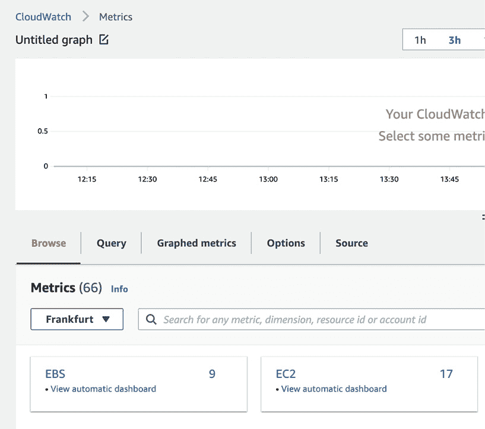
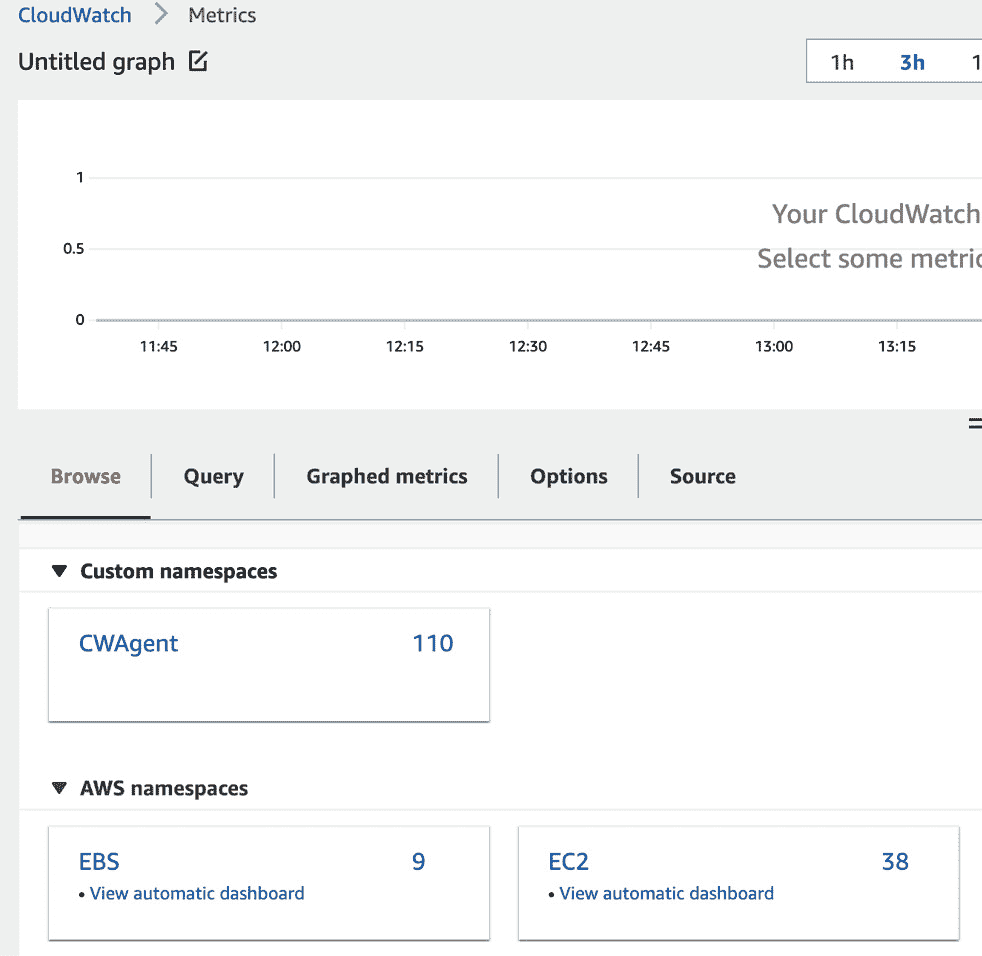
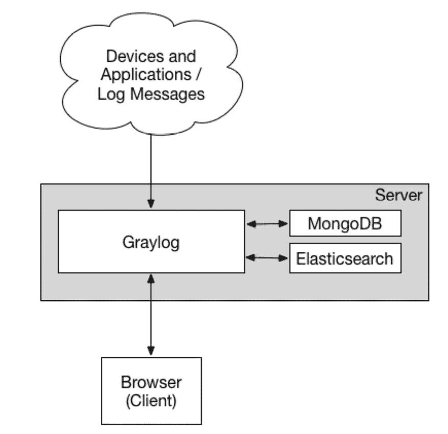

# 第十章：监控、追踪和分布式日志

现代开发的应用程序往往运行在 Docker 容器中或作为无服务器应用栈。传统上，应用程序是作为一个单体实体构建的——一个进程在服务器上运行。所有的日志都存储在磁盘上，便于快速获取相关信息。若要诊断应用程序的问题，您需要登录到服务器，查找日志或堆栈跟踪以找出问题所在。但当您将应用程序运行在多个容器中的 Kubernetes 集群里，并且这些容器在不同的服务器上执行时，事情就变得复杂了。

这也使得存储日志变得非常困难，更不用说查看它们了。实际上，在容器中运行应用程序时，不建议在其中保存任何文件。我们通常在只读文件系统中运行这些容器。这是可以理解的，因为您应该将正在运行的容器视为一个短暂的身份，随时可能被销毁。

运行无服务器应用程序时，我们也面临类似的情况；在 **Amazon Web Services** (**AWS**) Lambda 上，进程在收到请求时开始，处理完请求中的数据后，应用程序会在完成任务后终止。如果您保存了任何数据到磁盘，它将在处理完成后被删除。

最合逻辑的解决方案当然是将所有日志发送到某个外部系统，该系统将保存、编目并使您的日志可以被搜索。有多种解决方案，包括 **软件即服务** (**SaaS**) 和特定于云的应用程序。

顺便提一下，将日志发送到外部系统对于裸金属服务器也是有益的——无论是用于分析、警报，还是诊断服务器无法访问或停止响应的情况。

除了系统和应用程序日志外，我们还可以发送应用程序追踪指标。追踪是比指标更深入的一种形式，它可以提供更多关于系统性能及应用程序在特定情况下表现的洞察。追踪数据的示例包括：某个请求被应用程序处理的时间、耗费的 CPU 周期数，以及应用程序等待数据库响应的时间。

在本章中，您将学习以下内容：

+   监控、追踪和日志是什么？

+   如何选择并配置一种云原生的日志解决方案

+   自托管解决方案及如何选择它们

+   SaaS 解决方案及如何评估哪些对您的组织最有用

此外，我们将涵盖以下主题：

+   监控、追踪和日志之间的区别

+   云解决方案

+   自托管的开源解决方案

+   SaaS 解决方案

+   日志和指标的保留

那么，让我们直接开始吧！

# 监控、追踪和日志之间的区别

根据上下文和交流对象的不同，您会听到这些术语交替使用，但它们之间存在微妙且非常重要的差异。

**监控**是指对你的服务器和应用程序进行仪表化，并收集关于它们的数据以进行处理、识别问题，最终将结果呈现给相关方。这也包括警报功能。

**追踪**，另一方面，更为具体，正如我们已经提到的。追踪数据可以告诉你很多关于系统性能的信息。通过追踪，你可以观察对开发者非常有用的统计数据（例如一个函数的运行时间，以及 SQL 查询是否快速或存在瓶颈），对 DevOps 工程师有用的数据（例如我们等待数据库或网络的时间），甚至对业务部门有用的数据（例如用户在我们的应用程序中的体验）。所以，你可以看到，当它被正确使用时，它可以成为你手中的一个非常强大的工具。

**日志记录**的目的是以集中化的方式提供可操作的信息，通常就是将所有消息保存到文件中（称为日志文件）。这些消息通常包括给定操作的成功或失败，并可配置详细程度。日志记录主要由系统管理员或 DevOps 工程师使用，以便更好地了解操作系统或任何给定应用程序中的情况。

澄清了这些后，我们可以进入云中分布式监控解决方案的具体实现，无论是自定义解决方案，还是作为 SaaS 应用程序使用。

# 云解决方案

每个云服务提供商都完全意识到进行适当监控和分布式日志记录的必要性，因此他们都会开发自己的本地解决方案。有时候，使用本地解决方案是值得的，但并非总是如此。让我们来看一看主要的云服务提供商及其提供的服务。

AWS 最早提供的服务之一就是**CloudWatch**。最初，它只是收集各种度量数据，并允许你创建仪表板以更好地理解系统性能，轻松发现问题，或者简单地识别是否发生了拒绝服务攻击，从而使你能够快速响应。

CloudWatch 的另一个功能是警报，但它仅限于使用另一个 Amazon 服务——**简单邮件服务**（**Simple Email Service**）发送电子邮件。警报和指标也可以触发 AWS 账户中的其他操作，比如扩展或缩减运行实例的数量。

截至本书撰写时，CloudWatch 的功能已经远不止监控。该服务的开发者新增了收集和搜索日志的功能（**CloudWatch Logs Insights**），监控 AWS 资源本身的变化，以及触发操作的能力。我们还能够利用**CloudWatch** **异常检测**在应用程序中检测异常。

至于追踪，AWS 准备了一个名为**AWS X-Ray**的服务，这是一个先进的分布式追踪系统，几乎可以实时提供有关应用程序在生产环境中如何运行的信息。不幸的是，它的能力仅限于几个语言：Node.js、Java 和.NET。如果你的应用程序是用 Python 编写的，那么就没那么幸运了。

看看其他流行的云解决方案，谷歌提供了**Google Cloud Platform**（**GCP**），这是一个智能的日志收集、查询和错误报告解决方案，称为… **Cloud Logging**。如果在 GCP 中使用此服务，与 CloudWatch Logs 类似，你将能够发送应用程序日志，存储它们，搜索所需数据（IP 地址、查询字符串、调试数据等），并使用类似 SQL 的查询分析日志。

然而，相似之处到此为止，因为谷歌在一些额外功能上走得更远，比如能够创建带有可视化错误报告的日志仪表板，或者创建基于日志的指标。

在 GCP 中，监控是由另一个完全不同的服务来完成的——Google Cloud Monitoring。它专注于收集应用程序数据，创建**服务级目标**（**SLOs**），从 Kubernetes（**Google Kubernetes Engine**，或**GKE**）收集大量指标，并进行第三方集成，例如与知名服务**Prometheus**的集成。

看看微软的云平台——Azure，你会找到**Azure Monitor Service**，它由多个部分组成，涵盖了完整应用监控和追踪的需求。显然，**Azure Monitor Logs**用于收集日志。还有**Azure Monitor Metrics**，用于监控和可视化你推送到平台的所有指标。你还可以像在 GCP 或 AWS 中一样分析、查询并设置警报。追踪是由**Azure Application Insights**完成的。微软将其推广为**应用性能管理**（**APM**）解决方案，并且它是**Azure Monitor**的一部分。它提供了应用程序的可视化地图、实时指标、代码分析、使用数据和许多其他功能。显然，不同云服务商及其解决方案的实现方式有所不同。你需要参考文档来了解如何对这些服务进行工具化和配置。

我们将重点介绍 AWS 服务。我们将为我们的应用程序创建一个日志组，并从 EC2 实例收集指标。我们还将讨论如何在 Python 中使用 AWS X-Ray 进行追踪，无论底层服务如何，这都可以用于在 AWS 基础设施中运行的应用程序。

## CloudWatch 日志和指标

CloudWatch Logs 是 AWS 提供的日志管理服务，使您能够集中、搜索并监控来自多个来源的日志数据。它允许您排查操作问题和安全事件，以及监控资源利用率和性能。

CloudWatch 指标是 AWS 提供的一项监控服务，允许您收集、跟踪并监控 AWS 资源和应用程序的各种指标。

CloudWatch 指标通过收集并显示关键指标（如 CPU 利用率、网络流量、磁盘 I/O 以及与 AWS 资源相关的其他指标，如 EC2 实例、RDS 实例、S3 存储桶和 Lambda 函数）为用户提供详细的 AWS 资源性能视图。

用户可以使用 CloudWatch 指标设置警报，当某些阈值被超越时会通知他们，并且创建自定义仪表板，近实时显示重要指标。CloudWatch 指标还允许用户检索和分析历史数据，这些数据可用于识别趋势并优化资源使用。

为了能够将日志和指标发送到 CloudWatch，我们需要以下内容：

+   一项 IAM 策略，授予将日志发送到 CloudWatch Logs 的权限。此外，我们还将允许将指标数据与日志一起推送。

+   创建一个 IAM 角色，并将之前创建的策略附加到其中。此角色然后可以被 EC2 实例、Lambda 函数或任何其他需要将日志发送到 CloudWatch Logs 的 AWS 服务假设。

+   将角色附加到我们希望将日志发送到 CloudWatch Logs 的资源。为了我们的目的，我们将角色附加到 EC2 实例。

一个 IAM 策略的示例如下：

```
{
    “Version”: “2012-10-17”,
    “Statement”: [
        {
            “Sid”: “CloudWatchLogsPermissions”,
            “Effect”: “Allow”,
            “Action”: [
                “logs:CreateLogStream”,
                “logs:CreateLogGroup”,
                “logs:PutLogEvents”
            ],
            “Resource”: “arn:aws:logs:*:*:*”
        },
        {
            “Sid”: “CloudWatchMetricsPermissions”,
            “Effect”: “Allow”,
            “Action”: [
                “cloudwatch:PutMetricData”
            ],
            “Resource”: “*”
        }
    ]
}
```

在此策略中，`logs:CreateLogStream` 和 `logs:PutLogEvents` 操作对于所有 CloudWatch Logs 资源（`arn:aws:logs:*:*:*`）都是允许的，`cloudwatch:PutMetricData` 操作对于所有 CloudWatch 指标资源（`*`）也是允许的。

我们还需要一项信任策略，允许 EC2 假设我们为其创建的角色，以便能够发送指标和日志。信任策略如下所示：

```
{
  “Version”: “2012-10-17”,
  “Statement”: [
    {
      “Effect”: “Allow”,
      “Principal”: { “Service”: “ec2.amazonaws.com”},
      “Action”: “sts:AssumeRole”
    }
  ]
}
```

将其保存为 `trust-policy.json` 文件，我们稍后将使用它。

使用 AWS CLI 工具，创建实例配置文件并将之前的策略附加到其中，您需要运行以下命令：

```
admin@myhome:~$ aws iam create-instance-profile --instance-profile-name DefaultInstanceProfile
{
    “InstanceProfile”: {
        “Path”: “/”,
        “InstanceProfileName”: “DefaultInstanceProfile”,
        “InstanceProfileId”: “AIPAZZUIKRXR3HEDBS72R”,
        “Arn”: “arn:aws:iam::673522028003:instance-profile/DefaultInstanceProfile”,
        “CreateDate”: “2023-03-07T10:59:01+00:00”,
        “Roles”: []
    }
}
```

我们还需要一个附加了信任策略的角色：

```
admin@myhome:~$ aws iam create-role --role-name DefaultInstanceProfile --assume-role-policy-document file://trust-policy.json
{
    “Role”: {
        “Path”: “/”,
        “RoleName”: “DefaultInstanceProfile”,
        “RoleId”: “AROAZZUIKRXRYB6HO35BL”,
        “Arn”: “arn:aws:iam::673522028003:role/DefaultInstanceProfile”,
        “CreateDate”: “2023-03-07T11:13:54+00:00”,
        “AssumeRolePolicyDocument”: {
            “Version”: “2012-10-17”,
            “Statement”: [
                {
                    “Effect”: “Allow”,
                    “Principal”: {
                        “Service”: “ec2.amazonaws.com”
                    },
                    “Action”: “sts:AssumeRole”
                }
            ]
        }
    }
}
```

现在，我们可以将刚刚创建的角色附加到实例配置文件上，以便在 EC2 实例中使用它：

```
admin@myhome:~$ aws iam add-role-to-instance-profile --role-name DefaultInstanceProfile --instance-profile-name DefaultInstanceProfile
```

现在，让我们附加一个用于 EC2 服务的策略：

```
admin@myhome:~$ aws iam put-role-policy --policy-name DefaultInstanceProfilePolicy --role-name DefaultInstanceProfile --policy-document file://policy.json
```

`policy.json` 文件是您保存策略的文件。

实例配置文件，顾名思义，仅适用于 EC2 实例。要在 Lambda 函数中使用相同的策略，我们需要创建一个 IAM 角色并将新创建的角色附加到函数上。

让我们也使用 AWS CLI 创建一个新实例，并附加我们刚刚创建的实例配置文件。这个特定的实例将被放置在默认 VPC 和公共子网中。这将导致实例获得一个公网 IP 地址，并且可以从公共互联网访问。

要在默认 VPC 的公共子网上创建一个 EC2 实例，并使用`DefaultInstanceProfile`，你可以按照以下步骤操作：

1.  获取默认 VPC 的 ID：

```
    admin@myhome:~$ aws ec2 describe-vpcs --filters     “Name=isDefault,Values=true” --query “Vpcs[0].VpcId” --output text
    vpc-0030a3a495df38a0e
```

该命令将返回默认 VPC 的 ID。我们将在后续步骤中使用它。

1.  获取默认 VPC 中一个公共子网的 ID，并保存以备后用：

```
    admin@myhome:~$ aws ec2 describe-subnets --filters     “Name=vpc-id,Values=vpc-0030a3a495df38a0e”     “Name=map-public-ip-on-launch,Values=true” --query     “Subnets[0].SubnetId” --output text     subnet-0704b611fe8a6a169
```

要启动 EC2 实例，我们需要一个叫做**Amazon 机器镜像**（**AMI**）的实例模板和一个我们将用于访问该实例的 SSH 密钥。为了获得 Ubuntu 镜像的 ID，我们也可以使用 AWS CLI 工具。

1.  我们将通过以下命令筛选出最新的 Ubuntu 20.04 的 AMI ID：

```
    admin@myhome:~$ aws ec2 describe-images --owners     099720109477 --filters “Name=name,Values=*ubuntu/images/    hvm-ssd/ubuntu-focal-20.04*” “Name=state,Values=available”    “Name=architecture,Values=x86_64” --query “reverse(sort_by(Images,    &CreationDate))[:1].ImageId” --output text
    ami-0a3823a4502bba678
```

该命令将列出 Canonical（`099720109477`）拥有的所有可用的 Ubuntu 20.04 镜像，并通过名称（`ubuntu-focal-20.04-*`）、架构（我们需要`x86_64`，而非 ARM）以及是否可用（状态为可用）进行过滤。它还将按照创建日期降序排序，并返回最新的（列表中的第一个）镜像 ID。

1.  现在，要创建一个 SSH 密钥，你需要为自己生成一个密钥，或者使用你已经在机器上拥有的密钥。我们需要将密钥的公钥部分上传到 AWS。你可以简单地运行另一个 CLI 命令来实现这一点：

```
admin@myhome:~$ aws ec2 import-key-pair --key-name admin-key --public-key-material fileb://home/admin/.ssh/admin-key.pub
{
    “KeyFingerprint”: “12:97:23:0f:d6:2f:2b:28:4d:a0:ad:62:a7:20:e3:f8”,
    “KeyName”: “admin-key”,
    “KeyPairId”: “key-0831b2bc5c2a08d82”
}
```

完成所有这些步骤后，最后，我们准备好在公共子网中使用`DefaultInstanceProfile`启动一个新的实例：

```
admin@myhome:~$ aws ec2 run-instances --image-id ami-0abbe417ed83c0b29 --count 1 --instance-type t2.micro --key-name admin-key --subnet-id subnet-0704b611fe8a6a169 --associate-public-ip-address --iam-instance-profile Name=DefaultInstanceProfile
{
    “Groups”: [],
    “Instances”: [
        {
            “AmiLaunchIndex”: 0,
            “ImageId”: “ami-0abbe417ed83c0b29”,
            “InstanceId”: “i-06f35cbb39f6e5cdb”,
            “InstanceType”: “t2.micro”,
            “KeyName”: “admin-key”,
            “LaunchTime”: “2023-03-08T14:12:00+00:00”,
            “Monitoring”: {
                “State”: “disabled”
            },
            “Placement”: {
                “AvailabilityZone”: “eu-central-1a”,
                “GroupName”: “”,
                “Tenancy”: “default”
            },
            “PrivateDnsName”: “ip-172-31-17-127.eu-central-1.compute.internal”,
            “PrivateIpAddress”: “172.31.17.127”,
            “ProductCodes”: [],
            “PublicDnsName”: “”,
            “State”: {
                “Code”: 0,
                “Name”: “pending”
            },
            “StateTransitionReason”: “”,
            “SubnetId”: “subnet-0704b611fe8a6a169”,
            “VpcId”: “vpc-0030a3a495df38a0e”,
            “Architecture”: “x86_64”,
            “BlockDeviceMappings”: [],
            “ClientToken”: “5e4a0dd0-665b-4878-b852-0a6ff21c09d3”,
            “EbsOptimized”: false,
            “EnaSupport”: true,
            “Hypervisor”: “xen”,
            “IamInstanceProfile”: {
                “Arn”: “arn:aws:iam::673522028003:instance-profile/DefaultInstanceProfile”,
                “Id”: “AIPAZZUIKRXR3HEDBS72R”
            },
# output cut for readability
```

上述命令的输出是有关新启动实例的信息，你可以将其用于脚本化操作，或者仅仅保存实例的 IP 地址以备后用。

目前，你还无法连接到机器，因为默认情况下，所有端口都被关闭。为了打开 SSH 端口（`22`），我们需要创建一个新的安全组。

1.  使用以下命令来实现：

```
admin@myhome:~$ aws ec2 create-security-group --group-name ssh-access-sg --description “Security group for SSH access” --vpc-id vpc-0030a3a495df38a0e
{
    “GroupId”: “sg-076f8fad4e60192d8”
}
```

我们使用的 VPC ID 是我们在之前步骤中保存的，而输出是我们新安全组的 ID。我们需要为其添加一个入站规则，并将其连接到我们的 EC2 实例。在机器创建后，查看长输出中的`InstanceID`值（例如：`i-06f35cbb39f6e5cdb`）。

1.  使用以下命令为安全组添加一个入站规则，允许来自`0.0.0.0/0`的 SSH 访问：

```
admin@myhome:~$ aws ec2 authorize-security-group-ingress --group-id sg-076f8fad4e60192d8 --protocol tcp --port 22 --cidr 0.0.0.0/0
{
    “Return”: true,
    “SecurityGroupRules”: [
        {
            “SecurityGroupRuleId”: “sgr-0f3b4be7d2b01a7f6”,
            “GroupId”: “sg-076f8fad4e60192d8”,
            “GroupOwnerId”: “673522028003”,
            “IsEgress”: false,
            “IpProtocol”: “tcp”,
            “FromPort”: 22,
            “ToPort”: 22,
            “CidrIpv4”: “0.0.0.0/0”
        }
    ]
}
```

我们使用了在之前步骤中创建的安全组的 ID。

这个命令向安全组添加了一个新的入站规则，允许来自任何 IP 地址（`0.0.0.0/0`）的 TCP 流量通过端口`22`（SSH）。你也可以选择使用自己的公网 IP 地址，而不是允许新 EC2 实例完全访问互联网。

1.  现在，我们可以将这个安全组附加到一个实例上：

```
admin@myhome:~$ aws ec2 modify-instance-attribute --instance-id i-06f35cbb39f6e5cdb --groups  sg-076f8fad4e60192d8
```

目前，端口`22`应该已经打开，并准备接收连接。

让我们暂时停下来。你可能会想，是否有更好的方法来完成此操作，而不是使用 AWS CLI。是的，确实有；有许多工具可以自动化创建基础设施。这些工具通常被称为**基础设施即代码**（**IaC**），我们将在*第十二章*中讨论它们。在这个示例中，我们本可以使用多种选择，从 AWS 的首选 IaC 工具 CloudFormation，到 HashiCorp 的 Terraform，再到逐渐受到关注的 Pulumi 项目。

现在我们有了一个 EC2 实例，我们可以连接到它并安装**CloudWatch 代理**。之所以需要它，是因为 AWS 默认只监控两个指标：CPU 和内存使用率。如果您想要监控磁盘空间并将附加数据（如日志或自定义指标）发送到 CloudWatch，则必须使用该代理。

1.  进入 SSH 控制台后，我们需要下载 CloudWatch 代理的`deb`包并使用`dpkg`工具安装：

```
admin@myhome:~$ ssh -i ~/.ssh/admin-key ubuntu@3.121.74.46
ubuntu@ip-172-31-17-127:~$ wget https://s3.amazonaws.com/amazoncloudwatch-agent/ubuntu/amd64/latest/amazon-cloudwatch-agent.deb
ubuntu@ip-172-31-17-127:~$ sudo dpkg -i -E ./amazon-cloudwatch-agent.deb
```

让我们切换到`root`用户，以便可以在每个命令中省略`sudo`：

```
ubuntu@ip-172-31-17-127:~$ sudo -i
root@ip-172-31-17-127:~# /opt/aws/amazon-cloudwatch-agent/bin/amazon-cloudwatch-agent-config-wizard
================================================================
= Welcome to the Amazon CloudWatch Agent Configuration Manager =
=                                                              =
= CloudWatch Agent allows you to collect metrics and logs from =
= your host and send them to CloudWatch. Additional CloudWatch =
= charges may apply.                                           =
================================================================
On which OS are you planning to use the agent?
1\. linux
2\. windows
3\. darwin
default choice: [1]:
```

它会询问很多问题，但大多数问题可以保持默认设置，直接按 *Enter* 即可。然而，有一些问题需要我们特别注意：

```
Do you want to monitor metrics from CollectD? WARNING: CollectD must be installed or the Agent will fail to start
1\. yes
2\. no
default choice: [1]:
```

1.  如果您回答了`yes`（`1`）这个问题，您将需要通过以下命令安装 collectd：

```
root@ip-172-31-17-127:~# apt install -y collectd
```

1.  对于以下问题，除非您希望上传某些特定的日志文件到 CloudWatch Logs，否则请回答`no`（`2`）：

```
Do you want to monitor any log files?
1\. yes
2\. no
default choice: [1]:
2
```

1.  最后的问题是是否将代理配置保存在 AWS SSM 中，您可以安全地回答`no`（`2`）：

```
Do you want to store the config in the SSM parameter store?
1\. yes
2\. no
default choice: [1]:
2
Program exits now.
```

向导会将配置保存在`/opt/aws/amazon-cloudwatch-agent/bin/config.json`中。如果需要，您可以稍后修改它或再次启动向导。

1.  在启动代理之前，我们需要将输出的 JSON 文件转换为新的**Tom 的显而易见、最小化语言**（**TOML**）格式，这是代理使用的格式。幸运的是，执行此任务的命令也有。我们将使用代理控制脚本加载现有的架构，保存 TOML 文件，并在一切就绪时可选择启动代理：

```
root@ip-172-31-17-127:~# /opt/aws/amazon-cloudwatch-agent/bin/amazon-cloudwatch-agent-ctl -a fetch-config -m ec2 -s -c file:/opt/aws/amazon-cloudwatch-agent/bin/config.json
root@ip-172-31-17-127:~# systemctl status amazon-cloudwatch-agent
amazon-cloudwatch-agent.service - Amazon CloudWatch Agent
     Loaded: loaded (/etc/systemd/system/amazon-cloudwatch-agent.service; enabled; vendor preset: enabled)
     Active: active (running) since Wed 2023-03-08 15:00:30 UTC; 4min 54s ago
   Main PID: 20130 (amazon-cloudwat)
      Tasks: 6 (limit: 1141)
     Memory: 14.3M
     CGroup: /system.slice/amazon-cloudwatch-agent.service
             └─20130 /opt/aws/amazon-cloudwatch-agent/bin/amazon-cloudwatch-agent -config /opt/aws/amazon-cloudwatch-agent/etc/amazon-cloudwatch-agent.toml -envconfig /opt/aws/amazon-cloudwatch-agent/e>
Mar 08 15:00:30 ip-172-31-17-127 systemd[1]: Started Amazon CloudWatch Agent.
Mar 08 15:00:30 ip-172-31-17-127 start-amazon-cloudwatch-agent[20130]: /opt/aws/amazon-cloudwatch-agent/etc/amazon-cloudwatch-agent.json does not exist or cannot read. Skipping it.
Mar 08 15:00:30 ip-172-31-17-127 start-amazon-cloudwatch-agent[20130]: I! Detecting run_as_user...
```

现在，我们可以前往 AWS Web 控制台并导航到 CloudWatch，查看是否能看到传入的指标。可能需要几分钟才能显示。

在启动 CloudWatch 代理之前，我们将为 EC2 实例获取大约 17 个不同的指标，如下图所示：



图 10.1 – 在未安装 CloudWatch 代理的情况下，CloudWatch 中的基本 EC2 和 EBS 指标

启动 CloudWatch 代理后，我们将开始接收更多的指标，并且在 CloudWatch **Metrics** 面板中会看到一个额外的命名空间。请参见以下屏幕截图：



图 10.2 – 在 EC2 实例上成功启用 CloudWatch 代理后的 CloudWatch 指标

我们接收到的所有指标都可以用于在 CloudWatch 服务中创建仪表板和警报（包括异常检测）。

## AWS X-Ray

AWS X-Ray 是一项服务，允许您跟踪分布式系统和微服务应用程序中的请求。它提供了请求在应用程序中流动的端到端视图，使开发人员能够识别性能瓶颈、诊断错误并提高整体应用程序效率。

使用 X-Ray，可以可视化应用程序的不同组件，并查看请求如何在各个组件间流动时被处理。这包括诸如完成每个组件所需时间、发生的任何错误以及错误的原因等细节。

X-Ray 还提供了一系列分析工具，包括统计分析和热图，帮助开发人员识别请求处理中的趋势和模式。这些见解可以用于优化性能，确保应用程序尽可能高效地运行。

AWS X-Ray 支持多种编程语言，包括以下几种：

+   Node.js

+   Java

+   .NET

+   Go

+   Python

+   Ruby

+   PHP

要使用 AWS X-Ray 提供的诊断工具来为应用程序进行监控，您可以使用 AWS SDK。考虑以下代码（可以在 GitHub 仓库中找到：[`github.com/Sysnove/flask-hello-world`](https://github.com/Sysnove/flask-hello-world)）：

```
from flask import Flask
app = Flask(__name__)
@app.route(‘/’)
def hello_world():
    return ‘Hello World!’
if __name__ == ‘__main__’:
    app.run()
```

要收集此服务的追踪数据，您需要使用 `pip` 包管理器安装 `aws_xray_sdk` 包。然后，将 `xray_recorder` 子包导入到我们的代码中。在这种情况下，我们还将使用此 SDK 与 Flask 框架的集成。修改后的代码如下所示：

```
from aws_xray_sdk.core import xray_recorder
from aws_xray_sdk.ext.flask.middleware import XRayMiddleware
xray_recorder.configure(service=’FlaskHelloWorldApp’)
app = Flask(__name__)
XRayMiddleware(app, xray_recorder)
```

其余代码可以保持不变。在这里，我们将配置 X-Ray 记录器使用服务名称 `FlaskHelloWorldApp`，该名称将在 X-Ray 控制台中显示为我们的服务名称。当服务开始运行时，您可以进入 X-Ray 控制台，查看服务名称 `FlaskHelloWorldApp` 以及相关的追踪列表。

AWS X-Ray SDK 的完整文档可以在以下网站找到：[`docs.aws.amazon.com/xray-sdk-for-python/latest/reference/index.xhtml`](https://docs.aws.amazon.com/xray-sdk-for-python/latest/reference/index.xhtml)。

当在我们之前创建的 EC2 实例上运行上述应用程序时，您将看到应用程序运行环境的完整图像，包括 Flask 进程的内部情况。

有多个项目涉及应用程序监控、追踪和日志收集。除了云环境中可用的云托管解决方案外，还有一些值得了解的商业和开源解决方案。这些认知在处理越来越常见的混合解决方案时可能会非常有用。

# 自托管的开源解决方案

最受欢迎的监控相关项目之一，也是商业解决方案采用的项目是**OpenTelemetry**。它是一个开源的应用程序监控与可观察性项目，提供了一整套 API、库、代理和集成，用于收集、处理和导出来自分布式系统中不同来源的遥测数据，如跟踪、指标和日志。OpenTelemetry 设计上是供应商无关的且云原生的，这意味着它可以与各种云服务提供商、编程语言、框架和架构兼容。

OpenTelemetry 的主要目标是为开发者和运维人员提供一种统一和标准化的方式，在其应用程序和服务的整个堆栈中对遥测数据进行注入、收集和分析，而不管底层基础设施是什么。OpenTelemetry 支持不同的数据格式、协议和导出目标，包括流行的可观察性平台，如**Prometheus**、**Jaeger**、**Zipkin**、**Grafana** 和 **SigNoz**。这使得用户可以根据需要灵活组合他们喜欢的工具和服务，构建一个全面的可观察性管道。

一些采用 OpenTelemetry 的商业软件示例包括**Datadog**、AWS 和**New Relic**。AWS 提供 OpenTelemetry Collector 作为托管服务，用于收集和导出遥测数据到 AWS 服务，如 Amazon CloudWatch、AWS X-Ray 和 AWS App Runner。

## Prometheus

Prometheus 是一个开源的监控解决方案，广泛用于收集和查询分布式系统中的指标。它由 SoundCloud 的开发人员创建，现在由**云原生计算基金会**（**CNCF**）维护。Prometheus 设计上具有高度的可扩展性和适应性，支持多种数据源和集成选项。它允许用户定义和收集自定义指标，通过内置仪表板可视化数据，并基于预定义的阈值或异常设置警报。Prometheus 常与 Kubernetes 及其他云原生技术一起使用，但也可以用于监控传统的基础设施和应用程序。

一个常见的使用场景是跟踪请求延迟和错误率，这有助于识别应用程序中的性能瓶颈和潜在问题。要开始使用 Prometheus 监控 Flask 应用程序，您可以使用 Python 的 Prometheus 客户端库。该库提供了可以添加到 Flask 路由中的装饰器，自动生成请求计数、请求持续时间和 HTTP 响应码等指标。然后，这些指标可以由 Prometheus 服务器收集，并显示在 Grafana 仪表板上进行可视化和分析。

这是一个示例，展示如何将“*Hello World*” Flask 应用程序与 Prometheus 配合使用以发送指标。我们在前一节中使用了相同的应用程序和 AWS X-Ray。

首先，你需要使用 `pip` 安装 `prometheus_client` 库：

```
$ pip install prometheus_client
```

接下来，你可以修改 `flask-hello-world` 仓库中的 `app.py` 文件，添加 Prometheus 客户端库，并用指标对路由进行仪器化。以下是一个示例：

```
from flask import Flask
from prometheus_client import Counter, Histogram, start_http_server
app = Flask(__name__)
# Define Prometheus metrics
REQUEST_COUNT = Counter(‘hello_world_request_count’, ‘Hello World Request Count’)
REQUEST_LATENCY = Histogram(‘hello_world_request_latency_seconds’, ‘Hello World Request Latency’,
                            bins=[0.1, 0.2, 0.5, 1.0, 5.0, 10.0, 30.0, 60.0])
# Instrument Flask routes with Prometheus metrics
@app.route(‘/’)
@REQUEST_LATENCY.time()
def hello():
    REQUEST_COUNT.inc()
    return “Hello World!”
# Start the Prometheus server on port 8000
if __name__ == ‘__main__’:
    start_http_server(8000)
    app.run(debug=True)
```

在这个示例中，我们定义了两个 Prometheus 指标：`hello_world_request_count` 和 `hello_world_request_latency_seconds`。`hello()` 路由使用装饰器对这些指标进行了仪器化。`REQUEST_LATENCY` 直方图度量每个请求的延迟，而 `REQUEST_COUNT` 计数器在每个请求时递增。

我们已经通过 `start_http_server()` 在端口 `8000` 启动了 Prometheus 服务器。这样可以使这些指标可供 Prometheus 服务器收集。

要查看这些指标，你可以在浏览器中访问 [`localhost:8000/metrics`](http://localhost:8000/metrics)。这将以 Prometheus 格式显示原始的指标数据。你也可以使用像 Grafana 这样的工具在仪表盘上可视化这些指标。

## Grafana

Grafana 是一个流行的开源仪表盘和数据可视化平台，允许用户创建交互式和可定制的仪表盘，用于监控和分析来自各种数据源的指标。它通常与 Prometheus 一起使用。

使用 Grafana，用户可以创建可视化图表、警报规则和仪表盘，以便深入了解他们应用程序和基础设施的性能和行为。Grafana 支持多种数据源，包括流行的时序数据库，如 Prometheus、InfluxDB 和 Graphite，使其成为一个多功能的监控和可视化工具。一旦你连接了数据源，你就可以通过添加面板来开始创建仪表盘，以便可视化数据。这些面板可以包含各种类型的可视化图表，包括折线图、条形图和仪表盘。你还可以自定义仪表盘布局、添加注释，并设置警报以在指标出现异常或问题时通知你。凭借其强大的功能和灵活性，Grafana 成为可视化和分析应用程序及基础设施指标的首选工具。

Grafana Labs 还创建了 Grafana Loki 项目，可以用来扩展你的监控，提供日志可视化。**Grafana Loki** 是一个水平可扩展的日志聚合系统，提供了一种集中化来自不同源的日志并快速搜索和分析它们的方法。它被视为 Prometheus 的替代品，但这两种工具有不同的使用场景，并且可以相互补充。

与传统的日志管理解决方案不同，Loki 不会预先对日志进行索引或解析。相反，它使用一个流式管道，提取日志标签并以紧凑高效的格式存储，这使得它非常适合实时摄取和查询大量日志。Grafana Loki 与 Grafana 无缝集成，允许用户将日志与指标关联，并创建强大的仪表盘，深入了解他们的应用程序和基础设施的行为。

要使用 Grafana Loki，你需要设置一个 Loki 服务器并配置它接收来自你的应用程序和基础设施的日志数据。一旦 Loki 设置完成，你可以使用 Grafana 的 Explore 功能实时搜索和可视化日志。Explore 提供了一个用户友好的界面，使你能够使用各种过滤器（如标签、时间范围和查询表达式）来搜索日志。

## SigNoz

SigNoz 是一个可观察性平台，使用户能够收集、存储和分析应用程序的指标遥测数据，并提供统一的日志管理界面。它基于 OpenTelemetry 规范构建，这是一个分布式追踪和指标收集的行业标准框架。SigNoz 提供了一个简单、直观的界面，供用户查看其应用程序性能和健康状况的实时和历史数据。

SigNoz 有自己的代理程序，可以安装在你的服务器上，但它也支持 Prometheus 作为数据源。因此，如果你已经在使用 Prometheus，你可以在不对监控基础设施进行重大更改的情况下使用 SigNoz。

要在服务器上安装 SigNoz，你可以参考官方项目网站上的详细安装指南：[`signoz.io/docs/install/`](https://signoz.io/docs/install/)。

## New Relic Pixie

New Relic 是一个知名的监控 SaaS 解决方案；我们将在本章的*SaaS 解决方案*部分稍后详细介绍它。Pixie 是一个由 New Relic 启动的开源项目，并且已贡献给 CNCF。

CNCF 是一个开源软件基金会，成立于 2015 年，旨在推动云原生技术的发展和采用。CNCF 是许多流行项目的家园，例如 Kubernetes、Prometheus 和 Envoy，这些项目在现代云原生应用中得到了广泛应用。该基金会的目标是创建一个云原生计算的供应商中立生态系统，促进不同云平台和技术之间的互操作性和标准化。CNCF 还主持多个认证项目，帮助开发者和组织验证他们在云原生技术方面的能力。CNCF 在推动云原生领域快速发展的创新和标准化方面起着至关重要的作用。

New Relic Pixie 是一个开源的、Kubernetes 原生的可观测性解决方案，提供现代应用程序的实时监控和追踪功能。它可以帮助开发人员和运维团队快速识别和排查在 Kubernetes 集群上运行的微服务应用程序中的性能问题。Pixie 可以轻松部署在任何 Kubernetes 集群上，并提供对流行的开源工具（如 Prometheus、Jaeger 和 OpenTelemetry）的开箱即用支持。

使用 New Relic Pixie 的一个主要好处是，它提供了从应用代码到底层 Kubernetes 资源的端到端性能可见性。通过收集和分析来自不同来源的数据，包括日志、度量和追踪，Pixie 可以帮助准确找出性能瓶颈和问题的根本原因。这可以显著减少 **平均修复时间** (**MTTR**)，并提高应用程序的可靠性和正常运行时间。

New Relic Pixie 的另一个优势是，它采用了一种独特的监控方式，无需任何代码更改或配置。Pixie 使用 **扩展伯克利数据包过滤器** (**eBPF**) 技术在内核级别收集性能数据，从而实现低开销监控，且不会给应用程序或基础设施

## Graylog

Graylog 是一个开源的日志管理平台，允许用户从各种来源收集、索引和分析日志数据。该平台提供了一个集中位置，用于监控和排查应用程序、系统和网络基础设施的问题。它构建在 Elasticsearch、MongoDB 和 Apache Kafka 之上，确保了高可扩展性和可用性。

Graylog 具有横向扩展能力，这意味着您可以添加额外的 Graylog 节点来处理增加的日志数据量和查询负载。该系统还可以将工作负载分配到多个节点，从而实现资源的高效利用和数据的快速处理。这种可扩展性使 Graylog 适用于任何规模的组织，从小型初创公司到大型企业。

Graylog 使用 Elasticsearch 作为索引和搜索日志数据的主要数据存储。Elasticsearch 是一个强大的搜索和分析引擎，可以快速高效地查询大型数据集。Graylog 中的 MongoDB 用于存储有关日志数据的元数据，并管理系统的配置和状态。

Graylog 还提供了一个基于 Web 的用户界面，允许用户搜索和可视化日志数据，以及管理系统配置和设置：



图 10.3 – Graylog 日志系统架构

该解决方案的架构非常简单，正如你在前面的图示中所看到的。

## Sentry

Sentry 是一个开源的错误追踪工具，帮助开发者监控和修复他们应用中的错误。它允许开发者实时追踪错误和异常，使他们能够在问题变得严重之前迅速诊断和修复问题。Sentry 支持多种编程语言，包括 Python、Java、JavaScript 和 Ruby 等。

使用 Sentry 的一个关键优势是其易于设置和集成。Sentry 可以轻松与流行的框架和平台集成，如 Django、Flask 和 Rails 等。它还提供了一系列插件和与第三方工具的集成，如 Slack 和 GitHub，以帮助开发者简化工作流程并更有效地协作。

Sentry 为开发者提供详细的错误报告，其中包含关于错误的信息，如堆栈跟踪、环境变量和请求参数。这使得开发者能够快速识别错误的根本原因并采取纠正措施。Sentry 还在错误发生时提供实时通知，帮助开发者及时响应。

使用 Sentry 的另一个好处是它能够分析错误随时间的变化。Sentry 允许开发者追踪错误率并识别错误发生的模式，这使得发现和解决应用中的系统性问题变得更容易。这些数据还可以用于改善应用的整体性能和可靠性。

Sentry 提供与 Jira 的集成，Jira 是一个流行的工单和问题追踪系统。该集成使得开发者可以直接从 Sentry 内创建 Jira 问题，从而更方便地管理和追踪通过 Sentry 发现的问题。

要设置集成，首先需要创建 Jira API 令牌并在 Sentry 中配置集成设置。集成设置完成后，你可以通过点击 **创建 JIRA 问题** 按钮，在 **错误详情** 页面上直接从 Sentry 创建 Jira 问题。这将自动填充有关错误的相关信息，如错误消息、堆栈跟踪和请求参数。你可以在官方文档页面上找到详细的操作说明：[`docs.sentry.io/product/integrations/issue-tracking/jira/`](https://docs.sentry.io/product/integrations/issue-tracking/jira/)。

Sentry 提供与其他多个流行的工单和问题追踪系统的集成，如 GitHub、Trello、Asana、Clubhouse 和 PagerDuty，允许你直接从 Sentry 触发 PagerDuty 事件。

在本节中，我们向您展示了几种领先的解决方案，这些解决方案既是开源的，又适合自托管。然而，如果您希望降低部署和维护的复杂性，自托管可能并不是您需要的。下一节将介绍由第三方公司为您托管的监控和日志软件。

# SaaS 解决方案

SaaS 监控解决方案是最容易（也是最昂贵）使用的。在大多数情况下，您需要做的就是在服务器或集群内安装并配置一个小型守护进程（代理）。这样，所有的监控数据就会在几分钟内显示出来。如果您的团队没有能力实施其他解决方案，但预算允许您使用 SaaS，那它就是一个不错的选择。以下是一些更受欢迎的应用程序，用于处理您的监控、追踪和日志需求。

## Datadog

**Datadog** 是一个监控和分析平台，提供对应用程序、基础设施和网络性能与健康状况的可视化。它由 Olivier Pomel 和 Alexis Lê-Quôc 于 2010 年创立，总部位于纽约市，并在全球设有办公室。根据 Datadog 2021 财年（截至 2021 年 12 月 31 日）的财务报告，公司的总收入为 20.65 亿美元，同比增长了 60%（相比 2020 财年）。

Datadog 的平台与超过 450 种技术集成，包括云服务提供商、数据库和容器，使用户能够收集和关联来自整个技术栈的数据。它提供实时监控、警报和协作工具，使团队能够排查问题、优化性能并改善用户体验。

Datadog 允许用户监控其服务器、容器和云服务的健康状况和性能，提供关于 CPU 使用率、内存利用率、网络流量等方面的见解。

Datadog 的 APM 工具提供关于 Web 应用程序、微服务和其他分布式系统性能的详细见解，使用户能够识别并诊断瓶颈和问题。

Datadog 的日志管理工具使用户能够收集、处理和分析来自整个基础设施的日志，帮助排查问题并识别趋势。

最后，Datadog 的安全监控通过分析网络流量、识别异常并与安全解决方案集成，帮助检测和响应威胁。

Datadog 中的仪表板功能使用户能够在集中位置可视化和分析来自应用、基础设施和网络的数据。用户可以通过点击**创建仪表板**按钮并选择他们希望创建的仪表板类型（例如，**基础设施**、**APM**、**日志**或**自定义**）来创建 Datadog 中的仪表板。然后，他们可以向仪表板添加小部件并配置其设置。有多个自动化仪表板可用；例如，如果您开始从 Kubernetes 集群发送数据，Datadog 将显示一个相关的仪表板。您可以在 Datadog 文档网站上找到更多关于如何使用仪表板的详细信息：[`docs.datadoghq.com/getting_started/dashboards/`](https://docs.datadoghq.com/getting_started/dashboards/)。

小部件是 Datadog 仪表板的构建模块。它们可以显示指标、日志、追踪、事件或自定义数据。要添加小部件，用户可以点击**+**按钮并选择他们希望添加的小部件类型。然后，他们可以配置小部件的设置，如选择数据源、应用过滤器和设置时间范围。例如，您可以在 Datadog 网页上查看 nginx Web 服务器的示例仪表板：[`www.datadoghq.com/dashboards/nginx-dashboard/`](https://www.datadoghq.com/dashboards/nginx-dashboard/)。

除了在仪表板上显示数据外，Datadog 还提供了各种工具来探索和分析数据，例如查询构建器、Live Tail 和追踪。用户可以使用这些工具深入挖掘数据并排查问题。

## New Relic

**New Relic**是一家基于云的软件分析公司，提供有关 Web 和移动应用性能的实时洞察。New Relic 由 Lew Cirne（拥有在苹果公司和 Wily Technology 等公司工作经验的软件工程师和企业家）于 2008 年创立，现已成为**应用性能管理**（**APM**）市场的领先者。公司总部位于旧金山，并在全球多个城市设有办事处。New Relic 于 2014 年上市，并在纽约证券交易所交易，股票代码为*NEWR*。

New Relic 于 2021 年 5 月公布了 2021 财年的财务报告。根据报告，New Relic 在 2021 财年的总收入为 6.008 亿美元，较上一财年增长了 3%。

值得注意的是，New Relic 在 2021 财年面临了一些挑战，包括 COVID-19 大流行的影响以及向新定价模式的战略转变。

New Relic 的主要目的是帮助公司优化其应用性能，并在问题变成重大问题之前识别它们。该平台提供了对整个应用堆栈的实时可见性，从前端用户界面到后端基础设施，使开发人员和运维团队能够快速识别瓶颈并优化性能。

New Relic 的 APM 解决方案提供多种功能，包括代码级可见性、事务追踪、实时监控和告警。该平台还提供有关应用依赖、数据库性能和用户行为的洞察。

除了 APM，New Relic 还提供一系列其他产品和服务，包括基础设施监控、移动 APM 和浏览器监控。

## Ruxit

**Ruxit** 是一款全面的 APM 解决方案，帮助企业在复杂的分布式应用、微服务和云原生环境中识别和排查性能问题。它最初于 2012 年作为独立公司成立，并在 2015 年被 Dynatrace 收购，扩展了 Dynatrace 的 APM 能力。

Ruxit 的一个关键特性是其能够提供应用性能的端到端可视化，包括代码级诊断、用户体验监控和基础设施监控。这意味着它可以帮助企业快速找出性能问题的根本原因，并发现优化的机会。

Ruxit 还具有一系列其他功能，旨在使监控和故障排除变得更加简单和高效。例如，它使用人工智能和机器学习自动检测异常和性能下降，并实时警报。它还提供一系列分析和可视化工具，帮助用户了解应用性能趋势，并识别随着时间推移的模式。

除了监控功能外，Ruxit 还提供与现代应用环境中常用的其他工具和服务的集成。这包括与容器编排平台（如 Kubernetes）的集成，以及与流行的应用开发框架和工具的集成。

## Splunk

**Splunk** 成立于 2003 年，由 Erik Swan、Rob Das 和 Michael Baum 在美国加利福尼亚州旧金山创办。从那时起，公司的规模迅速扩大，并成为一家全球化的上市公司。Splunk 的软件解决方案被各行各业的组织广泛使用，包括金融服务、医疗保健、政府和零售等行业。

正如你所猜到的，Splunk 是一款数据分析和监控软件解决方案，用于实时监控、搜索、分析和可视化机器生成的数据。该软件可以从多个来源收集和分析数据，包括服务器、应用、网络和移动设备，并提供关于组织 IT 基础设施性能和行为的洞察。

Splunk 的主要用途包括安全监控、应用监控、日志管理和业务分析。使用 Splunk，用户可以识别安全威胁、排查应用性能问题、监控网络活动，并深入了解业务运营。

Splunk 的一个关键特点是其能够从多种来源收集和分析数据，包括结构化数据和非结构化数据。该软件还可以扩展以处理大量数据，使其成为一个强大的工具。

在本节中，我们向您展示了一些由第三方公司托管的领先解决方案，这些解决方案已经可以使用；它们只需要与您的系统进行集成。在下一节中，我们将描述并解释日志和指标的保留策略。

# 日志和指标保留

**数据保留**是指保留数据或将数据存储一定时间的做法。这可以包括将数据存储在服务器、硬盘或其他存储设备上。数据保留的目的是确保数据在未来可以用于使用或分析。

数据保留策略通常由组织制定，以确定特定类型的数据应保留多久。这些策略可能受到法规要求、法律义务或业务需求的推动。例如，一些法规可能要求金融机构保留交易数据若干年，而企业可能会选择保留客户数据用于营销或分析目的。

数据保留策略通常包括有关如何存储数据、数据应保留多长时间以及何时应删除数据的指南。有效的数据保留策略可以帮助组织更高效地管理数据、减少存储成本，并确保遵守适用的法规和法律。

在数据保留策略方面，组织有多种选择可供考虑。根据组织的具体需求，不同的策略可能更适合或不适合。

## 完全保留

在这种策略中，所有数据将被无限期保留。通常用于合规目的，例如满足法规要求，要求数据在特定时间段内进行保留。虽然这种策略可能会很昂贵，因为它需要大量的存储，但它也可以在历史分析和趋势分析方面提供显著的好处。

## 基于时间的保留

基于时间的保留是一种策略，其中数据在被删除之前会被保留特定的时间段。这种策略通常用于平衡数据需求与存储成本。保留期限可以根据法规要求、业务需求或其他因素来设定。

## 基于事件的保留

基于事件的保留是一种策略，其中数据根据特定事件或触发条件进行保留。例如，数据可以根据特定的客户或交易进行保留，或者根据事件的严重性进行保留。这种策略可以帮助减少存储成本，同时仍保持对重要数据的访问。

## 有选择的保留

选择性保留是一种仅保留特定类型数据的策略。这种策略可以用来优先保留最重要的数据，同时减少存储成本。例如，一个组织可能选择仅保留与财务交易或客户互动相关的数据。

## 分层保留

分层保留是一种根据数据的年龄或重要性将数据存储在不同层级中的策略。例如，最近的数据可能会存储在快速且昂贵的存储上，而较旧的数据则移至速度较慢且成本较低的存储。这种策略可以帮助平衡对近期数据快速访问的需求与逐步降低存储成本的需求。

每种数据保留策略都有其自身的优点和缺点，适合组织的最佳策略将取决于其特定的需求和目标。在选择数据保留策略时，仔细考虑成本、存储容量和所保留数据的价值之间的权衡是非常重要的。

组织中最常见的错误是采用全量保留策略*以防万一*，这通常会导致磁盘空间耗尽和云成本增加。有时这种策略是合理的，但在大多数情况下并不适用。

# 总结

在本章中，我们介绍了监控、追踪和日志记录之间的差异。监控是观察和收集系统数据的过程，以确保系统正常运行。追踪是跟踪请求在系统中流动的过程，以识别性能问题。日志记录是记录系统事件和错误的过程，以便后续分析。

我们还讨论了在 Azure、GCP 和 AWS 中的云解决方案，用于监控、日志记录和追踪。对于 Azure，我们提到了 Azure Monitor 用于监控，Azure Application Insights 用于追踪。对于 AWS，我们提到了 CloudWatch 用于监控和日志记录，X-Ray 用于追踪。

接下来，我们解释了如何配置 AWS CloudWatch 代理在 EC2 实例上运行，并通过一个代码示例介绍了如何使用 AWS X-Ray 在分布式系统中追踪请求。

最后，我们列举了一些用于监控、日志记录和追踪的开源和 SaaS 解决方案，包括 Grafana、Prometheus、Datadog、New Relic 和 Splunk。这些解决方案根据用户的需求和偏好，提供了不同的监控和故障排除功能。

在下一章中，我们将通过使用配置即代码解决方案：Ansible，亲自实践自动化服务器配置。
