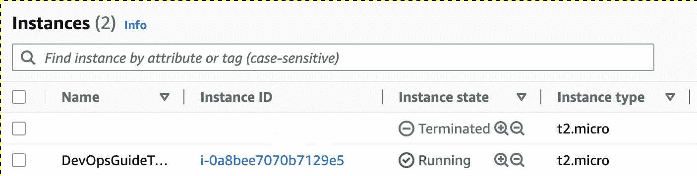

# 第十二章：利用基础设施即代码

在当今的数字化环境中，管理和部署基础设施是一个复杂且耗时的过程。传统上，基础设施部署涉及手动配置每个服务器、网络和存储设备。这个过程不仅耗时，而且容易出错和产生不一致性。**基础设施即代码**（**IaC**）解决方案提供了一种自动化的方式来管理和部署基础设施。IaC 解决方案使开发人员能够将基础设施视为代码，从而以与代码相同的方式定义、管理和配置基础设施。

在本章中，我们将探索 IaC 解决方案，重点关注 Terraform。从 `2.0` 到 `1.1`。BSL 允许你自由使用 Terraform，并可以访问其源代码，因此对最终用户没有变化。

使用 Terraform，开发人员可以编写代码来定义他们的基础设施需求，而 Terraform 将负责所需资源的配置和部署。近年来，由于其简便性、灵活性以及对多个云服务提供商的支持，Terraform 变得越来越流行。在接下来的章节中，我们将讨论 Terraform 的主要特性和优势，以及如何使用它在流行的云服务提供商上配置基础设施。

本章我们将学习以下内容：

+   什么是 IaC？

+   IaC 与配置即代码的区别

+   值得了解的 IaC 项目

+   Terraform

+   深入了解 HCL

+   使用 AWS 的 Terraform 示例

# 技术要求

本章中，您需要一台能够运行 Terraform 的系统。Terraform 是一个用 Go 编程语言编写的单一二进制程序。其安装过程简单易懂，并在 HashiCorp Terraform 项目页面上有详细说明（[`developer.hashicorp.com/terraform/downloads`](https://developer.hashicorp.com/terraform/downloads)）。HashiCorp 是 Terraform 以及其他云管理工具的背后公司，这些工具已成为 DevOps 领域的事实标准。您还需要一个 AWS 账户。AWS 提供有限时间的免费服务。我们使用的服务在写本书时具有免费层。在运行示例之前，请查阅 AWS 免费层清单，以避免不必要的费用。

# 什么是 IaC？

**基础设施即代码**（IaC）是一种软件开发实践，它通过代码定义和管理基础设施。实质上，这意味着将基础设施视为软件，并通过相同的流程和工具进行管理。IaC 解决方案使开发人员能够通过代码定义、配置和管理基础设施，而无需手动配置服务器、网络和存储设备。这种基础设施管理方法高度自动化、可扩展且高效，能够帮助组织减少部署时间，提高一致性和可靠性。

IaC 解决方案有不同的形式，包括配置管理工具、配置工具和云编排工具。配置管理工具，如**Ansible**和**Chef**，用于管理单个服务器或服务器组的配置。配置工具，如 Terraform 和**CloudFormation**，用于配置和管理基础设施资源。云编排工具，如**Kubernetes**和**OpenShift**，用于管理容器化的应用程序及其相关基础设施。无论使用何种具体工具，IaC 解决方案都能提供多个好处，包括可重复性和一致性。

# 基础设施即代码与配置即代码

你可能会想，难道我们在*第十一章*中已经讲过这个内容了吗？我们谈到的是 Ansible？答案是否定的，我们并没有讲过。基础设施即代码（IaC）和**配置即代码**（**CaC**）之间有着非常明显的区别。IaC 工具关注的正是这一点：基础设施。这意味着网络、DNS 名称、路由以及服务器（虚拟机或物理机），一直到操作系统的安装。而 CaC 关注的是操作系统内部的内容。人们常常试图用一个工具做所有事情，因此你会看到 Ansible 有一些模块可以配置交换机和路由器，但该工具最擅长的还是它原本设计的用途。如果你把这两者混在一起，虽然不会出什么大问题，但你的工作会变得更加困难。

# 值得了解的 IaC 项目

自从公共云的崛起，尤其是 AWS 之后，对于一种可重复和可靠的方式来设置基础设施并配置云服务的需求也开始增长。从那时起，许多工具应运而生，且越来越多的工具正在开发中。在本节中，我们将回顾一些最流行和最具创新性的工具。

## AWS CloudFormation

AWS CloudFormation 是由**Amazon Web Services**（**AWS**）提供的一个流行的 IaC 工具，用于自动化 AWS 资源的配置。它首次发布于 2011 年，并迅速成为云端管理基础设施的广泛使用工具。

CloudFormation 允许你使用声明性语言（如 YAML 或 JSON）来定义基础设施，然后根据这些定义创建、更新或删除资源堆栈。这不仅能实现一致且可重复的基础设施部署，还能方便地进行回滚和版本控制。不过，并非所有情况都是一帆风顺的——有时，你可能会在进行未经测试的更改后卡在回滚循环中。例如，假设你正在更改 AWS Lambda 的环境版本。不幸的是，由于你当前使用的版本不再受支持，因此更改失败。现在它被卡在回滚状态，显示为`UPDATE_ROLLBACK_FAILED`。你需要手动解决这个问题，因为没有自动化的方式来处理这一问题。

CloudFormation 与其他 AWS 服务（如 AWS **身份与访问管理**（**IAM**）、AWS **弹性负载均衡**（**ELB**）和 AWS 自动扩展）集成，轻松实现复杂架构的创建。

下面是一个用 YAML 编写的 CloudFormation 堆栈示例，它在默认 VPC 的公共子网中创建一个名为`t4g.small`的 EC2 实例：

```
AWSTemplateFormatVersion: '2010-09-09'
Parameters:
  KeyName:
    Type: AWS::EC2::KeyPair::KeyName
    Default: admin-key
  InstanceType:
    Type: String
    Default: t4g.small
  SSHCIDR:
    Type: String
    MinLength: 9
    MaxLength: 18
    Default: 0.0.0.0/0
    AllowedPattern: (\d{1,3})\.(\d{1,3})\.(\d{1,3})\.(\d{1,3})/(\d{1,2})
  LatestAmiId:
    Type:  'AWS::SSM::Parameter::Value<AWS::EC2::Image::Id>'
    Default: '/aws/service/canonical/ubuntu/server/jammy/stable/current/amd6/hvm/ebs-gp2/ami-id'
Resources:
  EC2Instance:
    Type: AWS::EC2::Instance
    Properties:
      InstanceType: !Ref 'InstanceType'
      SecurityGroups: [!Ref 'InstanceSecurityGroup']
      KeyName: !Ref 'KeyName'
      ImageId: !Ref 'LatestAmiId'
  InstanceSecurityGroup:
    Type: AWS::EC2::SecurityGroup
    Properties:
      GroupDescription: Enable SSH access
      SecurityGroupIngress:
      - IpProtocol: tcp
        FromPort: 22
        ToPort: 22
        CidrIp: !Ref 'SSHCIDR'
Outputs:
  InstanceId:
    Description: InstanceId of the newly created EC2 instance
    Value: !Ref 'EC2Instance'
  PublicDNS:
    Description: Public DNSName of the newly created EC2 instance
    Value: !GetAtt [EC2Instance, PublicDnsName]
  PublicIP:
    Description: Public IP address of the newly created EC2 instance
    Value: !GetAtt [EC2Instance, PublicIp]
```

在这个堆栈中，我们创建了两个资源：一个 EC2 实例和一个附加到该实例的安全组。CloudFormation 堆栈可以获取四个参数：

+   `KeyName`：已经在 AWS EC2 服务中创建的 SSH 密钥名称。默认值为`admin-key`。

+   `InstanceType`：我们要启动的实例类型。默认值为`t4g.small`。

+   `SSHCIDR`：`22`。默认值为`0.0.0.0/0`。在这里，我们验证提供的输入是否符合正则表达式，并检查变量的长度。

+   `LatestAmiId`：用于启动 EC2 实例的基础系统 AMI ID。默认值为 Ubuntu Linux `22.04`的最新 AMI。

接下来是`Resources`部分。在这里，EC2 实例是使用`AWS::EC2::Instance`资源类型创建的，安全组是使用`AWS::EC2::SecurityGroup`资源创建的。

最后一部分称为`Outputs`；在这里，我们可以显示已创建资源的 ID 和其他属性。在这里，我们公开实例 ID、其公共 DNS 名称和公共 IP 地址。

可以将这些输出值作为另一个 CloudFormation 堆栈的输入，这将使 CloudFormation 代码的 YAML 文件大大减小，并更易于维护。

## AWS 云开发工具包

AWS **云开发工具包**（**CDK**）是一个开源软件开发框架，用于在代码中定义云基础设施。通过 CDK，开发人员可以使用熟悉的编程语言，如 TypeScript、Python、Java、C#和 JavaScript，来创建和管理 AWS 上的云资源。

AWS CDK 于 2018 年 7 月首次作为开源项目发布。它旨在简化构建和部署云基础设施的过程，让开发人员能够使用现有的编程语言技能和工具。通过 CDK，开发人员可以定义基础设施即代码（IaC），并利用版本控制、自动化测试和**持续集成**/**持续部署**（**CI**/**CD**）管道的好处。自发布以来，CDK 已成为在 AWS 上构建基础设施的流行选择，并持续更新和新增功能。

下面是一些 AWS CDK Python 代码的示例，用于创建 EC2 实例：

```
from aws_cdk import core
import aws_cdk.aws_ec2 as ec2
class MyStack(core.Stack):
    def __init__(self, scope: core.Construct, id: str, **kwargs) -> None:
        super().__init__(scope, id, **kwargs)
        # VPC
        vpc = ec2.Vpc(self, "VPC",
            nat_gateways=0,
            subnet_configuration=[ec2.SubnetConfiguration(name="public",subnet_type=ec2.SubnetType.PUBLIC)]
            )
        # Get AMI
        amzn_linux = ec2.MachineImage.latest_amazon_linux(
            generation=ec2.AmazonLinuxGeneration.AMAZON_LINUX_2,
            edition=ec2.AmazonLinuxEdition.STANDARD,
            virtualization=ec2.AmazonLinuxVirt.HVM,
            storage=ec2.AmazonLinuxStorage.GENERAL_PURPOSE
            )
        # Create an EC2 instance
        instance = ec2.Instance(self, "Instance",
            instance_type=ec2.InstanceType("t4g.small"),
            machine_image=amzn_linux,
            vpc = vpc
        )
```

这段代码创建了一个新的 VPC 和一个 EC2 实例，实例类型为`t4g.small`，操作系统为安装了 Amazon Linux 的 EC2 实例。请注意，运行此代码之前需要先安装并配置 AWS CDK。

## Terraform

Terraform 是一个流行的开源工具，用于基础设施自动化，特别是用于创建、管理和配置云资源。它使开发者能够定义基础设施即代码（IaC），并自动化在多个云平台上部署基础设施的过程。通过 Terraform，用户可以编写声明性配置文件，这些文件使用简单直观的语言，可以进行版本管理、共享和重用。这种基础设施管理方式确保了系统的一致性和可扩展性，并减少了手动错误的风险。Terraform 支持多种云服务提供商，包括 AWS、Azure、Google Cloud 等，这使得它成为拥有复杂云基础设施需求的组织的热门选择。

Terraform 由 HashiCorp 创建，HashiCorp 是由 Mitchell Hashimoto 和 Armon Dadgar 于 2012 年创立的公司。该公司以开发流行的基础设施自动化开源工具而闻名，包括 Vagrant、Consul、Nomad 和 Vault。Terraform 于 2014 年 7 月首次发布，随后成为业内最广泛采用的 IaC 工具之一。HashiCorp 继续维护和开发 Terraform，并定期发布更新，解决新的云服务提供商特性、安全漏洞和社区反馈。该工具拥有一个庞大且活跃的贡献者社区，进一步增强了其功能并支持新的使用场景。

Terraform 也是本章的一个主要话题，稍后我们将在 *Terraform* 部分深入研究其代码和内部实现。

## Terraform 云开发工具包

**Terraform 云开发工具包**（**CDKTF**）是一个开源软件开发框架，用于以代码形式定义云基础设施。它允许用户使用熟悉的编程语言（如 TypeScript、JavaScript、Python 和 C#）来定义基础设施。这为开发者提供了更大的灵活性和控制力，因为他们可以利用现有的编程技能和工具来定义复杂的基础设施。CDKTF 于 2019 年首次发布，是 AWS 和 HashiCorp 的合作成果。从那时起，它作为一个强大的工具，在使用 Terraform 定义和部署基础设施方面获得了广泛的关注。

CDKTF 支持多种编程语言，使开发者可以轻松使用自己熟悉的语言。它使用构造函数，这些构造函数是可重用的构建块，代表 AWS 资源，用来创建基础设施。用户可以为每个要创建的资源定义构造函数，并将其组合形成更复杂的基础设施。这使得用户能够以模块化和可重用的方式定义基础设施，从而简化了创建和维护基础设施的过程。

以下是使用 Python 在 AWS 中创建 EC2 实例的 CDKTF 示例代码：

```
from constructs import Construct
from cdktf import App, TerraformStack
from imports.aws import AwsProvider, Instance, SecurityGroup
class MyStack(TerraformStack):
    def __init__(self, scope: Construct, ns: str):
        super().__init__(scope, ns)
        # Configure AWS provider
        aws_provider = AwsProvider(self, 'aws', region='us-east-1')
        # Create a security group
        security_group = SecurityGroup(self, 'web-server-sg',
            name='web-server-sg',
            ingress=[
                {
                    'from_port': 22,
                    'to_port': 22,
                    'protocol': 'tcp',
                    'cidr_blocks': ['0.0.0.0/0'],
                },
                {
                    'from_port': 80,
                    'to_port': 80,
                    'protocol': 'tcp',
                    'cidr_blocks': ['0.0.0.0/0'],
                },
            ],
        )
        # Create an EC2 instance
        Instance(self, 'web-server',
            ami='ami-0c55b159cbfafe1f0',
            instance_type='t4g.small',
            security_groups=[security_group.id],
            user_data="""
                #!/bin/bash
                echo "Hello, DevOps People!" > index.xhtml
                nohup python -m SimpleHTTPServer 80 &
            """
        )
app = App()
MyStack(app, "my-stack")
app.synth()
```

`App` 和 `TerraformStack` 类从 `cdktf` 包导入，而 AWS 资源则从 `imports.aws` 模块导入。上面的代码创建了一个带有安全组的 EC2 实例，并带有一个基本的用户数据脚本，用于启动一个简单的 HTTP 服务器。生成的基础设施可以使用 `cdktf deploy` 命令进行部署，该命令会生成 Terraform 配置文件并执行 Terraform CLI。

你可以在 [`developer.hashicorp.com/terraform/cdktf`](https://developer.hashicorp.com/terraform/cdktf) 阅读更多关于 CDKTF 的信息。

## Pulumi

**Pulumi** 是一个开源的 IaC 工具，允许开发人员使用熟悉的编程语言构建、部署和管理云基础设施。与依赖声明性语言如 YAML 或 JSON 的传统 IaC 工具不同，Pulumi 使用真实的编程语言，如 Python、TypeScript、Go 和 .NET，来定义和管理基础设施。这使得开发人员能够利用他们现有的技能和经验，使用构建应用程序时所用的相同工具和流程来创建基础设施。使用 Pulumi，开发人员可以像进行代码更改一样创建、测试和部署基础设施更改——即通过使用版本控制和 CI/CD 工具。

Pulumi 的首次发布是在 2018 年 5 月，旨在简化管理云基础设施的过程。Pulumi 由 Joe Duffy 创立，他是前微软工程师，曾参与 .NET 运行时和编译器的开发。Duffy 看到了一个机会，利用编程语言来管理基础设施，提供了一种比传统的 IaC 工具更灵活、更强大的方法。自发布以来，Pulumi 在开发者中获得了广泛的关注，尤其是在云原生环境中工作或使用多个云服务提供商的开发者。

Pulumi 支持多种编程语言，包括 Python、TypeScript、Go、.NET 和 Node.js。Pulumi 还提供了一套丰富的库和工具，用于处理云资源，包括对 AWS、Azure、Google Cloud 和 Kubernetes 等流行云服务提供商的支持。此外，Pulumi 还与流行的 CI/CD 工具集成，如 Jenkins、CircleCI 和 GitLab，使开发人员能够轻松地将基础设施更改融入现有的工作流程中。

以下是一个 Pulumi 使用 Python 创建 AWS EC2 实例的示例代码：

```
import pulumi
from pulumi_aws import ec2
# Create a new security group for the EC2 instance
web_server_sg = ec2.SecurityGroup('web-server-sg',
    ingress=[
        ec2.SecurityGroupIngressArgs(
            protocol='tcp',
            from_port=22,
            to_port=22,
            cidr_blocks=['0.0.0.0/0'],
        ),
    ],
)
# Create the EC2 instance
web_server = ec2.Instance('web-server',
    instance_type='t4g.small',
    ami='ami-06dd92ecc74fdfb36', # Ubuntu 22.04 LTS
    security_groups=[web_server_sg.name],
    tags={
        'Name': 'web-server',
        'Environment': 'production',
    },
)
# Export the instance public IP address
pulumi.export('public_ip', web_server.public_ip)
```

这段代码定义了一个 AWS 安全组，允许通过端口 `22`（SSH）进行入站流量，然后创建一个 `t4g.small` 类型的 EC2 实例，使用 Ubuntu 22.04 LTS AMI。该实例与我们之前创建的安全组关联，并带有名称和环境标签。最后，实例的公共 IP 地址作为 Pulumi 堆栈输出被导出，可以供堆栈中的其他资源使用或由用户访问。

在这一部分中，我们介绍了几种 IaC 解决方案：CDK、CDKTF、Terraform 和 Pulumi。它们中的一些针对特定的云提供商，而另一些则允许我们配置不同的云环境。

在接下来的部分中，我们将回到 Terraform，深入探讨它的工作原理，并学习如何在实践中使用基础设施即代码（IaC）。这将为我们快速理解其他解决方案奠定基础，包括我们之前提到的 CDK。

# Terraform

在这一部分中，我们将介绍 Terraform，这是目前最广泛使用的 IaC 解决方案之一。

Terraform 是一个由 HashiCorp 开发的 IaC 工具。使用它的原理类似于使用 Ansible 配置系统：基础设施配置保存在文本文件中。它们不像 Ansible 那样是 YAML 格式的，而是采用 HashiCorp 开发的特殊配置语言：**HashiCorp 配置语言**（**HCL**）。文本文件容易版本化，这意味着基础设施变更可以存储在如 Git 之类的版本控制系统中。

Terraform 执行的操作比你在 Ansible 中看到的更复杂。一个简单的 HCL 语句可能意味着设置一堆虚拟服务器以及它们之间的路由。因此，尽管 Terraform 和 Ansible 一样是声明式的，但它比其他工具更高层次。此外，与 Ansible 相反，Terraform 是状态感知的。Ansible 有一个待执行操作的列表，每次运行时，它会检查哪些操作已经执行。而 Terraform 则记录系统最后一次的状态，并确保每次执行时系统都会与代码中的状态一致。

为了实现这一点，Terraform 创建并维护一个状态文件。它是一个扩展名为`.tfstate`的文本文件，记录了工具所知道的基础设施的最后已知状态。状态文件在内部是有版本控制的；Terraform 维护一个特殊的计数器，允许它知道文件是否是最新的。状态文件对于 Terraform 正常工作至关重要。你绝不能损坏或丢失状态文件。如果丢失了该文件，Terraform 会尝试创建已经存在的资源，并可能删除不该删除的内容。

有几种方法可以确保状态文件的安全。其中一种方法是将其存储在经过适当配置的对象存储中（例如 S3），这样状态文件就无法被删除。为了增强安全性，您可以确保该文件是有版本控制的，这意味着存储将保留文件的旧副本以供以后使用。

有一件关于`.tfstate`的重要事情需要注意：它将包含与您的基础设施相关的所有信息，以及明文密码、登录凭证、访问密钥等。保护该文件的隐私至关重要，并且应将其排除在版本控制系统的提交之外（在 Git 中，可以将其添加到`.gitignore`文件中）。

代码在以`.tf`扩展名的文本文件中开发。与 Ansible 不同，您在文件中放置指令的顺序并不重要。在执行之前，Terraform 会分析当前目录下的所有`.tf`文件，创建配置元素之间的依赖关系图，并正确地排列它们。通常情况下，代码会被分解成更小的`.tf`文件，这些文件将相关的配置指令分组。然而，您也可以将所有代码保存在一个巨大的文件中，尽管它很快会变得庞大，不利于使用。

尽管您可以自由命名文件，只要它们的扩展名是`.tf`，但还是有一些最佳实践需要遵守：

+   `main.tf`：这是您开发配置代码的主要文件。它将包含资源、模块和其他重要信息。

+   `variables.tf`：此文件将包含您希望在`main.tf`文件中使用的所有变量的声明。

+   `outputs.tf`：如果您的`main.tf`文件中的资源产生任何输出，它们将在此处声明。

+   `versions.tf`：此文件声明 Terraform 二进制文件本身和提供者所需的版本。最好声明已知能够正常工作的最低版本。

+   `providers.tf`：如果任何提供者需要额外的配置，您应该将它们放在这个文件中。

+   `backend.tf`：此文件包含 Terraform 应将状态文件存储的位置的配置。状态文件是 Terraform 中基础设施即代码（IaC）的一个重要组成部分。我们将在*Terraform* *状态*小节中更深入地讨论这一点。

在 Ansible 中，重活是由名为模块的 Python 程序完成的。而在 Terraform 中，这项工作是由提供者（**Providers**）完成的。**提供者**是小型的 Golang 程序，它们消耗由 Terraform 准备的配置计划，通过这些服务的 API 连接云端、设备等服务，并执行配置。你可以把它们看作是插件。提供者提供一组资源类型，并最终提供所需的数据源，以便为提供者所连接的 API 编写配置。官方解释是，提供者“*是上游 API 的逻辑抽象*”。提供者通常发布在 Terraform Registry 上，这是由 HashiCorp 维护的公共插件库。你可以使用其他注册表，但发布在 Terraform Registry 上的提供者通常已通过测试并且被信任能够正常工作。每个发布在该注册表上的提供者都有详细的文档和良好注释的示例。每当你使用一个新提供者时，应该访问该注册表（[`registry.terraform.io/`](https://registry.terraform.io/)）。一个例子是 AWS 提供者。这个提供者公开了大量资源，你可以用来与 AWS 服务交互，以配置和部署它们。记住：配置仅限于基础设施。你可以将 Terraform（例如，用来配置虚拟机）与 Ansible（用于在虚拟机中安装软件并进行配置）结合，体验完整的工作流。

让我们看一个来自 Terraform Registry AWS 提供者文档的示例（[`registry.terraform.io/providers/hashicorp/aws/latest/docs`](https://registry.terraform.io/providers/hashicorp/aws/latest/docs)）：

```
terraform {
  required_providers {
    aws = {
      source = "hashicorp/aws" version = "~> 4.0"
    }
  }
}
# Configure the AWS Provider
provider "aws" {
  region = "us-east-1"
}
# Create a VPC
resource "aws_vpc" "example" {
  cidr_block = "10.0.0.0/16"
}
```

在上述代码片段中，我们声明需要从 Terraform Registry 下载 AWS 提供者。它的版本应该不低于 `4.0`。然后，我们配置要使用的区域（`us-east-1`）。最后，我们创建一个虚拟私有网络（**虚拟私有云**（**VPC**））并为其声明一个 IP 地址块。

单个目录中的 `.tf` 文件集合称为 **模块**。如果你在包含模块文件的目录中运行 Terraform 命令，那么这个目录就被称为 **根模块**。

## Terraform 模块

Terraform 的一个关键概念是模块。Terraform 模块是一个资源集合及其依赖关系，用于构建基础设施的特定组件。模块提供了一种组织代码的方式，并使其能够在多个项目之间复用。模块可以与其他用户和团队共享，甚至发布到像 Terraform Registry 这样的公共注册表中。

在使用 Terraform 时，确保使用兼容的基础设施提供者版本非常重要。提供者负责管理您云环境中的资源，不同版本可能具有不同的功能或行为。为了避免基础设施发生意外变化，您可以在 Terraform 配置中固定您使用的提供者版本。通过在提供者块中指定版本约束，使用 Terraform 版本约束语法，您可以实现这一点。当您运行 Terraform 时，它将下载并使用指定版本的提供者，确保您的基础设施保持一致和可预测。

这是一个示例`versions.tf`文件，它将 AWS 提供者固定到最新版本，并要求至少版本 1.0.0 的 Terraform：

```
terraform {
  required_providers {
    aws = ">= 3.0.0"
  }
  required_version = ">= 1.0.0"
}
```

在这个示例中，我们使用`required_providers`块来指定我们至少需要版本 3.0.0 的 AWS 提供者。通过使用`>=`操作符，我们允许 Terraform 使用任何版本的提供者，只要它等于或大于 3.0.0，包括最新版本。

当我们运行`terraform init`时，Terraform 将自动下载并使用提供者的最新版本。此命令还会更新或下载您可能在主模块（或根模块）中使用的其他模块。然而，使用大量依赖其他模块的模块是不推荐的，因为这可能会导致依赖冲突（例如，一些旧模块可能需要 AWS 提供者版本 1.23，而根模块需要版本 3.0 或更高）。我们将在本章的*Terraform* *CLI*小节中再次回到命令行界面（CLI）。

要引用另一个模块，您可以使用`module`代码块。假设我们在根模块相对路径`./module/aws_ec2`目录中有一个简单的模块。`aws_ec2`模块需要传入`ami`、`subnet`、`vpc`和`security_group`变量：

```
module "aws_ec2_instance" {
  source = "./modules/aws_ec2"
  ami            = "ami-06dd92ecc74fdfb36"
  subnet_id      = "subnet-12345678"
  vpc_id         = "vpc-12345678"
  security_group = "sg-12345678"
}
```

如果一个模块公开了某些输出（您可以将其用作资源或其他模块的输入），您可以通过`module.NAME.OUTPUT_NAME`来引用它们。在这种情况下，我们可以公开 EC2 实例的 ID，您可以通过名称`module.aws_ec2_instance.instance_id`来引用它。

除了使用本地路径外，还有几种其他方法可以指定 Terraform 中引用模块时的源参数：

+   该模块可以存储在 Git 仓库中并检索：

    ```
    module "example" {
    ```

    ```
      source = "git::https://github.com/example-org/example-module.git"
    ```

    ```
    }
    ```

    使用 Git 仓库时，您还可以引用提交 ID、分支或标签：

    ```
    module "example" {
    ```

    ```
      source = "git::https://github.com/example-org/example-module.git?ref=branch_name"
    ```

    ```
    }
    ```

    对于私有仓库，您需要使用 SSH 而不是 HTTPS 来将其克隆到本地：

    ```
    module "example" {
    ```

    ```
      source = "git::ssh://github.com/example-org/example-module.git?ref=branch_name"
    ```

    ```
    }
    ```

+   该模块可以发布并从 Terraform 注册表中检索：

    ```
    module "example" {
    ```

    ```
      source = "hashicorp/example-module/aws"
    ```

    ```
    }
    ```

    在这种情况下，您可以使用`version`属性指定模块版本，如下所示：

    ```
    module "example" {
    ```

    ```
      source = "hashicorp/example-module/aws"
    ```

    ```
      version = "1.0.0"
    ```

    ```
    }
    ```

+   该模块可以存储在 S3 桶中并检索：

    ```
    module "example" {
    ```

    ```
      source = "s3::https://s3-eu-cental-1.amazonaws.com/example-bucket/example-module.zip"
    ```

    ```
    }
    ```

您可以在官方文档中找到其他可能的来源：[`developer.hashicorp.com/terraform/language/modules/sources`](https://developer.hashicorp.com/terraform/language/modules/sources)。

## Terraform 状态

Terraform 的一个基本概念是状态文件。它是一个 JSON 文件，描述了你基础设施的当前状态。这个文件用于跟踪 Terraform 已创建、更新或删除的资源，并且还存储每个资源的配置。

状态文件的目的是使 Terraform 能够一致可靠地管理你的基础设施。通过跟踪 Terraform 已创建或修改的资源，状态文件确保 Terraform 的后续运行能够了解基础设施的当前状态，并根据需要进行更改。如果没有状态文件，Terraform 将无法知道当前部署了哪些资源，并且无法做出关于如何进行后续更改的明智决策。

状态文件还被用作 Terraform 的`plan`和`apply`操作的事实来源。当你运行`terraform plan`或`terraform apply`时，Terraform 将当前基础设施的状态与 Terraform 代码中定义的目标状态进行比较。状态文件用于确定需要进行哪些更改，以使你的基础设施达到所需状态。总体而言，状态文件是 Terraform 基础设施管理功能的关键组成部分，确保 Terraform 能够保证基础设施的一致性和可靠性。

虽然 Terraform 状态文件是该工具的关键组成部分，但使用它也存在一些缺点和挑战。

状态文件是一个集中式文件，用于存储有关基础设施的信息。虽然这很方便，但在团队协作时也可能会带来问题，特别是当多个用户同时对同一基础设施进行更改时。这可能会导致冲突，使得保持状态文件的最新状态变得具有挑战性。通过使用分布式锁机制可以缓解这一问题。在 AWS 环境中，它实际上只是一个 DynamoDB 表，包含一个状态为`0`或`1`的锁条目。

Terraform 状态的另一个缺点是，状态文件包含有关基础设施的敏感信息，如密码、密钥和 IP 地址。因此，必须保护状态文件以防止未经授权的访问。如果状态文件被泄露，攻击者可能会获得对基础设施或敏感数据的访问权限。在 AWS 内部，状态文件通常保存在一个 S3 桶中，并且需要启用加密并阻止公共访问。

随着时间的推移，状态文件可能会变得庞大且难以管理，尤其是在你管理着大量资源的基础设施时。这可能会使管理和维护状态文件变得具有挑战性，进而导致错误和不一致性。

我们可能遇到的下一个关于状态文件的挑战是，Terraform 状态文件是版本特定的。这意味着你必须使用与创建状态文件时相同版本的 Terraform 来管理该文件。这可能会在升级到新版 Terraform 时带来问题，因为你可能需要将状态文件迁移到新的格式。

最后，Terraform 的状态文件有一些局限性，例如无法管理外部资源或处理资源之间复杂依赖关系的困难。这在处理某些类型的基础设施或应对复杂部署时可能会带来挑战。

状态文件的另一个功能是强制执行 Terraform 管理的资源的配置。如果有人手动进行了更改，你将在下次执行 `terraform plan` 或 `terraform apply` 时看到这些更改，并且这些更改将被回滚。

考虑到所有这些，Terraform 仍然是最好的解决方案之一，而且大多数这些挑战在规划基础设施时都可以轻松解决。

这是一个示例 `backend.tf` 文件，配置 Terraform 使用名为 `state-files` 的 S3 存储桶来存储状态文件，并使用名为 `terraform` 的 DynamoDB 表进行状态锁定：

```
terraform {
  backend "s3" {
    bucket         = "state-files"
    key            = "terraform.tfstate"
    region         = "eu-central-1"
    dynamodb_table = "terraform"
  }
}
```

在此配置中，后端块指定了我们希望使用 `s3` 后端类型，该类型旨在将状态文件存储在 S3 存储桶中。`bucket` 参数指定了状态文件应存储的存储桶名称，而 `key` 参数指定了存储桶中状态文件的名称。

`region` 参数指定了存储桶所在的 AWS 区域。你应该将其设置为最符合你使用场景的区域。

最后，`dynamodb_table` 参数指定了将用于状态锁定的 DynamoDB 表的名称。这是 S3 后端的一个重要特性，因为它确保一次只有一个用户可以对基础设施进行更改。

这是 Terraform 状态文件的一个示例：

```
{
    "version": 3,
    "serial": 1,
    "lineage": "f763e45d-ba6f-9951-3498-cf5927bc35c7",
    "backend": {
        "type": "s3",
        "config": {
            "access_key": null,
            "acl": null,
            "assume_role_policy": null,
            "bucket": "terraform-states",
            "dynamodb_endpoint": null,
            "dynamodb_table": "terraform-state-lock",
            "encrypt": true,
            "endpoint": null,
            "external_id": null,
            "force_path_style": null,
            "iam_endpoint": null,
            "key": "staging/terraform.tfstate",
            "kms_key_id": null,
            "lock_table": null,
            "max_retries": null,
            "profile": null,
            "region": "eu-central-1",
            "role_arn": null,
            "secret_key": null,
            "session_name": null,
            "shared_credentials_file": null,
            "skip_credentials_validation": null,
            "skip_get_ec2_platforms": null,
            "skip_metadata_api_check": null,
            "skip_region_validation": null,
            "skip_requesting_account_id": null,
            "sse_customer_key": null,
            "sts_endpoint": null,
            "token": null,
            "workspace_key_prefix": null
        },
        "hash": 1619020936
    },
    "modules": [
        {
            "path": [
                "root"
            ],
            "outputs": {},
            "resources": {},
            "depends_on": []
        }
    ]
}
```

通过使用 S3 后端和 DynamoDB 状态锁定，你可以确保 Terraform 部署在团队环境中是安全且一致的，即使多个用户可能同时对相同基础设施进行更改。

在下一个小节中，我们将讨论如何使用 Terraform CLI 与我们的基础设施和状态文件进行交互。

## Terraform CLI

Terraform 的核心是其命令行工具，恰如其分地被称为 `terraform`。我们在介绍 Terraform 时已链接了安装指南。虽然也有工具可以自动化工作流程，省去了使用 CLI 的必要，但该工具的使用非常简单，并且从与它一起工作中可以获得许多有用的知识。在这一节中，我们将介绍 `terraform` 命令的最常见选项和工作流程。

### 初始化工作环境

您将使用的第一个 `terraform` 子命令是 `terraform init`。在编写完 `main.tf` 文件的第一部分（如果您遵循建议的模块结构）后，您将运行 `terraform init` 来下载所需的插件并创建一些重要的目录和帮助文件。

让我们来看一下之前使用的第一段代码的一部分：

```
terraform {
  required_providers {
    aws = {
      source = "hashicorp/aws" version = "~> 4.0"
    }
  }
}
```

这段代码告诉 Terraform 需要下载的插件及其最低版本。现在，让我们运行 `terraform` `init` 命令：

```
admin@myhome:~$ terraform init
Initializing the backend...
Initializing provider plugins...
- Finding latest version of hashicorp/aws...
- Installing hashicorp/aws v4.58.0...
- Installed hashicorp/aws v4.58.0 (signed by HashiCorp)
Terraform has been successfully initialized!
```

我们已简化了输出以提高简洁性，但最重要的部分仍然存在。您将看到 Terraform 告诉您已执行了哪些操作。后端是用于存储 `.tfstate` 文件的存储区域。如果您没有指定存储区域，`.tfstate` 文件将保存在本地目录中的 `terraform.tfstate` 文件中。还有一个新的子目录 `.terraform`，其中安装了所需的插件。最后，存在一个 `.terraform.lock.hcl` 文件，Terraform 会记录已使用的提供程序版本，以便您可以出于兼容性原因保留这些版本。

`terraform init` 命令是一个安全命令。您可以根据需要多次运行它；它不会破坏任何内容。

### 规划更改

接下来要运行的命令是 `terraform fmt`。此命令将根据现有的最佳实践格式化您的 `.tf` 文件。使用它可以提高代码的可读性和可维护性，使所有源文件在您将看到的所有 Terraform 项目中遵循相同的格式化策略。在我们的示例上运行 `terraform fmt` 将产生以下输出：

```
admin@myhome:~$ terraform fmt
│ Error: Missing attribute separator
│
│   on main.tf line 4, in terraform:
│    3:     aws = {
│    4:       source = "hashicorp/aws" version = "~> 4.0"
│
│ Expected a newline or comma to mark the beginning of the next attribute.
```

您会注意到 `fmt` 在我的 `main.tf` 文件中发现了一个明显的错误。这不仅是一个可读性问题；它还可能在某些提供程序中引入代码解析错误。我将两个属性写在了同一行。将其编辑成如下所示就可以解决问题：

```
terraform {
  required_providers {
    aws = {
      source = "hashicorp/aws"
      version = "~> 4.0"
    }
  }
}
```

通过这个更改，`fmt` 满意了，我们可以继续进行下一步。

通过使用 `terraform plan` 命令来构建操作计划。它将您基础设施的最后已知记录状态（`terraform.tfstate`）与目录中的代码进行比较，并准备出步骤以使其匹配。在我们之前的示例代码上运行 `terraform plan` 会产生以下输出：

```
admin@myhome:~$ terraform plan
No changes. Your infrastructure matches the configuration.
Terraform has compared your real infrastructure against your configuration and found no differences, so no changes are needed.
```

由于我们没有引入任何可以创建资源的代码，Terraform 告知我们没有计划进行任何更改。

然而，这并不太有趣。因此，我们将展示一些将在 AWS 中创建资源的内容。

注意

在遵循此示例之前，请先了解您在 AWS 免费套餐服务中的责任。运行这些示例可能会产生费用，如果发生费用，本文的作者和出版商不对其承担任何责任。

如果你想跟随这些示例，你需要拥有一个 AWS 账户（在写本书时是免费的）。然后，你需要创建一个角色并生成 `AWS_ACCESS_KEY_ID` 和 `AWS_SECRET_ACCESS_KEY`。这样做超出了本章的范围。

我们稍微修改了前面的示例。`required_providers` 块已被移动到 `providers.tf` 文件中。我们还在其中添加了另一个提供程序块。文件如下所示：

```
terraform {
  required_providers {
    aws = {
      source  = "hashicorp/aws"
      version = "~> 4.0"
    }
  }
}
provider "aws" {
  region = "us-west-2"
}
```

请注意，新的块正在配置一个名为 `aws` 的新提供程序资源。名称（`aws`）实际上由我们决定，可以是任何名称。记得给它们起有意义的名字，能帮助你以后理解代码。我们为这个提供程序提供了最低限度的配置，指定了我们的资源将启动的区域。

我们在新创建的空 `main.tf` 文件中进行实际操作：

```
resource "aws_instance" "vm_example" {
  ami           = "ami-830c94e3"
  instance_type = "t2.micro"
  tags = {
    Name = "DevOpsGuideTerraformExample"
}
```

在这里，我们告诉 Terraform 我们想要创建一个新的 `aws_instance` 类型的资源。我们将其命名为 `vm_example`。接下来，我们告诉工具使用名为 `ami-830c94e3` 的虚拟机镜像（AMI）。该实例的类型（它将拥有多少 RAM、多少 CPU 核心、系统驱动器的大小等等）是 `t2.micro`。最后，我们添加了一个标签，帮助我们识别和查找这个实例。

让我们调用 `terraform plan` 并应用它：

```
admin@myhome:~$ terraform plan
Terraform used the selected providers to generate the following execution plan. Resource actions are indicated with the following symbols:
  + create
Terraform will perform the following actions:
  # aws_instance.vm_example will be created
  + resource "aws_instance" "vm_example" {
      + ami                                  = "ami-830c94e3"
[...]
      + tags                                 = {
          + "Name" = "DevOpsGuideTerraformExample"
        }
      + tags_all                             = {
          + "Name" = "DevOpsGuideTerraformExample"
        }
      + tenancy                              = (known after apply)
[...]
      + vpc_security_group_ids               = (known after apply)
    }
Plan: 1 to add, 0 to change, 0 to destroy.
────────────────────────────────────────────────────────────────────
```

注意

你没有使用 `-out` 选项来保存这个计划，因此 Terraform 无法保证如果你现在运行 `terraform apply`，它会准确执行这些操作。

我们已经省略了计划中的大量输出。然而，你可以看到它与之前的示例有所不同。Terraform 注意到我们没有具有指定参数的虚拟机（记住，它是与 `.tfstate` 文件进行比较的）。因此，它将创建一个。我们始终可以在以 `Plan` 开头的行中看到摘要。在计划中，所有以 `+`（加号）开头的属性将被创建。所有以 `-`（减号）开头的属性将被销毁，而所有以 `~`（波浪号）开头的属性将被修改。

在更改已创建资源的属性时要小心使用 Terraform。通常情况下，它会将其视为新资源，特别是当你更改名称时。这将导致销毁旧名称的虚拟机，并创建一个新名称的虚拟机。这可能不是你想要的结果。

### 应用更改

计划通过调用 `terraform apply` 来实施。如果你的 `.tf` 文件与 `.tfstate` 文件不同，这个命令将会对你的环境进行更改。此外，如果你的实际运行基础设施与 `.tfstate` 文件不同，`terraform apply` 将尽最大努力使实时基础设施与 Terraform 状态文件重新对齐：

```
admin@myhome:~$ terraform apply
Terraform used the selected providers to generate the following execution plan. Resource actions are indicated with the following symbols:
  + create
Terraform will perform the following actions:
  # aws_instance.vm_example will be created
  + resource "aws_instance" "vm_example" {
      + ami                                  = "ami-830c94e3"
[...]
      + subnet_id                            = (known after apply)
      + tags                                 = {
          + "Name" = "DevOpsGuideTerraformExample"
        }
      + tags_all                             = {
          + "Name" = "DevOpsGuideTerraformExample"
        }
      + tenancy                              = (known after apply)
[...]
      + vpc_security_group_ids               = (known after apply)
    }
Plan: 1 to add, 0 to change, 0 to destroy.
Do you want to perform these actions?
  Terraform will perform the actions described above.
  Only 'yes' will be accepted to approve.
  Enter a value: yes
aws_instance.vm_example: Creating...
aws_instance.vm_example: Still creating... [10s elapsed]
aws_instance.vm_example: Still creating... [20s elapsed]
aws_instance.vm_example: Still creating... [30s elapsed]
aws_instance.vm_example: Still creating... [40s elapsed]
[...]
aws_instance.vm_example: Still creating... [1m20s elapsed]
aws_instance.vm_example: Creation complete after 1m29s [id=i-0a8bee7070b7129e5]
Apply complete! Resources: 1 added, 0 changed, 0 destroyed.
```

再次，出于简洁性，很多输出被省略了。

`terraform apply` 命令再次创建了一个计划。我们可以通过将 `terraform plan` 记录到文件中，然后将文件输入到 `apply` 步骤中来避免这种情况。

有趣的部分是确认步骤，在这个步骤中，Terraform 会要求你输入`yes`才能继续。然后，它将每 10 秒钟打印一次已执行操作的摘要。经过一段时间与 Terraform 的工作，你通常可以根据操作完成所花费的时间来猜测该操作是否成功。

在 AWS 控制台的**实例**菜单中，我们可以看到虚拟机已经创建完成：



图 12.1 – 通过 Terraform 创建的新虚拟机实例

我们可以通过运行`terraform destroy`来删除我们刚刚创建的所有基础设施。

有趣的一点是，在我们的工作流程中，我们没有告诉 Terraform 它应该解释哪些文件。这是因为，正如之前提到的，Terraform 会读取当前目录下的所有`.tf`文件，并创建一个正确的执行计划。

如果你有兴趣查看步骤的层次结构，Terraform 提供了`terraform graph`命令，它会为你打印出该层次结构：

```
admin@myhome:~$ terraform graph
digraph {
     compound = "true"
     newrank = "true"
     subgraph "root" {
          "[root] aws_instance.vm_example (expand)" [label = "aws_instance.vm_example", shape = "box"]
          "[root] provider[\"registry.terraform.io/hashicorp/aws\"]" [label = "provider[\"registry.terraform.io/hashicorp/aws\"]", shape = "diamond"]
          "[root] aws_instance.vm_example (expand)" -> "[root] provider[\"registry.terraform.io/hashicorp/aws\"]"
          "[root] provider[\"registry.terraform.io/hashicorp/aws\"] (close)" -> "[root] aws_instance.vm_example (expand)"
          "[root] root" -> "[root] provider[\"registry.terraform.io/hashicorp/aws\"] (close)"
     }
}
```

有一些工具可以创建 Terraform 生成的图形的良好可视化表示。

### 修改 Terraform 状态

有时，需要修改状态文件中的资源。在 Terraform 的旧版本中，这必须手动完成，并且容易出错。幸运的是，Terraform 开发者添加了一些命令行工具，可以帮助我们完成这项工作。

最有用的命令如下：

+   `Terraform state rm`：该命令从状态中移除资源。当我们手动删除了资源并从 Terraform 代码中移除它，但它仍然存在于状态中时，这个命令非常有用。

+   `terraform state mv`：该命令用于更改资源的名称。这在我们更改资源名称时很有用，以防止删除并创建一个新的资源，这通常不是我们想要的行为。

+   `terraform taint`：该命令强制重新创建资源。

### 导入现有资源

将现有资源导入到 Terraform 中，可以将这些资源纳入到 Terraform 状态中，Terraform 状态是一个由 Terraform 管理的资源快照。

`terraform import`命令用于将现有资源添加到你的 Terraform 状态中。该命令将现有资源映射到 Terraform 代码中的配置块，从而允许你使用 Terraform 管理该资源。

`terraform import`命令的语法如下：

```
terraform import [options] resource_in_code resource_identifier
```

`terraform import`命令的两个重要参数如下：

+   `resource_in_code`：在 Terraform 代码中资源的地址。

+   `resource_identifier`：你想导入的资源的唯一标识符。

举个例子，假设你有一个现有的 AWS S3 存储桶，ARN 为`arn:aws:s3:::devopsy-bucket`。要将这个资源导入到 Terraform 状态中，可以运行以下命令：

```
terraform import aws_s3_bucket.devopsy_bucket arn:aws:s3:::devopsy-bucket
```

导入资源对于你有现有基础设施并希望使用 Terraform 进行管理时非常有用。当你开始在现有项目中使用 Terraform 或者有一些在 Terraform 之外创建的资源时，通常会遇到这种情况。导入资源可以让你将这些资源纳入 Terraform 管理中，从而将来可以使用 Terraform 对其进行修改。

并非所有资源都可以导入到 Terraform 中。你打算导入的资源必须有一个唯一标识符，Terraform 可以利用它在远程服务中找到该资源。此外，资源还必须得到你在 Terraform 中使用的提供程序的支持。

### 工作区

Terraform 有一个工作区的概念。**工作区**类似于状态的版本。工作区允许你为相同的代码存储不同的状态。为了能够使用工作区，必须将状态文件存储在支持工作区的后端中。支持工作区的后端列表非常长，涵盖了大多数流行的云服务提供商。

这些工作区可以通过 `.tf` 文件中的 `${terraform.workspace}` 序列来访问。结合条件表达式，这使得你能够创建不同的环境。例如，您可以根据工作区使用不同的 IP 地址，从而区分测试环境和生产环境。

总是存在一个工作区：`default`。它无法被删除。工作区操作可以通过 `terraform` `workspace` 命令来完成。

我们可以使用 `terraform` `list` 命令轻松查看当前有哪些工作区以及哪个是活动工作区：

```
admin@myhome:~$ terraform workspace list
* default
```

前面带星号的是当前工作区。如果我们只关心查看当前工作区而不是整个列表，可以运行 `terraform` `show` 命令：

```
admin@myhome:~$ terraform workspace show
default
```

每个工作区都会有一个状态文件。让我们做个实验：我们将创建一个名为 `testing` 的新工作区，并对测试工作区应用 Terraform。

首先，我们必须调用 `terraform workspace new` 来创建工作区：

```
admin@myhome:~$ terraform workspace new testing
Created and switched to workspace "testing"!
You're now on a new, empty workspace. Workspaces isolate their state,
so if you run "terraform plan" Terraform will not see any existing state
for this configuration.
```

现在，我们必须确认自己确实处于新的工作区中，并使用我们之前的示例在其中运行 `terraform apply`：

```
admin@myhome:~$ terraform apply
Terraform used the selected providers to generate the following execution plan. Resource actions are indicated with the following symbols:
  + create
Terraform will perform the following actions:
  # aws_instance.vm_example will be created
  + resource "aws_instance" "vm_example" {
      + ami                                  = "ami-830c94e3"
[...]
Plan: 1 to add, 0 to change, 0 to destroy.
Do you want to perform these actions?
  Terraform will perform the actions described above.
  Only 'yes' will be accepted to approve.
  Enter a value: yes
aws_instance.vm_example: Creating...
aws_instance.vm_example: Still creating... [10s elapsed]
aws_instance.vm_example: Still creating... [20s elapsed]
aws_instance.vm_example: Still creating... [30s elapsed]
aws_instance.vm_example: Still creating... [40s elapsed]
aws_instance.vm_example: Still creating... [50s elapsed]
aws_instance.vm_example: Creation complete after 57s [id=i-06cf29fde369218e2]
Apply complete! Resources: 1 added, 0 changed, 0 destroyed.
```

如你所见，我们成功创建了虚拟机。然而，当我们将工作区切换回默认工作区时，Terraform 又会要求重新创建它：

```
admin@myhome:~$ terraform workspace switch default
Switched to workspace "default".
admin@myhome:~$ terraform apply
Terraform used the selected providers to generate the following execution plan. Resource actions are indicated with the following symbols:
  + create
Terraform will perform the following actions:
  # aws_instance.vm_example will be created
  + resource "aws_instance" "vm_example" {
[...]
```

即使资源的创建已经成功，Terraform 仍然会希望重新创建它。当我们检查存放 `.tf` 文件的目录时，我们会发现与默认工作区关联的 `.tfstate` 文件，以及一个名为 `terraform.tfstate.d/` 的新目录，里面存放着 `.tfstate` 文件，每个文件都会存放在一个以工作区名称命名的子目录中。因此，对于测试工作区，状态文件将存储在 `terraform.tfstate.d/testing` 中：

```
admin@myhome:~$ ll
total 40
-rw-r--r--  1 trochej  staff   159B Mar 21 13:11 main.tf
-rw-r--r--  1 trochej  staff   158B Mar 21 12:27 providers.tf
-rw-r--r--  1 trochej  staff   4.4K Mar 21 21:17 terraform.tfstate
-rw-r--r--  1 trochej  staff   180B Mar 21 21:15 terraform.tfstate.backup
drwxr-xr-x  3 trochej  staff    96B Mar 21 21:07 terraform.tfstate.d
admin@myhome:~$ ll terraform.tfstate.d
total 0
drwxr-xr-x  3 trochej  staff    96B Mar 21 21:20 testing
admin@myhome:~$ ll terraform.tfstate.d/testing
total 8
-rw-r--r--  1 trochej  staff   180B Mar 21 21:18 terraform.tfstate
```

我们如何在 Terraform 代码中利用这一点呢？正如我们提到的，有一个特殊的序列（我们称之为变量），它会扩展为当前工作区的名称：

```
resource "aws_instance" "vm_example" {
  ami           = "ami-830c94e3"
  instance_type = terraform.workspace == "default" ? "t2.micro" : "t2.nano"
  tags = {
    Name = "DevOpsGuideTerraformExample"
}
```

通过这个小的修改（如果 `terraform.workspace` 是默认值，则实例将是 `t2.micro`；否则，它将是 `t2.nano`），我们引入了与启动虚拟机的工作空间相关的条件变化。

让我们通过 `terraform plan` 快速确认一下：

```
admin@myhome:~$ terraform workspace show
default
admin@myhome:~$ terraform plan | grep instance_type
      + instance_type                        = "t2.micro"
admin@myhome:~$ terraform workspace select testing
Switched to workspace "testing".
admin@myhome:~$ terraform plan | grep instance_type
      + instance_type                        = "t2.nano"
```

如前面的输出所示，取决于我们选择的工作空间，将创建不同类型的实例。

在本节中，我们深入探讨了 Terraform IaC 工具。我们解释了提供者和模块的概念，以及状态文件的作用。我们还演示了简单的 Terraform 配置及其与 AWS 云的互动。

在下一节中，我们将更详细地介绍 HashiCorp 配置语言（HCL），它是专门用于编写这些配置的。

# HCL 深入解析

HCL 是一种配置语言，由多个 HashiCorp 工具使用，包括 Terraform，用于定义和管理基础设施即代码（IaC）。

HCL 旨在让人类和机器都能轻松阅读和编写。它使用的语法简单，类似于 JSON，但结构更为宽松，并且支持注释。HCL 文件通常具有 `.hcl` 或 `.tf` 文件扩展名。

HCL 使用花括号来定义代码块，每个代码块都有一个标签，用于标识其类型。在每个代码块内，我们使用 `key-value` 语法定义属性，其中键是属性名，值是属性值。我们还可以使用花括号定义对象，如示例中所示的 `tags` 对象。

## 变量

在 HCL 中，变量使用 `variable` 块来定义。以下是如何在 HCL 中定义变量的示例：

```
variable "region" {
  type = string
  default = "eu-central-1"
}
```

在这个示例中，我们定义了一个名为 `region` 的变量，类型为 `string`，并指定了默认值 `us-west-2`。我们可以在代码中使用 `${var.region}` 语法引用该变量。

HCL 支持多种数据类型的变量，包括 `string`、`number`、`boolean`、`list`、`map` 和 `object`。我们还可以使用 `variable` 块中的 `description` 参数为变量指定描述。

变量可以通过多种方式赋值，包括默认值、命令行参数或环境变量。在使用 Terraform 时，我们还可以在单独的文件中定义变量，并通过 `.tfvars` 文件扩展名（例如 `variables.tfvars`）或命令行参数在执行过程中传入。

一旦定义了变量，它们就不能更改，但 HCL 还允许在 `locals` 块内定义局部变量。局部变量对于简化模块或资源块中的复杂表达式或计算非常有用，因为它们可以将逻辑分解为更小、更易管理的部分。它们还可以使我们更容易维护代码，因为我们可以为那些可能频繁变化或需要跨多个资源或模块更新的值定义局部变量。

以下是一个`locals`块示例，它定义了`eu-central-1`区域并在每个 AZ 中生成子网：

```
locals {
  azs         = ["eu-central-1a", "eu-central-1b", "eu-central-1c"]
  cidr_block  = "10.0.0.0/16"
  subnet_bits = 8
  subnets     = {
    for idx, az in local.azs : az => {
      name       = "${var.environment}-subnet-${idx}"
      cidr_block = cidrsubnet(local.cidr_block, local.subnet_bits, idx)
      availability_zone = az
    }
  }
}
```

在此示例中，我们定义了一个`locals`块，其中包括以下变量：

+   `azs`：`eu-central-1`区域中的可用区列表

+   `cidr_block`：VPC 的 CIDR 块

+   `subnet_bits`：在 CIDR 块内为子网分配的位数

+   `subnets`：一个映射，使用`for`表达式为`azs`列表中的每个可用区生成子网

`subnets`映射中的`for`表达式会为`azs`列表中的每个可用区生成一个子网。子网的名称包括环境变量（可以作为变量传递）和可用区在列表中的索引。`cidrsubnet`函数用于根据`cidr_block`变量和`subnet_bits`变量计算每个子网的 CIDR 块。

生成的`subnets`映射将包含`azs`列表中每个可用区的键值对，其中键是可用区名称，值是一个映射，包含子网名称、CIDR 块和可用区。

## 注释

HCL 中的注释可以通过两种方式编写：单行注释和多行注释。单行注释以`#`符号开头，直到行末。多行注释则以`/*`开头，以`*/`结尾。多行注释可以跨越多行，通常用于提供更长的解释或暂时禁用代码段。

以下是一个单行注释的示例：

```
# This is a single-line comment in HCL
```

以下是一个多行注释的示例：

```
/*
This is a multi-line comment in HCL
It can span multiple lines and is often used
to provide longer explanations or to temporarily disable sections of code.
*/
```

## Terraform 元参数

在 Terraform 中，**元参数**是可以用来修改资源块行为的特殊参数。之所以称其为元参数，是因为它们作用于整个资源块，而不是资源块中的特定属性。

元参数用于配置诸如资源实例数量（`count`）、资源名称（`name`）、资源之间的依赖关系（`depends_on`）等内容。

### count

`count`允许你基于数字值创建多个资源实例。这在不重复整个代码块的情况下创建多个资源实例（例如 AWS 中的 EC2 实例）时非常有用。

例如，假设你想在 AWS 账户中创建三个 EC2 实例。你可以使用`count`元参数来创建多个相同的`aws_ec2_instance`资源块，而不是创建三个单独的资源块。以下是一个示例：

```
resource "aws_ec2_instance" "example" {
  ami           = "ami-0c55b159cbfafe1f0"
  instance_type = "t2.micro"
  count         = 3
}
```

在此示例中，我们使用相同的`ami`和`instance_type`创建三个 EC2 实例。`count`元参数设置为`3`，意味着 Terraform 将创建三个`aws_ec2_instance`资源块的实例。每个实例将被赋予唯一的标识符，例如`aws_ec2_instance.example[0]`、`aws_ec2_instance.example[1]`和`aws_ec2_instance.example[2]`。

### for_each

`for_each`元参数类似于`count`元参数，它允许你创建多个资源实例。然而，`for_each`比`count`更灵活，因为它允许你根据一个映射或值集合来创建实例，而不仅仅是基于一个数值。

例如，假设你有一个 AWS 安全组的映射，并希望在 Terraform 代码中创建它们。你可以使用`for_each`在一个块中创建所有安全组，而不是创建多个`aws_security_group`资源块。下面是一个示例：

```
variable "security_groups" {
  type = map(object({
    name        = string
    description = string
    ingress     = list(object({
      from_port   = number
      to_port     = number
      protocol    = string
      cidr_blocks = list(string)
    }))
  }))
}
resource "aws_security_group" "example" {
  for_each = var.security_groups
  name_prefix = each.value.name
  description = each.value.description
  ingress {
    from_port   = each.value.ingress[0].from_port
    to_port     = each.value.ingress[0].to_port
    protocol    = each.value.ingress[0].protocol
    cidr_blocks = each.value.ingress[0].cidr_blocks
  }
}
```

在这个示例中，我们使用`for_each`元参数根据`security_groups`变量（这是一个对象的映射）创建多个`aws_security_group`资源块的实例。每个实例将根据映射的键生成一个唯一的标识符。我们还使用`name_prefix`属性来设置每个安全组的名称，使用`description`属性来设置描述。最后，我们使用`ingress`块定义每个安全组的入站流量规则。

使用`for_each`可以简化你的 Terraform 代码，并使其更具可重用性，特别是在处理映射或集合值时。然而，需要注意实例之间可能存在的依赖关系，并确保代码结构能够正确处理多个实例。

### lifecycle

`lifecycle`元参数用于定义创建、更新和删除资源的自定义行为。它允许你比默认行为更精细地控制资源及其依赖关系的生命周期。

`lifecycle`元参数可用于定义以下属性：

+   `create_before_destroy`：如果设置为`true`，Terraform 将在销毁旧资源之前创建新资源，这在某些情况下可以防止停机。

+   `prevent_destroy`：如果设置为`true`，Terraform 将防止资源被销毁。这对于保护关键资源免受意外删除非常有用。

+   `ignore_changes`：Terraform 在判断是否需要更新资源时，应该忽略的一些属性名称列表。

+   `replace_triggered_by`：一个依赖项列表，当这些依赖项发生变化时，资源将被重新创建。

下面是使用`lifecycle`元参数来防止销毁 S3 存储桶的示例：

```
resource "aws_s3_bucket" "example" {
  bucket = "example-bucket"
  acl    = "private"
  lifecycle {
    prevent_destroy = true
  }
}
```

在这个示例中，`lifecycle`块用于将`prevent_destroy`属性设置为`true`，这意味着 Terraform 将防止`aws_s3_bucket`资源被销毁。这对于保护关键资源免于被意外删除非常有用。

### depends_on

`depends_on`元参数用于定义资源之间的依赖关系。它允许你指定一个资源依赖于另一个资源，这意味着 Terraform 将在依赖的资源创建之后创建依赖资源。

然而，重要的是要注意，在大多数情况下，Terraform 可以通过分析你的资源配置自动创建依赖树。这意味着除非绝对必要，否则应避免使用 `depends_on`，因为它可能导致依赖循环，从而引发错误并使你的 Terraform 代码更难以管理。

如果你确实需要使用 `depends_on`，那么重要的是要意识到可能出现的依赖循环，并以避免它们的方式来组织代码。这可能涉及将资源拆分成更小的模块，或者使用其他技术来减少复杂性并避免循环依赖。

下面是一个使用 `depends_on` 来指定 EC2 实例与安全组之间依赖关系的示例：

```
resource "aws_security_group" "example" {
  name_prefix = "example"
  ingress {
    from_port = 22
    to_port   = 22
    protocol  = "tcp"
    cidr_blocks = ["0.0.0.0/0"]
  }
}
resource "aws_instance" "example" {
  ami           = "ami-0c55b159cbfafe1f0"
  instance_type = "t2.micro"
  depends_on = [aws_security_group.example]
}
```

在这个示例中，我们使用 `depends_on` 来指定 `aws_instance` 资源依赖于 `aws_security_group` 资源。这意味着 Terraform 会在创建实例之前先创建安全组。

你可以通过阅读官方文档来了解更多关于 HCL 语言的信息：[`developer.hashicorp.com/terraform/language`](https://developer.hashicorp.com/terraform/language)。

# Terraform 与 AWS 示例

在本节中，我们将创建两个示例模块，以演示如何创建一个模块以及在选择创建资源的方式时需要考虑的事项。我们将要创建的模块将能够创建一个或多个 EC2 实例，一个附加的安全组以及其他所需的资源，如实例配置文件。它将做几乎所有我们在*第十章*中讨论的内容，但会使用 AWS CLI。

## EC2 实例模块

让我们创建一个能够创建 EC2 实例的模块。考虑以下目录结构：

```
├── aws
│   └── eu-central-1
└── modules
```

`modules` 目录是我们放置所有模块的地方，`aws` 是我们存放 AWS 基础设施的地方，`eu-central-1` 是法兰克福 AWS 区域的基础设施代码。因此，让我们开始创建 EC2 模块。我们先创建一个目录来存放它和我们将需要的基本文件，如前所述：

```
admin@myhome:~$ cd modules
admin@myhome:~/modules$ mkdir aws_ec2
admin@myhome:~/modules$ cd aws_ec2
admin@myhome:~/modules/aws_ec2$ touch versions.tf main.tf variables.tf outputs.tf providers.tf
admin@myhome:~/modules/aws_ec2$ ls -l
total 0
-rw-r--r--  1 admin  admin  0 Mar 16 13:02 main.tf
-rw-r--r--  1 admin  admin  0 Mar 16 13:02 outputs.tf
-rw-r--r--  1 admin  admin  0 Mar 16 13:02 providers.tf
-rw-r--r--  1 admin  admin  0 Mar 16 13:02 variables.tf
-rw-r--r--  1 admin  admin  0 Mar 16 13:02 versions.tf
admin@myhome:~/modules/aws_ec2$
```

注意，我们没有创建后端配置文件。这是因为后端将在根模块中配置。模块没有状态文件，因为由模块创建的资源将使用根（或主）模块的状态文件。让我们开始配置提供程序。在这种情况下，我们此时只需要 AWS 提供程序。在我们的示例中，我们将使用 `eu-central-1` 区域：

```
provider "aws" {
  region = "eu-central-1"
}
```

接下来，让我们在 `versions.tf` 文件中配置我们将使用的 Terraform 和 AWS 提供程序的版本：

```
terraform {
  required_version = ">= 1.0.0"
  required_providers {
    aws = {
      source  = "hashicorp/aws"
      version = ">= 3.0.0"
    }
  }
}
```

在这个示例中，`required_version` 属性设置为 `>= 1.0.0`，要求使用 Terraform 1.0.0 或更高版本。`required_providers` 属性用于指定 AWS 提供者，`source` 属性设置为 `hashicorp/aws`，并且 `version` 属性设置为 `>= 3.0.0`，要求使用最新版本的 AWS 提供者。

现在，我们可以做一些更有趣的事情，比如添加一个实际的 `aws_instance` 资源。为此，我们将开始填写这个资源所需的变量：

```
resource "aws_instance" "test_instance" {
  ami           = "ami-1234567890"
  instance_type = "t3.micro"
  tags = {
    Name = "TestInstance"
  }
}
```

保存所有模块文件的更改后，我们可以回到 `aws/eu-central-1` 目录，并创建一个与模块中类似的文件集：

```
admin@myhome:~/modules/aws_ec2$ cd ../../aws/eu-central-1
admin@myhome:~/aws/eu-central-1$ touch versions.tf main.tf variables.tf providers.tf
admin@myhome:~/aws/eu-central-1$ ls -l
total 0
-rw-r--r--  1 admin  admin  0 Mar 16 13:02 main.tf
-rw-r--r--  1 admin  admin  0 Mar 16 13:02 providers.tf
-rw-r--r--  1 admin  admin  0 Mar 16 13:02 variables.tf
-rw-r--r--  1 admin  admin  0 Mar 16 13:02 versions.tf
admin@myhome:~/aws/eu-central-1$
```

这次，我们只需要 `main.ft`、`providers.tf`、`variables.tf` 和 `versions.tf`。为了简化，我们可以直接复制 providers 和 versions 文件的内容：

```
admin@myhome:~/aws/eu-central-1$ cp ../../modules/aws_ec2/providers.tf .
admin@myhome:~/aws/eu-central-1$ cp ../../modules/aws_ec2/versions.tf .
```

现在，我们可以集中精力在 `main.tf` 文件中，在这里我们将尝试使用模块的第一个版本。`main.tf` 文件将如下所示：

```
module "test_instance" {
  source = "../../modules/aws_ec2"
}
```

我们创建的模块不需要任何变量，所以在这个文件中这就是我们所需要的全部内容。

由于这是我们的根模块，我们还需要配置 Terraform 状态文件的位置。为了简化，我们将使用本地状态文件，但在实际环境中，我们建议使用配置了分布式锁的 S3 桶。如果没有后端块，Terraform 将创建一个本地文件。我们已经准备好测试我们的模块（输出已缩短以便简洁）：

```
admin@myhome:~/aws/eu-central-1$ terraform init
Initializing modules...
- test_instance in ../../modules/aws_ec2
Initializing the backend...
Terraform has been successfully initialized!
You may now begin working with Terraform. Try running "terraform plan" to see
any changes that are required for your infrastructure. All Terraform commands
should now work.
If you ever set or change modules or backend configuration for Terraform,
rerun this command to reinitialize your working directory. If you forget, other
commands will detect it and remind you to do so if necessary.
```

一旦你运行了 `terraform init`（只有在更新模块或后端配置时才需要重新运行），你可以执行 `terraform plan` 来查看需要应用的更改：

```
admin@myhome:~/aws/eu-central-1$ terraform plan
Terraform used the selected providers to generate the following execution plan. Resource actions are indicated with the following symbols:
  + create
Terraform will perform the following actions:
  # module.test_instance.aws_instance.test_instance will be created
  + resource "aws_instance" "test_instance" {
      + ami                                  = "ami-1234567890"
# Some of the output removed for readability
Plan: 1 to add, 0 to change, 0 to destroy.
─────────────────────────────────────────────────────────────────────────────────────────────────────────────────────────────────────────────────────────────────────────────────────────────────────────
```

注意

你没有使用 `-out` 选项保存这个计划，因此如果你现在运行 `terraform apply`，Terraform 无法保证会执行完全相同的操作。

在这个计划中，Terraform 确认我们的模块将为我们创建一个 EC2 实例。不幸的是，这个计划并不理想，因为它没有检查 AMI 是否实际存在，或者子网是否存在。这些错误将在我们运行 `terraform apply` 时出现。例如，我们提供的 AMI 是假的，因此 Terraform 在创建实例时会失败。让我们回到模块并改进它，通过自动获取正确的 Ubuntu Linux AMI。为此，Terraform AWS 提供者提供了一个数据资源。这个特殊资源使我们能够通过其 API *请求* AWS 提供各种资源。让我们在 `modules` 目录的 `main.tf` 文件中添加一个 AMI 数据资源：

```
data "aws_ami" "ubuntu" {
  most_recent = true
  owners = ["099720109477"] # Canonical
  filter {
    name   = "name"
    values = ["ubuntu/images/hvm-ssd/ubuntu-jammy-22.04-amd64-server-*"]
  }
}
resource "aws_instance" "test_instance" {
  ami           = data.aws_ami.ubuntu.id
  instance_type = "t3.micro"
  tags = {
    Name = "TestInstance"
  }
}
```

`(aws_ami)` 代码块使用 `aws_ami` 数据源从 AWS 市场获取 Canonical 所拥有的最新 Ubuntu AMI。它通过将 `most_recent` 参数设置为 `true`，并使用 AMI 的 `name` 属性来过滤结果。它寻找一个具有特定名称模式的 AMI：`ubuntu/images/hvm-ssd/ubuntu-jammy-22.04-amd64-server-*`。

第二段代码使用在第一段代码中获取的 AMI 创建了一个 AWS EC2 实例。它将实例类型设置为`t3.micro`，这是一种适合测试目的的小型实例类型。

它还为 EC2 实例添加了一个标签，键名为`Name`，值为`TestInstance`，这样它就能在 AWS 管理控制台中轻松识别。

您可以在文档中阅读更多关于`aws_ami`数据资源的内容：[`registry.terraform.io/providers/hashicorp/aws/latest/docs/data-sources/ami`](https://registry.terraform.io/providers/hashicorp/aws/latest/docs/data-sources/ami)。

做了这个修改后，我们可以运行`terraform plan`并查看是否有所变化：

```
admin@myhome:~/aws/eu-central-1$ terraform plan
Terraform used the selected providers to generate the following execution plan. Resource actions are indicated with the following symbols:
  + create
Terraform will perform the following actions:
  # module.test_instance.aws_instance.test_instance will be created
  + resource "aws_instance" "test_instance" {
      + ami                                  = "ami-050096f31d010b533"
# Rest of the output removed for readability
```

计划成功执行，看起来它找到了一个最近的适用于 Ubuntu Linux 22.04 的 AMI。我们需要考虑一些其他问题，尤其是如果我们想确保能够连接到这个新的 EC2 实例。 当然，如果我们应用更改，它会被创建，但我们目前没有办法连接到它。首先，让我们将 EC2 实例连接到正确的网络：我们将使用一个默认的 VPC 和一个公有子网，这样我们就能直接连接到这个实例。

为了找出默认 VPC 和公有子网的 ID，我们将再次使用数据资源：

+   **VPC** **文档**：[`registry.terraform.io/providers/hashicorp/aws/latest/docs/data-sources/vpc`](https://registry.terraform.io/providers/hashicorp/aws/latest/docs/data-sources/vpc)

+   **子网** **文档**：[`registry.terraform.io/providers/hashicorp/aws/latest/docs/data-sources/subnets`](https://registry.terraform.io/providers/hashicorp/aws/latest/docs/data-sources/subnets)

问题是我们是否希望将所有创建的实例自动放入默认的 VPC（和公有子网）。通常，这个问题的答案是*否*。在这种情况下，我们需要添加一些变量并将其传递给这个模块。

让我们向根模块中添加另一个文件，在这个文件中放置所有的数据资源，命名为`data.tf`：

```
data "aws_vpc" "default" {
  filter {
    name   = "isDefault"
    values = ["true"]
  }
}
data "aws_subnets" "public" {
  filter {
    name   = "vpc-id"
    values = [data.aws_vpc.default.id]
  }
  filter {
    name   = "map-public-ip-on-launch"
    values = ["true"]
  }
}
```

现在，我们可以在模块中创建一个输入变量。返回到`modules/aws_ec2`目录并编辑`variables.tf`文件：

```
variable "public_subnet_id" {
  description = "Subnet ID we will run our EC2 instance"
  type        = string
}
```

现在，当你运行`terraform plan`时，你会看到以下错误：

```
│ Error: Missing required argument
│
│   on main.tf line 1, in module "test_instance":
│    1: module "test_instance" {
│
│ The argument "public_subnet_id" is required, but no definition was found.
```

在这里，我们创建了一个必需的变量，我们需要将其提供给模块。让我们通过编辑根模块中的`main.tf`文件（`aws/eu-central-1`目录）来完成：

```
module "test_instance" {
  source = "../../modules/aws_ec2"
  public_subnet_id = data.aws_subnets.public.ids[0]
}
```

注意`data.aws_subnets.public.ids[0]`。我们使用了列表表示法，在这里我们选择了列表中的第一个元素（它是一个字符串，因为模块期望它是字符串）。这是因为有多个子网，`aws_subnets`为我们返回了这些子网的列表。

再次运行计划应该会给我们添加一个资源。太好了！现在，我们的实例将获得一个可以连接的公网 IP 地址。但我们仍然缺少一个防火墙规则，这个规则允许我们连接到端口`22`（SSH）。让我们创建一个**安全** **组**（**SG**）。

再次提醒，我们可以选择在根模块中创建一个安全组，这样我们就可以在不更改 EC2 模块的情况下修改它。或者，我们可以将安全组添加到 EC2 模块中，这意味着该模块将完全控制它，但会缺少一些灵活性。还可以创建一个同时执行两者的模块：从根模块注入一个安全组并使用模块中预定义的安全组，但这超出了本章的范围。在本例中，为了简化起见，我们将在模块内部创建一个安全组。

要创建一个安全组（SG），我们将使用`aws_security_group`资源，它需要一个 VPC ID。有两种可能性：我们需要向 EC2 模块引入另一个变量，或者使用另一个数据资源从提供的子网自动获取 VPC ID。这次，采用更优雅的解决方案是使用数据资源。让我们将其添加到模块中的`main.tf`：

```
data "aws_subnet" "current" {
  id = var.public_subnet_id
}
```

有了这个配置，我们现在可以添加一个安全组了：

```
resource "aws_security_group" "allow_ssh" {
  name        = "TestInstanceSG"
  description = "Allow SSH traffic"
  vpc_id      = data.aws_subnet.current.vpc_id
  ingress {
    description      = "SSH from the Internet"
    from_port        = 22
    to_port          = 22
    protocol         = "tcp"
    cidr_blocks      = ["0.0.0.0/0"]
  }
  egress {
    from_port        = 0
    to_port          = 0
    protocol         = "-1"
    cidr_blocks      = ["0.0.0.0/0"]
    ipv6_cidr_blocks = ["::/0"]
  }
  tags = {
    Name = "TestInstanceSG"
  }
}
```

上述代码创建了一个允许 SSH 流量通过的 AWS 安全组（SG），以连接我们之前创建的 EC2 实例。

`aws_security_group`资源用于为 EC2 实例创建一个安全组。它将安全组的名称设置为`TestInstanceSG`，并提供简短的描述。

`vpc_id`属性被设置为当前子网的 VPC ID。它使用名为`current`的`aws_subnet`数据源来获取当前子网的 VPC ID。

`ingress`块定义了安全组的入站规则。在本例中，它通过指定`from_port`、`to_port`、`protocol`和`cidr_blocks`，允许来自任何 IP 地址（`0.0.0.0/0`）的 SSH 流量。

`egress`块定义了安全组的出站规则。在本例中，它通过指定`from_port`、`to_port`、`protocol`和`cidr_blocks`允许所有出站流量。它还通过指定`ipv6_cidr_blocks`来允许所有 IPv6 流量。

`tags`属性为安全组设置一个标签，键为`Name`，值为`TestInstanceSG`，这样可以方便地在 AWS 管理控制台中进行识别。

现在，我们准备将此安全组附加到我们的实例。我们需要在`aws_instance`资源中使用`security_groups`选项：

```
resource "aws_instance" "test_instance" {
  ami           = data.aws_ami.ubuntu.id
  instance_type = "t3.micro"
  security_groups = [aws_security_group.allow_ssh.id]
  tags = {
    Name = "TestInstance"
  }
}
```

现在，运行`terraform plan`后，您将看到两个需要添加的资源：

```
Plan: 2 to add, 0 to change, 0 to destroy.
```

在此时，我们需要将我们的公有 SSH 密钥添加到 AWS 并配置 EC2 使用它作为默认的 Ubuntu Linux 用户（`ubuntu`）。假设您已经生成了 SSH 密钥，我们将创建一个包含该密钥的变量，创建一个资源使该密钥可用于 EC2 实例，最后将其添加到实例配置中。

重要说明

在某些 AWS 区域中，要求使用旧版 RSA 密钥格式。只要可用，我们建议根据最新的推荐使用最新的格式。在撰写本书时，推荐使用`ED25519`密钥。

让我们在根模块中添加一个变量：

```
variable "ssh_key" {
  description = "SSH key attached to the instance"
  type = string
  default = "ssh-rsa AAASomeRSAKEY""
}
```

让我们为 EC2 模块添加一个类似的安全组：

```
variable "ssh_key" {
  description = "SSH key attached to the instance"
  type = string
}
```

这是没有默认值的，以使得这个变量对每个模块使用时都是必需的。现在，让我们在 EC2 模块（`main.tf`）中添加密钥到 AWS 中：

```
resource "aws_key_pair" "deployer" {
  key_name   = "ssh_deployer_key"
  public_key = var.ssh_key
}
```

然后，我们可以在`aws_instance`资源中使用它：

```
resource "aws_instance" "test_instance" {
  ami           = data.aws_ami.ubuntu.id
  instance_type = "t3.micro"
  security_groups = [aws_security_group.allow_ssh.id]
  key_name = aws_key_pair.deployer.key_name
  tags = {
    Name = "TestInstance"
  }
}
```

我们需要在根模块中的`main.tf`里使用这个新变量：

```
module "test_instance" {
  source = "../../modules/aws_ec2"
  public_subnet_id = data.aws_subnets.public.ids[0]
  ssh_key          = var.ssh_key
}
```

最后，运行`terraform plan`将给我们显示三个资源：

```
Plan: 3 to add, 0 to change, 0 to destroy.
```

太棒了！运行`terraform apply`并接受任何更改将会在公共子网中部署 EC2 实例，并使用我们的密钥。但是，除非我们去 AWS 控制台手动检查，否则我们仍然无法知道实例的 IP 地址。

为了获取这些信息，我们需要从 EC2 模块中导出这些变量，然后再次在根模块中使用。为此，我们有另一个代码块叫`output`。它的语法与`variable`语法非常相似，但你还可以将`output`变量标记为敏感信息，这样在运行`terraform plan`或`terraform apply`命令时，默认情况下不会显示它。

让我们定义输出，显示 EC2 实例的公共 IP 地址。在 EC2 模块的`outputs.tf`文件中，放入以下代码：

```
output "instance_public_ip" {
  value       = aws_instance.test_instance.public_ip
  description = "Public IP address of the EC2 instance"
}
```

在根模块中创建`outputs.tf`文件，并在那里放入以下代码：

```
output "instance_public_ip" {
  value       = module.test_instance.instance_public_ip
  description = "Public IP address of the instance"
}
```

现在，当你运行`terraform plan`时，你会看到输出结果有所变化：

```
Plan: 3 to add, 0 to change, 0 to destroy.
Changes to Outputs:
  + instance_public_ip = (known after apply)
```

这样，我们通过创建一个单独的 EC2 实例创建了一个简单的模块。如果我们运行`terraform apply`，实例将被创建，并且输出结果会显示我们该实例的 IP 地址。

从这里开始，接下来的步骤将涉及为模块添加更多功能，通过使用`count`元参数来创建多个实例，或者通过使用`for_each`元参数来创建一组不同的 EC2 实例。

# 总结

在本章中，我们介绍了 IaC 的概念。我们解释了为什么它是管理和开发基础设施的重要方法。我们还介绍了一些在这种工作方式中相当流行的工具。作为首选工具，我们讲解了 Terraform——可能是最广泛使用的工具。

在下一章，我们将展示如何利用一些在线工具和自动化来构建**CI**和**CD**的管道。

# 练习

尝试以下练习，测试你在本章中学到的内容：

1.  创建一个模块，用于创建启用服务器端加密的 S3 存储桶。

1.  向我们创建的模块添加一个实例配置文件，并使用我们在*第十章*中使用的相同 IAM 策略。

1.  使用`count`元参数创建两个实例。
