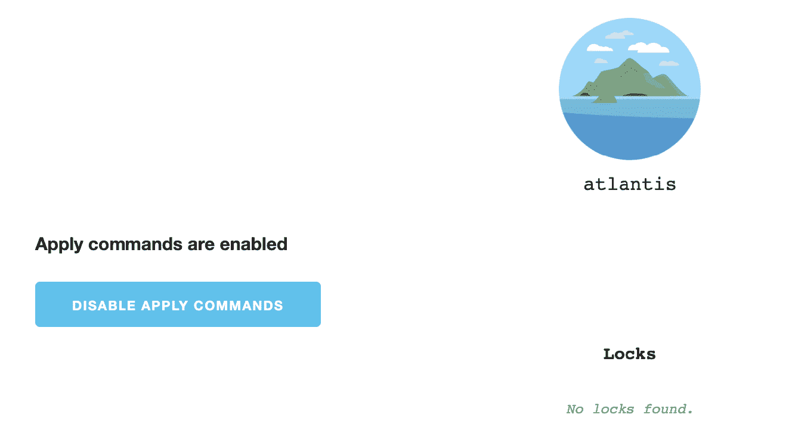
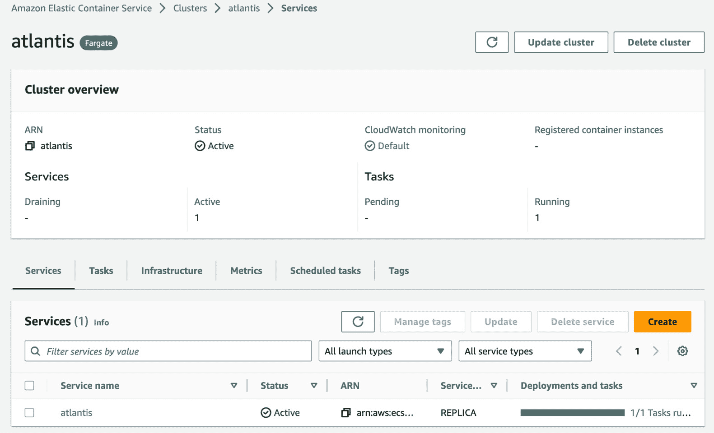
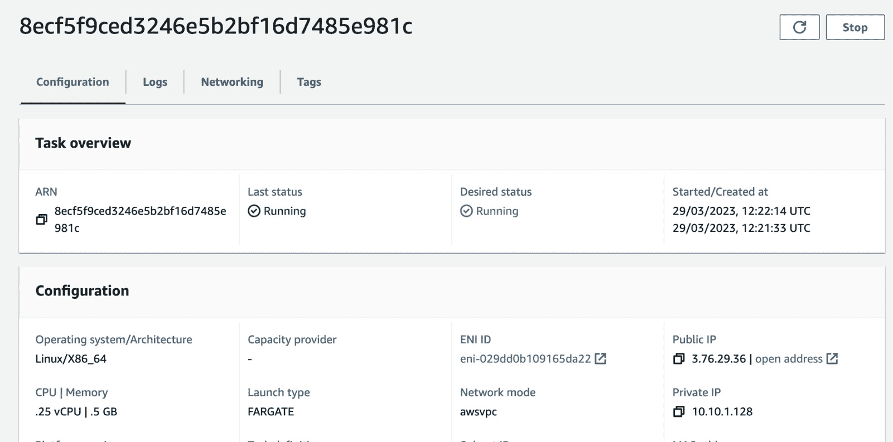
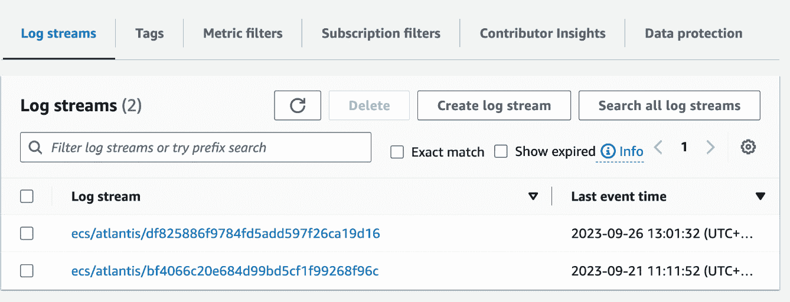
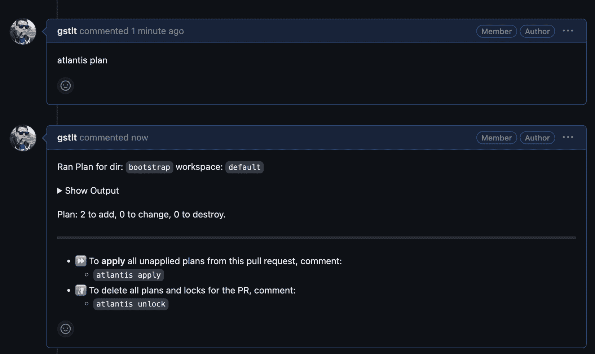

# 13

# 使用 Terraform、GitHub 和 Atlantis 实现 CI/CD

本章我们将在前几章的基础上，介绍**持续集成**（**CI**）和**持续部署**（**CD**）的管道。市场上有许多可用的 CI 和 CD 工具，包括开源和闭源工具、自托管和 **软件即服务**（**SaaS**）工具。我们将演示一个示例管道，从将源代码提交到存储 **Terraform** 代码的仓库，到在基础设施中应用更改。我们将自动完成这一过程，但会经过团队的审查。

在本章中，我们将覆盖以下主题：

+   什么是 CI/CD？

+   持续集成和部署你的基础设施

+   使用 Atlantis 实现 CI/CD

# 技术要求

本章需要以下内容：

+   一个 Linux 服务器

+   GitHub 或类似平台（GitLab 或 Bitbucket）上的免费账户

+   最新版本的 Terraform

+   **AWS CLI**

+   Git

# 什么是 CI/CD？

CI/CD 是一套实践、工具和流程，帮助软件开发团队自动化构建、测试和部署应用程序，从而更频繁地发布软件，并且更有信心其质量。

**持续集成**（**CI**）是一种实践，开发人员定期将代码更改集成到代码仓库中，每次集成都触发自动构建和测试过程。这有助于尽早发现错误，并确保应用程序可以可靠地构建和测试。

例如，使用 **Docker**，开发人员可以设置一个 **CI 管道**，该管道在每次将更改推送到代码仓库时自动构建和测试应用程序。管道可以包括构建 Docker 镜像、运行自动化测试以及将镜像发布到 Docker 仓库的步骤。

持续交付是指在成功集成过程后，使软件可以随时进行部署的实践。例如，使用 Docker 镜像，交付过程是将镜像推送到 Docker 仓库，之后可以由部署管道提取。

最后，**持续部署**（**CD**）是将经过测试和验证的持续交付过程代码工件（如 Docker 镜像、Java JAR 文件、ZIP 压缩包等）自动部署到生产环境中的实践。这样消除了部署过程中的人工干预需求。

让我们来看一下几种常见的部署策略：

+   **滚动部署**：这种策略涉及一次只将更改部署到一部分服务器，逐步将更改推广到整个基础设施。这使得团队能够监控更改，并在出现问题时迅速回滚。

+   **蓝绿部署**：在这种策略中，设置两个相同的生产环境，一个处于激活状态（蓝色），另一个处于非激活状态（绿色）。代码变更被部署到非激活环境，并在切换流量到新环境之前进行测试。这种方式可以实现零停机部署。

+   **金丝雀部署**：这种策略涉及将变更部署到一小部分用户，并保持大多数用户使用当前版本。这样，团队可以监控这些变更并收集反馈，在将这些变更推广到所有用户之前，进行充分测试。

+   **功能开关/特性开关**：通过这种策略，变更被部署到生产环境，但会被隐藏在功能开关后面。这个开关随后会逐步对特定用户或环境启用，允许团队在将新功能提供给所有人之前，控制功能的发布并收集反馈。

所有这些策略都可以通过 **CD 工具** 来实现自动化，如 **Jenkins**、**CircleCI**、**GitHub** 和 **GitLab Actions**、**Travis CI** 等众多工具。

在讨论应用程序的部署时，我们至少需要提到 **GitOps**。GitOps 是一种新的基础设施和应用程序部署方法，它使用 **Git** 作为声明性基础设施和应用程序规格的唯一真理来源。其核心思想是在 Git 仓库中定义基础设施和应用程序的期望状态，并使用 GitOps 工具自动将这些变更应用到目标环境。

在 GitOps 中，对基础设施或应用程序的每一次更改都是通过 Git 提交来完成的，这会触发一个流水线，将这些更改应用到目标环境。这提供了完整的变更审计跟踪，并确保基础设施始终处于期望的状态。

一些有助于启用 GitOps 的工具包括以下几种：

+   **FluxCD**：这是一个流行的 GitOps 工具，可以通过 Git 作为唯一的真理来源，自动化应用程序和基础设施的部署和扩展。它与 **Kubernetes**、**Helm** 和其他工具集成，提供完整的 GitOps 工作流。

+   **ArgoCD**：这是另一款流行的 GitOps 工具，使用 Git 作为真理来源来部署和管理应用程序和基础设施。它提供基于网页的 UI 和 **CLI** 来管理 GitOps 流水线，并与 Kubernetes、Helm 以及其他工具集成。

+   **Jenkins X**：这是一个包含 GitOps 工作流的 CI/CD 平台，用于构建、测试和将应用程序部署到 Kubernetes 集群。它利用 GitOps 来管理整个流水线，从源代码到生产环境的部署。

既然我们已经了解了 CI/CD 的概念，接下来我们可以探索一些工具，这些工具可以用来构建这样的流水线。在下一节中，我们将为您提供一些流水线示例，包含克隆最新版本的代码库、构建 Docker 镜像以及运行一些测试。

## CI/CD 流水线示例

让我们看一些自动化流水线的示例，这些流水线将我们的 Terraform 更改应用到不同的 CD 工具中。

### Jenkins

Jenkins 是最流行的开源 CI/CD 工具之一。它从点击式配置转变为在用户批准更改后运行`apply`：

```
pipeline {
  agent any
  environment {
    AWS_ACCESS_KEY_ID = credentials('aws-key-id')
    AWS_SECRET_ACCESS_KEY = credentials('aws-secret-key')
  }
```

上述代码开启了一个新的流水线定义。它被设置为在任何可用的 Jenkins 代理上运行。接下来，我们设置了将在该流水线中使用的环境变量。这些环境变量的文本是从`aws-key-id`和`aws-secret-key` Jenkins 凭证中提取的。在运行该流水线之前，这些凭证需要被定义。

接下来，我们将在`stages`块中定义每个步骤的流水线：

```
  stages {
    stage('Checkout') {
        steps {
            checkout scm
        }
    }
```

首先，我们将克隆我们的 Git 仓库；执行此操作的步骤是`checkout scm`。URL 将在 Jenkins UI 中直接配置：

```
    stage('TF Plan') {
        steps {
            dir('terraform') {
                sh 'terraform init'
                sh 'terraform plan -out terraform.tfplan'
            }
       }
     }
```

接下来，我们将运行`terraform init`来初始化 Terraform 环境。在这里，我们运行计划并将输出保存到`terraform.tfplan`文件中，最后一步将使用此文件运行`apply`：

```
    stage('Approval') {
        steps {
            script {
                def userInput = input(id: 'confirm', message: 'Run apply?', parameters: [ [$class: 'BooleanParameterDefinition', defaultValue: false, description: 'Running apply', name: 'confirm'] ])
            }
        }
    }
```

这个步骤定义了用户输入。我们需要在审查计划的输出后通过运行`apply`来确认这一点。我们将默认值定义为`false`。流水线将在此步骤等待您的输入：

```
    stage('TF Apply') {
        steps {
            dir('terraform') {
                sh 'terraform apply -auto-approve -input=false terraform.tfplan'
                sh 'rm -f terraform.tfplan'
            }
        }
    }
  }
}
```

最后，如果您已确认流水线将运行`apply`而无需进一步的用户输入（`-input=false`选项），并且`apply`运行没有任何错误，它将删除在计划步骤中创建的`terraform.tfplan`文件。

### GitHub Actions 基础

有可能创建一个类似的流水线，使用`workflow_dispatch`选项，但它会在 Action 运行之前要求用户输入（请参阅官方文档作为参考：[`github.blog/changelog/2021-11-10-github-actions-input-types-for-manual-workflows/`](https://github.blog/changelog/2021-11-10-github-actions-input-types-for-manual-workflows/)）。因此，我们改为创建一个将运行`plan`和`apply`的 Action：

```
name: Terraform Apply
on:
  push:
    branches: [ main ]
```

上述代码定义了 GitHub Action 将仅在更改主分支时触发：

```
env:
  AWS_ACCESS_KEY_ID: ${{ secrets.AWS_ACCESS_KEY_ID }}
  AWS_SECRET_ACCESS_KEY: ${{ secrets.AWS_SECRET_ACCESS_KEY }}
```

在这里，我们以类似于 Jenkins 流水线的方式定义了环境变量。AWS 的访问密钥和密钥从存储在 GitHub 中的秘密中提取，这些秘密需要我们事先添加。如果我们的 GitHub 运行器在 AWS 环境中运行或我们使用 GitHub OpenID Connect，则无需此操作。您可以通过查看 GitHub 文档了解后者：[`docs.github.com/en/actions/deployment/security-hardening-your-deployments/configuring-openid-connect-in-amazon-web-services`](https://docs.github.com/en/actions/deployment/security-hardening-your-deployments/configuring-openid-connect-in-amazon-web-services)。

接下来，我们可以在`jobs`块中定义 GitHub Action 的步骤：

```
jobs:
  terraform_apply:
    runs-on: ubuntu-latest
```

在这里，我们定义了一个名为`terraform_apply`的作业，它将在 GitHub Actions 中可用的最新版本的 Ubuntu 运行器上运行：

```
    steps:
    - name: Checkout code
      uses: actions/checkout@v2
```

该步骤检出代码。我们使用 GitHub 中可用的预定义 Action，而不是创建一个运行 Git 命令行的脚本。它将执行的确切代码可在[`github.com/actions/checkout`](https://github.com/actions/checkout)找到：

```
    - name: Setup Terraform
      uses: hashicorp/setup-terraform@v1
```

`Setup Terraform`步骤将为我们下载 Terraform。默认情况下，它将下载最新的可用版本，但如果需要，我们可以固定某个特定版本。该步骤的代码可在[`github.com/hashicorp/setup-terraform`](https://github.com/hashicorp/setup-terraform)找到：

```
    - name: Terraform Plan
      working-directory: terraform/
      run: |
        terraform init
        terraform plan -out terraform.tfplan
```

在`Terraform Plan`步骤中，我们初始化 Terraform 并以与 Jenkins 管道相同的方式运行计划：

```
    - name: Terraform Apply
      working-directory: terraform/
      run: |
        terraform apply -auto-approve –input=false terraform.tfplan
        rm -f terraform.tfplan
```

最后，`Terraform Apply`步骤将从之前保存的 Terraform 计划文件`terraform.tfplan`中应用基础设施变更，并删除计划文件。

如果您希望创建一段可以在任何 CI/CD 工具中工作的更强大的代码，可以创建一个**Bash 脚本**来完成繁重的工作。使用 Bash 脚本，您还可以在运行计划之前嵌入一些测试。以下是一个示例 Bash 脚本，它将为您运行 Terraform 计划并应用它：

```
#!/usr/bin/env bash
set -u
set -e
```

在这里，我们将 Bash 设置为运行此脚本的默认 shell。在接下来的几行中，我们将修改脚本的默认设置，使其在遇到任何未绑定的变量或错误时停止执行：

```
# Check if Terraform binary is in PATH
if command -v terraform &> /dev/null; then
  TERRAFORM_BIN="$(command -v terraform)"
else
  echo "Terraform not installed?"
  exit 1
fi
```

这个代码块检查系统中是否可用 Terraform，并将其完整路径保存到`TERRAFORM_BIN`变量中，我们稍后将使用它：

```
# Init terraform backend
$TERRAFORM_BIN init -input=false
```

在运行计划之前，初始化 Terraform 环境：

```
# Plan changes
echo "Running plan..."
$TERRAFORM_BIN plan -input=false -out=./terraform.tfplan
```

运行`plan`并将其保存到文件中以供后续使用：

```
echo "Running Terraform now"
if $TERRAFORM_BIN apply -input=false ./terraform.tfplan; then
    echo "Terraform finished successfully"
    RETCODE=0
else
    echo "Failed!"    fi
fi
```

上面的代码块执行`Terraform apply`并检查命令的返回代码。它还会显示相应的信息。

其他主要的 CI/CD 解决方案使用类似的方法。最大的区别在于 Jenkins、企业工具和开源解决方案之间，其中**YAML**配置最为常见。在下一节中，我们将更深入地探讨管道的每个阶段，重点关注 Terraform 的集成测试以及基础设施变更的部署。

# 持续集成和部署您的基础设施

测试应用程序代码现在已经成为事实上的标准，特别是在**测试驱动开发**（**TDD**）被采纳之后。TDD 是一种软件开发过程，在这个过程中，开发人员在编写代码之前先编写自动化测试。

这些测试最初是故意失败的，开发人员随后编写代码使其通过。代码会不断重构，以确保高效、可维护，并且能够通过所有测试。这种方法有助于减少漏洞并提高软件的可靠性。

测试基础设施并不像看起来那么简单，因为很难在不实际启动实例的情况下检查 Amazon **弹性计算云**（**EC2**）是否会成功启动。虽然可以模拟对 AWS 的 **API** 调用，但这并不能保证实际的 API 会返回与测试代码相同的结果。使用 AWS 时，这也意味着测试会很慢（我们需要等待该 EC2 实例启动），并且可能会产生额外的云端费用。

有多个基础设施测试工具，既有与 Terraform 集成的，也有第三方软件（这也是开源软件）。

## 集成测试

我们在 CI 流水线中可以运行多种基本测试。我们可以检测实际代码与云端运行代码之间的偏差，我们可以根据推荐的格式对代码进行 lint 检查，还可以测试代码是否符合我们的合规政策。我们还可以从 Terraform 代码中估算 AWS 成本。更复杂且耗时的过程包括单元测试和代码的端到端测试。让我们来看一下在流水线中可以使用的可用工具。

我们可以从一开始运行的大多数基本测试仅涉及运行 `terraform validate` 和 `terraform fmt`。前者将检查 Terraform 代码的语法是否有效（意味着资源和/或变量没有拼写错误、所有必需的变量都存在等）。`fmt` 检查将根据 Terraform 标准更新代码的格式，这意味着所有多余的空格将被删除，或者某些空格可能会被添加以对齐 `=` 符号以增强可读性。这对于更简单的基础设施来说可能已经足够，我们建议从一开始就添加这些测试，因为这样做非常简单。你可以重用我们之前提供的代码片段来启动你现有代码的过程。

### 基础设施成本

基础设施成本不是你可以在测试流水线中运行的功能性、静态或单元测试。虽然监控这一方面对你的基础设施非常有用，但你的经理也会很高兴知道 AWS 预算是否符合预测。

**Infracost.io** 是一个云成本估算工具，允许你通过提供实时的云资源成本分析来监控和管理基础设施成本。使用 Infracost.io，你可以估算基础设施变更的成本，并在开发周期的每个阶段提供成本反馈，避免任何意外的费用。

将 Infracost.io 集成到 GitHub Actions 中是一个简单的过程，包括创建一个 Infracost.io 账户并生成一个 API 密钥，允许你访问成本估算数据。

接下来，你需要在本地机器上安装 Infracost.io 的命令行工具（CLI）。CLI 是一个命令行工具，允许你计算和比较基础设施成本。

安装 CLI 后，您可以通过创建一个新的操作文件（例如 `.github/workflows/infracost.yml`）来将 Infracost.io 操作添加到您的 GitHub 工作流中。

在 Infracost.io 的操作文件中，您需要指定 Infracost.io API 密钥以及 Terraform 配置文件的路径：

```
name: Infracost
on:
  push:
    branches:
      - main
jobs:
  infracost:
    runs-on: ubuntu-latest
    steps:
      - name: Checkout code
        uses: actions/checkout@v2
      - name: Run Infracost
        uses: infracost/infracost-action@v1
        with:
          api_key: ${{ secrets.INFRACOST_API_KEY }}
          terraform_dir: ./terraform
```

最后，将更改提交并推送到您的 GitHub 仓库。每当新的 Terraform 配置文件被推送到仓库时，Infracost.io 操作会自动计算成本估算，并在 GitHub Actions 页面上提供反馈。

对于开源项目，Infracost 是免费的，但您也可以创建自己的服务来监控云成本。Infracost 的 GitHub 仓库可以在[`github.com/infracost/infracost`](https://github.com/infracost/infracost)找到。

通过将其集成到您的 CI 流水线中，您可以主动监控和管理基础设施成本，并在将其部署到云账户之前，基于这些信息做出有关基础设施更改的明智决策。

### 漂移测试

使用 Terraform 管理基础设施的一个挑战是确保基础设施的实际状态与 Terraform 配置文件中定义的期望状态相匹配。这就是 *漂移* 概念的由来。

**漂移**发生在基础设施的期望状态与实际状态之间存在差异时。例如，如果使用 Terraform 创建的资源被手动修改而不通过 Terraform，基础设施的实际状态将与 Terraform 配置文件中定义的期望状态不同。这可能导致基础设施的不一致，并可能引发操作问题。

为了检测基础设施中的漂移，Terraform 提供了一个名为 `terraform plan` 的命令。当运行此命令时，Terraform 会将配置文件中定义的期望状态与基础设施的实际状态进行比较，并生成一份计划，列出将基础设施恢复到期望状态所需的更改。如果期望状态和实际状态之间存在任何差异，Terraform 会在计划输出中显示它们。

还可以使用第三方工具扩展 Terraform 的这一功能。其中一个工具就是 `Driftctl`。

`Driftctl` 是一个开源工具，帮助检测由 Terraform 管理的云基础设施中的漂移。它扫描基础设施资源的实际状态，并将其与 Terraform 配置文件中定义的期望状态进行比较，以识别任何差异或不一致。`Driftctl` 支持广泛的云服务提供商，包括 AWS、**Google Cloud**、**Microsoft Azure** 和 Kubernetes。

`Driftctl` 可以以多种方式使用来检测基础设施中的漂移。它可以与 CI/CD 流水线集成，自动检测漂移并触发修正措施。也可以手动运行以按需检查漂移。

这是一个使用`Driftctl`工具来检测基础设施漂移的 GitHub pipeline 示例：

```
name: Detect Infrastructure Drift
on:
  push:
    branches:
      - main
```

上述代码表明，此 pipeline 将仅在`main`分支上运行。

在这里，我们定义了一个名为`detect-drift`的作业，它将在最新的 Ubuntu Linux runner 上运行：

```
jobs:
  detect-drift:
    runs-on: ubuntu-latest
    steps:
    - name: Checkout code
      uses: actions/checkout@v2
```

接下来，我们开始定义 pipeline 中每个步骤要做的事情——首先，我们将使用一个预定义的动作，在 runner 上运行`git clone`：

```
    - name: Install Terraform
      run: |
        sudo apt-get update
        sudo apt-get install -y unzip
        curl -fsSL https://apt.releases.hashicorp.com/gpg | sudo apt-key add -
        sudo apt-add-repository "deb [arch=amd64] https://apt.releases.hashicorp.com $(lsb_release -cs) main"
        sudo apt-get update && sudo apt-get install terraform
```

接下来的步骤是定义一个 shell 脚本，用于从 HashiCorp 发布的公共仓库安装、解压并下载 Terraform：

```
    - name: Install Driftctl
      run: |
        curl https://github.com/cloudskiff/driftctl/releases/download/v0.8.2/driftctl_0.8.2_linux_amd64.tar.gz -sSLo driftctl.tar.gz
        tar -xzf driftctl.tar.gz
        sudo mv driftctl /usr/local/bin/
```

在这一步中，我们将通过从 GitHub 上的公共发布下载归档来安装`Driftctl`工具。我们将提取文件并将二进制文件移动到`/usr/local/bin`目录中：

```
    - name: Initialize Terraform
      run: terraform init
    - name: Check Terraform Configuration
      run: terraform validate
```

上述步骤仅涉及运行`terraform init`和`terraform validate`，以验证我们是否可以访问 Terraform 后端，以及我们打算在接下来的几步中检查的代码是否在语法上有效：

```
    - name: Detect Drift with Driftctl
      run: |
        driftctl scan –from tfstate://./terraform.tfstate –output json > drift.json
    - name: Upload Drift Report to GitHub
      uses: actions/upload-artifact@v2
      with:
        name: drift-report
        path: drift.json
```

最后两步是运行`Driftctl`工具，并将其发现结果保存在`driftctl.json`文件中，该文件将作为`drift-report`上传到 GitHub 工件中。

总结一下，这个 pipeline 在`main`分支上运行，并执行以下步骤：

+   从 GitHub 仓库检出代码。

+   安装`terraform`和`driftctl`。

+   初始化 Terraform 并验证 Terraform 配置文件。

+   使用`driftctl`扫描基础设施资源的实际状态，并将其与 Terraform 配置文件中定义的期望状态进行比较，以检测任何漂移。此扫描的输出将保存到名为`drift.json`的 JSON 文件中。

+   将`drift.json`文件作为工件上传到 GitHub，供后续分析使用。

此外，这个 pipeline 还可以根据特定需求进行自定义，例如集成到 CI/CD pipeline 中或按计划定期检查基础设施中的漂移。

每次 pipeline 运行时都需要安装`driftctl`和`terraform`并不是我们期望的做法，因此我们建议您准备一个包含这些工具预安装的 Docker 镜像，并使用该镜像。这还将提升您的安全性。

您可以在网站[`driftctl.com/`](https://driftctl.com/)上找到有关该项目的更多信息。

### 安全测试

测试基础设施的安全性是维护安全稳定系统的一个重要方面。由于现代基础设施通常作为代码进行定义和管理，因此有必要像测试其他代码一样对其进行测试。**基础设施即代码**（**IaC**）测试有助于发现安全漏洞、配置问题以及可能导致系统被攻破的其他缺陷。

有几种自动化工具可以帮助进行基础设施安全测试。这些工具可以帮助识别潜在的安全问题，例如配置错误的安全组、未使用的安全规则和不安全的敏感数据。

我们可以使用几个工具来作为 CI 管道外的单独过程进行安全性测试：

+   **Prowler**：这是一个开源工具，用于扫描 AWS 基础设施中的安全漏洞。它可以检查诸如 AWS **身份与访问管理**（**IAM**）配置错误、开放的安全组和**S3 存储桶**权限问题等。

+   **CloudFormation Guard**：这是一个工具，用于根据一组预定义的安全规则验证**AWS CloudFormation**模板。它可以帮助识别诸如开放安全组、未使用的 IAM 策略和未加密的 S3 存储桶等问题。

+   **OpenSCAP**：这是一个为基于 Linux 的基础设施提供自动化安全合规性测试的工具。它可以扫描系统是否符合各种安全标准，如**支付卡行业数据安全标准**（**PCI DSS**）或**国家标准与技术研究院特别出版物 800-53**（**NIST** **SP 800-53**）。

+   **InSpec**：这是另一个开源测试框架，可用于测试基础设施的合规性和安全性。它内置支持多种平台，并可以用于针对不同的安全标准进行测试，例如**健康保险流通与责任法案**（**HIPAA**）和**互联网安全中心**（**CIS**）。

在这里，我们重点关注在持续集成（CI）中集成一些安全测试。我们可以在此处集成的工具如下：

+   **tfsec** 是一个开源的 Terraform 代码静态分析工具。它扫描 Terraform 配置，以检测潜在的安全问题，并提供修复建议。它内置支持多种云服务提供商，可以帮助识别诸如弱身份验证、不安全的网络配置和未加密的数据存储等问题。其 GitHub 仓库可以在 [`github.com/aquasecurity/tfsec`](https://github.com/aquasecurity/tfsec) 找到。

+   **Terrascan** 是一个用于基础设施即代码（IaC）文件的静态代码分析开源工具。它支持多种 IaC 文件格式，包括 Terraform、Kubernetes YAML 和 Helm 图表，并扫描这些文件中的安全漏洞、合规性违规和其他问题。Terrascan 可以集成到 CI/CD 管道中，并帮助确保基础设施部署是安全的，并符合行业标准。其 GitHub 仓库可以在 [`github.com/tenable/terrascan`](https://github.com/tenable/terrascan) 找到。

+   **CloudQuery** 是一个开源工具，使用户能够在不同的云平台上测试安全策略和合规性，包括 AWS、**Google Cloud Platform**（**GCP**）和 Microsoft Azure。它提供了统一的查询语言和接口来访问云资源，允许用户分析配置并检测潜在的安全漏洞。CloudQuery 集成了各种 CI/CD 流水线，使自动化安全策略和合规性测试变得更加容易。用户还可以根据他们的特定需求和标准自定义查询和规则。你可以在他们的博客文章中阅读更多相关内容：[`www.cloudquery.io/how-to-guides/open-source-cspm`](https://www.cloudquery.io/how-to-guides/open-source-cspm)。

让我们来看一下这个示例 GitHub 流水线，它集成了 `terrascan` 工具：

```
name: Terrascan Scan
on: [push]
jobs:
  scan:
    runs-on: ubuntu-latest
    steps:
    - name: Checkout code
      uses: actions/checkout@v2
    - name: Install Terrascan
      run: |
        wget https://github.com/accurics/terrascan/releases/latest/download/terrascan_linux_amd64.zip
        unzip terrascan_linux_amd64.zip
        rm -f terrascan_linux_amd64.zip
        sudo mv terrascan /usr/local/bin/
    - name: Run Terrascan
      run: |
        terrascan scan -f ./path/to/infrastructure/code
```

在这个工作流中，`on: [push]` 行指定每当有更改推送到仓库时，工作流应该被触发。

`jobs` 部分包含一个名为 `scan` 的单个作业。`runs-on` 键指定该作业应在 Ubuntu 机器上运行。

`steps` 部分包含三个步骤：

1.  它使用 `actions/checkout` 操作从仓库中检出代码。

1.  它使用 `wget` 和 `unzip` 命令在机器上下载并安装 Terrascan。请注意，这一步假设你在 Linux 机器上运行工作流。

1.  它运行 Terrascan 来扫描基础设施代码。你需要将 `./path/to/infrastructure/code` 替换为你实际的基础设施代码路径。

一旦你创建了这个工作流并将其推送到你的 GitHub 仓库，GitHub Actions 会在每次有更改推送到仓库时自动运行该工作流。你可以在工作流日志中查看 Terrascan 扫描的结果。

让我们继续讨论 **基础设施单元测试**。目前通常有两种选择：直接测试 **HCL** 代码时使用 **Terratest**，或者如果你想使用更先进的编程语言来维护你的基础设施即代码（IaC），可以选择 **CDKTF**/**Pulumi**。

### 使用 Terratest 进行测试

Terratest 是一个开源测试框架，用于基础设施代码的测试，包括 Terraform 的 HCL 代码。它于 2017 年由专注于基础设施自动化的公司 **Gruntwork** 发布，该公司还提供一套预构建的基础设施模块，称为 Gruntwork IaC 库。

Terratest 旨在通过提供一套辅助函数和库来简化基础设施代码的测试，使用户能够编写使用 **Go**（一种流行的基础设施自动化编程语言）编写的自动化测试。Terratest 不仅可以用于测试 Terraform 代码，还可以用于测试使用其他工具构建的基础设施，如 **Ansible**、**Packer** 和 **Docker**。

Terratest 的一个关键优势是，它允许开发人员在类似生产环境的环境中测试他们的基础设施代码，而无需专门的测试环境。这可以通过使用 Docker 和 Terraform 等工具来创建临时基础设施资源进行测试。

Terratest 还提供了一系列测试类型，包括 **单元测试**、**集成测试** 和 **端到端测试**，允许用户在不同的抽象层次测试他们的基础设施代码。这有助于确保在将代码部署到生产环境之前，进行充分的测试，减少停机或其他问题的风险。

测试我们在上一章中创建的 `aws_instance` 资源的示例如下所示：

```
package test
import (
  "testing"
  "github.com/gruntwork-io/terratest/modules/aws"
  "github.com/gruntwork-io/terratest/modules/terraform"
  "github.com/stretchr/testify/assert"
)
func TestAwsInstance(t *testing.T) {
  terraformOptions := &terraform.Options{
    TerraformDir: "../path/to/terraform/module",
  }
  defer terraform.Destroy(t, terraformOptions)
  terraform.InitAndApply(t, terraformOptions)
  instanceID := terraform.Output(t, terraformOptions, "aws_instance_id")
  instance := aws.GetEc2Instance(t, "us-west-2", instanceID)
  assert.Equal(t, "t3.micro", instance.InstanceType)
  assert.Equal(t, "TestInstance", instance.Tags["Name"])
}
```

在此示例中，我们首先定义一个名为 `TestAwsInstance` 的测试函数，使用标准的 `terraformOptions` 对象，该对象指定我们的 Terraform 模块的目录。

然后，我们使用 `terraform.InitAndApply` 函数来初始化和应用 Terraform 配置，创建 **AWS EC2** 实例资源。

接下来，我们使用 **Terratest AWS 模块** 中的 `aws.GetEc2Instance` 函数，通过实例 ID 获取有关已创建实例的信息。

最后，我们使用 `testify` 包中的 `assert` 库编写断言，验证实例的属性，例如其实例类型和标签。如果任何断言失败，测试将失败。

要运行此示例，您需要确保已安装 Terratest 和 AWS Go 模块，并在您的环境中设置了有效的 AWS 凭据。

### 使用 CDKTF 进行单元测试

**AWS Cloud Development Kit for Terraform** (**CDKTF**) 是一个开源框架，允许开发人员使用编程语言（如**TypeScript**、**Python** 和 **C#**）在 Terraform 支持的任何云解决方案中定义基础设施和服务。它通过使用高级面向对象抽象来实现基础设施即代码（IaC）的创建，减少了编写和维护基础设施代码的复杂性。

CDKTF 最初于 2020 年 3 月发布，是 AWS 和 Terraform 背后的公司 HashiCorp 之间的合作。CDKTF 融合了两者的优势：现代编程语言的熟悉性和表现力，以及 Terraform 的声明式、多云能力。

TypeScript 是与 CDKTF 一起使用的最流行的语言，它提供了一个类型安全的开发体验，具有静态类型检查、代码补全和重构等功能。

作为示例，让我们重用 *第十二章* 中的 Terraform 代码：

```
resource "aws_instance" "vm_example" {
  ami           = "ami-830c94e3"
  instance_type = "t2.micro"
  tags = {
    Name = "DevOpsGuideTerraformExample"
}
```

在 Python 中，CDKTF 的等效代码如下所示：

```
#!/usr/bin/env python
from constructs import Construct
from cdktf import App, TerraformStack
from cdktf_cdktf_provider_aws.provider import AwsProvider
from cdktf_cdktf_provider_aws.instance import Instance
from cdktf_cdktf_provider_aws.data_aws_ami import DataAwsAmi, DataAwsAmiFilter
```

这里，我们导入了所有必需的模块。脚本的第一行表示该脚本的默认解释器应该是系统中可用的 Python 解释器：

```
class MyStack(TerraformStack):
    def __init__(self, scope: Construct, id: str):
        super().__init__(scope, id)
        AwsProvider(self, "AWS", region="eu-central-1")
```

在前述代码行中，我们正在配置一个默认提供程序来使用 `eu-central-1` 区域。接下来让我们看看：

```
        ec2_instance = Instance(
            self,
            id_="ec2instanceName",
            instance_type="t2.micro"
            ami="ami-830c94e3",
        )
app = App()
MyStack(app, "ec2instance")
app.synth()
```

以下是一个使用 `unittest` Python 模块并遵循 Python 中 TDD 通常语法的单元测试示例：

```
 import unittest
from your_cdk_module import MyStack  # Replace 'your_cdk_module' with the actual module name containing the MyStack class
class TestMyStack(unittest.TestCase):
    def test_ec2_instance(self):
        app = App()
        stack = MyStack(app, "test-stack")
        # Get the EC2 instance resource created in the stack
        ec2_instance = stack.node.try_find_child("ec2instance")
        # Assert EC2 instance properties
        self.assertEqual(ec2_instance.ami, "ubuntuAMI")
        self.assertEqual(ec2_instance.instance_type, "t3.micro")
        self.assertEqual(ec2_instance.key_name, "admin_key")
        self.assertEqual(ec2_instance.subnet_id, "subnet-1234567890")
if __name__ == '__main__':
    unittest.main()
```

如前所述，不幸的是，实例必须在 AWS 中运行，才能测试我们是否拥有通过 CDKTF 获取的期望标签和其他属性。该实例由 `setUp()` 函数创建，并通过 `tearDown()` 函数终止。在这里，我们使用的是一个 **免费套餐适用** 的小型实例，但对于更大的实例，会产生一定的费用。

### 实验性 Terraform 测试模块

最后但非常有趣的选择是使用测试 Terraform 模块。这个模块允许你编写 Terraform（HCL）代码测试，也是在相同的语言中进行测试。这将可能大大简化测试编写，因为我们之前介绍的现有选项需要使用 Golang 或 CTKTF 来编写测试。

在撰写本文时，该模块被认为是高度实验性的，但值得关注它未来的发展。

该模块的网站可以在 [`developer.hashicorp.com/terraform/language/modules/testing-experiment`](https://developer.hashicorp.com/terraform/language/modules/testing-experiment) 找到。

### 其他值得一提的集成工具

市面上有许多其他测试工具，随着你阅读本文，更多工具还在开发中。以下是一些值得一提的工具清单，由于篇幅限制，无法对其进行详细描述：

+   **Checkov** (https://www.checkov.io/)：这是一个开源的 IaC 静态分析工具，帮助开发人员和 **DevOps** 团队在开发生命周期早期识别并修复安全和合规性问题。

+   **Super-linter** (https://github.com/github/super-linter)：这是一个开源的代码检查工具，能够自动检测和标记各种编程语言中的问题，帮助维护一致的代码质量。

+   **Trivy** (https://github.com/aquasecurity/trivy)：这是一个容器镜像漏洞扫描工具，帮助开发人员和 DevOps 团队识别并修复其容器化应用中的漏洞。

+   **Kitchen-Terraform** (https://github.com/newcontext-oss/kitchen-terraform)：此工具是 Test Kitchen 插件集合的一部分，允许系统利用 **Test Kitchen** 来应用和验证 Terraform 配置，并使用 **InSpec** 控制。

+   **RSpec-Terraform** (https://github.com/bsnape/rspec-terraform)：此工具为 Terraform 模块提供 RSpec 测试。RSpec 是一个 **行为驱动开发**（**BDD**）测试框架，专为 **Ruby** 设计，使开发人员能够用 **领域特定语言**（**DSL**）编写富有表现力且易读的测试。

+   **Terraform-Compliance** (https://github.com/terraform-compliance/cli)：这是一个专为 Terraform 文件设计的 BDD 测试工具。

+   **Clarity** (https://github.com/xchapter7x/clarity)：这是一个声明式的 Terraform 测试框架，专门用于单元测试。

总结来说，我们有很多可用的测试选项。对于一些人来说，这可能会感到不知所措。Terraform 代码的测试仍在开发中，类似于我们提到的其他 IaC 解决方案。在实现 CI 流水线时，最好一开始专注于简单的任务（格式检查、运行`terraform plan`等），然后在开发过程中逐步增加更多测试。我们意识到这是一个艰巨的任务，但我们相信，投资这些工作将帮助我们以更高的信心进行基础设施更改，并避免无意的停机。

在下一节中，我们将重点介绍各种 CD 解决方案，包括 SaaS 和自托管版本。

## 部署

`terraform apply`。这可以通过一个简单的 Bash 脚本自动完成，但难点在于如何将其集成到 CD 工具中，以确保我们不会无意中删除数据，并且可以有信心地执行。假设我们已经完成了出色的集成测试，并且有足够的信心在没有进一步用户交互的情况下执行它，我们可以启用自动运行。

之前，我们展示了使用 Jenkins、GitHub Actions，甚至一个可以嵌入到流程中的 Bash 脚本来自动化这一过程的示例。我们可以成功地使用这些解决方案将更改部署到基础设施中；然而，已经有专门的解决方案来完成这项工作。让我们从 Terraform 背后的公司——HashiCorp 的 SaaS 产品开始，来看看最流行的几种。

### HashiCorp Cloud 与 Terraform Cloud

HashiCorp 是一家提供各种基础设施自动化和管理工具的软件公司。HashiCorp 提供的两个最受欢迎的产品是**HashiCorp Cloud**和**Terraform Cloud**。

HashiCorp Cloud 是一个基于云的服务，提供一套用于基础设施自动化和管理的工具。它包括 HashiCorp 的流行工具，如 Terraform、**Vault**、**Consul**和**Nomad**。使用 HashiCorp Cloud，用户可以使用与本地相同的工具来创建和管理他们的基础设施。

另一方面，Terraform Cloud 是 HashiCorp 专门推出的一款产品，专注于 IaC 工具 Terraform。Terraform Cloud 为团队提供了一个集中的地方，协作管理基础设施代码、存储配置状态以及自动化基础设施工作流。它提供了多个功能，如工作区管理、版本控制和协作工具，使团队更容易在大规模基础设施项目中协作。

HashiCorp Cloud 与 Terraform Cloud 之间的主要区别在于，前者提供一整套用于基础设施自动化和管理的工具，而后者则专注于 Terraform。

### Scalr

**Scalr** 是一个云管理平台，为云基础架构的自动化和管理提供企业级解决方案。它由 Sebastian Stadil 于 2007 年创立，旨在简化管理多个云环境的流程。

Scalr 是一个多云管理平台。它有两种版本：商业版作为 SaaS 解决方案由母公司托管，开源版则可由您自行部署。它可以运行您的 Terraform 代码，但它还具有更多功能，例如成本分析，用于展示您正在部署的基础设施的云提供商的预估账单。它配备了 Web UI，抽象了在处理 IaC 时需要完成的大部分工作。正如我们之前提到的，它是一个多云解决方案，并且配备了集中式的**单点登录**（**SSO**），可让您从一个地方查看和管理所有的云环境。它提供角色、模块注册表等功能。如果您需要的不仅仅是一个集中化的 IaC 工具，那么它是一个很好的选择。

### Spacelift

**Spacelift** 是一个云原生的 IaC 平台，帮助开发团队通过 Terraform、Pulumi 或**CloudFormation**自动化和管理其基础架构。它还支持使用**kubectl**和**Ansible CaaC**自动化 Kubernetes。

该平台提供多种功能，如版本控制、自动化测试和持续交付，使团队能加快基础设施部署周期并降低错误风险。Spacelift 还提供实时监控和警报，帮助轻松识别和解决可能导致停机或影响用户体验的问题。

Spacelift 由一支经验丰富的 DevOps 和基础架构工程师团队于 2020 年创立，他们意识到需要更好的方式来管理 IaC。公司自那时以来迅速发展，吸引了来自医疗保健、金融和电子商务等各行业的客户。

官方网站位于 https://spacelift.com。

### Env0

**Env0** 是一个 SaaS 平台，使团队能够通过 Terraform 自动化其基础架构和应用程序交付工作流程。它由一支经验丰富的 DevOps 工程师团队于 2018 年创立，他们意识到需要一个简化且易于使用的解决方案来管理 IaC。

Env0 提供各种功能和集成，帮助团队管理其 Terraform 环境，包括自动环境配置、与流行的 CI/CD 工具（如 Jenkins 和**CircleCI**）集成，以及支持 AWS、Azure 和 Google Cloud 等多个云提供商。

作为一家私人公司，Env0 不公开其财务信息。然而，他们从风险投资公司获得了重要资金支持，包括 2020 年由 Boldstart Ventures 和 Grove Ventures 领投的 350 万美元种子轮融资。

Env0 迅速确立了自己作为管理 Terraform 环境和简化 DevOps 工作流的领先 SaaS 提供商，看起来在你的环境中是一个非常有趣的选择。

官方网站可以在[`www.env0.com/`](https://www.env0.com/)找到。

### Atlantis

**Atlantis**是一个开源项目，旨在通过提供简化的工作流来管理 Terraform 基础设施代码，帮助创建、审查和合并拉取请求。Atlantis 的首次发布是在 2018 年，随后在使用 Terraform 作为 IaC 工具的开发者和 DevOps 团队中获得了广泛的关注。

Atlantis 通过与现有的版本控制系统（如 GitHub 或 GitLab）集成来工作，持续监控包含 Terraform 代码更改的拉取请求。当新的拉取请求被打开时，Atlantis 会自动为这些更改创建一个新的环境，并在拉取请求中发布一个链接，指向该环境。这样，审阅者可以快速且轻松地在实时环境中查看更改并提供反馈。一旦更改被审阅并批准，Atlantis 可以自动合并拉取请求并将更改应用到目标基础设施中。

这个开源工具是我们将深入研究的对象。由于其源代码是免费的，你可以自己下载并将其部署到本地环境或公有云中。让我们在 AWS 中部署 Atlantis，并配置一个简单的基础设施来进行管理。

# 使用 Atlantis 进行 CI/CD

掌握 CI/CD（包括交付和部署）工具和原则的相关知识后，我们将使用 Git 和开源工具 Atlantis 创建一个 CI/CD 管道。我们将利用它自动测试并部署对 AWS 基础设施的更改，并在此过程中进行基本测试。

## 将 Atlantis 部署到 AWS

我们将使用 Anton Bobenko 在 GitHub 上的`terraform-aws-modules`项目中创建的 Terraform 模块。以下是该模块的 Terraform 注册表链接：[`registry.terraform.io/modules/terraform-aws-modules/atlantis/aws/latest`](https://registry.terraform.io/modules/terraform-aws-modules/atlantis/aws/latest)。

你可以通过两种方式使用这个模块。第一种方式是最常见的，将其用于你现有的 Terraform 代码中，将其部署到 AWS。第二种方式是我们在这个演示中将要使用的，即将这个模块作为独立项目来使用。该模块还会在**eu-west** AWS 区域为你创建一个新的**虚拟私有云**（**VPC**），Atlantis 将在 AWS ECS 服务中运行。这将产生一些基础设施费用。

为了做到这一点，我们需要克隆 GitHub 仓库：

```
git clone git@github.com:terraform-aws-modules/terraform-aws-atlantis.git
Cloning into 'terraform-aws-atlantis'...
Host key fingerprint is SHA256:+Aze234876JhhddE
remote: Enumerating objects: 1401, done.
remote: Counting objects: 100% (110/110), done.
remote: Compressing objects: 100% (101/101), done.
remote: Total 1400 (delta 71), reused 81 (delta 52), pack-reused 1282
Receiving objects: 100% (1401/1401), 433.19 KiB | 1.12 MiB/s, done.
Resolving deltas: 100% (899/899), done.
```

接下来，我们需要创建一个 Terraform 变量文件。我们在`terraform.tfvars.sample`文件中有一些模板代码。让我们复制它：

```
cp terraform.tfvars.sample terraform.tfvars
```

在继续之前，确保你已经创建了一个 GitHub 仓库来存放所有的 Terraform 代码。我们将在部署 Atlantis 时为这个仓库创建一个 Webhook，但你需要在应用之前将它添加到`terraform.tfvars`文件中。

让我们来看一下在`terraform.tfvars`文件中可以更改的变量：

```
cidr = "10.10.0.0/16"
azs = ["eu-west-1a", "eu-west-1b"]
private_subnets = ["10.10.1.0/24", "10.10.2.0/24"]
public_subnets = ["10.10.11.0/24", "10.10.12.0/24"]
route53_zone_name = "example.com"
ecs_service_assign_public_ip = true
atlantis_repo_allowlist = ["github.com/terraform-aws-modules/*"]
atlantis_github_user = ""
atlantis_github_user_token = ""
tags = {
  Name = "atlantis"
}
```

`atlantis_repo_allowlist`是你需要更新的第一个变量，它指定了 Atlantis 能够使用的仓库。确保它指向你的仓库。`route53_zone_name`也应更改为类似的内容，如`automation.yourorganisation.tld`。请注意，它需要是一个公共域名—GitHub 将使用它来发送 Webhook 到 Atlantis 以触发构建。你需要在 Terraform 代码中创建**Route53**托管 DNS 区域，或者使用 Web 控制台。

你还需要更新另外两个变量，分别是`atlantis_github_user`和`atlantis_github_user_token`。第一个变量不言而喻，第二个变量，你需要访问 GitHub 网站并生成你的**个人访问令牌**（**PAT**）。这将允许 Atlantis 访问你想使用的仓库。为此，你需要按照 GitHub 文档页面上的指南操作：[`docs.github.com/en/authentication/keeping-your-account-and-data-secure/creating-a-personal-access-token`](https://docs.github.com/en/authentication/keeping-your-account-and-data-secure/creating-a-personal-access-token)。

更新`terraform.tfvars`文件后，我们准备运行`terraform init`和`terraform plan`：

```
admin@myhome~/aws$ terraform init
Initializing modules...
# output truncated for readability- Installed hashicorp/random v3.4.3 (signed by HashiCorp)
Terraform has been successfully initialized!
```

Terraform 已经创建了一个名为`.terraform.lock.hcl`的锁文件，用于记录它所做的提供者选择。将此文件包含在你的版本控制仓库中，这样下次运行`terraform init`时，Terraform 会默认做出相同的选择。

现在，我们可以运行以下的`terraform` `plan`命令：

```
admin@myhome~/aws$ terraform plan
Terraform used the selected providers to generate the following execution plan. Resource actions are indicated with the following symbols:
  + create
 <= read (data resources)
Terraform will perform the following actions:
# Output truncated for readability
  # aws_cloudwatch_log_group.atlantis will be created
  + resource "aws_cloudwatch_log_group" "atlantis" {
      + arn               = (known after apply)
      + id                = (known after apply)
      + name              = "atlantis"
      + name_prefix       = (known after apply)
      + retention_in_days = 7
      + skip_destroy      = false
      + tags              = {
          + "Name" = "atlantis"
        }
      + tags_all          = {
          + "Name" = "atlantis"
        }
    }
# Removed some output for readability
Plan: 49 to add, 0 to change, 0 to destroy.
```

如果你看到类似的输出，你可以应用它。该模块还会返回关于已创建资源的大量信息，值得关注。

在运行`terraform apply`之后（这会花费几分钟），你将看到类似下面的输出：

```
Apply complete! Resources: 49 added, 0 changed, 0 destroyed.
Outputs:
alb_arn = "arn:aws:elasticloadbalancing:eu-central-1:673522028003:loadbalancer/app/atlantis/8e6a5c314c2936bb"
# Output truncated for readabilityatlantis_url = "https://atlantis.atlantis.devopsfury.com"
atlantis_url_events = "https://atlantis.atlantis.devopsfury.com/events"
public_subnet_ids = [
  "subnet-08a96bf6a15a65a20",
  "subnet-0bb98459f42567bdb",
]
webhook_secret = <sensitive>
```

如果你一切操作正确，你应该能够访问我们之前创建的[atlantis.automation.yourorganisation.tld](http://atlantis.automation.yourorganisation.tld)域名下的 Atlantis 网站。该模块已将所有必要的记录添加到 Route53 区域。

如果到目前为止一切顺利，当你访问[`atlantis.automation.yourorganisation.tld`](https://atlantis.automation.yourorganisation.tld)时，你将看到以下 Atlantis 面板：



图 13.1 – 使用 Terraform 模块成功部署后的 Atlantis 网站

在前述输出中标记为敏感的`webhook_secret`输出将用于在 GitHub 仓库端设置 Webhook。要查看它，你需要运行以下命令：

```
admin@myhome:~/aws$ terraform output webhook_secret
"bf3b20b285c91c741eeff34621215ce241cb62594298a4cec44a19ac3c70ad3333cc97d9e8b24c06909003e5a879683e4d07d29efa750c47cdbeef3779b3eaef"
```

我们也可以通过 Terraform 自动化这一过程，使用与 Atlantis 同一仓库中提供的模块。

这是模块的完整 URL：[`github.com/terraform-aws-modules/terraform-aws-atlantis/tree/master/examples/github-repository-webhook`](https://github.com/terraform-aws-modules/terraform-aws-atlantis/tree/master/examples/github-repository-webhook)。

或者，你可以通过访问 GitHub 网站并按照文档创建 Webhook 来手动进行测试：[`docs.github.com/en/webhooks-and-events/webhooks/creating-webhooks`](https://docs.github.com/en/webhooks-and-events/webhooks/creating-webhooks)。

记得使用 Terraform 自动生成的机密，该机密位于输出变量中——即`webhook_secret`。

创建 Webhook 的文档在 Atlantis 文档中也有很好的描述：[`www.runatlantis.io/docs/configuring-webhooks.xhtml#github-github-enterprise`](https://www.runatlantis.io/docs/configuring-webhooks.xhtml#github-github-enterprise)。

你可能会遇到 Atlantis 没有按预期启动，并且在访问网页面板时看到`HTTP 500 error`错误。为了排查与该服务相关的问题，例如 Atlantis 仍然不可用或对 GitHub webhook 响应错误，你可以进入 AWS 控制台，找到 ECS 服务。在这里，你应该能看到一个名为**atlantis**的集群。如果点击它，你将看到集群的配置和状态，如下图所示：



图 13.2 – Amazon Elastic Container Service (ECS) Atlantis 集群信息

如果你进入**任务**标签页（如前述截图所示），并点击任务 ID（例如，**8ecf5f9ced3246e5b2bf16d7485e981c**），你将看到以下信息：



图 13.3 – Atlantis ECS 集群内任务的详细信息

**日志**标签页将显示所有最近的事件。

你可以在**CloudWatch**服务中查看更详细的日志信息，进入**日志** | **日志组**部分并找到**atlantis**日志组。在这里，你可以看到包含任务所有日志的日志流。如果已经有多个日志流，你可以通过**任务 ID**快速跟踪正确的日志流：



图 13.4 – 包含运行 Atlantis 的 ECS 任务日志流的 CloudWatch 日志

如果到目前为止一切正常，我们准备测试 Atlantis 是否能运行`terraform plan`和`terraform apply`。让我们回到代码中。

## 使用 Atlantis 运行 Terraform

要执行 `terraform plan`，我们需要创建一个新的 `main.tf` 文件，内容如下：

```
# Configure the AWS Provider
provider "aws" {
  region = var.region
}
```

上述代码配置了 AWS 提供程序，以使用 `region` 变量中指定的区域。

这个 Terraform 代码块配置了所需的 Terraform 版本以及 Terraform 状态文件的位置。在这个示例中，我们使用的是本地存储，但在生产环境中，我们应该使用远程状态位置。

```
terraform {
  required_version = ">=1.0"
  backend "local" {
    path = "tfstate/terraform.local-tfstate"
  }
}
resource "aws_s3_bucket" "terraform_state" {
  bucket        = "terraform-states"
  acl           = "private"
  force_destroy = false
  versioning {
    enabled = true
  }
```

上述代码块定义了一个 S3 桶，用于存储 Terraform 状态。它是一个启用了版本控制的私有 S3 桶。这是存储状态文件的推荐设置。

```
  server_side_encryption_configuration {
    rule {
      apply_server_side_encryption_by_default {
        sse_algorithm = "AES256"
      }
    }
  }
}
```

上述代码还为 S3 桶配置了**服务器端加密**（**SSE**）。

```
resource "aws_dynamodb_table" "dynamodb-terraform-state-lock" {
  name           = "terraform-state-lock"
  hash_key       = "LockID"
  read_capacity  = 1
  write_capacity = 1
  attribute {
    name = "LockID"
    type = "S"
  }
  tags = {
    Name = "DynamoDB Terraform State Lock Table"
  }
}
```

上述代码块定义了一个 DynamoDB 表，用于 Terraform 状态锁定。`variables.tf` 文件将只包含一个变量：

```
variable "region" {
  type    = string
  default = "eu-central-1"
}
```

在将这些文件添加到 Git 并提交更改后，创建一个新的 GitHub 拉取请求，你将能够请求 Atlantis 为你运行计划并应用更改。如果你运行计划，Atlantis 将锁定你修改的模块，其他人将无法对其应用任何更改，除非你解锁或应用自己的更改。

要为你的新拉取请求触发计划，只需在拉取请求中添加评论，内容为 `atlantis plan`。稍后，根据模块的大小，你将得到类似下面屏幕截图中的计划输出：



图 13.5 – 在 GitHub 上与 Atlantis 的交互

在撰写本文时，Atlantis 不支持自动应用更改。然而，可以在 CI 级别实现自动化。例如，使用 GitHub 时，可以创建一个 GitHub Action，在测试成功后，添加 `atlantis apply` 评论，触发 Atlantis 应用更改并返回状态。

到这时，我们可以赋予开发人员修改基础设施的权限，而不需要直接允许他们在本地机器上运行 Terraform。同时，我们也消除了多个用户同时应用更改的可能性，未使用分布式锁机制时，这种做法可能会非常破坏性。此外，使用 Terraform 将变得更加简单，因为不需要在本地机器上安装它，也不需要直接访问我们的 AWS 账户，我们将获得对基础设施更改的更多可视性。

使用 Terraform 构建 CI/CD 仍然任重道远。基础设施即代码（IaC）在测试功能方面仍然落后于其他编程语言，但许多开发人员正在为此努力。我们期待着让每个人都能更轻松地测试基础设施。

# 总结

本章中，我们探讨了使用 Terraform 进行基础设施即代码（IaC）的好处，并讨论了在 Terraform 工作流中纳入 CI/CD 流程的重要性。我们涵盖了基础设施测试以及各种自动化部署的工具。

在最后一节中，我们解释了如何将 Atlantis（一个用于自动化 Terraform 拉取请求预览的开源工具）部署到 AWS，并配置 GitHub 以触发`terraform plan`和`terraform apply`。通过 Atlantis，Terraform 用户可以通过 GitHub 拉取请求协作进行基础设施变更，使得在将变更应用到生产环境之前可以进行审核和批准。通过将 Atlantis 融入 Terraform 工作流，你可以改善协作，减少错误，并实现更快速、更安全的基础设施变更。

在最后一章中，我们将放慢节奏，讨论 DevOps 的误解和反模式，以及如何避免它们。

# 练习

尝试以下练习来测试你对本章内容的理解：

1.  尝试通过遵循[`www.runatlantis.io/guide/testing-locally.xhtml`](https://www.runatlantis.io/guide/testing-locally.xhtml)上的文档来本地部署 Atlantis。

1.  创建一个仓库并为自己配置 Webhook 和 PAT。为你的新仓库运行计划（提示：你可以使用**null 资源**进行测试，而不是 AWS 资源）。

1.  在其中一个 CD 解决方案网站上创建一个帐户，尝试使用该 SaaS 运行计划。通常，公共仓库有免费的计划。
