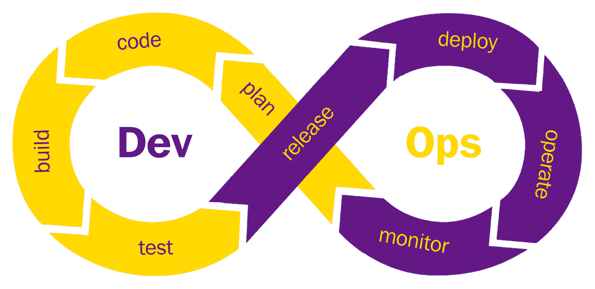
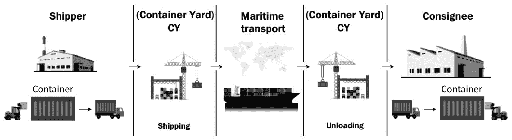
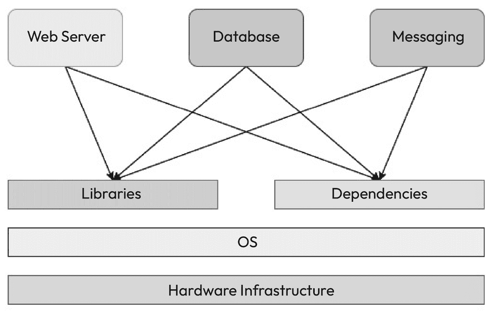
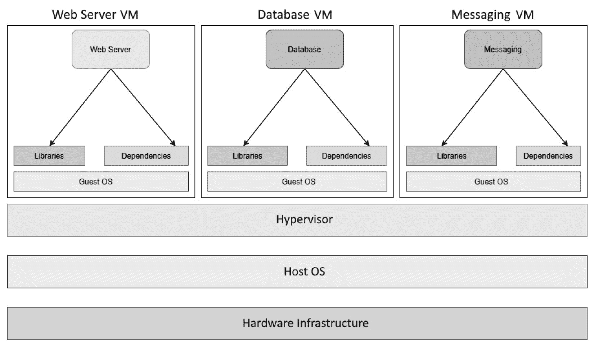
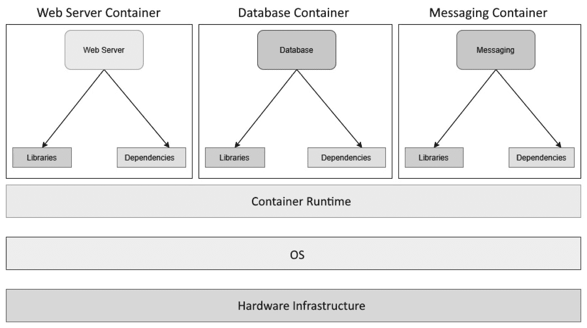
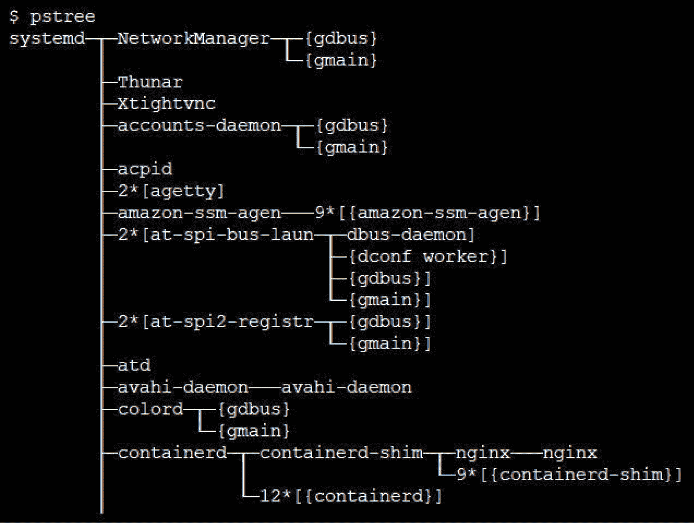
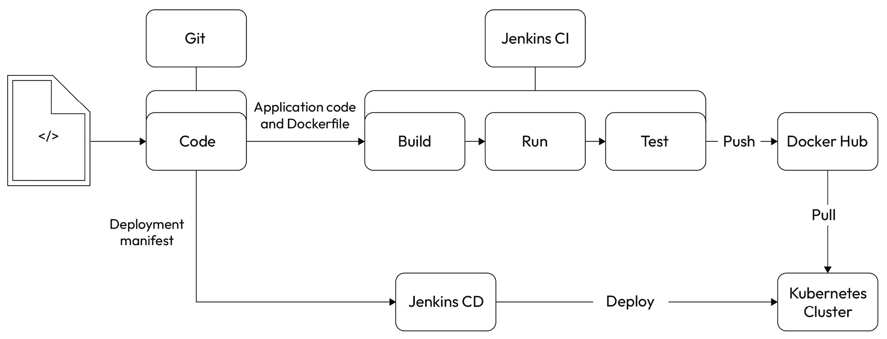
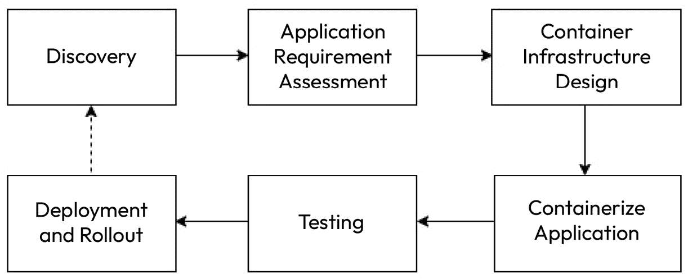
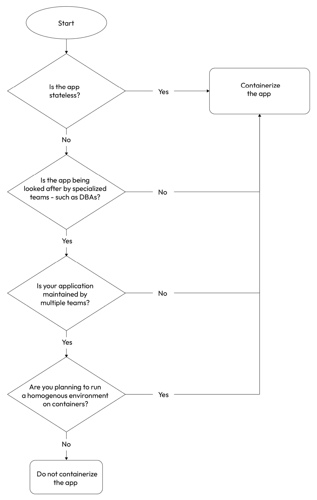

# 现代 DevOps 方式

本章将提供一些 DevOps 实践、流程和工具的背景知识。我们将了解现代 DevOps 以及它与传统 DevOps 的区别。我们还将介绍容器，并详细理解容器如何在云环境中改变整个 IT 格局，以便在本书的基础上继续深入学习。尽管本书并不完全聚焦于容器及其编排，但现代 DevOps 实践强调这一点。

本章将涵盖以下主要主题：

+   什么是 DevOps？

+   云计算简介

+   了解现代云原生应用

+   现代 DevOps 与传统 DevOps

+   容器的需求

+   容器架构

+   容器与现代 DevOps 实践

+   从虚拟机迁移到容器

到本章结束时，你应该理解以下几个关键方面：

+   什么是 DevOps，它在现代 IT 环境中扮演的角色

+   什么是云计算，它如何改变 IT 服务

+   现代云原生应用的样貌以及它如何改变 DevOps

+   为什么我们需要容器，以及容器解决了什么问题

+   容器架构及其工作原理

+   容器如何促成现代 DevOps 实践

+   从基于虚拟机的架构迁移到容器的高级步骤

# 什么是 DevOps？

如你所知，软件开发和运维传统上由不同的团队承担，各自有不同的角色和责任。开发者专注于编写代码和创建新功能，而运维团队则专注于在生产环境中部署和管理软件。这种分离常常导致沟通鸿沟、发布周期缓慢以及低效的工作流程。

**DevOps**通过推动协作文化、共享责任以及在整个软件开发生命周期中使用自动化来弥合开发和运维之间的差距，确保持续反馈。

这是一套原则和实践，也是一种哲学，鼓励开发和运维团队参与整个软件开发生命周期，包括软件维护和运维。为了实现这一点，组织管理多个流程和工具，帮助自动化软件交付过程，从而提高速度和灵活性，通过**持续集成和持续交付**（**CI/CD**）管道减少代码发布的周期时间，并监控运行在生产环境中的应用程序。

DevOps 团队应该确保，不是将开发、运维和质量保证分成不同的职能小组，而是组建一个能够涵盖整个软件开发生命周期（SDLC）的单一团队——即，该团队负责构建、部署和监控软件。合并后的团队拥有整个应用程序的所有权，而不是某些职能的所有权。这并不意味着团队成员没有专业技能，而是要确保开发人员了解运维工作，运维工程师也要了解开发工作。QA 团队与开发人员和运维工程师密切合作，了解业务需求以及在实际操作中遇到的各种问题。基于这些经验，他们需要确保自己开发的产品能够满足业务需求，并解决实际操作中遇到的问题。

在传统的开发团队中，积压工作的来源是业务及其架构师。然而，对于 DevOps 团队来说，他们的日常积压工作有两个来源——业务及其架构师，以及客户和他们在生产环境中运行应用时遇到的问题。因此，DevOps 实践通常遵循一个无限循环，而不是线性的交付路径，如下图所示：



图 1.1 – DevOps 无限循环

为了确保具有不同技能的人员之间能够顺利协作，DevOps 强调自动化和工具的使用。DevOps 的目标是尽可能地自动化重复性的任务，集中精力处理更重要的事务。这确保了产品的质量和快速交付。DevOps 注重 *人员*、*流程* 和 *工具*，其中最重要的是人员，最不重要的是工具。我们通常使用工具来自动化流程，帮助人员实现正确的目标。

DevOps 工程师通常会遇到一些基本的概念和术语，下面列出了一些。我们将在本书中重点讨论这些内容：

+   **持续** **集成**（**CI**）

CI 是一种软件开发实践，涉及频繁地将多个开发人员的代码更改合并到共享的代码库中，通常是每天几次。这确保开发人员定期将代码合并到一个中央代码库中，并在此库中运行自动化构建和测试，实时向团队反馈。这大大减少了周期时间，并提高了代码质量。该过程旨在尽早发现代码中的错误，而不是等到测试阶段。它能尽早发现集成问题，并确保软件始终保持可发布状态。

+   **持续** **交付**（**CD**）

CD 主要是将您经过测试的软件在准备好时部署到生产环境中。因此，CD 管道将把您的更改打包并进行集成和系统测试。一旦您彻底测试了代码，就可以自动（或经批准后）将更改部署到测试和生产环境中。所以，CD 的目标是准备好最新的经过测试的工件，以便进行部署。

+   **基础设施即** **代码** (**IaC**)

IaC 是软件开发中的一种实践，涉及使用代码和配置文件而非手动过程来管理和配置基础设施资源，如服务器、网络和存储。IaC 将基础设施视为软件，使团队能够以可编程和版本控制的方式定义和管理基础设施资源。随着虚拟机、容器和云技术的出现，技术基础设施在很大程度上已变得虚拟化。这意味着我们可以通过 API 调用和模板来构建基础设施。借助现代工具，我们还可以以声明式方式在云中构建基础设施。这意味着您现在可以构建 IaC，将构建基础设施所需的代码存储在源代码库中，如 Git，并使用 CI/CD 管道来创建和管理基础设施。

+   **配置即** **代码** (**CaC**)

CaC 是软件开发和系统管理中的一种实践，涉及使用代码和版本控制系统管理和配置设置。它将配置设置视为代码制品，使团队能够以程序化和可重现的方式定义、存储和管理配置。历史上，服务器通常是从头开始手动构建的，并且很少发生变化。然而，随着弹性基础设施的出现和对自动化的重视，配置也可以通过代码进行管理。CaC 与 IaC 密切配合，共同构建可扩展的、容错的基础设施，从而使您的应用程序能够无缝运行。

+   **监控** **和日志记录**

监控和日志记录是软件开发和运维中的基本实践，涉及捕获和分析关于软件应用和系统行为及性能的数据。它们为软件的健康、可用性和性能提供洞察，使团队能够识别问题、排查故障并做出有依据的改进决策。监控和日志记录属于可观察性范畴，这是任何 DevOps 团队都必须关注的领域——即通过监控知道您的应用程序出现问题和异常，并通过日志记录进行问题追踪。这些实践和工具就像您的眼睛，是 DevOps 堆栈中的关键领域。此外，它们对构建 DevOps 团队的待办事项列表也有重要贡献。

+   **沟通** **与协作**

沟通与协作是 DevOps 实践中的关键要素。它们促进了开发、运营和其他参与软件交付生命周期的利益相关者之间的高效团队合作、知识共享和简化的工作流程。沟通与协作使得 DevOps 团队能够高效运作。过去，通过电子邮件的沟通方式已经不再适用。现代 DevOps 团队使用票务和敏捷工具来管理待办事项，利用 Wiki 跟踪知识文章和其他文档，并通过聊天和**即时消息**（**IM**）工具进行即时沟通。

虽然这些只是 DevOps 实践和工具的一些核心方面，但随着容器和云的出现，已经发生了一些变化——即现代云原生应用栈。现在我们已经介绍了几个流行词汇，接下来让我们理解什么是云计算和云计算服务。

# 云计算简介

传统上，软件应用程序通常运行在内部计算机（服务器）上，这些服务器被称为**数据中心**。这意味着组织必须购买和管理物理计算机和网络基础设施，这通常需要大量的资本支出，同时还需要支付相当高的运营费用。此外，服务器会出现故障并需要维护。这意味着那些希望尝试新事物的小型公司通常不会开始，因为所需的**资本支出**（**CapEx**）非常庞大。这表明，项目必须经过良好的规划、预算和架构设计，然后再根据需求购买和配置基础设施。这也意味着，随着时间推移，快速扩展基础设施变得不可行。例如，假设你开始时规模较小，并未预料到网站的流量很大，因此你订购和配置了较少的资源，但网站突然变得很受欢迎。在这种情况下，你的服务器将无法处理如此大量的流量，可能会崩溃。快速扩展将涉及购买新的硬件并将其添加到数据中心，这需要时间，而你的业务可能会失去这一机会。

为了解决这个问题，像亚马逊、微软和谷歌等互联网巨头开始建设公共基础设施来运行他们的互联网系统，最终将其推出供公众使用。这促成了一个新的现象，即**云计算**。

云计算是指通过互联网按需提供计算资源，如服务器、存储、数据库、网络、软件和分析服务。与将这些资源托管在本地物理基础设施上不同，云计算使组织能够访问和利用**云服务提供商**（**CSPs**）提供的计算服务。一些领先的公共 CSPs 包括**亚马逊云服务**（**AWS**）、**微软 Azure**和**谷歌云平台**。

在云计算中，云服务提供商（CSP）拥有、维护并管理底层的基础设施和资源，而用户或组织则利用这些资源来支持他们的应用程序和服务。

简单来说，云计算不过是使用他人的数据中心来运行您的应用程序，且应按需提供。它应该通过网络门户、API 等方式提供控制面板，以便让您进行操作。作为交换，您需要按**按需付费**的方式支付租赁费用，来使用您所配置（或使用）的资源。

因此，云计算提供了多种好处，并为企业打开了前所未有的新机遇。以下是其中的一些好处：

+   **可扩展性**：云上的资源是可扩展的。这意味着您可以根据需要向现有服务器添加新的服务器或资源。您还可以通过流量自动扩展应用程序。这意味着，如果您需要一台服务器来运行应用程序，而由于受欢迎程度或高峰时段的原因，您突然需要五台服务器，您的应用程序可以通过云计算 API 和内置的管理资源自动扩展到五台服务器。这为企业提供了强大的能力，因为他们可以从小规模开始，而不必过多担心未来的流量和扩展问题。

+   **成本节省**：云计算遵循**按需付费**模式，用户只需为他们实际使用的资源和服务付费。这消除了对硬件和基础设施的前期资本支出（CapEx）的需求。对于企业来说，租用资源通常比投资计算硬件要便宜。因此，您只需为特定时间段内所需的资源付费，无需预先配置资源来应对未来的负载，这为大多数中小型组织节省了大量成本。

+   **灵活性**：云资源不再仅仅是服务器。您还可以获取许多其他服务，如简单的对象存储解决方案、网络和块存储、托管数据库、容器服务等。这些为您在应用程序的使用上提供了极大的灵活性。

+   **可靠性**：云计算资源受**服务水平协议**（**SLA**）的约束，有时可达到 99.999%的可用性。这意味着大多数云资源永远不会停机；如果停机，您也不会注意到，因为云平台有内置的冗余机制。

+   **安全性**：由于云计算公司为多个客户运行应用程序，它们通常拥有比您在本地构建的更严格的安全防护网。它们拥有一支安全专家团队，全天候监控云平台，并且默认提供加密、访问控制和威胁检测等服务。因此，在正确架构的情况下，运行在云上的应用程序更加安全。

云计算提供了多种服务，包含以下几种：

+   **基础设施即服务**（**IaaS**）类似于在服务器上运行应用程序。它是一种云计算服务模型，通过互联网提供虚拟化的计算资源。使用 IaaS，组织可以访问和管理基本的 IT 基础设施组件，如虚拟机、存储和网络，而无需投资和维护物理硬件。在 IaaS 模式中，CSP 拥有并管理底层的物理基础设施，包括服务器、存储设备、网络设备和数据中心。而用户或组织则可以控制虚拟化基础设施上运行的**操作系统**（**OSs**）、应用程序和配置。

+   **平台即服务**（**PaaS**）为你提供了一个抽象层，在这个层级上，你可以专注于代码编写，将应用程序管理交给云服务。PaaS 是一种云计算服务模型，为开发人员提供一个平台和环境，以便构建、部署和管理应用程序，而无需担心底层的基础设施组件。PaaS 抽象化了基础设施管理的复杂性，使开发人员可以专注于应用程序开发和部署。在 PaaS 模式中，CSP 提供的平台包括操作系统（OS）、开发框架、运行时环境，以及支持应用程序开发生命周期所需的各种工具和服务。用户或组织可以利用这些平台资源来开发、测试、部署和扩展应用程序。

+   **软件即服务**（**SaaS**）为你提供了一个预构建的应用程序，例如一个可以轻松与应用程序集成的现成监控服务。在 SaaS 模式中，云服务提供商（CSP）托管和管理软件应用程序，包括基础设施、服务器、数据库和维护。用户或组织可以通过网页浏览器或瘦客户端应用程序访问该应用。通常他们根据使用量支付订阅费用，软件作为按需服务提供。

云的出现带来了一个新的行业流行词——云原生应用。我们将在下一节中讨论它们。

# 理解现代云原生应用

当我们说云原生时，指的是那些为在云中原生运行而构建的应用程序。云原生应用旨在充分利用云的能力和优势，尽可能多地使用云服务在云中运行。

这些应用程序天生具有**可扩展性**、**灵活性**和**弹性**（容错能力）。它们在很大程度上依赖于云服务和自动化。

现代云原生应用的一些特征如下：

**微服务架构**：现代云原生应用通常遵循微服务架构。微服务是将应用程序拆分为多个较小，松散耦合的部分，具有独立的业务功能。独立的微服务可以根据需要或特定功能使用不同的编程语言编写。这些较小的部分可以独立扩展，灵活运行，并且从设计上具有弹性。

**容器化**：微服务应用通常使用容器来运行。容器为应用程序提供了一种**一致**，**便携**和**轻量级**的环境，确保它们捆绑了所有必要的依赖关系和配置。容器可以在所有环境和云平台上运行相同的内容。

**DevOps 和自动化**：云原生应用程序大量使用现代 DevOps 的实践和工具，因此在很大程度上依赖自动化。这简化了应用程序的开发，测试和运营。自动化还带来了**可扩展性**，**韧性**和**一致性**。

**动态编排**：云原生应用程序构建为可扩展且本质上是容错的。这些应用程序通常是**短暂的**（**临时的**）；因此，服务的副本可以根据需要随时出现和消失。诸如**Kubernetes**和**Docker Swarm**之类的动态编排平台用于管理这些服务。这些工具帮助在变化的需求和流量模式下运行您的应用程序。

**云原生数据服务的使用**：云原生应用通常使用托管的云数据服务，如**存储**，**数据库**，**缓存**和**消息**系统，以便多个服务之间进行通信。

云原生系统强调 DevOps，并且现代 DevOps 已经出现来管理它们。因此，现在让我们来看看传统 DevOps 和现代 DevOps 之间的区别。

# 现代 DevOps 与传统 DevOps 的对比

DevOps 的传统方法涉及建立一个包含**开发**，**质量保证**和**运维**成员的 DevOps 团队，并努力创建更快，更好的软件。然而，虽然会专注于自动化软件交付，但自动化工具如**Jenkins**，**Git**等仍需手动安装和维护。这导致了另一个问题，因为现在我们不得不管理另一套 IT 基础设施。最终问题归结为基础设施和配置，而焦点是自动化自动化过程。

随着容器的出现和公共云景观的近期繁荣，DevOps 的现代方法进入了视野，其中涉及到一切的自动化。从基础设施的供应到工具和流程的配置，一切都有相应的代码。因此，现在我们有**IaC**，**CaC**，**不可变基础设施**和**容器**。我称这种方法为现代 DevOps，并且这将是本书的重点。

以下表格描述了现代 DevOps 和传统 DevOps 之间的一些关键相似性和差异：

| **方面** | **现代 DevOps** | **传统 DevOps** |
| --- | --- | --- |
| 软件交付 | 重视 CI/CD 流水线、自动化测试和部署自动化。 | 重视 CI/CD 流水线、自动化测试和部署自动化。 |
| 基础设施管理 | 常用 IaC 来进行基础设施资源的规划和管理。经常使用云平台和容器化技术。 | 手动进行基础设施的规划和配置，通常依赖传统数据中心和有限的自动化。 |
| 应用程序部署 | 广泛采用容器化和容器编排技术，如 Docker 和 Kubernetes，以确保应用程序的可移植性和可扩展性。 | 使用传统的部署方法，如直接在虚拟机或物理服务器上部署应用程序，没有采用容器化。 |
| 可扩展性和弹性 | 利用云平台和容器编排的自动扩展能力来处理不同的工作负载。专注于高可用性和容错性。 | 通过纵向扩展（向现有服务器添加资源）或手动容量规划来实现可扩展性。通过手动添加冗余服务器来实现高可用性。弹性不存在，容错性不是重点。 |
| 监控与日志记录 | 广泛使用监控工具、日志聚合和实时分析来获取应用程序和基础设施性能的洞察。 | 监控和日志记录做法有限，可用工具和分析较少。 |
| 协作与文化 | 强调开发和运维团队之间的协作、沟通和共享责任（DevOps 文化）。 | 强调开发和运维团队之间的协作、沟通和共享责任（DevOps 文化）。 |
| 安全性 | 安全性通过使用**DevSecOps**实践集成到开发过程中。安全测试和漏洞扫描是自动化的。 | 安全措施通常是手动应用并由独立的安全团队管理。在软件开发生命周期中自动化安全测试有限。 |
| 部署速度 | 通过自动化流水线快速频繁地部署软件更新，从而缩短上市时间。 | 快速部署应用程序，但缺乏自动化的基础设施部署。 |

表 1.1 – 现代 DevOps 和传统 DevOps 之间的主要相似性和差异

需要注意的是，现代 DevOps 与传统 DevOps 之间的区别并不是严格的二元对立，因为组织可以在一个范围内采用各种实践和技术。现代 DevOps 方法通常专注于利用云技术、自动化、容器化和 DevSecOps 原则，以提高协作性、敏捷性以及软件开发和部署的效率。

正如我们之前讨论的，容器有助于实现现代 DevOps，并构成了这一实践的核心。我们将在下一节中深入了解容器。

# 容器的需求

最近，容器非常流行，原因也很充分。它们解决了计算机架构中最关键的问题——*在任何计算环境中运行可靠的、分布式的软件，并具备接近无限的可扩展性*。

它们促成了软件工程领域的一门全新学科——*微服务*。它们还在技术中引入了*一次打包，随时部署*的概念。结合云计算和分布式应用程序，容器与容器编排技术共同促成了业界的一个新热词——*云原生*——彻底改变了 IT 生态系统。

在我们深入探讨更多技术细节之前，让我们用简单明了的方式来理解容器。

容器得名于集装箱。我将通过集装箱类比来解释容器，以便更好地理解。历史上，由于交通运输的改善，大量物品跨越多个地理区域进行运输。由于各种货物通过不同方式运输，货物在每个运输点的装卸问题巨大。而且，随着劳动力成本的上升，航运公司要在规模化运营的同时保持低价格变得不切实际。

此外，这也导致了物品经常遭受损坏，货物容易被错放或与其他货物混淆，因为没有隔离措施。运输货物需要一种标准的方式，以提供必要的货物隔离，并便于装卸。航运业提出了集装箱这一优雅的解决方案来解决这个问题。

现在，集装箱简化了航运业中的许多事情。通过标准化集装箱，我们可以只移动集装箱就将货物从一个地方运输到另一个地方。相同的集装箱可以用于公路、装载到火车上并通过船只运输。这些运输工具的操作员大多数时候不需要担心集装箱内的货物。下图以图形方式描绘了整个工作流程，便于理解：



图 1.2 – 集装箱工作流程

类似地，软件行业在软件可移植性和计算资源管理方面也存在问题。在标准软件开发生命周期中，软件会在多个环境中移动，有时候，多个应用程序共享同一个操作系统。环境之间的配置可能存在差异，因此在开发环境中可以正常工作的软件在测试环境中可能无法正常工作。测试环境中正常工作的东西在生产环境中也可能不正常。

此外，当您在单台计算机内运行多个应用程序时，它们之间没有隔离。一个应用程序可能会耗尽另一个应用程序的计算资源，这可能导致运行时问题。

在部署的每个步骤中都需要重新打包和重新配置应用程序，因此需要大量的时间和精力，有时会出错。

在软件行业，容器通过提供应用程序之间的隔离和计算资源管理来解决这些问题，为这些问题提供了最佳解决方案。

软件行业面临的最大挑战是提供应用程序隔离和优雅地管理外部依赖项，以便它们可以在任何平台上运行，无论操作系统或基础设施如何。软件用多种编程语言编写，并使用各种依赖项和框架。这导致了一个称为**地狱矩阵**的场景。

## 地狱矩阵

假设您正在准备一台服务器，该服务器将为多个团队的多个应用程序运行。现在，假设您没有虚拟化基础设施，并且需要在一个物理机器上运行所有内容，如下图所示：



图 1.3 – 物理服务器上的应用程序

一个应用程序使用某个依赖项的特定版本，而另一个应用程序使用不同版本，您最终在一个系统中管理两个版本的同一软件。当您扩展系统以适应多个应用程序时，您将管理数百个依赖项和不同应用程序版本，这会逐渐变得在一个物理系统内难以管理。这种情况在流行的计算术语中被称为**地狱矩阵**。

地狱矩阵产生了多种解决方案，但有两种显著的技术贡献 – *虚拟机* 和 *容器*。

## 虚拟机

**虚拟机**通过一种叫做**虚拟机管理程序**（hypervisor）的技术来模拟操作系统。虚拟机管理程序可以作为软件运行在物理主机操作系统上，或者作为固件运行在裸机上。虚拟机作为虚拟的客操作系统在虚拟机管理程序上运行。借助这项技术，您可以将一台庞大的物理机器划分为多个较小的虚拟机，每个虚拟机都服务于特定的应用程序。这项技术已经彻底改变了计算基础设施，近二十年来一直在使用，至今仍然活跃在市场上。市场上一些最流行的虚拟机管理程序包括**VMware**和**Oracle VirtualBox**。

下图展示了虚拟机上的同一堆栈。您可以看到，每个应用程序现在都包含一个专用的客操作系统，每个操作系统都有自己的库和依赖关系：



图 1.4 – 虚拟机上的应用程序

尽管这种方法是可接受的，但它就像使用一整艘船来运输货物，而不是使用简单的货运集装箱来做类比。虚拟机资源消耗较大，因为它需要一个较重的客操作系统层来隔离应用程序，而不是更轻量的解决方案。我们需要为虚拟机分配专用的 CPU 和内存；资源共享不够理想，因为人们往往为了应对高峰负载而过度配置虚拟机。虚拟机的启动速度也较慢，虚拟机的扩展传统上较为繁琐，因为涉及到多个活动组件和技术。因此，使用虚拟机自动化水平扩展（通过向资源池中添加更多机器来处理更多来自用户的流量）并不是特别直接。此外，系统管理员现在不得不处理多个服务器，而不是一个服务器中的大量库和依赖关系。虽然比以前有所改善，但从计算资源的角度来看，它仍然不是最优解。

## 容器

这就是容器技术的引入背景。容器技术解决了地狱矩阵的问题，并且没有涉及重型的客操作系统层。相反，容器通过封装应用程序运行时和依赖关系，将它们隔离开来，创建了一种叫做容器的抽象。现在，您可以在单一操作系统上运行多个容器。运行在容器中的众多应用程序可以共享相同的基础设施。因此，它们不会浪费您的计算资源。您也无需担心应用程序的库和依赖关系，因为它们被隔离在其他应用程序之外——对每个人来说，都是一种双赢的局面！

容器运行在容器运行时环境上。虽然**Docker**是最流行且几乎是事实上的容器运行时，但市场上还有其他选择，比如**Rkt**和**Containerd**。它们都使用相同的 Linux 内核**cgroups**特性，这一特性的基础来源于谷歌、IBM、OpenVZ 和 SGI 的共同努力，将**OpenVZ**嵌入到 Linux 主内核中。OpenVZ 是最早尝试在不使用客操作系统层的情况下，在 Linux 内核中实现虚拟环境特性的项目，我们现在称之为容器。

## 它在我的机器上能运行

你可能在职业生涯中听过这句话很多次。这是一个典型的情形：开发人员给测试团队带来困扰，他们会说“*但在我的机器上能运行*”，而测试团队则回应道“*我们不会把你的机器交给客户*。”容器使用*一次构建，到处运行*和*一次打包，随处部署*的理念，解决了*它在我的机器上能运行*的问题。由于容器需要容器运行时，它们可以在任何机器上以相同的方式运行。应用程序的标准化设置也意味着系统管理员的工作仅限于照顾容器运行时和服务器，并将应用程序的责任委托给开发团队。这减少了软件交付的管理负担，软件开发团队现在可以在没有太多外部依赖的情况下引领开发——这确实是强大的能力！现在，让我们看看容器是如何设计来实现这一点的。

# 容器架构

在大多数情况下，你可以将容器视为迷你虚拟机——至少，它们看起来像虚拟机。但实际上，它们只是运行在操作系统中的计算机程序。那么，让我们来看看容器中应用堆栈的高层次示意图：



图 1.5 – 容器中的应用程序

正如我们所看到的，计算基础设施位于最底部，形成了基础层，其上是主机操作系统和运行其上的容器运行时（在本例中为 Docker）。接着，我们有多个使用容器运行时的容器化应用程序，它们作为独立进程在主操作系统上运行，利用*命名空间*和*cgroups*。

正如你可能已经注意到的，我们在其中没有像虚拟机那样的客操作系统层。每个容器都是在内核用户空间上运行的*软件程序*，它与主机操作系统共享相同的操作系统及相关的运行时和其他依赖项，容器中仅包含所需的库和依赖项。容器不会继承操作系统的环境变量。你必须为每个容器单独设置这些变量。

容器复制了文件系统，尽管它们存在于磁盘上，但彼此隔离。这使得容器能够在安全的环境中运行应用程序。单独的容器文件系统意味着容器不需要与操作系统文件系统进行频繁的交互，从而比虚拟机更快地执行。

容器设计使用 Linux *命名空间* 来提供隔离，并使用 *cgroups* 对 CPU、内存和磁盘 I/O 消耗进行限制。

这意味着，如果你列出操作系统进程，你将看到容器进程与其他进程一起运行，如下所示：



图 1.6 – 操作系统进程

然而，当你列出容器的进程时，你只会看到容器进程，如下所示：

```
$ docker exec -it mynginx1 bash
root@4ee264d964f8:/# pstree
nginx---nginx
```

这就是命名空间如何在容器之间提供一定程度的隔离。

Cgroups 在限制一组进程可以使用的计算资源方面起着重要作用。例如，如果你将进程添加到一个 cgroup，你可以限制这些进程使用的 CPU、内存和磁盘 I/O。此外，你还可以衡量和监控资源使用情况，当应用程序出现问题时，可以停止一组进程。所有这些特性构成了容器化技术的核心，我们将在本书后面看到这些内容。

一旦我们有了独立运行的容器，我们还需要了解它们如何交互。因此，我们将在下一节探讨容器网络。

## 容器网络

容器是操作系统中的独立网络实体。Docker 运行时使用网络驱动程序来定义容器之间的网络连接，它们是软件定义的网络。**容器网络**通过使用软件来操作 *主机 iptables*、连接外部网络接口、创建隧道网络以及执行其他活动，以便容器之间可以进行连接。

虽然你可以在容器中实现多种网络配置，但了解一些常用的配置还是很有帮助的。如果细节看起来有些复杂，不要太担心——你将在本书后续的实操练习中理解它们，跟随文本并不需要完全掌握这些内容。现在，让我们来看一下你可以定义的几种容器网络类型：

+   **无**：这是一个完全隔离的网络，您的容器无法与外界通信。它们被分配了一个回环接口，并且无法连接到外部网络接口。您可以使用此网络来测试容器、为未来使用准备容器，或者运行不需要任何外部连接的容器，比如批处理任务。

+   `docker0` 接口用于默认容器。桥接网络通过操作 IP 表来提供 **网络地址转换**（**NAT**），实现容器与主机网络之间的外部网络连接。它还可以避免端口冲突，使得运行在同一主机上的容器之间能够进行网络隔离。因此，你可以在单个主机内运行多个使用相同容器端口的应用程序。桥接网络允许同一主机内的容器通过容器 IP 地址进行通信。然而，它不允许与运行在不同主机上的容器通信。因此，你不应该在集群配置中使用桥接网络（即使用多台服务器联合运行容器）。

+   **主机网络**：主机网络使用主机机器的网络命名空间来处理所有容器的网络。这类似于在主机上运行多个应用程序。虽然主机网络实现简单，易于可视化和故障排除，但它容易出现端口冲突问题。尽管容器使用主机网络进行所有通信，但除非在特权模式下运行，否则它无法操作主机网络接口。主机网络不使用 NAT，因此速度较快，并且以裸机速度进行通信。因此，你可以使用主机网络来优化性能。然而，由于容器之间没有网络隔离，从安全和管理的角度来看，在大多数情况下，你应该避免使用主机网络。

+   **底层网络**：底层网络直接将主机网络接口暴露给容器。这意味着你可以直接在网络接口上运行容器，而无需使用桥接网络。有几种底层网络，最著名的有 MACvlan 和 IPvlan。MACvlan 允许你为每个容器分配一个 MAC 地址，使得容器看起来像是一个物理设备。这对于将现有堆栈迁移到容器特别有用，尤其是当你的应用程序需要在物理机器上运行时。MACvlan 还提供了对主机网络的完全隔离，因此，如果你有严格的安全要求，可以使用这种模式。MACvlan 有一定的限制，因为它不能与设置了安全策略禁止 MAC 欺骗的网络交换机一起使用。它还受到某些网络接口卡的 MAC 地址数量限制，例如 Broadcom，只允许每个接口最多 512 个 MAC 地址。

+   **Overlay**：不要将 Overlay 与 Underlay 混淆 - 尽管它们看起来像是反义词，但实际上并非如此。Overlay 网络通过网络隧道允许不同主机上的容器进行通信。因此，从容器的角度来看，它们似乎在单个主机上与容器进行交互，即使它们位于其他位置。它克服了桥接网络的限制，特别适用于集群配置，尤其是在使用容器编排器如 Kubernetes 或 Docker Swarm 时。一些流行的 Overlay 技术包括 **flannel**、**calico** 和 **VXLAN**。

在深入讨论不同类型网络技术之前，让我们了解容器网络的微妙之处。在这次讨论中，我们将特别谈谈 Docker。

每个在主机上运行的 Docker 容器都分配了一个唯一的 IP 地址。如果你 `exec`（打开一个 shell 会话）进入容器并运行 `hostname -I`，你应该看到类似以下的内容：

```
$ docker exec -it mynginx1 bash
root@4ee264d964f8:/# hostname -I
172.17.0.2
```

这允许不同的容器通过简单的 TCP/IP 链路进行通信。Docker 守护进程充当每个容器的 DHCP 服务器。在这里，你可以为一组容器定义虚拟网络，并将它们结合在一起以提供网络隔离（如果需要）。你还可以将容器连接到多个网络，以便为它们提供两种不同的角色共享。

Docker 为每个容器分配一个唯一的主机名，默认为容器 ID。然而，这可以很容易地被覆盖，只要在特定网络中使用唯一的主机名即可。因此，如果你 `exec` 进入一个容器并运行 `hostname`，你应该看到容器 ID 作为主机名，如下所示：

```
$ docker exec -it mynginx1 bash
root@4ee264d964f8:/# hostname
4ee264d964f8
```

这使得容器能够作为独立的网络实体而不仅仅是简单的软件程序，你可以轻松地将容器视为小型虚拟机。

容器还继承了主机操作系统的 DNS 设置，因此如果你希望所有容器共享相同的 DNS 设置，你不必太担心。如果你想为你的容器定义单独的 DNS 配置，你可以通过传递一些标志来轻松实现。Docker 容器不继承 `/etc/hosts` 文件中的条目，因此你必须在使用 `docker run` 命令创建容器时声明它们。

如果你的容器需要代理服务器，你必须在 Docker 容器的环境变量中设置或者通过向 `~/.docker/config.json` 文件添加默认代理来设置。

到目前为止，我们已经讨论了容器及其定义。现在，让我们讨论容器如何正在改变 DevOps 的世界，以及在一开始就明确拼写这一点是必要的。

# 容器和现代 DevOps 实践

容器和现代 DevOps 实践高度互补，并且已经改变了我们对软件开发和部署的方式。

容器与现代 DevOps 实践具有很好的协同作用，因为它们提供了必要的基础设施封装、可移植性、可扩展性和灵活性，从而实现快速高效的软件交付。通过现代 DevOps 实践，如 CI/CD、IaC 和微服务，容器为组织提供了一个强大的基础，使它们能够实现更快的市场响应时间、提升的软件质量和增强的操作效率。

容器从一开始就遵循 DevOps 实践。如果你查看典型的容器构建和部署工作流，你将会看到以下内容：

1.  首先，用你想要的任何语言编写应用程序。

1.  然后，创建一个**Dockerfile**，其中包含一系列步骤来安装应用程序的依赖项和运行应用所需的环境配置。

1.  接下来，通过以下操作，使用 Dockerfile 创建容器镜像：

a) 构建容器镜像。

b) 运行容器镜像。

c) 对运行在容器上的应用程序进行单元测试。

1.  然后，将镜像推送到像**DockerHub**这样的容器注册中心。

1.  最后，从容器镜像创建容器，并在集群中运行它们。

你可以将这些步骤优雅地嵌入到下面显示的 CI/CD 管道示例中：



图 1.7 – 容器 CI/CD 管道示例

这意味着你的应用程序及其运行时依赖项都在代码中定义。你从一开始就遵循配置管理，允许开发人员像处理短期工作负载一样处理容器（短期工作负载是可以临时替换的工作负载，如果某个工作负载消失了，可以随时启动另一个，而不会对功能产生影响）。如果它们表现不佳，你可以替换它们——这在虚拟机中是不太优雅的做法。

容器非常适合现代的 CI/CD 实践，因为现在你有了一种标准的方式来构建和部署应用程序，无论你使用何种编程语言。你不必管理昂贵的构建和部署软件，因为容器提供了一切。

容器很少独立运行，在业界，将它们插入到容器编排器中，如**Kubernetes**，或者使用**容器即服务**（**CaaS**）平台，如**AWS ECS**和**EKS**，**Google Cloud Run**和**Kubernetes Engine**，**Azure ACS**和**AKS**，**Oracle OCI**和**OKE**等，已经成为行业的标准做法。流行的**功能即服务**（**FaaS**）平台，如**AWS Lambda**、**Google Functions**、**Azure Functions**和**Oracle Functions**，也会在后台运行容器。因此，尽管它们可能已经将底层机制抽象化，但你可能已经在不知不觉中使用了容器。

由于容器轻量化，你可以将应用程序的更小部分构建成容器，以便独立管理它们。结合像 Kubernetes 这样的容器编排工具，你就可以轻松运行一个分布式微服务架构。这些小部分可以独立扩展、自我修复，并独立于其他部分发布，这意味着你可以比以前更快、更可靠地将它们发布到生产环境中。

你还可以在上面接入**服务网格**（允许你发现、列出、管理并使你的微服务应用程序中多个组件（服务）之间进行通信的基础设施组件），比如**Istio**，并轻松获得流量管理、安全性和可观察性等高级运维功能。然后，你可以做一些很酷的事情，如**蓝绿部署**和**A/B 测试**，在生产环境中进行操作测试，使用**流量镜像**、**基于地理位置的路由**等，功能丰富。

因此，大型和小型企业比以往任何时候都更快地拥抱容器化，且这一领域正在呈指数级增长。根据[businesswire.com](http://businesswire.com)的数据，应用容器市场年均复合增长率为 31%，预计到 2025 年将达到 69 亿美元。云计算领域每年增长 30.3%，预计到 2025 年将超过 24 亿美元，这也促进了容器化的快速发展。

因此，现代 DevOps 工程师必须理解容器及相关技术，以有效地交付容器化应用程序。这并不意味着虚拟机变得不再必要，我们不能完全忽视基于 IaaS 的解决方案在市场中的作用，因此在后续章节中我们还会涉及一些**Ansible**配置管理内容。由于云计算的到来，基础设施即代码（IaC）最近获得了很大的发展势头，因此我们还将介绍作为 IaC 工具的**Terraform**。

# 从虚拟机迁移到容器

随着技术市场朝着容器化发展，DevOps 工程师面临着一个重要任务——*将运行在虚拟机上的应用程序迁移到容器中，以便它们能够在容器上运行*。嗯，这是大多数 DevOps 工程师职位描述中的一项任务，也是我们做的最重要的事情之一。

理论上，容器化一个应用程序就像写几个简单的步骤，但从实际操作来说，它可能是一个复杂的难题，尤其是在没有使用配置管理来设置虚拟机的情况下。当前企业中运行的虚拟机大多是由系统管理员通过大量手动劳动创建的，他们一块一块地改进服务器，并使得很难追溯他们可能做过的热修复记录。

由于容器从一开始就遵循配置管理原则，因此它不像直接获取虚拟机镜像并使用转换工具将其转换为 Docker 容器那样简单。

将运行在虚拟机上的遗留应用程序迁移需要多个步骤。让我们更详细地了解这些步骤。

## 发现

首先，我们从发现阶段开始：

+   了解应用程序的不同部分

+   评估可以容器化的遗留应用程序部分，并判断是否技术上可行

+   定义迁移范围，并与相关方就迁移的明确目标、收益以及时间表达成一致

## 应用程序需求评估

一旦发现阶段完成，我们需要进行应用程序需求评估：

+   评估是否更好地将应用程序拆分为更小的部分。如果是，那么这些应用程序部分是什么，它们如何相互作用？

+   评估与应用程序相关的架构、性能和安全性方面，思考在容器化环境中的对应内容。

+   了解相关风险并决定减轻风险的应对措施。

+   理解迁移原则，并决定迁移策略，例如应该首先容器化应用程序的哪一部分。总是从外部依赖最少的应用程序开始。

## 容器基础设施设计

容器基础设施设计涉及创建一个稳健且可扩展的环境，以支持容器化应用程序的部署和管理。

设计容器基础设施涉及考虑可扩展性、网络、安全、自动化和监控等因素。关键是将基础设施设计与容器化应用程序的特定需求和目标对齐，并遵循高效、可靠的容器部署和管理的最佳实践。

一旦我们评估了所有需求、架构及其他方面，我们就可以进入容器基础设施设计阶段：

+   在做出决策时，了解当前和未来的运营规模。根据应用程序的复杂性，你可以从多种选项中进行选择。关键问题包括：我们需要在平台上运行多少个容器？这些容器之间有哪些依赖关系？我们将多频繁地部署组件更改？应用程序可能会接收到的潜在流量是多少？应用程序的流量模式是什么？

+   根据前面问题的答案，你需要了解将应用程序运行在哪种基础设施上。是本地部署还是云端，使用托管的 Kubernetes 集群，还是自行托管并管理？你还可以考虑轻量级应用程序的 CaaS 选项。

+   你将如何监控和操作容器？是否需要安装专业工具？是否需要与现有监控工具堆栈进行集成？了解可行性并做出适当的设计决策。

+   你将如何保护你的容器？是否有任何关于安全性的法规和合规要求？所选择的解决方案是否满足这些要求？

## 容器化应用程序

容器化应用程序包括将应用程序及其依赖项打包成容器镜像，这样可以在不同的环境中一致地部署和运行。

容器化应用程序带来了更好的可移植性、可扩展性和可重现性等好处。它简化了部署过程，并确保在不同环境中应用程序行为的一致性。

一旦我们考虑了设计的所有方面，就可以开始容器化应用程序：

+   这时，我们需要查看应用程序并创建一个 Dockerfile，包含创建容器的步骤，就像当前一样。这需要大量的头脑风暴和评估，特别是当配置管理工具没有通过在虚拟机上运行来构建你的应用程序时，比如 Ansible。如果应用程序是如何安装的需要花费很多时间去弄清楚，那么你就需要编写准确的步骤来实现这一过程。

+   如果你计划将应用程序拆分为更小的部分，可能需要从头开始构建应用程序。

+   你必须决定一个适用于基于虚拟机并行应用程序的测试套件，并随着时间推移不断改进。

## 测试

测试容器化应用程序是确保其功能、性能和兼容性的重要步骤。

通过实施全面的测试策略，你可以确保容器化应用程序的可靠性、性能和安全性。在不同层次进行测试，集成自动化，并密切监控应用程序的行为，将帮助你在开发生命周期的早期识别和解决问题，从而使容器化应用程序更加稳健和可靠。

一旦我们容器化了应用程序，接下来的步骤是进行测试：

+   为了证明你的容器化应用程序是否与虚拟机中的应用程序完全一样，你需要进行广泛的测试，证明你没有遗漏任何细节或之前应该考虑的部分。运行现有的测试套件或你为容器创建的测试套件。

+   运行现有的测试套件可能是正确的方法，但你也需要考虑软件的非功能性方面。对原始应用程序进行基准测试是一个好的开始，你需要理解容器化解决方案所带来的开销。你还需要对应用程序进行微调，以使其符合性能指标。

+   你还需要考虑安全性的重要性以及如何将其引入容器化世界。渗透测试将揭示许多你可能没有意识到的安全漏洞。

## 部署和发布

部署和发布容器化应用程序涉及将容器镜像部署到目标环境，并使应用程序可供使用。

一旦我们测试了容器并且足够有信心，我们就可以将我们的应用部署到生产环境中：

+   最后，我们将应用部署到生产环境，并从中学习是否需要进一步的修改。然后，我们返回到发现过程，直到我们完善了应用。

+   你必须定义并开发一个自动化的运行手册和 CI/CD 管道，以减少周期时间并快速排查问题。

+   进行 A/B 测试，容器化应用并行运行，可以帮助你在将所有流量切换到新方案之前发现潜在问题。

以下图表总结了这些步骤，如你所见，这一过程是循环的。这意味着你可能需要根据在生产中运行容器时学到的经验，时不时地重新审视这些步骤：



图 1.8 – 从虚拟机迁移到容器

现在，让我们了解一下为了确保从虚拟机迁移到容器时尽量减少摩擦并获得最佳效果，我们需要做些什么。

## 哪些应用应该容器化？

在从虚拟机迁移到容器的过程中，首先需要评估哪些应用可以容器化，哪些不能。广义上讲，你的应用工作负载可以分为两种类型——**无状态**和**有状态**。无状态工作负载不存储状态，是计算能力强大的应用，如 API 和函数；而有状态应用，如数据库，则需要持久化存储才能正常工作。

虽然任何可以在 Linux 虚拟机上运行的应用都可以容器化，但无状态应用通常是你首先要考虑的低悬果。容器化这些工作负载相对容易，因为它们没有存储依赖。你拥有的存储依赖越多，应用在容器中的复杂性就越高。

其次，你还需要评估你想要托管应用的基础设施形式。例如，如果你打算在 Kubernetes 上运行整个技术栈，尽量避免异构环境。在这种情况下，你可能也希望容器化有状态应用。对于 Web 服务和中间件层，大多数应用依赖某种形式的状态才能正确运行。所以，无论如何，你都会管理存储。

虽然这可能会打开潘多拉的盒子，但业内并没有达成共识关于是否将数据库容器化。虽然一些专家反对在生产环境中使用容器化数据库，但也有相当一部分人认为没有问题。主要原因是缺乏足够的数据来支持或反驳在生产环境中使用容器化数据库。

我建议你在处理数据库时要小心。虽然我并不反对将数据库容器化，但你必须考虑各种因素，如分配适当的内存、CPU、磁盘，以及你在虚拟机上的每个依赖关系。此外，你还需要关注团队的行为方面。如果你有一支管理生产环境中数据库的 DBAs 团队，他们可能不太愿意处理额外的复杂性——即容器。

我们可以通过以下流程图总结这些高层次的评估步骤：



图 1.9 – 虚拟机到容器迁移评估

这个流程图考虑了评估过程中最常见的因素。你还需要考虑到属于你组织的独特情况。因此，在做出任何决定之前，最好也考虑这些因素。

让我们看一些适合容器化的用例，以便更好地理解。以下类型的应用程序通常使用容器进行部署：

+   **微服务架构**：采用微服务架构的应用程序，其中功能被分割成小的、独立的服务，非常适合容器化。每个微服务可以作为一个独立的容器进行打包，从而简化了个别服务的开发、部署、扩展和管理。

+   **Web 应用**：Web 应用程序，包括前端应用、后端 API 和 Web 服务，可以容器化。容器提供了一致的运行环境，使得在不同环境（如开发、测试和生产）中打包和部署 Web 应用变得更加容易。

+   **有状态应用**：容器也可以用于运行需要持久数据存储的有状态应用。通过利用容器编排平台的功能，如持久卷或有状态集，有状态应用程序（如数据库、内容管理系统或文件服务器）可以被容器化并有效管理。

+   **批处理或定时任务**：执行批处理任务或定时任务的应用程序，如数据处理、定期备份或报告生成，可以从容器化中受益。容器为这些任务提供了一个受控和隔离的环境，确保一致的执行和可重现性。

+   **CI/CD 工具**：将 Jenkins、GitLab CI/CD 或 CircleCI 等 CI/CD 工具容器化，可以实现一致和可重现的构建、测试和部署流水线。容器简化了依赖关系的管理、构建环境的隔离，并能够快速部署 CI/CD 基础设施。

+   **开发和测试环境**：容器对于创建隔离的、可重复的开发和测试环境非常有价值。开发人员可以使用容器将他们的应用及所需的依赖、库和开发工具一起打包，这样可以确保在不同机器和团队成员之间拥有一致的开发和测试体验。

+   **物联网**（**IoT**）**应用**：容器可以用于在物联网场景中部署和管理应用程序。它们为物联网应用提供轻量级、便捷的运行环境，使得应用可以在边缘设备、网关或云基础设施上轻松部署。

+   **机器学习和数据分析应用**：容器化在部署机器学习模型和数据科学应用方面的应用日益增多。容器封装了所需的依赖、库和运行时环境，从而实现数据密集型应用的无缝部署和扩展。

需要注意，并非所有应用都适合容器化。具有复杂图形界面的应用、与底层基础设施紧密耦合的遗留单体架构，或者需要直接访问硬件的应用可能不适合容器化。在这种情况下，虚拟机或其他部署方法可能更为合适。

## 将应用拆分成更小的部分

如果你将应用的各个部分独立运行，你将最大限度地发挥容器的优势。

这种方法具有许多好处，具体如下：

+   由于你现在可以在不影响其他部分的情况下更改应用的某一部分，你可以更频繁地发布应用；你的部署也将花费更少的时间来运行。

+   你的应用部分可以独立扩展。例如，如果你有一个购物应用，而你的*订单*模块非常繁忙，它可以比*评论*模块扩展得更多，因为后者的繁忙程度可能远低于前者。如果是单体应用，整个应用会随着流量一起扩展，这从资源消耗的角度来看并不是最优方案。

+   影响应用某一部分的变化不会破坏整个系统。例如，如果*评论*模块出现故障，顾客仍然可以将商品添加到购物车并结算订单。

然而，你也不应将你的应用拆分成过小的组件。这将导致相当大的管理开销，因为你将无法区分各个组件的作用。以购物网站为例，拥有一个*订单*容器，一个*评论*容器，一个*购物车*容器和一个*目录*容器是可以的。然而，拥有*创建订单*、*删除订单*和*更新订单*容器则不合适，这会显得过于繁琐。将应用拆分成符合你业务逻辑的组件才是正确的方法。

但你应该在第一步就将应用程序拆分成更小的部分吗？嗯，这取决于情况。大多数人都希望从容器化工作中获得**投资回报**（**ROI**）。假设你从虚拟机迁移到容器，尽管你面临的变量很少，而且可以快速进入容器。那样的话，你不会从中获得任何好处——尤其是当你的应用程序是一个庞大的单体时。相反，由于容器层的存在，你会增加一些应用程序的开销。所以，将应用程序重新架构以适应容器化环境是继续前进的关键。

# 我们到了吗？

所以，你可能会想，我们到了吗？其实还没有！虚拟机将长期存在。它们有存在的充分理由，虽然容器解决了大部分问题，但并不是所有事情都能容器化。许多遗留系统运行在无法迁移到容器上的虚拟机中。

随着云计算的到来，*虚拟化基础设施*成为其基础，虚拟机处于核心地位。大多数容器在云中的虚拟机上运行，尽管你可能在一组节点中运行容器，但这些节点仍然是虚拟机。

然而，容器时代最棒的一点是，它将虚拟机视为标准设置的一部分。你只需在虚拟机上安装容器运行时，便无需区分它们。你可以在任何你希望的虚拟机上运行容器内的应用程序。使用像*Kubernetes*这样的容器编排工具，你还可以受益于编排工具在考虑各种因素的情况下决定容器的运行位置——资源可用性是其中最关键的因素之一。

本书将探讨现代 DevOps 实践的各个方面，包括管理基于云的基础设施、虚拟机和容器。虽然我们主要讨论容器，但我们也会同样重视使用 Ansible 进行配置管理，并学习如何使用 Terraform 快速部署基础设施。

我们还将探讨现代 CI/CD 实践，并学习如何高效、无误地将应用程序交付到生产环境中。为此，我们将介绍**Jenkins**和**Argo CD**等工具。本书将为你提供在云和容器时代担任现代 DevOps 工程师角色所需的一切知识。

# 总结

在本章中，我们了解了现代 DevOps、云计算和现代云原生应用程序。接着，我们探讨了软件行业如何迅速转向容器，并讨论了随着云计算的发展，现代 DevOps 工程师必须掌握的技能，以应对容器和云的挑战。然后，我们简要了解了容器架构，并讨论了从基于虚拟机的架构迁移到容器化架构的一些高层步骤。

在下一章中，我们将学习使用**Git**进行源代码管理，这将构成本书其余部分的基础。

# 问题

回答以下问题以测试你对本章的知识：

1.  云计算比本地部署更贵。 (正确/错误)

1.  云计算比**资本支出**（**CapEx**）需要更多的**运营支出**（**OpEx**）。 (正确/错误)

1.  以下哪项关于云原生应用程序的说法是正确的？（选择三项）

A. 它们通常遵循微服务架构

B. 它们通常是单体的

C. 它们使用容器

D. 它们使用动态编排

E. 它们使用本地数据库

1.  容器需要虚拟机管理程序才能运行。 (正确/错误)

1.  以下哪项关于容器的说法是*不*正确的？（选择一项）

A. 容器是虚拟机中的虚拟机

B. 容器是简单的操作系统进程

C. 容器使用 cgroups 提供隔离

D. 容器使用容器运行时

E. 容器是短暂的工作负载

1.  所有应用程序都可以容器化。 (正确/错误)

1.  以下哪项是容器运行时？（选择两项）

A. Docker

B. Kubernetes

C. Containerd

D. Docker Swarm

1.  你应该选择容器化哪种类型的应用程序？

A. APIs

B. 数据库

C. 大型机

1.  容器原生支持 CI/CD 原则。 (正确/错误)

1.  以下哪项是将应用程序拆分成多个部分的优点？（选择四项）

A. 故障隔离

B. 更短的发布周期

C. 独立的、细粒度的扩展

D. 应用架构简单性

E. 更简单的基础设施

1.  在将应用程序拆分为微服务时，应该考虑哪个方面？

A. 将应用程序拆分成尽可能多的小组件

B. 将应用程序拆分成逻辑组件

1.  你应该首先容器化哪种类型的应用程序？

A. 无状态

B. 有状态

1.  以下哪项是 CaaS 的示例？（选择三项）

A. Azure Functions

B. Google Cloud Run

C. Amazon ECS

D. Azure ACS

E. Oracle Functions

# 答案

1.  错误

1.  错误

1.  A, C, D

1.  错误

1.  A

1.  错误

1.  A, C

1.  A

1.  正确

1.  A, B, C, E

1.  B

1.  A

1.  B, C, D
