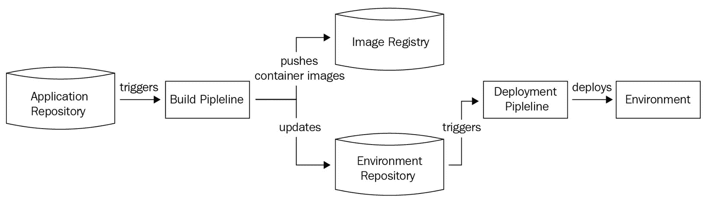

# 2

# 使用 Git 和 GitOps 进行源代码管理

在上一章中，我们了解了现代 DevOps 的核心概念，简要介绍了云计算，并对容器有了基本了解。在本章中，我们将了解源代码管理以及启用 DevOps 的现代方法之一——**GitOps**。

在本章中，我们将涵盖以下主要内容：

+   什么是源代码管理？

+   Git 快速入门

+   什么是 GitOps？

+   GitOps 的原则

+   为什么选择 GitOps？

+   分支策略和 GitOps 工作流

+   Git 与 GitOps

# 技术要求

要跟随本章内容，您需要访问基于 Linux 的命令行。如果您使用 macOS，可以使用内建的终端完成所有任务。如果您是 Windows 用户，则必须从[`git-scm.com/download/win`](https://git-scm.com/download/win)安装**GitBash**。我们将在接下来的章节中介绍安装说明。

现在，让我们从了解源代码管理开始。

# 什么是源代码管理？

软件开发涉及编写代码。代码是软件的唯一有形部分，它使软件能够运行。因此，您需要将代码存储在某个地方，以便编写和修改现有软件。代码有两种类型——**源代码**，它是用高级语言编写的，以及**二进制文件**，它是从源代码编译而来的。通常，二进制文件只不过是执行软件时运行的功能性应用，而源代码是为了生成二进制文件而编写的人类可读的代码，这也是为什么源代码被称为源代码的原因。

一个软件开发团队有多个成员在编写软件功能，因此他们必须在代码上进行协作。他们不能单独编写代码而不理解应用程序如何工作。有时，多个开发人员会共同开发同一个功能，因此他们需要一个地方来与同伴共享代码。源代码本身是一种资产；因此，我们希望将其安全地存储在中央位置，同时仍然能够便捷地为开发人员提供访问权限，而不妨碍他们的工作。您还需要跟踪更改并对其进行版本控制，因为您可能想知道是什么导致了问题，并能够立即回滚。您还需要保存代码的历史记录，以便了解哪些更改是由谁进行的，并且您还希望有一个源代码同行评审的机制。

如您所见，您可能希望管理源代码的多个方面，因此您将使用源代码管理工具来实现这一目标。

源代码管理工具帮助您管理源代码的各个方面。它提供一个集中位置来存储代码、版本更改，并允许多个开发者在相同的源代码上进行协作。它还通过版本历史记录保存所有的更改，以及我们之前提到的其他内容。有效的源代码管理实践能够提高协作效率；促进开发工作流的高效性；提供版本控制、仓库管理、分支和合并、变更跟踪、审计等功能；并提高软件项目的整体质量和可维护性。一些流行的 SCM 工具有 **Git**、**Subversion**、**Mercurial** 和 **CVS**。然而，最流行且事实上的 SCM 标准是 Git。所以，接下来我们来学习它。

# Git 快速入门

Git 是目前最流行的源代码管理系统，现如今所有开发者都必须学习 Git，至少要掌握基础内容。在本次快速入门中，我们将学习所有基本的 Git 操作，并在后续章节中进行拓展。

Git 是一个分布式版本控制系统。这意味着每个 Git 仓库都是原始仓库的副本，您可以在需要时将其复制到远程位置。在本章中，我们将创建并初始化一个本地 Git 仓库，然后将整个仓库推送到远程位置。

存储在远程中央位置的 Git 仓库也被称为 **远程仓库**。在这个中央仓库中，所有开发者将本地仓库的更改同步到远程仓库，类似于下图所示：


图 2.1 – Git 分布式仓库模型

首先，让我们在本地安装 Git 并初始化一个本地仓库。稍后我们将查看远程仓库。

## 安装 Git

根据您的平台和工作站的不同，安装 Git 的方式也不同。在 **Ubuntu** 上安装 Git，请运行以下命令：

```
$ sudo apt install -y git-all
```

对于其他操作系统和平台，您可以按照以下链接中的步骤操作：https://git-scm.com/book/en/v2/Getting-Started-Installing-Git。

要检查 Git 是否安装成功，请运行以下命令：

```
$ git --version
git version 2.30.2
```

现在，让我们初始化第一个 Git 仓库。

## 初始化您的第一个 Git 仓库

要创建一个 Git 仓库，您需要创建一个目录并运行 `git init` 命令，如下所示：

```
$ mkdir first-git-repo && cd first-git-repo/
$ git init
Initialized empty Git repository in ~/first-git-repo/.git/
```

您现在可以使用您的 Git 仓库了。您还可以看到，当您初始化 Git 仓库时，Git 创建了一个隐藏目录 `.git`，用于跟踪所有的更改和提交。您在仓库中所做的任何更改，Git 都会将它们作为差异（delta）记录，使用 `+` 和 `-` 符号表示。我们将在后续部分详细探讨这些内容。现在，让我们在 Git 仓库中创建一个新文件并暂存更改。

## 暂存代码更改

Git 允许开发者在提交之前暂存他们的更改。这有助于你准备好提交到仓库的内容。暂存区是你更改的临时存放区，你可以通过使用`git add`和`git restore`命令将文件添加或移除出暂存区。

让我们在本地 Git 仓库中创建第一个文件并暂存更改：

```
$ touch file1
```

或者，你也可以在`first-git-repo`目录中创建一个空白文件。

现在，我们将检查 Git 是否能检测到我们创建的新增文件。为此，我们需要运行以下命令：

```
$ git status
On branch master
No commits yet
Untracked files: (use "git add <file>..." to include in what will be committed)
	file1
nothing added to commit but untracked files present (use "git add" to track)
```

所以，如我们所见，Git 已经检测到`file1`并告诉我们它目前没有跟踪该文件。为了让 Git 跟踪该文件，让我们运行以下命令：

```
$ git add file1
```

现在，让我们再次运行`git status`来查看有哪些更改：

```
$ git status
On branch master
No commits yet
Changes to be committed: (use "git rm --cached <file>..." to unstage)
	new file:   file1
```

如我们所见，Git 现在显示`file1`作为暂存区中的新文件。你可以继续进行更改，当你完成后，可以使用以下命令提交这些更改：

```
$ git commit -m "My first commit"
[master (root-commit) cecfb61] My first commit
 1 file changed, 0 insertions(+), 0 deletions(-)
 create mode 100644 file1
```

Git 现在已记录了一个包含你更改的提交。现在，让我们再次使用以下命令查看它的状态：

```
$ git status
On branch master
nothing to commit, working tree clean
```

Git 现在报告工作树是干净的，没有任何需要提交的内容。它还显示没有未跟踪的文件。现在，让我们修改`file1`并在其中添加一些文本：

```
$ echo "This is first line" >> file1
$ cat file1
This is first line
```

`file1`现在包含了第一行。让我们继续提交这个更改：

```
$ git add file1
$ git commit -m "My second commit"
[master 4c55cf5] My second commit
 1 file changed, 1 insertion(+)
```

正如我们所看到的，Git 现在报告有一个文件已更改，并且有一处插入。记得我们讨论过 Git 只追踪提交之间的增量更改吗？这就是发生的情况。

在介绍中，我们提到 Git 提供了所有提交的历史记录。让我们看看如何显示这个历史记录。

## 显示提交历史

Git 保留了所有提交的历史记录。要查看你所做的所有提交列表，可以使用以下命令：

```
$ git log
commit 275d24c62a0e946b8858f562607265c269ec5484 (HEAD -> master)
Author: Gaurav Agarwal <example@gmail.com>
Date:   Wed Apr 19 12:27:13 2023 +0530
    My second commit
commit cecfb61b251f9966f50a4d8bb49742b7af014da4
Author: Gaurav Agarwal < example@gmail.com>
Date:   Wed Apr 19 12:20:02 2023 +0530
    My first commit
```

如我们所见，Git 已显示了我们两个提交的历史记录。注意，Git 为每个提交标记了一个提交 ID。我们还可以通过使用`git diff <first_commit_id> <second_commit_id>`命令来深入查看在提交中进行了哪些更改，具体如下：

```
$ git diff cecfb61b251f9966f50a4d8bb49742b7af014da4 \
275d24c62a0e946b8858f562607265c269ec5484
diff --git a/file1 b/file1
index e69de29..0cbcf32 100644
--- a/file1
+++ b/file1
@@ -0,0 +1 @@
+This is first line
```

输出清楚地显示，第二次提交已将`This is first line`添加到`file1`中。

你突然意识到需要在`file1`中再添加一行，并希望将其与同一提交一起完成。我们可以通过修改提交来做到这一点。我们将在下一节中讨论这个问题。

## 修改上一次提交

最佳实践是为某个特定功能的更改创建单独的提交。这有助于你更好地追踪更改，并使审阅者更容易进行审查。反过来，这也使得可视化和管理更清晰。然而，频繁提交也是最佳实践，以确保你的更改不会丢失。幸运的是，Git 允许你向上一次提交中添加更改。

为了演示这一点，让我们修改`file1`并添加另一行：

```
$ echo "This is second line" >> file1
$ cat file1
This is first line
This is second line
```

现在，让我们使用以下命令将更改添加到之前的提交中：

```
$ git add file1
$ git commit --amend
```

一旦你运行这个命令，Git 会显示一个提示，允许你修改提交信息（如果需要的话）。它将类似于以下内容：

```
My second commit
# Please enter the commit message for your changes. Lines
# starting with # will be ignored and an empty message aborts the commit
# Date Wed Apr 19 12:27:13 2023 +0530
# on branch master
# Changes to be commited
#	modified: file1
#
```

保存此文件（使用 `ESC:wq` 保存退出 Vim）。这将修改最后一次提交并包含更改。你应该会看到以下输出：

```
Date: Wed Apr 19 12:27:13 2023 +0530
 1 file changed, 2 insertions(+)
```

当 Git 修改提交时，你将无法再使用相同的提交 ID 引用之前的提交。相反，Git 会为修改后的提交生成一个单独的`SHA-1 id`。所以，让我们查看日志，亲自看看这个变化：

```
$ git log
commit d11c13974b679b1c45c8d718f01c9ef4e96767ab (HEAD -> master)
Author: Gaurav Agarwal <gaurav.agarwal@example.com>
Date:   Wed Apr 19 12:27:13 2023 +0530
    My second commit
commit cecfb61b251f9966f50a4d8bb49742b7af014da4
Author: Gaurav Agarwal < example@gmail.com>
Date:   Wed Apr 19 12:20:02 2023 +0530
    My first commit
```

现在，让我们再次运行 `diff` 命令，看看它报告了什么：

```
$ git diff cecfb61b251f9966f50a4d8bb49742b7af014da4 \
d11c13974b679b1c45c8d718f01c9ef4e96767ab
diff --git a/file1 b/file1
index e69de29..655a706 100644
--- a/file1
+++ b/file1
@@ -0,0 +1,2 @@
+This is first line
+This is second line
```

输出清楚地显示，第二次提交在 `file1` 中添加了 `This is first line` 和 `This is second line`。这样，你就成功修改了提交。

本地仓库的作用就像是在系统上保存文件。然而，既然你需要与他人共享代码，并防止因笔记本操作系统崩溃、盗窃、物理损坏等原因造成的安全隐患，你需要将代码推送到远程仓库。我们将在下一节讨论远程仓库。

## 理解远程仓库

**远程仓库**是 Git 仓库在中央位置的副本，供多人访问。这样，开发者可以同时在同一个代码库上工作，并且为你的代码提供了备份。你可以使用各种工具来托管远程仓库。著名的包括**GitHub**、**Bitbucket** 和 **Gerrit**。你可以将它们安装在本地服务器或云服务器上，或者使用**软件即服务**（**SaaS**）平台在线存储它们。本书将重点讲解 GitHub。

GitHub 是一个基于 web 的平台，帮助开发者进行代码协作。它基于 Git，并允许你托管远程 Git 仓库。GitHub 成立于 2008 年，并在 2018 年被微软收购。它是最受欢迎的开源 SaaS Git 仓库服务之一，包含了几乎所有全球可用的开源代码。

在创建第一个远程仓库之前，我们必须访问 [`github.com/signup`](https://github.com/signup) 创建一个账户。

创建完账户后，我们可以继续创建第一个远程 Git 仓库。

## 创建远程 Git 仓库

在 GitHub 上创建远程 Git 仓库非常简单。访问 [`github.com/new`](https://github.com/new)，设置 `first-git-repo`，其他字段保持默认，然后点击 **创建** **仓库** 按钮。

完成后，GitHub 会为你提供一些步骤，指导你如何连接到远程仓库。在我们深入这些步骤之前，我们需要为本地 Git 命令行配置一些身份验证，以便与远程仓库交互。让我们来看看。

## 设置远程 Git 仓库的身份验证

你可以通过以下几种方式与远程 Git 仓库进行身份验证：

+   **HTTPS**：在这种模式下，Git 使用 HTTPS 协议连接远程 Git 仓库。我们需要在 GitHub 账户中创建一个 HTTPS 令牌，并使用该令牌作为密码来进行身份验证。这个过程要求你每次进行 Git 身份验证时都输入令牌，因此并不是一个方便的选项。

+   **SSH**：在这种模式下，Git 使用 SSH 协议连接远程 Git 仓库。在使用 SSH 时，我们无需使用密码进行身份验证；相反，我们必须将从 Linux（或如果你使用 Git Bash 的话，可以在 Windows 上）命令行生成的 **SSH 密钥对** 的 **公钥** 添加到 GitHub 账户中。这个过程既更安全又更方便。

所以，让我们通过 SSH 认证设置与远程 Git 仓库的连接。

首先，我们必须在本地系统中生成 SSH 密钥对。打开终端，运行以下命令生成 SSH 密钥对：

```
$ ssh-keygen -t rsa
Generating public/private rsa key pair.
```

系统会提示你输入其他详细信息。继续按 *Enter* 键，直到再次出现提示。

一旦生成了密钥对，复制 `~/.ssh/id_rsa.pub` 文件中的公钥。

然后，访问 [`github.com/settings/ssh/new`](https://github.com/settings/ssh/new)，将公钥粘贴到 **Key** 字段，并点击 **Add SSH Key** 按钮。现在，我们已经准备好连接远程 Git 仓库。接下来，让我们看看在本地仓库中需要做哪些配置才能连接到远程仓库。

## 将本地仓库与远程仓库连接

你需要使用以下命令添加远程条目，以便从本地仓库连接到远程仓库：

```
$ git remote add origin git@github.com:<your-github-username>/first-git-repo.git
```

你还可以在 GitHub 仓库的 **快速设置** 页面找到这些详细信息。

现在我们已经设置好连接，接下来让我们看看如何将更改推送到远程仓库。

## 将更改从本地仓库推送到远程仓库

要将本地仓库的更改推送到远程仓库，使用以下命令：

```
$ git push -u origin master
Enumerating objects: 6, done.
Counting objects: 100% (6/6), done.
Delta compression using up to 12 threads
Compressing objects: 100% (2/2), done.
Writing objects: 100% (6/6), 474 bytes | 474.00 KiB/s, done.
Total 6 (delta 0), reused 0 (delta 0), pack-reused 0
To github.com: <your-github-username>/first-git-repo.git
 * [new branch]      master -> master
Branch 'master' set up to track remote branch 'master' from 'origin'.
```

现在，刷新远程仓库页面。你应该能看到代码已经同步，如下图所示：


图 2.2 – 远程仓库中的代码同步

你还可以使用内联编辑器通过 GitHub Web 门户进一步修改文件。虽然不推荐这么做，但我们会这样做来模拟另一位开发者更改了你正在工作的相同文件的情况。

点击 **file1**，然后点击 **铅笔** 图标以编辑文件，如下图所示：


图 2.3 – 编辑远程仓库中的文件

完成此操作后，会打开一个编辑窗口，你可以在文件中进行更改。让我们在文件中添加 `This is third line`，如图所示：


图 2.4 – 添加新行

向下滚动–你应该能看到一个**提交更改**部分，在这里你可以添加提交信息字段并点击**提交**按钮，如下图所示：


图 2.5 – 提交更改部分

一旦你点击了那个按钮，你应该能看到第三行，如下图所示：


图 2.6 – 远程提交的更改

此时，远程仓库已经做出了更改，但你也在本地仓库上进行了一些更改。为了模拟这种情况，让我们也在本地仓库中做一个更改，使用以下命令：

```
$ echo "This is fourth line" >> file1
$ cat file1
This is first line
This is second line
This is fourth line
$ git add file1
$ git commit -m "Added fourth line"
[master e411e91] Added fourth line
 1 file changed, 1 insertion(+)
```

现在我们已经在本地仓库提交了更改，让我们尝试使用以下命令将代码推送到远程仓库：

```
$ git push
To github.com:<your-github-username>/first-git-repo.git
 ! [rejected]        master -> master (fetch first)
error: failed to push some refs to 'github.com:<your-github-username>/first-git-repo.git'
hint: Updates were rejected because the remote contains work that you do not have locally. 
This is usually caused by another repository pushing to the same ref. You may want to 
first integrate the remote changes.
hint: (e.g., 'git pull ...') before pushing again.
hint: See the 'Note about fast-forwards' in 'git push --help' for details.
```

等等，发生了什么？我们尝试推送更改时，远程仓库拒绝了更改，因为在我们推送时，其他人已经在远程仓库做了提交，而我们的更改已经过时。我们需要先将远程仓库的更改拉取到本地仓库，然后再将我们的更改应用到这些现有的更改之上。我们将在下一节中讨论这个问题。

## 拉取和变基你的代码

**拉取代码**是指将远程仓库的最新代码下载到本地仓库。**变基**意味着将你的更改应用到最新的远程提交之上。在远程仓库中，最好的实践是先拉取代码，再将你的更改变基到已经存在的代码上。

让我们使用以下命令执行此操作：

```
$ git pull --rebase
remote: Enumerating objects: 5, done.
remote: Counting objects: 100% (5/5), done.
remote: Compressing objects: 100% (2/2), done.
remote: Total 3 (delta 0), reused 0 (delta 0),pack-reused 0
Unpacking objects: 100% (3/3), 652 bytes | 130.00 KiB/s, done.
From github.com:<your-github-username>/first-git-repo
   d11c139..f5b7620  master     -> origin/master
Auto-merging file1
CONFLICT (content): Merge conflict in file1
error: could not apply e411e91... Added fourth line
Resolve all conflicts manually, mark them as resolved with
"git add/rm <conflicted_files>", then run "git rebase --continue".
You can instead skip this commit: run "git rebase --skip".
To abort and get back to the state before "git rebase", run "git rebase --abort".
Could not apply e411e91... Added fourth line
```

现在，我们遇到了另一个问题：我们无法变基我们的提交，因为我们试图修改一个已经被其他人修改过的文件。Git 要求我们检查文件并做出适当的更改，以确保更改被正确应用。这种情况被称为**合并冲突**。Git 还会提供包含冲突的文件。让我们用文本编辑器打开该文件并进行适当的更改。

当前文件看起来是这样的：

```
This is first line
This is second line
<<<<<<< HEAD
This is third line
=======
This is fourth line
>>>>>>> e411e91 (Added fourth line)
```

`HEAD`所示的部分是远程仓库中的一行，显示了最近在远程做的更改。`e411e91` 提交显示了我们在本地所做的更改。让我们将文件更改为以下内容并保存：

```
This is first line
This is second line
This is third line
This is fourth line
```

现在，让我们将文件添加到暂存区，并使用以下命令继续执行变基：

```
$ git add file1
$ git rebase --continue
[detached HEAD 17a0242] Added fourth line
 1 file changed, 1 insertion(+)
Successfully rebased and updated refs/heads/master.
```

现在我们已经变基了更改，让我们通过运行以下命令查看 Git 仓库的状态：

```
$ git status
On branch master
Your branch is ahead of 'origin/master' by 1 commit.
  (use "git push" to publish your local commits)
nothing to commit, working tree clean
```

如我们所见，我们已经添加了一个需要推送到远程仓库的提交。现在让我们使用以下命令将其推送：

```
$ git push
Enumerating objects: 5, done.
Counting objects: 100% (5/5), done.
Delta compression using up to 12 threads
Compressing objects: 100% (2/2), done.
Writing objects: 100% (3/3), 297 bytes | 148.00 KiB/s, done.
Total 3 (delta 0), reused 0 (delta 0), pack-reused 0
To github.com:<your-github-username>/first-git-repo.git
   f5b7620..17a0242  master -> master
```

这次，推送成功了。

在大多数情况下，你通常需要复制主代码并进行更改，以测试新特性。你可能还希望在将更改合并到主代码库之前，先让别人审核这些更改。Git 通过使用 Git 分支来管理这一过程。我们将在下一节讨论 Git 分支。

## Git 分支

**Git 分支**是代码库的一个副本（从中创建分支的位置），你可以独立修改和工作，而不会影响主代码库。你在处理新特性时希望创建分支，以确保不影响包含已审核代码的主分支。大多数科技公司通常会有多个环境，其中代码会在不同阶段部署。例如，你可能有一个**开发环境**来测试特性，一个**预生产环境**来集成所有特性并测试完整的应用程序，还有一个**生产环境**，是终端用户访问的应用程序所在的环境。所以，也有可能你会有额外的特定环境分支，用于存放在这些分支上部署的代码。在本章的接下来的章节中，我们将讨论 GitOps，它基于这一基本原则。现在，让我们看看如何创建和管理 Git 分支。

## 创建和管理 Git 分支

要创建一个 Git 分支，必须先切换到你希望从中分支的分支。例如，在我们的示例仓库中，我们是在 master 分支上工作的。让我们保持在该分支并从中创建一个特性分支。

要创建分支，运行以下命令：

```
$ git branch feature/feature1
```

如我们所见，特性分支已经创建。要查看我们现在所在的分支，可以使用`git branch`命令。让我们现在就这样做：

```
$ git branch
```

正如我们通过`*`符号看到的，我们仍然在`master`分支上。好的一点是，它还在列表中显示了`feature/feature1`分支。现在让我们使用以下命令切换到特性分支：

```
$ git checkout feature/feature1
Switched to branch 'feature/feature1'
```

现在，我们在`feature/feature1`分支上。让我们对`feature/feature1`分支进行一些更改并提交到本地仓库：

```
$ echo "This is feature 1" >> file1
$ git add file1
$ git commit -m "Feature 1"
[feature/feature1 3fa47e8] Feature 1
 1 file changed, 1 insertion(+)
```

如我们所见，代码现在已经提交到`feature/feature1`分支。要查看版本历史记录，让我们运行以下命令：

```
$ git log
commit 3fa47e8595328eca0bc7d2ae45b3de8d9fd7487c (HEAD -> feature/feature1)
Author: Gaurav Agarwal <gaurav.agarwal@example.com>
Date:   Fri Apr 21 11:13:20 2023 +0530
    Feature 1
commit 17a02424d2b2f945b479ab8ba028f3b535f03575 (origin/master, master)
Author: Gaurav Agarwal <gaurav.agarwal@example.com>
Date:   Wed Apr 19 15:35:56 2023 +0530
    Added fourth line
```

如我们所见，`Feature 1`的提交记录出现在 Git 日志中。现在，让我们切换到`master`分支并再次运行相同的命令：

```
$ git checkout master
Switched to branch 'master'
Your branch is up to date with 'origin/master'.
$ git log
commit 17a02424d2b2f945b479ab8ba028f3b535f03575 (HEAD -> master, origin/master)
Author: Gaurav Agarwal <gaurav.agarwal@example.com>
Date:   Wed Apr 19 15:35:56 2023 +0530
    Added fourth line
commit f5b7620e522c31821a8659b8857e6fe04c2f2355
Author: Gaurav Agarwal <<your-github-username>@gmail.com>
Date:   Wed Apr 19 15:29:18 2023 +0530
    My third commit
```

如我们所见，`Feature 1`的提交更改缺失。这表明两个分支现在是隔离的（并且已经分叉）。现在，改变只存在于本地，还没有推送到远程仓库。为了将更改推送到远程仓库，我们将再次切换到`feature/feature1`分支。让我们通过以下命令来实现：

```
$ git checkout feature/feature1
Switched to branch 'feature/feature1'
```

现在我们已经切换到特性分支，让我们使用以下命令将分支推送到远程仓库：

```
$ git push -u origin feature/feature1
Enumerating objects: 5, done.
Counting objects: 100% (5/5), done.
Delta compression using up to 12 threads
Compressing objects: 100% (2/2), done.
Writing objects: 100% (3/3), 286 bytes | 286.00 KiB/s, done.
Total 3 (delta 1), reused 0 (delta 0), pack-reused 0
remote: Resolving deltas: 100% (1/1), completed with 1 local object.
remote:
remote: Create a pull request for 'feature/feature1' on GitHub by visiting:
remote:      https://github.com/<your-github-username>/first-git-repo/pull/new/feature/feature1
remote:
To github.com:<your-github-username>/first-git-repo.git
 * [new branch]      feature/feature1 -> feature/feature1
Branch 'feature/feature1' set up to track remote branch 'feature/feature1' from 'origin'.
```

这样，我们就成功地将新分支推送到了远程仓库。假设功能已经准备好，我们希望将更改合并到 master 分支。为此，我们需要发起一个拉取请求。我们将在下一部分查看拉取请求。

## 使用拉取请求

`master`。拉取请求通常对开发者有用，帮助他们在将代码合并到*最终*版本之前进行同行评审。评审者通常会检查代码质量、是否遵循最佳实践、以及编码标准是否合适。如果评审者不满意，他们可能会标记出某些更改部分并要求修改。通常会有多轮评审、修改和重新评审。一旦评审者对更改满意，他们可以批准拉取请求，然后请求者就可以合并代码。让我们看一下这个过程：

1.  让我们尝试发起一个拉取请求，将我们的代码从`feature/feature1`分支合并到`master`分支。为此，进入你的 GitHub 仓库，选择**拉取请求**，然后点击**新建拉取请求**按钮，如下图所示：


图 2.7 – 新拉取请求

1.  保持`master`，并在`feature/feature1`中：


图 2.8 – 比较更改

1.  如你所见，它显示了我们在`feature/feature1`分支上所做的所有更改。点击**创建拉取请求**按钮来创建拉取请求。在下一页，保持默认设置并点击**创建拉取请求**按钮：


图 2.9 – 拉取请求已创建

1.  如你所见，拉取请求已成功创建。在这里，你可以分配评审者并进行代码评审。一旦评审者批准代码，你就可以将代码合并到 master 分支。现在，让我们点击**合并拉取请求**按钮，接着点击**确认合并**按钮，这样就可以合并拉取请求。

1.  现在，检查`master`分支是否在 GitHub 上显示了更改。如果显示了，切换到`master`分支，并将更改拉取到本地仓库。你应该也能在本地仓库中看到这些更改。

这个留给你作为练习。

这是一个关于 Git 的速成课程，帮助你入门。现在，让我们继续了解 GitOps，它使用 Git 作为单一的真理来源，来启动你应用程序和基础设施中的几乎任何内容。

# 什么是 GitOps？

GitOps 是一种方法，旨在实现 DevOps，使得 Git 成为唯一的真相来源。与其维护一长串脚本和工具来支持这一点，GitOps 专注于为一切编写声明式代码，包括基础设施、配置和应用程序代码。这意味着你可以通过简单地使用 Git 仓库来轻松地创建任何东西。其理念是，你在 Git 仓库中声明所需的内容，背后有工具确保所需的状态始终保持在运行的应用程序和周围的基础设施中。用于启动这些工具的代码也存储在 Git 中，你不需要任何 Git 以外的东西。这意味着包括工具在内的一切都是自动化的。

虽然 GitOps 也使得组织内部的 DevOps 得以实现，但它主要侧重于使用 Git 来管理基础设施的配置和应用程序软件的部署。DevOps 是一个广泛的术语，包含一组原则、过程和工具，旨在使开发人员和运维团队无缝协作，缩短开发生命周期，最终目标是通过 CI/CD 周期更快地交付更好的软件。尽管 GitOps 严重依赖 Git 及其特性，并始终依赖 Git 进行版本控制、查找配置漂移并仅应用增量，DevOps 本身并不依赖任何工具，更加关注概念和过程。因此，你可以在不使用 Git 的情况下实现 DevOps，但无法在没有 Git 的情况下实现 GitOps。简单来说，GitOps 实现了 DevOps，但反过来并不总是成立。

# 为什么选择 GitOps？

GitOps 为我们提供了以下好处：

+   **它更快地部署更好的软件**：GitOps 简化了软件交付。你无需担心为部署类型需要什么工具。相反，你只需在 Git 中提交你的更改，背后的工具会自动进行部署。

+   `git revert`并恢复你的环境。其理念是，你不需要学习除 Git 之外的其他任何内容来执行发布或回滚。

+   **它提供更好的凭证管理**：使用 GitOps，你无需将凭证存储在不同的位置来使部署正常工作。你只需为工具提供对 Git 仓库和二进制仓库的访问权限，GitOps 会处理其余的部分。你可以通过限制开发人员对环境的访问并为他们提供对 Git 的访问，来保持环境的安全。

+   **部署是自我文档化的**：因为一切都保存在 Git 中，而 Git 记录了所有提交，所以部署是自动自我文档化的。你可以通过查看提交历史，准确知道是谁在什么时间部署了什么内容。

+   **它促进共享所有权和知识**：由于 Git 是组织内所有代码和配置的唯一真理来源，团队可以在一个地方理解事情是如何实现的，而不必依赖其他团队成员或存在歧义。这有助于推动团队内代码和知识的共享所有权。

现在我们已经了解了 GitOps 的好处，让我们来看看它的关键原则。

# GitOps 的原则

GitOps 有以下关键原则：

+   **它以声明性方式描述整个系统**：拥有声明性代码是 GitOps 的第一原则。这意味着，与其提供构建基础设施的指令，应用相关配置并部署应用程序，不如声明所需的最终状态。这意味着您的 Git 仓库始终保持唯一的真理来源。由于声明性变更是幂等的，您不必担心系统的状态，因为它最终会与 Git 中的代码保持一致。

+   **它使用 Git 来版本化所需的系统状态**：由于 Git 是一个优秀的版本控制系统，您不必过于担心如何部署和回滚。一次简单的 Git 提交意味着一个新的部署，而 Git 回滚意味着回滚。这意味着，除了确保 Git 仓库反映您需要的内容外，您不需要担心其他任何问题。

+   **它使用工具自动应用已批准的更改**：由于您已经将一切存储在 Git 中，您可以使用工具来查找仓库中的更改，并自动将其应用到环境中。您还可以有多个分支将更改应用到不同的环境中，并使用基于拉取请求的审批和控制过程，确保只有已批准的更改最终进入您的环境。

+   **它使用自愈代理来警报并纠正任何偏离**：我们有工具可以自动将 Git 中的任何更改应用到环境中。然而，我们还需要自愈代理来警报任何与仓库的偏离。例如，假设有人手动从环境中删除了一个容器，但没有从 Git 仓库中删除它。在这种情况下，代理应该警报团队，并重新创建该容器以纠正偏离。这意味着没有办法绕过 GitOps，Git 始终是唯一的真理来源。

使用现代 DevOps 工具和技术来实现并遵循这些原则非常简单，我们将在 *第十一章* 和 *第十二章* 中实际实施它们。然而，在本章中，我们将通过分支策略和 GitOps 工作流来审视这些设计原则。

# 分支策略和 GitOps 工作流

GitOps 至少需要两种 Git 仓库才能正常工作：**应用仓库**，它是触发构建的来源，以及**环境仓库**，它包含所有基础设施和**配置即代码**（**CaC**）。所有的部署都来自环境仓库，而对代码仓库的变化驱动部署。GitOps 有两种主要的部署模型：**推送模型**和**拉取模型**。我们来逐一讨论这两种模型。

## 推送模型

推送模型将 Git 仓库中的任何变化推送到环境中。下图详细解释了这一过程：



图 2.10 – 推送模型

推送模型本身并不关注现有配置，只会对 Git 仓库中的变化作出反应。因此，你需要设置某种形式的监控，来了解是否存在任何偏差。此外，推送模型需要在工具中存储所有环境凭证，因为它与环境交互并且需要管理部署。通常，我们使用**Jenkins**、**CircleCI** 或 **Travis CI** 来实现推送模型。虽然不推荐使用推送模型，但在使用**Terraform**进行云资源配置或使用**Ansible**进行配置管理时，它是不可避免的，因为它们本身就是基于推送的模型。现在，让我们更仔细地看看拉取模型。

## 拉取模型

拉取模型是一种*基于代理的部署模型*（也叫做*基于操作员的部署模型*）。在你的环境中，*代理*（或*操作员*）监控 Git 仓库的变化，并根据需要应用这些变化。操作员不断地将现有的配置与环境仓库中的配置进行比较，如果需要，则应用变化。下图详细展示了这一过程：


图 2.11 – 拉取模型

拉取模型的优点是，它在监控和响应环境变化的同时，也能响应仓库中的变化。这确保了任何与 Git 仓库不匹配的变化都会从环境中恢复。它还会通过邮件通知、工单工具或 Slack 通知，提醒运维团队任何无法修复的问题。由于操作员与代码部署所在的环境处于同一环境中，因此我们不需要在工具中存储凭证。相反，这些凭证会安全地存储在环境中。你甚至可以完全不存储任何凭证，使用像 Kubernetes 这样的工具时，你可以利用**基于角色的访问控制**（**RBAC**）和服务账户来管理操作员对环境的管理。

提示

在选择 GitOps 模型时，最佳实践是检查是否可以实现基于拉取的模型，而不是基于推送的模型。仅当无法使用基于拉取的模型时，才实施基于推送的模型。在基于推送的模型中实施轮询是一个好主意，通过定期运行`cron`作业等调度，定期运行推送以确保没有配置漂移。

我们不能单靠其中一种模型生存，因此大多数组织采用**混合模型**来运行 GitOps。这种混合模型结合了推送和拉取模型，并侧重于使用拉取模型。当无法使用拉取模型时，它使用推送模型。现在，让我们了解如何构建我们的 Git 仓库，以便它可以实施 GitOps。

## Git 仓库的结构化

要实施 GitOps，我们至少需要两个仓库：**应用程序仓库和环境仓库**。这并不意味着您不能将两者合并，但是为了简单起见，让我们分别看看它们。

### 应用程序仓库

应用程序仓库存储应用程序代码。这是一个您的开发人员可以积极开发您业务运行的产品的代码仓库。通常，您的构建源自这个应用程序代码，并且它们最终成为容器（如果我们使用基于容器的方法）。您的应用程序仓库可能有环境特定的分支，也可能没有。大多数组织将应用程序仓库独立于环境，并专注于使用分支策略构建语义化的代码版本。现在，有多种分支策略可用于管理您的代码，例如**Gitflow**、**GitHub flow**和任何适合您需求的其他分支策略。

Gitflow 是组织中使用的最流行的分支策略之一。也可以说，它是最复杂的之一，因为它需要多种类型的分支（例如主分支、热修复分支、发布分支、开发分支和功能分支）并且有一个严格的结构。Gitflow 的结构如下图所示：


图 2.12 – Gitflow 结构

使用 GitHub flow 的简化方法是做事情更少的分支，并且更易于维护。通常，它包含一个单一的主分支和许多功能分支，这些分支最终与主分支合并。主分支始终具有准备部署到环境中的软件。您在主分支中标记和版本化代码，选择并部署它，测试它，然后将其推广到更高的环境中。以下图详细展示了 GitHub flow：


图 2.13 – GitHub flow

请注意，您可以根据自己的需求和适用情况自由创建自己的分支策略。

提示

如果你有一个庞大的团队、大型单体仓库，并且有多个并行发布版本，可以选择 Gitflow。如果你在一个快速发展的组织中工作，每周发布几次更新，并且没有并行发布的概念，可以选择 GitHub flow。GitHub flow 通常适用于微服务，在这种情况下，变更较小且快速。

通常，应用程序仓库不需要过多担心环境问题；它们可以更多地专注于创建可部署的软件版本。

### 环境仓库

环境仓库存储运行应用程序代码所需的环境特定配置。因此，它们通常会包含**基础设施即代码**（**IaC**），如 Terraform 脚本、Ansible 剧本形式的 CaC，或 Kubernetes 清单，这些通常有助于部署我们从应用程序仓库构建的代码。

环境仓库应遵循特定环境的分支策略，其中每个分支代表一个特定的环境。对于这些场景，您可以使用基于拉取请求的**门控**。通常，您会从开发分支构建**开发环境**，然后提出拉取请求将更改合并到暂存分支。从暂存分支到生产分支，您的代码随着环境的变化而推进。如果有 10 个环境，您可能会在环境仓库中有 10 个不同的分支。以下图示展示了您可能希望遵循的环境仓库分支策略：


图 2.14 – 环境仓库

环境仓库旨在作为您环境的唯一可信来源。您添加到仓库中的配置将直接应用于您的环境。

提示

尽管可以将环境和应用程序仓库合并为一个，但最佳实践是将它们分开。GitOps 通过分别使用应用程序仓库和环境仓库，为 CI 和 CD 过程提供了明确的分离。

现在我们已经详细介绍了 Git 和 GitOps，接下来我们来看看为什么 Git 和 GitOps 是相关但不同的概念。

# Git 与 GitOps

下表总结了 Git 和 GitOps 之间的区别：

|  | **Git** | **GitOps** |
| --- | --- | --- |
| 定义 | Git 是一种分布式版本控制系统，用于跟踪源代码和其他文件的更改。它允许多个开发者高效地协作和管理代码修订。 | GitOps 是一组实践和原则，通过将 Git 作为管理和自动化基础设施和应用程序部署与操作的唯一可信来源。 |
| 重点 | 主要集中于源代码的版本控制和协作。 | 专注于通过基于 Git 的 DevOps 工作流自动化和管理基础设施和应用程序的部署与操作。 |
| 用法 | 在软件开发项目中广泛用于版本控制和协作。开发者使用 Git 来跟踪变更、管理分支和合并代码。 | 用于声明性定义和管理基础设施和应用程序配置。Git 存储库作为定义所需状态和驱动自动化的中心枢纽。 |
| 核心组件 | 存储库、分支、提交和拉取请求。 | Git 存储库、声明性配置文件（如 YAML）、Kubernetes 清单、CI/CD 流水线和部署工具如 Argo CD 或 Flux。 |
| 工作流程 | 开发者克隆、修改、提交和推送更改到远程存储库。他们通过拉取请求和分支合并进行协作。 | 基础设施和应用配置存储在 Git 存储库中。对这些配置的更改会触发自动化流程，如 CI/CD 流水线或协调循环，以将这些更改应用到目标环境中。 |
| 好处 | 为软件开发团队提供高效的版本控制、协作和代码管理。 | 促进基础设施和应用程序的代码、配置版本控制和声明式管理。简化基础设施部署，提供一致性，并启用自动化工作流程。 |
| 关注领域 | 源代码管理。 | 基础设施和应用程序部署与管理。 |
| 示例 | GitHub、Bitbucket、GitLab。 | Argo CD、Flux、Jenkins X、Weave Flux。 |

请记住，虽然 Git 是一个版本控制系统，但 GitOps 通过利用 Git 作为基础设施和应用程序配置的中心真实来源，允许自动化部署和管理 DevOps 工作流程。

# 总结

本章涵盖了 Git、GitOps、我们为什么需要它、其原则以及各种 GitOps 部署。我们还研究了可以创建来实现 GitOps 的不同类型的存储库，以及每种存储库的分支策略选择。

你现在应该能够做到以下几点：

+   理解什么是源代码管理及其在现代 DevOps 中的必要性

+   创建一个 Git 存储库并尝试使用`clone`、`add`、`commit`、`push`、`pull`、`branch`和`checkout`命令进行操作

+   理解 GitOps 是什么以及它如何适应现代 DevOps 的背景

+   理解为什么我们需要 GitOps 以及它如何实现现代 DevOps

+   理解 GitOps 的显著原则

+   理解如何使用有效的分支策略来实现基于组织结构和产品类型的 GitOps

在下一章中，我们将深入理解容器并探讨 Docker。

# 问题

回答以下问题以测试你对本章的理解：

1.  以下关于 Git 的说法哪些是正确的？（选择三个）

    1.  这是一个分布式 SCM 平台

    1.  这是一个集中式 SCM 平台

    1.  它允许多个开发者协作

    1.  它具有提交和分支

1.  在 Git 术语中，Git checkout 是什么意思？

    1.  从远程同步代码到本地

    1.  从一个分支切换到另一个分支

    1.  审查并批准拉取请求

1.  在 GitOps 中，什么构成了唯一的真理来源

    1.  Git 仓库

    1.  存储在数据存储中的配置

    1.  秘密管理系统

    1.  人工制品库

1.  以下哪些选项是 GitOps 的部署模型？（选择两个）

    1.  推送模型

    1.  拉取模型

    1.  错开模型

1.  是否应该在环境仓库中使用 Gitflow？

1.  对于具有多个并行开发和多个版本发布的单体应用，最适合的 Git 分支策略是什么？

    1.  Gitflow

    1.  GitHub 流

    1.  混合 GitHub 流

1.  哪种是 GitOps 推荐的部署模型？

    1.  推送模型

    1.  拉取模型

    1.  错开模型

# 答案

1.  A,C,D

1.  B

1.  A

1.  A,B

1.  否

1.  A

1.  B
