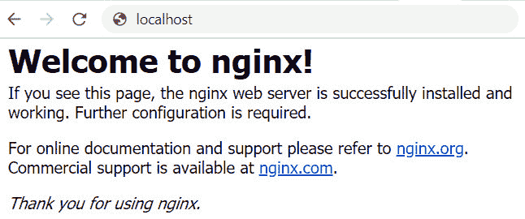
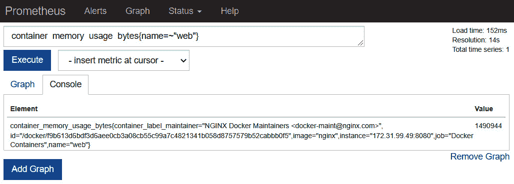
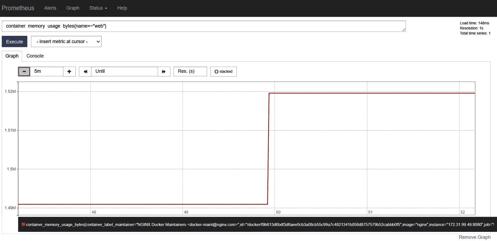
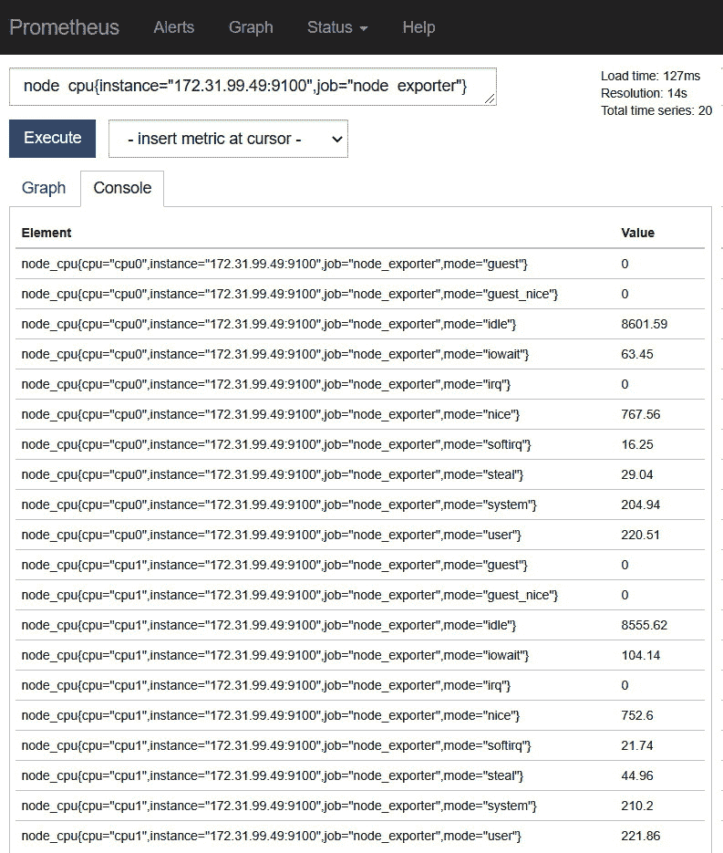
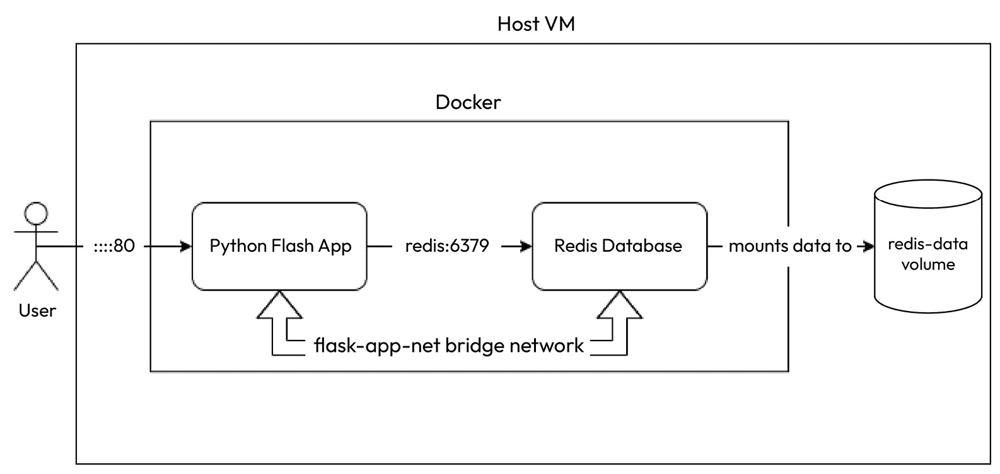

# 使用 Docker 容器化

在上一章中，我们讨论了 Git 的源代码管理，在那里我们进行了 Git 的速成学习，然后探讨了 GitOps 以及它如何塑造现代 DevOps 实践。

在本章中，我们将亲自操作并探索 **Docker** —— 当今最常用的容器运行时。到本章结束时，你应该能够安装并配置 Docker，运行你的第一个容器，并进行监控。本章内容也将为后续章节奠定基础，因为我们将在后面的演示中使用相同的设置。

本章我们将涵盖以下主要内容：

+   安装工具

+   安装 Docker

+   介绍 Docker 存储驱动程序和卷

+   运行你的第一个容器

+   Docker 日志记录与日志驱动

+   使用 Prometheus 进行 Docker 监控

+   使用 Docker Compose 进行声明式容器管理

# 技术要求

本章内容需要一台运行 Ubuntu 18.04 Bionic LTS 或更高版本的 Linux 机器，并且具有 sudo 权限。我们将在本书中使用 Ubuntu 22.04 Jammy Jellyfish，但你也可以自由选择任何操作系统。我将提供其他安装说明的链接。

你还需要克隆以下 GitHub 仓库以进行一些练习：[`github.com/PacktPublishing/Modern-DevOps-Practices-2e`](https://github.com/PacktPublishing/Modern-DevOps-Practices-2e)。

我们在上一章中详细讨论了 Git；因此，你可以轻松地利用这些知识克隆仓库。现在，让我们继续安装 Docker。

# 安装 Docker

我们将在 Ubuntu 系统上安装 Docker。对于其他操作系统，请参考 [`docs.docker.com/engine/install/`](https://docs.docker.com/engine/install/)。

要安装 Docker，我们需要安装支持工具，允许 `apt` 包管理器通过 HTTPS 下载 Docker。我们使用以下命令来完成此操作：

```
$ sudo apt-get update
$ sudo apt-get install -y ca-certificates curl gnupg
```

下载 Docker gpg 密钥并将其添加到 apt 包管理器：

```
$ sudo install -m 0755 -d /etc/apt/keyrings
$ curl -fsSL https://download.docker.com/linux/ubuntu/gpg | \
sudo gpg --dearmor -o /etc/apt/keyrings/docker.gpg
$ sudo chmod a+r /etc/apt/keyrings/docker.gpg
```

然后，你需要将 Docker 仓库添加到你的 `apt` 配置中，以便从那里下载包：

```
$ echo \
  "deb [arch="$(dpkg --print-architecture)" \
signed-by=/etc/apt/keyrings/docker.gpg] \
https://download.docker.com/linux/ubuntu \
"$(. /etc/os-release && echo "$VERSION_CODENAME")" \
stable" | sudo tee /etc/apt/sources.list.d/docker.list \
> /dev/null
```

最后，通过以下命令安装 Docker 引擎：

```
$ sudo apt-get update
$ sudo apt-get -y install docker-ce docker-ce-cli \
containerd.io docker-buildx-plugin docker-compose-plugin
```

要验证 Docker 是否安装成功，请运行以下命令：

```
$ sudo docker --version
```

你应该看到类似以下的输出：

```
Docker version 24.0.2, build cb74dfc
```

接下来，你需要做的事是允许普通用户使用 Docker。你希望你的用户在构建和运行容器时不是以 root 用户身份进行操作。为此，请运行以下命令：

```
$ sudo usermod -a -G docker <username>
```

要使更改应用到你的配置文件中，请从虚拟机退出并重新登录。

现在 Docker 已经在你的机器上完全设置好，让我们运行一个 `hello-world` 容器来验证这一点：

```
$ docker run hello-world
```

你应该看到以下输出：

```
Unable to find image 'hello-world:latest' locally
latest: Pulling from library/hello-world
719385e32844: Pull complete
Digest: sha256:fc6cf906cbfa013e80938cdf0bb199fbdbb86d6e3e013783e5a766f50f5dbce0
Status: Downloaded newer image for hello-world:latest
Hello from Docker!
```

你还会看到以下信息，告诉你在后台发生了什么，为什么会在屏幕上显示 `Hello from Docker!` 消息：

```
This message shows that your installation appears to be working correctly.
To generate this message, Docker took the following steps:
 1\. The Docker client contacted the Docker daemon.
 2\. The Docker daemon pulled the hello-world image from Docker Hub.(amd64).
 3\. The Docker daemon created a new container from that image that runs the executable 
that produces the output you are currently reading.
4\. The Docker daemon streamed that output to the Docker client, which sent it to your 
Terminal:
To try something more ambitious, you can run an Ubuntu container with:
 $ docker run -it ubuntu bash
Share images, automate workflows, and more with a free Docker ID:
 https://hub.docker.com/
For more examples and ideas, visit:
 https://docs.docker.com/get-started/
```

所有这些有用的信息是不言自明的。简单解释一下 Docker Hub，它是一个公共的 Docker 容器注册表，托管着许多供像你我这样的用户使用的 Docker 镜像。

由于 Docker 使用分层架构，大多数 Docker 镜像都是从一个或多个托管在 Docker Hub 上的基础镜像派生出来的。因此，请为自己创建一个 Docker Hub 账户，以便托管容器并与世界分享。

大多数组织可能希望保持镜像的私密性，因此你可以选择在 Docker Hub 中创建私有仓库。你还可以使用 **Google 容器注册表** (**GCR**) 等 SaaS 服务托管自己的内部 Docker 注册表，或者安装如 **Sonatype Nexus** 或 **JFrog Artifactory** 这样的工件仓库。不管你选择哪种工具，机制和工作原理始终是相同的。

# 介绍 Docker 存储驱动和卷

Docker 容器是短暂的工作负载。你在容器文件系统上存储的任何数据，在容器消失后都会被清除。数据在容器生命周期内存储在磁盘上，但不会超出其生命周期。实际上，大多数应用程序都是有状态的。它们需要在容器生命周期之外存储数据，并希望数据能够持久化。

那么，我们该如何进行呢？Docker 提供了几种存储数据的方式。默认情况下，所有数据都存储在可写容器层上，而该层是临时的。可写容器层通过存储驱动与主机文件系统交互。由于存在抽象层，写入容器层的文件比直接写入主机文件系统要慢。

为了解决这个问题并提供持久存储，Docker 提供了卷、绑定挂载和 `tmpfs`。通过这些，你可以直接与主机文件系统（以及在 `tmpfs` 的情况下与内存）交互，并节省大量的 **每秒 I/O 操作** (**IOPS**)，从而提高性能。尽管本节侧重于容器文件系统的存储驱动，但讨论 Docker 中的多种数据存储选项也很有价值，以便提供背景信息。

## Docker 数据存储选项

每个选项都有其使用场景和权衡。让我们来看一下每个选项以及应该在哪些地方使用它们。

### 卷

Docker 卷将数据直接存储在主机的文件系统中。它们不使用中间的存储驱动层，因此写入卷的速度更快。它们是持久化数据的最佳方式。Docker 将卷存储在 `/var/lib/docker/volumes` 中，并假设除了 Docker 守护进程外，没有人可以修改它们上的数据。

因此，卷提供以下功能：

+   提供与主机文件系统的某些隔离。如果你不希望其他进程与数据交互，那么卷应该是你的选择。

+   你可以与多个容器共享一个卷。

+   卷可以是命名的或匿名的。Docker 将匿名卷存储在一个具有唯一随机名称的目录中。

+   数据卷使你能够将数据远程存储或通过云提供商使用数据卷驱动进行存储。如果多个容器共享同一个数据卷以提供多实例的主动-主动配置，这非常有帮助。

+   即使容器被删除，数据卷中的数据也会持久存在。

现在，让我们来看一下另一种存储选项——绑定挂载。

### 绑定挂载

绑定挂载与数据卷非常相似，但有一个显著的区别：它允许你将现有的主机目录作为容器的文件系统进行挂载。这使你能够与 Docker 容器共享重要文件，例如`/etc/resolv.conf`。

绑定挂载也允许多个进程与 Docker 一起修改数据。因此，如果你将容器数据与另一个不在 Docker 中运行的应用程序共享，绑定挂载是最佳选择。

### tmpfs 挂载

`tmpfs` 挂载将数据存储在内存中。它们不会在磁盘上存储任何数据——无论是容器还是主机文件系统。你可以使用它们来存储敏感信息和容器生命周期中的非持久状态。

## 挂载数据卷

如果你将一个已经包含文件的主机目录挂载到容器的空数据卷上，容器就可以看到主机中存储的文件。这是为容器预填充文件的绝佳方式。然而，如果该目录在主机文件系统中不存在，Docker 会自动创建该目录。如果数据卷非空且主机文件系统中已经包含文件，Docker 将遮蔽该挂载。这意味着，在 Docker 卷挂载到该目录时，你不会看到原始文件，但文件并没有被删除，你可以通过卸载 Docker 卷来恢复它们。

我们将在下一部分讨论 Docker 存储驱动。

## Docker 存储驱动

存储驱动类型有很多种。以下是一些最受欢迎的存储驱动：

+   `overlay2`：这是一个适用于生产环境的驱动，是 Docker 推荐的存储选择。它适用于大多数环境。

+   `devicemapper`：这是 RHEL 和 CentOS 7 及以下版本的设备驱动，这些版本不支持 `overlay2`。如果你的容器中有写密集型操作，你可以使用此驱动。

+   `btrfs` 和 `zfs`：这些驱动程序是写密集型的，提供许多功能，例如允许快照，并且仅在主机使用 `btrfs` 或 `zfs` 文件系统时才可以使用。

+   `vfs`：此存储驱动仅应在没有写时复制文件系统的情况下使用。它非常慢，不建议在生产环境中使用。

让我们集中讨论两种最受欢迎的驱动——`overlay2` 和 `devicemapper`。

### overlay2

`overlay2`是大多数操作系统中默认和推荐的存储驱动，除了 RHEL 7、CentOS 7 及更早版本。它们使用基于文件的存储，并在读取操作多于写入操作时表现最佳。

### devicemapper

`devicemapper` 是基于块的存储，当写操作比读操作多时，它的表现最佳。虽然它与 CentOS 7、RHEL 7 及以下版本兼容，并且是默认存储驱动（因为它们不支持 `overlay2`），但在这些支持 `overlay2` 的新版本操作系统中，当前不推荐使用它。

提示

尽可能使用 `overlay2`，但如果你有特定的用例不适合使用它（比如容器写操作过于频繁），那么 `devicemapper` 是一个更好的选择。

## 配置存储驱动

在本讨论中，我们将配置 `overlay2` 作为存储驱动。虽然它是默认配置，如果你跟随本书的内容，你可以跳过这一步，但如果你想将其更改为其他驱动，还是值得了解一下。

首先，让我们列出当前的存储驱动：

```
$ docker info | grep 'Storage Driver'
Storage Driver: overlay2
```

我们可以看到当前的存储驱动已经是 `overlay2`。如果我们需要更改为 `devicemapper`，下面我们来看如何操作。

使用你选择的编辑器编辑 `/etc/docker/daemon.json` 文件。如果你使用 `vim`，可以运行以下命令：

```
$ sudo vim /etc/docker/daemon.json
```

将 `storage-driver` 条目添加到 `daemon.json` 配置文件中：

```
{
  "storage-driver": "devicemapper"
}
```

然后，重启 Docker 服务：

```
$ sudo systemctl restart docker
```

检查 Docker 服务的状态：

```
$ sudo systemctl status docker
```

现在，重新运行 `docker info` 查看我们得到的结果：

```
$ docker info | grep 'Storage Driver'
Storage Driver: devicemapper
WARNING: The devicemapper storage-driver is deprecated, and will be removed in a future 
release.
         Refer to the documentation for more information: https://docs.docker.com/go/
storage-driver/
WARNING: devicemapper: usage of loopback devices is strongly discouraged for production 
use.
         Use `--storage-opt dm.thinpooldev` to specify a custom block storage device.
```

这里，我们可以看到 `devicemapper` 存储驱动。我们还看到几个警告，表示 `devicemapper` 存储驱动已被弃用，并将在未来的版本中移除。

因此，除非有特定需求，否则我们应该坚持使用默认配置。

所以，让我们撤销之前的更改，并再次将存储驱动设置为 `overlay2`：

```
$ sudo vim /etc/docker/daemon.json
```

在 `daemon.json` 配置文件中，将 `storage-driver` 条目修改为 `overlay2`：

```
{
  "storage-driver": "overlay2"
}
```

然后，重启 Docker 服务并检查其状态：

```
$ sudo systemctl restart docker
$ sudo systemctl status docker
```

如果你重新运行 `docker info`，你将看到存储驱动变为 `overlay2`，所有警告也将消失：

```
$ docker info | grep 'Storage Driver'
Storage Driver: overlay2
```

提示

更改存储驱动会清除磁盘上现有的容器，因此在进行此操作时请小心，并确保在生产环境中安排适当的停机时间。如果你这样做，你还需要重新拉取镜像，因为本地镜像将不再存在。

现在我们已经在机器上安装了 Docker 并配置了正确的存储驱动，是时候运行我们的第一个容器了。

# 运行你的第一个容器

你可以通过 Docker 容器镜像来创建 Docker 容器。虽然我们将在后续章节中讨论容器镜像及其架构，但一个很好的形象化方式是将其视为包含所有文件、应用程序库和依赖项的副本，这些内容构成了你的应用环境，类似于虚拟机镜像。

要运行 Docker 容器，我们可以使用 `docker run` 命令，它的结构如下：

```
$ docker run [OPTIONS] IMAGE[:TAG|@DIGEST] [COMMAND] [ARG...]
```

让我们通过一些实际示例来看一下 `docker run` 命令及其变种。

在最简单的形式下，你只需输入以下命令来使用 `docker run`：

```
$ docker run hello-world
Unable to find image 'hello-world:latest' locally
latest: Pulling from library/hello-world
0e03bdcc26d7: Pull complete
Digest: sha256:e7c70bb24b462baa86c102610182e3efcb12a04854e8c582
838d92970a09f323
Status: Downloaded newer image for hello-world:latest
Hello from Docker!
...
```

如你所记得，我们在安装 Docker 时使用了这个命令。在这里，我有意省略了`tag`、`options`、`command`和`arguments`。我们将通过多个示例来展示它的实际使用场景。

由于我们没有提供`tag`，Docker 自动假设`tag`为`latest`，因此，如果你查看命令输出，你将看到 Docker 正在从 Docker Hub 拉取`hello-world:latest`镜像。

现在，让我们来看一个带有特定版本标签的示例。

## 从有版本标记的镜像运行容器

我们可以使用以下命令运行`nginx:1.18.0`：

```
$ docker run nginx:1.18.0
Unable to find image 'nginx:1.18.0' locally
1.18.0: Pulling from library/nginx
852e50cd189d: Pull complete
48b8657f2521: Pull complete
b4f4d57f1a55: Pull complete
d8fbe49a7d55: Pull complete
04e4a40fabc9: Pull complete
Digest: sha256:2104430ec73de095df553d0c7c2593813e01716a48d66f
85a3dc439e050919b3
Status: Downloaded newer image for nginx:1.18.0
/docker-entrypoint.sh: /docker-entrypoint.d/ is not empty, will attempt to perform
configuration
/docker-entrypoint.sh: Looking for shell scripts in /docker-entrypoint.d/
/docker-entrypoint.sh: Launching /docker-entrypoint.d/10-
listen-on-ipv6-by-default.sh
10-listen-on-ipv6-by-default.sh: Getting the checksum of /etc/nginx/conf.d/default.conf
10-listen-on-ipv6-by-default.sh: Enabled listen on IPv6 in /etc/nginx/conf.d/default.conf
/docker-entrypoint.sh: Launching /docker-entrypoint.d/20-
envsubst-on-templates.sh
/docker-entrypoint.sh: Configuration complete; ready for
start up
```

注意，提示符在此后将会卡住。这是有原因的：`nginx`是一个长期运行的进程，也就是守护进程。由于 NGINX 是一个需要持续监听 HTTP 请求的 Web 服务器，所以它应该永远不会停止。而`hello-world`应用程序的唯一任务是打印消息并退出。NGINX 的用途完全不同。

现在，没人会为一个 Web 服务器保持打开的 Bash 会话，所以必须有某种方法将其运行在后台。你可以通过分离模式来运行容器。我们将在下一节中详细讨论这一点。

## 在后台运行 Docker 容器

要将 Docker 容器作为守护进程在后台运行，你可以使用带有`-d`标志的`docker run`命令：

```
$ docker run -d nginx:1.18.0
beb5dfd529c9f001539c555a18e7b76ad5d73b95dc48e8a35aecd7471ea938fc
```

如你所见，它仅打印一个随机 ID 并将控制权返回到 shell。

## 容器故障排除

要查看容器内发生的情况，你可以使用`docker logs`命令。但在使用之前，我们需要知道容器的 ID 或名称，以便查看容器的日志。

要获取主机中正在运行的容器列表，请运行以下命令

```
$ docker ps
CONTAINER ID  IMAGE         COMMAND        CREATED        STATUS        PORTS   NAMES
beb5dfd529c9  nginx:1.18.0  "/docker-      2 minutes ago  Up 2 minutes  80/tcp  fervent_
                            entrypoint.…"                                       shockley
```

上面的命令列出了我们刚刚启动的 NGINX 容器。除非你为容器指定了特定的名称，否则 Docker 会分配一个随机名称。在这种情况下，它将容器命名为`fervent_shockley`。它还会为每个容器分配一个唯一的容器 ID，例如`beb5dfd529c9`。

你可以使用容器 ID 或容器名称与容器进行交互，以列出日志。我们这次使用容器 ID：

```
$ docker logs beb5dfd529c9
/docker-entrypoint.sh: /docker-entrypoint.d/ is not empty, will attempt to perform 
configuration
...
/docker-entrypoint.sh: Configuration complete; ready for start up
```

如你所见，它打印出了与我们在前台运行时相似的日志输出。

实际上，除非你需要用 BusyBox 调试某些问题，否则你 90%的时间都会使用`docker logs`。BusyBox 是一个轻量级的 Shell 容器，可以帮助你排查和调试容器的问题——主要是网络问题。

让我们让 BusyBox 为我们回显`Hello World!`：

```
$ docker run busybox echo 'Hello World!'
Unable to find image 'busybox:latest' locally
latest: Pulling from library/busybox
325d69979d33: Pull complete
Digest: sha256:560af6915bfc8d7630e50e212e08242d37b63bd5c1ccf9bd4acccf116e262d5b
Status: Downloaded newer image for busybox:latest
Hello World!
```

如我们所见，Docker 从 Docker Hub 拉取了最新的`busybox`镜像并运行了`echo 'Hello` `World'`命令。

你还可以通过使用`-it`标志在交互模式下使用 BusyBox，这将帮助你在 BusyBox shell 上运行一系列命令。最好还加上`--rm`标志，告诉 Docker 在我们退出 shell 后清理容器，像这样：

```
$ docker run -it --rm busybox /bin/sh
/ # echo 'Hello world!'
Hello world!
/ # wget http://example.com
Connecting to example.com (93.184.216.34:80)
saving to 'index.html'
index.html           100% |***********************************
****|  1256  0:00:00 ETA
'index.html' saved
/ # exit
```

在列出所有容器时，我们没有看到 `busybox` 容器：

```
$ docker ps -a
CONTAINER ID  IMAGE   COMMAND        CREATED     STATUS    PORTS   NAMES
beb5dfd529c9  nginx:  "/docker-      17 minutes  Up 17     80/tcp  fervent_
              1.18.0  entrypoint.…"  ago         minutes           shockley
```

你可以使用各种其他标志来配置容器，每个标志都有特定的用途。让我们看几个常见的。

## 综合起来

高可用 NGINX 容器的最佳设置应类似于以下内容：

```
$ docker run -d --name nginx --restart unless-stopped \
-p 80:80 --memory 1000M --memory-reservation 250M nginx:1.18.0
```

让我们更详细地看看这个：

+   `-d`：以守护进程模式在分离模式下运行。

+   `--name nginx`：为容器命名为 `nginx`。

+   `--restart unless-stopped`：除非手动停止，否则始终在失败时自动重启，并且在 Docker 守护进程启动时自动启动。其他选项包括 `no`、`on_failure` 和 `always`。

+   `-p 80:80`：将主机端口 `80` 转发到容器端口 `80`。这允许你将容器暴露到主机网络。

+   `--memory 1000M`：将容器的内存消耗限制为 `1000M`。如果内存超出此限制，容器会停止，并根据 `--restart` 标志进行处理。

+   `--memory-reservation 250M`：为容器分配一个软限制 `250M` 内存，如果服务器内存不足时使用。

在接下来的部分中，我们将深入探讨其他标志，并进行更多实操。

提示

考虑使用 `unless-stopped` 代替 `always`，因为它允许在需要进行维护时手动停止容器。

现在，让我们列出容器，看看我们得到什么：

```
$ docker ps -a
CONTAINER ID  IMAGE   COMMAND         CREATED     STATUS   PORTS       NAMES
06fc749371b7  nginx   "/docker-       17 seconds  Up 16    0.0.0.0:    nginx   
                      entrypoint.…"   ago         seconds  80->80/tcp  
beb5dfd529c9  nginx:  "/docker-       22 minutes  Up 22    80/tcp      fervent_shockley
              1.18.0  entrypoint.…"   ago         minutes
```

如果仔细观察，你会看到一个名为 `nginx` 的容器，并且有一个从 `0.0.0.0:80 ->` `80` 的端口转发。

现在，让我们在主机的 `localhost:80` 上使用 `curl` 来查看结果：

```
$ curl localhost:80
<!DOCTYPE html>
<html>
<head>
<title>Welcome to nginx!</title>
...
</html>
```

我们得到了 NGINX 欢迎信息。这意味着 NGINX 正常运行，我们可以从机器上访问它。如果你已将机器的端口 `80` 暴露到外部世界，你也可以通过浏览器访问它，如下所示：



图 3.1 – NGINX 欢迎页面

你可能还希望偶尔重启或删除容器。我们将在下一节中介绍如何做到这一点。

## 重启和删除容器

要重启容器，你必须先停止它们，然后再启动它们。

要停止容器，请运行以下命令：

```
$ docker stop nginx
```

要启动容器，请运行以下命令：

```
$ docker start nginx
```

如果你想完全删除容器，首先需要停止容器，然后使用以下命令删除它：

```
$ docker stop nginx && docker rm nginx
```

或者，你可以使用以下命令一次性完成：

```
$ docker rm -f nginx
```

现在，让我们看看如何使用 `journald` 和 Splunk 等工具监控容器。

# Docker 日志和日志驱动程序

Docker 不仅改变了应用程序的部署方式，还改变了日志管理的工作流。容器不再将日志写入文件，而是将日志写入控制台（`stdout`/`stderr`）。然后，Docker 使用日志驱动程序将容器日志导出到指定的目标位置。

## 容器日志管理

日志管理是 Docker 中的一个重要功能，就像任何应用程序一样。然而，由于 Docker 工作负载的临时性质，它变得更加重要，因为当容器被删除或遇到任何问题时，我们可能会丢失文件系统和日志。因此，我们应该使用日志驱动程序将日志导出到特定的位置并存储和持久化它。如果你有日志分析解决方案，那么将日志存储在其中是最好的地方。Docker 通过日志驱动程序支持多个日志目标。让我们来看看。

## 日志驱动程序

在撰写时，以下日志驱动程序可用：

+   `none`: 容器没有日志，因此日志不会存储在任何地方。

+   `local`: 日志以自定义格式本地存储，从而最小化开销。

+   `json-file`: 日志文件以 JSON 格式存储。这是默认的 Docker 日志驱动程序。

+   `syslog`: 该驱动程序也使用 `syslog` 来存储 Docker 日志。当你将 `syslog` 作为默认日志机制时，这个选项是有意义的。

+   `journald`: 使用 `journald` 存储 Docker 日志。你可以使用 `journald` 命令行来浏览容器和 Docker 守护进程日志。

+   `gelf`: 将日志发送到 **Graylog 扩展日志格式** (**GELF**) 端点，如 Graylog 或 Logstash。

+   `fluentd`: 将日志发送到 Fluentd。

+   `awslogs`: 将日志发送到 AWS CloudWatch。

+   `splunk`: 使用 HTTP 事件收集器将日志发送到 Splunk。

+   `etwlogs`: 将日志发送到 **Windows 事件追踪** (**ETW**) 事件。只能在 Windows 平台上使用。

+   `gcplogs`: 将日志发送到 Google Cloud Logging。

+   `logentries`: 将日志发送到 Rapid7 Logentries。

尽管这些选项都可行，我们将重点查看 `journald` 和 Splunk。`journald` 是一种本地操作系统服务监控选项，而 Splunk 是最著名的日志分析和监控工具之一。现在，让我们了解如何配置日志驱动程序。

## 配置日志驱动程序

让我们从查找当前的日志驱动程序开始：

```
$ docker info | grep "Logging Driver"
Logging Driver: json-file
```

当前，默认日志驱动程序设置为 `json-file`。如果我们希望使用 `journald` 或 Splunk 作为默认日志驱动程序，必须在 `daemon.json` 文件中配置默认日志驱动程序。

使用你喜欢的编辑器编辑 `/etc/docker/daemon.json` 文件。如果你使用 `vim`，运行以下命令：

```
$ sudo vim /etc/docker/daemon.json
```

在 `daemon.json` 配置文件中添加 `log-driver` 项：

```
{
  "log-driver": "journald"
}
```

然后，重启 Docker 服务：

```
$ sudo systemctl restart docker
```

检查 Docker 服务的状态：

```
$ sudo systemctl status docker
```

现在，重新运行 `docker info` 查看我们得到的结果：

```
$ docker info | grep "Logging Driver"
Logging Driver: journald
```

现在，`journald` 是默认的日志驱动程序，让我们启动一个新的 NGINX 容器并查看日志：

```
$ docker run --name nginx-journald -d nginx
66d50cc11178b0dcdb66b114ccf4aa2186b510eb1fdb1e19d563566d2e96140c
```

现在，让我们查看 `journald` 日志，看看我们能得到什么：

```
$ sudo journalctl CONTAINER_NAME=nginx-journald
...
Jun 01 06:11:13 99374c32101c fb8294aece02[10826]: 10-listen-on-ipv6-by-default.sh: info: 
Enabled listen on IPv6 in /etc/nginx/conf.d/default.conf
...
Jun 01 06:11:13 99374c32101c fb8294aece02[10826]: 2023/06/01 06:11:13 [notice] 1#1: start 
worker process 30
...
```

我们可以在日志中查看到这些内容。

同样，我们可以配置 Splunk 日志驱动程序将数据发送到 Splunk 进行分析和可视化。让我们来看看。

使用你喜欢的编辑器编辑 `/etc/docker/daemon.json` 文件。如果你使用 `vim`，运行以下命令：

```
$ vim /etc/docker/daemon.json
```

将 log-driver 条目添加到`daemon.json`配置文件：

```
{
  "log-driver": "splunk",
  "log-opts": {
    "splunk-token": "<Splunk HTTP Event Collector token>",
    "splunk-url": "<Splunk HTTP(S) url>"
  }
}
```

然后，重启 Docker 服务：

```
$ sudo systemctl restart docker
```

检查 Docker 服务的状态：

```
$ sudo systemctl status docker
```

现在，重新运行`docker info`，看看我们得到什么：

```
$ docker info | grep "Logging Driver"
Logging Driver: splunk
```

由于 Splunk 现在是默认的日志驱动程序，让我们启动一个新的 NGINX 容器并可视化日志：

```
$ docker run --name nginx-splunk -d nginx
dedde062feba33f64efd89ef9102c7c93afa854473cda3033745d35d9065c9e5
```

登录到你的 Splunk 实例；你将看到 Docker 日志正在流式传输。然后，你可以分析日志并从中创建可视化。

你还可以为不同的容器配置不同的日志驱动程序，方法是通过命令行传递`log-driver`和`log-opts`标志来覆盖默认设置。由于我们当前的配置是 Splunk，并且我们希望将数据导出到 JSON 文件，因此可以在运行容器时将`log-driver`指定为`json-file`。让我们来看一下：

```
$ docker run --name nginx-json-file --log-driver json-file -d nginx
379eb8d0162d98614d53ae1c81ea1ad154745f9edbd2f64cffc2279772198bb2
```

要查看 JSON 日志，我们需要查看 JSON 日志目录——即`/var/lib/docker/containers/<container_id>/<container_id>-json.log`。

对于`nginx-json-file`容器，我们可以执行以下操作：

```
$ cat /var/lib/docker/containers\
/379eb8d0162d98614d53ae1c81ea1ad154745f9edbd2f64cffc2279772198bb2\
/379eb8d0162d98614d53ae1c81ea1ad154745f9edbd2f64cffc2279772198bb2-json.log
{"log":"/docker-entrypoint.sh: /docker-entrypoint.d/ is not
empty, will attempt to perform configuration\n","stream":"
stdout","time":"2022-06-01T06:27:05.922950436Z"}
...
{"log":"/docker-entrypoint.sh: Configuration complete; ready
for start up\n","stream":"stdout","time":"2023-06-01T06:27:
05.937629749Z"}
```

我们可以看到，日志现在正在流式传输到 JSON 文件，而不是 Splunk。这就是我们如何覆盖默认日志驱动程序的方式。

提示

在大多数情况下，最好坚持使用一个默认的日志驱动程序，这样你就可以在一个地方分析和可视化你的日志。

现在，让我们了解一下与 Docker 日志相关的一些挑战和最佳实践。

## Docker 日志的典型挑战以及应对这些挑战的最佳实践：

Docker 允许你在单台机器或一组机器上运行多个应用程序。大多数组织同时运行虚拟机和容器，并且已经配置了日志记录和监控堆栈以支持虚拟机。

大多数团队在让 Docker 日志像虚拟机日志一样工作时遇到困难。因此，大多数团队会将日志发送到主机文件系统，然后日志分析解决方案从中获取数据。这并不是理想的做法，你应该避免犯这个错误。如果你的容器是静态的，这种做法可能有效，但如果你有一组运行 Docker 的服务器集群，并且可以将容器调度到任意虚拟机上，那么就会成为一个问题。

从日志的角度来看，将容器视为运行在虚拟机上的应用程序是一个错误。相反，你应该将容器视为一个实体——就像虚拟机一样。你绝不应该将容器与虚拟机关联在一起。

一种解决方案是使用日志驱动程序将日志直接转发到日志分析解决方案中。但是，日志记录就会严重依赖于日志分析解决方案的可用性。所以，这可能不是最好的做法。当 Docker 上的服务因为日志分析解决方案不可用或网络问题而宕机时，很多人都遇到过问题。

好吧，解决这个问题的最佳方法是使用 JSON 文件暂时存储虚拟机中的日志，并使用另一个容器将日志以传统方式推送到你选择的日志分析解决方案。这样，你就将应用程序的运行与外部服务的依赖解耦了。

你可以使用日志驱动程序直接将日志导出到日志转发容器中的日志分析解决方案。有许多日志驱动程序支持多个日志目标。始终以这样的方式标记日志，使容器作为独立实体出现。这将使容器与虚拟机解耦，之后你就可以充分利用分布式容器架构。

到目前为止，我们已经看过容器的日志方面，但 DevOps 工程师角色的一个重要元素是监控。我们将在下一节中详细探讨这一点。

# 使用 Prometheus 进行 Docker 监控

监控 Docker 节点和容器是管理 Docker 的关键部分。有许多工具可以用于监控 Docker。虽然你可以使用传统工具，如 Nagios，但 Prometheus 在云原生监控中逐渐崭露头角，因为它简单且具有可插拔的架构。

Prometheus 是一个免费的开源监控工具，它提供了维度数据模型、使用 **Prometheus 查询语言**（**PromQL**）的高效且简单的查询、有效的时间序列数据库和现代的告警功能。

它提供了多个导出器，可从各种来源导出数据，支持虚拟机和容器。在深入细节之前，让我们看看容器监控的一些挑战。

## 容器监控的挑战

从概念上讲，容器监控与传统方法没有区别。你仍然需要指标、日志、健康检查和服务发现。这些并不是未知的或没有被探索过的东西。容器面临的问题是它们带来的抽象；让我们来看一下其中的一些问题：

+   容器表现得像迷你虚拟机；然而，实际上，它们是运行在服务器上的进程。但它们仍然有许多需要监控的内容，就像我们在虚拟机中一样。容器进程会有许多指标，类似于虚拟机，需要作为独立实体来处理。处理容器时，大多数人会犯一个错误，那就是把容器映射到特定的虚拟机。

+   容器是临时的，大多数人没有意识到这一点。当你有一个容器并且它被重建时，它会有一个新的 IP 地址。这可能会混淆传统的监控系统。

+   运行在集群中的容器可以从一个节点（服务器）移动到另一个节点。这增加了一个复杂性层，因为您的监控工具需要知道容器的位置，以便从中抓取指标。使用现代的、容器优化的工具，这不应该成为问题。

Prometheus 帮助我们解决这些挑战，因为它是从分布式应用程序的角度构建的。为了理解这一点，我们将通过一个实践示例来进行说明。但是，在此之前，让我们在另一台 Ubuntu 22.04 Linux 机器上安装 Prometheus。

## 安装 Prometheus

安装 Prometheus 包括几个步骤，为了简化，我创建了一个 Bash 脚本，用于在 Ubuntu 机器上安装和设置 Prometheus。

在您想要设置 Prometheus 的另一台机器上使用以下命令：

```
$ git clone https://github.com/PacktPublishing/Modern-DevOps-Practices-2e.git \
modern-devops
$ cd modern-devops/ch3/prometheus/
$ sudo bash prometheus_setup.sh
```

要检查 Prometheus 是否已安装并正在运行，可以使用以下命令检查 Prometheus 服务的状态：

```
$ sudo systemctl status prometheus
prometheus.service – Prometheus
   Loaded: loaded (/etc/systemd/system/prometheus.service; enabled; vendor preset: 
enabled)
   Active: active (running) since Tue 2023-06-01 09:26:57 UTC; 1min 22s ago
```

由于服务处于`活动`状态，我们可以得出结论，Prometheus 已成功安装并正在运行。下一步是配置 Docker 服务器，以便 Prometheus 能够从中收集日志。

## 配置 cAdvisor 和节点出口程序以暴露指标

现在，我们将在运行 Docker 的机器上启动一个 cAdvisor 容器，以暴露 Docker 容器的指标。cAdvisor 是一个指标收集器，用于从容器中抓取指标。要启动容器，请使用以下命令：

```
$ docker run -d --restart always --name cadvisor -p 8080:8080 \
-v "/:/rootfs:ro" -v "/var/run:/var/run:rw" -v "/sys:/sys:ro" \
-v "/var/lib/docker/:/var/lib/docker:ro" google/cadvisor:latest
```

现在 cAdvisor 正在运行，我们需要配置节点导出器，以便在 Docker 机器上导出节点指标。为此，运行以下命令：

```
$ cd ~/modern-devops/ch3/prometheus/
$ sudo bash node_exporter_setup.sh
```

现在节点导出器正在运行，让我们配置 Prometheus 以连接到 cAdvisor 和节点导出器，并从那里抓取指标。

## 配置 Prometheus 以抓取指标

我们现在将在 Prometheus 机器上配置 Prometheus，以便它可以从 cAdvisor 抓取指标。为此，修改 `/etc/prometheus/prometheus.yml` 文件，使其在运行 Prometheus 的服务器中包含以下内容：

```
$ sudo vim /etc/prometheus/prometheus.yml
  ...
  - job_name: 'node_exporter'
    scrape_interval: 5s
    static_configs:
      - targets: ['localhost:9100', '<Docker_IP>:9100']
  - job_name: 'Docker Containers'
    static_configs:
      - targets: ['<Docker_IP>:8080']
```

更改此配置后，我们需要重新启动 Prometheus 服务。使用以下命令执行此操作：

```
$ sudo systemctl restart prometheus
```

现在，让我们启动一个示例 Web 应用程序，我们将使用 Prometheus 来监控它。

## 启动一个示例容器应用程序

现在，让我们运行一个名为 `web` 的 NGINX 容器，该容器在 Docker 机器上的 `8081` 端口上运行。为此，请使用以下命令：

```
$ docker run -d --name web -p 8081:80 nginx
f9b613d6bdf3d6aee0cb3a08cb55c99a7c4821341b058d8757579b52cabbb0f5
```

现在我们已经设置好 Docker 容器，让我们通过访问 `https://<PROMETHEUS_SERVER_EXTERNAL_IP>:9090` 打开 Prometheus UI，然后在文本框中输入以下查询来运行它：

```
container_memory_usage_bytes{name=~"web"}
```

它应该显示类似以下内容：



图 3.2 – Prometheus – container_memory_usage_bytes

我们还可以通过点击**图表**标签页来查看此指标的时间序列。然而，在此之前，让我们使用 Apache Bench 工具加载我们的 NGINX 服务。Apache Bench 是一款负载测试工具，帮助我们通过命令行向 NGINX 端点发送 HTTP 请求。

在你的 Docker 服务器上，运行以下命令来启动负载测试：

```
$ ab -n 100000 http://localhost:8081/
```

它将向端点发送 100,000 个请求，这意味着它提供了相当大的负载来进行内存突增。现在，如果你打开**图表**标签页，你应该会看到类似以下内容：



图 3.3 – Prometheus – container_memory_usage_bytes – 图表

要可视化节点指标，我们可以使用以下 PromQL 语句来获取 Docker 主机的 `node_cpu` 值：

```
node_cpu{instance="<Docker_IP>:9100",job="node_exporter"}
```

如下图所示，它将为我们提供多种模式的 `node_cpu` 指标：



图 3.4 – Prometheus – node_cpu

Prometheus 还提供了多种其他可视化的指标。让我们来了解一些你可以监控的指标。

## 需要监控的指标

监控指标是一个复杂的话题，主要取决于你的使用场景。不过，以下是一些关于你需要监控的指标的指南。

### 主机指标

你需要监控你的主机指标，因为你的容器是在它们上面运行的。你可以监控的一些指标如下：

+   **主机 CPU**：了解你的主机是否有足够的 CPU 来运行容器非常重要。如果没有，它可能会终止一些容器来弥补这一点。因此，为了确保可靠性，你需要时刻监控这一点。

+   **主机内存**：像监控主机 CPU 一样，你需要监控主机内存，以便发现内存泄漏或内存异常等问题。

+   **主机磁盘空间**：由于 Docker 容器使用主机文件系统来存储临时和持久化文件，因此你需要监控它。

### Docker 容器指标

Docker 容器指标是下一个需要考虑的事项：

+   **容器 CPU**：此指标将提供 Docker 容器使用的 CPU 数量。你应该监控它，以了解容器的使用模式，并决定如何有效地放置容器。

+   **限速 CPU 时间**：此指标帮助我们了解容器 CPU 被限速的总时间。这可以让我们知道是否某个特定的容器比其他容器需要更多的 CPU 时间，从而可以相应地调整 CPU 份额限制。

+   **容器内存失败计数器**：此指标提供容器请求的内存超过分配内存的次数。这将帮助你了解哪些容器需要更多的内存，从而可以根据需要调整容器运行。

+   **容器内存使用量**：此指标将提供 Docker 容器使用的内存量。你可以根据使用情况设置内存限制。

+   **容器交换**：这个指标会告诉你哪些容器使用了交换空间而不是内存。它帮助我们识别占用内存较多的容器。

+   **容器磁盘 I/O**：这是一个重要的指标，帮助我们了解容器的磁盘使用情况。峰值可能表明磁盘存在瓶颈，或者提示你可能需要重新审视存储驱动程序的配置。

+   **容器网络指标**：这个指标将告诉我们容器使用了多少网络带宽，并帮助我们理解流量模式。你可以使用这些指标来检测意外的网络高峰或拒绝服务攻击。

重要提示

在非生产环境的性能测试阶段对你的应用程序进行性能分析，将给你一个系统在生产环境中表现的粗略概念。应用程序的实际调优工作开始于你将其部署到生产环境时。因此，监控至关重要，调优是一个持续的过程。

到目前为止，我们一直在运行命令来完成大部分工作。这是命令式的做法。但如果我告诉你，你不需要输入命令，而是可以声明你想要的内容，接着某个工具就能代表你执行所有需要的命令呢？这就是所谓的声明式应用程序管理方法。Docker Compose 是实现这一目标的流行工具之一。我们将在下一节中对此进行详细了解。

# 使用 Docker Compose 进行声明式容器管理

Docker Compose 帮助你以声明的方式管理多个容器。你可以创建一个 YAML 文件，指定你想构建的内容、要运行的容器以及容器之间如何交互。你可以在 YAML 文件中定义挂载、网络、端口映射以及许多不同的配置。

之后，你只需运行`docker compose up`来启动整个容器化应用程序。

声明式管理因其强大和简便正在迅速获得认可。现在，系统管理员不再需要记住他们运行过的命令，也不需要编写冗长的脚本或剧本来管理容器。相反，他们只需在 YAML 文件中声明自己想要的内容，然后`docker compose`或其他工具可以帮助他们实现这一状态。我们在安装 Docker 时也安装了 Docker Compose，接下来我们将通过示例应用程序来实际操作。

## 使用 Docker Compose 部署示例应用程序

我们有一个 Python Flask 应用程序，监听端口`5000`，最终我们将其映射到主机端口`80`。该应用程序将作为后端服务连接到 Redis 数据库，使用默认端口`6379`，并获取页面的最后访问时间。我们不会将该端口暴露给主机系统。这意味着数据库对于任何能够访问应用程序的外部方来说完全是不可触及的。

以下图表展示了应用程序架构：



图 3.5 – 示例应用程序

必要的文件可以在本书的 GitHub 仓库中找到。运行以下命令来定位文件：

```
$ git clone https://github.com/PacktPublishing/Modern-DevOps-Practices-2e.git \
modern-devops 
$ cd modern-devops/ch3/docker-compose
$ ls -l
total 16
-rw-r--r-- 1 root root 681 Nov 25 06:11 app.py
-rw-r--r-- 1 root root 389 Nov 25 06:45 docker-compose.yaml
-rw-r--r-- 1 root root 238 Nov 25 05:27 Dockerfile
-rw-r--r-- 1 root root  12 Nov 25 05:26 requirements.txt
```

`app.py` 文件如下所示：

```
import time
import redis
from flask import Flask
from datetime import datetime
app = Flask(__name__)
cache = redis.Redis(host='redis', port=6379)
def get_last_visited():
    try:
        last_visited = cache.getset('last_visited',str(datetime.now().strftime("%Y-%m-%d, 
%H:%M:%S")))
        if last_visited is None:
            return cache.getset('last_visited',str(datetime.now().strftime("%Y-%m-%d, 
%H:%M:%S")))
        return last_visited
    except redis.exceptions.ConnectionError as e:
        raise e
@app.route('/')
def index():
    last_visited = str(get_last_visited().decode('utf-8'))
    return 'Hi there! This page was last visited on {}.\n'.format(last_visited)
```

`requirements.txt` 文件如下所示：

```
flask
redis
```

我已经为你构建了应用程序，镜像已上传到 Docker Hub。下一章将详细介绍如何构建 Docker 镜像。现在，让我们先看一下 `docker-compose` 文件。

## 创建 docker-compose 文件

过程的下一步是创建一个 `docker-compose` 文件。`docker-compose` 文件是一个 YAML 文件，其中包含服务、网络、卷和其他相关配置的列表。让我们看一下以下示例 `docker-compose.yaml` 文件，以便更好地理解：

```
version: "2.4"
services:
  flask:
    image: "bharamicrosystems/python-flask-redis:latest"
    ports:
      - "80:5000"
    networks:
      - flask-app-net
  redis:
    image: "redis:alpine"
    networks:
      - flask-app-net
    command: ["redis-server", "--appendonly", "yes"]
    volumes:
      - redis-data:/data
networks:
  flask-app-net:
    driver: bridge
volumes:
  redis-data:
```

YAML 文件描述了两个服务——`flask` 和 `redis`。

`flask` 服务使用 `python-flask-redis:latest` 镜像——这是我们使用前述代码构建的镜像。它还将主机端口 `80` 映射到容器端口 `5000`，将此应用程序暴露给主机机器的端口 `80`，你可以通过 `http://localhost` 访问它。

`redis` 服务使用官方的 `redis:alpine` 镜像，并且不暴露任何端口，因为我们不希望此服务位于容器网络的外部。然而，它声明了一个持久化卷 `redis-data`，该卷包含 `/data` 目录。我们可以将此卷挂载到主机文件系统中，以便在容器生命周期之外保持数据持久性。

还有一个使用桥接驱动的 `flask-app-net` 网络，两个服务共享同一个网络。这意味着这些服务可以通过服务名称相互调用。如果你查看 `app.py` 代码，你会看到我们使用 `redis` 主机名建立了与 Redis 服务的连接。

要应用配置，只需运行 `docker-compose` `up -d`：

```
$ docker compose up -d
[+] Running 17/17
flask 9 layers []      0B/0B      Pulled 10.3s
redis 6 layers []      0B/0B      Pulled 9.1s
[+] Building 0.0s (0/0)
[+] Running 4/4
Network docker-compose_flask-app-net  Created 0.1s
Volume "docker-compose_redis-data"    Created 0.0s
Container docker-compose-flask-1      Started 3.8s
Container docker-compose-redis-1      Stated
```

现在，让我们列出 Docker 容器，看看情况如何：

```
$ docker ps
CONTAINER ID  IMAGE              COMMAND         CREATED    STATUS   PORTS             NAMES
9151e72f5d66  redis:             "docker-        3 minutes  Up 3     6379/tcp          docker-compose
              alphone            entrypoint.s…"  ago        minutes                    -redis-1
9332c2aaf2c4  bharamicrosystems  "flask run"     3 minutes  Up 3     0.0.0.0:80->      docker-compose
              /python-flask-                     ago        minutes  5000/tcp,         -flask-1
              redis:latest                                           :::80->5000/tcp
```

我们可以看到两个容器正在为这两个服务运行。我们还可以看到主机端口 `80` 将连接转发到 `flask` 服务的容器端口 `5000`。

`redis` 服务是内部的，因此没有端口映射。

让我们执行 `curl localhost` 看看我们得到什么：

```
$ curl localhost
Hi there! This page was last visited on 2023-06-01, 06:54:27.
```

在这里，我们根据示例 Flask 应用程序代码从 Redis 缓存中获取最后访问的页面。

让我们运行几次，看看时间是否会变化：

```
$ curl localhost
Hi there! This page was last visited on 2023-06-01, 06:54:28.
$ curl localhost
Hi there! This page was last visited on 2023-06-01, 06:54:51.
$ curl localhost
Hi there! This page was last visited on 2023-06-01, 06:54:52.
```

我们可以看到每次执行 `curl` 时，最后访问时间都会变化。由于卷是持久的，即使容器重新启动，我们应该能得到类似的最后访问时间。

首先，让我们执行 `curl`，获取最后访问时间以及当前日期：

```
$ curl localhost && date
Hi there! This page was last visited on 2023-06-01, 06:54:53.
Thu Jun  1 06:55:50 UTC 2023
```

现在，下次执行 `curl` 时，我们应该得到类似 `2023-06-01, 06:55:50` 的日期时间。但在此之前，让我们重新启动容器，看看数据是否持久：

```
$ docker compose restart redis
[+] Restarting 1/1
Container docker-compose-redis-1  Started
```

现在 Redis 已重新启动，让我们再次运行 `curl`：

```
$ curl localhost
Hi there! This page was last visited on 2023-06-01, 06:55:50.
```

如我们所见，即使重新启动 `redis` 服务，我们也能获取到正确的最后访问时间。这意味着数据持久性工作正常，卷已经正确挂载。

你可以在 `docker compose` 上进行许多其他配置，这些内容可以从官方文档中轻松获取。然而，你现在应该对如何使用 `docker compose` 及其优点有一个大致的了解。接下来，让我们看看一些与 Docker Compose 相关的最佳实践。

## Docker Compose 最佳实践

Docker Compose 提供了一种声明式的方式来管理 Docker 容器配置。这使得 GitOps 成为可能，适用于你的 Docker 工作负载。虽然 Docker Compose 主要用于开发环境，但你可以在生产环境中非常有效地使用它，特别是当 Docker 在生产环境中运行，并且没有使用像 Kubernetes 这样的容器编排工具时。

### 始终与代码一起使用 docker-compose.yml 文件

YAML 文件定义了如何运行你的容器。因此，它成为一个非常有价值的工具，可以从一个地方声明性地构建和部署你的容器。你可以将所有依赖项添加到你的应用程序中，并在同一个网络中运行相关的应用程序。

### 使用覆盖文件来分隔多个环境的 YAML 文件

Docker Compose YAML 文件允许我们同时构建和部署 Docker 镜像。Docker 实现了 *一次构建，随处运行* 的概念。这意味着我们在开发环境中构建一次，然后在随后的环境中使用创建的镜像。因此，问题就来了：我们如何实现这一点呢？Docker Compose 允许我们按顺序应用多个 YAML 文件，其中下一个配置会覆盖上一个配置。这样，我们就可以为不同的环境创建单独的覆盖文件，并使用这些文件来管理多个环境。

例如，假设我们有以下基础的 `docker-compose.yaml` 文件：

```
version: "2.4"
services:
  flask:
    image: "bharamicrosystems/python-flask-redis:latest"
    ports:
      - "80:5000"
    networks:
      - flask-app-net
  redis:
    image: "redis:alpine"
    networks:
      - flask-app-net
    command: ["redis-server", "--appendonly", "yes"]
    volumes:
      - redis-data:/data
networks:
  flask-app-net:
    driver: bridge
volumes:
  redis-data:
```

我们只需要在开发环境中构建 Flask 应用程序容器镜像，以便为开发环境创建一个覆盖文件——即 `docker-compose.override.yaml`：

```
web:
  build: .
  environment:
    DEBUG: 'true'
redis:
  ports:
    - 6379:6379
```

在这里，我们在 web 服务中添加了一个 `build` 参数。这意味着 Python Flask 应用程序将被重新构建并部署。我们还在 `web` 服务中设置了 `DEBUG` 环境变量，并将 `redis` 端口暴露到宿主文件系统。这在开发环境中是有意义的，因为我们可能希望直接从开发机器调试 Redis。不过，我们不希望在生产环境中出现这种情况。因此，默认的 `docker-compose.yaml` 文件将在生产环境中工作，正如我们在上一节中所看到的那样。

### 使用 `.env` 文件存储敏感变量

你可能不想将密码和机密等敏感内容存储在版本控制中。相反，你可以使用一个 `.env` 文件，里面包含变量名和值的列表，并将其保存在像 HashiCorp Vault 这样的机密管理系统中。

### 在生产环境中要注意依赖关系

当你更改某个容器并希望重新部署时，`docker-compose` 也会重新部署所有依赖项。不过，这可能并不是你想要的行为，因此你可以通过使用以下命令来覆盖这一行为：

```
$ docker-compose up --no-deps -d <container_service_name>
```

### 将 docker-compose 文件视为代码

永远对你的 `docker-compose` 文件进行版本控制，并将其与代码一起保存。这将允许你跟踪文件版本，并使用 Git 特性，如拉取请求（pull request）。

# 总结

本章旨在同时满足初学者和有经验的用户需求。我们从介绍 Docker 的基础概念开始，逐步深入到更高级的主题和实际应用场景。本章首先介绍了 Docker 的安装，运行第一个 Docker 容器，理解不同的容器运行模式，了解 Docker 卷和存储驱动程序。我们还学习了如何选择合适的存储驱动程序、卷选项以及一些最佳实践。所有这些技能将帮助你轻松搭建一个生产就绪的 Docker 服务器。我们还讨论了日志代理，如何将 Docker 日志快速发送到多个目的地，如 **journald**、**Splunk** 和 JSON 文件，帮助你监控容器。我们还探讨了如何使用 **Docker Compose** 声明性地管理 Docker 容器，并部署了一个完整的复合容器应用。请尝试本章中提到的所有命令，进行更多的实践体验——实践是实现有价值的成果和学习新知识的关键。

下一步，在接下来的章节中，我们将研究 Docker 镜像，创建和管理它们，以及一些最佳实践。

# 问题

回答以下问题，测试你对本章内容的掌握：

1.  对于 CentOS 和 RHEL 7 及以下版本，应该使用 `overlay2`。（正确/错误）

1.  以下哪个陈述是正确的？（选择四个）

    A. 卷增加 IOPS。

    B. 卷减少 IOPS。

    C. `tmpfs` 挂载使用系统内存。

    D. 你可以使用绑定挂载将主机文件挂载到容器中。

    E. 你可以使用卷挂载进行多实例的活动-活动配置。

1.  更改存储驱动会删除主机上的现有容器。（正确/错误）

1.  `devicemapper` 是比 `overlay2` 更适合写密集型容器的选项。（正确/错误）

1.  Docker 支持以下哪些日志驱动？（选择四个）

    A. `journald`

    B. Splunk

    C. JSON 文件

    D. Syslog

    E. Logstash

1.  Docker Compose 是一种管理容器的命令式方法。（正确/错误）

1.  以下哪些 `docker run` 配置是正确的？（选择三个）

    A. `docker` `run nginx`

    B. `docker run --name` `nginx nginx:1.17.3`

    C. `docker run -d --name` `nginx nginx`

    D. `docker run -d --name nginx nginx --``restart never`

# 答案

以下是本章问题的答案：

1.  错误 – 对于 CentOS 和 RHEL 7 及以下版本，应该使用 `devicemapper`，因为它们不支持 `overlay2`。

1.  B、C、D、E。

1.  正确。

1.  正确。

1.  A、B、C、D。

1.  错误 – Docker Compose 是一种声明式的容器管理方法。

1.  A, B, C.
