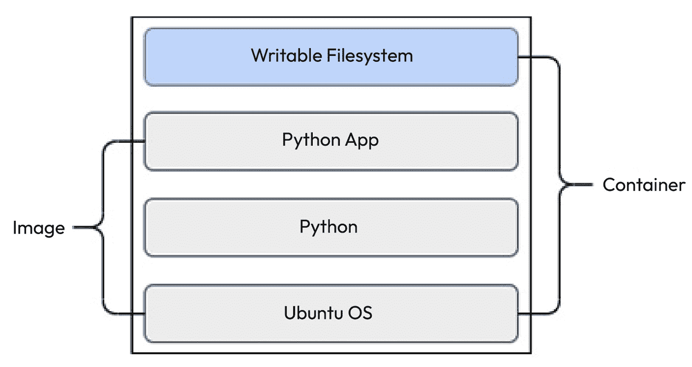

# 创建和管理容器镜像

在上一章中，我们讲解了如何使用 Docker 进行容器化，安装了 Docker 并运行了我们的第一个容器。我们涵盖了一些核心基础知识，包括 Docker 卷、挂载、存储驱动程序和日志驱动程序。我们还介绍了 Docker Compose 作为一种声明性管理容器的方法。

现在，我们将讨论容器的核心构建模块：容器镜像。容器镜像还实现了现代 DevOps 实践的一个核心原则：配置即代码（config as code）。因此，理解容器镜像、它们是如何工作的以及如何有效地构建镜像，对于现代 DevOps 工程师来说非常重要。

在本章中，我们将涵盖以下主要主题：

+   Docker 架构

+   理解 Docker 镜像

+   理解 Dockerfiles、组件和指令

+   构建和管理 Docker 镜像

+   扁平化 Docker 镜像

+   使用无发行版镜像优化容器

+   理解 Docker 仓库

# 技术要求

对于本章，我们假设你已经在一台运行 Ubuntu 18.04 Bionic LTS 或更高版本的 Linux 机器上安装了 Docker，并且具有 sudo 权限。你可以阅读 *第三章*，*使用 Docker 进行容器化*，了解更多关于如何实现这一点的细节。

你还需要克隆一个 GitHub 仓库，用于本章的一些练习，仓库地址是 [`github.com/PacktPublishing/Modern-DevOps-Practices-2e`](https://github.com/PacktPublishing/Modern-DevOps-Practices-2e)。此外，大多数活动需要你有一个 Docker Hub 账户。要创建一个，请访问 [`hub.docker.com/`](https://hub.docker.com/)。

# Docker 架构

想象一下，你是一位充满热情的厨师，致力于创造令人垂涎的菜肴，以满足饥饿的顾客。在你的厨房里，这个神奇的地方叫做 Docker，你拥有特殊的能力来规划、制作并展示你的烹饪创作。让我们来拆解其中的关键部分：

**食材（应用代码和依赖项）**：想象你的厨房里有一排架子，上面摆满了食材，比如面粉、鸡蛋和香料。这些食材以特定的方式结合在一起，做成一道菜。同样，你的应用代码和依赖项也需要协同工作，才能构建出你的应用程序。

**食谱（镜像）**：每个食谱就像是某道菜的计划。想象一下你有一个巧克力蛋糕或卡邦尼意面的食谱。这些食谱就像是你创作的构建模块。同样，Docker 镜像就是制作 Docker 容器的计划。

**食谱卡（Dockerfile）**：你的烹饪旅程中涉及使用特别的食谱卡，这些卡片被称为 Dockerfiles。这些卡片展示了你需要遵循的重要步骤和食材（命令）。例如，一个巧克力蛋糕的 Dockerfile 可能包括“混合面粉和糖”或“加入鸡蛋和可可粉”这样的步骤。这些 Dockerfiles 引导你的助手（Docker）制作这道菜（容器）。

**做好的菜肴（容器）**：当有人想要一份菜肴时，你用食谱（镜像）来做它。然后，你就有了一道新鲜热乎的菜肴，准备好上桌。这些菜肴是独立的，但它们可以一次又一次地被做出来（多亏了食谱），就像容器一样。

**厨房助手（Docker Engine）**：在你忙碌的厨房里，你的助手（Docker Engine）发挥着重要作用。他们做了繁重的工作，从获取食材到按照食谱做菜并上菜。你给他们指令（Docker 命令），他们就会把事情做成。他们甚至会在做完每道菜后帮你清理。

**特制套餐菜单（Docker Compose）**：有时，你想提供一道包含多种菜肴的特别套餐，它们相互搭配非常好。想象一下，一顿包含前菜、主菜和甜点的餐食。使用 Docker Compose 就像为这个场合制作一个特别的菜单。它列出了每道菜的食谱（镜像）以及它们应该如何搭配。你甚至可以自定义它，只用一个命令就能创造出一整顿饭的体验。

**存储区域（Volumes）**：在厨房里，你需要一个地方来存放食材和餐具。把 Docker 卷想象成特殊的存储区域，你可以在这里保存重要的东西，如数据和文件，多个菜肴（容器）都可以使用这些存储。

**通信通道（Networks）**：你的厨房是个热闹的地方，充满了交谈和互动。在 Docker 中，网络就像是特殊的通信路径，帮助你厨房中的不同部分（容器）相互交流。

所以，Docker 就像你的神奇厨房，你可以使用计划（Dockerfiles）和食材（镜像），在厨房助手（Docker Engine）的帮助下制作菜肴（容器）。你甚至可以提供整套套餐（Docker Compose），并使用特殊的存储区域（Volumes）和通信通道（Networks）来使你的菜肴更加美味。就像大厨通过练习不断进步一样，探索 Docker 将帮助你迅速成为 DevOps 的高手！现在，让我们深入了解 Docker 架构，理解其中的细节！

正如我们已经知道的，Docker 使用 *一次构建，到处运行* 的概念。Docker 将应用打包成镜像，Docker 镜像形成容器的蓝图，因此容器就是镜像的一个实例。

容器镜像打包了应用程序及其依赖项，因此它们是一个可以在任何运行 Docker 的机器上运行的单一不可变单元。你也可以将它们视为容器的快照。

我们可以在 Docker 注册中心中构建和存储 Docker 镜像，例如 **Docker Hub**，然后将这些镜像下载到我们希望部署它们的系统中。镜像由多个层组成，这有助于将镜像拆分成多个部分。层通常是可重用的阶段，其他镜像可以在此基础上构建。这也意味着我们在更改镜像时不必传输整个镜像，而只需传输差异部分，这大大节省了网络 I/O。我们将在本章稍后详细讨论分层文件系统。

以下图示展示了 Docker 用于协调以下活动的组件：


图 4.1 – Docker 架构

组件包括：

+   **Docker 守护进程**：该进程运行在我们希望运行容器的服务器上。它们在 Docker 服务器上部署和运行容器。

+   **Docker 仓库**：这些用于存储和分发 Docker 镜像。

+   向 Docker 守护进程发送 `docker` 命令。

现在我们了解了 Docker 架构的关键组件，以及 Docker 镜像在其中的重要作用，让我们更详细地理解 Docker 镜像及其组件、指令和仓库。

# 理解 Docker 镜像

Docker 镜像构成了 Docker 容器的蓝图。就像你需要为运输集装箱设计一个蓝图来确定其大小以及它将包含哪些货物一样，Docker 镜像指定了需要使用的包、源代码、依赖项和库。它还决定了源代码如何运行才能有效。

从技术上讲，它由一系列步骤构成，这些步骤是在基础操作系统镜像上执行的，以便让你的应用程序正常运行。这可能包括安装软件包和依赖项、将源代码复制到正确的文件夹、构建代码生成二进制文件等等。

你可以将 Docker 镜像存储在容器仓库中，这是一个集中存储位置，Docker 主机可以从这里拉取镜像来创建容器。

Docker 镜像使用分层文件系统。我们不再使用一个庞大的、单一的文件系统块作为运行容器的模板，而是有许多层，叠加在一起。那么这意味着什么？解决了什么问题？让我们在下一部分中看看。

## 分层文件系统

Docker 中的层是中间的 Docker 镜像。其理念是我们对每个 Dockerfile 语句执行时，都会在上一层之上进行更改并构建一个新层。随后的语句会修改当前层，生成下一个层。最终的层会执行 Docker 的 `CMD` 或 `ENTRYPOINT` 命令，结果镜像由多个层组成，一个层叠在另一个层之上。让我们通过一个简单的例子来理解这一点。

如果我们拉取上章构建的 *Flask 应用程序*，我们将看到以下内容：

```
$ docker pull bharamicrosystems/python-flask-redis
Using default tag: latest
latest: Pulling from bharamicrosystems/python-flask-redis
188c0c94c7c5: Pull complete
a2f4f20ac898: Pull complete
f8a5b284ee96: Pull complete
28e9c106bfa8: Pull complete
8fe1e74827bf: Pull complete
95618753462e: Pull complete
03392bfaa2ba: Pull complete
4de3b61e85ea: Pull complete
266ad40b3bdb: Pull complete
Digest: sha256:bb40a44422b8a7fea483a775fe985d4e05f7e5c59b0806a2
4f6cca50edadb824
Status: Downloaded newer image for bharamicrosystems/python-flask-redis:latest
docker.io/bharamicrosystems/python-flask-redis:latest
```

如你所见，许多 `Pull complete` 语句旁边都有随机 ID。这些被称为 **层**。当前层仅包含与上一层和当前层文件系统之间的差异。一个容器镜像由多个层组成。

容器在镜像层之上包含一个额外的可写文件系统。这是容器修改文件系统以提供预期功能的层。

使用层次结构而不是简单地复制整个容器文件系统有几个优点。由于镜像层是只读的，从一个镜像创建的多个容器共享相同的层次文件系统，从而减少了总体磁盘和网络占用。层次结构还允许你在镜像之间共享文件系统。例如，如果两个镜像来自同一个基础镜像，它们就共享相同的基础层。

下图展示了一个在 Ubuntu 操作系统上运行的 Python 应用程序。从高层次来看，你会看到一个基础层（Ubuntu 操作系统）和安装在其上的 Python。在 Python 上面，我们安装了 Python 应用程序。所有这些组件共同构成了镜像。当我们从镜像创建容器并运行它时，我们得到的是位于最上层的可写文件系统：



图 4.2 – 容器层

所以，你可以从相同的基础镜像创建多个 Python 应用镜像，并根据需要进行定制。

每个从容器镜像创建的容器都有独特的可写文件系统，即使你从相同的镜像创建容器也是如此。

## 镜像历史

要理解镜像及其层次结构，你可以随时查看镜像历史。

让我们通过运行以下命令检查最后一个 Docker 镜像的历史：

```
$ docker history bharamicrosystems/python-flask-redis
IMAGE         CREATED      CREATED BY                                     SIZE    COMMENT
6d33489ce4d9  2 years ago  /bin/sh -c #(nop)  CMD ["flask" "run"]         0B
<missing>     2 years ago  /bin/sh -c #(nop) COPY dir:61bb30c35fb351598…  1.2kB
<missing>     2 years ago  /bin/sh -c #(nop)  EXPOSE 5000                 0B
<missing>     2 years ago  /bin/sh -c pip install -r requirements.txt     11.2MB
<missing>     2 years ago  /bin/sh -c #(nop) COPY file:4346cf08412270cb…  12B
<missing>     2 years ago  /bin/sh -c apk add --no-cache gcc musl-dev l…  143MB
<missing>     2 years ago  /bin/sh -c #(nop)  ENV FLASK_RUN_HOST=0.0.0.0  0B
<missing>     2 years ago  /bin/sh -c #(nop)  ENV FLASK_APP=app.py        0B
<missing>     2 years ago  /bin/sh -c #(nop)  CMD ["python3"]             0B
<missing>     2 years ago  /bin/sh -c set -ex;   wget -O get-pip.py "$P…  7.24MB
<missing>     2 years ago  /bin/sh -c #(nop)  ENV PYTHON_GET_PIP_SHA256…  0B
<missing>     2 years ago  /bin/sh -c #(nop)  ENV PYTHON_GET_PIP_URL=ht…  0B
<missing>     2 years ago  /bin/sh -c #(nop)  ENV PYTHON_PIP_VERSION=20…  0B
<missing>     2 years ago  /bin/sh -c cd /usr/local/bin  && ln -s idle3…  32B
<missing>     2 years ago  /bin/sh -c set -ex  && apk add --no-cache --…  28.3MB
<missing>     2 years ago  /bin/sh -c #(nop)  ENV PYTHON_VERSION=3.7.9    0B
<missing>     2 years ago  /bin/sh -c #(nop)  ENV GPG_KEY=0D96DF4D4110E…  0B
<missing>     2 years ago  /bin/sh -c set -eux;  apk add --no-cache   c…  512kB
<missing>     2 years ago  /bin/sh -c #(nop)  ENV LANG=C.UTF-8            0B
<missing>     2 years ago  /bin/sh -c #(nop)  ENV PATH=/usr/local/bin:/…  0B
<missing>     2 years ago  /bin/sh -c #(nop)  CMD ["/bin/sh"]             0B
<missing>     2 years ago  /bin/sh -c #(nop) ADD file:f17f65714f703db90…  5.57MB
```

如你所见，存在多个层次，每个层次都有相应的命令。你还可以看到这些层次何时创建以及每层占用的磁盘空间大小。有些层并不占用磁盘空间，因为它们没有对文件系统做任何更改，比如 `CMD` 和 `EXPOSE` 指令。它们执行某些功能，但不会向文件系统写入任何内容。而像 `apk add` 这样的命令会写入文件系统，你可以看到它们占用了磁盘空间。

每一层都会以某种方式修改旧的层，因此每一层只是文件系统配置的增量。

在下一节中，我们将深入研究 Dockerfile，了解如何构建 Docker 镜像并查看其层次结构是怎样的。

# 理解 Dockerfile、组件和指令

Dockerfile 是一个简单的文件，它包含了一系列构建 Docker 镜像的步骤。每个步骤称为 **指令**。有不同类型的指令。让我们通过一个简单的例子来理解它是如何工作的。

我们将从零开始构建一个简单的 NGINX 容器，而不是使用 Docker Hub 上现成的镜像。NGINX 是一种非常流行的 Web 服务器软件，适用于各种应用场景；例如，它可以作为负载均衡器或反向代理服务器。

从创建一个 Dockerfile 开始：

```
$ vim Dockerfile
FROM ubuntu:bionic
RUN apt update && apt install -y curl
RUN apt update && apt install -y nginx
CMD ["nginx", "-g", "daemon off;"]
```

让我们逐行分析每个指令，理解这个 Dockerfile 是如何工作的：

+   `FROM`指令指定了此容器的基础镜像。这意味着我们使用另一个镜像作为基础，并将在其上构建层。我们使用`ubuntu:bionic`包作为此次构建的基础镜像，因为我们想在 Ubuntu 上运行 NGINX。

+   `RUN`指令指定了在特定层上需要执行的命令。你可以通过`&&`分隔多个命令。如果我们想将依赖命令放入同一层中，可以在一行中运行多个命令。每个层应达到特定的目标。在前面的例子中，第一个`RUN`指令用于安装`curl`，而下一个`RUN`指令用于安装`nginx`。

+   你可能会想知道为什么每次安装之前都要运行`apt update`。这是必需的，因为 Docker 构建镜像是通过层来实现的。因此，一个层不应该隐性依赖于前一个层。在这个例子中，如果在安装`nginx`时省略了`apt update`，并且我们想在不更改包含`apt update`指令（即安装`curl`的那一行）的情况下更新`nginx`版本，那么当我们运行构建时，`apt update`不会再运行，导致你的`nginx`安装可能会失败。

+   `CMD`指令指定了当构建的镜像作为容器运行时需要执行的一组命令。这是默认执行的命令，它的输出将记录在容器日志中。你的容器可以包含一个或多个`CMD`指令。对于像 NGINX 这样的长时间运行的进程，最后一个`CMD`应该包含一些不会将控制权交还给 shell 并且能够持续运行至容器生命周期结束的命令。在这种情况下，我们运行`nginx -g daemon off;`，这是一种标准的方式来在前台运行 NGINX。

一些指令很容易混淆，比如`ENTRYPOINT`和`CMD`，或者`CMD`和`RUN`。这些也能考察你对 Docker 基础的掌握程度，所以我们来看看这两者的区别。

## 我们可以用`ENTRYPOINT`替代`CMD`吗？

你可以用`ENTRYPOINT`替代`CMD`。虽然它们服务的目的是类似的，但它们是两个完全不同的指令。每个 Docker 容器都有一个默认的`ENTRYPOINT`——`/bin/sh -c`。你在`CMD`中添加的内容会被追加到`ENTRYPOINT`之后并执行；例如，`CMD ["nginx", "-g", "daemon off;"]`将被生成为`/bin/sh -c nginx -g daemon off;`。如果你使用自定义的`ENTRYPOINT`，那么在启动容器时使用的命令将被追加到它之后。因此，如果你定义了`ENTRYPOINT ["nginx", "-g"]`，并使用`docker run nginx daemon off;`，你将得到类似的结果。

为了在启动容器时不添加任何`CMD`参数，您也可以使用`ENTRYPOINT ["nginx", "-g", "daemon off;"]`来获得类似的效果。

提示

除非有特定的`CMD`需求，否则应该使用`ENTRYPOINT`。使用`ENTRYPOINT`可以确保用户无法更改容器的默认行为，因此它是一种更安全的替代方案。

现在，让我们来看一下 `RUN` 与 `CMD` 的区别。

## `RUN` 和 `CMD` 是一样的吗？

不，`RUN` 和 `CMD` 是不同的，它们有不同的用途。`RUN` 用于构建容器，仅在构建过程中修改文件系统，而 `CMD` 指令仅在容器运行后在可写容器层中执行。

虽然一个 Dockerfile 中可以有多个 `RUN` 语句，每个语句修改现有层并生成下一层，但如果 Dockerfile 中包含多个 `CMD` 指令，除了最后一个，其他都会被忽略。

`RUN` 指令用于在容器文件系统内执行语句来构建和定制容器镜像，从而修改镜像层。使用 `CMD` 指令的目的是为容器镜像提供默认的命令，这些命令将在运行时执行。这只会改变可写的容器文件系统。你还可以通过在 `docker` `run` 语句中传递自定义命令来覆盖这些命令。

现在，让我们开始构建我们的第一个容器镜像。

## 构建我们的第一个容器

构建容器镜像非常简单。实际上，它是一个一行命令：`docker build -t <image-name>:version <build_context>`。虽然我们将在 *构建和管理容器镜像* 部分详细讨论构建容器镜像，但首先让我们构建 Dockerfile：

```
$ docker build -t <your_dockerhub_user>/nginx-hello-world .
[+] Building 50.0s (7/7) FINISHED
 => [internal] load .dockerignore 0.0s
 => => transferring context: 2B 0.0s
 => [internal] load build definition from Dockerfile 0.1s
 => => transferring dockerfile: 171B 0.0s
 => [internal] load metadata for docker.io/library/ubuntu:bionic 2.4s
 => [1/3] FROM docker.io/library/ubuntu:bionic@sha256:152dc042… 2.8s
 => => resolve docker.io/library/ubuntu:bionic@sha256:152dc04… 0.0s
 => => sha256:152dc042… 1.33kB / 1.33kB 0.0s
 => => sha256:dca176c9… 424B / 424B 0.0s
 => => sha256:f9a80a55… 2.30kB / 2.30kB 0.0s
 => => sha256:7c457f21… 25.69MB / 25.69MB 1.0s
 => => extracting sha256:7c457f21… 1.6s
 => [2/3] RUN apt update && apt install -y curl 22.4s
 => [3/3] RUN apt update && apt install -y nginx 21.6s
 => exporting to image 0.6s
 => => exporting layers 0.6s
 => => writing image sha256:9d34cdda… 0.0s
 => => naming to docker.io/<your_dockerhub_user>/nginx-hello-world
```

你可能已经注意到，容器的名字前面有一个前缀。那是你的 Docker Hub 账户名。镜像的名字结构是 `<registry-url>/<account-name>/<container-image-name>:<version>`。

这里，我们有以下内容：

+   `registry-url`：Docker 注册表的 URL，默认为 `docker.io`

+   `account-name`：拥有该镜像的用户或账户

+   `container-image-name`：容器镜像的名称

+   `version`：镜像版本

现在，让我们使用以下命令从镜像创建一个容器：

```
$ docker run -d -p 80:80 <your_dockerhub_user>/nginx-hello-world
092374c4501560e96a13444ce47cb978b961cf8701af311884bfe…
$ docker ps
CONTAINER ID  IMAGE            COMMAND       CREATED     STATUS   PORTS               NAMES
092374c45015  <your_dockerhub  "nginx -g     28 seconds  Up 27    0.0.0.0:80->80/     loving_
              _user>/nginx-    'daemon of…"  ago         seconds  tcp, :::80->80/tcp  noether
              hello-world                                                                     
```

在这里，我们可以看到容器已经启动并运行。

如果我们运行 `curl localhost`，我们会得到默认的 `nginx` `html` 响应：

```
$ curl localhost
<!DOCTYPE html>
<html>
<head>
<title>Welcome to nginx!</title>
...
</body>
</html>
```

太好了！我们已经使用 Dockerfile 构建了我们的第一个镜像。

如果我们想根据需求自定义镜像怎么办？实际上，没有人会想要一个仅响应默认 `Welcome to nginx!` 消息的 NGINX 容器，因此让我们创建一个索引页面并使用它代替：

```
$ vim index.html
Hello World! This is my first docker image!
```

这个输出一个自定义消息，而不是默认的 NGINX HTML 页面。

我们都知道，默认的 NGINX 目录包含 `index.html` 文件，路径是 `/var/www/html`。如果我们可以将 `index.html` 文件复制到该目录中，应该就能解决我们的问题。

所以，修改 Dockerfile，使其包含以下内容：

```
$ vim Dockerfile
FROM ubuntu:bionic
RUN apt update && apt install -y curl
RUN apt update && apt install -y nginx
WORKDIR /var/www/html/
ADD index.html ./
CMD ["nginx", "-g", "daemon off;"]
```

在这里，我们向文件中添加了两个指令：`WORKDIR` 和 `ADD`。让我们理解每个指令的作用：

+   `WORKDIR`：此指令定义当前工作目录，在本例中为`/var/www/html`。Dockerfile 中的最后一个`WORKDIR`指令也指定了容器执行时的工作目录。因此，如果你`exec`进入一个运行中的容器，你将进入最后定义的`WORKDIR`。`WORKDIR`可以是绝对路径，也可以是相对于当前工作目录的相对路径。

+   `ADD`：此指令将本地文件添加到容器文件系统——在此案例中是工作目录。你也可以使用`COPY`指令代替`ADD`，虽然`ADD`提供了一些额外的功能，比如从 URL 下载文件，或使用 TAR 或 ZIP 等存档包。

当我们构建此文件时，我们期望`index.html`文件被复制到容器文件系统中的`/var/www/html`目录。让我们来看一下：

```
$ docker build -t <your_dockerhub_user>/nginx-hello-world .
[+] Building 1.6s (10/10) FINISHED
 => [internal] load build definition from Dockerfile 0.0s
 => => transferring dockerfile: 211B 0.0s
 => [internal] load .dockerignore 0.0s
 => => transferring context: 2B 0.0s
 => [internal] load metadata for docker.io/library/ubuntu:bionic 1.4s
 => [1/5] FROM docker.io/library/ubuntu:bionic@sha256:152dc042… 0.0s
 => [internal] load build context 0.0s
 => => transferring context: 81B 0.0s
 => CACHED [2/5] RUN apt update && apt install -y curl 0.0s
 => CACHED [3/5] RUN apt update && apt install -y nginx 0s
 => [4/5] WORKDIR /var/www/html/ 0.0s
 => [5/5] ADD index.html ./ 0.0s
 => exporting to image 0.0s
 => => exporting layers 0.0s
 => => writing image sha256:cb2e67bd… 0.0s
 => => naming to docker.io/<your_dockerhub_user>/nginx-hello-world
```

这次，构建速度更快了！当我们执行 Docker 构建时，它使用了大量来自缓存的层。这就是分层架构的优势之一；你只需要构建变化的部分，其他部分则可以直接使用现有的。

提示

安装完包和依赖后，始终添加源代码。源代码经常变动，而包的内容大致保持不变。这将加快构建速度，并节省大量 CI/CD 时间。

让我们重新运行容器，看看会得到什么。请注意，重新运行前需要先删除旧的容器：

```
$ docker ps
CONTAINER ID  IMAGE            COMMAND       CREATED     STATUS   PORTS               NAMES
092374c45015  <your_dockerhub  "nginx -g     28 seconds  Up 27    0.0.0.0:80->80/     loving_
              _user>/nginx-    'daemon of…"  ago         seconds  tcp, :::80->80/tcp  noether
              hello-world                                                                     
$ docker rm 092374c45015 -f
092374c45015
```

此时，我们无法再看到容器了。现在，让我们使用以下命令重新运行容器：

```
$ docker run -d -p 80:80 <your_dockerhub_user>/nginx-hello-world
cc4fe116a433c505ead816fd64350cb5b25c5f3155bf5eda8cede5a4…
$ docker ps
CONTAINER ID  IMAGE            COMMAND       CREATED     STATUS   PORTS               NAMES
cc4fe116a433  <your_dockerhub  "nginx -g     52 seconds  Up 50    0.0.0.0:80->80/     eager_
              _user>/nginx-    'daemon of…"  ago         seconds  tcp, :::80->80/tcp  gates
              hello-world                                                            
```

在这里，我们可以看到容器正在运行。让我们使用`curl localhost`看看会得到什么结果：

```
$ curl localhost
Hello World! This is my first docker image!
```

在这里，我们看到的是一个自定义消息，而不是默认的 NGINX HTML 响应！

现在这看起来已经足够好了，但我将讨论更多的指令，以使这个镜像更加可靠。首先，我们没有明确记录此容器应暴露的端口。虽然这样做也能正常工作，因为我们知道 NGINX 运行在`80`端口，但如果有人想使用你的镜像却不知道端口怎么办呢？在这种情况下，最好显式地定义端口。我们将使用`EXPOSE`指令来实现这一点。

提示

始终使用`EXPOSE`指令为你的镜像提供更多的清晰度和意义。

我们还需要定义如果有人发送`docker stop`命令时，容器进程应该采取的动作。虽然大多数进程会接受这个信号并杀死进程，但明确指定容器在接收到`docker stop`命令时应该发送什么`STOPSIGNAL`是有意义的。我们将使用`STOPSIGNAL`指令来实现这一点。

现在，虽然 Docker 监控容器进程并保持其运行，除非接收到`SIGTERM`信号或停止命令，但如果你的容器进程因为某些原因挂起会发生什么呢？当你的应用程序处于挂起状态时，Docker 仍然认为它在运行，因为你的进程依然在运行。因此，通过显式的健康检查来监控应用程序是有意义的。我们将使用`HEALTHCHECK`指令来实现这一点。

让我们将这些方面结合起来，看看在 Dockerfile 中会得到什么结果：

```
$ vim Dockerfile
FROM ubuntu:bionic
RUN apt update && apt install -y curl
RUN apt update && apt install -y nginx
WORKDIR /var/www/html/
ADD index.html ./
EXPOSE 80
CMD ["nginx", "-g", "daemon off;"]
STOPSIGNAL SIGTERM
HEALTHCHECK --interval=60s --timeout=10s --start-period=20s --retries=3 CMD curl -f 
localhost
```

虽然`EXPOSE`和`STOPSIGNAL`不言自明，但我们来看看`HEALTHCHECK`指令。`HEALTHCHECK`指令会运行一个名为`curl -f localhost`的命令（因此是`CMD`）。所以，在`curl`命令执行成功之前，这个容器会报告为健康状态。

`HEALTHCHECK`指令还包含以下可选字段：

+   `--interval (默认值: 30s)`：两次健康检查之间的间隔时间。

+   `--timeout (默认值: 30s)`：健康检查探针超时。如果健康检查超时，则表示健康检查失败。

+   `--start-period (默认值: 0s)`：启动容器和第一次健康检查之间的时间间隔。这样可以确保容器在进行健康检查之前已启动。

+   `--retries (默认值: 3)`：探针在宣布容器不健康之前会重试的次数。

现在，让我们构建这个容器：

```
$ docker build -t <your_dockerhub_user>/nginx-hello-world .
[+] Building 1.3s (10/10) FINISHED
 => [internal] load build definition from Dockerfile 0.0s
 => => transferring dockerfile: 334B 0.0s
 => [internal] load .dockerignore 0.0s
 => => transferring context: 2B 0.0s
 => [internal] load metadata for docker.io/library/ubuntu:bionic 1.2s
 => [1/5] FROM docker.io/library/ubuntu:bionic@sha256:152dc0… 0.0s
 => [internal] load build context 0.0s
 => => transferring context: 31B 0.0s
 => CACHED [2/5] RUN apt update && apt install -y curl 0.0s
 => CACHED [3/5] RUN apt update && apt install -y nginx 0s
 => CACHED [4/5] WORKDIR /var/www/html/ 0.0s
 => CACHED [5/5] ADD index.html ./ 0.0s
 => exporting to image 0.0s
 => => exporting layers 0.0s
 => => writing image sha256:bba3123d… 0.0s
 => => naming to docker.io/<your_dockerhub_user>/nginx-hello-world
```

是时候运行它，看看结果如何：

```
$ docker run -d -p 80:80 <your_dockerhub_user>/nginx-hello-world
94cbf3fdd7ff1765c92c81a4d540df3b4dbe1bd9748c91e2ddf565d8…
```

现在我们已经成功启动了容器，接下来让我们尝试`ps`命令，看看会得到什么结果：

```
$ docker ps
CONTAINER ID  IMAGE            COMMAND       CREATED     STATUS     PORTS               NAMES
94cbf3fdd7ff  <your_dockerhub  "nginx -g     5 seconds   Up 4       0.0.0.0:80->80/     wonderful_
              _user>/nginx-    'daemon of…"  ago         (health:   tcp, :::80->80/tcp  hodgkin
              hello-world                                starting)                     
```

正如我们所看到的，容器显示`health: starting`，这意味着健康检查尚未开始，我们正在等待启动时间到期。

让我们等一会儿，然后再试一次`docker` `ps`：

```
$ docker ps
CONTAINER ID  IMAGE            COMMAND       CREATED     STATUS     PORTS               NAMES
94cbf3fdd7ff  <your_dockerhub  "nginx -g     2 minutes   Up 2       0.0.0.0:80->80/     wonderful_
              _user>/nginx-    'daemon of…"  ago         (healthy)  tcp, :::80->80/tcp  hodgkin
              hello-world                                                                      
```

这次，它报告容器为健康状态。因此，我们的容器现在更可靠了，因为任何监控它的人都会知道应用程序的哪一部分是健康的，哪一部分不是。

这个健康检查只报告容器的健康状态，不会执行其他操作。你需要定期监控容器，并编写脚本来处理不健康的容器。

管理这种情况的一种方法是创建一个脚本，用于检查不健康的容器并重新启动它们。你可以在 crontab 中安排这个脚本。你也可以创建一个长时间运行的`systemd`脚本，不断轮询容器进程并检查健康状态。

提示

尽管使用`HEALTHCHECK`是一个不错的选择，但你应该避免在 Kubernetes 或类似的容器编排工具中运行容器时使用它。你应该改为使用存活探针和就绪探针。类似地，如果你使用 Docker Compose，也可以在其中定义健康检查，因此应使用它，而不是将健康检查嵌入容器镜像。

现在，让我们继续学习如何构建和管理 Docker 镜像。

# 构建和管理 Docker 镜像

在上一节中，我们构建了一些 Docker 镜像，到目前为止，你应该知道如何编写 Dockerfile 并从中创建 Docker 镜像。我们还讨论了一些最佳实践，简而言之，内容如下：

+   总是先添加那些不常更改的层，再添加可能频繁更改的层。例如，先安装你的包和依赖，再复制源代码。Docker 会从你更改的部分开始构建 Dockerfile，直到结束，因此，如果你修改了后面的某一行，Docker 会从缓存中获取所有已有的层。将更常变动的部分放在构建的后面，有助于减少构建时间，从而实现更快的 CI/CD 体验。

+   将多个命令合并为尽可能少的层。避免使用多个连续的 `RUN` 指令。相反，使用 `&&` 子句将它们合并成一个 `RUN` 指令。这将有助于减少容器的总体体积。

+   仅将必需的文件添加到容器中。如果你已经将代码编译成二进制文件，那么在运行容器时，容器不需要沉重的包管理器和 Go 工具包。我们将在接下来的章节中详细讨论如何做到这一点。

Docker 镜像传统上是通过在 Dockerfile 中指定一系列步骤来构建的。但正如我们所知道的，Docker 是符合 DevOps 的，并从一开始就使用配置管理实践。大多数人会在 Dockerfile 中构建他们的代码。因此，我们也需要在构建上下文中包含编程语言库。通过一个简单的顺序 Dockerfile，这些编程语言工具和库最终会出现在容器镜像中。这些被称为单阶段构建，接下来我们将讨论这一点。

## 单阶段构建

让我们将一个简单的 Go 应用程序容器化，该程序在屏幕上打印 `Hello, World!`。虽然在这个应用程序中我使用的是 **Golang**，但这个概念是普遍适用的，无论使用什么编程语言。

本示例的相关文件位于本书 GitHub 仓库中的 `ch4/go-hello-world/single-stage` 目录下。

首先，让我们看一下 Go 应用程序文件 `app.go`：

```
package main
import "fmt"
func main() {
    fmt.Println("Hello, World!")
}
```

Dockerfile 如下所示：

```
FROM golang:1.20.5
WORKDIR /tmp
COPY app.go .
RUN GOOS=linux go build -a -installsuffix cgo -o app . && chmod +x ./app
CMD ["./app"]
```

这是标准做法。我们使用 `golang:1.20.5` 基础镜像，声明一个 `WORKDIR` 为 `/tmp`，从主机文件系统将 `app.go` 复制到容器中，然后构建 Go 应用程序以生成一个二进制文件。最后，我们使用 `CMD` 指令来执行生成的二进制文件，当我们运行容器时，该文件将被执行。

让我们构建 Dockerfile：

```
$ docker build -t <your_dockerhub_user>/go-hello-world:single_stage .
[+] Building 10.3s (9/9) FINISHED
 => [internal] load build definition from Dockerfile 0.0s
 => => transferring dockerfile: 189B 0.0s
 => [internal] load .dockerignore 0.0s
 => => transferring context: 2B 0.0s
 => [internal] load metadata for docker.io/library/golang:1.20.5 0.6s
 => [1/4] FROM docker.io/library/golang:1.20.5@sha256:4b1fc02d… 0.0s
 => [internal] load build context 0.0s
 => => transferring context: 27B 0.0s
 => [2/4] WORKDIR /tmp 0.0s
 => [3/4] COPY app.go . 0.0s
 => [4/4] RUN GO111MODULE=off GOOS=linux go build -a -installsuffix cgo -o app .  && chmod 
+x ./app 9.3s
 => exporting to image 0.3s
 => => exporting layers 0.3s
 => => writing image sha256:3fd3d261… 0.0s
 => => naming to docker.io/<your_dockerhub_user>/go-hello-world:single_stage
```

现在，让我们运行 Docker 镜像，看看我们能得到什么：

```
$ docker run <your_dockerhub_user>/go-hello-world:single_stage
Hello, World!
```

我们得到了预期的响应。现在，让我们运行以下命令来列出镜像：

```
$ docker images
REPOSITORY              TAG           IMAGE ID      CREATED        SIZE
<your_dockerhub_user>
/go-hello-world         single_stage  3fd3d26111a1  3 minutes ago  803MB
```

这个镜像好大啊！打印 `Hello, World!` 需要 803 MB。这不是构建 Docker 镜像的最有效方式。

在我们查看解决方案之前，先来了解一下为什么镜像一开始会这么臃肿。我们使用的是 Golang 基础镜像，它包含了完整的 Go 工具包，并生成一个简单的二进制文件。对于这个应用程序的运行，我们并不需要完整的 Go 工具包；它可以在 Alpine Linux 镜像中高效运行。

Docker 通过提供多阶段构建来解决这个问题。你可以将构建过程拆分成多个阶段，在其中一个阶段构建你的代码，然后在第二个阶段将构建好的代码导出到另一个上下文，该上下文从一个更轻的基础镜像开始，只包含运行代码所需的文件和组件。我们将在下一节中详细讨论这个过程。

## 多阶段构建

让我们按照多阶段构建过程修改 Dockerfile，看看结果如何。

本例的相关文件位于本书 GitHub 仓库中的 `ch4/go-hello-world/multi-stage` 目录下。

以下是 Dockerfile：

```
FROM golang:1.20.5 AS build
WORKDIR /tmp
COPY app.go .
RUN GO111MODULE=off GOOS=linux go build -a -installsuffix cgo -o app . && chmod +x ./app
FROM alpine:3.18.0
WORKDIR /tmp
COPY --from=build /tmp/app .
CMD ["./app"]
```

Dockerfile 包含两个 `FROM` 指令：`FROM golang:1.20.5 AS build` 和 `FROM alpine:3.18.0`。第一个 `FROM` 指令还包括一个 `AS` 指令，用于声明阶段并将其命名为 `build`。在此 `FROM` 指令之后所做的任何操作都可以通过 `build` 来访问，直到我们遇到另一个 `FROM` 指令，这将形成第二个阶段。由于第二个阶段是我们要运行镜像的地方，所以我们没有使用 `AS` 指令。

在第一阶段，我们使用 `golang` 基础镜像构建我们的 Golang 代码，生成二进制文件。

在第二阶段，我们使用 Alpine 基础镜像，并将构建阶段中的 `/tmp/app` 文件复制到当前阶段。这是我们在容器中运行所需的唯一文件。其他文件仅在构建过程中需要，用于在运行时膨胀我们的容器。

让我们构建镜像，看看得到什么：

```
$ docker build -t <your_dockerhub_user>/go-hello-world:multi_stage
[+] Building 12.9s (13/13) FINISHED
 => [internal] load build definition from Dockerfile 0.0s
 => => transferring dockerfile: 259B 0.0s
 => [internal] load .dockerignore 0.0s
 => => transferring context: 2B 0.0s
 => [internal] load metadata for docker.io/library/alpine:3.18.0 2.0s
 => [internal] load metadata for docker.io/library/golang:1.20.5 1.3s
 => [build 1/4] FROM docker.io/library/golang:1.20.5@sha256:4b1fc02d… 0.0s
 => [stage-1 1/3] FROM docker.io/library/alpine:3.18.0@sha256:02bb6f42… 0.1s
 => => resolve docker.io/library/alpine:3.18.0@sha256:02bb6f42… 0.0s
 => => sha256:c0669ef3… 528B / 528B 0.0s
 => => sha256:5e2b554c… 1.47kB / 1.47kB 0.0s
 => => sha256:02bb6f42… 1.64kB / 1.64kB 0.0s
 => CACHED [build 2/4] WORKDIR /tmp 0.0s
 => [internal] load build context 0.0s
 => => transferring context: 108B 0.0s
 => [build 3/4] COPY app.go . 0.0s
 => [build 4/4] RUN GO111MODULE=off GOOS=linux go build -a -installsuffix cgo -o app . && 
chmod +x ./app 10.3s
 => [stage-1 2/3] WORKDIR /tmp 0.1s
=> [stage-1 3/3] COPY --from=build /tmp/app . 0.3s
 => exporting to image 0.1s
 => => exporting layers 0.1s
 => => writing image sha256:e4b793b3… 0.0s
 => => naming to docker.io/<your_dockerhub_user>/go-hello-world:multi_stage
```

现在，让我们运行容器：

```
$ docker run <your_dockerhub_user>/go-hello-world:multi_stage .
Hello, World!
```

我们得到了相同的输出，但这次占用的空间更小。让我们查看镜像以确认这一点：

```
$ docker images
REPOSITORY              TAG          IMAGE ID      CREATED        SIZE
<your_dockerhub_user>
/go-hello-world         multi_stage  e4b793b39a8e  5 minutes ago  9.17MB
```

这个镜像仅占用 9.17 MB，而不是庞大的 803 MB。这是一个巨大的改进！我们已经将镜像大小减少了近 100 倍。

这就是我们在容器镜像中提高效率的方法。构建高效的镜像是运行生产就绪容器的关键，Docker Hub 上的大多数专业镜像都使用多阶段构建来创建高效的镜像。

提示

尽可能使用多阶段构建，以在镜像中包含最小的内容。如果可能，考虑使用 Alpine 基础镜像。

在下一节中，我们将讨论如何管理 Docker 镜像，最佳实践以及一些最常用的命令。

## 管理 Docker 镜像

在现代 DevOps 实践中，Docker 镜像通常是在开发者机器或 CI/CD 管道上构建的。这些镜像存储在容器注册中心，然后部署到多个预生产环境和生产机器上。这些机器可能运行 Docker 或一个容器编排工具，例如 Kubernetes。

为了高效使用镜像，我们必须理解如何标记它们。

主要情况下，Docker 会在你执行 Docker run 时拉取镜像一次。这意味着，一旦某个版本的镜像已经存在于机器上，Docker 就不会在每次运行时都重新拉取它，除非你显式地执行拉取操作。

要显式拉取镜像，你可以使用 `docker` `pull` 命令：

```
$ docker pull nginx
Using default tag: latest
latest: Pulling from library/nginx
f03b40093957: Pull complete
eed12bbd6494: Pull complete
fa7eb8c8eee8: Pull complete
7ff3b2b12318: Pull complete
0f67c7de5f2c: Pull complete
831f51541d38: Pull complete
Digest: sha256:af296b18…
Status: Downloaded newer image for nginx:latest
docker.io/library/nginx:latest
```

现在，如果我们尝试使用这个镜像启动容器，它将立即启动容器，而不拉取镜像：

```
$ docker run nginx
/docker-entrypoint.sh: /docker-entrypoint.d/ is not empty, will attempt to perform 
configuration
/docker-entrypoint.sh: Looking for shell scripts in /docker-entrypoint.d/
/docker-entrypoint.sh: Launching /docker-entrypoint.d/10-listen-on-ipv6-by-default.sh
…
2023/06/10 08:09:07 [notice] 1#1: start worker processes
2023/06/10 08:09:07 [notice] 1#1: start worker process 29
2023/06/10 08:09:07 [notice] 1#1: start worker process 30
```

因此，在镜像上使用最新标签是一个坏主意，最佳实践是使用语义版本作为标签。主要有两个原因：

+   如果每次都构建最新镜像，像 Docker Compose 和 Kubernetes 这样的编排工具会认为镜像已经在你的机器上，并默认不拉取镜像。在 Kubernetes 上使用像 `Always` 这样的镜像拉取策略，或者用脚本拉取镜像，会浪费网络带宽。还需要注意的是，Docker Hub 限制了你对开源镜像的拉取次数，因此你必须将拉取限制为必要时才进行。

+   Docker 标签允许你快速推出或回滚容器部署。如果你总是使用最新标签，新的构建将覆盖旧的构建，因此你无法将故障容器回滚到最后一个已知的良好版本。在生产环境中使用版本化的镜像也是一个好主意，以确保容器的稳定性。如果由于某些原因，你丢失了本地镜像并决定重新运行容器，可能无法获得与你之前运行的相同版本的软件，因为最新标签经常变化。因此，最好在生产环境中使用特定的容器版本以确保稳定性。

镜像由多个层组成，通常，容器的不同版本在你的服务器上是有关系的。随着时间的推移，新的镜像版本会在你的生产环境中推出，因此通过进行一些清理来移除旧镜像是最好的做法。这将回收容器镜像占用的一些宝贵空间，从而使文件系统更加干净。

要移除特定镜像，你可以使用 `docker` `rmi` 命令：

```
$ docker rmi nginx
Error response from daemon: conflict: unable to remove repository reference "nginx" (must 
force) - container d5c84356116f is using its referenced image f9c14fe76d50
```

哦！我们遇到错误了，为什么呢？因为我们有一个正在运行并使用该镜像的容器。

提示

你不能移除当前正在使用的镜像。

首先，你需要停止并移除容器。然后，你可以使用前面的命令移除镜像。如果你想一气呵成，可以通过使用 `-f` 标志强制移除，这将停止容器，移除容器，并移除镜像。所以，除非你知道自己在做什么，否则不要使用 `-f` 标志：

```
$ docker rmi -f nginx
Untagged: nginx:latest
Untagged: nginx@sha256:af296b18…
Deleted: sha256:f9c14fe7…
```

我们已经构建了容器多次，但如果我们需要将其推送到 Docker Hub 或其他注册中心该怎么办？但在此之前，我们需要通过以下命令对其进行 Docker Hub 身份验证：

```
$ docker login
```

现在，你可以使用以下命令将镜像推送到 Docker Hub：

```
$ docker push <your_dockerhub_user>/nginx-hello-world:latest
The push refers to repository [docker.io/<your_dockerhub_user>/nginx-hello-world]
2b7de406bdcd: Pushed
5f70bf18a086: Pushed
845348333310: Pushed
96a9e6a097c6: Pushed
548a79621a42: Mounted from library/ubuntu
latest: digest: sha256:11ec56f0… size: 1366
```

这已经推送了四层，并将其余部分从 Ubuntu 挂载。我们使用了 Ubuntu 作为基础镜像，该镜像已经存在于 Docker Hub 上。

如果你有多个镜像标签，并且希望推送所有标签，那么可以在`push`命令中使用`-a`或`--all-tags`选项。这样会将该镜像的所有标签一起推送：

```
$ docker push -a <your_dockerhub_user>/go-hello-world
The push refers to repository [docker.io/<your_dockerhub_user>/go-hello-world]
9d61dbd763ce: Pushed
5f70bf18a086: Mounted from <your_dockerhub_user>/nginx-hello-world
bb01bd7e32b5: Mounted from library/alpine
multi_stage: digest: sha256:9e1067ca… size: 945
445ef31efc24: Pushed
d810ccdfdc04: Pushed
5f70bf18a086: Layer already exists
70ef08c04fa6: Mounted from library/golang
41cf9ea1d6fd: Mounted from library/golang
d4ebbc3dd11f: Mounted from library/golang
b4b4f5c5ff9f: Mounted from library/golang
b0df24a95c80: Mounted from library/golang
974e52a24adf: Mounted from library/golang
single_stage: digest: sha256:08b5e52b… size: 2209
```

当构建因为某种原因失败并且你修改了 Dockerfile 时，旧镜像的层可能会保持悬空。因此，定期清理悬空镜像是最佳实践。你可以使用`docker images prune`来完成这一操作：

```
$ docker images prune
REPOSITORY  TAG  IMAGE ID  CREATED  SIZE
```

在下一节中，我们将探讨提高 Docker 镜像效率的另一种方法：扁平化 Docker 镜像。

## 扁平化 Docker 镜像

Docker 本身使用分层文件系统，我们已经深入讨论过它为什么必要以及如何带来好处。然而，在某些特定的使用场景下，Docker 实践者观察到，拥有更少层的 Docker 镜像表现更好。你可以通过扁平化镜像来减少镜像中的层。然而，这仍然不是最佳实践，只有在你看到性能提升的情况下才应这么做，因为这会导致文件系统开销。

扁平化 Docker 镜像的步骤如下：

1.  使用常规镜像运行一个 Docker 容器。

1.  对正在运行的容器进行`docker export`操作，将其导出为`.tar`文件。

1.  对`.tar`文件进行`docker import`操作，将其导入到另一个镜像中。

让我们使用`nginx-hello-world`镜像进行扁平化并导出到另一个镜像中；也就是说，`<your_dockerhub_user>/nginx-hello-world:flat`。

在继续之前，让我们查看最新镜像的历史记录：

```
$ docker history <your_dockerhub_user>/nginx-hello-world:latest
IMAGE          CREATED      CREATED BY                SIZE            COMMENT
bba3123dde01   2 hours ago  HEALTHCHECK &
                            {["CMD-SHELL" 
                            "curl -f localhos…        0B              buildkit.dockerfile.v0
<missing>      2 hours ago  STOPSIGNAL                0B
                            SIGTERM                   0B              buildkit.dockerfile.v0
<missing>      2 hours ago  CMD ["nginx"  
                            "-g" "daemon off;"]       0B              buildkit.dockerfile.v0
<missing>      2 hours ago  EXPOSE map[80/
                            tcp:{}]                   0B              buildkit.dockerfile.v0
<missing>      2 hours ago  ADD index.html ./ # 
                            buildkit                  44B             buildkit.dockerfile.v0
<missing>      2 hours ago  WORKDIR /var/www/
                            html/                     0B              buildkit.dockerfile.v0
<missing>      2 hours ago  RUN /bin/sh -c apt 
                            update && apt             57.2MB          buildkit.dockerfile.v0
                            install -y…
<missing>      2 hours ago  RUN /bin/sh -c apt 
                            update && apt             59.8MB          buildkit.dockerfile.v0
                            install -y…
<missing>      10 days ago  /bin/sh -c #(nop)         0B
                            CMD ["/bin/bash"]
<missing>      10 days ago  /bin/sh -c #(nop) ADD     63.2MB
                            file:3c74e7e08cbf9a876…
<missing>      10 days ago  /bin/sh -c #(nop)  LABEL  0B
                            org.opencontainers.…
<missing>      10 days ago  /bin/sh -c #(nop)  LABEL  0B
                            org.opencontainers.…
<missing>      10 days ago  /bin/sh -c #(nop)  ARG    0B
                            LAUNCHPAD_BUILD_ARCH
<missing>      10 days ago  /bin/sh -c #(nop)         0B
                            ARG RELEASE         
```

现在，让我们运行一个最新的 Docker 镜像：

```
$ docker run -d --name nginx <your_dockerhub_user>/nginx-hello-world:latest
e2d0c4b884556a353817aada13f0c91ecfeb01f5940e91746f168b…
```

接下来，让我们从正在运行的容器中导出：

```
$ docker export nginx > nginx-hello-world-flat.tar
```

将`nginx-hello-world-flat.tar`导入为一个新镜像；也就是说，`<your_dockerhub_user>/nginx-hello-world:flat`：

```
$ cat nginx-hello-world-flat.tar |  \
docker import - <your_dockerhub_user>/nginx-hello-world:flat 
sha256:57bf5a9ada46191ae1aa16bcf837a4a80e8a19d0bcb9fc…
```

现在，让我们列出镜像并看看得到的结果：

```
$ docker images
REPOSITORY              TAG     IMAGE ID      CREATED     SIZE
<your_dockerhub_user>/  flat    57bf5a9ada46  34 seconds  177MB
nginx-hello-world                             ago
<your_dockerhub_user>/  latest  bba3123dde01  2 hours 
nginx-hello-world                             ago         180MB
```

在这里，我们可以看到扁平化后的镜像，并且它占用的空间比最新镜像少。如果查看它的历史记录，我们应该只看到一个层：

```
$ docker history <your_dockerhub_user>/nginx-hello-world:flat
IMAGE         CREATED             CREATED BY  SIZE   COMMENT
57bf5a9ada46  About a minute ago              177MB  Imported from -
```

它已经将镜像进行了扁平化。但将 Docker 镜像扁平化是最佳实践吗？嗯，这取决于情况。让我们来了解一下什么时候以及如何扁平化 Docker 镜像，以及你需要考虑哪些因素：

+   是否有多个应用程序使用相似的基础镜像？如果是这样，扁平化镜像只会增加磁盘占用，因为你无法利用分层文件系统的优势。

+   考虑使用小型基础镜像（如 Alpine）作为扁平化镜像的替代方案。

+   多阶段构建对于大多数编译语言非常有用，并且可以显著减少镜像大小。

+   你还可以通过将多个步骤合并为单个`RUN`指令，使用尽可能少的层来缩小镜像大小。

+   考虑一下扁平化镜像的好处是否超过其缺点，是否会带来显著的性能提升，以及性能是否对你的应用程序需求至关重要。

这些考虑因素将帮助你理解容器镜像的占用空间，并帮助你管理容器镜像。记住，尽管减少镜像的大小是理想的，但将其压缩应作为最后的手段。

到目前为止，我们使用的所有镜像都是从 Linux 发行版派生的，且总是使用某个发行版作为其基础镜像。你也可以在不使用 Linux 发行版作为基础镜像的情况下运行容器，以提高安全性。我们将在下一部分中探讨如何做到这一点。

# 使用无发行版镜像优化容器

无发行版容器是容器世界中的最新趋势之一。它们很有前景，因为它们考虑了为企业环境优化容器的各个方面。在优化容器时，你应该考虑三个重要因素——性能、安全性和成本。

## 性能

你不能凭空创建容器。你必须从容器注册表中下载镜像，然后从镜像中运行容器。每个步骤都涉及网络和磁盘 I/O。镜像越大，消耗的资源就越多，性能就越差。因此，更小的 Docker 镜像自然表现更好。

## 安全性

安全性是当前 IT 环境中最重要的方面之一。公司通常会专注于这一点，并投入大量的时间和资金。由于容器是一项相对较新的技术，它们容易受到黑客攻击，因此，适当保护你的容器至关重要。标准的 Linux 发行版包含了许多可以让黑客访问更多内容的组件，而如果你正确保护容器，它们本来是无法做到的。因此，你必须确保容器内只有必要的内容。

## 成本

更小的镜像也意味着更低的成本。容器的占用空间越小，你就可以在一台机器中容纳更多的容器，从而减少运行应用程序所需的机器数量。这意味着你可以节省大量随着时间积累的费用。

作为一名现代 DevOps 工程师，你必须确保你的镜像在所有这些方面都得到了优化。无发行版镜像有助于解决这些问题。因此，让我们了解一下什么是无发行版镜像以及如何使用它们。

无发行版镜像是最简化的镜像，仅包含你的应用程序、依赖项以及容器进程运行所需的文件。大多数情况下，你不需要像 `apt` 这样的包管理器或像 `bash` 这样的 shell。没有 shell 有其优势。例如，它能帮助你避免任何外部方在容器运行时获得访问权限。你的容器拥有较小的攻击面，因此不会有太多安全漏洞。

Google 在其官方 GCR 注册表中提供了无发行版镜像，这些镜像可以在他们的 GitHub 页面找到，链接为 [`github.com/GoogleContainerTools/distroless`](https://github.com/GoogleContainerTools/distroless)。让我们动手操作，看看我们能用它们做些什么。

本练习所需的资源在本书的 GitHub 仓库中的 `ch4/go-hello-world/distroless` 文件夹内。

让我们先创建一个 Dockerfile：

```
FROM golang:1.20.5 AS build
WORKDIR /tmp
COPY app.go .
RUN GO111MODULE=off GOOS=linux go build -a -installsuffix cgo -o app . && chmod +x ./app
FROM gcr.io/distroless/base
WORKDIR /tmp
COPY --from=build /tmp/app .
CMD ["./app"]
```

这个 Dockerfile 类似于 `go-hello-world` 容器的多阶段构建 Dockerfile，但它使用 `gcr.io/distroless/base` 作为基础镜像，而不是 `alpine`。这个镜像包含一个最简化的 Linux glibc 系统，不带包管理器或 shell。你可以用它来运行用 Go、Rust 或 D 等语言编译的二进制文件。

所以，先使用以下命令构建它：

```
$ docker build -t <your_dockerhub_user>/go-hello-world:distroless .
[+] Building 7.6s (14/14) FINISHED
 => [internal] load build definition from Dockerfile 0.0s
 => => transferring dockerfile: 268B 0.0s
 => [internal] load .dockerignore 0.0s
 => => transferring context: 2B 0.0s
 => [internal] load metadata for gcr.io/distroless/base:latest 3.1s
 => [internal] load metadata for docker.io/library/golang:1.20.5 1.4s
 => [auth] library/golang:pull token for registry-1.docker.io 0.0s
 => [stage-1 1/3] FROM gcr.io/distroless/base@
sha256:73deaaf6a207c1a33850257ba74e0f196bc418636cada9943a03d7abea980d6d 3.2s
 => [build 1/4] FROM docker.io/library/golang:1.20.5@sha256:4b1fc02d 0.0s
 => [internal] load build context 0.0s
 => => transferring context: 108B 0.0s
 => CACHED [build 2/4] WORKDIR /tmp 0.0s
 => CACHED [build 3/4] COPY app.go . 0.0s
 => CACHED [build 4/4] RUN GO111MODULE=off GOOS=linux go build -a -installsuffix cgo -o 
app . && chmod +x ./app 0.0s
 => [stage-1 2/3] WORKDIR /tmp 0.9s
 => [stage-1 3/3] COPY --from=build /tmp/app . 0.3s
 => exporting to image 0.1s
 => => exporting layers 0.1s
 => => writing image sha256:51ced401 0.0s
 => => naming to docker.io/<your_dockerhub_user>/go-hello-world:distroless
```

现在，让我们运行这个镜像，看看结果：

```
$ docker run <your_dockerhub_user>/go-hello-world:distroless
Hello, World!
```

它有效！让我们来看一下图像的大小：

```
$ docker images
REPOSITORY                            TAG         MAGE ID       CREATED        SIZE
<your_dockerhub_user>/go-hello-world  distroless  51ced401d7bf  6 minutes ago  22.3MB
```

它只有 22.3 MB。是的，比 Alpine 镜像稍大，但它不包含 shell，因此从这个角度看，它更安全。此外，还有适用于解释型编程语言（如 Python 和 Java）的 distroless 镜像，你可以使用这些代替包含工具包的庞大镜像。

Docker 镜像存储在 Docker 注册表中，我们已经使用 Docker Hub 一段时间了。在接下来的章节中，我们将了解它们是什么，以及我们存储镜像的选项。

# 理解 Docker 注册表

**Docker 注册表** 是一个无状态、高度可扩展的服务器端应用程序，用于存储和分发 Docker 镜像。该注册表在宽松的 **Apache 许可证** 下开源。它是一个存储和分发系统，所有 Docker 服务器都可以连接到它，并根据需要上传和下载镜像。它充当你的镜像分发站点。

一个 Docker 注册表包含多个 Docker 仓库。一个 Docker 仓库保存特定镜像的多个版本。例如，所有版本的 `nginx` 镜像都存储在 Docker Hub 中名为 `nginx` 的单一仓库内。

默认情况下，Docker 与其公共 Docker 注册表实例 Docker Hub 交互，Docker Hub 帮助你将镜像分发到更广泛的开源社区。

并非所有镜像都可以公开和开源，许多专有活动仍在进行中。Docker 允许你使用私有 Docker 注册表，这是一种可以在你自己的基础设施内托管的场景，称为 **Docker Trusted Registry**。有多个在线选项可用，包括使用 SaaS 服务，如 GCR，或在 Docker Hub 上创建私有仓库。

虽然 SaaS 选项易于使用且直观，但让我们考虑托管我们自己的私有 Docker 注册表。

## 托管你的私有 Docker 注册表

Docker 提供了一个镜像，你可以在任何安装了 Docker 的服务器上运行。一旦容器启动并运行，你可以将其用作 Docker 注册表。我们来看一下：

```
$ docker run -d -p 80:5000 --restart=always --name registry registry:2
Unable to find image 'registry:2' locally
2: Pulling from library/registry
8a49fdb3b6a5: Already exists
58116d8bf569: Pull complete
4cb4a93be51c: Pull complete
cbdeff65a266: Pull complete
6b102b34ed3d: Pull complete
Digest: sha256:20d08472…
Status: Downloaded newer image for registry:2
ae4c4ec9fc7b17733694160b5b3b053bd1a41475dc4282f3eccaa10…
```

由于我们知道注册表运行在本地主机上并监听端口`80`，我们现在尝试将镜像推送到这个注册表。首先，让我们标记镜像，指定`localhost`作为注册表。我们将在 Docker 标签前加上注册表位置，以便 Docker 知道将镜像推送到哪里。我们已经知道 Docker 标签的结构是`<registry_url>/<user>/<image_name>:<image_version>`。我们将使用`docker tag`命令给现有镜像另起一个名字，如下所示：

```
$ docker tag your_dockerhub_user>/nginx-hello-world:latest \ 
localhost/<your_dockerhub_user>/nginx-hello-world:latest
```

现在，我们可以继续将镜像推送到本地 Docker 注册表：

```
$ docker push localhost/<your_dockerhub_user>/nginx-hello-world:latest
The push refers to repository [localhost/your_dockerhub_user/nginx-hello-world]
2b7de406bdcd: Pushed
5f70bf18a086: Pushed
845348333310: Pushed
96a9e6a097c6: Pushed
548a79621a42: Pushed
latest: digest: sha256:6ad07e74… size: 1366
```

就是这样！简单至极！

还有其他考虑因素，因为这太过简化了。你还需要挂载卷；否则，在重启注册表容器时，你将丢失所有镜像。另外，目前没有身份验证机制，因此任何访问该服务器的人都可以推送或拉取镜像，但我们并不希望如此。此外，通信是不安全的，我们希望在传输过程中对镜像进行加密。

首先，让我们创建将要挂载到容器中的本地目录：

```
$ sudo mkdir -p /mnt/registry/certs
$ sudo mkdir -p /mnt/registry/auth
$ sudo chmod -R 777 /mnt/registry
```

现在，让我们生成一个`htpasswd`文件，为注册表添加身份验证。为此，我们将在新的 Docker 注册表容器内运行`htpasswd`命令，创建一个文件到我们的本地目录：

```
$ docker run --entrypoint htpasswd registry:2.7.0 \
-Bbn user pass > /mnt/registry/auth/htpasswd
```

下一步是生成一些自签名证书，以启用仓库的 TLS。输入服务器名称或 IP 地址时，输入**完全限定域名** (**FQDN**)。你可以将其他字段留空，或者为它们添加合适的值：

```
$ openssl req -newkey rsa:4096 -nodes -sha256 -keyout \ 
/mnt/registry/certs/domain.key -x509 -days 365 -out /mnt/registry/certs/domain.crt 
```

在我们继续之前，先删除现有的注册表：

```
$ docker rm -f registry
registry
```

现在，我们准备好启动我们的容器，并配置所需的设置：

```
$ docker run -d -p 443:443 --restart=always \
--name registry \
  -v /mnt/registry/certs:/certs \
  -v /mnt/registry/auth:/auth \
  -v /mnt/registry/registry:/var/lib/registry \
  -e REGISTRY_HTTP_ADDR=0.0.0.0:443 \
  -e REGISTRY_HTTP_TLS_CERTIFICATE=/certs/domain.crt \
  -e REGISTRY_HTTP_TLS_KEY=/certs/domain.key \
  -e REGISTRY_AUTH=htpasswd \
  -e "REGISTRY_AUTH_HTPASSWD_REALM=Registry Realm" \
  -e REGISTRY_AUTH_HTPASSWD_PATH=/auth/htpasswd \
  registry:2
02bf92c9c4a6d1d9c9f4b75ba80e82834621b1570f5f7c4a74b215960
```

容器现在已启动并运行。我们这次使用`https`，但在此之前，我们需要进行`docker login`到注册表。输入你在创建`htpasswd`文件时设置的用户名和密码（此例中为`user`和`pass`）：

```
$ docker login https://localhost
Username: user
Password:
WARNING! Your password will be stored unencrypted in /root/
.docker/config.json.
Configure a credential helper to remove this warning. See
https://docs.docker.com/engine/reference/commandline/login/
#credentials-store
Login Succeeded
```

由于登录成功，我们可以继续将镜像推送到注册表：

```
$ docker push localhost/<your_dockerhub_user>/nginx-hello-world
The push refers to repository [localhost/<your_dockerhub_user>/nginx-hello-world]
2b7de406bdcd: Pushed
5f70bf18a086: Pushed
845348333310: Pushed
96a9e6a097c6: Pushed
548a79621a42: Pushed
latest: digest: sha256:6ad07e7425331456a3b8ea118bce36c82af242ec14072d483b5dcaa3bd607e65 
size: 1366
```

这次，它按我们希望的方式工作。

## 其他公共注册表

除了在专用的 Docker 服务器上运行注册表外，其他云和本地部署选项也存在。

大多数公共云服务提供商都提供付费的在线注册表和容器托管解决方案，你可以在云端运行时轻松使用它们。以下是一些例子：

+   **Amazon Elastic Container Registry** (**ECR**)：这是一个流行的 AWS 服务，如果你的基础设施运行在 AWS 上，你可以使用它。它是一个高可用、高性能、完全托管的解决方案。它可以托管公共和私有注册表，你只需为所使用的存储和传输到互联网的数据量付费。最棒的是，它可以与 AWS IAM 集成。

+   **Google 容器注册表**（**GCR**）：由**Google Cloud Storage**（**GCS**）提供支持，如果你的基础设施运行在 GCP 上，GCR 是最好的选择之一。它支持公共和私有仓库，你只需要为 GCS 上的存储付费。

+   **Azure 容器注册表**（**ACR**）：这是一个完全托管的、地理复制的容器注册表，仅支持私有注册表。如果你在 Azure 上运行基础设施，它是一个不错的选择。除了存储容器镜像外，它还存储 Helm charts 和其他有助于管理容器的工件。

+   **Oracle Cloud 基础设施注册表**：Oracle Cloud 基础设施注册表是一个高度可用的 Oracle 托管容器注册表。它可以托管公共和私有仓库。

+   **CoreOS Quay**：此服务支持 OAuth 和 LDAP 身份验证。它提供（付费）私有仓库和（免费）公共仓库，自动安全扫描，并通过与 GitLab、GitHub 和 Bitbucket 的集成进行自动镜像构建。

如果你不想选择云中的托管选项或不希望在本地运行，你还可以使用分发管理软件，如*Sonatype Nexus*或*JFrog Artifactory*。这两款工具都开箱即用地支持 Docker 注册表。你可以通过它们的华丽界面创建 Docker 注册表，然后使用`docker login`连接到注册表。

# 总结

在这一章中，我们已经覆盖了很多内容。此时，你应该能够从实际操作的角度理解 Docker。我们从 Docker 镜像开始，讲解了如何使用 Dockerfile 构建 Docker 镜像、Dockerfile 的组件和指令，以及如何通过遵循一些最佳实践来创建高效的镜像。我们还讨论了如何通过使用无发行版镜像来简化 Docker 镜像并提高容器安全性。最后，我们讨论了 Docker 注册表、如何在 Docker 服务器上运行私有 Docker 注册表，以及如何使用其他即插即用的解决方案，如 Sonatype Nexus 和 JFrog Artifactory。

以下是一些管理 Docker 容器的最佳实践的快速总结：

+   **使用官方镜像**：尽可能使用来自可信来源（如 Docker Hub）的官方 Docker 镜像。这些镜像得到了良好的维护，定期更新，通常遵循更好的安全实践。

+   **最小化容器**：遵循“每个容器一个服务”的原则。每个容器应该承担单一责任，这有助于维护性和可扩展性。

+   **优化容器大小**：尽可能保持容器轻量化。使用 Alpine Linux 或其他最小化的基础镜像，并删除不必要的文件和依赖。

+   **使用环境变量**：将配置和敏感数据存储在环境变量中，而不是硬编码到容器中。这可以提高可移植性和安全性。

+   **持久化数据**：使用 Docker 卷或绑定挂载将应用数据存储在容器外部。这样可以确保即使容器被替换或停止，数据仍然能够持久存在。

+   **容器命名**：为容器赋予有意义且唯一的名称。这有助于便于识别和故障排除。

+   **资源限制**：为容器设置资源限制（CPU 和内存），以防一个不正常的容器影响同一主机上的其他容器。

+   **容器重启策略**：定义重启策略，以决定容器在退出或崩溃时的行为。根据应用程序的需求选择适当的策略。

+   **Docker Compose**：使用 Docker Compose 来定义和管理多容器应用程序。它简化了复杂设置的部署和协调。

+   **网络隔离**：使用 Docker 网络来隔离容器并控制它们之间的通信。这增强了安全性和可管理性。

+   **健康检查**：在容器中实现健康检查，确保它们按预期运行。这有助于自动化监控和恢复。

+   `stdout`）和标准错误（`stderr`）流。这使得使用 Docker 的日志机制收集和分析日志变得更容易。

+   **安全最佳实践**：保持容器的安全补丁更新，避免以 root 身份运行容器，并遵循安全最佳实践以避免漏洞。

+   **版本控制 Dockerfile**：将 Dockerfile 存储在版本控制系统中（例如 Git），并定期审查和更新它们。

+   **容器清理**：定期移除未使用的容器、镜像和卷，以释放磁盘空间。考虑使用 Docker 内置的清理命令等工具。

+   **编排工具**：探索如 Kubernetes 或 Docker Swarm 等容器编排工具，以管理更大且更复杂的容器部署。

+   **文档**：维护清晰且最新的容器和镜像文档，包括如何运行它们、所需的环境变量以及其他任何配置细节。

+   **备份与恢复**：建立容器数据和配置的备份与恢复流程，以便在故障发生时迅速恢复。

+   **监控与扩展**：为容器实现监控和告警，确保它们平稳运行。使用扩展机制来应对增加的负载。

通过遵循这些最佳实践，您可以确保 Docker 容器环境是有序、安全、可维护和可扩展的。

在下一章，我们将深入探讨使用 Kubernetes 进行容器编排。

# 问题

1.  Docker 镜像使用分层模型。（对/错）

1.  如果一个容器正在使用某个镜像运行，您仍然可以从服务器上删除该镜像。（对/错）

1.  如何从服务器中移除一个正在运行的容器？（选择两项）

    A. `docker` `rm <container_id>`

    B. `docker rm -``f <container_id>`

    C. `docker stop <container_id> && docker` `rm <container_id>`

    D. `docker stop -``f <container_id>`

1.  以下哪个选项是容器构建的最佳实践？（选择四项）

    A. 总是将不常更改的层添加到 Dockerfile 的开始部分。

    B. 将多个步骤合并为单一指令，以减少层级。

    C. 只在容器中使用必要的文件，以保持容器轻量并减少攻击面。

    D. 在 Docker 标签中使用语义版本控制，避免使用最新版本。

    E. 在容器中包含包管理器和 shell，这有助于调试正在运行的容器。

    F. 仅在 Dockerfile 的开头使用 `apt update`。

1.  你应始终将 Docker 镜像压缩成单层。（对/错）

1.  不带发行版的容器包含一个 shell。（对/错）

1.  改善容器效率的方法有哪些？（选择四项）

    A. 尽可能使用较小的基础镜像，例如 Alpine。

    B. 仅使用多阶段构建将所需的库和依赖项添加到容器中，省略不必要的重型工具包。

    C. 尽可能使用不带发行版的基础镜像。

    D. 简化 Docker 镜像。

    E. 使用单阶段构建来包含包管理器和 shell，因为这有助于生产环境中的故障排除。

1.  定期修剪 Docker 镜像是一种最佳实践。（对/错）

1.  健康检查应始终包含在 Docker 镜像中。（对/错）

# 答案

1.  对

1.  错误 – 不能删除正在被运行容器使用的镜像。

1.  B, C

1.  A, B, C, D

1.  错误 – 只有在提高性能的情况下，才应简化 Docker 镜像。

1.  错误 – 不带发行版的容器不包含 shell。

1.  A, B, C, D

1.  对

1.  错误 – 如果使用 Kubernetes 或 Docker Compose，请使用存活探针或通过 YAML 文件定义健康检查。

# 第二部分：容器编排与无服务器架构

本部分将基于*第一部分*，并向您介绍使用容器编排和无服务器技术管理容器。在本部分中，您将学习如何使用先进的工具和技术在本地和云端管理容器。

本部分包括以下章节：

+   *第五章*，*使用 Kubernetes 进行容器编排*

+   *第六章*，*管理高级 Kubernetes 资源*

+   *第七章*，*容器即服务（CaaS）与无服务器架构*
