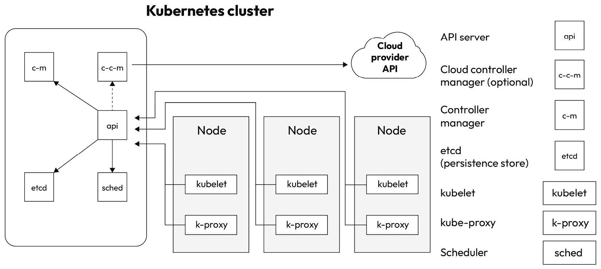
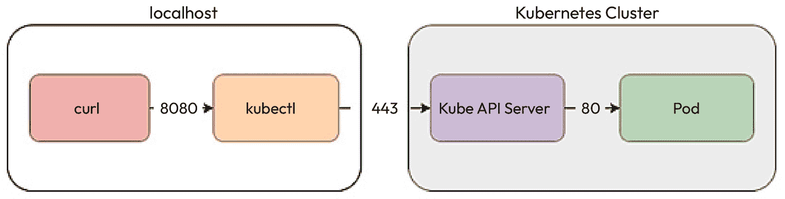
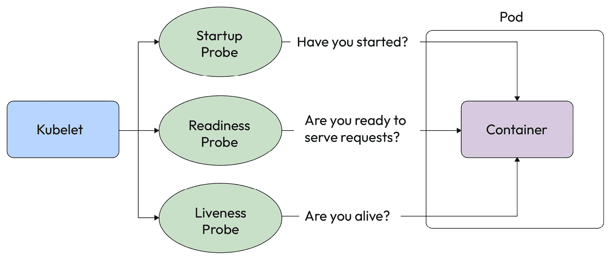
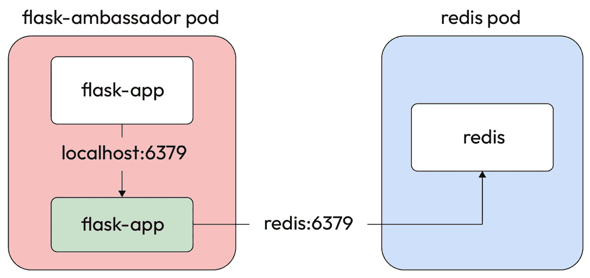
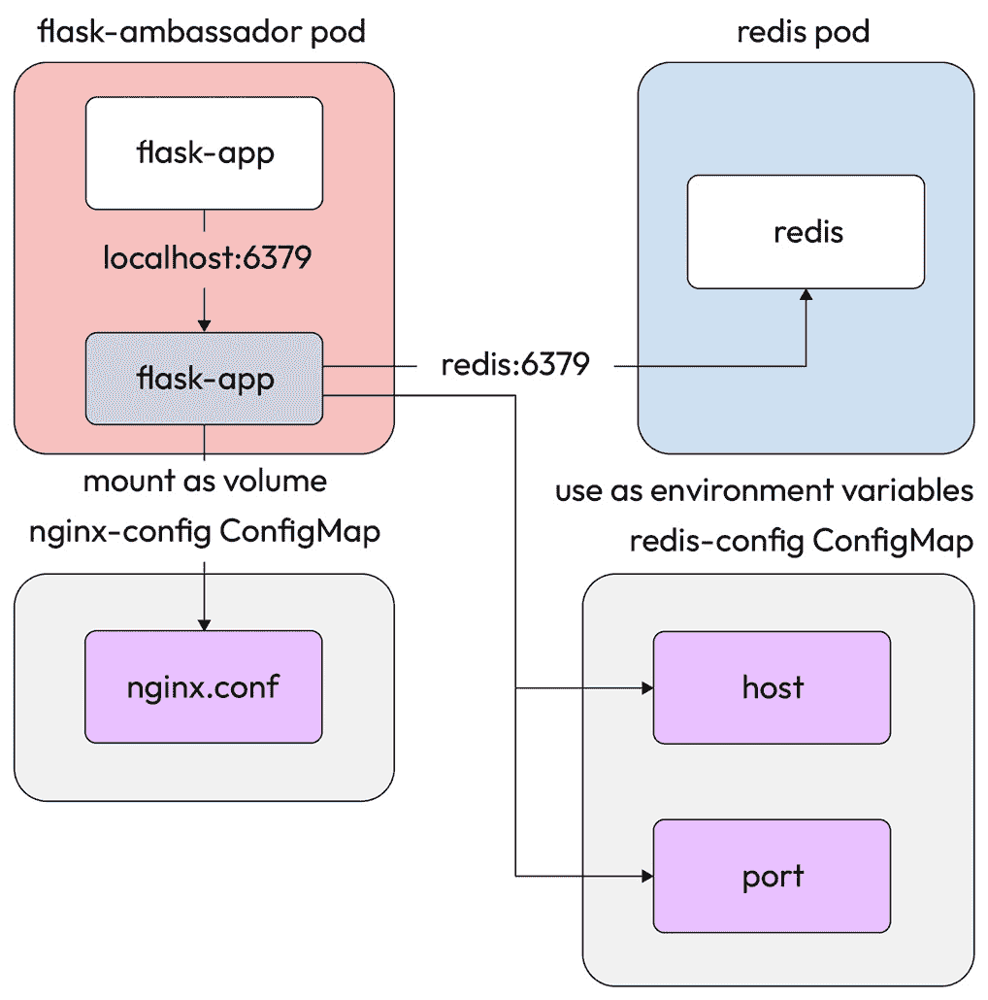
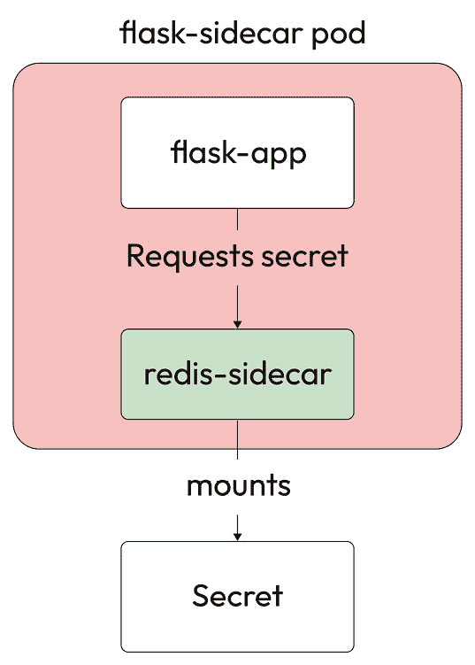
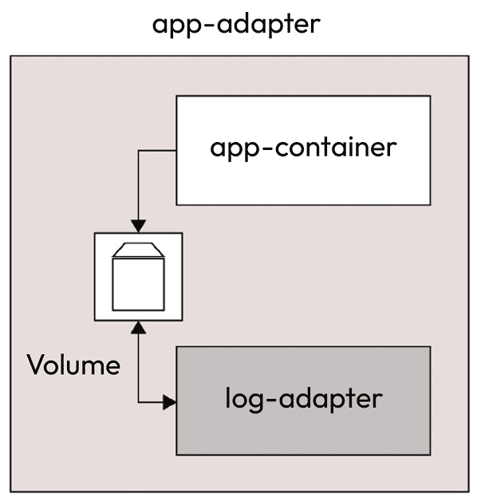

# 使用 Kubernetes 进行容器编排

在上一章中，我们介绍了创建和管理容器镜像的内容，讨论了容器镜像、Dockerfile 及其指令和组件。我们还讨论了编写 Dockerfile 的最佳实践，以及如何构建和管理高效的镜像。接着，我们探讨了扁平化 Docker 镜像，并详细研究了无发行版镜像，以提高容器安全性。最后，我们创建了一个私有 Docker 注册中心。

现在，我们将深入探讨容器编排。我们将学习如何使用最流行的容器编排工具——Kubernetes，来调度和运行容器。

在本章中，我们将涵盖以下主要主题：

+   什么是 Kubernetes，为什么我需要它？

+   Kubernetes 架构

+   安装 Kubernetes（Minikube 和 KinD）

+   理解 Kubernetes Pod

# 技术要求

本章假设您已在具有 `sudo` 权限的 Linux 机器上安装了 Docker。您可以参考*第三章*，*使用 Docker 容器化*，获取更多关于如何操作的细节。

您还需要克隆以下 GitHub 存储库以进行一些练习：[`github.com/PacktPublishing/Modern-DevOps-Practices-2e`](https://github.com/PacktPublishing/Modern-DevOps-Practices-2e)。

运行以下命令将存储库克隆到您的主目录，并使用 `cd` 进入 `ch5` 目录以访问所需的资源：

```
$ git clone https://github.com/PacktPublishing/Modern-DevOps-Practices-2e.git \
  modern-devops
$ cd modern-devops/ch5
```

由于该存储库包含带占位符的文件，因此您必须将 `<your_dockerhub_user>` 字符串替换为您实际的 Docker Hub 用户名。请使用以下命令来替换占位符：

```
$ grep -rl '<your_dockerhub_user>' . | xargs sed -i -e \
 's/<your_dockerhub_user>/<your actual docker hub user>/g'
```

# 什么是 Kubernetes，为什么我需要它？

到现在为止，您应该了解容器是什么以及如何使用 Docker 构建和运行容器。然而，我们使用 Docker 运行容器的方式从生产角度来看并不理想。让我给你提供一些考虑事项：

+   由于便携式容器可以在任何 Docker 机器上顺利运行，多个容器还共享服务器资源以优化资源消耗。现在，想象一个由数百个容器组成的微服务应用程序。您将如何选择在哪台机器上运行容器？如果您希望根据资源消耗动态调度容器到另一台机器上呢？

+   容器提供了水平扩展能力，因为您可以创建容器的副本，并在一组容器前面使用**负载均衡器**。一种方法是提前决定并部署所需数量的容器，但这不是最优的资源利用方式。如果我告诉你，你需要根据流量动态水平扩展容器——换句话说，当流量增加时，创建额外的容器实例来处理额外的负载，而当流量减少时，减少容器实例呢？

+   容器有健康检查报告，显示容器的健康状态。如果容器不健康，并且你想让它自动修复该怎么办？如果整个服务器宕机，你希望将该服务器上的所有容器调度到其他地方，会发生什么？

+   由于容器大多运行在服务器内，并且能够彼此看到，那么我如何确保只有必要的容器能够互相交互，这是我们通常在虚拟机中做的事情？我们不能妥协于安全性。

+   现代云平台允许我们运行自动扩展的虚拟机（VM）。从容器的角度来看，我们如何利用这一点？例如，如果我在夜间只需要一台虚拟机来容纳我的容器，而白天需要五台，我该如何确保在需要时动态分配这些机器？

+   如果多个容器是更广泛服务网格的一部分，你如何管理它们之间的网络连接？

所有这些问题的答案是一个容器编排工具，而最受欢迎且*事实上的*标准就是 Kubernetes。

Kubernetes 是一个开源的容器编排工具。一群谷歌工程师最初开发了它，然后将其开源并交给了**云原生计算基金会**（**CNCF**）。从那时起，Kubernetes 的热度未曾减退，而且这是有充分理由的——Kubernetes 与容器的结合彻底改变了技术思维方式以及我们看待基础设施的方式。Kubernetes 不再将服务器视为专门为某个应用程序服务的机器，或者作为应用程序的一部分，而是允许将服务器可视化为一个已安装容器运行时的实体。当我们将服务器视为标准设置时，我们就能在一群服务器的集群中运行几乎任何东西。因此，你不必为技术栈中的每个应用程序单独规划**高可用性**（**HA**）、**灾难恢复**（**DR**）和其他运营方面的问题。相反，你可以将所有服务器聚集成一个单位——Kubernetes 集群——并将所有应用程序容器化。然后，你可以将所有容器管理功能交给 Kubernetes 来处理。你可以在裸金属服务器、虚拟机（VM）上运行 Kubernetes，或者通过多种 Kubernetes 作为服务的产品，在云中运行它。

Kubernetes 通过提供开箱即用的高可用性（HA）、可扩展性和零停机时间来解决这些问题。它基本上执行以下功能来提供这些功能：

+   **提供集中式控制平面与其交互**：API 服务器暴露了一个有用的 API 列表，你可以通过它调用许多 Kubernetes 功能。它还提供了一个名为 **kubectl** 的 Kubernetes 命令行工具，方便你使用简单的命令与 API 进行交互。拥有一个集中式控制平面确保了你可以无缝地与 Kubernetes 进行交互。

+   **与容器运行时交互以调度容器**：当我们向**kube-apiserver**发送请求调度容器时，Kubernetes 会根据各种因素决定将容器调度到哪个服务器，然后通过**kubelet**组件与服务器的容器运行时进行交互。

+   **在键值数据存储中存储期望的配置**：Kubernetes 应用集群的预期配置，并将其存储在键值数据存储中——**etcd**。这样，Kubernetes 会持续确保集群中的容器保持在期望的状态。如果有任何偏离预期状态的情况，Kubernetes 会采取措施将其恢复到期望的配置。通过这种方式，Kubernetes 确保你的容器始终正常运行并保持健康。

+   **提供网络抽象层和服务发现**：Kubernetes 使用网络抽象层来允许容器之间的通信。因此，每个容器都会分配一个虚拟 IP，Kubernetes 确保一个容器可以从运行在不同服务器上的另一个容器访问。它通过在服务器之间使用**覆盖网络**提供必要的网络连接。从容器的角度来看，集群中的所有容器就像是在同一台服务器上运行一样。Kubernetes 还使用**DNS**来通过域名允许容器之间的通信。这样，容器可以通过使用域名而不是 IP 地址来相互交互，从而确保如果容器被重新创建且 IP 地址发生变化时，你不需要更改配置。

+   **与云提供商交互**：Kubernetes 与云提供商交互，以调度诸如**负载均衡器**和**持久磁盘**等对象。因此，如果你告诉 Kubernetes 你的应用程序需要持久化数据并定义了一个**卷**，Kubernetes 会自动向你的云提供商请求磁盘，并将其挂载到运行容器的地方。你还可以通过向 Kubernetes 请求将应用程序暴露在外部负载均衡器上。Kubernetes 会与云提供商交互，启动负载均衡器并将其指向你的容器。通过这种方式，你可以仅通过与 Kubernetes API 服务器交互来处理所有与容器相关的事务。

Kubernetes 包含多个组件，它们负责处理我们讨论的每个功能。现在，让我们来看看 Kubernetes 的架构，以了解每个组件的作用。

# Kubernetes 架构

Kubernetes 是由一组节点组成的集群。在 Kubernetes 中，节点有两种可能的角色——**控制平面**节点和**工作**节点。控制平面节点控制 Kubernetes 集群，调度工作负载、监听请求以及其他帮助运行工作负载和使集群运作的方面。它们通常构成集群的大脑。

另一方面，工作节点是 Kubernetes 集群的动力源，为运行容器工作负载提供原始计算能力。

Kubernetes 架构通过 API 服务器遵循客户端-服务器模型。所有的交互，包括组件之间的内部交互，都通过 Kubernetes API 服务器进行。因此，Kubernetes API 服务器被称为 Kubernetes 控制平面的“大脑”。

Kubernetes 还有其他组件，但在深入细节之前，让我们通过下面的图表来了解高层次的 Kubernetes 架构：



图 5.1 – Kubernetes 集群架构

控制平面包含以下组件：

+   **API 服务器**：如前所述，API 服务器暴露了一组 API，供外部和内部参与者与 Kubernetes 进行交互。所有与 Kubernetes 的交互都通过 API 服务器进行，从前面的图示可以看出。如果将 Kubernetes 集群想象成一艘船，API 服务器就是船长。

+   **控制器管理器**：控制器管理器是船上的执行官，负责确保船长的命令在集群中得到遵守。从技术角度来看，控制器管理器读取当前状态和目标状态，并采取一切必要的行动将当前状态转变为目标状态。它包含一组控制器，这些控制器根据需要通过 API 服务器与 Kubernetes 组件进行交互。以下是其中的一些：

    +   **节点控制器**：该控制器监控节点何时宕机，并通过与 **Kube 调度器** 通过 **Kube API 服务器** 进行交互，将 Pods 调度到健康的节点上。

    +   **复制控制器**：该控制器确保集群中定义的正确数量的容器副本存在。

    +   **终端控制器**：这些控制器帮助通过服务为你的容器提供终端。

    +   **服务账户和令牌控制器**：这些控制器为新的 **命名空间** 创建默认的 **账户** 和 **令牌**。

+   **云控制器管理器**：这是一个可选的控制器管理器，若你在公共云上运行 Kubernetes（例如 **AWS**、**Azure** 或 **GCP**），则需要运行此控制器管理器。云控制器管理器与云提供商的 API 进行交互，来配置你在 Kubernetes 配置中声明的资源，如 **持久磁盘** 和 **负载均衡器**。

+   **etcd**：**etcd** 是船的日志簿。这里存储着所有关于预期配置的详细信息。从技术角度来看，这是一个键值存储，存储着所有期望的 Kubernetes 配置。控制器管理器会参考这个数据库中的信息来执行集群中的更改。

+   **调度器**：调度器就像船只的水手长。它们负责监督容器在船上的装卸过程。Kubernetes 调度器会根据资源的可用性、应用程序的高可用性以及其他因素，在合适的工作节点上调度容器。

+   **kubelet**：kubelet 就像船员一样。它们实际执行容器从船上装卸的操作。从技术角度看，kubelet 与底层的容器运行时交互，根据调度器的指令运行容器。虽然大多数 Kubernetes 组件可以作为容器运行，但 kubelet 是唯一作为 **systemd** 服务运行的组件。它们通常运行在工作节点上，但如果你计划将控制平面组件作为容器运行，那么 kubelet 也会在控制平面节点上运行。

+   **kube-proxy**：**kube-proxy** 在每个工作节点上运行，为容器提供与集群内外网络组件交互的功能。它们是促进 Kubernetes 网络通信的关键组件。

好吧，这涉及很多环节，但好消息是，有现成的工具可以帮助你设置，而部署 Kubernetes 集群非常简单。如果你在公共云上运行，几次点击即可完成，你可以使用云提供商的 Web UI 或 CLI 来快速部署。如果是本地安装，你可以使用**kubeadm**进行设置。步骤文档完善，易于理解，也不会太麻烦。

对于开发和 CI/CD 环境，你可以使用**Minikube**或**Docker 中的 Kubernetes**（**KinD**）。Minikube 可以直接在你的开发机器上运行单节点 Kubernetes 集群，将机器作为节点使用；它也可以通过将 Kubernetes 节点作为容器来运行多节点集群。另一方面，KinD 仅在单节点和多节点配置中将节点作为容器运行。在这两种情况下，你都需要一个具有必要资源的虚拟机，然后就可以开始了。

在下一部分，我们将使用 Minikube 启动一个单节点 Kubernetes 集群。

# 安装 Kubernetes（Minikube 和 KinD）

现在，让我们继续进行 Kubernetes 的安装。我们将从 Minikube 开始，帮助你快速入门，然后再了解 KinD。接下来，我们将在本章的其余部分使用 KinD。

## 安装 Minikube

我们将在与安装 Docker 相同的 Linux 机器上安装 Minikube，参考*第三章*，*使用 Docker 进行容器化*。因此，如果你还没有进行该操作，请前往*第三章*，*使用 Docker 进行容器化*，并按照提供的说明在你的机器上设置 Docker。

首先，我们将安装 **kubectl**。如前所述，kubectl 是与 Kubernetes API 服务器交互的命令行工具。在本书中，我们将多次使用 kubectl。

要下载最新版本的 kubectl，请运行以下命令：

```
$ curl -LO "https://storage.googleapis.com/kubernetes-release/release\
/$(curl -s https://storage.googleapis.com/kubernetes-release/release/stable.txt)\
/bin/linux/amd64/kubectl"
```

你也可以下载 kubectl 的特定版本。为此，请使用以下命令：

```
$ curl -LO https://storage.googleapis.com/kubernetes-release/release\
/v<kubectl_version>/bin/linux/amd64/kubectl
```

我们将在本章中使用最新版本。现在，让我们继续使二进制文件可执行，然后将其移动到系统的 `PATH` 中的任何目录：

```
$ chmod +x ./kubectl
$ sudo mv kubectl /usr/local/bin/
```

现在，让我们运行以下命令检查 kubectl 是否已成功安装：

```
$ kubectl version --client
Client Version: version.Info{Major:"1", Minor:"27", GitVersion:"v1.27.3"}
```

由于 kubectl 已成功安装，接下来你需要下载 `minikube` 二进制文件，并使用以下命令将其移动到系统路径中：

```
$ curl -Lo minikube \
https://storage.googleapis.com/minikube/releases/latest/minikube-linux-amd64
$ chmod +x minikube
$ sudo mv minikube /usr/local/bin/
```

现在，让我们通过运行以下命令来安装 Minikube 正常运行所需的包：

```
$ sudo apt-get install -y conntrack
```

最后，我们可以使用以下命令启动一个 Minikube 集群：

```
$ minikube start --driver=docker
Done! kubectl is now configured to use "minikube" cluster and "default" namespace by 
default
```

由于 Minikube 现在已经启动并运行，我们将使用 kubectl 命令行工具与 Kube API 服务器交互，以管理 Kubernetes 资源。kubectl 命令具有标准结构，并且大多数情况下易于理解。其结构如下：

```
kubectl <verb> <resource type> <resource name> [--flags]
```

这里，我们有以下内容：

+   `动词`：要执行的操作——例如 `get`（获取）、`apply`（应用）、`delete`（删除）、`list`（列出）、`patch`（修补）、`run`（运行）等

+   `资源类型`：要管理的 Kubernetes 资源，例如 `node`（节点）、`pod`（容器组）、`deployment`（部署）、`service`（服务）等

+   `资源名称`：要管理的资源的名称

现在，让我们使用 kubectl 获取节点并检查我们的集群是否准备好运行容器：

```
$ kubectl get nodes
NAME       STATUS   ROLES           AGE     VERSION
minikube   Ready    control-plane   2m25s   v1.26.3
```

在这里，我们可以看到这是一个运行版本 **v1.26.3** 的单节点 Kubernetes 集群。Kubernetes 现在已经启动并运行！

这个设置非常适合开发机器，开发人员可以在其上部署并测试他们正在开发的单个组件。

要停止 Minikube 集群并将其从机器中删除，你可以使用以下命令：

```
$ minikube stop
```

既然我们已经移除了 Minikube，接下来让我们看看另一个创建多节点 Kubernetes 集群的有趣工具。

## 安装 KinD

KinD 允许你在运行 Docker 的单个服务器上运行一个多节点的 Kubernetes 集群。我们知道，运行一个多节点的 Kubernetes 集群需要多台机器，但如何在单台服务器上运行一个多节点 Kubernetes 集群呢？答案很简单：KinD 使用 Docker 容器作为 Kubernetes 节点。因此，如果我们需要一个四节点的 Kubernetes 集群，KinD 会启动四个容器，它们表现得就像四个 Kubernetes 节点。就这么简单。

尽管你需要 Docker 来运行 KinD，但 KinD 内部使用 **containerd** 作为容器运行时，而不是 Docker。Containerd 实现了容器运行时接口，因此 Kubernetes 不需要任何专门的组件，如 **dockershim**，与其交互。这意味着，KinD 仍然能够与 Kubernetes 配合使用，因为 Docker 不再被支持作为 Kubernetes 的容器运行时。

由于 KinD 支持多节点 Kubernetes 集群，你可以将其用于开发活动，也可以用于 CI/CD 管道。实际上，KinD 重新定义了 CI/CD 管道，因为你不需要一个静态的 Kubernetes 环境来测试你的构建。KinD 启动速度快，这意味着你可以将 KinD 集群的引导过程集成到 CI/CD 管道中，在集群内运行并测试你的容器构建，然后将其销毁。这为开发团队提供了巨大的力量和速度。

重要

永远不要在生产环境中使用 KinD。Docker in Docker 的实现并不安全；因此，KinD 集群不应超出你的开发环境和 CI/CD 管道。

引导 KinD 只需几个命令。首先，我们需要下载 KinD，确保它可执行，然后使用以下命令将其移动到默认的 `PATH` 目录中：

```
$ curl -Lo ./kind https://kind.sigs.k8s.io/dl/v0.20.0/kind-linux-amd64
$ chmod +x kind
$ sudo mv kind /usr/local/bin/
```

要检查是否已安装 KinD，可以运行以下命令：

```
$ kind version
kind v0.20.0 go1.20.4 linux/amd64
```

现在，让我们引导一个多节点的 KinD 集群。首先，我们需要创建一个 KinD `config` 文件。KinD `config` 文件是一个简单的 YAML 文件，你可以在其中声明每个节点所需的配置。如果我们需要引导一个单控制平面和三个工作节点的集群，可以添加以下配置：

```
$ vim kind-config.yaml
kind: Cluster
apiVersion: kind.x-k8s.io/v1alpha4
nodes:
- role: control-plane
- role: worker
- role: worker
- role: worker
```

你还可以使用多个控制平面节点来实现高可用配置，在控制平面角色的节点上使用多个节点项。现在，我们先使用单个控制平面和三个工作节点的配置。

要使用前述配置引导你的 KinD 集群，请运行以下命令：

```
$ kind create cluster --config kind-config.yaml
```

这样，我们的 KinD 集群已经启动并运行了。现在，让我们使用以下命令列出节点，确认集群状态：

```
$ kubectl get nodes
NAME                 STATUS   ROLES           AGE   VERSION
kind-control-plane   Ready    control-plane   72s   v1.27.3
kind-worker          Ready    <none>          47s   v1.27.3
kind-worker2         Ready    <none>          47s   v1.27.3
kind-worker3         Ready    <none>          47s   v1.27.3
```

在这里，我们可以看到集群中有四个节点——一个控制平面和三个工作节点。现在集群已经准备好，我们将在下一个部分深入了解 Kubernetes，并看看一些最常用的 Kubernetes 资源。

# 理解 Kubernetes 的 pods

Kubernetes 的 pod 是 Kubernetes 应用程序的基本构建块。一个 pod 包含一个或多个容器，所有容器总是会调度到同一主机上。通常，pod 中只有一个容器，但在某些场景下，你需要在一个 pod 中调度多个容器。

要理解为什么 Kubernetes 最初采用 pod 的概念而不是使用容器，可能需要一些时间，但这是有原因的，随着你对工具的使用经验积累，你会理解其中的深意。现在，让我们来看一个简单的 pod 示例，以及如何在 Kubernetes 中调度它。

## 运行一个 pod

我们将首先使用简单的命令在 pod 中运行一个 NGINX 容器。然后，我们会看看如何以声明的方式进行操作。

要访问本节的资源，请`cd`到以下目录：

```
$ cd ~/modern-devops/ch5/pod/
```

要运行一个包含单个 NGINX 容器的 pod，请执行以下命令：

```
$ kubectl run nginx --image=nginx
```

要检查 pod 是否正在运行，可以运行以下命令：

```
$ kubectl get pod
NAME    READY   STATUS    RESTARTS   AGE
nginx   1/1     Running   0          26s
```

就是这样！正如我们所看到的，pod 现在正在运行。

要删除 pod，可以运行以下命令：

```
$ kubectl delete pod nginx
```

`kubectl run` 命令是创建 pod 的命令式方式，但与 Kubernetes 交互的另一种方式是使用声明性清单。`docker compose`。

提示

在预发布和生产环境中始终使用声明性方法创建 Kubernetes 资源。它们允许您将 Kubernetes 配置存储和版本化在诸如 Git 等源代码管理工具中，并启用 GitOps。在开发过程中，您可以使用命令式方法，因为命令比 YAML 文件具有更快的周转时间。

让我们看一个示例 pod 清单，`nginx-pod.yaml`：

```
apiVersion: v1
kind: Pod
metadata:
  labels:
    run: nginx
  name: nginx
spec:
  containers:
  - image: nginx
    imagePullPolicy: Always
    name: nginx
    resources:
      limits:
        memory: "200Mi"
        cpu: "200m"
      requests:
        memory: "100Mi"
        cpu: "100m"
  restartPolicy: Always
```

让我们首先了解文件。文件包含以下内容：

+   `apiVersion`: 这定义了我们正在定义的资源版本。在这种情况下，作为 pod 的版本为 `v1`。

+   `kind`: 这定义了我们要创建的资源类型 – 一个 pod。

+   `metadata`: `metadata` 部分定义了围绕此资源的名称和标签。它有助于通过标签唯一标识资源并分组多个资源。

+   `spec`: 这是主要部分，我们在这里定义资源的实际规格。

+   `spec.containers`: 此部分定义形成 pod 的一个或多个容器。

+   `spec.containers.name`: 这是容器的名称，在本例中为 `nginx-container`。

+   `spec.containers.image`: 这是容器镜像，在本例中是 `nginx`。

+   `spec.containers.imagePullPolicy`: 这可以是 `Always`（始终拉取）、`IfNotPresent`（仅在节点上未找到镜像时拉取）、或 `Never`（从不尝试从注册表拉取镜像并完全依赖本地镜像）。

+   `spec.containers.resources`: 这定义了资源的请求和限制。

+   `spec.containers.resources.limit`: 这定义了资源限制。这是 pod 可以分配的最大资源量，如果资源消耗超出此限制，pod 将被驱逐。

+   `spec.containers.resources.limit.memory`: 这定义了内存限制。

+   `spec.containers.resources.limit.cpu`: 这定义了 CPU 限制。

+   `spec.containers.resources.requests`: 这定义了资源请求。这是在调度期间 pod 需要的最小资源量，如果节点无法分配这些资源，将不会被调度。

+   `spec.containers.resources.requests.memory`: 这定义了要请求的内存量。

+   `spec.containers.resources.requests.cpu`: 这定义了要请求的 CPU 核心数量。

+   `spec.restartPolicy`: 这定义了容器的重启策略 – `Always`（始终重启）、`OnFailure`（失败时重启）、或 `Never`（从不重启）。这与 Docker 上的重启策略类似。

在 pod 清单上还有其他设置，但我们将根据进展情况逐步探讨。

重要提示

将 `imagePullPolicy` 设置为 `IfNotPresent`，除非你有充分的理由使用 `Always` 或 `Never`。这样可以确保你的容器快速启动，并且避免不必要地下载镜像。

在调度 pod 时，请始终使用资源请求和限制。这确保你的 pod 被调度到适当的节点，并且不会耗尽任何现有资源。你还可以在集群级别应用默认的资源策略，以确保如果开发人员由于某些原因忽略了这一部分，也不会造成任何损害。

让我们使用以下命令应用清单：

```
$ kubectl apply -f nginx-pod.yaml
```

我们创建的 pod 完全处于主机网络之外。它运行在容器网络内，默认情况下，Kubernetes 不允许任何 pod 暴露给主机网络，除非我们明确要暴露它。

访问 pod 有两种方式——使用 `kubectl port-forward` 进行端口转发，或者通过 `Service` 资源暴露 pod。

## 使用端口转发

在我们进入服务部分之前，让我们考虑一下使用 `port-forward` 选项。

要通过端口转发暴露 pod，请执行以下命令：

```
$ kubectl port-forward nginx 8080:80
Forwarding from 127.0.0.1:8080 -> 80
Forwarding from [::1]:8080 -> 80
```

提示信息停留在这里。这意味着它已打开端口转发会话，并在端口 `8080` 上监听。它将自动将收到的端口 `8080` 请求转发到 NGINX 的端口 `80`。

打开一个重复的终端会话，并在前述地址上执行 `curl`，查看我们会得到什么：

```
$ curl 127.0.0.1:8080
...
<title>Welcome to nginx!</title>
...
```

我们可以看到它正在工作，因为我们得到了默认的 NGINX 响应。

现在，这里有几点需要记住。

当我们使用 HTTP `port-forward` 时，我们是将请求从运行 `kubectl` 的客户端机器转发到 pod，类似于下图所示的内容：



图 5.2 – kubectl port-forward

当你运行 `kubectl` `port-forward` 时，`kubectl` 客户端通过 Kube API 服务器打开一个 TCP 隧道，然后 Kube API 服务器将连接转发到正确的 pod。由于 `kubectl` 客户端和 API 服务器之间的连接是加密的，因此这是一种非常安全的访问 pod 的方式，但在决定使用 `kubectl` `port-forward` 将 pod 暴露给外部世界之前，请三思。

有一些特定的使用场景适合使用 `kubectl` `port-forward`：

+   用于故障排除任何行为不正常的 pod。

+   用于访问 Kubernetes 内部服务，例如 Kubernetes 仪表盘——也就是说，当你不希望将服务暴露给外部世界，而只允许 Kubernetes 管理员和用户登录仪表盘时。假设只有这些用户可以通过 `kubectl` 访问集群。

对于其他任何情况，你应该使用 `Service` 资源来暴露你的 pod，无论是内部还是外部。虽然我们将在下一章中讨论 `Service` 资源，但让我们先看一下可以对 pod 执行的几个操作。

## 故障排除 pods

类似于我们使用`docker logs`浏览容器日志的方式，我们可以使用`kubectl logs`命令浏览 Kubernetes pod 中容器的日志。如果 pod 中运行多个容器，我们可以使用`-c`标志来指定容器的名称。

要访问容器日志，运行以下命令：

```
$ kubectl logs nginx -c nginx
...
127.0.0.1 - - [18/Jun/2023:14:08:01 +0000] "GET / HTTP/1.1" 200 612 "-" "curl/7.47.0" "-"
```

由于 pod 只运行一个容器，我们无需指定`-c`标志，因此你可以使用以下命令：

```
$ kubectl logs nginx
```

可能有些情况，你可能需要获取运行中容器的 shell 并排查容器内发生了什么。在 Docker 中我们使用`docker exec`来实现这个操作。同样，在 Kubernetes 中我们可以使用`kubectl exec`来实现这一点。

运行以下命令以打开与容器的 shell 会话：

```
$ kubectl exec -it nginx -- /bin/bash
root@nginx:/# cd /etc/nginx/ && ls
conf.d fastcgi_params mime.types modules nginx.conf scgi_params uwsgi_params
root@nginx:/etc/nginx# exit
```

你甚至可以在不打开 shell 会话的情况下运行特定命令。例如，我们可以通过一行命令来执行前面的操作，类似以下内容：

```
$ kubectl exec nginx -- ls /etc/nginx
conf.d fastcgi_params mime.types modules nginx.conf scgi_params uwsgi_params
```

`kubectl exec`是一个重要命令，有助于我们故障排除容器。

提示

如果你在`exec`模式下修改容器中的文件或下载包，这些更改会在当前 pod 存活期间持续有效。一旦 pod 被删除，你将失去所有更改。因此，这并不是解决问题的好方法。你应当只使用`exec`来诊断问题，将正确的更改嵌入到新镜像中，然后重新部署。

在上一章中我们讨论了无发行版容器，它们由于安全原因不允许`exec`进入容器。对于无发行版容器，提供了调试镜像，可以让你打开一个 shell 会话进行故障排除。

提示

默认情况下，如果在构建镜像时没有在 Dockerfile 中指定用户，容器会以 root 用户运行。如果你想以特定用户运行 pod，可以在 pod 的安全上下文中设置`runAsUser`属性，但这并不是理想的做法。最佳实践是将用户信息嵌入到容器镜像中。

我们已经讨论了如何故障排除运行中的容器，但如果容器由于某些原因无法启动怎么办？

让我们来看以下示例：

```
$ kubectl run nginx-1 --image=nginx-1
```

现在，让我们尝试获取 pod 并亲自查看：

```
$ kubectl get pod nginx-1
NAME      READY   STATUS             RESTARTS   AGE
nginx-1   0/1     ImagePullBackOff   0          25s
```

哎呀！现在出现了一些错误，状态是`ImagePullBackOff`。嗯，似乎是镜像出了些问题。虽然我们知道问题出在镜像上，但我们希望了解真正的问题所在，因此，为了进一步了解此问题，我们可以使用以下命令描述 pod：

```
$ kubectl describe pod nginx-1
```

现在，这为我们提供了关于 pod 的大量信息，如果你查看`events`部分，你会找到一行特定信息，告诉我们 pod 出了什么问题：

```
Warning  Failed     60s (x4 over 2m43s)  kubelet            Failed to pull image "nginx-
1": rpc error: code = Unknown desc = failed to pull and unpack image "docker.io/library/
nginx-1:latest": failed to resolve reference "docker.io/library/nginx-1:latest": pull 
access denied, repository does not exist or may require authorization: server message: 
insufficient_scope: authorization failed
```

所以，这条信息告诉我们，要么仓库不存在，要么仓库存在但为私有仓库，因此授权失败。

提示

你可以使用`kubectl describe`来查看大多数 Kubernetes 资源。它应该是你在故障排除时使用的第一个命令。

由于我们知道该镜像不存在，让我们将镜像更换为有效的镜像。我们必须删除 Pod，并使用正确的镜像重新创建它。

要删除 Pod，请运行以下命令：

```
$ kubectl delete pod nginx-1
```

要重新创建 Pod，请运行以下命令：

```
$ kubectl run nginx-1 --image=nginx
```

现在，让我们获取 Pod；它应该按如下方式运行：

```
$ kubectl get pod nginx-1
NAME      READY   STATUS    RESTARTS   AGE
nginx-1   1/1     Running   0          42s
```

由于我们已经解决了镜像问题，Pod 现在已经在运行。

到目前为止，我们已经能够使用 Pod 运行容器，但 Pod 是非常强大的资源，可以帮助你管理容器。Kubernetes Pod 提供了探针来确保应用程序的可靠性。我们将在下一节中详细介绍这一点。

## 确保 Pod 可靠性

我们在*第四章*《创建和管理容器镜像》中讨论了健康检查，我还提到过你不应该在 Docker 层面使用健康检查，而应该使用容器编排器提供的健康检查。Kubernetes 提供了三种**探针**来监控你的 Pod 健康状况——**启动探针**、**存活探针**和**就绪探针**。

以下图示展示了三种探针的图形化表示：



图 5.3 – Kubernetes 探针

让我们逐一查看每种探针，了解如何使用它们以及何时使用它们。

### 启动探针

Kubernetes 使用**启动探针**检查应用程序是否已启动。你可以在启动缓慢的应用程序上使用启动探针，或者在你不知道启动可能需要多长时间的情况下使用它。当启动探针处于活动状态时，它会禁用其他探针，以免它们干扰启动探针的操作。由于应用程序在启动探针报告之前并未启动，因此没有必要让其他探针处于活动状态。

### 就绪探针

**就绪探针**用来确认容器是否准备好接受请求。它们与启动探针有所不同，因为就绪探针不仅仅检查应用程序是否已启动，它还确保容器可以开始处理请求。当 Pod 中的所有容器都准备好时，Pod 才算是就绪。就绪探针确保在 Pod 没有准备好时不会向其发送流量。因此，它可以提供更好的用户体验。

### 存活探针

如果将 Pod 的 `restartPolicy` 字段设置为 `Always` 或 `OnFailure`，Kubernetes 会重新启动容器。因此，通过检测死锁并确保容器正在运行而不仅仅是报告运行状态，它提高了服务的可靠性。

现在，让我们通过一个例子来更好地理解探针。

### 探针实战

让我们改进最后的清单并添加一些探针，以创建以下 `nginx-probe.yaml` 清单文件：

```
    ...
    startupProbe:
      exec:
        command:
        - cat
        - /usr/share/nginx/html/index.html
      failureThreshold: 30
      periodSeconds: 10
    readinessProbe:
      httpGet:
        path: /
        port: 80
      initialDelaySeconds: 5
      periodSeconds: 5
    livenessProbe:
      httpGet:
        path: /
        port: 80
      initialDelaySeconds: 5
      periodSeconds: 3
  restartPolicy: Always
```

该清单文件包含所有三种探针：

+   启动探针检查 `/usr/share/nginx/html/index.html` 文件是否存在。它会以 10 秒的间隔连续检查 30 次，直到其中一次检查成功。一旦检测到文件，启动探针将停止进一步检查。

+   就绪探针检查端口 `80` 上是否有监听器，并以 `HTTP 2xx – 3xx on path /` 响应。它最初等待 5 秒，然后每 5 秒检查一次 Pod。如果它收到 `2xx – 3xx` 响应，它会报告容器已就绪并接受请求。

+   存活探针检查 Pod 是否在 `port` `80` 上并且 `path /` 路径下响应 `HTTP 2xx – 3xx`。它最初等待 5 秒，然后每 3 秒检查一次容器。假设在一次检查中，它发现 Pod 未响应`failureThreshold` 次（默认为 `3`）。在这种情况下，它将杀死容器，并且 kubelet 将根据 Pod 的 `restartPolicy` 字段采取适当的操作。

+   让我们应用 YAML 文件，并使用以下命令查看 Pod 的启动过程：

```
$ kubectl delete pod nginx && kubectl apply -f nginx-probe.yaml && \
 kubectl get pod -w
NAME    READY   STATUS              RESTARTS   AGE
nginx   0/1     Running             0          4s
nginx   0/1     Running             0          11s
nginx   1/1     Running             0          12s
```

正如我们所见，Pod 从运行状态变为就绪状态的过程非常迅速。大约需要 10 秒钟，因为就绪探针在 Pod 启动后的 10 秒开始生效。然后，存活探针继续监控 Pod 的健康状况。

现在，让我们做一些事情来破坏存活检查。假设有人通过 shell 进入容器并删除了一些重要的文件。你认为存活探针会如何反应？我们来看看。

让我们从容器中删除`/usr/share/nginx/html/index.html`文件，然后使用以下命令检查容器的行为：

```
$ kubectl exec -it nginx -- rm -rf /usr/share/nginx/html/index.html && \
 kubectl get pod nginx -w
NAME    READY   STATUS    RESTARTS     AGE
nginx   1/1     Running   0            2m5s
nginx   0/1     Running   1 (2s ago)   2m17s
nginx   1/1     Running   1 (8s ago)   2m22s
```

因此，当我们观察 Pod 时，初次删除只有在 9 秒后才被检测到。这是因为存活探针。它尝试了 9 秒钟，也就是三次 `periodSeconds`，因为 `failureThreshold` 默认为 `3`，才会宣布 Pod 不健康并杀死容器。容器一被杀死，kubelet 就会重新启动它，因为 Pod 的 `restartPolicy` 字段设置为 `Always`。然后，我们看到启动和就绪探针开始生效，很快，Pod 就变为就绪状态。因此，无论发生什么情况，你的 Pod 都是可靠的，即使你的应用程序的某部分出现故障，它仍然能够正常工作。

提示

使用就绪探针和存活探针有助于提供更好的用户体验，因为没有请求会发送到尚未准备好处理任何请求的 Pod。如果你的应用程序没有正确响应，它将替换容器。如果多个 Pod 正在运行以处理请求，那么你的服务具有极强的弹性。

正如我们之前讨论的，Pod 可以包含一个或多个容器。让我们来看一些可能需要多个容器而非一个容器的使用场景。

## Pod 多容器设计模式

你可以通过两种方式在 Pod 中运行多个容器——将容器作为初始化容器运行，或者将容器作为主容器的辅助容器运行。我们将在接下来的子章节中探讨这两种方法。

### 初始化容器

**初始化容器**在主容器启动之前运行，因此你可以在主容器接管之前使用它们初始化容器环境。以下是一些示例：

+   在使用非 root 用户启动容器之前，某些目录可能需要特定的所有权或权限设置

+   在启动 web 服务器之前，你可能想要克隆一个 Git 仓库

+   你可以添加启动延迟

+   你可以动态生成配置，例如针对那些在构建时不知道但在运行时应该知道的容器，它们可能需要动态连接到其他某个 pod。

提示

仅将 init 容器作为最后手段使用，因为它们会拖慢容器的启动时间。尽量在容器镜像内预先配置或定制它。

现在，让我们看一个示例，了解 init 容器的实际应用。

要访问此部分的资源，`cd` 进入以下路径：

```
$ cd ~/modern-devops/ch5/multi-container-pod/init/
```

让我们通过 `nginx` web 服务器提供 `example.com` 网站。在启动 `nginx` 之前，我们将获取 `example.com` 网页并将其保存为 `index.html` 到 `nginx` 默认的 HTML 目录中。

访问清单文件 `nginx-init.yaml`，它应包含以下内容：

```
…
spec:
  containers:
  - name: nginx-container
    image: nginx
    volumeMounts:
    - mountPath: /usr/share/nginx/html
      name: html-volume
  initContainers:
  - name: init-nginx
    image: busybox:1.28
    command: ['sh', '-c', 'mkdir -p /usr/share/nginx/html && wget -O /usr/share/nginx/html/index.html http://example.com']
    volumeMounts:
    - mountPath: /usr/share/nginx/html
      name: html-volume
  volumes:
  - name: html-volume
    emptyDir: {}
```

如果我们查看清单文件的 `spec` 部分，我们会看到以下内容：

+   `containers`：此部分定义了一个或多个构成 pod 的容器。

+   `containers.name`：这是容器的名称，在这种情况下是 `nginx-container`。

+   `containers.image`：这是容器镜像，在这种情况下是 `nginx`。

+   `containers.volumeMounts`：这定义了应挂载到容器的卷列表。它类似于我们在 *第四章* 中学习的内容，*创建和管理容器镜像*。

+   `containers.volumeMounts.mountPath`：这定义了挂载卷的路径，在这种情况下是 `/usr/share/nginx/html`。我们将与 init 容器共享这个卷，以便当 init 容器从 `example.com` 下载 `index.html` 文件时，这个目录中会包含相同的文件。

+   `containers.volumeMounts.name`：这是卷的名称，在这种情况下是 `html-volume`。

+   `initContainers`：此部分定义了一个或多个在主容器之前运行的 init 容器。

+   `initContainers.name`：这是 init 容器的名称，在这种情况下是 `init-nginx`。

+   `initContainers.image`：这是 init 容器的镜像，在这种情况下是 `busybox:1.28`。

+   `initContainers.command`：这是 busybox 应执行的命令。在这种情况下，`'mkdir -p /usr/share/nginx/html && wget -O /usr/share/nginx/html/index.html [`example.com`](http://example.com)'` 将下载 `example.com` 的内容到 `/usr/share/nginx/html` 目录。

+   `initContainers.volumeMounts`：我们将在此容器上挂载与 `nginx-container` 中定义的相同的卷。因此，我们在该卷中保存的任何内容都会自动出现在 `nginx-container` 中。

+   `initContainers.volumeMounts.mountPath`：这定义了挂载卷的路径，在这种情况下是 `/usr/share/nginx/html`。

+   `initContainers.volumeMounts.name`：这是卷的名称，在本例中是 `html-volume`。

+   `volumes`：此部分定义了与 Pod 容器相关联的一个或多个卷。

+   `volumes.name`：这是卷的名称，在本例中是 `html-volume`。

+   `volumes.emptyDir`：这定义了一个 `emptyDir` 卷。它类似于 Docker 中的 `tmpfs` 卷，因此它不是持久的，只在容器的生命周期内存在。

所以，让我们继续应用清单，并使用以下命令观察 Pod 的启动过程：

```
$ kubectl delete pod nginx && kubectl apply -f nginx-init.yaml && \
 kubectl get pod nginx -w
NAME    READY   STATUS            RESTARTS   AGE
nginx   0/1     Init:0/1          0          0s
nginx   0/1     PodInitializing   0          1s
nginx   1/1     Running           0          3s
```

最初，我们可以看到 `nginx` Pod 显示状态为 `Init:0/1`。这意味着 `1` 个初始化容器中有 `0` 个开始初始化。过了一段时间后，我们可以看到 Pod 报告其状态为 `PodInitializing`，这意味着初始化容器已经开始运行。初始化容器成功运行后，Pod 报告为运行状态。

现在，一旦 Pod 开始运行，我们可以使用以下命令将容器的端口 `80` 转发到主机端口 `8080`：

```
$ kubectl port-forward nginx 8080:80
```

打开一个新的终端窗口，尝试通过以下命令使用 `curl` 访问本地主机的端口 `8080`：

```
$ curl localhost:8080
    <title>Example Domain</title>
```

在这里，我们可以看到来自我们 web 服务器的示例域响应。这意味着初始化容器工作正常。

正如你现在可能已经理解的那样，初始化容器的生命周期在主容器启动之前结束，一个 Pod 可以包含一个或多个主容器。接下来，我们来看看我们可以在主容器中使用的一些设计模式。

### 大使模式

`localhost` 在任何地方。

现在，你可以采取两种方法：

+   你可以更改应用程序代码，并使用配置映射和机密（稍后会详细介绍）将数据库连接详情注入到环境变量中。

+   你可以继续使用现有代码，并使用第二个容器作为 Redis 数据库的 TCP 代理。该 TCP 代理将与配置映射和机密连接，并包含 Redis 数据库的连接详情。

提示

大使模式帮助开发人员专注于应用程序，而不必担心配置细节。如果你想将应用程序开发与配置管理解耦，可以考虑使用它。

第二种方法解决了我们希望进行完全相同迁移的问题。我们可以使用配置映射来定义特定环境的配置，而无需更改应用程序代码。以下图示展示了这种方法：



图 5.4 – 大使模式

在深入技术细节之前，我们先了解一下配置映射。

### 配置映射

**配置映射** 包含键值对，我们可以用于多种目的，例如定义特定环境的属性，或者在容器启动时或运行时注入外部变量。

配置映射的理念是将应用程序与配置解耦，并在 Kubernetes 层次上外部化配置。这类似于使用属性文件，例如，定义特定环境的配置。

以下图表对此进行了很好的解释：



图 5.5 – 配置映射

我们将使用`ConfigMap`在代理容器内定义外部 Redis 数据库的连接属性。

#### 示例应用程序

我们将使用在*第三章*中使用的示例应用程序，*使用 Docker 进行容器化*，以及*使用 Docker Compose 部署示例应用程序*部分。源代码已复制到以下目录：

```
$ cd ~/modern-devops/ch5/multi-container-pod/ambassador
```

你可以查看 Flask 应用程序的`app.py`文件、`requirements.txt`文件和 Dockerfile，以了解该应用程序的功能。

现在，让我们使用以下命令构建容器：

```
$ docker build -t <your_dockerhub_user>/flask-redis .
```

让我们使用以下命令将其推送到我们的容器注册表：

```
$ docker push <your_dockerhub_user>/flask-redis
```

正如你可能注意到的，`app.py`代码将缓存定义为`localhost:6379`。我们将在`localhost:6379`上运行一个代理容器。代理将把连接隧道转发到其他地方运行的`redis` Pod。

首先，让我们使用以下命令创建`redis` Pod：

```
$ kubectl run redis --image=redis
```

现在，让我们通过`Service`资源将`redis` Pod 暴露给集群资源。这将允许集群中的任何 Pod 通过`redis`主机名与`redis` Pod 进行通信。我们将在下一章详细讨论 Kubernetes `Service`资源：

```
$ kubectl expose pod redis --port 6379
```

酷！现在 Pod 和`Service`资源已经启动并运行，让我们来处理代理模式。

我们首先需要定义两个配置映射。第一个描述`redis`主机和端口信息，第二个定义作为反向代理工作的模板`nginx.conf`文件。

`redis-config-map.yaml`文件如下所示：

```
apiVersion: v1
kind: ConfigMap
metadata:
  name: redis-config
data:
  host: "redis"
  port: "6379"
```

上面的 YAML 文件定义了一个名为`redis-config`的配置映射，其中包含`host`和`port`属性。你可以拥有多个配置映射，每个环境一个。

`nginx-config-map.yaml`文件如下所示：

```
apiVersion: v1
kind: ConfigMap
metadata:
  name: nginx-config
data:
  nginx.conf: |
    ...
    stream {
        server {
            listen     6379;
            proxy_pass stream_redis_backend;
        }
        upstream stream_redis_backend {
            server REDIS_HOST:REDIS_PORT;
        }
    }
```

该配置映射将`nginx.conf`模板作为配置映射值注入。此模板定义了我们的代理 Pod 配置，使其监听`localhost:6379`并将连接隧道转发到`REDIS_HOST:REDIS_PORT`。由于`REDIS_HOST`和`REDIS_PORT`值是占位符，我们必须用从`redis-config`配置映射中获得的正确值填充这些占位符。为此，我们可以将此文件挂载到一个卷上，然后进行操作。我们可以使用`initContainer`来使用正确的配置初始化代理。

现在，让我们查看 Pod 配置清单`flask-ambassador.yaml`。该 YAML 文件包含多个部分。首先，让我们看看`containers`部分：

```
...
spec:
  containers:
  - name: flask-app
    image: <your_dockerhub_user>/flask-redis
  - name: nginx-ambassador
    image: nginx
    volumeMounts:
    - mountPath: /etc/nginx
      name: nginx-volume
  ...
```

本节包含一个名为`flask-app`的容器，它使用我们在上一节中构建的`<your_dockerhub_user>/flask-redis`镜像。第二个容器是`nginx-ambassador`容器，它将充当代理与`redis`通信。因此，我们已将`/etc/nginx`目录挂载到一个卷中。此卷也挂载在初始化容器中，用于在`nginx`启动之前生成所需的配置。

以下是`initContainers`部分：

```
  initContainers:
  - name: init-nginx
    image: busybox:1.28
    command: ['sh', '-c', 'cp -L /config/nginx.conf /etc/nginx/nginx.conf && sed -i "s/
REDIS_HOST/${REDIS_HOST}/g" /etc/nginx/nginx.conf']
    env:
      - name: REDIS_HOST
        valueFrom:
          configMapKeyRef:
            name: redis-config
            key: host
      - name: REDIS_PORT
        valueFrom:
          configMapKeyRef:
            name: redis-config
            key: port
    volumeMounts:
    - mountPath: /etc/nginx
      name: nginx-volume
    - mountPath: /config
      name: config
```

本节定义了一个`busybox`容器——`init-nginx`。该容器需要生成与 Redis 通信的`nginx-ambassador`代理配置；因此，存在两个环境变量。这两个环境变量来自`redis-config`配置映射。此外，我们还从`nginx-config`配置映射中挂载了`nginx.conf`文件。初始化容器中的`command`部分使用这些环境变量替换`nginx.conf`文件中的占位符，之后我们就得到了与 Redis 后端的 TCP 代理。

`volumes`部分将`nginx-volume`定义为一个`emptyDir`卷，并将`config`卷挂载到`nginx.conf`文件，该文件位于`nginx-config`配置映射中：

```
  volumes:
  - name: nginx-volume
    emptyDir: {}
  - name: config
    configMap:
      name: nginx-config
      items:
      - key: "nginx.conf"
        path: "nginx.conf"
```

现在，让我们开始分步应用 YAML 文件。

使用以下命令应用两个配置映射：

```
$ kubectl apply -f redis-config-map.yaml
$ kubectl apply -f nginx-config-map.yaml
```

使用以下命令应用 pod 配置：

```
$ kubectl apply -f flask-ambassador.yaml
```

使用以下命令获取 pod 查看配置是否正确：

```
$ kubectl get pod/flask-ambassador
NAME               READY   STATUS    RESTARTS   AGE
flask-ambassador   2/2     Running   0          10s
```

由于 pod 现在运行正常，让我们通过以下命令将`5000`端口转发到本地主机以进行一些测试：

```
$ kubectl port-forward flask-ambassador 5000:5000
```

现在，打开一个新的终端，并使用以下命令尝试在`localhost:5000`上进行`curl`测试：

```
$ curl localhost:5000
Hi there! This page was last visited on 2023-06-18, 16:52:28.
$ curl localhost:5000
Hi there! This page was last visited on 2023-06-18, 16:52:28.
$ curl localhost:5000
Hi there! This page was last visited on 2023-16-28, 16:52:32.
```

如我们所见，每次执行`curl`请求时，都会在屏幕上显示最后一次访问时间。Ambassador 模式正在正常工作。

这是一个简单的 Ambassador 模式示例。你可以进行更高级的配置，以细粒度控制你的应用如何与外界交互。你可以使用 Ambassador 模式来保护从容器传输的流量。它还简化了应用开发过程，开发团队无需担心这些细节。而运维团队可以使用这些容器更好地管理环境，而不必互相干扰。

提示

由于 Ambassador 模式通过代理隧道连接会增加一些开销，因此只有在管理上的好处超过因使用 Ambassador 容器而产生的额外成本时，才应使用此模式。

现在，让我们来看一下另一种多容器 pod 模式——sidecar 模式。

### Sidecar 模式

**旁车**这个名字来源于摩托车的副驾驶厢。旁车并不会改变摩托车的核心功能，而且没有旁车，摩托车也能正常运行。旁车只是增加了一个额外的座位，提供一个功能，帮助你载一个额外的人。类似地，Pod 中的旁车是提供与主容器核心功能无关的辅助容器，增强主容器的功能。例如，日志记录和监控容器。将日志单独放入一个容器，有助于将日志职责与主容器解耦，从而即使主容器因为某些原因宕机时，你也能继续监控你的应用程序。

如果日志代码出现问题，并且不会导致整个应用程序崩溃，而只是影响日志容器，这时使用这种方式会很有帮助。你还可以使用旁车（sidecar）将辅助或相关容器与主容器放在一起，因为我们知道，同一个 Pod 内的容器共享同一台机器。

提示

只有在两个容器功能上有直接关系并且作为一个整体工作时，才使用多容器 Pod。

你还可以使用旁车将应用程序与秘密数据隔离开。例如，如果你正在运行一个需要访问特定密码才能运行的 Web 应用程序，最好将秘密数据挂载到旁车容器上，并通过旁车容器将密码提供给 Web 应用程序。这是因为如果有人访问了你的应用程序容器的文件系统，他们是无法获取到密码的，因为密码是由另一个容器提供的，具体如下面的图所示：



图 5.6 – 旁车模式

让我们实现前面的模式来更好地理解旁车。我们有一个与 Redis 旁车交互的 Flask 应用程序。我们将使用 Kubernetes 的 Secret 资源将一个名为 `foobar` 的秘密预先填充到 Redis 旁车中。

### 秘密

使用 `base64` 编码而不是 `plaintext`。虽然从安全角度来看，`base64` 编码并不会提供比 `plaintext` 更好的保护，但你应当使用秘密存储敏感信息，如密码。因为 Kubernetes 社区会在未来的版本中开发解决方案，加强对秘密数据的安全保护。如果你使用秘密存储，你将直接受益于这些改进。

提示

一般来说，始终使用秘密存储机密数据，如 API 密钥和密码，而配置映射则用于存储非敏感的配置数据。

要访问本节的文件，请前往以下目录：

```
$ cd ~/modern-devops/ch5/multi-container-pod/sidecar
```

现在，让我们继续看一下示例 Flask 应用程序。

#### 示例应用程序

Flask 应用程序查询 Redis 旁车以获取密钥并将其作为响应返回。这样做并不理想，因为你不应该将秘密数据作为响应返回，但为了演示的目的，我们就照这样做。

所以，首先，让我们设计我们的旁车容器，让它在启动后预填充容器内的数据。

我们需要创建一个名为 `secret` 的密钥，其值为 `foobar`。现在，通过运行以下命令将 Redis 命令进行 `base64` 编码，将密钥设置到缓存中：

```
$ echo 'SET secret foobar' | base64
U0VUIHNlY3JldCBmb29iYXIK
```

现在我们有了 `base64` 编码的密钥，我们可以创建一个名为 `redis-secret.yaml` 的清单，并按照以下字符串创建：

```
apiVersion: v1
kind: Secret
metadata:
  name: redis-secret
data:
  redis-secret: U0VUIHNlY3JldCBmb29iYXIK
```

然后，我们需要构建 Redis 容器，以便在启动时创建此密钥。要访问本节的文件，请转到以下目录：

```
$ cd ~/modern-devops/ch5/multi-container-pod/sidecar/redis/
```

创建一个 `entrypoint.sh` 文件，如下所示：

```
redis-server --daemonize yes && sleep 5
redis-cli < /redis-master/init.redis
redis-cli save
redis-cli shutdown
redis-server
```

Shell 脚本查找 `/redis-master` 目录中的文件 `init.redis`，并在其上运行 `redis-cli` 命令。这意味着缓存将使用我们的密钥中定义的值进行预填充，前提是我们将密钥作为 `/redis-master/init.redis` 挂载。

然后，我们必须创建一个 Dockerfile，该文件将使用这个 `entrypoint.sh` 脚本，如下所示：

```
FROM redis
COPY entrypoint.sh /tmp/
CMD ["sh", "/tmp/entrypoint.sh"]
```

现在我们准备好了，可以构建并将代码推送到 Docker Hub：

```
$ docker build -t <your_dockerhub_user>/redis-secret .
$ docker push <your_dockerhub_user>/redis-secret
```

现在，我们已经准备好了 Redis 镜像，我们必须构建 Flask 应用程序镜像。要访问本节的文件，请`cd`进入以下目录：

```
$ cd ~/modern-devops/ch5/multi-container-pod/sidecar/flask
```

让我们首先查看 `app.py` 文件：

```
...
cache = redis.Redis(host='localhost', port=6379)
def get_secret():
    try:
        secret = cache.get('secret')
        return secret
...
def index():
    secret = str(get_secret().decode('utf-8'))
    return 'Hi there! The secret is {}.\n'.format(secret)
```

代码很简单——它从缓存中获取密钥并将其作为响应返回。

我们还创建了与上一节相同的 Dockerfile。

因此，让我们构建并将容器镜像推送到 Docker Hub：

```
$ docker build -t <your_dockerhub_user>/flask-redis-secret .
$ docker push <your_dockerhub_user>/flask-redis-secret
```

现在我们的镜像准备好了，让我们看看 Pod 清单，`flask-sidecar.yaml`，该清单位于 `~/``modern-devops/ch5/multi-container-pod/sidecar/` 目录中：

```
...
spec:
  containers:
  - name: flask-app
    image: <your_dockerhub_user>/flask-redis-secret
  - name: redis-sidecar
    image: <your_dockerhub_user>/redis-secret
    volumeMounts:
    - mountPath: /redis-master
      name: secret
  volumes:
  - name: secret
    secret:
      secretName: redis-secret
      items:
      - key: redis-secret
        path: init.redis
```

Pod 定义了两个容器——`flask-app` 和 `redis-sidecar`。`flask-app` 容器运行 Flask 应用程序，该应用程序将与 `redis-sidecar` 交互以获取密钥。`redis-sidecar` 容器已将 `secret` 卷挂载到 `/redis-master`。Pod 定义还包含一个名为 `secret` 的单个卷，卷指向 `redis-secret` 密钥，并将其作为文件 `init.redis` 挂载。

因此，最后，我们有一个文件 `/redis-master/init.redis`，正如我们所知，`entrypoint.sh` 脚本查找此文件并运行 `redis-cli` 命令，以预填充 Redis 缓存中的秘密数据。

让我们首先使用以下命令应用这个密钥：

```
$ kubectl apply -f redis-secret.yaml
```

然后，我们可以使用以下命令应用 `flask-sidecar.yaml` 文件：

```
$ kubectl apply -f flask-sidecar.yaml
```

现在，让我们使用以下命令获取 Pod：

```
$ kubectl get pod flask-sidecar
NAME            READY   STATUS              RESTARTS   AGE
flask-sidecar   2/2     Running             0          11s
```

由于 Pod 正在运行，现在是时候使用以下命令将其端口转发到主机：

```
$ kubectl port-forward flask-sidecar 5000:5000
```

现在，让我们打开一个重复的终端，运行 `curl localhost:5000` 命令，并看看我们得到了什么：

```
$ curl localhost:5000
Hi there! The secret is foobar.
```

正如我们所看到的，我们在响应中得到了密钥 `foobar`。边车工作正常！

现在，让我们先看另一个流行的多容器 Pod 模式——适配器模式。

### 适配器模式

正如其名称所示，**适配器模式**有助于将某些事物转换为符合标准的形式，比如手机和笔记本电脑的适配器，它们将我们的主要电源转换为设备可以使用的形式。适配器模式的一个很好的例子是转换日志文件，使其符合企业标准，并将其传输到你的日志分析解决方案中：



图 5.7 – 适配器模式

当你有一个异构解决方案输出多种格式的日志文件，但却只有一个日志分析解决方案，它只接受特定格式的消息时，这时就会有所帮助。实现这一目标有两种方法：一种是更改输出日志文件的代码以符合标准格式，另一种是使用适配器容器来执行转换。

让我们通过以下场景进一步理解它。

我们有一个应用程序，它不断输出没有日期前缀的日志文件。我们的适配器应该读取日志流，并在每次生成日志行时添加时间戳。

为此，我们将使用以下的 pod 清单文件，`app-adapter.yaml`：

```
...
spec:
  volumes:
  - name: logs
    emptyDir: {}
  containers:
  - name: app-container
    image: ubuntu
    command: ["/bin/bash"]
    args: ["-c", "while true; do echo 'This is a log line' >> /var/log/app.log; sleep 
2;done"]
    volumeMounts:
    - name: logs
      mountPath: /var/log
  - name: log-adapter
    image: ubuntu
    command: ["/bin/bash"]
    args: ["-c", "apt update -y && apt install -y moreutils && tail -f /var/log/app.log | 
ts '[%Y-%m-%d %H:%M:%S]' > /var/log/out.log"]
    volumeMounts:
    - name: logs
      mountPath: /var/log
```

该 pod 包含两个容器 —— 应用容器，它是一个简单的 Ubuntu 容器，每 2 秒输出一次 `This is a log line`，以及日志适配器容器，它持续地跟踪 `app.log` 文件，在每一行的开头添加时间戳，并将结果输出到 `/var/log/out.log`。这两个容器共享 `/var/log` 卷，该卷作为 `emptyDir` 卷挂载在两个容器中。

现在，让我们使用以下命令应用这个清单：

```
$ kubectl apply -f app-adapter.yaml
```

让我们等一会儿，通过以下命令检查 pod 是否在运行：

```
$ kubectl get pod app-adapter
NAME          READY   STATUS    RESTARTS   AGE
app-adapter   2/2     Running   0          8s
```

当 pod 正在运行时，我们现在可以通过以下命令进入日志适配器容器的 shell：

```
$ kubectl exec -it app-adapter -c log-adapter -- bash
```

当我们进入 shell 后，可以通过以下命令`cd`到`/var/log`目录，并列出其中的内容：

```
root@app-adapter:/# cd /var/log/ && ls
app.log apt/ dpkg.log out.log
```

正如我们所看到的，我们得到了`app.log`和`out.log`这两个文件。现在，让我们使用`cat`命令打印它们，看看会得到什么。

首先，使用以下命令`cat` `app.log`文件：

```
root@app-adapter:/var/log# cat app.log
This is a log line
This is a log line
This is a log line
```

在这里，我们可以看到一系列的日志行正在被打印。

现在，使用以下命令`cat` `out.log`文件，看看会得到什么：

```
root@app-adapter:/var/log# cat out.log
[2023-06-18 16:35:25] This is a log line
[2023-06-18 16:35:27] This is a log line
[2023-06-18 16:35:29] This is a log line
```

在这里，我们可以看到日志行前面有时间戳。这意味着适配器模式正常工作。然后，你可以将此日志文件导出到你的日志分析工具中。

# 总结

我们已经完成了这一关键章节的内容。我们已经涵盖了足够的内容，能够帮助你入门 Kubernetes，并理解并重视其最佳实践。

我们从 Kubernetes 及其必要性开始，然后讨论了使用 Minikube 和 KinD 引导 Kubernetes 集群。接着，我们了解了 pod 资源，讨论了如何创建和管理 pod，排除故障，确保应用程序的可靠性（使用探针），以及多容器设计模式，深入理解为什么 Kubernetes 使用 pod 而不是单纯的容器。

在下一章中，我们将深入探讨 Kubernetes 的高级方面，涵盖控制器、服务、入口、管理有状态应用程序以及 Kubernetes 命令行最佳实践。

# 问题

请回答以下问题，测试你对本章的知识掌握情况：

1.  与 Kubernetes 的所有通信通过以下哪一项进行？

    A. Kubelet

    B. API 服务器

    C. Etcd

    D. 控制器管理器

    E. 调度器

1.  以下哪个负责确保集群处于期望状态？

    A. Kubelet

    B. API 服务器

    C. Etcd

    D. 控制器管理器

    E. 调度器

1.  以下哪个负责存储集群的期望状态？

    A. Kubelet

    B. API 服务器

    C. Etcd

    D. 控制器管理器

    E. 调度器

1.  Pod 可以包含多个容器。（正确/错误）

1.  你可以使用端口转发来处理以下哪些使用场景？（选择两项）

    A. 用于故障排除行为异常的 Pod

    B. 用于将服务暴露到互联网

    C. 用于访问系统服务，例如 Kubernetes 仪表盘

1.  结合使用以下哪两种探针可以帮助确保即使应用程序有一些间歇性问题时，它仍然可靠？（选择两项）

    A. 启动探针

    B. 存活探针

    C. 就绪探针

1.  我们可以在生产环境中使用 KinD。（正确/错误）

1.  以下哪个多容器模式用于作为前向代理？

    A. 使者容器

    B. 适配器

    C. 边车容器

    D. 初始化容器

# 答案

以下是本章问题的答案：

1.  B

1.  D

1.  C

1.  正确

1.  A, C

1.  B, C

1.  错误

1.  A
