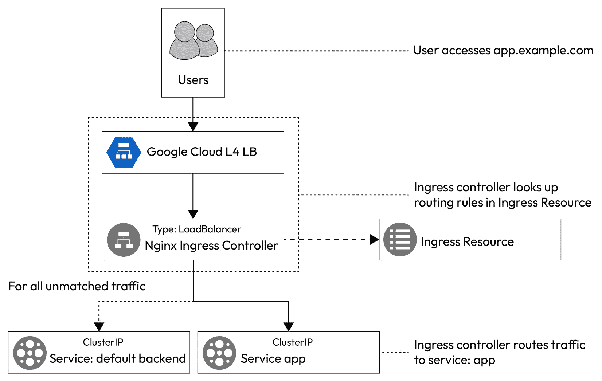
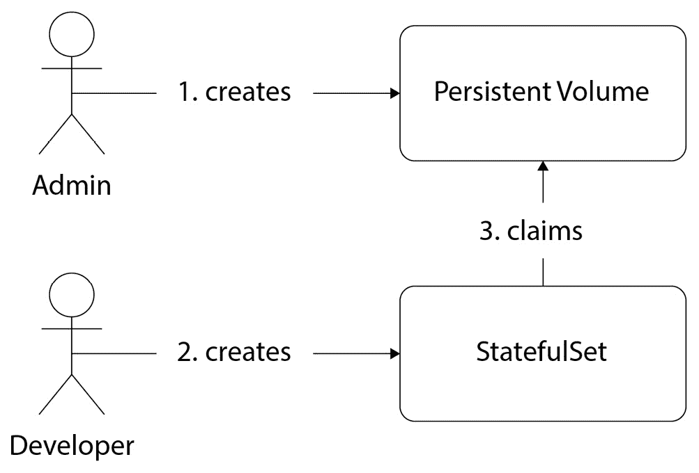

# 第六章：管理高级 Kubernetes 资源

在上一章中，我们介绍了 Kubernetes 及其需求，并讨论了如何使用 MiniKube 和 KinD 启动 Kubernetes 集群。接着，我们查看了 `Pod` 资源，讨论了如何创建和管理 Pods，如何排查问题，并如何通过探针确保应用程序的可靠性，还探讨了多容器设计模式，以理解 Kubernetes 为什么使用 Pods 而不是容器。我们还了解了 `Secrets` 和 `ConfigMaps`。

现在，我们将深入探讨 Kubernetes 的高级部分以及 Kubernetes 命令行最佳实践。

在本章中，我们将讨论以下主要内容：

+   高级 Kubernetes 资源的需求

+   Kubernetes 部署

+   Kubernetes 服务和入口

+   水平 Pod 自动扩展

+   管理有状态的应用程序

+   Kubernetes 命令行最佳实践、技巧和窍门

所以，让我们开始吧！

# 技术要求

对于本章，我们将为练习启动一个基于云的 Kubernetes 集群，**Google Kubernetes Engine**（**GKE**）。因为你将无法在本地系统中启动负载均衡器和 PersistentVolumes，所以在本章中我们不能使用 KinD 和 MiniKube。

目前，**Google Cloud Platform**（**GCP**）提供免费的 $300 试用，期限为 90 天，所以你可以前往 [`cloud.google.com/free`](https://cloud.google.com/free) 注册。

## 启动 GKE

注册并登录到控制台后，你可以打开 Google Cloud Shell CLI 来运行命令。

你需要先启用 GKE API，使用以下命令：

```
$ gcloud services enable container.googleapis.com
```

要创建一个三节点 GKE 集群，运行以下命令：

```
$ gcloud container clusters create cluster-1 --zone us-central1-a
```

就是这样！集群已成功启动并运行。

你还需要克隆以下 GitHub 仓库来进行一些练习：[`github.com/PacktPublishing/Modern-DevOps-Practices-2e`](https://github.com/PacktPublishing/Modern-DevOps-Practices-2e)。

运行以下命令将仓库克隆到你的主目录，并使用 `cd` 进入 `ch6` 目录以访问所需的资源：

```
$ git clone https://github.com/PacktPublishing/Modern-DevOps-Practices-2e.git \
modern-devops 
$ cd modern-devops/ch6
```

现在，让我们了解一下为什么我们需要高级 Kubernetes 资源。

# 高级 Kubernetes 资源的需求

在上一章中，我们讨论了 pod，这是 Kubernetes 的基本构建块，为您的容器在 Kubernetes 环境中提供一切必需的内容。然而，单独的 pod 并不是那么有效。原因在于，尽管它们定义了容器应用及其规范，但它们不会复制、自动修复或维护特定状态。删除 pod 后，该 pod 就不存在了。您不能使用 pod 维护代码的多个版本，也不能使用 pod 进行发布和回滚。使用仅有的 pod 也不能根据流量自动缩放您的应用程序。Pod 无法让您将容器暴露给外部世界，也不提供负载均衡、基于内容和路径的路由、将持久数据存储到外部附加存储等流量管理功能。为了解决这些问题，Kubernetes 为我们提供了特定的高级资源，如 Deployments、Services、Ingresses、PersistentVolumes 和 claims，以及 StatefulSets。让我们在下一节中从 Kubernetes 部署开始。

# Kubernetes 部署

让我们通过一个简单的类比来理解 Kubernetes 部署。

想象一下，您是一位在厨房里准备特定菜肴的厨师。您希望确保每次上菜时都能保持一致的完美，同时希望能够更改食谱而不引起混乱。

在 Kubernetes 的世界中，“Deployment” 就像是您的副厨。它帮助您轻松创建和管理您的 pod 的副本。

它是如何工作的：

+   **创建一致性**：您希望将您的菜肴服务给许多客人。因此，与其分别烹饪每份盘子，不如一次性准备一堆。所有的盘子都应该味道相同，完全按照预期来。Kubernetes 部署为您的 pod 做到了这一点，创建多个相同的 pod 副本，确保它们都具有相同的设置。

+   `Deployment` 资源会逐个缓慢而谨慎地替换旧副本，以确保您的应用始终可用，您的访客（或用户）不会注意到任何中断。

+   **优雅回滚**：有时，实验并不如预期那样顺利，您可能需要回到原始食谱。就像在厨房里一样，Kubernetes 允许您将 pod 的版本回滚到之前的版本，如果新版本出现问题的话。

+   **轻松扩展**：想象一下您的餐厅突然迎来了一波顾客，您需要更多的盘子来盛放您的特色菜肴。Kubernetes 部署也能帮助您做到这一点。它可以快速创建更多的 pod 副本来处理增加的需求，并在事态平静下来时移除它们。

+   **管理多个厨房**：如果您有多家餐馆，您希望您的招牌菜在所有餐馆中味道一致。类似地，如果您在测试、开发和生产等不同环境中使用 Kubernetes，部署可以帮助保持一致性。

本质上，Kubernetes 的 Deployments 帮助管理你的 pod，就像副厨师管理厨房里做的菜肴一样。它们确保一致性、安全性和灵活性，确保你的应用顺利运行，并且可以在不打乱你 *软件厨房* 的情况下进行更新。

Kubernetes 中的容器应用部署是通过 `Deployment` 资源来完成的。`Deployment` 资源背后使用了 `ReplicaSet` 资源，因此在继续学习 `Deployment` 资源之前，了解 `ReplicaSet` 资源会很有帮助。

## `ReplicaSet` 资源

`ReplicaSet` 资源是 Kubernetes 控制器，帮助你在给定时间运行多个 pod 副本。它们为容器工作负载提供水平扩展，形成容器的水平扩展集的基本构建块，一组相似的容器组合在一起作为一个单元运行。

`ReplicaSet` 资源定义了在给定时间运行的 pod 副本数目。Kubernetes 控制器随后会尝试维持副本，并在 pod 宕机时重新创建它。

你不应单独使用 `ReplicaSet` 资源，而应将其作为 `Deployment` 资源的后端。

为了更好理解，我们来看一个例子。要访问本节的资源，`cd` 到以下目录：

```
$ cd ~/modern-devops/ch6/deployments/
```

`ReplicaSet` 资源清单 `nginx-replica-set.yaml` 看起来是这样的：

```
apiVersion: apps/v1
kind: ReplicaSet
metadata:
  name: nginx
  labels:
    app: nginx
spec:
  replicas: 3
  selector:
    matchLabels:
      app: nginx
  template:
    metadata:
      labels:
        app: nginx
    spec:
      containers:
      - name: nginx
        image: nginx
```

资源清单包括 `apiVersion` 和 `kind`，就像其他任何资源一样。它还包含一个 `metadata` 部分，用于定义资源的 `name` 和 `labels` 属性，类似于其他任何 Kubernetes 资源。

`spec` 部分包含以下属性：

+   `replicas`：这定义了通过选择器匹配的 pod 副本数目，在给定时间内运行。

+   `selector`：这定义了 `ReplicaSet` 资源将包含 pod 的基础。

+   `selector.matchLabels`：这定义了选择 pod 的标签及其值。因此，`ReplicaSet` 资源将选择任何具有 `app:` `nginx` 标签的 pod。

+   `template`：这是一个可选部分，你可以使用它来定义 pod 模板。这个部分的内容非常类似于定义一个 pod，唯一不同的是它没有 `name` 属性，因为 `ReplicaSet` 资源会为 pod 生成动态名称。如果不包含这个部分，`ReplicaSet` 资源仍会尝试获取具有匹配标签的现有 pod。但由于缺少模板，它不能创建新的 pod。因此，最佳实践是为 `ReplicaSet` 资源指定一个模板。

让我们继续应用这个清单，看看会得到什么：

```
$ kubectl apply -f nginx-replica-set.yaml
```

现在，让我们运行以下命令列出 `ReplicaSet` 资源：

```
$ kubectl get replicaset
NAME    DESIRED   CURRENT   READY   AGE
nginx   3         3         0       9s
```

对的——我们看到有三个期望的副本。目前，`3` 个副本正在运行，但 `0` 个副本准备好。让我们等一会儿，然后重新运行以下命令：

```
$ kubectl get replicaset
NAME    DESIRED   CURRENT   READY   AGE
nginx   3         3         3       1m10s
```

现在，我们看到 `3` 个已就绪的 pod 正在等待连接。接下来，让我们列出这些 pod，看看 `ReplicaSet` 资源在幕后做了什么，使用以下命令：

```
$ kubectl get pod
NAME          READY   STATUS    RESTARTS   AGE
nginx-6qr9j   1/1     Running   0          1m32s
nginx-7hkqv   1/1     Running   0          1m32s
nginx-9kvkj   1/1     Running   0          1m32s
```

有三个 `nginx` pod，每个名称以 `nginx` 开头，但以随机哈希值结尾。`ReplicaSet` 资源会在 `ReplicaSet` 资源名称的末尾附加一个随机哈希，以生成唯一的 pod。是的——Kubernetes 中每种资源的名称都应该是唯一的。

让我们继续使用以下命令删除 `ReplicaSet` 资源中的一个 pod，并查看结果：

```
$ kubectl delete pod nginx-9kvkj && kubectl get pod
pod "nginx-9kvkj" deleted
NAME          READY   STATUS    RESTARTS   AGE
nginx-6qr9j   1/1     Running   0          8m34s
nginx-7hkqv   1/1     Running   0          8m34s
nginx-9xbdf   1/1     Running   0          5s
```

我们看到，尽管我们删除了 `nginx-9kvkj` pod，但 `ReplicaSet` 资源已经用一个新 pod `nginx-9xbdf` 替代了它。这就是 `ReplicaSet` 资源的工作方式。

你可以像删除其他 Kubernetes 资源一样删除 `ReplicaSet` 资源。你可以运行命令 `kubectl delete replicaset <ReplicaSet 名称>` 来进行命令式删除，或者使用 `kubectl delete -f <清单文件>` 进行声明式删除。

我们使用之前的方法，通过以下命令删除 `ReplicaSet` 资源：

```
$ kubectl delete replicaset nginx
```

让我们运行以下命令检查 `ReplicaSet` 资源是否已被删除：

```
$ kubectl get replicaset
No resources found in default namespace.
```

在 `default` 命名空间中没有任何资源。这意味着 `ReplicaSet` 资源已被删除。

正如我们讨论的，`ReplicaSet` 资源不应单独使用，而应作为 `Deployment` 资源的后台。接下来我们来看一下 Kubernetes `Deployment` 资源。

## Deployment 资源

Kubernetes `Deployment` 资源有助于管理容器应用程序的部署。它们通常用于管理无状态工作负载。尽管你仍然可以使用它们来管理有状态应用程序，但推荐的有状态应用程序处理方式是使用 `StatefulSet` 资源。

Kubernetes Deployments 使用 `ReplicaSet` 资源作为后台，资源链条如下图所示：


图 6.1 – Deployment 链接

让我们以之前的示例为基础，创建一个 nginx `Deployment` 资源清单——`nginx-deployment.yaml`：

```
apiVersion: apps/v1
kind: Deployment
metadata:
  name: nginx
  labels:
    app: nginx
spec:
  replicas: 3
  selector:
    matchLabels:
      app: nginx
  template:
    metadata:
      labels:
        app: nginx
    spec:
      containers:
      - name: nginx
        image: nginx
```

该清单与 `ReplicaSet` 资源非常相似，唯一不同的是 `kind` 属性——在这种情况下是 `Deployment`。

让我们通过以下命令应用该清单：

```
$ kubectl apply -f nginx-deployment.yaml
```

所以，`Deployment` 资源已经创建，让我们看看它创建的资源链条。通过以下命令运行 `kubectl get` 来列出 `Deployment` 资源：

```
$ kubectl get deployment
NAME    READY   UP-TO-DATE   AVAILABLE   AGE
nginx   3/3     3            3           6s
```

我们看到有一个名为 `nginx` 的 `Deployment` 资源，包含 `3/3` 个已就绪 pod 和 `3` 个最新的 pod。由于 `Deployment` 资源管理多个版本，`UP-TO-DATE` 表示最新的 `Deployment` 资源是否已成功滚动发布。我们将在后续部分详细讨论这一点。同时，它显示当前有 `3` 个可用的 pod。

由于我们知道`Deployment`资源会在后台创建`ReplicaSet`资源，我们可以使用以下命令查看`ReplicaSet`资源：

```
$ kubectl get replicaset
NAME               DESIRED   CURRENT   READY   AGE
nginx-6799fc88d8   3         3         3       11s
```

我们可以看到，`Deployment`资源创建了一个`ReplicaSet`资源，其名称以`nginx`开头，并以一个随机哈希值结尾。这是必要的，因为一个`Deployment`资源可能包含一个或多个`ReplicaSet`资源。我们将在后续部分了解这一点。

接下来是 pods，我们可以使用以下命令查看这些 pods：

```
$ kubectl get pod
NAME                     READY   STATUS    RESTARTS   AGE
nginx-6799fc88d8-d52mj   1/1     Running   0          15s
nginx-6799fc88d8-dmpbn   1/1     Running   0          15s
nginx-6799fc88d8-msvxw   1/1     Running   0          15s
```

正如预期的那样，我们有三个 pod。每个 pod 的名称都以`ReplicaSet`资源名称开始，并以一个随机哈希值结束。这就是为什么你会在 pod 名称中看到两个哈希值。

假设你有一个新版本并希望部署一个新的容器镜像。那么，我们可以使用以下命令更新`Deployment`资源并使用新的镜像：

```
$ kubectl set image deployment/nginx nginx=nginx:1.16.1
deployment.apps/nginx image updated
```

要检查部署状态，可以运行以下命令：

```
$ kubectl rollout status deployment nginx
deployment "nginx" successfully rolled out
```

像刚才显示的这些命令，通常不会在生产环境中使用，因为它们缺乏使用 Git 版本控制的声明性清单所提供的审计追踪。然而，如果你选择使用这些命令，你始终可以使用以下命令记录上次发布的更改原因：

```
$ kubectl annotate deployment nginx kubernetes.io/change-cause\
="Updated nginx version to 1.16.1" --overwrite=true
deployment.apps/nginx annotated
```

要查看部署历史，可以运行以下命令：

```
$ kubectl rollout history deployment nginx
deployment.apps/nginx
REVISION  CHANGE-CAUSE
1         <none>
2         Updated nginx version to 1.16.1
```

如我们所见，部署历史中有两个修订版本。修订版本`1`是最初的部署，修订版本`2`是由于我们运行了`kubectl set image`命令，正如`CHANGE-CAUSE`列中所显示的那样。

假设你在部署后发现了问题，并希望回滚到先前的版本。为了这样做，并重新检查部署的状态，可以运行以下命令：

```
$ kubectl rollout undo deployment nginx && kubectl rollout status deployment nginx
deployment.apps/nginx rolled back
Waiting for deployment "nginx" rollout to finish: 2 out of 3 new replicas have been 
updated...
Waiting for deployment "nginx" rollout to finish: 1 old replicas are pending 
termination...
deployment "nginx" successfully rolled out
```

最后，我们可以使用以下命令重新检查部署历史：

```
$ kubectl rollout history deployment nginx
deployment.apps/nginx
REVISION  CHANGE-CAUSE
2         Updated nginx version to 1.16.1
3         <none>
```

然后我们得到修订版本`3`，其`CHANGE-CAUSE`值为`<none>`。在这种情况下，我们没有像上一个命令那样注释回滚。

提示

始终注释部署更新，因为这样可以更容易查看历史记录，了解部署了什么内容。

现在，让我们来看看一些常见的 Kubernetes 部署策略，以便了解如何有效地使用部署。

## Kubernetes 部署策略

更新现有的部署需要指定一个新的容器镜像。这就是为什么我们首先对容器镜像进行版本控制，以便可以根据需要滚动发布和回滚应用程序更改的原因。由于我们所有的应用都运行在容器中——容器本质上是短暂的——这使得我们可以实现多种不同的部署策略。这里有几种部署策略，其中一些如下所示：

+   **重新创建**：这是所有方法中最简单的一种。删除旧的 pod 并部署一个新的。

+   **滚动更新**：在运行旧版本的同时，逐步推出新版本的 pods，并随着新 pods 的准备好，逐步删除旧的 pods。

+   **蓝绿发布**：这是一种派生的部署策略，我们同时运行两个版本，当需要时将流量切换到新版。

+   **金丝雀发布**：这适用于蓝绿部署（Blue/Green Deployments），其中我们在完全推出版本之前，将一定比例的流量切换到应用程序的新版。

+   **A/B 测试**：A/B 测试更多是一种应用于蓝绿部署的技术。这是当你希望将新版推出给一部分愿意的用户，并在完全推出新版之前研究他们的使用模式。Kubernetes 并没有开箱即用的 A/B 测试功能，但你可以依赖与 Kubernetes 配合良好的服务网格技术，如 **Istio**、**Linkerd** 和 **Traefik**。

Kubernetes 提供了两种开箱即用的部署策略——`Recreate` 和 `RollingUpdate`。

### 重建

`Recreate` 策略是最简单直接的部署策略。当你使用 `Recreate` 策略更新 `Deployment` 资源时，Kubernetes 会立即停止旧的 `ReplicaSet` 资源，并根据以下图示创建一个新的 `ReplicaSet` 资源，且具有所需数量的副本：


图 6.2 – Recreate 策略

Kubernetes 不会删除旧的 `ReplicaSet` 资源，而是将 `replicas` 设置为 `0`。这是为了能够快速回滚到旧版本。这种方法会导致停机时间，因此你只应在有约束的情况下使用。因此，这种策略不是 Kubernetes 的默认部署策略。

提示

如果你的应用程序不支持多个副本，或者它不支持超过一定数量的副本（例如需要维持法定人数的应用程序），或者它不支持同时运行多个版本，那么你可以使用 `Recreate` 策略。

让我们使用 `Recreate` 策略更新 `nginx-deployment`。让我们来看一下 `nginx-recreate.yaml` 文件：

```
...
spec:
  replicas: 3
  strategy:
    type: Recreate
...
```

YAML 文件现在包含一个 `strategy` 部分，并且设置为 `Recreate` 类型。现在，让我们应用 `nginx-recreate.yaml` 文件，并使用以下命令查看 `ReplicaSet` 资源：

```
$ kubectl apply -f nginx-recreate.yaml && kubectl get replicaset -w
deployment.apps/nginx configured
NAME               DESIRED   CURRENT   READY   AGE
nginx-6799fc88d8   0         0         0       0s
nginx-6889dfccd5   0         3         3       7m42s
nginx-6889dfccd5   0         0         0       7m42s
nginx-6799fc88d8   3         0         0       1s
nginx-6799fc88d8   3         3         0       2s
nginx-6799fc88d8   3         3         3       6s
```

`Deployment` 资源会创建一个新的 `ReplicaSet` 资源——`nginx-6799fc88d8`——其期望副本数为 `0`。然后，它将旧的 `ReplicaSet` 资源的期望副本数设置为 `0`，并等待旧的 `ReplicaSet` 资源完全驱逐。接着，它会自动开始推出新的 `ReplicaSet` 资源，以达到期望的镜像。

### 滚动更新

当你使用 `RollingUpdate` 策略更新 Deployment 时，Kubernetes 会创建一个新的 `ReplicaSet` 资源，同时在新的 `ReplicaSet` 资源上启动所需数量的 pod，并逐渐关闭旧的 `ReplicaSet` 资源，正如以下图示所示：


图 6.3 – RollingUpdate 策略

`RollingUpdate`是默认的部署策略。除了那些无法容忍在给定时间内存在多个版本的应用外，大多数应用都可以使用`RollingUpdate`策略。

让我们使用`RollingUpdate`策略更新`nginx`的`Deployment`资源。我们将重新使用之前使用的标准`nginx-deployment.yaml`文件。使用以下命令并查看`ReplicaSet`资源会发生什么：

```
$ kubectl apply -f nginx-deployment.yaml && kubectl get replicaset -w
deployment.apps/nginx configured 
NAME               DESIRED   CURRENT   READY   AGE
nginx-6799fc88d8   3         3         3       49s
nginx-6889dfccd5   1         1         1       4s
nginx-6799fc88d8   2         2         2       53s
nginx-6889dfccd5   2         2         2       8s
nginx-6799fc88d8   1         1         1       57s
nginx-6889dfccd5   3         3         3       11s
nginx-6799fc88d8   0         0         0       60s
```

如我们所见，旧的`ReplicaSet`资源—`nginx-6799fc88d8`—正在被下线，而新的`ReplicaSet`资源—`nginx-6889dfccd5`—正在被同时上线。

`RollingUpdate`策略还有两个选项—`maxUnavailable`和`maxSurge`。

当`maxSurge`定义了在给定时间内我们可以拥有的额外 Pod 的最大数量时，`maxUnavailable`定义了在给定时间内我们可以拥有的不可用 Pod 的最大数量。

提示

如果你的应用无法容忍超过某个数量的副本，请将`maxSurge`设置为`0`。如果你希望保持可靠性，并且应用可以容忍超过设定的副本数，请将`maxUnavailable`设置为`0`。你不能将这两个参数都设置为`0`，因为那样会使任何滚动尝试变得不可能。在设置`maxSurge`时，确保你的集群有足够的空闲容量来启动额外的 Pod，否则滚动更新将失败。

使用这些设置，我们可以创建不同类型的自定义滚动策略—接下来的部分将讨论一些流行的策略。

### 渐进式慢滚动

如果你有多个副本，但希望缓慢推出发布，观察应用是否有问题，并在需要时回滚部署，你应该使用这个策略。

让我们使用**渐进式慢滚动**策略创建一个`nginx`部署，`nginx-ramped-slow-rollout.yaml`：

```
...
spec:
  replicas: 10
  strategy:
    type: RollingUpdate
    rollingUpdate:
      maxSurge: 1
      maxUnavailable: 0
...
```

该清单与通用的部署非常相似，只不过它包含了`10`个副本和一个`strategy`部分。

`strategy`部分包含以下内容：

+   `type`: `RollingUpdate`

+   `rollingUpdate`: 描述滚动更新属性的部分—`maxSurge`和`maxUnavailable`

现在，让我们应用 YAML 文件，并使用以下命令等待部署完全滚动到`10`个副本：

```
$ kubectl apply -f nginx-ramped-slow-rollout.yaml \
&& kubectl rollout status deployment nginx
deployment.apps/nginx configured
...
deployment "nginx" successfully rolled out
```

如我们所见，Pod 已经完全滚动完成。现在，让我们使用以下命令更新`Deployment`资源，换用不同的`nginx`镜像版本，看看会发生什么：

```
$ kubectl set image deployment nginx nginx=nginx:1.16.1 \
&& kubectl get replicaset -w
deployment.apps/nginx image updated
NAME               DESIRED   CURRENT   READY   AGE
nginx-6799fc88d8   10        10        10      3m51s
nginx-6889dfccd5   1         1         0       0s
nginx-6799fc88d8   9         10        10      4m
. . . . . . . . . .  . .  . .  .
nginx-6889dfccd5   8         8         8       47s
nginx-6799fc88d8   2         3         3       4m38s
nginx-6889dfccd5   9         9         8       47s
nginx-6799fc88d8   2         2         2       4m38s
nginx-6889dfccd5   9         9         9       51s
nginx-6889dfccd5   10        9         9       51s
nginx-6799fc88d8   1         2         2       4m42s
nginx-6889dfccd5   10        10        10      55s
nginx-6799fc88d8   0         1         1       4m46s
nginx-6799fc88d8   0         0         0       4m46s
```

所以，我们在这里看到两个`ReplicaSet`资源—`nginx-6799fc88d8`和`nginx-6889dfccd5`。当`nginx-6799fc88d8`的 Pod 正在从`10`个 Pod 慢慢减少到`0`时，一次只减少一个，`nginx-6889dfccd5`的 Pod 则同时从`0`个 Pod 逐步增加到`10`个 Pod。在任何时刻，Pod 的数量都不会超过`11`。这是因为`maxSurge`设置为`1`，而`maxUnavailable`设置为`0`。这就是慢滚动的实际效果。

提示

渐进式慢滚动在我们希望在影响许多用户之前保持谨慎时非常有用，但这种策略非常慢，可能只适用于某些应用。

让我们看看更快推出的最佳努力控制策略，而不影响应用程序的可用性。

### 最佳努力控制的推出

**Best-effort controlled rollout** 帮助你以最佳努力的方式推出部署，你可以使用它来更快地推出你的发布，并确保你的应用程序可用。它还可以帮助处理那些在特定时间点不允许超过一定数量副本的应用程序。

我们将 `maxSurge` 设置为 `0`，并将 `maxUnavailable` 设置为适当的百分比，以确保在任何给定时间内仍然不可用。可以按照 pod 数量或百分比来指定。

小贴士

使用百分比是更好的选择，因为这样做的话，如果副本数量发生变化，你就不需要重新计算 `maxUnavailable` 参数了。

让我们来看看清单— `nginx-best-effort-controlled-rollout.yaml`：

```
...
spec:
  replicas: 10
  strategy:
    type: RollingUpdate
    rollingUpdate:
      maxSurge: 0
      maxUnavailable: 25%
...
```

现在让我们应用 YAML 文件并看看我们得到了什么：

```
$ kubectl apply -f nginx-best-effort-controlled-rollout.yaml \ 
&& kubectl get replicaset -w
deployment.apps/nginx configured
NAME               DESIRED   CURRENT   READY   AGE
nginx-6799fc88d8   2         0         0       20m
nginx-6889dfccd5   8         8         8       16m
nginx-6799fc88d8   2         2         1       20m
nginx-6889dfccd5   7         8         8       16m
. . . . . . . . . . . . . . . .
nginx-6889dfccd5   1         1         1       16m
nginx-6799fc88d8   9         9         8       20m
nginx-6889dfccd5   0         1         1       16m
nginx-6799fc88d8   10        9         8       20m
nginx-6889dfccd5   0         0         0       16m
nginx-6799fc88d8   10        10        10      20m
```

因此，我们看到 `ReplicaSet` 资源进行滚动式推出，以便任何时候总体 pod 数量最多为 `10`，总体不可用 pod 数量永远不超过 `25%`。你还可以注意到，更新 `Deployment` 资源时并不会创建新的 `ReplicaSet` 资源，而是使用包含 `nginx:latest` 镜像的旧 `ReplicaSet` 资源。还记得我说过更新 `Deployment` 资源时不会删除旧 `ReplicaSet` 资源吗？

`Deployment` 资源本身是调度和管理 pod 的好方式。然而，我们忽视了 Kubernetes 中运行容器的一个重要部分——将它们暴露给内部或外部世界。Kubernetes 提供了几种资源来帮助适当地暴露你的工作负载——主要是 `Service` 和 `Ingress` 资源。让我们在下一节中看看这些。

# Kubernetes Services 和 Ingresses

故事时间到！让我们简化 Kubernetes Services。

想象一下，你有一群喜欢从你的餐馆订餐的朋友。与其分别将每个订单送到他们家里，不如在他们的社区建立一个中央交付点。这个交付点（或中心）就是你的“服务”。

在 Kubernetes 中，一个 **Service** 就像是那个中央枢纽。它是你应用程序不同部分（比如你的网站、数据库或其他组件）之间进行通信的一种方式，即使它们在不同的容器或机器上也可以。它为它们提供了易于记忆的地址，以便彼此找到而不至于迷失。

`Service` 资源有助于将 Kubernetes 工作负载暴露到内部或外部世界。如我们所知，pods 是临时性的资源——它们可以出现也可以消失。每个 pod 都会分配一个独特的 IP 地址和主机名，但一旦 pod 被销毁，pod 的 IP 地址和主机名也会发生变化。假设你的一个 pod 想与另一个 pod 交互，但是由于 pod 的短暂特性，你无法配置一个合适的端点。如果你使用 IP 地址或主机名作为 pod 的端点，而该 pod 被销毁后，你将无法再连接到它。因此，单独暴露一个 pod 并不是一个好主意。

Kubernetes 提供了 `Service` 资源，以便为一组 pod 提供静态 IP 地址。除了通过单一静态 IP 地址暴露这些 pod 外，它还在轮询配置中为 pod 之间的流量提供负载均衡。它帮助均匀地分配流量到各个 pod，是暴露工作负载的默认方法。

`Service` 资源还会分配一个静态的 `Service` 资源 FQDN，而不是集群内的 IP 地址，以确保端点的容错性。

现在，回到 `Service` 资源，存在多种 `Service` 资源类型——`ClusterIP`、`NodePort` 和 `LoadBalancer`，每种类型都有各自的使用场景：


图 6.4 – Kubernetes 服务

让我们通过示例来理解这些内容。

## ClusterIP 服务资源

`ClusterIP` `Service` 资源是默认的 `Service` 资源类型，用于在 Kubernetes 集群内部暴露 pods。无法从集群外部访问 `ClusterIP` `Service` 资源；因此，它们永远不会用于将 pods 暴露到外部世界。`ClusterIP` `Service` 资源通常用于暴露后端应用程序，如数据存储和数据库——即三层架构中的业务和数据层。

提示

在选择 `Service` 资源类型时，一般的经验法则是，始终从 `ClusterIP` `Service` 资源开始，必要时再进行修改。这将确保只有需要的服务暴露到外部。

为了更好地理解 `ClusterIP` `Service` 资源，让我们首先使用以下命令通过命令式方法创建一个 `redis Deployment` 资源：

```
$ kubectl create deployment redis --image=redis
```

让我们尝试使用 `ClusterIP` `Service` 资源暴露 `redis` 部署的 pods。要访问此部分的资源，请 `cd` 到以下目录：

```
$ cd ~/modern-devops/ch6/services/
```

首先让我们查看 `Service` 资源清单 `redis-clusterip.yaml`：

```
apiVersion: v1
kind: Service
metadata:
  labels:
    app: redis
  name: redis
spec:
  ports:
  - port: 6379
    protocol: TCP
    targetPort: 6379
  selector:
    app: redis
```

`Service` 资源清单从 `apiVersion` 和 `kind` 开始，和其他资源一样。它有一个 `metadata` 部分，其中包含 `name` 和 `labels`。

`spec` 部分包含以下内容：

+   `ports`：该部分包括我们希望通过 `Service` 资源暴露的端口列表：

    A. `port`：我们希望暴露的端口。

    B. `protocol`：我们暴露的端口协议（TCP/UDP）。

    C. `targetPort`：目标容器端口，暴露端口将把连接转发到该端口。这使我们能够拥有类似于 Docker 的端口映射。

+   `selector`：该部分包含用于选择 Pod 组的`labels`。

让我们使用以下命令应用`Service`资源清单，看看我们能得到什么：

```
$ kubectl apply -f redis-clusterip.yaml
```

让我们运行`kubectl get`命令列出`Service`资源并获取集群 IP：

```
$ kubectl get service redis
NAME   TYPE       CLUSTER-IP    EXTERNAL-IP  PORT(S)    AGE
redis  ClusterIP  10.12.6.109   <none>       6379/TCP   16s
```

我们看到一个`redis`的`Service`资源正在以`ClusterIP`类型运行。但由于这个 Pod 没有对外暴露，访问它的唯一方式是通过集群内的第二个 Pod。

让我们创建一个`busybox` Pod，以交互模式检查`Service`资源并使用以下命令运行一些测试：

```
$ kubectl run busybox --rm --restart Never -it --image=busybox
/ #
```

这样，我们就看到了一个提示。我们已经启动了`busybox`容器，并且现在正处于其中。我们将使用`telnet`应用程序检查 Pods 之间的连通性。

让我们通过以下命令 telnet 集群 IP 和端口，看看是否可达：

```
/ # telnet 10.96.118.99 6379
Connected to 10.96.118.99
```

从那里可以访问 IP/端口对。Kubernetes 还提供了内部 DNS 以促进服务发现并连接到`Service`资源。我们可以使用以下命令对集群 IP 进行反向`nslookup`，获取`Service`资源的 FQDN：

```
/ # nslookup 10.96.118.99
Server:         10.96.0.10
Address:        10.96.0.10:53
99.118.96.10.arpa name = redis.default.svc.cluster.local
```

如我们所见，IP 地址可以通过 FQDN 访问——`redis.default.svc.cluster.local`。我们可以根据我们的地理位置使用整个域名或其中的一部分。FQDN 由以下部分组成：`<service_name>.<namespace>.svc.<cluster-domain>.local`。

Kubernetes 至今一直使用`default`命名空间，并将继续使用。如果你的源 Pod 位于与`Service`资源相同的命名空间内，你可以使用`service_name`来连接到你的`Service`资源——像下面的示例一样：

```
/ # telnet redis 6379
Connected to redis
```

如果你想从位于不同命名空间的 Pod 调用`Service`资源，可以改用`<service_name>.<namespace>`，像下面的示例一样：

```
/ # telnet redis.default 6379
Connected to redis.default
```

一些服务网格（例如 Istio）支持多集群通信。在这种情况下，您还可以使用集群名称来连接到`Service`资源，但由于这是一个高级主题，超出了本讨论的范围。

提示

始终使用尽可能短的域名来表示端点，因为它允许在不同环境中更灵活地移动 Kubernetes 资源。

`ClusterIP`类型的服务非常适合暴露内部 Pod，但如果我们想将 Pod 暴露给外部世界呢？Kubernetes 提供了多种`Service`资源类型；首先让我们看看`NodePort`类型的`Service`资源。

## NodePort Service 资源

`NodePort` `Service`资源用于将你的 Pods 暴露到外部。创建一个`NodePort` `Service`资源会启动一个`ClusterIP`类型的`Service`资源，并将`ClusterIP`端口映射到所有集群节点的随机高端口号（默认范围：`30000`-`32767`）。你也可以根据需要指定一个静态的`NodePort`端口号。因此，使用`NodePort` `Service`资源，你可以通过集群中任意节点的 IP 地址和该服务的`NodePort`来访问你的 Pods。

提示

虽然可以指定静态的`NodePort`端口号，但你应该避免使用它。这是因为你可能会与其他`Service`资源发生端口冲突，并且对配置和变更管理产生较高依赖。相反，保持简单，使用动态端口。

以 Flask 应用为例，创建一个`flask-app` Pod，并使用之前创建的`redis` `Service`资源作为其后端，然后我们将通过`NodePort`暴露该 Pod。

使用以下命令命令式地创建一个 Pod：

```
$ kubectl run flask-app --image=<your_dockerhub_user>/python-flask-redis
```

现在，既然我们已经创建了`flask-app` Pod，使用以下命令查看它的状态：

```
$ kubectl get pod flask-app
NAME        READY   STATUS    RESTARTS   AGE
flask-app   1/1     Running   0          19s
```

`flask-app` Pod 已经成功运行，并准备好接受请求。现在是时候理解`NodePort`类型的`Service`资源清单`flask-nodeport.yaml`了：

```
...
spec:
  ports:
  - port: 5000
    protocol: TCP
    targetPort: 5000
  selector:
    run: flask-app
  type: NodePort
```

清单类似于`ClusterIP`清单，但包含一个`type`属性，用于指定`Service`资源类型——`NodePort`。

让我们应用这个清单，看看通过以下命令可以得到什么：

```
$ kubectl apply -f flask-nodeport.yaml
```

现在，让我们列出`Service`资源并获取`NodePort`类型的 Service，使用以下命令：

```
$ kubectl get service flask-app
NAME       TYPE      CLUSTER-IP    EXTERNAL-IP  PORT(S)         AGE
flask-app  NodePort  10.3.240.246  <none>       5000:32618/TCP  9s
```

我们可以看到类型现在是`NodePort`，容器端口`5000`映射到了节点端口`32618`。

如果你已经登录到任何 Kubernetes 节点，可以通过`localhost:32618`访问`Service`资源。但由于我们正在使用 Google Cloud Shell，我们需要 SSH 进入节点才能访问`Service`资源。

让我们首先列出节点，使用以下命令：

```
$ kubectl get nodes
NAME            STATUS   ROLES    AGE   VERSION
gke-node-1dhh   Ready    <none>   17m   v1.26.15-gke.4901
gke-node-7lhl   Ready    <none>   17m   v1.26.15-gke.4901
gke-node-zwg1   Ready    <none>   17m   v1.26.15-gke.4901
```

如我们所见，我们有三台节点。让我们通过以下命令 SSH 进入`gke-node-1dhh`节点：

```
$ gcloud compute ssh gke-node-1dhh
```

现在，既然我们处在`gke-node-1dhh`节点，使用以下命令 curl 访问`localhost:32618`：

```
$ curl localhost:32618
Hi there! This page was last visited on 2023-06-26, 08:37:50.
```

然后我们收到了一个响应！你可以 SSH 进入任意节点并使用 curl 访问该端点，应该能得到类似的响应。

要退出节点并返回到 Cloud Shell 提示符，运行以下命令：

```
$ exit
Connection to 35.202.82.74 closed.
```

你已回到 Cloud Shell 提示符。

提示

`NodePort`类型的`Service`资源是一个中介类型的资源。这意味着虽然它是提供外部服务的重要组成部分，但大多数时候它并不会单独使用。当你在云环境中运行时，你可以使用`LoadBalancer`类型的`Service`资源。即使是在本地部署环境下，也不建议为每个`Service`资源使用`NodePort`，而应该使用`Ingress`资源。

现在，让我们来看看广泛用于将你的 Kubernetes 工作负载暴露到外部的 `LoadBalancer` `Service` 资源。

## LoadBalancer 服务资源

`LoadBalancer` `Service` 资源帮助在单一的负载均衡端点上暴露你的 Pod。这些 `Service` 资源只能在云平台及提供 Kubernetes 控制器来访问外部网络资源的平台上使用。`LoadBalancer` 服务实际上会启动一个 `NodePort` `Service` 资源，然后请求云 API 在节点端口前面启动一个负载均衡器。这样，它提供了一个单一的端点，供外部世界访问你的 `Service` 资源。

启动一个 `LoadBalancer` `Service` 资源很简单——只需将类型设置为 `LoadBalancer`。

让我们使用以下清单将 Flask 应用程序暴露为负载均衡器——`flask-loadbalancer.yaml`：

```
...
spec:
  type: LoadBalancer
...
```

现在，让我们使用以下命令应用清单：

```
$ kubectl apply -f flask-loadbalancer.yaml
```

让我们使用以下命令让 `Service` 资源注意到这些更改：

```
$ kubectl get svc flask-app
NAME      TYPE         CLUSTER-IP   EXTERNAL-IP PORT(S)
flask-app LoadBalancer 10.3.240.246 34.71.95.96 5000:32618
```

`Service` 资源类型现在是 `LoadBalancer`。如你所见，它现在包含了一个外部 IP 以及集群 IP。

然后，你可以使用以下命令在外部 IP 的端口 `5000` 上执行 curl：

```
$ curl 34.71.95.96:5000
Hi there! This page was last visited on 2023-06-26, 08:37:50.
```

然后你会得到与之前相同的响应。你的 `Service` 资源现在已在外部运行。

提示

`LoadBalancer` `Service` 资源通常比较昂贵，因为每当新建一个资源时，它会在你的云服务提供商中启动一个网络负载均衡器。如果你的工作负载基于 HTTP，建议使用 `Ingress` 资源而不是 `LoadBalancer` 来节省资源成本并优化流量，因为它们会启动一个应用程序负载均衡器。

虽然 Kubernetes 服务是暴露你的容器应用程序内部和外部的基本构建块，Kubernetes 还提供了 `Ingress` 资源，用于对流量进行更精细的控制。让我们在下一部分中看看这一点。

## Ingress 资源

想象一下，你的餐厅有一个漂亮的前门，顾客通过这个门进入。顾客通过这个主要入口进入餐厅后，可以到达餐厅的不同区域，比如就餐区或酒吧。这个入口就像你的“入口”。

在 Kubernetes 中，Ingress 就像那个前门。它帮助管理外部访问你集群内的服务。你不需要为每个服务单独暴露，你可以使用 Ingress 来决定外部用户如何访问你应用程序的不同部分。

简单来说，Kubernetes 服务就像是你应用程序不同部分的中央交付点，而 Ingress 就像是一个前门，帮助外部用户轻松找到并访问这些部分。

`Ingress` 资源充当 Kubernetes 中的反向代理。你不需要为你运行的每个应用程序都创建负载均衡器，因为负载均衡器通常转发流量，并不需要很高的计算能力。因此，为每个应用程序都启动负载均衡器并不明智。

因此，Kubernetes 提供了一种通过 `Ingress` 资源将外部流量路由到集群的方式。这些资源帮助你根据多个条件划分流量。以下是一些设定：

+   基于 URL 路径

+   基于主机名

+   两者的结合

以下图示展示了 `Ingress` 资源的工作原理：


图 6.5 – Kubernetes 入口资源

`Ingress` 资源需要一个入口控制器才能正常工作。虽然大多数云服务提供商已经安装了控制器，但你必须在本地或自管理的 Kubernetes 集群中安装入口控制器。有关安装入口控制器的详细信息，请参考 [`kubernetes.io/docs/concepts/services-networking/ingress-controllers/`](https://kubernetes.io/docs/concepts/services-networking/ingress-controllers/)。你可以安装多个入口控制器，但你需要在清单中注解，明确指定 `Ingress` 资源应该使用哪个控制器。

对于本章，我们将在前面使用 `Ingress` 资源，并进行精确的逐一迁移。

为了理解 nginx 入口控制器在 GKE（或其他云）上的工作原理，让我们看看以下图示：



图 6.6 – GKE 上的 nginx 入口控制器

客户端通过一个由入口管理的负载均衡器连接到 `Ingress` 资源，流量会转发到充当负载均衡器后端的入口控制器。然后，入口控制器根据在 `Ingress` 资源上定义的路由规则将流量路由到正确的 `Service` 资源。

现在，让我们使用以下命令安装 `nginx` 入口控制器：

```
$ kubectl apply -f \
https://raw.githubusercontent.com/kubernetes/ingress-nginx\
/controller-v1.8.0/deploy/static/provider/cloud/deploy.yaml
```

这将启动几个资源，位于 `ingress-nginx` 命名空间下。最显著的是 `ingress-nginx-controller` `Deployment`，它通过 `ingress-nginx-controller` `LoadBalancer` `Service` 进行暴露。

现在，让我们通过 `Ingress` 资源暴露 `flask-app` `Service`，但在此之前，我们需要先将 `flask-app` `Service` 暴露为 `ClusterIP`，所以让我们使用以下命令应用相关清单：

```
$ kubectl apply -f flask-clusterip.yaml
```

下一步是定义一个 `Ingress` 资源。记住，由于 GKE 运行在公共云中，因此已经安装并运行了入口控制器。所以，我们可以简单地创建一个入口清单—`flask-basic-ingress.yaml`：

```
apiVersion: networking.k8s.io/v1
kind: Ingress
metadata:
  name: flask-app
  annotations:
    kubernetes.io/ingress.class: "nginx"
spec:
  defaultBackend:
    service:
      name: flask-app
      port:
        number: 5000
```

该资源定义了一个默认的后端，将所有流量传递到 `flask-app` pod，因此它是低效的，但为了简便起见，我们先看一下它。

使用以下命令应用清单：

```
$ kubectl apply -f flask-basic-ingress.yaml
```

现在，使用以下命令列出 `Ingress` 资源：

```
$ kubectl get ingress flask-app
NAME        CLASS    HOSTS   ADDRESS   PORTS   AGE
flask-app   <none>   *                 80      40s
```

我们可以看到 `flask-app` 的 `Ingress` 资源现在列出了 `HOSTS *`。这意味着它会监听所有主机上的所有地址。所以，任何不匹配其他 Ingress 规则的流量都会路由到这里。如前所述，我们需要 `nginx-ingress-controller` 服务的外部 IP 地址来调用通过 Ingress 暴露的所有服务。要获取 `nginx-ingress-controller` 服务的外部 IP 地址，请运行以下命令：

```
$ kubectl get svc ingress-nginx-controller -n ingress-nginx
NAME                     TYPE         EXTERNAL-IP
ingress-nginx-controller LoadBalancer 34.120.27.34
```

我们看到为其分配了一个外部 IP 地址，接下来我们将使用它。

重要提示

记住，Ingress 规则传播到集群中需要一些时间，因此如果你在 `curl` 端点时最初收到错误，请等待 5 分钟，之后你应该会收到响应。

让我们使用以下命令 `curl` 这个 IP 地址，看看我们能得到什么：

```
$ curl 34.120.27.34
Hi there! This page was last visited on 2023-06-26, 09:28:26.
```

现在，使用以下命令清理 `Ingress` 资源：

```
$ kubectl delete ingress flask-app
```

简单的 Ingress 规则是适得其反的，因为它将所有流量都路由到一个 `Service` 资源。Ingress 的目的是使用单个负载均衡器将流量路由到多个目标。让我们来看两种实现方法——**基于路径的路由**和**基于名称的路由**。

### 基于路径的路由

假设我们有一个包含两个版本的应用程序，`v1` 和 `v2`，并希望它们都在单个端点上共存。在这种情况下，你可以使用 **基于路径的路由**。

让我们首先使用命令式方法创建这两个应用程序版本，运行以下命令：

```
$ kubectl run nginx-v1 --image=bharamicrosystems/nginx:v1
$ kubectl run nginx-v2 --image=bharamicrosystems/nginx:v2
```

现在，使用以下命令将这两个 Pod 暴露为 `ClusterIP` `Service` 资源：

```
$ kubectl expose pod nginx-v1 --port=80
$ kubectl expose pod nginx-v2 --port=80
```

然后，我们将使用以下清单文件 `nginx-app-path-ingress.yaml` 创建一个 `Ingress` 资源，该资源将暴露两个端点——`<external-ip>/v1`，该端点路由到 `v1` `Service` 资源，以及 `<external-ip>/v2`，该端点路由到 `v2` `Service` 资源：

```
...
spec:
  rules:
  - http:
      paths:
      - path: /v1
        pathType: Prefix
        backend:
          service:
            name: nginx-v1
            port:
              number: 80
      - path: /v2
        pathType: Prefix
        backend:
          service:
            name: nginx-v2
            port:
              number: 80
```

`Ingress` 清单包含多个规则。`http` 规则有两个路径—`/v1` 和 `/v2`，其 `pathType` 值设置为 `Prefix`。因此，任何以 `/v1` 开头的 URL 流量将被路由到端口 `80` 上的 `nginx-v1` `Service` 资源，任何到达 `/v2` 的流量则被路由到端口 `80` 上的 `nginx-v2` `Service` 资源。

让我们使用以下命令应用该清单：

```
$ kubectl apply -f nginx-app-path-ingress.yaml
```

现在，运行以下命令列出 `Ingress` 资源：

```
$ kubectl get ingress nginx-app -w
NAME        CLASS    HOSTS   ADDRESS         PORTS   AGE
nginx-app   <none>   *       34.120.27.34    80      114s
```

现在，我们有了外部 IP，可以使用以下命令 `curl` 这两个端点，看看我们能得到什么：

```
$ curl 34.120.27.34/v1/
This is version 1
$ curl 34.120.27.34/v2/
This is version 2
```

有时基于路径的路由并不总是可行，因为你可能不希望用户记住多个应用程序的路径。不过，你仍然可以通过单一的 Ingress 端点运行多个应用程序——也就是通过使用 **基于名称的路由**。

### 基于名称的路由

我们在发起 HTTP 请求时传递的 `host` 头部。`Ingress` 资源可以根据该头部进行路由。例如，如果我们想访问 `v1` 的 `Service` 资源，可以使用 `v1.example.com`，而访问 `v2` 的 `Service` 资源时，可以使用 `v2.example.com` URL。

接下来，让我们看一下 `nginx-app-host-ingress.yaml` 清单，以便更深入理解这个概念：

```
...
spec:
  rules:
  - host: v1.example.com
    http:
      paths:
      - path: "/"
        pathType: Prefix
        backend:
          service:
            name: nginx-v1
            port:
              number: 80
  - host: v2.example.com
    http:
      paths:
      - path: "/"
        pathType: Prefix
        backend:
          service:
            name: nginx-v2
            port:
              number: 80
```

现在，清单中包含了多个主机——`v1.example.com` 路由到 `nginx-v1`，`v2.example.com` 路由到 `nginx-v2`。

现在，让我们应用这个清单并使用以下命令获取 Ingress：

```
$ kubectl apply -f nginx-app-host-ingress.yaml
$ kubectl get ingress
NAME       HOSTS                          ADDRESS       PORTS
nginx-app  v1.example.com,v2.example.com  34.120.27.34  80
```

这次，我们看到两个主机被定义了，`v1.example.com` 和 `v2.example.com`，它们运行在同一个地址上。在访问这些端点之前，我们需要在 `/etc/hosts` 文件中添加一个条目，允许我们的机器将 `v1.example.com` 和 `v2.example.com` 解析到 Ingress 地址。

编辑 `/etc/hosts` 文件，并在末尾添加以下条目：

```
<Ingress_External_IP> v1.example.com v2.example.com
```

现在，让我们 `curl` 两个端点，看看会得到什么：

```
$ curl v1.example.com
This is version 1
$ curl v2.example.com
This is version 2
```

如我们所见，基于名称的路由正常工作！你可以通过结合多个主机和基于路径的路由来创建一个更动态的设置。

`Service`、`Ingress`、`Pod`、`Deployment` 和 `ReplicaSet` 资源帮助我们在 Kubernetes 中保持一定数量的副本，并帮助通过一个端点为它们提供服务。正如你可能已经注意到的，它们是通过 `labels` 和 `matchLabels` 属性的组合来关联的。下图将帮助你更好地理解这一点：


图 6.7 – 连接 Deployment、Service 和 Ingress

到目前为止，我们一直在手动缩放 Pods，但更好的方法是根据资源使用情况和流量自动伸缩副本。Kubernetes 提供了一个名为 `HorizontalPodAutoscaler` 的资源来处理这个需求。

# 水平 Pod 自动伸缩

想象一下，你是一个公园小吃摊的经理。在一个阳光明媚的日子里，很多人来享受公园，他们都想要小吃。现在，你有几个工人在小吃摊制作和提供小吃。

Kubernetes 中的水平 Pod 自动伸缩就像是拥有一群神奇的助手，他们根据需要多少人想要小吃（流量），来调整小吃制作员（pods）的数量。

以下是它的工作原理：

+   **普通日子**：在平常日子里，只有少数人来，可能只需要一两个小吃制作员。在 Kubernetes 的术语中，你只需要几个 Pod 来运行你的应用程序。

+   **繁忙的日子**：但是当是一个阳光明媚的周末，大家都涌向公园时，会有更多的人想要小吃。你的神奇助手（水平 Pod 自动伸缩）注意到需求的增加，他们说：“*我们需要更多的小吃制作员！*”因此，更多的小吃制作员（pods）会自动添加，以应对这股人潮。

+   **缩小规模**：当太阳落山，游客离开时，你不再需要那么多小吃制作员了。你的神奇助手看到需求减少，便说：“*我们现在可以减少小吃制作员数量了。*”因此，多余的小吃制作员（pods）会被移除，从而节省资源。

+   **自动调整**：这些神奇的助手会实时监控人流，并调整小吃制作员（pods）的数量。当需求增加时，他们会部署更多；当需求减少时，他们会移除一些。

以同样的方式，Kubernetes 水平 Pod 自动扩缩会监控你的应用程序有多繁忙。如果流量增加（更多人想要使用你的应用），它会自动添加更多的 Pod。如果流量减少，它会缩减 Pod 数量。这可以帮助你的应用程序在流量波动时自动调整，而不需要你手动操作。

所以，水平 Pod 自动扩缩（Horizontal pod autoscaling）就像拥有神奇的助手，确保你的应用程序有正确数量的工作者（Pods）来高效地处理流量（traffic）。

`HorizontalPodAutoscaler` 是一个 Kubernetes 资源，它可以帮助你根据定义的因素（最常见的是 CPU 和内存）更新 `ReplicaSet` 资源中的副本数。

为了更好地理解这一点，让我们创建一个 `nginx` 部署（Deployment），这一次我们将在 Pod 内部设置资源限制。资源限制是使 `HorizontalPodAutoscaler` 资源能够工作的关键因素。它依赖于限制的百分比利用率来决定何时启动新的副本。我们将使用以下 `nginx-autoscale-deployment.yaml` 清单文件，路径为 `~/modern-devops/ch6/deployments` 来进行这个练习：

```
...
spec:
  replicas: 1
  template:
    spec:
      containers:
      - name: nginx
        image: nginx
        resources:
          limits:
            cpu: 200m
            memory: 200Mi
...
```

使用以下命令执行新的部署：

```
$ kubectl apply -f nginx-autoscale-deployment.yaml
```

让我们使用 `LoadBalancer` 类型的 `Service` 资源来暴露这个部署，并获取外部 IP：

```
$ kubectl expose deployment nginx --port 80 --type LoadBalancer
$ kubectl get svc nginx
NAME  TYPE         CLUSTER-IP   EXTERNAL-IP   PORT(S)
nginx LoadBalancer 10.3.243.225 34.123.234.57 80:30099/TCP
```

现在，让我们对这个部署进行自动扩缩。`Deployment` 资源需要至少 1 个 Pod 副本，最多可以有 5 个 Pod 副本，同时保持平均 CPU 利用率为 `25%`。使用以下命令创建一个 `HorizontalPodAutoscaler` 资源：

```
$ kubectl autoscale deployment nginx --cpu-percent=25 --min=1 --max=5
```

现在我们已经创建了 `HorizontalPodAutoscaler` 资源，我们可以使用 Google Cloud Shell 中预安装的 `hey` 负载测试工具对应用程序进行负载测试。但是，在启动负载测试之前，打开一个复制的 Shell 会话，并使用以下命令查看 `Deployment` 资源：

```
$ kubectl get deployment nginx -w
```

打开另一个复制的 Shell 会话，并使用以下命令查看 `HorizontalPodAutoscaler` 资源：

```
$ kubectl get hpa nginx -w
```

现在，在原始窗口中，运行以下命令以启动负载测试：

```
$ hey -z 120s -c 100 http://34.123.234.57
```

它将开始一个持续 2 分钟的负载测试，10 个并发用户持续地攻击 `Service`。如果你打开正在监控 `HorizontalPodAutoscaler` 资源的窗口，你将看到以下输出。当我们开始执行负载测试时，平均利用率达到了 `46%`。`HorizontalPodAutoscaler` 资源等待一段时间后，增加副本数，首先是 `2`，然后是 `4`，最后是 `5`。当测试完成时，利用率迅速下降至 `27%`，`25%`，最终降至 `0%`。当利用率降至 `0%` 时，`HorizontalPodAutoscaler` 资源会逐渐减少副本数，从 `5` 减少到 `1`：

```
$ kubectl get hpa nginx -w
NAME    REFERENCE          TARGETS         MINPODS   MAXPODS   REPLICAS   AGE
nginx   deployment/nginx   <unknown>/25%   1         5         1          32s
nginx   deployment/nginx   46%/25%         1         5         1          71s
nginx   deployment/nginx   46%/25%         1         5         2          92s
nginx   deployment/nginx   92%/25%         1         5         4          2m2s
nginx   deployment/nginx   66%/25%         1         5         5          2m32s
nginx   deployment/nginx   57%/25%         1         5         5          2m41s
nginx   deployment/nginx   27%/25%         1         5         5          3m11s
nginx   deployment/nginx   23%/25%         1         5         5          3m41s
nginx   deployment/nginx   0%/25%          1         5         4          4m23s
nginx   deployment/nginx   0%/25%          1         5         2          5m53s
nginx   deployment/nginx   0%/25%          1         5         1          6m30s
```

同样地，我们将看到当 `HorizontalPodAutoscaler` 资源进行操作时，`Deployment` 的副本数发生变化：

```
$ kubectl get deployment nginx -w
NAME    READY   UP-TO-DATE   AVAILABLE   AGE
nginx   1/1     1            1           18s
nginx   1/2     1            1           77s
nginx   2/2     2            2           79s
nginx   2/4     2            2           107s
nginx   3/4     4            3           108s
nginx   4/4     4            4           109s
nginx   4/5     4            4           2m17s
nginx   5/5     5            5           2m19s
nginx   4/4     4            4           4m23s
nginx   2/2     2            2           5m53s
nginx   1/1     1            1           6m30s
```

除了 CPU 和内存之外，你还可以使用其他参数来扩展你的工作负载，例如网络流量。你还可以使用外部度量指标，比如延迟以及其他因素，来决定何时扩展你的流量。

提示

虽然你应该使用 `HorizontalPodAutoscaler` 资源来处理 CPU 和内存，但你也应考虑基于外部度量（如响应时间和网络延迟）进行扩展。这将确保更好的可靠性，因为这些直接影响客户体验，对你的业务至关重要。

到目前为止，我们一直在处理无状态的工作负载。然而，从实际的角度来看，一些应用程序需要保存状态。让我们来看一下管理有状态应用程序的一些考虑因素。

# 管理有状态的应用程序

想象一下，你是一个魔法图书馆的馆长。你有一堆存储着宝贵知识的魔法书。每本书都有独特的故事，并且被放在书架上的特定位置。这些书就像你的“有状态应用程序”，管理它们需要额外的细心。

在技术世界中管理有状态应用程序，就像在你的图书馆中照料这些魔法书一样。

以下是它的工作原理：

+   **有状态的书籍**：你书库中的一些书是“有状态的”。这意味着它们保存着随着时间变化的重要信息，例如书签或读者的笔记。

+   **固定位置**：就像每本书在书架上都有一个特定的位置一样，有状态的应用程序也必须位于特定的位置。它们可能需要放在某些机器上，或者使用特定的存储来确保数据的安全。

+   **维护库存**：你必须记住每本书的位置。同样，管理有状态应用程序意味着要记住它们的确切位置和配置。

+   **小心处理**：当有人借阅一本有状态的书时，你必须确保他们归还时书籍完好无损。同样，对于有状态的应用程序，你必须小心地处理更新和变更，以避免丢失重要数据。

+   **备份法术**：有时，你施放一个法术来创建一本书的副本，以防万一原本的书出了问题。对于有状态的应用程序，你会备份数据，以便在出现问题时恢复它。

+   **谨慎移动**：如果你需要重新安排图书馆的布局，你会一次移动一本书，以确保没有书籍丢失。同样，对于有状态的应用程序，如果你需要在机器或存储之间移动它们，必须谨慎操作，以避免数据丢失。

在技术的世界里，管理有状态应用程序意味着要特别小心那些保存重要数据的应用程序。你需要确保它们放置在正确的位置，仔细处理更新，并创建备份以确保宝贵的信息安全，就像你在神奇的图书馆中保护你的魔法书一样！

`部署`资源适用于无状态工作负载，因为它们在更新`副本集`资源时不需要考虑任何状态问题，但它们无法有效地与有状态工作负载一起工作。要管理此类工作负载，可以使用`有状态副本集`资源。

## 有状态副本集资源

`有状态副本集`资源有助于管理有状态应用程序。它们类似于`部署`资源，但与`部署`资源不同，它们还会跟踪状态，并且需要`卷`和`服务`资源来运行。`有状态副本集`资源为每个 pod 维护一个粘性标识符。这意味着一个 pod 上挂载的卷不能被另一个 pod 使用。在`有状态副本集`资源中，Kubernetes 通过为 pods 编号而不是生成随机哈希来为 pods 排序。`有状态副本集`资源中的 pods 也按顺序进行滚动更新和缩容。如果某个 pod 崩溃并被重新创建，则相同的卷会被挂载到该 pod 上。

下图展示了一个`有状态副本集`资源：


图 6.8 – 有状态副本集资源

`有状态副本集`资源具有稳定且唯一的网络标识符，因此，它需要一个无头`服务`资源。无头服务是没有集群 IP 的`服务`资源。相反，Kubernetes DNS 会将`服务`资源的 FQDN 直接解析到 pods。

由于`有状态副本集`资源需要持久化数据，因此它需要持久卷才能运行。因此，让我们看看如何使用 Kubernetes 管理卷。

## 管理持久卷

**持久卷**是 Kubernetes 资源，用于处理存储。它们可以帮助您管理和挂载**硬盘**、**固态硬盘**、**文件存储**以及其他块存储和网络存储实体。您可以手动配置持久卷，也可以在 Kubernetes 中使用动态配置。当使用动态配置时，Kubernetes 会通过云控制器管理器请求云提供商提供所需的存储。让我们看看两种方法，了解它们如何工作。

### 静态配置

使用磁盘信息创建的`持久卷`资源。然后，开发人员可以在他们的`有状态副本集`资源中使用此`持久卷`资源，如下图所示：



图 6.9 – 静态配置

现在让我们来看一个静态配置的示例。

要访问本节的资源，`cd` 到以下目录：

```
$ cd ~/modern-devops/ch6/statefulsets/
```

因此，我们首先需要在云平台中创建一个磁盘。由于我们使用的是 Google Cloud，我们将继续使用 `gcloud` 命令来完成此操作。

使用以下命令创建持久化区域磁盘。确保使用与您的 Kubernetes 集群相同的区域。由于我们使用的是`us-central1-a`区域的 Kubernetes 集群，接下来我们将使用相同的区域：

```
$ gcloud compute disks create nginx-manual \
--size 50GB --type pd-ssd --zone us-central1-a
Created [https://www.googleapis.com/compute/v1/projects/<project_id>/zones/us-central1-a/
disks/nginx-manual].
NAME          ZONE           SIZE_GB  TYPE    STATUS
nginx-manual  us-central1-a  50       pd-ssd  READY
```

由于磁盘现在已经准备好，我们可以从中创建一个`持久卷`资源。

清单文件`nginx-manual-pv.yaml`如下所示：

```
apiVersion: v1
kind: PersistentVolume
metadata:
  name: nginx-manual-pv
  labels:
    usage: nginx-manual-disk
spec:
  capacity:
    storage: 50G
  accessModes:
    - ReadWriteOnce
  gcePersistentDisk:
    pdName: nginx-manual
    fsType: ext4
```

`spec`部分包含`capacity`、`accessModes`以及它需要配置的磁盘类型。你可以为 PersistentVolumes 指定一个或多个访问模式：

+   `ReadWriteOnce`：每次只有一个 Pod 可以读取和写入磁盘；因此，你不能将这样的卷挂载到多个 Pod。

+   `ReadOnlyMany`：多个 Pod 可以同时读取同一个卷，但没有 Pod 可以写入该磁盘。

+   `ReadWriteMany`：多个 Pod 可以同时读取和写入同一个卷。

提示

并非所有类型的存储都支持所有的访问模式。你需要在初步需求分析和架构评估阶段决定卷的类型。

好的——现在我们来应用清单，通过以下命令来配置`PersistentVolume`资源：

```
$ kubectl apply -f nginx-manual-pv.yaml
```

现在，让我们使用以下命令检查 PersistentVolume 是否可用：

```
$ kubectl get pv
NAME             CAPACITY  ACCESS MODES  RECLAIM POLICY  STATUS
nginx-manual-pv  50G       RWO           Retain          Available
```

由于 PersistentVolume 现在已经可用，我们必须创建一个无头的`Service`资源，帮助在`StatefulSet`资源中保持网络身份。以下是描述该资源的`nginx-manual-service.yaml`清单：

```
apiVersion: v1
kind: Service
metadata:
  name: nginx-manual
  labels:
    app: nginx-manual
spec:
  ports:
  - port: 80
    name: web
  clusterIP: None
  selector:
    app: nginx-manual
```

它与常规的`Service`资源非常相似，只是我们将`clusterIP`设置为`None`。

现在，让我们使用以下命令来应用清单：

```
$ kubectl apply -f nginx-manual-service.yaml
```

随着`Service`资源的创建，我们可以创建一个使用已创建的`PersistentVolume`和`Service`资源的`StatefulSet`资源。`StatefulSet`资源清单`nginx-manual-statefulset.yaml`如下所示：

```
apiVersion: apps/v1
kind: StatefulSet
metadata:
  name: nginx-manual
spec:
  selector:
    matchLabels:
      app: nginx-manual
  serviceName: "nginx-manual"
  replicas: 1
  template:
    metadata:
      labels:
        app: nginx-manual
    spec:
      containers:
      - name: nginx
        image: nginx
        volumeMounts:
        - name: html
          mountPath: /usr/share/nginx/html
  volumeClaimTemplates:
  - metadata:
      name: html
    spec:
      accessModes: [ "ReadWriteOnce" ]
      resources:
        requests:
          storage: 40Gi
      selector:
        matchLabels:
          usage: nginx-manual-disk
```

清单包含了多个部分。虽然大多数部分与`Deployment`资源清单类似，但它需要一个`volume`定义和一个单独的`volumeClaimTemplates`部分。`volumeClaimTemplates`部分包括`accessModes`、`resources`和`selector`部分。`selector`部分定义了`matchLabels`属性，用于选择特定的`PersistentVolume`资源。在这种情况下，它选择了我们之前定义的`PersistentVolume`资源。它还包含`serviceName`属性，定义了它将使用的无头`Service`资源。

现在，让我们继续使用以下命令应用清单：

```
$ kubectl apply -f nginx-manual-statefulset.yaml
```

现在，让我们检查一些元素，看看我们目前的进展。`StatefulSet`资源创建了一个`PersistentVolumeClaim`资源，用来声明我们之前创建的`PersistentVolume`资源。

使用以下命令获取`PersistentVolumeClaim`资源：

```
$ kubectl get pvc
NAME                 STATUS VOLUME           CAPACITY  ACCESS MODES
html-nginx-manual-0  Bound  nginx-manual-pv  50G       RWO
```

正如我们所看到的，`StatefulSet`资源已经创建了一个名为`html-nginx-manual-0`的`PersistentVolumeClaim`资源，该资源绑定到了`nginx-manual-pv`的`PersistentVolume`资源上。因此，手动配置已正确工作。

如果我们使用以下命令查询`PersistentVolume`资源，我们将看到其状态现在显示为`Bound`：

```
$ kubectl get pv
NAME             CAPACITY  ACCESS MODES  RECLAIM POLICY  STATUS
nginx-manual-pv  50G       RWO           Retain          Bound
```

现在，让我们使用以下命令查看 Pod 的状态：

```
$ kubectl get pod
NAME             READY   STATUS    RESTARTS   AGE
nginx-manual-0   1/1     Running   0          14s
```

如我们所见，`StatefulSet`资源已经创建了一个 Pod，并附加了一个序列号，而不是随机哈希值。它希望在 Pod 之间保持顺序，并将之前挂载的相同卷挂载到这些 Pod 上。

现在，让我们打开 Pod 的 Shell，并使用以下命令在`/usr/share/nginx/html`目录中创建一个文件：

```
$ kubectl exec -it nginx-manual-0 -- /bin/bash
root@nginx-manual-0:/# cd /usr/share/nginx/html/
root@nginx-manual-0:/usr/share/nginx/html# echo 'Hello, world' > index.html
root@nginx-manual-0:/usr/share/nginx/html# exit
```

太好了！那么，让我们继续删除 Pod，并使用以下命令查看是否能在相同位置再次找到文件：

```
$ kubectl delete pod nginx-manual-0
$ kubectl get pod
NAME             READY   STATUS              RESTARTS   AGE
nginx-manual-0   1/1     Running             0          3s
$ kubectl exec -it nginx-manual-0 -- /bin/bash
root@nginx-manual-0:/# cd /usr/share/nginx/html/ && cat index.html
Hello, world
root@nginx-manual-0:/usr/share/nginx/html# exit
```

正如我们所见，即使我们删除了 Pod，文件仍然存在。

静态配置并不是最好的做法，因为你必须手动跟踪和配置卷。这涉及很多手动操作，可能容易出错。一些希望在开发和运维之间保持分隔的组织可能会使用这种技术。Kubernetes 允许这种配置。然而，对于更适合 DevOps 的组织来说，**动态配置**是更好的方法。

### 动态配置

动态配置是指 Kubernetes 通过与云服务提供商交互为你提供存储资源。当我们手动配置磁盘时，我们通过`gcloud`命令行与云 API 进行交互。如果你们的组织后来决定迁移到其他云服务提供商，这将破坏许多现有的脚本，你将不得不重新编写存储配置步骤。Kubernetes 本质上是可移植且平台无关的。你可以在任何云平台上以相同的方式配置资源。

但是，不同的云服务提供商有不同的存储方案。那么，Kubernetes 如何知道它需要配置什么样的存储呢？其实，Kubernetes 使用`StorageClass`资源来解决这个问题。`StorageClass`资源是 Kubernetes 资源，定义了在有人使用它时需要提供的存储类型。

下图展示了动态配置的示意：


图 6.10 – 动态配置

让我们看一个存储类清单示例，`fast-storage-class.yaml`，它在 GCP 中配置了一个 SSD：

```
apiVersion: storage.k8s.io/v1
kind: StorageClass
metadata:
  name: fast
provisioner: kubernetes.io/gce-pd
parameters:
  type: pd-ssd
```

`StorageClass`资源包含了一个供应者和该供应者所需的任何参数。你可能已经注意到，我使用了`fast`这个名称，而不是`gce-ssd`或类似的名称。原因是我们希望保持名称尽可能通用。

提示

保持通用的存储类名称，如`fast`、`standard`、`block`和`shared`，避免使用特定于云平台的名称。因为存储类名称会在持久化卷声明中使用，如果你迁移到另一个云服务提供商，你可能会需要修改大量清单来避免混淆。

让我们继续使用以下命令应用清单：

```
$ kubectl apply -f fast-storage-class.yaml
```

当`StorageClass`资源创建完毕后，让我们使用它来动态配置一个`nginx`的`StatefulSet`资源。

我们需要先创建一个`Service`资源清单，`nginx-dynamic-service.yaml`：

```
apiVersion: v1
kind: Service
metadata:
  name: nginx-dynamic
  labels:
    app: nginx-dynamic
spec:
  ports:
  - port: 80
    name: web
  clusterIP: None
  selector:
    app: nginx-dynamic
```

该清单与手动 `Service` 资源非常相似。让我们继续使用以下命令来应用它：

```
$ kubectl apply -f nginx-dynamic-service.yaml
```

现在，让我们查看 `StatefulSet` 资源清单，`nginx-dynamic-statefulset.yaml`：

```
apiVersion: apps/v1
kind: StatefulSet
metadata:
  name: nginx-dynamic
spec:
...
  serviceName: "nginx-dynamic"
  template:
    spec:
      containers:
      - name: nginx
        image: nginx
        volumeMounts:
        - name: html
          mountPath: /usr/share/nginx/html
...
  volumeClaimTemplates:
  - metadata:
      name: html
    spec:
      storageClassName: "fast"
      accessModes: [ "ReadWriteOnce" ]
      resources:
        requests:
          storage: 40Gi
```

该清单与手动清单类似，但在 `volumeClaimTemplates` 部分包含 `storageClassName` 属性，并且缺少 `selector` 部分，因为我们正在动态配置存储。使用以下命令应用清单：

```
$ kubectl apply -f nginx-dynamic-statefulset.yaml
```

当创建 `StatefulSet` 资源时，让我们继续使用以下命令检查 `PersistentVolumeClaim` 和 `PersistentVolume` 资源：

```
$ kubectl get pvc
NAME                  STATUS  VOLUME    CAPACITY  ACCESS MODES  STORAGECLASS
html-nginx-dynamic-0  Bound   pvc-6b78  40Gi      RWO           fast
$ kubectl get pv
NAME      CAPACITY  ACCESS MODES  RECLAIM POLICY  STATUS  CLAIM
pvc-6b78  40Gi      RWO           Delete          Bound   default/html-nginx-dynamic-0
```

我们可以看到声明已绑定到一个动态配置的持久卷。现在，让我们继续运行以下命令，以类似的方式测试这个 `StatefulSet` 资源。

让我们使用以下命令在 `nginx-dynamic-0` pod 中创建一个文件：

```
$ kubectl exec -it nginx-dynamic-0 -- bash
root@nginx-dynamic-0:/# cd /usr/share/nginx/html/
root@nginx-dynamic-0:/usr/share/nginx/html# echo 'Hello, dynamic world' > index.html
root@nginx-dynamic-0:/usr/share/nginx/html# exit
```

现在，删除 pod，并再次打开一个 shell 会话，通过以下命令检查文件是否存在：

```
$ kubectl delete pod nginx-dynamic-0
$ kubectl get pod nginx-dynamic-0
NAME              READY   STATUS    RESTARTS   AGE
nginx-dynamic-0   1/1     Running   0          13s
$ kubectl exec -it nginx-dynamic-0 -- bash
root@nginx-dynamic-0:/# cd /usr/share/nginx/html/
root@nginx-dynamic-0:/usr/share/nginx/html# cat index.html
Hello, dynamic world
root@nginx-dynamic-0:/usr/share/nginx/html# exit
```

正如我们所见，即使删除了 pod，文件也存在于卷中。这就是动态配置生效的方式！

您可能已经注意到，本章节中我们多次使用了 `kubectl` 命令。在您进行一天中的各种活动时，尽可能使用快捷方式和最佳实践是有意义的。让我们看看在使用 `kubectl` 时的一些最佳实践。

# Kubernetes 命令行最佳实践，技巧和窍门

对于经验丰富的 Kubernetes 开发人员和管理员，`kubectl` 是他们大部分时间运行的命令。以下步骤将简化您的生活，节省大量时间，让您专注于更重要的活动，并使您脱颖而出。

## 使用别名

大多数系统管理员出于一个很好的理由使用别名——它们节省宝贵的时间。Linux 中的别名是命令的不同名称，它们主要用于缩短最常用的命令；例如，`ls -l` 变成 `ll`。

您可以使用以下别名与 `kubectl` 一起使用，使生活更轻松。

### k 代表 kubectl

是的——没错。通过以下别名，您可以使用 `k` 而不是输入 `kubectl`：

```
$ alias k='kubectl'
$ k get node
NAME                 STATUS   ROLES    AGE     VERSION
kind-control-plane   Ready    master   5m7s    v1.26.1
kind-worker          Ready    <none>   4m33s   v1.26.1
```

这将节省大量时间和麻烦。

### 使用 kubectl --dry-run

`kubectl --dry-run` 可以帮助您从命令生成 YAML 清单，并节省大量输入时间。您可以编写一个命令来生成资源，并附加 `--dry-run=client -o yaml` 字符串以从该命令生成 YAML 清单。该命令不会在集群中创建资源，而是仅输出清单。以下命令将使用 `--dry-run` 生成 `Pod` 清单：

```
$ kubectl run nginx --image=nginx --dry-run=client -o yaml
apiVersion: v1
kind: Pod
metadata:
  creationTimestamp: null
  labels:
    run: nginx
  name: nginx
spec:
  containers:
  - image: nginx
    name: nginx
    resources: {}
  dnsPolicy: ClusterFirst
  restartPolicy: Always
status: {}
```

现在您有一个可以根据自己喜好编辑的骨架 YAML 文件。

现在，想象一天中多次输入此命令！在某些时候，这变得令人疲倦。为什么不使用以下别名缩短它呢？

```
$ alias kdr='kubectl --dry-run=client -o yaml'
```

您随后可以使用别名生成其他清单。

要生成一个`Deployment`资源清单，使用以下命令：

```
$ kdr create deployment nginx --image=nginx
```

你可以使用 dry run 来从命令式命令生成几乎所有资源。然而，有些资源没有命令式命令，例如`DaemonSet`资源。你可以为最接近的资源生成清单并对其进行修改，以适应此类资源。`DaemonSet`清单与`Deployment`清单非常相似，因此你可以生成一个`Deployment`清单并将其修改为适应`DaemonSet`清单。

现在，让我们来看看一些最常用的`kubectl`命令及其可能的别名。

### `kubectl apply`和`delete`的别名

如果你使用清单，你通常会在集群中使用`kubectl apply`和`kubectl delete`命令，因此使用以下别名是很有意义的：

```
$ alias kap='kubectl apply -f'
$ alias kad='kubectl delete -f'
```

然后，你可以使用以下命令来应用或删除资源：

```
$ kap nginx-deployment.yaml
$ kad nginx-deployment.yaml
```

在排查容器问题时，我们大多数人使用`busybox`。让我们来看看如何优化它。

### 使用别名通过 busybox 排查容器问题

我们使用以下命令来打开`busybox`会话：

```
$ kubectl run busybox-test --image=busybox -it --rm --restart=Never -- <cmd>
```

现在，白天打开多个`busybox`会话可能会让人感到疲劳。怎样通过使用以下别名来最小化开销呢？

```
$ alias kbb='kubectl run busybox-test --image=busybox -it --rm --restart=Never --'
```

然后，我们可以使用以下命令打开一个新的`busybox` pod 的 shell 会话：

```
$ kbb sh
/ #
```

现在，这样更干净、更简单。同样，你还可以为其他经常使用的命令创建别名。以下是一个示例：

```
$ alias kgp='kubectl get pods'
$ alias kgn='kubectl get nodes'
$ alias kgs='kubectl get svc'
$ alias kdb='kubectl describe'
$ alias kl='kubectl logs'
$ alias ke='kubectl exec -it'
```

依此类推，根据你的需求。你也许已经习惯了在`bash`中使用自动补全功能，当你输入几个单词后按*Tab*键，命令会自动补全。`kubectl`也提供了命令的自动补全，但默认情况下并未启用。现在，让我们来看一下如何在`bash`中启用`kubectl`的自动补全功能。

## 使用`kubectl`的 bash 自动补全

要启用`kubectl`的`bash`自动补全功能，使用以下命令：

```
$ echo "source <(kubectl completion bash)" >> ~/.bashrc
```

该命令将`kubectl`的 completion `bash`命令作为源添加到你的`.bashrc`文件中。因此，下次你登录到 shell 时，应该就能使用`kubectl`自动补全功能了。这样在输入命令时可以节省大量时间。

# 总结

本章开始时，我们通过`Deployment`和`ReplicaSet`资源来管理 pods，并讨论了一些关键的 Kubernetes 部署策略。接着，我们研究了 Kubernetes 服务发现和模型，并理解了为什么需要一个单独的实体来将容器暴露给内部或外部世界。然后，我们了解了不同的`Service`资源及其使用场景。我们还讨论了`Ingress`资源，并介绍了如何使用它们为容器工作负载创建反向代理。接着，我们深入研究了 Horizontal Pod 自动扩展，并使用多个指标自动扩展 pods。

我们研究了状态考虑因素，并学习了如何使用 `PersistentVolume`、`PersistentVolumeClaim` 和 `StorageClass` 资源进行静态和动态存储配置，并讨论了一些围绕它们的最佳实践。我们还研究了 `StatefulSet` 资源，这些是帮助你调度和管理有状态容器的关键资源。最后，我们还探讨了有关 `kubectl` 命令行的一些最佳实践、技巧和窍门，以及如何有效地使用它们。

本章和上一章所涵盖的内容只是 Kubernetes 的核心。Kubernetes 是一个功能庞大的工具，足够写一本完整的书籍，因此这些章节只是给你概述了它的基本内容。请随时查阅 Kubernetes 官方文档的详细资源：[`kubernetes.io`](https://kubernetes.io)。

在下一章中，我们将深入探讨云计算世界，了解 **容器即服务** (**CaaS**) 和无服务器容器服务。

# 问题

1.  Kubernetes 部署在镜像更新时会删除旧的 `ReplicaSet` 资源。（正确/错误）

1.  Kubernetes 支持的主要部署策略有哪些？（选择两个）

    A. 重建

    B. 滚动更新

    C. 渐进式慢速发布

    D. 最佳努力控制的滚动发布

1.  你可以使用哪些类型的资源来将容器暴露到外部？（选择三个）

    A. `ClusterIP 服务`

    B. `NodePort 服务`

    C. `LoadBalancer 服务`

    D. `Ingress`

1.  最好的实践是先从 `ClusterIP` 服务开始，必要时再更改服务类型。（正确/错误）

1.  `Deployment` 资源适用于有状态工作负载。（正确/错误）

1.  使用 Ingress 时，你可以运行哪些类型的工作负载？

    A. HTTP

    B. TCP

    C. FTP

    D. SMTP

1.  你会为动态卷配置定义哪些资源？（选择两个）

    A. `StorageClass`

    B. `PersistentVolumeClaim`

    C. `PersistentVolume`

    D. `StatefulSet`

1.  为了使你的水平扩展更具意义，你应该使用哪些参数来扩展你的 Pod？（选择三个）

    A. CPU

    B. 内存

    C. 外部指标，如响应时间

    D. 每秒数据包（PPS）

1.  在 `Ingress` 资源中，路由形式有哪些？（选择两个）

    A. 简单

    B. 基于路径的

    C. 基于名称的

    D. 复杂

# 答案

1.  错误。一个镜像部署只是将旧的 `ReplicaSet` 资源缩放到 `0`。

1.  A 和 B

1.  B、C 和 D

1.  正确

1.  错误。请改用 `StatefulSet` 资源。

1.  A

1.  A 和 B

1.  A、B 和 C

1.  B 和 C
