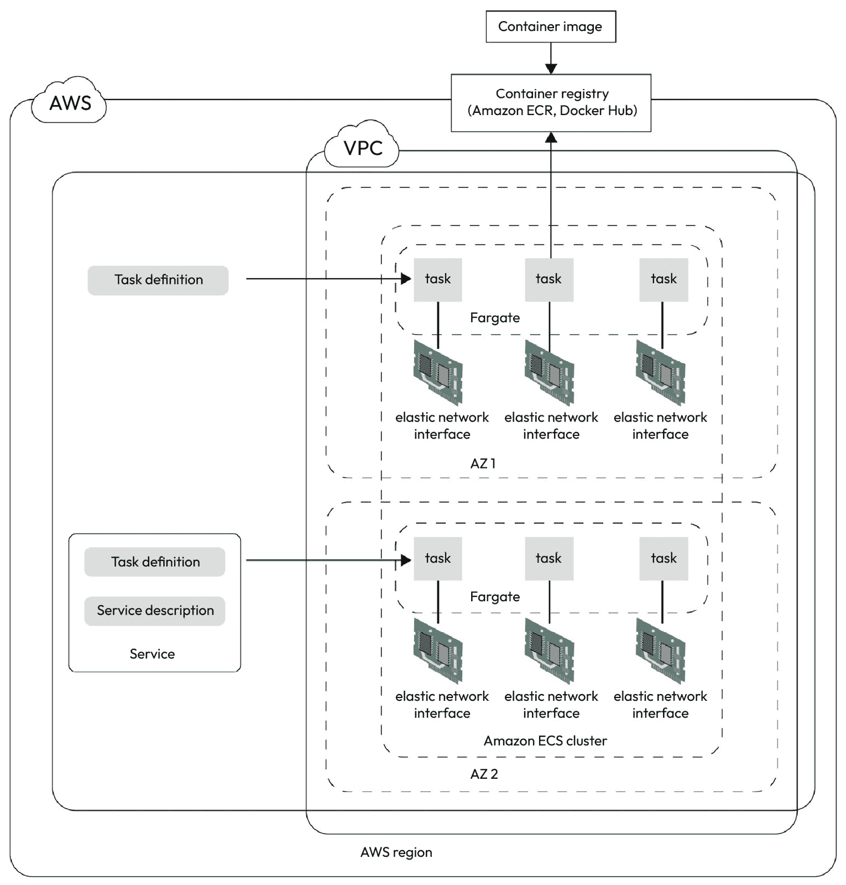
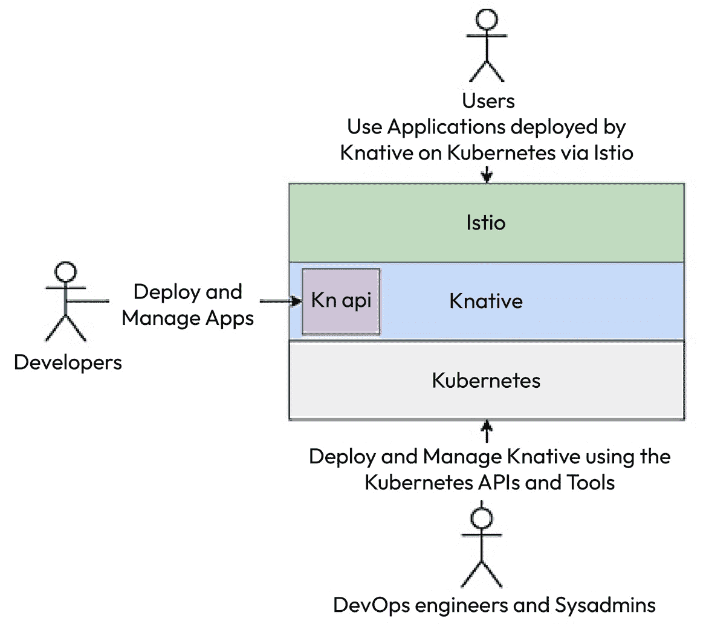
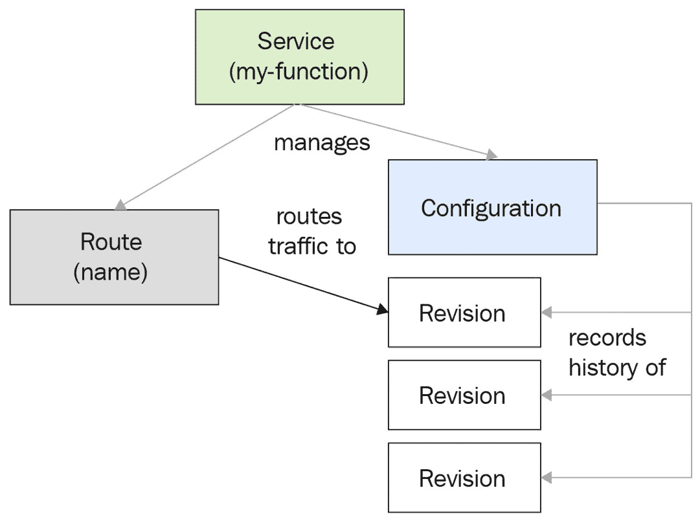

# 第七章：容器即服务（CaaS）和容器的无服务器计算

在前两章中，我们介绍了 Kubernetes 及其如何帮助无缝管理容器。现在，让我们看看自动化和管理容器部署的其他方式——**容器即服务**（**CaaS**）和**容器的无服务器计算**。CaaS 提供基于容器的虚拟化，抽象了所有管理工作，帮助你管理容器而无需担心底层的基础设施和编排。

对于简单的部署和较少复杂的应用，CaaS 可以成为救世主。无服务器计算是一个广泛的术语，涵盖了无需我们担心背后基础设施的应用。它的一个额外好处是你可以完全专注于应用本身。我们将详细讨论 CaaS 技术，如**Amazon Elastic Container Service**（**Amazon ECS**）与**Amazon Web Services Fargate**（**AWS Fargate**），并简要讨论其他基于云的 CaaS 服务，如**Azure Kubernetes Services**（**AKS**）、**Google Kubernetes Engine**（**GKE**）和**Google Cloud Run**。然后，我们将深入探讨流行的开源无服务器 CaaS 解决方案——**Knative**。

本章我们将涵盖以下主要内容：

+   无服务器服务的需求

+   Amazon ECS 与**弹性计算云**（**EC2**）和 Fargate

+   其他 CaaS 服务

+   使用 Knative 的开源 CaaS

# 技术要求

本章的练习需要一个有效的 AWS 订阅。AWS 是市场上最受欢迎、功能最丰富的云平台。目前，AWS 为一些产品提供免费套餐。你可以在[`aws.amazon.com/free`](https://aws.amazon.com/free)注册。尽管本章使用了一些付费服务，但我们会尽量减少在练习中使用的付费服务。

你还需要克隆以下 GitHub 仓库进行一些练习：

[`github.com/PacktPublishing/Modern-DevOps-Practices-2e`](https://github.com/PacktPublishing/Modern-DevOps-Practices-2e%0D)

运行以下命令将仓库克隆到你的主目录。然后，`cd`到`ch7`目录以访问所需的资源：

```
$ git clone https://github.com/PacktPublishing/Modern-DevOps-Practices-2e.git \
  modern-devops
$ cd modern-devops/ch7
```

由于仓库中包含带有占位符字符串的文件，你必须将`<your_dockerhub_user>`字符串替换为实际的 Docker Hub 用户。使用以下命令替换占位符：

```
$ find ./ -type f -exec sed -i -e \
's/<your_dockerhub_user>/<your actual docker hub user>/g' {} \; 
```

那么，让我们开始吧！

# 无服务器服务的需求

到目前为止，许多组织一直在集中精力进行基础设施的提供和管理。他们优化围绕他们构建的应用程序的资源、机器和基础设施的数量。然而，他们应该集中精力做他们最擅长的事情——软件开发。除非你的组织打算投入大量资金组建一个昂贵的基础设施团队来做大量繁重的后台工作，否则你最好将精力集中在编写和构建高质量的应用程序上，而不是关注如何以及在哪里运行和优化它们。

无服务器服务为这个问题提供了缓解。你不再需要集中精力关注如何托管基础设施来运行应用程序，而是可以声明你想要运行的内容，无服务器服务会为你管理它。这对于那些没有预算投入大量资金进行基础设施建设的小型企业来说，已经成为一项福音，他们可以快速启动，而无需浪费太多时间搭建和维护基础设施来运行应用程序。

无服务器服务还提供容器和应用程序工作负载的自动部署和扩展。你可以在几分钟甚至几秒钟内从 0 扩展到 100 个实例。最棒的是，在某些服务中，你只需为实际使用的部分付费，而不是为分配的部分付费。

本章将重点介绍一个非常受欢迎的 AWS 容器管理服务——**ECS**以及 AWS 的容器无服务器服务——**AWS Fargate**。然后，我们将简要地考察其他云平台的相关服务，最后介绍一种开源的基于容器的无服务器解决方案——**Knative**。

现在，让我们继续了解 Amazon ECS。

# Amazon ECS 与 EC2 和 Fargate

Amazon ECS 是 AWS 提供的一个容器编排平台。它易于使用和管理，在后台使用 Docker，并且可以将工作负载部署到**Amazon EC2**，这是基于**虚拟机**（**VM**）的解决方案，或者**AWS Fargate**，一种无服务器服务。

这是一个高度可扩展的解决方案，可以在几秒钟内部署容器。它使得托管、运行、停止和启动容器变得非常容易。正如 Kubernetes 提供**pods**一样，ECS 提供**任务**，帮助你运行容器工作负载。一个任务可以包含一个或多个根据逻辑关系分组的容器。你还可以将一个或多个任务分组为**服务**。服务类似于 Kubernetes 控制器，管理任务并确保所需数量的任务副本在正确的时间、正确的地方运行。ECS 使用简单的 API 调用提供许多功能，例如创建、更新、读取和删除任务和服务。

ECS 还允许你根据多个放置策略来放置容器，同时考虑**高可用性**（**HA**）和资源优化。你可以根据优先级（成本、可用性或两者的结合）调整放置算法。因此，你可以使用 ECS 运行一次性的批处理工作负载或长期运行的微服务，所有操作都可以通过简单易用的 API 接口完成。

## ECS 架构

在我们深入了解 ECS 架构之前，了解一些常见的 AWS 术语是很重要的。我们先来看看一些 AWS 资源：

+   `us-east-1`、`us-west-1`、`ap-southeast-1`、`eu-central-1`等。

+   `us-east-1a`、`us-east-1b`等。

+   **AWS 虚拟私有云（VPC）**：AWS VPC 是你在 AWS 内创建的一个隔离的网络资源。你将一个专用的私有 IP 地址范围关联到它，从中你的其他资源（如 EC2 实例）可以获取其 IP 地址。AWS VPC 跨越一个 AWS 区域。

+   **子网**：子网顾名思义是在 VPC 内的一个子网络。你必须将提供给 VPC 的 IP 地址范围细分并与子网关联。资源通常位于子网内，每个子网跨越一个可用区（AZ）。

+   **路由表**：AWS 路由表在 VPC 子网内以及与互联网之间路由流量。每个 AWS 子网通过**子网路由表关联**与路由表相关联。

+   **互联网网关**：互联网网关允许 AWS 子网与互联网之间的连接。

+   **身份与访问管理（IAM）**：AWS IAM 帮助你控制用户和其他 AWS 资源对资源的访问。它们帮助你实现**基于角色的访问控制**（**RBAC**）以及**最小权限原则**（**PoLP**）。

+   **Amazon EC2**：EC2 允许你在子网内启动虚拟机，也称为实例。

+   **AWS 自动扩展组（ASGs）**：AWS ASG 与 Amazon EC2 一起工作，为你的实例提供高可用性（HA）和可扩展性。它监控你的 EC2 实例，并确保始终有一定数量的健康实例在运行。它还会根据机器负载的增加自动扩展实例，以应对更多的流量。它使用**实例配置文件**和**启动配置**来决定新 EC2 实例的属性。

+   **Amazon CloudWatch**：Amazon CloudWatch 是一项监控和可观察性服务。它允许你收集、跟踪和监控指标、日志文件，并设置警报以在特定条件下采取自动化操作。CloudWatch 有助于理解应用程序的性能、健康状况和资源利用情况。

ECS 是一个基于云的区域服务。当你启动一个 ECS 集群时，实例会跨越多个可用区（AZ），在这些可用区中，你可以使用简单的清单调度任务和服务。ECS 清单非常类似于`docker-compose` YAML 清单，我们可以在其中指定要运行的任务以及构成服务的任务。

您可以在现有的 VPC 中运行 ECS。我们可以在 Amazon EC2 或 AWS Fargate 中调度任务。

您的 ECS 集群可以附加一个或多个 EC2 实例。您还可以选择通过在 EC2 实例中安装 ECS 节点代理将现有 EC2 实例附加到集群。该代理会将容器的状态和任务信息发送到 ECS 调度器。然后，它与容器运行时交互，以便在节点内调度容器。它们类似于 Kubernetes 生态系统中的`kubelet`。如果您在 EC2 实例中运行容器，您需要为分配给集群的 EC2 实例数量付费。

如果您打算使用 Fargate，基础设施将完全抽象化，您必须指定容器将消耗的 CPU 和内存数量。您支付的是容器实际消耗的 CPU 和内存，而不是您分配给机器的资源。

提示

尽管在 Fargate 中您只为实际消耗的资源付费，但它比在 EC2 上运行任务更昂贵，尤其是对于长时间运行的服务，如 Web 服务器。一个经验法则是将长时间运行的在线任务放在 EC2 中运行，而将批处理任务放在 Fargate 中运行。这样可以实现最佳的成本优化。

当我们调度一个任务时，AWS 会通过从**容器注册表**拉取所需的容器镜像，在托管的 EC2 或 Fargate 服务器上启动容器。每个**任务**都有一个附加的**弹性网络接口**（**ENI**）。多个任务会被组合成一个**服务**，该服务确保所有必需的任务同时运行。

Amazon ECS 使用**任务调度器**来调度集群上的容器。根据放置逻辑、可用性和成本要求，它会将容器放置在集群的适当节点上。调度器还确保在给定时间节点上运行所需数量的任务。

下图清晰地解释了 ECS 集群架构：



图 7.1 – ECS 架构

Amazon 提供了 ECS 的**命令行界面**（**CLI**）用于与 ECS 集群交互。它是一个简单的命令行工具，您可以用来管理 ECS 集群、创建和管理集群上的任务和服务。

现在，让我们继续安装 ECS CLI。

## 安装 AWS 和 ECS CLI

AWS CLI 作为`deb`包提供，包含在公共的`apt`仓库中。要安装它，请运行以下命令：

```
$ sudo apt update && sudo apt install awscli -y
$ aws --version
aws-cli/1.22.34 Python/3.10.6 Linux/5.19.0-1028-aws botocore/1.23.34
```

在 Linux 环境中安装 ECS CLI 非常简单。我们只需下载二进制文件并使用以下命令将其移至系统路径：

```
$ sudo curl -Lo /usr/local/bin/ecs-cli \
https://amazon-ecs-cli.s3.amazonaws.com/ecs-cli-linux-amd64-latest
$ sudo chmod +x /usr/local/bin/ecs-cli
```

运行以下命令来检查`ecs-cli`是否已正确安装：

```
$ ecs-cli --version
ecs-cli version 1.21.0 (bb0b8f0)
```

如我们所见，`ecs-cli`已成功安装在我们的系统上。

下一步是允许`ecs-cli`与您的 AWS API 连接。为此，您需要导出 AWS CLI 环境变量。运行以下命令进行操作：

```
$ export AWS_SECRET_ACCESS_KEY=...
$ export AWS_ACCESS_KEY_ID=...
$ export AWS_DEFAULT_REGION=...
```

一旦我们设置了环境变量，`ecs-cli` 将使用它们来进行 AWS API 的身份验证。在下一部分中，我们将使用 ECS CLI 启动一个 ECS 集群。

## 启动 ECS 集群

我们可以使用 ECS CLI 命令来启动 ECS 集群。你可以在 EC2 和 Fargate 上运行你的容器，因此首先我们将创建一个运行 EC2 实例的集群。然后，我们将在集群中添加 Fargate 任务。

要连接到你的 EC2 实例，你需要在 AWS 中生成一个密钥对。为此，请运行以下命令：

```
$ aws ec2 create-key-pair --key-name ecs-keypair
```

此命令的输出将提供密钥对的 JSON 文件。提取 JSON 文件的密钥材料，并将其保存在一个名为 `ecs-keypair.pem` 的单独文件中。记得在保存文件时将 `\n` 字符替换为换行符。

一旦我们生成了密钥对，我们可以使用以下命令通过 ECS CLI 创建一个 ECS 集群：

```
$ ecs-cli up --keypair ecs-keypair --instance-type t2.micro \
--size 2 --cluster cluster-1 --capability-iam
INFO[0002] Using recommended Amazon Linux 2 AMI with ECS Agent 1.72.0 and Docker version 
20.10.23
INFO[0003] Created cluster cluster=cluster-1 region=us-east-1
INFO[0004] Waiting for your cluster resources to be created...
INFO[0130] Cloudformation stack status stackStatus=CREATE_IN_PROGRESS
VPC created: vpc-0448321d209bf75e2
Security Group created: sg-0e30839477f1c9881
Subnet created: subnet-02200afa6716866fa
Subnet created: subnet-099582f6b0d04e419
Cluster creation succeeded.
```

当我们执行此命令时，AWS 会在后台使用 CloudFormation 启动一堆资源。CloudFormation 是 AWS 的**基础设施即代码**（**IaC**）解决方案，它通过可重用的模板帮助你在 AWS 上部署基础设施。CloudFormation 模板包含多个资源，例如 VPC、安全组、VPC 内的子网、路由表、路由、子网路由表关联、互联网网关、IAM 角色、实例配置文件、启动配置、ASG、VPC 网关附件以及集群本身。ASG 包含两个正在运行并为集群提供服务的 EC2 实例。请保留输出的副本；稍后的练习中我们需要使用这些细节。

现在我们的集群已经启动，我们将启动我们的第一个任务。

## 创建任务定义

ECS 任务类似于 Kubernetes pod。它们是 ECS 的基本构建块，由一个或多个相关的容器组成。任务定义是 ECS 任务的蓝图，定义了 ECS 任务的外观。它们与 `docker-compose` 文件非常相似，且采用 YAML 格式编写。ECS 还使用所有版本的 `docker-compose` 允许我们定义任务。它们帮助你定义容器及其镜像、资源需求、运行位置（EC2 或 Fargate）、卷和端口映射以及其他网络需求。

提示

使用 `docker-compose` 清单来启动任务和服务是一个好主意，因为它将帮助你将配置与开放标准对齐。

任务是一个有限的过程，仅运行一次。即使它是一个长时间运行的过程，例如 Web 服务器，任务仍然只运行一次，等待长时间运行的进程结束（理论上会一直运行）。任务的生命周期遵循**Pending**（待处理） -> **Running**（运行中） -> **Stopped**（已停止）状态。因此，当你调度任务时，任务进入**Pending**状态，尝试从容器注册表中拉取镜像。然后，它尝试启动容器。一旦容器启动，它就进入**Running**状态。当容器执行完成或出错时，它将进入**Stopped**状态。一个启动错误的容器会直接从**Pending**状态转到**Stopped**状态。

现在，让我们继续在刚刚创建的 ECS 集群中部署一个`nginx` Web 服务器任务。

要访问本节的资源，`cd`到以下目录：

```
$ cd ~/modern-devops/ch7/ECS/tasks/EC2/
```

我们将在这里使用`docker-compose`任务定义。所以，让我们从定义以下`docker-compose.yml`文件开始：

```
version: '3'
services:
  web:
    image: nginx
    ports:
      - "80:80"
    logging:
      driver: awslogs
      options:
        awslogs-group: /aws/webserver
        awslogs-region: us-east-1
        awslogs-stream-prefix: ecs
```

YAML 文件定义了一个`web`容器，使用`nginx`镜像，主机端口`80`映射到容器端口`80`。它使用`awslogs`日志驱动程序，将日志流式传输到 Amazon CloudWatch。它会将日志流传输到`us-east-1`区域中的`/aws/webserver`日志组，并使用`ecs`流前缀。

任务定义还包括资源定义——也就是说，我们希望为任务保留的资源量。因此，我们将需要定义以下的`ecs-params.yaml`文件：

```
version: 1
task_definition:
  services:
    web:
      cpu_shares: 100
      mem_limit: 524288000
```

这个 YAML 文件定义了容器的`cpu_shares`（以毫核为单位）和`mem_limit`（以字节为单位）。现在，我们来看看如何将此任务调度为 EC2 任务。

## 在 ECS 上调度 EC2 任务

让我们使用`ecs-cli`应用配置并使用以下命令调度任务：

```
$ ecs-cli compose up --create-log-groups --cluster cluster-1 --launch-type EC2
```

现在任务已经调度并且容器正在运行，让我们列出所有任务以获取容器的详细信息，并查找它运行的位置。为此，运行以下命令：

```
$ ecs-cli ps --cluster cluster-1
Name                    State    Ports                TaskDefinition
cluster-1/fee1cf28/web  RUNNING  34.237.218.7:80->80  EC2:1
```

如我们所见，Web 容器正在`34.237.218.7:80`的`cluster-1`上运行。现在，使用以下命令来 curl 此端点，看看我们能得到什么：

```
$ curl 34.237.218.7:80
<html>
<head>
<title>Welcome to nginx!</title>
...
</html>
```

这里，我们看到了默认的`nginx`首页！我们已经成功地在 ECS 上使用 EC2 启动类型调度了一个容器。你可能想要复制这个任务来处理更多的流量。这被称为水平扩展。我们将在下一部分看到如何实现。

## 扩展任务

我们可以使用`ecs-cli`轻松地扩展任务。使用以下命令将任务扩展到`2`：

```
$ ecs-cli compose scale 2 --cluster cluster-1 --launch-type EC2
```

现在，使用以下命令检查集群中是否有两个容器在运行：

```
$ ecs-cli ps --cluster cluster-1
Name                    State    Ports                 TaskDefinition
cluster-1/b43bdec7/web  RUNNING  54.90.208.183:80->80  EC2:1
cluster-1/fee1cf28/web  RUNNING  34.237.218.7:80->80   EC2:1
```

如我们所见，集群上正在运行两个容器。现在，让我们查询 CloudWatch 以获取容器的日志。

## 从 CloudWatch 查询容器日志

要从 CloudWatch 查询日志，我们必须使用以下命令列出日志流：

```
$ aws logs describe-log-streams --log-group-name /aws/webserver \
--log-stream-name-prefix ecs | grep logStreamName
  "logStreamName": "ecs/web/b43bdec7",
  "logStreamName": "ecs/web/fee1cf28",
```

如我们所见，这里有两个日志流——每个任务一个。`logStreamName` 遵循 `<log_stream_prefix>/<task_name>/<task_id>` 的约定。因此，要获取 `ecs/b43bdec7/web` 的日志，请运行以下命令：

```
$ aws logs get-log-events --log-group-name/aws/webserver \
--log-stream ecs/web/b43bdec7
```

在此，您将在响应中看到以 JSON 格式显示的日志流。现在，让我们来看一下如何停止正在运行的任务。

## 停止任务

`ecs-cli` 使用友好的 `docker-compose` 语法进行所有操作。使用以下命令停止集群中的任务：

```
$ ecs-cli compose down --cluster cluster-1
```

让我们列出容器，查看任务是否已停止，使用以下命令：

```
$ ecs-cli ps --cluster cluster-1
INFO[0001] Stopping container... container=cluster-1/b43bdec7/web
INFO[0001] Stopping container... container=cluster-1/fee1cf28/web 
INFO[0008] Stopped container... container=cluster-1/b43bdec7/web 
desiredStatus=STOPPED lastStatus=STOPPED taskDefinition="EC2:1" 
INFO[0008] Stopped container... container=cluster-1/fee1cf28/web 
desiredStatus=STOPPED lastStatus=STOPPED taskDefinition="EC2:1"
```

如我们所见，两个容器都已停止。

在 EC2 上运行任务并不是一种无服务器的方式。您仍然需要配置和管理 EC2 实例，尽管 ECS 管理集群上的工作负载，但您仍然需要为已配置的 EC2 实例的资源支付费用。AWS 提供了 Fargate 作为一种无服务器解决方案，按资源消耗付费。让我们看看如何将相同的任务创建为 Fargate 任务。

## 在 ECS 上调度 Fargate 任务

在 Fargate 上调度任务与 EC2 非常相似。在这里，我们需要将`launch-type`值指定为`FARGATE`。

要在 Fargate 上调度相同的任务，请运行以下命令：

```
$ ecs-cli compose up --create-log-groups --cluster cluster-1 --launch-type FARGATE
FATA[0001] ClientException: Fargate only supports network mode 'awsvpc'.
```

哎呀！我们遇到问题了！它抱怨网络类型。对于 Fargate 任务，我们必须提供网络类型`awsvpc`，而不是默认的桥接网络。`awsvpc`网络是一种覆盖网络，实施了`awsvpc`网络类型。但在此之前，Fargate 任务需要一些配置。

要访问本节的资源，请`cd`进入以下目录：

```
$ cd ~/modern-devops/ch7/ECS/tasks/FARGATE/
```

首先，我们必须假设一个任务执行角色，以便 ECS 代理能够进行 AWS API 认证并与 Fargate 交互。

为此，请创建以下`task-execution-assume-role.json`文件：

```
{
  "Version": "2012-10-17",
  "Statement": [
    {
      "Sid": "",
      "Effect": "Allow",
      "Principal": {
        "Service": "ecs-tasks.amazonaws.com"
      },
      "Action": "sts:AssumeRole"
    }
  ]
}
```

然后，使用以下命令来假设任务执行角色：

```
$ aws iam --region us-east-1 create-role --role-name ecsTaskExecutionRole \
 --assume-role-policy-document file://task-execution-assume-role.json 
```

ECS 提供了一个默认的角色策略，名为`AmazonECSTaskExecutionRolePolicy`，其中包含多种权限，帮助您与 CloudWatch 和**Elastic Container Registry**（**ECR**）进行交互。以下 JSON 代码概述了该策略的权限：

```
{
    "Version": "2012-10-17",
    "Statement": [
        {
            "Effect": "Allow",
            "Action": [
                "ecr:GetAuthorizationToken",
                "ecr:BatchCheckLayerAvailability",
                "ecr:GetDownloadUrlForLayer",
                "ecr:BatchGetImage",
                "logs:CreateLogStream",
                "logs:PutLogEvents"
            ],
            "Resource": "*"
        }
    ]
}
```

我们需要通过以下命令将该角色策略分配给我们之前假设的`ecsTaskExecution`角色：

```
$ aws iam attach-role-policy \
--policy-arn arn:aws:iam::aws:policy/service-role/AmazonECSTaskExecutionRolePolicy \
--role-name ecsTaskExecutionRole
```

一旦我们将策略分配给`ecsTaskExecution`角色，我们需要在创建 ECS 集群时获取两个子网和安全组的 ID。您可以在创建集群时的命令行输出中找到这些详细信息。我们将在以下的`ecs-params.yml`文件中使用这些详细信息：

```
version: 1
task_definition:
  task_execution_role: ecsTaskExecutionRole
  ecs_network_mode: awsvpc
  task_size:
    mem_limit: 0.5GB
    cpu_limit: 256
run_params:
  network_configuration:
    awsvpc_configuration:
      subnets:
        - "subnet-088b52c91a6f40fd7"
        - "subnet-032cd63290da67271"
      security_groups:
        - "sg-097206175813aa7e7"
      assign_public_ip: ENABLED
```

`ecs-params.yml` 文件包括我们创建的 `task_execution_role` 和设置为 `awsvpc` 的 `ecs_network_mode`，因为 Fargate 要求如此。我们已将 `task_size` 定义为拥有 `0.5GB` 的内存和 `256` 毫核 CPU。由于 Fargate 是一种无服务器解决方案，我们只需为所消耗的 CPU 核心和内存付费。`run_params` 部分包括 `network_configuration`，其中包含 `awsvpc_configuration`。在这里，我们指定了在创建 ECS 集群时创建的两个子网。我们还必须指定与 ECS 集群一起创建的 `security_groups`。

注意

使用你 ECS 集群的子网和安全组，而不是复制本示例中的内容。

现在我们已经准备好在 Fargate 上启动任务，让我们运行以下命令：

```
$ ecs-cli compose up --create-log-groups --cluster cluster-1 --launch-type FARGATE
```

现在，让我们通过以下命令检查任务是否成功运行：

```
$ ecs-cli ps --cluster cluster-1
Name                    State    Ports           TaskDefinition
cluster-1/8717a149/web  RUNNING  3.80.173.230:80 FARGATE:1
```

如我们所见，任务正在 `3.80.173.230:80` 上运行，作为 Fargate 任务。让我们使用以下命令 `curl` 这个 URL，看看是否能收到响应：

```
$ curl 3.80.173.230:80
<html>
<head>
<title>Welcome to nginx!</title>
...
</body>
</html>
```

如我们所见，我们得到了默认的 `nginx` 首页。

现在，让我们继续使用以下命令删除我们创建的任务：

```
$ ecs-cli compose down --cluster cluster-1
```

如我们所知，任务有一个固定的生命周期，一旦停止，它就会停止。你无法再次启动相同的任务。因此，我们必须创建一个**服务**来确保始终有一定数量的任务在运行。我们将在下一节中创建一个服务。

## 在 ECS 上调度服务

`ecs-cli` 命令行。

提示

对于长期运行的应用程序（如 Web 服务器），始终使用服务。对于批处理任务，始终使用任务，因为我们不希望在任务结束后重新创建任务。

要将 `nginx` Web 服务器作为服务运行，我们可以使用以下命令：

```
$ ecs-cli compose service up --create-log-groups \
 --cluster cluster-1 --launch-type FARGATE
INFO[0001] Using ECS task definition TaskDefinition="FARGATE:1"
INFO[0002] Auto-enabling ECS Managed Tags
INFO[0013] (service FARGATE) has started 1 tasks: (task 9b48084d).  timestamp="2023-07-03 
11:24:42 +0000 UTC"
INFO[0029] Service status desiredCount=1 runningCount=1 serviceName=FARGATE
INFO[0029] (service FARGATE) has reached a steady state.  timestamp="2023-07-03 11:25:00 
+0000 UTC"
INFO[0029] (service FARGATE) (deployment ecs-svc/94284856) deployment 
completed.  timestamp="2023-07-03 11:25:00 UTC"
INFO[0029] ECS Service has reached a stable state desiredCount=1 runningCount=1 
serviceName=FARGATE
INFO[0029] Created an ECS service service=FARGATE taskDefinition="FARGATE:1"
```

从日志中我们可以看到，服务正在尝试确保任务的期望数量与任务的运行数量相匹配。如果你的任务被删除，ECS 会用一个新的任务替换它。

让我们列出任务，看看通过以下命令能得到什么：

```
$ ecs-cli ps --cluster cluster-1
Name                    State   Ports             TaskDefinition
cluster-1/9b48084d/web  RUNNING 18.234.123.71:80  FARGATE:1
```

如我们所见，服务已创建一个新任务，并在 `18.234.123.71:80` 上运行。让我们尝试通过以下命令访问该 URL：

```
$ curl 18.234.123.71
<!DOCTYPE html>
<html>
<head>
<title>Welcome to nginx!</title>
...
</html>
```

我们在响应中得到默认的 `nginx` 首页。现在，让我们尝试浏览任务的日志。

## 使用 ECS CLI 浏览容器日志

除了使用 Amazon CloudWatch 外，你还可以使用便捷的 ECS CLI 来做到这一点，无论你的日志存储在哪里。这帮助我们从单一视图看到所有内容。

运行以下命令来执行此操作：

```
$ ecs-cli logs --task-id 9b48084d --cluster cluster-1
/docker-entrypoint.sh: /docker-entrypoint.d/ is not empty, will attempt to perform 
configuration
/docker-entrypoint.sh: Launching /docker-entrypoint.d/10-listen-on-ipv6-by-default.sh
10-listen-on-ipv6-by-default.sh: info: Enabled listen on IPv6 in /etc/nginx/conf.d/
default.conf
/docker-entrypoint.sh: Launching /docker-entrypoint.d/20-envsubst-on-templates.sh
/docker-entrypoint.sh: Launching /docker-entrypoint.d/30-tune-worker-processes.sh
/docker-entrypoint.sh: Configuration complete; ready for start up
2023/07/03 11:24:57 [notice] 1#1: nginx/1.25.1
2023/07/03 11:24:57 [notice] 1#1: built by gcc 12.2.0 (Debian 12.2.0-14)
2023/07/03 11:24:57 [notice] 1#1: OS: Linux 5.10.184-175.731.amzn2.x86_64
2023/07/03 11:24:57 [notice] 1#1: getrlimit(RLIMIT_NOFILE): 65535:65535
2023/07/03 11:24:57 [notice] 1#1: start worker processes
2023/07/03 11:24:57 [notice] 1#1: start worker process 29
2023/07/03 11:24:57 [notice] 1#1: start worker process 30
13.232.8.130 - - [03/Jul/2023:11:30:38 +0000] "GET / HTTP/1.1" 200 615 "-" "curl/7.81.0" 
"-"
```

如我们所见，我们可以浏览该服务正在运行的特定任务的日志。现在，让我们继续删除该服务。

## 删除 ECS 服务

要删除服务，运行以下命令：

```
$ ecs-cli compose service down --cluster cluster-1
INFO[0001] Deleted ECS service service=FARGATE
INFO[0001] Service status desiredCount=0 runningCount=1 serviceName=FARGATE
INFO[0006] Service status desiredCount=0 runningCount=0 serviceName=FARGATE
INFO[0006] (service FARGATE) has stopped 1 running tasks: (task 
9b48084d11cf49be85141fd9bfe9e1c3).  timestamp="2023-07-03 11:34:10 +0000 UTC"
INFO[0006] ECS Service has reached a stable state desiredCount=0 runningCount=0 
serviceName=FARGATE
```

如我们所见，服务已被删除。

请注意，即使我们创建了多个任务实例，它们会运行在不同的 IP 地址上并且可以单独访问。然而，任务需要负载均衡，我们需要提供一个单一的端点。让我们来看一个可以用来管理这个问题的解决方案。

## 在 ECS 上运行负载均衡容器

**负载均衡**是多实例应用程序的重要功能。它们帮助我们在单一端点上提供应用服务。因此，你可以同时运行多个实例，而最终用户不需要关心他们访问的是哪个实例。AWS 提供了两种主要的负载均衡解决方案——**第四层**的**网络负载均衡器**（**NLB**）和**第七层**的**应用负载均衡器**（**ALB**）。

提示

虽然两种负载均衡器各有其使用场景，但第七层负载均衡器对于基于 HTTP 的应用程序具有显著优势。它提供了先进的流量管理功能，例如基于路径和主机的路由。

现在，让我们使用以下命令创建一个 ALB，将其用作我们任务的前端：

```
$ aws elbv2 create-load-balancer --name ecs-alb --subnets <SUBNET-1> <SUBNET-2> \
--security-groups <SECURITY_GROUP_ID> --region us-east-1
```

上述命令的输出包含了`LoadBalancerARN`和`DNSName`的值。我们将在后续步骤中使用它们，所以请保存输出的副本。

下一步是创建一个**目标组**。目标组定义了任务的组和它们将监听的端口，负载均衡器将把流量转发到该组。使用以下命令定义目标组：

```
$ aws elbv2 create-target-group --name target-group --protocol HTTP \
 --port 80 --target-type ip --vpc-id <VPC_ID> --region us-east-1
```

你将在响应中获得`targetGroupARN`值。请妥善保管，因为我们将在下一步中需要它。

接下来，我们需要在负载均衡器上运行一个**监听器**。它应该将流量从负载均衡器转发到目标组。使用以下命令来实现：

```
$ aws elbv2 create-listener  --load-balancer-arn <LOAD_BALANCER_ARN> \
 --protocol HTTP --port 80 \
 --default-actions Type=forward,TargetGroupArn=<TARGET_GROUP_ARN> \
 --region us-east-1 
```

你将在响应中获得`listenerARN`值。请妥善保管，因为我们将在下一步中需要它。

现在我们已经定义了负载均衡器，我们需要运行`ecs-cli compose service up`来部署我们的服务。我们还将提供目标组作为参数，以将我们的服务与负载均衡器关联。

要访问本节的资源，请`cd`到以下目录：

```
$ cd ~/modern-devops/ch7/ECS/loadbalancing/
```

运行以下命令：

```
$ ecs-cli compose service up --create-log-groups --cluster cluster-1 \
--launch-type FARGATE --target-group-arn <TARGET_GROUP_ARN> \
--container-name web --container-port 80
```

既然服务和任务已经在 Fargate 上运行，我们可以将服务扩展到三个所需任务。为此，请运行以下命令：

```
$ ecs-cli compose service scale 3 --cluster cluster-1
```

由于我们的服务已经扩展到三个任务，现在让我们访问在第一步中获取的负载均衡器 DNS 端点。这应该会为我们提供默认的`nginx`响应。运行以下命令：

```
$ curl ecs-alb-1660189891.us-east-1.elb.amazonaws.com
<html>
<head>
<title>Welcome to nginx!</title>
…
</html>
```

如我们所见，我们从负载均衡器获得了默认的`nginx`响应。这表明负载均衡工作正常！

ECS 提供了许多其他功能，如水平自动扩展、可自定义的任务调度算法等，但这些超出了本书的范围。请阅读 ECS 文档，了解该工具的其他方面。现在，让我们看看市场上其他流行的 CaaS 产品。

# 其他 CaaS 服务

Amazon ECS 提供了一种灵活的方式来管理你的容器工作负载。当你拥有一个较小、较简单的架构时，它非常适用，并且你不想增加使用像 Kubernetes 这样复杂的容器编排引擎的额外开销。

提示

如果你完全依赖于 AWS 并且没有未来的多云或混合云战略，ECS 是一个优秀的工具选择。Fargate 使得部署和运行容器变得更容易，无需担心背后的基础设施。

ECS 与 AWS 及其架构紧密耦合。为了解决这个问题，我们可以使用 AWS 内的托管服务，如**弹性 Kubernetes 服务**（**EKS**）。它提供了 Kubernetes API 来调度工作负载。这使得管理容器更加灵活，因为你可以轻松地启动 Kubernetes 集群，并使用一个标准的开源解决方案，在任何地方安装和运行。这不会将你绑定到特定的供应商。然而，EKS 比 ECS 略贵，并且增加了每小时*0.10 美元*的集群管理费用。但与它带来的好处相比，这点费用算不了什么。

如果你不是在 AWS 上运行，也有其他提供商的选择。下一个大三云服务提供商是 Azure，它提供了**Azure Kubernetes 服务（AKS）**，这是一种托管的 Kubernetes 解决方案，可以帮助你在几分钟内开始使用。AKS 提供了一种完全托管的解决方案，支持按需事件驱动的弹性工作节点供应。它还与**Azure DevOps**良好集成，为你提供更快的**端到端**（**E2E**）开发体验。与 AWS 一样，Azure 也收取每小时*0.10 美元*的集群管理费用。

**Google Kubernetes Engine（GKE）**是最强大的 Kubernetes 平台之一。由于 Kubernetes 项目来自 Google，并且它是该项目在开源社区中的最大贡献者，GKE 通常会更快推出新版本，并且是第一个发布安全补丁的解决方案。此外，它是最具功能性的 Kubernetes 平台之一，提供了可自定义的解决方案，并提供了多个插件作为集群配置。因此，你可以选择在启动时安装哪些内容，并进一步加固集群。然而，所有这些都需要付出代价，因为 GKE 与 AWS 和 Azure 一样，收取每小时*0.10 美元*的集群管理费用。

如果你的架构不复杂，并且只需要管理少量容器，你可以使用 **Google Cloud Run**，而不必使用 Kubernetes。Google Cloud Run 是基于开源 **Knative** 项目构建的无服务器 CaaS 解决方案，帮助你运行容器而不受供应商锁定的限制。由于它是无服务器的，你只需为使用的容器数量及其资源利用付费。它是一个完全可扩展、与 Google Cloud 的 DevOps 和监控解决方案（如 **Cloud Code**、**Cloud Build**、**Cloud Monitoring** 和 **Cloud Logging**）良好集成的解决方案。最棒的是，它可以与 AWS Fargate 相媲美，并将所有基础设施工作抽象化。因此，它是一个最小运维或无运维的解决方案。

既然我们提到了 Knative 作为开源 CaaS 解决方案，接下来我们将更详细地讨论它。

# 基于 Knative 的开源 CaaS

正如我们所见，市场上已有多种供应商特定的 CaaS 服务。然而，大多数服务的问题在于它们绑定于单一的云服务提供商。我们的容器部署规范因此会变得供应商特定，最终导致供应商锁定。作为现代的 DevOps 工程师，我们必须确保所提议的解决方案最适合架构需求，而避免供应商锁定是最重要的要求之一。

然而，Kubernetes 本身并不是无服务器的。你必须定义基础设施，并且长期运行的服务在特定时间应该至少有一个实例运行。这使得管理微服务应用变得繁琐且资源密集。

等等！我们说过微服务有助于优化基础设施的使用。没错——这是正确的，但它们是在容器空间内实现这一点的。试想一下，你有一个共享的虚拟机集群，应用的不同部分会随流量进行扩展，而每个部分的应用会有不同的高峰和低谷。通过这种简单的多租户方式，可以节省大量基础设施资源。

然而，这也意味着每次都必须运行每个微服务的至少一个实例——即使没有任何流量！嗯，这并不是我们所期望的最佳利用方式。那怎样做才更好呢？如何在第一次请求时创建实例，而在没有流量时不创建实例呢？这样可以节省大量资源，特别是在空闲时。你可以拥有成百上千个微服务组成应用，而在空闲期间，这些微服务是没有实例的。如果将其与管理的 Kubernetes 服务结合，并通过流量自动扩展虚拟机实例，你就可以在空闲期间保持最少的实例。

在开源和云原生领域，曾有人尝试开发一种开源、供应商无关、无服务器框架用于容器。我们有 Knative，它是 **云原生计算基金会** (**CNCF**) 采用的解决方案。

提示

Cloud Run 服务在后台使用 Knative。所以，如果你使用 Google Cloud，你可以使用 Cloud Run 来使用完全托管的无服务器服务。

要了解 Knative 是如何工作的，我们先来看看 Knative 的架构。

## Knative 架构

Knative 项目结合了现有 CNCF 项目的元素，如 Kubernetes 和 `kubectl` 命令行。Knative 为开发者提供了其 API，开发者可以通过 `kn` 命令行工具使用它。用户通过 Istio 访问这些 API，而 Istio 的流量管理功能是 Knative 的一个关键组件。以下图表描述了这一过程：



图 7.2 – Knative 架构

Knative 由两个主要模块组成——`serving` 和 `eventing`。`serving` 模块帮助我们使用 HTTP/S 端点维护无状态应用程序，而 `eventing` 模块与事件引擎（如 Kafka 和 Google Pub/Sub）集成。由于我们主要讨论的是 HTTP/S 流量，本书将重点讨论 Knative 的 serving 模块。

Knative 维护服务 Pod，这些 Pod 帮助在工作负载 Pod 内路由流量，并使用 **Istio Ingress Gateway** 组件作为代理。它为你的服务提供一个虚拟端点并监听该端点。当它发现该端点有请求时，它会创建所需的 Kubernetes 组件来处理该流量。因此，Knative 具备从零工作负载 Pod 扩展的功能，因为当接收到流量时，它会启动一个 Pod。以下图示说明了这一过程：



图 7.3 – Knative 服务架构

Knative 端点由三部分组成——`<app-name>`、`<namespace>` 和 `<custom-domain>`。其中 `name` 和 `namespace` 类似于 Kubernetes 服务，而 `custom-domain` 是我们定义的。它可以是你所在组织的合法域名，也可以是 **MagicDNS** 解决方案，如 **sslip.io**，我们将在实践中使用。如果你使用的是自己组织的域名，你必须创建 DNS 配置，将该域名解析到 Istio Ingress Gateway 的 IP 地址。

现在，让我们继续安装 Knative。

对于练习，我们将使用 GKE。由于 GKE 是一个高度可靠的 Kubernetes 集群，因此它非常适合与 Knative 集成。如前所述，Google Cloud 提供 90 天 $300 的免费试用。如果你还没有注册，可以在 [`cloud.google.com/free`](https://cloud.google.com/free) 上注册。

## 启动 GKE

一旦你注册并进入控制台，你可以打开 Google Cloud Shell CLI 来运行以下命令。

你需要先使用以下命令启用 GKE API：

```
$ gcloud services enable container.googleapis.com
```

要创建一个从 `1` 个节点扩展到 `5` 个节点的自动扩展 GKE 集群，请运行以下命令：

```
$ gcloud container clusters create cluster-1 --num-nodes 2 \ 
--enable-autoscaling --min-nodes 1 --max-nodes 5 --zone us-central1-a
```

就这样！集群已启动并运行。

你还需要克隆以下 GitHub 仓库以进行一些练习：

[`github.com/PacktPublishing/Modern-DevOps-Practices-2e`](https://github.com/PacktPublishing/Modern-DevOps-Practices-2e)

运行以下命令将仓库克隆到你的主目录中。然后，`cd` 到 `ch7` 目录以访问所需资源：

```
$ git clone https://github.com/PacktPublishing/Modern-DevOps-Practices-2e.git \
  modern-devops
```

既然集群已经启动并运行，让我们继续安装 Knative。

## 安装 Knative

我们将安装定义 Knative 资源作为 Kubernetes API 资源的 CRD。

要访问本节的资源，`cd` 到以下目录：

```
$ cd ~/modern-devops/ch7/knative/
```

运行以下命令安装 CRD：

```
$ kubectl apply -f \
 https://github.com/knative/serving/releases/download/knative-v1.10.2/serving-crds.yaml
```

如我们所见，Kubernetes 已安装了一些 CRD。接下来，我们必须安装 Knative `serving` 模块的核心组件。使用以下命令来执行此操作：

```
$ kubectl apply -f \
 https://github.com/knative/serving/releases/download/knative-v1.10.2/serving-core.yaml
```

既然核心服务组件已经安装，下一步是在 Kubernetes 集群中安装 Istio。为此，请运行以下命令：

```
$ curl -L https://istio.io/downloadIstio | sh -
$ sudo mv istio-*/bin/istioctl /usr/local/bin
$ istioctl install --set profile=demo -y
```

既然 Istio 已经安装，我们将等待 Istio Ingress Gateway 组件分配外部 IP 地址。运行以下命令检查，直到响应中返回外部 IP：

```
$ kubectl -n istio-system get service istio-ingressgateway
NAME                TYPE         EXTERNAL-IP   PORT(S)
istio-ingressgteway LoadBalancer 35.226.198.46 15021,80,443
```

如我们所见，已分配给我们一个外部 IP——`35.226.198.46`。我们将在接下来的操作中使用此 IP。

现在，我们将使用以下命令安装 Knative Istio 控制器：

```
$ kubectl apply -f \
  https://github.com/knative/net-istio/releases/download/knative-v1.10.1/net-istio.yaml
```

既然控制器已经安装，我们必须配置 DNS，以便 Knative 可以提供自定义端点。为此，我们可以使用 MagicDNS 解决方案，称为 `sslip.io`，你可以在实验中使用它。MagicDNS 解决方案将任何端点解析到子域中存在的 IP 地址。例如，`35.226.198.46.sslip.io` 会解析到 `35.226.198.46`。

注意

在生产环境中不要使用 MagicDNS。它是一个实验性的 DNS 服务，应该仅用于评估 Knative。

运行以下命令配置 DNS：

```
$ kubectl apply -f \
https://github.com/knative/serving/releases/download/knative-v1.10.2\
/serving-default-domain.yaml
```

如你所见，它提供了一个批处理作业，当 DNS 请求发生时会触发。

现在，让我们安装 **HorizontalPodAutoscaler** (**HPA**) 插件，以便在集群上随着流量自动扩展 pod。为此，请运行以下命令：

```
$ kubectl apply -f \
https://github.com/knative/serving/releases/download/knative-v1.10.2/serving-hpa.yaml
```

这完成了 Knative 的安装。

现在，我们需要安装并配置 `kn` 命令行工具。使用以下命令来执行此操作：

```
$ sudo curl -Lo /usr/local/bin/kn \ 
https://github.com/knative/client/releases/download/knative-v1.10.0/kn-linux-amd64
$ sudo chmod +x /usr/local/bin/kn
```

在下一节中，我们将部署第一个 Knative 应用程序。

## 在 Knative 上部署 Python Flask 应用程序

为了理解 Knative，让我们尝试构建并部署一个 Flask 应用程序，该应用程序在响应中输出当前的时间戳。让我们从构建应用开始。

### 构建 Python Flask 应用程序

我们需要创建几个文件来构建这样的应用。

`app.py` 文件如下所示：

```
import os
import datetime
from flask import Flask
app = Flask(__name__)
@app.route('/')
def current_time():
  ct = datetime.datetime.now()
  return 'The current time is : {}!\n'.format(ct)
if __name__ == "__main__":
  app.run(debug=True,host='0.0.0.0')
```

我们将需要以下 Dockerfile 来构建这个应用：

```
FROM python:3.7-slim
ENV PYTHONUNBUFFERED True
ENV APP_HOME /app
WORKDIR $APP_HOME
COPY . ./
RUN pip install Flask gunicorn
CMD exec gunicorn --bind :$PORT --workers 1 --threads 8 --timeout 0 app:app
```

现在，让我们使用以下命令来构建 Docker 容器：

```
$ docker build -t <your_dockerhub_user>/py-time .
```

既然镜像已经准备好，我们让我们使用以下命令将其推送到 Docker Hub：

```
$ docker push <your_dockerhub_user>/py-time
```

既然我们已经成功推送了镜像，就可以在 Knative 上运行它了。

### 在 Knative 上部署 Python Flask 应用

我们可以使用 `kn` 命令行或创建一个清单文件来部署应用。使用以下命令来部署应用：

```
$ kn service create py-time --image <your_dockerhub_user>/py-time
Creating service 'py-time' in namespace 'default':
  9.412s Configuration "py-time" is waiting for a Revision to become ready.
  9.652s Ingress has not yet been reconciled.
  9.847s Ready to serve.
Service 'py-time' created to latest revision 'py-time-00001' is available at URL:
http://py-time.default.35.226.198.46.sslip.io
```

如我们所见，Knative 已经部署了应用并提供了一个自定义端点。让我们使用 `curl` 访问该端点看看返回的结果：

```
$ curl http://py-time.default.35.226.198.46.sslip.io
The current time is : 2023-07-03 13:30:20.804790!
```

我们在响应中获得了当前时间。正如我们所知道的，Knative 应该会检测到 pod 没有流量并将其删除。让我们观察 pod 一段时间，看看会发生什么：

```
$ kubectl get pod -w
NAME                            READY  STATUS        RESTARTS  AGE
py-time-00001-deployment-jqrbk  2/2    Running       0         5s
py-time-00001-deployment-jqrbk  2/2    Terminating   0         64s
```

如我们所见，在 1 分钟的不活动后，Knative 开始终止 pod。现在，这就是我们所说的从零扩展。

要永久删除服务，我们可以使用以下命令：

```
$ kn service delete py-time
```

我们刚才查看了以命令式的方式部署和管理应用程序。那么，如果我们想像之前那样声明配置该怎么办？我们可以创建一个 CRD 清单，使用由 `apiVersion` 提供的 `Service` 资源——`serving.knative.dev/v1`。

我们将创建以下名为 `py-time-deploy.yaml` 的清单文件：

```
apiVersion: serving.knative.dev/v1
kind: Service
metadata:
  name: py-time
spec:
  template:
    spec:
      containers:
        - image: <your_dockerhub_user>/py-time
```

既然我们已经创建了这个文件，我们将使用 `kubectl` CLI 来应用它。这使得部署与 Kubernetes 保持一致。

注意

虽然这是一个 `service` 资源，但不要将其与典型的 Kubernetes `Service` 资源混淆。它是由 `apiVersion` `serving.knative.dev/v1` 提供的自定义资源。这就是为什么 `apiVersion` 非常重要。

让我们继续运行以下命令来实现：

```
$ kubectl apply -f py-time-deploy.yaml
service.serving.knative.dev/py-time created
```

到此，服务已经创建完成。要获取服务的端点，我们需要通过 `kubectl` 查询 `ksvc` 资源。运行以下命令来实现：

```
$ kubectl get ksvc py-time
NAME      URL
py-time   http://py-time.default.35.226.198.46.sslip.io
```

URL 是我们必须访问的自定义端点。让我们使用以下命令 `curl` 自定义端点：

```
$ curl http://py-time.default.35.226.198.46.sslip.io
The current time is : 2023-07-03 13:30:23.345223!
```

这次我们也得到了相同的响应！所以，如果你想继续使用 `kubectl` 来管理 Knative，你完全可以这么做。

Knative 根据接收到的负载帮助扩展应用——自动水平扩展。让我们对应用进行负载测试，以观察它的实际应用。

## 在 Knative 上进行应用负载测试

我们将使用 `hey` 工具进行负载测试。由于您的应用程序已经部署好，运行以下命令来进行负载测试：

```
$ hey -z 30s -c 500 http://py-time.default.35.226.198.46.sslip.io
```

执行完命令后，运行以下命令来查看当前运行的 `py-time` pod 实例：

```
$ kubectl get pod
NAME                           READY STATUS RESTARTS   AGE
py-time-00001-deployment-52vjv 2/2   Running   0       44s
py-time-00001-deployment-bhhvm 2/2   Running   0       44s
py-time-00001-deployment-h6qr5 2/2   Running   0       42s
py-time-00001-deployment-h92jp 2/2   Running   0       40s
py-time-00001-deployment-p27gl 2/2   Running   0       88s
py-time-00001-deployment-tdwrh 2/2   Running   0       38s
py-time-00001-deployment-zsgcg 2/2   Running   0       42s
```

如我们所见，Knative 已经创建了七个 `py-time` pod 实例。这就是水平自动扩展的实际应用。

现在，让我们通过运行以下命令来查看集群节点：

```
$ kubectl get nodes
NAME                                       STATUS   AGE
gke-cluster-1-default-pool-353b3ed4-js71   Ready   3m17s
gke-cluster-1-default-pool-353b3ed4-mx83   Ready   106m
gke-cluster-1-default-pool-353b3ed4-vf7q   Ready   106m
```

如我们所见，GKE 已经在节点池中创建了另一个节点，因为它接收到了额外的流量激增。这非常了不起，因为我们拥有 Kubernetes API 可以实现我们想要的功能。我们已经自动水平扩展了我们的 pod。我们还自动水平扩展了集群的工作节点。这意味着我们有了一个完全自动化的解决方案，可以运行容器，而不必担心管理的细节！这就是开源无服务器架构的实际应用！

# 总结

本章节介绍了 CaaS 和无服务器 CaaS 服务。这些服务帮助我们轻松管理容器应用，无需担心底层基础设施和它们的管理。我们以亚马逊的 ECS 为例，进行了深入讲解。接着，我们简要讨论了市场上其他可用的解决方案。

最后，我们介绍了 Knative，这是一个开源无服务器解决方案，适用于运行在 Kubernetes 之上的容器，并使用了许多其他开源 CNCF 项目。

在下一章节中，我们将深入探讨使用 Terraform 的基础设施即代码（IaC）。

# 问题

1.  ECS 允许我们部署到以下哪些环境？（选择两个）

    A. EC2

    B. AWS Lambda

    C. Fargate

    D. 亚马逊 Lightsail

1.  ECS 背后使用了 Kubernetes。（对/错）

1.  我们应该始终使用 ECS 中的服务而不是任务来处理批处理作业。（对/错）

1.  我们应该始终使用 Fargate 来处理批处理作业，因为它运行时间短，而且我们只需为在此期间消耗的资源付费。（对/错）

1.  以下哪些是实现 Kubernetes API 的 CaaS 服务？（选择三个）

    A. GKE

    B. AKS

    C. EKS

    D. ECS

1.  Google Cloud Run 是一项无服务器服务，背后使用了 Knative。（对/错）

1.  以下哪一项是作为 Knative 模块提供的？（选择两个）

    A. 服务管理

    B. 事件管理

    C. 计算

    D. 容器

# 答案

1.  A, C

1.  错

1.  错

1.  对

1.  A, B, C

1.  对

1.  A, B

# 第三部分：管理配置与基础设施

本部分深入探讨了公共云中的基础设施与配置管理，探索了各种能够实现基础设施自动化、配置管理和不可变基础设施的工具。

本部分包含以下章节：

+   *第八章*，*使用 Terraform 实现基础设施即代码（IaC）*

+   *第九章*，*使用 Ansible 实现配置管理*

+   *第十章*，*使用 Packer 实现不可变基础设施*
