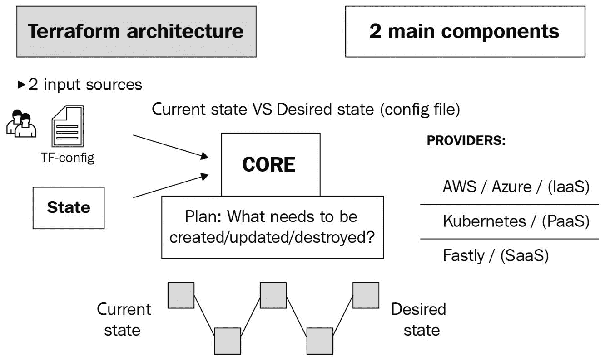
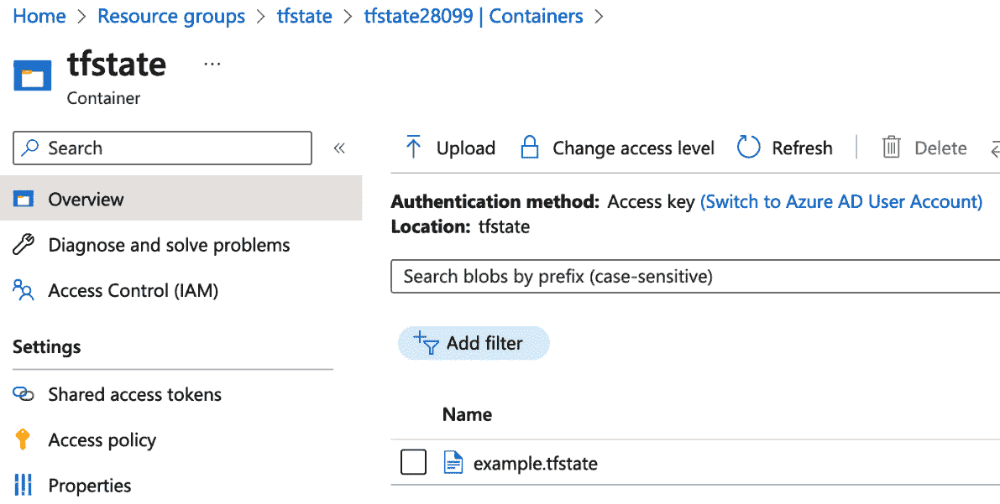
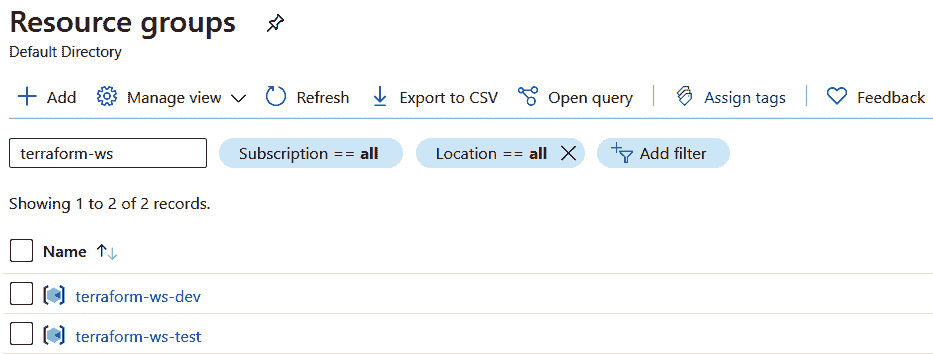
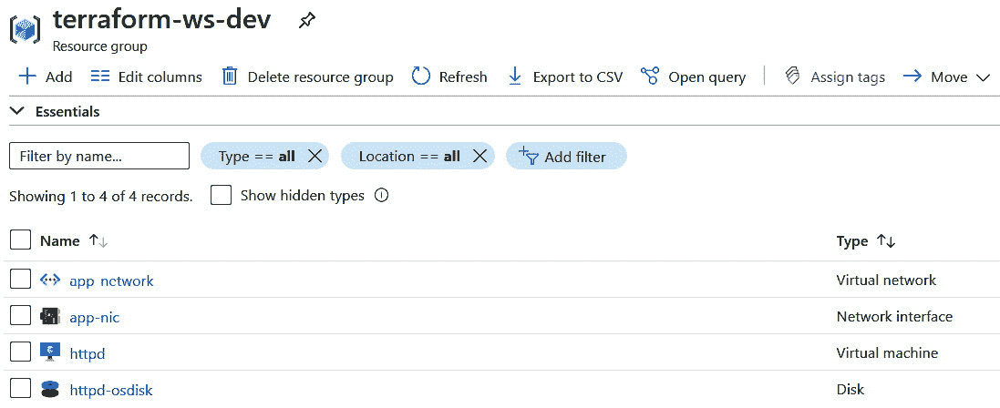
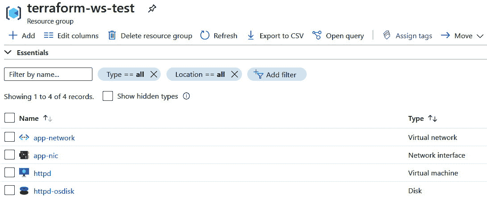
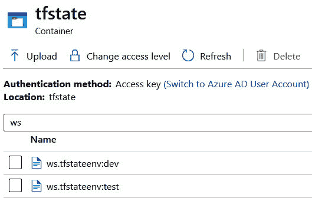

# 8

# 使用 Terraform 实现基础设施即代码（IaC）

云计算是当今推动 DevOps 实现的主要因素之一。关于云计算的初步担忧已经成为过去。随着一支安全和合规专家 24 小时驻守在云平台，组织现在比以往任何时候都更加信任*公共云*。与云计算一起，另一个热词也席卷了整个行业——**基础设施即代码**（**IaC**）。本章将重点讲解使用 **Terraform** 实现 IaC，到了本章结束时，你将理解这一概念，并拥有足够的 Terraform 实践经验，帮助你开始自己的旅程。

在本章中，我们将涵盖以下主要主题：

+   IaC 简介

+   设置 Terraform 和 Azure 提供者

+   理解 Terraform 工作流并使用 Terraform 创建你的第一个资源

+   Terraform 模块

+   Terraform 状态和后端

+   Terraform 工作空间

+   Terraform 输出、状态、控制台和图表

# 技术要求

本章中，你可以使用任何机器来运行 Terraform。Terraform 支持多个平台，包括 Windows、Linux 和 macOS。

你将需要一个有效的 Azure 订阅来进行练习。目前，Azure 提供为期 30 天的免费试用，并赠送价值 $200 的免费积分；你可以在 [`azure.microsoft.com/en-in/free`](https://azure.microsoft.com/en-in/free) 注册。

你还需要克隆以下 GitHub 仓库来进行一些练习：

[`github.com/PacktPublishing/Modern-DevOps-Practices-2e`](https://github.com/PacktPublishing/Modern-DevOps-Practices-2e)

运行以下命令将仓库克隆到你的主目录，并 `cd` 进入 `ch8` 目录以访问所需资源：

```
$ git clone https://github.com/PacktPublishing/Modern-DevOps-Practices-2e.git \
  modern-devops
$ cd modern-devops/ch8
```

那么，让我们开始吧！

# IaC 简介

基础设施即代码（IaC）是使用代码来定义基础设施的概念。虽然大多数人能将基础设施想象成某种有形的东西，但虚拟基础设施已经是司空见惯的存在，并且已经存在了大约二十年。云服务提供商提供了一个基于 Web 的控制台，通过它，你可以直观地管理你的基础设施。然而，这个过程不可重复且没有记录。

如果你在一个环境中使用控制台启动一组基础设施组件，并希望在另一个环境中复制它，那就相当于重复劳动。为了解决这个问题，云平台提供了 API 来操作云中的资源，并提供一些命令行工具帮助触发这些 API。你可以开始编写脚本，使用命令来创建基础设施，并将其参数化以便在另一个环境中使用同样的脚本。嗯，这样就解决问题了，对吧？

并不是完全如此！编写脚本是管理基础设施的一种命令式方式。尽管你仍然可以称之为 IaC，但它的问题在于没有有效地管理基础设施变更。让我举几个例子：

+   如果你需要修改脚本中已经存在的内容，怎么办？在脚本的中间某个地方进行更改，并重新运行整个脚本，可能会对你的基础设施造成混乱。命令式管理基础设施是不可幂等的。因此，管理更改会成为一个问题。

+   如果有人使用控制台手动更改了脚本管理的基础设施，怎么办？你的脚本能正确检测到吗？如果你想用脚本改变同样的内容，会发生什么？这很快就会变得杂乱无章。

+   随着混合云架构的出现，大多数组织都使用多个云平台来满足他们的需求。当你处于这种情况时，使用命令式脚本管理多个云很快就会变得成问题。不同的云平台有不同的与 API 交互的方式，并且有各自独特的命令行工具。

解决所有这些问题的方案是像 Terraform 这样的声明性 IaC 解决方案。HashiCorp 的 Terraform 是市场上最流行的 IaC 工具。它帮助你使用代码自动化和管理基础设施，并能在各种平台上运行。由于它是声明式的，你只需定义你需要的内容（期望的最终状态），而不需要描述如何实现它。它具有以下特性：

+   它通过提供程序支持多个云平台，并公开一个基于**HashiCorp 配置语言**（**HCL**）的单一声明性接口与其交互。因此，它允许你使用相似的语言和语法管理各种云平台。所以，团队中如果有几位 Terraform 专家，就能处理你所有的 IaC 需求。

+   它通过状态文件跟踪其管理的资源的状态，并支持本地和远程后端存储和管理这些状态文件。这有助于使 Terraform 配置具有幂等性。因此，如果有人手动更改了 Terraform 管理的资源，Terraform 可以在下次运行时检测到差异，并提示进行纠正操作，以将其恢复到定义的配置。管理员可以在应用更改之前吸收此更改或解决任何冲突。

+   它在基础设施管理中实现了 GitOps。通过 Terraform，你可以将基础设施配置与应用程序代码放在一起，使版本控制、管理和发布基础设施的方式与管理代码相同。你还可以通过拉取请求包含代码扫描和门控，以便在应用更高环境之前，有人可以审查并批准对更高环境的更改。确实是一项强大的功能！

Terraform 提供了多个版本——**开源**、**云**和**企业**版。开源版是一个简单的基于**命令行界面**（**CLI**）的工具，你可以在任何支持的**操作系统**（**OS**）上下载并使用。云和企业版更多的是对开源版的包装。它们提供基于 Web 的 GUI 和高级功能，如**代码即策略**（**Sentinel**）、**成本分析**、**私有模块**、**GitOps**和**CI/CD 流水线**。

本章将讨论开源提供和其核心功能。

Terraform 开源分为两个主要部分——**Terraform Core** 和 **Terraform 提供者**，如下图所示：



图 8.1 – Terraform 架构

让我们来看看这两个组件的功能：

+   **Terraform Core** 是我们用来与 Terraform 交互的 CLI。它有两个主要输入——你的 Terraform 配置文件和现有状态。然后，它会计算配置差异并应用它。

+   **Terraform 提供者** 是 Terraform 用来与云提供商交互的插件。提供者将 Terraform 配置转换为相应云的 REST API 调用，以便 Terraform 管理相关的基础设施。例如，如果你希望 Terraform 管理 AWS 基础设施，则必须使用 Terraform AWS 提供者。

现在让我们看看如何安装开源 Terraform。

## 安装 Terraform

安装 Terraform 非常简单；只需访问[`www.terraform.io/downloads.html`](https://www.terraform.io/downloads.html)，并根据你的平台按照说明进行操作。大部分内容将要求你下载一个二进制文件并将其移到系统路径中。

由于我们在本书中一直使用 Ubuntu，因此我将展示如何在 Ubuntu 上安装 Terraform。使用以下命令，借助 `apt` 包管理器来安装 Terraform：

```
$ wget -O- https://apt.releases.hashicorp.com/gpg | \
  sudo gpg --dearmor -o /usr/share/keyrings/hashicorp-archive-keyring.gpg
$ echo "deb [signed-by=/usr/share/keyrings/hashicorp-archive-keyring.gpg] \ 
https://apt.releases.hashicorp.com $(lsb_release -cs) main" | \ 
sudo tee /etc/apt/sources.list.d/hashicorp.list
$ sudo apt update && sudo apt install terraform
```

使用以下命令检查 Terraform 是否已成功安装：

```
$ terraform version
Terraform v1.5.2
```

它显示 Terraform 已成功安装。Terraform 使用 Terraform 提供者与云提供商进行交互，接下来我们将在下一节中讨论这些内容。

# Terraform 提供者

Terraform 采用去中心化架构。Terraform CLI 包含 Terraform 的核心功能，并提供与特定云提供商无关的所有功能，而 Terraform 提供者则为 Terraform CLI 和云提供商之间提供接口。这种去中心化的方式使得公共云供应商能够提供他们自己的 Terraform 提供者，从而使他们的客户可以使用 Terraform 来管理云中的基础设施。由于 Terraform 的流行，现在每个公共云提供商都必须提供 Terraform 提供者。

本章我们将与 Azure 进行交互，并使用 Azure Terraform 提供者来进行操作。

要访问本节的资源，请在终端中 `cd` 到以下目录：

```
$ cd ~/modern-devops/ch8/terraform-exercise/
```

在继续配置提供者之前，我们需要了解 Terraform 如何与 Azure API 进行身份验证和授权。

## 与 Azure 的身份验证和授权

与 Azure 进行身份验证和授权的最简单方法是使用 Azure CLI 登录到你的帐户。当你在 Terraform 文件中使用 Azure 提供程序时，它将自动充当你的帐户并执行所需的操作。现在，这听起来有点危险。管理员通常有很多访问权限，而有一个作为管理员的工具可能不是一个好主意。如果你想将 Terraform 插入到 CI/CD 流水线中怎么办？其实，还有另一种方法——通过使用 **Azure 服务主体**。Azure 服务主体允许你在不使用指定用户帐户的情况下访问所需功能。你可以对服务主体应用 **最小权限原则**，只提供必要的访问权限。

在配置服务主体之前，让我们在机器上安装 Azure CLI。为此，请运行以下命令：

```
$ curl -sL https://aka.ms/InstallAzureCLIDeb | sudo bash
```

上述命令将下载一个 shell 脚本，并使用 `bash` 执行它。脚本将自动下载并配置 Azure CLI。要确认 Azure CLI 是否安装成功，请运行以下命令：

```
$ az --version
azure-cli                         2.49.0
```

我们已经看到 Azure CLI 在系统上正确安装。现在，让我们继续配置服务主体。

要配置 Azure 服务主体，请按照以下步骤操作。

使用以下命令登录 Azure，并按照命令提示的步骤操作。你必须浏览到指定的 URL 并输入给定的代码。登录后，你将获得一个包含一些详细信息的 JSON 响应，内容可能如下所示：

```
$ az login
To sign in, use a web browser to open the page https://microsoft.com/devicelogin and enter 
the code XXXXXXXXX to authenticate:
[
  {
    "id": "00000000-0000-0000-0000-0000000000000",
    ...
  }
]
```

记下`id`属性，它是订阅 ID，如果你有多个订阅，可以使用以下命令将其设置为正确的订阅：

```
$ export SUBSCRIPTION_ID="<SUBSCRIPTION_ID>"
$ az account set --subscription="$SUBSCRIPTION_ID"
```

使用以下命令创建一个`contributor`角色，允许 Terraform 管理订阅的基础设施。

提示

在授予服务主体访问权限时，遵循最小权限原则。不要因为未来可能需要某些权限就提前授予它们。如果未来需要任何访问权限，你可以稍后再授予。

我们使用 `contributor` 权限是为了简化，但也可以使用更细粒度的权限，这种权限应该被使用：

```
$ az ad sp create-for-rbac --role="Contributor" \
 --scopes="/subscriptions/$SUBSCRIPTION_ID"
Creating 'Contributor' role assignment under scope '/subscriptions/<SUBSCRIPTION_ID>'
The output includes credentials that you must protect. Ensure you do not include these 
credentials in your code or check the credentials into your source control (for more 
information, see https://aka.ms/azadsp-cli):
{
  "appId": "00000000-0000-0000-0000-0000000000000",
  "displayName": "azure-cli-2023-07-02-09-13-40",
  "password": "00000000000.xx-00000000000000000",
  "tenant": "00000000-0000-0000-0000-0000000000000"
}
```

我们已经成功创建了`appId`、`password`和`tenant`。我们将需要这些信息来配置 Terraform 使用服务主体。在下一节中，我们将根据这些详细信息定义 Azure Terraform 提供程序。

## 使用 Azure Terraform 提供程序

在定义 Azure Terraform 提供程序之前，让我们了解什么构成了 Terraform 根模块。Terraform 根模块仅是你文件系统中的一个工作目录，包含一个或多个 `.tf` 文件，这些文件帮助你定义配置，并且通常是在这里运行 Terraform 命令。

Terraform 会扫描所有 `.tf` 文件，将它们合并，并在内部作为一个整体处理。因此，你可以根据需要将一个或多个 `.tf` 文件拆分开来。虽然没有为 `.tf` 文件命名的标准，但大多数约定使用 `main.tf` 作为主 Terraform 文件，其中定义资源，使用 `vars.tf` 文件来定义变量，使用 `outputs.tf` 文件来定义输出。

在本讨论中，让我们在工作目录中创建一个 `main.tf` 文件，并添加如下的 `provider` 配置：

```
terraform {
  required_providers {
    azurerm = {
      source  = "azurerm"
      version = "=3.55.0"
    }
  }
}
provider "azurerm" {
  subscription_id = var.subscription_id
  client_id       = var.client_id
  client_secret   = var.client_secret
  tenant_id       = var.tenant_id
  features {}
}
```

上面的文件包含两个块。`terraform` 块包含 `required_providers` 块，声明了 `azurerm` 提供程序的 `version` 约束。`provider` 块声明了一个 `azurerm` 提供程序，它需要四个参数。

提示

始终约束提供程序版本，因为提供程序的发布没有通知，如果你不包含版本号，在你的机器上可用的功能可能在其他人的机器或 CI/CD 流水线中无法正常工作。使用版本约束可以避免破坏性变更，并保持对版本的控制。

你可能已经注意到，我们在前面的文件中声明了几个变量，而不是直接输入值。这背后有两个主要原因——我们希望使模板尽可能通用，以促进复用。所以，假设我们希望在另一个订阅中应用相似的配置，或者使用另一个服务主体，我们应该能够通过修改变量值来改变它。其次，我们不希望将 `client_id` 和 `client_secret` 存储在源代码管理中。这是一个不好的做法，因为我们将服务主体暴露给了不需要知道的人。

提示

永远不要将敏感数据存储在源代码控制中。相反，使用 `tfvars` 文件来管理敏感信息，并将其存储在像 HashiCorp Vault 这样的秘密管理系统中。

好的，既然我们已经定义了提供程序资源，并且属性值来自变量，接下来的步骤是声明变量。现在让我们看看如何操作。

# Terraform 变量

要声明变量，我们需要创建一个 `vars.tf` 文件，并包含以下数据：

```
variable "subscription_id" {
  type        = string
  description = "The azure subscription id"
}
variable "app_id" {
  type        = string
  description = "The azure service principal appId"
}
variable "password" {
  type        = string
  description = "The azure service principal password"
  sensitive   = true
}
variable "tenant" {
  type        = string
  description = "The azure tenant id"
}
```

所以，我们在这里使用 `variable` 块定义了四个变量。变量块通常包含 `type` 和 `description`。`type` 属性定义了我们声明的变量的数据类型，默认为 `string` 数据类型。它可以是诸如 `string`、`number`、`bool` 这样的基本数据类型，或者是诸如 `list`、`set`、`map`、`object` 或 `tuple` 这样的复杂数据结构。稍后在练习中我们会详细讨论这些类型。`description` 属性提供了有关变量的更多信息，用户可以参考它以便更好地理解。

提示

始终从一开始就设置 `description` 属性，因为它对用户友好并促进模板的复用。

`client_secret` 变量还包含一个名为 `sensitive` 的第三属性，一个设置为 `true` 的布尔属性。当 `sensitive` 属性为 `true` 时，Terraform CLI 不会在屏幕输出中显示它。对于像密码和机密这样的敏感变量，强烈建议使用此属性。

提示

始终将敏感变量声明为 `sensitive`。这是因为如果在您的 CI/CD 管道中使用 Terraform，非特权用户可能通过查看日志访问敏感信息。

除其他三者外，名为 `default` 的属性将帮助您指定变量的默认值。默认值可帮助您为变量提供最佳可能的值，用户如有需要可以覆盖它们。

提示

在可能的情况下始终使用默认值，因为它们允许您向用户提供关于企业标准的软指导，并节省他们的时间。

接下来的步骤将是提供变量值。让我们来看看这一点。

## 提供变量值

在 Terraform 中提供变量值有几种方法：

+   `-var` 标志及 `variable_name=variable_value` 字符串以提供这些值。

+   `.tfvars`（如果您喜欢 HCL）或 `.tfvars.json`（如果您喜欢 JSON），通过命令行使用 `-var-file` 标志。

+   在 Terraform 工作区中使用 `terraform.tfvars` 或以 `.auto.tfvars` 扩展名结束。Terraform 将自动扫描这些文件并从中获取值。

+   使用 `TF_VAR_<var-name>` 结构包含变量值。

+   **默认**：当您在任何其他方式中不为变量提供值时运行 Terraform 计划时，Terraform CLI 将提示输入这些值，并且您必须手动输入它们。

如果使用多种方法提供同一变量的值，则在前述列表中的第一种方法对特定变量具有最高优先级。它会覆盖后面列出的任何定义。

我们将使用 `terraform.tfvars` 文件进行此活动，并为变量提供值。

将以下数据添加到 `terraform.tfvars` 文件中：

```
subscription_id = "<SUBSCRIPTION_ID>"
app_id          = "<SERVICE_PRINCIPAL_APP_ID>"
password        = "<SERVICE_PRINCIPAL_PASSWORD>"
tenant          = "<TENANT_ID>"
```

如果要将 Terraform 配置提交到源代码控制中，请将该文件添加到忽略列表以避免意外提交。

如果使用 Git，请将以下内容添加到 `.gitignore` 文件中即可：

```
*.tfvars
.terraform*
```

现在，让我们继续查看 Terraform 工作流程，以进一步进行。

# Terraform 工作流程

Terraform 工作流通常包括以下步骤：

+   `init`：在您的构建过程中多次初始化 Terraform `init` 命令，因为它不会更改您的工作区或状态。

+   `plan`：此命令会在请求的资源上运行一个预估计划。此命令通常与云提供商连接，然后检查 Terraform 管理的对象是否存在于云提供商中，以及它们是否与 Terraform 模板中定义的配置一致。然后，它会显示计划输出中的差异，管理员可以审查并在不满意时更改配置。如果满意，他们可以应用计划，将更改提交到云平台。`plan`命令不会对当前基础设施进行任何更改。

+   `apply`：此命令将增量配置应用到云平台。当你单独使用`apply`时，它会首先运行`plan`命令并要求确认。如果提供计划，它会直接应用该计划。你也可以在不运行计划的情况下使用`apply`，通过使用`-auto-approve`标志来自动批准。

+   `destroy`：`destroy`命令销毁 Terraform 管理的整个基础设施。因此，它并不是一个非常受欢迎的命令，在生产环境中很少使用。不过，这并不意味着`destroy`命令没有用处。假设你正在为临时目的搭建开发环境，之后不再需要它，那么通过此命令销毁你创建的所有内容只需要几分钟。

要访问本节的资源，`cd`进入以下目录：

```
$ cd ~/modern-devops/ch8/terraform-exercise
```

现在，让我们通过实际操作来详细了解这些内容。

## terraform init

要初始化 Terraform 工作区，请运行以下命令：

```
$ terraform init
Initializing the backend...
Initializing provider plugins...
- Finding hashicorp/azurerm versions matching "3.63.0"...
- Installing hashicorp/azurerm v3.63.0...
- Installed hashicorp/azurerm v3.63.0 (signed by HashiCorp)
Terraform has created a lock file, .terraform.lock.hcl, to record the provider selections 
it made previously. Include this file in your version control repository so that Terraform 
can guarantee to make the same selections by default when you run terraform init in the 
future.
Terraform has been successfully initialized!
```

由于 Terraform 工作区已被初始化，我们可以创建一个**Azure 资源组**来开始与云进行交互。

## 创建第一个资源 – Azure 资源组

我们必须在`main.tf`文件中使用`azurerm_resource_group`资源来创建 Azure 资源组。请将以下内容添加到`main.tf`文件中：

```
resource "azurerm_resource_group" "rg" {
  name     = var.rg_name
  location = var.rg_location
}
```

由于我们使用了两个变量，因此我们需要声明它们，请将以下内容添加到`vars.tf`文件中：

```
variable "rg_name" {
  type        = string
  description = "The resource group name"
}
variable "rg_location" {
  type        = string
  description = "The resource group location"
}
```

接下来，我们需要将资源组名称和位置添加到`terraform.tfvars`文件中。因此，请将以下内容添加到`terraform.tfvars`文件中：

```
rg_name=terraform-exercise
rg_location="West Europe"
```

现在，我们已经准备好执行计划了，但在此之前，让我们使用`terraform fmt`将我们的文件格式化为标准格式。

## terraform fmt

`terraform fmt`命令将`.tf`文件格式化为标准格式。使用以下命令格式化你的文件：

```
$ terraform fmt
terraform.tfvars
vars.tf
```

该命令列出了它已格式化的文件。下一步是验证你的配置。

## terraform validate

`terraform validate`命令验证当前配置，并检查是否有任何语法错误。要验证配置，请运行以下命令：

```
$ terraform validate
Success! The configuration is valid.
```

成功输出表示我们的配置有效。如果有任何错误，它会在验证输出中突出显示。

提示

在每次执行 Terraform 计划之前，请始终运行`fmt`和`validate`。这可以节省大量规划时间，并帮助你保持配置的良好状态。

由于配置有效，我们可以准备运行一个计划。

## terraform plan

要运行 Terraform 计划，请使用以下命令：

```
$ terraform plan
Terraform used the selected providers to generate the following execution plan. Resource 
actions are indicated with the following symbols:  + create
Terraform will perform the following actions:
  # azurerm_resource_group.rg will be created
  + resource "azurerm_resource_group" "rg" {
      + id       = (known after apply)
      + location = "westeurope"
      + name     = "terraform-exercise"
    }
Plan: 1 to add, 0 to change, 0 to destroy.
Note: You didn't use the -out option to save this plan, so Terraform can't guarantee to 
take exactly these actions if you run terraform apply now.
```

`plan`输出告诉我们，如果我们立即运行`terraform apply`，它将创建一个名为`terraform_exercise`的单一资源组。它还输出了一条提示，说明由于我们没有保存此计划，后续的应用操作无法保证执行相同的操作。同时，事情可能已发生变化；因此，Terraform 将在应用时重新运行`plan`并提示我们输入`yes`。因此，如果不想遇到意外，应该将计划保存到文件中。

提示

始终将`terraform plan`输出保存到文件，并使用该文件来应用更改。这样可以避免最后一分钟的意外，避免背景中可能发生的变化导致`apply`没有按预期执行，尤其是在您的计划作为流程的一部分进行审查时。

所以，我们先使用以下命令将计划保存到文件中：

```
$ terraform plan -out rg_terraform_exercise.tfplan
```

这次，计划被保存为名为`rg_terraform_exercise.tfplan`的文件。我们可以使用这个文件来随后应用更改。

## terraform apply

要使用`plan`文件应用更改，请运行以下命令：

```
$ terraform apply "rg_terraform_exercise.tfplan"
azurerm_resource_group.rg: Creating...
azurerm_resource_group.rg: Creation complete after 2s [id=/subscriptions/id/
resourceGroups/terraform-exercise]
Apply complete! Resources: 1 added, 0 changed, 0 destroyed.
```

就是这样！Terraform 已应用配置。让我们使用 Azure CLI 验证资源组是否已创建。

运行以下命令列出您订阅中的所有资源组：

```
$ az group list
...
    "id": "/subscriptions/id/resourceGroups/terraform-exercise",
    "location": "westeurope",
    "name": "terraform-exercise",
...
```

我们看到资源组已创建并出现在列表中。

有时`apply`可能部分成功。在这种情况下，Terraform 会自动标记它认为未成功创建的资源。这些资源将在下一次运行时自动重新创建。如果您希望手动标记某个资源以供重新创建，可以使用`terraform`的`taint`命令：

```
$ terraform taint <resource>
```

假设我们希望销毁资源组，因为我们不再需要它。我们可以使用`terraform destroy`来完成。

## terraform destroy

要销毁资源组，我们可以先运行一个推测性的计划。始终建议运行推测性计划，以确认我们需要销毁的内容是否包含在输出中，以免稍后出现意外。Terraform 就像 Linux 一样，没有撤销按钮。

要运行一个推测性的销毁计划，请使用以下命令：

```
$ terraform plan -destroy
Terraform used the selected providers to generate the following execution plan. Resource 
actions are indicated with the following symbols:
  - destroy
Terraform will perform the following actions:
  # azurerm_resource_group.rg will be destroyed
  - resource "azurerm_resource_group" "rg" {
      - id = "/subscriptions/id/resourceGroups/terraform-exercise" -> null
      - location = "westeurope" -> null
      - name = "terraform-exercise" -> null
      - tags = {} -> null
    }
Plan: 0 to add, 0 to change, 1 to destroy.
```

如我们所见，由于资源组是 Terraform 管理的唯一资源，它已列出该资源作为将要销毁的资源。销毁资源有两种方式：使用`terraform destroy`单独运行，或使用`out`参数保存推测性计划后，运行`terraform apply`来应用销毁计划。

目前我们先使用第一种方法。

运行以下命令销毁所有由 Terraform 管理的资源：

```
$ terraform destroy
Terraform will perform the following actions:
  # azurerm_resource_group.rg will be destroyed
Do you really want to destroy all resources?
Terraform will destroy all your managed infrastructure, as shown above. There is no undo. 
Only yes will be accepted to confirm.
  Enter a value:
```

现在，这次，Terraform 重新运行`plan`并提示输入一个值。它只会接受`yes`，然后按*Enter*键确认：

```
  Enter a value: yes
azurerm_resource_group.rg: Destroying... [id=/subscriptions/id/resourceGroups/terraform-
exercise]
azurerm_resource_group.rg: Still destroying... [id=/subscriptions/id/resourceGroups/
terraform-exercise, 10s elapsed]
azurerm_resource_group.rg: Destruction complete after 1m20s
```

现在它已经销毁了资源组。

我们已经看过一个基础的根模块，并探讨了 Terraform 的工作流程。基础根模块帮助我们创建和管理资源，但缺少一个非常重要的特性——可重用性。Terraform 为我们提供了模块，允许我们对常见模板进行重用。在下一部分，我们将看看它。

# Terraform 模块

**Terraform 模块**是可重用、可重复的模板。它们允许在基础设施提供过程中进行抽象，这在您的使用场景超出一些概念验证时非常需要。HashiCorp 将模块视为由专家设计，这些专家了解企业标准，并被希望在项目中应用企业标准基础设施的开发人员使用。这样，整个组织的事情都能保持标准化。这为开发人员节省时间，避免重复劳动。模块可以版本控制并通过 **模块仓库** 或版本控制系统分发。这同时为基础设施管理员提供了丰富的权限和控制。

在上一部分我们创建了资源组，接下来让我们将其模块化。在下一个练习中，为了访问该部分的资源，请执行以下操作：

```
$ cd ~/modern-devops/ch8/terraform-modules/
```

在此目录中，我们有以下目录结构：

```
.
├── main.tf
├── modules
│   └── resource_group
│       ├── main.tf
│       └── vars.tf
├── terraform.tfvars
└── vars.tf
```

如我们所见，根目录中我们仍然有 `main.tf`、`terraform.tfvars` 和 `vars.tf` 文件。然而，我们增加了一个 `modules` 目录，其中包含一个 `resource_group` 子目录，里面有一个 `main.tf` 文件和一个 `vars.tf` 文件。让我们来看一下这两个文件。

`modules/resource_group/main.tf` 文件如下所示：

```
resource "azurerm_resource_group" "rg" {
  name     = var.name
  location = var.location
}
```

它只包含一个 `azurerm_resource_group` 资源，其名称和位置来自以下 `modules/resource_group/vars.tf` 文件中定义的 `name` 和 `location` 变量：

```
variable "name" {
  type        = string
  description = "The resource group name"
}
variable "location" {
  type        = string
  description = "The resource group location"
}
```

在根模块中，也就是当前目录，我们已修改 `main.tf` 文件，使其如下所示：

```
terraform {
  required_providers {
    ...
  }
}
provider "azurerm" {
  ...
}
module "rg" {
  source  = "./modules/resource_group"
  name     = var.rg_name
  location = var.rg_location
}
```

如我们所见，我们没有直接在此文件中定义资源，而是定义了一个名为 `rg` 的模块，其 `source` 是 `./modules/resource_group`。请注意，我们从根级别定义的变量（即 `var.rg_name` 和 `var.rg_location`）传递给模块中定义的变量，即 `name` 和 `location` 的值。

现在，让我们继续看看当我们初始化并应用这个配置时会发生什么。

运行以下命令来初始化 Terraform 工作区：

```
$ terraform init
Initializing the backend...
Initializing modules...
- rg in modules/resource_group
Initializing provider plugins...
...
Terraform has been successfully initialized!
```

如我们所见，Terraform 在初始化时已检测到新模块并对其进行了初始化。

提示

每当定义新模块时，您必须始终重新初始化 Terraform。

现在，让我们继续运行以下命令来进行计划：

```
$ terraform plan
Terraform will perform the following actions:
  # module.rg.azurerm_resource_group.rg will be created
  + resource "azurerm_resource_group" "rg" {
      + id       = (known after apply)
      + location = "westeurope"
      + name     = "terraform-exercise"
    }
Plan: 1 to add, 0 to change, 0 to destroy.
```

如我们所见，它将创建资源组。然而，这现在是模块 `module.rg.azurerm_resource_group.rg` 的一部分。要应用计划，让我们运行以下命令：

```
$ terraform apply
module.rg.azurerm_resource_group.rg: Creating...
module.rg.azurerm_resource_group.rg: Creation complete after 4s [id=/subscriptions/id/
resourceGroups/terraform-exercise]
```

资源组已创建！要销毁该资源组，让我们运行以下命令：

```
$ terraform destroy
```

通过使用模块，您可以简化基础设施的创建和管理，增强团队之间的协作，并建立一种一致的方法来以可扩展和可维护的方式部署资源。

提示

使用 Terraform 模块封装并重用基础设施配置，促进模块化和可重用性。

直到现在，我们已经看到 Terraform 创建和销毁资源，但 Terraform 如何知道它之前创建了什么以及需要销毁什么呢？嗯，它使用**状态文件**来解决这个问题。我们来看看。

# 管理 Terraform 状态

Terraform 使用状态文件来跟踪已部署的内容及其管理的资源。状态文件至关重要，因为它记录了 Terraform 维护的所有基础设施。如果丢失了状态文件，Terraform 将无法追踪已执行的操作，并且会将资源当作新的、需要重新创建的资源。因此，您应该像代码一样保护状态文件。

Terraform 将状态存储在后端。默认情况下，Terraform 将状态文件存储为 `terraform.tfstate`，并放置在 `workspace` 目录中，这称为本地后端。然而，这并不是管理状态的最佳方式。您不应将状态存储在本地系统中，原因有几个：

+   如果状态文件存储在某人的本地目录中，多个管理员无法共同操作同一基础设施。

+   本地工作站没有备份；因此，即使只有一个管理员在执行任务，丢失状态文件的风险仍然很高。

您可能会争辩说，我们可以通过将状态文件与 `.tf` 文件一起检查到源代码管理中来解决这些问题。不要这样做！状态文件是纯文本的，如果您的基础设施配置包含敏感信息，如密码，任何人都可以看到它。因此，您需要安全存储状态文件。此外，将状态文件存储在源代码管理中并不能提供状态锁定功能，如果多人同时修改状态文件，会导致冲突。

提示

永远不要将状态文件存储在源代码管理中。使用 `.gitignore` 文件条目跳过 `terraform.tfstate` 文件。

存储 Terraform 状态的最佳位置是远程云存储。Terraform 提供了远程后端来远程存储状态。您可以使用多种类型的远程后端。当编写本书时，`plan` 和 `apply` 在后端运行，只有 Terraform Cloud 和 Enterprise 支持这一功能。

提示

在选择状态存储方案时，您应该优先选择支持状态锁定的存储。这将允许多人操作资源而不互相干扰，一旦状态文件被锁定，其他人将无法获取它，直到锁定被释放。

由于我们使用的是 Azure，因此可以使用 Azure 存储来保存状态。其优点有三：

+   您的状态文件是集中管理的。您可以让多个管理员一起工作并管理相同的基础设施。

+   存储在休眠状态下是加密的。

+   你将获得自动备份、冗余和高可用性。

要访问本节的资源，`cd`到以下目录：

```
$ cd ~/modern-devops/ch8/terraform-backend/
```

现在，让我们使用`azurerm`后端，并使用 Azure 存储来持久化我们的 Terraform 状态。

## 使用 Azure 存储后端

由于如果我们使用 Terraform 来构建存储其状态的后端，我们将陷入“鸡和蛋”的局面，所以我们必须在不使用 Terraform 的情况下配置这部分内容。

因此，让我们使用`az`命令在一个 Terraform 不会管理的不同资源组中配置存储帐户。

### 创建 Azure 存储资源

让我们从定义一些变量开始：

+   `$` `RESOURCE_GROUP=tfstate`

+   `$` `STORAGE_ACCOUNT_NAME=tfstate$RANDOM`

+   `$` `CONTAINER_NAME=tfstate`

首先，使用以下命令创建资源组：

```
$ az group create --name $RESOURCE_GROUP --location westeurope
```

现在，让我们继续使用以下命令在资源组内创建一个存储帐户：

```
$ az storage account create --resource-group $RESOURCE_GROUP \
--name $STORAGE_ACCOUNT_NAME --sku Standard_LRS \
--encryption-services BLOB
```

下一步是使用以下命令获取帐户密钥：

```
$ ACCOUNT_KEY=$(az storage account keys list \
--resource-group tfstate --account-name $STORAGE_ACCOUNT_NAME \
--query '[0].value' -o tsv)
```

现在，我们可以使用以下命令创建一个 Blob 存储容器：

```
$ az storage container create --name $CONTAINER_NAME \
--account-name $STORAGE_ACCOUNT_NAME --account-key $ACCOUNT_KEY
```

如果我们收到`created`响应，则表示存储帐户已创建并准备就绪。现在，我们可以继续在 Terraform 中定义后端配置文件。

### 在 Terraform 中创建后端配置

在我们创建后端之前，我们需要`STORAGE_ACCOUNT_NAME`的值。要获取此值，请运行以下命令：

```
$ echo $STORAGE_ACCOUNT_NAME
tfstate28099
```

要在 Terraform 中创建后端配置，创建一个名为`backend.tf`的文件，并放在工作区内：

```
terraform {
  backend "azurerm" {
    resource_group_name   = "tfstate"
    storage_account_name  = "tfstate28099"
    container_name        = "tfstate"
    key                   = "example.tfstate"
  }
}
```

在后端配置中，我们定义了`resource_group_name`后端，其中存在 Blob 存储实例 —— `storage_account_name`，`container_name`和`key`。`key`属性指定我们将用于定义此配置状态的文件名。你可能会使用 Terraform 管理多个项目，它们都需要单独的状态文件。因此，`key`属性定义了我们将为项目使用的状态文件的名称。这使得多个 Terraform 项目可以使用相同的 Azure Blob 存储来存储状态。

提示

始终使用项目的名称作为`key`的名称。例如，如果你的项目名称是`foo`，则将`key`命名为`foo.tfstate`。这样可以防止与其他项目发生潜在冲突，并且还可以让你快速找到状态文件。

要使用新的后端配置初始化 Terraform 工作区，请运行以下命令：

```
$ terraform init
Initializing the backend...
Backend configuration changed!
Terraform has detected that the configuration specified for the backend has changed. 
Terraform will now check for existing state in the backends.
Successfully configured the backend azurerm! Terraform will automatically use this backend 
unless the backend configuration changes.
```

当我们初始化时，Terraform 会检测到后端已更改，并检查现有后端中是否有任何内容。如果它找到内容，它会询问是否要将当前状态迁移到新后端。如果没有，它会自动切换到新后端，就像我们在这里看到的那样。

现在，让我们继续使用`terraform plan`命令来运行计划：

```
$ terraform plan
Acquiring state lock. This may take a few moments...
Terraform will perform the following actions:
  # azurerm_resource_group.rg will be created
  + resource "azurerm_resource_group" "rg" {
    	...
    }
Plan: 1 to add, 0 to change, 0 to destroy.
```

如我们所见，`terraform plan` 告诉我们，它将创建一个名为 `terraform-exercise` 的新资源组。让我们应用这个配置，这次使用`auto-approve`标志，这样计划就不会再次运行，Terraform 会立即应用更改，使用以下命令：

```
$ terraform apply -auto-approve
Acquiring state lock. This may take a few moments...
azurerm_resource_group.rg: Creating...
azurerm_resource_group.rg: Creation complete after 2s [id=/subscriptions/id/
resourceGroups/terraform-exercise]
Releasing state lock. This may take a few moments...
```

我们现在已经成功创建了资源。

现在，让我们去 Azure Blob 存储查看是否有一个 `tfstate` 文件，如下图所示：



图 8.2 – Terraform 状态

如我们所见，在 Blob 容器中有一个名为`example.tfstate`的文件。这就是远程存储的工作方式，现在任何有权限访问 Blob 存储实例的人都可以使用 Terraform 配置并进行更改。

到目前为止，我们一直在使用默认工作区管理资源，但如果有多个环境需要使用相同的配置进行控制怎么办？好吧，Terraform 为这些场景提供了工作区。

# Terraform 工作区

软件开发需要多个环境。你在工作区内开发软件，将其部署到开发环境，进行单元测试，然后将经过测试的代码提升到测试环境。你的 QA 团队将在测试环境中对代码进行广泛的测试，一旦所有测试用例通过，你就可以将代码推广到生产环境。

这意味着你必须在所有环境中保持类似的基础设施。借助像 Terraform 这样的 IaC 工具，基础设施以代码的形式呈现，我们必须管理我们的代码以适应多个环境。但 Terraform 不仅仅是代码；它还包含状态文件，我们必须为每个环境维护状态文件。

假设你想创建三个资源组，分别是 `terraform-exercise-dev`、`terraform-exercise-test` 和 `terraform-exercise-prod`。每个资源组将包含一组相似的基础设施，具有类似的属性。例如，每个资源组都包括一个 Ubuntu **虚拟** **机**（**VM**）。

解决此问题的一种简单方法是创建如下结构：

```
├── dev
│   ├── backend.tf
│   ├── main.tf
│   ├── terraform.tfvars
│   └── vars.tf
├── prod
│   ├── backend.tf
│   ├── main.tf
│   ├── terraform.tfvars
│   └── vars.tf
└── test
    ├── backend.tf
    ├── main.tf
    ├── terraform.tfvars
    └── vars.tf
```

你能看到重复吗？相同的文件多次出现，所有文件都包含相同的配置。唯一可能改变的是每个环境的 `terraform.tfvars` 文件。

所以，这听起来并不是一个很好的解决方法，这就是为什么 Terraform 为此提供了工作区。

**Terraform 工作区**仅仅是独立的状态文件。所以，你有一个配置和多个状态文件，每个环境都有一个。听起来很简单，对吧？让我们看一看。

使用 Terraform 工作区表示相同配置的另一种方式如下：

```
├── backend.tf
├── main.tf
├── terraform.tfvars
└── vars.tf
```

现在，这看起来很简单。它只包含一组文件。让我们逐一查看它们，以便更好地理解它们。

要访问本节的资源，请`cd`到以下位置：

```
$ cd ~/modern-devops/ch8/terraform-workspaces/
```

`main.tf`文件包含一个`resource_group`资源，其名称包括环境后缀，以及我们需要在该资源组内创建的其他资源，如 VNet、子网和 VM，类似以下内容：

```
...
resource "azurerm_resource_group" "main" {
  name     = "${var.rg_prefix}-${terraform.workspace}"
  location = var.rg_location
}
resource "azurerm_virtual_network" "main" {
  ...
}
resource "azurerm_subnet" "internal" {
  ...
}
resource "azurerm_network_interface" "main" {
...
}
resource "azurerm_virtual_machine" "main" {
  ...
}
...
```

要访问工作区的名称，Terraform 提供了`terraform.workspace`变量，我们已使用该变量定义`resource_group`名称。所以，模板现在已准备好接受任何环境的配置，并且我们将为每个环境创建一个独立的资源组。

同时，更新`backend.tf`文件，添加我们在上一节中创建的`tfstate`容器名称，并使用以下命令初始化 Terraform 工作区：

```
$ terraform init
```

现在，一旦 Terraform 初始化完成，让我们使用以下命令创建一个`dev`工作区：

```
$ terraform workspace new dev
Created and switched to workspace "dev"!
```

你现在处于一个新的、空的工作区。工作区会隔离其状态，因此如果你运行`terraform plan`，Terraform 将不会看到此配置的任何现有状态。

所以，既然我们处于一个名为`dev`的新空工作区，让我们运行一个计划。

使用以下命令在`dev`环境中运行计划：

```
$ terraform plan -out dev.tfplan
Acquiring state lock. This may take a few moments...
Terraform will perform the following actions:
  + resource "azurerm_network_interface" "main" {
      ...
    }
  + resource "azurerm_resource_group" "main" {
      + id       = (known after apply)
      + location = "westeurope"
      + name     = "terraform-ws-dev"
    }
  + resource "azurerm_subnet" "internal" {
      ...
    }
  + resource "azurerm_virtual_machine" "main" {
	...
    }
  + resource "azurerm_virtual_network" "main" {
	...
    }
Plan: 5 to add, 0 to change, 0 to destroy.
```

现在，让我们继续使用以下命令应用该计划：

```
$ terraform apply "dev.tfplan"
Acquiring state lock. This may take a few moments...
azurerm_resource_group.main: Creating...
azurerm_virtual_network.main: Creating...
azurerm_subnet.internal: Creating...
azurerm_network_interface.main: Creating...
azurerm_virtual_machine.main: Creating...
Apply complete! Resources: 5 added, 0 changed, 0 destroyed.
Releasing state lock. This may take a few moments...
```

由于`dev`计划已被应用，资源已创建在`dev`资源组中，我们来创建一个测试用的工作区：

```
$ terraform workspace new test
```

由于新工作区已创建，让我们使用以下命令在测试工作区运行计划，并将其保存到`test.tfplan`文件中：

```
$ terraform plan -out test.tfplan
...
  + resource "azurerm_resource_group" "main" {
      + id       = (known after apply)
      + location = "westeurope"
      + name     = "terraform-ws-test"
    }
...
```

如我们所见，资源将被创建在`terraform-ws-test`资源组中。所以，让我们继续使用以下命令应用计划：

```
$ terraform apply test.tfplan
```

`test`计划也已经应用。现在让我们继续检查已创建的资源。

提示

Terraform 工作区非常适合为不同的环境（如开发、预生产和生产）维护独立的基础设施配置。这有助于防止意外的配置更改，并确保一致的设置。

## 检查资源

让我们使用`az`命令列出资源组。如我们所知，我们的资源组有一个前缀`terraform-ws`。因此，使用以下命令列出所有包含该前缀的资源组：

```
$ az group list | grep name | grep terraform-ws
    "name": "terraform-ws-dev",
    "name": "terraform-ws-test",
```

如我们所见，我们有两个资源组，`terraform-ws-dev`和`terraform-ws-test`。所以，两个资源组已成功创建。

你也可以在 Azure 门户中验证这一点，如下图所示：



图 8.3 – 资源组

现在，让我们使用 Azure 门户，通过点击`terraform-ws-dev`来检查`terraform-ws-dev`资源组中的资源：



图 8.4 – Terraform 开发资源组

我们在资源组中有一个虚拟网络、一个网络接口、一个操作系统磁盘和一台虚拟机。我们应该期待在`terraform-ws-test`资源组中有相同名称的类似资源。让我们来看看：



图 8.5 – Terraform 测试资源组

如我们所见，我们在 `terraform-ws-test` 资源组中也有类似的资源。

我们通过一个配置完成了所有这些操作，但由于它们是两组资源，每个工作空间应该有两个状态文件。让我们来看一下。

## 检查状态文件

如果我们使用本地后端来存储状态文件，我们将得到以下结构：

```
|-- terraform.tfstate.d
    |-- dev
    |   `-- terraform.tfstate
    `-- test
        `-- terraform.tfstate
```

所以，Terraform 创建了一个名为 `terrafom.tfstate.d` 的目录；在这个目录下，它为每个工作空间创建了相应的子目录。在这些子目录中，它将每个工作空间的状态文件保存为 `terraform.tfstate`。

但由于我们使用的是远程后端，并且使用 Azure Blob 存储来存储它，让我们通过 Azure 控制台检查其中的文件：



图 8.6 – Terraform 工作空间状态

如我们所见，有两个状态文件，每个环境一个。因此，状态文件的后缀分别是 `env:dev` 或 `env:test` 字符串。这就是在 Azure Blob 存储中管理工作空间的方式。远程后端用于维护状态文件的结构取决于提供商插件，因此，管理多个后端的状态可能会有不同的方式。但是，Terraform CLI 会以相同的方式解释工作空间，无论后端如何，因此，从 CLI 角度来看，最终用户没有变化。

## 清理

现在，让我们继续清理这两个资源组，以避免不必要的费用。

由于我们已经在测试工作空间内，让我们运行以下命令销毁测试工作空间中的资源：

```
$ terraform destroy --auto-approve
```

现在，让我们使用以下命令切换到 `dev` 工作空间：

```
$ terraform workspace select dev
Switched to workspace "dev".
```

由于我们在 `dev` 工作空间中，使用以下命令销毁 `dev` 工作空间中的所有资源：

```
$ terraform destroy --auto-approve
```

稍后，我们应该能看到两个资源组已经消失。接下来，让我们在下一节中了解一些 Terraform 的高级概念。

# Terraform 输出、状态、控制台和图表

虽然我们知道 Terraform 使用状态文件来管理资源，但让我们来看一些高级命令，帮助我们更好地理解和掌握 Terraform 状态的概念。

要访问本节中的资源，`cd` 到以下路径：

```
$ cd ~/modern-devops/ch8/terraform-workspaces/
```

现在，让我们来看一下我们的第一个命令——`terraform output`。

## terraform 输出

到目前为止，我们已经看过了变量，但还没有讨论输出。Terraform 输出是 Terraform 配置的返回值，允许用户将配置导出给用户或任何可能使用当前模块的模块。

让我们继续上一个例子，在 `outputs.tf` 文件中添加一个输出变量，用来导出附加到虚拟机的网络接口的私有 IP：

```
output "vm_ip_addr" {
  value = azurerm_network_interface.main.private_ip_address
}
```

现在，让我们继续应用配置：

```
$ terraform apply --auto-approve
...
Outputs:
vm_ip_addr = "10.0.2.4"
```

在 Terraform 应用配置后，它会在控制台结果的末尾显示输出。你可以随时运行以下命令来检查输出：

```
$ terraform output
vm_ip_addr = "10.0.2.4"
```

输出像其他内容一样存储在状态文件中，因此让我们来看一下如何使用 CLI 管理 Terraform 状态。

## 管理 Terraform 状态

Terraform 将其管理的配置存储在状态文件中，因此提供了一个用于高级状态管理的命令。`terraform state`命令帮助你管理当前配置的状态。尽管状态文件是纯文本格式的，你可以手动修改它，但推荐使用`terraform state`命令。

但在我们深入讨论细节之前，我们必须了解为什么要这么做。事情可能不会总是按计划进行，因此状态文件可能包含损坏的数据。你可能还想在应用某个资源后查看该资源的特定属性。状态文件可能需要进行调查，以便进行特定基础设施配置问题的根本原因分析。让我们看看最常见的使用场景。

### 查看当前状态

要查看当前状态，我们可以运行以下命令：

```
$ terraform show
```

这将输出所有 Terraform 创建和管理的资源，包括输出内容。当然，对于一些人来说，这可能会显得信息过载，我们可能只想查看 Terraform 管理的资源列表。

### 列出当前状态中的资源

要列出 Terraform 状态文件中的资源，可以运行以下命令：

```
$ terraform state list
azurerm_network_interface.main
azurerm_resource_group.main
azurerm_subnet.internal
azurerm_virtual_machine.main
azurerm_virtual_network.main
```

如我们所见，Terraform 管理着五个资源。你可能希望将某个资源从 Terraform 状态中移除。也许有人手动移除了某个资源，因为它不再需要，但它并未从 Terraform 配置中移除。

### 从状态中移除资源

要手动从 Terraform 状态文件中移除状态，必须使用`terraform state rm <resource>`命令。例如，要从 Terraform 状态中移除 Azure 虚拟机资源，可以运行以下命令：

```
$ terraform state rm azurerm_virtual_machine.main
Acquiring state lock. This may take a few moments...
Removed azurerm_virtual_machine.main
Successfully removed 1 resource instance(s).
Releasing state lock. This may take a few moments...
```

请记住，这仅仅是从状态文件中移除了该资源，实际在 Azure 上存在的资源并未受到影响。

可能会有某些情况，其中有人在 Azure 中手动创建了虚拟机，而我们现在希望 Terraform 来管理它。这种情况大多发生在棕地项目中。在这种情况下，我们必须在 Terraform 中声明相同的配置，然后将现有资源导入到 Terraform 状态中。为此，我们可以使用`terraform import`命令。

### 将现有资源导入 Terraform 状态

你可以使用`terraform import`命令将现有资源导入到 Terraform 状态中。`terraform import`命令的结构如下：

```
terraform import <resource> <resource_id>
```

例如，要将`httpd`虚拟机重新导入状态，可以运行以下命令：

```
$ terraform import azurerm_virtual_machine.main \
"/subscriptions/<SUBSCRIPTION_ID>/resourceGroups\
/terraform-ws-dev/providers/Microsoft.Compute/virtualMachines/httpd"
Acquiring state lock. This may take a few moments...
azurerm_virtual_machine.main: Importing from ID "/subscriptions/id/resourceGroups/
terraform-ws-dev/providers/Microsoft.Compute/virtualMachines/httpd"...
azurerm_virtual_machine.main: Import prepared!
  Prepared azurerm_virtual_machine for import
azurerm_virtual_machine.main: Refreshing state... [id=/subscriptions/1de491b5-f572-
459b-a568-c4a35d5ac7a9/resourceGroups/terraform-ws-dev/providers/Microsoft.Compute/
virtualMachines/httpd]
Import successful!
```

要检查资源是否已导入状态，我们可以再次列出资源，使用以下命令：

```
$ terraform state list | grep azurerm_virtual_machine
azurerm_virtual_machine.main
```

如我们所见，VM 已经存在于状态文件中。如果我们想进一步了解资源，可以使用 `terraform console`。

## terraform console

`terraform console` 命令提供了一个交互式控制台，用于调查状态文件、动态构建路径并在使用资源之前评估表达式。这是一个强大的工具，大多数高级 Terraform 用户都在使用它。例如，我们启动控制台并查看我们刚刚导入的 VM 资源配置。

使用以下命令启动控制台并获取 VM 的资源组和 `id` 值：

```
$ terraform console
Acquiring state lock. This may take a few moments...
> azurerm_virtual_machine.main.resource_group_name
"terraform-ws-dev"
> azurerm_virtual_machine.main.id
"/subscriptions/id/resourceGroups/terraform-ws-dev/providers/Microsoft.Compute/
virtualMachines/httpd"
> exit
Releasing state lock. This may take a few moments...
```

如我们所见，VM 位于正确的资源组中，我们确认导入操作是正确的。

## Terraform 依赖关系和图形

Terraform 使用依赖模型来管理资源的创建和销毁顺序。有两种依赖关系——*隐式*和*显式*。直到现在，我们一直在使用隐式依赖关系，其中 VM 依赖于网络接口，网络接口依赖于子网，子网依赖于虚拟网络，所有这些资源都依赖于资源组。这些依赖关系通常发生在我们将一个资源的输出作为另一个资源的输入时。

然而，有时我们希望显式定义资源之间的依赖关系，尤其是当没有方法定义隐式依赖时。你可以使用 `depends_on` 属性来进行这种操作。

提示

除非必要，否则避免使用显式依赖关系，因为 Terraform 使用并行处理来管理资源。如果不需要显式依赖关系，它将加速 Terraform 运行，因为它可以并行处理多个资源。

为了可视化资源之间的依赖关系，我们可以从状态文件导出图形，并使用像**Graphviz**这样的工具将其转换为 PNG 文件。

运行以下命令导出依赖图：

```
$ terraform graph > vm.dot
```

然后我们可以使用 Graphviz 工具处理图形文件。在 Ubuntu 上安装该工具，运行以下命令：

```
$ sudo apt install graphviz -y
```

现在运行以下命令将图形文件转换为 PNG 文件：

```
$ cat vm.dot | dot -T png -o vm.png
```

图形可以在 [`github.com/PacktPublishing/Modern-DevOps-Practices-2e/blob/main/ch8/terraform-graph.png`](https://github.com/PacktPublishing/Modern-DevOps-Practices-2e/blob/main/ch8/terraform-graph.png) 处查看。现在，让我们继续查看如何清理资源。

## 清理资源

如我们所知，我们运行以下命令来清理资源：

```
$ terraform destroy --auto-approve
```

它将清除资源组中的资源，并在此之后删除资源组。

虽然使用 `terraform destroy` 可以轻松删除不需要的资源，但最好只在 `dev` 环境中使用它，绝不要在生产环境中使用。相反，你可以从配置中删除不需要的资源，然后运行 `terraform apply`。

# 总结

在本章中，我们讨论了 Terraform 的核心内容，并从实践角度理解了一些最常见的命令和功能。我们从理解 IaC 开始，介绍了 Terraform 作为 IaC 工具，安装了 Terraform，了解了 Terraform 提供程序，并使用 Azure Terraform 提供程序管理 Azure 中的基础设施。

接着，我们看了 Terraform 变量以及多种为变量提供值的方式。我们讨论了核心的 Terraform 工作流程以及你将用来管理基础设施的几个命令。然后，我们看了 Terraform 模块，接着看了 Terraform 状态，作为一个重要组成部分，帮助 Terraform 跟踪它所管理的基础设施。

我们了解了本地和远程状态存储，并使用 Azure Blob 存储作为远程状态后端。接着，我们讨论了 Terraform 工作空间，以及它们如何通过实践操作使我们能够使用相同的 Terraform 配置构建多个环境。

接着，我们看了一些关于 Terraform 状态的高级操作，使用了`outputs`、`state`和`console`命令。最后，我们查看了 Terraform 如何管理依赖关系，并使用`graph`命令查看了依赖图。

在下一章中，我们将深入讨论使用 Ansible 的配置管理。

# 问题

1.  为什么我们应该限制提供程序版本？

1.  你应该始终在 Terraform 计划之前使用`fmt`和`validate`函数。（对/错）

1.  Terraform `plan`命令做什么？（选择两个）

    A. 刷新当前状态与现有基础设施状态

    B. 获取当前配置与预期配置之间的差异

    C. 将配置应用于云端

    D. 销毁云端的配置

1.  `terraform apply`命令做什么？（选择三个）

    A. 刷新当前状态与现有基础设施

    B. 获取当前配置与预期配置之间的差异

    C. 将配置应用于云端

    D. 销毁云端的配置

1.  为什么你绝不应该将状态文件存储在源代码管理中？（选择两个）

    A. 状态文件是纯文本的，因此你暴露了敏感信息给没有权限的用户。

    B. 源代码管理不支持状态锁定，因此可能会导致用户之间的潜在冲突。

    C. 多个管理员不能同时在同一配置上工作。

1.  以下哪些是有效的 Terraform 远程后端？（选择五个）

    A. S3

    B. Azure Blob 存储

    C. Artifactory

    D. Git

    E. HTTP

    F. Terraform 企业版

1.  哪个命令将在下次`apply`中标记一个资源以供重建？

1.  如果你使用工作空间，本地后端中的状态文件存储在哪里？

1.  我们应该使用什么命令将 Terraform 资源从状态中移除？

1.  我们应该使用什么命令将现有的云资源导入到状态中？

# 答案

1.  因为 Terraform 提供程序是单独发布到 Terraform CLI 的，不同版本可能会破坏现有配置

1.  对

1.  A, B

1.  A, B, C

1.  A, B

1.  A, B, C, E, F

1.  `taint` 命令

1.  `terraform.tfstate.d`

1.  `terraform state` `rm <resource>`

1.  `terraform import <``resource> <id>`
