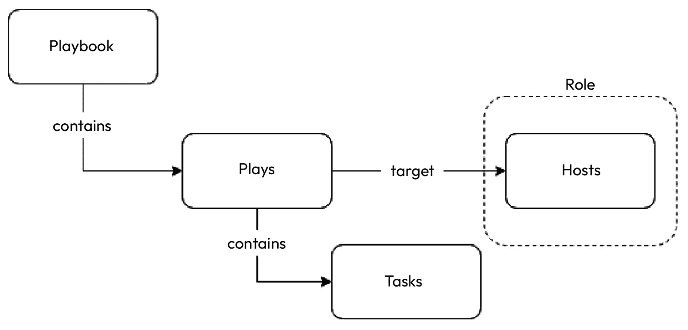

# 使用 Ansible 进行配置管理

在上一章中，我们介绍了**基础设施即代码**（**IaC**）与 Terraform，以及其核心概念、IaC 工作流、状态和调试技巧。现在，我们将深入探讨使用 Ansible 进行**配置管理**（**CM**）和**配置即代码**（**CaC**）。Ansible 是一种配置管理工具，帮助你将配置定义为幂等的代码块。

在本章中，我们将涵盖以下主要主题：

+   配置管理简介

+   设置 Ansible

+   Ansible 剧本简介

+   Ansible 剧本实战

+   设计可重用性

# 技术要求

你需要一个有效的 Azure 订阅才能进行本章的练习。目前，Azure 提供 30 天的免费试用，赠送 200 美元的免费信用额度，你可以在 [`azure.microsoft.com/en-in/free`](https://azure.microsoft.com/en-in/free) 注册。

你还需要克隆以下 GitHub 仓库以完成部分练习：

[`github.com/PacktPublishing/Modern-DevOps-Practices-2e`](https://github.com/PacktPublishing/Modern-DevOps-Practices-2e)

运行以下命令将仓库克隆到你的主目录，并`cd`进入`ch9`目录以访问所需资源：

```
$ git clone https://github.com/PacktPublishing/Modern-DevOps-Practices-2e.git \ 
modern-devops
$ cd modern-devops/ch9
```

你还需要在系统中安装 Terraform。有关安装和设置 Terraform 的更多详细信息，请参考 *第八章*，*使用 Terraform 实现基础设施即代码（IaC）*。

# 配置管理简介

在技术和系统管理领域，配置管理（CM）可以比作指挥家领导乐团的角色。想象一下，你在指导一群演奏不同乐器的音乐家。你的责任是确保每个人都能和谐地同步，遵循正确的乐谱，在恰当的时刻演奏各自的部分。

在技术和系统管理的背景下，配置管理（CM）是指巧妙地协调和监督计算机系统和软件的创建、更新和维护的实践，就像指挥家指挥乐队演奏精彩的音乐一样。

下面是其功能的分解：

+   **标准化**：就像音乐家使用相同的音符和音阶一样，配置管理（CM）确保组织内的所有计算机和软件都遵循标准化的配置。这种一致性减少了错误并增强了系统的可靠性。

+   **自动化**：在乐队中，音乐家不会在演出时手动调试他们的乐器。同样，配置管理工具自动化计算机系统的配置和维护，持续应用配置而无需人工干预。

+   **版本控制**：音乐家遵循特定的乐谱，如果发生更改，每个人都会收到更新的乐谱。配置管理保持系统配置的版本历史，简化了更改跟踪、回滚到先前的版本，并确保全局一致性。

+   **效率**：就像指挥家同步每个乐器的节奏一样，配置管理优化系统性能和资源分配。它确保软件和系统高效运行，并根据需要进行扩展。

+   **合规性和安全性**：类似于指挥家执行表演指导，配置管理（CM）确保遵循安全政策和最佳实践。它在维护一个安全且合规的 IT 环境中发挥着至关重要的作用。

+   **故障排除**：当表演过程中出现问题时，指挥家迅速识别并解决问题。配置管理工具帮助排查和修复与 IT 系统配置相关的问题。

为了更好地理解配置管理，让我们首先看一下传统的托管和管理应用程序的方式。我们首先从物理基础设施中创建一个**虚拟机**（**VM**），然后手动登录到虚拟机中。接着我们可以运行一组脚本或手动进行设置。至少，直到现在，我们一直是这样做的，甚至在本书中也是如此。

这种方法存在一些问题。让我们来看一些：

+   如果我们手动设置服务器，过程不可重复。例如，如果我们需要构建另一台具有类似配置的服务器，就必须重复整个过程来构建新的服务器。

+   即使我们使用脚本，这些脚本本身也不是幂等的。这意味着它们无法识别并仅在需要时应用增量配置。

+   典型的生产环境由多个服务器组成；因此，手动设置一切是一个劳动密集型任务，并且增加了繁重的工作量。软件工程师应该专注于自动化那些导致繁琐工作的过程。

+   虽然你可以将脚本存储在源代码管理中，但它们是*命令式*的。我们始终鼓励使用*声明式*的方式来管理事物。

现代的配置管理工具如 Ansible 通过提供以下好处解决了所有这些问题：

+   它们通过一组声明式代码片段来管理配置

+   你可以将代码存储在版本控制中

+   你可以从单个控制节点将代码应用到多个服务器

+   由于它们是幂等的，它们只应用增量配置

+   这是一个可重复的过程；你可以使用变量和模板将相同的配置应用于多个环境

+   它们提供部署编排，主要用于 CI/CD 流水线中

尽管市场上有许多提供配置管理的工具，如**Ansible**、**Puppet**、**Chef**和**SaltStack**，但 Ansible 是最受欢迎和最简单的工具。它更高效，且由于其简洁性，花费的时间比其他工具少。

这是一个开源的配置管理工具，使用 Python 构建，并由**红帽**公司拥有。它提供以下功能：

+   它帮助你自动化常规任务，如操作系统升级、补丁和备份，同时创建所有操作系统级别的配置，如用户、组、权限等。

+   配置使用简单的 YAML 语法编写

+   它通过 **安全外壳**（**SSH**）与管理节点通信并发送命令

+   命令在每个节点内按顺序以幂等方式执行

+   它通过并行连接节点来节省时间

让我们深入探讨使用 Ansible 作为配置管理和自动化工具的优点。以下是一些令人信服的因素：

+   **简洁与易用性**：Ansible 拥有简单的、易于理解的 YAML 语法，即使对于编码经验有限的人也能轻松掌握和使用。

+   **无代理方式**：Ansible 通过 SSH 或 WinRM 通信，避免在管理节点上安装代理，减少了开销和安全问题，关于这一点，我们将在讨论 Ansible 架构时进一步探讨。

+   **幂等操作**：Ansible 确保即使配置被重复应用，也能实现期望的系统状态，从而最小化意外更改的风险。

+   **广泛采用**：Ansible 拥有一个蓬勃发展的活跃用户社区，提供大量的文档、模块和针对各种使用案例的 playbook。

+   **跨平台兼容性**：Ansible 可以处理多种环境，管理不同的操作系统、云服务商、网络设备和基础设施组件，且只需一个工具。

+   **无缝集成**：Ansible 可以与其他工具无缝集成，包括 **版本控制系统**（**VCS**）、监控解决方案和 CI/CD 管道。

+   **可扩展性**：Ansible 能够轻松扩展，处理从小型到大型的各种环境，适用于企业和初创公司。

+   **版本控制**：基础设施配置存储在纯文本文件中，简化了变更管理、历史跟踪，并通过 Git 或类似的版本控制系统（VCS）进行协作。

+   **自动化常规任务**：Ansible 自动化软件安装、配置更新和补丁管理等重复性工作，为战略任务腾出时间。

+   **安全性与合规性**：使用 Ansible 的 **基于角色的访问控制**（**RBAC**）和集成的安全模块，可以在整个基础设施中一致地实施安全策略和合规标准。

+   **回滚与恢复**：Ansible 允许在出现问题时轻松回滚到之前的配置，减少停机时间并最小化变更的影响。

+   **模块化与可重用性**：Ansible 鼓励创建模块化、可重用的 playbook 和角色，推动一种有序高效的自动化方法。

+   **支持性社区**：受益于强大的 Ansible 社区，提供支持、文档以及贡献的角色和模块库。

+   **成本效益**：Ansible 是开源并且免费使用，相比其他自动化工具，大大降低了许可费用。

+   **编排和工作流自动化**：除了配置管理（CM）之外，Ansible 还可以编排复杂的工作流，包括应用部署和基础设施配置。

+   **不可变基础设施**：Ansible 支持不可变基础设施的概念，即更改时是通过重建组件而不是在原地修改它们。这使得部署更加可预测和可靠。

+   **实时反馈**：Ansible 提供实时反馈和报告，简化了自动化任务的监控和故障排除。

这些优势使得 Ansible 成为广泛 IT 环境和行业中配置管理、自动化和编排的热门选择。

Ansible 具有简单的架构。它有一个**控制节点**，负责管理多个**受管节点**。你所需要的只是一个控制节点服务器来安装 Ansible，以及用于通过控制节点管理的节点（也称为受管节点）。这些受管节点应该允许来自 Ansible 控制节点的 SSH 连接——如下图所示：


图 9.1 – Ansible 架构

现在，让我们继续看看如何使用 Ansible 安装和配置所需的配置。接下来的部分将介绍如何安装 Ansible。

# 配置 Ansible

我们需要在控制节点上安装并设置 Ansible，但在此之前，我们将需要启动三台服务器来开始活动——一台 Ansible 控制节点和两台受管节点。

## 配置库存

目的是建立一个包含**Apache**和**MySQL**的两层架构。所以，让我们使用 Terraform 启动三台服务器。

首先，让我们`cd`进入 Terraform 模板所在的目录，然后编辑 `terraform.tfvars` 文件，填写所需的详细信息。（有关如何获取属性的更多详细信息，请参考*第八章*，*基础设施即代码 (IaC) 与 Terraform*）

```
$ cd ~/modern-devops/ch9/setup-ansible-terraform
$ vim terraform.tfvars
```

然后，使用以下命令通过 Terraform 启动服务器：

```
$ terraform init
$ terraform plan -out ansible.tfplan
$ terraform apply ansible.tfplan
```

一旦 `terraform apply` 命令成功完成，我们将看到三台服务器——`ansible-control-node`、`web` 和 `db`，以及在 `ansible-exercise` 资源组内创建的相关资源。

`terraform apply`的输出还提供了 Ansible 控制节点和`web`虚拟机的公网 IP 地址。你应该在输出中看到我们获得的公网 IP 地址。

注意

Azure 可能需要一些时间来报告输出，如果在 `terraform apply` 时没有获得 IP 地址，你可以之后运行 `terraform output` 来获取详细信息。

Ansible 需要控制节点通过 SSH 与受管节点连接。现在，让我们继续并看看如何与我们的受管节点（也称为库存服务器）进行通信。

## 将 Ansible 控制节点与库存服务器连接

当我们使用 Terraform 提供基础设施时，我们已经在控制节点和受控节点之间设置了**无密码 SSH**。让我们看看我们是如何做到这一点的，以便更好地理解它。

我们在该子网内创建了`control-node`、`web`和`db`。如果我们查看 VM 资源配置，还可以看到`custom_data`字段，可用于将初始化脚本传递给 VM，如下所示：

```
resource "azurerm_virtual_machine" "control_node" {
  name                  = "ansible-control-node"
  ...
  os_profile {
   ...
   custom_data    = base64encode(data.template_file.control_node_init.rendered)
  }
}
resource "azurerm_virtual_machine" "web" {
  name                  = "web" 
  ...
  os_profile {
   ...
   custom_data    = base64encode(data.template_file.managed_nodes_init.rendered)
  }
}
resource "azurerm_virtual_machine" "db" {
  name                  = "db"
  ...
  os_profile {
   ...
   custom_data    = base64encode(data.template_file.managed_nodes_init.rendered)
  }
}
```

如我们所见，`control_node`虚拟机引用了`data.template_file.control_node_init`资源，而`web`和`db`节点引用了`data.template_file.managed_nodes_init`资源。这些是可以用于模板文件的`template_file`资源。让我们看一下资源如下：

```
data "template_file" "managed_nodes_init" {
  template = file("managed-nodes-user-data.sh")
  vars = {
    admin_password = var.admin_password
  }
}
data "template_file" "control_node_init" {
  template = file("control-node-user-data.sh")
  vars = {
    admin_password = var.admin_password
  }
}
```

正如我们所看到的，`managed_nodes_init`资源指向`managed-nodes-user-data.sh`文件，并向该文件传递一个`admin_password`变量。同样，`control_node_init`资源指向`control-node-user-data.sh`文件。让我们先看看`managed-nodes-user-data.sh`文件：

```
#!/bin/sh
sudo useradd -m ansible
echo 'ansible ALL=(ALL) NOPASSWD:ALL' | sudo tee -a /etc/sudoers
sudo su - ansible << EOF
ssh-keygen -t rsa -N '' -f ~/.ssh/id_rsa
printf "${admin_password}\n${admin_password}" | sudo passwd ansible
EOF
```

如我们所见，这是一个执行以下操作的 shell 脚本：

1.  创建一个`ansible`用户。

1.  将用户添加到`sudoers`列表。

1.  为无密码认证生成`ssh`密钥对。

1.  设置`ansible`用户的密码。

由于我们已经生成了`ssh`密钥对，因此我们需要在控制节点上进行相同的操作，并进行一些额外的配置。让我们看一下`control-node-user-data.sh`脚本，如下所示：

```
#!/bin/sh
sudo useradd -m ansible
echo 'ansible ALL=(ALL) NOPASSWD:ALL' | sudo tee -a /etc/sudoers
sudo su - ansible << EOF
ssh-keygen -t rsa -N '' -f ~/.ssh/id_rsa
sleep 120
ssh-keyscan -H web >> ~/.ssh/known_hosts
ssh-keyscan -H db >> ~/.ssh/known_hosts
sudo apt update -y && sudo apt install -y sshpass
echo "${admin_password}" | sshpass ssh-copy-id ansible@web
echo "${admin_password}" | sshpass ssh-copy-id ansible@db
EOF
```

该脚本执行以下操作：

1.  创建一个`ansible`用户

1.  将用户添加到`sudoers`列表

1.  为无密码认证生成`ssh`密钥对

1.  将`web`和`db`虚拟机添加到`known_hosts`文件中，以确保我们信任这两个主机

1.  安装`sshpass`实用程序以允许发送`ssh`公钥到`web`和`db`虚拟机

1.  将`ssh`公钥复制到`web`和`db`虚拟机以实现无密码连接

当 VM 创建时，这些文件会自动执行；因此，无密码 SSH 应已经起作用。因此，让我们使用上一步中获取的 IP 地址使用`ansible-control-node`。我们将使用在`terraform.tfvars`文件中配置的用户名和密码：

```
$ ssh ssh_admin@104.46.61.213
```

一旦你在控制节点服务器上，请切换用户到`ansible`，并尝试使用以下命令连接到`web`服务器：

```
$ sudo su - ansible
$ ssh web
```

如果你登陆到`web`服务器，无密码认证是正常工作的。

重复相同的步骤检查您是否可以与`db`服务器连接。

退出提示，直到您在控制节点。

现在，因为我们在控制节点上，让我们安装 Ansible。

## 在控制节点安装 Ansible

Ansible 需要一个 Linux/Unix 机器（最好是），并且应安装 Python `2.x`或`3.x`。

由于 Ansible 控制节点运行在 Ubuntu 上，Ansible 提供了`apt`命令。

使用以下命令在服务器上安装 Ansible：

```
$ sudo apt update
$ sudo apt install software-properties-common -y
$ sudo apt-add-repository --yes --update ppa:ansible/ansible
$ sudo apt install ansible -y
```

要检查 Ansible 是否已成功安装，请运行以下命令：

```
$ ansible --version
ansible 2.9.27
```

正如我们所见，`ansible 2.9.27`已成功安装在您的控制节点上。

Ansible 使用清单文件来管理节点。因此，下一步是设置清单文件。

## 设置清单文件

在 Ansible 中的清单文件是一个文件，允许您根据角色对受管节点进行分组。例如，您可以定义诸如`webserver`和`dbserver`之类的角色，并将相关服务器分组。您可以使用 IP 地址、主机名或别名进行定义。

提示

始终使用别名，因为它们为 IP 地址和主机名更改提供了空间。

您可以使用分配给它们的角色在主机或一组主机上运行 Ansible 命令。可以有一个特定角色的服务器没有限制。如果您的服务器使用非标准 SSH 端口，您还可以在清单文件中使用该端口。

Ansible 清单文件的默认位置是`/etc/ansible/hosts`。如果查看`/etc/ansible`目录的所有权，则其所有者是`root`用户。出于安全目的，我们希望使用我们为此创建的`ansible`用户。因此，我们必须更改`/etc/ansible`目录及其子目录和文件的所有权为`ansible`。请使用以下命令执行此操作：

```
$ sudo chown -R ansible:ansible /etc/ansible
```

然后，我们可以将用户切换到`ansible`，并使用以下命令将包含所需文件的 Git 存储库克隆到控制服务器：

```
$ sudo su - ansible
$ git clone https://github.com/PacktPublishing/Modern-DevOps-Practices-2e.git \ 
modern-devops
$ cd ~/modern-devops/ch9/ansible-exercise
```

在我们的场景中，我们有一个名为`web`的 Web 服务器和一个名为`db`的数据库服务器。因此，如果您检查存储库中名为`hosts`的主机文件，您将看到以下内容：

```
[webservers]
web ansible_host=web
[dbservers]
db ansible_host=db
[all:vars]
ansible_python_interpreter=/usr/bin/python3
```

`[all:vars]`部分包含适用于所有组的变量。在这里，我们明确地将`ansible_python_interpreter`定义为`python3`，以便 Ansible 使用`python3`而不是`python2`。由于我们使用的是 Ubuntu，默认安装了`python3`，而`python2`已弃用。

我们还看到，我们没有直接使用`web`，而是指定了一个`ansible_host`部分。它将`web`定义为一个别名，指向一个名为`web`的主机。如果需要，您也可以使用 IP 地址而不是主机名。

提示

始终根据执行的功能对清单进行分组。这有助于我们对大量具有相似角色的机器应用相似的配置。

由于我们希望将配置与代码保持一致，因此我们希望保留在 Git 存储库本身内。因此，我们必须告诉 Ansible 清单文件位于非标准位置。为此，我们将创建一个 Ansible 配置文件。

## 设置 Ansible 配置文件

Ansible 配置文件定义了特定于我们设置的全局属性。以下是指定 Ansible 配置文件的方法，第一种方法会覆盖下一个——设置不会合并，所以请记住这一点：

+   通过设置环境变量`ANSIBLE_CONFIG`，指向 Ansible 配置文件

+   通过在当前目录中创建`ansible.cfg`文件

+   通过在当前用户的主目录中创建 `ansible.cfg` 文件

+   通过在`/etc/ansible` 目录中创建 `ansible.cfg` 文件

提示

如果你管理多个应用，每个应用都有自己的 Git 仓库，那么在每个仓库中都有一个本地的 `ansible.cfg` 文件将有助于保持应用的去中心化。它还将启用 GitOps 并使 Git 成为**单一的可信源**。

所以，如果你检查当前目录中的 `ansible.cfg` 文件，你会看到以下内容：

```
[defaults]
inventory = ./hosts
host_key_checking = False
```

现在，为了检查我们的清单文件是否正确，让我们使用以下命令列出我们的清单：

```
$ ansible-inventory --list -y
all:
  children:
    dbservers:
      hosts:
        db:
          ansible_host: db
          ansible_python_interpreter: /usr/bin/python3
    ungrouped: {}
    webservers:
      hosts:
        web:
          ansible_host: web
          ansible_python_interpreter: /usr/bin/python3
```

我们看到有两个组——`dbservers` 包含 `db`，`webservers` 包含 `web`，每个组都使用 `python3` 作为 `ansible_python_interpreter`。

如果我们想查看所有主机，我们可以使用以下命令：

```
$ ansible --list-hosts all
  hosts (2):
    web
    db
```

如果我们想列出所有具有 `webservers` 角色的主机，我们可以使用以下命令：

```
$ ansible --list-hosts webservers
  hosts (1):
    web
```

现在，让我们使用以下命令来检查 Ansible 是否能够连接到这些服务器：

```
$ ansible all -m ping
web | SUCCESS => {
    "changed": false,
    "ping": "pong"
}
db | SUCCESS => {
    "changed": false,
    "ping": "pong"
}
```

如我们所见，对于两个服务器，我们都得到了成功的响应。因此，我们已经完全设置好，可以开始定义配置。Ansible 提供了**任务**和**模块**来提供配置管理。让我们在下一节中详细了解这些内容。

# Ansible 任务和模块

Ansible 任务是执行 Ansible 命令的基本构建块。Ansible 任务的结构如下所示：

```
$ ansible <options> <inventory>
```

Ansible 模块是用于特定功能的可重用代码，例如运行 `shell` 命令或创建和管理用户。你可以通过 Ansible 任务与 Ansible 模块一起使用来管理受管节点中的配置。例如，以下命令将在每个受管服务器上运行 `uname` 命令：

```
$ ansible -m shell -a "uname" all
db | CHANGED | rc=0 >>
Linux
web | CHANGED | rc=0 >>
Linux
```

因此，我们从 `db` 服务器和 `web` 服务器得到了回复，每个服务器提供了返回码 `0` 和输出 `Linux`。如果你查看命令，你会发现我们提供了以下标志：

+   `-m`：模块的名称（这里是 `shell` 模块）

+   `-a`：模块的参数（在此例中为`uname`）

命令最后会指定我们想在哪个地方运行这个任务。由于我们指定了 `all`，因此任务将在所有服务器上运行。我们也可以将任务运行在单个服务器、一组服务器、角色或多个角色上，或者使用通配符选择我们想要的组合。

任务有三种可能的状态——`SUCCESS`、`CHANGED` 和 `FAILURE`。`SUCCESS` 状态表示任务成功完成，Ansible 没有进行任何操作。`CHANGED` 状态表示 Ansible 为了应用预期的配置，必须更改现有的配置，而 `FAILURE` 表示在执行任务时发生了错误。

Ansible 模块是可重用的脚本，我们可以用它们来定义服务器内的配置。每个模块针对配置管理（CM）的特定方面。模块在 Ansible 任务和剧本中都可以使用。有许多模块可供使用，它们可以在[`docs.ansible.com/ansible/latest/collections/index_module.html`](https://docs.ansible.com/ansible/latest/collections/index_module.html)找到。你可以根据自己的需求和使用场景挑选并使用模块。

提示

由于 Ansible 是幂等的，始终使用特定于任务的模块，避免使用`command`和`shell`模块。例如，使用`apt`模块安装软件包，而不是使用`command`模块运行`apt install <package> -y`。如果你的剧本看起来像代码，那么你可能做错了根本性的事情。

当我们在设置服务器时有一系列步骤要跟随时，任务就没有意义。因此，Ansible 为这个活动提供了*剧本*。我们将在下一部分了解这一点。

# Ansible 剧本介绍

想象一下你是指挥家，正在带领一个交响乐团。在这种情境下，Ansible 剧本就像是你的乐谱，指导每个音乐家在技术世界中创造一场和谐的自动化交响乐。

在技术和自动化领域，Ansible 剧本提供了以下功能：

+   **自动化的乐谱**：就像指挥家使用带有记谱符号的乐谱来指导每个乐器一样，Ansible 剧本包含了一系列指令和操作，用于编排特定的 IT 任务和配置，从软件部署到系统配置等。

+   **和谐的引导**：Ansible 剧本采取了类似的方式。你声明所需的 IT 状态，而 Ansible 扮演指挥的角色，确保所有必要的步骤都得到执行，就像指定“*我希望演奏一场完美的音乐会*”，而 Ansible 就是协调整个过程。

+   **任务与重用性**：Ansible 剧本被组织成任务和角色，就像乐谱和乐器一样。这些任务可以在多个剧本中重用，促进一致性并节省时间。

+   **乐器选择与指挥**：就像指挥家选择哪些乐器在何时演奏一样，剧本指定了哪些服务器或机器（清单）应执行任务。你可以指挥特定的服务器组或单独的机器。

+   **和谐的执行**：Ansible 能够巧妙地协调多台机器上的任务，就像指挥家协调不同音乐家之间的配合，创造出一首美丽的乐章。

+   **精细调控的表现**：如果在演奏过程中出现意外挑战，指挥家会调整并引导音乐家以确保演出完美无缺。同样，Ansible 剧本也包含了错误处理策略，以应对自动化过程中的意外问题。

**Ansible 剧本**是由任务集合组成的，这些任务会在被管理的节点中生成所需的配置。它们具有以下特点：

+   它们通过使用声明性步骤帮助管理多个远程服务器上的配置

+   它们使用一系列顺序的幂等步骤，符合预期配置的步骤不会再次应用。

+   剧本中的任务可以是同步的也可以是异步的

+   它们通过允许将步骤存储在简单的 YAML 文件中并保存在源代码控制中，从而实现 GitOps，提供 CaC。

Ansible 剧本由多个 **play** 组成，每个 play 映射到一组 **hosts**，使用 **role**，并包含实现目标所需的一系列 **tasks**，类似于以下图示：



图 9.2 – 剧本

以下的 `ping.yaml` 文件是一个简单的剧本示例，它会对所有服务器进行 ping 测试：

```
---
  - hosts: all
    tasks:
      - name: Ping all servers
        action: ping
```

YAML 文件包含了一个任务列表，如列表指令所示。每个任务包含一个 `hosts` 属性，定义了我们希望应用任务的角色。`tasks` 部分包含一个任务列表，每个任务都有 `name` 和 `action` 属性。在之前的示例中，我们有一个单一的任务，它会对所有服务器进行 ping 测试。

## 检查剧本语法

在应用剧本之前检查语法是一种最佳实践。要检查剧本的语法，请运行以下命令：

```
$ ansible-playbook ping.yaml --syntax-check
playbook: ping.yaml
```

语法是正确的，因为我们得到了包含剧本名称的响应。现在，让我们继续应用这个剧本。

## 应用第一个剧本

要应用剧本，请运行以下命令：

```
$ ansible-playbook ping.yaml
PLAY [all] *******************************************
TASK [Gathering Facts] *******************************
ok: [db]
ok: [web]
TASK [Ping all servers] ******************************
ok: [db]
ok: [web]
PLAY RECAP *******************************************
db : ok=2 changed=0 unreachable=0 failed=0 skipped=0 rescued=0 ignored=0
web : ok=2 changed=0 unreachable=0 failed=0 skipped=0 rescued=0 ignored=0
```

执行剧本有三个要素：

+   **收集信息**：Ansible 检查所有属于该角色的主机，登录到每个实例，并收集每个主机在执行 play 中的任务时使用的信息。

+   **运行任务**：然后，它运行每个剧本中定义的任务。

+   **任务回顾**：Ansible 会提供已执行任务的回顾，以及它在哪些主机上执行这些任务。这包括所有成功和失败的响应列表。

在我们研究了一个基础的剧本示例之后，我们必须了解如何有效地使用 Ansible 剧本。在接下来的部分中，让我们通过一个更好的示例来查看 Ansible 剧本的实际应用。

# Ansible 剧本实际应用

让我们使用 Ansible 设置一个连接 MySQL 后端的 Apache 服务器，简而言之，这是一个 **Linux**、**Apache**、**MySQL** 和 **PHP**（**LAMP**）栈。

以下目录包含本节练习所需的所有资源：

```
$ cd ~/modern-devops/ch9/lamp-stack
```

我们创建了以下自定义的 `index.php` 页面，用于测试与 MySQL 数据库的连接，并显示是否能够连接：

```
...
<?php
mysqli_connect('db', 'testuser', 'Password@1') or die('Could not connect the database : 
Username or password incorrect');
echo 'Database Connected successfully';
?>
...
```

我们根据 CM 所遵循的逻辑步骤创建了多个 Ansible 剧本。

在每次配置开始时更新软件包和仓库是一种很好的实践。因此，我们需要从这一步开始编写剧本。

## 更新软件包和仓库

由于我们使用的是 Ubuntu，我们可以使用`apt`模块来更新软件包。我们必须更新软件包和仓库，以确保所有的`apt`仓库都有最新的软件包索引，并避免在安装软件包时出现任何问题。以下剧本`apt-update.yaml`执行了更新：

```
---
- hosts: webservers:dbservers
  become: true
  tasks:
    - name: Update apt packages
      apt: update_cache=yes cache_valid_time=3600
```

YAML 文件以播放列表开始，在这种情况下包含一个播放。`hosts`属性定义了一个冒号分隔的`roles`/`hosts`清单，用于应用此剧本。在这种情况下，我们指定了`webservers`和`dbservers`。`become`属性指定是否要作为`root`用户执行播放。因此，由于我们将`become`设置为`true`，Ansible 将在所有播放任务中使用`sudo`权限。该播放包含一个任务——`更新 apt 软件包`。该任务使用`apt`模块，包含`update_cache=yes`。它将在所有具有`webservers`和`dbservers`角色的节点上运行`apt update`操作。下一步是安装软件包和服务。

## 安装应用程序软件包和服务

我们将使用`apt`模块在 Ubuntu 上安装软件包，并使用`service`模块启动并启用服务。

我们从使用以下`install-webserver.yaml`剧本在 Web 服务器上安装 Apache 开始：

```
---
- hosts: webservers
  become: true
  tasks:
    - name: Install packages
      apt:
        name:
        - apache2
        - php
        - libapache2-mod-php
        - php-mysql
        update_cache: yes
        cache_valid_time: 3600
        state: present
    - name: Start and Enable Apache service
      service: name=apache2 state=started enabled=yes
```

由于这个配置是为`webservers`准备的，我们在`hosts`属性中指定了这一点。`tasks`部分定义了两个任务——`安装软件包`和`启动并启用 Apache 服务`。`安装软件包`任务使用`apt`模块安装`apache2`、`php`、`libapache2-mod-php`和`php-mysql`。`启动并启用 Apache 服务`任务将启动并启用`apache2`服务。

类似地，我们将使用以下`install-dbserver.yaml`剧本安装并设置 MySQL 服务：

```
---
- hosts: dbservers
  become: true
  tasks:
  - name: Install packages
    apt:
      name:
      - python-pymysql
      - mysql-server
      update_cache: yes
      cache_valid_time: 3600
      state: present
  - name: Start and enable MySQL service
    service:
      name: mysql
      state: started
      enabled: true
```

这个剧本将运行两个任务——`安装软件包`和`启动并启用 MySQL 服务`。`安装软件包`任务将使用`apt`模块安装`python-mysql`和`mysql-server`软件包。`启动并启用 MySQL 服务`任务将启动并启用 MySQL 服务。

## 配置应用程序

链中的下一步是配置应用程序。为此有两个剧本。第一个将配置`webservers`上的 Apache，第二个将配置`dbservers`上的 MySQL。

以下`setup-webservers.yaml`剧本将配置`webservers`：

```
---
- hosts: webservers
  become: true
  tasks:
  - name: Delete index.html file
    file:
      path: /var/www/html/index.html
      state: absent
  - name: Upload application file
    copy:
      src: index.php
      dest: /var/www/html
      mode: 0755
    notify:
      - Restart Apache
  handlers:
  - name: Restart Apache
    service: name=apache2 state=restarted
```

这个剧本会在所有具有`webservers`角色的节点上运行，剧本中有三个任务。`删除 index.html 文件`任务使用`file`模块从 Web 服务器中删除`/var/www/html/index.html`文件。因为我们使用的是`index.php`作为主页，而不是`index.html`。`上传应用文件`任务然后使用`copy`模块将`index.php`文件从 Ansible 控制节点复制到 Web 服务器上的`/var/www/html`目标路径，模式为`0755`。`上传应用文件`任务还包含一个`notify`动作，如果该任务的状态为`CHANGED`，它会调用`重启 Apache`处理程序。剧本中的`handlers`部分定义了监听通知事件的处理程序。在此场景中，如果`上传应用文件`任务发生变化，`重启 Apache`处理程序会被触发，并重启`apache2`服务。

我们将使用以下`setup-dbservers.yaml`剧本来配置`dbservers`上的 MySQL：

```
---
- hosts: dbservers
  become: true
  vars:
    mysql_root_password: "Password@1"
  tasks:
  - name: Set the root password
    copy:
      src: client.my.cnf
      dest: "/root/.my.cnf"
      mode: 0600
    notify:
      - Restart MySQL
  - name: Create a test user
    mysql_user:
      name: testuser
      password: "Password@1"
      login_user: root
      login_password: "{{ mysql_root_password }}"
      state: present
      priv: '*.*:ALL,GRANT'
      host: '%'
  - name: Remove all anonymous user accounts
    mysql_user:
      name: ''
      host_all: yes
      state: absent
      login_user: root
      login_password: "{{ mysql_root_password }}"
    notify:
    - Restart MySQL
  - name: Remove the MySQL test database
    mysql_db:
      name: test
      state: absent
      login_user: root
      login_password: "{{ mysql_root_password }}"
    notify:
    - Restart MySQL
  - name: Change bind address
    lineinfile:
      path:  /etc/mysql/mysql.conf.d/mysqld.cnf
      regexp: ^bind-address
      line: 'bind-address            = 0.0.0.0'
    notify:
    - Restart MySQL
  handlers:
  - name: Restart MySQL
    service: name=mysql state=restarted
```

这个剧本稍微复杂一些，但我们可以将其分解成几部分，便于理解。

这个剧本中有一个`vars`部分，定义了`mysql_root_password`变量。在执行 MySQL 任务时我们需要这个密码。第一个任务是设置 root 密码。设置 root 密码的最佳方式是通过在 MySQL 中定义一个包含 root 凭证的`/root/.my.cnf`文件。我们将以下`client.my.cnf`文件通过`copy`模块复制到`/root/.my.cnf`：

```
[client]
user=root
password=Password@1
```

然后，`创建测试用户`任务使用`mysql_user`模块创建一个名为`testuser`的用户。该任务需要提供`login_user`和`login_password`属性的值，我们分别提供`root`和`{{ mysql_root_password }}`。接着，它会删除所有匿名用户，并删除测试数据库。然后，它使用`lineinfile`模块将绑定地址更改为`0.0.0.0`。`lineinfile`模块是一个强大的模块，通过先使用正则表达式在文件中查找内容，然后用行属性的值替换这些行来操作文件。所有这些任务会通知`重启 MySQL`处理程序，该处理程序会重启 MySQL 数据库服务。

## 结合剧本

由于我们已经编写了多个剧本，我们需要按顺序执行它们。在安装软件包和服务之前无法配置服务，而且在安装软件包之后再运行`apt`更新也没有意义。因此，我们可以创建一个包含多个剧本的剧本。

为此，我们创建了一个 YAML 文件`playbook.yaml`，其内容如下：

```
---
- import_playbook: apt-update.yaml
- import_playbook: install-webserver.yaml
- import_playbook: install-dbserver.yaml
- import_playbook: setup-webservers.yaml
- import_playbook: setup-dbservers.yaml
```

这个 YAML 文件包含了一系列的剧本，每个剧本都包含一个`import_playbook`语句。剧本按照文件中指定的顺序执行。现在，让我们继续执行这个剧本。

## 执行剧本

执行剧本很简单。我们将使用 `ansible-playbook` 命令后跟剧本的 YAML 文件。由于我们将剧本合并到 `playbook.yaml` 文件中，以下命令将执行剧本：

```
$ ansible-playbook playbook.yaml
PLAY [webservers:dbservers] **************************
TASK [Gathering Facts] *******************************
ok: [web]
ok: [db]
TASK [Update apt packages] ***************************
ok: [web]
ok: [db]
PLAY [webservers] ************************************
TASK [Gathering Facts] *******************************
ok: [web]
TASK [Install packages] ******************************
changed: [web]
TASK [Start and Enable Apache service] ***************
ok: [web]
PLAY [dbservers] *************************************
TASK [Gathering Facts] *******************************
ok: [db]
TASK [Install packages] ******************************
changed: [db]
TASK [Start and enable MySQL service] ****************
ok: [db]
PLAY [webservers] ************************************
TASK [Gathering Facts] *******************************
ok: [web]
TASK [Delete index.html file] ************************
changed: [web]
TASK [Upload application file] ***********************
changed: [web]
RUNNING HANDLER [Restart Apache] *********************
changed: [web]
PLAY [dbservers] *************************************
TASK [Gathering Facts] *******************************
ok: [db]
TASK [Set the root password] *************************
changed: [db]
TASK [Update the cnf file] ***************************
changed: [db]
TASK [Create a test user] ****************************
changed: [db]
TASK [Remove all anonymous user accounts] ************
ok: [db]
TASK [Remove the MySQL test database] ***************
ok: [db]
TASK [Change bind address] **************************
changed: [db]
RUNNING HANDLER [Restart MySQL] **********************
changed: [db]
PLAY RECAP *******************************************
db: ok=13   changed=6    unreachable=0    failed=0    
skipped=0    rescued=0    ignored=0
web: ok=9    changed=4    unreachable=0    failed=0    
skipped=0    rescued=0    ignored=0
```

如我们所见，配置同时应用于 `webservers` 和 `dbservers`，所以让我们向 web 服务器发送一个 `curl` 命令来查看我们得到的结果：

```
$ curl web
<html>
<head>
<title>PHP to MQSQL</title>
</head>
<body>Database Connected successfully</body>
</html>
```

如我们所见，数据库已成功连接！这证明设置已成功。

我们采用的问题解决方法并不是最好的，有几个原因。首先，剧本中有几个部分我们硬编码了值。虽然我们在一些剧本中使用了变量，但也在剧本内为变量赋值。这样做使得剧本不能成为重用的候选项。设计软件的最佳方式是始终考虑到可重用性。因此，我们有多种方法可以重新设计剧本，以促进可重用性。

# 设计以支持可重用性

Ansible 提供了用于将 Ansible 剧本转化为可重用模板的变量。你可以使用**Jinja2**标记在适当的位置替换变量，我们在上一个剧本中已经使用过它。现在，让我们来看一下 Ansible 变量、它们的类型以及如何使用它们。

## Ansible 变量

**Ansible 变量**与其他任何变量一样，用于管理托管节点之间的差异。你可以使用相似的剧本来处理多个服务器，但有时配置上会有一些差异。Ansible 变量帮助你为剧本创建模板，使得它们可以在多个相似的系统中重用。你可以在多个地方定义变量：

+   在 Ansible 剧本的 `vars` 部分内

+   在你的清单中

+   在可重用的文件或角色中

+   通过命令行传递变量

+   通过将任务的返回值赋给变量来注册变量

Ansible 变量名可以包含*字母*、*数字*和*下划线*。由于 Ansible 在后台使用 Python，变量名不能是 Python 的*关键字*。此外，变量名不能以数字开头，但可以以下划线开头。

你可以使用简单的键值对在 YAML 文件中定义变量，并遵循标准的 YAML 语法。

变量大致可以分为三种类型——*简单变量*、*列表变量*和*字典变量*。

### 简单变量

`{{ var_name }}`。你应该始终引用 Jinja 表达式，因为如果没有这些引号，YAML 文件将无法解析。

以下是一个简单变量声明的示例：

```
mysql_root_password: bar
```

这是你应该如何引用它的方式：

```
  - name: Remove the MySQL test database
    mysql_db:
      name: test
      state: absent
      login_user: root
      login_password: "{{ mysql_root_password }}"
```

现在，让我们来看一下列表变量。

### 列表变量

**列表变量**保存一个值的列表，你可以通过索引引用它们。你还可以在循环中使用列表变量。要定义一个列表变量，你可以使用标准的 YAML 列表语法，如以下示例所示：

```
region:
  - europe-west1
  - europe-west2
  - europe-west3
```

要访问变量，我们可以使用索引格式，如以下示例所示：

```
region: " {{ region[0] }} "
```

Ansible 还支持更复杂的字典变量。让我们来看一下。

### 字典变量

**字典变量** 保存复杂的 *键值对* 组合，类似于 Python 中的字典。你可以使用标准的 YAML 语法定义字典变量，如下所示：

```
foo:
  bar: one
  baz: two
```

有两种方式来引用这些变量的值。例如，在点符号中，我们可以这样写：

```
bar: {{ foo.bar }}
```

在括号符号中，我们可以使用以下表达式表示相同的内容：

```
bar: {{ foo[bar] }}
```

我们可以像在 Python 中一样使用点符号或括号符号。

提示

尽管点符号和括号符号表示相同的内容，但括号符号更好。使用点符号时，某些键可能与 Python 字典的方法和属性冲突。

现在，让我们看看如何获取变量值。

## 获取变量值

虽然你可以手动定义变量并提供其值，但有时我们需要动态生成的值；例如，如果我们需要知道 Ansible 执行 playbook 的服务器主机名，或想要在变量中使用任务返回的特定值。Ansible 在收集事实阶段提供了一组变量和系统元数据，以满足前述需求。这有助于确定哪些变量可用以及如何使用它们。让我们了解如何收集这些信息。

### 使用 Ansible facts 查找元数据

Ansible facts 是与受管节点相关的元数据。Ansible 在 *收集事实* 阶段获取事实，我们可以直接在 playbook 中使用 `facts` 变量。我们可以使用 `setup` 模块作为 Ansible 任务来确定事实。例如，你可以运行以下命令以获取所有具有 `webservers` 角色的节点的 Ansible facts：

```
$ ansible -m setup webservers
web | SUCCESS => {
    "ansible_facts": {
        "ansible_all_ipv4_addresses": [
            "10.0.2.5"
        ],
        ...
        "ansible_hostname": "web",
```

如我们所见，我们得到了带有多个变量的 `ansible_facts`，这些变量与库存项相关。由于这里只有一台服务器，我们得到了 `web` 服务器的详细信息。在这一部分中，我们有一个名为 `web` 的 `ansible_hostname` 属性。如果需要，我们可以在 playbook 中使用该 `ansible_hostname` 属性。

有时，我们想要将某个任务的输出源到特定变量，以便在 playbook 的后续任务中使用该变量。让我们看看如何做到这一点。

### 注册变量

如果你的 playbook 中的某个任务需要前面任务的结果值，我们可以使用 `register` 属性。

以下目录包含本节练习的所有资源：

```
$ cd ~/modern-devops/ch9/vars-exercise
```

让我们看看以下示例 `register.yaml` 文件：

```
- hosts: webservers
  tasks:
    - name: Get free space
      command: free -m 
      register: free_space
      ignore_errors: true
    - name: Print the free space from the previous task
      debug:
        msg: "{{ free_space }}"
```

该 playbook 包含两个任务。第一个任务使用 `command` 模块执行命令 `free -m`，并将结果注册到 `free_space` 变量中。随后的任务使用前一个任务的输出，利用 `debug` 模块将 `free_space` 作为消息打印到控制台。

让我们运行 playbook 来亲自看看：

```
$ ansible-playbook register.yaml
PLAY [webservers] ************************************
TASK [Gathering Facts] *******************************
ok: [web]
TASK [Get free space] ********************************
changed: [web]
TASK [Print the free space from the previous task] ***
ok: [web] => {
    "msg": {
       "stdout": "              total        used        
free      shared  buff/cache   available\nMem:           3.3G        
170M        2.6G        2.2M        642M        3.0G\nSwap:           
 0B          0B          0B",
   }
PLAY RECAP ****************************************
web: ok=3    changed=1    unreachable=0    failed=0    skipped=0
    rescued=0    ignored=0
```

现在我们已经理解了变量，让我们看看其他方面，这些方面将帮助我们改进最后的 playbook。

## Jinja2 模板

Ansible 允许使用动态 Jinja2 模板对文件进行模板化。你可以在文件中使用 Python 语法，开始符号是 `{{`，结束符号是 `}}`。这将允许你在运行时替换变量，并对变量进行复杂的计算。

为了进一步理解这一点，让我们修改 `index.php` 文件，在执行期间动态提供 MySQL 的用户名和密码：

```
...
<?php
mysqli_connect('db', '{{ mysql_user }}', '{{ mysql_password }}') 
or die('Could not connect the database : Username or password 
incorrect');
echo 'Database Connected successfully';
?>
...
```

正如我们所看到的，除了硬编码用户名和密码外，我们还可以使用模板在运行时替代变量值。这将使文件更加可重用，并且适应多个环境。Ansible 提供了一个关于代码重用的重要功能——Ansible **角色**。让我们在下一节中进一步了解这一点。

## Ansible 角色

好吧，最后的 playbook 看起来有些杂乱。它包含了很多文件，而且没有一个是可重用的。我们编写的代码只能以特定的方式设置配置。这对于小型团队和有限的配置管理可能有效，但对于大多数企业来说，情况并不像看起来那么简单。

Ansible 角色有助于标准化 Ansible 配置并促进重用。通过角色，你可以使用标准的目录结构自动加载 **var 文件**、**handlers**、**tasks** 和其他 Ansible 工件，这些目录相对于你的 playbook 进行组织。目录结构如下：

```
<playbook>.yaml
roles/
    <role>/
        tasks/
        handlers/
        library/
        files/
        templates/
        vars/
        defaults/
        meta/
```

`roles` 目录包含多个子目录，每个子目录代表一个角色。每个角色目录包含多个标准子目录：

+   `tasks`: 该目录包含任务的 YAML 文件列表。它应该包含一个名为 `main.yaml`（或 `main.yml` 或 `main`）的文件，其中列出了所有任务或从目录中的其他文件导入任务。

+   `handlers`: 该目录包含与角色相关的处理程序列表，保存在一个名为 `main.yaml` 的文件中。

+   `library`: 该目录包含可以与角色一起使用的 Python 模块。

+   `files`: 该目录包含配置所需的所有文件。

+   `templates`: 该目录包含角色部署的 Jinja2 模板。

+   `vars`: 该目录包含一个 `main.yaml` 文件，文件中列出了与角色相关的变量。

+   `defaults`: 该目录包含一个 `main.yaml` 文件，文件中列出了与角色相关的默认变量，这些变量可以通过任何包含清单变量的其他变量轻松覆盖。

+   `meta`: 该目录包含与角色相关的元数据和依赖项，保存在 `main.yaml` 文件中。

一些最佳实践涉及通过文件夹结构来管理 Ansible 配置。接下来，我们来看看其中的一些实践。

提示

在选择 `vars` 和 `defaults` 目录时，基本的规则是将不会改变的变量放入 `vars` 目录。将可能改变的变量放入 `defaults` 目录。

因此，我们将尽可能使用`defaults`目录。关于角色，也有一些最佳实践我们应该遵循。让我们来看一下其中的一些。

提示

在设计角色时，考虑特定服务的完整生命周期，而不是构建整个堆栈——换句话说，不要使用`lamp`作为角色，而是使用`apache`和`mysql`角色。

我们将为我们的使用创建三个角色——`common`、`apache`和`mysql`。

提示

使用特定的角色，例如`apache`或`mysql`，而不是使用`webserver`或`dbserver`。典型的企业会有多种 Web 服务器和数据库技术的组合，因此，为角色使用通用名称会导致混淆。

以下目录包含本节练习的所有资源：

```
$ cd ~/modern-devops/ch9/lamp-stack-roles
```

以下是我们将遵循的目录结构：

```
├── ansible.cfg
├── hosts
├── output.log
├── playbook.yaml
```

我们将创建三个角色——`apache`、`mysql`和`common`。首先，让我们看看`apache`角色的目录结构：

```
└── roles
    ├── apache
    │   ├── defaults
    │   │   └── main.yaml
    │   ├── handlers
    │   │   └── main.yaml
    │   ├── tasks
    │   │   ├── install-apache.yaml
    │   │   ├── main.yaml
    │   │   └── setup-apache.yaml
    │   └── templates
    │       └── index.php.j2
```

还有一个适用于所有场景的`common`角色。以下目录结构定义了这一点：

```
    ├── common
    │   └── tasks
    │       └── main.yaml
```

最后，让我们通过以下目录结构定义`mysql`角色：

```
    └── mysql
        ├── defaults
        │   └── main.yaml
        ├── files
        ├── handlers
        │   └── main.yaml
        ├── tasks
        │   ├── install-mysql.yaml
        │   ├── main.yaml
        │   └── setup-mysql.yaml
        └── templates
            └── client.my.cnf.j2
```

`apache`目录包含以下内容：

+   我们使用了在上一个练习中创建的相同的`index.php`文件，将其转换为一个名为`index.php.j2`的 Jinja2 模板，并将其复制到`roles/apache/templates`目录。

+   `handlers`目录包含一个`main.yaml`文件，该文件包含`Restart` `Apache`处理程序。

+   `tasks`目录包含一个`install-apache.yaml`文件，其中包括安装 Apache 所需的所有任务。`setup-apache.yaml`文件包含设置 Apache 的任务列表，类似于我们在上一个练习中所做的。`main.yaml`文件包含两个文件中的任务，使用诸如以下的`include`指令：

```
---
- include: install-apache.yaml
- include: setup-apache.yaml
```

+   `defaults`目录包含`main.yaml`文件，该文件包含`mysql_username`和`mysql_password`变量及其默认值。

提示

尽可能少使用变量，并尝试为其设置默认值。以最小化自定义配置的方式为变量设置默认值。

`mysql`目录包含以下内容：

+   我们修改了`client.my.cnf`并将其转换为一个`j2`文件。`j2`文件是一个 Jinja2 模板文件，我们将在角色中通过`template`模块在`Set the root password`任务中使用。该文件位于`templates`目录内：

```
[client]
user=root
password={{ mysql_root_password }}
```

如我们所见，我们通过 Jinja2 表达式提供密码。当我们通过 playbook 运行`mysql`角色时，`mysql_root_password`的值将会替换`password`部分。

+   `handlers`目录包含`Restart` `MySQL`处理程序。

+   `tasks`目录包含三个文件。`install-mysql.yaml`文件包含安装`mysql`的任务，`setup-mysql.yaml`文件包含设置`mysql`的任务。`main.yaml`文件使用`include`任务指令将这两个文件合并，如下所示：

```
---
- include: install-mysql.yaml
- include: setup-mysql.yaml
```

+   `defaults` 目录包含一个 `main.yaml` 文件，其中列出了我们将在角色中使用的变量。在这种情况下，它只包含 `mysql_root_password` 的值。

`common` 目录包含一个名为 `tasks` 的子目录，其中有一个 `main.yaml` 文件，文件内有一个任务来执行 `apt` `update` 操作。

主目录包含 `ansible.cfg`、`hosts` 和 `playbook.yaml` 文件。虽然 `hosts` 和 `ansible.cfg` 文件与上一个练习相同，但 `playbook.yaml` 文件如下所示：

```
---
- hosts: webservers
  become: true
  roles:
    - common
    - apache
- hosts: dbservers
  become: true
  roles:
    - common
    - mysql
```

现在，playbook 已经变得简洁，包含了许多可重用的元素。它由两个 play 组成。第一个 play 会以 `root` 用户身份在所有 Web 服务器上运行，并应用 `common` 和 `apache` 角色。第二个 play 会以 `root` 用户身份在所有具有 `dbservers` 角色的节点上运行，并使用 `common` 和 `mysql` 角色。

提示

始终保持角色松散耦合。在前面的示例中，`apache` 角色与 `mysql` 没有依赖关系，反之亦然。这将使我们能够轻松地重用配置。

现在，让我们继续执行 playbook：

```
$ ansible-playbook playbook.yaml
PLAY [webservers]
...
PLAY [dbservers]
...
PLAY RECAP
db: ok=10 changed=0 unreachable=0 failed=0 skipped=0 rescued=0 ignored=0
web:  ok=7 changed=0 unreachable=0 failed=0 skipped=0 rescued=0 ignored=0
```

正如我们所见，配置没有变化。我们以更好的方式应用了相同的配置。如果我们想与团队中的其他人共享我们的配置，我们可以共享 `roles` 目录，他们可以在自己的 playbook 中应用该角色。

在某些情况下，我们可能需要为 `roles` 部分中定义的变量使用不同的值。你可以通过使用 `extra-vars` 标志，在 playbook 中覆盖变量值，如下所示：

```
$ ansible-playbook playbook.yaml --extra-vars "mysql_user=foo mysql_password=bar@123"
```

当我们使用上述命令应用 playbook 时，我们会看到用户现在变成了 `foo`，并且在 Apache 和 MySQL 配置中密码更改为 `bar@123`：

```
...
PLAY RECAP
db: ok=9 changed=1 unreachable=0 failed= skipped=0 rescued=0 ignored=0
web: ok=7 changed=2 unreachable=0 failed=0 skipped=0 rescued=0 ignored=0
```

因此，如果我们运行 `curl` 命令到 Web 主机，我们会得到与之前相同的响应：

```
...
<body>Database Connected successfully</body>
...
```

我们的设置已经正确地与角色一起工作。我们通过遵循所有最佳实践并使用可重用的角色和模板设置了 Ansible playbook。这就是设计强大 Ansible playbook 的正确方法。

# 总结

在本章中，我们从实际操作的角度讨论了 Ansible 及其核心功能。我们首先理解了 CaC，了解了 Ansible 和 Ansible 架构，安装了 Ansible，理解了 Ansible 模块、任务和 playbooks，并应用了第一个 Ansible 配置。然后，我们通过 Ansible 变量、Jinja2 模板和角色促进了可重用性，并根据可重用性重新组织了我们的配置。我们还沿途探讨了几项最佳实践。

在下一章中，我们将结合 Terraform 和 Ansible 来启动一些有用的内容，并了解 HashiCorp 的 Packer 来创建不可变基础设施。

# 问题

1.  最佳实践是尽量避免使用 `command` 和 `shell` 模块。（对/错）

1.  别名有助于保持清单的通用性。（对/错）

1.  `ansible-playbook` 命令的作用是什么？

    A. 它在清单上运行临时任务。

    B. 它在清单上运行一系列任务。

    C. 它应用与 Playbook 配置的任务和剧本。

    D. 它会销毁从托管节点获取的配置。

1.  以下哪种技术有助于在 Ansible 配置中建立可重用性？（选择三个）

    A. 使用变量。

    B. 使用 Jinja2 模板。

    C. 使用角色。

    D. 使用任务。

1.  在命名角色时，我们应该考虑什么？（选择两个）

    A. 尽可能精确地命名角色。

    B. 在思考角色时，考虑服务而不是整个堆栈。

    C. 为角色使用通用名称。

1.  如果变量的值可能会更改，应该在角色中的哪个目录中定义变量？

    A. `defaults`

    B. `vars`

1.  当与处理程序关联的任务的输出是什么时，处理程序会触发？

    A. `SUCCESS`

    B. `CHANGED`

    C. `FAILED`

1.  `SUCCESS` 状态表示任务未检测到任何更改的配置吗？（是/否）

1.  库存管理的最佳实践是什么？（选择三个）

    A. 对每个环境使用单独的清单。

    B. 按功能分组清单。

    C. 使用别名。

    D. 将清单文件保存在中央位置。

# 答案

1.  True

1.  True

1.  C

1.  A, B, 和 C

1.  A, B

1.  A

1.  B

1.  True

1.  A, B, 和 C
