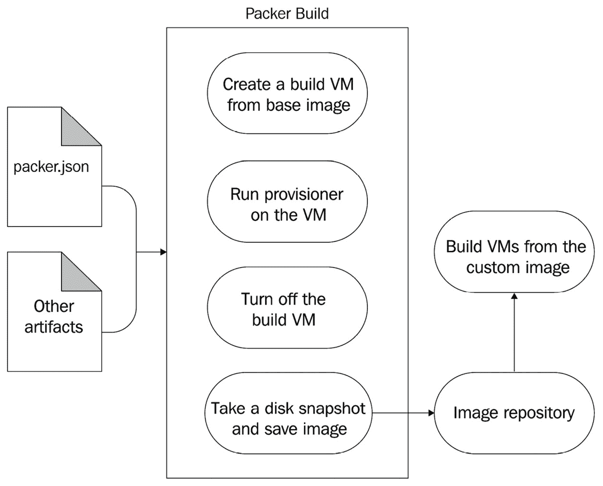
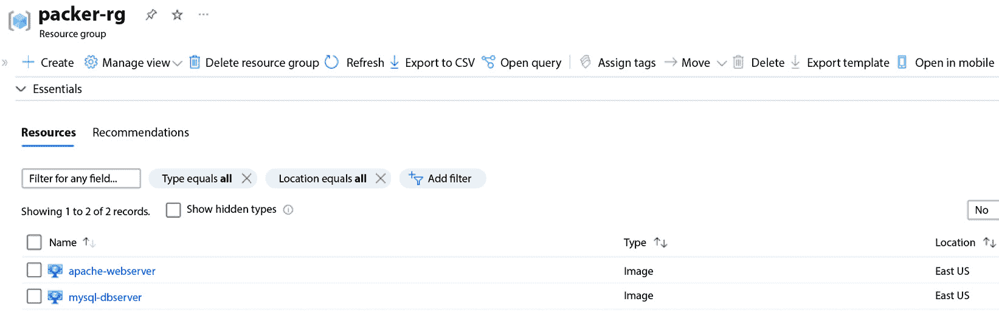
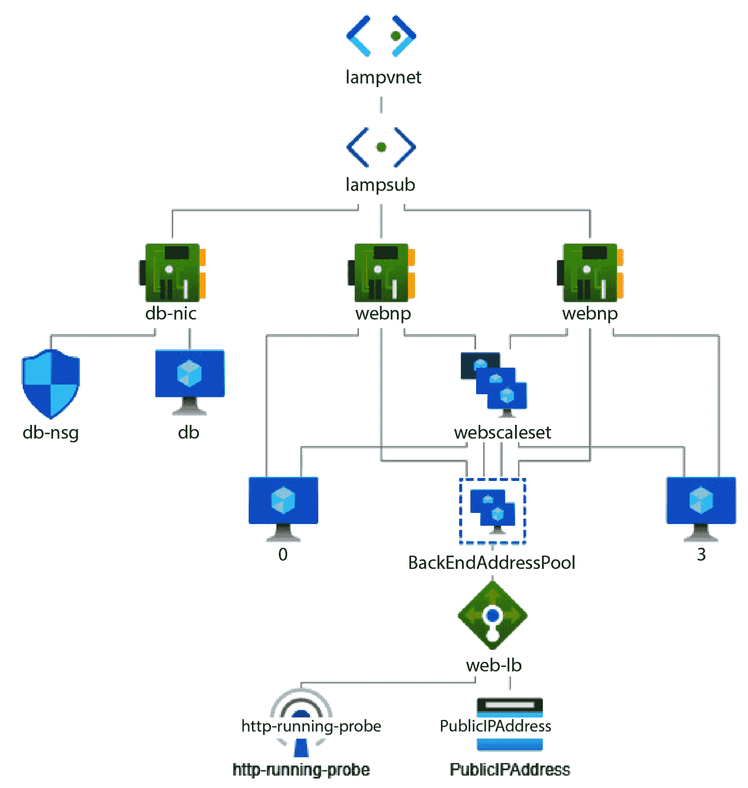
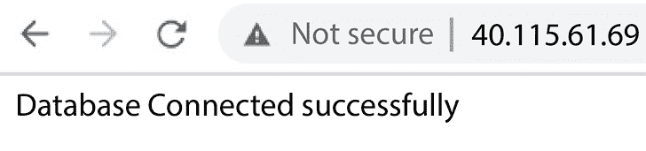

# 第十章：使用 Packer 实现不可变基础设施

在上一章中，我们探讨了使用 Ansible 进行配置管理及其核心概念。我们还在 *第八章* *使用 Terraform 实现基础设施即代码 (IaC)* 中讨论了 Terraform 和 IaC。本章中，我们将介绍使用这两种工具以及另一个工具——**Packer**——来配置基础设施。借助这三种工具，我们将在 Azure 上启动一个可扩展的**Linux**、**Apache**、**MySQL**、**PHP**（**LAMP**）堆栈。

在本章中，我们将涵盖以下主要内容：

+   使用 HashiCorp 的 Packer 实现不可变基础设施

+   创建 Apache 和 MySQL playbook

+   使用 Packer 和 Ansible 提供程序构建 Apache 和 MySQL 镜像

+   使用 Terraform 创建所需的基础设施

# 技术要求

你需要一个有效的 Azure 订阅才能完成本章的练习。目前，Azure 正在提供为期 30 天的免费试用，并赠送 200 美元的免费额度；请在 [`azure.microsoft.com/en-in/free`](https://azure.microsoft.com/en-in/free) 注册。

你还需要克隆以下 GitHub 仓库以完成部分练习：

[`github.com/PacktPublishing/Modern-DevOps-Practices-2e`](https://github.com/PacktPublishing/Modern-DevOps-Practices-2e%0D)

运行以下命令，将仓库克隆到你的主目录中，并使用 `cd` 进入 `ch10` 目录以访问所需的资源：

```
$ git clone https://github.com/PacktPublishing/Modern-DevOps-Practices-2e.git \
   modern-devops
$ cd modern-devops/ch10
```

你还需要在系统上安装**Terraform**和**Ansible**。有关安装和设置 Terraform 和 Ansible 的更多详细信息，请参阅 *第八章* *使用 Terraform 实现基础设施即代码 (IaC)* 和 *第九章* *使用 Ansible 进行配置管理*。

# 使用 HashiCorp 的 Packer 实现不可变基础设施

假设你是一本书的作者，需要对现有版本进行更改。当你需要进行修改，比如改进内容、修正问题并确保书籍内容是最新时，你不会直接编辑现有的书籍。相反，你会创建一个新的版本，加入所需的更新，同时保持现有版本不变，就像这本书的新版一样。这一概念与**不可变基础设施**相契合。

在 IT 和系统管理中，不可变基础设施是一种策略，其中，你不会对现有的服务器或**虚拟机**（**VMs**）进行修改，而是生成具有所需配置的全新实例。这些新实例会替代旧实例，而不是修改它们，类似于当你想要进行更改时，创建一本新版本的书籍。

其工作原理如下：

+   **从零开始构建**：当你需要更新基础设施的一部分时，避免直接对现有的服务器或机器进行修改。相反，你会从一个预先建立的模板（镜像）中创建新的实例，并包含更新的配置。

+   **不可就地修改**：就像不编辑现有的书籍一样，你应避免对当前服务器进行就地修改。这种做法减少了不可预见的变化或配置不一致的风险。

+   **一致性**：不可变基础设施确保每个服务器或实例都是相同的，因为它们都源自相同的模板。这种统一性对于确保可靠性和可预测性非常重要。

+   **滚动更新**：当需要实施更新时，你会以受控的方式系统地用新实例替换旧实例。这将最小化停机时间和潜在风险。

+   **可扩展性**：通过按需生成新实例，扩展基础设施变得轻松自如。这类似于在需求激增或事物过时时发布新版本的书籍。

+   **回滚和恢复**：如果更新过程中出现问题，你可以通过从已知的良好模板重新创建实例，迅速恢复到之前的版本。

因此，将不可变基础设施视为通过创建新的、改进的实例来维护基础设施的一种方式，而不是试图修订或修改现有的实例。这种方法提升了 IT 环境中的一致性、可靠性和可预测性。

为了进一步理解这一点，让我们考虑通过 Terraform 和 Ansible 设置应用程序的传统方法。我们会使用 Terraform 启动基础设施，然后使用 Ansible 在其上应用相关的配置。这就是我们在上一章所做的。虽然这是可行的方法，许多企业都在使用它，但有一种更好的方法，可以通过现代 DevOps 方法和不可变基础设施来实现。

不可变基础设施是一个突破性的概念，它的出现是因为**可变基础设施**所带来的问题。在可变基础设施的方法中，我们通常会在原地更新服务器。因此，当我们使用 Ansible 安装 Apache 并进一步自定义时，我们遵循的是可变过程。我们可能需要定期更新服务器、打补丁、将 Apache 升级到新版本，或更新应用程序代码。

这种方法的问题在于，虽然我们可以使用 Ansible（或类似工具，如**Puppet**、**Chef**和**SaltStack**）很好地管理它，但问题始终存在，即我们在生产环境中进行实时更改，这可能因各种原因出现问题。更糟糕的是，这可能会更新我们最初没有预见到或测试过的内容。我们也可能最终处于部分升级状态，且此状态可能难以回滚。

借助云提供的可扩展基础设施，你可以拥有一个动态的横向扩展模型，虚拟机根据流量进行扩展。因此，你可以实现最佳的基础设施利用率——用最少的投入获得最大的回报！传统方法的问题在于，即使我们使用 Ansible 将配置应用到新机器上，准备好镜像的速度仍然较慢。因此，扩展并不理想，特别是对于流量突增的情况。

不可变基础设施通过采用与我们在容器中使用的相同方法来帮助你解决这些问题——*通过现代的 DevOps 工具和实践将配置直接烘焙到操作系统镜像中*。不可变基础设施通过替换现有虚拟机而不是在原地进行更新来帮助你将经过测试的配置部署到生产环境。它启动更快，回滚也更容易。你还可以通过这种方法对基础设施变更进行版本管理。

**HashiCorp** 提供了一套出色的与基础设施和配置管理相关的 DevOps 产品。HashiCorp 提供 **Packer** 来帮助你通过直接将配置烘焙到虚拟机镜像中，从而创建不可变基础设施，而不是先使用通用的操作系统镜像创建虚拟机，再后续进行自定义的慢速过程。它的工作原理与 Docker 用于烘焙容器镜像的原理类似；也就是说，你定义一个模板（配置文件），指定源镜像、所需配置以及设置镜像上软件所需的任何提供步骤。然后，Packer 会通过创建一个临时实例来构建镜像，应用已定义的配置，并捕获机器镜像以供重复使用。

Packer 提供以下一些关键功能：

+   **多平台支持**：Packer 基于插件架构，因此可以用于为许多不同的云平台和本地平台创建虚拟机镜像，如 VMware、Oracle VirtualBox、Amazon EC2、Azure 的 ARM、Google Cloud Compute 以及 Docker 或其他容器运行时的容器镜像。

+   **自动化**：Packer 自动化镜像创建，消除了手动构建镜像的工作。它还帮助你实现多云战略，因为你可以使用单一配置为各种平台构建镜像。

+   **促进 GitOps**：Packer 配置是机器可读的，并且以 HCL 或 JSON 格式编写，因此可以轻松与代码一起存放。因此，这促进了 GitOps。

+   **与其他工具的集成**：Packer 与其他 HashiCorp 工具（如 Terraform 和 Vagrant）集成良好。

Packer 使用一个临时虚拟机来定制镜像。以下是 Packer 在构建自定义镜像时遵循的过程：

1.  你从 Packer 配置的 HCL 文件开始，定义你想要启动的基础镜像以及构建镜像的地方。你还需要定义用于构建自定义镜像的提供者，如 Ansible，并指定要使用的剧本。

1.  当你运行 Packer 构建时，Packer 使用配置文件中的细节，从基础镜像创建构建虚拟机，运行配置工具进行定制，关闭构建虚拟机，拍摄快照，并将其保存为磁盘镜像。最后，它将镜像保存在镜像仓库中。

1.  你可以使用 Terraform 或其他工具，从自定义镜像构建虚拟机。

下图详细解释了该过程：



图 10.1 – Packer 构建过程

结果是你的应用程序启动迅速，扩展性非常好。对于配置中的任何更改，使用 Packer 和 Ansible 创建一个新的磁盘镜像，然后通过 Terraform 将更改应用到你的资源上。Terraform 会停止旧的虚拟机并启动新的虚拟机，应用新的配置。如果你能将其与容器部署工作流联系起来，你会更好地理解这一点。这就像在虚拟机世界中使用容器工作流一样！但不可变基础设施适合所有人吗？让我们来理解它最适合的场景。

## 何时使用不可变基础设施

决定切换到不可变基础设施是很困难的，特别是当你的运维团队将服务器视为宠物时。大多数人对于删除现有服务器并为每次更新创建新服务器的想法感到疑虑重重。嗯，当你第一次提出这个想法时，你需要做很多说服工作。然而，这并不意味着你必须使用不可变基础设施才能做好 DevOps。最终取决于你的使用场景。

让我们通过分析每种方法的优缺点来更好地理解它们。

### 可变基础设施的优点

我们先从可变基础设施的优点开始：

+   如果管理得当，可变基础设施的升级和变更速度较快。安全补丁的应用也更为迅速。

+   它更易于管理，因为我们不必担心为每次更新构建整个虚拟机镜像并重新部署它。

### 可变基础设施的缺点

接下来，让我们看看可变基础设施的缺点：

+   它最终会导致配置漂移。当人们开始在服务器上手动进行更改并且不使用配置管理工具时，之后你很难知道服务器在某个特定时间点上的状态。然后，你将不得不开始依赖快照。

+   在可变基础设施中，无法进行版本控制，回滚更改也很麻烦。

+   由于技术问题，例如网络不稳定、**apt** 仓库无响应等，可能会出现部分更新的情况。

+   由于更改直接应用到生产环境中，因此存在一定风险。你也有可能陷入一个难以排查的意外状态。

+   由于配置漂移，无法保证当前的配置与版本控制中记录的配置一致。因此，从零开始构建新服务器可能需要手动干预和全面测试。

同样，让我们看看不可变基础设施的优缺点。

### 不可变基础设施的优点

不可变基础设施的优点如下：

+   它消除了配置漂移，因为一旦部署了基础设施，基础设施就不能改变，任何更改都应通过 CI/CD 流程进行。

+   它对 DevOps 友好，因为每个构建和部署过程本质上遵循现代 DevOps 实践。

+   它使得离散版本控制成为可能，因为从镜像构建生成的每个镜像都可以进行版本控制并保存在镜像仓库中。这使得推出和回滚变得更加简单，并促进现代 DevOps 实践，如**金丝雀**和**蓝绿**部署以及 A/B 测试。

+   镜像是预构建和经过测试的，因此我们总是从不可变基础设施中获得可预测的状态。因此，我们从生产实施中减少了很多风险。

+   它有助于云上的水平扩展，因为您现在可以从预构建的镜像创建服务器，使得新的虚拟机启动更快且准备就绪。

### 不可变基础设施的缺点

不可变基础设施的缺点如下：

+   构建和部署不可变基础设施有些复杂，并且增加更新和管理紧急修复的速度比较慢。

+   生成和管理 VM 镜像存在存储和网络开销

因此，当我们看了两种方法的优缺点之后，最终取决于您当前如何进行基础设施管理以及您的最终目标。不可变基础设施有巨大的好处，因此，每个现代 DevOps 工程师都应该理解并尽可能实现它。然而，技术和流程约束阻止了人们的尝试 - 虽然一些约束与技术堆栈有关，但大多数仅与流程和官僚主义有关。不可变基础设施在需要一致可重现和异常可靠的部署时尤为有利。这种方法通过重建整个环境而不是调整现有元素，最小化了配置漂移的风险，并简化了更新过程。在微服务架构、容器编排以及需要快速扩展和能够回滚更改的场景中，特别有优势。

我们都知道 DevOps 不仅仅关乎工具，而是一种应该从高层发源的文化变革。如果不可能使用不可变基础设施，您总是可以在活跃服务器上使用像 Ansible 这样的**配置管理**工具。这在一定程度上使事物变得可管理。

现在，继续讲解 Packer，让我们看看如何安装它。

## 安装 Packer

您可以在各种平台上以多种方式安装 Packer。请参考[`developer.hashicorp.com/packer/downloads`](https://developer.hashicorp.com/packer/downloads)。由于 Packer 作为**apt**包可用，请使用以下命令在 Ubuntu Linux 上安装 Packer：

```
$ wget -O- https://apt.releases.hashicorp.com/gpg | sudo \
gpg --dearmor -o /usr/share/keyrings/hashicorp-archive-keyring.gpg
$ echo "deb [signed-by=/usr/share/keyrings/hashicorp-archive-keyring.gpg] \
https://apt.releases.hashicorp.com $(lsb_release -cs) main" | \ 
sudo tee /etc/apt/sources.list.d/hashicorp.list
$ sudo apt update && sudo apt install -y packer
```

为了验证安装情况，请运行以下命令：

```
$ packer --version
1.9.2
```

如我们所见，Packer 安装成功。我们可以继续进行我们的下一个目标活动——*创建 playbook*。

# 创建 Apache 和 MySQL playbook

由于我们本章的目标是启动一个可扩展的 **LAMP 堆栈**，因此我们必须首先定义将在构建 VM 上运行的 Ansible playbook。我们已经在*第九章*，“使用 Ansible 的配置管理”中为 Apache 和 MySQL 创建了一些角色。我们将在此设置中使用相同的角色。

因此，我们将在 `ch10` 目录中拥有以下目录结构：

```
├── ansible
│   ├── dbserver-playbook.yaml
│   ├── roles
│   │   ├── apache
│   │   ├── common
│   │   └── mysql
│   └── webserver-playbook.yaml
├── packer
│   ├── dbserver.pkr.hcl
│   ├── plugins.pkr.hcl
│   ├── variables.pkr.hcl
│   ├── variables.pkrvars.hcl
│   └── webserver.pkr.hcl
└── terraform
    ├── main.tf
    ├── outputs.tf
    ├── terraform.tfvars
    └── vars.tf
```

我们在 `ansible` 目录中有两个 playbook——`webserver-playbook.yaml` 和 `dbserver-playbook.yaml`。让我们分别看看它们，了解如何为 Ansible 编写 playbook。

`webserver-playbook.yaml` 文件内容如下：

```
---
- hosts: default
  become: true
  roles:
    - common
    - apache
```

`dbserver-playbook.yaml` 文件内容如下：

```
---
- hosts: default
  become: true
  roles:
    - common
    - mysql
```

如我们所见，两个 playbook 的 `hosts` 都设置为 `default`。这是因为我们不会为此 playbook 定义清单。相反，Packer 将使用构建 VM 来构建镜像并动态生成清单。

注意

Packer 还会忽略任务中的任何 `remote_user` 属性，并使用 Ansible provisioner 配置中的用户。

如我们在上一章中已经测试过此配置，现在我们需要做的就是定义 Packer 配置，接下来让我们在下一章节中进行操作。

# 使用 Packer 和 Ansible provisioner 构建 Apache 和 MySQL 镜像

现在，我们将使用 Packer 创建 Apache 和 MySQL 镜像。在定义 Packer 配置之前，我们有几个前提条件，以允许 Packer 构建自定义镜像。

## 前提条件

我们必须为 Packer 创建一个 **Azure 服务主体**，以便它与 Azure 进行交互并构建镜像。

首先，使用以下命令通过 Azure CLI 登录到你的 Azure 帐户：

```
$ az login
```

现在，使用以下命令将订阅设置为我们从 `az login` 命令响应中获取的订阅 ID，并将其存储为环境变量：

```
$ export SUBSCRIPTION_ID=<SUBSCRIPTION_ID>
```

接下来，让我们使用以下命令设置订阅 ID：

```
$ az account set --subscription="${SUBSCRIPTION_ID}"
```

然后，使用以下命令创建具有贡献者访问权限的服务主体：

```
$ az ad sp create-for-rbac --role="Contributor" \
--scopes="/subscriptions/${SUBSCRIPTION_ID}"
{"appId": "00000000-0000-0000-0000-00000", "name": "http://azure-
cli-2021-01-07-05-59-24",  "password": "xxxxxxxxxxxxxxxxxxxxxxxx", "tenant": "00000000-
0000-0000-0000-0000000000000"}
```

我们已经成功创建了服务主体。响应的 JSON 包含了 `appId`、`password` 和 `tenant` 值，我们将在接下来的章节中使用这些值。

注意

你还可以重用我们在*第八章*，“使用 Terraform 进行基础设施即代码 (IaC)”中创建的服务主体。

现在，让我们继续在 `packer/variables.pkrvars.hcl` 文件中设置这些变量的值，具体内容如下：

```
client_id = "<VALUE_OF_APP_ID>"
client_secret = "<VALUE_OF_PASSWORD>"
tenant_id = "<VALUE_OF_TENANT>"
subscription_id = "<SUBSCRIPTION_ID>"
```

我们将在 Packer 构建中使用变量文件。我们还需要一个资源组来存储构建的镜像。

要创建资源组，请运行以下命令：

```
$ az group create -n packer-rg -l eastus
```

现在，让我们继续定义 Packer 配置。

## 定义 Packer 配置

Packer 允许我们在 JSON 和 HCL 文件中定义配置。由于 JSON 已被弃用且 HCL 是推荐格式，因此我们将使用 HCL 来定义 Packer 配置。

要访问本节的资源，请切换到以下目录：

```
$ cd ~/modern-devops/ch10/packer
```

我们将在 `packer` 目录中创建以下文件：

+   `variables.pkr.hcl`：包含我们在应用配置时使用的变量列表

+   `plugins.pkr.hcl`：包含 Packer 插件配置

+   `webserver.pkr.hcl`：包含构建 web 服务器镜像的 Packer 配置

+   `dbserver.pkr.hcl`：包含构建 `dbserver` 镜像的 Packer 配置

+   `variables.pkrvars.hcl`：包含 `variables.pkr.hcl` 文件中定义的 Packer 变量的值

`variables.pkr.hcl` 文件包含以下内容：

```
variable "client_id" {
  type    = string
}
variable "client_secret" {
  type    = string
}
variable "subscription_id" {
  type    = string
}
variable "tenant_id" {
  type    = string
}
```

`variables.pkr.hcl` 文件定义了一个用户变量列表，我们可以在 Packer 配置的 `source` 和 `build` 块中使用。我们定义了四个字符串变量——`client_id`、`client_secret`、`tenant_id` 和 `subscription_id`。我们可以通过使用在上一节中定义的 `variables.pkrvars.hcl` 变量文件来传递这些变量的值。

提示

始终通过外部变量提供敏感数据，如变量文件、环境变量或秘密管理工具，如 HashiCorp 的 Vault。绝不应将敏感信息与代码一起提交。

`plugins.pkr.hcl` 文件包含以下块：

`packer`：此部分定义了 Packer 的通用配置。在此案例中，我们定义了构建镜像所需的插件。这里定义了两个插件——`ansible` 和 `azure`。插件包含 `source` 和 `version` 属性，包含与技术组件交互所需的一切：

```
packer {
  required_plugins {
    ansible = {
      source  = "github.com/hashicorp/ansible"
      version = "=1.1.0"
    }
    azure = {
      source  = "github.com/hashicorp/azure"
      version = "=1.4.5"
    }
  }
}
```

`webserver.pkr.hcl` 文件包含以下几个部分：

+   `source`：`source` 块包含我们用于构建虚拟机的配置。由于我们正在构建一个 `azure-arm` 镜像，我们将源定义如下：

```
source "azure-arm" "webserver" {
  client_id                         = var.client_id
  client_secret                     = var.client_secret
  image_offer                       = "UbuntuServer"
  image_publisher                   = "Canonical"
  image_sku                         = "18.04-LTS"
  location                          = "East US"
  managed_image_name                = "apache-webserver"
  managed_image_resource_group_name = "packer-rg"
  os_type                           = "Linux"
  subscription_id                   = var.subscription_id
  tenant_id                         = var.tenant_id
  vm_size                           = "Standard_DS2_v2"
azure-arm and consists of client_id, client_secret, tenant_id, and subscription_id, which helps Packer authenticate with the Azure API server. These attributes’ values are sourced from the variables.pkr.hcl file.
			Tip
			The managed image name can also contain a version. That will help you build a new image for every new version you want to deploy.

				*   `build`: The `build` block consists of `sources` and `provisioner` attributes. It contains all the sources we want to use, and the `provisioner` attribute allows us to configure the build VM to achieve the desired configuration. We’ve defined the following `build` block:

```

build {

sources = ["source.azure-arm.webserver"]

provisioner "ansible" {

playbook_file = "../ansible/webserver-playbook.yaml"

}

../ansible/webserver-playbook.yaml。

            提示

            你可以在 `build` 块中指定多个源，每个源可以是相同或不同类型。类似地，我们可以拥有多个提供者，它们会并行执行。因此，如果你想为多个云提供商构建相同的配置，可以为每个云提供商指定多个源。

            类似地，我们定义了以下 `dbserver.pkr.hcl` 文件：

```
source "azure-arm" "dbserver" {
  ...
  managed_image_name                = "mysql-dbserver"
  ...
}
build {
  sources = ["source.azure-arm.dbserver"]
  provisioner "ansible" {
    playbook_file = "../ansible/dbserver-playbook.yaml"
  }
}
```

            `source` 块的配置与 web 服务器相同，除了 `managed_image_name`。`build` 块也类似于 web 服务器，但它使用的是 `../ansible/dbserver-playbook.yaml` playbook。

            现在，让我们看看 Packer 的工作流以及如何使用它来构建镜像。

            构建镜像的 Packer 工作流

            Packer 工作流包括两个步骤——`init` 和 `build`。

            正如我们所知，Packer 使用插件与云服务商进行交互；因此，我们需要安装这些插件。为此，Packer 提供了`init`命令。

            让我们使用以下命令初始化并安装所需的插件：

```
$ packer init .
Installed plugin github.com/hashicorp/ansible v1.1.0 in "~/.config/packer/plugins/github.
com/hashicorp/ansible/packer-plugin-ansible_v1.1.0_x5.0_linux_amd64"
Installed plugin github.com/hashicorp/azure v1.4.5 in "~/.config/packer/plugins/github.
com/hashicorp/azure/packer-plugin-azure_v1.4.5_x5.0_linux_amd64"
```

            如我们所见，插件现在已安装。让我们继续构建镜像。

            我们使用`build`命令通过 Packer 创建镜像。由于我们需要传递值给变量，我们将通过命令行参数指定变量值，如以下命令所示：

```
$ packer build -var-file="variables.pkrvars.hcl" .
```

            Packer 将使用`webserver`和`dbserver`配置构建并行堆栈。

            Packer 首先创建临时资源组来启动暂存的 VM：

```
==> azure-arm.webserver: Creating resource group ...
==> azure-arm.webserver:  -> ResourceGroupName : 'pkr-Resource-Group-7dfj1c2iej'
==> azure-arm.webserver:  -> Location          : 'East US'
==> azure-arm.dbserver: Creating resource group ...
==> azure-arm.dbserver:  -> ResourceGroupName : 'pkr-Resource-Group-11xqpuxsm3'
==> azure-arm.dbserver:  -> Location          : 'East US'
```

            Packer 接着验证并部署部署模板，并获取暂存 VM 的 IP 地址：

```
==> azure-arm.webserver: Validating deployment template ...
==> azure-arm.webserver: Deploying deployment template ...
==> azure-arm.webserver:  -> DeploymentName : 'pkrdp7dfj1c2iej'
==> azure-arm.webserver: Getting the VM's IP address ...
==> azure-arm.webserver:  -> IP Address : '104.41.158.85'
==> azure-arm.dbserver: Validating deployment template ...
==> azure-arm.dbserver: Deploying deployment template ...
==> azure-arm.dbserver:  -> DeploymentName : 'pkrdp11xqpuxsm3'
==> azure-arm.dbserver: Getting the VM's IP address ...
==> azure-arm.dbserver:  -> IP Address : '40.114.7.11'
```

            然后，Packer 使用 SSH 连接到暂存的 VM，并使用 Ansible 为其配置：

```
==> azure-arm.webserver: Waiting for SSH to become available...
==> azure-arm.dbserver: Waiting for SSH to become available...
==> azure-arm.webserver: Connected to SSH!
==> azure-arm.dbserver: Connected to SSH!
==> azure-arm.webserver: Provisioning with Ansible...
==> azure-arm.dbserver: Provisioning with Ansible...
==> azure-arm.webserver: Executing Ansible: ansible-playbook -e packer_build_
name="webserver" -e packer_builder_type=azure-arm --ssh-extra-args '-o IdentitiesOnly=yes' 
-e ansible_ssh_private_key_file=/tmp/ansible-key328774773 -i /tmp/packer-provisioner-
ansible747322992 ~/ansible/webserver-playbook.yaml
==> azure-arm.dbserver: Executing Ansible: ansible-playbook -e packer_build_
name="dbserver" -e packer_builder_type=azure-arm --ssh-extra-args '-o IdentitiesOnly=yes' 
-e ansible_ssh_private_key_file=/tmp/ansible-key906086565 -i /tmp/packer-provisioner-
ansible3847259155 ~/ansible/dbserver-playbook.yaml
azure-arm.webserver: PLAY RECAP *********************************************************
**
azure-arm.webserver: default: ok=7 changed=5 unreachable=0 failed=0 skipped=0 rescued=0 
ignored=0
azure-arm.dbserver: PLAY RECAP ***********************************************************
azure-arm.dbserver: default: ok=11 changed=7 unreachable=0 failed=0 skipped=0 rescued=0 
ignored=0
```

            一旦 Ansible 运行完成，Packer 会获取磁盘详情，捕获镜像，并在我们在 Packer 配置中指定的资源组中创建机器镜像：

```
==> azure-arm.webserver: Querying the machine's properties
==> azure-arm.dbserver: Querying the machine's properties
==> azure-arm.webserver: Querying the machine's additional disks properties ...
==> azure-arm.dbserver: Querying the machine's additional disks properties ...
==> azure-arm.webserver: Powering off machine ...
==> azure-arm.dbserver: Powering off machine ...
==> azure-arm.webserver: Generalizing machine ...
==> azure-arm.dbserver: Generalizing machine ...
==> azure-arm.webserver: Capturing image ...
==> azure-arm.dbserver: Capturing image ...
==> azure-arm.webserver: -> Image ResourceGroupName: 'packer-rg'
==> azure-arm.dbserver: -> Image ResourceGroupName: 'packer-rg'
==> azure-arm.webserver: -> Image Name: 'apache-webserver'
==> azure-arm.webserver:  -> Image Location: 'East US'
==> azure-arm.dbserver: -> Image Name: 'mysql-dbserver'
==> azure-arm.dbserver:  -> Image Location: 'East US'
```

            最后，它移除部署对象和它所创建的临时资源组：

```
==> azure-arm.webserver: Deleting Virtual Machine deployment and its attached resources...
==> azure-arm.dbserver: Deleting Virtual Machine deployment and its attached resources...
==> azure-arm.webserver: Cleanup requested, deleting resource group ...
==> azure-arm.dbserver: Cleanup requested, deleting resource group ...
==> azure-arm.webserver: Resource group has been deleted.
==> azure-arm.dbserver: Resource group has been deleted.
```

            然后，它会提供它所生成的工件列表：

```
==> Builds finished. The artifacts of successful builds are:
--> azure-arm: Azure.ResourceManagement.VMImage:
OSType: Linux
ManagedImageResourceGroupName: packer-rg
ManagedImageName: apache-webserver
ManagedImageId: /subscriptions/Id/resourceGroups/packer-rg/providers/Microsoft.Compute/
images/apache-webserver
ManagedImageLocation: West Europe
OSType: Linux
ManagedImageResourceGroupName: packer-rg
ManagedImageName: mysql-dbserver
ManagedImageId: /subscriptions/Id/resourceGroups/packer-rg/providers/Microsoft.Compute/
images/mysql-dbserver
```

            如果我们查看`packer-rg`资源组，我们会发现其中有两个 VM 镜像：

            

            图 10.2 – Packer 自定义镜像

            我们已经成功地用 Packer 构建了自定义镜像！

            小贴士

            一旦镜像在资源组中创建，就无法使用相同的托管镜像名称重新运行 Packer。这是因为我们不希望意外覆盖现有镜像。虽然你可以通过使用`-force`标志与`packer build`来覆盖它，但应该在镜像名称中包含版本号，以便在资源组中允许多个版本的镜像存在。例如，使用`apache-webserver-0.0.1`而不是`apache-webserver`。

            现在是使用这些镜像并用它们创建我们基础设施的时候了。

            使用 Terraform 创建所需的基础设施

            我们的目标是构建一个可扩展的 LAMP 堆栈，因此我们将定义一个我们创建的`apache-webserver`镜像和一个使用`mysql-dbserver`镜像的虚拟机。VM 规模集是一个 VM 的自动扩展组，它将根据流量横向扩展和收缩，就像我们在 Kubernetes 中使用容器时做的一样。

            我们将创建以下资源：

                +   一个名为`lamp-rg`的新资源组

                +   一个名为`lampvnet`的虚拟网络位于资源组内

                +   一个名为`lampsub`的子网，位于`lampvnet`内

                +   在子网内，我们创建了一个包含以下内容的`db-nic`：

    +   一个名为`db-nsg`的网络安全组

    +   一个名为`db`的虚拟机，使用自定义的`mysql-dbserver`镜像

                +   然后，我们创建一个包括以下内容的 VM 规模集：

    +   一个名为`webnp`的网络配置文件

    +   一个后端地址池

    +   一个名为`web-lb`的负载均衡器

    +   附加到`web-lb`的公共 IP 地址

    +   一个检查`80`端口健康状况的 HTTP 探针

            以下图形说明了拓扑结构：

            

            图 10.3 – 可扩展 LAMP 堆栈拓扑图

            要访问本节的资源，请切换到以下目录：

```
$ cd ~/modern-devops/ch10/terraform
```

            我们使用以下 Terraform 模板，`main.tf`，来定义配置。

            我们首先定义 Terraform 提供程序：

```
terraform {
  required_providers {
    azurerm = {
      source  = "azurerm"
    }
  }
}
provider "azurerm" {
  subscription_id = var.subscription_id
  client_id       = var.client_id
  client_secret   = var.client_secret
  tenant_id       = var.tenant_id
}
```

            然后我们定义自定义镜像数据源，以便在我们的配置中使用它们：

```
data "azurerm_image" "websig" {
  name            = "apache-webserver"
  resource_group_name = "packer-rg"
}
data "azurerm_image" "dbsig" {
  name            = "mysql-dbserver"
  resource_group_name = "packer-rg"
}
```

            然后我们定义资源组、虚拟网络和子网：

```
resource "azurerm_resource_group" "main" {
  name     = var.rg_name
  location = var.location
}
resource "azurerm_virtual_network" "main" {
  name                = "lampvnet"
  address_space       = ["10.0.0.0/16"]
  location            = var.location
  resource_group_name = azurerm_resource_group.main.name
}
resource "azurerm_subnet" "main" {
  name                 = "lampsub"
  resource_group_name  = azurerm_resource_group.main.name
  virtual_network_name = azurerm_virtual_network.main.name
  address_prefixes       = ["10.0.2.0/24"]
}
```

            由于 Apache Web 服务器将位于网络负载均衡器后面，我们将定义负载均衡器和我们将附加到其上的公共 IP 地址：

```
resource "azurerm_public_ip" "main" {
  name                = "webip"
  location            = var.location
  resource_group_name = azurerm_resource_group.main.name
  allocation_method   = "Static"
  domain_name_label   = azurerm_resource_group.main.name
}
resource "azurerm_lb" "main" {
  name                = "web-lb"
  location            = var.location
  resource_group_name = azurerm_resource_group.main.name
  frontend_ip_configuration {
    name                 = "PublicIPAddress"
    public_ip_address_id = azurerm_public_ip.main.id
  }
  tags = {}
}
```

            然后我们将定义一个后端地址池，附加到负载均衡器，以便我们可以在 Apache 虚拟机规模集中使用它：

```
resource "azurerm_lb_backend_address_pool" "bpepool" {
  loadbalancer_id     = azurerm_lb.main.id
  name                = "BackEndAddressPool"
}
```

            我们将在端口`80`上定义一个 HTTP 探测器，用于健康检查，并将其附加到负载均衡器：

```
resource "azurerm_lb_probe" "main" {
  loadbalancer_id     = azurerm_lb.main.id
  name                = "http-running-probe"
  port                = 80
}
```

            我们需要在负载均衡器上设置`80`端口，并将其与后端池虚拟机的`80`端口关联。我们还将在此配置中附加 HTTP 健康检查探测器：

```
resource "azurerm_lb_rule" "lbnatrule" {
  resource_group_name            = azurerm_resource_group.main.name
  loadbalancer_id                = azurerm_lb.main.id
  name                           = "http"
  protocol                       = "Tcp"
  frontend_port                  = 80
  backend_port                   = 80
  backend_address_pool_ids       = [ azurerm_lb_backend_address_pool.bpepool.id ]
  frontend_ip_configuration_name = "PublicIPAddress"
  probe_id                       = azurerm_lb_probe.main.id
}
```

            现在，我们将在资源组内使用自定义镜像和之前定义的负载均衡器来定义虚拟机规模集：

```
resource "azurerm_virtual_machine_scale_set" "main" {
  name                = "webscaleset"
  location            = var.location
  resource_group_name = azurerm_resource_group.main.name
  upgrade_policy_mode = "Manual"
  sku {
    name     = "Standard_DS1_v2"
    tier     = "Standard"
    capacity = 2
  }
  storage_profile_image_reference {
    id=data.azurerm_image.websig.id
  }
```

            然后我们继续定义操作系统磁盘和数据磁盘：

```
  storage_profile_os_disk {
    name              = ""
    caching           = "ReadWrite"
    create_option     = "FromImage"
    managed_disk_type = "Standard_LRS"
  }
  storage_profile_data_disk {
    lun          = 0
    caching        = "ReadWrite"
    create_option  = "Empty"
    disk_size_gb   = 10
  }
```

            操作系统配置文件定义了我们如何登录到虚拟机：

```
  os_profile {
    computer_name_prefix = "web"
    admin_username       = var.admin_username
    admin_password       = var.admin_password
  }
  os_profile_linux_config {
    disable_password_authentication = false
  }
```

            然后我们定义一个网络配置文件，将规模集与之前定义的负载均衡器关联：

```
  network_profile {
    name    = "webnp"
    primary = true
    ip_configuration {
      name      = "IPConfiguration"
      subnet_id = azurerm_subnet.main.id
      load_balancer_backend_address_pool_ids = [azurerm_lb_backend_address_pool.bpepool.id]
      primary = true
    }
  }
  tags = {}
}
```

            现在，进入数据库配置，我们将首先为数据库服务器定义一个网络安全组，以允许从虚拟网络内的内部服务器访问端口`22`和`3306`：

```
resource "azurerm_network_security_group" "db_nsg" {
    name                = "db-nsg"
    location            = var.location
    resource_group_name = azurerm_resource_group.main.name
    security_rule {
        name                       = "SSH"
        priority                   = 1001
        direction                  = "Inbound"
        access                     = "Allow"
        protocol                   = "Tcp"
        source_port_range          = "*"
        destination_port_range     = "22"
        source_address_prefix      = "*"
        destination_address_prefix = "*"
    }
    security_rule {
        name                       = "SQL"
        priority                   = 1002
        direction                  = "Inbound"
        access                     = "Allow"
        protocol                   = "Tcp"
        source_port_range          = "*"
        destination_port_range     = "3306"
        source_address_prefix      = "*"
        destination_address_prefix = "*"
    }
    tags = {}
}
```

            然后我们定义一个网络接口卡（NIC）为虚拟机提供内部 IP 地址：

```
resource "azurerm_network_interface" "db" {
  name                = "db-nic"
  location            = var.location
  resource_group_name = azurerm_resource_group.main.name
  ip_configuration {
    name                          = "db-ipconfiguration"
    subnet_id                     = azurerm_subnet.main.id
    private_ip_address_allocation = "Dynamic"
  }
}
```

            然后我们将网络安全组与网络接口关联：

```
resource "azurerm_network_interface_security_group_association" "db" {
    network_interface_id      = azurerm_network_interface.db.id
    network_security_group_id = azurerm_network_security_group.db_nsg.id
}
```

            最后，我们将使用自定义镜像定义数据库虚拟机：

```
resource "azurerm_virtual_machine" "db" {
  name                  = "db"
  location              = var.location
  resource_group_name   = azurerm_resource_group.main.name
  network_interface_ids = [azurerm_network_interface.db.id]
  vm_size               = var.vm_size
  delete_os_disk_on_termination = true
  storage_image_reference {
    id   = data.azurerm_image.dbsig.id
  }
  storage_os_disk {
    name              = "db-osdisk"
    caching           = "ReadWrite"
    create_option     = "FromImage"
    managed_disk_type = "Standard_LRS"
  }
  os_profile {
    computer_name  = "db"
    admin_username = var.admin_username
    admin_password = var.admin_password
  }
  os_profile_linux_config {
    disable_password_authentication = false
  }
  tags = {}
}
```

            现在，既然我们已经定义了所需的一切，请填写`terraform.tfvars`文件中的必要信息，然后使用以下命令初始化我们的 Terraform 工作区：

```
$ terraform init
```

            由于 Terraform 已成功初始化，请使用以下命令应用 Terraform 配置：

```
$ terraform apply
Apply complete! Resources: 13 added, 0 changed, 0 destroyed.
Outputs:
web_ip_addr = "40.115.61.69"
```

            由于 Terraform 已应用配置并提供了负载均衡器 IP 地址作为输出，我们使用该地址访问 Web 服务器：

            

            图 10.4 – LAMP 堆栈正常工作

            当我们收到`数据库成功连接`消息时，我们看到配置成功！我们已成功使用 Packer、Ansible 和 Terraform 创建了一个可扩展的 LAMP 堆栈。它结合了*基础设施即代码（IaC）*、*配置即代码*、*不可变基础设施* 和现代 DevOps 实践，创建了一个无须人工干预的无缝环境。

            总结

            在本章中，我们介绍了使用 Packer 构建不可变基础设施。我们使用 Packer 配合 Ansible 提供程序构建了用于 Apache 和 MySQL 的自定义镜像。然后使用这些自定义镜像通过 Terraform 创建了一个可扩展的 LAMP 堆栈。本章向你介绍了现代 DevOps 的时代，在这个时代中，一切都实现了自动化。我们遵循相同的原则来构建和部署各种类型的基础设施，无论是容器还是虚拟机。在下一章中，我们将讨论 DevOps 中最重要的主题之一——**持续集成**。

            问题

                1.  不可变基础设施有助于避免配置漂移。（正确/错误）

                1.  最佳实践是从外部变量（如环境变量）或像 HashiCorp 的 Vault 这样的秘密管理工具中获取敏感数据。（正确/错误）

                1.  我们需要对现有的 playbook 做哪些修改，以便 Packer 能够使用它们？

    A. 从当前工作目录中删除任何现有的 `ansible.cfg` 文件。

    B. 从当前工作目录中删除任何主机文件。

    C. 在 playbook 中将 `hosts` 属性更新为默认值。

    D. 以上都不是。

                1.  以下哪些是使用 Ansible 提供程序与 Packer 配合使用时的限制？（选择两个）

    A. 你不能将 Jinja2 宏原样传递到 Ansible playbook 中。

    B. 你不能在 Ansible playbook 中定义 `remote_user`。

    C. 你不能在 Ansible playbook 中使用 Jinja2 模板。

    D. 你不能在 Ansible playbook 中使用角色和变量。

                1.  在命名托管镜像时，我们应考虑哪些因素？（选择两个）

    A. 尽可能具体地命名镜像。

    B. 将版本作为镜像的一部分。

    C. 不要将版本作为镜像名称的一部分。相反，总是使用 `-force` 标志来构建 Packer。

                1.  使用多个提供程序时，如何将配置应用于构建虚拟机？

    A. 按照 HCL 文件中的顺序逐一执行

    B. 并行

                1.  我们可以使用一组 Packer 文件，在多个云环境中构建具有相同配置的镜像。（正确/错误）

                1.  虚拟机规模集提供了哪些功能？（选择两个）

    A. 它帮助你根据流量水平扩展虚拟机实例。

    B. 它帮助你自动修复故障虚拟机。

    C. 它帮助你进行金丝雀发布。

    D. 以上都不是。

            答案

                1.  正确

                1.  正确

                1.  C

                1.  A、B

                1.  A、B

                1.  B

                1.  正确

                1.  A、B、C

```

```

# 第四部分：使用 GitOps 交付应用程序

本节是本书的核心内容，阐明了在云中有效实施现代 DevOps 的各种工具和技术。以 GitOps 作为核心指导原则，我们将探讨各种工具和技术，帮助我们不断地构建、测试、保护并将应用程序部署到开发、测试和生产环境中。

本部分包含以下章节：

+   *第十一章*，*使用 GitHub Actions 和 Jenkins 的持续集成*

+   *第十二章*，*使用 Argo CD 的持续部署/交付*

+   *第十三章*，*确保和测试你的 CI/CD 流水线*
