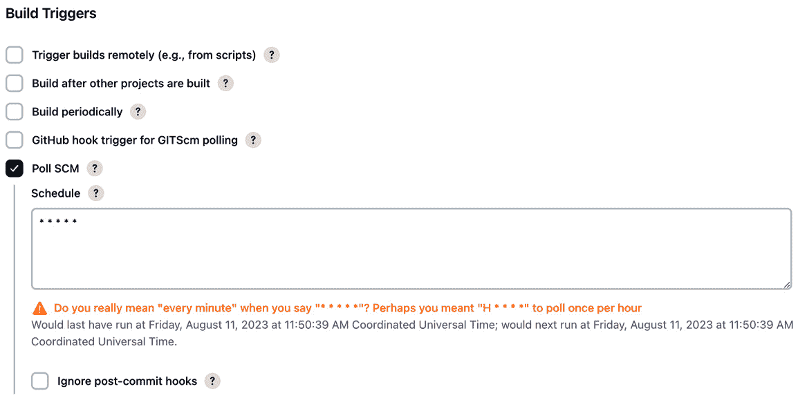

# 第十一章：使用 GitHub Actions 和 Jenkins 进行持续集成

在前面的章节中，我们讨论了几个单独的工具，这些工具将帮助我们实现现代 DevOps 的多个方面。现在，是时候看看如何将我们学到的所有工具和概念结合起来，创建一个**持续集成**（**CI**）流水线了。首先，我们将介绍一个基于微服务的示例博客应用程序——**Blog App**，然后看看一些流行的开源和基于 SaaS 的工具，它们可以帮助我们快速启动 CI。我们将从**GitHub Actions**开始，然后转到**Jenkins**与**Kaniko**。对于每个工具，我们都会为 Blog App 实现 CI。我们会尽量保持实现与云平台无关。由于我们从一开始就使用了**GitOps**方法，因此这里也将使用相同的方法。最后，我们将讨论一些与构建性能相关的最佳实践。

在本章中，我们将涵盖以下主要主题：

+   自动化的重要性

+   示例基于微服务的博客应用程序介绍——Blog App

+   使用 GitHub Actions 构建 CI 流水线

+   在**Kubernetes**上可扩展的 Jenkins 与 Kaniko

+   使用触发器自动化构建

+   构建性能的最佳实践

# 技术要求

对于本章，你需要克隆以下 GitHub 仓库，以便进行一些练习：[`github.com/PacktPublishing/Modern-DevOps-Practices-2e`](https://github.com/PacktPublishing/Modern-DevOps-Practices-2e)。

运行以下命令，将仓库克隆到你的主目录，并`cd`进入`ch11`目录以访问所需的资源：

```
$ git clone https://github.com/PacktPublishing/Modern-DevOps-Practices-2e.git \
modern-devops
$ cd modern-devops/ch11
```

那么，让我们开始吧！

# 自动化的重要性

自动化就像是有一支高效的机器人团队在为你工作，毫不疲倦地处理重复性、耗时且容易出错的任务。让我们简化一下自动化的意义：

+   **效率**：把它想象成拥有一个神奇的助手，可以在你完成任务的时间里迅速完成。自动化加速了重复性任务的执行，处理数据和运行命令比人类快得多。

+   **一致性**：人类可能会感到疲倦或分心，导致任务执行的不一致性。自动化保证任务每次都能按照预定规则一致地完成。

+   **准确性**：自动化操作没有人类可能经历的疲劳或失误。它精确地遵循指令，最小化错误发生的可能性，从而避免可能带来高昂代价的后果。

+   **规模**：无论是管理一个系统还是一千个系统，自动化都能轻松扩展操作，而无需额外的人力资源。

+   **节省成本**：通过减少对人工的依赖，自动化在时间和人力资源上带来了显著的成本节省。

+   **风险降低**：某些任务，例如数据备份和安全检查，虽然至关重要，但可能被人类忽视或跳过。自动化确保这些任务得到持续执行，从而减少风险。

+   **更快的响应**：自动化能够实时检测并响应问题。例如，它可以自动重启崩溃的服务器，或在高流量期间调整资源分配，确保用户体验不间断。

+   **资源分配**：自动化日常任务解放了人力资源，使其可以集中精力处理更具战略性和创造性的工作，这些工作需要批判性思维和决策能力。

+   **合规性**：自动化执行并监控政策和法规的合规性，减少法律和监管方面的潜在问题。

+   **数据分析**：自动化迅速处理和分析大量数据，促进数据驱动的决策和洞察。

+   **24/7 运营**：自动化不知疲倦地全天候工作，确保持续运营和可用性。

+   **适应性**：自动化可以重新编程以适应不断变化的需求和环境，使其具有灵活性和面向未来的能力。

在技术领域，自动化是现代 IT 运营的基石，涵盖了从自动化软件部署到管理云资源和配置网络设备。它使组织能够简化流程、提高可靠性，并在快速变化的数字化环境中保持竞争力。

本质上，自动化类似于一个极其高效、无错误、全天候运作的劳动力，使个人和组织能够以更少的努力完成更多的工作。

为了从自动化中获益，项目管理职能正在迅速被稀释，软件开发团队正在转型为敏捷团队，以迭代的方式交付 Sprint。因此，如果有新的需求，我们不会等到整个需求签署完毕后才开始设计、开发、QA 等工作。而是将软件拆解为可操作的功能模块，并以较小的部分交付，以便迅速获得价值和客户反馈。这意味着快速的软件开发，减少失败的风险。

好吧，团队已经变得更加敏捷，开发软件的速度更快了。但在**软件开发生命周期**（**SDLC**）的过程中，许多任务仍然是手动进行的，比如一些团队只有在完成整个开发周期后才生成代码构建，并在之后发现大量的错误。追踪最初是什么原因导致问题变得非常困难。

如果你在将代码提交到源代码控制系统时，就能知道构建失败的原因怎么办？如果你能在构建执行时立即理解软件未通过某些测试怎么办？嗯，这就是 CI 的精髓。

持续集成（CI）是一个过程，开发人员频繁地将代码提交到源代码仓库，可能一天多次。后台的自动化工具可以检测这些提交，然后构建、运行一些测试，并提前告知你提交是否引发了问题。这意味着开发人员、测试人员、产品负责人、运维团队以及所有相关人员都会知道是什么引发了问题，开发人员可以迅速修复。这在软件开发中形成了一个反馈循环。过去我们在软件开发中有一个手动的反馈循环，但它非常缓慢。所以，要么你得等很久才能开始下一任务，要么你做错了事情直到发现时已经为时太晚，无法撤销之前所做的所有工作。这样就增加了之前所有工作的返工量。

众所周知，在 SDLC（软件开发生命周期）中，越早修复漏洞成本越低。因此，持续集成（CI）的目标是尽早在 SDLC 中提供代码质量的持续反馈。这可以为开发人员和组织节省大量时间和金钱，避免在大部分代码已经经过测试时还需要修复发现的漏洞。因此，CI 帮助软件开发团队更快地开发出更好的软件。

既然我们提到了敏捷开发，接下来简要讨论一下它与 DevOps 的比较。敏捷是一种工作方式，对于实现敏捷所需的工具、技术和自动化并未明确说明。DevOps 是敏捷思维的延伸，帮助你有效地实施敏捷。DevOps 高度关注自动化，力求在可能的情况下避免手动操作。它还鼓励软件交付的自动化，旨在加强或替代传统工具和框架。随着现代 DevOps 的出现，特定的工具、技术和最佳实践简化了开发人员、质量保证人员和运维人员的工作。现代公共云平台和 DevOps 为团队提供了即用型的动态基础设施，帮助企业减少上市时间，并构建可扩展、弹性强、性能优越的基础设施，确保企业的系统在最小的停机时间内持续运行。

在第一章介绍现代 DevOps 时，我们提到它通常应用于现代云原生应用程序。为了演示这一点，我构建了一个基于微服务的博客应用示例。我们将在本书的这一章和未来的章节中使用该应用，以确保使用现代 DevOps 工具和实践无缝开发和交付该应用。接下来我们将查看这个示例应用。

# 微服务架构博客应用介绍 – 博客应用

博客应用是一个基于现代微服务架构的博客 Web 应用，允许用户创建、管理和互动博客帖子。它既适用于作者，也适用于读者。用户可以使用他们的电子邮件地址注册该平台，并开始写博客帖子。读者可以公开查看由多个作者创建的所有博客帖子，登录用户还可以提供评论和评分。

该应用是用一个流行的基于 Python 的 Web 框架**Flask**编写的，并使用**MongoDB**作为数据库。该应用被拆分成多个微服务，用于用户、帖子、评论和评分管理。还有一个独立的前端微服务，供用户进行交互。让我们来看看每个微服务：

+   **用户管理**：用户管理微服务提供创建用户账户、更新个人资料（姓名和密码）和删除用户账户的接口。

+   **帖子管理**：帖子管理微服务提供创建、列出、获取、更新和删除帖子的接口。

+   **评论管理**：评论管理微服务允许用户在帖子上添加评论，并对其进行更新和删除。它在内部与评分管理微服务交互，以管理与评论一起提供的评分。

+   **评分管理**：评分管理微服务管理与特定评论相关联的帖子评分。该微服务在内部由评论管理微服务调用，并不会暴露给前端微服务。

+   **前端**：前端微服务是一个基于**Bootstrap**构建的 Python Flask 用户界面应用，为用户提供丰富的交互式界面。它允许用户注册、登录、查看帖子并在帖子之间导航、编辑帖子、添加和更新评论以及管理个人资料。该微服务通过 HTTP 请求与后端微服务无缝交互。

**用户**、**帖子**、**评论**和**评分**微服务与**MongoDB**数据库进行交互。

下图展示了各服务之间的交互关系：


图 11.1 – 博客应用服务与交互

如我们所见，单个微服务之间相互解耦，因此可以独立扩展。它也很健壮，因为如果某个特定微服务出现故障，应用的其他部分仍然可以继续工作。各个微服务可以作为独立的组件进行开发和部署，从而增强了应用的灵活性和可维护性。这个应用是利用微服务构建现代功能丰富的 Web 应用的一个优秀示例。

现在，让我们为这个应用实现持续集成（CI）。为了实现 CI，我们需要一个 CI 工具。在接下来的部分中，我们将介绍一些流行的工具以及你可以选择的选项。

# 使用 GitHub Actions 构建 CI 管道

**GitHub Actions** 是一款基于 SaaS 的工具，随**GitHub**提供。因此，当你创建 GitHub 仓库时，开箱即用即可访问此服务。因此，GitHub Actions 是适合 CI/CD 新手的最佳工具之一，特别适合那些想要快速入门的人。GitHub Actions 可以帮助你自动化任务、构建、测试和部署代码，甚至简化工作流程，极大地简化开发者的工作。

以下是 GitHub Actions 能为你做的事情：

+   **CI**：GitHub Actions 可以在你推送更改到仓库时自动构建和测试代码。这确保了你的代码始终无误，并准备好进行部署。

+   **CD**：你可以使用 GitHub Actions 将应用程序部署到各种托管平台，如 AWS、Azure 和 GCP。这使你能够快速高效地向用户交付更新。

+   **工作流自动化**：你可以使用 GitHub Actions 创建自定义工作流，自动化开发过程中的重复任务。例如，你可以自动标记和分配问题，在特定事件触发时启动构建，或向团队发送通知。

+   **自定义脚本**：GitHub Actions 允许你运行自定义脚本和命令，完全控制自动化任务。无论是需要编译代码、运行测试还是执行部署脚本，GitHub Actions 都能处理。

+   `npm`用于部署到流行的云提供商。你可以轻松地将这些操作集成到你的工作流中。

+   **定时任务**：你可以安排在特定时间或间隔运行某些操作。这对于生成报告、发送提醒或在非高峰时段进行维护等任务非常有用。

+   **多平台支持**：GitHub Actions 支持多种编程语言、操作系统和云环境，这意味着你可以轻松构建和部署面向不同平台的应用程序。

+   **集成**：GitHub Actions 与 GitHub 仓库无缝集成，使其成为开发环境的自然扩展。你可以直接在仓库中使用 YAML 文件定义工作流。

GitHub Actions 通过自动化日常任务、确保代码质量并简化软件开发生命周期（SDLC），彻底改变了开发人员的工作方式。它是提升生产力和保持高质量代码的团队和个人开发者的宝贵工具。

现在，让我们为我们的示例博客应用创建一个 CI 管道。博客应用由多个微服务组成，每个微服务都运行在单独的**Docker**容器中。我们还为每个微服务编写了单元测试，可以运行这些测试来验证代码更改。如果测试通过，构建就会通过；否则，它将失败。

要访问本节的资源，请`cd`进入以下目录：

```
$ cd ~/modern-devops/blog-app
```

该目录包含多个微服务，其结构如下：

```
.
├── frontend
│   ├── Dockerfile
│   ├── app.py
│   ├── app.test.py
│   ├── requirements.txt
│   ├── static
│   └── templates
├── posts
│   ├── Dockerfile
│   ├── app.py
│   ├── app.test.py
│   └── requirements.txt
├── ratings ...
├── reviews ...
└── users ...
```

`frontend`目录包含`app.py`（Flask 应用程序代码）、`app.test.py`（Flask 应用程序的单元测试）、`requirements.txt`（包含应用所需的所有 Python 模块）和`Dockerfile`。它还包括一些其他目录，供此应用的用户界面元素使用。

`app.py`、`app.test.py`、`requirements.txt`和`Dockerfile`文件。

所以，让我们从切换到`posts`目录开始：

```
$ cd posts
```

由于我们知道 Docker 本身符合 CI 标准，我们可以使用`Dockerfile`本身来运行测试。让我们来研究一下 posts 服务的 Dockerfile：

```
FROM python:3.7-alpine
ENV FLASK_APP=app.py
ENV FLASK_RUN_HOST=0.0.0.0
RUN apk add --no-cache gcc musl-dev linux-headers
COPY requirements.txt requirements.txt
RUN pip install -r requirements.txt
EXPOSE 5000
COPY . .
RUN python app.test.py
CMD ["flask", "run"]
```

这个`Dockerfile`以`python:3.7-alpine`基础镜像开始，安装依赖，并将代码复制到工作目录。它运行`app.test.py`单元测试，检查如果我们部署代码是否能正常工作。最后，`CMD`命令定义了一个`flask run`命令，当我们启动容器时执行。

让我们构建我们的`Dockerfile`，看看会得到什么：

```
$ docker build --progress=plain -t posts .
#4 [1/6] FROM docker.io/library/python:3.7-alpine
#5 [internal] load build context
#6 [2/6] RUN apk add --no-cache gcc musl-dev linux-headers
#7 [3/6] COPY requirements.txt requirements.txt
#8 [4/6] RUN pip install -r requirements.txt
#9 [5/6] COPY . .
#10 [6/6] RUN python app.test.py
#10 0.676 -------------------------------------------------
#10 0.676 Ran 8 tests in 0.026s
#11 exporting to image
#11 naming to docker.io/library/posts done
```

如我们所见，它构建了容器，执行了测试，并返回了`Ran 8 tests in 0.026s`和`OK`消息。因此，我们可以使用`Dockerfile`来构建和测试这个应用程序。我们在`docker build`命令中使用了`--progress=plain`参数。这是因为我们希望看到逐步的日志输出，而不是 Docker 将进度合并为一条消息（这现在是默认行为）。

现在，让我们来看看 GitHub Actions，以及我们如何自动化这一步骤。

## 创建一个 GitHub 仓库

在我们能够使用 GitHub Actions 之前，我们需要创建一个 GitHub 仓库。因为我们知道每个微服务可以独立开发，所以我们将它们放在单独的 Git 仓库中。对于本次练习，我们将只关注**posts**微服务，其余部分留给你作为练习。

为此，请访问[`github.com/new`](https://github.com/new)并创建一个新的仓库。为其起一个合适的名字。对于本次练习，我将使用`mdo-posts`。

创建完成后，使用以下命令克隆仓库：

```
$ git clone https://github.com/<GitHub_Username>/mdo-posts.git
```

然后，使用以下命令将目录切换到仓库目录，并将`app.py`、`app.test.py`、`requirements.txt`和`Dockerfile`文件复制到仓库目录中：

```
$ cd mdo-posts
$ cp ~/modern-devops/blog-app/posts/* .
```

现在，我们需要创建一个 GitHub Actions 工作流文件。我们将在下一部分进行操作。

## 创建 GitHub Actions 工作流

GitHub Actions 工作流是一个简单的 YAML 文件，包含了构建步骤。我们必须在仓库的`.github/workflows`目录下创建此工作流。我们可以使用以下命令执行此操作：

```
$ mkdir -p .github/workflows
```

我们将使用以下 GitHub Actions 工作流文件`build.yaml`进行本次练习：

```
name: Build and Test App
on:
  push:
    branches: [ main ]
  pull_request:
    branches: [ main ]
jobs:
  build:
    runs-on: ubuntu-latest
    steps:
    - uses: actions/checkout@v2
    - name: Login to Docker Hub
      id: login
      run: docker login -u ${{ secrets.DOCKER_USER  }} -p ${{ secrets.DOCKER_PASSWORD }}
    - name: Build the Docker image
      id: build
      run: docker build . --file Dockerfile --tag ${{ secrets.DOCKER_USER  }}/
mdo-posts:$(git rev-parse --short "$GITHUB_SHA")
    - name: Push the Docker image
      id: push
      run: docker push ${{ secrets.DOCKER_USER  }}/mdo-posts:$(git rev-parse --short 
"$GITHUB_SHA")
```

该文件包含以下内容：

+   `name`：工作流的名称——在这种情况下是`Build and Test App`。

+   `on`：这描述了此工作流何时运行。在这种情况下，如果在`main`分支上发送了`push`或`pull`请求，它将会运行。

+   `jobs`：GitHub Actions 工作流包含一个或多个作业，默认情况下，它们会并行运行。此属性包括所有作业。

+   `jobs.build`：这是一个执行容器构建的作业。

+   `jobs.build.runs-on`：这描述了构建作业将在哪个环境中运行。我们在这里指定了`ubuntu-latest`。这意味着该作业将在 Ubuntu 虚拟机上运行。

+   `jobs.build.steps`：这包含在作业中按顺序运行的步骤。构建作业由四个构建步骤组成：`checkout`，它将从您的仓库检出代码；`login`，它将登录 Docker Hub；`build`，它将在您的代码上运行 Docker 构建；以及 `push`，它将您的 Docker 镜像推送到 **Docker Hub**。请注意，我们使用 Git 提交的 SHA 来标记镜像。这将构建与提交关联，使 Git 成为唯一的真实来源。

+   `jobs.build.steps.uses`：这是第一步，描述了您将在作业中运行的一个 action。Actions 是可以在管道中执行的可重用代码块。在此情况下，它运行 `checkout` action。它将从当前触发 action 的分支中检出代码。

提示

始终使用带版本的 actions。这将防止您的构建因后续版本与管道不兼容而中断。

+   `jobs.build.steps.name`：这是您构建步骤的名称。

+   `jobs.build.steps.id`：这是您构建步骤的唯一标识符。

+   `jobs.build.steps.run`：这是它在构建步骤中执行的命令。

工作流中还包含 `${{ }}` 内的变量。我们可以在工作流中定义多个变量，并在后续步骤中使用它们。在此案例中，我们使用了两个变量 – `${{ secrets.DOCKER_USER }}` 和 `${{ secrets.DOCKER_PASSWORD }}`。这些变量来自 **GitHub secrets**。

提示

最佳实践是使用 GitHub secrets 来存储敏感信息。切勿将这些详细信息直接存储在包含代码的仓库中。

您必须使用以下 URL 在仓库中定义两个 secrets：`https://github.com/<your_user>/mdo-posts/settings/secrets/actions`。

在仓库中定义两个 secrets：

```
DOCKER_USER=<Your Docker Hub username>
DOCKER_PASSWORD=<Your Docker Hub password>
```

现在，让我们通过以下命令将 `build.yml` 文件移到 `workflows` 目录：

```
$ mv build.yml .github/workflows/
```

现在，我们准备将代码推送到 GitHub。运行以下命令将更改提交并推送到您的 GitHub 仓库：

```
$ git add --all
$ git commit -m 'Initial commit'
$ git push
```

现在，前往 `https://github.com/<your_user>/mdo-posts/actions`。您应该会看到类似以下内容：


图 11.2 – GitHub Actions

如我们所见，GitHub 使用我们的工作流文件运行了一个构建，并且已经构建了代码并将镜像推送到**Docker Hub**。访问您的 Docker Hub 账户时，您应该能在账户中看到您的镜像：


图 11.3 – Docker Hub 镜像

现在，让我们尝试以某种方式破坏我们的代码。假设您的团队中的某个人更改了 `app.py` 代码，并且在 `create_post` 响应中不再返回 `post`，而是返回 `pos`。我们来看看在这种情况下会发生什么。

对 `app.py` 文件中的 `create_post` 函数进行以下更改：

```
@app.route('/posts', methods=['POST'])
def create_post():
    ...
    return jsonify({'pos': str(inserted_post.inserted_id)}), 201
```

现在，使用以下命令将代码提交并推送到 GitHub：

```
$ git add --all
$ git commit -m 'Updated create_post'
$ git push
```

现在，前往 GitHub Actions，查找最新的构建。你将看到该构建会出错，并给出以下输出：


图 11.4 – GitHub Actions – 构建失败

正如我们所看到的，`app.test.py` 执行失败。这是由于测试用例失败，错误信息为 `AssertionError: 'post' not found in {'pos': '60458fb603c395f9a81c9f4a'}`。由于预期的 `post` 键未在输出 `{'pos': '60458fb603c395f9a81c9f4a'}` 中找到，测试用例失败，正如下面的截图所示：


图 11.5 – GitHub Actions – 测试失败

我们发现错误是在有人将有问题的代码推送到 Git 仓库时发生的。你现在能看到 CI 的好处了吗？

现在，让我们修复代码并再次提交代码。

修改 `app.py` 中的 `create_post` 函数，使其如下所示：

```
@app.route('/posts', methods=['POST'])
def create_post():
    ...
    return jsonify({'post': str(inserted_post.inserted_id)}), 201
```

然后，使用以下命令将代码 `commit` 并 `push` 到 GitHub：

```
$ git add --all
$ git commit -m 'Updated create_post'
$ git push
```

这一次，构建将成功：


图 11.6 – GitHub Actions – 构建成功

你看到这有多简单吗？我们很快就开始了 CI，并在幕后实现了 GitOps，因为构建和测试代码所需的配置文件也与应用程序代码一起存放。

作为练习，针对 **reviews**、**users**、**ratings** 和 **frontend** 微服务重复相同的过程。你可以通过操作它们来理解其工作原理。

并不是每个人都使用 GitHub，因此对于他们来说，SaaS 提供的服务可能不是一个选择。因此，在下一节中，我们将看看最流行的开源 CI 工具：Jenkins。

# 在 Kubernetes 上可扩展的 Jenkins 与 Kaniko

想象一下，你正在运行一个车间，在这里你构建各种各样的机器。在这个车间里，你有一个神奇的传送带，叫做 Jenkins，用来组装这些机器。但是，为了让你的车间更加高效和适应性更强，你还有一支叫做 Kaniko 的小型机器人团队，帮助构建每台机器的各个部件。让我们把这个车间类比与技术世界进行对比：

+   **可扩展的 Jenkins**：Jenkins 是一个广泛使用的自动化服务器，有助于自动化各种任务，特别是与构建、测试和部署软件相关的任务。“可扩展的 Jenkins”意味着以一种配置 Jenkins 的方式，使其能够高效处理日益增长的工作负载，就像一个宽敞的车间，能够生产大量的机器。

+   **Kubernetes**：将 Kubernetes 想象成车间经理。它是一个编排平台，自动化部署、扩展和管理容器化应用程序的过程。Kubernetes 确保 Jenkins 和一队小型机器人（Kaniko）无缝协作，并能适应变化的需求。

+   **Kaniko**：Kaniko 相当于你的微型机器人团队。在容器化的背景下，Kaniko 是一个帮助构建容器镜像的工具，就像机器的各个部件一样。Kaniko 的特别之处在于，它无需对 Docker 守护进程有高级访问权限就能完成这一任务。与传统的容器构建工具不同，Kaniko 不需要特权，使得它成为构建容器时，尤其是在 Kubernetes 环境中，更安全的选择。

现在，让我们将这三种工具结合起来，看看我们能取得什么成果：

+   **大规模构建容器**：你的车间可以同时制造多个机器，这要归功于 Jenkins 和小型机器人。同样地，借助基于 Kubernetes 的 Jenkins 与 Kaniko，你可以高效并行地构建容器镜像。这种可扩展性在现代应用程序开发中至关重要，因为容器化在其中扮演了重要角色。

+   **隔离性和安全性**：就像 Kaniko 的小型机器人在受控环境中运行一样，Kaniko 确保容器镜像的构建在 Kubernetes 集群中以隔离且安全的方式进行。这意味着不同的团队或项目可以使用 Jenkins 和 Kaniko 而不会相互干扰各自的容器构建过程。

+   **一致性和自动化**：就像传送带（Jenkins）保证了机器组装的一致性一样，Kubernetes 上的 Jenkins 与 Kaniko 结合确保了容器镜像构建的一致性。自动化是这一配置的核心，简化了为应用程序构建和管理容器镜像的过程。

总结来说，基于 Kubernetes 的可扩展 Jenkins 与 Kaniko 的结合，指的是在 Kubernetes 环境中设置 Jenkins，通过 Kaniko 高效构建和管理容器镜像的实践。它能够实现容器镜像的持续、一致且安全的构建，完美契合现代软件开发的工作流。

因此，将 Jenkins、Kubernetes 和 Kaniko 类比为一个工作车间，生动地展示了这一配置如何简化容器镜像的构建，使其在当代软件开发实践中具备可扩展性、高效性和安全性。现在，让我们更深入地了解 Jenkins。

**Jenkins**是市场上最受欢迎的 CI 工具。它是开源的，安装简单，运行顺畅。Jenkins 是一个基于 Java 的工具，采用插件化架构，设计用于支持多种集成，例如与源代码管理工具如*Git*、*SVN*和*Mercurial*的集成，或与流行的构件库如*Nexus*和*Artifactory*的集成。它还与知名的构建工具如*Ant*、*Maven*和*Gradle*兼容，此外，还支持标准的 Shell 脚本和 Windows 批处理文件执行。

Jenkins 遵循*控制器-代理*模型。尽管从技术上讲，你可以在控制器机器本身上运行所有构建，但将 CI 构建任务分配给你网络中的其他服务器，形成分布式架构，显然更有意义。这样做可以避免控制器机器的过载。你可以用它来存储构建配置和其他管理数据，并管理整个 CI 构建集群，类似于以下图示的方式：


图 11.7 – 可扩展的 Jenkins

在上面的图示中，多个静态的 Jenkins 代理连接到 Jenkins 控制器。现在，这种架构运行良好，但它的可扩展性不足。现代 DevOps 强调资源的利用率，所以我们只希望在需要构建时才部署代理机器。因此，自动化构建流程，在需要时自动部署代理机器，是更好的做法。当部署新虚拟机时，这可能显得有些过头，因为即便是使用 Packer 制作的预构建镜像，配置新虚拟机也需要几分钟时间。更好的替代方案是使用容器。

Jenkins 与 Kubernetes 集成得相当好，允许你在 Kubernetes 集群上运行构建。这样，每当你在 Jenkins 上触发构建时，Jenkins 会指示 Kubernetes 创建一个新的代理容器，容器将连接到控制器机器并在其中运行构建。这就是最好的*按需构建*。以下图示详细展示了这一过程：


图 11.8 – 可扩展的 Jenkins CI 工作流

这听起来很棒，我们可以继续运行这个构建，但这种方法也存在问题。我们必须理解，Jenkins 控制器和代理作为容器运行，而不是完整的虚拟机。因此，如果我们想在容器内运行 Docker 构建，我们必须以特权模式运行该容器。这不是安全的最佳实践，而且你的管理员应该已经关闭了这个功能。这是因为以特权模式运行容器会将主机文件系统暴露给容器。一个能够访问你容器的黑客将拥有完全的访问权限，从而可以在系统中做任何事情。

为了解决这个问题，你可以使用如**Kaniko**这样的容器构建工具。Kaniko 是由 Google 提供的构建工具，帮助你在没有 Docker 守护进程的情况下构建容器，甚至不需要在容器中安装 Docker。这是运行构建的一个很好的方法，特别是在**Kubernetes 集群**中，能够创建一个可扩展的 CI 环境。它简单易用，不需要黑客手段，并且提供了一种安全的构建容器方式，正如我们将在后续章节中看到的那样。

本节将使用**Google Kubernetes Engine**（**GKE**）。如前所述，Google Cloud 提供价值 $300 的 90 天免费试用。如果您尚未注册，可以在[`cloud.google.com/free`](https://cloud.google.com/free)注册。

## 启动 Google Kubernetes Engine

一旦您注册并进入控制台，打开**Google Cloud Shell** CLI 来运行以下命令。

您需要首先使用以下命令启用 Kubernetes Engine API：

```
$ gcloud services enable container.googleapis.com
```

要创建一个从*一个*节点扩展到*五个*节点的两节点自动扩展 GKE 集群，请运行以下命令：

```
$ gcloud container clusters create cluster-1 --num-nodes 2 \
--enable-autoscaling --min-nodes 1 --max-nodes 5 --zone us-central1-a
```

就这样！集群将启动并运行。

您还必须克隆以下 GitHub 仓库，以获取提供的一些练习：[`github.com/PacktPublishing/Modern-DevOps-Practices-2e`](https://github.com/PacktPublishing/Modern-DevOps-Practices-2e)。

运行以下命令将仓库克隆到您的主目录，然后`cd`进入以下目录以访问所需的资源：

```
$ git clone https://github.com/PacktPublishing/Modern-DevOps-Practices-2e.git \
modern-devops
$ cd modern-devops/ch11/jenkins/jenkins-controller
```

我们将使用**Jenkins 配置即代码**（JCasC）功能来配置 Jenkins，因为它是一种声明性方式来管理您的配置，同时也支持 GitOps。您需要创建一个简单的 YAML 文件，包含所有必需的配置，然后将该文件复制到 Jenkins 控制器，在设置一个指向文件的环境变量后，Jenkins 将在启动时自动配置 YAML 文件中定义的所有方面。

让我们首先创建`casc.yaml`文件来定义我们的配置。

## 创建 Jenkins CaC（JCasC）文件

用于此目的的`casc.yaml`文件，我将解释其中的部分内容。让我们首先定义**Jenkins** **全局安全性**。

### 配置 Jenkins 全局安全性

默认情况下，Jenkins 是不安全的——也就是说，如果您从官方 Docker 镜像启动一个基础版 Jenkins 并暴露它，任何人都可以对该 Jenkins 实例进行任何操作。为了确保我们保护它，我们需要以下配置：

```
jenkins:
  remotingSecurity:
   enabled: true
  securityRealm:
    local:
      allowsSignup: false
      users:
       - id: ${JENKINS_ADMIN_ID}
         password: ${JENKINS_ADMIN_PASSWORD}
  authorizationStrategy:
    globalMatrix:
      permissions:
        - "Overall/Administer:admin"
        - "Overall/Read:authenticated"
```

在前面的配置中，我们定义了以下内容：

+   `remotingSecurity`：我们启用了此功能，它将确保 Jenkins 控制器与我们将动态创建的 Kubernetes 代理之间的通信安全。

+   `securityRealm`：我们已将安全领域设置为`local`，这意味着 Jenkins 控制器本身将负责所有认证和用户管理。我们也可以将其卸载到外部实体，如 LDAP：

    +   `allowsSignup`：此设置为`false`。这意味着您在 Jenkins 首页上看不到注册链接，Jenkins 管理员应手动创建用户。

    +   `users`：我们将创建一个用户，其`id`和`password`分别来自两个环境变量，分别是`JENKINS_ADMIN_ID`和`JENKINS_ADMIN_PASSWORD`。

+   `authorizationStrategy`：我们定义了基于矩阵的授权策略，在该策略中，我们为`admin`提供管理员权限，为`authenticated`的非管理员用户提供读取权限。

同样，由于我们希望 Jenkins 在代理中执行所有构建而不是在控制器机器上执行，因此我们需要指定以下设置：

```
jenkins:
  systemMessage: "Welcome to Jenkins!"
  numExecutors: 0
```

我们将`numExecutors`设置为`0`，以允许在控制器上不执行任何构建，并在 Jenkins 欢迎界面上设置了`systemMessage`。

现在，我们已经设置了 Jenkins 控制器的安全方面，我们将配置 Jenkins 与 Kubernetes 集群连接。

### 将 Jenkins 与集群连接

我们将安装 Kubernetes 插件以将 Jenkins 控制器与集群连接起来。我们这样做是因为我们希望 Jenkins 动态为构建启动代理，作为 Kubernetes **pod**。

我们将首先在`jenkins.clouds`下创建一个`kubernetes`配置，如下所示：

```
jenkins
  clouds:
  - kubernetes:
      serverUrl: "https://<kubernetes_control_plane_ip>"
      jenkinsUrl: "http://jenkins-service:8080"
      jenkinsTunnel: "jenkins-service:50000"
      skipTlsVerify: false
      useJenkinsProxy: false
      maxRequestsPerHost: 32
      name: "kubernetes"
      readTimeout: 15
      podLabels:
        - key: jenkins
          value: agent
...
```

由于配置中有一个名为`<kubernetes_control_plane_ip>`的占位符，我们必须将其替换为 Kubernetes 控制平面的 IP 地址。运行以下命令获取控制平面的 IP 地址：

```
$ kubectl cluster-info | grep "control plane"
Kubernetes control plane is running at https://35.224.6.58
```

现在，请使用以下命令将`<kubernetes_control_plane_ip>`占位符替换为您从前面命令中获取的实际 IP 地址：

```
$ sed -i 's/<kubernetes_control_plane_ip>/actual_ip/g' casc.yaml
```

让我们查看配置文件中的每个属性：

+   `serverUrl`: 这表示 Kubernetes 控制平面的服务器 URL，允许 Jenkins 控制器与 Kubernetes API 服务器通信。

+   `jenkinsUrl`: 这表示 Jenkins 控制器的 URL。我们将其设置为 http://jenkins-service:8080。

+   `jenkinsTunnel`: 这描述了代理 Pod 如何与 Jenkins 控制器连接。由于 JNLP 端口是`50000`，我们将其设置为`jenkins-service:50000`。

+   `podLabels`: 我们还设置了一些 Pod 标签，`key=jenkins`和`value=agent`。这些将设置在代理 Pod 上。

其他属性也设置为它们的默认值。

每个 Kubernetes 云配置都包括多个 Pod `templates`，描述了代理 Pod 的配置方式。配置如下：

```
  - kubernetes:
...
      templates:
      - name: "jenkins-agent"
        label: "jenkins-agent"
        hostNetwork: false
        nodeUsageMode: "NORMAL"
        serviceAccount: "jenkins"
        imagePullSecrets:
          - name: regcred
        yamlMergeStrategy: "override"
        containers:
	   ...
```

在这里，我们定义了以下内容：

+   模板的`name`和`label`。我们将它们都设置为`jenkins-agent`。

+   `hostNetwork`: 这被设置为`false`，因为我们不希望容器与主机网络交互。

+   `seviceAccount`: 我们将其设置为`jenkins`，因为我们希望使用此服务账号与 Kubernetes 交互。

+   `imagePullSecrets`: 我们还提供了一个名为`regcred`的镜像拉取秘钥，用于与容器注册表进行身份验证以拉取`jnlp`镜像。

每个 Pod 模板还包含一个**容器模板**。我们可以使用以下配置来定义它：

```
	   ...
        containers:
        - name: jnlp
          image: "<your_dockerhub_user>/jenkins-jnlp-kaniko"
          workingDir: "/home/jenkins/agent"
          command: ""
          args: ""
          livenessProbe:
            failureThreshold: 1
            initialDelaySeconds: 2
            periodSeconds: 3
            successThreshold: 4
            timeoutSeconds: 5
        volumes:
          - secretVolume:
              mountPath: /kaniko/.docker
              secretName: regcred
```

在这里，我们已经指定了以下内容：

+   `name`: 设置为`jnlp`。

+   `image`: 在这里，我们指定了我们将在下一节构建的*Docker 代理镜像*。请确保您使用以下命令将`<your_dockerhub_user>`占位符替换为您的 Docker Hub 用户名：

```
$ sed -i 's/<your_dockerhub_user>/actual_dockerhub_user/g' casc.yaml
```

+   `workingDir`: 设置为`/home/jenkins/agent`。

+   我们将`command`和`args`字段都设置为空，因为我们不需要传递它们。

+   `livenessProbe`: 我们为代理 Pod 定义了一个活动探针。

+   `volumes`：我们已经将 `regcred` 密钥挂载到 `kaniko/.docker` 文件作为卷。由于 `regcred` 包含 Docker 仓库凭证，Kaniko 将使用此凭证连接到容器注册表。

现在我们的配置文件已经准备好，我们将在下一节安装 Jenkins。

## 安装 Jenkins

由于我们是在 Kubernetes 集群上运行，我们只需要 Docker Hub 上最新的官方 Jenkins 镜像。我们将根据需求定制镜像。

以下 `Dockerfile` 文件将帮助我们创建包含所需插件和初始配置的镜像：

```
FROM jenkins/jenkins
ENV CASC_JENKINS_CONFIG /usr/local/casc.yaml
ENV JAVA_OPTS -Djenkins.install.runSetupWizard=false
COPY casc.yaml /usr/local/casc.yaml
COPY plugins.txt /usr/share/jenkins/ref/plugins.txt
RUN jenkins-plugin-cli --plugin-file /usr/share/jenkins/ref/plugins.txt
```

`Dockerfile` 从 Jenkins 基础镜像开始。接着，我们声明了两个环境变量——`CASC_JENKINS_CONFIG`，它指向我们在上一节中定义的 `casc.yaml` 文件，以及 `JAVA_OPTS`，它告诉 Jenkins 不运行设置向导。然后，我们将 `casc.yaml` 和 `plugins.txt` 文件复制到 Jenkins 容器内的相应目录。最后，我们在 `plugins.txt` 文件上运行 `jenkins-plugins-cli`，以安装所需的插件。

`plugins.txt` 文件包含了我们在此设置中所需的所有 Jenkins 插件的列表。

小贴士

你可以根据需要通过更新 `plugins.txt` 文件来定制并安装更多插件，以满足控制器镜像的需求。

让我们使用以下命令从 `Dockerfile` 文件构建镜像：

```
$ docker build -t <your_dockerhub_user>/jenkins-controller-kaniko .
```

现在我们已经构建了镜像，使用以下命令登录并将镜像推送到 Docker Hub：

```
$ docker login
$ docker push <your_dockerhub_user>/jenkins-controller-kaniko
```

我们还需要构建 Jenkins 代理镜像以运行我们的构建。请记住，Jenkins 代理需要所有支持工具才能运行构建。你可以在以下目录找到代理所需的资源：

```
$ cd ~/modern-devops/ch11/jenkins/jenkins-agent
```

我们将使用以下 `Dockerfile` 来实现：

```
FROM gcr.io/kaniko-project/executor:v1.13.0 as kaniko
FROM jenkins/inbound-agent
COPY --from=kaniko /kaniko /kaniko
WORKDIR /kaniko
USER root
```

这个 `Dockerfile` 使用多阶段构建，从 `kaniko` 基础镜像开始，并将 `kaniko` 二进制文件从 `kaniko` 基础镜像复制到 `inbound-agent` 基础镜像中。让我们使用以下命令构建并推送容器：

```
$ docker build -t <your_dockerhub_user>/jenkins-jnlp-kaniko .
$ docker push <your_dockerhub_user>/jenkins-jnlp-kaniko
```

为了在 Kubernetes 集群上部署 Jenkins，我们将首先创建一个 `jenkins` 服务账号。通过集群角色绑定，一个 Kubernetes `cluster-admin`。一个 Kubernetes `jenkins-sa-crb.yaml` 清单描述了这一点。要访问这些资源，请运行以下命令：

```
$ cd ~/modern-devops/ch11/jenkins/jenkins-controller
```

要应用清单，运行以下命令：

```
$ kubectl apply -f jenkins-sa-crb.yaml
```

下一步是创建一个 **PersistentVolumeClaim** 资源来存储 Jenkins 数据，以确保 Jenkins 数据在 pod 生命周期之外仍然存在，并且即使删除 pod 后数据也会存在。

要应用清单，运行以下命令：

```
$ kubectl apply -f jenkins-pvc.yaml
```

然后，我们将创建一个 Kubernetes `regcred` 来帮助 Jenkins pod 与 Docker 仓库进行身份验证。使用以下命令来实现：

```
$ kubectl create secret docker-registry regcred --docker-username=<username> \
--docker-password=<password> --docker-server=https://index.docker.io/v1/
```

现在，我们将定义一个`jenkins-deployment.yaml`，它将运行 Jenkins 容器。Pod 使用`jenkins`服务账户，并通过名为`jenkins-pv-claim`的`PersistentVolumeClaim`资源定义一个`jenkins-pv-storage`，这是我们之前定义的。我们定义了一个 Jenkins 容器，使用我们创建的 Jenkins 控制器镜像。它暴露了 HTTP 端口`8080`供*Web UI*使用，暴露了端口`50000`供*JNLP*使用，代理将使用该端口与 Jenkins 控制器进行交互。我们还将把`jenkins-pv-storage`卷挂载到`/var/jenkins_home`，以便在 Pod 生命周期之外持久化 Jenkins 数据。我们在 Pod 镜像中指定`regcred`作为`imagePullSecret`属性。我们还使用`initContainer`将`/var/jenkins_home`的所有权分配给`jenkins`。

由于文件包含占位符，请使用以下命令将`<your_dockerhub_user>`替换为你的 Docker Hub 用户名，将`<jenkins_admin_pass>`替换为你选择的 Jenkins 管理员密码：

```
$ sed -i 's/<your_dockerhub_user>/actual_dockerhub_user/g' jenkins-deployment.yaml
```

使用以下命令应用清单：

```
$ kubectl apply -f jenkins-deployment.yaml
```

既然我们已经创建了部署，我们可以通过`jenkins-svc.yaml`清单暴露该部署。此服务在负载均衡器上暴露端口`8080`和`50000`。使用以下命令应用该清单：

```
$ kubectl apply -f jenkins-svc.yaml
```

让我们让服务找到外部 IP 并使用它来访问 Jenkins：

```
$ kubectl get svc jenkins-service
NAME             EXTERNAL-IP               PORT(S)
jenkins-service  LOAD_BALANCER_EXTERNAL_IP 8080,50000
```

现在，要访问服务，请在浏览器窗口中输入`http://<LOAD_BALANCER_EXTERNAL_IP>:8080`：


图 11.9 – Jenkins 登录页面

如我们所见，我们被迎接到了一个登录页面。这意味着全球安全功能正常。让我们使用我们设置的管理员用户名和密码登录：


图 11.10 – Jenkins 首页

如我们所见，我们已成功登录到 Jenkins。现在，让我们继续创建我们的第一个 Jenkins 作业。

## 运行我们的第一个 Jenkins 作业

在创建我们的第一个作业之前，我们需要准备好仓库以运行该作业。我们将重用`mdo-posts`仓库。我们将把一个`build.sh`文件复制到仓库，该文件将为**posts**微服务构建容器镜像，并将其推送到 Docker Hub。

`build.sh`脚本接受`IMAGE_ID`和`IMAGE_TAG`作为参数。它将这些参数传递给`Dockerfile`，并使用以下代码将其推送到 Docker Hub：

```
IMAGE_ID=$1 && \
IMAGE_TAG=$2 && \
export DOCKER_CONFIG=/kaniko/.dockerconfig && \
/kaniko/executor \
  --context $(pwd) \
  --dockerfile $(pwd)/Dockerfile \
  --destination $IMAGE_ID:$IMAGE_TAG \
  --force
```

我们需要使用以下命令将此文件复制到我们的本地仓库：

```
$ cp ~/modern-devops/ch11/jenkins/jenkins-agent/build.sh ~/mdo-posts/
```

完成此操作后，进入本地仓库，即`~/mdo-posts`，然后提交并推送更改到 GitHub。完成此操作后，你就可以准备在 Jenkins 中创建一个作业了。

要在 Jenkins 中创建一个新作业，进入 Jenkins 首页并选择**New Item** | **Freestyle Job**。提供一个作业名称（最好与 Git 仓库名称相同），然后点击**Next**。

点击**Source Code Management**，选择**Git**，并添加你的 Git 仓库 URL，如下所示。指定你希望构建的分支：


图 11.11 – Jenkins 源代码管理配置

进入**构建触发器**，选择**轮询 SCM**，并添加以下详细信息：



图 11.12 – Jenkins – 构建触发器配置

然后，点击`build.sh`脚本，使用`<your_dockerhub_user>/<image>`参数和镜像标签。根据你的要求更改详细信息。完成后，点击**保存**：


图 11.13 – Jenkins – 执行 Shell 配置

现在，我们准备好构建这个任务了。为此，你可以进入任务配置并点击**立即构建**，或者推送一个更改到 GitHub。你应该能看到类似以下的内容：


图 11.14 – Jenkins 任务页面

Jenkins 会成功创建一个 Kubernetes 中的代理 Pod，并在其中运行此任务，很快，任务就会开始构建。点击**构建** | **控制台输出**。如果一切正常，你会看到构建成功，并且 Jenkins 已经构建了**posts**服务并在推送 Docker 镜像到注册表之前执行了单元测试：


图 11.15 – Jenkins 控制台输出

这样，我们就能够使用可扩展的 Jenkins 服务器运行 Docker 构建。如我们所见，我们已经在 SCM 设置中设置了轮询，每分钟检查一次是否有更改，如果有则构建任务。然而，这种方法消耗资源，并且从长远来看并不理想。试想一下，如果你有数百个任务与多个 GitHub 仓库交互，而 Jenkins 控制器每分钟都在轮询它们。更好的方法是，GitHub 可以在 Jenkins 上触发一个**提交后 webhook**。在这种情况下，Jenkins 会在仓库发生更改时构建任务。我们将在下一节中查看这种场景。

# 使用触发器自动化构建

触发 CI 构建的最佳方法是使用提交后 webhook。当我们查看 GitHub Actions 工作流时，已经看到过类似的例子。现在，让我们尝试通过 Jenkins 的触发器来自动化构建。为此，我们需要在 Jenkins 和 GitHub 两端进行一些更改。我们首先处理 Jenkins，然后配置 GitHub。

进入**任务配置** | **构建触发器**，并进行以下更改：


图 11.16 – Jenkins GitHub 钩子触发器

通过点击**保存**保存配置。现在，进入你的 GitHub 仓库，点击**设置** | **Webhooks** | **添加 Webhook**，并添加以下详细信息。然后，点击**添加 Webhook**：


图 11.17 – GitHub webhook

现在，推送更改到代码库。Jenkins 上的任务将开始构建：


图 11.18 – Jenkins GitHub webhook 触发器

这就是自动化构建触发器的实际操作。Jenkins 是市场上最流行的开源 CI 工具之一。它的最大优点是几乎可以在任何地方运行。然而，它也有一定的管理开销。你可能已经注意到，使用 GitHub Actions 启动构建是多么简单，但 Jenkins 稍微复杂一些。

其他一些 SaaS 平台也提供 CI 和 CD 服务。例如，如果你在 AWS 上运行，你可以使用其内置的 CI 服务，**AWS Code Commit** 和 **Code Build**；Azure 提供了完整的 CI 和 CD 服务套件，在其 **Azure DevOps** 中；GCP 提供了 **Cloud Build** 来完成这项工作。

无论你选择使用哪种工具，CI 都遵循相同的原则。它更多的是一个过程和你组织内的文化变革。现在，让我们来看看有关 CI 的一些最佳实践。

# 构建性能最佳实践

CI 是一个持续的过程，因此在任何给定时间，你的环境中会有许多并行的构建在运行。在这种情况下，我们可以通过一些最佳实践来优化这些构建。

## 目标是更快速的构建

你完成构建的速度越快，得到反馈的速度就越快，下一次迭代也能更迅速地进行。构建缓慢会拖慢你的开发团队的速度。采取措施确保构建更快速。例如，在 Docker 的情况下，使用较小的基础镜像是合理的，因为每次构建时都会从镜像注册表中下载代码。大多数构建使用相同的基础镜像也能加速构建时间。使用测试有帮助，但要确保它们不是长时间运行的。我们希望避免 CI 构建持续几个小时。因此，将长时间运行的测试卸载到另一个作业中，或者使用管道将是一个不错的选择。如果可能的话，可以并行运行活动。

## 始终使用提交后的触发器

提交后的触发器对你的团队帮助巨大。团队成员不需要登录 CI 服务器手动触发构建。这完全解耦了你的开发团队与 CI 管理。

## 配置构建报告

你不希望开发团队登录到 CI 工具并检查构建的运行情况。他们只想知道构建的结果和构建日志。因此，你可以配置构建报告，通过电子邮件或更好的方式（如使用 **Slack** 频道）发送构建状态。

## 自定义构建服务器的大小

并不是所有构建在相似类型的构建机器上都能以相同的方式工作。你可能需要根据构建环境的需求来选择机器。如果你的构建倾向于消耗更多的 CPU 而不是内存，那么选择这种机器来运行你的构建，而不是标准机器，将更为合理。

## 确保你的构建只包含你需要的内容

构建在网络间传输。你下载基础镜像，构建应用镜像，然后将其推送到容器注册中心。臃肿的镜像不仅占用大量网络带宽和传输时间，还可能使你的构建面临安全问题。因此，最佳实践始终是仅在构建中包含所需的内容，避免臃肿。你可以使用 Docker 的**多阶段构建**来处理这种情况。

## 并行化构建

同时运行测试和构建过程，以减少整体执行时间。利用分布式系统或基于云的 CI/CD 平台进行可扩展并行化，帮助高效处理更大的工作负载。

## 利用缓存

缓存依赖项和构建工件，以防止冗余的下载和构建，节省宝贵的时间。实现缓存机制，如 Docker 层缓存，或使用包管理器的内置缓存来最小化数据传输和构建步骤。

## 使用增量构建

配置 CI/CD 流水线以执行增量构建，仅重建自上次构建以来发生变化的部分。保持强大的版本控制实践，以准确追踪和识别更改。

## 优化测试

优先运行较快的单元测试，然后再运行较慢的集成或端到端测试。使用 TestNG、JUnit 或 PyTest 等测试框架来有效分类和并行化测试。

## 使用工件管理

高效地存储和管理构建工件，最好将其存储在专用的工件仓库中，如 Artifactory 或 Nexus。实施工件版本控制和保留策略，以保持工件仓库的整洁。

## 管理应用程序依赖关系

保持干净且简洁的依赖关系，以减少构建和测试时间。定期更新依赖项，以受益于性能提升和安全更新。

## 利用基础设施即代码

利用**基础设施即代码**（**IaC**）来一致性地配置和提供构建及测试环境。优化 IaC 模板，以最小化资源利用，确保高效的资源分配。

## 使用容器化管理构建和测试环境

容器化应用程序，并利用容器编排工具如 Kubernetes 高效管理测试环境。利用容器缓存加速镜像构建，提升资源利用率。

## 利用基于云的 CI/CD

考虑采用基于云的 CI/CD 服务，如 AWS CodePipeline、Google Cloud Build、Azure DevOps 或 Travis CI，以提升可扩展性和性能。利用按需云资源扩展并行化能力，适应不同的工作负载。

## 监控和分析 CI/CD 流水线

实施性能监控和分析工具，以识别 CI/CD 流水线中的瓶颈和改进领域。定期分析构建和测试日志，收集优化性能的洞察。

## 流水线优化

持续审查并优化 CI/CD 管道配置，提高效率和相关性。删除不再有显著贡献的多余步骤或阶段。

## 实施自动化清理

实施自动化清理程序，删除过时的构建产物、容器和虚拟机，避免资源堆积。定期清理旧的构建产物和未使用的资源，以保持环境整洁。

## 文档和培训

为你的 CI/CD 流程编写最佳实践和性能指南，确保整个团队始终如一地遵循这些标准。为团队成员提供培训和指导，使他们能够有效地实施和维护这些优化策略。

通过实施这些策略，你可以显著提升 CI/CD 管道的速度、效率和可靠性，从而促进更顺畅的软件开发和交付过程。这些是高层次的最佳实践，虽然不完全，但足够让你开始优化 CI 环境。

# 总结

本章介绍了持续集成（CI），你理解了持续集成的必要性以及容器应用程序的基本 CI 工作流。接着，我们了解了 GitHub Actions，使用它可以构建一个有效的 CI 管道。然后，我们探讨了 Jenkins 开源工具，并在 Kubernetes 上部署了一个可扩展的 Jenkins，结合 Kaniko 设置了 Jenkins 控制器-代理模式。接着，我们了解了如何在基于 GitHub Actions 和基于 Jenkins 的工作流中使用钩子来自动化构建。最后，我们学习了构建性能的最佳实践以及需要避免的事项。

到现在为止，你应该已经熟悉 CI 及其细节，并了解可以用来实现 CI 的各种工具。

在下一章，我们将深入探讨容器世界中的持续部署/交付。

# 问题

回答以下问题，测试你对本章内容的理解：

1.  以下哪些是 CI 工具？（选择三个）

    A. Jenkins

    B. GitHub Actions

    C. Kubernetes

    D. AWS Code Build

1.  配置提交后触发器是一种最佳实践。 (正确/错误)

1.  Jenkins 是基于 SaaS 的 CI 工具。 (正确/错误)

1.  Kaniko 需要 Docker 来构建容器。 (正确/错误)

1.  Jenkins 代理节点需要哪些原因？（选择三个）

    A. 它们使构建更具可扩展性

    B. 它们帮助将管理功能从 Jenkins 控制器上卸载

    C. 它们允许并行构建

    D. 它们让 Jenkins 控制器更少忙碌

1.  以下哪些是构建可扩展 Jenkins 服务器所需的？（选择三个）

    A. Kubernetes 集群

    B. Jenkins 控制器节点

    C. Jenkins 代理节点

    D. 与容器注册表交互的凭证

# 答案

以下是本章问题的答案：

1.  A, B, D

1.  正确

1.  错误

1.  错误

1.  A, C, D

1.  A, B, D
